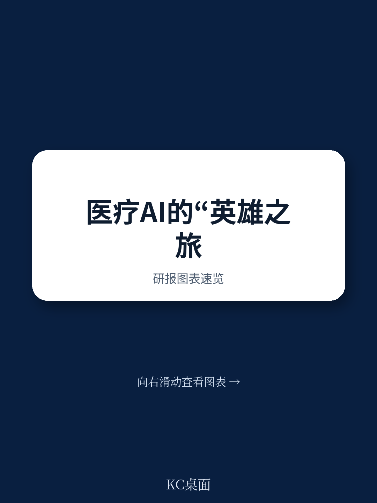
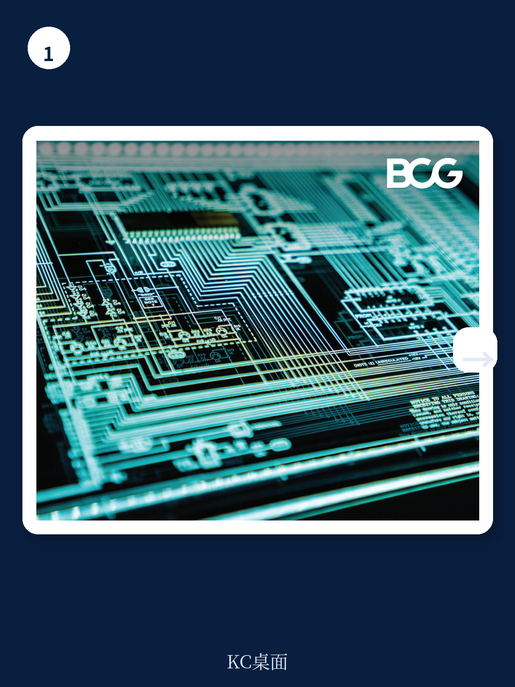
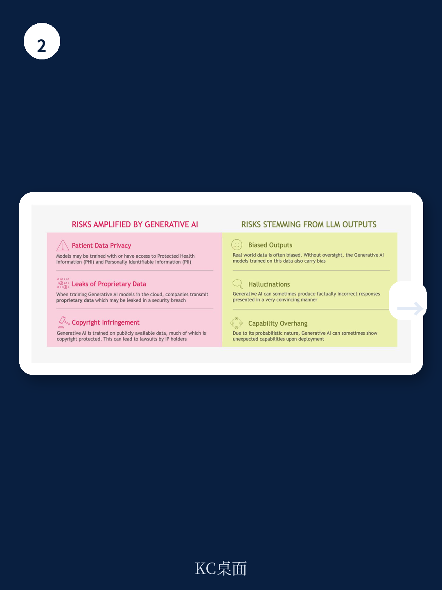

# 波士顿咨询：医疗科技公司的GenAI征途，成败取决于“责任AI”框架

当医疗科技公司争相将生成式AI嵌入从药物发现到患者监护的每一个环节时，一个被严重低估的风险正在浮出水面：监管的不确定性并非最大障碍，真正的分水岭在于企业能否在技术狂奔之前，先建立一套可执行的“负责任AI”框架。

波士顿咨询（BCG）在2023年10月发布的白皮书中，用了一个颇具文学色彩的比喻：医疗科技公司的GenAI之旅，就像英雄踏上征途，从已知世界进入未知深渊，在那里必须应对不完整且模糊的法规、潜在的法律后果、未知的网络安全威胁，以及数据隐私和版权侵权的诱惑。而最终决定这个故事是英雄史诗还是悲剧的，不是技术能力，而是企业的“道德指南针”——也就是BCG反复强调的Responsible AI (RAI) 框架。

这份报告的核心判断非常清晰：GenAI在医疗科技领域的落地，技术门槛不是最大的瓶颈，政策与治理框架的成熟度才是。那些急于推出产品、却忽视了RAI框架建设的公司，很可能在监管审查、患者安全或知识产权诉讼中遭遇重大挫折。

> **KC评论：** 这不仅仅是合规问题。BCG实际上在暗示，RAI框架将成为医疗科技公司GenAI能力的竞争壁垒。谁先建立起系统化的RAI体系，谁就能在监管博弈中占据主动权，从而获得更快的审批速度和更广的市场准入。完整报告中详细拆解了RAI框架的构建步骤和关键决策点，这些细节对于正在制定AI战略的决策者来说，是必须掌握的实操指南。

## 1. 现有风险被GenAI急剧放大，但最致命的威胁来自模型内部的“黑箱”

BCG明确指出，保护健康信息泄露、虚假声明、专有数据流出和版权侵权这些风险，在传统技术环境下同样存在。但GenAI通过大型语言模型（LLM）的内部工作机制，将这些潜在风险急剧放大，并引入了全新的威胁类型。

报告列举了四个核心风险来源：偏见输出（通常源于不充分的训练数据）、幻觉（模型自信地给出客观错误且往往荒谬的答案）、能力过度延伸（概率模型和启发式方法倾向于得出超出自然停止点的结论，导致意外结果），以及鲁棒性不足（包括假阳性和假阴性）。

更值得警惕的是AI网络攻击，尤其是针对模型训练数据的数据投毒或劫持GenAI模型本身。这意味着，维护数据隐私和保护模型训练数据将成为首要任务。任何利用患者数据和公司知识产权的算法和服务，都必须经过偏见清洗和实战测试，以防止未经授权的访问和使用。

> **KC评论：** 这里有一个关键洞察常被忽视：LLM的“能力过度延伸”意味着，即使模型在99%的情况下表现完美，那1%的意外输出在医疗场景下可能直接导致患者伤害。报告中的Exhibit 1（GenAI增加现有LLM风险）以可视化方式展示了这种风险放大效应，这张图本身就能帮助董事会快速理解为什么GenAI的风险管理不能套用传统AI框架。完整报告提供了更详细的风险分类矩阵，对每个风险类型给出了具体的缓解建议。

## 2. 监管者走钢丝：既要管理风险，又要为创新留出空间

BCG对全球监管格局的扫描显示，美国和欧盟正在以不同节奏应对GenAI带来的挑战。在美国，FDA的器械与放射卫生中心（CDRH）是GenAI医疗设备的主要监管机构，而卫生与公众服务部民权办公室则负责监督HIPAA隐私法。欧盟方面，欧洲药品管理局通过医疗器械法规（MDR）承担具体责任，但AI和GenAI的数据隐私法则嵌入在GDPR中。

最值得关注的是欧盟即将出台的《人工智能法案》。该法案提出了四层风险框架，目前将所有GenAI驱动的医疗产品定义为“高风险”，并施加了一系列市场准入前提条件、性能与合规监测设施，以及最高可达全球收入6%的巨额罚款。这些处罚将独立于GDPR的违规处罚。欧盟官员希望在2023年底前批准该法案，并要求所有成员国在20个月过渡期内实施。

美国方面，FDA领导了国际医疗器械监管机构论坛（IMDRF）的SaMD工作组，就关键定义、风险分类框架、质量管理体系以及临床试验实践方式达成共识。2019年12月的讨论文件提出了基于风险的AI/ML设备软件功能框架。国会随后授权对在预定参数范围内演进的产品使用预定变更控制计划（PCCP），使申请人能够提交其模型验证过程的方案以供FDA批准。

> **KC评论：** 欧盟《人工智能法案》的“高风险”定义和6%全球收入的罚款上限，是这篇报告最重要的政策信号。这意味着任何计划进入欧洲市场的GenAI医疗产品，都必须提前数年进行合规布局。报告中的Exhibit 2（应对现有及即将出台的法规所需的敏捷性）是一张极具价值的监管路线图，但报告没有完全展开的是：这些不同监管框架之间可能存在冲突和重叠，企业如何在不确定性中做出最优的合规路径选择？这正是完整报告中通过案例分析和决策框架回答的问题。

## 3. 低风险功能用例是积累GenAI经验的“安全路径”，但客户接触面仍面临FTC审查

BCG提供了一个务实的入场建议：功能性和商业性用例（如人力资源、IT、财务、客户服务）因风险较低，为医疗科技公司提供了积累GenAI经验的“安全路径”。但报告同时警告，涉及患者访问或客户支持的客户接触应用，仍可能受到联邦贸易委员会（FTC）的审查，因为该机构的使命是维护所有患者群体的健康公平性。

所有涉及诊断、缓解、治疗、治愈或预防疾病或其他医疗状况的GenAI用例，都直接属于FDA的管辖范围。由于CDRH尚未出台具体指南，企业可以借鉴现有的SaMD框架，并遵循一系列常识性步骤，包括：

- **预期用途**：预期用途越窄，临床试验终点越清晰。为GenAI产品加载广泛的临床声明，将创造一系列难以克服的障碍。
- **人机协同**：虽然人在回路中可以降低风险，但创新者必须说明这种互动发生的方式和场景，以及如果人类反应错误或完全没有人类反应时会发生什么。
- **可解释性与透明度**：确保模型输出透明且完全可解释，使最终用户能够将GenAI解决方案与当前标准治疗进行比较，可以降低监管门槛。
- **模型锁定与自适应**：在锁定模型上运行模拟可以让人放心，但自适应GenAI模型中的“怪癖”可能导致幻觉、能力过度延伸和不可预测的输出。监管机构需要设计评估潜在危险结果的方法，以及现场重新评估解决方案的方法。
- **数据输入**：所谓“宪法”模型将人类价值观嵌入模型中，允许更直观的用户界面和更可接受的输出。但如果新输入导致模型过时（“模型漂移”），系统的护栏和解决方案可能被改变。
- **算法变更协议**：对于随时间演进的产品，公司可以提交PCCP，允许模型在约束范围内变更。
- **边缘案例**：FDA在审批过程中可能关注所谓的“边缘案例”——在试验环境中可能不会出现、但在现场完全预期的罕见情况。人类可能识别这些特定情况，但机器可能不会，必须减轻不良后果的潜在可能。
- **上市后控制**：FDA几乎肯定会寻求政策变更，要求更严格的上市后控制措施。
- **安全设计**：GenAI模型必须从一开始就考虑安全性设计，以抵抗颠覆。

## 4. 报告尚未完全回答的关键问题：RAI框架如何从原则落地为可执行的日常操作？

BCG推荐采用集中式方法开发RAI行动手册，由CEO发起并指定一位AI领导者，组建跨职能团队。但这个框架在理论层面非常完整，在实操层面却留下了几个关键问题：

首先，RAI框架的“5-10条指导原则”如何转化为可量化的KPI？例如，“确保患者隐私”是一条原则，但如何定义“确保”的边界？在GenAI的语境下，模型可能从看似无害的对话中推断出患者的敏感信息，这种推断是否构成隐私泄露？报告没有给出明确的判断标准。

其次，业务负责人承担管理GenAI解决方案的责任，但多数业务领导者缺乏AI治理的专业知识。BCG建议由IT和合规组织提供支持，但在实际执行中，这种“业务主导、支持部门配合”的模式容易导致责任真空。谁最终为GenAI产品的失误负责？业务负责人还是技术团队？

最后，也是最关键的：GenAI模型是持续演进的，RAI框架如何应对这种动态性？报告提到了PCCP，但PCCP本身需要FDA审批，而审批周期可能远长于模型的迭代速度。这意味着，即使企业建立了RAI框架，在快速迭代的GenAI领域，合规可能永远滞后于创新。

> **KC评论：** 这些未解问题恰恰是BCG报告最有价值的部分——它没有假装给出了所有答案，而是为行业指明了下一步需要攻克的方向。对于正在制定GenAI战略的决策者来说，与其急于寻找“最佳实践”，不如先理解这些根本性挑战。完整报告在“Developing a Responsible AI Playbook”部分提供了更详细的步骤指南和模板，包括如何设计AI风险评估热力图、如何建立跨组织治理结构，以及如何将RAI原则嵌入产品开发流程。

## 5. 对读者的观察框架：从三个维度评估一家医疗科技公司的GenAI成熟度

基于BCG的分析框架，我们可以提炼出一个评估医疗科技公司GenAI能力的观察框架：

**第一维度：治理结构**。公司是否有一位明确的AI领导者？是否建立了跨职能的RAI委员会？CEO是否亲自参与并承担责任？如果AI治理只是IT部门的一个子项目，那么这家公司很可能低估了GenAI的战略重要性。

**第二维度：风险识别与缓解**。公司是否完成了系统的AI风险评估？是否识别出“安全”区域和“潜在风险”区域？是否有针对幻觉、偏见、能力过度延伸等GenAI特有风险的具体缓解措施？如果公司只关注传统网络安全风险，而忽略了模型层面的风险，那么它的GenAI之旅将非常危险。

**第三维度：合规预备度**。公司是否跟踪了美国FDA、欧盟MDR、GDPR以及即将出台的欧盟AI法案的进展？是否为产品审批准备了PCCP？是否模拟了监管审查场景？如果公司还在等待监管明确化，而不是主动构建合规框架，那么它可能错失先发优势。

这三个维度共同构成了一个“GenAI就绪指数”。在这个指数上得分高的公司，更有可能将GenAI从成本中心转化为竞争优势；得分低的公司，则可能在监管审查或患者安全事件中遭遇重大挫折。

---

这份BCG报告的核心价值，不在于它给出了一个放之四海而皆准的解决方案，而在于它提出了一个关键命题：在GenAI时代，医疗科技公司的竞争将从“谁的技术更强”转向“谁的治理更优”。那些能够将RAI框架从合规负担转化为战略资产的公司，将在这场技术变革中占据主动。

但报告也留下了一个悬而未决的问题：在监管框架仍在演进、技术快速迭代、患者安全不容妥协的多重约束下，医疗科技公司如何在“快速行动”和“负责任创新”之间找到平衡点？这个问题的答案，可能需要行业、监管机构和学术界共同探索。

如果你想深入了解BCG提出的RAI行动手册完整框架、各风险类型的详细缓解策略，以及全球主要市场的最新监管动态，欢迎加入我们的社群。每天，我们的AI agent和人工团队会从国际投行和咨询机构的最新报告中提炼精华，生成10-40页的中文摘要与解读，包含关键数据图表合集，既方便你快速把握市场动态，也便于喂给AI工具进行二次分析。在这里，我们可以继续讨论：你的公司目前处于GenAI征程的哪个阶段？RAI框架的哪个环节最让你感到棘手？
