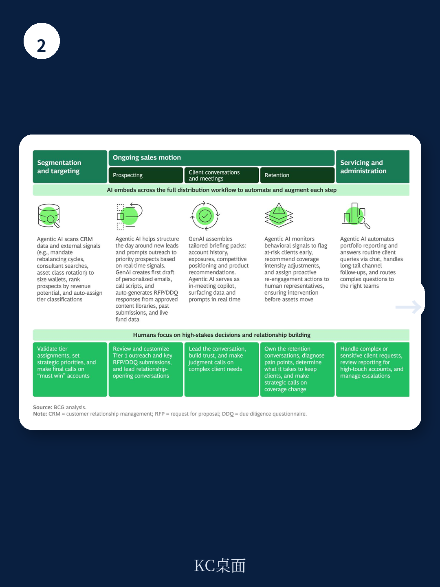

# 波士顿咨询：资管行业增长公式已失效，净流入才是新护城河

全球资产管理行业正站在一个微妙的转折点上。147万亿美元的资产管理规模，超过30%的利润率，11%的年度增长——这些数字看起来仍然健康，但波士顿咨询（BCG）最新发布的《2026年全球资产管理报告》却发出了一个与表面繁荣截然不同的信号：行业增长的核心公式已经失效。

报告的核心判断只有一个，但足够尖锐：过去十五年，市场上涨替资管公司做了大部分工作；未来，这种“搭便车”式的增长将不再可靠。超过80%的2025年收入增长来自市场升值，而非管理人的主动能力。当贝塔不再慷慨，谁还能持续捕获净流入，谁才是真正的赢家。

这份报告并非危言耸听。它用大量数据证明，资管行业的成本增速已连续多年超过收入增速，利润率在2010年的水平上原地踏步。更关键的是，资本正在重新分配——流向新的地区、新的客户群体、新的产品形态，以及新的渠道“守门人”。这些结构性变化正在改写竞争规则。

---

## 1. 这轮变化真正考验的是企业能否把规模转化为议价权

全球资管规模在十五年间增长了三倍，收入翻了一番，但利润率始终卡在30%左右。BCG的基准研究覆盖了管理着86万亿美元资产的98家头部机构，得出的结论是：收入年增5.1%，成本却以5.4%的速度更快爬升。负运营杠杆正在侵蚀每一分增量收入。

问题出在增量资金的质量上。机构端的费率以每年3%的速度下滑，被动产品和ETF持续吞噬净流入，就连主动ETF也在以低于传统产品的费率扩张。每一美元新增资产贡献的平均管理费，都在下降。

成本端同样不容乐观。投资管理本身确实存在规模效应，但技术投入正在快速膨胀——构建可扩展的AI基础设施、数据平台和数字化分销体系，这些支出正在抵消规模带来的成本优势。

> **KC评论：** 这张图的意思是，规模不再是护城河，而是入场券。过去“管得越多赚得越多”的线性逻辑正在被打破。完整报告中有一张“AuM增长与利润率脱钩”的图表，值得仔细看——它揭示了哪些环节的规模效应正在消失，哪些环节的成本是刚性的。对理解行业未来五年的利润结构至关重要。

---

## 2. 零售投资者正在成为资管行业真正的“投票人”，但他们的资金流向高度集中

BCG的数据显示，2020至2025年间，零售投资者贡献了全球资管规模增长的61%。退休金体系也在加速从固定收益型（DB）向固定缴款型（DC）转型，这意味着原本由少数机构管理的资产，正被拆解成数以百万计的个人账户。

这一变化带来的直接后果是获客成本上升、服务复杂度增加，以及对分销能力的极度依赖。在美国被动基金和ETF市场中，前十大管理人自2015年以来捕获了超过90%的净流入。头部集中度之高，几乎形成了寡头格局。

主动管理市场则呈现另一种景象：前十名管理人的净流入份额从2015年的63%降至2025年的56%，资金在更多竞争者之间分散。欧洲和亚太地区的情况类似，无论是主动还是被动，市场集中度都在下降，竞争环境正在变得更加碎片化。

私募市场则走向另一个极端。根据Preqin的数据，2024年全球前50家私募股权基金捕获了37%的募资额，而十年均值仅为22%。头部机构的募资优势正在急剧扩大。

> **KC评论：** 这三个不同市场呈现出的集中度分化，指向同一个结论：分销能力正在成为新的竞争壁垒。谁能进入渠道的“货架”，谁才能被投资者看到。完整报告对每个细分市场的集中度变化都做了详细拆解，特别是亚太地区的竞争格局演变，值得深入阅读。

---

## 3. 保险渠道是私募信贷下一个未被充分渗透的蓝海

BCG在报告中专门辟出一章讨论“私募信贷的保险机会”。对于想要规模化分销私募信贷的资管公司来说，保险公司是最具吸引力但开发程度最低的渠道之一。

保险公司在不同地区扮演的角色不同：在美国和亚洲，它们主要是机构配置者；在欧洲，它们还充当零售分销的“包装器”。公开信贷市场已经很难提供有意义的差异化，私募信贷正好填补这个空白。

许多保险公司缺乏独立大规模配置私募信贷的能力。资管公司可以通过分顾问委托、合资公司或自建平台来提供价值——带来资产获取网络、结构化专业能力和组合管理技术，而保险公司则提供种子资本、长期机构配置和共同承担的营销成本。

一旦这些平台被整合进保险公司的投资流程、资产负债管理框架和核心运营体系，就很难被替换。先发者的优势不仅在于先拿到资金，更在于成为保险公司基础设施的一部分。

但执行起来并不简单。零售客户的流动性预期与机构不同，客户分层必须严谨。任何安排都需要适应保险公司的资产负债表逻辑，包括久期匹配、风险偏好和偿付能力资本要求。

> **KC评论：** 报告对这一部分的展开非常具体，包括三种合作模式（分销型、联合设计型、战略资本合伙型）的优劣对比，以及如何设计符合保险框架的产品结构。对于关注另类资产分销的读者，这部分内容几乎是操作手册级别的参考。

---

## 4. 报告尚未完全回答的关键问题：地缘信心迁移是结构性还是周期性？

BCG报告提出了一个引人深思的观察：全球投资者正在重新评估对美国资产的配置。Natixis的调查显示，63%的全球投资者认为美国机构的政治化削弱了其投资吸引力，就连超过一半的美国投资者自己也这么认为。近半数全球投资者计划增加对欧洲、亚太和新兴亚洲的配置，而只有25%打算增加对美国资产的敞口。

但报告也坦诚指出，实际投资组合还没有反映出这种情绪变化。这究竟是结构性调整的开端，还是周期性波动的噪音，报告没有给出明确判断。

这个问题之所以关键，是因为如果地缘信心迁移是结构性的，那么全球资本流动的版图将被重新绘制。欧洲的养老金DC化改革、亚太地区的退休体系扩张、新兴市场的财富积累——这些原本被视为“边缘机会”的趋势，可能会因为美国相对吸引力的下降而加速。

但报告没有展开的是：这种迁移的触发条件是什么？需要什么样的政策或市场事件才能让“意愿”转化为“行动”？不同地区的制度障碍和流动性约束有多大？这些问题的答案，或许才是真正判断未来五年全球资管格局的关键变量。

---

## 5. 资管公司的AI转型不是锦上添花，而是决定成本曲线和客户关系的胜负手

BCG报告将“在AI优先的世界重建资管”列为三大核心议题之一。技术投入在成本结构中的占比正在上升，但这不只是关于降本增效。

AI正在改变三个层面的竞争逻辑：第一，投资管理——从因子模型到生成式AI辅助的投研、风控和组合优化；第二，运营——自动化流程、合规监控和客户服务；第三，也是最重要的，分销——AI驱动的个性化推荐、客户洞察和渠道管理。

报告指出，数字原生投资者（尤其是Gen Z）进入市场的年龄更早，30%的Gen Z在成年早期就开始投资，而婴儿潮一代只有6%。他们通过比价网站、社交媒体和YouTube获取投资信息——而这些渠道恰恰是资管行业几乎完全没有影响力的地方。

对于资管公司而言，AI不仅仅是技术工具，更是重新定义客户关系的接口。谁能通过AI嵌入数字原生投资者的决策链路，谁就能在新的分销生态中占据一席之地。

但报告也暗示，AI转型的成本和复杂度可能进一步拉大头部机构与中小机构之间的差距。这不是一个“做不做”的选择题，而是一个“怎么做以及做多快”的生存题。

---

## 6. 观察框架：用三个维度重新评估资管公司的竞争地位

基于BCG报告的分析逻辑，我们可以提炼出一个简化的观察框架，用于评估任何一家资管公司在中长期的结构性竞争力：

**第一，净流入的质量和来源。** 不要只看AUM总量或增长率，要看净流入中有多少来自主动管理能力，多少来自市场贝塔。净流入的结构——零售还是机构、被动还是主动、国内还是跨境——决定了增长的可持续性和利润率。

**第二，分销生态的嵌入深度。** 公司是否被嵌入关键的“守门人”平台？在保险渠道、退休计划、数字经纪平台和财富管理生态中，公司是以产品供应商的身份存在，还是作为平台基础设施的一部分？后者才具备真正的护城河。

**第三，技术投资的转化效率。** 公司在AI和数据基础设施上的投入，是否正在转化为更低的获客成本、更高的客户留存率、更精准的产品匹配？还是仅仅增加了成本负担？这是区分“真转型”和“伪升级”的关键。

这三个维度合在一起，才能判断一家资管公司是否真正抓住了下一轮增长的结构性机会。

---

BCG这份报告的价值，不在于它给出了多少“正确答案”，而在于它清晰地指出了哪些旧规则已经失效，哪些新变量正在浮现。地缘信心的迁移是否兑现、AI能否真正改变分销格局、保险渠道能否成为私募信贷的规模化出口——这些问题都没有确定的答案，但它们正是未来五年行业分化的关键。

如果你想深入阅读这份报告的完整版本，包括那张揭示“利润率为何原地踏步”的核心图表、私募信贷保险合作的操作框架、以及亚太和欧洲市场的详细数据拆解，欢迎加入我们的社群。每天，我们会通过AI agent配合人工review，生成国际投行和咨询机构最新研报的中文摘要与深度评论，涵盖当天最新的数据图表合集，约10-40页。既方便直接喂给AI模型辅助决策，也方便你快速把握全球市场的动态变化。这些未解问题的后续讨论，我们也会在社群中持续展开。

Personal reading notes and learning share only. Not investment advice.

