GLOBAL FINTECH 2023

# Reimagining the Future of Finance

May 2023

By Deepak Goyal, Rishi Varma, Francisco Rada, Aparna Pande, Juan Jauregui, Patrick Corelli, Saurabh Tripathi, Yann Sénant, Stefan Dab, Yashraj Erande, JungKiu Choi, Jan Koserski, and Joseph Carrubba of the Boston Consulting Group

By Nigel Morris, Frank Rotman, Matt Risley, and Sahej Suri of QED Investors

BCG + QED
INVESTORS

## Contents

02 Introduction 25 A Tale of Two Cities on Spread Businesses
04 Fintechs Have Come of Age 29 Insuretech and Wealthtec Opportunities Are Mostly in B2B2X
09 Industry Fundamentals Remain Strong
15 Fintech Revenues Are Projected to Grow Sixfold by 2030 31 The Path Toward Growth Still Carries Risks, and Requires Action
20 While Payments Led the Last Era, B2B2X and B2b Are Expected to Lead the Next 41 About the Authors

## Introduction

“Fintech” is a word that’s barely a generation old. But in that nanosecond of historical time, this amalgam of “finance” and “technology”—or, more specifically, the array of products and services that fintech companies have brought to life—has had an impact on the daily lives of billions of people.

For the past two decades, the fintech industry has been shaped by the rise and rapid adoption of transformative technologies and the applications (“apps”) they enable. A key to success during this journey has been the ability of fintechs to identify and ease the points of friction customers have often had with traditional financial institutions (FIs). Many fintechs have delivered high-quality, service-focused digital experiences, provided access to unbanked and underserved customer segments, and introduced cost-effective ways of operating through a more efficient infrastructure and simplified processes.

In order to grasp where the fintech industry is going, and to understand its importance for a very diverse set of stakeholders, it’s critical to take stock of how fintechs have evolved.

## Key Highlights

A period of great exuberance, 2020–2022 saw peak valuations for fintechs reach 20X revenue multiples.

With fundamentals remaining strong, the last 12 months have seen a necessary short-term correction in an otherwise progressively positive growth story.

Today, almost 80% of adults in the world are still either underbanked or unbanked.

Annual fintech revenues are expected to reach \$1.5 trillion by 2030—a sixfold growth—with banking-related fintechs representing a quarter of all banking valuations.

Outpacing even the US with a $27\%$ growth rate, Asia-Pacific is poised to become the world's top fintech market by 2030.

While the last era of fintech growth was led by payments, B2b and B2B2X will lead the next.

Spread businesses such as neobanks and lending platforms will face challenges in the developed world while playing a critical role in emerging markets.

The time for stakeholders to act is now: Fintechs must play offense, incumbents need to accelerate their own digital journeys, and regulators must remain proactive in maintaining a level playing field.

# Fintechs Have Come of Age

While fintechs were perceived as largely tangential to the financial services industry until about five years ago, the pandemic served as a catalyst for broad consumer adoption of digital financial services. As a result, fintechs have now become mainstream in certain segments, especially payments and transaction banking, which have been fundamentally transformed by players such as Stripe, Square, Alipay, and a few others. Some fintechs, such as PayPal in the US, Nubank in Brazil, and PayTM in India, have become household names. Today, there are roughly 32,000 fintechs globally.

Over the past decade, fintechs have attracted more than \$500 billion in funding. More recently, since 2019, they have received roughly 20% of global venture capital outlays—attracting large amounts of capital from generalist, technology private investors and hedge funds—beyond the financial services specialists who had historically funded these businesses. Such funding was fueled at times by a frenzy of speculation in sub-segments such as crypto, and its supporting technologies. Crypto accounted for more than \$50 billion in funding in 2021 and 2022 combined, or roughly 75% of all crypto funding received through 2022.

At their peak in 2021, fintechs represented roughly 9% of all financial services valuations globally, with public valuations reaching \$1.3 trillion—a multiple of 20 times annual revenue compared with the historical, pre-2018 multiple of six times annual revenue. (See Exhibit 1.) Also in 2021, the mega-fintechs PayPal and Ant Financial were among the top-10 financial services companies in the world by market capitalization.

# Exhibit 1 - In Q2 2021, Peak Valuations Reached an Inflated 20x Revenue Multiple

Q4 2017 – Q4 2022, average revenue multiples for public fintechs (simple average, market Cap/LTM revenues)

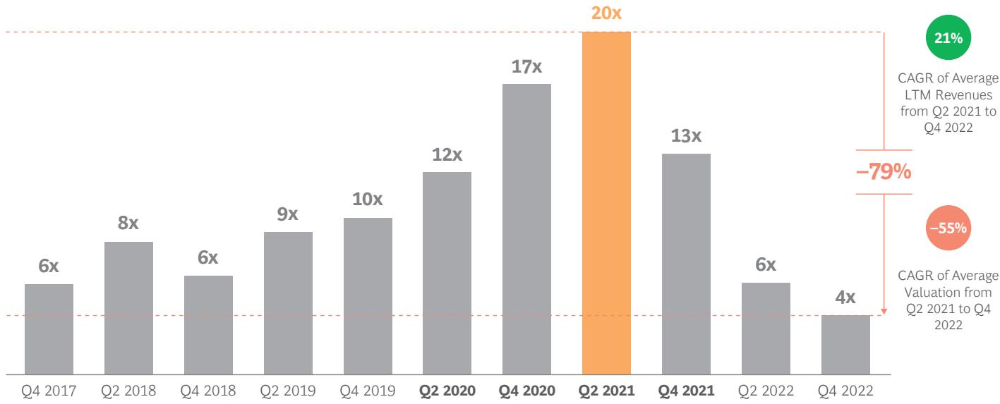  
Sources: Fintech Control Tower, Capital IQ, BCG analysis.  
Note: The Public Fintech list considers market capitalization and revenues for each quarter from 85 public fintechs from different geos and segments.

## The Last 12 Months Have Been Humbling

Since April 2022, however, fintech exuberance has been dealt a strong dose of reality, with valuations plummeting across all segments and geographies by an average of more than 60%—all while revenue growth has continued (albeit at a slower pace). New funding has decreased by 43%, with early-stage companies still seeing venture capital infusions, but later-stage companies witnessing steep drops in funding rounds. Series C+ companies have faced the toughest challenges. (See Exhibit 2.)

These dynamics have occurred owing to rising interest rates that have raised the cost of capital and essentially stopped the supply of zero-priced funding. This rise has resulted from persistent inflation, which in turn was caused by a variety of factors including geopolitical tensions, supply-chain issues, and recovery from the pandemic. The consequent shifts in the financial landscape have been felt both by fintechs and investors, and fintech CEOs are now targeting profitable growth as their top priority. (See Exhibit 3.)

Exhibit 2 - Since 2021, Funding Levels for Later Stages (Series C+) Have Dropped More Drastically Than for Earlier Stages (Seed/Series A/B)

2021–2022, Average Funding (\$B) by Stage

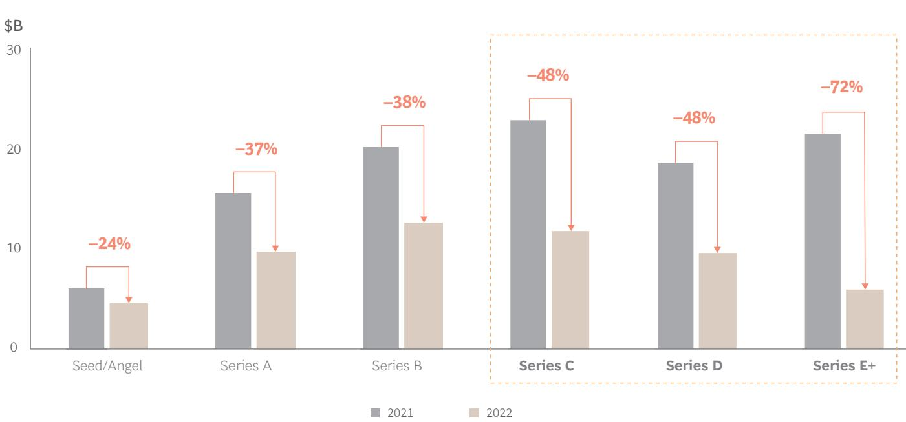  
Sources: Fintech Control Tower, BCG analysis.

## This Is a Short-Term Correction

We believe that the challenges fintechs have recently faced represent a short-term correction in an otherwise long-term growth story, as the fundamentals of the sector haven't changed. Essentially, we are witnessing a shakeout and tempering of enthusiasm for growth-stage (series B-D) companies that have unclear product and/or market fits.

Additionally, as is typical for nascent industries, profitability in fintech has not come easily—even for highly valued, conventionally “successful” late-stage companies. Of the roughly 85 public fintechs BCG analyzed across all regions and segments in 2022, less than half (45%) were profitable—despite shareholder pressure for public companies to deliver a healthy bottom line. $^{1}$

Now, however, overvaluations have become more difficult to justify without strong fundamentals—such as good unit economics, recurring revenues, patents, strong brands, and loyal customer bases. Some of this filtering is good for the industry, as weaker business models are becoming stressed and effectively being weeded out.

Currently, fintechs are employing different playbooks to survive the funding winter, with many focusing on unit economics as opposed to unbridled revenue growth at any cost. Some are raising debt to avoid down rounds. Many are also switching their focus toward the LTV (lifetime value) element of the LTV-to-CAC (customer acquisition cost) ratio as a tracked metric. Most are prioritizing longer-term sustainable revenues, monthly recurring customers, and investments in innovations that are core to their revenue-generating products and services. We expect that, by focusing on the basics, some will emerge stronger and more resilient, well-positioned to become the future leaders of the financial services industry.

## Fintech CEOs Focused on Strengthening Fundamentals and Driving Profitable Growth Over Next 12–18 Months

Top Challenges for Fintech CEOs in the next 12-18 months (selected by % of CEOs)

Top Priorities for Fintech CEOs in the next 12-18 months (selected by % of CEOs)

59%

Customer acquisition

30%

Customer acquisition

33%

40%

29%

25%

Slowdown in economic growth

34% Higher interest rates

Challenges scaling business model

Managing Costs

Product Innovation

14%

17%

27%

12%

4%

New Products

Need to reduce costs

Managing credit risk or fraud

Regulatory/Compliance

Improving
governance/compliance

12%

12%

Partnerships

Hiring/Talent

Sources: BCG/QED Future of Fintech survey (N=81), conducted across fintech CEOs and C-Suite leaders in February 2023; BCG analysis. Q. What are the top 3 challenges facing your company in the next 12–18 months? Q. What are the top actions your company is taking to address challenges over the next 12–18 months? Note: Responses collected as free-form text and then sorted into discrete categories.

Fintechs are employing different playbooks to survive the funding winter, with many focusing on unit economics as opposed to unbridled revenue growth at any cost.

# Industry Fundamentals Remain Strong

Despite the turbulent interlude, the fundamentals of the fintech industry remain sturdy for various reasons, notably that the financial services industry remains fertile ground for disruption. A number of factors are relevant.

First, the financial services industry is one of the largest and most profitable segments of the global economy, representing \$12.5 trillion in annual revenue pools and creating an estimated \$2.3 trillion in annual net profits or additional value—based on one of the highest average profit margins across all industries of 18%. (See Exhibit 4.)

Another factor is the overall customer experience in financial services (including the insurance sector) has historically been among the lowest-ranked compared with other industries. Although incumbents have made progress over the past few years, they still significantly underperform fintechs. The average customer loyalty score for the banking industry in the US stands at 23 (out of 100)—compared with some US fintechs whose scores reach as high as 90. (See Exhibit 5.)

Further, there is more than ample room for growth in the fintech sector, especially in emerging markets, given that 1.5 billion adults globally are still unbanked, with an additional 2.8 billion adults underbanked (defined as not having a credit card, using data from the World Bank Financial Inclusion Project). The total represents more than half the world's population. Moreover, almost $44\%$ of adults globally are still heavily dependent on cash for major transactions, while $89\%$ use a mobile phone or smartphone. (See Exhibit 6.)

## Exhibit 4 - Financial Services Is One of the Most Profitable Sectors of the Global Economy

Net Margin (%) by Industry, Global  
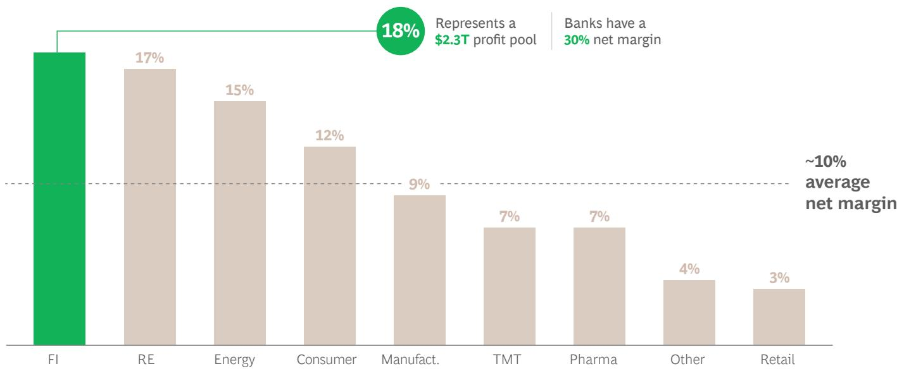  
Sources: NYU Damodaran, Federal Reserve Bank of St. Louis, BCG analysis.
Note: Others include construction, education, hospitality, air transport.

There is also still significant room for growth in digital usage in banking—currently at about 39%, compared with 98% in computer software. The figure dips as low as 17% on average for countries in the Middle East and Africa. (See Exhibit 7.)

Lastly, it is important to note that although the fintech sector is coming of age, it is still at a very early stage of development, representing less than 2% of annual financial services revenues globally—or roughly \$245 billion out of \$12.5 trillion, with ample room to grow. We think of fintech's chronological evolution in terms of phases—defined periods of time in which one or more trends came to the fore.

Phase One: Digital Disruption (1998–2008). With the increasing availability and adoption of internet-enabled devices, financial services went digital for the first time. This challenged the legacy systems of national and regional FIs. Digital offered greater convenience and accessibility to consumers, eliminating pain points. Online banking, lending, and e-commerce (notably through marketplaces such as

Amazon and eBay) gradually became mainstream. Online payments, with players such as PayPal leading the charge, emerged as the largest area of innovation, disrupting the transaction-banking industry. Digital lenders, such as Capital One, led a wave of innovation in lending using data and analytics.

## Phase Two: Mobile and Social Adoption (2009–2014).

Following the 2008 financial crisis, amid new regulatory scrutiny and shifting consumer behaviors, the “wait-and-see” perspective of incumbent banks opened the door for fintechs. A credit boom and rapid innovation in mobile and cloud allowed consumers to access financial services in real time, spurring the hypergrowth of disruptive players. An intentional focus on user experience/user interface (UX/UI) and the introduction of APIs eliminated many points of friction during both the onboarding process and, later, the customer’s digital journey. Social media and data analytics began to play a key role, allowing companies to gather granular information. Fintech success grew by providing digital-first solutions with a high degree of personalization.

## Exhibit 5 - Customer Experience Across Value Chains Is Relatively Poor for Incumbent Financial Institutions

Customer loyalty scores aggregates, major U.S. financial institutions

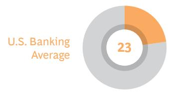

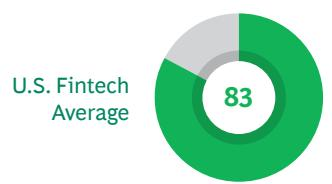  
Customer loyalty scores, Major Fintechs with U.S. Operations

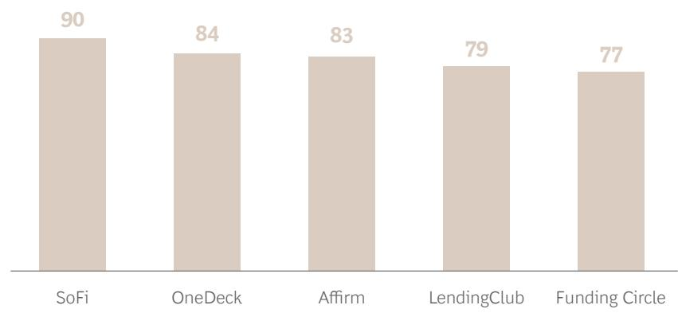  
Sources: Forrester - The US Net Promoter Rankings, 2022/Customer Gauge Benchmarks in Financial Services 2022.

Phase Three: Relevance and Scale (2015–2021). The fintech industry grew rapidly alongside smartphone adoption, with a step-function acceleration during the COVID-19 pandemic. Consumers now expect all financial services to be available online 24/7. Fintechs such as Ant Financial, Nubank, PayTM, Square, Stripe, and some neobanks became household names in the evolving landscape. Fintechs grew, owing to expanded customer access to financial services, new demand-generation channels, updated UX/UI, and reduced costs. Fintech funding surged to \$440 billion between 2014 and 2022. Amid a low-interest-rate climate and easy availability of capital, valuations spiked, as did the number of companies and amount of talent in the industry. The sector experienced increased competition for market share and a flurry of mergers and acquisitions (M&A) activity.

Phase Four: Looking Ahead (2022 and Beyond). We foresee a more proactive regulatory environment paving the way for supportive infrastructure investments (e.g., digital public goods) and unlocking innovation in parts of the world that are still seeking to expand financial inclusion. Moreover, the stage is set for new technological disruptions such as generative AI and DLT, which are already making their presence felt. Despite tall challenges, fintech CEOs remain optimistic in the long term. (See Exhibit 8.)

## New Technologies Are Emerging, but Their Impact Has Yet to Play Out

Multiple innovative technologies, some of which touch the realm of the futuristic, are either entering the fintech arena for the first time or strengthening a nascent presence. Their impact will likely be felt not only by all types of financial services players—which must get a firm handle on their capabilities to optimally leverage their potential use cases—but by society at large. Among these technologies are generative AI; API-based open connectivity; DLT; quantum and edge computing; and embedded-hardware Internet of Things (IoT) and biometrics.

% of unbanked and underbanked adults across major global regions

# Exhibit 6 - Over Three-Quarters of Adults Remain Unbanked or Underbanked Globally

<table><tr><td></td><td>Unbanked</td><td>Underbanked</td><td></td><td>Unbanked adults (M)</td><td>Underbanked adults (M)</td><td>Cash Usage (%)</td><td>Mobile Penetration (%)</td></tr><tr><td></td><td>27%</td><td>50%</td><td>World</td><td>1,546</td><td>2,829</td><td>44%</td><td>89%</td></tr><tr><td></td><td>5%</td><td>27%</td><td>North America</td><td>15</td><td>83</td><td>21%</td><td>93%</td></tr><tr><td></td><td>8%</td><td>52%</td><td>Europe</td><td>54</td><td>357</td><td>23%</td><td>96%</td></tr><tr><td></td><td>25%</td><td>55%</td><td>APAC</td><td>820</td><td>1,787</td><td>59%</td><td>85%</td></tr><tr><td></td><td>35%</td><td>42%</td><td>LATAM</td><td>164</td><td>199</td><td>60%</td><td>87%</td></tr><tr><td></td><td>52%</td><td>43%</td><td>MEA</td><td>493</td><td>403</td><td>58%</td><td>83%</td></tr></table>

Source: World Bank Financial Inclusion Project.  
Note: “Underbanked” defined as % of adults without a credit card; mobile penetration defined as % of adults who own a mobile phone; cash usage defined as % of adults who made a utility payments using cash only.

\*Generative AI. This new frontier in artificial intelligence has created a step change in the human-digital interface that is natural-language based. It not only provides high-level customer service, but also will aid incumbents by helping them leapfrog their own technical constraints. For instance, Stripe is already using GPT-4's enterprise beta to carry out operational tasks such as streamlining UX, triaging customer issues, and combating fraud. In the future, generative AI will facilitate so-called digital financial concierges, which will complete tasks such as paying bills, sending remittances, checking budgets, disputing charges, and the like—in lieu of human interaction. Generative AI can also be used to simulate cyberattacks and generate decoy data that will help train models to protect FIs. This technology will enable the hyper-personalization of financial products and services, analyze vast swaths of data to identify patterns, and facilitate human decision-making. It will also bring significant efficiencies to customer-service and administrative centers in labor-intensive industries such as insurance and wealth management.

\*API-Based Open Connectivity. Open banking 2.0 has the potential to create seamless modular access and permit the standardization of interfaces for banks, corporates, and governments. Such entities will be able to plug in through APIs to gather customer data, access and provide advanced financial services, and facilitate collaboration between FIs worldwide. APIs could also be used to amass data from various unrelated sources such as social media, news, and personal devices to create highly accurate risk assessments for use in credit underwriting, fraud detection, credit scoring, insurance underwriting, and the like.

\* Distributed Ledger Technology. As a global blockchain-based infrastructure, DLT can be used to create a worldwide transactional and settlement platform using stablecoins—akin to an alternative payments network. The platform is predicted to be fast, inexpensive, transparent, borderless, and secure, thus eliminating the need for intermediaries and reducing the time and cost of settling payments. DLT also offers a secure, tamper-proof, global identity-verification system that protects the privacy of the

# Exhibit 7 - There Is High Potential to Increase Digital Banking Adoption, Especially in Emerging Markets

2021, Share of Digital Engagement by Category $^{1}$

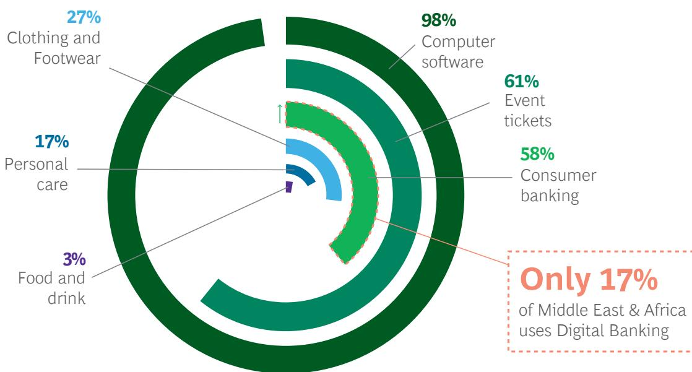  
Sources: Forrester Research, World Bank, BCG analysis.  
Note: Consumer banking estimated as the % of adults that used a mobile phone or the internet to check their bank account balance. $^{1}$ Forrester's 2021 US online retail forecast.

individual while also facilitating Know Your Customer (KYC) authentication. This technology supports the creation of a decentralized supply chain platform that enables businesses to obtain financing more efficiently through a shared ledger of transactions that reduces the risk of fraud. A key unlock is the tokenization of complex, real asset classes (including regulated digital currencies). Moreover, self-executing (smart) contracts can verify and execute the terms of an agreement between a buyer and a seller. Finally, Central Bank Digital Currencies (CBDCs), on top of DLT, can provide a standardized and interoperable digital currency that can be used across different countries and currencies. CBDCs can thus help blaze a trail for real-time settlement infrastructure that enables instant account-to-account (A2A) and cross-border payments.

\*Quantum and Edge Computing. The unprecedented power and speed capability of the qubit—or quantum bit, the smallest unit of information in a quantum computer, existing in a superposition of two states (1 and 0), and settling on one state or the other only when a measurement of the state is made in order to retrieve the output of the computation—will enable quantum computing to solve extremely complex problems in a fraction of a second, benefiting portfolio selection, asset allocation, and overall business optimization programs. Other use cases include ultra-sophisticated underwriting, anti-money-laundering

initiatives, anti-fraud neural nets in real time, synthesis of massive amounts of global data, and the development of next-gen encryption and financial cybersecurity technologies. BCG estimates that such technology could ultimately bring roughly \$70 billion in annual, additional operating income to the global banking industry.

\*Embedded-Hardware IoT and Biometrics. The Internet of Things—networking capability that allows information to be sent to and received from objects and devices such as fixtures and kitchen appliances using the internet—can be used to develop highly personalized financial products such as energy-efficient mortgages and home insurance. Similarly, advanced smartwatches can monitor health statistics, with the resulting behavioral changes by users leveraged to tailor health insurance policies down to the risk of specific diseases. IoT devices can also be used to trigger automatic financial transactions, which can be especially practical if combined with smart contracts. Another use case is facial recognition, which is already being deployed at scale in some countries—for example in supermarkets, where the software is plugged into consumers’ bank and credit card details at checkout counters.

Nonetheless, taking all of the above into consideration, how is the fintech sector likely to evolve in the remaining part of Phase Four and beyond?

EXHIBIT 8/SURVEY .02

## Fintech CEOs Wary in the Short Term, Optimistic in the Longer Term, as Fundamentals Remain Strong

All Segments

Payments

Accounts/neo-banking

Lending

Insurance

Wealth & Investments

Infrastructure/Regtech

>10% below average

12 month optimism outlook

World NAMR LATAM EUR APAC

5–10% below average

3 year optimism outlook
World NAMR LATAM EUR APAC

Average +/- 5%

5–10% above average

>10% above average

Sources: BCG/QED Future of Fintech survey (N=81), conducted across fintech CEOs and C-Suite leaders in February 2023; BCG analysis. Q. How optimistic are you about the future prospects of your company in the next 12 months? Q. How optimistic are you about the future prospects of your company in the next 3 years?

# Fintech Revenues Are Projected to Grow Sixfold by 2030

Currently, the global \$12.5 trillion financial services industry is concentrated in North America and APAC, with a relatively even split between banking and insurance. By 2030, global banking and insurance revenue pools are expected to reach \$21.9 trillion, a 6% compound annual growth rate (CAGR). Payments and deposits are expected to be the fastest-growing segments, with APAC and Latin America seeing the most expansion. (See Exhibits 9.)

Fintechs are forecast to represent a meaningful and expanding element of this growth. Despite the short-term correction we have witnessed, annual fintech revenues are projected to grow more than sixfold from 2021 to 2030 to reach \$1.5 trillion. $^{2}$ (See Exhibit 10.) Banking fintechs' revenues—lending, deposits, payments, and trading and investments—are projected to grow from 4% to 13% penetration (at a 22% CAGR) of banking revenue pools by 2030, and are expected to represent one-fourth of global banking valuations. Insuretechs are projected to grow from a 0.3% to 2% market penetration (a 27% CAGR) of insurance revenue pools.

However, the shape of this expansion will play out differently both by geography and by segment.

## Exhibit 9 - Global Financial Services Revenues Will Reach \$22 Trillion by 2030, With a Relatively Even Split Between Banking and Insurance

Global Financial Services Revenues (\$T), split by Banking and Insurance, 2021 to 2030

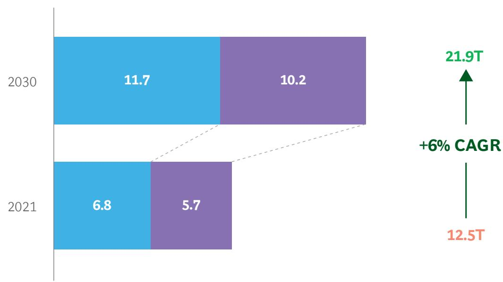  
Sources: BCG banking and insurance revenue pools, BCG analysis.

## Asia-Pacific Is Projected to Be the Largest Fintech Market by 2030

The drivers shaping the fintech space have performed differently across regions over the past 20 years—leading to diverging levels of maturity—determined mainly by differences in available funding pools, sources of talent, local regulatory postures, and technology adoption. Each region is therefore in a different chapter of the overall fintech journey, with various stakeholders seeking to find creative solutions to pain points in their own domains—or to localize and implement approaches that have proved successful elsewhere. Innovation typically plays out with a marquee firm in one geography developing and adopting a new disruptive model, followed by the emergence of replications in other regions that generally insert local variants.

Historically underpenetrated, Asia-Pacific will rise. (See Exhibit 11) APAC, historically an underpenetrated market with strong incumbents and large revenue pools (nearly \$4 trillion), is poised to outpace the US and become the world's top fintech market by 2030, a projected CAGR of 27%. This growth will be driven primarily by local champions in emerging APAC that will solve access issues, thus facilitating financial inclusion. Separating emerging APAC (e.g., China, India, and Indonesia) from developed APAC (e.g., Japan and South Korea), most growth is expected to come from the former, as it has the largest fintechs, voluminous underbanked populations, a high number of SMEs, and a rising tech-savvy youth and middle class.

China and India, with active fintech markets, have an opportunity to leapfrog the intermediate stages of fintech development more-developed financial markets have undergone, especially if they can benefit from supportive regulation. Before COVID-19, two of the top-10 tech companies in the world by market value, Tencent and Alibaba, were based on the east coast of China. Furthermore, the majority of fintech revenues in the APAC region currently originate in China, so we expect that the country will remain a regional leader in the years to come. We believe that established fintech giants will continue to dominate domestic markets—in which they are already leaders in innovations such as so-called superapps—and we expect to see many new local champions emerge.

India is undergoing major fintech activity with the emergence of local champions such as PayTM and Razorpay. There is a clear opportunity in the country for fintechs to provide financial-services access to India's 190 million unbanked adults, especially as smartphones are ubiquitous while bank accounts are not. The Indian regulator is taking an active role in shaping the market through such vehicles as UPI, Aadhar, Rupay, and Digilocker. We expect major fintech revenue growth in India to be spurred by expanding GDP (a CAGR of $7\%$ per year), the rise of the educated middle class, younger demographics coming of age, and increasing fintech penetration. Further areas of growth will be in lending, neobanking, and wealthtech.

# Exhibit 10 - Annual Fintech Revenues Will Grow SixFold to Reach \$1.5 Trillion by 2030, Heavily Skewed Toward Banking Segments

Global Fintech Revenues (\$B), split by Banking and Insurance

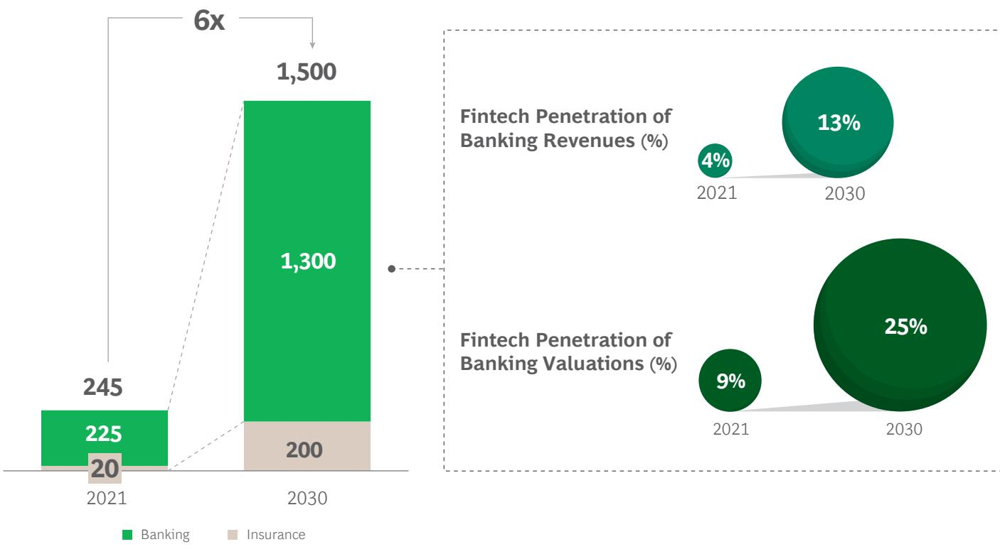  
Sources: Capital IQ, Pitchbook, Company's investor presentations, desktop research, BCG analysis.

North America will continue to be a critical fintech market and innovation hub. Led by the United States, North America currently has the world's largest financial-services industry, with an annual revenue pool of nearly \$5 trillion, and possesses the most mature innovation ecosystem in terms of venture capital firms, entrepreneurs, talent pools, universities, and access to funding. The US will account for a projected 32% of global fintech revenue growth (a CAGR of 17%) through 2030, supported largely by the proliferation of B2B2X and B2b businesses, the expansion by monoline fintechs into additional products and services, and the country's interchange pool. This pool, which weighs in at anywhere from five times to more than 17 times that of EU markets on a per-transaction basis, allows fintechs to serve the low end of the market, which is relatively underbanked by larger incumbents. Furthermore, although the US has the most mature ecosystem, open banking has yet to play out, and there are significant inefficiencies and customer-experience pain points in the financial services industry that will spur ongoing innovation.

Europe will grow, supported by regional expansion. The UK and European Union combined represent the world's third-largest FI market and are expected to witness major fintech growth through 2030, estimated at more than fivefold over 2021 and led by the payments sector. This FI market is dominated by incumbent banks and contains relatively low fintech penetration (1% of financial services revenues). Regulators are relatively forward-looking, for example, with open banking, open finance, and passporting. This regional fintech sector is projected to post a revenue CAGR of $21\%$ in the runup to 2030, bolstered by continued growth across so-called payment-plus (ecosystems of value-added services on top of traditional payments infrastructure), embedded-finance, and B2b players. Additionally, open banking is expected to foster the creation of new products and services, further contributing to the sector's growth.

Exhibit 11 - Asia-Pacific Will Be the Largest Fintech Market by 2030, and Latin America and Africa Will Be the Fastest-Growing Regions

Global Fintech Revenue Growth by Region, 2021 to 2030

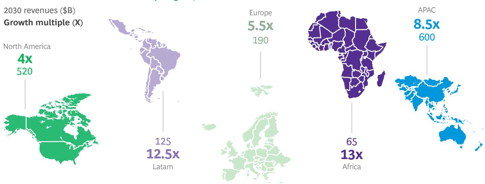  
Sources: Capital IQ, Pitchbook, Company's investor presentations, desktop research, BCG analysis.

## Latin America will see accelerated fintech penetration.

Similarly, Latin American markets, led by Brazil and Mexico, which have established fintech landscapes, are projected to show a revenue CAGR of 29% over the same time frame. These countries have attracted interest from institutional investors and witnessed rising adoption of advanced technologies across industries. Innovation growth is expected to accelerate, as an inflow of native professionals trained and employed abroad have returned home to build up the local fintech ecosystem. Government action in facilitating fast retail payment systems and digitization is continuing in the region.

Brazil's fintech space is growing rapidly with the emergence of players such as Nubank and Creditas. The regulator is one of the most forward-looking in developing markets, as witnessed by sandbox creation, the PIX instant-payment system, and the 2018 setup of nonbank “payment institution” licenses. We expect embedded finance and digital payments to surge, backed by strong expansion in retail e-commerce (up by 36% in 2022).

Africa and the Middle East can leapfrog incumbents by adopting new technologies. In Africa, although cash is still king, fintech could be a vehicle to solve the access issue, as most of the population is still either underserved by banks or fully unbanked. As the youngest and fastest-growing region globally—with a median age of roughly 19 and projected population growth of an additional 1.2 billion people by 2050—demographic shifts and earning-power increases will deepen the need for financial access. We expect some degree of leapfrogging in technology, particularly when it comes to cashless payments. In Nigeria, 73% of adults have a smartphone, but a mere 2% have credit cards.

Accordingly, most Africans' first interaction with the financial services sector may be through their smartphones—presenting major fintech opportunities in payments and lending for regional champions with full-stack attacker models. Historically, telco-fintech players, such as M-Pesa, developed by Vodafone's subsidiary Safaricom, have led much of the segment's growth in the region. Such players are expected to maintain their major role, alongside grassroots fintechs. We project a fintech revenue CAGR of 32% until 2030, with South Africa, Nigeria, Egypt, and Kenya being the key markets.

## Three Models to Engender Internationalization

Looking ahead, in a global sense, we expect a geographic expansion of fintech ideas to develop mainly through three models: the emergence of local champions, the rise of multinational fintechs, and the expanding role of big techs.

The Emergence of Local Champions. Segments and markets with onerous regulatory constraints or high capital requirements will be fertile ground for the emergence of local champions, some of which will attempt to replicate successful models from geographies where fintech has reached a more advanced stage of development. One example is ClearScore, which built a successful model like that of Credit Karma, but tailored it to the UK market. Other players will build ideas from the ground up. All fintechs will be subject to local parameters—such as local health care laws for insurance companies and local guidelines concerning banking licenses—but will feature more homegrown innovation.

The Rise of Multinational Fintechs. Few fintechs, PayPal being one, have managed to successfully build a multinational business. But this status quo is poised to change within some subsegments, such as KYC/AML (Anti-Money Laundering), cross-border payments, wealthtech, and the like. This is especially true for fintechs in the B2B2X space, a nascent but expanding business model in which multiple businesses combine to blend their expertise and savoir faire to construct products and services aimed at a targeted customer base. Multinational fintechs will likely evolve across countries that possess similar economic profiles and consumer needs. Typically, a J curve is encountered when trying to enter a new geography, as a similar consumer base means less need to tailor products to a new customer base or to learn local customer-acquisition methods. One large merchant acquirer tried to enter the Indian market, but ultimately withdrew owing to regulatory challenges and fierce local competition. The same player then succeeded in Canada and the UK.

Big-Tech Expanding Its Footprint. Big techs such as Google, Meta, Tencent, Apple, Ant Group, and Amazon are looking to further integrate financial-services apps (especially in low-regulation segments such as payments) into their offerings through local partnerships, and eventually bring them out globally. Indeed, big tech is already active in the financial-services ecosystem, such as in payments and lending to SMEs. This handful of very powerful companies, by virtue of their ubiquity, massive customers bases, and depth of customer data, are well-positioned to bring fintech-related offerings to their trusting, global audiences. They will advance either in the form of customer-facing superapps—a somewhat problematic scenario, owing to government scrutiny of potential antitrust issues—or by providing analytics to incumbents from the vast consumer datasets they possess. We have seen recent breakthroughs in this direction, such as Brazil’s central bank permitting Meta’s WhatsApp to include a payments offering for SMEs.

# While Payments Led the Last Era, B2B2X and B2b Are Expected to Lead the Next

The first part of the fintech journey was led by payments, representing 40% of all fintech revenue in 2021. Since 2000, payments fintechs have accounted for roughly 25% of cumulative equity funding (\$120 billion). Yet, this is still a story with significant room to grow, especially in promising sub-segments such as those addressed below. Overall, payments will remain the largest fintech segment in 2030. (See Exhibit 12.)

Cross-Border Payments. Each year, over \$20 trillion is moved across countries by large corporations, incurring \$120 billion in transaction costs, according to a report by JP Morgan and Oliver Wyman. The market is as large as it is complex. For instance, international remittances involve large-scale physical cash management, multiple currencies, and several FIs. While the SWIFT and Visa/Mastercard legacy systems have proven robust and reliable, it’s nonetheless important to continue exploring new and innovative payments infrastructures that can expand access, reduce costs and complexity, and enhance security. Cross-border remittance businesses such as Remitly, Wise, and Xoom have increased access to international money transfers.

As globalization advances further, the need for better cross-border payment solutions will increase. It’s also wise to build redundancies into the system for occasions when main payments “rails” encounter problems. DLT, once proven fully viable, could significantly disrupt this space. Blockchain companies such as Ripple, via its RippleNet payment network, are already working on partnerships with various FIs and payments providers around the world to facilitate real-time, cross-border payments. (See Spotlight #1.)

Real-Time Payments. Real-time payments (RTPs), through which a wire transfer is credited to the recipient's account in a matter of seconds, is another growth area. The use of RTPs in the US surged by $42\%$ in 2020 and will be further supported by FedNow, an instant payment service being developed by the Federal Reserve. A similar platform, called Target Instant Payment Settlement (TIPS), is being implemented in the European Union. In Asia, the People's Bank of China launched its RTP system in 2010, and it has become the most widely used payment method in the country. Other successful RTP infrastructure examples include India's UPI and Brazil's Pix.

## SPOTLIGHT #1

## Wise

Wise was founded in 2010 in the UK $^{3}$ with the goal of making international money transfers more affordable and accessible. Today, the company has operations in 170 countries, supports 50 currencies, and serves more than 5 million individuals and 300,000 SMEs in a profitable way. Wise has thrived against incumbents supported by the success of startups such as PayPal, which helped build public trust in online payments.

Wise offers a faster, cheaper, and more convenient alternative to traditional banking standards for individuals and SMEs to move money internationally. Roughly 90% of transfers are handled within 24 hours, with 50% of them instant—compared with two to five business days through traditional channels. The average fee is 0.64% compared with the standard 3%.

Wise has found better ways to serve its customers by expanding its portfolio to include multi-currency accounts, debit cards, and business accounts. Such value adds increase usage of their core product and help individuals and SMEs manage their money, which ultimately creates more loyalty. Its partnerships with FIs, especially involving payroll and HR platforms, have lent it credibility and expanded its reach.

Global Fintech Revenue Growth by Segment, 2021 to 2030
2030 Revenues (\$B)

# Exhibit 12 - Payments Will Remain the Largest Fintech Segment in 2030

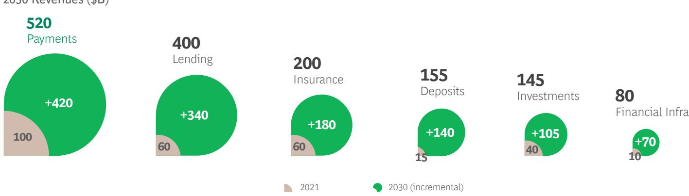  
Sources: Capital IQ, Pitchbook, Company's investor presentations, desktop research, BCG analysis.

A2A RTPs, facilitated by infrastructure enhancements, will lead to a surge in data collection from consumers and SMEs, creating a treasure trove of data that can be used to personalize next-gen credit models and provide even better financial services. As consumers transact more online and directly with each other, reliable RTPs will become ubiquitous.
(See Spotlight #2.)

Payment-Plus. Furthermore, in the so-called Payment-Plus model, payments processors are uniquely positioned to leverage two-sided marketplaces to deliver a flywheel effect, offering omnichannel services. Payments companies can therefore onboard consumers to additional value-added or subscription-based services such as billing and invoicing, tax automation, revenue recognition, and Banking as a Service (BaaS)—involving treasury capabilities, card issuing, and business financing. This model can virtually create a mini-superapp ecosystem of financial services.

## B2B2X Is Expected to Power the Next Phase of Growth

B2B2X comprises B2B2C (enabling other players to better serve consumers), B2B2B (enabling other players to better serve businesses), and financial infrastructure players. The latter provide customer-segment-agnostic technology solutions that support the operations of FIs or enable the delivery of financial services.

With many banks unable to innovate at a rapid pace—owing to such hindrances as unwieldy legacy processes and systems, a lack of appropriate talent, and competing internal priorities for tech funding—fintechs have an opportunity to fill the gap and enable incumbents to compete more efficiently. Incumbent C-suites will focus on bending the cost curve, as lower economic growth will exert pressure to cut costs. Enabler fintechs can focus on providing value as specialists meeting needs that incumbents are unable to address by themselves. The model of fintechs collaborating with incumbents, rather than competing with them—addressed in a previous BCG/QED white paper—translates into lower risk for investors and therefore a greater willingness to invest. B2B2X already represents a fast-growing segment, and there is still room for it to spread its wings. The market is expected to grow at a 25% CAGR to reach \$440 billion in annual revenues by 2030. (See Exhibit 13.) There are many areas in which B2B2X fintechs can play a major role, such as the below.

Embedded Finance. Embedded finance will see promising new use cases in adjacent industries such as transportation and healthcare, and in leveraging new hardware innovation linked to the Internet of Things. Biometric authentication methods such as facial scanning may become more widespread in order to safeguard transactions and data. Point-of-sale-embedded lending, embedded insurance, and similar offerings will also find wider adoption, leading to an increase in cross-sell rates. Uber, for instance, already provides a range of services to drivers and couriers within its app, including a debit card, cashback rewards, and real-time earnings tracking. The role of fintechs will become more prominent than ever to enable such use cases.

Financial Infrastructure. Infrastructure “as-a-service” companies that work across segments—especially in areas such as cybersecurity, customer acquisition, lead generation, underwriting, KYC, UX, data and analytics, and risk management—will become more prominent and will enable a variety of use cases among both fintechs and incumbents. One caveat is that emerging markets may continue to lean toward attacker models because incumbents have yet to be disrupted to the same extent as more-mature markets, and have not begun to invest heavily in IT.

## SPOTLIGHT #2

## Razorpay

Founded in 2014 in India $^{4}$ , Razorpay started as a payment-gateway aggregator aimed at helping businesses accept online payments through multiple channels. Like many other payment players, Razorpay expanded its offering to include a broader range of financial services including current accounts, payouts, business loans, and payroll services, among others. Today, Razorpay serves more than 8 million merchants and processes 80 billion in total payment volume per year.

Razorpay has become one of India's most valuable fintechs by providing a seamless, user-friendly experience for merchants and users. It has accomplished this by building a platform designed to easily integrate with e-commerce platforms, accounting software, and point-of-sale systems. The company has also introduced innovative features that adapt to the needs of the Indian market—including UPI payments and digital wallets—allowing it to differentiate itself. Razorpay has further executed inorganic opportunities (seven acquisitions to date) to improve its operations, expand its product portfolio, strengthen its value proposition, and grow internationally.

## Exhibit 13 - B2B2x and B2b Will Be the Fastest Growing End Customers

Global Fintech Revenue Growth by Space, 2021 to 2030
Growth multiple (X)

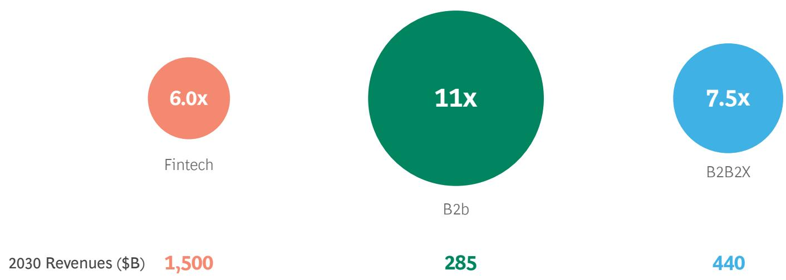  
Sources: Capital IQ, Pitchbook, company's investor presentations, desktop research, BCG analysis.

Reinventing Value Chains. Mortgage-tech companies provide a clear example of value chain disruption. Over the past decade, we have seen a proliferation of improved customer and employee experiences in the mortgage-origination process. But the cost per loan (\~\$10,000) and the cycle time from application to close (45 days) have not changed. With the current mortgage-industry downturn, there will be increasing pressure to find high-quality leads in a highly competitive market. The goals will be to finally reduce the cost and cycle time per loan, automate decision-making, ensure effective and efficient compliance in a (slightly more) distressed environment, and diversify away from being totally dependent on home financing as a revenue source. New emerging companies such as TrustEngine, Indecomm, Valligent, and Brace are attempting to solve these points of friction. In addition, companies addressing large issues around home affordability and climate risk will find significant opportunity over the next decade.

## B2b Is Projected to Be the Next Massive Space to Be Disrupted

B2b, or the segment of fintechs that caters to SMEs, represents an enormous space for growth, as SMEs are an underserved segment that accounts for close to 70% of jobs and GDP globally, according to the World Economic Forum. B2b fintech revenues are projected to grow at a 32% CAGR to become a \$285 billion market by 2030. There are roughly 32 million SMEs in the US, 63 million in India, and 40 million in Nigeria—with more than 400 million in total globally. In Africa, SMEs provide over 80% of all jobs across the continent.

It goes without saying that SMEs need basic credit for day-to-day cash-flow management and capital investments. Yet, many are credit starved. In the EU, for example, roughly 20% of SMEs report that access to financing is their most urgent concern. The pandemic forced legions of SMEs to either reduce worker hours or resort to layoffs. Although the Pay-check Protection Program in the US helped these companies manage short-term liquidity, over 30% of SMEs globally closed during the pandemic. In any financial crisis, SMEs are among the first to face bank crackdowns on credit lines.

The potential for fintechs with SMEs is vast, especially in areas such as payments and lending. It can be more lucrative to serve SMEs than individuals, as the sizes of the loans are larger, the scale is broader, and there is typically more information available that enables visibility into their full financial picture. According to the International Finance Corporation, unmet financial credit needs for the world's SMEs total over \$5 trillion annually.

Currently, winning in B2b occurs primarily through independent software vendors (ISVs), especially in the US and other developed economies. Fintechs are becoming embedded “as-a-service”—an offering within ISVs that addresses the needs of a particular industry, customer type, or use case. One example is Toast, which provides accounting software to the restaurant industry.

The goal for fintechs is to become vertical champions, utilizing additional distribution channels, opening new revenue streams, and providing end-to-end customer journeys. The number of European payment service providers (PSPs) plugging into ISVs has recently been growing at a CAGR of 86%, even during the fintech winter, and certain fintechs are becoming industry specialists themselves for new customer niches.

# A Tale of Two Cities on Spread Businesses

Spread businesses earn a profit by exploiting the difference between the fees or interest charged for financial products and what they are charged for enabling the transaction. These businesses include banks or neobanks, lending platforms, mortgage lenders, and credit unions. The spread size varies based on market conditions, a borrower's creditworthiness, and the type of financial product or loan offered.

In developed markets, neobanks will be challenged—and will need access to lower-cost funds by potentially acquiring bank licenses. Neobanks in developed markets face several challenges in scaling up profitably. One significant challenge is the narrowing gap in customer experience between themselves and incumbent banks, as the latter are investing heavily in technology to improve their customer experience and value chains, making it difficult for neobanks to differentiate themselves. For instance, J.P. Morgan announced in 2022 that it would increase its technology budget to \$12 billion (out of which it spent \$9.4 billion on non-compensation technology operating expenses), focusing primarily on the implementation of new digital products and services, infrastructure modernization, and digital transformation of existing processes. (See Exhibit 14.)

## Exhibit 14 - Large Banks Realize the Importance of Investing in Tech, as IT Spend (as % of Opex) for Some Is at Par with Major Fintechs

IT spend in 2022 (as % of operating costs), major banks, big-tech and fintechs

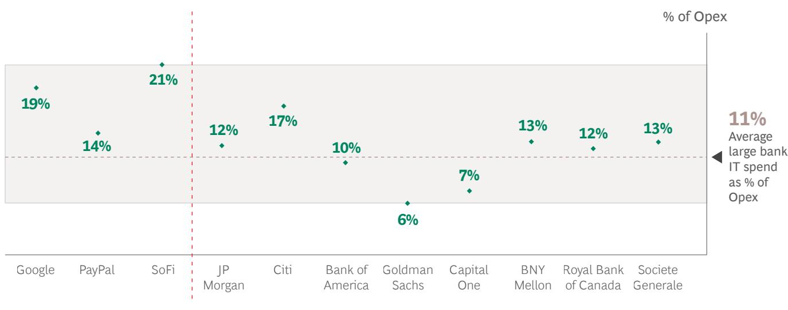  
Range of displayed IT Spend (as % of Opex) values

Source: 2022 company annual reports.

Another challenge is neobanks are typically attracting lower-LTV customers with their “no fees” or “lower fees” value propositions, which are harder to monetize and require a significant volume of transactions and customers in order to generate profits.

Neobanks in the US have benefited from the regulatory arbitrage from the 2011 Durbin Amendment, which imposes an interchange cap on debit-card transactions for banks with assets over \$10 billion. As a result, many neobanks, including Chime and Current, have partnered with sponsor banks (each with assets under \$10 billion) for deposits and other banking services. However, this model is not scalable, as it requires expensive, indefinite partnerships with sponsor banks, which earn a percentage of the spreads and profits over time. Furthermore, a payments-only revenue model adopted by some neobanks is a low-margin business with intense competition. According to BCG's Fintech Control Tower, a mere 5% of over 450 global digital challenger banks were profitable in 2022. (See Exhibit 15.)

Thus, to build a sustainable and profitable business model, neobanks will eventually need to begin lending on their own balance sheets to earn additional interest income and generate reasonable profits. To do this, they need to find a reliable, low-cost source of deposits. One pathway, as neobanks such as SoFi have found, is to acquire a banking license and, with it, a complete balance sheet. Some neobanks across many geographies have already taken this step.

In emerging markets, neobanks are critical for expanding access. Neobanks will fare much better in emerging markets, as these businesses play a key role in expanding financial access. As previously mentioned, there are roughly 2.8 billion underbanked adults in the world (50% of which reside in emerging economies), and an additional 1.5 billion are unbanked (75% of which reside in emerging economies). Furthermore, incumbents in emerging markets have not yet been disrupted and do not offer accessible products that cater to most of their populations. In some emerging markets, regulators are supportive, viewing neobanks as partners that provide a solution for financial inclusion and accelerate their moves toward cashless economies. (See Spotlight #3.)

## SPOTLIGHT #3

## Nubank

Founded in 2013 in Brazil $^{5}$ , Nubank started as a no-fee credit card provider but has expanded to a variety of new customer-centric financial offerings—such as easy-to-use mobile banking, personal loans, and insurance. At the end of 2022, Nubank had 75 million customers (up 38% year-on-year) across Brazil, Mexico, and Colombia; 4.8 billion in annual revenues—making it the largest neo-bank in the world—and a 35% ROE (vs. a 13% average for traditional banks in the US).

Benefiting from both an environment with few strong incumbents and a large population not served by traditional banks, Nubank eliminated a major customer pain point by offering a completely fee-free credit card with no hidden charges. It also doubled down on its beachhead products—prioritizing the Nu Account, which has a cross-sell rate of 85%, and no-fee credit cards, with a cross-sell rate of 55%—and gained market superiority before expanding into further offerings and geographies. Investing heavily in technology, Nubank pursued a completely consumer-centric approach, focusing on a great customer experience, convenience, reliability, and transparency.

Exhibit 15 - In 2022, Only 20 Out of 453 Digital Challenger Banks Were Profitable, 11 of Which Are in Asia-Pacific

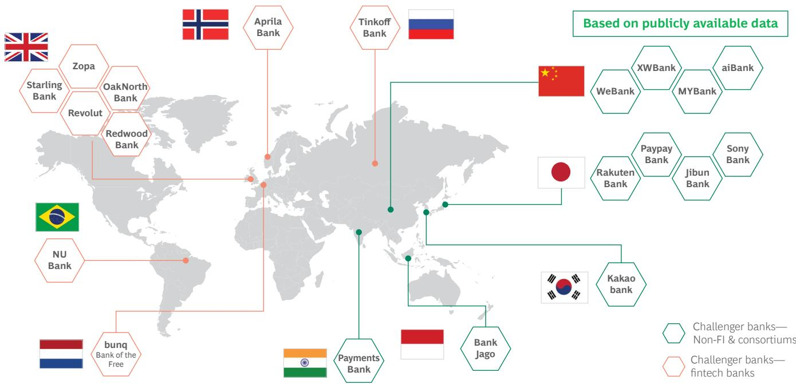  
Source: BCG Fintech Control Tower.

Similarly, lending platforms will need to move toward owning banking licenses. Over the past few years, various lending platforms such as BNPL, student lending, and unsecured lending have performed well, owing to near-zero interest rates. These platforms typically fund themselves through securitization of assets or issuing commercial paper, which works well when interest rates are low. However, as interest rates have risen, it has

become increasingly expensive for them to secure funding, which is not a sustainable business model. One way for these lending platforms to secure a reliable source of low-cost funding is to own or acquire a banking license. We have seen examples of this trend, such as Lending Club's acquisition of a smaller bank with a banking license.

# Insuretech and Wealthtech Opportunities Are Mostly in B2B2X

The global insurance industry is massive, earning \$7 trillion in revenues in 2021, and is projected to grow to \$11.6 trillion by 2030. However, despite huge revenue pools and relatively poor customer service, fintech penetration in the industry, or so-called “insuretech,” represents a miniscule portion, at 0.3%. The insuretech opportunity is focused mainly around property and casualty (P&C) insurance, and is mostly in B2B2X.

The largest window is in P&C. Of the three main sub-segments of insurance—life, P&C, and health—the largest window for fintechs lies within P&C, as these products are mostly bought by individuals, have a shorter duration of purchase, and have a higher frequency of policies (e.g., in home rental and auto). By contrast, life insurance is the most difficult to penetrate, as durations can last more than 30 years, while health insurance is typically bought by employers rather than by the individual.

Limited Opportunity as a Disrupter. The insurance industry is complex, with high regulatory granularity that varies from country to country (and at times state to state, as in the US and Australia). It has a lower level of profitability than the banking industry does. Such conditions make scaling full-stack disrupter models challenging, owing to frequent changes and a disintermediated value chain. Underwriting income is minimal, particularly if the goal is to become a distributor, with investment income being the dominant revenue stream. This revenue model is capital intensive and less open to the rise of tech-led disruptors.

Enabling Incumbents to Be Leaner, and Reducing Time to Market. Perhaps the most significant opportunities in the insurance industry are in tech enablement of human processes and judgment, IoT, and AI for better underwriting and claims and distribution through brokerages. Examples include Reserv, a data intelligence-based claims platform, and Newfront, a modern insurance brokerage platform. Insuretech segment revenues are expected to grow at a 27% CAGR to reach \$200 billion in 2030, with a projected 2% penetration.

## In Wealthtech, Targeting B2B2X Provides Some Opportunity

So-called wealthtech innovation began with robo-advisors (e.g., Betterment) pursuing mass-market segments, in a sense democratizing investing for a set of consumers not served before by incumbents. The second phase of innovation was built on value-added services such as trading and cryptocurrencies offered by companies such as Robinhood. However, the addressable market for wealthtech disrupters is limited, generally catering to the mass-market segment. Moving up the value chain to the mass-affluent space (up to \$3.5 million in net worth) is a possibility, but it is still a small market, since most global wealth is concentrated in high-net-worth (HNW) and ultra-high-net-worth (UHNW) individuals and organizations.

Moving up the ladder into the mass-affluent HNW and UHNW segments will remain extremely difficult. These segments are heavily dependent on human trust and advice as well as the need for access to illiquid products and alternatives such as lending on invested capital. They also represent most of all wealth (90% in the US), but consist of a relatively small group of individuals (20% of households in the US), making these segments challenging to access through traditional customer acquisition methods. Furthermore, these markets are dominated by large incumbents with well-oiled, branding-driven distribution networks. In this arena, completely digital interfaces have not matched the human element of trust and judgment required for larger investments. Those B2B2X players that provide innovative, comprehensive, technical, or analytical tools such as AdvisorEngine (acquired by Franklin Templeton in 2020) and serve scaled businesses catering to mass-affluent segments, will see the most growth.

# The Path Toward Growth Still Carries Risks, and Requires Action

Significant risks and uncertainties remain, especially concerning regulation, data privacy, competition from big tech, and interest-rate volatility.

First, the lack of comprehensive regulation and oversight in the fintech industry, to varying degrees by industry and region, can lead to trust uncertainty among customers and prospects, which in turn can result in a low adoption rate for fintech solutions. For example, the fall from grace of the cryptocurrency exchange FTX due to a lack of liquidity and mismanagement of funds—unconstrained by regulatory oversight—has had far-reaching consequences for the crypto industry, eroding consumer confidence in the entire segment in the short term.

At the same time, the ecosystem must find a balance, as potential regulatory overreach can also hinder growth and innovation, with rigid regulations leading to higher costs, slower approvals, and reduced investment. For instance, some have criticized the European Union's MiFID II directives—intended to improve transparency and accountability—as overly burdensome, particularly on smaller financial firms.

Fintechs also face reputational risks, which can stem from different factors. One such risk is related to data breaches and the mishandling of sensitive data. Fintechs that collect large amounts of sensitive data in an unregulated manner are at a higher risk of data breaches, which can result in severe and long-lasting reputational harm, causing a loss of customer trust and loyalty, and potentially leading to legal consequences.

Moreover, the entry of big-tech companies into the fintech industry can drive prices down and eliminate competition, creating a monopolistic environment that negatively impacts smaller fintech startups, overall innovation, and consumers. Combining this dynamic with a higher interest rate environment that can pressure funding and therefore stifle innovation creates a tall set of challenges. Fintech startups may struggle to compete with traditional FIs that have access to cheaper funding sources.

Ultimately, however, the fintech future is bright provided that all stakeholders heed the call to action and collaborate effectively and cooperatively for the greater good. There are essentially four groups of stakeholders in the fintech universe: regulators, fintechs themselves, incumbents, and investors. The growth and success of the fintech sector will depend largely on how these four stakeholders are able to work together for the long-term benefit of the global financial services sector and the billions of customers it serves.

## Regulators: Time to Be Proactive, Not Indifferent

Until only recently, regulation of fintechs has for the most part been relatively light, non-proactive, fragmented, and, in some cases, lagging behind—which in many cases has worked to the advantage of fintechs. But the future growth of fintech will require regulators to act with urgency and thoughtfulness in a more holistic way.

Currently, regulators are often just “reacting” to the latest predicament. The recent series of bank crises (e.g., SVB and Crédit Suisse), along with massive financial frauds (e.g., Wirecard and FTX), have made regulators more sensitive to asset/liability management. However, while creating guardrails, they must also take care not to overregulate the industry and stifle innovation.

In cases where regulators have truly been forward-thinking, the result has often been a positive event for fintechs (e.g., PSD2 in Europe, so-called Fintech Law licenses in Mexico, fintech sandboxes in Brazil, and UPI in India). It’s important to note that regulators have typically taken an active role in addressing the most basic B2C banking services, because direct customer funds are at stake.

To encourage future growth, regulators will need to lead from the front proactively to develop and enforce policies that protect consumers but do not stifle innovation. One example is open banking, where Europe is the leader. (See Spotlight #4.) Transferring information from one FI to another needs to be easier in order for the ecosystem to become more efficient and gain the ability to access the data needed for all financial products, including areas such as account opening and KYC. This will happen in one of two ways: by regulatory push, or by innovating into a use case that truly unlocks the value of open banking. Experience shows that open baking unbundles the value chain, spurring innovation and more choices for customers. India, Australia, and Brazil are also strong in open banking, especially in the payments arena.

Regulators should also encourage faster payments, both domestic and cross-border, and more-rapid settlement. Countries with faster payments infrastructures have seen considerable innovation in money movement. Furthermore, issuing additional licenses—or at least providing a roadmap for fintechs with clear requirements for obtaining a banking license—in countries around the world can help bank-adjacent companies fully integrate into the financial-services ecosystem. In certain situations, regulators could create (or distribute more) payment-institution licenses (similar to the e-money license in the UK), which place a lower burden of regulatory scrutiny on fintechs but provide them with the relevant benefits.

In addition, regulators must create guardrails and regulate breakthrough areas such as crypto and DLT. Clear data-privacy and storage guidelines (similar to the General Data Protection Regulation, or GDPR, guidelines in Europe) are becoming more and more necessary worldwide in order to protect consumers and fintechs alike.

Investing in Digital Public Infrastructure (DPI). Banking is a prime example of an industry that requires a sturdy infrastructure to enable market participants to interact. This is not a new idea, as SWIFT, along with the Visa and Mastercard networks, have enabled banks to transact with each other and with merchants, governments, and consumers for decades.

Yet, the rise of new technologies has created a need for next-gen infrastructure that can facilitate complex transactions in a more digital world. With the rise of open banking, such infrastructure will enable FIs and other players to share data and services securely and transparently, resulting in greater innovation and improved customer experience. Building such so-called digital public goods or DPI will thus become essential for creating a level playing field that enables all relevant stakeholders, both large and small, to interact seamlessly.

DPI specifically refers to technological infrastructure systems that facilitate the delivery of essential services and benefits to the general public, including digital ID and verification, digital payment rails (for transactions and money transfers), digital data exchange, and digital access to information systems (across sectors such as healthcare and financial services). DPI can reduce costs for all stakeholders in the ecosystem, enable innovative, industry-specific applications to be integrated, and promote economic expansion. The concept of DPI has been instrumental for rapid growth in emerging economies such as Singapore, India, and Estonia, and is often enabled through strong public-private partnerships. (See Spotlight #5.)

SPOTLIGHT #4

## Open Banking in the UK via the OBIE Standards

The UK's Open Banking Implementation Entity (OBIE) was established in 2017 by a consortium of the nine largest banks in the country. Its inception made the UK a global leader in open banking, which currently enables more than half the UK's small businesses and more than 7 million individuals to make over 1 billion successful API calls per month.

Open Banking (OB) in the UK has witnessed a significant growth since its inception, reaching \$50 billion in total purchase value in 2022, mainly boosted by a regulator's decision to roll it out as a payment method. This was made possible by the government's partnership with EcoSpend—the world's first embedded open banking system—which allows consumers to make A2A “pay-by-bank-account” instant payments. Pay-by-bank-account has also been seamlessly integrated into government payments, including PAYE, corporation tax, capital gains tax, and the like. The UK currently serves as a testbed for the benefits of OB, and UK businesses have seen that it not only is faster and safer, but also significantly reduces transaction costs for key market players (e.g., merchants).

SPOTLIGHT #5

## India Stack

India Stack is a forward-looking collection of digital technologies set up by the national government as part of a public-private partnership between the Reserve Bank of India and a consortium of banks that is aimed at supporting the digitization of the Indian financial system. This comprises:

\- The identity layer, providing a unique digital identity to every Indian citizen through the Aadhaar system and enabling KYC for banking services and biometric and e-sign capabilities via its Aadhar credentials.

\- The payments layer, including UPI for real-time and P2P/P2M payments, and the Aadhaar Enabled Payment System for biometric-based payments.

\- The data layer, which allows individuals to share their data with others in a secure and controlled manner. The account aggregator framework is set to democratize financial services with a robust data-sharing mechanism with consumer consent.

More than 1.3 billion Indians are enrolled in Aadhar, which is the largest biometric identity system in the world. UPI has over 150 million active monthly users (2021) and processed \$1.25 trillion in transactions in FY 2021–2022. It is still growing fast, processing 7.5 billion transactions in February 2023 (compared with roughly 230 million credit-card transactions in the same month), up 66% from 4.5 billion a year earlier.

One of the key success factors for UPI was the enablement of private innovation in the app layer demonstrated by India Stack starter app BHIM. Most people utilize one (or multiple) third-party apps that plug into the UPI API, resulting in an ecosystem of entities offering value-added services centered around UPI (tech giants such as Google Pay, embedded payments in apps such as Uber, local street vendors, and the like). The government intends to expand the reach of India Stack to more areas of the economy such as healthcare, education, and agriculture, replicating the UPI model of private innovation within systemic supervision.

In addition, a partnership with Singapore's PayNow enables instant transfers between the two countries, opening the door for future partnerships. Other countries are already working toward emulating the system (FedNow in the US is similar, but less capable).

The combination of digital identity, an API-enabled payments network allowing for real-time settlements, and access to innovators to build use cases is a powerful solve in almost all geographies. Different markets are taking different approaches to this end state, depending on their starting point and degree of regulatory activism. For example, the US has largely been market led and is therefore the furthest away from enabling this combination. However, the value of this infrastructure is also highest in large markets where cash is still dominant, such as Indonesia and South Africa.

Also in the US, systems such as The Clearing House's RTP and FedNow enable financial institutions to provide more-efficient payment services to businesses and individuals. Additional opportunity lies in the development of an open interface layer on top of these systems—one that can enable many innovative applications and use cases to bypass the adoption network effects currently necessitated by closed systems. Financial institutions, merchants, data providers, and consumer applications could all plug into and benefit from such a combined infrastructure and thereby improve efficiency, lower costs, and unlock new use cases.

## Fintechs: Tighten Belts in the Short Term, But Seize the Moment to Play Offense

The short-term agenda is obvious: it’s not about growth at any cost, and unit economics matter. Many fintechs were fortunate enough to attract higher funding under the bluer skies of 2021 and early 2022, but they now need to conserve cash and stretch their runways, retrenching to get through the funding winter without the need to raise money at lower valuations or risk running out of cash.

In order to conserve cash, fintechs can take several actions. First, they should focus on their core business and avoid any non-core projects. This will help them allocate their resources more effectively and prioritize their spending. Fintechs should also consider resizing their organizations to the minimum needed. Fintechs should price their products and services for value, ensuring that customers are willing to pay for the quality they receive. (See Spotlight #6.) Lastly, they should optimize their LTV-CAC (ratio of customer Lifetime Value to Customer Acquisition Cost) by focusing on acquiring customers who are likely to stay with them in the long term and generate higher revenue.

However, as BCG research shows, downturns are also the time for market leaders to widen the gap between themselves and the rest of the field. As the late Formula One driver Ayrton Senna famously once said, “You cannot overtake 15 cars in sunny weather… but you can when it’s raining.” Therefore, playing thoughtful offense is critically important. Fintechs should consider strengthening their competitive moats and pursuing aggressive strategies such as talent acquisition, gaining market share by entering new geographies/markets, and exploring M&A opportunities while valuations are more reasonable. There are several examples of fintechs that have successfully expanded during crises, including PayPal, which emerged as a winner post the dotcom bubble.

We also believe that fintechs should not avoid regulation, but rather take an active role in shaping it. Embracing forward-looking regulations can enhance customer confidence and drive higher valuations for fintechs. Furthermore, fintechs should prioritize Compliance by Design internally to prepare for successful partnerships with established FIs. There are three factors to consider: end-to-end use case compliance, organizational accountability, and tech stack/data lake compliance. Indeed, fintechs need to create a compliant operating model from the outset, define end-to-end value streams, build cross-functional delivery teams, streamline and continuously monitor processes, and foster risk/return dialog across the entire organization.

Finally, the basics matter, such as product-to-market fit. Fintechs without a clear thesis are now getting weeded out. They must realize that, fundamentally, it is important to have a “product-to-solve-pain-point” mindset first and foremost, as well as a critical feature set, a reliable go-to-market strategy, and a rising LTV-CAC ratio. New initiatives should be customer led and capable of solving a true “point of friction”—otherwise they simply won’t succeed.

## Incumbents: Accelerate Digital Journeys by Embracing Fintechs

Incumbents, by and large, find it difficult to be disruptive innovators. They are often held back by a lack of appropriate talent, conservative internal processes, and almost no tolerance for failure, which are essential ingredients for disruptive innovation. They are also often burdened by massive tech debt. Smaller local and regional banks are truly at a disadvantage because they cannot keep up with the investments required for innovation.

However, embracing fintechs as sources of capability can serve as a win-win for both, and be a highly effective way for incumbents to shorten their time and cost to market, sometimes by a factor of three or even five. Historically, incumbents have tried to buy these capabilities by acquiring fintechs. While there have been some examples of successful integrations, these are more the exception than the rule. Incumbents such as J.P. Morgan and Fifth Third, and early fintechs such as Visa and Mastercard, have strong track records of creating value via fintech acquisitions.

SPOTLIGHT #6

## Pricing Strategy Matters: A Leading Mortgage-Tech Player

A leading mortgage info services player switched from one-time, transaction-based fees to a subscription pricing model, targeting government agencies, lenders/servicers, and other market participants. BCG designed a monthly subscription pricing model, projected billing outcomes, and conducted sensitivity testing, identifying benefits for both the client and its users. The successful transition to a subscription pricing model resulted in a shift toward recurring revenues, which are valued at higher multiples.

The failure of most fintech acquisitions by incumbents can be attributed to various reasons. One of the most common is a cultural mismatch between the incumbent and fintech. Slow decision-making owing to conservative policies and deep hierarchies within incumbents could lead to major dissatisfaction at the pace of innovation. Often, acquirers face difficulties retaining top talent due to traditional compensation structures that do not incentivize risk-taking. Additionally, the companies could face significant integration challenges due to lack of modular, API-based incumbent tech stacks. Thus, if the incumbent decides to acquire a fintech, it is prudent to “ring-fence” such acquisitions and allow them to retain their autonomy, distinctive culture, and entrepreneurial spirit.

In our view, the most practical route is for incumbents and fintechs to move toward what we call “Value-based Partnerships,” which allow the fintech to remain independent but with a clear commercial arrangement that is to the benefit of both partners. However, two elements are critical to invest in now to ensure that future partnerships work: incumbents must move toward a modular, API-based technology architecture; and fintechs must embrace Compliance by Design, minimizing the future need for retroactive or reactive compliance measures that can be costly and disruptive. (See Exhibits 16 and 17) (See Spotlight #7.)

## Investors: To Play Long or Short?

As we have discussed, fintech is a long-term growth story. The fintech winter is just one season, and a sunnier spring and summer should follow. The correction the sector has undergone indicates that valuations are more reasonable. With many quality middle-stage companies in need of capital, some investors are choosing to invest given the current environment. This is also a time to support and remain committed to existing investments that have clear product-market fits.

Venture capital firms also need to help their portfolio companies tighten their belts and become more professionalized, and to pursue long-term competitive moats over short-term vitality. At the same time, it’s important for VC and private equity firms to help and encourage their portfolio companies to be proactive and play offense. This includes enabling their portfolio fintechs to prioritize investments that drive long-term value, and leveraging the fact that there will be great talent-acquisition opportunities—allowing winners to solidify their lead by taking advantage of these opportunities..

We are in the early stages of a 25-year (or longer) growth journey. There will be some potholes and unexpected turns and twists in the road. But fasten your seatbelts, as the fintech revolution is just gathering speed.

SPOTLIGHT #7

## A Partnership Success Story: Treasury Prime (a BaaS Fintech)

Treasury Prime (TP) is a major BaaS platform serving different stakeholders, including banks, business, and fintechs. Using TP's products, banking partners have seen a $5\%$ to $10\%$ increase in deposits within the first 12 to 18 months of the partnership going into effect, without changing any systems or processes. Treasury Prime sets up value-based partnerships across the following three operational pillars:

\- Commercial. TP ensures that there is full alignment with the client on the objective and scope of the agreement. The parties agree on value distribution in principle at the beginning, encouraging fast expansion as opportunities arise.

\- Organizational. TP contractually requires partners to make an ongoing commitment through the partnership, which includes identifying an empowered partnership team and developing a clear RACI model in concert with the partner, with senior leaders approving from both sides. TP staffs a dedicated implementation team, including project manager, engineering resources, and relationship lead, and defines clear ownership guidelines (i.e., TP handles the software, but the bank must be responsible for all banking and compliance processes).

\- Technical. TP's goal is to require zero technical resources from the partner bank. Its systems interact with core providers' existing APIs via a detailed integration plan, clear service-level agreement (SLA) guidelines, and regular reviews by both partners.

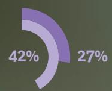

## Fintech CEOs, Especially B2B2X, Value Partnerships for Customer Acquisition and Product Improvement

Importance of partnerships as indicated by Fintech CEOs, on a scale of 1–10; by segment

Top reasons to enter into a partnership (selected by % of B2X and B2B2X Fintech CEOs)

Overall

7.8

Customer acquisition or service

42%

59%

7.7 B2X

8.1 B2B2X

55%

41%

39%

55%

7.8 Payments

7.9 Lending

Enhance existing products

New product innovation

7.6 Insurtech

27%

5.8 Wealthtech

42%

32%

27%

7.9 Infrastructure

Technology or data services

User experience

B2X

B2B2X

## Fintech CEOs Are Unsatisfied with Current Partnerships Due to Partner Companies' Tech Stack, Organizational Preparedness

Loyalty scores for partnerships and preparedness of themselves vs. partners

Selected areas of least preparedness of partner companies (by % of CEOs)

Your company's partnerships

The preparedness of the partner company

2

The preparedness of your company

Technology stack

Organizational structure

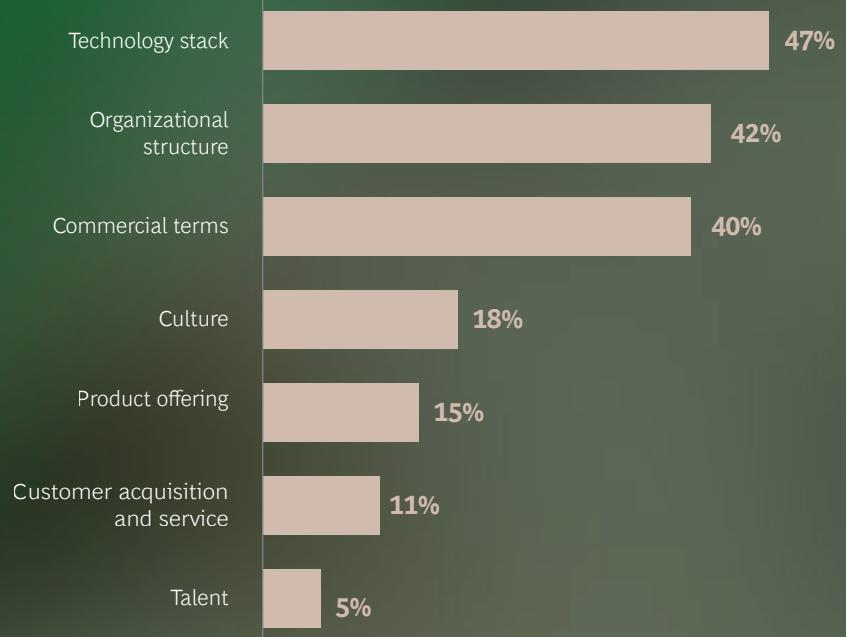

Commercial terms

Culture

Product offering

Customer acquisition and service

Talent

Source: BCG/QED Future of Fintech survey (N-55), conducted across fintech CEOs and C-Suite leaders in February 2023; BCG analysis. $^{1}$ Loyalty scores are calculated as the % of promoters (rated >/=8 on a 10-point scale) minus the % of detractors (rated >/=6 on a 10-point scale). Q. Thinking about your company's most recent material partnerships, please rate the following on a scale of 1–10: How satisfied are you with your company's partnerships? How prepared was your company to enter these partnerships? How prepared was the other company to enter these partnerships?

## About the Authors

## BCG

Deepak Goyal, Goyal.Deepak@bcg.com, Managing Director and Senior Partner, NYC

Rishi Varma, Varma.Rishi@bcg.com, Managing Director and Partner, NJY

Francisco Rada, Rada.Francisco@bcg.com, Project Leader, NYC

Aparna Pande, Pande.Aparna@bcg.com, Consultant, NYC

Juan Jauregui, Jauregui.Juan@bcg.com, Consultant, NYC

Patrick Corelli, Corelli.Patrick@bcg.com, Consultant, NYC

## QED Investors

Nigel Morris, Nigel@qedinvestors.com, Co-founder and Managing Partner

Frank Rotman, Frank@qedinvestors.com, Co-founder, Partner, and CIO

## For Further Contact

If you would like to discuss this report, please contact the authors.

Saurabh Tripathi, Tripathi.Saurabh@bcg.com, Managing Director and Senior Partner, MUM

Yann Sénant, Senant.Yann@bcg.com, Managing Director and Senior Partner, PAR

Stefan Dab, Dab.Stefan@bcg.com,
Managing Director and Senior Partner, BRU

Yashraj Erande, Erande.Yashraj@bcg.com, Managing Director and Partner, MUM

JungKiu Choi, Choi.JungKiu@bcg.com, Managing Director and Partner, SIN

Jan Koserski, Koserski.Jan@bcg.com, Managing Director and Partner, FRA

Joseph Carrubba, Carrubba.Joseph@bcg.com, Managing Director and Partner, NY

Matt Risley, Matt@qedinvestors.com, Partner

Sahej Suri, Sahej@qedinvestors.com, Chief of Staff

## Acknowledgments

This report is a joint initiative of Boston Consulting Group (BCG) and QED Investors (QED). The authors would like to thank the members of BCG and QED for their contributions to the development and production of the report. In addition, the authors are extremely grateful to all Fintech survey, 1-on-1 discussion, and panel discussion participants for their valuable contributions toward the enrichment of the report.

Furthermore, the authors extend their sincere appreciation to Gbenga Ajayi, Tommy Blanchard, Laura Bock, Bill Cillufo, Adams Conrad, Amias Gerety, Christian Limon, Ashley Marshall, Lauren Morton, Tim O'Shea, Yusuf Ozdalga, Mike Packer, and Sandeep Patil, from the QED team for their contributions to enriching the report.

The authors would also like to thank their BCG colleagues for their valuable contributions to this report. In particular, they thank Inderpreet Batra, Harsha Chandra Shekar, Aaron Cormier, Boris Goutkin, Evan Hunter, Micah Jindal, Rahel Lebefromm, Marshall Lux, Michael Marcus, Reihan Nadarajah, Kamila Rakhimova, Hanjo Seibert, Steven Thogmartin, and Michael Zhang, the numerous local analysts from the Financial Institutions Knowledge Team, the Banking and Insurance Revenue Pools team, the Fintech Control Tower team, the Data & Research Services, and the editorial, PR, marketing, and design teams.

## BCG

Boston Consulting Group partners with leaders in business and society to tackle their most important challenges and capture their greatest opportunities. BCG was the pioneer in business strategy when it was founded in 1963. Today, we work closely with clients to embrace a transformational approach aimed at benefiting all stakeholders—empowering organizations to grow, build sustainable competitive advantage, and drive positive societal impact.

Our diverse, global teams bring deep industry and functional expertise and a range of perspectives that question the status quo and spark change. BCG delivers solutions through leading-edge management consulting, technology and design, and corporate and digital ventures. We work in a uniquely collaborative model across the firm and throughout all levels of the client organization, fueled by the goal of helping our clients thrive and enabling them to make the world a better place.

## QED INVESTORS

QED Investors is a global leading venture capital firm based in Alexandria, Va. Founded by Nigel Morris and Frank Rotman in 2007, QED is focused on investing in disruptive financial services companies worldwide. QED is dedicated to building great businesses and uses a unique, hands-on approach that leverages its partners' decades of entrepreneurial and operational experience, helping companies achieve breakthrough growth. QED has invested in more than 200 companies, including 28 unicorns, across 18 countries. Notable investments include AvidXchange, Betterfly, Bitso, Caribou, ClearScore, Current, Creditas, Credit Karma, Flywire, Greensky, Kavak, Klarna, Konfio, Loft, Mission Lane, Nubank, QuintoAndar, Remitly, SoFi, Wagestream, and Wayflyer.

