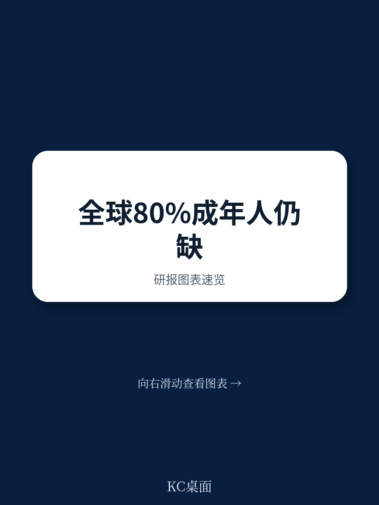
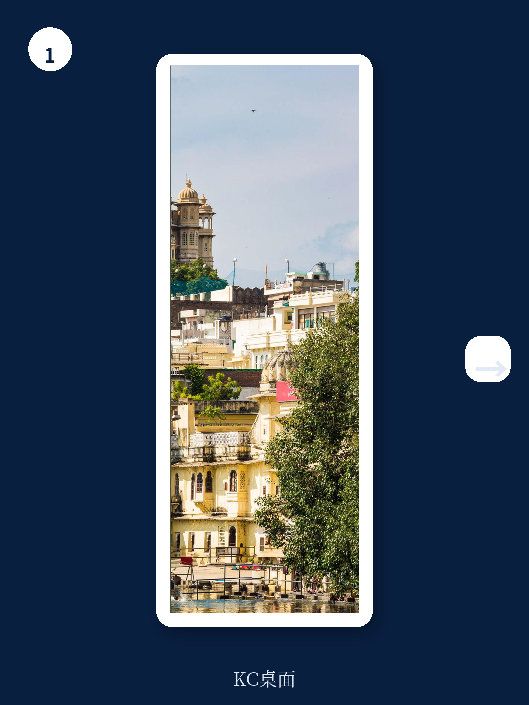

# 波士顿咨询：金融科技没有泡沫，只有一场必要的出清

2021年，一家公开上市的金融科技公司，估值可以达到其年收入的20倍。今天，这个数字跌到了6倍以下。超过60%的市值在不到两年内蒸发，后期融资骤降43%，CEO们的头号议题从“增长”变成了“盈利”。

如果你只看这些新闻标题，很容易得出一个结论：金融科技泡沫破了。

但波士顿咨询（BCG）与QED Investors联合发布的这份《Global Fintech 2023》报告，给出了一个截然不同的判断。报告的核心主张是：**金融科技行业的基本面没有变差，2022年以来的估值回调是一次必要的短期出清，而非长期趋势的逆转。** 支撑这一判断的，不是对未来的乐观想象，而是对行业收入池、客户渗透率、以及技术渗透阶段的结构性测算。

这份报告值得细读，不仅因为它来自全球最顶级的咨询机构之一，更因为它提供了一个在恐慌中保持冷静的分析框架。以下是我们从报告中提炼出的五个核心洞察。

> **KC评论：** 这篇报告发布在2023年5月，当时市场情绪正处于低谷。BCG的判断之所以值得重视，不是因为它喊“抄底”，而是因为它用数据和逻辑回答了“为什么金融科技的长期价值没有消失”。完整报告里有大量分区域、分赛道的收入预测和估值模型，这些图表是判断具体赛道机会的基础。

## 1. 金融科技只渗透了全球金融收入的2%，剩下的98%才是真正的战场

报告开篇就点出了一个被估值暴跌掩盖的事实：全球金融服务业每年产生约12.5万亿美元的收入，净利润率高达18%，是所有行业中最高的之一。而所有金融科技公司加在一起，只吃到了其中的约2450亿美元，占比不到2%。

这个数字意味着什么？意味着即便金融科技的收入在未来十年增长六倍，达到1.5万亿美元，它在整个金融服务业中的占比也仍然只有12%左右。换句话说，这个行业的增长天花板还远没有到来。

更重要的是，全球仍有15亿成年人没有银行账户，另有28亿成年人处于“金融排斥”状态——他们没有信用卡，无法获得正规信贷。加起来，超过全球成年人口的四分之三。在亚太地区，这一比例高达80%，其中25%完全没有银行账户，55%处于被排斥状态。

这些数字指向一个简单的结论：金融科技的核心驱动力——金融服务的可及性改善——远未耗尽。

## 2. 不是所有赛道都值得同样的乐观，下一波增长将由B2B和B2B2X驱动

报告对金融科技的增长结构做了明确的拆分。过去十年，支付领域是绝对的主角，PayPal、Stripe、Square、支付宝等公司重塑了交易银行的面貌。但报告预测，**未来七年的增长引擎将切换到B2B（企业服务）和B2B2X（通过企业平台触达终端用户）模式。**

这个判断的逻辑很清晰：C端支付已经相对成熟，竞争激烈，获客成本高企。而企业端的金融服务——包括供应链金融、企业支付、嵌入式保险、薪资管理——仍然高度依赖传统银行，数字化程度低，效率提升空间巨大。

报告特别提到，B2B2X模式在保险科技和财富管理领域的机会尤其值得关注。这些领域的产品复杂度高、监管门槛高，金融科技公司很难直接触达C端用户，但可以通过与银行、保险公司、大型平台合作，以技术输出的方式嵌入其业务流程。

> **KC评论：** B2B2X听起来像是一个咨询术语，但它背后是一个现实的商业判断：在金融科技领域，直接做C端越来越难，而帮助传统金融机构做数字化转型，反而是一条更可持续的路。完整报告里有详细的区域和赛道收入预测表，可以帮助读者判断哪些B2B2X子领域最值得关注。

## 3. 亚太地区正在成为全球金融科技增长最快的市场，增速超过美国

报告给出了一个对亚太市场极为乐观的预测：到2030年，亚太地区的金融科技收入将以27%的年复合增长率增长，超过美国的增速，成为全球最大的金融科技市场。

这个判断的支撑来自两个方面。第一是渗透率低：亚太地区数字银行服务的使用率仅为39%，远低于计算机软件行业98%的数字化率。中东和非洲地区更是低至17%。第二是人口基数：亚太地区有8.2亿无银行账户成年人和17.9亿金融排斥成年人，这几乎是全球未开发市场的一半。

报告没有回避一个现实问题：在发达市场，利差业务（如数字银行和贷款平台）将面临越来越大的挑战。利率上升压缩了净息差，竞争加剧推高了获客成本，监管也在收紧。但在新兴市场，同样的业务模式反而有更强的生命力，因为信贷渗透率极低，利差空间更大，而且数字化的边际收益更高。

## 4. 金融科技CEO们的优先事项已经彻底改变，这不是坏事

报告对81位金融科技CEO和高管进行了一次调研，结果清晰地展示了行业心态的转变。当被问及未来12-18个月的最大挑战时，排名第一的是“客户获取”（59%），其次是“经济增速放缓”（40%）和“利率上升”（34%）。而当被问及优先行动时，“管理成本”成为第一选择（33%），其次是“产品创新”（29%）。

这个变化本身并不令人意外，但它揭示了一个更深层的行业演进：金融科技正在从“烧钱获客”阶段进入“精细化运营”阶段。报告指出，在约85家公开上市的金融科技公司中，只有不到45%实现了盈利。那些没有清晰产品-市场匹配、单位经济模型不健康的公司，正在被市场淘汰。

报告认为，这种出清对行业是健康的。那些专注于单位经济、长期可持续收入和核心产品创新的公司，将有机会在下一轮增长中成为领导者。

> **KC评论：** 这里有一个容易被忽略的细节：报告调研的CEO们最担心的不是“竞争加剧”，而是“客户获取”。这说明市场已经从增量争夺转向存量博弈。完整报告中有关于LTV/CAC比率和获客成本的详细拆解，这些数据对判断具体公司的竞争优势至关重要。

## 5. 报告没有完全回答的关键问题：生成式AI和分布式账本技术将如何重塑格局

报告在最后部分提到了几项正在进入金融科技领域的新技术：生成式AI、API驱动的开放连接、分布式账本技术（DLT）、量子计算与边缘计算、以及物联网与生物识别。报告认为，这些技术的影响“尚未完全显现”，但“将不仅被所有金融服务参与者感受到，也将被整个社会感受到”。

这是一个诚实的判断，但也留下了一个巨大的悬念。生成式AI对金融服务的具体影响路径是什么？它将如何改变信贷审批、风险管理、客户服务、甚至产品设计？分布式账本技术是否真的能在支付清算、资产证券化等核心场景中落地？报告没有给出明确的预测，因为这些问题的答案还在演进中。

这正是这份报告最有价值的地方：它定义了一个清晰的分析框架，但同时也诚实地标出了未知区域。对于读者来说，这意味着需要持续跟踪这些技术的实际落地进展，而不是停留在概念炒作阶段。

## 从这份报告中，我们可以提炼出三个观察框架

第一，判断一家金融科技公司的长期价值，不要只看估值波动，要看它是否解决了金融服务中的真实摩擦。报告反复强调，金融科技的核心价值在于“识别并缓解客户与传统金融机构之间的摩擦点”。那些能够持续降低摩擦、提升效率的公司，无论市场情绪如何变化，最终都会获得回报。

第二，关注B2B和B2B2X模式下的具体机会。支付领域的C端机会已经相对拥挤，而企业端的数字化金融服务——特别是供应链金融、嵌入式保险、薪资管理——仍然是一片蓝海。报告预测这些领域将成为下一波增长的主要驱动力。

第三，亚太市场值得长期布局。报告给出的27%年复合增长率是一个非常明确的信号。对于关注新兴市场的投资者和产业决策者来说，理解亚太地区金融科技的基础设施建设、监管环境和消费者行为变化，将是未来几年最重要的功课之一。

这份报告还包含大量未在此处展开的内容：不同区域的收入预测模型、保险科技和财富管理的B2B2X机会、以及金融科技与传统金融机构之间的合作与竞争关系。这些内容构成了完整的分析拼图。

如果你希望深入了解这份报告的完整分析框架、原始数据图表，以及我们对其中关键假设的解读，欢迎加入我们的社群。我们每天会由AI agent和人工review相结合，生成国际投行最新研报的中文摘要与KC评论，每日更新，约10-40页，包含当天最新数据图表合集。既方便喂给AI，也方便人工快速把握市场动态。在社群中，我们可以继续讨论：生成式AI到底会在哪个金融子领域最先产生实质性影响？亚太地区哪些细分赛道最值得跟踪？金融科技公司的单位经济模型应该如何拆解？

Personal reading notes and learning share only. Not investment advice.

