## Prudence, Profits, and Growth

June 2024

<table><tr><td></td><td>BCG + QEDINVESTORS</td></tr></table>

Contents
03 Introduction
05 The Funding Winter Continues, but So Does Growth
12 Today's Fintech Landscape
19 Where We Go from Here: Five Calls to Action
24 Conclusion
25 About the Authors

## Introduction

It can be easy to forget what the financial services landscape looked like two decades ago, before fintechs emerged to dramatically reconfigure banking and transacting. In the ensuing 20 years, many individual fintechs have come and gone. Others have become integral components of financial services, but the true lasting legacy of fintech is the staggering impact on our day-to-day lives and our financial systems.

And there is so much more room for growth. With the advent of game-changing technologies such as GenAI and with still billions of unbanked and underbanked individuals worldwide, we reaffirm our forecast from last year's report: we are still only in the second chapter of a longer story and fintech has vast untapped potential.

But the rules of the game are changing. The current funding chill, once passed, will leave in its wake an environment in which fintechs must invoke a different set of capabilities to succeed and thrive. Prudence—the ability to avoid adding risk to the financial system—will be as important as the ability to generate profitable growth. The prize, and the rewards for customers, will be as significant as ever, but the path to success will be markedly more difficult.

We spoke to more than 60 global fintech CEOs and investors to understand their views on the future of the sector. Combined with our own experience in the industry, these perspectives inform this report. We see nine distinct trends shaping the current fintech landscape, some new, some long-standing. Coming out of these underlying trends, we see four major themes that fintechs and incumbent banks will need to confront given that these themes are of growing and critical importance for the sector. Finally, we will explore five imperatives for players in the new fintech ecosystem that has begun to emerge.

\$1.5T

With billions of unbanked and underbanked people worldwide and GenAI's boost to productivity, the potential for fintech remains vast—we expect a fintech market size of \$1.5 trillion in revenue by 2030, up from \$320 billion today.

The new watchword is prudence. Fintechs need an end-to-end view of compliance—preemptively assessing applicable regulations and proactively implementing industry-grade guidelines and controls.

With connected commerce, major banks finally have an opportunity to leverage their vast data on customer needs and behaviors.

14%

Global fintech revenues have continued to grow at a robust clip—14% annually over the past two years. The biggest performance gap is found between top- and bottom-quartile fintechs across segments.

With Pix and UPI, respectively, Brazil and India have led the way in using digital public infrastructure to broaden access to financial services and spur innovation. But the success of DPI hinges on its comprehensiveness and its full integration across systems.

GenAI is delivering huge productivity gains in precisely the areas where fintech costs are centered: coding, customer support, and digital marketing. Fintechs, relative to other financial services players, will reap the biggest productivity rewards in the near term.

+25pp

Fintechs need to—
and can—improve
EBITDA by more than
25 percentage points.
Getting there will
require a scalable cost
structure that will
deliver compounding
returns as a fintech
grows.

100M

Digital challenger banks are star performers. In Brazil, Nubank has crossed the 100-million-user level, and in Europe, Monzo reached operational profitability in the first half of 2023 and recently received additional funding to fuel ambitious global growth plans.

The fintech IPO market will eventually bounce back, but fintechs must now tell a comprehensive equity story about how they will attract users at sustainable costs, grow profitably, and meet increasing regulatory requirements.

\$320B

By 2030, embedded finance will account for \$320 billion in revenues worldwide, led by the small and medium-size business segment (\$150 billion), the consumer segment (\$120 billion), and the enterprise segment (\$50 billion).

# The Funding Winter Continues, but So Does Growth

There is no shortage of capital in fintech. There was just an overabundance in 2021.

HANS MORRIS, MANAGING PARTNER, NYCA PARTNERS

It has been a sobering three years for fintechs. Coming off the highs of 2021, revenue multiples have fallen from 20 times to 4 times on average, and funding is down by 70%—and almost 50% in the last year. (See Exhibit 1.) The declines are heavier in some areas than in others. Late-stage investments (series C to E+), for example, are down by 81% to 89%, compared with 54% to 73% for early-stage funding rounds. Overall, funding is down by at least half for all fintech segments except insurance and payments. However, we believe these challenges are part of the short-term correction—a tempering of investor enthusiasm—we discussed in last year’s report and that those challenges are now beginning to abate.

Fintech funding plummeted FINTECH EQUITY FINANCING (\$BILLION)

Revenue growth was strong PUBLIC AND PRIVATE FINTECH REVENUE (\$BILLION)

## Exhibit 1 Funding and Valuations Still Down but Revenues Are Thriving

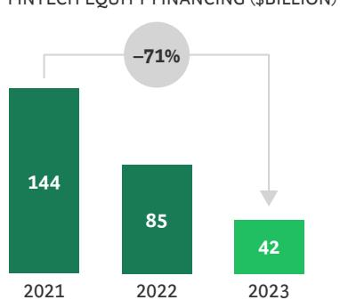  
Revenue multiples stabilized but are still low
REVENUE MULTIPLE FOR PUBLIC FINTECHS $^{1}$

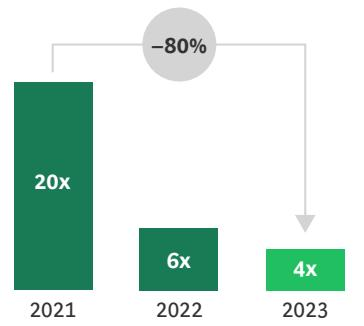

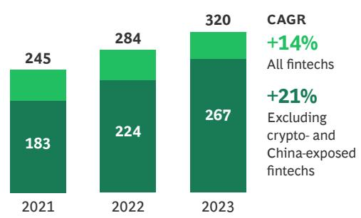  
Sources: Capital IQ; Pitchbook; companies' investor presentations; desktop research; BCG Fintech Control Tower; BCG analysis. $^{1}$ Average based on market capitalization and LTM revenue for the second quarter of each year.

## The new mantra is “Grow as fast as you can—subject to positive net income and neutral cash flow.”

SERGIO FURIO, FOUNDER AND CEO, CREDITAS

Simultaneously, global fintech revenues have continued to grow at a robust clip—14% over the past two years across the board, and 21% when crypto- and China-exposed fintechs are excluded. Growth during the two-year period comprising 2022 and 2023, in fact, compares well with the 29% rate from 2019 through 2023. Differences exist in growth rates across sectors and geographies, as always, but the most compelling performance gap, across segments, is between the emerging winners—the top-quartile performers—and the bottom-quartile fintechs. (See Exhibit 2.)

Exhibit 2 The Starkest Revenue Growth Gaps Are Between Top- and Bottom-Quartile Fintechs

Difference across select sectors and geographies
REVENUE CAGR, 2021–2023

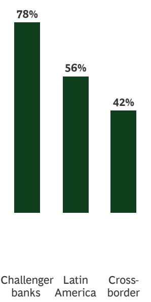

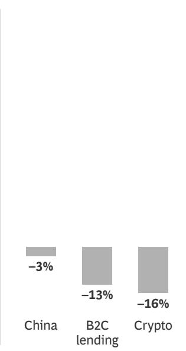  
Difference between top and bottom quartiles
CAGR FOR TOP AND BOTTOM QUARTILE, 2021–2023

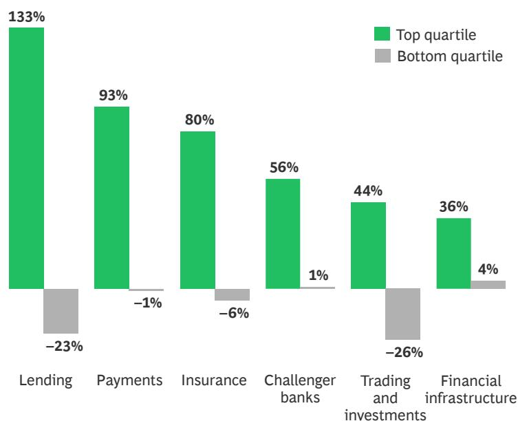  
Sources: Capital IQ; Pitchbook; companies' investor presentations; desktop research; BCG Fintech Control Tower; BCG analysis.

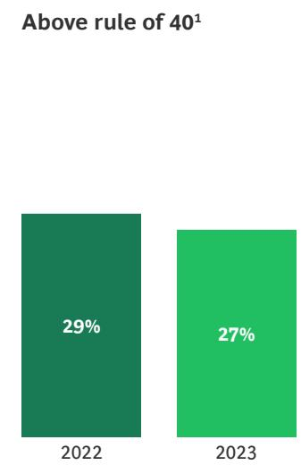

Exhibit 3 Public Fintechs Are Moving Toward Profitable Growth but Have a Long Way to Go  
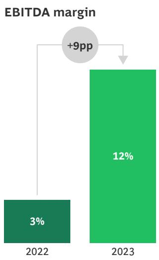

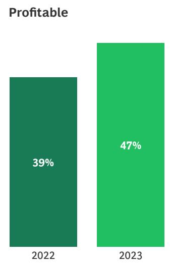  
Sources: Capital IQ; Pitchbook; companies' investor presentations; desktop research; BCG Fintech Control Tower; BCG analysis. Note: Data is based on the top 70 public fintechs from 2022 through 2023. pp = percentage point. $^{1}$ Rule of 40 is a financial metric summing revenue growth (%) and profit margin (%).

More notably, the industry has made good on initiating the shift from a “growth at all costs” model toward profitable growth, with EBITDA margins improving 9 percentage points on average. But this shift is still in its early stages, with the strong majority of the top 70 public fintechs still operating below the “rule of 40” threshold (a financial metric that sums revenue growth and profit margin percentages). (See Exhibit 3.)

## Conditions Continue to Favor Fintech Growth

Despite the current funding challenges, the fundamentals that have fueled the fintech sector from the beginning remain in place and promise continued growth. In 2023, challenger banks in particular proved their value to investors and customers. (See Spotlight #1.) We continue to expect fintechs to reach a market size of \$1.5 trillion in revenue by 2030—growth of roughly five times over the period from 2023 to 2030. Fintechs still maintain and press their well-known advantages: a laser focus on solving customer pain points, compelling user experiences, and rapid innovation. These strengths will continue to power growth—even as the regulatory playing field is becoming more balanced and equitable, presenting a challenge of sorts for many fintechs, which have until recently operated under the regulatory radar.

The upside for fintechs continues to be vast—with 1.5 billion unbanked and 2.8 billion underbanked adults across the world. Of course, these potential customers are also available to incumbent banks, which will have their own opportunities to grow. The question is whether—and how—they will do so.

The emergence of new technologies seems to favor fintechs, at least in the near term. GenAI, for one, is proving to be an immediate boon for the sector, already delivering huge productivity gains in precisely the areas where fintechs' costs are centered: coding, customer support, and digital marketing (with improved targeting). GenAI, alongside API-based connectivity and distributed ledger technology, will provide a rapid boost for fintechs; banks, too, will benefit from these technologies, but over a longer time scale. In short, GenAI arrives at a moment when many fintechs are strapped for cash. It may well keep a number of them afloat while they address the pressing need for profitable growth.

Here are four examples:

SPOTLIGHT #1

# From Upstarts to Contenders: Challenger Banks Achieving Profitability at Scale After a Record 2023

Digital challenger banks were star performers in 2023. (See the exhibit below.) Nubank, for example, crossed the 100-million-user milestone in May 2024 and aspires to become Latin America's largest and most profitable bank in the near future—roughly one in two adult Brazilians is a Nubank customer. Meanwhile, in Europe, Monzo reached operational profitability in the first half of 2023 and recently received additional funding to fuel its ambitious global growth plans. More than half of the profitable challenger banks are located in Asia—South Korea's KakaoBank, for example—often as part of an integrated ecosystem.

Notably, there is no single recipe for a successful challenger bank. Leaders have taken unique paths to scale and profitability; what they have in common is that they have staked a claim to a lasting presence in the industry.

Leading Challenger Banks Have Demonstrated Profitability at Scale After a Record 2023

453

The number of digital challenger banks around the world

23

The number that are operationally profitable

Nubank
Crossed the 100-million-user milestone in May 2023 and is on track to be the largest and most profitable bank in Latin America

Now the seventh-largest bank in the UK; it reached operational profitability in the first half of 2023 with revenue of £356 million

Grew to \$1.3 billion in revenue in 2023 with 14.5 million customers and was profitable in Q1 2024; preparing for a possible IPO in 2025

Revolut
Hit \$2 billion in revenue and double-digit net profit in 2023, with more than 40 million customers worldwide

Sources: Capital IQ; Pitchbook; companies' investor presentations; desktop research; BCG Fintech Control Tower; BCG analysis.

## Nine Trends Influencing the Evolution of Fintech

Over the past year, nine trends have shaped the evolution of fintech; some of them are concentrated in specific sectors and geographies. A few are long-standing, and others represent emergent influences.

1. The Persistence of High Interest Rates. Globally, we are entering a prolonged period of higher interest rates that will continue to increase funding costs for fintechs, while private capital continues to push for profitable growth that will ultimately yield investment returns. The days of “growth at all costs,” funded by cheap capital, are well and truly over.

2. Convergence of the Regulatory Playing Field. On the regulatory front, the past year has seen a narrowing of the regulatory advantage that fintechs have enjoyed since the birth of the sector. Regulatory actions have included consent orders against several fintech sponsor banks, increased scrutiny of banking as a service (BaaS) overall, moves against crypto firms, and the proposal from the US Consumer Financial Protection Bureau (CFPB) on the supervision of big tech companies and other providers of digital wallets and payment apps. Though much work remains to create a level and fair regulatory operating environment for banks and fintechs, we believe things are trending in the right direction.

3. The Emergence of New Regulatory Frameworks Globally. Regulatory frameworks and standards governing or impacting the global fintech sector have been coming into focus. India, for example, has released new notifications to reemphasize and clarify know-your-customer (KYC) and co-lending standards for fintechs, and the CFPB is currently gearing up to develop concrete guidelines under Section 1033, a part of the Dodd-Frank act aimed at clarifying rules regarding how customer data is accessed and used.

4. The Global Proliferation of DPI. Digital public infrastructure has accelerated the adoption of real-time payments in countries including India (whose DPI is Unified Payments Interfaces, or UPI) and Brazil (Pix). (See Spotlight #2.) This three-tiered infrastructure—a national digital identity system, a payments layer, and a data exchange—creates a fertile context for fintech development. Many countries, particularly emerging markets, are looking to emulate the success of UPI and Pix. However, while the success of the India and Brazil DPIs is unequivocal, it is by no means certain that other countries—including developed markets—will be able to replicate it. Much depends upon the current market context and the maturity of the various layers.

Where the regulator has stepped in to define a framework, it's caused a huge, dynamic change in the market. When the regulator provides clarity, as in crypto and AI underwriting, all stakeholders can build more constructively.

GAL KRUBINER, COFOUNDER AND CEO, PAGAYA

SPOTLIGHT #2

# Brazil's Activist Regulators Are Cultivating a Landscape for Fintech Innovation and Growth

Brazil has become a hothouse of fintech innovation, with a thriving, vibrant ecosystem that is drawing attention globally. The most notable fintech name in the country is Nubank, which has managed the trick of building a—wildly—successful digital bank in a once cash-heavy country. But Nubank is not alone: it is one of 17 unicorns in Brazil. Other big fintech names include Creditas (a lending platform), Dock (a fintech infrastructure provider), and Ebanx (a payments provider), all with significant success in their areas of focus.

Credit is due to Brazil's central bank and regulators—primarily the National Monetary Council—which has taken an active stance in paving the way for creating infrastructure that helps enable fintech solutions to scale. (See the exhibit below.) In addition to supporting the development of the digital public infrastructure, including the real-time payments platform Pix, regulators have not been shy about regulating big tech and ensuring competition in the market. Brazil also has a flexible licensing approach, issuing both standard banking and instituição de pagamentos licenses—which allow institutions to initiate and process payments, with relatively lighter regulatory constraints.

## In Brazil, Regulation Supports Innovation and Growth

Brazil has set a clear example for how to implement integrated DPI...

Vision
"The project will be the embryo of . . . a total transformation in the country's future financial intermediation, and will consolidate . . . new forms of payment methods with the fintech industry and with open banking."
ROBERTO CAMPOS, PRESIDENT, BANCO CENTRAL DO BRASIL (BCB) IN 2020

Protocols BCB manages and operates SPI, the Instant Payments System, underpinning Pix and protocols for BR code (standard QR code)

Governance While BCB manages the directory and payments, the Pix Forum comprises representatives from banks and other stakeholders

Directory BCB also operates the DICT, the national database linking aliases (e.g., email, QR code, or a random key) and account information

Pricing

Pix is free for individuals and costs an average of 0.22% per transaction for merchants (per the Bank for International Settlements)

Sources: Companies' investor presentations; desktop research; BCG analysis.

... reshaping the financial landscape of the country

1.5x

Growth in banked population in ten years (from 57% in 2011 to 84% in 2021)

17

Fintech unicorns in Brazil

Fraud is a huge issue for everyone, everywhere. Fraud is a natural part of payments, but once it becomes too much, it's a problem. More government support is key, but as fintechs we must work together to tackle this problem.

GB AGBOOLA, FOUNDER AND CEO, FLUTTERWAVE PAYMENTS

5. Heightened Attention on Fraud and Cybersecurity. As real-time payments and GenAI become increasingly integral parts of consumer financial services, the risk of fraud ramps up. In the US, for example, incidence of data compromise increased by 78% in 2023, up to a record of 3,205 incidents broadly, according to the Identity Theft Resource Center. According to a 2024 Financial Crimes Enforcement Network report, more than 40% of Bank Security Act reports in the US were related to identity fraud, with \$212 billion in suspicious activities directly resulting from failures in bank identity verification. $^{1}$ New threats, such as the adoption of deepfake technologies—where AI is used to create fake videos or other media that seem real—can erode fundamental trust as much as they do our financial systems.

6. The Acceleration of Scaled GenAI Adoption. The adoption of GenAI will accelerate, with primary near-term use cases related to productivity and marketing. A number of fintechs—including PayPal and Klarna—are putting GenAI front and center in their operating models, automating customer service, checkout, and personal recommendations. We believe product innovation through GenAI is on the horizon but will not make a difference in the near term.

7. The Continued Embedding of Financial Services.
The embedding of financial workflows into nonfinancial journeys continues to expand and will only increase as more and more customer activities become digitized across both B2C and B2B.

8. The Effect of Mainstream Banks “Crossing the Rubicon” on Advertising. While banks have long had proprietary access to valuable customer data, few have taken the step of monetizing that data through advertising. Mainstream banks such as Chase are joining fintechs in using their first-party data to surface relevant ads in their own closed commerce sites.

9. The Reemergence of the IPO and M&A Markets.
Following a funding winter, we expect that the need for liquidity, and fairer conditions in capital markets as interest rates moderate, will lead to a substantial uptick in IPO and M&A activity for fintechs.

# Today's Fintech Landscape

The last few years have brought the high-flying fintech sector back to earth. We have seen this story play out before: a gold rush inevitably leading to a reckoning. As in previous versions of the narrative, however, a streamlined, somewhat chastened, and newly focused set of companies will now emerge. The current funding chill has and will continue to cull weaker players whose business models have not proven profitable or scalable. The stronger survivors will be operating in a changed financial services landscape, and they—and incumbent banks—will confront four major themes:

\- Embedded finance will become pervasive.

\- Connected commerce is poised for liftoff.

\- Open banking will have varying impacts on banking and advertising.

\- GenAI is a game-changer.

Embedded finance continues to grow apace. We are squarely in the third inning of embedded finance for vertical software, but we're still in the first inning for other functions, such as the office of the CFO. This is the light dawning, not a fad.

MATT HARRIS, PARTNER, BAIN CAPITAL VENTURES

## Embedded Finance Will Become All-Pervasive by 2030

The integration of financial services into nonfinancial interactions is only getting started. As a more natural facilitation of monetary transactions, embedded finance eliminates friction and enables highly tailored customer experiences. (See Exhibit 4.)

For now, the primary use cases continue to be payments, lending, and insurance, in both the B2B and B2C contexts. The API-zation and integration of financial ecosystems has boosted growth. In payments, two of the leading firms in embedded finance, Stripe and Adyen, crossed the trillion-dollar mark in overall payments volume in 2023. These players, and others, continue to expand use cases, including pay by bank, acceptance of cryptocurrency payments, and use of digital assets. (See Spotlight #3.) While not as mature as other segments of the fintech market, embedded lending, including buy now pay later (BNPL) players, saw robust increases in transactional volume, with Klarna accounting for \$90 billion and Affirm for \$20 billion. Correspondingly, embedded insurance has a strong growth outlook; adoption in Europe is already strong, with roughly \$8 billion in premiums in 2023.

This is only the beginning. We expect an embedded finance market size of more than \$320 billion in revenue in 2030, with the small and medium-size business (SMB) segment accounting for about half (\$150 billion), as both vertical and horizontal independent software vendors (ISVs) respond to the segment's unmet demands. Horizontal solutions will play an increasing role—for instance, in accounting software that offers payroll services and working capital loans. Meanwhile, banks are increasingly offering end-to-end solutions that include accounting.

The consumer segment—already humming with activity and adoption in payments, insurance, and lending—will be worth \$120 billion revenue by 2030.

Embedded finance will grow to a market size of \$50 billion revenue in the enterprise segment, where horizontal software is increasingly embedding payments, lending, and trade to address continuing pain points in accounts payable and receivable. We see financial services embedded into B2B platforms and supplier networks, with increasing use of value-added services including cashflow forecasting and spending-management tools.

The burning question: Is this profit pool reserved primarily for fintechs, or will incumbent banks find a way to claim a significant share? In the near term, we expect that established fintechs will continue to reap the lion's share of the benefits while larger, more established banks will gain share over time. The growing scrutiny of bank-fintech partnerships will tip the balance of economics toward those banks that have the robust risk management and control capabilities necessary to oversee fintechs and establish strong partnerships.

SPOTLIGHT #3

# The “Third Life of Digital Assets”: Is It Real This Time?

In the wake of crypto's most recent turbulence, many have questioned if digital assets more broadly could make a credible return. Despite recent short-term volatility, interest in digital assets remains immense, with proponents seeing it as the next evolution of money and some expecting it to power growth in the broader global economy. Digital asset technology includes central bank digital currencies (CBDC), stablecoins, cryptocurrencies, as well as unified ledger use cases that support broader tokenization of assets and deposits. A number of recent trends are underway in the market. For example:

\- Globally, CBDCs are developing rapidly, with the majority of central banks proactively researching or launching pilots.

\- Investment in stablecoins is significant, with proponents focused on the technology's ability to settle cross-border payments instantaneously, increasing efficiency and lowering transaction costs. PayPal's recent introduction of PayPal USD stablecoin for money transfers is a case in point.

\- As with fintech more broadly, cryptocurrencies are benefiting from recent regulatory clarification and a formalization of institutional investing including the use of bitcoin ETFs.

\- Unified ledger is emerging as a potential new financial market infrastructure, providing the benefits of tokenization by combining central bank money, tokenized deposits and tokenized assets on a programmable platform, according to the Bank for International Settlements.

Despite all of the investments and changes underway, the jury is still out in terms of near-term impact and whether “this time it’s different” for digital assets.

<table><tr><td>●</td><td>●</td><td>●</td><td>●</td><td></td><td>●</td><td>●</td><td>●</td><td></td><td>●</td><td>●</td><td>●</td><td>●</td><td>●</td><td></td><td></td><td>●</td><td>●</td><td></td><td>●</td></tr><tr><td>●</td><td>●</td><td>●</td><td>●</td><td></td><td>●</td><td>●</td><td>●</td><td>●</td><td>●</td><td>●</td><td>●</td><td>●</td><td>●</td><td>●</td><td>●</td><td>●</td><td></td><td>●</td><td>●</td></tr><tr><td>●</td><td></td><td></td><td></td><td></td><td>●</td><td>●</td><td>●</td><td>●</td><td>●</td><td></td><td></td><td>●</td><td>●</td><td>●</td><td>●</td><td>●</td><td>●</td><td>●</td><td>●</td></tr><tr><td>●</td><td></td><td></td><td></td><td>●</td><td>●</td><td>●</td><td>●</td><td>●</td><td>●</td><td></td><td></td><td>●</td><td>●</td><td>●</td><td>●</td><td>●</td><td>●</td><td>●</td><td>●</td></tr><tr><td></td><td></td><td></td><td></td><td>●</td><td>●</td><td>●</td><td>●</td><td>●</td><td>●</td><td></td><td></td><td>●</td><td>●</td><td>●</td><td>●</td><td>●</td><td>●</td><td>●</td><td>●</td></tr><tr><td></td><td></td><td></td><td></td><td>●</td><td>●</td><td>●</td><td>●</td><td>●</td><td>●</td><td></td><td></td><td>●</td><td>●</td><td>●</td><td>●</td><td>●</td><td>●</td><td>●</td><td>●</td></tr><tr><td></td><td></td><td></td><td></td><td>●</td><td>●</td><td>●</td><td>●</td><td>●</td><td>●</td><td></td><td></td><td>●</td><td>●</td><td>●</td><td>●</td><td>●</td><td></td><td>●</td><td>●</td></tr><tr><td></td><td></td><td></td><td></td><td>●</td><td>●</td><td>●</td><td>●</td><td>●</td><td>●</td><td></td><td></td><td>●</td><td>●</td><td>●</td><td>●</td><td>●</td><td>●</td><td>●</td><td>●</td></tr><tr><td>●</td><td></td><td></td><td></td><td>●</td><td>●</td><td>●</td><td>●</td><td>●</td><td>●</td><td></td><td></td><td>●</td><td>●</td><td>●</td><td>●</td><td>●</td><td>●</td><td></td><td>●</td></tr><tr><td>●</td><td></td><td></td><td></td><td>●</td><td>●</td><td>●</td><td>●</td><td>●</td><td>●</td><td></td><td></td><td>●</td><td>●</td><td>●</td><td>●</td><td>●</td><td>●</td><td></td><td>●</td></tr><tr><td>●</td><td>●</td><td>●</td><td>●</td><td>●</td><td>●</td><td>●</td><td>●</td><td>●</td><td>●</td><td>●</td><td>●</td><td>●</td><td>●</td><td>●</td><td>●</td><td>●</td><td>●</td><td>●</td><td>●</td></tr><tr><td>●</td><td>●</td><td>●</td><td>●</td><td>●</td><td>●</td><td>●</td><td>●</td><td>●</td><td>●</td><td>●</td><td>●</td><td>●</td><td>●</td><td>●</td><td>●</td><td>●</td><td>●</td><td>●</td><td>●</td></tr></table>

# Exhibit 4 The Embedded Finance Market Will Be Worth More Than \$320 Billion in Revenues by 2030

Payments, lending, and insurance—products that are particularly easily embedded—will lead the way

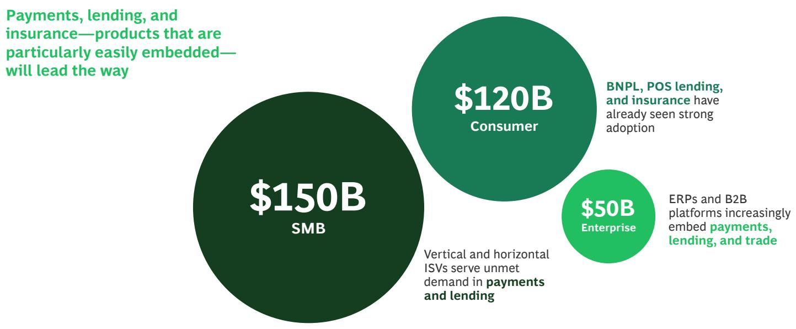  
Sources: Capital IQ; Pitchbook; companies' investor presentations; desktop research; BCG Fintech Control Tower; BCG analysis.
Note: BNPL = Buy now, pay later; ERP = Enterprise resource planner; ISV = Independent software vendors; POS = Point of sale; SMG = Small and mediumsize businesses.

## Connected Commerce Is Poised for Liftoff

Incumbent banks are custodians of some of the most insightful data about their customers. This has long been understood as an advantage, but it is one that has not yet been fully realized. However, if there is a killer app for converting this proprietary data into a revenue generator, it is connected commerce. With the increasing value of first-party data, given cookie depreciation and app-tracking transparency, connected commerce is emerging as a triple play for banks—it creates a new revenue stream, increases customer loyalty, and enables banks to offer a marketing channel to their SMB and enterprise customers.

Connected commerce thrives in an environment in which customers have a high degree of digital engagement—either on websites or on mobile apps. Using granular customer data, banks can strengthen customer loyalty by surfacing ads hypertailored to the individual. Merchants then pay the bank based on either attributable sales or traffic—creating a win-win-win scenario where the customer is rewarded, merchants generate more sales, and banks earn revenue. As core payments revenue streams, like interchange and late fees, continue to come under pressure, and as deposits risk becoming commoditized in a higher-yield environment, connected commerce hints at a future model for banks. Major financial institutions with sufficient scale are investing in the approach: see JPMorgan’s Chase Media Solutions, Capital One Shopping, and Citi Shop. Select fintechs such as Klarna have also invested in connected commerce, and both Revolut and PayPal recently announced the launch of advertising businesses.

Apple, too, may be eyeing connected commerce. (See Spotlight #4.) The area is fertile ground for partnerships between fintechs and banks. Fintechs bring the speed and user experience, and banks bring the customers and the data. For example, Citi partnered with Wildfire Systems, a B2B2X fintech, to create Citi Shop.

A cautionary note here, for banks and their partners, is the risk that all this pinpoint ad targeting could turn the advertisers into the customers, and the consumers into a product to serve the needs of advertisers, eroding brand loyalty. Banks will need to walk a fine line here.

# How Far Will Apple Go in Financial Services?

Apple is arguably the largest “fintech” in the world and is competing directly with neobanks and payment players. We see numerous use cases powered by Apple’s new AI capabilities, including shopping and personal finance management.

LOGAN ALLIN, MANAGING PARTNER AND FOUNDER, FIN CAPITAL

Big tech has long been a leader in embedding financial services, with companies using it largely as a means to reinforce their core business. The journey has not been without its bumps. Amazon recently announced its withdrawal from its SMB lending program, and while Google continues to pursue payments, its doing so primarily outside of the US for now.

Perhaps the biggest open question—and bellwether—is how deep Apple will take its financial services offerings. (See the exhibit below.) Apple has executed a seamless rollout within its ecosystem. Nevertheless, the uncertain future of its partnership with Goldman Sachs, heightened regulatory attention, and the recently filed US Department of Justice antitrust suit citing noncompetitive practices (specifically calling out Apple Wallet) will likely dampen the company’s appetite in the short term.

We see many consumer banking products as fair game, as long as they align with Apple's core beliefs: increasing stickiness of core products, supporting the product upgrade cycle, enabling its services strategy, and contributing high margins. Accordingly, self-directed investing and connected commerce within Apple Wallet are two areas to watch going forward.

## Apple's Financial Services Progression

Payments: Apple Pay LAUNCHED 2014

• Wallet allowing debit and credit transactions on phone

• Available in 80 countries

\- Has 600 million users

Deposits: Cash + Savings account
LAUNCHED 2017 (CASH)
2023 (SAVINGS)

\- Storage wallet and high-yield savings account backed by Goldman Sachs

\- Has 12 million users and more than \$10 billion in savings deposits

Credit Card: Apple Card LAUNCHED 2019

• White-label credit card backed by Goldman Sachs

• 1 million cards activated in first three days

\- \$1 billion in cash back earned in 2023

Sources: Apple's investor presentations; desktop research; BCG analysis.

## BNPL: Apple Pay Later LAUNCHED 2023

• Apple recently announced that it would discontinue its BNPL offering in favor of new global installment loan offering including third-party partnerships, such as its deal with Affirm

Where next?

\- Connected commerce?

• Self-directed investing?

• Personal CFO with Apple Intelligence?

\- Other solutions?

## Open Banking Will Have a Modest Impact on Banking but a Greater One on Advertising

Open banking will continue to expand as more countries implement customer-permissioned access to their financial data, enabled by APIs. However, while open banking will drive innovation (in underwriting and customer experience, for example) and increase financial access, it is unlikely to change the basis of competition in banking. In fact, in countries where open banking has had a decade or more to mature, no killer use case has emerged.

Asserting that open banking is unlikely to make a splash is different from saying it will have no impact. More than 65 countries have instituted open banking—to some degree or other—and we expect the trend to continue. $^{2}$ Approaches have varied, with some jurisdictions taking a market-led approach (until recently, the US was a good example; regulation will now be implemented through the CFPB 1033 ruling), and others, such as the EU with the third Payment Services Directive (PSD3), shaping open banking through regulation. In some Asia-Pacific countries a hybrid approach has emerged, with collaboration between regulators and the private market; South Korea is an example.

In select areas, open banking has delivered changes that have then enabled innovation and better customer experience; for example, access to account information has allowed new entrants to effectively underwrite credit to non-primary customers. But overall the impact has been modest. Open banking has been live in the UK for six years, and consumer adoption has plateaued at 12% monthly active users. Even in the Nordics, traditionally in the vanguard of digital adoption, open banking user penetration is well below 50%—for example, roughly 30% in Sweden and 25% in Norway. $^{3}$

What would it take for open banking to have a bigger impact on banking? If bank account numbers were as portable as mobile phone numbers, switching would become significantly easier. However, the question still remains whether access to banking data allows for the creation of a new and differentiated value proposition. Beyond traditional banking use cases, we do expect that opening up access to transaction-level data could have an impact on advertising and connected commerce more broadly.

We believe that open banking will continue to be a relevant but not game-changing factor in consumer and SMB financial services and fintech. Revenue pools in the connectivity layer, retrieving and managing data that banks are mandated to provide, will remain modest, with value accruing to the ultimate use-case providers leveraging open banking infrastructure. These use case providers will, however, often use proprietary APIs, with higher data granularity and breadth, supplemented by access provided by open banking, and will not rely on screen-scraping or alternate methods used to gather the same data today.

In Korea, open banking has lowered the barrier to access financial data. Fintechs are able to access financial information without the need for a license—they can connect to legacy bank accounts and perform simple remittance and integrated balance checks inside the platform. However, the access is not differentiated, and many others can offer the same.

DANIEL YUN, CEO, KAKAOBANK

# We believe there is strong potential for GenAI for productivity use cases such as customer support, fraud risk management, onboarding, and copilots for developers. It will also provide value by better automating payment method recommendations for different country and ATV [average transaction value] use cases.

FRAN RYAN, GENERAL MANAGER FOR FINANCIAL SERVICES, STRIPE

## GenAI Is A Game-Changer for Productivity, with Product Innovation to Follow

As in many industries worldwide, GenAI is rapidly proving its worth in the realm of financial services, delivering tangible productivity gains. Both fintechs and incumbent banks are using GenAI in customer service and support; in software coding, testing, and documentation; in the regulatory arena, through filings and compliance; and for targeted, automated digital marketing.

The applications and impact will only grow. Specifically, we see increased efficiencies for banks and fintechs across COGS (for example, higher developer and service operations productivity), in sales and marketing (increasing speed to output for content creation and improving salesforce effectiveness), and in general administrative expenses (optimizing third-party spending, simplifying the tech stack, and automating support functions). For fintechs in particular, given that their “digital first” cost structures are heavily weighted toward areas where GenAI is delivering huge gains—coding, customer support, and digital marketing—the impact is likely to be even more pronounced in the near term. (See Exhibit 5.)

The use of GenAI in product innovation will lag its uses for productivity—but we expect it to follow. We do see a future for the technology particularly in personal financial management, where large language models can better assess and customize recommendations for things like savings advice and suggest ways for customers to achieve their financial goals. Along with its benefits in productivity and innovation, GenAI can help financial institutions in achieving end-to-end transformation into more effective, strategic, and competitive organizations.

A focus on responsible AI and ensuring that appropriate governance, risk management, and controls are in place are table stakes for the application of GenAI. We think it is safe to say that the pervasiveness of GenAI will raise the bar, and that risk management in GenAI will become a differentiator for players that successfully scale. Forward-thinking fintechs and banks will invest now in these capabilities and governance.

The GenAI ecosystem will also inevitably make room for new vertically focused innovators to emerge that will help banks and fintechs accelerate their adoption of the technology.

## Exhibit 5 GenAI Will Be a Game-Changer for Enhanced Productivity

GenAI is already being rolled out at scale with huge productivity benefits
GENAI USE CASES AND INDUSTRY EXAMPLES

Fintechs will see more near-term benefits from GenAI given their “digital first” cost structures
COST STRUCTURE AS % OF OPERATING COSTS $^{1}$

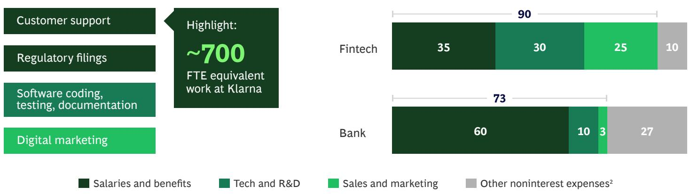  
$^{1}$ For 70 public fintechs and a subset of North American banks. Excludes transaction and interest costs. $^{2}$ Occupancy, professional services, etc.

Where We Go from Here: Five Calls to Action

## Prudence: Risk and Compliance as Competitive Advantages for Fintechs and the Wider Ecosystem

For both banks and fintechs, the current regulatory environment, along with the broader opportunity for stronger bank-fintech partnerships, is increasing the critical importance of risk and compliance readiness. For fintechs, this means seeing compliance as a strategic advantage rather than an obligation. This strategic approach consists of an end-to-end view of risk and compliance: preemptively assessing applicable regulations and proactively implementing industry-grade guidelines and controls, particularly in critical areas of financial crimes compliance such as anti-money laundering (AML), know your customer, and sanctions, as well as in cybersecurity.

For banks, which are used to operating in a stringent regulatory context, the call to action is to reinforce and lean into their existing compliance strengths. As they prepare for an era of increased collaboration with fintechs, they should focus on their due diligence capabilities and firm up their third-party oversight management processes. This is especially germane in the US, where the Interagency Guidance on Third-Party Relationships requires taking direct oversight of compliance and risk activities and ensuring that robust monitoring is in place for bank partnerships with fintechs.

A number of major US banks, including global players such as JPMorgan and Citi as well as regional players such as Fifth Third Bank and KeyBank, have used their strengths in compliance and risk management to structure strong partnerships with fintechs and subsequently even acquired them—showing that an approach that benefits all parties can be constructed.

## Profits: A Call for Fintechs to Improve EBITDA by More Than 25 Percentage Points

For many fintechs, profitability fell off the strategic radar during the heady days of near-zero interest rates. This hangover remains, and only 33 of the 70 largest public fintechs were profitable in 2023. While this was an improvement over 2022, it says something about the health and prospects of the sector that fewer than half of the public fintechs are sustainably profitable. Based on our research and practical experience, we believe that fintechs need to—and can—improve EBITDA by more than 25 percentage points.

Of course, fintechs are wading through the difficulties of a high-interest-rate environment—which has put unit costs front and center. In this context, a disciplined approach to costs will be the difference between operational profits and losses. There are players that have focused on unit profitability—to their benefit. Challenger banks in particular have achieved positive operational profitability, positioning them advantageously to scale despite the context of constrained funding.

Across the board, public fintech costs are roughly split into COGS at 30% to 60%, sales and marketing (10% to 40%), and general and administrative costs (10% to 30%). Top-quartile players in terms of EBITDA outpaced bottom-quartile firms by roughly 25 percentage points in 2023 in each of these cost categories. While this is sobering for the laggards, it speaks to significant opportunity for tangible cost savings industry-wide. The numbers tell us there is plenty of margin to streamline operations and edge toward profitability.

We don't suggest that lagging fintechs apply a blunt instrument to their cost structure; rather, they should focus on building a scalable cost structure that will deliver compounding returns as they continue to grow. An effective transition to profitability calls for a multipronged approach that includes both revenue growth and cost reduction, along with balance sheet improvements:

\- Revenue growth levers include pricing, particularly new revenue models for pricing for payments (for example, basis points, fees) versus software-as-a-service-type subscription models to yield more revenue. Fintechs should also focus on salesforce effectiveness and commercialization efforts, which include defining vertical versus horizontal client segments and aligning go-to-market strategies against them.

\- Cost reduction levers are evergreen, but many fintechs have yet to apply them comprehensively. Organizationally, a redesign that eliminates layers and redefines role charters can have significant cost implications, while front-to-back digitization of operations—particularly increasing automated decision making regarding key processes—can yield savings. Cost leaders also focus on procurement excellence—that is, optimizing and consolidating key contracts. In central, support, and technology functions, optimization and simplification can further reduce costs, especially for technology-intensive fintechs. This means shared service teams and standardized processes in supporting functions as well as streamlining third-party spending. Finally, fintechs can externalize all nondifferentiating capabilities to focus on core competencies.

\- Working capital optimization can yield cost savings on the balance sheet—with a focus on improving accounts receivable and payable functions and increasing visibility into cash flow.

## Growth: Journey to IPO (or Strategic Sale) and Beyond

The IPO market for fintech will not stay dormant forever. As interest rates moderate and fintechs hunt for capital, we expect initial public offerings—along with strategic sales and other M&A activity—to take off. (See Exhibit 6.) Leading fintechs in all geographies have made known their intent to go public in the near future, from Flutterwave in Africa to Klarna in Europe; from Airwallex in Asia-Pacific to Chime in North America.

But fintechs must be careful what they wish for. Many have made the IPO leap only to see their stock prices drop later by as much as 40% to 80% from their initial listing. Investors have changed their tune, singing the praises of sustainable, profitable growth where they once exhorted fintechs to “grow at all costs.” Consequently, the bar has shifted, putting more pressure on fintechs to tell a longer-term and more comprehensive equity story. In this context—to maximize valuation for IPO and beyond—fintechs need to focus on best practices:

\- Tell a clear equity story. Early fintechs could go a long way with a simple, elegant solution to a customer pain point. Today, investors expect a more comprehensive narrative, an articulate story that clearly lays out the case to underwrite long-term success. Yes, it remains critical for aspiring public fintechs to detail how unmet customer needs will be met and exactly how the current landscape will be disrupted. But as investors look for sustainable long-term investments, they will need greater detail. How will the fintech attract users at sustainable costs, and what is the plan for profitable growth? How is it positioned to meet increasing regulatory compliance requirements?

\- Move when the time is right. Before IPO, fintechs first need to achieve enough scale, operational stability, and predictability to justify the costs and scrutiny that come with going public. To get there will require a focus on fundamentals. The imperatives here are not particularly new, but until now they have not been as critical to a fintech's success or failure. Fintechs that thrive in the new environment will be those that apply a laser focus to unit economics and optimize costs, revenues, go-to-market strategies, risk and compliance capabilities, and partnership models. By doing so, they prepare themselves to scale in a profitable and predictable way.

\- Build compliance muscle. In addition to the cost and revenue levers detailed earlier, fintechs can prepare for a successful IPO and beyond by taking a robust, end-to-end view of compliance to mitigate the risk and impact of future regulatory actions and give potential partners confidence in the viability of joint efforts. This is not something that can be successfully pulled together a few months before IPO. We recommend fintechs operate as if they were a public company for five quarters before the launch.

\- Prepare to partner. Fintechs should devote significant leadership attention to partnership strategy more broadly, as we expect significant ongoing opportunities for fintech-bank alignment. Those fintechs with strong balance sheets and controls, and with superior capabilities in partnership building and business development, will be positioned to make the most of these rich opportunities.

The earlier a company creates a schematic around its equity story and communicates the key metrics that it expects Wall Street to grade it against, the likelier it is to maintain its valuation beyond the initial offering. For example, when it went public in January 2021, Affirm had clearly laid out its business model as an alternative to traditional lending but had also reported 77% year-over-year growth in gross merchandise volume, an NPS of 78, 6.2 million consumers, and the number of merchants using its platform (6,500). $^{4}$ It made clear its status as a licensed lender in the US and described its ongoing plans for adapting to federal and state lending regulations.

## Exhibit 6 Prepare for the Journey to IPO and Beyond

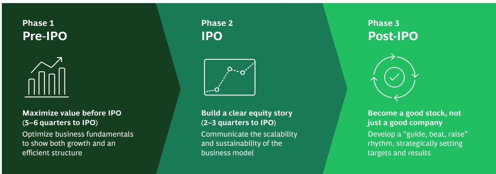

Maximize value before IPO (5–6 quarters to IPO)
Optimize business fundamentals to show both growth and an efficient structure

Build a clear equity story (2–3 quarters to IPO)
Communicate the scalability and sustainability of the business model

Sources: Companies' investor presentations; desktop research; BCG analysis.

4. Affirm Form S-1, filed to the SEC 18 November 2020.

Become a good stock, not just a good company
Develop a “guide, beat, raise” rhythm, strategically setting targets and results

## Exhibit 7 Incumbent Retail Banks Need to Reinvent Themselves as Digital Engagement Platforms

Banks enjoy higher consumer engagement...

... through which they can deliver new value-added services, including ...

55% more usage per month: 9.4 days for banks vs. 6.0 for fintechs $^{1}$

78% of users open banking app weekly to manage finances $^{2}$

Commerce engines

Personalization

SMB accounting solutions

Tax and credit scoring

Sources: data.AI; JPMC Consumer Banking Report (02/24); BCG analysis. $^{1}$ dataAI's reported percentage of active days in 2023 for Bank of America, Wells Fargo, Chase, Fifth Third, PNC, Regions, TD vs. Affirm, Cash App, Chime, MoneyLion, Paypal, Robinhood, Venmo, Varo. $^{2}$ JPMC Consumer Banking Survey (02/2024).

## Growth: Retail Banks as Digital Engagement Platforms

Amid the excitement of fintech innovation, it has been easy to forget that banks have distinct advantages in their proprietary access to customer data and their high customer engagement. It has long been understood that banks were sitting on a gold mine of customer data, but examples of banks putting that data to profitable use have been less common.

The killer app may have arrived. To provide a counterweight to fintechs that embed financial services into nonbanking journeys, banks are developing their own commerce sites, where they can leverage their vast insights into customer needs and behavior to pinpoint offerings and rewards. (See Exhibit 7.) It is a bit like shifting the battle to a “home court” where banks have the advantage, especially given their significant customer bases. Despite the common perception of banks as digital laggards, many enjoy higher consumer engagement than their fintech counterparts and should build on that. Where fintechs have outplayed banks thus far is in converting that engagement into shopping behavior.

In many cases, connected commerce platforms will succeed or fail on the quality of partnerships between banks, fintechs, and merchants—the classic win-win-win scenario. But this raises the bar—particularly for fintechs—for the quality of their compliance capabilities and ease of integration with banks. Fintechs need to be able to hit the ground running with confidence—as do their potential partners.

## The new generation has been raised on fintech products. In many cases they’ve never gone to a branch—they’re truly digital natives who may have used only virtual cards.

FRANCESCA CARLESI, UK CEO, REVOLUT

# India has really taken the best of breed in its approach to fintech: capitalism driving innovation from the US, the need for regulatory oversight from Europe, and the importance and value of home-grown tech players from China and APAC.

KARTHIK RAGHUPATHY, HEAD OF STRATEGY AND INVESTOR RELATIONS, PHONEPE

## Growth: Government Support for the Creation of Comprehensive and Integrated Digital Public Infrastructure

Governments, especially in emerging markets, that implement a three-part DPI ecosystem—made up of digital ID, payments, and data exchange layers—have broadened access to financial services, spurring innovation and ultimately benefiting the public. (See Exhibit 8.)

Many countries have tried to emulate the success of the two leading players: India's UPI and Brazil's Pix. However, the limited success of these efforts reveals that isolated implementations of point solutions for digital identity or real-time payments systems do not suffice to foster widespread adoption. Instead, governments should lay out the set of interoperable protocols and put in place fundamental enablers on which innovation can then occur.

For example, a real-time payments infrastructure is now commonplace, with more than 70 countries having one in some form. But adoption has been lackluster in many markets, often owing to the presence of established alternative solutions and the absence of supporting DPI functionalities such as directory services that are critical for fostering growth.

Where RTP has taken off is in markets where DPI has been comprehensively implemented. In India, the number of monthly real-time payments has grown by five times in the last three years, from 2.6 billion to 13.3 billion. $^{5}$ The availability of an alias directory and QR codes on top of RTP infrastructure was critical to propelling innovation.

Where DPI has worked, government involvement has made a difference by setting out the broad vision for the infrastructure and establishing protocols and nudges for adoption by the private sector. Moreover, the success of DPI hinges on its comprehensiveness—that is, it includes digital identity, a directory, and supporting services—and its full integration across systems; by contrast, siloed point solutions simply do not have the same impact.

## Exhibit 8 How a Digital Public Infrastructure Enables Private Creators to Innovate

India's DPI stack has government-defined protocols throughout three layers, which in turn enable private innovation  
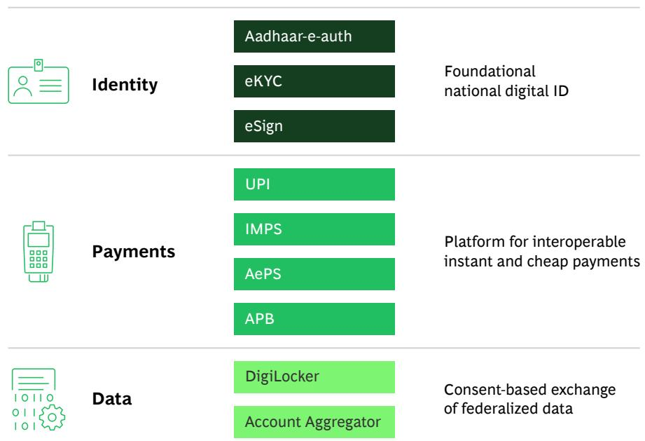  
Sources: Companies' investor presentations; desktop research; BCG analysis.  
5. NPCI, UPI Product Statistics, reported April 2024.  
Integrating the layers leads to powerful outcomes

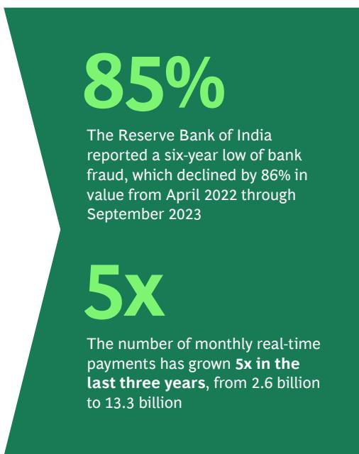

The Reserve Bank of India reported a six-year low of bank fraud, which declined by 86% in value from April 2022 through September 2023

The number of monthly real-time payments has grown 5x in the last three years, from 2.6 billion to 13.3 billion

## Conclusion

We are entering a world where the recipe for success for fintechs has more ingredients: prudence as table stakes, profitable unit economics, and robust customer growth. This shift has implications for all fintechs, particularly as they emerge from a funding winter hungry for investment. For fintechs targeting an IPO, the path has become more complex: investors are still looking for that fintech magic—elegant solutions to pain points still all too prevalent in financial services—but they also want a clearer, almost granular, narrative on how a company plans to achieve long-term profitable growth. For all fintechs, public and private, and for the banks that compete with them, a firm grasp on cost and revenue levers will be a necessity.

We also believe that the future will see greater levels of cooperation and partnership between fintechs and incumbent banks—the opportunities for mutually beneficial alignment are just too numerous and potentially rewarding. In a world where embedded finance, connected commerce, and all the shades in between become norms, well-developed muscles in partnership and compliance will be just as important as skills in innovation, technology, and marketing.

The fintech landscape is flush with success stories across the globe. In India and Brazil, we are seeing perhaps a vision of the future in their DPI models—one in which regulators walk a fine line by encouraging and fostering innovation while protecting consumers. We see banks finally finding an effective and value-adding way of leveraging their customer data through connected commerce. And in GenAI, we see an almost custom-made productivity lever that may be enough to keep some fintechs in the game long enough to find their footing.

A “back to basics” theme runs throughout this year’s report. But this does not mean the excitement of the fintech era is over. Formula 1 engineers prioritize improvements to the braking system to help maximize time spent at higher speeds throughout the course. So too, in fintech, we must learn how and when to slow down so that we eventually get there faster.

## About the Authors

## BCG

## Deepak Goyal

Managing Director & Senior Partner
New York
goyal.deepak@bcg.com

## Inderpreet Batra

Managing Director & Senior Partner
New York
batra.inderpreet@bcg.com

## Alexander Paddington

Partner
New York
paddington.alexander@bcg.com

## Andrew Janssens

Project Leader
New York
janssens.andrew@bcg.com

## Sooahn Choi

Consultant
New York
choi.sooahn@bcg.com

## Aaron Cormier

Lead Knowledge Analyst
Toronto
cormier.aaron@bcg.com

## QED Investors

## Nigel Morris

Cofounder & Managing Partner
nigel@qedinvestors.com

## Frank Rotman

Cofounder, Partner, & CIO
Head of Early-Stage US
frank@qedinvestors.com

## Bill Cilluffo

Partner, Head of International bill@qedinvestors.com

## Tommy Blanchard

Chief Operating Officer
tommy@qedinvestors.com

## Stefan Dab

Managing Director & Senior Partner Brussels
dab.stefan@bcg.com

## Yashraj Erande

Managing Director & Partner Mumbai
erande.yashraj@bcg.com

## Aparna Pande

Project Leader
New York
pande.aparna@bcg.com

## Yann Sénant

Managing Director & Senior Partner
Paris
senant.yann@bcg.com

## Saurabh Tripathi

Managing Director & Senior Partner
Global Leader, Financial Institutions Practice
Mumbai
tripathi.saurabh@bcg.com

## Rishi Varma

Managing Director & Senior Partner
New Jersey
varma.rishi@bcg.com

## Mike Packer

Partner, Head of Latin America
mike@qedinvestors.com

## Sandeep Patil

Partner, Head of Asia
sandeep@qedinvestors.com

## Amias Gerety

Partner, Early-Stage US amias@qedinvestors.com

## Acknowledgments

This report is a joint initiative of Boston Consulting Group (BCG) and QED Investors (QED). The authors thank their colleagues from each organization for their contributions to the development and production of the report. In addition, the authors are extremely grateful to all the participants in one-on-one interviews and panel discussions for their valuable contributions toward the enrichment of the insights presented here.

## For Further Contact

If you would like to discuss this report, please contact one of the authors.

## BCG

Boston Consulting Group partners with leaders in business and society to tackle their most important challenges and capture their greatest opportunities. BCG was the pioneer in business strategy when it was founded in 1963. Today, we work closely with clients to embrace a transformational approach aimed at benefiting all stakeholders—empowering organizations to grow, build sustainable competitive advantage, and drive positive societal impact.

Our diverse, global teams bring deep industry and functional expertise and a range of perspectives that question the status quo and spark change. BCG delivers solutions through leading-edge management consulting, technology and design, and corporate and digital ventures. We work in a uniquely collaborative model across the firm and throughout all levels of the client organization, fueled by the goal of helping our clients thrive and enabling them to make the world a better place.

## QED INVESTORS

QED Investors is a global leading venture capital firm based in Alexandria, Va. Founded by Nigel Morris and Frank Rotman in 2007, QED is focused on investing in disruptive financial services companies worldwide. QED is dedicated to building great businesses and uses a unique, hands-on approach that leverages its partners' decades of entrepreneurial and operational experience, helping companies achieve breakthrough growth. QED has invested in more than 200 companies, including 28 unicorns, across 18 countries. Notable investments include AvidXchange, Betterfly, Bitso, Caribou, ClearScore, Current, Creditas, Credit Karma, Flywire, Greensky, Kavak, Klarna, Konfio, Loft, Mission Lane, Nubank, QuintoAndar, Remitly, SoFi, Wagestream, and Wayflyer.

© Boston Consulting Group 2024. All rights reserved. 6/24

For information or permission to reprint, please contact BCG at permissions@bcg.com. To find the latest BCG content and register to receive e-alerts on this topic or others, please visit bcg.com. Follow Boston Consulting Group on Facebook and X (formerly known as Twitter).

bcg.com

<table><tr><td></td><td></td><td></td><td></td><td></td><td></td><td></td><td></td><td></td><td></td><td></td><td></td><td></td><td></td><td></td><td></td><td></td><td></td><td></td><td></td><td></td><td></td><td></td><td></td><td></td><td></td><td></td><td></td><td></td><td></td><td></td><td></td><td></td><td></td><td></td><td></td><td></td><td></td><td></td><td></td><td></td><td></td><td></td><td></td><td></td><td></td><td></td><td></td><td></td><td></td><td></td><td></td><td></td><td></td><td></td><td></td><td></td><td></td><td></td><td></td><td></td><td></td><td></td><td></td><td></td><td></td><td></td><td></td><td></td><td></td><td></td><td></td><td></td><td></td><td></td><td></td><td></td><td></td><td></td><td></td><td></td><td></td><td></td><td></td><td></td><td></td><td></td><td></td><td></td><td></td><td></td><td></td><td></td><td></td><td></td><td></td><td></td><td></td><td></td><td></td></tr><tr><td></td><td></td><td></td><td></td><td></td><td></td><td></td><td></td><td></td><td></td><td></td><td></td><td></td><td></td><td></td><td></td><td></td><td></td><td></td><td></td><td></td><td></td><td></td><td></td><td></td><td></td><td></td><td></td><td></td><td></td><td></td><td></td><td></td><td></td><td></td><td></td><td></td><td></td><td></td><td></td><td></td><td></td><td></td><td></td><td></td><td></td><td></td><td></td><td></td><td></td><td></td><td></td><td></td><td></td><td></td><td></td><td></td><td></td><td></td><td></td><td></td><td></td><td></td><td></td><td></td><td></td><td></td><td></td><td></td><td></td><td></td><td></td><td></td><td></td><td></td><td></td><td></td><td></td><td></td><td></td><td></td><td></td><td></td><td></td><td></td><td></td><td></td><td></td><td></td><td></td><td></td><td></td><td></td><td></td><td></td><td></td><td></td><td></td><td></td><td></td></tr></table>