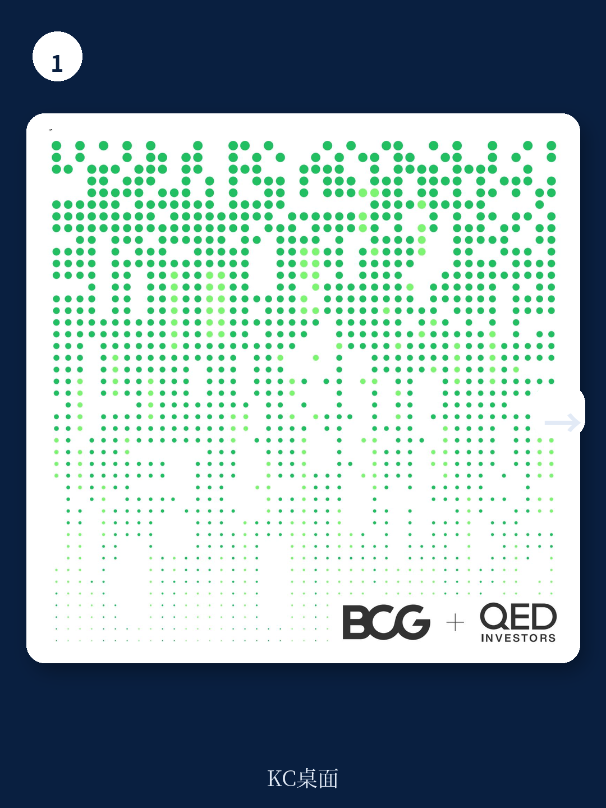
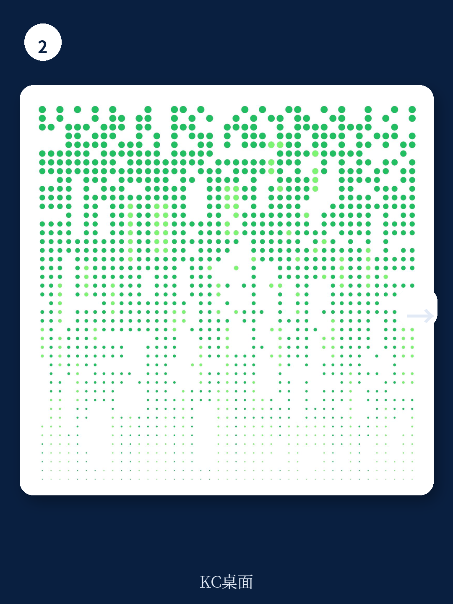

# 波士顿咨询：金融科技不是缺钱，是缺“审慎”

金融科技行业过去三年经历了一场残酷的估值回调。2021年，一家中等规模的金融科技公司可以轻松拿到20倍收入的估值；今天，这个数字已经跌到4倍。全球融资额下降了70%，晚期融资更是暴跌超过八成。如果只看这些数字，你可能会认为这个行业正在走向寒冬的尾声，甚至已经进入冰河期。

但波士顿咨询（BCG）与QED Investors联合发布的这份最新报告，给出了一个截然不同的判断：金融科技的增长从未停止，行业正在经历的不是衰退，而是规则的重写。全球金融科技收入在过去两年保持了14%的年复合增长率，如果剔除加密货币和中国市场，这一数字更高达21%。报告预测，到2030年，全球金融科技市场规模将从现在的3200亿美元增长到1.5万亿美元。

真正值得关注的信号不是融资下降，而是行业内部正在发生的结构性分化。这份报告访谈了超过60位全球金融科技CEO和投资人，得出了一个核心判断：未来金融科技公司的生存法则，将从“增长优先”转向“审慎增长”。审慎——即避免给金融系统增加风险的能力——将与盈利能力同等重要。

## 1. 这轮调整的真正赢家不是融资最多的公司，而是最快实现盈利的公司

报告中最引人注目的数据，不是融资额的下降，而是头部和尾部公司之间巨大的业绩差距。在几乎所有细分领域，前25%的金融科技公司收入增速都显著高于后25%。以支付领域为例，头部公司2021-2023年的收入年复合增长率接近40%，而尾部公司几乎停滞不前。

更关键的是，行业正在从“不惜一切代价增长”的模式转向“盈利性增长”。过去两年，全球前70家上市金融科技公司的EBITDA利润率平均提升了9个百分点。但报告同时指出，这个转变仍处于早期阶段——绝大多数公司仍然低于“40法则”（即收入增速与利润率之和超过40%）的门槛。

这意味着什么？对于投资人来说，过去那种“先烧钱抢市场份额，再考虑盈利”的逻辑已经失效。市场正在用更严格的尺度重新定价金融科技公司。那些能够同时证明增长能力和盈利能力的公司，将获得远超同行的估值溢价。

> **KC评论：** 这份报告最值得创业者仔细看的一个判断是：金融科技公司需要将EBITDA利润率提升超过25个百分点才能达到可持续水平。这个数字不是凭空估算的，而是基于对数百家公司的数据分析得出的。报告里有一个完整的“成本结构优化框架”，详细拆解了提升利润率的五个杠杆——从获客成本优化到技术架构重构。这些内容在完整报告中以图表形式呈现，对于正在制定盈利计划的创始人来说，是极其实用的参考工具。

## 2. 挑战者银行证明了一件事：规模不是护城河，盈利的规模才是

2023年是数字挑战者银行的里程碑之年。报告特别指出，全球453家数字挑战者银行中，有23家已经实现运营盈利。这个数字虽然看起来不大，但它的意义在于证明了“数字银行可以赚钱”这个曾经被广泛质疑的命题。

巴西的Nubank是最典型的案例。这家公司已经跨越了1亿用户门槛，正在成为拉丁美洲最大、最赚钱的银行。在欧洲，Monzo在2023年上半年实现运营盈利，随后获得了新一轮融资以支持其全球扩张计划。亚洲的表现同样亮眼——超过一半的盈利挑战者银行位于亚洲，韩国的KakaoBank就是其中代表。

值得注意的一点是，报告明确指出“没有单一的盈利配方”。成功的挑战者银行采取了截然不同的路径：有的靠高净值客户，有的靠交易手续费，有的靠交叉销售保险和投资产品。但它们有一个共同点：都在某个细分市场建立了不可替代的用户价值。

对于传统银行来说，这个信号既是威胁也是启示。威胁在于，数字银行已经证明了自己可以从传统银行手中抢走客户；启示在于，数字银行的盈利模式仍然高度依赖于其核心市场的规模和监管环境。那些在监管宽松、数字基础设施完善的市场中成长起来的挑战者银行，其经验可能无法简单复制到其他地区。

## 3. 监管正在成为金融科技行业最大的变量，而不再是护城河

报告中最有洞察力的分析之一，是关于监管环境的变化。过去十年，金融科技公司享受了一个巨大的结构性优势：监管套利。它们可以在传统银行面临的严格监管框架之外运营，以更低的合规成本提供类似的金融服务。

但这个窗口正在关闭。报告列出了几个关键信号：美国消费者金融保护局（CFPB）正在加强对大型科技公司和数字钱包提供商的监管；美国多个监管机构对金融科技赞助银行发出了同意令；全球范围内，从印度到巴西，各国监管机构都在收紧对金融科技公司的合规要求。

报告用了一个精妙的表述：监管正在从“金融科技的隐性补贴”转变为“行业优胜劣汰的筛选器”。那些已经建立了端到端合规能力的公司，将获得结构性竞争优势；而那些还在依赖监管模糊地带运营的公司，将面临越来越高的合规成本和监管风险。

> **KC评论：** 这份报告对监管的分析，可能是最值得国内金融科技从业者仔细阅读的部分。报告提出了一个“审慎框架”，要求金融科技公司建立从产品设计到客户服务的全链条合规能力。这个框架在完整报告中有详细的实施路线图，包括如何建立合规团队、如何设计合规流程、如何与监管机构沟通。对于那些正在考虑全球化扩张的中国金融科技公司来说，这个框架比任何融资策略都更重要。

## 4. 数字公共基础设施正在重塑竞争格局，但不是所有国家都能复制

巴西和印度是这份报告中反复出现的两个案例。巴西的Pix和印度的UPI已经证明了数字公共基础设施（DPI）如何能够彻底改变一个国家的金融生态。报告提供了一组数据：巴西的银行化人口比例在十年内从57%提升到了84%，这背后Pix的作用不可忽视。

但报告同时提出了一个重要的警示：DPI的成功高度依赖其完整性和跨系统整合。巴西央行不仅建立了实时支付系统Pix，还同步建设了数字身份系统、数据交换标准和治理框架。这种“三位一体”的架构，是DPI成功的关键。

对于其他希望复制这一模式的国家来说，挑战在于：DPI需要政府、监管机构、银行和金融科技公司之间的深度协作。这不仅仅是技术问题，更是治理问题。报告指出，许多发展中国家在DPI建设上投入了大量资源，但由于缺乏完整的治理框架，实际效果远不如预期。

这个判断对于投资人的启示是：那些在DPI完善的市场中运营的金融科技公司，可能比在DPI缺失的市场中运营的公司拥有更可持续的增长路径。因为DPI降低了获客成本、简化了合规流程、加速了产品迭代。

## 5. 生成式AI正在成为金融科技公司的“救命稻草”，但报告的判断需要验证

报告对生成式AI的讨论非常务实。它指出，生成式AI正在为金融科技公司带来巨大的生产力提升，尤其是在三个成本中心：编码、客户支持和数字营销。这对于正在艰难平衡增长与盈利的金融科技公司来说，是一个及时的生产力杠杆。

报告甚至提出了一个大胆的判断：生成式AI可能在短期内让金融科技公司比传统银行获得更大的生产力红利，因为金融科技公司的成本结构更加集中在AI可以直接优化的领域。

但这里有一个需要验证的问题：生成式AI带来的效率提升，是否足以弥补融资下降和合规成本上升带来的压力？报告没有给出明确的量化答案。它只是指出，生成式AI可能“让一些公司在解决盈利增长问题的过程中保持生存”。

对于读者来说，这里需要保持谨慎。生成式AI确实是一个强大的工具，但它不是万能药。金融科技公司仍然需要解决核心的商业模式问题：如何以可持续的成本获取用户、如何提高用户生命周期价值、如何在合规框架内运营。

> **KC评论：** 报告对生成式AI的分析引出了一个问题，但没有完全回答：生成式AI是否真的能帮助金融科技公司跨越“盈利鸿沟”？完整报告中有一张详细的图表，展示了生成式AI在不同金融科技细分领域的生产力提升潜力。这张图表的数据来源和假设条件，对于判断AI对金融科技的真实影响至关重要。我们建议读者在阅读完整报告时，重点关注这张图表背后的数据和假设。

## 6. 报告没有完全回答的问题：IPO市场何时重启，以及谁会成为第一批受益者

报告坦诚地指出，金融科技IPO市场终将复苏，但条件已经改变。那些想要上市的公司，现在需要讲一个“完整的股权故事”——如何以可持续的成本吸引用户、如何实现盈利增长、如何满足日益严格的监管要求。

但报告没有给出一个明确的时间表。它只是指出，市场正在等待那些能够同时满足这三个条件的公司。目前来看，最有可能成为IPO重启受益者的，是那些已经在盈利性增长上取得实质性进展的挑战者银行和支付公司。

这个问题的答案，可能取决于宏观环境的演变。如果利率持续高企，IPO窗口可能比预期更晚打开；如果利率开始下降，市场情绪可能会更快回暖。但无论宏观环境如何变化，一个趋势是确定的：市场对金融科技公司的估值逻辑已经永久性地改变了。过去那种“先上市再证明盈利”的模式，可能不会再回来。

---

这份报告的核心价值，不在于它给出了多少数据，而在于它提供了一个完整的分析框架。它告诉我们，金融科技行业正在从“野蛮生长”走向“审慎增长”。在这个过程中，那些能够同时驾驭增长、盈利和合规三驾马车的公司，将成为下一波浪潮的赢家。

但报告也留下了一些没有完全回答的问题：生成式AI究竟能在多大程度上改变金融科技的竞争格局？数字公共基础设施的模式能否在更多国家复制？IPO市场何时重启，以及谁会成为第一批受益者？

这些问题，正是我们每天在社群中讨论的内容。我们通过AI agent和人工review，每日生成国际投行最新中文摘要与深度解读，涵盖金融科技、支付、银行、保险等领域的核心报告。每份摘要约10-40页，包含当天最新数据图表合集，既方便喂给AI进行二次分析，也方便人工快速把握市场动态。

如果你对这份波士顿咨询报告中的图表、数据来源或未展开的分析框架感兴趣，欢迎加入我们的社群。我们会将完整报告的解读、原始图表以及更多投行对金融科技行业的最新判断，持续更新在社群中。

Personal reading notes and learning share only. Not investment advice.

