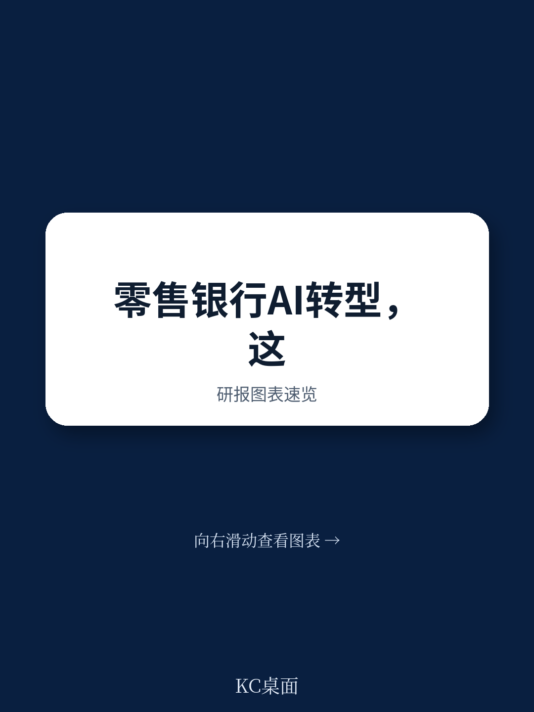
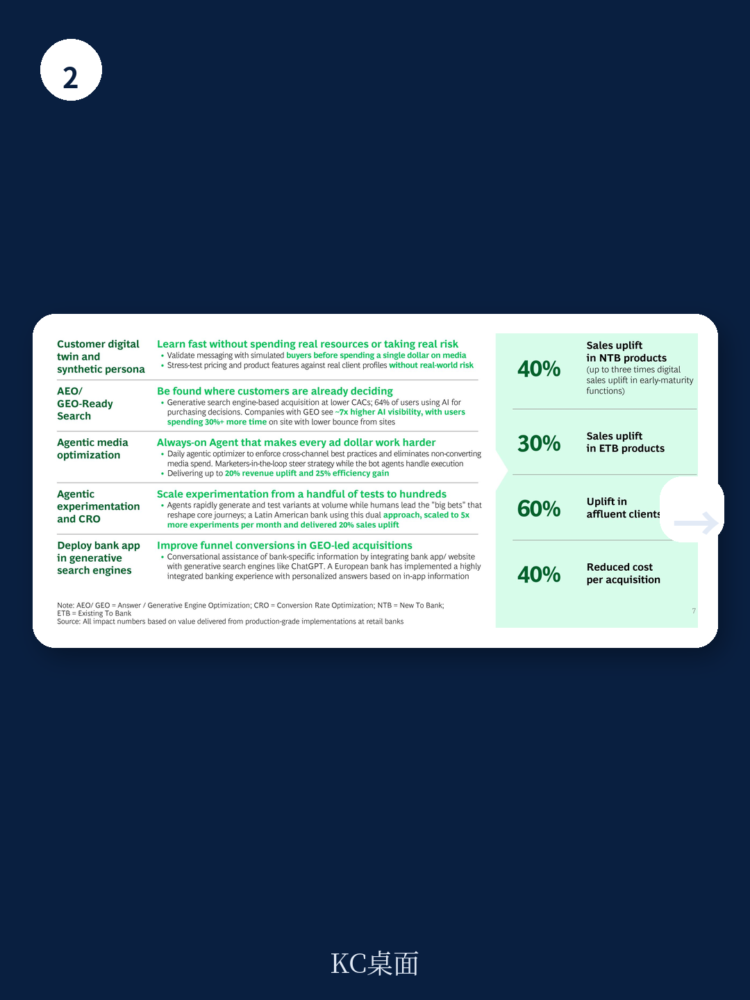

# 波士顿咨询：零售银行AI转型的“价值鸿沟”正在被AI先行者填平

零售银行正站在一个微妙的分水岭上。一方面，GenAI和Agentic AI的技术潜力已被广泛认知，几乎所有银行都在谈论AI转型；另一方面，真正将AI转化为规模化业务价值的银行却寥寥无几。波士顿咨询（BCG）在2026年6月发布的这份报告揭示了一个核心判断：**AI先行者正在通过“更少但更深”的转型策略，系统性填平从概念验证到规模化价值的鸿沟，而跟随者的差距正在加速拉大。**

这份报告的价值不在于罗列AI能做什么——那是共识——而在于回答了银行高管最焦虑的问题：为什么我的AI投入没有产生可衡量的回报？为什么别人的AI能提升40%的销售和降低70%的运营成本？

答案指向六个结构性挑战，以及AI先行者截然不同的应对逻辑。

> **KC评论：** 很多银行在AI上的投入是“点状”的——一个客服机器人、一个营销文案工具。BCG报告的核心洞察是，价值来自“面状”的、业务功能级的重新设计，而不是孤立工具的堆砌。完整报告里有一张图清晰展示了“从微用例到功能重想象”的路径差异，值得细看。

## 1. 零售银行天生适合AI，但规模化价值被六重障碍锁死

BCG的判断很明确：零售银行在结构上比其他行业更适合GenAI和Agentic AI。理由有三：数字化程度相对较高、数据积淀丰富（尽管困在旧系统中）、客户对AI应用的接受度正在快速提升。

但现实是，大多数银行的价值仍然停留在“口袋化”的阶段——某些场景有效果，但无法复制、无法规模化。报告识别了六个关键障碍：

- 无法跳出微用例思维，停留在“小打小闹”
- 没有在启动阶段就将项目与可衡量的价值指标挂钩
- 缺乏CEO级别的直接问责，AI项目在业务、渠道、技术、合规之间迷失
- 急于交付价值，导致团队建造的是“点解决方案”而非可复用的产品
- GenAI能力集中在数据科学团队，其他职能部门理解参差不齐
- 风险与合规流程在事后才被纳入，导致上线速度不可预测

这六点看似是常识，但BCG的贡献在于把它们系统化了，并且指出**AI先行者正在同时解决这六个问题，而不是逐一击破**。

## 2. 从“100个用例”到“3-4个功能重想象”

这是报告中最反直觉的判断之一。在大多数银行急于铺开AI用例时，AI先行者的策略恰恰相反：**聚焦更少、更深的功能级重设计**。

报告建议银行优先选择3-4个与自身战略高度契合的领域进行深度转型，而不是追逐大量微用例。这背后的逻辑是：只有深入到功能层面，才能触及工作流程、决策逻辑和组织协同的根本改变。

以“吸引和获取客户”为例，AI先行者正在构建五个相互关联的能力：

- 客户数字孪生与合成画像：用真实客户行为数据训练AI，在投入一分钱营销预算之前就验证提案、测试定价、降低风险
- 生成式搜索引擎优化：在ChatGPT、Claude等AI搜索入口中被客户找到，降低获客成本
- Agentic媒体优化：AI代理实时自动调整媒体购买和投放策略
- Agentic实验与转化率优化：从每月几十个测试扩展到数百个
- 在生成式搜索引擎中部署银行应用：实现个性化问答和深度交互

结果是：新到银行产品的销售提升高达40%，在早期成熟度较低的功能中，数字销售提升甚至可达3倍。

> **KC评论：** 这组数据最值得关注的不是40%的销售提升，而是“早期成熟度较低的功能中数字销售提升可达3倍”这个细节。这意味着，大多数银行在“吸引和获取”这个环节的AI成熟度还很低，早期进入者的先发优势窗口仍然敞开。完整报告里有拉丁美洲某银行通过双轨实验方法实现20%销售提升的具体案例。

## 3. 客户服务正在从“成本中心”变成“关系引擎”

BCG对客服领域的判断值得所有零售银行高管重新审视：**传统呼叫中心的投资逻辑已经过时。**

报告数据显示，AI先行者的语音机器人已经能够处理超过70%的人工通话量，成本仅为传统人工服务的五分之一，同时保持接近人类的解决效率。更关键的是，客户服务正在从“被动响应”转向“洞察驱动的主动互动”。

具体来看，三个方向正在产生可量化的影响：

- **关系深化**：AI代理主动识别客户意图和购买信号，筛选高意向线索后安排客户经理跟进。结果是一个客户经理可服务的客户数提升2-3倍，虚拟客户经理可服务的客户数提升8-10倍。
- **主动外呼提醒**：AI代理主动触发服务提醒和支付提醒，通过对话说服客户采取行动，仅在真正的异常和升级场景下才转接人工。
- **入站客户服务**：语音和文本AI代理处理大部分简单、复杂和例行查询，等待时间降低90%-95%。

这组数据背后是一个更深刻的趋势：**“每个客户都有一个全天候个人客户经理”正在从愿景变成现实**。AI代理能够捕捉每次交互的上下文，主动提供解决方案，并通过有意义的交叉销售将客户关系加深20%-40%。

## 4. 运营和信审的“隐形化”正在重塑成本结构

报告在运营和信贷领域的数据同样令人瞩目。BCG提出了“隐形运营”的概念——即AI代理自主处理非标准请求，无需人工介入，只有在真正需要时才路由到人类专家。结果是运营效率提升40%，周转时间降低70%。

在信贷领域，AI驱动的承保引擎将决策周期和后续沟通压缩到极致，报价时间加快5-10倍，同时实现100%的全量审核覆盖。在反金融犯罪领域，AI驱动的客户识别、筛查、持续监控流程可降低50%的合规成本。在催收领域，AI利用非结构化交互数据理解客户违约原因，个性化催收策略，运营成本降低约50%，净坏账核销减少10%-20%。

这些数字叠加在一起，指向一个结论：**AI正在从“辅助工具”变成“核心运营系统”**。

> **KC评论：** 报告提到“隐形运营”时有一个关键细节：它不仅仅是自动化标准流程，而是让AI代理能够处理非标准文件。这意味着AI的理解能力已经从“格式化的”扩展到“非结构化的”。这对银行来说是一个质变。完整报告里有一个关于“零人工操作泳道”如何逐步扩大的框架图，是理解这个趋势的关键。

## 5. 报告没有完全回答的问题：中国银行的特殊挑战

这份报告基于全球零售银行的实践，逻辑框架具有很强的通用性。但有几个关键问题报告没有充分展开，而这些恰恰是中国银行机构最需要思考的：

第一，**数据质量与合规环境差异**。报告假设银行拥有相对丰富的数据，但中国银行面临的数据治理挑战更为复杂——跨系统数据孤岛、历史数据质量参差不齐、以及更严格的个人信息保护法规。AI先行的前提是数据可及且可用，这个前提在中国市场需要额外的投入才能成立。

第二，**组织执行力差异**。报告强调CEO参与和业务与技术的联合问责，这在中国银行体系中面临不同的组织惯性。许多银行的数字化转型仍然停留在“科技部门推动”而非“业务部门主导”的阶段，AI转型如果仍然走这个老路，很难复制报告中的成功案例。

第三，**监管环境的不确定性**。Agentic AI的核心是“自主决策”，但在金融监管严格的市场，AI代理的决策边界、责任归属、可解释性要求都还没有明确答案。报告虽然提到“从第一天就设计风险控制”，但没有深入讨论不同监管环境下AI代理的自主权限应该如何设定。

这些未解问题，恰恰是决定中国银行能否成为AI先行者的关键变量。

## 6. 给决策者的观察框架：四个维度判断自己银行的AI准备度

基于报告的框架，我们提炼了四个判断维度，供银行高管自我评估：

**维度一：是否把AI转型当作“业务战略”而非“技术项目”？** 报告反复强调CEO直接参与、将AI目标嵌入年度运营计划。如果AI转型仍然由CTO或科技部门主导，没有业务条线的深度参与和问责，那么规模化价值几乎不可能实现。

**维度二：是否从“功能重设计”而非“工具替换”出发？** 如果团队还在讨论“用AI替换客服人员”或“用AI写营销文案”，那还停留在微用例阶段。真正的转型是“重新设计客户获取流程”“重新设计信贷审批流程”——把AI当作流程重塑的杠杆，而不是效率提升的工具。

**维度三：是否从第一天就建立了可复用的产品架构？** 报告指出，急于交付价值往往导致点解决方案，无法横向扩展。AI先行者的做法是“先花时间打好基础”，构建可复用的AI能力平台，然后在此基础上快速复制到多个业务场景。

**维度四：是否同步推进了组织能力建设？** GenAI的普及意味着“AI能力不能只集中在数据科学团队”。报告建议投资于全组织的GenAI技能提升，从个人效率提升到功能特定能力的建设。没有组织的AI素养，再好的技术也会被“不会用、不敢用”所困住。

---

这份波士顿咨询的报告提供了迄今为止最系统的零售银行AI转型框架。但它也留下了一个开放性问题：当AI先行者已经跑通“3-4个功能重设计”的闭环，跟随者还有多少时间窗口？

答案取决于两个因素：一是银行自身能否快速跨越上述六重障碍；二是Agentic AI的技术成熟度曲线会以多快的速度改变竞争格局。报告建议从第一天就开始建设基础能力，同时并行启动“速赢”的GenAI项目——这个双轨策略，或许是当前最务实的选择。

关于报告中提到的“AI先行者如何构建可复用的产品架构”“Agentic AI的监管边界如何设定”“中国银行数据治理的特殊挑战”，以及更多未在本文展开的案例细节和图表数据，我们已经在社群中分享了完整的中文摘要与解读。社群每天由AI agent加人工审校，同步国际投行最新研报，涵盖市场动态、数据图表与深度评论，既适合AI辅助分析，也适合快速把握行业趋势。

Personal reading notes and learning share only. Not investment advice.

