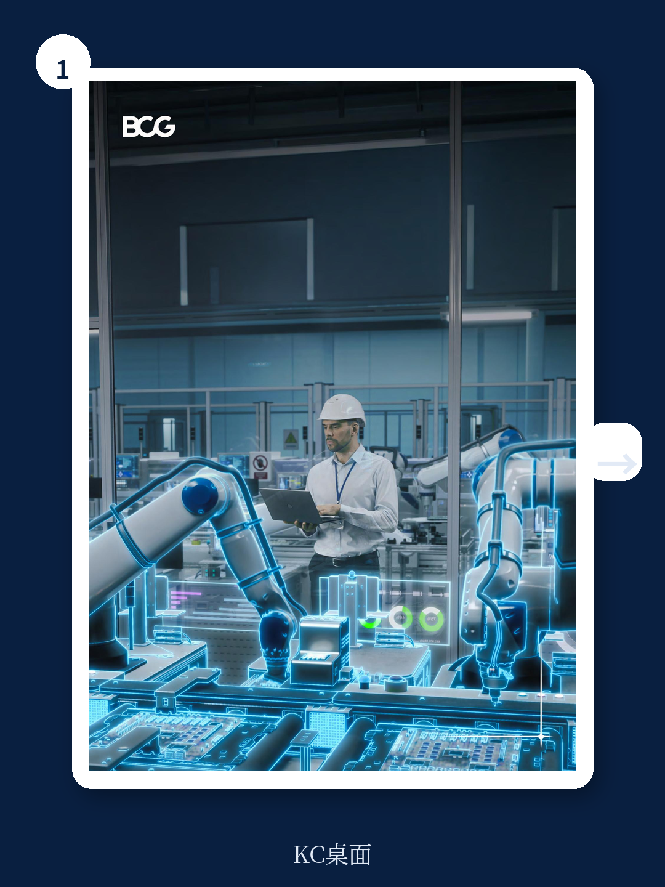
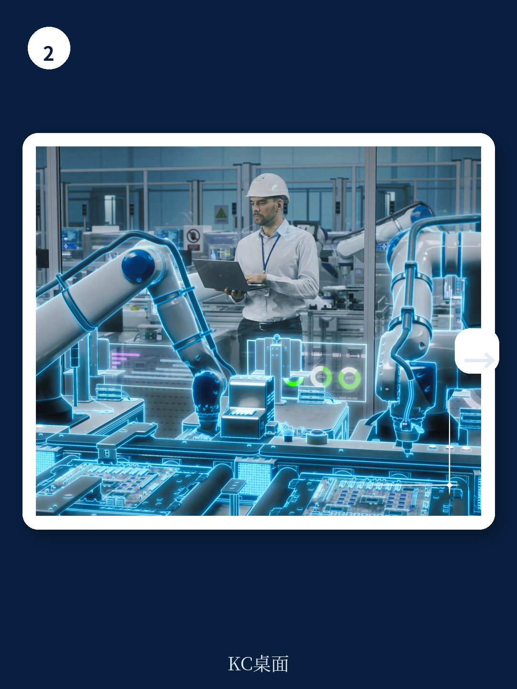

# 波士顿咨询：BCG：制造业回流不再是口号，AI正在改写全球工厂的选址逻辑

过去十年，全球制造业CEO们最常问的问题是：哪里劳动力成本最低？但波士顿咨询（BCG）在2026年6月发布的最新研报中给出了一个颠覆性的答案：这个问题已经过时了。

真正的新问题是：你的工厂能否被改造成“未来工厂”（Factory of the Future）？以及，在哪里改造，才能让这笔投资的经济回报最大化？

这份报告的核心判断是：AI驱动的生产系统正在从根本上改变制造业的竞争经济学。它不再只是关于自动化某个环节，而是关于对整个生产流程进行端到端的重新设计。其结果，是让高达60%的生产成本节约成为可能，并使得约1.03万亿美元原本位于西欧和北欧的制造业价值面临重新选址的压力，另有4400亿美元位于美国的制造价值也同样面临风险。

这意味着，过去几十年支撑全球供应链布局的“低成本劳动力”逻辑，正在被“高生产率系统”逻辑所取代。对于产业决策者而言，理解这一转变，比追逐任何单一的技术趋势都更为紧迫。

## 1. 未来工厂不是“升级”，而是对生产成本的“重构”

许多制造企业认为，引入几台机器人、部署一套MES系统，就是在迈向未来工厂。但BCG的报告明确指出，这种零敲碎打的自动化，只能带来局部、渐进的改善。真正的未来工厂，是对整个生产流程进行“重构”。

报告通过三个不同行业的模拟案例，清晰地展示了这种“重构”的威力。一家德国的咖啡烘焙和包装公司，通过整合自动化、智能过程控制、预测性维护和中央数据协调，实现了近60%的劳动力节省，总转换成本下降了超过40个百分点。一家美国的制药公司，通过数字孪生、物联网追踪和高级分析，同样将劳动力成本降低了超过60%，总转换成本下降了30个百分点。一家韩国的电池制造公司，通过连续混合、AI质检等流程再造，也实现了超过25个百分点的成本降幅。

> **KC评论：** 这些数字的惊人之处不在于单个环节的优化，而在于“系统效应”。当AI将设计、排产、物流、质检、能耗全部联动起来时，节省不是加法，而是乘法。报告中有详细的案例拆解和图表，展示了每个成本项的具体变化。想要理解这种“系统效应”的量化逻辑，完整报告里的数据模型是必读的。

这里的核心洞察是：未来工厂的价值创造，来自于对“转换成本”的重新定义。它不再仅仅是劳动力、能源和材料的简单加总，而是被一套高度集成的、AI驱动的系统所重塑。这意味着一家位于高成本国家的未来工厂，完全可能在总成本上击败一家位于低成本国家的传统工厂。

## 2. 选址的胜负手：从“劳动力套利”转向“系统套利”

既然未来工厂能大幅降低成本，那它是否意味着制造业会全面回流高成本国家？答案并非如此简单。BCG提出了一个包含六个维度的分析框架，其中最关键的是“未来工厂对本地运营成本的影响”。

报告发现，未来工厂对高成本地区的成本压缩效应更为显著。原因在于，自动化在绝对数值上节省的劳动力成本，在高工资国家远高于低工资国家。这使得高成本地区的投资回收期大大缩短。例如，在汽车行业，在美国或德国部署未来工厂的投资回收期，可能是在低成本国家的二分之一到八分之一。

然而，这并不等于高成本地区全面胜出。报告通过一个“德国 vs 中国”的对比，揭示了行业间的巨大差异。在食品加工行业，德国本土的未来工厂，在服务德国市场时，相对从中国进口，可以建立起高达14个百分点的成本优势。但在电池制造行业，即使德国工厂完成了未来工厂改造，其成本仍然比中国工厂高出15个百分点。

> **KC评论：** 这是一个极为关键的结论。它意味着“回流”或“近岸外包”并非普适真理。对于物流成本占比高、自动化潜力大的行业（如食品、饮料），靠近市场建厂并升级为未来工厂，是最优解。但对于供应链深度强、规模效应显著的行业（如电子、电池），低成本的区位优势依然存在。报告中的“制造竞争力指数”为不同行业、不同国家给出了精确的评分，这是制定选址策略的核心工具。

因此，制造业CEO们面临的真正挑战，不是简单的“回不回流”，而是要根据自身行业特征，在“升级现有工厂”和“搬迁至低成本地区”之间，做出基于量化分析的最优选择。

## 3. 关税壁垒：是“加速器”，但不是“救生圈”

报告中的另一个重要变量是关税。BCG的全球调查显示，当关税税率达到25%时，足以打破90%制造商的出口业务模型。高额关税可以迅速改变成本等式，成为推动本地化生产决策的“加速器”。

然而，报告也给出了一个重要的警告：关税保护不能替代竞争力提升。如果企业仅仅依赖关税壁垒来保护本土市场，而不投资于未来工厂的升级，那么它们将面临一个复合风险：生产成本在结构上仍然高于那些在其他地方投资了未来工厂的竞争对手。一旦贸易政策条件发生变化，这种潜在的成本劣势将瞬间暴露出来。

这提醒我们，关税是“政治变量”，而未来工厂是“技术变量”。一个理性的决策者，不能将企业的长期竞争力押注在不可控的政治变量上，而必须通过技术变量来构建真正的护城河。

## 4. 报告尚未完全回答的关键问题：人才与基础设施的“时间差”

BCG的分析框架中包含了“本地定性准备度”这一维度，评估了各国的技能水平和数字基础设施。结果显示，美国、德国、日本、韩国位居前列，而墨西哥、印度、摩洛哥等国得分较低。

这引出了一个报告没有完全展开，但至关重要的“时间差”问题。即便一家公司决定在低成本国家（如印度或越南）建设未来工厂，它是否能找到足够数量的、能够操作和维护AI驱动生产系统的工程师和技术人员？其当地的数字基础设施（如高速网络、云计算能力）是否足以支撑实时、高算力的AI应用？

报告指出，87%的受访制造商认为，获得人才和技能对于维持未来工厂的部署变得更为关键。但在现实中，人才的培养和基础设施的建设，其速度往往远慢于工厂建设的速度。这个“时间差”可能成为许多雄心勃勃的“绿地投资”项目最大的隐性风险。

> **KC评论：** 这是一个值得所有决策者深思的问题。报告提供了一个定性的国家排名，但并未深入探讨如何量化这个“时间差”所带来的成本与风险。例如，一个在印度建设未来工厂的项目，如果因为缺乏本地工程师而不得不从总部派遣，或者因为网络延迟而无法实现实时控制，其预期的成本优势可能被大幅侵蚀。完整报告中包含了对各国“定性准备度”的详细评分，以及不同投资类型（绿地vs棕地）的对比分析，这些信息对于评估此类风险至关重要。

## 5. 给决策者的行动框架：将“足迹”与“技术”视为一体

面对这个全新的竞争格局，BCG的建议是：CEO们不能再将“在哪里生产”和“如何生产”作为两个独立的问题来决策。竞争力取决于一个整合的能力：在何处部署先进制造能力，能否实现其生产力收益，并将这些能力与更广泛的全球布局对齐。

这意味着，决策流程需要被重新设计。传统的选址评估，可能先由供应链部门给出成本清单，再由技术部门评估自动化方案。但在未来工厂时代，这两个步骤必须同时进行。一个有效的做法是：建立一个包含成本、技术、人才、基础设施、地缘政治等多维度变量的“制造竞争力指数”模型，针对每一种可能的“行业-市场-投资类型”组合，进行情景模拟和量化评分。

## 文末：继续探讨之路

本文的讨论，只是揭开了BCG这份重磅研报的冰山一角。我们探讨了未来工厂如何重构成本逻辑，揭示了不同行业在选址上的巨大分化，并指出了人才与基础设施的“时间差”这一潜在风险。但报告中还有更多值得深挖的细节：比如，中国、日本、韩国、印度等主要经济体各自的竞争地位将如何演变？具体的“制造竞争力指数”方法论是如何构建的？报告中42个成本与定性因子具体是什么？

这些问题的答案，以及报告中那些关键的对比图表，都蕴含在完整报告之中。为了帮助我们的读者更高效地把握这些核心信息，我们的AI agent与人工研究团队，每天都会对包括BCG在内的国际顶级投行与咨询机构的报告进行中文摘要与深度解读。这些内容不仅包含核心洞察，还附带了原始图表与数据，方便您快速掌握市场动态，并将其作为您个人AI模型的知识输入。

如果您希望获取这份报告的完整解读以及每日更新的国际投行摘要，欢迎加入我们的社群，与志同道合的决策者一起，在这个充满变数的时代，找到确定性。我们每天都会更新约10-40页的精华内容，涵盖最新的数据图表合集，帮助您和您的团队始终走在信息的最前沿。

Personal reading notes and learning share only. Not investment advice.

