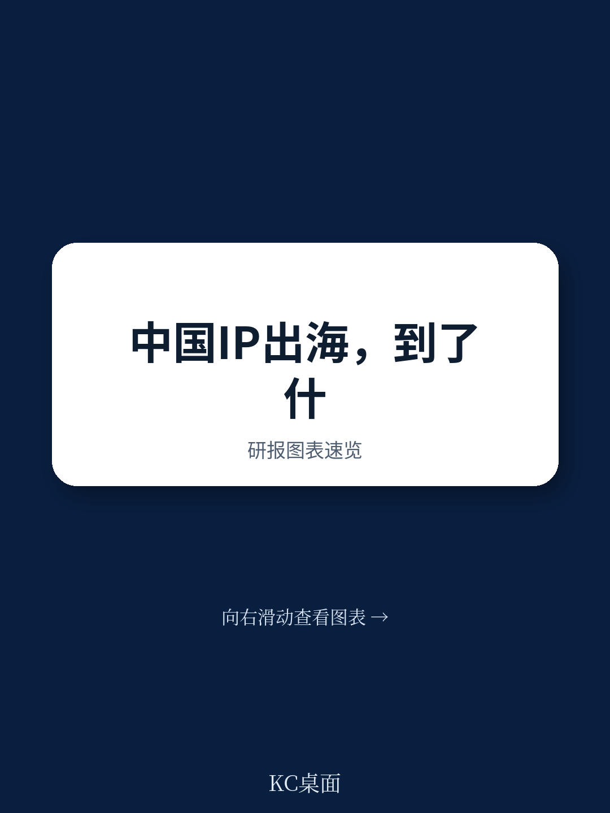
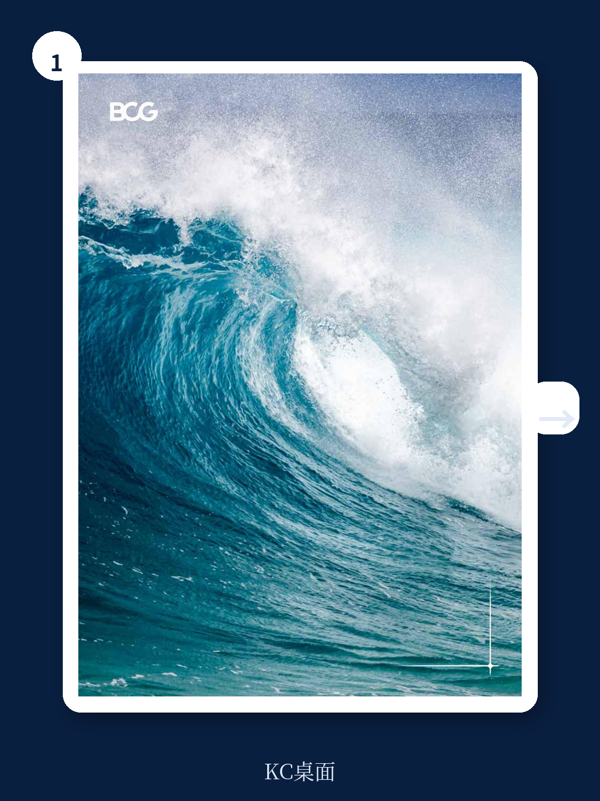

# 波士顿咨询：BCG：中国IP崛起的“黄金窗口”已经打开，但企业还没准备好

中国IP正在经历一次系统性的崛起。这不是一个令人振奋的口号，而是波士顿咨询（BCG）在一份最新研报中给出的结构性判断。

这份报告的核心主张值得每一位关注文化消费、内容产业和全球化战略的决策者认真对待：中国IP崛起的三重宏观驱动——经济基础、社会结构与政策支持——已经同时进入共振期。这种“三重共振”在美、日、韩的历史上从未同时出现过，中国IP正站在一个历史先例清晰、现实条件充分、政策方向明确的“黄金窗口期”。

但窗口期不等于必然成功。BCG的调研数据揭示了一个更微妙的现实：中国IP的全球认知度已达到74%，但海外消费者的整体兴趣评分仅为2.6分（满分5分）。换句话说，世界知道中国IP的存在，但还没有真正被吸引。

这中间的落差，正是中国IP企业需要系统性回答的问题。

## 1. 人均GDP突破1万美元后的“双驱动”正在同时发力

BCG报告的一个关键洞察是，中国IP崛起的宏观条件并非单一因素推动，而是两个力量在同时发挥作用。

一方面，中国在2019年迈过人均GDP 1万美元这一关键节点，并保持约5%的稳健GDP增速。全球经验显示，当一个国家的人均GDP超过1万美元时，居民的消费结构会从“满足生存需求”转向“追求精神价值”。美国、日本、韩国均在跨过这一门槛后，迎来各自IP文化的黄金期——日本在1980年突破1万美元后，迎来了“动漫黄金时代”；韩国在1994年突破后，K-pop产业随之崛起。

另一方面，中国正在经历的“口红效应”正在为IP消费提供额外的推动力。当经济承压时，消费者反而会增加低成本、高情绪价值的支出。日本“失落的三十年”期间，GDP增速不足1%，但动画产业规模仍保持着约5%的年增速。过去五年，中国经历了多重社会压力，文化IP正在成为居民最重要的“情绪缓冲器”。

> **KC评论：** 这意味着中国IP企业面临的市场逻辑正在发生根本变化。过去，IP消费被视为“可选消费”，经济下行时首当其冲。但现在，IP消费正在变成“情绪刚需”。这对企业的产品定价、渠道策略和用户运营都有深远影响。报告中对“口红效应”的历史数据拆解值得仔细看——日本在衰退期如何保持动漫产业增长，这可能是中国企业最需要借鉴的经验。

## 2. 城镇化率逼近70%叠加社交媒体渗透，中国拥有美日韩没有的“第二引擎”

BCG报告指出，城镇化率是文化内容能否发展成“粉丝经济”的底层决定因素。全球经验显示，当城镇化率达到约70%时，文化产业往往迎来腾飞节点。中国2024年城镇化率已逼近67%，其中9个省份已突破70%。

但真正值得关注的是，中国同时拥有全球最活跃、最成熟的社交媒体生态。这意味着中国IP产业具备美日韩当年没有的“第二引擎”——既拥有城镇化带来的线下聚集力，又拥有社交媒体驱动的线上爆发力。

这种“双引擎”结构已经在实践中得到验证。中国短剧的全球性成功，正是依托短视频平台的流量分发能力与高度市场化的制作体系，在极短时间内完成了从本土爆发到全球扩张的跃迁。2024年，中国公司主导的短剧出海收入约9亿美元，占全球海外短剧市场约90%。

> **KC评论：** 这个“双引擎”逻辑对投资人和企业家的启示是：中国IP的出海口可能比想象中更宽。不是因为内容更好，而是因为分发效率更高。但报告没有完全展开的问题是：这种分发优势能否持续？当海外竞争对手也学会使用同样的工具时，中国的先发优势还能维持多久？完整报告中对短剧产业链的拆解提供了更细颗粒度的判断依据。

## 3. 全球调研揭示的“认知-兴趣”断层是最大瓶颈

BCG面向全球消费者的调研结果值得行业反复咀嚼。74%的认知度与2.6分的兴趣评分之间的巨大落差，揭示了中国IP全球化的核心挑战：世界知道中国IP的存在，但缺乏深度认同。

从品类来看，潮玩类IP认知度最高（约91%），游戏类约60%，而影视、文学、动漫等叙事型内容的认知度仍然较低。这种“轻内容先行、重内容滞后”的格局，反映出中国IP在跨文化叙事能力上的短板。

从区域来看，东南亚、南亚等新兴市场对中国IP的认知度较高，而日本、韩国等成熟内容市场的认知度相对较低。这意味着中国IP的全球化路径需要分市场、分阶段推进：优先通过潮玩、游戏等文化门槛较低的形态建立全球认知，再逐步向影视、文学等叙事型内容延伸。

> **KC评论：** 这份调研数据最值得追问的是：为什么兴趣评分只有2.6？报告提到了“内容质量有待提升”“原创性与抄袭争议”等批评，但没有深入拆解不同市场、不同品类背后的具体原因。比如，是叙事方式的问题，还是文化价值观的冲突？是制作水准的差距，还是发行渠道的局限？这些问题的答案，可能藏在报告没有完全展开的消费者调研原始数据中。

## 4. AI正在成为打破“资本困境”的关键变量

报告中最具前瞻性的部分，是对AI赋能IP产业链的系统性分析。BCG认为，AI对中国IP产业的影响，绝非简单的技术工具赋能，而是从生产逻辑、产业模式到价值链路的全方位重构。

一个关键判断是：AI带来的效率跃升与成本优化，正在精准打破中国电影、长剧等领域长期存在的资本困境。过去，高品质制作高度依赖资金规模，导致行业对资本投入过度依赖。AI可以将特效与虚拟镜头制作的时间与成本降低约90%，使中小预算项目也有机会实现接近顶级水准的视觉效果。

在短剧、漫剧领域，AI正在催生“一人即剧组”的生产革命。国内多个AI漫剧平台已实现创作者仅需输入自然语言，即可生成带动态画面、配音和场景的短剧或动画片段。AI“仿真人”短剧的制作成本仅为传统真人短剧的1/4。

但报告也谨慎地指出，AI并非万能。在情感表达、高阶创意与人文内核等方面，人类的创造力与情感体验仍然具有不可替代性。AI难以复制真人演员的复杂情感表达，也难以替代创作者对人性和社会的深层思考。

> **KC评论：** 这部分的分析最有价值的地方，不是AI能做什么，而是它如何改变中国IP产业的竞争逻辑。过去，中国IP的短板常常被归结为“缺钱”——缺好莱坞级别的制作预算。但如果AI能大幅降低制作成本，那么真正的问题就变成了：中国IP是否真的拥有好的创意和叙事能力？报告中对AI在创意开发环节的“智能搭档”角色有所涉及，但“人机协同”模式下，创意人才的核心竞争力究竟是什么？这个问题报告没有完全回答，但值得每个从业者思考。

## 5. 报告没有完全回答的关键问题：中国IP的“长期管理”机制在哪里？

BCG报告对美国、日本、韩国IP产业链的标杆分析非常系统，但一个核心问题被轻轻带过：中国IP产业目前最缺的，可能不是创意、不是资本、不是AI工具，而是“长期生命周期管理”的制度化能力。

日本有漫画编辑制度，编辑作为“IP的长期共同经营者”，深度参与剧情走向、判断是否完结、协调跨媒介节奏，甚至作为第一道防线抵御短期商业压力对IP长期价值的损害。美国有制片人中心制，制片人在较长周期内掌握IP开发的核心主导权，确保叙事一致性。韩国有练习生制度和一站式粉丝app，构建了面向全球市场的粉丝运营闭环。

中国呢？报告提到了网文的“市场前置测试”功能、短剧的“小单快返”模式，但这些更多是“爆款思维”下的效率工具，而非“长期资产”的管理机制。一个IP如何在10年、20年的时间维度上保持叙事一致性？如何在不同的创作团队、不同的媒介形态之间维持世界观稳定？这些问题，报告没有给出明确答案。

这恰恰是当下最值得追问的问题。当中国IP企业从“做爆款”转向“做资产”时，谁来扮演那个“IP长期经纪人”的角色？是平台、是制作公司、还是创作者个人？不同的选择，将决定中国IP产业未来十年的竞争格局。

---

中国IP的“黄金窗口期”已经打开，但窗口不会永远敞开。BCG报告提供了一个系统性的分析框架，但真正的答案，需要在实践中不断验证和修正。

如果你正在关注中国IP产业的全球化进程，或者希望更深入地理解这份报告中未完全展开的产业链拆解、消费者调研原始数据以及AI赋能的实操案例，欢迎加入我们的社群。我们每天会由AI agent加人工review，生成国际投行和咨询机构的中文摘要与KC评论，daily更新，约10-40页，也包含当天最新数据图表合集。既方便喂给AI，也方便人工快速把握市场动态。

顺着这些未解问题，我们继续讨论。

Personal reading notes and learning share only. Not investment advice.

