BCG

# MY Family

## Understanding How Malaysian Families Make Decisions

A Companion to MY Impian: Uncovering the Malaysian Dream

June 2026

By Nurlin Mohd Salleh, Anis Mohd Nor, Aditi Bhatia, Omar Akbar Khan, and Haris Mohd Zukki

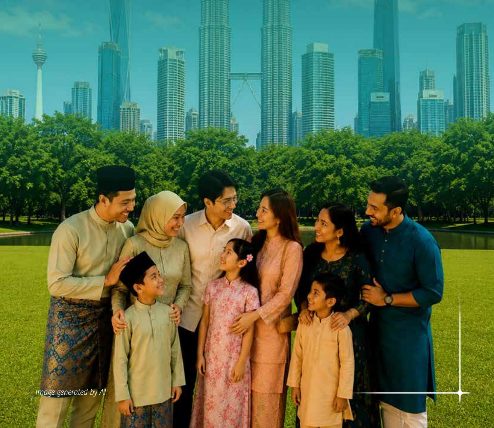

## BCG

Boston Consulting Group bridges the gap between ambition and outcomes for the world's leading companies and organizations. We are built for this era of unprecedented change — bringing strategic clarity rooted in over 60 years of deep domain knowledge, combined with applied AI shaped by our practitioners. BCG works shoulder-to-shoulder with CEOs across industries and geographies to deliver transformative impact at scale: stronger returns, transferred capabilities, and change that sticks. For more information, visit bcg.com.

## Table of Contents

01 Foreword

03 Methodology

04 Who is the Malaysian Family?

13 What do the Malaysian Family Prioritize?

16 How do Families Spend?

26 How are Trade-offs Made?

35 Final Thoughts

# Foreword

# In most Malaysian homes, the most important conversations don't happen in offices or meeting rooms. They happen after dinner, when the plates have been cleared and the family is still at the table.

A father mentions the car insurance is due. A mother says the children's tuition fees have gone up again. A grandmother wonders aloud whether it is time to see a doctor about her knee. A son or daughter, just back from their first job, quietly offers to chip in.

No agenda is set. No minutes are taken. But by the time everyone gets up from the table, something has been decided. Money has been allocated. Someone's needs have been prioritized. Someone else's has been deferred.

This happens every day, in households across the country—whether in a terraced house in Petaling Jaya, a kampung home in Kelantan, a flat in Penang, or a longhouse in Sarawak. The details differ, but the dynamic is the same. The Malaysian family is where individual aspirations meet collective reality, and where trade-offs are negotiated with limited resources and unlimited responsibility.

Last year, BCG's MY Impian report delved into what individual Malaysians dream of. The answer was clear: financial freedom alongside physical and mental wellbeing. But MY Impian also left a question unanswered. Dreams belong to individuals. Decisions belong to families. What happens when a husband's priority meets a wife's trade-off? When Gen Z aspirations collide with the cost of an elder family member's medication?

MY Family was designed to answer that question. Through a nationally representative survey of over 1,500 households, we set out to understand how Malaysian families actually make decisions as a unit—who earns, who spends, who decides, and what happens when priorities compete for limited resources.

What we found is a nation of families that are more collective, and more resourceful than they are often given credit for. But, when seen in focus, it is also more fragile than they would like to admit.

We hope these findings are useful to anyone who serves Malaysian families, whether through products, policies, or public services. Because the more accurately we understand the family, the better we can support it.

  
NURLIN MOHD SALLEH
Managing Director & Partner, and
Head of BCG Malaysia

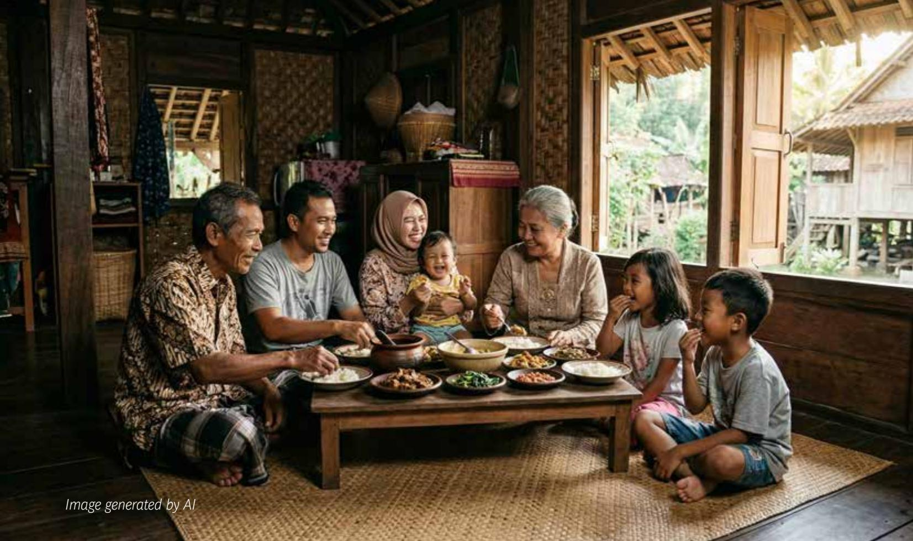  
Image generated by AI

## Introduction

Family is a cornerstone of our lived experience. But what does that mean in a modern Malaysia? MY Family is designed to bridge the gap between the dreams of the individual uncovered in MY Impian and how decisions are made as a family. Where MY Impian asked ‘What do Malaysians dream of?’, this report asks: Who is the Malaysian Family? What do they prioritize? How do families choose? How are trade-offs made?

We all have a sense of what family means to us, but we must also recognize that our circumstances—both personal and

national—influence the lived reality. The economic backdrop matters a lot. Medical inflation currently runs at approximately 15% annually. Housing affordability is a national concern. Only 36% of families trust the school system enough to skip private tuition. These pressures do not affect individuals in isolation, they affect families—yours, your neighbor’s, your friend’s.

The demographic context is also shifting, providing new pressures and possibilities for families. Fertility dropped to an estimated 1.6 children per family in 2025, below the rate required for a steady population. Life expectancy is rising. The combination of fewer children and longer-lived elders intensifies pressure on working-age Malaysians in the so-called ‘sandwich generation’.

The stakes are rising for the nation and the rakyat. Subsidy rationalization is on the national agenda. Healthcare costs are outpacing wages. The generation that built Malaysia's middle class is aging, while the generation replacing them earns less in real terms and has fewer children. The multigenerational household, once a cultural choice, is increasingly an economic necessity. Understanding how families actually function, who earns, who decides, who absorbs the cost when something gives, is no longer optional. It is the starting point for any institution that wants to serve Malaysians as they actually live. Because if we don't understand our families, can we truly understand our nation?

## Methodology

The MY Family study is based on a nationally representative survey of over 1,500 Malaysian citizen households, conducted in April 2026. [Exhibit 1].

## EXHIBIT 1

## Survey sample composition

Location $^{2,3}$

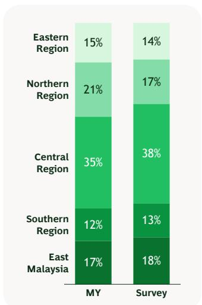  
Urban/Rural $^{3}$

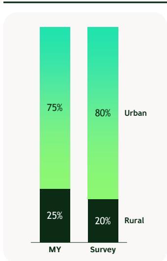  
Monthly Household Income $^{2}$

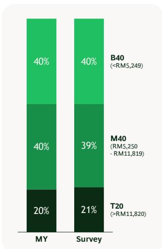  
Ethnicity $^{2}$

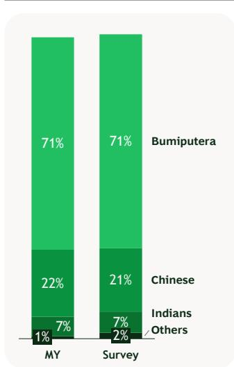  
1. Malaysians Citizens only; Sample Size = 1500 ; 2. Department of Statistics Malaysia (DOSM), Household Income and Expenditure Survey 4. DOSM, Population and Housing Census of Malaysia, 2020 4. Eastern Region: Pahang, Kelantan, Terengganu; Northern Region : Penang, Perlis, Perak, Kedah; South Region : Johor ; Central Region : Selangor, Negeri Sembilan, Melaka, Federal Territories of Kuala Lumpur and Putrajaya; East Malaysia: Sabah, Sarawak, Federal Territory of Labuan

The research was carried out in partnership with a leading quantitative research firm. The sample reflects Malaysia's household profile by location, urbanicity, household income, and ethnicity, benchmarked against the Department of Statistics Malaysia's (DOSM) Household Income and Expenditure Survey.

To complement the quantitative data, we partnered with a specialized ethnographic research firm to add qualitative depth. This included four video interviews with Malaysian families representing different family structures, with varied geographic locations, and income levels.

All qualitative work was conducted by a third-party organization through a moderator with deep expertise in Malaysian customs and behaviors, ensuring that foreign biases did not influence the results.

With this rigorous process, we are confident in the quality and integrity of our findings, which are presented in the pages that follow.

# Who is the Malaysian Family?

## Four family structures, each member with a role to play

Malaysia's families are broadly characterized across four family structures of (1) multigenerational, (2) nuclear, (3) nested, and (4) independent, where each member has their own role to play. [Exhibit 2.]

## EXHIBIT 2

## Structures and roles within the Malaysian Family

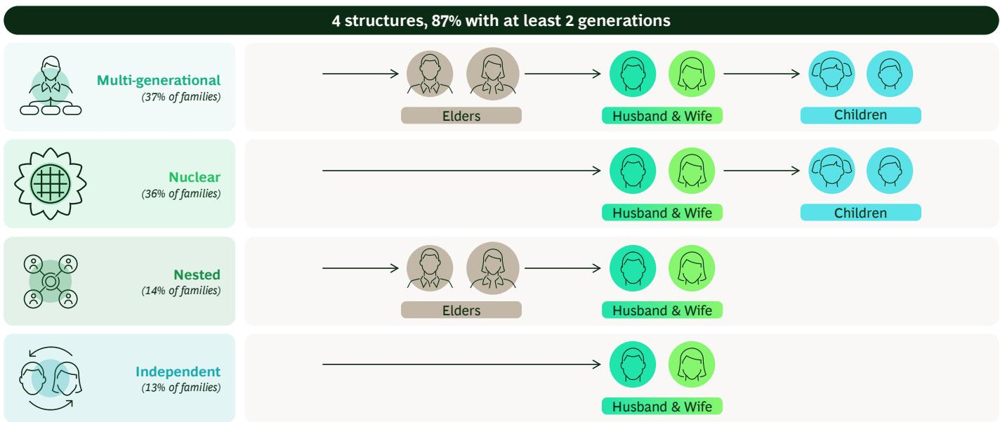

## Each with a role to play; the husband the pillar, the wife the engine, elders the safety net turned dependent, children the rising influence

## Husband Primary decision-maker, breadwinner and spender

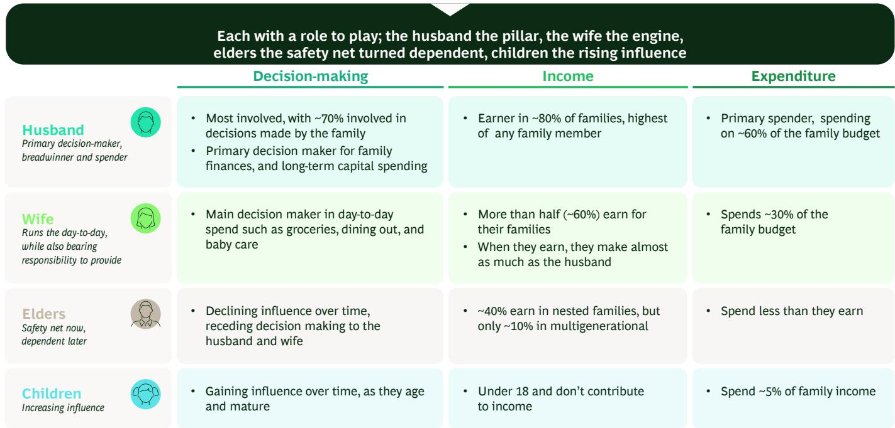

\- Most involved, with \~70% involved in decisions made by the family

## Wife Runs the day-to-day, while also bearing responsibility to provide

• Primary decision maker for family finances, and long-term capital spending

\- Main decision maker in day-to-day spend such as groceries, dining out, and baby care

## Elders Safety net now, dependent later

\- Declining influence over time, receding decision making to the husband and wife

\- Earner in \~80% of families, highest of any family member

\- Gaining influence over time, as they age and mature

\- More than half (\~60%) earn for their families

\- When they earn, they make almost as much as the husband

\- \~40% earn in nested families, but only \~10% in multigenerational

\- Under 18 and don’t contribute to income

If structures differ, and everyone has their own role to play, are products and policies designed to target the right family members?

## Husband – the primary decision maker, breadwinner and spender

The most involved family member in household decisions, with 73% of husbands involved in all decisions made. He leads on family finances and long-term capital spending: investments, vehicles, housing. He earns in approximately 80% of families, the highest of any member. And he is the primary spender, directing roughly 60% of the family budget. In most Malaysian households, the husband holds the broadest role: he earns the most, spends the most, and has the final say on the biggest financial commitments.

## Wife – the engine running the day-to-day, while also responsible to contribute financially

She leads on groceries, dining, and baby care, the daily consumption decisions that keep the household functioning. But she is not only a spender. More than half of wives ( $\sim 60\%$ ) earn for their families, and when they do, they earn almost as much as the husband. She directs approximately $30\%$ of the family budget. The wife's role defies simple categorization: she is simultaneously a provider and a household manager, contributing nearly equal income but shouldering a disproportionate share of the daily spending decisions.

## Elders – safety net now, dependent later

In nested families, 37% of elders earn and contribute to household income. In multigenerational families, only 12% do. Their decision-making influence declines over time, gradually receding to the husband and wife as the family matures. They spend less than they earn, functioning as a quiet financial buffer for the household. But the trajectory is clear: today's safety net becomes tomorrow's dependent. The elder who subsidizes the family now will eventually need the family to subsidize them.

## Children – the rising influence

Under 18 and not contributing to income, but not invisible either. Children account for approximately 5% of family spending, and their influence over household decisions grows as they age and mature. They are the emerging voice in the family, not yet shaping the big financial calls, but increasingly present in the conversations that lead to them.

We sit together and talk about what we want. Although they look to me for the final decision, I actually base my decision on their reactions.

ALIA
Mother, Multigenerational Family

## Structure

The majority (73%) of Malaysian families have children under 18. Half live with their elders. This demonstrates that the Malaysian family is, in most cases, built on a dynamic of care

## EXHIBIT 3

and support—regardless of which way the age gap leans. Together, these form four primary structures of the Malaysian family. [Exhibit 3.]

## Four Malaysian family structures

## Not with elders

Children

No Kids

Independent (DINK/SINK)

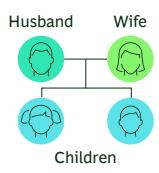

  
37% Multigenerational

## Together with elders

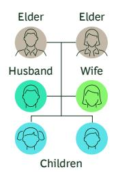  
14% Nested

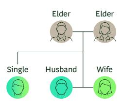

## Decision-making roles

While earnings may be equal, the guiding factors for family decisions are less evenly split [Exhibit 4]. 73% of husbands are involved in all decision making for families. On the other hand, only 56% of wives are involved in all decisions.

However, patriarchal does not mean unilateral. Our findings show that Malaysian families often act in consensus, with the majority of decisions made by many, not by one.

## EXHIBIT 4

## Involvement in household decision-making

\~70% of husbands are involved in all decision making, while wives are in \~50%; children have least say  
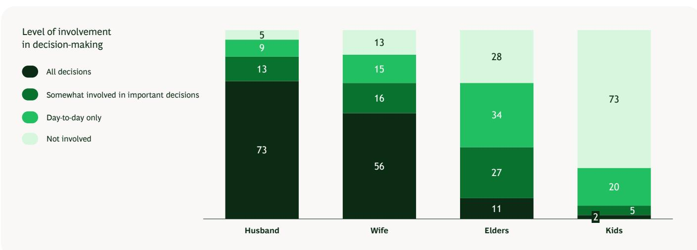  
Source: BCG Survey on the Malaysian Family, April 2026 (n=1,502)

There is a clear division of domains in Malaysian households, a lived experience which many of us may recognize. [Exhibit 5.] Our research shows that husbands set the family budget and lead decision making when it comes to long-term capital spend: vehicles, housing, appliances, healthcare and

education. Wives largely take control of day-to-day consumption expenses: groceries, dining, baby products and travel. The lines of a Malaysian household are relatively consistent, and few venture beyond them.

## EXHIBIT 5

## Primary decision-maker by spending category

While husband or wife is the primary decision maker, decision-making still takes consideration from multiple family members

Primary decision maker and number of people involved in the decision

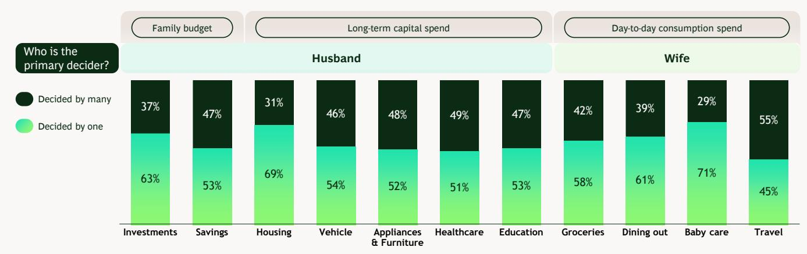  
Source: BCG Survey on the Malaysian Family, April 2026 (n=1,502)

Two important family dynamics shift over time—children gain more say as they grow older, while elders gradually cede ground. In multigenerational households, elders and husbands compete for influence at early stages, but in a familiar pattern, elders step back as the family matures. [Exhibit 6.]

## EXHIBIT 6

## Decision-making trends over time

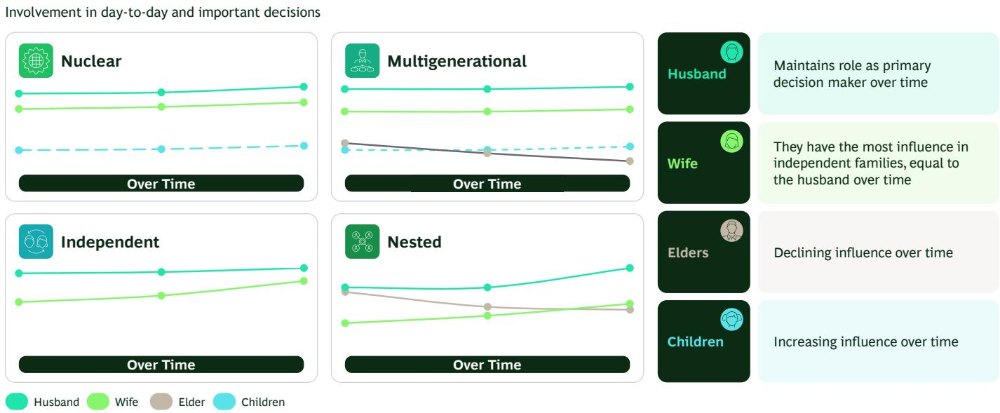  
Source: BCG Survey on the Malaysian Family, April 2026 (n=1,502)

## Income dynamics

Most families are dual-income households with approximately 70% of families having at least two income earners. [Exhibit 7.] The husband is most likely to be the breadwinner, being the income earner in 72% to 89% of families, followed by the wife at 60% to 66%. Elders support where they can, with 13% to 37% of families with three income earners across

multigenerational and nested structures. Elders tend to be earners in nested structures, typically while they are still young. As they age and the family progresses towards a more multigenerational structure, fewer elders earn and transition towards dependents.

## EXHIBIT 7

## Who are the earners in the household

## Husbands earn in \~80% of families, wives earn in \~60%

## Who are the income earners by family structure (% of families)

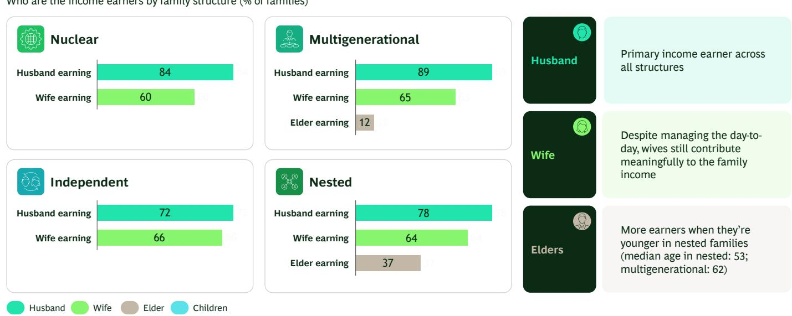

## “

He is still the breadwinner. I feel a man, a father, a husband should take that role. [But when it comes to the day-to-day, groceries, bills], Usually I handle it. If I do not handle it, someone will forget to pay, especially my husband.

ALIA Mother, Multigenerational Family

If wives contribute nearly half of household income but remain largely invisible in labor force statistics, what are we missing about women's economic participation?

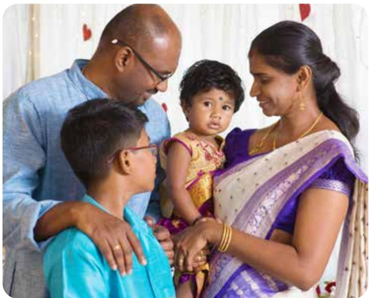

When both spouses work, the split of earnings is equal. That's shown in the fact that dual-income, nuclear families have broadly the same split between husbands (52%) and wives (48%). [Exhibit 8.] Even multigenerational families, with three earners in a household, have a roughly equal split between husbands (50%) and wives (45%), with a small top up from elders (5%). Meanwhile, in nested households, elders contribute up to 21%.

This shows clearly that women are active income earners across all family constructs. This is an important snapshot for policymakers, providing a valuable window into earnings for women who typically represent approximately 70% of those outside Malaysia's formal labor force. These earnings demonstrate that women's contribution and economic participation extends beyond formal employment, potentially through informal or unrecognized channels.

## EXHIBIT 8

## Income split in dual and multi-earner households

Income is almost a 50/50 split in dual income families; in 3 income families the load is partially redistributed to elders

## What is the median income split among income earners?

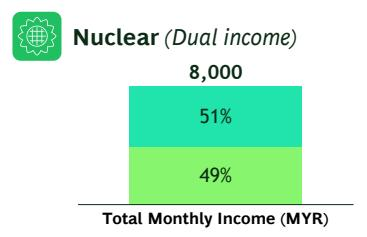

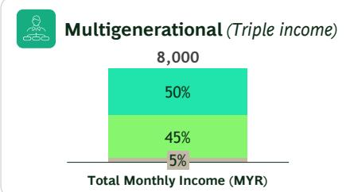

  
Earns \~50% of the family's income across structures  
Independent (Dual income)

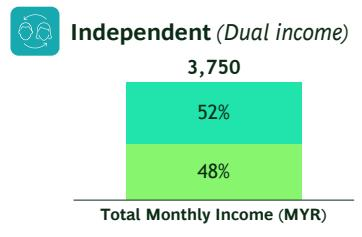

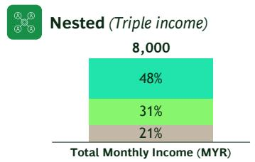  
Contributes almost equally in dual income families

  
Contributes to $\sim 20\%$ of family income in nested structures, but $5\%$ in multigenerational

Source: BCG Survey on the Malaysian Family, April 2026 (n=1,502)

## Expenditure patterns

Who controls the purse strings is an important consideration in any family. Our research shows that this is often shaped by the income and decision-making dynamics outlined earlier. The husband directs the majority of family expenditures,

managing larger capital expenses such as housing and vehicle financing. The wife follows closely, spending on day-to-day consumption such as groceries. In multigenerational families, elders spend less than 4% of household spending. [Exhibit 9.]

## EXHIBIT 9

## Expenditure patterns by family structure

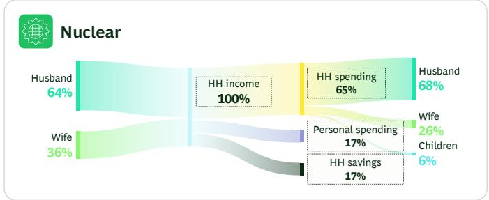

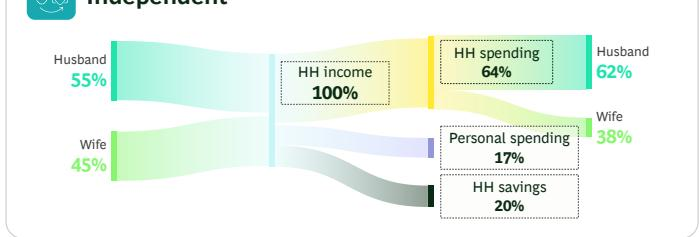

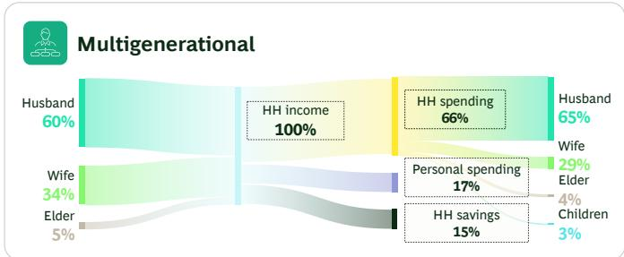

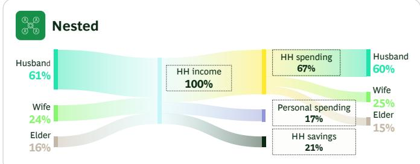  
Source: BCG Survey on the Malaysian Family, April 2026 (n=1,502)

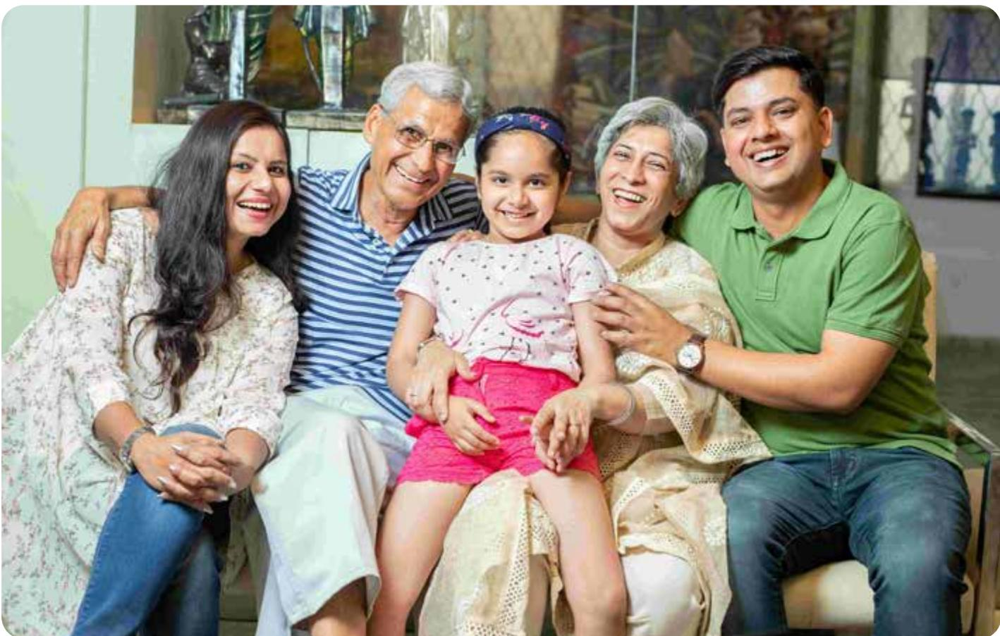

## Urban versus rural

We've talked about the division in families, but what about the differentiation of where families live? Life in a kampung has different needs and demands than life in a city like KL. The share of family structure is one prominent example—urban families are 13 percentage points more likely to be multigenerational. Urban families also have nine percentage points more three-earner households and earn approximately twice the median rural income. Big city dreams require big city income. Big city needs also impose different financial demands. Families restructure themselves accordingly. [Exhibit 10.]

When three generations under one roof is the most common household, are our housing policies aligned towards pricing and sizing for the multigenerational family?

## EXHIBIT 10

## Urban versus rural family dynamics

Urban families pool together, with more multigenerational families...

Family structure

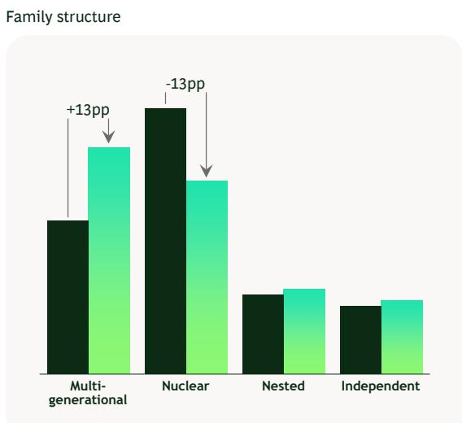  
Source: BCG Survey on the Malaysian Family, April 2026 (n=1,502)  
...and more earners in the same family...  
No. of earners

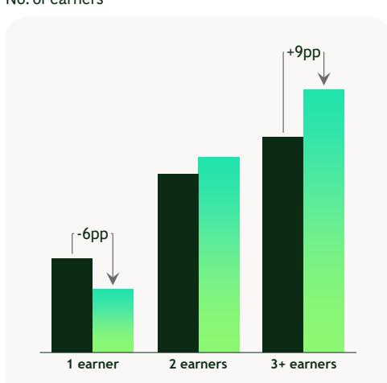  
...to make \~2x a typical rural family  
Median income

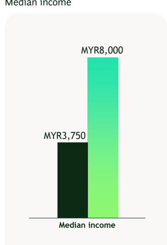

# What do the Malaysian Family Prioritize?

Foundations first, discretionary deferred

First one would be healthcare, in the sense of insurance. Secondly, the education.

RAJ
Father, Nuclear Family

What do Malaysian families dream of? The concept of security is pivotal. Stability and time to enjoy life as a family (67%), financial security to absorb health scares (65%), and a large savings fund (64%) are the top three dreams they aspire to. [Exhibit 11.] These are not earthshattering goals of an overambitious demographic—they are the building blocks of a stable life.

Discretionary priorities, travelling abroad, pursuing hobbies, owning a dream home, starting a business, all sit further down. Only 33% of families place these as priorities, showing that Malaysians root family success in a good and stable life.

## EXHIBIT 11

## Top household priorities ranked by significance

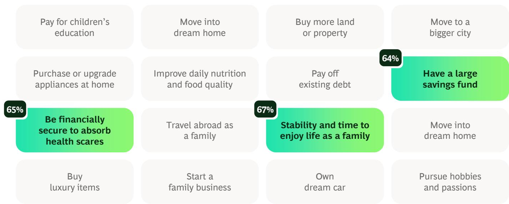  
Source: BCG Survey on the Malaysian Family, April 2026 (n=1,502)

Looking at how Malaysian families group similar dreams provides an illustration of this sentiment. [Exhibit 12.] Foundational priorities are highly significant and largely shared. Discretionary priorities are less significant and more likely to diverge. The gap between them is wide.

## EXHIBIT 12

## Foundations versus discretionary

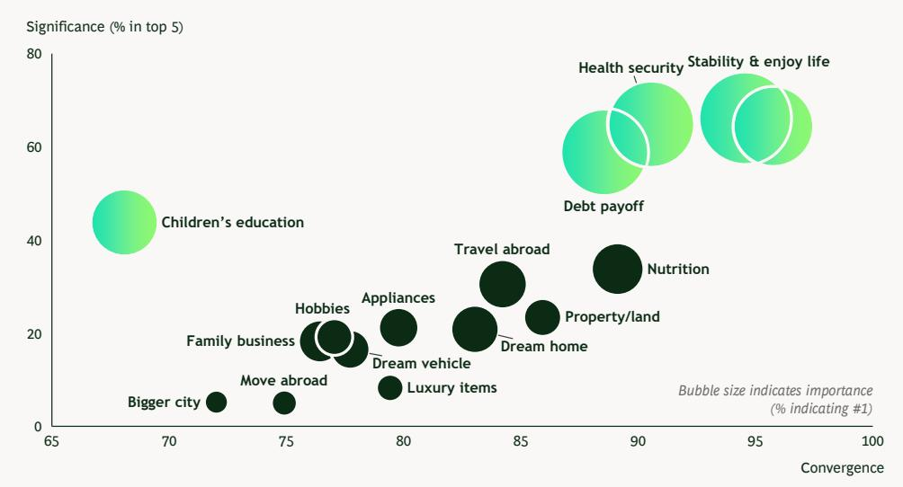  
Foundations
Priority of most families including health, savings and to live debt free  
Discretionary Priorities with lower significance and importance, pursued once the foundations are built

Note: Each dot = % foundation-oriented for that group. Line connects the two ends of each determinant. Centre = overall average (67%). Question: Below is a list of common priorities in a household. Please rank the Top 5 dreams that are most important to your household - those which you would be willing to make financial or personal sacrifices for Source: BCG Survey on the Malaysian Family, April 2026 (n=1,502)

If two-thirds of Malaysian families are still in survival mode, is the high-income nation agenda reaching households or only headlines?

## A generational divide

If income barely shifts priority orientation but children shift it dramatically, does Malaysia's declining birth rate mean a future population that is more aspirational, or one with fewer reasons to plan for the long term?

It comes as no surprise that generational divides also influence the dreams of Malaysian families. [Exhibit 13.] Gen X families are primarily (81%) focused on foundations. Gen Z families (55%) demonstrate more mixed priorities. This reflects a 26-percentage-point gap. What could influence this divide? Gen X households carry children, multigenerational homes, and decades of financial responsibility. Gen Z households, on the other hand, have not yet confronted those complex trade-offs.

Children are the second most powerful factor influencing the divide between a focus on stability and a dream of more discretionary delights. There is an 11-percentage-point gap between families with and without children. Income, surprisingly, shifts orientation by only three percentage points. This illustrates that the foundational focus is not driven by economic constraint alone—it reflects deeper values and risk perceptions that go beyond income.

## EXHIBIT 13

## Determinants of foundational versus discretionary orientation

Priority leaning (more foundational vs more discretionary)

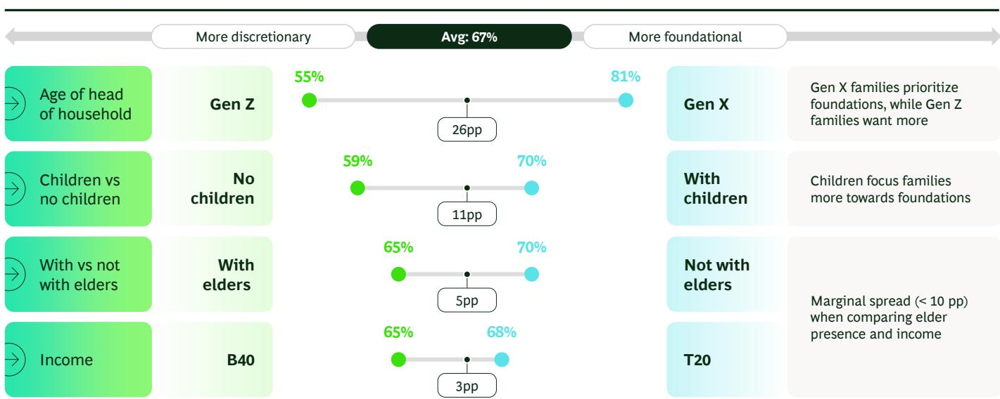  
Note: Each dot = % foundation-oriented for that group. Line connects the two ends of each determinant. Centre = overall average (67%). Question: Below is a list of common priorities in a household. Please rank the Top 5 dreams that are most important to your household - those which you would be willing to make financial or personal sacrifices for Source: BCG Survey on the Malaysian Family, April 2026 (n=1,502)

## How do Families Spend?

## Healthcare: the vulnerable come first

When it comes to a stable family, health often matters more than wealth. Yet our study shows just a quarter (27%) of families are able to pay a RM5,000 medical bill without

borrowing. [Exhibit 14.] This fragility extends well into the M40 group. The stark reality is that many Malaysian families are one medical emergency away from financial distress.

## EXHIBIT 14

## Capacity to cover healthcare emergencies

% of families who could cover a healthcare expense without borrowing or using private health insurance

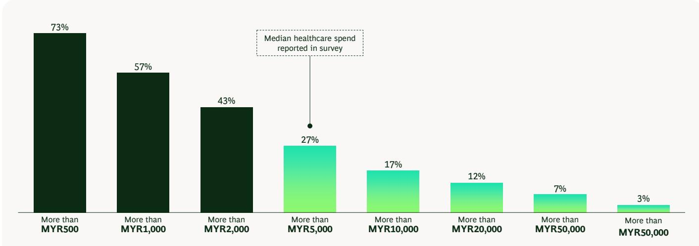

Question: What is the maximum amount your household could afford to pay for a healthcare emergency without borrowing or using your private health insurance? Source: BCG Survey on the Malaysian Family, April 2026 (n=1,502)

If a single medical bill can financially destabilize three in four Malaysian families, is the current mix of public healthcare and private insurance adequate?

% of families satisfied

Most families satisfied with govt. healthcare

## EXHIBIT 15

# Satisfaction for government and private healthcare

## However, this is driven primarily by cost-savings; private wins on other metrics

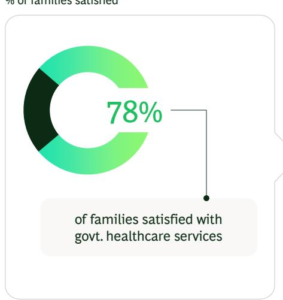

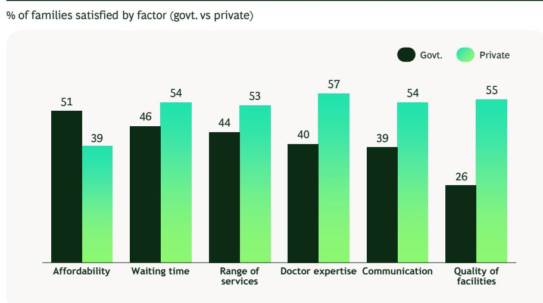  
Question: To what extent do you agree or disagree with the following statements on managing healthcare costs in your household? Source: BCG Survey on the Malaysian Family, April 2026 (n=1,507)

The age of a patient also impacts healthcare decisions. [Exhibit 16.] Children and elders are the cause of most concern, with half of families going straight to the doctor when these cohorts are ill. For adults it's just $19\%$ , instead choosing to observe, self-medicate, and wait. This health–wealth triage system is rational at the family level, but it creates a risk for the rakyat as a collective whole. Malaysia will struggle to thrive when working-age adults don't feel confident investing in their own long-term health.

## EXHIBIT 16

## First response to illness by family member type

## Whether for common illnesses or unusual symptoms, families delay care for adults but act faster for children and elders

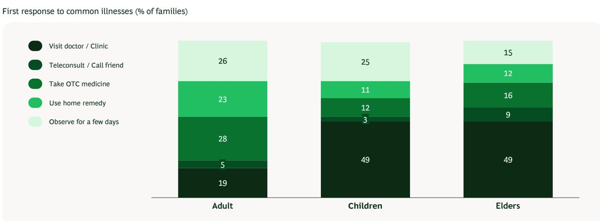  
Question: To what extent do you agree or disagree with the following statements on managing healthcare costs in your household? Source: BCG Survey on the Malaysian Family, April 2026 (n=1,507)

## We spend the most time and money to secure health, especially for my parents and our children. I've had insurance for my children from when he was 1 month old.

GARY
Father, Multigenerational Family

Health insurance provides another opportunity for stability that Malaysian families prioritize. Parents with children understand their insurance better, are more willing to cut spending to maintain premiums, and feel guilt when children are not

adequately covered. [Exhibit 17.] The parental instinct to protect changes spending behavior, even in cost-constrained households.

## EXHIBIT 17

## Children's impact on insurance attitudes

## Parents are willing to sacrifice to protect their children

Perceptions on insurance (% of families)

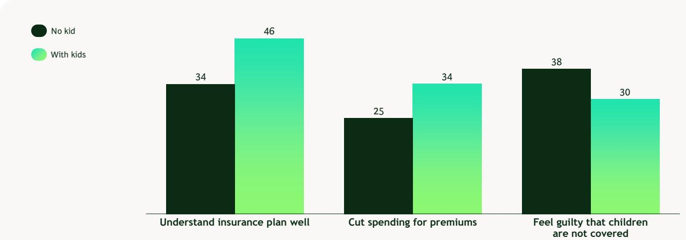  
Source: BCG Survey on the Malaysian Family, April 2026 (n=1,502)

## Savings: Pooled together to enjoy together

Families are fundamentally a support mechanism, and that's clearly true in how Malaysian families treat their finances. [Exhibit 18.] With only \~20% of their income available to save, families opt to pool their resources and save as a collective.

More than half (58%) of families pool their income, and 57% save collectively. The majority of families rely on just one bank. In Malaysia, the family, not the individual, is at the heart of savings.

Financial services by family

  
% of savings

## EXHIBIT 18

## Savings behavior and banking patterns

Families can only save between 15-20% of their income...

...so they choose to pool their income and save together...

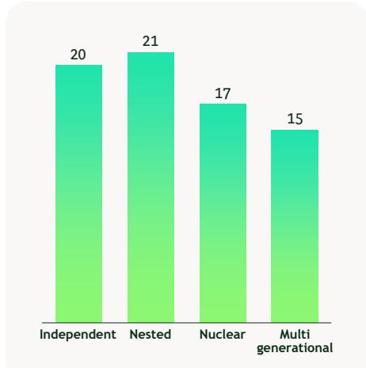  
Income management and savings style

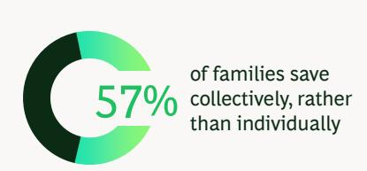

...through instruments provided by a single bank  
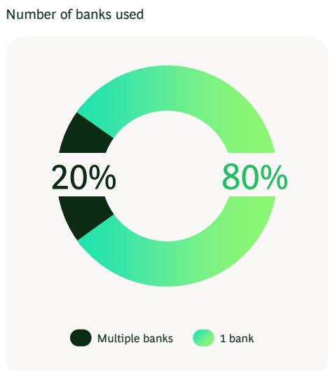  
Question: How much is spent across the following categories (e.g., food, housing, groceries, savings, etc); Do you pool your income together as a family?; Do you save together as a family?; Which of the following banks do you have an account with (for each individual in the family)?
Source: BCG Survey on the Malaysian Family, April 2026 (n=1,502)

So just how do Malaysian families direct those savings? Most families rely on conservative, safe and liquid instruments: ASB/ASNB, EPF top ups, fixed deposits, Tabung Haji, gold. [Exhibit 19.] Higher-income families diversify into equities and real estate, but these remain minority instruments. Cryptocurrency is the outlier—an asset class that has broadly equal participation regardless of household income.

## EXHIBIT 19

## Savings instruments by income

Most families invest through ASB, EPF top up and gold; more T20 families have FD, unit trusts and real estate; crypto is an instrument equally dabbled by all families regardless of income

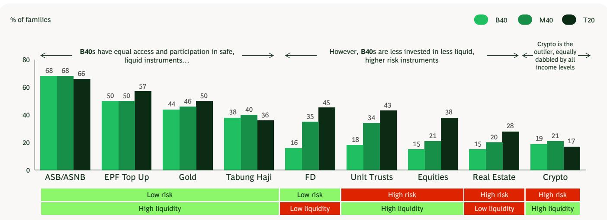  
Question: Which of the following investments do you hold for the household?
Source: BCG Survey on the Malaysian Family, April 2026 (n=372)

Why families save is equally as important as where they spend. Our research shows families are saving to fund big events such as major home renovations, weddings, and college fees.

[Exhibit 20.] Most families plan to fund these events through their savings, rather than borrowing or relying on Government support.

EXHIBIT 20

# Upcoming big events and how they will be funded

\~20% of families are expecting one of the following financial-related big events...

Which of the below big events are likely to take place in the family in the next 12 months? (% of respondents)

## % of families

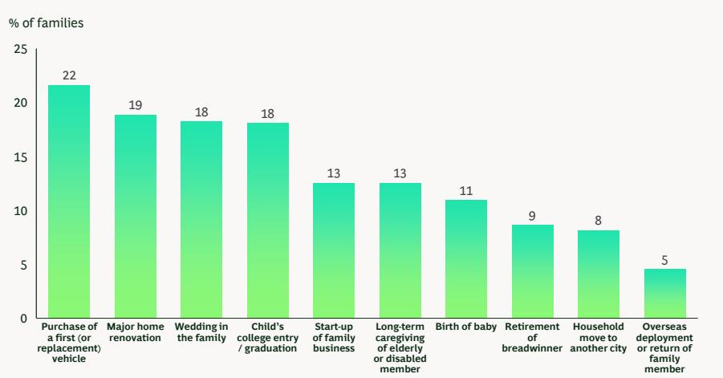

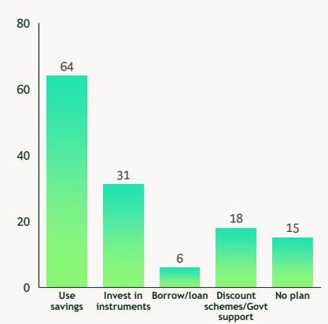

When family savings are structured around life events, and not life itself, what does this mean for long-term wealth building and who carries the cost of the years no one saved for?

## Leisure: building together, enjoying together

Dreaming of stability doesn't mean Malaysian families espouse more recreational aspirations. The family wishlist is made up of activities the family can enjoy collectively: domestic travel, trying new food as a family, overseas travel, weekend getaways.

Individual activities rank as less prominent priorities. [Exhibit 21.] Malaysian families clearly want to enjoy their time together.

## EXHIBIT 21

## Unmet leisure aspirations

Top unmet leisure aspirations are activities the family can do together such as getaways and travel  
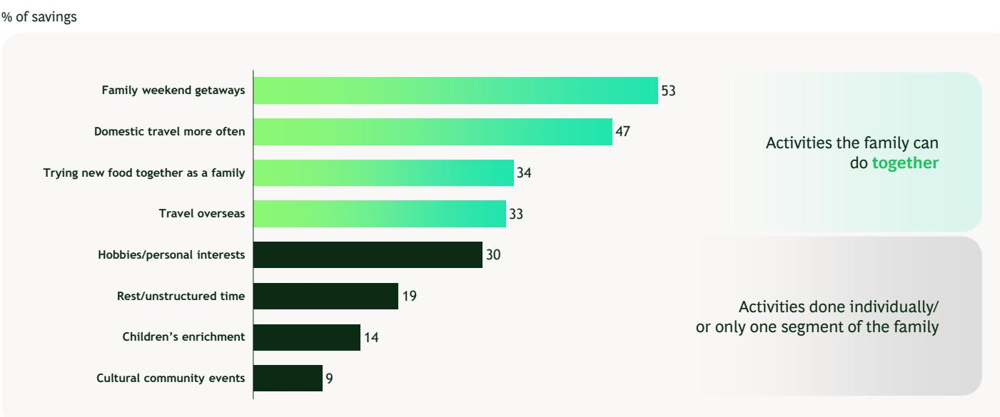  
Question: If your household had more time and money, what would you want to do more of?" Multi-select. Data based on number of respondents who ranked these aspirations in their top 3 based on 8 potential options. Source: BCG Survey on the Malaysian Family, April 2026 (n=1,502)

This is evident in the reasons why Malaysian families frequent the mall—their primary goal is to enjoy time together. Whether it’s shopping for groceries together, sharing a meal, or enjoying

entertainment through kids play areas and events, the mall outing is very much a shared experience. [Exhibit 22.]

## EXHIBIT 22

## Mall outings are a family experience

## Top 6 reasons to go to the mall can be shared family experiences

What are the top reasons your family visits a mall? (% of respondents)  
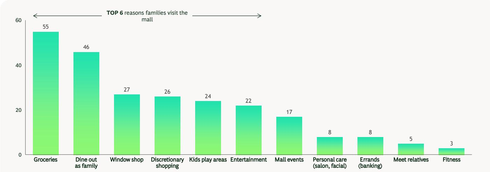  
Question: What are the top reasons your household visits a mall?
Source: BCG Survey on the Malaysian Family, April 2026 (n=1,502)

Travel is a fascinating outlier in decision-making dynamics, as family democracy kicks in to overdrive to decide between another trip to Langkawi or an aspirational visit to Tokyo, Japan. Travel involves more family members in the decision than any other spending category. [Exhibit 23.] Budgeting is also more persistent, with 44% of families budgeting monthly for travel, while 33% maintain a dedicated travel fund. The aspiration is not spontaneous. It is deliberate, structured, and collectively owned.

EXHIBIT 23

# Travel as a collectively decided expense

Travel is the most collectively decided expense among families

\# of family members involved in decisions

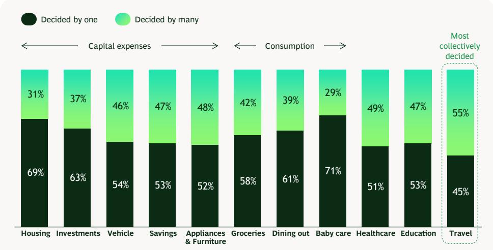  
Question: How does your household typically fund leisure and travel activities? Source: BCG Survey on the Malaysian Family, April 2026 (n=1,502)  
\~40% of families plan ahead and save for travel

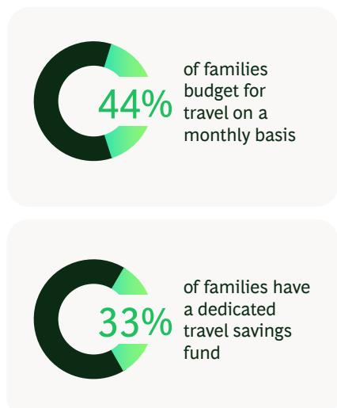

We decide where to travel to together, but the ultimate decision is made by mom. The most important thing is a new experience where we get to sleep somewhere other than our own home.

YAYA
Daughter, Multigenerational Family

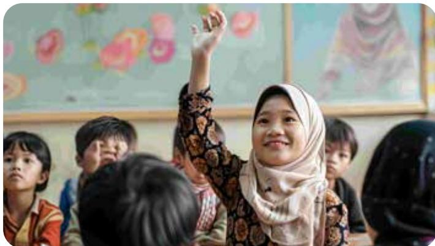

## Education: investing in the next generation

There is no stronger parental desire than to see your children succeed. That is reflected in family education decisions. While 55% of parents hold a bachelor's degree and just 7% have achieved postgraduate, 30% aspire for children to reach postgraduate level [Exhibit 24.] Half (46%) would sacrifice their own retirement savings for their children's education, and over a third (37%) would go into debt to achieve this.

When $46 \%$ of parents are willing to sacrifice their retirement for their children’s education, who supports those parents in their old age? With increasing prominence of lifelong learning, how do we shift towards a more dual-priority mindset to upskill both the current and next generation?

## EXHIBIT 24

## Educational aspirations and sacrifices

## Families want higher levels of education for their children...

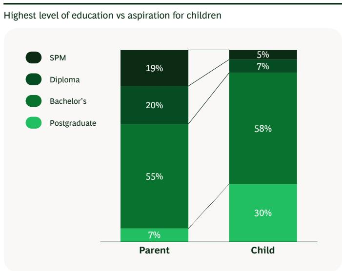  
Source: BCG Survey on the Malaysian Family, April 2026 (n=1,502)

## ...and are willing to sacrifice for education

Financial sacrifices for education

Enhancing educational opportunities is also a priority. [Exhibit 25.] Three-quarters (77%) of families invest in supplementary education. Only 36% believe school alone is sufficient, and under half (40%) trust the government to make the right reforms. It seems clear that families are supplementing a system they do not feel is sufficient with investment they can rarely afford.

EXHIBIT 25

## Additional educational activities and trust in the system

Only 23% of families have no form of additional educational activities...

## % of families with additional activities

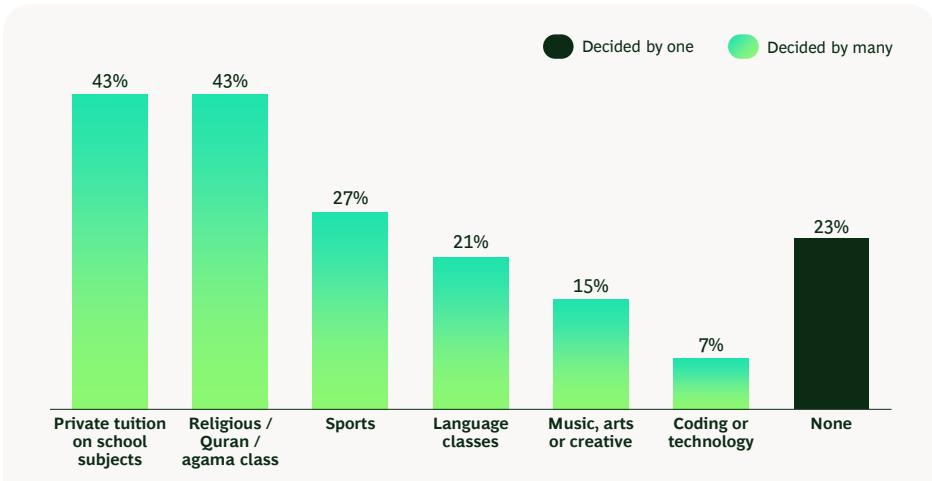  
Perception of education system

...as less than half of families trust the system

of families believe that the govt. can make the right education reforms

Question: Which of the following additional activities or enrichment programmes do your children participate in? (multi-select); To what extent do you agree or disagree with the following statements about the education system? (agree/disagree scale)
Source: BCG Survey on the Malaysian Family, April 2026 (n=1,502)

When upskilling becomes a recurring family expense rather than a one-time milestone, does Malaysia's education financing model need to be rebuilt from the ground up?

# Telecommunications: fragmented and price-driven

Connections are at the heart of family, which means telecommunications are a big part of a modern family. Malaysian families have different approaches to address this, with only 30% focused on one telco provider. [Exhibit 26.] The primary switching driver is price, not family plans. In banking, families consolidate. In telco, they haven't found a reason to.

EXHIBIT 26

# Telco usage and switching factors

Families don't consolidate, they use whatever each person signed up with

\# of providers per family

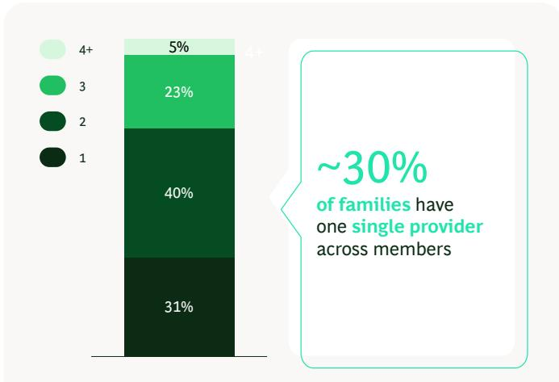  
Price would be the main factor to switch to another provider, not convenience  
Reasons to potentially switch telco providers

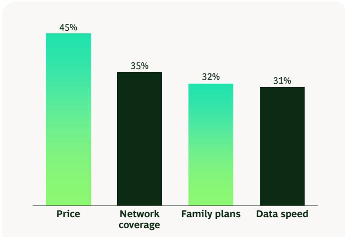  
Question: Mobile service provider per household member; Please rank the following factors in order of importance when considering switching telco providers. Percentages represent % ranked in top 3  
Source: BCG Survey on the Malaysian Family, April 2026 (n=1,502)

# How are Trade-offs Made?

## Income determines progress

How do Malaysian families achieve progress towards their dreams? Higher-income households work on more priorities simultaneously and progress faster on each one. [Exhibit 27.] The financial differences mean the gap between B40, M40, and T20 is substantial and systematic. The question is perhaps not whether families want different things. They don't. The question is whether they have the resources to achieve them.

If B40, M40, and T20 families share the same priorities, but only income separates their outcomes, are the barriers primarily about earnings, or about the cost of the products and services families need?

## EXHIBIT 27

## Activity and progress on priorities by income

Higher-income families are actively working on more priorities and progressing faster

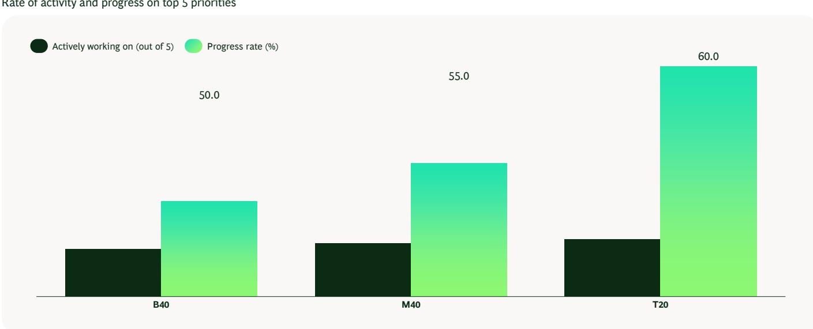  
Question: Please describe your household's current progress on its top 5 priorities  
Source: BCG Survey on the Malaysian Family, April 2026 (n=1,502)

## Four archetypes of the Malaysian family

Exploring the priorities and potential of Malaysian families provides a clearer picture of the national landscape. This gives us

## EXHIBIT 28

a view into four main archetypes split by demographics, financial resources, and proximity to achieving their dreams. [Exhibit 28.]

## Four archetypes of the Malaysian family

## Foundations

24% Firefighters

Focused on core pillars but still building the foundations, saddled with burden of survival

Primarily B40 and rural families, with most vulnerable structures (e.g., solo parent, sandwiched)

19%
Aspirants

Want more from life and trying to secure foundations and without foregoing aspirations, but yet to secure either Primarily B40, urban, and younger families

44%

Source: BCG Survey on the Malaysian Family, April 2026 (n=1,502)

Builders

Built the foundations and focused on strengthening each pillar through long-term and diversified strategies across pillars

Primarily M40, T20 urban families, with Millennial and Gen X head of family across nuclear and multigenerational structures

13% Trailblazers

Foundations in place and actively building beyond, each pillar reinforced, each aspiration within reach
Younger T20 families, with no kids with support from elders

Discretionary

## Firefighters (24%)

Firefighters are fighting to build solid foundations. They tend to be more rural, more B40, and more vulnerable. [Exhibit 29.] Firefighter families are overrepresented in solo-parent and sandwich household structures—the arrangements where financial pressure is most acute. They typically have two earners, most commonly led by a millennial or Gen X head of family. Most families are from the multigenerational structure—suggesting pressures as the sandwich generation—hinting this is a barrier towards expanding their families.

“We live moderately, not extravagantly, but we still have what we need. We pool money together, and when we have extra money we try to set it aside. The most important thing is that the children are happy and have enough education and knowledge.”

Mother, Firefighter Family

## EXHIBIT 29

Understanding Firefighters  
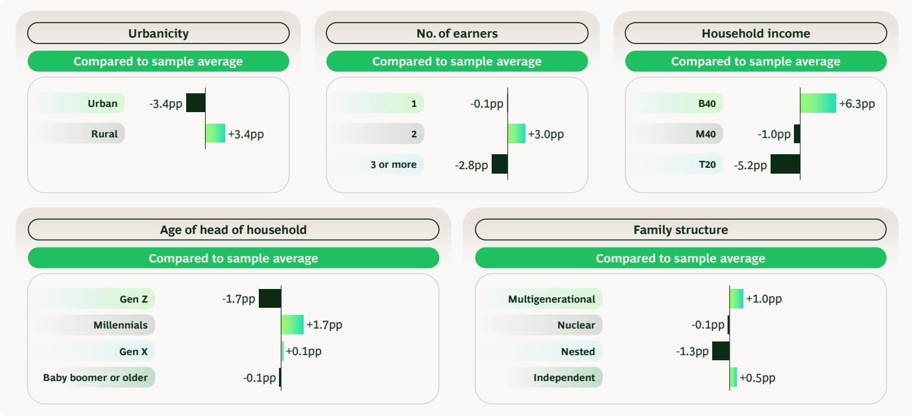

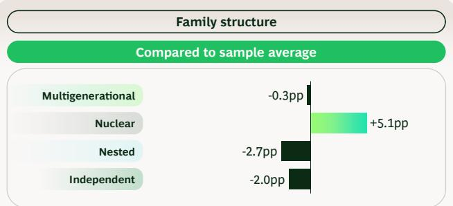

## Builders (44%)

Builders reflect the Malaysian middle class in its most recognizable form. This archetype skews urban, M40 and T20, with millennial and Gen X heads of family. [Exhibit 30.] They are predominantly nuclear families. Gen Z head of families are notably underrepresented in the Builder archetype, which tells you something important—it is not a segment you are born into. This is a segment you age into, after years of earning, saving, and building the discipline that defines the archetype.

“Me and my wife contribute the income and manage it together. We have had savings for a while now. We spend most the time and money in securing health, so that we can travel to more places in the future.”

## Father, Builder Family

## EXHIBIT 30

## Understanding Builders

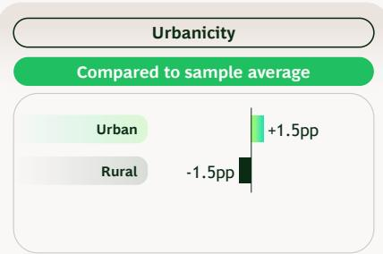

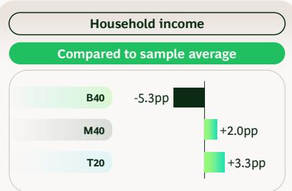

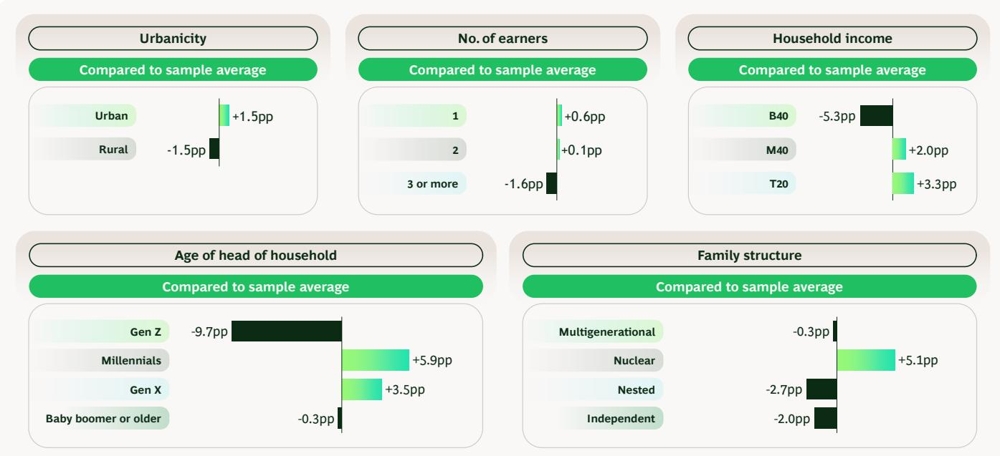

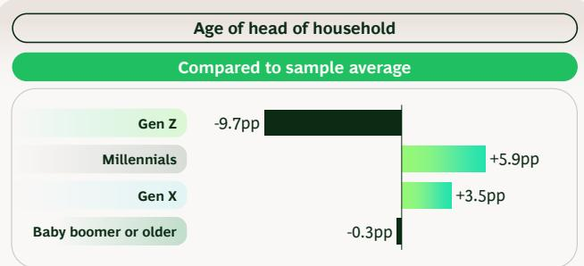

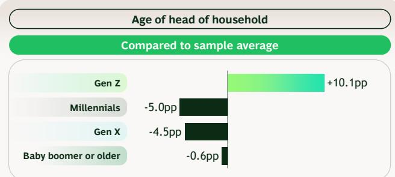  
Father, Aspirant Family

## Aspirants (19%)

Aspirants are the big city dreamers. They are disproportionately urban, B40, and led by a Gen Z heads of household. [Exhibit 31.] They are not typically nuclear families—they skew towards nested and independent structures, suggesting households still in formation or still embedded within wider family networks. They are more likely to have three or more earners, pooling income across members to make urban life work. The profile is distinctive: young, urban, connected, and earning collectively.

“Sometimes when I get back home early, I will go to gym for workout, and sometimes will play football. We try to travel and spend time together, usually go to hike, short stay near mountain, and have road trips. At least we make sure we go to restaurants and eat together on Sunday.”

## EXHIBIT 31

Understanding Aspirants  
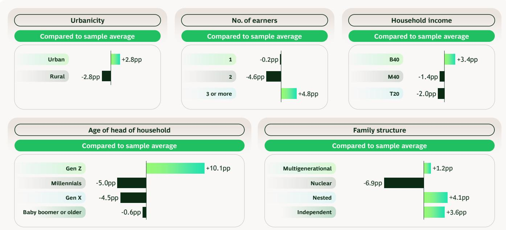

## Trailblazers (13%)

Trailblazers are the youngest and most advantaged segment. They skew T20, urban, and towards nested and multigenerational structures rather than nuclear ones. Most do not yet have children. [Exhibit 32.] They typically have three or more earners, benefiting from the income support of co-resident elders. The Trailblazer profile is one of potential rather than permanence: high income, low responsibility, and the structural support of an older generation. The question is what happens when the next stage of family life begins.

"The focus is on health, travel and future business ownership. Savings is important, but its also important to enjoy time together. We are looking for opportunities to purchase land, but at the same time we are very excited and planning for travelling to Italy-Venice next year."

Mother, Trailblazer Family

## EXHIBIT 32

Understanding Trailblazers  
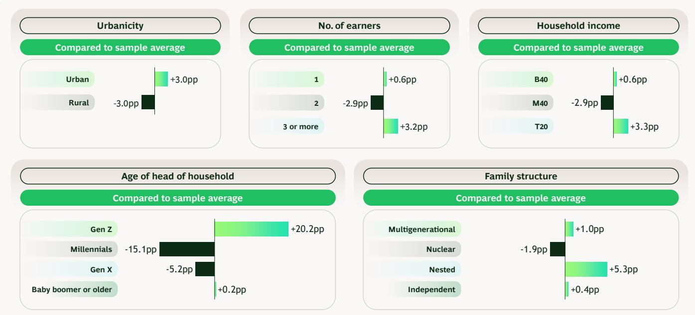

## Income trade-offs

The four archetypes do not just differ in what they prioritize. They differ in how they respond when life gets expensive. [Exhibit 33.] The same pressures—rising cost of living, a medical bill, a child’s school fees—produce fundamentally different behaviors depending on which quadrant a family occupies.

## EXHIBIT 33

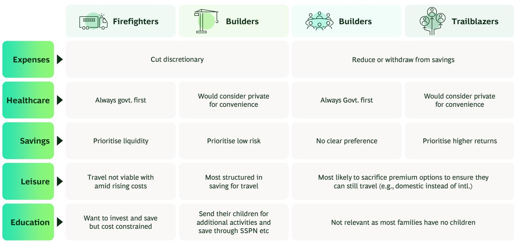  
Source: BCG Survey on the Malaysian Family, April 2026 (n=1,502)

When money is tight, the split is clean. [Exhibit 34.] Firefighters and Builders cut discretionary spending: cheaper brands, fewer meals out, less of everything non-essential. Aspirants and Trailblazers do the opposite. They reduce or withdraw from

savings, protecting their consumption in the short term at the expense of long-term financial security. The trade-off reveals the archetype: when squeezed, do you protect your lifestyle or protect your savings?

## EXHIBIT 34

## Expense trade-offs

Up to 72% of builders and firefighters cut discretionary compared to 47% among aspirants and trailblazers  
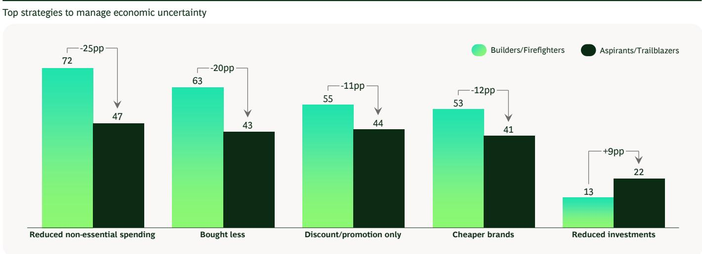  
Question: You mentioned that prices have increased in some household spending categories over the past 12 months. Which of the following, if any has your household done to manage these price increases?  
Data based on number of respondents who ranked these strategies in their top 3 based on 8 potential options.
Source: BCG Survey on the Malaysian Family, April 2026 (n=1,502)

Bars = deviation from overall average (pp). Only positive deviations >5pp shown in colour. Activities: E4. Funding: E11.

In healthcare, the divide follows income, not priorities. [Exhibit 35.] Firefighters and Aspirants, both primarily B40, default to government facilities first. Builders and Trailblazers, with more

financial room, consider private for convenience. Cost is the universal first priority. What differs is whether the family has a second option.

## EXHIBIT 35

## Healthcare trade-offs

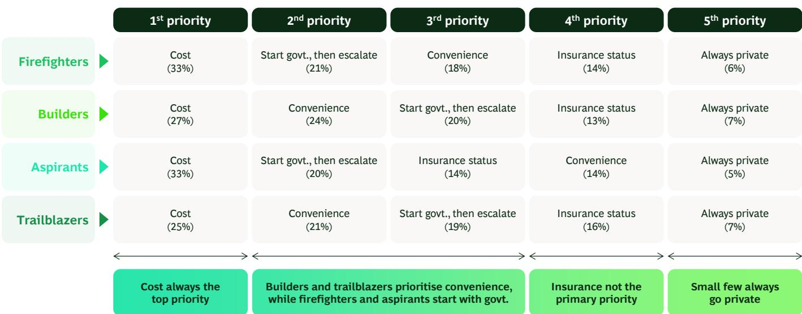

Savings behavior splits three ways. [Exhibit 36.] Firefighters prioritize liquidity: whatever little they save must be accessible for the next emergency. Builders prioritize lower risk: steady, predictable instruments that compound over time. Trailblazers

prioritize higher returns, and can afford to. Aspirants sit in the middle with no clear preference, pulled between the caution their income demands and the ambition their mindset craves.

## EXHIBIT 36

## Savings trade-offs

## Family archetypes spike on different investment priorities

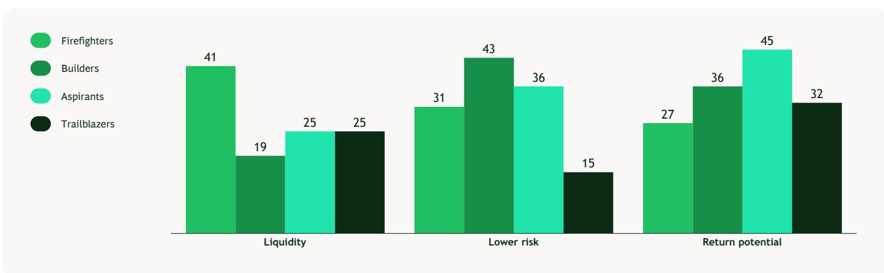  
Question: Which of these do you prioritise most when investing (% of top 1)  
Source: BCG Survey on the Malaysian Family, April 2026, n=1,502

Source: BCG Survey on the Malaysian Family, April 2026 (n=1,502)

It's in that all-important aspiration for adventure that the contrast is sharpest. [Exhibit 37.] Firefighters have effectively stopped travelling. Builders are the most disciplined savers for travel, budgeting monthly, and planning ahead. Aspirants and Trailblazers both refuse to give up travel entirely, but find ways to

## EXHIBIT 37

## Travel and Leisure trade-offs

## Firefighters barely spend on leisure, builders are most proactive in saving

Approach to leisure by archetype (% of families)

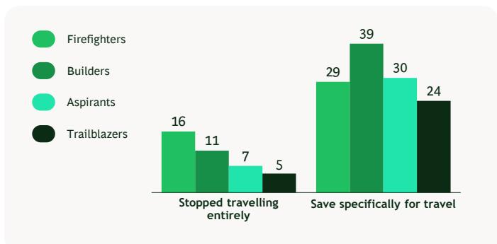  
Source: BCG Survey on the Malaysian Family, April 2026, n=1,502  
Aspirants and trailblazers find a way to make travel still work at an affordable price  
How families make trade-offs for travel (% of families)

Education requires a more nuanced view. Since most Aspirants and Trailblazers do not have children, our focus narrows to Firefighters and Builders.

Both want to invest in the next generation, but the impacts are different. [Exhibit 38.] Builders act on this desire with

make it work at a lower cost—domestic instead of international, budget airlines instead of premium. The Aspirant would rather have a lesser version of the experience than none at all.

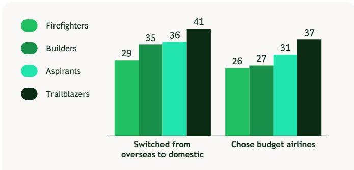

supplementary activities, structured savings through the National Education Savings Scheme (SSPN), and private tuition. Firefighters share the same ambitions but are cost-constrained at every turn. The gap between these two is not one of values—both dream of a better life for their children. The difference is one of means.

## EXHIBIT 38

## Education priorities for Firefighters and Builders

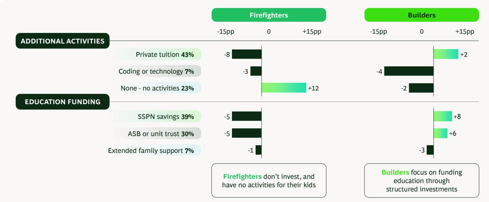  
Note: Aspirants and Trailblazers excluded as most of these households have no kids

## Final Thoughts

Family is our heart. It is the motivation for so many of our dreams and goals. It is a unit which is at once the reason for what we do, and the foundation of how we enjoy it. But what's clear from our research is the Malaysian family is stretched—stretched between generations, between earning and spending, between what it wants and what it can afford.

The fabric of Malaysian families is not fraying, but it is under pressure. Our study shines a spotlight on a rakyat making difficult trade-offs with remarkable discipline and very little margin for error. The question for anyone who serves Malaysian families—whether through products, policies, or public services—is whether they are designing for the family as a collective, rather than individual units.

Malaysia's demographic makeup comprises a diverse tapestry of people and possibilities—a reality reflected in the families which underpin our dynamic and ambitious nation. Recognizing those differences provides a pathway to addressing their struggles, but doing so requires a nuanced look at where hurdles are positioned for different families across the nation.

## Struggles are different, but priorities converge

Malaysian families may share dreams, but they face differing struggles. Firefighter families and Builder families share the same educational aspirations for their children, but their capacity to act is radically different. This is a prominent example of how a one-size-fits-all approach risks serving no family well.

## Husband and wife play different roles; both matter

Husbands manage the budget and lead on capital decisions. Wives drive daily spend. Marketing an investment product to mothers, or a grocery service to fathers, may not fully reflect the common architecture of the Malaysian family.

## Decisions are made as a family

Malaysian families share decisions and investment. Fifty-eight percent pool income. Fifty-seven percent save collectively. Travel is the most collectively decided expense. There is a prime opportunity to inform strategic product design based on the family as the customer.

## Families prioritise the most vulnerable first, particularly children and elders

Adult decision-makers are willing to defer their own needs but prioritize others. In healthcare, families rush children and seniors to the doctor while adults wait. Often the economic realities inform these decisions—with only 27% able to cover RM5,000, the protective instinct outpaces the financial capacity.

## Parents sacrifice their own future for their children

Children are our love and our legacy. That's why half (46%) of parents would give up retirement savings for their children's education. A third (37%) would go into debt for the same goal. Policymakers should be aware of this risk—households who sacrifice retirement savings create a future generation of elderly Malaysians without financial security, perpetuating the multigenerational dependency structures families are already navigating.

## Looking ahead

Malaysia is a nation of dreamers, and in many cases, families are at the heart of those dreams. Recognizing how our families plan and react is fundamental to understanding our shared national future.

There are firm points to anchor on in a sea of change. The multigenerational household is not going away, but Gen Z is likely to reshape family financial behavior. We will all still want what's best for our children, but the education gap between Firefighters and Builders will compound due to their differing abilities to achieve this. We all want the best healthcare, but with an overdependence on government facilities, are we equipped to support an aging population? Against this backdrop, the broader question of subsidy efficiency will only become more pressing.

MY Family is a portrait of a nation's households at a specific moment, and when it comes to family, now is often the most important moment we have. The structures, priorities, and trade-offs we illustrated here will evolve, but the fundamental insight will endure. The Malaysian family is the unit that matters—recognizing it, respecting it, and celebrating it is the best path to serving it well.

## About the Authors

  
Nurlin Mohd Salleh
Managing Director & Partner, and
Head of BCG Malaysia
Salleh.Nurlin@bcg.com

  
Anis Mohd Nor
Partner
Core Member of Kuala Lumpur Office
MohdNor.Anis@bcg.com

Aditi Bathia
Project Leader
Core Member of Singapore Office
Bathia.Aditi@bcg.com

  
Omar Akbar Khan
Project Leader
Core Member of Kuala Lumpur Office
AkbarKhan.Omar@bcg.com

  
Haris Mohd Zukki
Consultant
Core Member of Kuala Lumpur Office
MohdZukki.Haris@bcg.com

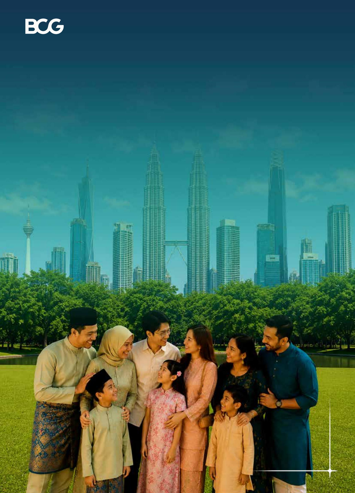