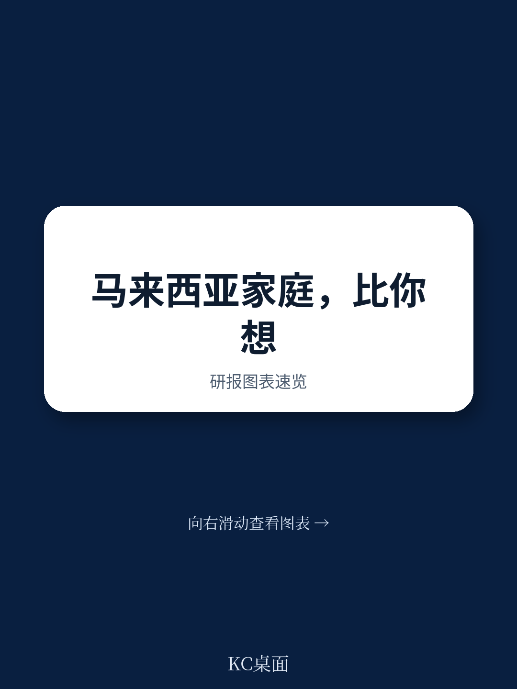
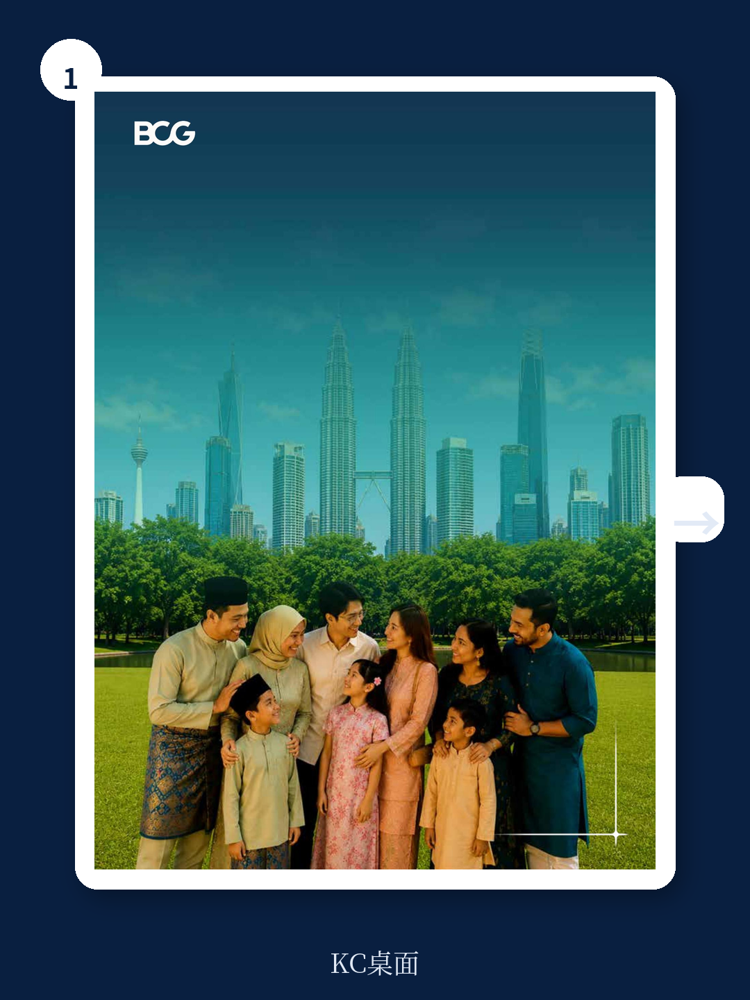
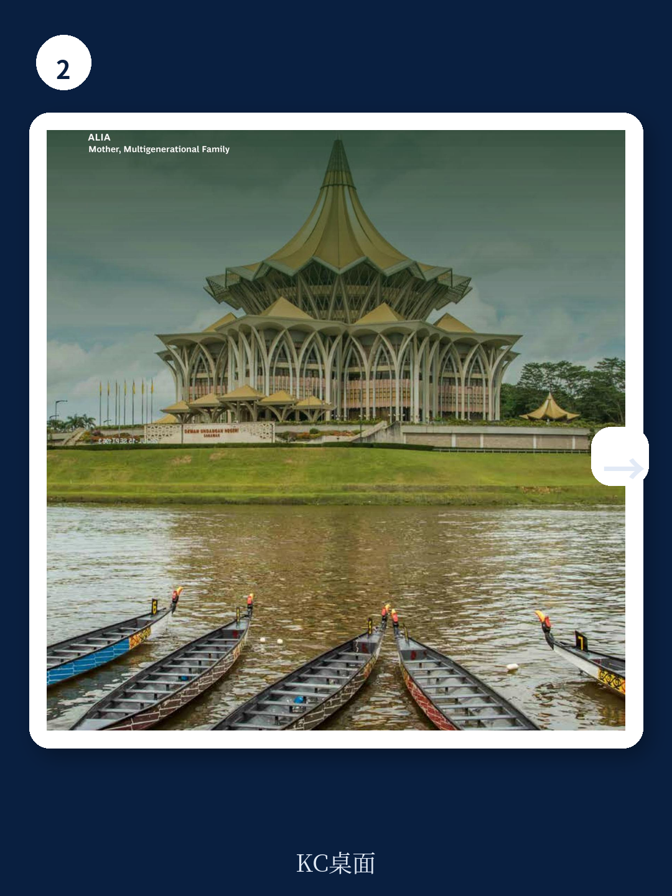

# 波士顿咨询：BCG报告：马来西亚家庭比你以为的更脆弱，也比你以为的更抱团

这份由波士顿咨询（BCG）在2026年6月发布的《MY Family》报告，回答了一个几乎所有面向消费者和公共服务的机构都该问、却很少认真回答的问题：马来西亚家庭作为一个决策单位，到底是如何运作的？

答案并不温情。报告描绘的画面是：一个高度集体化、异常自律、但几乎没有容错空间的家庭系统。丈夫是名义上的“支柱”，妻子是实际运转的“引擎”，老人是正在从安全网变成负担的过渡体，孩子是影响力不断上升但尚未贡献收入的“未来投票人”。

这不是一篇关于“家庭价值观”的软文。这是一份关于家庭经济学、代际资源转移和消费决策权力的硬核解剖。以下是我们从中提炼出的五个核心洞察。

## 1. 马来西亚家庭比市场以为的更“集权”——但集权在丈夫手里，运转却在妻子手里

报告最反直觉的发现之一，是马来西亚家庭的决策模式。表面上，73%的丈夫参与所有家庭决策，而妻子只有56%。丈夫主导长期资本支出——房产、汽车、投资、教育和医疗。妻子负责日常消费——食品杂货、外出就餐、婴儿用品和旅行。

但“主导”不等于“控制”。当妻子有收入时（约60%的家庭），她的收入几乎与丈夫持平（在双收入核心家庭中，丈夫占52%，妻子占48%）。这意味着，妻子在贡献了几乎一半的家庭收入的同时，还承担了日常支出的全部管理责任。

> **KC评论：** 这份报告揭示了一个对消费品公司和金融机构都很关键的结构性事实——如果你只针对“家庭决策者”做营销，你很可能只打中了丈夫，但错过了真正执行日常消费决策的妻子。更值得注意的问题是：当妻子贡献了接近一半的收入、却只主导约30%的预算支出时，这个家庭内部的“权力-责任”匹配是否可持续？报告没有直接回答，但数据暗示了潜在的张力。

## 2. 三代同堂不是文化选择，是经济必然——而老人的角色正在从缓冲垫变成负担

马来西亚家庭中，37%是三代同堂（multigenerational），14%是嵌套家庭（nested，即与老人同住但老人仍独立）。报告没有直接说“这是被迫的”，但数据点出了逻辑链条：生育率降至1.6，寿命延长，医疗通胀年增约15%，房价高企——这些压力叠加，使得多代同住从“文化偏好”变成了“经济必需品”。

老人在这套系统里的角色正在发生关键转变。在嵌套家庭中，37%的老人仍在赚钱，贡献最高可达家庭收入的21%。但在三代同堂家庭中，只有12%的老人有收入。换句话说，当老人还“年轻”时，他们是家庭的财务缓冲；当他们真正老去，他们就成了家庭需要吸收的成本。

这里有一个尚未被充分讨论的风险：如果老人的医疗开支继续以15%的速度增长，而家庭储蓄缓冲不够，那么“老人从缓冲变成负担”的速度可能会比预期更快。报告提到，只有27%的家庭能覆盖5000林吉特的意外医疗支出——这意味着大多数家庭在遇到一次中等规模的医疗冲击时，就可能被迫重新分配整个家庭的预算。

## 3. 父母愿意为子女牺牲自己的未来——但这不是美德，这是系统性的风险累积

报告中最令人不安的数据之一：46%的父母愿意为了子女教育放弃自己的退休储蓄，37%愿意为此举债。

这看起来是爱，但从系统角度看，这是代际脆弱性的自我强化。当父母牺牲退休储蓄，他们实际上是在把自己的老年财务安全，重新押注在子女未来的赡养能力上。而这套逻辑在人口结构变化面前是脆弱的：如果每对父母只有1.6个孩子，那么每个孩子未来需要赡养的老人数量，将远超上一代。

> **KC评论：** 这不是一个家庭层面的“选择”问题，而是一个国家层面的“积累”问题。报告点出了这个风险，但没有展开计算这个“退休储蓄缺口”的规模。完整报告中有一张关于教育支出优先级的图表，展示了“消防员家庭”（Firefighters，即财务脆弱家庭）和“建设者家庭”（Builders，即财务稳健家庭）在教育投入上的巨大差距——这个差距在代际间是会复合放大的。如果你关心马来西亚中产阶级的长期稳定性，这部分值得细读。

## 4. 家庭内部的“防火墙”机制：资源优先流向最脆弱成员

报告发现了一个清晰的行为模式：当家庭面临资源约束时，成年决策者会优先压缩自己的消费，保护子女和老人。在医疗支出上，家庭会优先送孩子和老人去看医生，成年人自己“等一等”。在预算分配上，教育和医疗是最后被砍的科目，娱乐和个人消费是最先被牺牲的。

这听起来很合理，但它意味着：家庭层面的“韧性”实际上是通过挤压成年人的当期消费和未来储蓄换来的。从宏观角度看，这种“自我压缩”可能压低总消费、延缓个人金融产品的渗透率，并增加未来对公共医疗和养老体系的依赖。

报告没有直接讨论这个宏观含义，但数据支持这个推论。如果大多数家庭都在“先保护孩子和老人，成年人自己扛”，那么面向成年人的消费金融、保险和退休规划产品，可能面临一个天然的需求抑制——不是因为没有需求，而是因为家庭内部的优先级排序把成年人的需求推到了最后。

## 5. Gen Z正在改变家庭决策逻辑，但报告留下了关键问题

报告在“展望未来”部分提到了一个重要的代际变量：Gen Z（大约1997-2012年出生）正在进入成年并开始影响家庭决策。他们更懂数字工具，更关注财务透明，更不愿意重复父母那一代的“沉默牺牲”。

但报告没有展开的是：Gen Z的财务行为是否会让家庭内部的权力结构发生变化？如果年轻一代更倾向于“透明化讨论”而非“家长拍板”，那么丈夫的决策主导地位是否会松动？如果Gen Z女性比母亲一代有更高的劳动参与率和收入预期，那么“妻子赚钱但不管钱”的传统分工是否会被打破？

这些是报告没有完全回答的问题。但报告提供了一个观察框架：家庭决策不是静态的权力地图，而是一个随着成员年龄、收入和健康状况不断重新谈判的动态过程。Gen Z的入场，可能会加速这个重新谈判的节奏。

## 报告没有说透的三个问题——也是完整报告最值得读的部分

第一，报告识别了“消防员家庭”和“建设者家庭”在教育投入上的差距，但没有量化这个差距在代际间复合后的长期影响。如果一个家庭因为财务约束无法为子女提供补习和课外活动，那么子女未来的收入潜力会打多少折扣？这个乘数效应，是理解马来西亚代际流动性的关键。

第二，报告提到了医疗通胀15%和家庭只能覆盖5000林吉特意外支出之间的剪刀差，但没有建模“如果医疗冲击发生，家庭会如何调整其他支出”。这个“冲击传导机制”对消费类企业和金融机构的资产质量评估至关重要。

第三，报告描述了家庭内部的分工，但没有深入讨论“当分工失衡时，家庭会如何解体或重组”。如果妻子承担了不成比例的日常管理责任，同时贡献了接近一半的收入，那么当婚姻压力累积到临界点时，家庭资产和负债如何分割？这个问题对个人信贷和财富管理行业有直接的资产定价含义。

这些未解问题，正是完整报告的价值所在。它不是一个“读完摘要就够了”的报告——它的图表、细分数据和定性访谈，提供了大量可以继续深挖的素材。

---

**如果你希望获得这份BCG报告的完整中文摘要、原始图表和我们的逐页解读笔记，欢迎加入我们的社群。每天，我们会通过AI agent加上人工review，整理国际投行和咨询机构的最新报告，输出10-40页的中文摘要与KC评论。这些内容既方便你喂给AI做进一步分析，也适合你在晨会上快速把握市场动态。今天推送的这份报告解读中，我们额外整理了关于“消防员vs建设者家庭”的教育支出对比图表，以及家庭医疗支出压力的详细数据拆解——这些在公开摘要里看不到。**

Personal reading notes and learning share only. Not investment advice.

