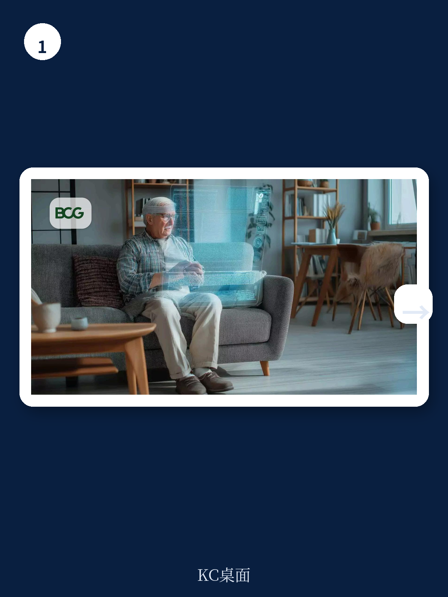

# 波士顿咨询：药企正在浪费患者发来的数字信号

中国医药行业每年在直接触达患者（DTP）上投入数百亿元，但绝大部分投入正在被浪费。不是创意不够好，不是预算不够多，而是患者通过网页浏览、问卷填写、呼叫中心交互发出的数字信号，散落在十几个互不相通的系统里，从未被整合成可执行的下一步行动。

波士顿咨询（BCG）在2026年6月发布的这份报告点出了一个反常识的判断：患者获取的瓶颈，不是流量，不是内容，而是信号整合。当行业还在争论“私域流量”“精准投放”时，领先机构已经开始用Agentic AI（代理型人工智能）实时捕捉并响应患者行为信号，把一次性获客转化为持续优化的转化引擎。

报告给出了一个让多数团队意外的结论：实现这一目标的经济门槛，远低于大多数人的假设。

## 1. 传统DTP模式的三个结构性困境，每个都在加剧

患者旅程的起点已经永久改变。绝大多数患者从线上开始他们的健康决策，包括最终被推荐给专科医生的那一批。但大多数医药企业的直接触达患者（DTP）项目，仍然运行在十年前的设计逻辑上。

第一个困境是患者期望值的结构性跃升。数字原生的健康品牌已经让患者习惯了“像电商一样”的个人化体验。患者不再拿药企品牌和同行比较，而是拿他们最好的数字交互体验作为基准。这意味着，一个响应迟缓、内容通用的DTP项目，在患者打开第一封邮件时就已经输了。

第二个困境是静态程序与动态行为的错配。多数DTP模型仍然运行在预设的时间序列和宽泛的人群分组上。患者访问了网站、填写了问卷、拨打了呼叫中心，但这些行为信号从未被实时整合。团队无法回答最核心的问题：这个患者是卡住了还是正在推进？他需要的是教育、 reassurance，还是一次真人对话？今天，而不是下周，应该做什么？

第三个困境是隐私监管正在重塑获客经济学。随着数据法规收紧，依赖第三方追踪信号的工具越来越难规模化。基于患者主动交互的第一方、同意数据，正在成为医药健康品牌最可防御的转化资产——因为它随时间累积，而不是随时间贬值。

> **KC评论：** 这三个困境叠加的结果是，传统获客模式的边际成本在上升，而转化率在下降。报告没有展开的一个关键点是，中国市场的监管环境变化（如个人信息保护法、数据跨境要求）正在加速这一趋势。对于中国药企而言，这意味着“买流量”模式的窗口期正在关闭，转向第一方数据运营已经不是可选项，而是生存题。

## 2. 信号碎片化才是真正的天花板，不是创意也不是预算

报告的核心洞察可以用一句话概括：决定患者转化天花板的，不是创意质量或媒体投入，而是信号是否被统一。

BCG的分析显示，在医疗健康领域，只有大约2%的品牌达到了数据驱动营销的最高层级——能够跨渠道在个体患者层面做出决策。绝大多数企业的问题不是没有技术平台，而是缺乏一个共享的患者数据模型和旅程路线图，来把技术能力连接到可衡量的结果。

技术投资持续超过激活能力。瓶颈很少是平台本身，而是缺乏一个共享的患者数据模型，以及一个把能力连接到可衡量结果的旅程路线图。

这意味着什么？意味着企业可能已经采购了CDP、MA、SCRM等各种系统，但每个系统都在维护自己版本的“患者画像”。市场部看到的患者标签和呼叫中心看到的患者记录，可能是完全不同的两套数据。当信号无法统一，任何高级的AI工具都只能基于不完整的输入做出次优决策。

## 3. 三种AI能力的分工，决定了转化提升的真实路径

报告对AI在患者营销中的角色做了清晰的拆解，这个框架本身就值得所有医药营销决策者收藏。

预测性AI（Predictive AI）负责评分。它持续计算每个患者的转化概率、流失风险或是否需要直接对话，并随新信号不断更新。它告诉系统：谁需要关注，什么时候需要。

生成式AI（Generative AI）负责内容生产。它在医疗、法律、法规（MLR）审核框架内，规模化产出邮件文案、短信提示、中心材料、讨论指南等变体。它消除了个性化中断的瓶颈——内容生产跟不上旅程节奏。

代理型AI（Agentic AI）负责执行。它观察实时信号，为每个患者决定下一步最佳行动（渠道、时机、内容变体或升级到人工），然后执行。关键的是，它把每次交互结果反馈回患者档案，系统在每次互动中持续改进，而不是无限重复同一套流程。

报告指出，大多数医疗健康组织今天已经在生产环境中部署了预测性或生成式AI。但真正的转化提升，来自用代理型AI把三者串联成一个持续优化的系统。

> **KC评论：** 这个框架的价值在于，它让AI部署从“技术项目”变成了“运营体系”。很多药企已经在用AI做患者评分或内容生成，但因为没有代理型AI的编排层，这些能力仍然是孤立的。报告没有展开的是，代理型AI的部署需要什么样的组织准备度——这恰恰是大多数企业最缺的。完整报告中包含了BCG对医疗健康领域AI就绪度的详细评估框架，值得细读。

## 4. 投资回报率已经清晰，但关键在于运营模式而非预算

BCG报告给出了令人信服的量化证据。在医疗健康领域，AI驱动的个性化数字营销，在数据基础和决策层到位的情况下，实现了大约6倍的营销支出回报和20%的增量收入提升。

具体案例同样有力。一家大型医疗科技公司，用AI将潜在客户转化为忠诚客户，第一年就实现了10%的获客成本降低和6个百分点的转化率提升。另一个针对心脏监测设备依从性的项目，AI驱动的激活项目带来了85%的患者报告激活率提升，并逆转了120天设备退货率多年下滑的趋势——这直接转化为诊断产出和项目经济效益。

这些结果反映的是不同的运营模式，而不是不同的预算。实现这些成果的企业统一了信号，实时决策下一步行动，并把人力的精力保留在那些真人对话能改变结果的时刻——比如患者正在犹豫、决策或面临流失风险时。

报告特别指出，表现优异的医疗健康和生命科学公司，已经在数字转型预算中向AI和数据能力倾斜更多资源。差距最大的，恰恰是那些让代理型决策成为可能的AI邻近能力。

## 5. 最小可行基础：五个要素中的三个就足够启动

对于正在犹豫是否启动这一进程的CMO，报告给出了一个非常务实的起点。

最小可行基础包括五个要素：
- 一个经过同意的身份标识（通常是邮箱或电话），且对漏斗内多数患者有当前同意状态；
- 跨多个触点的统一信号，使旅程能响应真实行为；
- 至少一个活跃的激活界面，如邮件、短信或可触发的呼叫中心流程；
- 一个小型的MLR批准内容库，包含关键旅程阶段的多个变体；
- 基线漏斗指标，并有纪律保留对照组。

报告的关键判断是：只要其中三个要素到位，就足够启动一个聚焦的试点。诊断通常能在四周内识别出患者流失点并产出优先建设路线图。第一个AI驱动的直接触达患者旅程，通常在建设启动后8到12周内就可衡量——这意味着团队可以在一个季度内看到可衡量的进展，而不是等待多年的转型周期。

> **KC评论：** 这个“三个要素即可启动”的判断，可能是报告中最具实操价值的部分。它打破了“必须万事俱备才能开始”的心理障碍。但报告没有充分展开的是，在组织层面，谁来主导这个跨部门的信号统一工作——是市场部、数据部门还是商业运营部？这个治理问题如果不解决，技术试点很容易变成又一个孤立项目。完整报告中的诊断方法论和治理框架，恰好回答了这个问题。

## 6. 报告尚未完全回答的关键问题：从试点到规模化的鸿沟

BCG的报告在“做什么”和“为什么做”上给出了清晰的框架，但“如何从试点走向规模化”这个问题，报告着墨有限。

试点阶段可以依赖少数人的热情和跨部门协调，但规模化需要的是制度化：谁来维护统一的患者数据模型？当MLR审核流程成为瓶颈时，组织的决策机制如何调整？代理型AI的决策规则由谁定义、谁更新、谁负责？

另一个未解问题是，在中国市场，患者数据的获取和使用面临更复杂的监管环境和更分散的医疗体系。第一方数据的“同意身份标识”如何建立？医院、药企、患者三方之间的数据流转如何合规？这些问题的答案可能需要结合中国本土实践来补充。

这些未解问题，恰好是读完这份报告后最值得继续深入的方向。它们指向的不是技术选型，而是组织能力、合规框架和商业模式设计——这些恰恰是决定AI驱动患者转化项目最终能否从“季度亮点”变成“长期竞争力”的关键变量。

---

这份报告的完整版本包含了BCG的诊断工具、案例细节和数据方法论，以及关于如何设计MLR审核流程与AI内容生产协同的实操建议。如果你正在思考如何让患者触达从“广撒网”变成“精准转化”，这些内容值得花30分钟细读。

我们每天会由AI agent + 人工review生成国际投行中文摘要与KC评论，daily更新，约10-40页，也包含当天最新数据图表合集，既方便喂给AI，也方便人工快速把握market dynamics。欢迎加入社群，领取完整研报解读与原始图表，一起讨论从试点到规模化的实操路径。

Personal reading notes and learning share only. Not investment advice.

