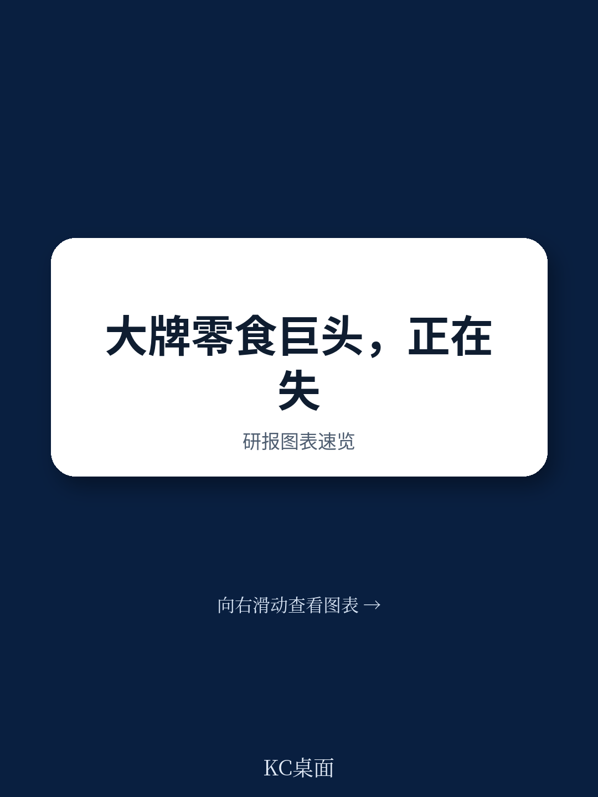

# 波士顿咨询：CPG巨头失去的十年，研发欠账正在到期

这份波士顿咨询的报告，讲了一个听起来反常识但数据上极其扎实的判断：全球最大的食品饮料公司，过去十年一直在“假装创新”。它们把收入的6%到15%砸在广告和促销上，研发投入却只有可怜的1.5%。这个策略曾经奏效，但今天正在全面瓦解。报告用了一个非常精准的词——the bill is coming due，欠账要还了。

为什么现在重要？因为市场已经给出了判决。过去三年，大型食品饮料公司的股东总回报中位数约为-5%，而同期标普500累计回报接近90%。最差的公司甚至跌了20%以上。这不是周期性问题，这是结构性问题。消费者正在以前所未有的速度转向更健康、更简单的产品，而巨头们的产品组合还停留在十年前。

这份报告最有价值的地方，不是重复“健康化趋势”这个老生常谈，而是用数据和框架证明了：研发欠账已经转化为市场份额的持续流失，而且流失速度在加快。它没有停留在诊断，还给出了一个清晰的行动路线图——从SKU级别的暴露度诊断开始。

## 1. 1.5%的研发投入，撑不起一个“创新”的故事

波士顿咨询的数据很直白：2015年到2025年，全球大型食品饮料公司的研发投入仅占收入的1.5%。作为对比，制药业是21%，消费电子是18%，软件是16%到20%。行业之间直接对比或许不完全公平，但量级的差距已经说明一切。

更值得关注的是资金流向的对比。同期，这些公司花在广告和促销上的费用占收入的6%到15%，研发投入的年增速只有1.2%，而广告费的增速是2.6%，是研发的两倍多。这不是一个短期波动，而是一个持续二十年的战略选择。

这个选择背后的逻辑曾经成立：用规模和营销肌肉维持老品牌的生命力，不需要突破性的产品创新。但今天，这个逻辑正在被三重力量打破——消费者对健康和营养的认知提升、监管对超加工食品的收紧、以及AI驱动的消费信息透明化。广告可以维持品牌知名度，但修补不了产品组合的根本缺陷。

> **KC评论：** 1.5%这个数字本身就是最有力的判断。它告诉你，这些公司过去十年不是“创新不够”，而是“根本没有把创新当作核心战略”。完整报告里有一张图对比了CPG与其他行业的研发投入，建议仔细看——量级差异带来的冲击感比文字描述强得多。加入社群，每日获取国际投行研报中文摘要与KC评论，包含完整图表。

## 2. 过去三年，大型食品饮料公司股东回报跑输标普500近100个百分点

投资者已经用脚投票。截至2025年12月的三年间，大型食品饮料公司的中位数股东总回报约为-5%，而标普500是接近90%。最差的几家累计回报是-20%或更低。报告特别指出，2021年以来的收入增长全部来自涨价，而不是销量——销量实际上下降了0.6%。

这个数据点非常关键。它意味着这些公司过去几年的“增长”是虚假的。涨价带来的收入增长掩盖了结构性衰退。一旦消费者对价格更加敏感，或者监管限制了涨价空间，真实的销量萎缩就会暴露出来。

报告给出了一个值得研究的例外：达能。这家公司过去两年将研发投入提高了约32%，同时剥离非核心资产，重新投资新能力。结果是2024年和2025年分别实现4.3%和4.5%的同类收入增长，推动ROIC重回两位数，股东回报远超同行。这个案例说明，研发投入不是成本，而是对抗结构性衰退的唯一武器。

## 3. 超加工食品的衰退不是周期性的，是结构性的

报告用了一个非常有力的框架来论证这一点。它把超加工食品的各细分品类与美国食品饮料整体市场做了对比，结果触目惊心：饼干、即食麦片、面包、沙拉酱等品类的增速要么低于市场，要么在加速下滑。虽然个别品类短期有反弹，但整体表现明显弱于市场。

更关键的是份额变化。从2021年到2025年，在谷物和能量棒品类中，大品牌失去了12.4个百分点的份额，而小品牌和自有品牌分别获得了10.8和1.6个百分点。即食麦片的情况类似：大品牌流失5.2个百分点，小品牌和自有品牌分别获得4.0和1.3个百分点。

这不是一个偶然现象。报告指出了三重驱动力：GLP-1药物的普及、监管政策的收紧、以及消费者获取产品信息的数字化工具。这些力量不是孤立的，而是相互增强的。GLP-1使用者减少约30%的卡路里摄入，其中超加工零食下降40%；约三分之一的食品支出转向营养补充剂、健身、美容和自护产品。更关键的是，约70%的GLP-1使用者家庭会遵循同样的消费模式，这意味着需求变化的实际影响是用户基数的1.5倍。

> **KC评论：** 报告估算美国目前有1600万GLP-1使用者，到2030年将超过3000万。这个数字本身可能已经被市场讨论，但报告的贡献在于量化了它对食品支出的结构性影响——不是简单的“少吃”，而是“吃什么”的全面重构。完整报告里的图表展示了不同品类的份额变化细节，建议重点关注。

## 4. 监管正在把“健康”从口号变成制度

报告提到，美国政府已经推出了新的膳食金字塔，明确鼓励减少超加工食品和精制谷物的消费。这很可能是一系列政策干预的开端，包括强制食品标签、将超加工食品从SNAP等政府资助食品计划中移除。在州层面，近20个州提出了超过130项相关法案。

监管的驱动力不仅仅是公共卫生。美国2024年医疗支出超过5.3万亿美元，2025年预计增长7%。仅肥胖一项每年就花费医疗系统高达2600亿美元。政策制定者正在把食品政策视为控制医疗成本的手段。值得注意的是，Gallup数据显示，2025年美国成年人肥胖率从2022年39.9%的峰值下降到37%，这是多年来首次下降，与GLP-1的大规模使用时间线吻合。

报告指出一个关键信号：超加工食品的消费正在出现逆转的早期证据。这不是一个孤立的消费者偏好变化，而是一个由政策制定者、监管者、消费者和文化声音组成的广泛联盟，正在重新将食品定义为系统性健康议题。

## 5. AI正在让“信息不对称”消失，品牌溢价的基础被动摇

一个容易被忽视但报告重点提及的变化是：消费者获取产品信息的方式正在被AI重塑。Yuka这款提供食品健康评分的App，在美国已有2500万用户，每月新增60万用户，没有花一分钱广告费。它在全球12个市场可用。

这意味着什么？消费者不再需要依赖品牌广告来了解产品。他们可以实时扫描配料表，看到产品的营养评分、添加剂风险、加工程度。品牌过去依赖的信息不对称正在消失。当消费者可以一键比较产品的健康属性时，靠营销维持的溢价空间就会被压缩。

报告预测，随着代理型商务的发展，电商、实体店和DTC渠道之间的权力平衡将发生变化，消费者将拥有更大的控制权。产品差异化和价格差异化将变得更加困难，数字中介在产品描述和评估中的话语权将增加。CPG公司需要在这些新界面中建立可见性和能力。

## 6. 1000亿美元的营收面临结构性风险

报告给出了一个令人震惊的测算：美国超加工食品市场可能有多达1000亿美元的营收面临结构性冲击。这个数字来自三个渠道：消费者购买行为变化、食品援助计划支出限制、政府机构食品采购变化。仅SNAP计划在2024年就支出了超过1000亿美元用于超加工食品。

与此同时，制造商的成本预计将增加5%到25%，原因是配方改造的研发投入增加、转向更昂贵的清洁标签原料、以及营销和法律合规费用的上升。这是一个典型的“收入承压、成本上升”的双重挤压。

报告没有给出具体的利润影响预测，但逻辑链条很清楚：营收下滑叠加成本上升，利润率的压力将是巨大的。对于习惯了用规模效应和营销杠杆维持利润率的巨头来说，这个调整将是痛苦的。

> **KC评论：** 1000亿美元这个数字来自报告内部的测算框架，但报告没有完全展开它的推导过程。这是完整报告里最值得深挖的部分之一——哪些品类、哪些渠道、哪些品牌最脆弱？加入社群，每日获取国际投行研报中文摘要与KC评论，包含当天的数据图表合集，方便快速把握市场动态。

## 7. 报告尚未完全回答的关键问题：资本配置的再平衡何时发生？

报告指出，过去十年大型CPG公司默认的价值创造工具是将自由现金流通过股息和回购返还给股东。这个模式在收入和定价稳定时有效。但现在的问题是：如何在股东回报与研发、新能力、并购所需的再投资之间找到平衡？

这个问题报告提出了，但没有给出明确的答案。它只是说“这个组合的平衡是当今最重要的战略问题”。这背后其实是一个更深层的矛盾：市场的短期回报预期与长期创新投入之间的冲突。如果一家公司突然将研发投入从1.5%提高到5%，利润率和股息都会受影响，股价在短期内可能承压。管理层是否有勇气和耐心承受这种压力？

报告提到的达能案例提供了一个参考，但达能是特例，不是普遍现象。大多数CPG公司面临的真正挑战是：在资本市场仍然以季度业绩为导向的环境下，如何为长达数年的研发投入争取时间和空间。这个问题没有标准答案，但可能是未来几年最值得跟踪的议题。

## 8. 观察框架：从SKU级别的暴露度诊断开始

报告给出的行动框架非常务实。它没有建议全面转型，而是建议从“SKU级别的暴露度诊断”开始。具体来说，有几个核心维度：

第一，暴露度评估。哪些产品面临消费者或监管的质疑？哪些产品可能受益于需求变化？这不是一个简单的“健康vs不健康”的二分法，而是需要建立前瞻能力，识别当前机会和未来信号。报告提到BCG开发了AI工具来监测相关趋势，但核心逻辑是通用的。

第二，信任重建。通过更清晰的成分叙事、可见的改进承诺、以及超前于政策预期的调整来重建信任。在AI驱动的透明度环境下，不一致的信息会迅速暴露。

第三，创新引擎重建。这需要并行推进两条路径：通过内部创新或并购进入高潜力邻近领域，以及对核心产品进行系统性配方改造。报告特别强调，大多数公司历史上只做了其中一项，未来领先者需要同时做好两项。

报告没有给出具体的“买哪只股票”的建议，但它提供了一个清晰的观察框架：那些已经开始进行SKU级暴露度诊断、并明确将研发投入从1.5%向更高水平提升的公司，值得重点关注。那些还在依赖广告和营销来维持份额的公司，风险正在累积。

---

这份报告的真正价值，不在于告诉你“健康趋势很重要”——这已经是一个共识。它的价值在于用数据证明了：过去十年的研发欠账已经转化为可量化的市场份额损失和股东回报差距，而且这个差距还在扩大。对于CPG行业的决策者来说，问题不再是“要不要改变”，而是“改变的速度够不够快”。

报告没有完全回答的一个问题是：当整个行业都在进行配方改造和产品创新时，竞争格局会如何演变？是先发者建立壁垒，还是后发者更快学习？这可能需要等到更多公司的战略落地后才能判断。但有一点是确定的：那些等到“欠账完全到期”再行动的公司，可能已经没有机会了。

---

**加入社群，每日获取国际投行研报中文摘要与KC评论。我们的AI agent + 人工review每天生成约10-40页的研报解读，包含当天最新数据图表合集，既方便喂给AI，也方便人工快速把握市场动态。**

Personal reading notes and learning share only. Not investment advice.

