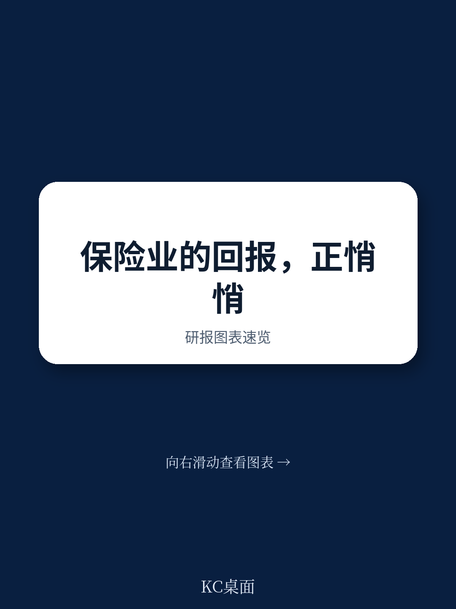

# 波士顿咨询：保险业价值创造正经历一个关键拐点

过去五年，全球保险业的股东总回报（TSR）首次系统性超过了其资本成本。这不是一个周期性脉冲，而是一个结构性变化的早期信号。波士顿咨询在2026年4月发布的《保险价值创造报告》中，用15%的五年年化TSR数据，宣告了行业自2017年以来首次真正意义上的价值创造拐点。

这份报告的特殊之处在于，它采取了“提前发布”的新策略——在全年数据尚未完全到位时，就给出了方向性判断。这意味着，报告的核心价值不在于精确的数字，而在于它捕捉到的三个正在发生的结构性转移：投资者偏好从财险向寿险与健康险迁移、地域焦点从美国向欧洲和亚太迁移、以及竞争逻辑从承保周期管理向技术驱动的效率竞争迁移。

对于保险公司的CEO、投资者以及关注金融行业趋势的决策者来说，理解这些转移的底层逻辑，比关注任何单季度的保费增速都更重要。

## 1. 行业终于跑赢了资本成本，但这个窗口期可能并不长

保险业长期面临一个尴尬的现实：尽管保费规模巨大，但股东回报长期徘徊在资本成本附近。波士顿咨询的数据显示，过去五年行业年化TSR达到15%，首次系统性超过资本成本。这个拐点的直接驱动力有两个：疫情影响的消退和当前盈利的改善。

但这里的关键洞察在于，这个窗口期可能并不稳定。财险业务的费率动能已经出现放缓迹象，尤其是在商业财产险领域。2025年的TSR数据已经显示，费率软化正在侵蚀承保利润率。这意味着，行业跑赢资本成本的状态，更多是过去几年硬市场环境的滞后反映，而非结构性的盈利能力提升。

> **KC评论：** 对于投资者而言，真正需要关注的不是15%这个数字本身，而是它能否持续。波士顿咨询报告隐含的判断是，如果费率继续软化，行业TSR可能在未来1-2年内重新向资本成本回归。完整报告中包含的细分市场TSR拆解和费率趋势图表，能帮助读者判断这个拐点何时到来。

## 2. 寿险与健康险正在成为新的价值创造引擎，但前提是资本效率必须提升

长期来看，寿险与健康险（L&H）板块的TSR一直落后于财险和再保险。但2025年出现了逆转：L&H和多线保险公司的TSR表现超越了财险。推动这一变化的，是投资收入顺风和支持性产品动态带来的盈利改善。

更值得关注的是需求端的结构性变化。老龄化人口结构和消费者偏好的演变，正在推动对带有保障条款和混合型附加利益（如重大疾病保障）产品的需求。长期来看，私人资本的涌入、全渠道分销的普及以及人口结构变迁，将进一步推动寿险产品的需求。

然而，L&H板块面临的核心挑战是资本效率。这些业务天生资本密集型，如果不能在增长的同时改善资本回报率，TSR的改善就难以持续。报告暗示，能够将规模转化为议价权的公司，将在这一轮竞争中胜出。

> **KC评论：** 波士顿咨询报告没有直接给出答案的问题在于：哪些L&H产品线真正具备资本效率提升的空间？传统寿险、年金、还是健康险？完整报告中对亚太地区L&H市场的深度分析，提供了具体的产品线回报率数据，这些数据对于判断投资方向至关重要。

## 3. 欧洲和亚太正在成为“安全的高回报区”，美国市场的吸引力在下降

地域维度的变化可能是最容易被忽视但影响最深远的趋势。五年维度上，欧洲以20.3%的年化TSR成为表现最佳的区域，较去年的11.6%大幅提升。一年维度上，亚太和欧洲分别实现了35.3%和39.8%的TSR。

波士顿咨询将这些表现归因于“向质量靠拢”——投资者在美国宏观和权益市场不确定性加剧的背景下，转向欧洲和亚太寻求稳定回报。这不是简单的资金流动，而是一个结构性的地域重估。

美国市场的相对吸引力下降，背后是多重因素的交织：个人车险市场的费率软化、竞争加剧、以及贸易流变化带来的风险格局重塑。对于全球配置的保险公司和投资者而言，这意味着需要重新审视地域权重。

> **KC评论：** 这里有一个报告没有完全展开但值得追问的问题：欧洲和亚太的TSR改善是否可持续？欧洲的利率环境变化、亚太的监管改革和自然灾害风险，都可能影响这些区域的回报持续性。完整报告中关于亚太地区市场动态的深度分析，提供了这些问题的初步答案。

## 4. 技术变革正在重塑竞争格局，但赢家可能不是技术本身

报告特别强调了AI技术（包括AI代理）对保险业的深远影响。从承保、理赔到劳动力规划、人才获取与发展，AI将渗透到几乎所有核心职能。但波士顿咨询的视角是务实的：技术本身不是竞争优势，能够将技术转化为运营效率和客户体验的公司才是赢家。

在财险领域，软化的市场环境和加剧的竞争，使得并购成为提升回报的重要工具。在L&H领域，全渠道分销和私人资本的参与，正在改变传统的分销和资本结构。这些变化本质上是一个效率竞赛——谁能在更低的成本结构下提供更好的产品和服务，谁就能在竞争中胜出。

## 5. 报告尚未完全回答的关键问题：拐点之后是持续增长还是均值回归？

波士顿咨询的这份报告更像是一个早期预警系统，而不是完整的导航地图。它清晰地指出了行业正在经历的变化，但留下了一些关键问题：

第一，费率软化对承保利润率的侵蚀程度，是否会超过投资收入顺风带来的正面影响？第二，L&H板块的资本效率提升，是短期现象还是长期趋势？第三，欧洲和亚太的TSR改善，在多大程度上依赖于美国市场的溢出效应，一旦美国市场稳定，资金是否会回流？

这些问题都是报告逻辑链条中自然延伸出的未解问题。它们决定了投资者和决策者应该采取什么样的姿态——是积极布局L&H和欧洲/亚太，还是保持谨慎等待更明确的信号。

## 6. 决策者应该建立的三个观察框架

基于波士顿咨询的报告逻辑，我们建议读者建立以下三个观察框架：

第一，关注费率与成本的剪刀差。如果费率软化速度超过成本削减速度，承保利润率将承压，财险和再保险的TSR将面临下行风险。第二，关注L&H板块的资本回报率变化。如果增长伴随着资本效率的提升，这一板块的估值重估将具有持续性。第三，关注地域资金流向的持续性。欧洲和亚太的TSR溢价，是否伴随着基本面的实质性改善，还是仅仅反映了市场情绪的转移？

这三个框架可以帮助读者从波士顿咨询的报告逻辑出发，构建自己的投资和决策判断。

---

这份报告的价值在于它提供了一个思考框架，而不是一个确定的结论。行业正在经历的变化是真实的，但方向尚未完全明确。对于希望深入理解这些变化的读者，完整报告中的细分市场TSR拆解、地域深度分析和具体案例，提供了更丰富的决策依据。

我们每天通过AI agent和人工review，整理并解读国际投行的最新中文摘要与KC评论，涵盖10-40页的日报内容，包括当天最新数据图表合集。这些内容既适合喂给AI进行进一步分析，也适合人工快速把握市场动态。如果你希望获得完整报告解读和原始图表，欢迎加入我们的社群，与更多关注全球金融行业趋势的决策者一起讨论。

Personal reading notes and learning share only. Not investment advice.

