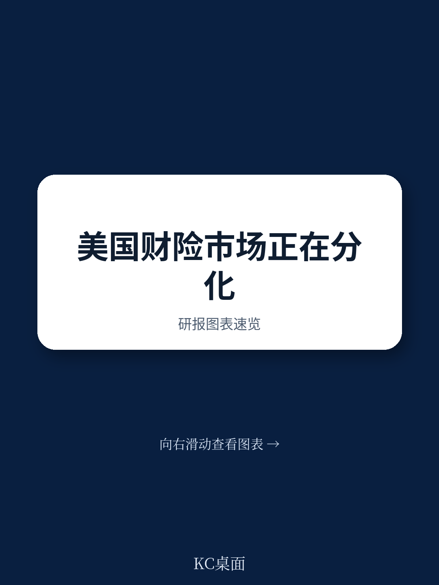
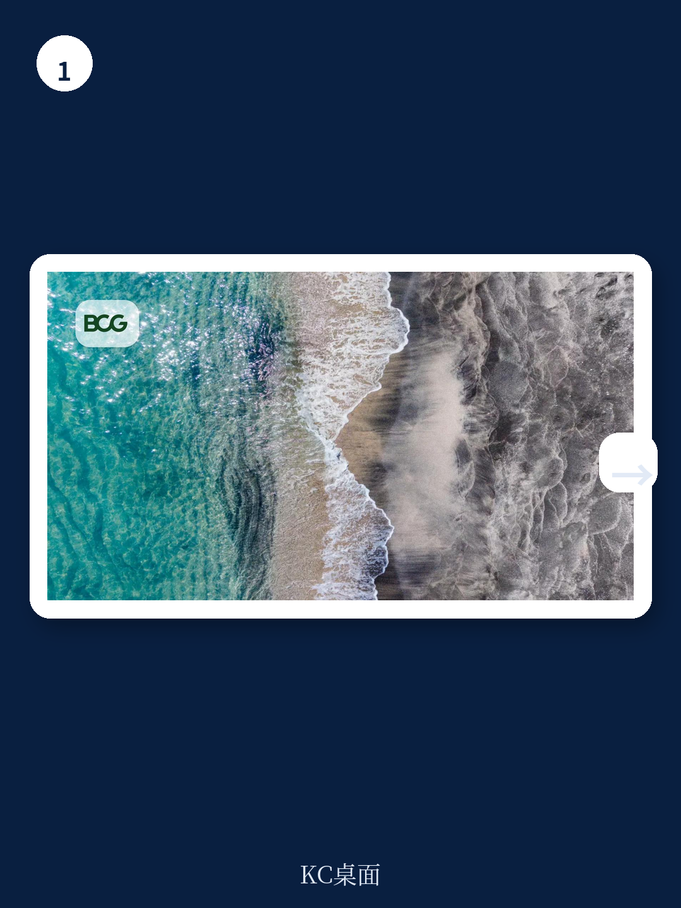

# 波士顿咨询：美国财险市场最危险的信号，不是费率走软

美国财产与意外险（P&C）市场正在经历一个罕见的转折点：在连续数年强劲表现之后，市场的基本面正在发生结构性分化。波士顿咨询（BCG）最新发布的《2026保险价值创造者报告》揭示了一个核心判断——行业领导者与落后者之间的差距正在以过去十年未见的幅度拉大，而这一差距的根源，并非市场周期本身，而是对结构性风险的反应速度与能力。

这份报告的数据窗口覆盖了2021年至2025年，正是美国财险市场从硬市场转向软市场、从利率上升周期转向常态化、从传统承保模式转向AI驱动模式的关键五年。BCG的分析显示，尽管行业整体五年年均股东总回报（TSR）仍维持在约18%的高位，但2025年单年数据已明显减速。更值得关注的是，头部与尾部公司在承保利润率上的鸿沟，已经达到了难以用投资收入弥补的程度。

对于产业决策者和高净值投资者而言，这份报告的价值不在于它确认了“好公司继续好”的常识，而在于它用数据揭示了“什么构成了好公司”的新定义。在费率走软、损失成本持续上升、气候风险与诉讼环境恶化的三重挤压下，传统的规模优势正在被更精细的能力优势所取代。

> **KC评论：** 这份报告最重要的判断是——美国财险市场正在从“靠天吃饭”的周期游戏，转向“靠能力吃饭”的结构性竞争。对于关注保险板块资产配置的读者，这意味着过去那种“买龙头、等周期”的策略可能不再奏效。完整报告中有详细的分组数据对比，展示了头部与尾部公司在承保、投资、费用结构上的具体差异，这些数据在公开市场上并不容易获取。

## 1. 承保能力已取代投资收入，成为利润分化的唯一标准

BCG的长期追踪数据呈现出一个清晰的规律：在每一个五年周期中，承保利润率都是区分领导者和落后者最稳定的指标。2021至2025年期间，头部四分位公司的承保利润率对有形股本回报率（RoTE）的贡献约为11个百分点，而尾部公司的承保贡献为负值。这意味着，尾部公司不仅没有从承保中赚钱，反而在消耗资本。

这一现象在2024至2025年被较高的投资净收益部分掩盖。随着利率正常化，投资收入贡献将回落，届时承保质量的差距会变得更加刺眼。BCG报告特别指出，那些在硬市场期间投资于定价精细化和风险分层的公司，在软市场环境中更有能力捍卫利润率。

对于投资者而言，这意味着需要重新审视保险公司的估值逻辑。过去市场往往将P/B与利率预期挂钩，但BCG的数据表明，承保利润率差异对长期TSR的解释力远超利率变动。报告中的Exhibit 2和Exhibit 3提供了具体的分项数据，清晰地展示了头部公司与尾部公司在RoTE构成上的结构性差异。

## 2. 个人车险市场已从防御转向进攻，但并非所有玩家都有资格

美国个人车险市场在经历了2022至2023年的利润率危机后，2025年综合成本率已恢复至92%，这是自2020年以来的最佳水平。2020年之前，该市场自2004年以来从未将综合成本率降至95%以下。这一恢复主要得益于激进的重新定价和非续保策略。

但恢复的分布极不均匀。Progressive率先行动，将其个人车险综合成本率降至约88%，并借此成为美国个人车险市场份额第一的公司。其他公司则经历了更长时间的修复期，通过缩减保单来恢复利润率，才将综合成本率降至90%以上。

随着利润率普遍恢复，竞争格局正在发生根本性转变：保险公司正从防御转向进攻，重新进入此前退出的州和细分市场，更积极地争夺新业务。BCG报告警告，这一转变伴随着三个风险：索赔频率从疫情低点回升、年度损失成本（行业精算师估计为6%-8%）在某些州已超过费率涨幅、以及大型互助保险公司不受季度投资者预期约束，可能愿意承受利润率压力以换取市场份额。

> **KC评论：** 个人车险市场的竞争正在从“谁能更快提价”转向“谁能更精准定价”。Progressive的成功并非偶然，而是基于其领先的数据分析能力和实时定价系统。完整报告中详细分析了Progressive与其他头部公司在定价模型、数据基础设施和理赔流程上的差异，这些细节对于理解“规模是否真的构成护城河”至关重要。

## 3. 房屋险市场正成为战略要地，但气候风险正在重塑竞争版图

美国房屋险市场在2025年实现了88%的综合成本率，这是自2006年以来的最佳表现。然而，BCG报告明确指出，这一结果反映的是有利因素的偶然汇聚，而非结构性重置。2025年缺乏大型飓风登陆，但帕利塞兹和伊顿山火、以及持续的对流风暴（SCS）已经造成了巨大损失。

数据显示，SCS损失已超越传统飓风损失，成为美国巨灾损失的主要驱动因素。根据Verisk和慕尼黑再保险的数据，2023、2024、2025年每年SCS的保险损失均超过500亿美元，而此前十年的年均水平约为300亿美元。这些损失在地理上分散，使得投资组合管理和再保险结构比传统的沿海风暴管理更加复杂。

BCG认为，气候变化的累积效应、再保险定价变化和监管调整将共同创造一个分化的市场。拥有卓越巨灾模型、严格的风险暴露管理和充足定价能力的公司应能产生强劲回报，而其他公司的业绩将被未来的自然灾害事件所侵蚀。报告提出了三个战略重点：细颗粒度的保单条款管理、将规模作为护城河、以及再保险优化。

## 4. 社会通胀与核判决正在重塑长尾责任险的损失曲线

长尾责任险是BCG报告中着墨最多、也是最令人担忧的领域。社会通胀——更多律师参与索赔、第三方诉讼融资、以及核判决（1000万美元及以上）频率的增加——正在以历史模型无法预测的方式重塑损失模式。

数据令人震惊。根据Marathon Strategies的数据，2024年发生了135起核判决，这是自2009年该机构开始追踪以来的最高值。瑞士再保险研究所估计，第三方诉讼融资市场已增长至约150亿至180亿美元。这些动态增加了损失成本、延长了和解时间线、并造成了准备金充足性的不确定性。

根据瑞士再保险的数据，2015至2024年十年间，美国保险公司在商业责任险（不包括医疗专业责任险）上经历了总计620亿美元的不利准备金发展。这与美国财险市场整体连续19年有利准备金发展的趋势形成鲜明对比。

对于保险公司而言，这意味着三个层面的挑战：准备金不确定性、承保策略调整（领先公司正在将产能转向短尾风险和非认可市场）、以及再定价周期（即使财产险费率走软，责任险定价预计仍将保持坚挺）。

## 5. AI正从实验阶段转向竞争差异化工具，但新的风险类别尚未被覆盖

BCG报告将AI定位为“从实验到优势”的转折点。领先公司正在承保、理赔和定价工作流程中大规模部署AI，不仅获得运营效率，还获得更精细的风险洞察，这些洞察正在转化为可量化的竞争优势。

然而，报告同时提出了一个被市场低估的问题：AI本身正在成为一个新的风险类别。由于技术是全新的，公司没有AI系统的损失历史。精算数据需要五到七年才能形成，而新的AI模型在几个月内就会上市。专业责任、知识产权、版权以及业务中断保险的覆盖缺口正在扩大。

BCG提到，网络安全保险市场从早期的临时有限保单演变为完整的第一方和第三方覆盖，可能为AI保险提供了一个可参考的路径。但当前的问题是，新保单的设计落后于企业的部署速度。

> **KC评论：** AI在保险业的应用存在一个有趣的悖论：它既是提高承保效率的工具，又是创造新风险敞口的源头。完整报告中对AI作为新风险类别的分析篇幅有限，但提到了几个关键问题——缺乏精算数据、保单条款设计滞后、以及再保险市场对AI风险的定价能力不足。这些未解问题恰恰是投资者和产业决策者需要持续关注的方向。

## 6. 报告尚未完全回答的关键问题：结构性风险如何定价？

BCG报告清晰地识别了社会通胀、气候变化和AI三大结构性风险，但它没有提供一个完整的定价框架。例如，社会通胀对损失曲线的影响是否已经充分反映在当前准备金中？气候变化导致的SCS损失增长是线性还是指数级的？AI风险的保费应该基于什么基准？

这些问题并非报告的缺陷，而是反映了行业面临的共同困境：历史数据不再可靠，新数据尚未积累。BCG建议保险公司采取预应式投资组合管理而非被动重新定价，但具体如何操作、如何校准模型参数，报告并未给出明确的量化指引。

对于读者而言，这意味着需要建立一个持续跟踪的观察框架：关注准备金发展数据的变化趋势、关注再保险市场对特定风险的定价变化、关注监管机构对气候风险和AI风险的披露要求。这些指标将比季度财报更能反映保险公司的真实风险暴露。

## 7. 投资者和决策者的行动框架：从周期思维转向能力思维

BCG报告为产业决策者和投资者提供了一个清晰的行动框架，其核心是从“周期判断”转向“能力判断”。具体而言，三个维度值得持续关注：

**定价纪律 vs. 市场份额。** 在软市场环境中，维持定价纪律的公司往往在下一个五年周期中表现更优。这意味着，那些在竞争中主动放弃市场份额以维护利润率的管理团队，可能比激进扩张的团队更值得信任。

**能力投资 vs. 成本控制。** 数据基础设施、AI工具和人才获取正在成为竞争差异化的核心。BCG指出，最危险的公司是那些“尚未面临财务困境、但也没有积极投资于能力建设”的中游公司。对于投资者而言，研发支出和人才密度可能成为比综合成本率更前瞻的指标。

**结构性风险 vs. 周期性风险。** 社会通胀、气候风险和AI风险不会自我解决。那些等待风险显现再反应的公司，很可能在其他人投资新能力和建立更强市场地位时，陷入被动和损失驱动的模式。

---

这份BCG报告的价值在于，它用五年的数据证明了一个朴素但常被忽视的道理：在保险业，基本功——严谨的承保、严格的资本配置、持续的能力投资——仍然是长期价值创造的最可靠路径。但2026年的挑战在于，对“基本功”的定义已经发生了根本性变化。十年前的好公司标准，在今天可能只是及格线。

报告中有大量图表和数据细节，包括各细分市场的TSR贡献分解、不同规模公司的利润率差异、以及AI部署与承保表现的相关性分析。这些内容对于深入理解行业结构变化至关重要。我们的社群每天会由AI agent和人工review生成国际投行的中文摘要与KC评论，包含当天的最新数据图表合集，既方便喂给AI模型，也方便人工快速把握市场动态。如果你希望看到完整报告的解读和原始图表，欢迎加入社群继续讨论。

Personal reading notes and learning share only. Not investment advice.

