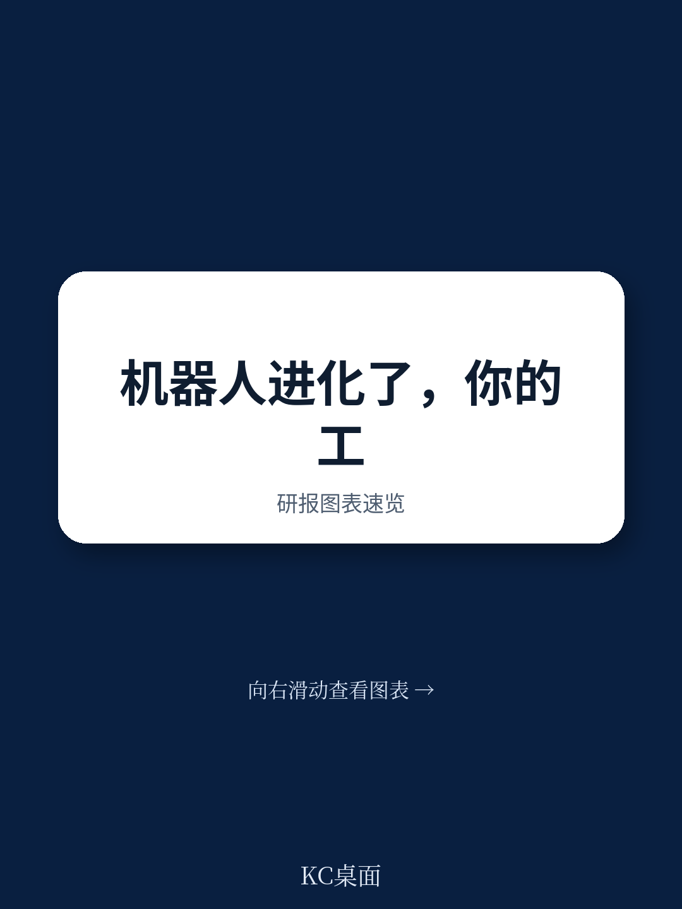
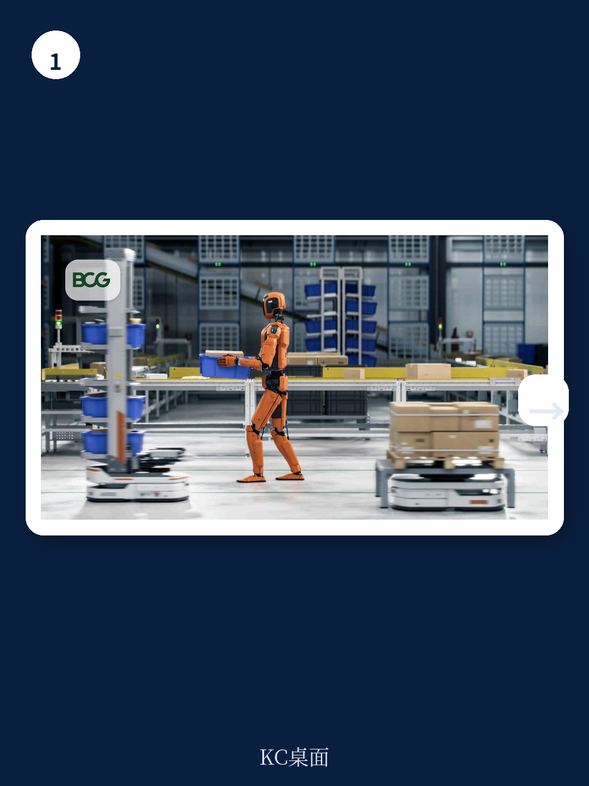

# 波士顿咨询：Physical AI的回报周期已从5-7年缩短至1-3年，CEO们不能再等了

当大多数CEO还在把机器人自动化视为“未来议题”时，一项关键指标已经发生了质变。

波士顿咨询（BCG）最新发布的Physical AI报告给出了一个足以改变企业投资决策的数字：前沿机器人投资的回报周期已从此前的5-7年，骤降至1-3年。这不是渐进式改善，而是数量级的跃迁。

与此同时，可自动化的工作范围扩大了50%，训练机器人所需的工程时间减少了70%。这三个数字叠加在一起，指向一个清晰的结论：Physical AI已经从“值得关注”进入了“必须行动”的阶段。

对于产业决策者而言，真正的问题不再是“要不要投”，而是“如果不投，竞争对手用更快的速度、更低的成本追上来时，你的护城河还剩多少”。

> **KC评论：** 这份报告的核心价值不在于列举技术趋势，而在于给出了一个CEO可以立即用来评估自身处境的分析框架。1-3年的回报周期意味着，Physical AI已经从资本支出决策变成了运营效率决策。完整报告中还包含了传统机器人与Physical AI在成本结构上的详细对比，以及不同行业的部署优先级分析，这些图表对制定具体投资计划至关重要。

## 1. 这轮变化真正考验的是企业能否把规模转化为议价权

Physical AI的进步不是单一技术的突破，而是硬件、软件和训练方式三个维度的协同演进。

报告指出，传统机器人约75%的成本来自系统集成、安装和工程调试。而软件定义的Physical AI可以将这部分成本削减一半以上。关键变化在于：机器人可以在虚拟数字环境中完成训练，在“学会”如何执行任务后再被部署到真实场景。这意味着现场调试这一最昂贵、最耗时的环节被大幅压缩。

但这里有一个容易被忽视的战略含义：当部署成本下降、回报周期缩短时，率先行动的企业不仅获得效率优势，更重要的是——它们将积累规模化的know-how和运营数据，这些资产会形成数据飞轮，让后来者的追赶成本越来越高。

波士顿咨询明确警告：“停滞不前的成本正在上升。”这不是一句虚言。

> **KC评论：** 报告没有展开的是，这种know-how积累会如何影响行业竞争格局。当一家企业率先在某个细分环节实现Physical AI的规模部署，它获得的不仅是成本优势，还有对供应商的议价权、对下游客户的交付速度优势。完整报告中的“能力评估矩阵”可以帮助你判断自己所在行业哪些环节已经具备部署条件。

## 2. 最容易被忽视的陷阱：用旧思维评估新技术能做什么不能做什么

波士顿咨询提出了一个非常务实的判断：C-3PO式的全能人形机器人仍然遥远，机器能可靠通过“咖啡测试”——在陌生环境中自主完成冲咖啡的全流程——也还需要数年时间。

但对CEO而言，真正的机会不在于等待全能机器人出现，而在于理解Physical AI当前的能力边界，并找到边界内价值最大的应用场景。

报告将Physical AI的能力拆解为四个层级：

第一层，视觉感知。这是当前最成熟的领域，机器视觉已经能够识别物体和位置，将自动化扩展到新的环境。

第二层，灵巧操作。机器人通过融合感知、理解和力控，处理可变形的物体。但现有模型仍需要大量针对特定任务的训练。

第三层，工作流规划。机器人被告知“要达成什么”而不是“怎么去做”，由系统自主生成工作流。这一能力仍在开发中。

第四层，推理。这是人形机器人的终极目标，机器人能理解自身行为对环境的影响并据此决策。目前仍然遥远。

> **KC评论：** 这个四层框架的价值在于，它帮助CEO避免两个常见错误：一是对技术过度乐观，投入资源去解决当前能力达不到的问题；二是过度保守，认为所有Physical AI都不成熟，错失已经可以部署的机会。完整报告中对每一层能力都有详细的行业应用案例和时间线预估，可以帮助你判断哪些环节值得现在投入。

## 3. 报告没有完全回答的关键问题：谁将拥有数据权

波士顿咨询在“Move #3”中建议CEO在接触供应商之前，先规划好自己的技术架构。这是一个极其重要的提醒，但报告没有深入展开的是：在Physical AI时代，数据的所有权和控制权可能比硬件本身更重要。

当机器人通过虚拟训练学会执行任务，训练数据和运行数据将成为核心资产。如果你完全依赖供应商的预训练模型和黑箱系统，那么你的运营效率实际上是被供应商锁定的。更关键的是，随着部署规模扩大，数据飞轮效应会让供应商越来越强，而你的议价空间越来越小。

报告提到了“与供应商共同开发技术”的可能性，但没有给出判断标准：什么情况下应该自研？什么情况下应该采购？什么情况下应该合作开发？这些问题的答案，很大程度上取决于你的行业属性、数据敏感度和规模优势。

> **KC评论：** 这是阅读完整报告时最值得追问的部分。BCG在报告中给出了技术架构的框架，但具体到每个企业的决策，还需要结合自身的IT基础设施、数据资产和战略优先级来判断。完整报告中的“技术架构评估工具”可以帮你做这个判断。

## 4. 工厂设计思维需要根本性转变：从“为人设计”到“为机器人设计”

一个被低估的变量是：大多数企业目前是在改造人类工作空间来适配机器人，而真正的效率跃迁来自于设计“为机器人而生”的工厂。

波士顿咨询指出，这样的工厂可以“永不关闭”。这不是一个修辞，而是一个运营层面的断言。人类需要休息、轮班、安全规范，但机器人可以24小时连续运行。如果工厂从设计之初就考虑到机器人的移动路径、充电站布局、物料流转逻辑，那么整体效率可能比改造型工厂高出数倍。

但报告也诚实指出：在某些场景下，实现机器人友好工厂的技术可能尚未成熟。这意味着CEO需要在“等待技术成熟”和“通过迭代积累能力”之间做出选择。波士顿咨询的建议是清晰的：那些愿意迭代、沿着创新曲线向上攀登的企业，更有可能在竞争对手之前解锁优势。

> **KC评论：** 这里有一个二阶效应值得关注：当“为机器人设计”成为行业标准时，早期采用者不仅获得效率优势，还会倒逼设备供应商、物流服务商、软件开发商围绕他们的标准进行优化。这种生态位优势一旦建立，后来者将很难撼动。完整报告中有具体的“机器人友好工厂”设计原则和案例，对正在规划新产线的企业尤其有价值。

## 5. 劳动力转型：透明度是加速器，恐惧是减速器

波士顿咨询在“Move #4”中给出了一个反直觉的判断：提前规划并透明沟通岗位变化，不仅是为了员工利益，更是为了加速技术部署本身。

报告的逻辑是：工人如果不知道自己的角色会如何变化，就会用恐惧来填补信息空白。而这种恐惧会直接阻碍技术采纳。相反，如果工人知道自己的角色将从重复性劳动转向机器人监管、训练和集成，他们反而可能欢迎这种转变。

这背后有一个关键假设：现有工人已经理解企业的具体流程和需求，他们是转型过程中最宝贵的资源，而不是需要被替换的成本。

> **KC评论：** 这个观点在实践中面临一个挑战：有多少企业真正有能力在技术部署之前就清晰定义新岗位的职责和技能要求？如果做不到这一点，“透明沟通”可能变成“空头承诺”。完整报告中有关于“岗位再设计”的详细方法论和案例，可以帮助企业避免这个陷阱。

## 6. 安全治理：当机器人变成黑客的入口

最后一个值得CEO亲自关注的议题是网络安全。波士顿咨询提醒，当机器人变得更加自主、智能和互联时，它们会变成黑客的理想目标。

更关键的是，风险不局限于企业内部。当供应链中引入更多第三方供应商时，每个供应商都可能成为攻击者寻找的薄弱环节。

报告没有展开的是，Physical AI的安全治理与传统IT安全有本质区别。传统安全主要关注数据泄露和系统瘫痪，而Physical AI的安全问题可能直接导致物理伤害——机器人的错误操作可能危及工人安全，被黑客控制的机器人可能被用来制造生产事故。

> **KC评论：** 这可能是整份报告中CEO最需要亲自介入的议题。网络安全团队可能理解IT风险，但未必理解Physical AI特有的物理安全风险；运营团队可能理解机器人操作，但未必理解网络安全。如何建立跨职能的安全治理机制，是报告没有完全回答但值得继续深挖的问题。

---

波士顿咨询这份报告的核心价值，不在于它给出了多少技术细节，而在于它为CEO提供了一个清晰的行动框架：评估能力边界、规划系统架构、设计劳动力转型、建立安全治理。这些“Move”听起来像常识，但在实践中，大多数企业连第一步——准确评估Physical AI当前能做什么不能做什么——都没有做到。

真正的问题在于：当回报周期已经缩短到1-3年，你的竞争对手可能已经开始行动。而你，还在等待技术完全成熟吗？

如果你对以下问题感兴趣，欢迎加入我们的社群继续讨论：Physical AI在不同行业的部署优先级如何判断？供应商锁定风险如何规避？数据资产如何估值？我们每天会由AI agent配合人工review，生成国际投行的中文摘要与KC评论，涵盖当天最新数据图表合集，既方便喂给AI做分析，也方便人工快速把握市场动态。

Personal reading notes and learning share only. Not investment advice.

