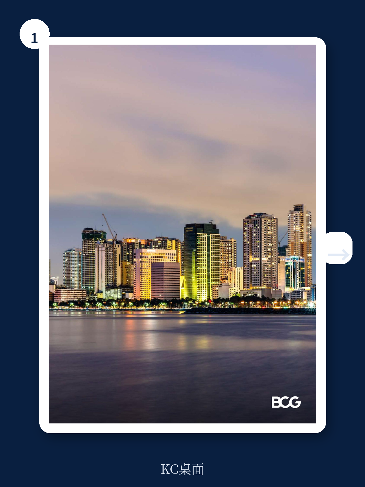
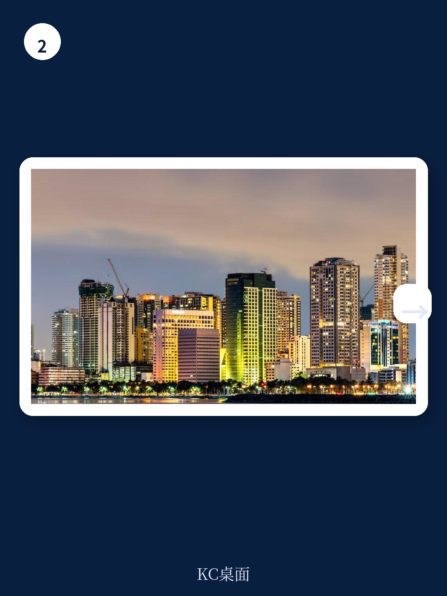

# 波士顿咨询：菲律宾数字金融的“供给缺口”才是真正的入场信号

当多数投资者还在关注东南亚数字金融的渗透率故事时，波士顿咨询这份受Maya委托、基于一手定性和定量研究的报告，给出了一个更微妙的判断：菲律宾的吸引力不在于“还有多少人没用上手机银行”，而在于“供给端的结构性约束正在系统性松绑”。

报告指出，菲律宾拥有超过1亿人口、未来五年约6%的GDP增长、年轻且高度数字化的消费者群体——这些基本面并不新鲜。真正值得关注的，是报告揭示的一个核心矛盾：金融服务的低渗透率并非需求不足，而是历史形成的运营模式、分销经济和风险评估手段长期压制了供给。如今，数字基础设施和监管框架正在同时解除这三重约束。

这意味着，菲律宾数字金融的下一个增长阶段，将不是简单的“从0到1”的获客故事，而是“从交易到关系”的价值深挖。对于已经布局或正在评估东南亚市场的机构而言，这份报告提供了一个关键的观察框架：谁能在支付规模的基础上，把交易数据转化为存款和信贷的定价权，谁就能在下一轮竞争中占据主动。

## 1. 菲律宾的宏观基本面，比多数东南亚同行更接近“消费驱动型经济体”

波士顿咨询的报告开篇就用一组对比数据，重新定位了菲律宾在全球新兴市场中的独特位置。在人口过亿的七个新兴经济体中，菲律宾与越南、印尼同属东盟增长市场，但它的增长模式更接近墨西哥和美国——私人消费占GDP的比重高达约76%，远高于东南亚平均水平。

这种消费驱动结构的背后，是两股结构性力量。第一，海外劳工汇款持续稳定在GDP的8-9%，形成了可预测的国内需求底座。第二，中产阶级家庭数量预计从2025年的580万户增长到2035年的880万户，这意味着未来十年将有超过50%的增量家庭进入消费升级通道。

报告据此预测，2025-2030年间菲律宾人均消费支出将以5.1%的年复合增速增长，超过印尼（4.4%）和巴西（1.2%）。对于金融服务业而言，这意味着一个持续扩大的可服务市场——不仅是支付笔数的增长，更是消费信贷、财富管理和保险需求的同步上升。

> **KC评论：** 消费驱动型经济体的金融需求曲线通常更陡峭。当收入增长从生存型消费转向可选消费时，对信贷、支付便利性和财富管理工具的需求会非线性上升。这份报告的核心洞见在于，它把菲律宾定位为一个“消费升级正在发生但金融服务尚未跟上”的市场，而不是一个“穷国需要普惠金融”的故事。后者容易陷入补贴逻辑，前者则指向商业可持续的增长路径。

## 2. 真正的机会不在“渗透率低”，而在“供给约束正在被拆除”

报告最值得细读的部分，是对菲律宾金融业供给侧的诊断。它明确指出：菲律宾约一半的成年人没有银行账户，家庭和中小微企业的信贷渗透率落后于可比国家，但这并非需求不足，而是供给端长期存在三个相互强化的瓶颈。

第一个瓶颈是物理分销的经济性。菲律宾是一个由超过7600个岛屿组成的群岛国家，传统银行分支机构覆盖成本极高，导致大量农村和偏远地区实际上被排除在正规金融体系之外。

第二个瓶颈是风险评估的信息缺失。在没有广泛可用的信用评分体系和数字化身份认证的情况下，银行无法有效评估中小微企业和低收入个人的信用风险，因此倾向于只服务有抵押品或可验证收入的优质客户。

第三个瓶颈是运营模式的惯性。传统银行习惯于以存款为核心、以物理网点为触点的经营模式，缺乏动力和能力去服务小额、高频、低抵押的客群。

但报告指出，这三个约束正在同时松动。支付基础设施已经形成规模——菲律宾央行数据显示，数字支付在总交易量中的占比近年来大幅提升。国家身份系统（PhilSys）和信用信息公司的建设正在完善信用数据的基础设施。更重要的是，数字优先的平台型机构开始能够将交易行为数据转化为信贷决策的依据。

> **KC评论：** 这份报告最有价值的部分，不是它说菲律宾市场有多大，而是它解释了为什么过去那么大但没人赚到钱。答案是供给端的经济学算不过来。现在，数字基础设施正在改变这笔账。但报告没有完全展开的是：这些供给约束的解除速度有多快？监管的推进节奏、数据共享的落地程度、以及传统银行的反应速度，都将决定这个“机会窗口”的实际宽度。这些细节，正是完整报告里值得继续深读的部分。

## 3. 支付是入口，但真正的战场在存款和信贷的“关系深化”

报告对菲律宾数字金融市场的阶段划分值得关注：支付已经进入规模化阶段，而存款和信贷的数字化才刚刚起步。这意味着，当前市场的主要参与者——无论是数字银行、电信金融科技还是传统银行的数字渠道——都站在同一个起跑线上，去争夺一个从“交易”到“关系”的转化机会。

报告的数据显示，菲律宾消费者在数字支付上的使用频率已经显著提高，但大部分交易仍然是现金替代型的转账和缴费，而非与存款或信贷产品深度绑定的金融行为。换言之，用户用了支付工具，但还没有把核心金融关系迁移到数字平台上。

这种“支付活跃但金融关系浅”的状态，恰恰是下一阶段竞争的关键。能够把支付数据转化为信用评估能力、把交易频次转化为存款黏性、把用户行为转化为信贷产品定价依据的平台，将获得结构性优势。而做不到这一点的参与者，可能永远停留在“通道”角色，无法实现单位经济模型的根本改善。

波士顿咨询在报告中特别强调了“整合型平台”的优势——那些同时拥有支付、信贷、存款和保险能力的数字平台，能够通过交叉销售降低获客成本、提高客户生命周期价值。这一判断与全球数字银行发展的经验一致：单一功能的金融科技公司往往难以盈利，而拥有多产品矩阵的平台则更容易实现单位经济为正。

## 4. 报告没有完全回答的“关键变量”：竞争格局的演进路径

尽管报告对菲律宾数字金融的机会给出了清晰的定性判断，但有一个关键问题并未充分展开：在现有的竞争格局下，谁最有可能捕获这些价值？

报告提到了传统银行、数字银行、电信公司旗下的金融科技平台、以及纯金融科技初创企业这四类参与者，但并未对不同模式之间的竞争动态做深入分析。例如，电信公司（如Globe的GCash和PLDT的Maya）凭借庞大的用户基础和线下代理网络，在获客端具有天然优势；但它们在信贷风险评估和资金成本上是否能够与传统银行竞争？传统银行虽然在资本和风控上有积累，但能否在用户体验和产品创新上跟上数字原生平台的节奏？

此外，监管政策的演进方向也是一个未完全展开的变量。菲律宾央行在数字银行牌照发放、开放银行框架、以及数据隐私法规方面的立场，将直接影响竞争格局的演变。报告提到了监管环境正在改善，但没有给出具体的政策时间表或压力测试情景。

> **KC评论：** 报告给了宏观判断和行业框架，但没有给出“买谁”的答案。这正是需要继续深读完整报告的地方——里面包含了更细分的竞争分析、对不同商业模式的财务模型拆解，以及BCG对2026-2030年市场份额变化的预测。对于机构投资者而言，这些细节比宏观判断更具决策价值。

## 5. 对读者而言，菲律宾提供了一个“观察框架”而非“投资建议”

综合来看，波士顿咨询这份报告的最大价值，不是提供一个具体的投资建议，而是为关注东南亚数字金融的决策者提供了一个系统的观察框架。这个框架由四个层次构成：

第一层是宏观基本面确认——菲律宾具备支撑数字金融长期增长的人口、收入和消费结构基础。第二层是供给约束识别——历史上的低渗透率不是需求问题，而是供给端的经济学问题。第三层是约束解除信号——支付基础设施、数字身份和信用数据系统正在同时改善。第四层是竞争格局推演——谁能最有效地把交易数据转化为金融关系，谁就能获得结构性优势。

对于正在评估是否进入或加码菲律宾市场的机构而言，这个框架的价值在于：它帮助区分了“周期性机会”和“结构性机会”。菲律宾数字金融的机会属于后者——它不依赖于某个短期政策红利或技术突破，而是建立在人口结构、消费升级和数字基础设施的长期交汇点上。

当然，这个框架也需要持续验证。关键假设包括：中产阶级增长能否如期兑现、数字身份系统的覆盖率能否快速提升、以及现有竞争格局是否会出现颠覆性的新进入者。这些不确定性，恰恰是持续跟踪报告和数据的价值所在。

---

这份波士顿咨询的研报原文包含了大量未在本文中展开的细节——包括对不同细分市场（个人信贷、中小微企业贷款、商户支付）的规模测算、对主要竞争者的优劣势对比、以及对2026-2030年市场演变的量化预测。我们的AI agent每日自动抓取并翻译国际投行与咨询机构的完整报告，配合人工review生成中文摘要与KC评论，每日更新约10-40页的精华内容，既方便直接喂给AI进行二次分析，也方便人工快速把握全球市场的dynamics。

如果你希望获取这份报告的完整原文、数据图表，以及我们基于多份交叉验证研报生成的竞争格局对比表，欢迎加入我们的知识星球社群。每天，我们都会推送经过筛选和解读的全球顶级机构研报精华。

Personal reading notes and learning share only. Not investment advice.

