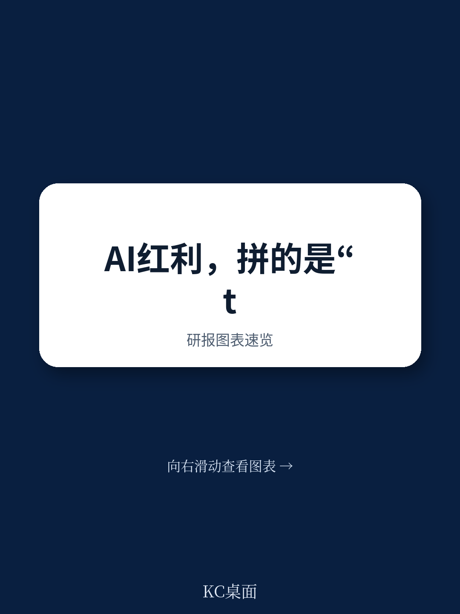

# 波士顿咨询：AI竞争已进入“Token时代”，赢家通吃的规则变了

当智能不再是稀缺资源，企业竞争的底层逻辑正在被重写。波士顿咨询（BCG）在最新发布的报告中提出一个核心判断：我们已进入“基于Token的竞争”时代。Token是AI模型的语言和货币，也是企业将智能转化为商业价值的计量单位。这份报告通过对107家上市科技公司Token消耗量的实证分析发现，最高Token使用组的企业营收中位数增长率为16.5%，而最低组仅为5.1%。差距不是偶然，而是新竞争规则的先兆。

报告的核心主张是：当智能变得可规模化、可获取，竞争优势不再来自拥有智能，而来自比竞争对手更高效地将智能应用于业务问题。这意味着，企业需要像管理资本投资一样管理Token支出，并建立全新的衡量体系——ROInt（智能投资回报率）。这不是一份关于AI趋势的泛泛讨论，而是一份关于如何将AI从成本中心转化为战略引擎的操作指南。

但报告的真正价值不在于它给出的答案，而在于它揭示了一个尚未被充分讨论的问题：Token竞争的本质是“速度”还是“系统”？波士顿咨询在1988年首次提出“基于时间的竞争”，如今他们用“基于Token的竞争”与之呼应。但Token竞争是否只是时间竞争的AI版本？还是存在更深层的结构性差异？这些追问，正是我们需要在完整报告中寻找的答案。

## 1. Token消耗量与企业增长之间存在强相关，但因果链条仍需拆解

波士顿咨询的实证分析提供了最直观的证据：在107家年营收超过5亿美元的上市科技公司中，Token消耗量最高的五分之一企业，营收中位数增长率为16.5%，而最低的五分之一仅为5.1%。这个数据本身具有冲击力，但更重要的是理解背后的机制。

报告指出，Token消耗量可以被一致地衡量，尤其是在软件工程领域，因为AI编码环境（如Cursor）提供了标准化的计量基础。这意味着，软件工程成为观察Token竞争的第一个“显微镜”。但波士顿咨询没有简单地将高Token消耗等同于高增长，而是强调“生产性Token使用”才是关键。

> **KC评论：** 这个数据点值得反复品味。16.5%对5.1%，差距超过3倍。但波士顿咨询没有说高Token消耗“导致”高增长，而是说“模式一致”。这暗示了一个更复杂的因果链条：可能是高增长企业本身更有资源投入Token，也可能是Token投入确实创造了增长。完整报告中对这107家公司的行业分布、规模分层、Token使用场景做了更细致的拆解，这些细节才是判断因果方向的关键。

对于读者而言，这个数据提供了一个观察框架：如果你的企业或投资标的的Token消耗量显著低于同行，可能需要追问是AI部署滞后，还是Token使用效率低下。但更重要的追问是：你的Token消耗量是否能转化为可衡量的业务产出？波士顿咨询提出的ROInt指标，正是为了解决这个衡量难题。

## 2. 管理Token要像管理资本：ROInt是比ROI更精准的AI衡量标尺

波士顿咨询提出的ROInt（Return on Intelligence）可能是这份报告最具有原创性的概念。它的计算公式是：产出价值 /（人力成本 + Token成本）。这个指标的核心创新在于，它同时考虑了人和AI的贡献，而不是简单地把AI视为成本削减工具。

报告区分了两种AI应用场景：替代型（如客服自动化）和增强型（如软件工程或研发）。在替代型场景中，ROInt衡量效率提升；在增强型场景中，ROInt衡量产出增长、创新加速或新收入。这个区分至关重要，因为很多企业陷入的误区恰恰是只关注替代型场景，从而低估了增强型场景的长期价值。

> **KC评论：** 波士顿咨询的ROInt概念，实际上是在回应一个普遍的管理困境：企业知道AI重要，但不知道如何衡量它的贡献。传统的ROI框架无法区分“省了多少钱”和“多赚了多少钱”。ROInt把两者放在同一个标尺上，但它有一个隐含假设：Token成本和人力成本是可以准确核算的。现实中，很多企业的Token成本分散在多个部门，甚至无法准确归因。完整报告中对ROInt的计算方法、数据来源和局限性有更详细的讨论，这是真正落地时需要面对的问题。

对于企业决策者而言，ROInt提供了一个新的决策框架：不要把AI项目单纯看作成本中心，而要像资本预算一样，比较不同Token投资项目的回报率。但这也意味着，企业需要建立全新的财务核算体系，否则ROInt只是一个理论概念。

## 3. “Token过度消耗”的风险被低估：激励机制可能适得其反

波士顿咨询提出了一个尖锐的警告：如果企业只关注最大化Token消耗量（他们称之为“Tokenmaxxing”），会创造错误的激励机制，让员工“刷Token”而不是创造价值。这个警告看似简单，但在实践中极其容易被忽视。

报告没有具体说明“Tokenmaxxing”在现实中如何发生，但我们可以想象：如果员工的绩效与Token使用量挂钩，他们可能会故意生成冗长的AI对话、重复查询、或者在不必要的场景中使用AI。这就像过去KPI为“代码行数”时，程序员会写出冗余代码一样。Token消耗量本身不是目的，而是手段。

波士顿咨询建议将Token支出管理从IT部门转移到战略规划或AI卓越中心（CoE），因为IT部门天然倾向于将AI视为成本中心，而战略规划部门更关注投资回报。这个建议背后是一个更深层的判断：Token管理不是技术问题，而是战略问题。

> **KC评论：** 波士顿咨询在这里触及了一个被低估的管理挑战：AI的激励机制设计。Token消耗量可以衡量，但“生产性Token使用”很难直接衡量。如果企业无法建立有效的衡量体系，那么“Tokenmaxxing”的风险就真实存在。完整报告中可能包含更多关于如何设计激励机制、如何避免Token浪费的具体案例，这些细节对于正在部署AI的企业来说具有操作价值。

对于读者而言，这个警告意味着：不要被Token消耗量的增长数字迷惑。真正需要关注的是Token消耗与业务产出之间的转化率。如果Token消耗量在增长，但营收、客户满意度或创新速度没有同步提升，那可能意味着企业正在“刷Token”而不是“用Token”。

## 4. 人不是AI的替代品，而是Token的“翻译器”和“质量门”

波士顿咨询提出了一个反直觉的观点：过度追求替代人力的策略可能适得其反。报告引用Gartner的预测，称到2027年，一半因AI而裁减客服人员的企业将重新招聘。在321位客服领导者的调查中，只有20%真正因AI减少了人员。

这个观点的核心逻辑是：在大多数AI工作流中，人类负责启动、引导和完成工作。他们决定哪些问题值得解决，设计提示或工作流，评估输出，应用判断，并对结果负责。这就是为什么ROInt指标同时包含人力成本和Token成本——两者缺一不可。

报告以JPMorgan Chase的Coach AI平台为例：该平台让顾问查找客户信息的速度提升95%，但目的是让顾问有更多时间与客户进行有意义的对话，而不是替代顾问。Cloudflare则是另一种模式：裁减了“衡量型”岗位（中层管理、运营），同时加速招聘工程和客户-facing岗位。

> **KC评论：** 波士顿咨询在这里点出了一个关键矛盾：AI可以替代某些任务，但不能替代整个角色。企业需要区分“任务替代”和“角色重塑”。报告提到50%-55%的工作岗位将被AI重塑，只有10%-15%会被替代。这意味着，大多数员工的工作内容会改变，但工作本身不会消失。完整报告中可能包含更多关于“角色重塑”的具体案例和操作框架，这对于正在制定人才战略的企业来说至关重要。

对于企业决策者而言，这个观点意味着：不要简单地将AI视为降本工具。如果过度追求替代，可能会失去将AI输出转化为可信、可部署价值的关键能力——人的判断力。真正的竞争优势来自人机协同，而不是人机替代。

## 5. 报告尚未完全回答的关键问题：Token竞争是“速度”还是“系统”？

波士顿咨询将“基于Token的竞争”与1988年他们提出的“基于时间的竞争”相呼应。但这里有一个需要追问的问题：Token竞争是否只是时间竞争的AI版本？还是存在更深层的结构性差异？

在时间竞争中，优势来自比竞争对手更快地响应市场变化。在Token竞争中，优势来自更高效地将智能转化为价值。但这两者之间存在一个关键区别：时间竞争的核心是“速度”，而Token竞争的核心可能是“系统能力”——包括数据质量、模型选择、工作流设计、激励机制和组织文化。

报告提到了Token竞争的“两个特性”：AI流程会随着模型改进和系统学习而变得更智能、更快、更便宜，形成“持续增长的飞轮”；AI系统可以灵活扩展容量。但这些特性如何转化为竞争优势，报告没有给出完整的框架。例如，Token竞争是否会导致“赢家通吃”的市场结构？高Token消耗企业是否会形成数据飞轮，让后来者难以追赶？

> **KC评论：** 波士顿咨询没有回答这个问题，可能是因为答案取决于行业和场景。在软件工程等Token消耗可直接衡量的领域，先发优势可能更明显。但在法律、医疗等高度依赖专业判断的领域，Token竞争可能更复杂。完整报告中可能包含更多关于Token竞争在不同行业的表现差异，以及如何构建“系统能力”的具体建议。这些内容正是读者需要加入社群获取完整报告的原因。

对于读者而言，这个未解问题提供了一个思考框架：在评估AI战略时，不要只关注Token消耗量，更要关注Token消耗背后的系统能力——数据管道、模型选择、工作流设计、人才结构。这些才是决定竞争优势能否持续的关键。

## 6. 波士顿咨询的四个行动建议：从战略到执行的一体化框架

报告最后给出了四个行动建议，每个都值得深入拆解：

第一，将Token视为资本投资，跟踪所有AI项目的ROInt。这个建议的核心是改变思维模式：从“AI花了多少钱”转向“AI创造了多少价值”。但落地需要建立新的财务核算体系，包括Token成本归集、人力成本分摊、产出价值量化。

第二，将Token支出责任从IT转移到AI CoE或业务部门。这个建议触及组织架构问题：AI不应被视为IT项目，而应被视为业务战略。但转移责任不能只是组织架构调整，还需要配套的预算机制、考核机制和人才结构。

第三，将Token视为人才增强器而非替代品。这个建议的核心是避免“替代陷阱”。但实践中，企业需要重新定义岗位职责、设计人机协同工作流、建立新的绩效评估体系。

第四，组织变革是使能器，需要直接和诚实地面对员工。报告指出只有不到10%的员工以“代理式”方式使用AI（委托AI代理执行多步骤任务）。这个数据说明，AI采用的最大障碍不是技术，而是人——员工不知道如何用AI创造价值，或者抗拒改变。

> **KC评论：** 这四个建议构成了一个从战略到执行的一体化框架。但每个建议背后都有未解决的问题：如何设计有效的激励机制避免Tokenmaxxing？如何将ROInt纳入现有的财务核算体系？如何衡量“代理式使用”的普及率？完整报告中可能包含更具体的操作指南和案例，这些细节对于企业来说具有直接的参考价值。

对于读者而言，这份报告的价值不在于给出标准答案，而在于提供了一个新的思考框架。Token竞争的本质不是技术竞争，而是管理竞争。谁能在组织层面建立起将Token转化为价值的系统能力，谁就能在新时代获得竞争优势。

---

波士顿咨询这份报告的真正洞察在于：AI竞争的下半场，拼的不是谁有更好的模型，而是谁有更好的系统——包括衡量体系、激励机制、组织架构和人才战略。Token只是载体，系统能力才是护城河。

但报告也留下了一些未解问题：Token竞争是否会导致行业集中度提升？中小企业如何在不具备规模优势的情况下参与竞争？Token消耗量的增长曲线是否会趋于平稳？这些问题，正是需要加入社群继续探讨的原因。

在我们的社群中，每天会由AI agent和人工审核团队生成国际投行中文摘要与KC评论，涵盖高盛、摩根士丹利、摩根大通、瑞银、花旗、汇丰等机构的最新研报，以及波士顿咨询、麦肯锡等咨询公司的深度报告。每日更新约10-40页，包含当天最新数据图表合集，既方便喂给AI，也方便人工快速把握market dynamics。如果你对Token竞争的逻辑、ROInt的计算方法、或者如何构建系统能力有进一步兴趣，欢迎加入社群，领取完整研报解读与原始图表。

Personal reading notes and learning share only. Not investment advice.

