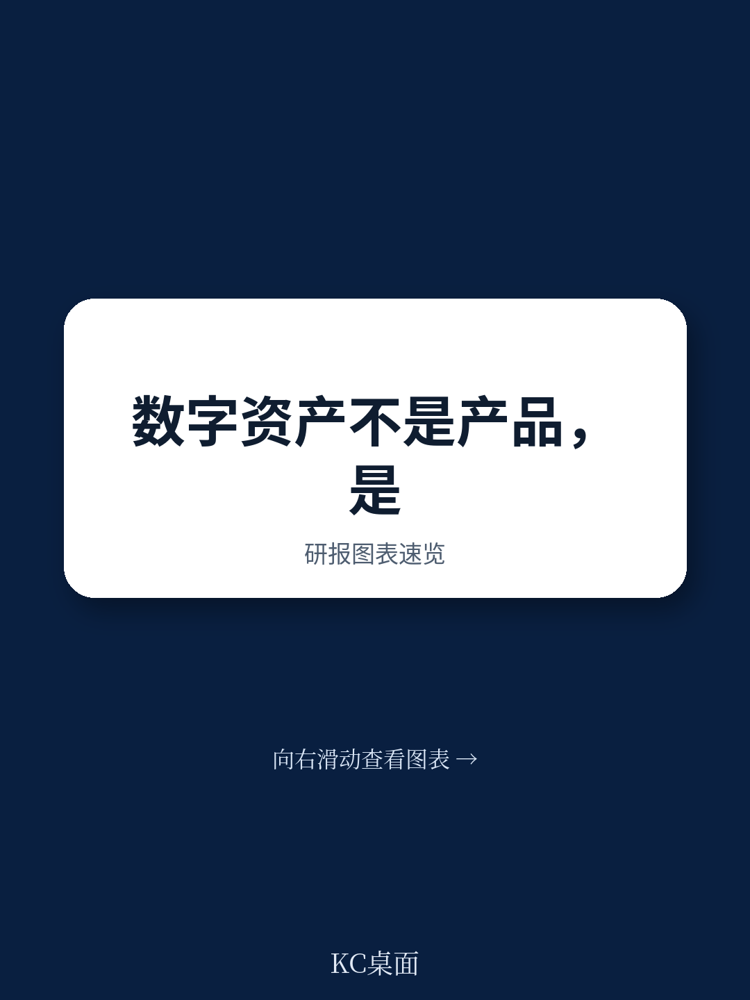
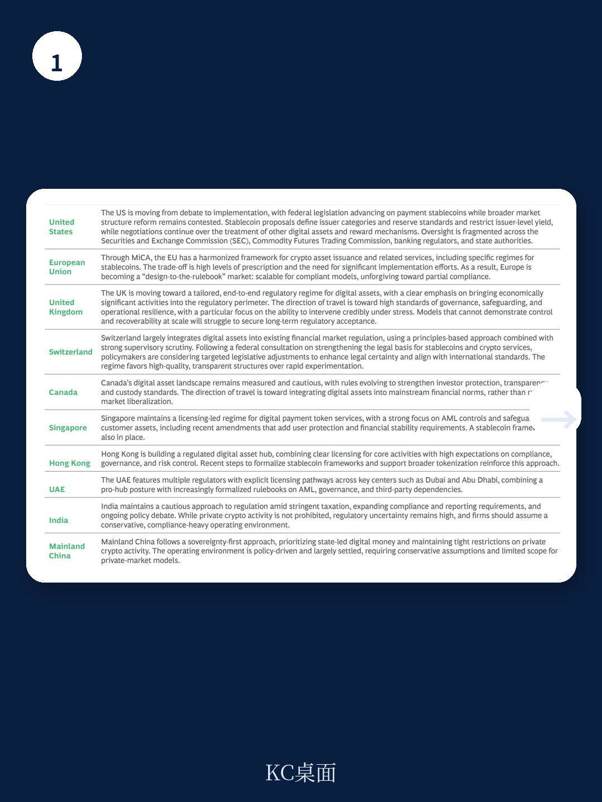

# 波士顿咨询：数字资产不是产品创新，是银行基础设施的换轨

2026年5月，波士顿咨询（BCG）发布了其旗舰报告《数字资产的未来》。这份长达65页的报告，从董事会视角、执行委员会视角、CRO视角和CTO视角，系统拆解了数字资产对银行业的结构性影响。它的核心判断值得每一位金融机构决策者认真对待：**数字资产不是下一个产品线，而是银行核心基础设施的一次换轨——就像从模拟通信切换到数字通信，银行必须同时运营两套铁路，直到新轨道的规模经济让旧轨道无以为继。**

报告明确指出，当前市场格局中，加密资产市值约3万亿美元，稳定币约3000亿美元，而数字化的真实世界资产（RWA）虽仅有约300亿美元的公开规模，却是对银行业长期战略意义最大的类别。BCG的渐进情景预测，到2035年，数字RWA可能达到全球可投资资产的约16%。而在快速扩张情景下，银行可能面临约10%的资产负债表缩减、约14%的收入下降以及约30%的利润下滑。

这不是一份“要不要做”的报告，而是一份“不做会怎样、做了怎么做”的战略框架。以下是我们从这份报告中提炼的八个核心洞察。

## 1. 银行的收入池正在被数字资产从三个方向同时挤压

BCG的报告没有把数字资产视为单一威胁，而是拆解出三条并行作用于银行盈利能力的结构性力量。

第一条力量来自代币化本身。当资产可以在分布式账本上直接发行、交易和结算，传统中介的角色就被压缩了。报告指出，代币化减少了中介需求，价值从银行向非银行平台和资产管理公司转移。第二条力量是客户界面的迁移。当钱包和加密平台成为数字原生客户的主要入口，银行的存款基础和对客户关系的控制权都在流失。第三条力量是成本的双轨运行。在旧轨道和新轨道并行运营期间，银行不得不承担临时的成本重复——既要维护传统清算系统，又要投资数字资产基础设施。

这三条力量叠加的结果是，银行最赚钱的几个业务线——交易银行、净利息收入、托管和结算——将面临最直接的压力。BCG的估算显示，在快速数字化的情景下，银行利润可能下降约30%。这个数字本身已经足够有冲击力，但更值得关注的是它的结构性含义：这不是周期性波动，而是商业模式层面的压缩。

> **KC评论：** 很多银行管理者习惯把数字资产看作“又一个需要关注的创新话题”，但BCG的数据表明，真正需要担心的不是加密资产本身，而是银行在货币流动、资产托管和结算基础设施中的核心地位正在被重新定义。完整报告用大量图表拆解了每个业务线受到的具体冲击路径，值得逐页研读。

## 2. 稳定币的真正威胁不在零售支付，而在批发结算和存款流失

市场上关于稳定币的讨论常常聚焦于零售支付场景——比如用USDC买咖啡。但BCG的报告提供了一个更冷静的视角：目前约三分之二的稳定币供应仍与加密交易和DeFi活动绑定，约四分之一是新兴市场的储值需求，只有约十分之一与实体经济支付相关。

这意味着，稳定币的“战略故事还不是大规模零售颠覆，而是从加密原生用途向更广泛的支付、财资和结算场景的过渡。” 对银行而言，真正需要警惕的是两个场景：批发结算和存款替代。

在批发结算领域，稳定币可以绕过代理银行网络，实现近乎实时的跨境结算，这对银行传统的跨境支付和外汇业务构成了直接挑战。在存款替代领域，如果企业和高净值客户开始将部分流动性以稳定币形式持有，银行的净利息收入将面临结构性压缩。报告虽然没有给出具体的存款流失数字，但其逻辑推演是清晰的：稳定币的利率优势和无国界特性，正在重新定义“货币在哪里存放”这个基本问题。

## 3. 数字RWA才是银行业最深层的转型战场，但时机仍不确定

BCG报告中最值得反复阅读的部分，是对数字RWA的分析。加密资产虽然规模最大，但银行可以将其视为“客户驱动的收入池，而非核心转型故事”。稳定币虽然威胁最直接，但银行仍有时间调整战略。而数字RWA——包括代币化证券、大宗商品和另类资产——才是银行业最深的转型战场。

报告指出，数字RWA可以重新架构发行、结算、托管、服务和抵押品使用。这意味着从投资银行到资产管理，从证券服务到财富管理，几乎所有核心业务都可能被重塑。BCG的渐进情景预测，到2035年，数字RWA可能达到全球可投资资产的约16%，这一比例因资产类别而异。

但报告也诚实地点出了不确定性：目前公开可见的数字RWA仅有约300亿美元，主要集中在货币市场基金和回购协议领域。大规模的扩张需要满足四个条件：客户需求从试点走向主流、监管清晰度提升、技术基础设施达到生产级标准、以及不同账本之间的互操作性得到解决。这些条件何时成熟，报告没有给出明确时间表，但方向是确定的。

> **KC评论：** 很多读者可能会因为“只有300亿美元”而低估数字RWA的战略重要性。但BCG的逻辑是：不要被当前的低规模迷惑，要关注方向。就像1995年的互联网，当时的商业规模微不足道，但方向已经清晰。完整报告对每个资产类别的代币化潜力做了分类估算，并给出了具体的时间窗口判断，是制定银行数字化战略的核心参考。

## 4. 董事会面临的核心战略张力：是保卫旧模式，还是主动重塑？

BCG报告专门为董事会设置了一个章节，提出三条原则：中立不是中立、为可选择性优化、雄心必须匹配能力。这三条原则背后，是同一个核心战略张力：银行应该保卫现有业务模式，还是主动重塑部分业务，在别人动手之前先动手？

报告认为，在基础设施转型中，最大的错误往往不是行动太早，而是行动太晚——当客户界面和标准已经转移到别处，银行就失去了主动权。但行动太早也有风险，尤其是在监管不清晰、技术不成熟的情况下。

BCG为此提供了一个决策框架：区分“无遗憾能力”、“期权价值投资”和“特许经营权赌注”。银行不需要在所有领域都是先行者，但必须明确每个业务线的战略姿态——是防御性整合者、规模化参与者，还是基础设施塑造者。不同的业务可以处于不同的姿态，但选择必须明确。

## 5. 报告尚未完全回答的关键问题：互操作性如何解决？

虽然BCG的报告非常全面，但有一个问题它没有完全回答：互操作性。报告承认，没有互操作性，代币化货币和代币化资产仍然是碎片化的点解决方案。但如何实现互操作性——是通过统一的行业标准、通过跨链桥、还是通过中心化的清算机构——报告没有给出明确的判断。

这本身不是一个缺陷，而是反映了行业的现实。目前，多个账本和协议并存，互操作性方案仍在演进中。但这个问题对银行的战略选择有直接影响：如果银行投资于某个特定的账本或协议，而最终互操作性标准转向另一个方向，那么这些投资可能变成沉没成本。

BCG的建议是，CTO应该构建模块化、账本无关的架构，确保有供应商退出路径。但“账本无关”在实践中如何实现，报告没有给出详细的技术方案。这可能是银行在制定数字资产战略时需要自行填补的空白。

## 6. CRO需要重新理解风险：在可编程市场中，控制点比政策声明更重要

BCG报告中一个极具洞察力的观点是：在可编程、全天候的市场中，风险的产生和传播方式发生了根本变化。传统银行的风险控制围绕产品展开，但在数字资产世界中，控制内嵌于产品之中。

这意味着CRO需要建立一套全新的风险管理框架。反洗钱和制裁监控需要从基于交易对手的筛查转向基于钱包的持续监控。托管成为一阶控制风险，法律责任、技术密钥控制和资产冻结权限必须对齐。智能合约需要像高风险模型一样管理，部署前测试、持续监控，并配备明确的暂停、升级或干预权限。

共享基础设施还创造了新的集中度风险。跨链桥、云服务商、节点运营商、分析供应商和通用协议都可能成为系统性依赖点。全天候市场压缩了危机时间线，升级权利、终止开关和事故应急手册必须在实时中运行，而不仅仅是纸面上的流程。

> **KC评论：** 这是报告中最容易被低估的一个观点。很多银行在推进数字资产项目时，首先考虑的是商业机会，然后才是风险控制。但BCG的逻辑是反向的：在可编程市场中，你的控制框架的设计决定了你能在多大程度上扩展收入。如果你的反洗钱监控只能覆盖直接交易对手，而你的客户在钱包层面与数十个地址交互，那么你的风险敞口远大于你的认知。完整报告对每个风险类别的具体控制点做了详细拆解，是CRO必读章节。

## 7. CEO的十步行动指南：从实验到战略定位

报告的最后一章是一个十步行动指南，从战略定位到执行节奏，为CEO提供了一个可操作的框架。其中最核心的建议是：从实验转向战略定位。

BCG建议CEO量化每个业务线的风险敞口和机会规模，选择每个业务线的战略姿态，建立无遗憾能力——包括钱包/托管、风险控制和银行级的数字资产平台。在节奏上，报告建议0-12个月建立统一的DLT治理、提供安全的客户钱包、加入至少一个机构网络、明确稳定币/代币化存款的立场；12-36个月扩展托管和抵押品用例、将代币化资产整合到财富管理委托中、工业化首批资本市场工作流；3-5年通过代币化抵押品优化资产负债表使用、在规模允许的情况下合理化传统后交易基础设施。

BCG特别强调了一个容易被忽视的风险：战略漂移。如果银行没有有意识地选择数字资产战略姿态，而是零散地增加活动，就会积累风险而不是收入。漂移不是中立，是未管理的风险敞口。

## 8. 对读者的观察框架：如何跟踪数字资产对银行的影响

基于BCG的报告，我们建议读者建立以下几个观察指标，用于跟踪数字资产对银行的实际影响：

第一，关注稳定币的实际使用场景变化。当稳定币用于实体经济支付的比例从目前的约10%上升到30%以上时，意味着稳定币正在成为真正的支付基础设施。

第二，关注数字RWA的规模增长和资产类别扩展。当代币化国债、代币化私募股权和代币化房地产开始出现规模化增长时，意味着银行的核心业务正在被触及。

第三，关注监管清晰度的变化。当主要司法管辖区（尤其是美国和欧盟）发布明确的数字资产监管框架时，银行的战略选择将变得更加确定。

第四，关注银行在客户界面上的控制权变化。当数字原生客户的钱包成为其主要的金融入口，而银行的应用程序退居次要位置时，银行的客户关系价值正在被侵蚀。

---

BCG这份报告的核心价值，不在于它预测了数字资产的具体规模或时间表，而在于它为银行提供了一个系统的战略框架——如何在不确定的环境中保持相关性，而不是试图预测赢家。

报告留下的未解问题——互操作性如何实现、监管路径如何演变、以及银行能否在保持现有收入的同时完成基础设施转型——正是行业未来几年需要共同回答的问题。

我们每天会由AI agent与人工review结合，生成国际投行最新研报的中文摘要与KC评论，daily更新，约10-40页，也包含当天最新数据图表合集。既方便喂给AI，也方便人工快速把握market dynamics。如果你希望继续阅读BCG报告的完整图表、各业务线的具体冲击估算、以及CRO和CTO章节的详细技术方案，欢迎加入社群，与我们一同追踪数字资产对银行业的真实影响。

Personal reading notes and learning share only. Not investment advice.

