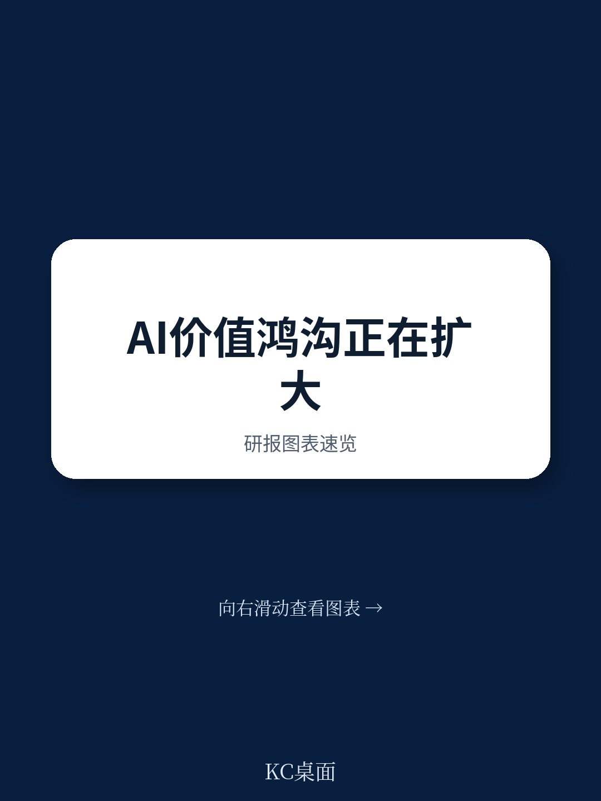

# 波士顿咨询：AI价值鸿沟正在撕裂企业，只有5%的公司真正赢

过去两年，几乎所有CEO都在追问同一个问题：AI投资到底带来了多少实际回报？大多数人的回答并不令人鼓舞。

波士顿咨询（BCG）最新发布的《Build for the Future 2025》报告，基于对全球超过1250家企业的系统研究，给出了一个尖锐的实证结论：AI正在制造一场企业间的结构性分裂，而不是普惠性升级。只有5%的企业真正从AI中获得了规模化价值，而60%的企业尽管投入巨大，却几乎没有看到实质性回报。

这不仅仅是一份关于AI采用率的报告。它揭示了一个正在加速的反馈循环：领先者正在用AI创造的利润反哺AI能力建设，差距每季度都在拉大。而落后者，如果不在12-18个月内做出根本性调整，可能永远追不上。

这份报告最值得关注的核心判断是：AI的价值鸿沟不是暂时的技术差距，而是由组织战略、运营模式、人才体系共同决定的系统性分化。它不会自然弥合，只会越拉越大。

---

## 1. 5%的企业已经跑通AI的价值闭环，而60%还在原地打转

BCG将企业AI成熟度分为四档：未来型（Future-Built）、成长型（Emerging）、停滞型（Stagnating）、以及尚未启动型。未来型企业仅占5%，但它们已经跑通了从投入到回报再到再投资的完整闭环。

数据支撑了这一判断。未来型企业在收入增长上是落后企业的1.7倍，EBIT利润率高出1.6倍，三年股东总回报达到3.6倍，投入资本回报率则高达2.7倍。这不是未来预期，而是已经实现的财务表现。

这些企业并非靠AI做边缘优化。它们将AI嵌入核心业务流程——研发、销售与营销、制造、供应链——并实现了端到端的重塑。报告特别指出，70%的AI价值集中在这些核心职能中，而非后台支持部门。

一个大型多业态零售商的案例颇具说服力：其AI项目组合在过去五年中产生了数亿美元的成本、毛利和收入影响，相当于为公司当期EBITDA贡献了超过10%的增长。该公司高管明确表示，“投资者社群和我们一样，将AI视为战略性的价值驱动因素。”

> **KC评论：** 5%这个数字本身就是一个值得警惕的信号。它意味着，如果你的公司还没有进入这个梯队，你实际上已经在“被拉开距离”。许多企业把AI当作IT项目来管理，而BCG的数据表明，真正的回报来自将AI嵌入CEO议程，并以多年度战略目标来驱动。

---

## 2. 领先者正在用AI利润反哺AI能力，形成“赢家通吃”的循环

报告中最具洞察力的发现之一，是AI价值创造中的“复利效应”。未来型企业计划在2025年将IT预算增加26%，其中AI预算占比高达64%。作为对比，落后企业即使增加投入，也缺乏将投入转化为规模化价值的底层能力。

这种投入差距带来的回报差距更加惊人：未来型企业预期AI带来的收入增长是落后企业的2倍，成本降低幅度则高出1.4倍。

更关键的是，这种差距不是线性的，而是指数级的。领先企业将AI产生的额外现金流重新投入到更强的人才、更先进的技术栈和更敏捷的数据基础设施中，从而加速下一轮价值创造。而落后企业由于缺乏基础能力，几乎无法产生可再投资的AI回报，陷入“低投入-低能力-更低回报”的恶性循环。

报告引用了斯坦福大学的数据：2024年全球AI投资超过2500亿美元。BCG的研究实际上是在追问一个更尖锐的问题：这笔钱到底流向了哪里？答案很明确——大部分流向了那5%的企业，而它们正在用这些钱进一步巩固领先地位。

> **KC评论：** 这个复利循环是理解AI竞争格局的核心框架。它意味着，即使你今年和竞争对手在AI能力上只差10%，明年这个差距可能变成20%，后年变成40%。对于投资者而言，识别哪些公司正在进入这个正循环，比评估其单季度AI投入金额重要得多。

---

## 3. 智能体AI正在成为价值加速器，但前提是“地基”要够硬

报告首次系统性地评估了智能体AI（Agentic AI）的商业影响。智能体AI结合了预测性AI和生成式AI的能力，可以自主推理、学习并采取行动。2024年几乎无人提及的智能体，在2025年已经贡献了AI总价值的17%，预计到2028年将达到29%。

但报告同时给出了一个重要警示：智能体不是AI的起点，而是进阶步骤。部署智能体的前提条件包括：强大的数据基础、已规模化的AI能力、清晰的治理框架。没有这些“地基”，智能体只会放大混乱。

一家全球美妆公司的案例展示了正确的路径。该公司为了解决客户在线体验中信息碎片化、缺乏个性化指导等问题，推出了行业首个大规模虚拟美容助手，整合到20多个市场的网站和电商旅程中。这个虚拟助手结合了AI咨询与实时个性化推荐，部署时间不到12个月，预计将带来1亿美元的增量收入，是传统电商客户路径ROI的两倍。

这家公司成功的关键，不是AI技术本身有多前沿，而是它先建立了统一的数据和云平台，然后才在上面构建智能体应用。

> **KC评论：** 智能体AI是2025年最热的概念，但BCG的数据提醒我们：大多数企业连基础AI能力都还没建立。如果你现在还在纠结“该不该上智能体”，不如先问自己：数据是否已统一？核心流程是否已数字化？AI治理是否已到位？如果答案是否定的，智能体只会是一个昂贵的玩具。

---

## 4. 报告没有完全回答的关键问题：AI价值鸿沟是否会演变为市场结构性的两极分化

BCG的报告提供了丰富的现状描述和行动框架，但有一个问题它没有完全展开：当这5%的企业持续加速，而60%的企业持续落后时，整个市场的竞争格局会发生怎样的变化？

从历史经验看，每一次技术革命都会导致产业集中度上升。PC时代、互联网时代、移动互联网时代都验证了这一点。但AI的扩散速度比以往任何一次技术革命都快——报告明确指出，AI的渗透速度远超此前任何一次数字颠覆。这意味着，市场结构的变化可能不是以“年”为单位，而是以“季度”为单位。

报告提到了一个值得深思的数据点：未来型企业计划在未来一年内对超过50%的内部员工进行大规模技能升级，而落后企业这个比例不到15%。人才差距的加速扩大，可能成为未来3-5年最难以弥补的结构性障碍。

另一个未被充分讨论的问题是：这些5%的企业是否可能通过AI能力形成对上下游的议价权？当一家企业能够用AI将供应链成本降低30%、将产品开发周期缩短50%时，它在产业链中的位置将发生根本性变化。这种变化可能比单纯的财务回报更具战略意义。

---

## 5. 对于决策者，真正的行动框架只有三个问题

BCG的报告最后给出了一个加速AI价值创造的行动路线图。但如果我们提炼到最简，对于任何企业的决策者而言，真正需要回答的问题只有三个：

第一，你的CEO是否把AI当作战略议程的核心，还是把它当作技术部门的任务？报告明确指出，落后企业最普遍的问题就是“高层说一套做一套”——没有清晰的价值目标，没有定期追踪进展的机制，把AI责任下放到中层甚至基层。

第二，你的AI投入是分散在几十个实验性项目中，还是集中在一到两个端到端的核心流程重塑上？报告的数据表明，价值不是来自AI试点或孤立用例，而是来自对核心业务工作流的彻底重塑。

第三，你的人才战略是否与AI战略同步？未来型企业大规模投资于现有员工的技能升级，而不仅仅是招聘外部AI专家。报告显示，这些企业计划对超过50%的内部员工进行AI相关培训——这不仅提高了AI采用率，还解决了组织内部对AI的恐惧和抵触。

这三个问题没有标准答案，但它们决定了你的公司是进入那个5%的正循环，还是留在60%的停滞队列中。

---

这份BCG报告还包含了大量未能在此展开的内容：不同行业的AI成熟度差异（软件和电信领先，化工和房地产落后）、各地区在AI预算分配上的微妙差异（亚太地区AI预算占比最高，但智能体采用率低于北美）、以及多个行业的具体工作流价值拆解图表。

这些细节对于理解AI竞争格局至关重要。比如，报告显示亚太地区企业将IT预算的5.2%投入AI，高于欧洲的4.6%和北美的4.4%，但北美企业在智能体AI的采用率上领先。这种“投入效率”的差异背后，隐藏着不同市场在AI战略执行上的结构性差异。

此外，报告附录中的41个维度AI成熟度评估框架，是一份可以直接用于企业自评的工具。哪些维度是领先企业的共同特征，哪些是落后企业的普遍短板，这些细节对于制定具体的改进计划不可或缺。

如果你希望获得这份报告完整的解读版本，包括原始图表、行业对比数据以及每日更新的国际投行AI主题研报摘要，欢迎加入我们的社群。每天，我们会通过AI agent结合人工审核，整理约10-40页的国际投行中文摘要与KC评论，既方便喂给AI工具做进一步分析，也方便人工快速把握全球市场动态。这些内容会包含当天最新的数据图表合集，帮助你持续跟踪AI价值鸿沟的演变趋势。

Personal reading notes and learning share only. Not investment advice.

