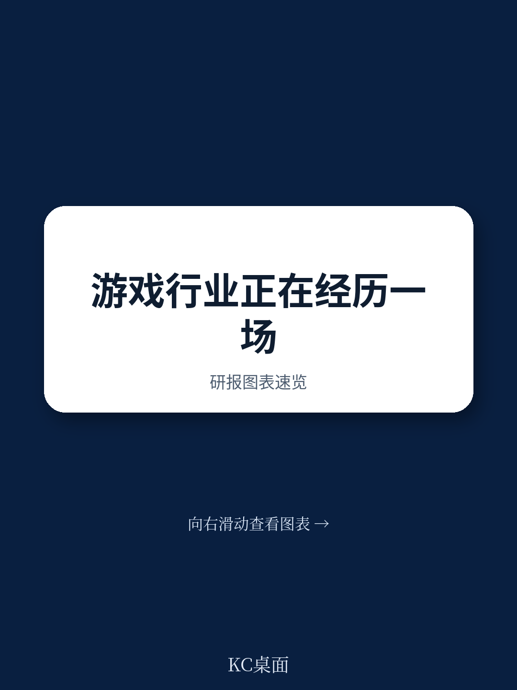
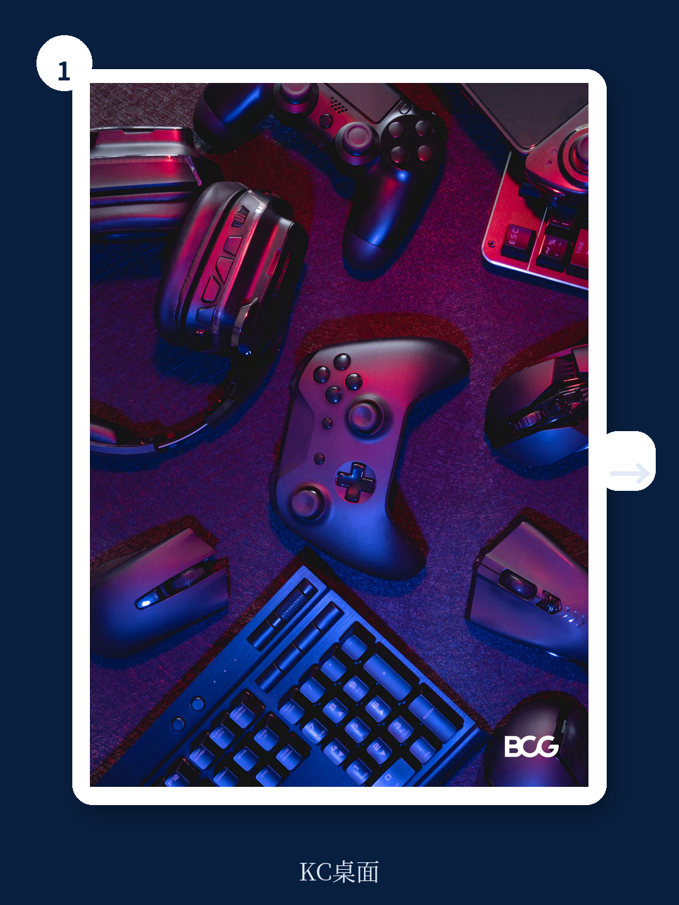
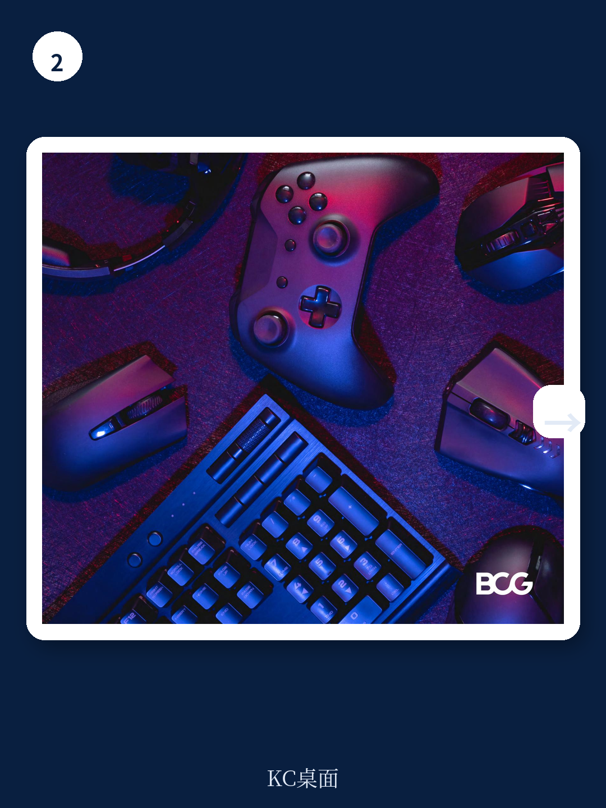

# 波士顿咨询：游戏行业“冬季”结束，但增长逻辑已彻底更换

游戏行业正在走出为期三年的“视频游戏冬季”，但复苏的方式与过去十年完全不同。波士顿咨询在2025年底发布的这份《视频游戏报告2026》给出了一个核心判断：行业增长将重新加速，但驱动引擎已不再是硬件换代或爆款单机，而是四个正在碰撞的结构性趋势——生成式AI、用户生成内容、云游戏和开放应用商店。这四股力量单独看都足够重要，但真正让BCG给出“乐观”评级的原因，是它们正在同时发生，并且相互催化。

这意味着，过去围绕主机战争、独占内容和发行窗口建立起来的竞争规则，将在未来五到十年内被重新书写。对于产业决策者而言，现在需要回答的问题不是“下一款爆款在哪里”，而是“我的公司在这套新规则下还有没有位置”。

## 1. 这轮复苏不会回到2010年代的增长速度，但结构更健康

BCG基于对约3000名玩家的全球调查和行业访谈，认为行业即将走出2022年以来的低迷期。但报告明确强调，增长不会回到2010年代“十年翻倍”的速度。这不是悲观，而是现实——2010年代的增长很大程度上来自移动游戏用户的爆发式扩张，而那个红利已经基本兑现。

真正值得关注的信号来自需求端。报告显示，约55%的玩家在过去六个月内增加了游戏时间。更关键的是代际传递：44%的玩家父母表示，他们的孩子在五岁前就开始玩电子游戏，而孩子最早接触的三款游戏中有两款是包含大量用户生成内容的《我的世界》和《Roblox》。这意味着UGC正在成为新一代玩家的“入门语言”，而不是成年后才接触的高级玩法。

> **KC评论：** 代际数据往往被低估。当一代人在五岁前就通过UGC游戏建立游戏习惯，他们对“什么是好游戏”的定义会和上一代完全不同。这对所有面向未来五到十年的游戏公司来说，意味着产品设计哲学和用户获取策略都需要重新思考。完整报告中的Exhibit 2和Exhibit 4提供了更细分的代际平台偏好数据，值得仔细拆解。

## 2. 生成式AI的最大机会不在降本，而在催生新品类和新的工作室形态

BCG对AI的分析没有停留在“AI能省多少钱”这个层面。报告承认，AAA级游戏的开发成本已经可以高达3亿美元，AI确实能在效率层面提供显著帮助——从自动化质量检测到代码优化。但报告真正有洞察的判断是：AI的最大价值在于催生一种全新的工作室形态——AI原生工作室。

这些工作室的输出在初期可能质量不高，但BCG援引克里斯坦森的“创新者困境”理论指出，低端颠覆性创新在合适条件下会快速改善。在游戏行业，这意味着玩家可能会因为更多样化和更快的更新节奏而接受AI生成的内容。这对传统AAA开发商意味着什么？报告没有明说，但逻辑很清晰：当AI工作室能以十分之一的成本和时间生产出“足够好”的游戏，AAA游戏的“质量护城河”将面临前所未有的挑战。

报告也给出了一个值得警惕的数据：截至2025年中期，Steam上约20%的新游戏披露使用了AI，这个比例是一年前的两倍。如果AI生成的“游戏垃圾”大规模涌入平台，玩家的态度可能迅速从目前的“不反感”转向“反感”。目前只有10%的成年玩家对AI生成艺术/动画持负面态度，但BCG指出，这些玩家尚未真正体验过AI生成的内容。一旦体验变差，情绪可能逆转。

> **KC评论：** 这里有一个关键假设值得追问：当AI生成内容泛滥后，平台方的“策展能力”是否会成为新的稀缺资源？BCG在报告中提到了这一点，但没有展开。完整报告中的Exhibit 5和Exhibit 6展示了AI在游戏开发中的具体应用分布和渗透速度，这些图表能帮助你判断自己的公司应该从哪里切入AI。

## 3. 云游戏不再是“未来”，60%的玩家已经试过，80%体验正面

云游戏的概念已经喊了十年，但BCG的数据显示，它可能终于到了临界点。调查中60%的玩家表示尝试过云游戏，其中80%给出了正面评价。这个数字如果继续攀升，将从根本上改变游戏行业的竞争格局。

报告提出了一个关键判断：“主机战争”将逐渐让位于“云战争”。当玩家可以在任何屏幕上、通过任何设备接入游戏，游戏公司的竞争就不再是硬件规格的比拼，而是生态系统、内容库和用户体验的竞争。这意味着，索尼、微软和任天堂过去二十年建立起来的硬件壁垒，正在被云技术逐步消解。

BCG还给出了一个更具体的预测：云游戏将显著扩大总可寻址市场。当玩家不再需要购买昂贵的游戏主机或高性能PC，数百万潜在用户将被纳入市场。这对于新兴市场尤其重要——报告中的调查样本覆盖了美国、中国、德国、日本和韩国，但全球南方的增量市场可能才是云游戏真正的增长引擎。

## 4. 应用商店的开放将重塑移动游戏50%收入的分配规则

移动游戏占全球游戏收入的50%，而应用商店的分成规则直接影响这半个行业的利润结构。BCG将应用商店的开放称为“地震”，虽然目前震中在移动端，但余震可能波及整个游戏生态系统。

报告没有详细展开具体政策变化，但其逻辑很清楚：当开发者可以以更低的分成比例、甚至通过自有渠道分发游戏，过去被应用商店抽走的30%收入将重新回到开发者手中。这不仅仅是利润分配的问题——它意味着开发者有更多资金投入研发、营销和用户获取，也意味着新的发行模式和商业模式可能出现。

对于依赖应用商店流量的中小开发者，这可能是机遇；对于已经建立庞大分发网络的大厂，这可能是挑战。报告提到，开发者将获得“控制自己分发的巨大新机会”，但这个机会的实现路径和风险，报告没有完全展开。

## 5. 报告尚未完全回答的关键问题：AAA游戏的商业模式能否持续

BCG在多个地方暗示了AAA游戏商业模式的压力，但没有给出明确的判断。报告提到，AAA游戏的开发成本已经高达3亿美元，而AI、UGC和云游戏三股力量正在从不同方向侵蚀AAA游戏的传统优势——视觉质量、独占内容和硬件绑定。

报告在结尾处写道：“AAA商业模式将持续面临压力，顶级开发商需要进一步投资于品牌、IP、平台策展、订阅和窗口化策略。”这句话翻译过来就是：过去靠“砸钱做画面、独占卖硬件、窗口期赚大钱”的模式已经不够了。但BCG没有回答的是，这些新策略能否真正填补AAA游戏在成本和收益之间的缺口。

> **KC评论：** 这是一个值得所有关注游戏行业的人持续追踪的问题。如果AAA游戏的商业模式确实不可持续，那么整个行业的估值逻辑、投资方向和人才流动都会发生根本性变化。完整报告在“改善变现”章节中讨论了新的游戏定价数学和窗口化策略，这些细节对于判断AAA游戏的未来至关重要。

## 6. 给决策者的观察框架：从四个维度重新评估自己的位置

基于BCG的分析，可以提炼出一个简单的评估框架。任何游戏公司或投资者都可以从以下四个维度审视自己的位置：

第一，内容生产。你的游戏开发流程中有多少环节可以被AI重构？如果AI能在六个月内将开发成本降低30%，你的竞争优势会增强还是削弱？

第二，分发渠道。你的用户获取是否过度依赖单一平台？当应用商店开放、云游戏普及，你的分发策略是否需要根本调整？

第三，用户粘性。你的游戏是否具备UGC生态？如果没有，你准备如何应对玩家对“可创造、可分享、可迭代”内容的持续增长需求？

第四，变现模式。你的收入是否过度依赖一次性销售？订阅、微交易、窗口化策略是否已经纳入你的产品设计？

这四个维度不是独立的。BCG的核心洞察恰恰在于，它们正在同时变化并相互放大。一个在四个维度上都处于弱势的公司，可能会在五年内被边缘化；而一个在某一维度上建立绝对优势的公司，则可能定义下一个十年的竞争规则。

---

这份报告的完整版本包含了大量未在本文中展开的图表和数据——包括不同代际玩家的平台偏好分布、AI在游戏开发中的具体应用案例、云游戏的三种商业模式对比，以及BCG对2030年游戏行业的全景预测。这些细节对于形成自己的判断至关重要。

我们会持续通过社群推送国际顶级投行和咨询机构的最新报告解读，每天由AI agent结合人工review生成中文摘要与KC评论，约10至40页，涵盖当天最新数据图表合集，既方便快速把握市场动态，也适合直接作为AI分析素材。如果你希望获取完整报告原文和更多深度解读，欢迎加入社群继续讨论。

Personal reading notes and learning share only. Not investment advice.

