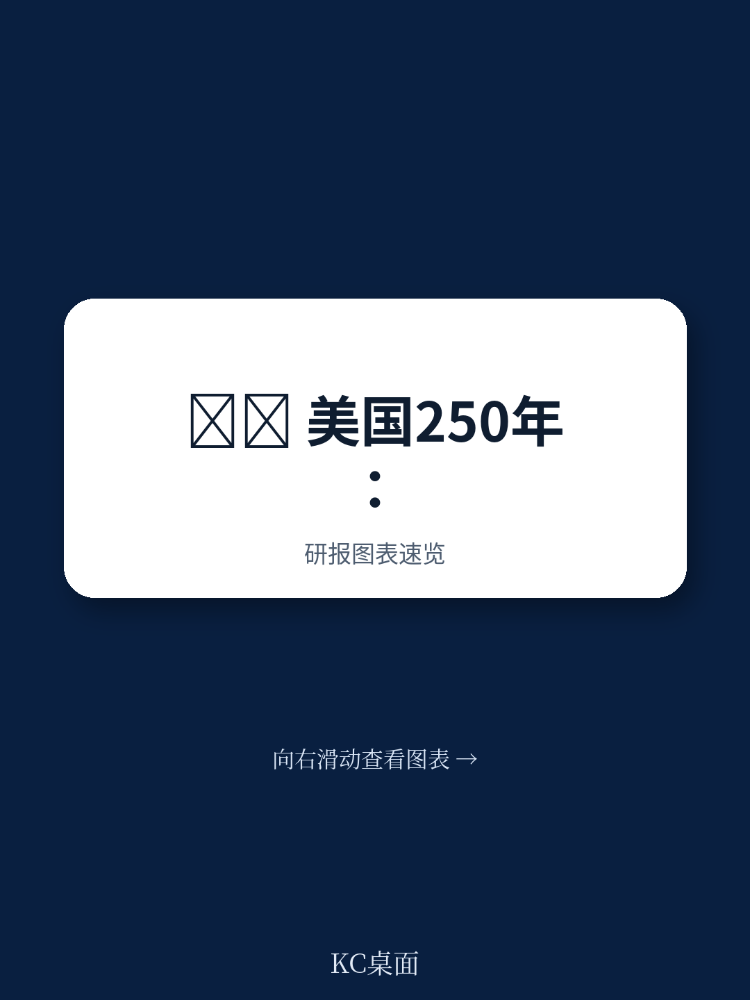
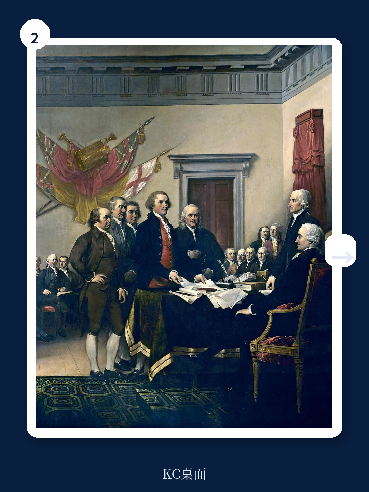

# 麦肯锡：美国250岁，但真正的考验才刚刚开始

美国建国250周年之际，麦肯锡全球研究院发布了一份罕见的长篇报告。这份报告没有停留在庆祝，而是提出了一个让产业决策者必须正视的判断：美国当前的经济竞争力优势，正面临历史性的结构性挑战，而AI时代的到来让这场竞赛的胜负远未落定。

报告的核心主张可以用一句话概括：美国今天仍是全球最具竞争力的经济体，但支撑其250年领先地位的两大基石——创新文化与自然资源禀赋——正在遭遇前所未有的压力。如果美国不能像历史上四次成功转型那样完成第五次自我重塑，其经济领先地位将面临实质性风险。

这并非危言耸听。麦肯锡的数据显示，美国以全球4%的人口创造了26%的GDP，拥有全球市值前100强公司中的59家，贡献了全球27%的研发支出。但与此同时，国家债务持续攀升、基础设施老化、基础教育水平下滑、制造业技能流失、收入与财富差距扩大——这些曾经的优势正在变成负担。

更关键的是，AI正在重塑全球竞争格局。美国目前拥有全球最引人注目的AI模型中的48个，遥遥领先于其他经济体。但报告提醒：技术领先并不自动等于经济竞争力。当中国在制造业产出和出口份额上已经大幅超越美国，当全球供应链正在经历新一轮重构，技术优势能否转化为持续的经济领先，取决于美国能否在能源、基础设施、教育和财政四个维度上同时取得突破。

这份报告的价值不在于告诉读者美国很强——这已是共识。它的真正洞察在于：美国历史上的每一次竞争力跃迁，都不是靠维持现状实现的，而是通过主动打破旧模式、建立新制度完成的。从农业国到工业国，从工业国到科技大国，从科技大国到数字强国，每一次转型都伴随着痛苦的结构性调整。今天，美国正站在第五次转型的起点上。

> **KC评论：** 麦肯锡这份报告最值得关注的不是它对美国现状的肯定，而是它对“优势如何变成负担”的分析。比如，美国过去依赖的廉价能源和广阔土地，在AI和高科技制造时代可能不再构成决定性优势。报告中的图表演示了美国在制造业产能、基础教育水平、基础设施质量等维度上相对于其他发达经济体的下滑——这些才是真正值得中国产业界警惕的信号。完整报告里有更详细的国家间对比图表和分行业数据，值得细读。

## 1. 这轮变化真正考验的是企业能否把规模转化为议价权

麦肯锡报告指出，美国企业已经完成了从本土工厂到全球科技巨头的演变。今天，美国企业在全球市值中的占比超过50%，在风险投资中的占比达到58%。但报告同时揭示了一个容易被忽视的事实：这些数字的背后，是制造业产出和出口份额的持续下降。

美国制造业产出占全球比重仅为11%，远低于中国的45%。出口份额也只有10%，不到中国的17%。这意味着，美国的经济竞争力越来越依赖少数头部科技公司和金融服务企业，而非广泛的产业基础。

这种结构性的失衡带来了一个深层问题：当美国企业在全球市值中占据主导地位时，它们的竞争力是否依然建立在技术领先和效率优势之上？还是说，部分领先优势来自资本市场的偏好和美元的特殊地位？

报告没有直接回答这个问题，但提供了一组值得玩味的数据：美国在AI私人投资、高被引科学家数量、诺贝尔科学奖获奖人数等指标上依然领先，但在基础教育水平（PISA测试分数）上已经落后于多个发达国家。这指向一个矛盾——美国在尖端创新上仍然领先，但培养下一代创新者的基础正在松动。

对于企业决策者而言，这意味着：如果你今天依赖的是美国市场的规模优势和资本市场的融资便利，那么未来5-10年，这些优势的相对价值可能会下降。真正能够持续创造价值的，是那些能够将规模转化为技术议价权和供应链控制权的企业。

## 2. 历史上四次转型的规律：每次都是“制度创新”先于“技术创新”

麦肯锡将美国250年的经济史划分为四个章节：农业时代、工业时代、科学时代、数字时代。每一次转型的关键，都不是某项单一技术的突破，而是制度安排的重大调整。

农业时代（1776-1870年代）：美国通过土地制度和产权保护，让大量移民能够获得土地并从事农业生产，奠定了经济基础。

工业时代（1870年代-1940年代）：通过铁路建设、专利制度、反垄断立法和公共教育体系，美国从农业国转型为工业强国。

科学时代（1940年代-1980年代）：二战后的政府大规模研发投入（如DARPA、NIH）、高等教育扩张和冷战时期的科技竞赛，催生了半导体、航空航天、生物技术等新兴产业。

数字时代（1980年代至今）：通过放松管制、风险投资生态、知识产权保护和全球化的贸易体系，美国成为互联网和数字经济的领导者。

报告的核心洞察是：每一次转型，都是政府、企业和个人三方共同参与的“国家工程”（national project）。没有政府的制度供给，企业的创新投入就缺乏基础设施和规则保障；没有企业的市场化应用，政府的研发投入就无法转化为经济价值；没有个人的技能提升和创业精神，制度和资本都无法落地。

> **KC评论：** 这个框架对理解当前的政策博弈很有帮助。无论是美国的芯片法案、通胀削减法案，还是欧洲的数字主权战略，本质上都是政府在试图重塑制度环境来引导下一轮技术转型。但麦肯锡报告提醒：历史上成功的转型都是“三方合力”，而不是单靠政府补贴或企业自主。如果政府投入没有带动企业投资和个人技能提升，效果会大打折扣。完整报告里有每个历史章节的详细案例分析，包括哪些制度安排成功了、哪些失败了，非常值得产业政策研究者参考。

## 3. 报告没有完全回答的一个关键问题：AI时代的“国家工程”谁来买单？

麦肯锡报告列出了未来十年美国需要优先解决的四个领域：能源充裕、基础设施升级、技能匹配的教育体系、以及财政可持续性。报告估算，仅基础设施一项，未来十年就需要约7.2万亿美元的投资。

问题在于，这些投资的资金来源并不明确。美国联邦债务已经超过GDP的120%，利息支出正在挤占其他公共支出。而减税政策和人口老龄化进一步压缩了财政空间。

报告承认，当前的财政状况是“不可持续的”，但并没有给出具体的解决方案。它只是指出，历史上美国每次重大转型都伴随着财政制度的调整——从建国初期的关税制度，到二战后的累进所得税，再到1980年代的减税——但这一次，调整的方向和力度都还不清晰。

对于投资者而言，这意味着未来几年需要密切关注美国财政政策的变化。如果政府选择通过增税来融资，科技公司和跨国企业的利润可能承压；如果选择继续发债，利率环境可能长期保持高位，影响资产定价。

报告还提到了一个容易被忽视的维度：美国在关键矿产和半导体制造环节的对外依赖。尽管美国在芯片设计领域保持领先，但先进逻辑芯片和高端存储芯片的制造能力几乎完全外包给了亚洲。在稀土、医药原料等领域，美国对中国的依赖程度同样很高。这种“技术领先但制造依赖”的格局，在地缘政治紧张加剧的背景下，可能成为经济竞争力的软肋。

## 4. 对读者的观察框架：用“三个维度”判断美国能否完成第五次转型

基于麦肯锡报告的分析框架，我们可以提炼出三个观察维度，用来判断美国是否真的能够开启第五次转型：

第一，能源和基础设施是否能够支撑新一轮制造业回流。报告指出，美国历史上长期享有能源自给和充裕农业用地的优势。但今天，AI数据中心的电力需求激增，电网老化问题突出，而制造业回流需要大量的工业用地和熟练工人。如果这些问题得不到解决，所谓的“制造业回流”可能只是口号。

第二，教育体系能否培养出匹配AI时代的人才。报告数据显示，美国PISA测试分数已经低于多个发达国家，而STEM领域的毕业生数量虽然绝对数大，但占人口比例并不突出。如果基础教育继续下滑，美国可能面临“尖端人才靠引进、中层技能严重短缺”的结构性问题。

第三，财政可持续性是否允许大规模的公共投资。这是最不确定的变量。如果财政空间受限，政府将不得不在国防、研发、教育、基建等之间做出艰难取舍。任何一项的削减，都可能影响转型的速度和质量。

> **KC评论：** 这三个维度提供了一个清晰的“体检清单”。对于关注美国市场、或者与美国企业有业务往来的读者，可以定期对照这三个维度来评估环境变化。比如，如果美国通过了大规模基建法案并开始落地执行，那是一个积极信号；如果财政赤字进一步恶化导致政府削减研发投入，那需要警惕。完整报告里有每个维度的定量目标和历史对比数据，这些数字比定性判断更有说服力。

## 5. 美国故事的另一面：这对中国意味着什么

麦肯锡报告虽然是关于美国的，但它对中国读者同样具有参考价值。报告在多个地方将美国与中国进行比较：中国的制造业产出是美国的四倍，出口份额是美国的近两倍，PISA测试分数远超美国。

但报告也指出，中国在AI模型数量、风险投资规模、高被引科学家比例等创新指标上仍然落后于美国。这意味着，中美两国的竞争格局不是简单的“谁取代谁”，而是一种“各有所长、相互依存、但又彼此竞争”的复杂关系。

对于中国企业而言，麦肯锡报告提供了一个重要的战略视角：不要被美国的技术领先所吓倒，也不要低估美国自我转型的能力。历史证明，美国在面临危机时往往能够做出重大调整。但同时，美国的制度优势正在被自身积累的问题所侵蚀，这为中国企业提供了窗口期。

真正值得关注的是：如果美国成功完成第五次转型，它可能重新获得在AI、先进制造、能源等领域的全面领先地位。如果转型失败，全球经济的多极化进程将加速。无论哪种结果，都会深刻影响全球产业链布局和资产定价逻辑。

---

麦肯锡这份报告的价值，不在于告诉你美国是强是弱，而在于它提供了一个分析框架：一个经济体如何通过制度创新来应对技术变革和地缘格局变化。这个框架不仅适用于美国，也适用于任何正在经历转型的经济体。

报告的完整版本包含了大量历史数据图表、国家间对比分析、以及分行业的竞争力拆解。这些内容因为篇幅限制无法在本文中全部呈现，但它们对于理解当前全球经济格局的深层变化至关重要。

如果你希望获得完整的报告解读，包括原始图表数据、分行业竞争力分析、以及我们基于报告逻辑生成的每日投行摘要，欢迎加入我们的社群。每天，我们会由AI agent结合人工review，整理国际投行最新研究报告的中文摘要与KC评论，覆盖麦肯锡、高盛、摩根士丹利、摩根大通、瑞银、花旗等主要机构，内容约10-40页，既方便直接喂给AI工具做进一步分析，也方便人工快速把握全球市场动态。所有内容都附带原始图表和关键数据，确保信息可追溯、可验证。

Personal reading notes and learning share only. Not investment advice.

