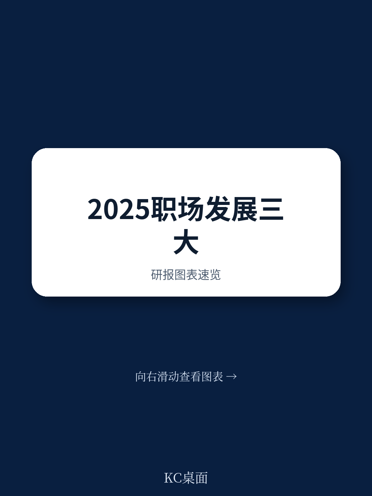

# 麦肯锡：企业最大的风险，是把人才培养当成HR的事

2025年的组织发展正面临一个根本性悖论。一方面，几乎所有CEO都在强调“人才是核心竞争力”；另一方面，当麦肯锡研究团队梳理全球45+份趋势报告后，得出的核心判断却相当尖锐：**大多数企业的学习发展体系仍然停留在“支持功能”层面，而非“战略驱动引擎”。**

这份由麦肯锡研发与创新学习实验室发布的2025年趋势报告，给出了一个值得所有决策者反复咀嚼的结论——在不确定性成为常态的当下，组织真正的竞争优势不在于拥有多少人才，而在于能否构建一个让人才持续生长的“生态系统”。而构建这一生态系统的核心障碍，恰恰是企业内部那些看似合理、实则僵化的部门壁垒。

报告提出了三个相互支撑的宏观趋势：流动的发展生态系统、负责任的人工智能采用、以及个体与组织的韧性与适应力。这三个趋势不是孤立的清单，而是一个必须同时推进的联动系统。其中任何一个环节的缺失，都会导致整体失效。

> **KC评论：** 这份报告最值得关注的不是趋势本身，而是趋势之间的“互锁关系”。很多企业已经在单点发力——有的在推AI学习工具，有的在搞跨部门轮岗，但麦肯锡的研究表明，这些孤立动作的效果有限，因为真正的变革需要学习、技术、文化三条线同时推进。

## 1. 72%的企业知道要打破壁垒，但只有11%真正做到了

报告引用了ATD 2023年的一项调查数据：72%的受访者承认，将人力资源转化为跨职能学科至关重要，但只有11%的人表示取得了实质性进展。这个数字本身就是一个值得深思的管理寓言——知道该做什么和真正去做之间，横亘着一道巨大的组织惯性鸿沟。

麦肯锡将这种状态描述为“真实但非根本性的进步”。当前，AI代理正在越来越多地介入即时学习支持——引导实践、辅导任务、支持实时反思。技能成为核心焦点，组织也开始从自我报告数据向更完整的技能验证图景迈进。但问题在于，学习仍然常常让人觉得是需要“停下来、离开工作去做”的事情，而非在工作中自然发生。

这种“进步的幻觉”比原地踏步更危险。因为表面上，员工确实在使用AI工具、参加在线课程、完成技能评估，但组织的底层逻辑并未改变——学习与发展部门仍然处于被动响应状态，更多被当作支持功能而非战略伙伴。“围栏没有倒塌，只是移动了位置。”

> **KC评论：** 11%这个数字值得每个CXO认真思考。如果你的组织正在推行“技能优先”战略，但HR、L&D、业务部门之间仍然各自为政，那么你可能就是那89%中的一员。完整报告里有一个非常实用的“行动框架”，详细拆解了从当前状态到理想状态的转型路径，包括具体的组织设计建议和关键指标。

## 2. 数据驱动的开发生态：从追踪“学了什么”到洞察“为什么学”

报告提出的第二个关键判断是：学习测量必须从“事件追踪”进化为“数据生态系统”。这不仅仅是技术升级，而是思维方式的根本转变。

当前，大多数企业仍然在用“课程完成率”“培训出席率”等滞后指标衡量学习效果。但麦肯锡认为，真正有价值的数据生态应该能够回答三个层次的问题：学到了什么、如何学的、以及朝着什么目标学。当数据能够在各个职能之间流动，并最终触达个体员工时，它才能支撑更聪明的人才决策和持续的在岗发展。

报告特别指出，这一进化由三股力量共同驱动：AI和大语言模型等新技术的成熟、HRIS等集成系统的完善、以及员工对个性化发展体验的期望提升。这三者的交汇点，正是组织可以从“支持功能”向“战略驱动”跃迁的关键窗口。

然而，报告也坦承，当前大多数组织仍然处于“被动状态”——61%的企业只做未来一年的劳动力规划，几乎没有留给有意义的预见性洞察任何空间。这种短视，与世界经济论坛预测的“2025-2030年间39%的现有技能将被改造或淘汰”形成了鲜明对比。

## 3. 信任是AI落地的“隐形天花板”

在AI采用这个趋势上，麦肯锡的态度值得玩味——既看到了巨大潜力，也表达了深切担忧。报告开篇就写道：“信任是脆弱的，处理不当可能侵蚀员工信心。”

这一判断的底气来自对现实的观察：多年来，企业一直在承诺个性化学习、定制化辅导、简化支持结构，但员工仍然感到不堪重负、被持续变化消耗、在发展中得不到支持。当人们领导者正在积极实验AI——构建AI代理、建立合作伙伴关系、试点新功能——这些努力反而可能给员工制造更多复杂性，而非带来清晰的价值。

麦肯锡的解决方案是“负责任地采用AI”。这不仅是技术问题，更是信任工程。报告强调，AI采用的路径必须向员工传递一个明确信号：领导者关心他们的贡献，并致力于确保AI帮助他们成功。这要求组织在推动AI落地的同时，必须同步培养员工的“高阶技能”——批判性思维、创造力、情感智能——这些恰恰是AI难以替代的人类优势。

> **KC评论：** 这里有一个报告没有完全展开但值得追问的问题：当AI代理成为“实时导师”，谁来监督这个导师？如果AI的推荐算法存在偏见，或者它推荐的学习路径与组织战略脱节，责任归属在哪里？完整报告对“人机协作”的讨论更加深入，包括如何设计AI代理的“行为准则”以及如何建立员工的“数字素养”评估框架。

## 4. 韧性与适应力：从“反弹”到“弹射向前”

报告第三个趋势的标题本身就很有力量：组织必须学会“bounce forward”，而非仅仅“bounce back”。

这一区分至关重要。传统的组织韧性往往被理解为“恢复能力”——在冲击之后回到原来的状态。但麦肯锡认为，在持续颠覆的环境中，回到原状远远不够。组织需要学会“向前弹射”——重新想象工作如何完成、人们如何学习和发展、组织如何作为韧性和适应性系统运行。

报告特别强调了多代际劳动力的潜力释放。随着五代人同时在职场的局面成为常态，年龄差异不再是需要管理的“问题”，而是需要挖掘的“资源”。同时，报告也关注到职业倦怠的严峻现实——66%的员工在2025年报告了职业倦怠症状——并提出了“恢复性工作流”的概念，即通过可持续的工作节奏设计，让恢复成为工作流程的内置组成部分，而非事后补救。

## 5. 报告没有完全回答的关键问题：谁为“流动的生态系统”负责？

尽管报告提供了极具洞察力的趋势分析和行动建议，但在一个核心问题上仍然留下了开放性空间：**当组织从“结构化”转向“流动化”，谁为这个新生态系统的治理负责？**

传统上，学习由L&D部门负责，人才由HR负责，技术由IT负责。但在一个“流动的发展生态系统”中，这些边界被刻意模糊了。报告建议建立跨职能团队来解决组织范围的人才挑战，但并没有详细说明这类团队的权责分配、决策机制和绩效评估方式。

这是一个值得每个正在推进组织转型的领导者认真思考的问题。如果所有部门都对人才培养负有责任，是否意味着没有部门真正为结果负责？当学习与工作完全融合，如何衡量学习投入的ROI？当AI代理成为学习的主要交付渠道，人类管理者的角色如何重新定义？

这些问题的答案，可能因组织而异，但它们的提出本身就已经具有价值——它迫使领导者跳出“最佳实践”的思维定式，去思考真正适配自身组织基因的解决方案。

---

这份麦肯锡报告的完整版本包含大量尚未公开的原始数据、趋势交叉分析矩阵、以及针对不同行业和规模组织的具体行动路线图。例如，报告中有一个关于“技能验证”的详细框架，展示了如何从自我报告数据进化到基于AI的技能评估体系；还有一个关于“恢复性工作流”的设计原则，包含具体的排班模型和能量管理策略。

这些内容在一篇文章中无法完整呈现。如果你希望获得完整的研报解读、原始图表以及每日更新的国际投行摘要，可以加入我们的社群。我们每天通过AI agent加人工审核的方式，从高盛、摩根士丹利、麦肯锡等顶级机构的最新报告中提炼核心洞察，形成约10-40页的中文摘要与KC评论，既方便直接阅读，也适合作为AI分析的数据输入，帮助你在第一时间把握全球市场的关键变化。

Personal reading notes and learning share only. Not investment advice.

