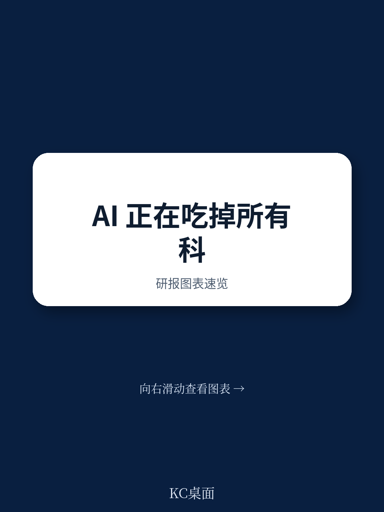

# 麦肯锡：2025年最该关注的不是AI本身，而是AI如何让其他技术“活”起来

当所有人都在追问“AI还能做什么”的时候，麦肯锡全球研究院在2025年7月发布的《技术趋势展望2025》中给出了一个更值得思考的回答：AI的真正价值不在于它自身的能力边界，而在于它如何成为其他12项前沿技术的“赋能放大器”。这份覆盖13项前沿技术的年度报告传递了一个核心判断——技术竞争已经从“单项突破”进入“组合创新”时代，而AI是那个让组合发生化学反应的催化剂。

报告开篇就亮出了一个反直觉的观察：2024年，尽管宏观环境波动，但13项技术趋势中有10项的股权投资实现了同比增长。更值得注意的是，那些看似“独立”的技术领域——从机器人到生物工程，从能源到空间技术——正在通过AI的嵌入产生前所未有的协同效应。这不是一个关于技术趋势的简单罗列，而是一份关于“技术如何相互赋能”的战略地图。

对于产业决策者而言，真正的挑战不是判断哪项技术最有前景，而是理解这些技术如何组合、在什么场景下产生最大价值、以及自己的企业应该在哪个生态位上布局。麦肯锡报告的价值，恰恰在于提供了这样一个系统性的分析框架。

---

## 1. 股权投资全面回暖，但资金流向揭示了“技术分层”

报告展示了一组关键数据：2024年，13项技术趋势中有10项吸引了比2023年更多的股权投资。其中，能源与可持续发展技术、未来出行两大领域的累计投资额最高，而代理式AI虽然绝对投资额仅为11亿美元，但同比增长了985%，成为增速最快的细分方向。

> **KC评论：** 股权投资数据是判断技术成熟度的“温度计”。2024年的回暖不是简单反弹，而是资金在经历2023年的“挤泡沫”后，开始更有选择地流向两类技术：一类是已经证明有规模化潜力的领域（如清洁能源），另一类是处于爆发前夜的新方向（如代理式AI）。这种分化意味着，未来两年将是技术投资“优等生”和“潜力股”分道扬镳的关键窗口。

但更值得关注的是资金在不同技术层级之间的分配。报告将13项技术分为三大板块：AI革命、计算与连接前沿、尖端工程。股权投资数据显示，AI革命板块的增速最快，但绝对规模仍远低于尖端工程板块。这暗示了一个结构性变化：AI正在从“独立赛道”转变为“基础设施”，其投资价值更多体现在对其他技术的赋能效应上，而非自身规模的线性增长。

---

## 2. 代理式AI：从“对话”到“行动”的跨越，正在重新定义人机协作

报告首次将“代理式AI”列为独立趋势，这是一个值得产业界高度重视的信号。不同于传统的对话式AI，代理式AI能够自主规划、执行多步骤工作流，相当于创造了一个“虚拟同事”。报告给出的数据极具说服力：2023至2024年间，代理式AI相关岗位的招聘量增长了985%，尽管股权投资额仅有11亿美元，但这一增速在所有技术趋势中排名第一。

> **KC评论：** 代理式AI的爆发不是偶然。过去两年，企业从“尝试用AI写文案、做客服”转向“让AI自动执行复杂业务流程”。这种转变意味着，AI的商业价值不再局限于“提效”，而是开始触及“重构流程”。报告中提到的工厂机器维修场景——AI诊断问题、代理式AI自动生成维修计划并订购零件、机器人执行维修——正是这种“组合拳”的典型样本。完整报告中对代理式AI的技术架构、部署成本、以及行业应用案例有更详细的拆解，值得进一步阅读。

这一趋势对企业的启示是：当AI能够自主行动时，组织流程的设计逻辑需要根本性调整。传统的“人-系统-人”的线性流程，正在被“人-AI-系统-人”的闭环所取代。那些率先在供应链管理、客户服务、研发流程中引入代理式AI的企业，将获得显著的效率优势。

---

## 3. 专用半导体：AI正在倒逼芯片产业“重写规则”

报告另一个值得关注的新增趋势是“专用半导体”。虽然半导体一直是技术栈的基础层，但AI的爆发式增长正在倒逼芯片设计发生根本性变革。报告指出，AI训练和推理对计算能力、存储、网络带宽的需求呈指数级增长，同时还要管理成本、散热和功耗问题。这催生了大量新专利、新竞争对手和新生态系统。

麦肯锡的量化分析显示，半导体领域的专利数量、研究论文发表量均处于13项技术趋势的前列。这背后是一个清晰的逻辑：通用芯片（如CPU、GPU）已经难以同时满足AI推理的高效性、低功耗和低成本要求，市场正在向专用芯片（ASIC）和领域特定架构（DSA）加速分化。

对这一趋势的解读需要回到报告的核心框架：AI既是“需求方”也是“推动者”。它一方面创造了巨大的算力需求，刺激半导体创新；另一方面，AI本身也被用于芯片设计优化，形成正反馈循环。对于投资者和企业而言，关注的重点不应只是“哪家芯片公司最强”，而是“哪些垂直场景的芯片需求正在爆发式增长”——例如自动驾驶芯片、边缘AI芯片、数据中心推理芯片等细分领域。

---

## 4. 技术协同不是概念，而是正在发生的现实

报告通过三个具体场景展示了技术组合的威力：工厂机器维修、个性化药物配送、风电场维护。这三个场景的共同特点是：没有单一技术能够独立解决问题，必须依靠AI、代理式AI、机器人、生物工程、先进连接、沉浸式现实等多种技术的协同。

> **KC评论：** 这三个场景不是科幻想象，而是已经在部分领先企业落地或试点的真实案例。麦肯锡报告的价值在于，它把这些“点状案例”提炼成了可复用的技术组合框架。比如，工厂维修场景中的“诊断-规划-执行”三阶段模型，同样适用于医疗诊断、金融风控、能源管理等领域。完整报告中对每个技术趋势的创新指数、投资热度、人才供需有更系统的评分和对比，这些数据对于判断哪些技术组合值得优先投资至关重要。

这一洞察对产业决策者的战略意义在于：未来的竞争壁垒不是拥有某项技术，而是具备“技术组合”的设计和集成能力。企业需要重新审视自己的技术采购、研发投入和合作伙伴网络，从“买最好的工具”转向“搭最有效的组合”。

---

## 5. 报告没有完全回答的关键问题：规模化落地的“最后一公里”

尽管报告提供了丰富的技术趋势分析和数据，但有一个关键问题尚未完全展开：从技术原型到规模化商业部署之间的“最后一公里”如何跨越？报告在“规模化挑战”部分提到了数据中心的电力约束、供应链延迟、人才短缺、监管摩擦等问题，但并未给出具体的解决路径。

这份报告的定位是“趋势扫描”而非“落地指南”，因此这一缺失可以理解。但对于产业决策者而言，这恰恰是最需要深入探讨的问题。比如：代理式AI在金融行业的合规风险如何管理？专用半导体的大规模量产周期能否匹配AI需求的增长速度？清洁能源技术的成本下降曲线是否真的能支撑其在重工业领域的替代？

这些问题的答案，往往藏在报告的细节数据和行业案例中。完整版报告对每个技术趋势都提供了更深入的创新指数评分、股权投资明细、人才供需分析，以及关键不确定性因素的讨论。对于需要做出实际投资决策的读者而言，这些信息是判断“何时进场、以什么方式进场”的核心依据。

---

## 6. 给读者的观察框架：从“技术热词”到“战略决策”

基于报告的分析逻辑，我们提炼了一个三层观察框架，供读者在评估技术趋势时参考：

**第一层：判断技术成熟度。** 麦肯锡报告中每个技术趋势都有创新指数（基于专利和研究论文）、兴趣指数（基于新闻和搜索）、投资规模和采用率四个维度。这四个维度的组合可以判断技术处于“萌芽期”“爬坡期”还是“规模期”。例如，量子技术的创新指数很高但投资规模相对较小，说明它仍处于“实验室到市场”的过渡阶段；而云计算和边缘计算的投资规模大、采用率高，说明它已经进入“规模化部署”阶段。

**第二层：识别技术组合机会。** 报告反复强调的“组合效应”是核心洞察。读者需要问自己：我的行业或业务中，哪些问题需要多种技术协同才能解决？AI在哪些环节可以成为“赋能器”？例如，在制造业中，AI+机器人+边缘计算可以形成“智能质检”闭环；在医疗领域，AI+生物工程+先进连接可以催生“个性化诊疗”新模式。

**第三层：评估生态位。** 每个技术趋势背后都有不同的生态系统——从芯片设计公司、云服务商到行业应用开发商。企业需要判断：自己应该成为生态中的“核心技术提供商”“平台集成商”还是“行业应用者”？这个定位决定了研发投入方向、人才招聘策略和合作伙伴选择。

---

报告最后提出了几个值得产业界深思的大问题：如何加速气候技术从实验室到市场的转化？数字化创新如何推动可再生能源的部署？全球电气化浪潮下，能源系统如何适应分布式发电和存储的挑战？这些问题没有标准答案，但它们指向了技术趋势落地过程中最核心的障碍——不是技术本身，而是制度、资本、人才和基础设施的协同。

这份麦肯锡报告的价值，不在于给出了所有答案，而在于提供了一个系统性的思考框架。对于那些希望在技术浪潮中做出明智决策的产业领袖而言，完整报告中的详细数据、评分体系和行业案例，是比任何“技术热词”都更有用的决策工具。

Personal reading notes and learning share only. Not investment advice.

