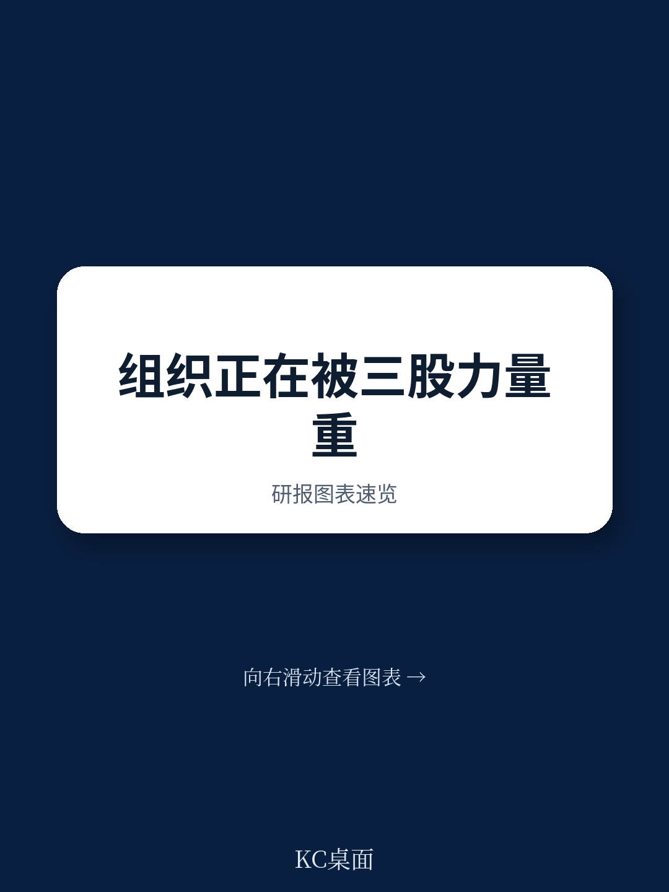
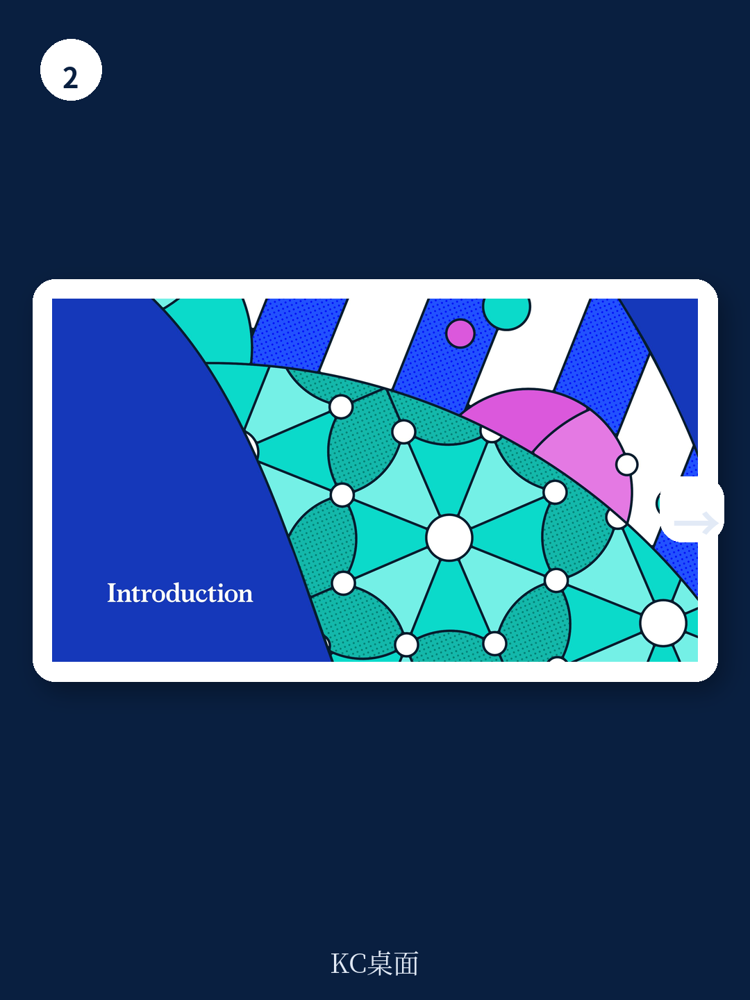

# 麦肯锡：88%的企业已在用AI，但81%没看到利润

当一家全球咨询巨头在2026年的旗舰报告中，用“双转型”来定义AI时代的组织变革时，它实际上在说一件事：过去三年企业围绕AI的所有碎片化努力，大概率已经走错了方向。

麦肯锡在2026年2月发布的《The State of Organizations 2026》中，基于对超过10,000名全球高管的调研，给出了一个既令人振奋又令人不安的判断。振奋在于，88%的组织已经在至少部分业务中部署AI；不安在于，81%的组织报告称没有看到任何有意义的利润改善。

这不是技术问题。这是组织问题。

这份报告的核心主张是：AI不是插上电源就能用的工具，它要求企业同时完成技术转型和组织转型。而大多数企业只做了前者，忽略了后者。这正是麦肯锡所说的“双转型”命题——企业需要重新想象工作如何完成，重新定义岗位和端到端流程，重新思考传统的组织结构。

> **KC评论：** 88% vs 81% 这个剪刀差是整份报告最值得关注的数字。它意味着AI普及率已经很高，但价值转化率极低。这不仅是技术落地的问题，更指向一个更深层的结构性矛盾：企业的组织形态还没有为AI做好准备。麦肯锡的报告试图回答的就是这个问题——什么变了，以及应该怎么变。

## 1. 86%的领导者承认组织对AI准备不足，但只有14%的企业有明确的AI战略

这份报告最反常识的发现之一，是AI采纳率的“虚假繁荣”。表面上，88%的组织在用AI，但深入数据后，麦肯锡发现只有14%的组织有领导者持续推动AI采纳和实验，并配有清晰的战略和行动。更令人担忧的是，每六家组织中就有一家没有明确的C级负责人来推动AI采纳。

这意味着什么？意味着大多数组织的AI部署是分散的、自下而上的、缺乏统一协调的。团队各自为政，采购不同的工具，解决局部问题，但没有人从全局角度思考AI如何重塑整个组织的运作方式。

麦肯锡的调查显示，AI采纳的三大障碍分别是：对AI本身的担忧（46%）、监管和伦理法律问题（44%）、以及包括变革管理在内的组织挑战（39%）。值得注意的是，组织挑战已经与技术和监管问题并列，成为核心瓶颈。

这种准备不足的代价正在显现。在那些已经开始尝试的企业中，大多数人的做法是“碎片化用例”——用AI增强个人贡献者的效率，而不是系统性地重新设计流程。更深入的AI代理嵌入现有流程的努力，要么仍在规划阶段，要么只是在试点项目中被测试。

> **KC评论：** 86%的领导者承认准备不足，但只有14%的企业有明确的AI战略。这个差距本身就是一份诊断报告。它说明大多数企业的AI焦虑还停留在“别人都在做，我也不能落下”的被动跟随阶段，而不是“AI如何从根本上改变我的竞争方式”的战略思考。完整报告中对“双转型”框架的展开，正是为了解决这个问题——它提供了一个系统性的诊断工具，帮助企业判断自己处在哪个阶段，以及下一步该做什么。

## 2. 每1美元技术投入需要匹配5美元人力投入，但大多数企业算错了账

麦肯锡报告中最具冲击力的数字之一，来自一位高管的经验法则：每在技术上花1美元，就应该在人力上花5美元。这个比例颠覆了大多数企业的预算逻辑。

报告指出，那些成功从AI中获取价值的企业，其投入结构完全不同。它们不是把AI当作IT项目来管理，而是将其视为组织变革的催化剂。这意味着在技术投资之外，需要大量投入在人员培训、流程重组、文化变革和领导力发展上。

麦肯锡的调查显示，只有55%的领导者认为成功构建员工的AI能力会带来指数级的生产力提升。这个比例本身就是一个警示——还有近一半的领导者没有充分认识到人力投资的重要性。

在“人类与AI代理：构建新的协作世界”这一章节中，报告详细描述了AI代理与人类员工需要如何协作。这不仅仅是技术部署问题，更是能力重新定义的问题。员工需要新的技能，领导者需要新的管理方式，组织需要新的协作模式。

报告提到，只有四分之一的领导者预期AI代理会在短期内作为自主队友与员工协作。这意味着大多数领导者对AI代理的定位仍然保守——工具而非伙伴。这种认知差距可能会成为价值捕获的最大障碍。

## 3. 72%的领导者认为组织过于复杂和低效，但传统的扁平化改革正在失效

在“从结构到流动：达到下一个生产力前沿”这一章节中，麦肯锡提出了一个尖锐的发现：三分之二的领导者认为自己的组织过于复杂和低效，但传统的补救措施——结构性重组、成本削减、层级扁平化——正在产生递减的回报。

这不是一个局部问题。当组织复杂度达到一定程度后，简单的结构优化已经无法带来生产力突破。麦肯锡认为，真正的出路在于从根本上简化和统一企业端到端的流程，消除重复、同步信息流、精简决策流程、并在可能的地方实现自动化。

这个判断与AI的部署密切相关。因为AI的真正价值不在于替代个别岗位，而在于重新设计整个工作流。如果组织不先解决流程的复杂性问题，AI只会加速混乱而不是创造价值。

报告还指出，领导者目前的优先指标已经从现金流改善、上市速度、员工满意度，转向了收入增长或稳定、成本削减和客户满意度。这说明企业正在从“生存模式”转向“增长模式”，但复杂的组织结构正在成为拖累。

> **KC评论：** “从结构到流动”这个概念是这份报告最值得反复咀嚼的框架之一。它暗示了一个根本性的转变：未来的竞争优势不取决于你设计了多少层级的组织结构，而取决于信息、决策和资源在组织中的流动速度。完整报告中对这个框架的展开，包括如何诊断组织复杂度、如何设计“流动型”运营模型，是目前公开信息中没有完全展开的部分。

## 4. 只有30%的企业能实现全企业范围的资源重新配置，这可能是AI价值捕获的最大瓶颈

麦肯锡报告中最令人惊讶的数字之一出现在“聚焦核心：以更高强度做正确的事”这一章节：只有30%的组织能够实现全企业范围的资源重新配置。

这个数字意味着什么？意味着大多数企业在面对AI带来的机遇时，无法快速将资金、人才和注意力从低价值领域转移到高价值领域。而AI的价值恰恰需要这种动态重新配置才能实现。

报告指出，价值创造取决于如何在企业范围内配置资产。领导者需要有创新的远见、优先排序的纪律和剥离的勇气。但现实中，大多数企业被历史惯性、组织政治和短期压力所困，无法做出果断的资源配置决策。

这与AI部署的困境直接相关。如果企业无法将人才和预算从传统业务中释放出来，投入到AI驱动的转型中，那么即便技术再先进，也无法产生实质性影响。这就是为什么81%的企业看不到AI利润改善的深层原因——不是技术不够好，而是组织的资源配置机制不允许技术发挥作用。

## 5. 报告尚未完全回答的关键问题：AI时代的组织变革如何落地

尽管麦肯锡的这份报告提供了丰富的洞察框架，但它也留下了一些尚未完全回答的关键问题。

第一个问题是：双转型的具体路径是什么？报告提出了“技术转型+组织转型”的框架，但没有给出足够详细的路线图。从当前状态到AI优先的运营模型，企业需要经历哪些阶段？每个阶段的关键里程碑是什么？不同行业、不同规模的企业是否有差异化的路径？

第二个问题是：如何衡量组织转型的进展？报告提供了大量调研数据，但缺乏具体的衡量指标和评估工具。企业如何判断自己的组织是否已经为AI做好准备？如何衡量流程简化、资源配置效率、人机协作水平等关键维度？

第三个问题是：领导力转型的具体内涵是什么？报告提到了“由内而外”的领导力，强调领导者需要关注个人成长。但在AI代理越来越多地承担管理和决策职能的背景下，人类领导者的独特价值到底是什么？这个问题的答案可能决定了未来组织的权力结构。

> **KC评论：** 这些未解问题不是报告的缺陷，而是它刻意留下的思考空间。麦肯锡的强项在于提出正确的问题和框架，而不是给出标准答案。对于决策者来说，真正的价值在于带着这些问题去阅读完整报告，结合自己的组织情境寻找答案。完整报告中对每个主题的深度展开、案例研究和数据支撑，是公开摘要无法替代的。

## 6. 决策者的观察框架：三个必须回答的战略问题

基于麦肯锡这份报告的洞察，决策者需要从三个维度审视自己的组织：

**第一，你的AI投资结构是否合理？** 检查一下技术投入与人力投入的比例。如果远远低于1:5，说明你很可能低估了组织变革的难度。重新审视预算分配，确保有足够的资源用于人员培训、流程重组和文化变革。

**第二，你的资源配置机制是否支持动态调整？** 只有30%的企业能做到全企业范围的资源重新配置。如果你的组织无法快速将人才和资金从低价值领域转移到高价值领域，那么AI带来的任何机会都会在组织惯性中流失。评估你的预算分配流程、人才流动机制和决策速度。

**第三，你的组织复杂度是否在拖累生产力？** 三分之二的领导者认为组织过于复杂和低效。如果你的组织也存在这个问题，传统的扁平化改革可能已经失效。需要考虑的是如何从根本上简化端到端流程，而不是继续在组织结构图上做文章。

这三个问题没有标准答案，但它们提供了一个思考框架。麦肯锡的完整报告提供了更详细的数据支撑、案例分析和工具方法，可以帮助决策者更有针对性地回答这些问题。

---

这份麦肯锡2026年的报告揭示了一个正在发生但尚未被充分认知的现实：AI的价值不在于技术本身，而在于组织如何重新设计自己来拥抱技术。88%的部署率与81%的无利润率之间的差距，正是组织转型滞后的代价。

对于那些希望在AI时代保持竞争力的企业来说，现在需要做的不是买更多的AI工具，而是重新思考组织本身。这意味着更激进的流程简化、更灵活的资源配置、更深入的领导力变革，以及最重要的——在技术投入和人力投入之间找到正确的平衡。

这些话题在完整报告中有更详细的展开，包括每个主题下的具体数据、案例研究和实施建议。如果你希望更系统地理解麦肯锡的“双转型”框架，或者想看到报告中的关键图表和原始数据，欢迎加入我们的社群。我们每天会通过AI agent和人工review的方式，生成国际投行和咨询公司的中文摘要与评论，每天更新10-40页，包含最新数据图表合集，既方便喂给AI，也方便人工快速把握市场动态。

Personal reading notes and learning share only. Not investment advice.

