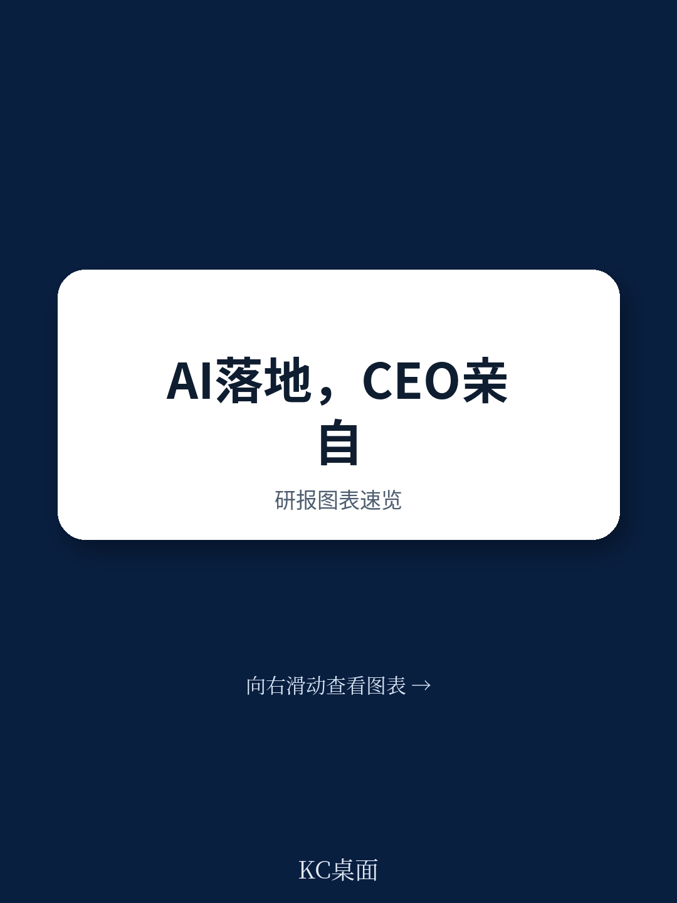
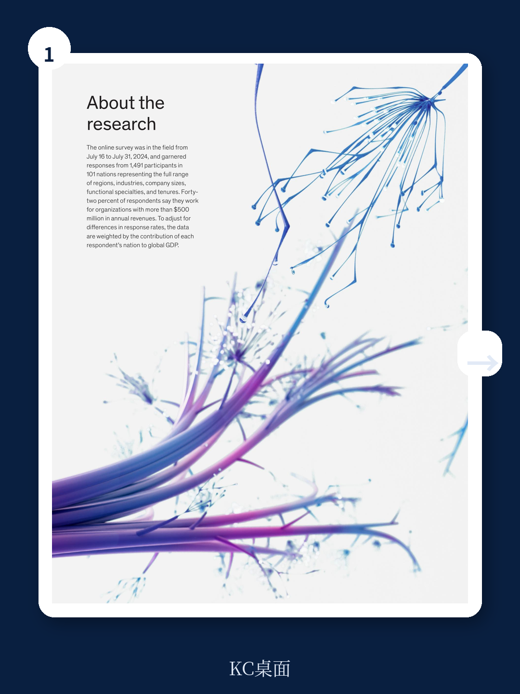
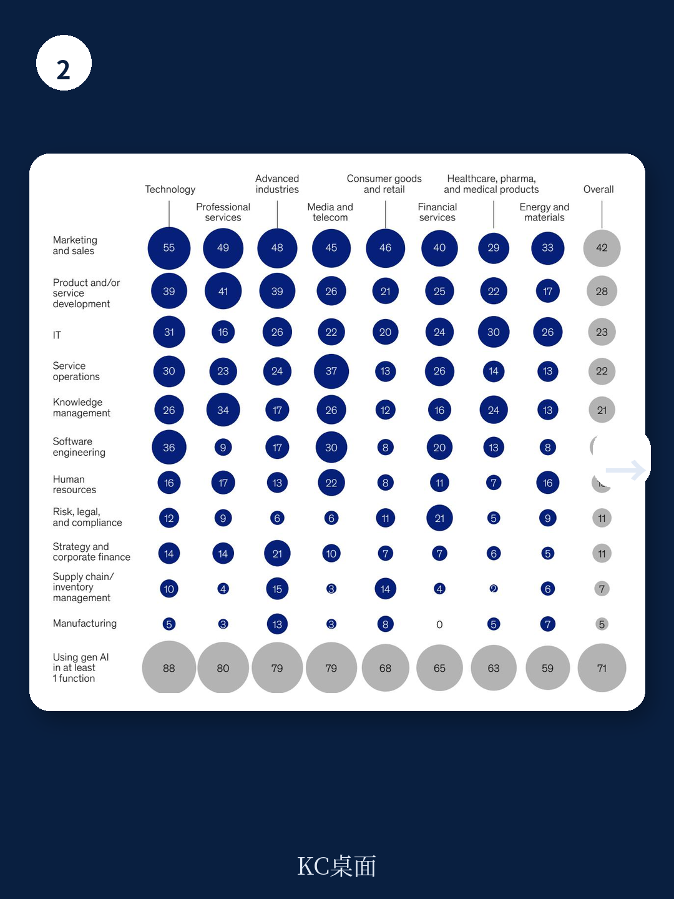

# 麦肯锡：AI投入的“回报临界点”还没到，但CEO亲自下场是信号

这份刚刚发布的麦肯锡全球AI调研报告，覆盖了1491位来自101个国家、全行业、全规模的企业受访者。如果你只记住一个结论，那应该是：**AI真正产生企业级利润影响的比例，至今仍低于20%**。但报告同时释放了一个清晰的信号——那些正在跨越“实验期”、开始看到财务回报的公司，并不是因为技术选对了，而是因为组织方式变了。

这份报告最值得看的判断，不是“AI使用率突破了77%”，而是“CEO亲自监管AI治理，被证明是与利润影响最相关的单一组织变量”。这意味着，AI的竞争已经从技术军备赛，进入到了“组织能力竞赛”阶段。

---

## 1. 真正的分水岭不是技术选型，而是工作流是否被重新设计

麦肯锡在本次调研中测试了25个与AI采用相关的组织属性，并逐一衡量它们与EBIT影响的相关性。结果排在第一位的，不是数据基础设施，不是模型精度，而是**工作流的重新设计**。

报告原文指出：“the redesign of workflows has the biggest effect on an organization's ability to see EBIT impact from its use of gen AI。” 但现实是，只有21%的受访者表示其组织已经从根本上重新设计了至少部分工作流。

这意味着什么？大多数企业仍然在用“旧流程跑新工具”。他们把生成式AI当作一个附加层，贴在原有的营销、客服或研发流程上，而没有去追问：“如果AI可以自动完成这个环节，整个流程应该长什么样？” 这恰恰解释了为什么那么多POC（概念验证）项目做了，但ROI迟迟出不来。

> **KC评论：** 工作流重设计是“组织级AI”与“工具级AI”的分界线。完整报告里有一张图，展示了那些已经重新设计工作流的企业在高利润区间的分布密度，数据非常直观——这可能是你判断自己企业所处阶段最值得参考的坐标。

---

## 2. 大公司正在用“集中+混合”的架构，构建AI护城河

报告揭示了一个重要的组织趋势：**AI部署的核心要素正在被选择性集中化**。风险合规和数据治理，倾向于完全集中到卓越中心（Center of Excellence）；而技术人才和AI解决方案的采用，则更多采用混合模式——部分集中，部分分散到业务单元。

这种“上紧下松”的结构，本质上是在平衡两件事：风险管控的统一性，与业务创新的灵活性。

尤其值得注意的是，年营收超过5亿美元的大型企业，在这一轮组织调整中明显走得更快。它们更倾向于设立专门的AI团队、制定清晰的规模化路线图、建立角色化的AI培训体系。而中小企业则更多依赖完全集中化——这或许反映了资源约束下的务实选择，但也可能意味着它们在未来AI竞争中的灵活性优势正在被侵蚀。

> **KC评论：** 大公司和小公司在AI组织架构上的差异，报告里有一张非常清晰的对比图。这张图值得所有企业决策者仔细看——它说明了为什么同样投入AI，有些公司能持续迭代，有些则卡在第一个POC出不来。

---

## 3. 报告尚未完全回答的关键问题：AI利润影响何时能突破20%

尽管报告给出了大量积极信号——AI使用率持续上升、更多业务单元报告收入增长和成本下降——但一个核心数据点无法回避：**超过80%的受访者表示，其组织尚未看到AI对企业级EBIT产生实质性影响**。

这是一个“房间里的大象”。报告将原因归结为“仍然处于早期阶段”，但我们需要追问：这个“早期”会持续多久？什么条件会触发“临界点”？

从报告的隐含逻辑看，触发条件可能包括三个：
- 工作流重设计从“个别试点”变成“系统推进”
- KPI跟踪从“少数企业”变成“行业标准”
- 风险治理从“被动应对”变成“主动嵌入”

但报告没有给出具体的时间线或阈值。这或许是麦肯锡的克制，但也意味着，读者需要结合自身行业的数据，去判断这个临界点何时到来。

> **KC评论：** 报告里有一张图展示了不同业务单元中，报告收入增长和成本下降的受访者占比变化。这张图非常关键——它告诉你AI的回报正在哪些领域最先兑现。但报告没有展开的是：这些先行者有哪些共同特征？完整报告里对领先企业的案例分析，可能藏着答案。

---

## 4. 风险管理的“版本升级”：从被动到主动，从单一到多维

与2024年初的调研相比，本次报告中最明显的变化之一，是企业对AI风险的主动管理意识显著提升。受访者表示，他们的组织正在更加积极地管理以下风险：不准确性、网络安全、知识产权侵权和隐私问题。

报告特别指出，大型企业在风险管理上走得更远——它们更可能管理网络安全和隐私风险，但在“可解释性”和“准确性”方面，与大企业和小企业的差距并不明显。这暗示了一个值得关注的现象：**风险管理的前沿，正在从技术合规转向治理透明度**。

一个数据点值得注意：27%的受访者表示，其组织会在使用前检查所有AI生成的内容；但同样有27%的人表示，只有20%或更少的内容被检查。这种两极分化，反映了行业在“信任与效率”之间的根本张力。

---

## 5. 给决策者的观察框架：三个问题判断你的AI进程

基于报告的发现，我们提炼出一个简单的自检框架，供企业决策者评估自己的AI采用阶段：

**第一问：你的CEO是否亲自参与AI治理？**  
报告证明，CEO的参与是与利润影响最相关的变量之一。如果你所在组织的AI治理仍然停留在CTO或CDO层面，这可能是一个需要升级的信号。

**第二问：你的工作流是否被重新设计，而不仅仅是“加了一层AI”？**  
如果AI只是被嵌入现有流程而没有改变流程本身，那么你大概率还处于“实验期”，而不是“价值创造期”。

**第三问：你是否建立了可量化的KPI来跟踪AI采用？**  
报告发现，跟踪良好的KPI是影响EBIT的最强单一实践。但只有不到五分之一的受访者表示其组织做到了这一点。

> **KC评论：** 这三个问题，每一个背后都有完整的调研数据支撑。完整报告里还有一张“12项最佳实践”的实施率对比图，可以帮你精确对标自己的组织处在哪个位置。

---

## 6. 下一个前沿：当“组织级AI”遇到“代理式AI”

报告在最后提到了一个重要的前瞻性判断：随着技术持续演进，“代理式AI”（agentic AI）被视为AI创新的下一个前沿。这意味着，AI将从“工具”进化为“代理”，能够自主执行多步骤任务。

这个趋势对组织能力提出了更高的要求。如果当前的工作流重设计已经让大多数企业感到吃力，那么当AI开始自主决策和执行时，企业的治理结构、风险框架和人才战略，都需要再次升级。

报告没有展开这个判断，但它为所有读者留下了一个值得持续关注的命题：**当AI从“回答问题”进化到“完成任务”，你的组织准备好了吗？**

---

以上分析基于麦肯锡2025年3月发布的《The state of AI: How organizations are rewiring to capture value》报告。完整报告包含更多细分数据——包括不同行业、不同规模企业的AI采用率对比、12项最佳实践的详细实施率、以及各业务单元的收入和成本影响分布图。

这些原始图表和细分数据，对于判断自己所在行业的AI成熟度、制定差异化策略，具有直接参考价值。我们的AI agent每天会从国际投行和咨询机构的最新报告中，自动提取关键洞察并生成中文摘要，配合人工review，确保信息准确且具备判断力。每天的更新内容大约在10-40页，既方便直接喂给AI工具做二次分析，也方便人工快速把握全球市场的动态。

如果你希望获取完整报告解读与原始图表，欢迎加入社群，与我们一同跟踪AI竞争的真实脉搏。

Personal reading notes and learning share only. Not investment advice.

