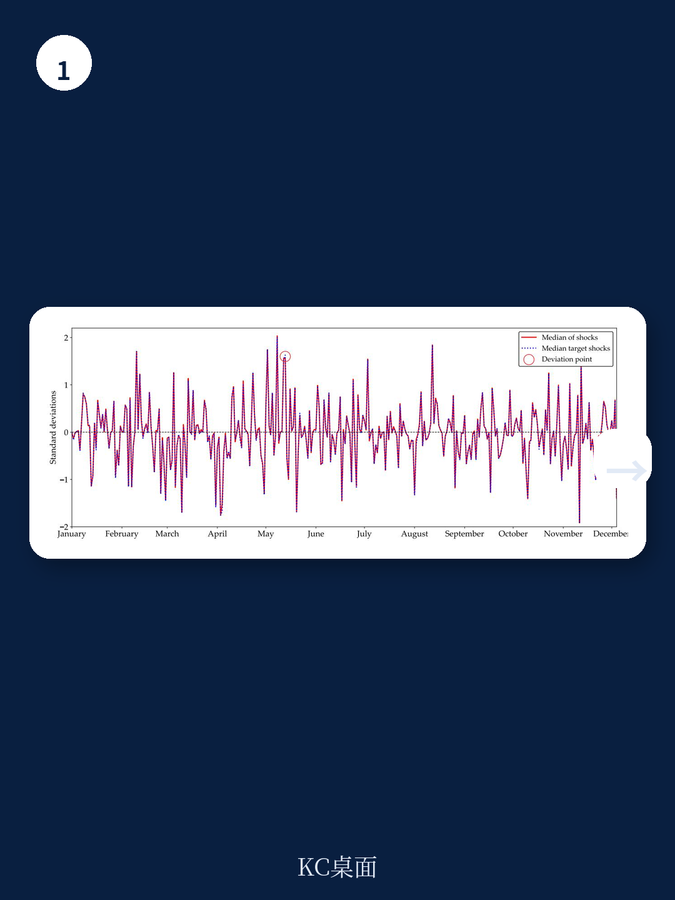
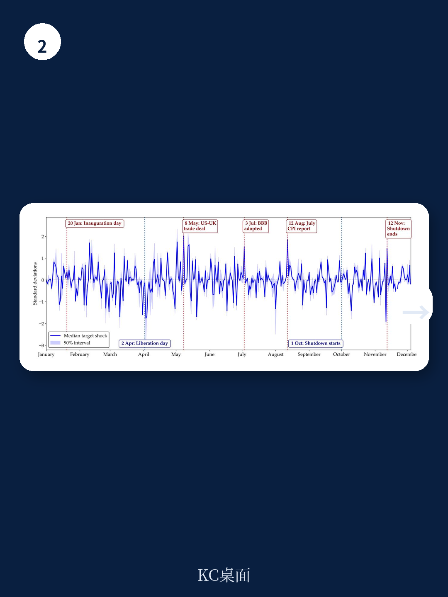

# 国际清算银行：财政风险冲击正在制造“滞胀陷阱”，而央行宽松只会让情况更糟

当市场开始重新评估政府债务的安全性，后果并不仅仅是主权债券收益率上行。国际清算银行（BIS）最新工作论文揭示了一个更令人不安的传导链条：财政风险冲击会同时推高通胀和压低产出，形成典型的“滞胀”格局。更关键的是，如果央行选择用宽松货币政策来对冲，结果不是缓解，而是让通胀更高、衰退更深。

这份由BIS经济学家Denis Gorea、Ding Xuan Ng和Fabrizio Zampolli完成的第1364号工作论文，构建了一套全新的识别框架，从债券市场数据中分离出纯粹的“财政风险冲击”，并追踪其对12个经济体宏观金融变量的影响。结论清晰且具有政策警示意义：财政纪律的丧失，其代价远不止于更高的融资成本。

## 1. 这不是普通的利率波动，而是市场在重新定义“安全资产”的边界

传统上，主权债券被视为无风险资产的基准。但当财政可持续性受到质疑时，这一基准本身开始动摇。BIS论文的核心识别策略恰恰抓住了这一点：当财政风险上升时，投资者会从主权债券转向同等期限的最高等级公司债券。这种“组合再平衡”行为，使得主权债券收益率上升的同时，安全公司债券收益率下降——两者走势背离，正是财政风险冲击的独特指纹。

这一识别的精妙之处在于，它排除了货币政策、通胀预期或全球风险偏好等共同因素。如果主权债券收益率上升是因为央行加息，那么公司债券收益率也会同步上升；如果是因为通胀预期上升，两者同样会一起走高。只有在财政风险这个特定维度上，才会出现主权债券被“降级”、安全公司债券被“升级”的分化格局。

> **KC评论：** 这意味着，投资者不再把本国国债当作终极安全资产。当市场开始用“公司债思维”来定价主权信用时，政府面临的融资约束将发生质变——不再是利率多高的问题，而是能否获得融资的问题。这对高债务国家是一个明确的预警信号。

## 2. 财政风险冲击的滞胀效应：短期脉冲、长期代价

BIS的实证结果描绘了一幅清晰的滞胀图景。财政风险冲击发生后，通胀和通胀预期立即上升，工业产出在短期内短暂增加，但随后进入持续性下滑。主权收益率曲线陡峭化，汇率贬值，股票价格下跌。

这一传导链条的逻辑是：财政风险冲击往往伴随财政扩张，短期内确实能刺激需求、推高通胀。但问题在于，主权债券收益率曲线整体上移（不只是短端），意味着整个经济体的融资成本都在上升。企业借贷成本增加、投资意愿下降，而汇率贬值又进一步加剧输入性通胀。结果是，通胀压力持续的时间远长于产出增长的时间——约六个季度后，更高的收益率和借贷成本导致实际活动持续放缓，股票估值下降。

论文特别指出，这种效应在财政风险冲击为“正向”（即财政状况意外恶化）时，比“负向”（财政状况改善）时更强且更持久。这意味着，财政扩张带来的通胀效应具有不对称性：恶化时通胀上升的幅度，远大于改善时通胀下降的幅度。这为“财政扩张易放难收”提供了新的量化证据。

## 3. 宽松货币政策的“帮倒忙”：短期镇痛，长期加重病情

论文最具有政策冲击力的发现，在于货币政策态度的调节作用。当央行在财政风险冲击后维持宽松立场（定义为政策利率调整幅度低于泰勒规则隐含的应有水平）时，滞胀效应被显著放大。

具体机制是：宽松货币政策在短期内确实能部分对冲借贷成本上升，但代价是实际利率持续为负。负实际利率进一步助长了通胀预期，同时未能阻止收益率曲线长端的上行——因为市场开始担心，宽松的货币环境会鼓励政府更无节制地扩张财政。约一年后，所有期限的收益率都显著上升，金融条件反而比不放松时更加收紧。

> **KC评论：** 这给当前全球央行出了一道难题。当财政风险上升时，如果央行选择加息抗通胀，可能加剧经济下行；如果选择维持宽松，则可能陷入“财政主导”的陷阱，让通胀预期脱锚。BIS的结论指向一个反直觉的方向：在财政风险冲击面前，央行越“配合”，结果越糟糕。

## 4. 初始条件决定冲击烈度：主权风险溢价已是“放大器”

论文还发现，财政风险冲击的效应高度依赖于初始条件。在主权CDS利差已经较高的国家（即初始主权风险溢价已经处于高位），同样的冲击会带来更大的通胀上行、更持久的通胀预期上升，以及更显著的股票估值下降和期限利差收窄。

这意味着，财政空间有限的国家更容易陷入“财政风险冲击—融资成本上升—经济恶化—财政进一步恶化”的负反馈循环。而期限利差收窄（长端利率相对短端下降）是一个特别值得关注的信号——它可能意味着市场开始定价长期增长前景的恶化，而非短期通胀压力。

> **KC评论：** 初始主权风险溢价越高，财政风险冲击的破坏力越大。这类似于金融领域的“脆弱性叠加”：在低风险状态下，冲击可能被吸收；但在高风险状态下，同样的冲击可能触发系统性重定价。这对新兴市场国家尤其具有警示意义。

## 5. 报告尚未完全回答的关键问题：结构性变量的传导机制

尽管BIS论文在识别和量化方面做出了重要贡献，但仍有几个关键问题留待进一步研究。

第一，财政风险冲击的“结构性来源”尚未被充分拆解。不同来源的财政风险（例如，是源于支出扩张、税收削减，还是隐性担保的显性化）可能产生截然不同的宏观效应。论文的识别框架虽然干净，但无法区分财政风险冲击的“成分”。

第二，公司债券的传导渠道仍是一个“黑箱”。论文假设投资者从主权债券转向安全公司债券，但公司债券市场本身的结构性特征（如流动性分层、信用评级迁移、投资者结构）如何影响这一传导，尚未被充分探讨。

第三，论文覆盖的12个经济体主要是发达经济体，新兴市场国家的财政风险传导机制可能完全不同——主权评级本身较低、公司债券市场深度不足、资本流动的脆弱性更高，这些因素都可能改变冲击的传导路径。

第四，货币政策与财政政策的“博弈均衡”是一个动态过程。论文将货币政策态度简化为一组二元指标，但现实中，央行与财政当局的策略互动更为复杂——前瞻指引、量化宽松、收益率曲线控制等非常规工具都可能改变市场预期。

## 6. 投资者的观察框架：三个需要持续跟踪的指标

基于BIS论文的发现，我们可以构建一个用于实时监测财政风险冲击的观察框架：

第一，跟踪主权债券与安全公司债券收益率之差的方向性变化。当两者出现背离（主权升、公司降）时，需要警惕财政风险正在被市场重新定价。

第二，关注实际利率的持续负值状态。论文表明，当实际利率在财政风险冲击后持续为负超过6个月，滞胀效应将显著放大。这是判断货币政策是否“过度配合”的关键信号。

第三，观察主权CDS利差的绝对水平和变化速度。初始CDS利差越高，同样的冲击带来的破坏力越大。对于CDS利差已经处于高位的国家，任何额外的财政风险冲击都可能是“压垮骆驼的最后一根稻草”。

---

BIS这篇论文的结论，在当前全球债务高企、主要经济体财政空间收窄的背景下，具有明确的政策含义和投资启示。它揭示了财政纪律不仅关乎政府自身的融资成本，更通过金融市场的传导，深刻影响通胀、增长和资产定价。但正如论文本身所承认的，从识别到机制、从总量到结构，仍有大量问题需要更细致的拆解。

完整报告中包含了论文的详细实证结果、图表数据、以及BIS作者对财政-货币互动机制的深度讨论。这些内容超出了本文的篇幅限制，但对理解当前宏观环境下的资产定价逻辑至关重要。

欢迎加入我们的社群。每天，我们的AI agent会结合人工review，从BIS、高盛、摩根士丹利、摩根大通、瑞银、花旗、美联储等国际机构的最新研报中，提取中文摘要与KC评论，生成约10-40页的日度更新。内容既适合直接喂给AI助手进行进一步分析，也方便人工快速把握全球市场的核心动态。社群内还可获取本文完整研报的原始图表与BIS论文全文。

Personal reading notes and learning share only. Not investment advice.

