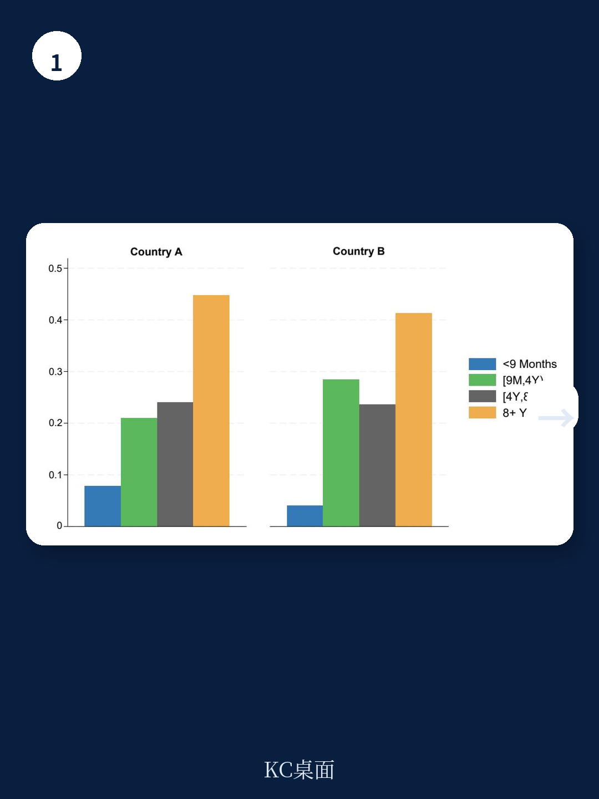
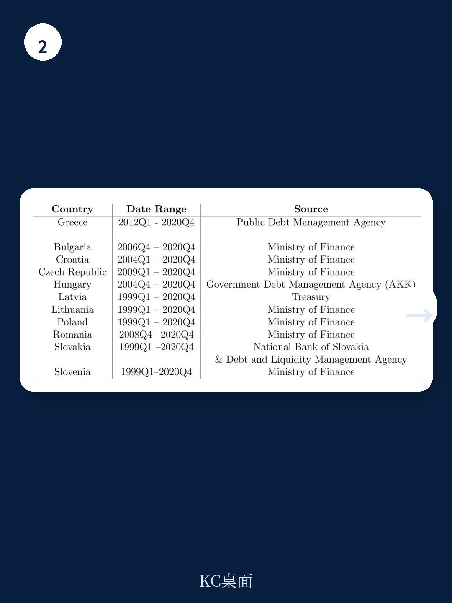

# 国际清算银行：高债务正在悄悄削弱加息的通胀抑制力

市场主流叙事一直把通胀能否回落押注在央行加息力度上。但一份来自国际清算银行的最新工作论文给出了一个令人不安的答案：加息对通胀的抑制作用，可能被一个被长期忽略的结构性变量悄悄削弱——公共债务的规模和期限结构。

这份编号1365的工作论文，基于2001至2020年欧元区高频货币政策冲击数据，使用面板局部投影方法，得出了一个对全球投资者和政策制定者都极具冲击力的核心判断：高债务经济体面对加息时，价格和通胀预期的反应显著弱于低债务经济体，而产出收缩幅度却至少持平。换句话说，同样的加息幅度，在高债务国家，通胀更难压下去，但经济代价并不更小。

这不是一个学术象牙塔里的清谈。对于正在评估欧洲资产定价、全球利率路径和主权信用风险的决策者而言，这份报告提供了一个必须纳入分析框架的变量——债务期限结构如何改变了货币政策的传导效率。

---

## 1. 加息对通胀的“刹车”效果，在高债务国家明显失灵

报告的核心实证发现可以用一句话概括：当公共债务占GDP比例从60%上升到120%时，同样幅度的加息，价格水平的下降幅度显著缩小，通胀预期的锚定能力也明显减弱。

这一结果在统计上是显著的。报告作者使用了一个巧妙的识别策略：在保持债务期限结构不变的前提下，仅改变债务总量水平，来分离“债务规模”和“债务期限”两个变量的独立影响。结果显示，高债务经济体面对加息时，价格反应更弱，而产出收缩幅度至少与低债务经济体相当。

这意味着什么？传统教科书模型假设货币政策通过利率渠道影响总需求，进而传导至价格。但高债务环境下，这个链条被扭曲了。加息不仅抑制私人部门需求，还会通过影响政府资产负债表、债券持有人收入和财政风险溢价，产生一系列反向作用力。

> **KC评论：** 简单理解就是，在高债务国家，央行加息就像在泥潭里踩油门——车轮在转，但车子没怎么动。通胀压不住，但经济的痛苦一点不少。这份报告用2001-2020年欧元区数据验证了这一机制，但更值得关注的是，它提供了一个分析框架：你可以用这个框架去评估当前美国、日本、意大利等国的货币政策有效性。

---

## 2. 债务期限结构才是真正的“隐藏调节阀”

如果债务总量只是第一层变量，那么债务期限结构就是第二层更精密的调节阀。报告将政府债务按剩余期限分为四个桶：9个月以内、9个月至4年、4至8年、8年以上。结果发现，不同期限的债务对货币政策传导的影响呈现出高度非线性特征。

最关键的发现是：处于中间期限（4至8年）的债务，与最弱的产出和价格响应相关；而极短期（9个月以内）和极长期（8年以上）的债务，则与最强的响应相关。

这一非线性结果背后是三种机制的博弈。极短期债务使财政成本和债券持有人收入对利率变化高度敏感，强化了“利息收入效应”；极长期债务使债券价格对收益率变化更敏感，强化了“估值效应”；而中间期限的债务，可能使这两种效应部分相互抵消，从而削弱了货币政策的整体传导效率。

这一发现对资产定价有直接含义。如果某个主权国家的债务期限结构集中在中间区间，那么该国央行的加息对通胀的抑制作用可能比预期更弱，但经济衰退的风险未必更低。投资者在定价主权信用风险和汇率时，需要把这个维度纳入考量。

> **KC评论：** 报告没有完全展开的一个问题是，不同期限债务的持有人结构差异如何影响这些机制。比如，如果中间期限债务主要由国内银行持有，而极长期债务主要由养老金和保险公司持有，那么估值效应和收入效应的传导路径会完全不同。这部分分析在完整报告中值得仔细阅读，它可能改变你对特定国家风险敞口的判断。

---

## 3. 财政不背锅：加息后财政状况反而恶化，加剧了政策困境

报告对“财政支持”的检验是另一个值得关注的发现。如果加息后政府能够同步收紧财政（即提供“财政支持”），那么债务对货币政策传导的干扰可能被抵消。但实证结果恰恰相反：加息后，政府的基本财政余额反而恶化，债务占GDP比例上升。

这意味着，在高债务环境下，央行加息不仅没有获得财政的配合，反而被财政的被动恶化进一步放大了政策困境。报告将其称为“缺乏同期财政支持”。这一发现与Sims（2011）提出的“踩耙子”逻辑高度一致：加息可能通过恶化财政前景，反而削弱了货币政策的反通胀效力。

对于欧元区而言，这一发现尤其具有政策含义。欧元区各国共享统一货币政策，但财政政策由各国自主决定。这意味着，同样幅度的加息，在债务结构不同的成员国中，实际效果可能天差地别。投资者需要重新审视“欧元区同质化”的假设。

---

## 4. 溢出效应：欧洲非欧元区国家也难逃“债务期限陷阱”

报告的一个创新贡献是，构建了10个中欧和东欧国家中央政府债务期限结构的新数据集，并首次检验了欧元区货币政策对这些国家的溢出效应如何受到接收国债务期限结构的影响。

结果显示，溢出效应不是均匀的。当接收国债务中4至8年期限的占比更高时，欧元区加息对其产出和价格的收缩效应更强。这验证了估值效应在国际传导中的重要性：欧元区加息导致接收国长期债券价格下跌，通过估值损失渠道进一步收紧金融条件。

这一发现对全球投资者有直接意义。如果你在评估一个非欧元区欧洲国家的资产风险，不仅要看该国自身央行的政策，还要看其公共债务的期限结构——因为它决定了欧元区政策冲击的放大倍数。

> **KC评论：** 报告构建的这个新数据集本身就是一个有价值的资产。它覆盖了保加利亚、克罗地亚、捷克、匈牙利、波兰等10国，时间跨度从1999年到2020年。对于研究新兴欧洲市场的投资者来说，这个数据集可能比很多公开数据更精细。完整报告附录中有详细的数据来源和构建方法，值得研究者直接使用。

---

## 5. 报告尚未完全回答的三个关键问题

尽管这份报告在实证设计上非常严谨，但它也留下了几个值得追问的问题，这些恰恰是读者在阅读完整报告时需要特别关注的。

第一，样本期截止于2020年，没有覆盖2021-2023年的高通胀和激进加息周期。这段时间的债务水平更高、加息幅度更大，理论上债务对货币政策传导的扭曲效应应该更加显著。但报告没有验证这一点。

第二，报告聚焦于欧元区，其结论能否推广到美国、日本等非欧元区发达经济体？欧元区特有的制度安排（如单一货币政策+分散财政）可能放大了某些机制。美国尽管也有高债务，但美元的国际储备货币地位和美联储的独立性可能改变了传导路径。

第三，报告识别了三种机制（财政风险重定价、估值效应、利息收入效应），但没有精确分解每种机制的相对贡献。对于政策制定者而言，知道“哪个机制在什么条件下占主导”才是制定应对策略的前提。

---

## 6. 一个可操作的观察框架

基于这份报告的发现，投资者和分析师可以建立一个简化的观察框架来评估不同经济体的货币政策有效性：

第一步，看债务总量。债务占GDP比例超过100%的经济体，其货币政策传导效率可能已经出现显著扭曲。

第二步，看债务期限结构。如果中间期限（4-8年）债务占比过高，通胀对加息的敏感度可能低于预期。如果极短期或极长期债务占比过高，则产出对加息的敏感度可能更高。

第三步，看财政反应函数。如果加息后财政状况趋于恶化（如基本赤字扩大），则货币政策的有效性将进一步被削弱。

第四步，对于新兴市场，还要看其债务期限结构是否放大了核心经济体的货币政策溢出效应。

这个框架当然不是万能的，但它为读者提供了一个从“看利率水平”升级到“看债务结构”的思维工具。

---

这份国际清算银行的工作论文触及了一个正在被越来越多研究者关注的领域：财政-货币交互如何改变了传统货币政策框架的有效性。它没有给出简单的政策处方，但它提供了一套分析工具和实证证据，让读者可以更精准地判断不同环境下货币政策的真实效力。

报告中还有更多关于希腊债务数据的构建方法、CEE国家债务期限结构的详细图表、以及不同子样本下的稳健性检验结果，这些内容因为篇幅限制没有完全展开。对于希望深入理解这一议题的读者，阅读完整报告和原始数据图表是不可替代的步骤。

我们每天会由AI Agent加人工审核，生成国际投行与央行的中文摘要与KC评论，同步更新当天最新数据图表合集，约10至40页，既方便喂给AI模型，也方便人工快速把握市场动态。如果你希望持续跟踪这类高价值的机构研究，欢迎加入社群，获取完整研报解读与原始图表。

Personal reading notes and learning share only. Not investment advice.

