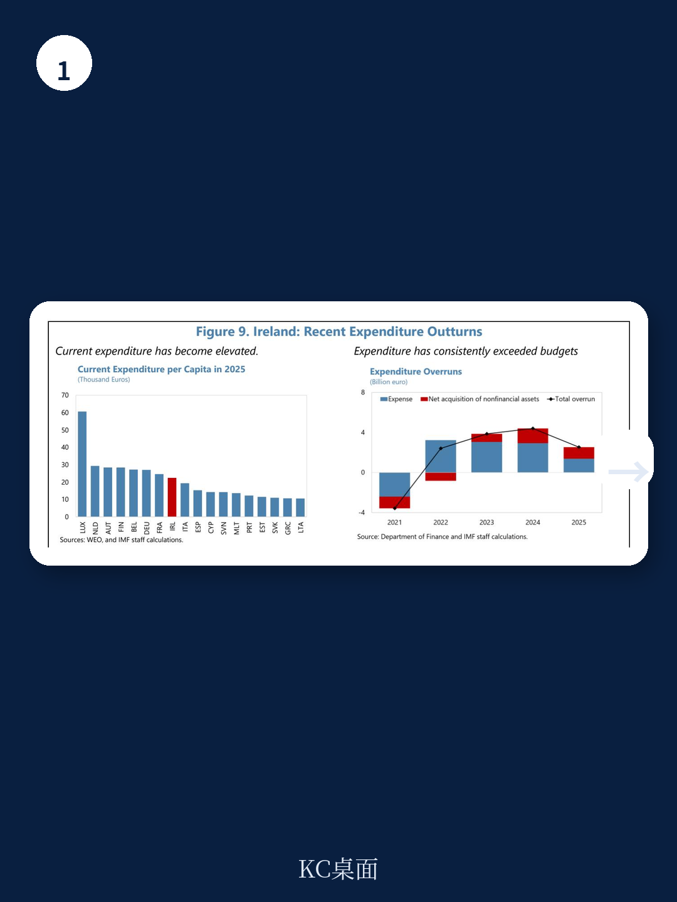
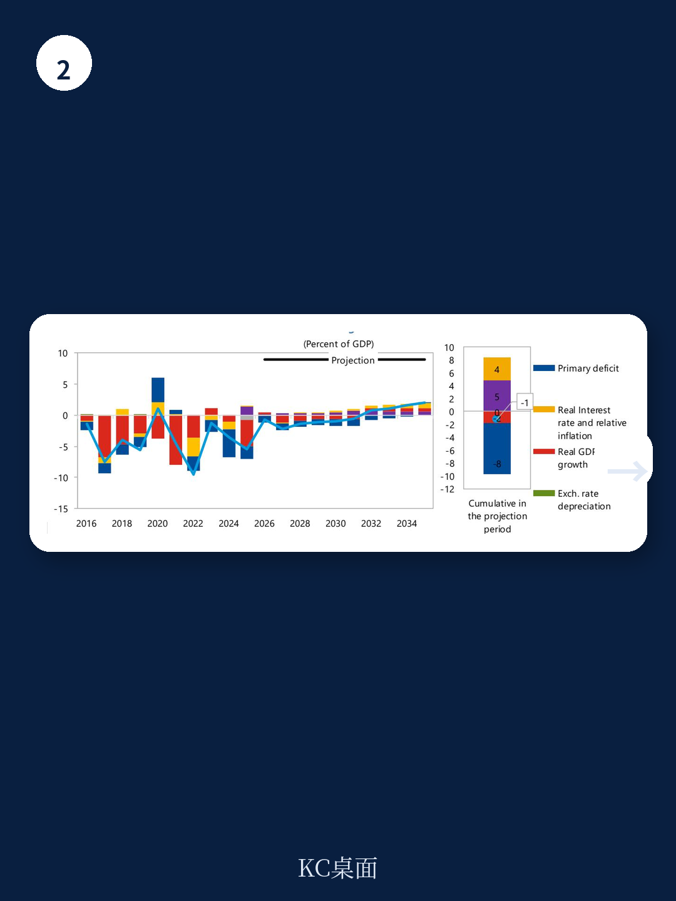

# IMF对爱尔兰发出罕见警告：繁荣背后，跨国公司依赖正成为最大风险

爱尔兰经济正站在一个罕见的十字路口。一方面，2025年国内经济增速约4%，财政持续盈余，就业市场虽有所降温但仍处于历史较好水平。另一方面，国际货币基金组织在2026年6月发布的最新国别磋商报告中，用了一个不常见的措辞——“不能将韧性视为理所当然”。

这份报告的核心判断值得每一个关注全球产业链和发达国家财政可持续性的读者认真对待：爱尔兰当前的强劲表现，很大程度上建立在跨国公司税收和投资的集中度之上，而这一模式在日益碎片化的全球环境中正变得脆弱。更关键的是，IMF认为爱尔兰需要利用当前“窗口期”进行结构性改革，否则繁荣可能难以持续。

---

## 1. 跨国公司依赖既是增长引擎，也是结构性脆弱的核心来源

爱尔兰的经济表现与跨国公司深度绑定。2025年，由跨国公司主导的出口表现强劲，企业所得税收入持续支撑财政盈余。但IMF明确指出，这种依赖是“脆弱性的关键来源”。

报告的论证逻辑很清晰：地缘经济碎片化加剧、供应链重组、贸易和资本流动的重新配置，都会对爱尔兰这种高度全球化的经济体产生不对称冲击。跨国公司并非不忠诚，但它们作为全球性实体，会根据税收、监管和地缘风险的变化调整布局。一旦全球税收协调或地缘格局发生重大变化，爱尔兰的财政收入和经济增长可能面临双重压力。

> **KC评论：** 这里的关键不是跨国公司会不会离开，而是“依赖”本身就是一种无法对冲的风险。投资者需要关注的是，爱尔兰财政盈余中来自跨国公司企业所得税的部分是否可持续。报告中的财政数据表显示，2025年一般政府盈余占GNI*的比例为3.3%，但结构性赤字已经达到-1.8%，这意味着剔除周期性因素后，财政基础并不像表面那么健康。

---

## 2. 通胀正在反弹，央行面临“增长放缓+通胀上行”的夹击

报告中最值得警惕的数据之一是通胀预测。2025年爱尔兰HICP通胀约为2.1%，看似温和，但IMF预计2026年将跳升至3.5%，核心通胀也将从2.2%升至2.5%。通胀上行的主要推手是能源价格，而中东局势的持续紧张让这一判断具有高度不确定性。

与此同时，经济增长正在放缓。2026年实际GDP预计将收缩0.8%，虽然这很大程度上受到跨国公司会计调整的影响，但更反映经济实质的修正国内需求增速也将从2025年的4.9%降至2.5%。私人消费因就业和实际收入增长放缓而走弱，出口增速预计从9.7%骤降至0.7%。

这种“增长放缓但通胀上行”的组合，对政策制定者而言是最棘手的情景。IMF的建议是：财政政策应保持大致中性，避免注入不必要的需求刺激；如果下行风险兑现，自动稳定器应充分运作，但任何相机抉择的财政支持都应是临时、定向且保留价格信号的。

> **KC评论：** 这实际上是在说：不要因为增长放缓就急于降息或扩张财政，因为通胀压力并未消失。对资产定价而言，这意味着爱尔兰国债收益率可能面临上行压力，而房地产和消费类股票需要重新评估盈利预期。完整报告中的通胀分项拆解和情景分析值得细读。

---

## 3. 真正的挑战不是短期波动，而是三个长期结构性缺口

IMF报告中最有深度的部分，是对爱尔兰长期结构性问题的诊断。报告明确提出三个核心缺口：住房与基础设施缺口、老龄化与绿色转型带来的长期支出压力、以及人工智能快速发展带来的机遇与风险。

住房问题尤其紧迫。爱尔兰的新住房目标要求进一步简化复杂的规划和司法审查流程，提高城市密度，提升建筑生产率，并撬动私人资本。这不是一个简单的供给问题，而是涉及土地制度、审批效率、建筑行业生产力等多维度的系统性挑战。

老龄化方面，爱尔兰的公共养老金和医疗支出压力将在未来十年快速上升。而绿色转型所需的电网升级和可再生能源投资，同样需要大量公共和私人资本。

> **KC评论：** 这三个缺口有一个共同特征：它们都需要“现在投入、未来受益”，但当前的政治周期往往倾向于短期支出而非长期投资。报告没有明说，但隐含的判断是：如果爱尔兰不在当前财政盈余的窗口期解决这些问题，当跨国公司税收红利消退或全球经济周期转向时，调整空间将非常有限。完整报告中对每个缺口的量化分析和国际比较，是理解这一判断的关键。

---

## 4. 财政框架缺乏锚点，结构性赤字才是真正的隐忧

报告的财政分析部分，有一个容易被忽视但极其重要的判断：爱尔兰目前缺乏有效的财政锚点。IMF建议，中期财政结构计划应作为年度预算的指导，并成为中期支出上限的约束机制。

从数据看，2025年一般政府总体盈余1.8%，但结构性赤字已达-1.2%，且预计在2026年扩大至-1.8%。这意味着，如果剔除跨国公司超额税收和周期性因素，爱尔兰的财政基础实际上是赤字状态。一旦跨国公司税收回归正常水平，财政状况可能迅速恶化。

IMF的建议是拓宽税基，增加个人所得税、增值税和地方财产税的收入占比，以降低对企业所得税的过度依赖。同时，将超额企业所得税收入更多地注入两个储蓄基金，为未来冲击和长期支出需求建立缓冲。

> **KC评论：** 这实际上是全球范围内一个更广泛的议题：当财政盈余高度依赖少数几个不可持续的税源时，表面上的“稳健”可能是虚假的安全感。完整报告中关于税收弹性和财政可持续性的压力测试，对理解这一风险的量级至关重要。

---

## 5. 非银行金融体系的风险正在积累，但监管框架尚未跟上

爱尔兰不仅是跨国公司的欧洲枢纽，也是全球资产管理的重要中心。IMF指出，系统性风险已经上升，尤其是在非银行金融部门。报告特别提到，爱尔兰庞大且复杂的非银行部门中，部分领域存在的杠杆和流动性错配问题，可能放大并传导不利冲击。

中央银行的应对方向是：继续开发非银行部门的宏观审慎框架，监测爱尔兰房地产基金和英镑计价负债驱动型投资基金的宏观审慎措施实施情况，并与其他监管机构合作改进数据质量和风险评估能力。

但报告也暗示，当前的监管框架仍落后于风险积累的速度。非银行金融的跨境性和复杂性，使得单一国家的监管努力难以完全覆盖风险。

> **KC评论：** 对全球投资者而言，这不仅是爱尔兰的问题。爱尔兰的非银行金融体系与全球资本市场高度互联，其风险传导路径可能影响更广泛的资产定价。完整报告中对非银行部门杠杆率、流动性错配和压力测试结果的详细分析，是评估这一风险的基础。

---

## 报告没有完全回答的关键问题：跨国公司税收红利能持续多久？

IMF的报告提供了一个全面的诊断框架，但有一个问题它没有完全回答：跨国公司企业所得税的“超额”部分，究竟有多大比例是可持续的？

报告承认，爱尔兰的企业所得税收入高度集中，且与跨国公司的会计安排密切相关。但报告没有量化地分析，在全球最低企业税率实施和地缘格局变化的背景下，这些税收红利的中期可持续性如何。这是一个关键的“已知未知”。

此外，报告对人工智能风险的讨论相对笼统。AI对爱尔兰这样一个以跨国公司和金融服务为支柱的经济体，可能带来就业结构、税收基础和竞争力格局的深层变化，但报告没有给出具体的传导路径分析。

---

这些问题正是我们希望与社群读者进一步探讨的方向。完整报告包含了爱尔兰经济的中期预测表、财政可持续性压力测试、非银行部门风险敞口数据以及国际比较分析，这些图表和假设是理解上述判断的基础。

我们的社群每天会由AI agent加人工review生成国际投行和IMF等机构的中文摘要与KC评论，每日更新，约10-40页，同时附上当天最新数据图表合集。既方便直接喂给AI进行二次分析，也方便人工快速把握全球市场动态。

如果你希望获取这份IMF报告的完整解读和原始图表，或者希望每天收到类似的分析，欢迎加入我们的社群。

---

Personal reading notes and learning share only. Not investment advice.

