## IRELAND

## SELECTED ISSUES

June 2026

This paper on Ireland was prepared by a staff team of the International Monetary Fund as background documentation for the periodic consultation with the member country. It is based on the information available at the time it was completed on June 10, 2026.

Copies of this report are available to the public from

International Monetary Fund • Publication Services
PO Box 92780 • Washington, D.C. 20090
Telephone: (202) 623-7430 • Fax: (202) 623-7201
E-mail: publications@imf.org Web: http://www.imf.org

International Monetary Fund
Washington, D.C.

## IRELAND

SELECTED ISSUES

June 10, 2026

Approved By

Prepared by Mohammad Khabbazan (ICD)

European Department

## CONTENTS

ESTIMATING THE IMPACTS OF AI, TRADE POLICY, AND THE ENERGY TRANSITION: AN APPLICATION TO IRELAND 3
A. Introduction 3
B. Model Framework and Scenario Design 4
C. Tariff and Trade Agreements: Re-Shaping Global Trade 7
D. Artificial Intelligence and Productivity Gains 10
E. Carbon Pricing Policy and Trade-Offs 15
F. Concluding Remarks 20

## FIGURES

1. Real GDP and Price Index Impacts in Tariff and Trade Agreements Scenarios 7
2. Real Export and Export Price Impacts in Tariff and Trade Agreements Scenarios 8
3. Selected Sectoral Real Output and Real Export Impacts in Tariff and Trade Agreements Scenarios 10
4. Selected Sectoral Labor Movement in Tariff and Trade Agreements Scenarios 10
5. Real GDP and Price Index Impacts in AI-Driven Productivity Gains Scenarios 11
6. Real Export and Export Price Impacts in AI-Driven Productivity Gains Scenarios 12
7. Selected Sectoral Real Output and Real Export Impacts in AI-Driven Productivity Gains Scenarios 13
8. Renewable Share in Electricity Productions and CO2 Emission in AI-Driven Productivity Gains Scenarios 14
9. Selected Sectoral Labor Movement in AI-Driven Productivity Gains Scenarios 15
10. Real GDP and Price Index Impacts in Carbon Pricing Policy Scenarios 16
11. Renewable Share in Electricity Productions and Carbon Price in Carbon Pricing Policy Scenarios 17
12. Real Export and Export Price Impacts in Carbon Pricing Policy Scenarios 18
13. Selected Sectoral Real Output and Real Export Impacts in Carbon Pricing Policy Scenarios 19

14. Selected Sectoral Labor Movement in Carbon Pricing Policy Scenarios \_\_\_\_ 19

## TABLES

1. Scenario Description \_\_\_\_ 6
2. Trade Flows in Tariff and Trade Agreements Scenarios \_\_\_\_ 9
3. Selected Macro Indicators in Tariff and Trade Agreements Scenarios \_\_\_\_ 9
4. Trade Flows in AI-Driven Productivity Gains Scenarios \_\_\_\_ 12
5. Selected Macro Indicators in AI-Driven Productivity Gains Scenarios \_\_\_\_ 14
6. Trade Flows in Carbon Pricing Policy Scenarios \_\_\_\_ 18
7. Selected Macro Indicators in Carbon Pricing Policy Scenarios \_\_\_\_ 18

## ANNEXES

I. The Economic Structure of the Model and the Key Substitution Elasticities 21
II. Sectoral Mapping 24
III. Sectoral Results 26
IV. Labor Movement 28
References 29

# ESTIMATING THE IMPACTS OF AI, TRADE POLICY, AND THE ENERGY TRANSITION: AN APPLICATION TO IRELAND $^{1}$

Developments in trade policy, AI, and the energy transition are shaping small open economies. This paper uses a static, multi-region, multi-sector computable general equilibrium model to assess the impacts of these forces on Ireland in the long run through three channels: (i) current tariffs and trade agreements, (ii) AI-driven productivity gains, and (iii) carbon pricing, abstracting from short-run dynamics and frictions. The findings suggest that (i) the current trade policy shocks primarily redirect trade across partners and sectors, with modest aggregate output and export effects; (ii) AI-driven productivity gains can generate strong output and export growth, particularly in knowledge-intensive sectors, while inducing significant sectoral labor reallocation and distributional implications across factors of production which needs to be managed; (iii) carbon pricing can play a key role in addressing rising energy demand from AI and offsetting emissions, by shifting production toward lower-emission activities and increasing the renewable share in electricity generation.

## A. Introduction

1. Artificial intelligence, trade policy shifts, and the energy transition are simultaneously reshaping the outlook for small open economies. For Ireland, these structural forces are particularly salient given the economy's openness, deep integration into global value chains, and specialization in high-value tradable sectors. Changes in tariff regimes and the emergence of new trade agreements can alter relative market access and reconfigure export patterns, while AI-driven productivity gains offer scope to strengthen competitiveness through the supply side. At the same time, productivity-led expansion raises energy demand and emissions, intensifying policy trade-offs around climate objectives and the electricity mix. Understanding how trade policy, technological change, and climate policy interact is therefore central to assessing their implications for Ireland's product and labor markets, growth prospects, and progress toward decarbonization.

2. To assess these interactions quantitatively, this paper brings trade policy, AI-driven productivity gains, and climate policies together within a single, integrated analytical framework. Using a multi-region, multi-sector computable general equilibrium model calibrated to a 2025 baseline, the analysis embeds granular tariff data and sector- and region-specific AI productivity shocks, allowing policy changes and technological advances to interact consistently through relative prices, production structures, bilateral trade flows, and factor markets. The framework highlights the distinct and interrelated channels through which trade policy re-routes activity across markets, AI amplifies growth and competitiveness through the supply side, and

carbon pricing reshapes sectoral composition and energy use. By comparing standalone and combined scenarios, the paper clarifies whether trade adjustment operates primarily through prices or quantities, how AI-driven productivity reshapes Ireland's economic structure, and the extent to which climate policy may temper productivity-led expansion—ultimately shedding light on how policy choices affect Ireland's ability to reconcile strong growth with decarbonization objectives.

## B. Model Framework and Scenario Design

3. The paper aims to quantify Ireland's adjustment to trade shocks, AI-related productivity changes, and climate policy using a multi-region, multi-sector computable general equilibrium (CGE) model. The analysis is implemented in CGE-MOD (Khabbazan and Von Hirschhausen, 2021), a static general equilibrium framework designed to capture economy-wide spillovers through relative prices, trade flows, sectoral reallocation, and factor markets. The model features nested constant elasticity of substitution (CES) technologies and a standard Armington trade structure: inputs are differentiated by origin, while domestic output is allocated between domestic and export markets via constant elasticity of transformation (CET) functions, so trade shocks operate through wedges between import and domestic prices that induce substitution, trade diversion, and resource reallocation across sectors. Labor and capital are mobile across sectors within each region, while an immobile natural-resource factor anchors fossil-fuel supply, allowing for region-specific supply responses and the emergence of natural-resource rents. Annex I presents the economic structure of the model and the key substitution elasticities, calibrated using standard values from the literature. All factor incomes—labor, capital, and natural resources—as well as tax revenues accrue to the representative household in the model, so changes in household income reflect their combined evolution.

## 4. The framework features an explicit treatment of energy, allowing emissions to

respond through both activity and composition channels. Electricity generation is disaggregated by technology, including renewables, nuclear, fossil-fuel-based generation, and other sources, so that changes in relative costs induce substitution across power technologies, while $CO_{2}$ emissions are linked to fuel use through fixed emissions coefficients. The model also allows for carbon pricing and emissions trading systems, ensuring that policy-driven changes in carbon costs are transmitted consistently through production decisions, energy use, and emissions outcomes. This structure is essential for interpreting scenarios in which shifts in the electricity generation mix either reinforce or offset changes driven by aggregate economic activity.

5. The model is benchmarked to the Global Trade Analysis Project (GTAP) database and calibrated to a 2025 baseline. Specifically, the GTAP 11 Power dataset is used as the benchmark, providing internally consistent data on production, consumption, bilateral trade, energy use, and CO $_{2}$ emissions. To align the analysis with Ireland's policy questions, the global economy is aggregated into eight regions—Ireland, the rest of the European Union, the United States, the United Kingdom, China, India, Mercosur, and the rest of the world—and 44 economic sectors (see Annex II for the sector mapping). Baseline calibration draws on historical data and projections for GDP and CO $_{2}$ emissions over 2017–25, using IMF projections (IMF, 2024) to anchor regional macroeconomic paths. Regional factor endowments—labor, capital, and natural resources—are

scaled using a common adjustment factor to match projected aggregates, and where relevant, sector-specific production features and either market-based carbon pricing or taxes on $CO_{2}$ -emitting intermediate inputs are incorporated to ensure consistency with emissions projections and the energy mix. For Ireland, an initial economy-wide carbon price of around USD 72.3 per ton of $CO_{2}$ is incorporated in the baseline, reflecting both EU Emissions Trading System pricing and domestic carbon taxation. $^{2}$ Policy simulations are conducted as comparative statics relative to this baseline, and results should therefore be interpreted as medium-to-long-run reallocations rather than short-run dynamics. The 2025 baseline abstracts from the U.S. tariff increases, which are introduced only in the counterfactual tariff scenarios.

## 6. Several counterfactual scenarios are of main interest in the case of Ireland and are organized into three groups. These are:

• Tariff and Trade Agreements scenarios include the end-2025 tariffs imposed by the United States

and counterfactual trade agreements between the EU and Mercosur and between the EU and India, as well as a combination of these policy changes. Tariff inputs are drawn from the WTO Tariff & Trade Data (TTD) platform, using the WTO–IMF Tariff Tracker that records changes in effectively applied duties at the tariff line level and provides standardized aggregations to HS 6 and GTAP product categories with implementation dates. Trade agreements are modeled as reductions in

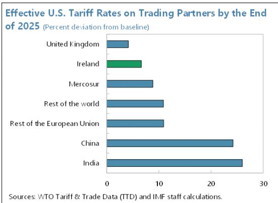

bilateral goods tariffs to zero for the relevant partners; non-tariff barriers are not included, so the scenarios isolate the general equilibrium effects of tariff changes operating through relative prices, trade diversion, and sectoral reallocation (see Table 1).

\- AI-driven Productivity Gains scenarios implement sector- and region-specific productivity improvements that raise efficiency while reshaping sectoral factor demand and the composition of income. The calibration of productivity shocks follows published evidence on AI exposure and adoption, drawing on Cerutti et al. (2025) and OECD (2025), and is implemented under low, medium, and high variants to reflect uncertainty about the pace and breadth of diffusion. These scenarios are designed to map differences in AI intensity across sectors and countries into macroeconomic outcomes through general equilibrium adjustments in production, trade, and factor allocation (see Table 1). AI-driven productivity gains are assumed to occur across all regions, with heterogeneous sector- and country-specific magnitudes, implying that Ireland's results reflect relative rather than unilateral productivity gains.

\- Carbon Pricing Policy scenarios allow the carbon price instrument to adjust where relevant, either to offset the emissions implications of AI productivity shocks (keeping emissions at their baseline level) or to achieve a 20 percent reduction in emissions relative to baseline in the absence of AI. The policy is represented through an additional carbon price over the calibrated baseline, generating associated carbon revenues and inducing reallocation across energy sources and sectors, including through changes in the electricity mix (see Table 1). The simulations impose economy-wide carbon pricing across all sectors, while current policy coverage in Ireland remains incomplete.

7. Interpretation of the results should take into account the scope and simplifying assumptions of the modeling framework. The analysis is conducted in a static general-equilibrium setting and should therefore be interpreted as comparing alternative equilibrium outcomes in the medium to long term, rather than tracing short-run dynamics or transition paths. In this framework, AI adoption is modeled as an exogenous, sector- and region-specific productivity improvement, abstracting from the endogenous accumulation of AI capital, skills, and innovation capacity, as well as from potential labor displacement or unemployment effects. The framework abstracts from AI-specific energy use (for example, data-center demand), capturing only the indirect effects of AI through higher aggregate activity. The analysis also abstracts from uncertainty around key drivers, including future trade policy developments, the scale and diffusion of AI productivity gains, climate impacts, and climate policy responses, which could affect the results. Climate policy is represented through carbon pricing as a stylized instrument to internalize emissions costs, with both carbon pricing revenues and other tax revenues rebated lump-sum to households. Accordingly, the analysis does not incorporate the full range of Ireland's climate policy framework, including the targets and renewable energy policies set out in the Government's Climate Action Plan 2025 (Department of Climate, Energy and the Environment, 2025), for example, policies supporting onshore and offshore wind, solar, and related energy measures. Alternative policy instruments, such as regulations or subsidies, are not explicitly modeled. While these simplifying assumptions limit the analysis of adjustment dynamics and distributional frictions, they allow for a transparent characterization of the economy-wide reallocation, price, and trade channels through which trade policy, AI-driven productivity gains, and climate policies jointly shape Ireland's equilibrium outcomes.

<table><tr><td colspan="3">Table 1. Ireland: Scenario Description</td></tr><tr><td>Group</td><td>Scenario</td><td>Scenario Description</td></tr><tr><td rowspan="4">Tariff and Trade Agreements</td><td>USTar</td><td>End-2025 U.S. tariffs on trading partners, differentiated by region and sector.</td></tr><tr><td>EUMSC</td><td>EU and Ireland eliminate bilateral tariffs with Mercosur.</td></tr><tr><td>EUIND</td><td>EU and Ireland eliminate bilateral tariffs with India.</td></tr><tr><td>UST+FT</td><td>U.S. tariffs combined with EU trade agreements with Mercosur and India.</td></tr><tr><td rowspan="3">AI-driven Productivity Gains</td><td>AI-L</td><td>Low AI-driven productivity gains across all regions and sectors.</td></tr><tr><td>AI-M</td><td>Medium AI-driven productivity gains across all regions and sectors.</td></tr><tr><td>AI-H</td><td>High AI-driven productivity gains across all regions and sectors.</td></tr><tr><td rowspan="4">Carbon Pricing Policy</td><td>AIL-CP</td><td>Low AI productivity gains with carbon pricing to keep Ireland&#x27;s emissions at baseline.</td></tr><tr><td>AIM-CP</td><td>Medium AI productivity gains with carbon pricing to keep Ireland&#x27;s emissions at base</td></tr><tr><td>AIH-CP</td><td>High AI productivity gains with carbon pricing to keep Ireland&#x27;s emissions at baseline.</td></tr><tr><td>CARB20</td><td>Carbon pricing in Ireland to reduce emissions by 20 percent relative to baseline.</td></tr></table>

## C. Tariff and Trade Agreements: Re-Shaping Global Trade

8. Trade policy shocks affect Ireland primarily through trade reallocation rather than through large aggregate output effects. Consistent with standard trade theory, the tariff shock has negative global effects in the model: world real output declines by 0.13 percent and global real exports fall by 2.84 percent, while the global price index rises by 0.64 percent, even as activity is redistributed across countries and sectors. Globally, tariff changes are uneven across sectors and partners, and pharmaceuticals face comparatively lighter tariff increases than many other traded goods, which tends to cushion Ireland's core export base given its specialization. At the same time, preferential trade agreements operate through improved market access, generating trade creation and diversion as bilateral tariffs are reduced to zero for partner pairs. Taken together, these forces imply that Ireland's adjustment shows most clearly in shifts in export composition, bilateral trade patterns, and sectoral activity, rather than in headline macroeconomic aggregates. The limited aggregate effects reflect economy-wide reallocation of labor and capital across sectors, which offsets large sector- and partner-specific export shifts at the macro level.

9. Aggregate macroeconomic effects of the trade scenarios are modest. Ireland's real GDP increases marginally under the U.S. tariff shock, and the increase remains below 0.20 percent even when tariffs are combined with the two EU trade agreements. The modest positive GDP response reflects a reallocation toward relatively higher-value and less-tariff-exposed export activities—most notably pharmaceuticals—combined with factor reallocation toward more capital-intensive sectors, which offsets negative demand effects at the aggregate level. These results indicate that the dominant adjustment margin is reallocation rather than a broad-based shift in domestic activity (Figure 1). The limited aggregate impact of the EU–Mercosur and EU–India agreements is consistent with their tariff-only design: by reducing bilateral tariffs to zero, these scenarios mainly re-route trade at the margin rather than generating large economy-wide gains. Price effects are similarly muted, with only small increases in the price index under the tariff shock and a modestly larger rise in the combined scenario (Figure 1), underscoring that adjustment operates primarily through trade diversion and sectoral reallocation. Non-tariff barriers are not incorporated in the scenarios and could affect the magnitude of the reported effects.

Figure 1. Ireland: Real GDP and Price Index Impacts in Tariff and Trade Agreements Scenarios  
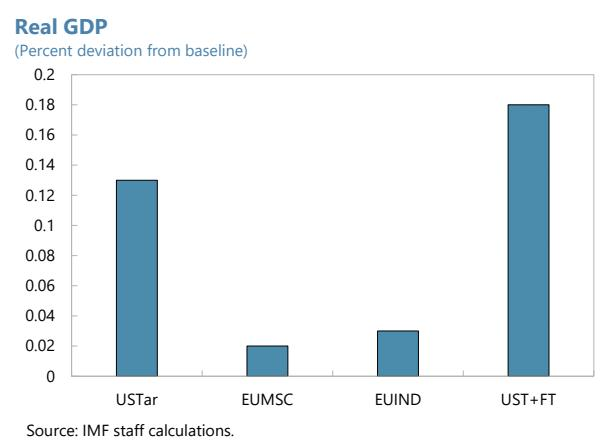

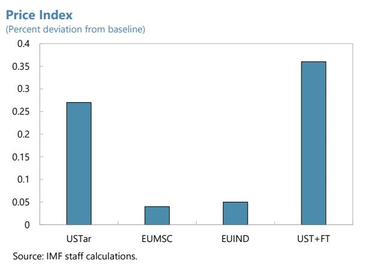

10. Export volumes respond more than output, suggesting that trade policy shocks are transmitted mainly through the external demand and relative-price channels. Under the U.S. tariff scenario, Ireland's total real exports decline modestly by 0.89 percent, while the average export price rises by 1.04 percent, consistent with trade re-routing under new tariff differentials and a shift toward relatively higher-priced destination-product pairs (Figure 2). By contrast, the EU trade agreements in isolation generate only marginal gains in export volumes and negligible changes in export prices (Figure 2). When U.S. tariffs are combined with the EU agreements, aggregate export volumes remain slightly negative at -0.83 percent, but export prices increase further to 1.14 percent, indicating that headline aggregates mask sizable offsetting shifts across partners (see below). Ireland's terms of trade move only marginally across scenarios, indicating that trade adjustment reflects quantity reallocation rather than price-based gains from trade (Table 3).

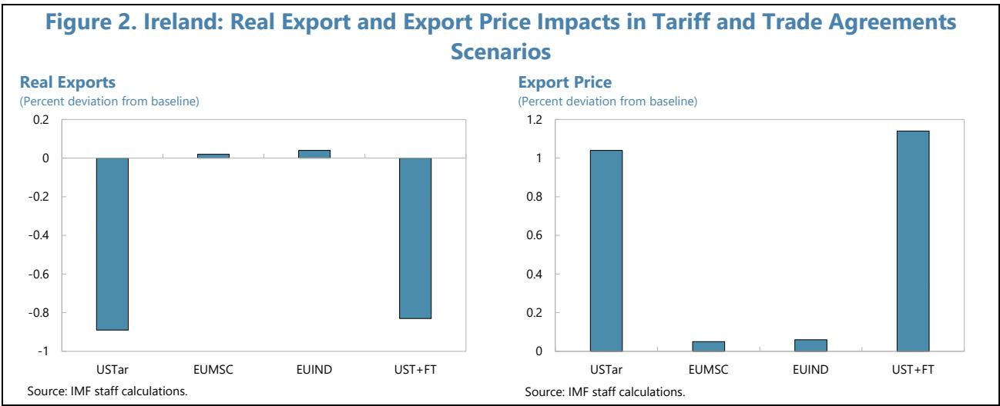

11. Bilateral trade flows provide clear evidence of trade diversion in response to tariff and free trade agreement shocks. Under the U.S. tariff scenario, Ireland's exports are re-directed toward the U.S. market, with shipments to the United States increasing by 18.78 percent, reflecting a relative competitiveness gain as tariffs fall more heavily on alternative suppliers, while exports to other major destinations decline, including China (-9.07 percent) and the rest of the EU (REU: -5.38 percent) (Table 2). Preferential EU trade agreements operate primarily through improved market access: exports from Ireland rise sharply toward the partner region—exports to Mercosur increase by 15.14 percent under the EU–Mercosur agreement, and exports to India rise by 18.10 percent under the EU–India agreement—while changes elsewhere remain limited. On the import side, U.S. tariffs are associated with a marked contraction in imports from the United States (-9.39 percent), as higher costs of imported intermediates in the U.S. raise U.S. production costs and export prices and prompt Ireland to substitute toward alternative suppliers. Under the trade agreements, imports from the partner regions expand notably, including from Mercosur (+10.79 percent) and India (+12.65 percent). Taken together, these patterns point to re-routing across partners rather than broad-based trade compression, with Ireland's external adjustment driven by shifts in bilateral market shares and sourcing patterns.

Table 2. Ireland: Trade Flows in Tariff and Trade Agreements Scenarios (Percent deviation from baseline)

<table><tr><td colspan="8">Export</td></tr><tr><td></td><td>CHN</td><td>GBR</td><td>IND</td><td>NCM</td><td>REU</td><td>USA</td><td>ROW</td></tr><tr><td>USTar</td><td>-9.07</td><td>-1.52</td><td>-7.51</td><td>-3.44</td><td>-5.38</td><td>18.78</td><td>-5.45</td></tr><tr><td>EUMSC</td><td>-0.49</td><td>0.04</td><td>-0.35</td><td>15.14</td><td>0.14</td><td>-0.44</td><td>-0.31</td></tr><tr><td>EUIND</td><td>-0.56</td><td>-0.17</td><td>18.1</td><td>-0.33</td><td>0.01</td><td>-0.35</td><td>-0.36</td></tr><tr><td>UST+FT</td><td>-10.01</td><td>-1.64</td><td>8.84</td><td>10.26</td><td>-5.26</td><td>18.08</td><td>-6.06</td></tr><tr><td colspan="8">Import</td></tr><tr><td>USTar</td><td>10.87</td><td>-0.66</td><td>9.96</td><td>3.41</td><td>2.91</td><td>-9.39</td><td>3.59</td></tr><tr><td>EUMSC</td><td>0.48</td><td>0.01</td><td>0.26</td><td>10.79</td><td>-0.67</td><td>0.32</td><td>0.23</td></tr><tr><td>EUIND</td><td>0.06</td><td>-0.1</td><td>12.65</td><td>0.41</td><td>-0.55</td><td>0.1</td><td>0.12</td></tr><tr><td>UST+FT</td><td>11.48</td><td>-0.78</td><td>24.26</td><td>15.1</td><td>1.68</td><td>-9.06</td><td>3.91</td></tr></table>

Source: IMF staff calculations.

Table 3. Ireland: Selected Macro Indicators in Tariff and Trade Agreements Scenarios (Percent deviation from baseline)

<table><tr><td></td><td>USTar</td><td>EUMSC</td><td>EUIND</td><td>UST+FT</td></tr><tr><td>Private Consumption Quantity</td><td>0.38</td><td>0.05</td><td>0.08</td><td>0.51</td></tr><tr><td>Private Consumption Price</td><td>0.57</td><td>0.04</td><td>0.05</td><td>0.65</td></tr><tr><td>Capital Income</td><td>2.02</td><td>0.08</td><td>0.05</td><td>2.14</td></tr><tr><td>Labor Income</td><td>-1.16</td><td>0.06</td><td>0.11</td><td>-0.98</td></tr><tr><td>Natural Resources Income</td><td>-8.8</td><td>-0.87</td><td>1.65</td><td>-8.21</td></tr><tr><td>Total Import Quantity</td><td>-0.77</td><td>0.05</td><td>0.09</td><td>-0.64</td></tr><tr><td>Total Import Price</td><td>0.95</td><td>0.03</td><td>0.02</td><td>0.99</td></tr><tr><td>Terms of Trade (Fisher)</td><td>1.00</td><td>1.00</td><td>1.00</td><td>1.00</td></tr><tr><td>Carbon Revenues</td><td>0.05</td><td>0.05</td><td>0.16</td><td>0.25</td></tr><tr><td>Tax Revenues</td><td>0.04</td><td>0.03</td><td>0.05</td><td>0.17</td></tr></table>

Source: IMF staff calculations.

12. Sectoral results show that the largest adjustments are concentrated in a small set of highly traded activities. Under the U.S. tariff scenario, several export-oriented sectors expand strongly in the U.S. market while contracting in other destinations, consistent with trade diversion along global value chains: for example, pharmaceutical exports to the United States increase sharply (+68.51 percent), while shipments decline to China (-17.48 percent) and to the rest of the EU (REU: -12.06 percent) (Figure 3). This pattern—gains in one market alongside losses in others—appears across multiple tradable sectors. More broadly, non-tradable and power-related activities exhibit limited cross-border adjustment relative to tradeables, reinforcing that the main transmission operates through market-share reallocation and sourcing changes across partners, rather than economy-wide movements.

Figure 3. Ireland: Selected Sectoral Real Output and Real Export Impacts in Tariff and Trade Agreements Scenarios  
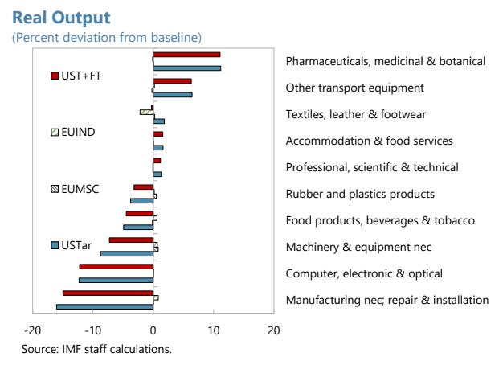

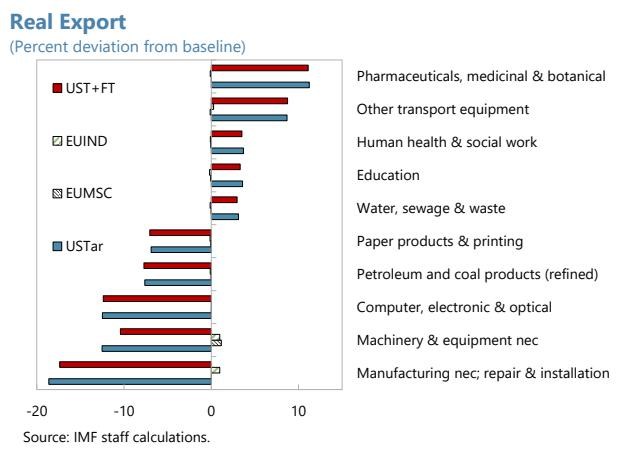

13. Sectoral reallocation of factors supports smooth adjustment. In the trade scenarios, sectors that expand under favorable market-access conditions absorb additional labor and capital,

while contractions are spread across several activities (Figure 4). Capital reallocation broadly mirrors labor movements across sectors, although the magnitudes differ somewhat, reflecting differences in sectoral capital intensity and adjustment costs. This pattern is reflected in factor incomes: capital income rises modestly, while labor income declines slightly under the U.S. tariff shock, consistent with reallocation toward more capital-intensive export activities, and natural-resource income falls as trade diversion weakens demand in sectors that rely on substantial natural resources as a factor of production (Table

Figure 4. Ireland: Selected Sectoral Labor Movement in Tariff and Trade Agreements Scenarios  
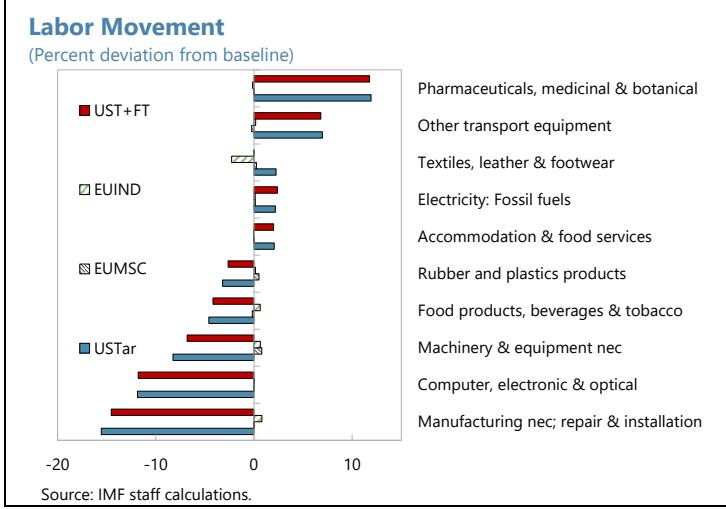

3). These adjustments operate smoothly at the aggregate level because labor and capital are assumed to be mobile across sectors within Ireland, allowing factors to move toward expanding activities without facing bottlenecks.

## D. Artificial Intelligence and Productivity Gains

14. AI adoption scenarios reshape Ireland's production and trade structure by amplifying sector-specific productivity differentials. Productivity gains are concentrated in knowledge-intensive and digitally enabled sectors, where AI adoption raises total factor productivity most strongly, while more traditional and resource-based activities experience comparatively smaller improvements. This sector-biased pattern reallocates resources toward higher-productivity,

technology-intensive activities. In general, AI-driven productivity gains are systematically larger in advanced economies, reflecting stronger complementarities with skills, capital, and digital infrastructure. Ireland is particularly well placed to translate AI-driven efficiency gains into higher output and export capacity, given the concentration of activity in sectors with above-average productivity responses. Unlike the trade scenarios, in which export changes are dominated by bilateral market-access shifts, AI-driven scenarios raise real exports broadly through the supply side: higher productivity expands production across a wide range of export-oriented sectors, strengthening competitiveness through lower unit costs rather than relative price wedges across destinations, and scaling up Ireland's existing comparative advantages rather than re-routing trade flows across partners.

15. AI-driven productivity gains generate sizable aggregate output effects in Ireland. Real GDP rises materially across the AI variants, ranging from 2.50 percent under the low-AI scenario to 6.89 percent under medium AI and 10.12 percent under high AI, reflecting broad-based efficiency improvements that expand the economy's effective production frontier (Figure 5). These gains operate through higher productivity, translating into higher real incomes and consumption rather than pure reallocation across sectors. At the same time, AI-driven productivity gains exert downward pressure on prices: the price index falls from -0.16 percent in the low-AI case to -0.93 percent under high AI, consistent with declining unit costs and stronger competitive pressures across sectors (Figure 5).

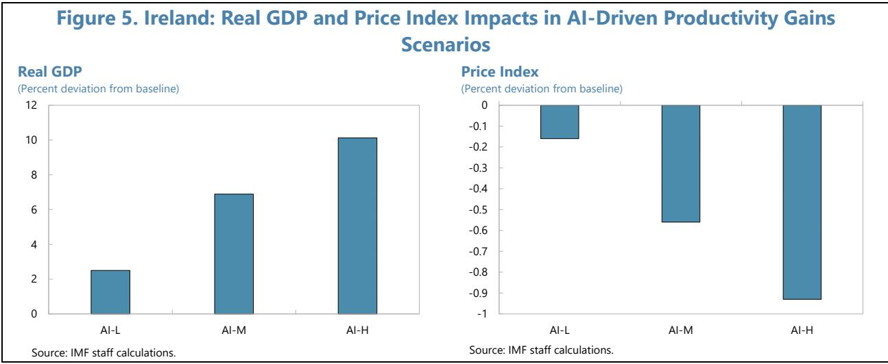

16. AI-driven productivity gains expand Ireland's exports mainly through the supply side. Real exports rise strongly across the AI scenarios—2.69 percent under low adoption, 7.53 percent under medium, and 11.11 percent under high—reflecting capacity expansion in export-oriented sectors (Figure 6). Export prices decline in parallel—from -0.3 percent to -1.56 percent—consistent with lower unit costs and stronger competitive pressures (Figure 6). Together, rising volumes and falling prices point to productivity-driven gains in external competitiveness. Bilateral trade flows support this interpretation: export increases are spread across partners rather than concentrated in a single destination, while imports also rise as higher activity raises demand for intermediate inputs

(Table 4). Ireland's terms of trade improve only marginally under AI-driven productivity gains, consistent with modest productivity-driven cost reductions and broad-based price adjustments rather than a shift in Ireland's pricing power in global markets (Table 5).

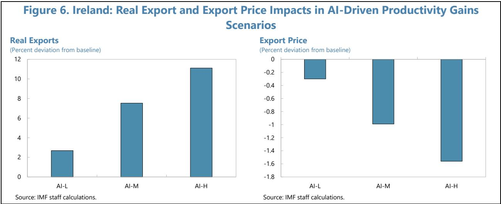

Table 4. Ireland: Trade Flows in AI-Driven Productivity Gains Scenarios (Percent deviation from baseline)

<table><tr><td colspan="8">(Percent deviation from baseline)</td></tr><tr><td></td><td colspan="7">Export</td></tr><tr><td></td><td>CHN</td><td>GBR</td><td>IND</td><td>NCM</td><td>REU</td><td>USA</td><td>ROW</td></tr><tr><td>AI-L</td><td>2.81</td><td>2.12</td><td>2.18</td><td>3.21</td><td>2.95</td><td>3.08</td><td>2.24</td></tr><tr><td>AI-M</td><td>7.89</td><td>5.81</td><td>6.35</td><td>9.2</td><td>8.26</td><td>8.63</td><td>6.26</td></tr><tr><td>AI-H</td><td>11.68</td><td>8.41</td><td>9.19</td><td>13.75</td><td>12.19</td><td>12.86</td><td>9.23</td></tr><tr><td colspan="8">Import</td></tr><tr><td>AI-L</td><td>2.35</td><td>4.1</td><td>3.13</td><td>2.34</td><td>3.11</td><td>4.27</td><td>3.19</td></tr><tr><td>AI-M</td><td>6.59</td><td>11.47</td><td>8.53</td><td>5.99</td><td>8.64</td><td>12.12</td><td>8.74</td></tr><tr><td>AI-H</td><td>9.86</td><td>16.97</td><td>12.52</td><td>8.31</td><td>12.69</td><td>18.1</td><td>12.82</td></tr></table>

Source: IMF staff calculations.

## 17. AI adoption triggers differentiated sectoral responses in real output and exports,

reflecting the uneven distribution of AI-related efficiency improvements. Sectors that are more knowledge-, data-, and technology-intensive experience the largest gains, while traditional activities respond more modestly (Figure 7). Real output expands markedly in chemicals, machinery-related manufacturing, and market services: for example, under high AI adoption, real output rises by around 30 percent in chemicals and by 20 percent or more in several tradable services and logistics-related sectors, compared with single-digit gains in agriculture. Export responses mirror these patterns: real exports increase most strongly in sectors where productivity gains are large and scale elasticities are high, with export growth reaching around 30 percent in chemicals and around 15–20 percent in advanced services under the high-AI scenario. This alignment between output and export expansion underscores that AI operates primarily through the supply side—raising sectoral

productive capacity and lowering costs—rather than through demand reallocation across markets, thereby scaling up Ireland’s existing comparative advantages in high-value activities.

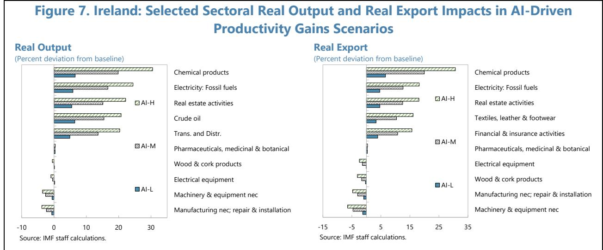

18. Stronger economic activity under AI adoption is accompanied by higher energy demand and rising emissions, with important implications for the electricity mix. Across AI scenarios, total $CO_{2}$ emissions increase by about 4 percent under low AI adoption and by around 11 to 17 percent under medium and high AI adoption, reflecting scale effects from higher production and consumption (Figure 8). At the same time, the renewable share in electricity production declines slightly—from 40 percent in the baseline to just below 39 percent under high AI—as rising electricity demand is partly met by existing non-renewable generation capacity in the absence of additional climate policy. These outcomes imply that AI-driven productivity boosts output and energy use faster than the endogenous adjustment of the power mix, leading to higher emissions and a modest dilution of the renewable share. $^{3}$ The analysis does not incorporate AI-specific electricity demand, such as from datacenters, which could affect the magnitude of the energy and emissions responses. The results therefore underscore that, while AI delivers sizable growth benefits, its interaction with the energy system makes complementary climate policy essential to manage scale-driven emissions increases. With carbon prices unchanged, carbon revenues increase in line with emissions (Table 5).

Source: IMF staff calculations.

Figure 8. Ireland: Renewable Share in Electricity Productions and CO2 Emission in AI-Driven Productivity Gains Scenarios  
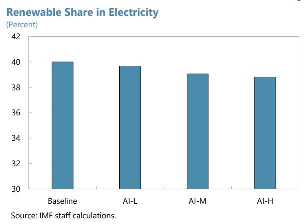  
Source: IMF staff calculations.

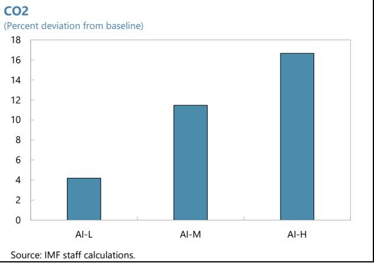

19. AI-driven productivity gains have pronounced distributional implications across factors of production. As productivity rises, capital income increases strongly—by 2.7 percent under low AI adoption and about 7.2 and 10.4 percent under medium and high AI—while labor income also increases, though more moderately, as higher activity raises demand for both capital and labor in expanding sectors (Table 5). In addition, natural-resource income rises sharply, consistent with scale effects from higher economy-wide production and energy use in the presence of inelastic natural-resource endowments.

Table 5. Ireland: Selected Macro Indicators in AI-Driven Productivity Gains Scenarios (Percent deviation from baseline)

<table><tr><td></td><td>AI-L</td><td>AI-M</td><td>AI-H</td></tr><tr><td>Private Consumption Quantity</td><td>7.25</td><td>20</td><td>29.36</td></tr><tr><td>Private Consumption Price</td><td>-0.08</td><td>-0.32</td><td>-0.57</td></tr><tr><td>Capital Income</td><td>2.7</td><td>7.21</td><td>10.39</td></tr><tr><td>Labor Income</td><td>1.39</td><td>3.69</td><td>5.17</td></tr><tr><td>Natural Resources Income</td><td>15.4</td><td>54.61</td><td>93.41</td></tr><tr><td>Total Import Quantity</td><td>3.6</td><td>10.07</td><td>14.9</td></tr><tr><td>Total Import Price</td><td>-0.49</td><td>-1.47</td><td>-2.25</td></tr><tr><td>Terms of Trade (Fisher)</td><td>1.00</td><td>1.01</td><td>1.01</td></tr><tr><td>Carbon Revenues</td><td>4.19</td><td>11.47</td><td>16.66</td></tr><tr><td>Tax Revenues</td><td>3.59</td><td>9.55</td><td>13.89</td></tr></table>

Source: IMF staff calculations.

## 20. The aggregate shifts are underpinned by substantial sectoral labor reallocation, as AI raises labor demand unevenly across activities. Employment contracts in some sectors—including

pharmaceuticals, where labor declines by about 2 percent under low AI and by over 7 percent under high AI—as productivity gains reduce labor requirements in highly capital-intensive production (Figure 9). At the same time, labor shifts toward fast-growing activities such as chemicals, transport, and certain services, where employment rises by high-single- to double-digit percentages under medium and high AI adoption. These dynamics show that workers reallocate toward sectors where productivity gains translate into scale expansion, reinforcing capital's share of income while sustaining broad-based labor income growth.

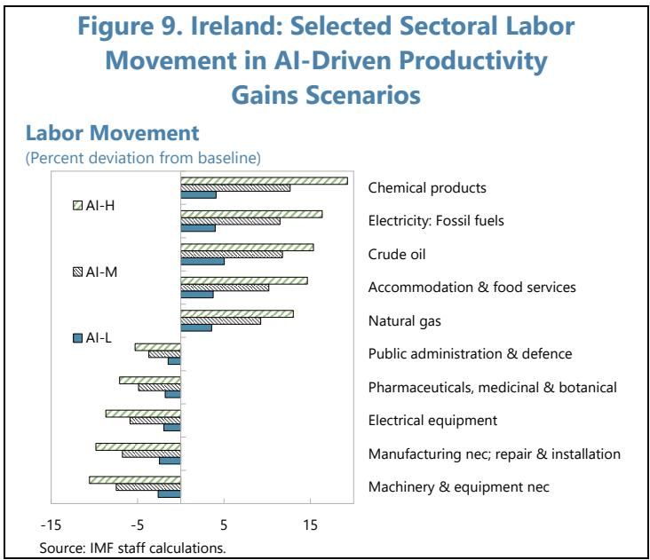

## E. Carbon Pricing Policy and Trade-Offs

21. Carbon pricing scenarios illustrate how policy interventions can reshape Ireland's growth, trade, and energy outcomes by internalizing emissions costs, both on a standalone basis and when combined with AI-driven productivity gains. In the first three scenarios, carbon prices adjust endogenously to offset the emissions impact of AI adoption, keeping emissions at their baseline level, while the final scenario imposes a higher carbon price to reduce emissions by 20 percent relative to baseline in the absence of AI. Carbon pricing is used in the model as a stylized and transparent instrument for illustrative purposes, without implying recommendations on the level or choice of climate policy instruments, which in practice may include taxes, subsidies, regulations, or other measures. Across all cases, carbon pricing raises the cost of emissions-intensive activities, inducing substitution toward cleaner production methods and changes in the sectoral composition of output, while also generating economy-wide price effects. When combined with AI, climate policy slightly reduces the gains from productivity, while in the absence of AI, carbon pricing mainly raises costs and reallocates resources. In the climate policy scenarios, mitigation targets are imposed only on Ireland while climate policies in other regions remain unchanged; although cross-country climate ambition may affect quantitative outcomes in a multi-region setting, this assumption is not expected to alter the qualitative mechanisms highlighted in the analysis. $^{4}$

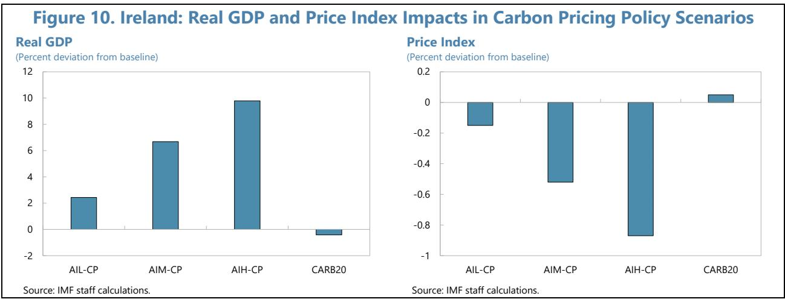

22. Real GDP and price responses reflect the interaction between productivity gains and carbon costs. When combined with carbon pricing, AI adoption continues to yield sizable output gains: real GDP increases range from about 2.43 to 9.79 percent, slightly below the corresponding gains in the AI-only scenarios, indicating a modest efficiency cost from emissions constraints (Figure 10). At the same time, the aggregate price change remains negative—between -0.15 and -0.87 percent—but rises modestly relative to AI-only outcomes, as carbon prices partially offset productivity-driven cost reductions. By contrast, in the standalone carbon-pricing scenario (CARB20), real GDP declines slightly (-0.42 percent) and the price index is essentially unchanged (0.05 percent increase), reflecting higher production costs in the absence of productivity gains.

23. Carbon pricing, however, drives a pronounced shift in the electricity mix and influences the emissions outcomes across climate scenarios. As the required level of abatement rises, the renewable share in electricity production increases steadily from 40 percent in the baseline to 44.3 percent under AIL-CP, 51.1 percent under AIM-CP, and 55.6 percent under AIH-CP, reaching nearly 62 percent in the CARB20 scenario (Figure 11). Achieving these outcomes requires progressively higher carbon prices above the existing baseline carbon price, ranging from about USD 10.6 per ton of CO₂ when offsetting low-AI emissions to USD 45.1 under high AI adoption, and rising further to USD 66.6 per ton to deliver a 20-percent emissions reduction without AI. This steepening of the carbon price reflects increasing marginal abatement costs as emissions constraints tighten (see, for example, Khabbazan, 2022). The results illustrate the central trade-off of climate policy: higher carbon prices effectively reorient production and energy use toward low-emission technologies, but at the cost of higher prices and modest output losses when not accompanied by productivity-enhancing factors. Carbon revenues reflect both carbon prices and the underlying emissions base. In the high-AI scenario, carbon revenues exceed those under CARB20 despite the higher carbon price in the latter (Table 7).

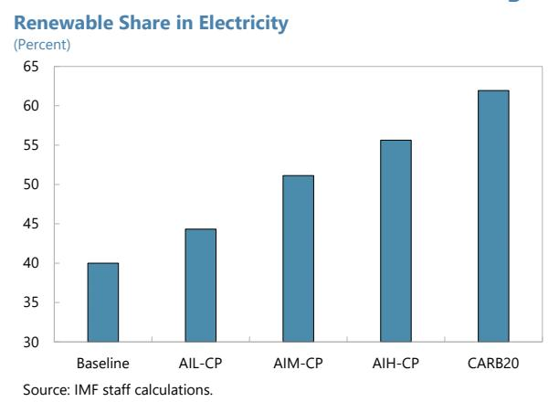

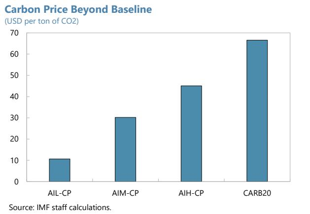

24. Carbon pricing affects Ireland's trade mainly through cost and composition effects, with different outcomes when combined with AI than when applied as a stand-alone tool. When paired with AI, supply-side productivity gains dominate: real exports rise by 2.55 percent in AIL-CP, 7.14 percent in AIM-CP, and 10.55 percent in AIH-CP, while export prices fall by 0.28–1.50 percent, reflecting productivity-driven cost reductions partly offset by higher carbon-related input costs (Figure 12). Bilateral trade flows remain broadly similar to AI-only outcomes, with only modest destination shifts—most notably slightly stronger exports toward China—as carbon costs interact with sectoral production structures (Table 6). By contrast, under carbon pricing alone (CARB20), real exports decline (-0.71 percent) and export prices rise modestly (+0.14 percent), pointing to a mild loss of cost competitiveness as carbon costs raise prices in emissions-intensive activities. Bilateral flows show limited reorientation, with exports to China edging up (+0.34 percent) while shipments elsewhere soften. Imports continue to rise in the combined AI-carbon scenarios, reflecting stronger domestic demand and intermediate input use. At the same time, CARB20 yields broad-based import declines consistent with weaker absorption and substitution away from carbon-intensive inputs. Ireland's terms of trade move only marginally across the climate policy scenarios (Table 7). At the sectoral level, carbon pricing reinforces compositional shifts toward low-carbon activities, with fossil-fuel-based electricity and other emissions-intensive sectors contracting while renewables and less carbon-intensive services expand (Figure 13). In the combined AI-carbon scenarios, these reallocations occur alongside productivity-driven growth, whereas under carbon pricing alone (CARB20) the absence of AI scale effects results in broader declines in carbon-intensive sectors and only limited gains elsewhere.

Figure 12. Ireland: Real Export and Export Price Impacts in Carbon Pricing Policy Scenarios  
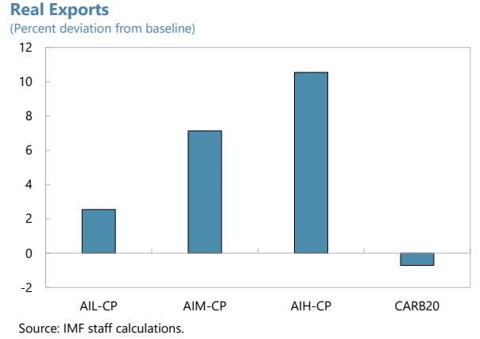  
Source: IMF staff calculations.

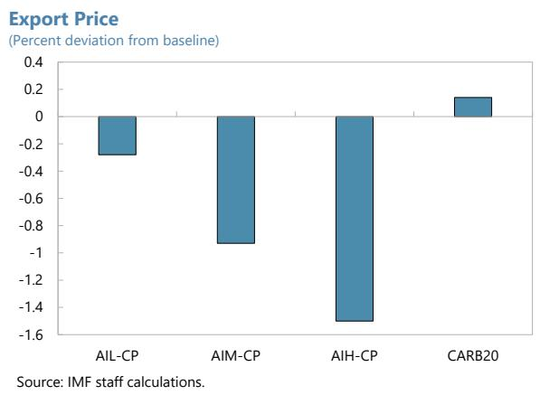

Table 6. Ireland: Trade Flows in Carbon Pricing Policy Scenarios (Percent deviation from baseline)

<table><tr><td colspan="8">Export</td></tr><tr><td></td><td>CHN</td><td>GBR</td><td>IND</td><td>NCM</td><td>REU</td><td>USA</td><td>ROW</td></tr><tr><td>AIL-CP</td><td>2.87</td><td>1.82</td><td>2.17</td><td>3.16</td><td>2.75</td><td>3.05</td><td>2.13</td></tr><tr><td>AIM-CP</td><td>8.05</td><td>4.98</td><td>6.35</td><td>9.08</td><td>7.7</td><td>8.56</td><td>5.96</td></tr><tr><td>AIH-CP</td><td>11.93</td><td>7.2</td><td>9.21</td><td>13.59</td><td>11.38</td><td>12.76</td><td>8.82</td></tr><tr><td>CARB20</td><td>0.34</td><td>-1.58</td><td>-0.05</td><td>-0.24</td><td>-1.01</td><td>-0.07</td><td>-0.56</td></tr><tr><td colspan="8">Import</td></tr><tr><td>AIL-CP</td><td>2.3</td><td>3.9</td><td>2.97</td><td>1.69</td><td>3.01</td><td>4.18</td><td>2.92</td></tr><tr><td>AIM-CP</td><td>6.44</td><td>10.92</td><td>8.08</td><td>4.23</td><td>8.35</td><td>11.86</td><td>8.03</td></tr><tr><td>AIH-CP</td><td>9.64</td><td>16.16</td><td>11.84</td><td>5.76</td><td>12.26</td><td>17.71</td><td>11.8</td></tr><tr><td>CARB20</td><td>-0.26</td><td>-0.93</td><td>-0.83</td><td>-2.55</td><td>-0.53</td><td>-0.47</td><td>-1.38</td></tr></table>

Source: IMF staff calculations.

Table 7. Ireland: Selected Macro Indicators in Carbon Pricing Policy Scenarios (Percent deviation from baseline)

<table><tr><td></td><td>AIL-CP</td><td>AIM-CP</td><td>AIH-CP</td><td>CARB20</td></tr><tr><td>Private Consumption Quantity</td><td>7.04</td><td>19.37</td><td>28.4</td><td>-1.21</td></tr><tr><td>Private Consumption Price</td><td>0.02</td><td>-0.03</td><td>-0.15</td><td>0.62</td></tr><tr><td>Capital Income</td><td>2.69</td><td>7.16</td><td>10.33</td><td>-0.1</td></tr><tr><td>Labor Income</td><td>1.22</td><td>3.21</td><td>4.45</td><td>-0.92</td></tr><tr><td>Natural Resources Income</td><td>14.9</td><td>53.08</td><td>90.98</td><td>-2.52</td></tr><tr><td>Total Import Quantity</td><td>3.46</td><td>9.66</td><td>14.29</td><td>-0.75</td></tr><tr><td>Total Import Price</td><td>-0.49</td><td>-1.48</td><td>-2.27</td><td>0.01</td></tr><tr><td>Terms of Trade (Fisher)</td><td>1.00</td><td>1.01</td><td>1.01</td><td>1.00</td></tr><tr><td>Carbon Revenues</td><td>14.71</td><td>41.77</td><td>62.31</td><td>53.64</td></tr><tr><td>Tax Revenues</td><td>3.03</td><td>8.23</td><td>11.91</td><td>-2.46</td></tr></table>

Source: IMF staff calculations.

Figure 13. Ireland: Selected Sectoral Real Output and Real Export Impacts in Carbon Pricing Policy Scenarios  
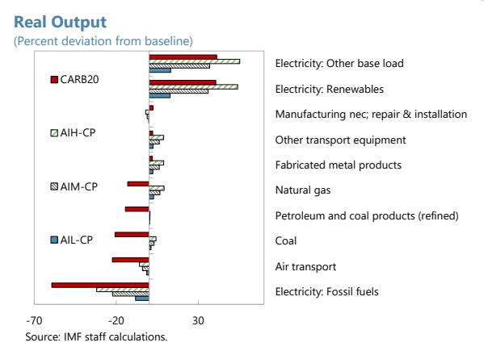

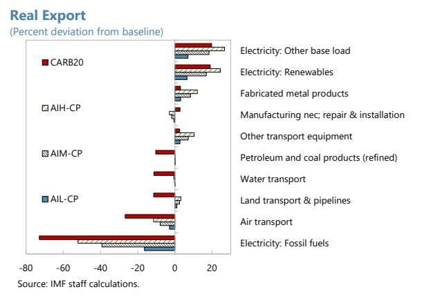

## 25. These sectoral adjustments are reflected in factor incomes and labor reallocation, driven by changes in relative profitability across activities. When carbon pricing is combined

with AI, capital and labor incomes continue to rise, albeit slightly less than in AI-only scenarios, while natural-resource income still increases strongly, reflecting higher rents on constrained resource inputs (Table 7). In contrast, under CARB20 all factor incomes decline modestly, with the largest contraction in natural-resource income, consistent with reduced fossil-fuel use. Labor movement mirrors sectoral output changes (Figure 14): employment falls sharply in fossil electricity across all climate scenarios, while labor re-allocates

Figure 14. Ireland: Selected Sectoral Labor Movement in Carbon Pricing Policy Scenarios

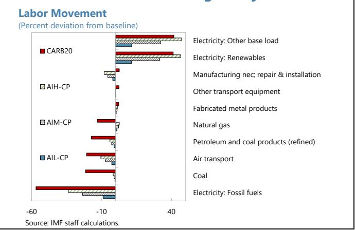

toward renewable electricity, and sectors including construction and market services. In the combined AI-carbon scenarios, this reallocation occurs within an expanding economy, whereas in CARB20 it reflects adjustment under a mild contraction.

26. Overall, carbon pricing emerges as a necessary complement to AI-driven growth if the goal is to ensure that productivity gains do not translate into persistently higher emissions or an unsustainable energy mix. Carbon pricing provides a clear and effective signal that redirects production, trade, and factor allocation toward low-emission activities, driving a substantial expansion of renewable electricity and enabling emissions stabilization or reduction even in the presence of strong AI-induced scale effects. When combined with AI, climate policy tempers only marginally productivity-led growth. The simulation results illustrate that well-designed climate policy is central to reconciling Ireland's growth prospects with its decarbonization objectives, providing the foundation for a sustainable transition that aligns long-term economic performance with climate commitments.

## F. Concluding Remarks

27. Ireland's aggregate macroeconomic response to the existing tariff and trade agreement shocks is found to be modest. This result reflects the targeted nature of the shock in the model rather than limited trade exposure per se, as key Irish export sectors—most notably pharmaceuticals—are largely exempt from the tariff increases, resulting in low effective tariff changes at the aggregate level. Changes in tariffs and the introduction of new trade agreements primarily re-route trade across partners and sectors, with adjustment occurring mainly through quantities and market shares rather than through large price or income effects. Ireland's specialization in high-value, differentiated products—notably pharmaceuticals and certain services—helps insulate aggregate output from adverse trade shocks, while preferential agreements generate only modest gains, reflecting a modeling framework that captures tariff changes only and does not incorporate non-tariff measures embedded in the agreements.

28. AI-driven productivity gains emerge in the long run as a potentially powerful structural force shaping Ireland's growth and competitiveness, with implications for factor reallocation and income distribution that need to be managed. The results show that AI can deliver sizable output and export gains through the supply side, particularly in knowledge-intensive and tradable sectors, reinforcing Ireland's existing comparative advantages. At the same time, the uneven distribution of productivity gains requires substantial labor reallocation across sectors, highlighting the importance of policies that facilitate reskilling, upskilling, and labor mobility. Strengthening active labor-market policies, AI-specific training and upskilling, and skill-matching mechanisms will be critical to ensure that productivity-led growth translates into broad-based income gains and sustained employment. While the analysis focuses on aggregate productivity and trade effects, related evidence indicates that AI adoption may generate distributional pressures, highlighting the role of complementary policies in ensuring that productivity gains are broadly shared (see, for example, Doorley et al., 2026).

29. Carbon pricing policy can play a central role in ensuring that productivity-driven expansion does not translate into persistently higher emissions or an unsustainable energy mix. The results underscore the importance of continuing investment in renewable energy capacity while upgrading grid infrastructure to accommodate rising electricity demand, including that associated with AI-related activity and digitalization more broadly. Carbon pricing remains an effective tool to steer production and energy use toward lower-emission technologies, while supporting energy security by reducing reliance on fossil-fuel-based energy sources, and the analysis highlights the relevance of its broader coverage and effective implementation. Expanding the sectoral coverage of existing climate policy frameworks, strengthening electricity networks, and facilitating the integration of European energy markets including renewables are key to reconciling strong growth with decarbonization objectives, allowing Ireland to sustain productivity gains while progressing toward its climate commitments.

## Annex I. The Economic Structure of the Model and the Key Substitution Elasticities

<table><tr><td colspan="2">Annex I. Table 1. Ireland: Main Elasticity Values</td></tr><tr><td>Item</td><td>Value</td></tr><tr><td>Elasticity of supply of fossil fuels</td><td>Beckman, Hertel, and Tyner (2011)</td></tr><tr><td>Elasticity of substitution on top of technology nest in fossil production ( $\sigma_{fos,r}^{s}$ )</td><td>Beckman et al. (2011)</td></tr><tr><td>Armington Elasticities for gas and oil</td><td>Böhringer and Rutherford (2010)*</td></tr><tr><td>CET Elasticities for gas and oil</td><td>Böhringer and Rutherford (2010)*</td></tr><tr><td>Other CET and Armington Elasticities</td><td>GTAP*; Lanz and Rutherford (2016)*</td></tr><tr><td>Elasticity of substitution between factors ( $\sigma_{g,r}^{KL}$ )</td><td>Okagawa and Ban (2008)</td></tr><tr><td>Elasticity of substitution between composite factors and energy ( $\sigma_{g,r}^{KLE}$ )</td><td>Okagawa and Ban (2008)</td></tr><tr><td>Elasticity of substitution between power technologies ( $\sigma_{g,r}^{ele}$ )</td><td>Khabbazan and Von Hirschhausen (2021)*</td></tr><tr><td>Elasticity of substitution between non-electricity energy ( $\sigma_{g,r}^{nele}$ )</td><td>Böhringer and Rutherford (2010)</td></tr><tr><td>Elasticity of substitution between non-electricity and electricity ( $\sigma_{g,r}^{e}$ )</td><td>Böhringer and Rutherford (2010)*</td></tr><tr><td>Elasticity of substitution between intermediate inputs ( $\sigma_{g,r}^{M}$ )</td><td>Okagawa and Ban (2008)</td></tr><tr><td>Elasticity of substitution between KLE and intermediate inputs ( $\sigma_{g,r}^{KLEM}$ )</td><td>Okagawa and Ban (2008)</td></tr><tr><td colspan="2">Source: Khabbazan and Von Hirschhausen (2021).* Elasticities that are 50 percent increased in 2025 compared to their values in the benchmark.</td></tr></table>

Annex I. Figure 1. Ireland: Nesting Structure in Non-Fossil-Fuel Production  
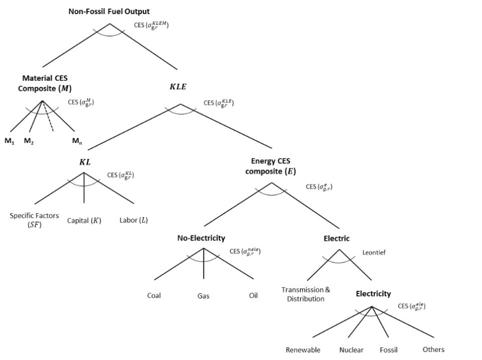  
Source: Khabbazan and Von Hirschhausen (2021).

Annex I. Figure 2. Ireland: Nesting Structure in Fossil-Fuel Production

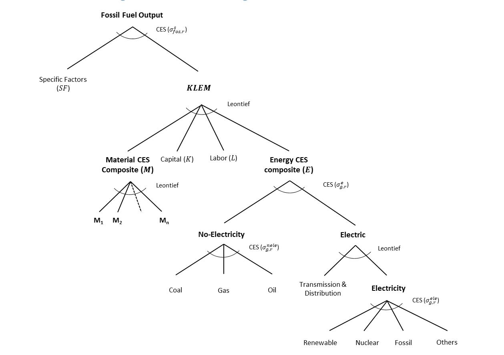

Source: Khabbazan and Von Hirschhausen (2021).

## Annex I. Figure 3. Ireland: Export Structure

Domestic (D)

Export (E)  
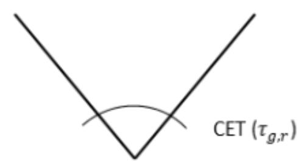  
Output (Y)

Annex I. Figure 4. Ireland: Intermediate Input Structure

Intermediate Input ( $M_{n}$ )

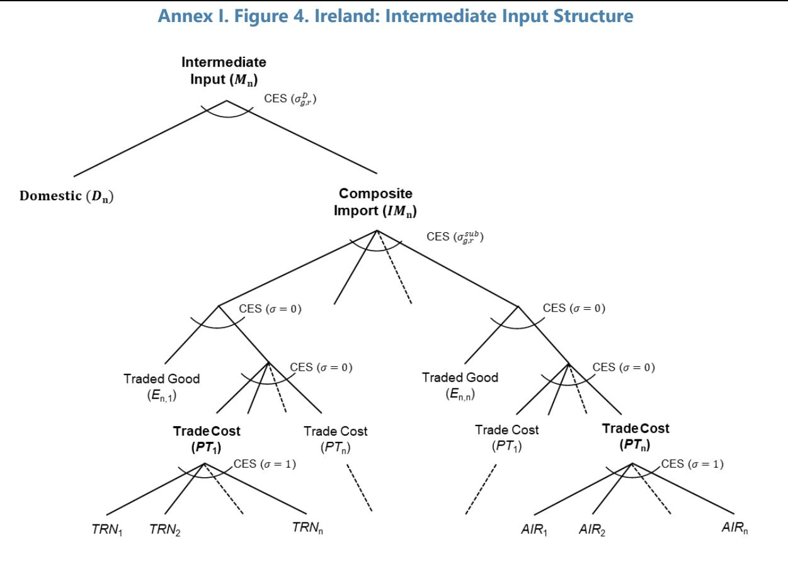

Annex II. Table 1. Ireland: GTAP Sectors Aggregation to Model Sectors

## Annex II. Sectoral Mapping

<table><tr><td>GTAP (i)</td><td>Detailed Description (i)</td><td>Aggregated (ii)</td><td>Aggregated Description (ii)</td></tr><tr><td>PDR</td><td>Paddy rice</td><td>AGF</td><td>Agriculture, hunting &amp; forestry</td></tr><tr><td>WHT</td><td>Wheat</td><td>AGF</td><td>Agriculture, hunting &amp; forestry</td></tr><tr><td>GRO</td><td>Cereal grains nec</td><td>AGF</td><td>Agriculture, hunting &amp; forestry</td></tr><tr><td>V_F</td><td>Vegetables - fruit - nuts</td><td>AGF</td><td>Agriculture, hunting &amp; forestry</td></tr><tr><td>OSD</td><td>Oil seeds</td><td>AGF</td><td>Agriculture, hunting &amp; forestry</td></tr><tr><td>C_B</td><td>Sugar cane - sugar beet</td><td>AGF</td><td>Agriculture, hunting &amp; forestry</td></tr><tr><td>PFB</td><td>Plant-based fibers</td><td>AGF</td><td>Agriculture, hunting &amp; forestry</td></tr><tr><td>OCR</td><td>Crops nec</td><td>AGF</td><td>Agriculture, hunting &amp; forestry</td></tr><tr><td>CTL</td><td>Bovine animals</td><td>AGF</td><td>Agriculture, hunting &amp; forestry</td></tr><tr><td>OAP</td><td>Animal products nec</td><td>AGF</td><td>Agriculture, hunting &amp; forestry</td></tr><tr><td>RMK</td><td>Raw milk</td><td>AGF</td><td>Agriculture, hunting &amp; forestry</td></tr><tr><td>WOL</td><td>Wool - silk-worm cocoons</td><td>AGF</td><td>Agriculture, hunting &amp; forestry</td></tr><tr><td>FRS</td><td>Forestry</td><td>AGF</td><td>Agriculture, hunting &amp; forestry</td></tr><tr><td>FSH</td><td>Fishing</td><td>FSH</td><td>Fishing &amp; aquaculture</td></tr><tr><td>CMT</td><td>Bovine meat products</td><td>FBT</td><td>Food products, beverages &amp; tobacco</td></tr><tr><td>OMT</td><td>Meat products</td><td>FBT</td><td>Food products, beverages &amp; tobacco</td></tr><tr><td>VOL</td><td>Vegetable oils &amp; fats</td><td>FBT</td><td>Food products, beverages &amp; tobacco</td></tr><tr><td>MIL</td><td>Dairy products</td><td>FBT</td><td>Food products, beverages &amp; tobacco</td></tr><tr><td>PCR</td><td>Processed rice</td><td>FBT</td><td>Food products, beverages &amp; tobacco</td></tr><tr><td>SGR</td><td>Sugar</td><td>FBT</td><td>Food products, beverages &amp; tobacco</td></tr><tr><td>GAS</td><td>Natural gas</td><td>GAS</td><td>Natural gas</td></tr><tr><td>GDT</td><td>Natural gas works</td><td>GAS</td><td>Natural gas</td></tr><tr><td>OIL</td><td>Refined oil products</td><td>OIL</td><td>Petroleum and coal products (refined)</td></tr><tr><td>COL</td><td>Coal transformation</td><td>COL</td><td>Coal</td></tr><tr><td>CRU</td><td>Crude oil</td><td>CRU</td><td>Crude oil</td></tr><tr><td>NFM</td><td>Metals nec</td><td>BMT</td><td>Basic metals</td></tr><tr><td>I_S</td><td>Ferrous metals</td><td>BMT</td><td>Basic metals</td></tr><tr><td>NMM</td><td>Mineral products nec</td><td>NMM</td><td>Mineral products nec</td></tr><tr><td>CHM</td><td>Chemical products</td><td>CHM</td><td>Chemical products</td></tr><tr><td>BPH</td><td>Basic pharmaceutical products</td><td>BPH</td><td>Pharmaceuticals, medicinal &amp; botanical</td></tr><tr><td>RPP</td><td>Rubber and plastic products</td><td>RPP</td><td>Rubber and plastics products</td></tr><tr><td>PPP</td><td>Paper products - publishing</td><td>PPP</td><td>Paper products &amp; printing</td></tr><tr><td>TnD</td><td>Transmission and Distribution</td><td>TnD</td><td>Trans. and Distr.</td></tr><tr><td>NuclearBL</td><td>Nuclear base load</td><td>ENB</td><td>Electricity: Nuclear Base load</td></tr><tr><td>CoalBL</td><td>Coal base load</td><td>EFF</td><td>Electricity: Fossil fuels</td></tr><tr><td>GasBL</td><td>Gas base load</td><td>EFF</td><td>Electricity: Fossil fuels</td></tr><tr><td>WindBL</td><td>Wind base load</td><td>ERN</td><td>Electricity: Renewables</td></tr><tr><td>HydroBL</td><td>Hydro base load</td><td>ERN</td><td>Electricity: Renewables</td></tr><tr><td>OilBL</td><td>Oil base load</td><td>EFF</td><td>Electricity: Fossil fuels</td></tr><tr><td>OtherBL</td><td>Other base load</td><td>EOt</td><td>Electricity: Other base load</td></tr><tr><td>GasP</td><td>Gas peak</td><td>EFF</td><td>Electricity: Fossil fuels</td></tr><tr><td>HydroP</td><td>Hydro peak</td><td>ERN</td><td>Electricity: Renewables</td></tr><tr><td>OilP</td><td>Oil peak</td><td>EFF</td><td>Electricity: Fossil fuels</td></tr></table>

Annex II. Table 1. Ireland: GTAP Sectors Aggregation to Model Sectors (concluded)

<table><tr><td>GTAP (i)</td><td>Detailed Description (i)</td><td>Aggregated (ii)</td><td>Aggregated Description (ii)</td></tr><tr><td>SolarP</td><td>Solar peak</td><td>ERN</td><td>Electricity: Renewables</td></tr><tr><td>OXT</td><td>Other Extraction (minerals nec)</td><td>OXT</td><td>Other extraction (minerals nec)</td></tr><tr><td>OFD</td><td>Food products nec</td><td>FBT</td><td>Food products, beverages &amp; tobacco</td></tr><tr><td>B_T</td><td>Beverages and tobacco products</td><td>FBT</td><td>Food products, beverages &amp; tobacco</td></tr><tr><td>TEX</td><td>Textiles</td><td>TTL</td><td>Textiles, leather &amp; footwear</td></tr><tr><td>WAP</td><td>Wearing apparel</td><td>TTL</td><td>Textiles, leather &amp; footwear</td></tr><tr><td>LEA</td><td>Leather products</td><td>TTL</td><td>Textiles, leather &amp; footwear</td></tr><tr><td>LUM</td><td>Wood products</td><td>LUM</td><td>Wood &amp; cork products</td></tr><tr><td>FMP</td><td>Metal products</td><td>FMP</td><td>Fabricated metal products</td></tr><tr><td>MVH</td><td>Motor vehicles and parts</td><td>MVH</td><td>Motor vehicles &amp; trailers</td></tr><tr><td>OTN</td><td>Transport equipment nec</td><td>OTN</td><td>Other transport equipment</td></tr><tr><td>CEO</td><td>Computer, electronic and optical products</td><td>CEO</td><td>Computer, electronic &amp; optical</td></tr><tr><td>EEQ</td><td>Electronic equipment</td><td>EEQ</td><td>Electrical equipment</td></tr><tr><td>OME</td><td>Machinery and equipment nec</td><td>OME</td><td>Machinery &amp; equipment nec</td></tr><tr><td>OMF</td><td>Manufactures nec</td><td>OMF</td><td>Manufacturing nec; repair &amp; installation</td></tr><tr><td>ATP</td><td>Air transport</td><td>ATP</td><td>Air transport</td></tr><tr><td>WTP</td><td>Water transport</td><td>WTP</td><td>Water transport</td></tr><tr><td>OTP</td><td>Transport nec</td><td>OTP</td><td>Land transport &amp; pipelines</td></tr><tr><td>AFS</td><td>Accommodation Food and service activities</td><td>AFS</td><td>Accommodation &amp; food services</td></tr><tr><td>WHS</td><td>Warehousing and support activities</td><td>WHS</td><td>Warehousing &amp; transport support</td></tr><tr><td>CNS</td><td>Construction</td><td>CNS</td><td>Construction</td></tr><tr><td>OSG</td><td>Public admin and defence</td><td>OSG</td><td>Public administration &amp; defence</td></tr><tr><td>EDU</td><td>Education</td><td>EDU</td><td>Education</td></tr><tr><td>HHT</td><td>Human health and social work activities</td><td>HHT</td><td>Human health &amp; social work</td></tr><tr><td>WTR</td><td>Water</td><td>WTR</td><td>Water, sewage &amp; waste</td></tr><tr><td>TRD</td><td>Trade</td><td>TRD</td><td>Wholesale &amp; retail trade</td></tr><tr><td>CMN</td><td>Communication</td><td>CMN</td><td>Telecommunications</td></tr><tr><td>OFI</td><td>Financial services nec</td><td>FIN</td><td>Financial &amp; insurance activities</td></tr><tr><td>INS</td><td>Insurance</td><td>FIN</td><td>Financial &amp; insurance activities</td></tr><tr><td>RSA</td><td>Real estate activities</td><td>REA</td><td>Real estate activities</td></tr><tr><td>OBS</td><td>Business services nec</td><td>OBS</td><td>Professional, scientific &amp; technical</td></tr><tr><td>ROS</td><td>Recreational and other services</td><td>ROS</td><td>Arts, entertainment &amp; recreation</td></tr><tr><td>DWE</td><td>Ownership of dwellings</td><td>REA</td><td>Real estate activities</td></tr></table>

Annex III. Sectoral Results

<table><tr><td colspan="12">Annex III. Table 1. Ireland: Sectoral Real Output(Percent deviation from baseline)</td></tr><tr><td></td><td>USTar</td><td>EUMSC</td><td>EUIND</td><td>UST+FT</td><td>AI-L</td><td>AI-M</td><td>AI-H</td><td>AIL-CP</td><td>AIM-CP</td><td>AIH-CP</td><td>CARB20</td></tr><tr><td>AGF</td><td>-0.90</td><td>-0.07</td><td>0.15</td><td>-0.83</td><td>1.51</td><td>4.85</td><td>7.66</td><td>1.43</td><td>4.63</td><td>7.35</td><td>-0.48</td></tr><tr><td>GAS</td><td>1.20</td><td>-0.14</td><td>-0.19</td><td>0.88</td><td>5.33</td><td>14.02</td><td>20.16</td><td>2.73</td><td>6.59</td><td>9.15</td><td>-13.03</td></tr><tr><td>OIL</td><td>-1.42</td><td>0.02</td><td>-0.28</td><td>-1.68</td><td>2.90</td><td>7.74</td><td>11.06</td><td>0.24</td><td>0.48</td><td>0.54</td><td>-14.44</td></tr><tr><td>COL</td><td>-0.32</td><td>-0.12</td><td>-0.05</td><td>-0.44</td><td>4.82</td><td>12.49</td><td>17.31</td><td>1.15</td><td>3.04</td><td>4.19</td><td>-20.76</td></tr><tr><td>CRU</td><td>-1.38</td><td>-0.30</td><td>-0.35</td><td>-1.84</td><td>6.44</td><td>15.45</td><td>20.75</td><td>5.96</td><td>14.42</td><td>19.49</td><td>-3.73</td></tr><tr><td>BMT</td><td>-0.81</td><td>0.09</td><td>0.26</td><td>-0.47</td><td>2.87</td><td>7.48</td><td>10.76</td><td>1.42</td><td>3.45</td><td>4.83</td><td>-7.40</td></tr><tr><td>NMM</td><td>-0.04</td><td>0.02</td><td>0.04</td><td>0.02</td><td>0.90</td><td>2.47</td><td>3.55</td><td>0.73</td><td>1.99</td><td>2.84</td><td>-1.00</td></tr><tr><td>CHM</td><td>-1.85</td><td>0.14</td><td>-0.12</td><td>-1.91</td><td>6.56</td><td>19.85</td><td>30.49</td><td>6.55</td><td>19.84</td><td>30.48</td><td>0.07</td></tr><tr><td>BPH</td><td>11.18</td><td>0.00</td><td>-0.12</td><td>11.07</td><td>0.35</td><td>0.31</td><td>0.41</td><td>0.40</td><td>0.43</td><td>0.58</td><td>0.31</td></tr><tr><td>RPP</td><td>-3.78</td><td>0.52</td><td>0.16</td><td>-3.20</td><td>-0.21</td><td>0.66</td><td>0.90</td><td>-0.05</td><td>1.09</td><td>1.53</td><td>0.94</td></tr><tr><td>PPP</td><td>-1.52</td><td>0.01</td><td>-0.01</td><td>-1.52</td><td>0.98</td><td>2.83</td><td>4.12</td><td>0.99</td><td>2.84</td><td>4.14</td><td>0.04</td></tr><tr><td>TnD</td><td>-1.21</td><td>0.00</td><td>0.06</td><td>-1.16</td><td>4.90</td><td>13.63</td><td>20.34</td><td>4.89</td><td>13.74</td><td>20.66</td><td>0.90</td></tr><tr><td>EFF</td><td>1.25</td><td>0.14</td><td>0.15</td><td>1.51</td><td>5.87</td><td>16.67</td><td>24.44</td><td>-8.28</td><td>-22.23</td><td>-31.98</td><td>-59.33</td></tr><tr><td>ERN</td><td>-3.33</td><td>-0.10</td><td>0.00</td><td>-3.43</td><td>4.25</td><td>11.59</td><td>17.56</td><td>12.78</td><td>35.97</td><td>53.93</td><td>40.62</td></tr><tr><td>EOt</td><td>-1.20</td><td>-0.05</td><td>0.05</td><td>-1.22</td><td>4.46</td><td>12.12</td><td>18.18</td><td>13.11</td><td>36.92</td><td>55.21</td><td>41.17</td></tr><tr><td>OXT</td><td>-0.64</td><td>0.00</td><td>0.06</td><td>-0.59</td><td>1.50</td><td>4.21</td><td>6.21</td><td>1.37</td><td>3.86</td><td>5.69</td><td>-0.70</td></tr><tr><td>TTL</td><td>1.83</td><td>0.25</td><td>-2.19</td><td>-0.30</td><td>3.62</td><td>10.95</td><td>16.77</td><td>3.90</td><td>11.78</td><td>18.09</td><td>1.60</td></tr><tr><td>LUM</td><td>0.72</td><td>0.00</td><td>-0.15</td><td>0.57</td><td>0.16</td><td>-0.04</td><td>-0.52</td><td>0.10</td><td>-0.16</td><td>-0.67</td><td>-0.23</td></tr><tr><td>FMP</td><td>-0.22</td><td>0.26</td><td>-0.20</td><td>-0.18</td><td>1.89</td><td>5.18</td><td>7.37</td><td>2.26</td><td>6.20</td><td>8.90</td><td>1.99</td></tr><tr><td>MVH</td><td>0.51</td><td>0.30</td><td>-0.16</td><td>0.61</td><td>3.01</td><td>8.06</td><td>11.78</td><td>3.15</td><td>8.48</td><td>12.41</td><td>0.83</td></tr><tr><td>OTN</td><td>6.42</td><td>-0.23</td><td>0.19</td><td>6.30</td><td>2.01</td><td>5.13</td><td>7.28</td><td>2.36</td><td>6.17</td><td>8.86</td><td>2.15</td></tr><tr><td>CEO</td><td>-12.32</td><td>0.00</td><td>0.02</td><td>-12.22</td><td>2.51</td><td>6.38</td><td>8.92</td><td>2.76</td><td>7.07</td><td>9.94</td><td>1.45</td></tr><tr><td>EEQ</td><td>-1.29</td><td>0.28</td><td>0.44</td><td>-0.72</td><td>0.23</td><td>-0.44</td><td>-0.98</td><td>0.54</td><td>0.39</td><td>0.21</td><td>1.78</td></tr><tr><td>OME</td><td>-8.75</td><td>0.80</td><td>0.67</td><td>-7.28</td><td>-0.60</td><td>-2.60</td><td>-3.57</td><td>-0.28</td><td>-1.75</td><td>-2.37</td><td>1.86</td></tr><tr><td>OMF</td><td>-16.04</td><td>0.01</td><td>0.82</td><td>-14.99</td><td>-0.69</td><td>-2.35</td><td>-3.76</td><td>-0.26</td><td>-1.19</td><td>-2.11</td><td>2.46</td></tr><tr><td>ATP</td><td>-0.18</td><td>-0.01</td><td>0.15</td><td>-0.04</td><td>2.79</td><td>7.60</td><td>11.02</td><td>-1.45</td><td>-4.04</td><td>-5.94</td><td>-22.37</td></tr><tr><td>WTP</td><td>-1.82</td><td>0.12</td><td>0.11</td><td>-1.59</td><td>3.10</td><td>8.28</td><td>11.96</td><td>1.22</td><td>2.95</td><td>4.00</td><td>-10.43</td></tr><tr><td>OTP</td><td>-0.12</td><td>0.02</td><td>0.05</td><td>-0.05</td><td>4.54</td><td>12.54</td><td>18.36</td><td>4.21</td><td>11.54</td><td>16.81</td><td>-1.93</td></tr><tr><td>AFS</td><td>1.62</td><td>0.01</td><td>-0.05</td><td>1.57</td><td>5.06</td><td>13.74</td><td>20.08</td><td>5.06</td><td>13.73</td><td>20.07</td><td>-0.12</td></tr><tr><td>CNS</td><td>-0.08</td><td>0.00</td><td>0.00</td><td>-0.07</td><td>0.29</td><td>0.80</td><td>1.17</td><td>0.29</td><td>0.79</td><td>1.15</td><td>-0.03</td></tr><tr><td>OSG</td><td>0.10</td><td>0.00</td><td>0.00</td><td>0.09</td><td>0.68</td><td>1.88</td><td>2.77</td><td>0.68</td><td>1.86</td><td>2.73</td><td>-0.05</td></tr><tr><td>EDU</td><td>0.16</td><td>0.01</td><td>0.01</td><td>0.18</td><td>2.32</td><td>6.38</td><td>9.37</td><td>2.30</td><td>6.33</td><td>9.29</td><td>-0.12</td></tr><tr><td>HHT</td><td>0.21</td><td>0.01</td><td>0.01</td><td>0.22</td><td>1.51</td><td>4.14</td><td>6.09</td><td>1.49</td><td>4.07</td><td>6.00</td><td>-0.14</td></tr><tr><td>WTR</td><td>-0.20</td><td>0.01</td><td>0.03</td><td>-0.16</td><td>3.10</td><td>8.57</td><td>12.58</td><td>3.00</td><td>8.30</td><td>12.17</td><td>-0.53</td></tr><tr><td>TRD</td><td>-0.81</td><td>0.01</td><td>0.03</td><td>-0.78</td><td>4.69</td><td>12.93</td><td>18.96</td><td>4.66</td><td>12.82</td><td>18.78</td><td>-0.23</td></tr><tr><td>CMN</td><td>-1.17</td><td>0.02</td><td>-0.03</td><td>-1.17</td><td>3.10</td><td>8.66</td><td>12.60</td><td>3.14</td><td>8.76</td><td>12.73</td><td>0.19</td></tr><tr><td>FIN</td><td>0.89</td><td>-0.05</td><td>-0.07</td><td>0.77</td><td>4.46</td><td>12.35</td><td>18.08</td><td>4.61</td><td>12.76</td><td>18.69</td><td>0.76</td></tr><tr><td>OBS</td><td>1.34</td><td>-0.07</td><td>-0.08</td><td>1.20</td><td>2.13</td><td>6.00</td><td>8.75</td><td>2.18</td><td>6.11</td><td>8.89</td><td>0.21</td></tr><tr><td colspan="12">Annex III. Table 2. Ireland: Sectoral Real Export (Percent deviation from baseline)</td></tr><tr><td></td><td>USTar</td><td>EUMSC</td><td>EUIND</td><td>UST+FT</td><td>AI-L</td><td>AI-M</td><td>AI-H</td><td>AIL-CP</td><td>AIM-CP</td><td>AIH-CP</td><td>CARB20</td></tr><tr><td>AGF</td><td>1.80</td><td>0.15</td><td>-0.47</td><td>1.49</td><td>-0.08</td><td>2.20</td><td>5.50</td><td>-0.04</td><td>2.32</td><td>5.69</td><td>0.17</td></tr><tr><td>FSH</td><td>-0.99</td><td>-0.11</td><td>0.09</td><td>-1.01</td><td>0.95</td><td>2.51</td><td>3.51</td><td>1.00</td><td>2.65</td><td>3.72</td><td>0.27</td></tr><tr><td>FBT</td><td>-5.63</td><td>-0.10</td><td>0.73</td><td>-5.03</td><td>1.36</td><td>3.93</td><td>5.75</td><td>1.20</td><td>3.51</td><td>5.15</td><td>-0.86</td></tr><tr><td>OIL</td><td>-7.61</td><td>0.00</td><td>-0.12</td><td>-7.72</td><td>1.92</td><td>5.02</td><td>7.07</td><td>0.11</td><td>0.10</td><td>-0.04</td><td>-10.30</td></tr><tr><td>BMT</td><td>-0.49</td><td>0.13</td><td>0.46</td><td>0.06</td><td>3.42</td><td>8.90</td><td>12.79</td><td>1.45</td><td>3.40</td><td>4.67</td><td>-9.96</td></tr><tr><td>NMM</td><td>1.23</td><td>0.14</td><td>0.60</td><td>1.92</td><td>1.22</td><td>3.37</td><td>4.70</td><td>0.60</td><td>1.64</td><td>2.16</td><td>-3.64</td></tr><tr><td>CHM</td><td>-1.76</td><td>0.16</td><td>-0.10</td><td>-1.79</td><td>6.59</td><td>19.97</td><td>30.66</td><td>6.59</td><td>19.95</td><td>30.65</td><td>0.08</td></tr><tr><td>BPH</td><td>11.23</td><td>0.00</td><td>-0.12</td><td>11.11</td><td>0.34</td><td>0.30</td><td>0.40</td><td>0.39</td><td>0.42</td><td>0.56</td><td>0.31</td></tr><tr><td>RPP</td><td>-3.41</td><td>0.78</td><td>0.24</td><td>-2.55</td><td>-0.39</td><td>0.38</td><td>0.47</td><td>-0.20</td><td>0.90</td><td>1.23</td><td>1.14</td></tr><tr><td>PPP</td><td>-6.89</td><td>-0.05</td><td>-0.15</td><td>-7.05</td><td>0.61</td><td>2.27</td><td>3.40</td><td>0.68</td><td>2.47</td><td>3.69</td><td>0.44</td></tr><tr><td>TnD</td><td>-0.78</td><td>0.11</td><td>-0.01</td><td>-0.70</td><td>3.21</td><td>8.18</td><td>12.21</td><td>3.43</td><td>8.89</td><td>13.36</td><td>1.79</td></tr><tr><td>EFF</td><td>-0.43</td><td>0.16</td><td>0.10</td><td>-0.19</td><td>4.63</td><td>12.64</td><td>18.20</td><td>-16.37</td><td>-39.22</td><td>-52.06</td><td>-72.84</td></tr><tr><td>ERN</td><td>-5.80</td><td>-0.05</td><td>-0.02</td><td>-5.84</td><td>2.39</td><td>5.77</td><td>8.62</td><td>6.53</td><td>16.87</td><td>24.50</td><td>19.00</td></tr><tr><td>EOt</td><td>-3.46</td><td>0.02</td><td>0.05</td><td>-3.39</td><td>2.75</td><td>6.74</td><td>9.96</td><td>7.05</td><td>18.34</td><td>26.64</td><td>19.71</td></tr><tr><td>OXT</td><td>-1.79</td><td>-0.09</td><td>0.28</td><td>-1.58</td><td>1.67</td><td>4.51</td><td>6.46</td><td>1.58</td><td>4.28</td><td>6.13</td><td>-0.51</td></tr><tr><td>TTL</td><td>2.79</td><td>0.38</td><td>-1.74</td><td>1.31</td><td>3.34</td><td>10.37</td><td>16.11</td><td>3.67</td><td>11.37</td><td>17.67</td><td>1.92</td></tr><tr><td>LUM</td><td>2.60</td><td>0.18</td><td>-0.35</td><td>2.43</td><td>-0.33</td><td>-1.63</td><td>-3.11</td><td>-0.41</td><td>-1.79</td><td>-3.30</td><td>-0.31</td></tr><tr><td>FMP</td><td>-1.60</td><td>0.71</td><td>-0.17</td><td>-1.08</td><td>2.48</td><td>6.81</td><td>9.64</td><td>3.03</td><td>8.39</td><td>12.01</td><td>3.02</td></tr><tr><td>MVH</td><td>0.39</td><td>0.48</td><td>-0.12</td><td>0.71</td><td>3.38</td><td>9.01</td><td>13.13</td><td>3.59</td><td>9.62</td><td>14.06</td><td>1.20</td></tr><tr><td>OTN</td><td>8.69</td><td>-0.13</td><td>0.26</td><td>8.75</td><td>2.30</td><td>5.90</td><td>8.37</td><td>2.73</td><td>7.16</td><td>10.29</td><td>2.57</td></tr><tr><td>CEO</td><td>-12.48</td><td>0.01</td><td>0.03</td><td>-12.38</td><td>2.51</td><td>6.37</td><td>8.91</td><td>2.76</td><td>7.07</td><td>9.93</td><td>1.45</td></tr><tr><td>EEQ</td><td>-1.30</td><td>0.45</td><td>0.73</td><td>-0.34</td><td>-0.03</td><td>-1.38</td><td>-2.43</td><td>0.36</td><td>-0.33</td><td>-0.94</td><td>2.23</td></tr><tr><td>OME</td><td>-12.52</td><td>1.14</td><td>0.98</td><td>-10.41</td><td>-1.27</td><td>-4.60</td><td>-6.48</td><td>-0.87</td><td>-3.54</td><td>-4.99</td><td>2.33</td></tr><tr><td>OMF</td><td>-18.62</td><td>0.03</td><td>0.98</td><td>-17.38</td><td>-0.93</td><td>-3.01</td><td>-4.73</td><td>-0.45</td><td>-1.73</td><td>-2.91</td><td>2.74</td></tr><tr><td>ATP</td><td>-0.36</td><td>-0.02</td><td>0.17</td><td>-0.21</td><td>2.22</td><td>6.05</td><td>8.73</td><td>-2.90</td><td>-7.87</td><td>-11.41</td><td>-26.72</td></tr><tr><td>WTP</td><td>-3.03</td><td>0.20</td><td>0.12</td><td>-2.72</td><td>2.10</td><td>5.48</td><td>7.80</td><td>0.04</td><td>-0.23</td><td>-0.57</td><td>-11.28</td></tr><tr><td>OTP</td><td>1.17</td><td>0.01</td><td>0.01</td><td>1.17</td><td>3.07</td><td>8.29</td><td>11.88</td><td>1.06</td><td>2.52</td><td>3.23</td><td>-11.40</td></tr><tr><td>AFS</td><td>2.76</td><td>-0.04</td><td>-0.14</td><td>2.57</td><td>3.45</td><td>9.28</td><td>13.55</td><td>3.57</td><td>9.63</td><td>14.09</td><td>0.59</td></tr><tr><td>WHS</td><td>-0.36</td><td>0.01</td><td>-0.02</td><td>-0.38</td><td>3.15</td><td>8.45</td><td>12.17</td><td>2.84</td><td>7.58</td><td>10.89</td><td>-1.82</td></tr><tr><td>CNS</td><td>0.81</td><td>-0.04</td><td>-0.12</td><td>0.65</td><td>0.85</td><td>2.41</td><td>3.49</td><td>1.01</td><td>2.87</td><td>4.16</td><td>0.89</td></tr><tr><td>OSG</td><td>2.54</td><td>-0.09</td><td>-0.14</td><td>2.31</td><td>0.63</td><td>1.59</td><td>2.32</td><td>0.90</td><td>2.35</td><td>3.43</td><td>1.51</td></tr><tr><td>EDU</td><td>3.59</td><td>-0.08</td><td>-0.19</td><td>3.31</td><td>1.76</td><td>4.70</td><td>6.80</td><td>2.11</td><td>5.68</td><td>8.27</td><td>1.89</td></tr><tr><td>HHT</td><td>3.68</td><td>-0.05</td><td>-0.11</td><td>3.52</td><td>1.86</td><td>4.87</td><td>7.15</td><td>2.15</td><td>5.71</td><td>8.40</td><td>1.62</td></tr><tr><td>WTR</td><td>3.12</td><td>0.00</td><td>-0.13</td><td>2.97</td><td>2.52</td><td>6.65</td><td>9.51</td><td>2.72</td><td>7.23</td><td>10.38</td><td>1.12</td></tr><tr><td>TRD</td><td>-1.29</td><td>-0.05</td><td>-0.05</td><td>-1.39</td><td>3.80</td><td>10.38</td><td>15.08</td><td>3.89</td><td>10.60</td><td>15.40</td><td>0.38</td></tr><tr><td>CMN</td><td>-1.81</td><td>0.03</td><td>-0.05</td><td>-1.83</td><td>2.60</td><td>7.25</td><td>10.46</td><td>2.69</td><td>7.49</td><td>10.80</td><td>0.47</td></tr><tr><td>FIN</td><td>1.31</td><td>-0.06</td><td>-0.10</td><td>1.16</td><td>3.91</td><td>10.77</td><td>15.70</td><td>4.14</td><td>11.43</td><td>16.68</td><td>1.24</td></tr><tr><td>REA</td><td>-2.31</td><td>-0.01</td><td>0.01</td><td>-2.31</td><td>4.66</td><td>12.51</td><td>18.12</td><td>4.73</td><td>12.71</td><td>18.41</td><td>0.37</td></tr><tr><td>OBS</td><td>1.30</td><td>-0.09</td><td>-0.12</td><td>1.10</td><td>1.71</td><td>4.88</td><td>7.07</td><td>1.85</td><td>5.23</td><td>7.58</td><td>0.71</td></tr><tr><td>ROS</td><td>1.02</td><td>-0.02</td><td>-0.06</td><td>0.94</td><td>3.47</td><td>9.39</td><td>13.65</td><td>3.51</td><td>9.50</td><td>13.83</td><td>0.14</td></tr></table>

Source: IMF staff calculations.

Annex IV. Labor Movement

<table><tr><td colspan="12">Annex IV. Table 1. Ireland: Sectoral Labor Movement (Percent deviation from baseline)</td></tr><tr><td></td><td>USTar</td><td>EUMSC</td><td>EUIND</td><td>UST+FT</td><td>AI-L</td><td>AI-M</td><td>AI-H</td><td>AIL-CP</td><td>AIM-CP</td><td>AIH-CP</td><td>CARB20</td></tr><tr><td>AGF</td><td>-0.26</td><td>-0.03</td><td>0.05</td><td>-0.24</td><td>-0.30</td><td>-0.86</td><td>-1.24</td><td>-0.30</td><td>-0.87</td><td>-1.25</td><td>-0.04</td></tr><tr><td>FSH</td><td>-0.51</td><td>-0.07</td><td>0.11</td><td>-0.48</td><td>1.71</td><td>4.37</td><td>6.17</td><td>1.71</td><td>4.39</td><td>6.21</td><td>0.00</td></tr><tr><td>FBT</td><td>-4.60</td><td>-0.17</td><td>0.63</td><td>-4.17</td><td>0.38</td><td>1.27</td><td>2.09</td><td>0.27</td><td>0.98</td><td>1.70</td><td>-0.62</td></tr><tr><td>GAS</td><td>1.20</td><td>-0.14</td><td>-0.19</td><td>0.88</td><td>3.57</td><td>9.25</td><td>13.02</td><td>1.01</td><td>2.14</td><td>2.66</td><td>-13.03</td></tr><tr><td>OIL</td><td>-1.10</td><td>0.00</td><td>-0.27</td><td>-1.38</td><td>2.12</td><td>5.81</td><td>8.31</td><td>-1.07</td><td>-2.79</td><td>-4.06</td><td>-17.36</td></tr><tr><td>COL</td><td>-0.33</td><td>-0.12</td><td>-0.04</td><td>-0.46</td><td>3.41</td><td>8.86</td><td>12.00</td><td>-0.46</td><td>-1.06</td><td>-1.73</td><td>-21.49</td></tr><tr><td>CRU</td><td>-1.45</td><td>-0.31</td><td>-0.36</td><td>-1.93</td><td>5.04</td><td>11.77</td><td>15.35</td><td>4.53</td><td>10.67</td><td>13.97</td><td>-3.91</td></tr><tr><td>BMT</td><td>-0.39</td><td>0.09</td><td>0.25</td><td>-0.07</td><td>1.26</td><td>2.92</td><td>4.08</td><td>-0.08</td><td>-0.74</td><td>-1.20</td><td>-7.02</td></tr><tr><td>NMM</td><td>0.35</td><td>0.02</td><td>0.03</td><td>0.39</td><td>-0.72</td><td>-2.15</td><td>-3.11</td><td>-0.80</td><td>-2.37</td><td>-3.43</td><td>-0.50</td></tr><tr><td>CHM</td><td>-1.21</td><td>0.13</td><td>-0.14</td><td>-1.31</td><td>4.08</td><td>12.65</td><td>19.29</td><td>4.13</td><td>12.79</td><td>19.50</td><td>0.33</td></tr><tr><td>BPH</td><td>11.92</td><td>0.00</td><td>-0.14</td><td>11.78</td><td>-1.81</td><td>-4.89</td><td>-7.08</td><td>-1.71</td><td>-4.65</td><td>-6.75</td><td>0.57</td></tr><tr><td>RPP</td><td>-3.19</td><td>0.51</td><td>0.14</td><td>-2.63</td><td>-1.69</td><td>-3.54</td><td>-5.04</td><td>-1.49</td><td>-3.01</td><td>-4.28</td><td>1.18</td></tr><tr><td>PPP</td><td>-0.90</td><td>0.00</td><td>-0.02</td><td>-0.91</td><td>-0.84</td><td>-2.13</td><td>-3.01</td><td>-0.79</td><td>-1.99</td><td>-2.82</td><td>0.28</td></tr><tr><td>TnD</td><td>-0.78</td><td>0.00</td><td>0.05</td><td>-0.75</td><td>2.74</td><td>7.73</td><td>11.24</td><td>2.77</td><td>7.94</td><td>11.69</td><td>1.09</td></tr><tr><td>EFF</td><td>2.16</td><td>0.13</td><td>0.12</td><td>2.38</td><td>3.99</td><td>11.48</td><td>16.37</td><td>-8.95</td><td>-23.50</td><td>-33.67</td><td>-56.85</td></tr><tr><td>ERN</td><td>-2.15</td><td>-0.09</td><td>-0.03</td><td>-2.28</td><td>2.80</td><td>7.74</td><td>11.59</td><td>11.30</td><td>31.54</td><td>46.53</td><td>41.15</td></tr><tr><td>EOt</td><td>-0.16</td><td>-0.05</td><td>0.02</td><td>-0.20</td><td>2.93</td><td>8.03</td><td>11.84</td><td>11.52</td><td>32.15</td><td>47.27</td><td>41.65</td></tr><tr><td>OXT</td><td>-0.29</td><td>0.00</td><td>0.05</td><td>-0.25</td><td>0.41</td><td>1.11</td><td>1.73</td><td>0.36</td><td>0.97</td><td>1.52</td><td>-0.29</td></tr><tr><td>TTL</td><td>2.24</td><td>0.24</td><td>-2.27</td><td>0.00</td><td>1.82</td><td>5.72</td><td>8.98</td><td>2.14</td><td>6.67</td><td>10.42</td><td>1.88</td></tr><tr><td>LUM</td><td>1.04</td><td>-0.03</td><td>-0.15</td><td>0.87</td><td>-1.10</td><td>-3.16</td><td>-4.81</td><td>-1.09</td><td>-3.11</td><td>-4.71</td><td>0.14</td></tr><tr><td>FMP</td><td>0.20</td><td>0.25</td><td>-0.22</td><td>0.22</td><td>0.08</td><td>0.02</td><td>-0.06</td><td>0.48</td><td>1.12</td><td>1.54</td><td>2.23</td></tr><tr><td>MVH</td><td>1.04</td><td>0.30</td><td>-0.18</td><td>1.11</td><td>0.81</td><td>1.90</td><td>2.74</td><td>1.00</td><td>2.44</td><td>3.56</td><td>1.14</td></tr><tr><td>OTN</td><td>6.96</td><td>-0.24</td><td>0.17</td><td>6.80</td><td>-0.14</td><td>-0.87</td><td>-1.36</td><td>0.26</td><td>0.26</td><td>0.30</td><td>2.44</td></tr><tr><td>CEO</td><td>-11.86</td><td>0.00</td><td>0.01</td><td>-11.79</td><td>-0.63</td><td>-1.95</td><td>-3.20</td><td>-0.34</td><td>-1.18</td><td>-2.10</td><td>1.71</td></tr><tr><td>EEQ</td><td>-0.83</td><td>0.27</td><td>0.41</td><td>-0.28</td><td>-1.97</td><td>-5.88</td><td>-8.68</td><td>-1.62</td><td>-4.98</td><td>-7.42</td><td>2.03</td></tr><tr><td>OME</td><td>-8.25</td><td>0.79</td><td>0.65</td><td>-6.81</td><td>-2.62</td><td>-7.47</td><td>-10.56</td><td>-2.26</td><td>-6.56</td><td>-9.29</td><td>2.09</td></tr><tr><td>OMF</td><td>-15.56</td><td>0.01</td><td>0.80</td><td>-14.53</td><td>-2.47</td><td>-6.75</td><td>-9.83</td><td>-2.01</td><td>-5.55</td><td>-8.14</td><td>2.68</td></tr><tr><td>ATP</td><td>0.38</td><td>-0.02</td><td>0.12</td><td>0.48</td><td>1.12</td><td>2.98</td><td>4.16</td><td>-2.73</td><td>-7.29</td><td>-10.50</td><td>-20.74</td></tr><tr><td>WTP</td><td>-1.42</td><td>0.11</td><td>0.08</td><td>-1.23</td><td>1.27</td><td>3.52</td><td>4.75</td><td>-0.31</td><td>-0.85</td><td>-1.64</td><td>-9.00</td></tr><tr><td>OTP</td><td>0.29</td><td>0.02</td><td>0.03</td><td>0.33</td><td>2.91</td><td>7.76</td><td>11.37</td><td>2.79</td><td>7.41</td><td>10.85</td><td>-0.70</td></tr><tr><td>AFS</td><td>2.06</td><td>-0.01</td><td>-0.06</td><td>1.99</td><td>3.75</td><td>10.18</td><td>14.64</td><td>3.79</td><td>10.31</td><td>14.83</td><td>0.12</td></tr><tr><td>WHS</td><td>0.15</td><td>0.01</td><td>0.04</td><td>0.20</td><td>2.89</td><td>7.85</td><td>11.30</td><td>2.27</td><td>6.18</td><td>8.89</td><td>-3.40</td></tr><tr><td>CNS</td><td>0.33</td><td>0.00</td><td>-0.01</td><td>0.31</td><td>-1.23</td><td>-3.54</td><td>-5.06</td><td>-1.19</td><td>-3.43</td><td>-4.90</td><td>0.23</td></tr><tr><td>OSG</td><td>0.43</td><td>0.00</td><td>-0.01</td><td>0.41</td><td>-1.47</td><td>-3.70</td><td>-5.29</td><td>-1.45</td><td>-3.65</td><td>-5.22</td><td>0.10</td></tr><tr><td>EDU</td><td>0.37</td><td>0.01</td><td>0.00</td><td>0.38</td><td>-0.08</td><td>0.07</td><td>0.20</td><td>-0.08</td><td>0.07</td><td>0.20</td><td>-0.03</td></tr><tr><td>HHT</td><td>0.50</td><td>0.01</td><td>0.00</td><td>0.50</td><td>-0.84</td><td>-1.87</td><td>-2.61</td><td>-0.84</td><td>-1.86</td><td>-2.60</td><td>0.00</td></tr><tr><td>WTR</td><td>0.18</td><td>0.01</td><td>0.02</td><td>0.20</td><td>1.17</td><td>3.34</td><td>4.90</td><td>1.12</td><td>3.20</td><td>4.69</td><td>-0.31</td></tr><tr><td>TRD</td><td>-0.28</td><td>0.01</td><td>0.01</td><td>-0.26</td><td>2.02</td><td>5.52</td><td>7.84</td><td>2.04</td><td>5.56</td><td>7.89</td><td>0.04</td></tr><tr><td>CMN</td><td>-0.61</td><td>0.02</td><td>-0.05</td><td>-0.63</td><td>-0.27</td><td>-1.39</td><td>-2.08</td><td>-0.19</td><td>-1.17</td><td>-1.79</td><td>0.44</td></tr><tr><td>FIN</td><td>1.43</td><td>-0.05</td><td>-0.08</td><td>1.30</td><td>0.60</td><td>1.42</td><td>1.83</td><td>0.77</td><td>1.89</td><td>2.51</td><td>0.95</td></tr><tr><td>REA</td><td>-0.43</td><td>0.01</td><td>0.02</td><td>-0.40</td><td>2.55</td><td>6.18</td><td>8.60</td><td>2.54</td><td>6.16</td><td>8.56</td><td>-0.09</td></tr><tr><td>OBS</td><td>1.89</td><td>-0.07</td><td>-0.09</td><td>1.73</td><td>-1.28</td><td>-3.57</td><td>-5.17</td><td>-1.20</td><td>-3.36</td><td>-4.88</td><td>0.44</td></tr><tr><td>ROS</td><td>0.54</td><td>0.02</td><td>0.03</td><td>0.59</td><td>2.75</td><td>7.57</td><td>10.85</td><td>2.51</td><td>6.93</td><td>9.92</td><td>-1.34</td></tr></table>

## References

Aguiar, A., M. Chepeliev, E. Corong, and D. van der Mensbrugghe. 2023. The Global Trade Analysis Project (GTAP) Data Base: Version 11. Journal of Global Economic Analysis 7 (2).

Beckman, J., T. Hertel, and W. Tyner. 2011. Validating Energy-Oriented CGE Models. Energy Economics 33 (5): 799–807.

Böhringer, C., and T. Rutherford. 2010. The Costs of Compliance: A CGE Assessment of Canada's Policy Options under the Kyoto Protocol. World Economy 33 (2): 177–211.

Cerutti, E., A. Garcia Pascual, Y. Kido, L. Li, G. Melina, M. M. Tavares, and P. Wingender. 2025. The Global Impact of AI: Mind the Gap. IMF Working Paper No. 25/76, International Monetary Fund, Washington, DC.

Chepeliev, M. 2023. GTAP-Power Data Base: Version 11. Journal of Global Economic Analysis 8 (2): 100–133. Center for Global Trade Analysis, Purdue University.

Department of Climate, Energy and the Environment. 2025. "Climate Action Plan 2025." Government of Ireland. Available at: https://www.gov.ie/en/department-of-the-taoiseach/publications/climate-action-plan-progress-reports/#climate-action-plan-2025

Doorley, K., O'Connor, S., O'Shea, R., and Tuda, D. 2026. Artificial Intelligence and Income Inequality in Ireland. Jointly Published Report No. 16. Dublin: Economic and Social Research Institute (ESRI). https://doi.org/10.26504/jr16

International Monetary Fund (IMF). 2024. World Economic Outlook: Steady but Slow—Resilience amid Divergence. Washington, DC, April.

Khabbazan, M. M., and C. von Hirschhausen. 2021. The Implication of the Paris Targets for the Middle East through Different Cooperation Options. Energy Economics 104: 105629.

Khabbazan, M. M. 2022. "The EU's Gain (Loss) from More Emission Trading Flexibility—A CGE Analysis with Parallel Emission Trading Systems." Journal of Open Innovation: Technology, Market, and Complexity 8 (2): 91. https://doi.org/10.3390/joitmc8020091

Khabbazan, M. M., and M. Garcia-Escribano. Forthcoming. A CGE-Based Macroeconomic Assessment of Energy Diversification in Morocco. IMF Working Paper, International Monetary Fund, Washington, DC.

Lanz, B., and T. Rutherford. 2016. GTAP In GAMS: Multiregional and Small Open Economy Models. Journal of Global Economic Analysis 1 (2): 1–77.

Okagawa, A., and K. Ban. 2008. Estimation of Substitution Elasticities for CGE Models. Discussion Paper 08-16, Research Institute of Economy, Trade and Industry (RIETI), Tokyo.

Organisation for Economic Co-operation and Development (OECD). 2025. Macroeconomic Productivity Gains from Artificial Intelligence in G7 Economies. OECD Artificial Intelligence Papers No. 41, Paris.

World Trade Organization (WTO) and International Monetary Fund (IMF). 2026. WTO–IMF Tariff Tracker. WTO Tariff & Trade Data Platform, Geneva.