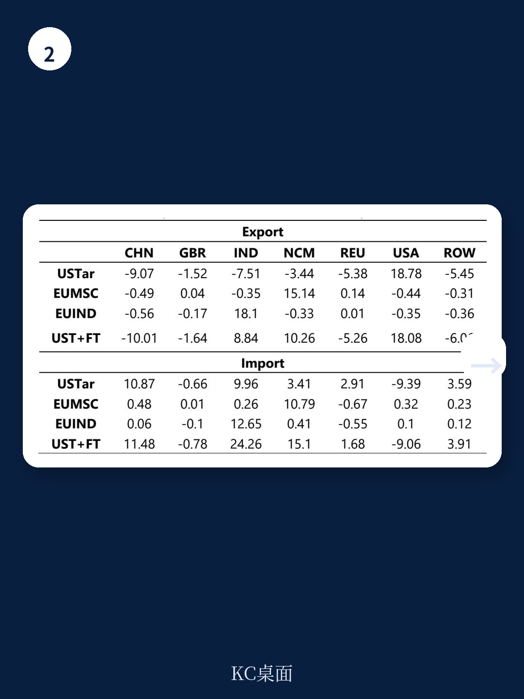

# IMF：爱尔兰的AI红利，比关税更值得关注

当全球目光聚焦于美国关税政策的反复与地缘贸易谈判的博弈时，一份来自国际货币基金组织（IMF）的最新爱尔兰国别报告，提出了一个更具结构性的判断：对爱尔兰这样的小型开放经济体而言，贸易政策调整带来的更多是贸易流向的重新分配，而真正能驱动产出和出口增长的引擎，是人工智能驱动的生产率提升。这份报告通过一个多区域、多部门的可计算一般均衡模型，量化了贸易政策、AI和能源转型三大力量对爱尔兰的长期影响。其核心结论对于理解全球知识密集型经济体的未来竞争逻辑，具有超越爱尔兰一国的启示意义。

报告直言，当前的关税和贸易协定冲击，主要效果是“重新路由”贸易伙伴和行业间的流向，对爱尔兰整体GDP和出口的宏观影响相当温和。相比之下，AI驱动的生产率提升则能带来强劲的产出和出口增长，尤其在知识密集型部门，同时也会引发显著的跨行业劳动力重新配置。而碳定价政策，则可能在AI推高能源需求和排放的背景下，成为平衡增长与脱碳目标的关键工具。

> **KC评论：** 这份报告的价值在于，它用一个统一的框架，同时考察了三个通常被分开讨论的变量。它揭示了一个关键权衡：AI带来的增长红利，可能会被其催生的能源需求部分抵消。理解这三者如何互动，比孤立地看任何一个政策都更重要。完整报告中的图表和分行业数据，清晰地展示了这种权衡的量化程度。

## 1. 贸易战对爱尔兰的冲击，远小于市场直觉

在关税与贸易协定情景下，IMF模型得出的结论可能会让一些投资者感到意外：美国在2025年底实施的关税，对爱尔兰整体经济的负面影响非常有限。报告显示，即使在最极端的组合情景（美国关税叠加欧盟与南方共同市场、欧盟与印度的自贸协定）下，爱尔兰实际GDP的增幅也低于0.20%。

这背后的机制是什么？核心在于爱尔兰出口结构的特殊性。报告指出，制药业作为爱尔兰的核心出口支柱，在全球关税调整中承受的税率增加相对较轻。这意味着，当贸易战导致其他行业的贸易成本上升时，资源会向制药这类“避风港”行业重新配置。同时，资本密集型行业在调整中相对受益，这反过来抵消了部分负面的需求效应。

因此，贸易政策对爱尔兰的真正影响，不在宏观总量的涨跌，而在微观层面的“替代效应”：出口目的地和产品组合发生显著变化，但总量保持稳定。这种“贸易转移”而非“贸易毁灭”的特征，是理解当前全球贸易格局重塑的关键。对于依赖特定市场或产品的企业而言，这种结构性变化意味着必须重新评估其供应链和客户组合的风险敞口。

## 2. AI才是真正的增长乘数，但伴随结构性阵痛

与贸易政策的温和影响形成鲜明对比，IMF模型显示，AI驱动的生产率提升是真正的增长发动机。在中等AI生产率提升情景下，爱尔兰的实际GDP和出口均能录得显著增长。而在高AI生产率提升情景下，增长效应更为强劲。

报告特别指出，AI红利在知识密集型行业表现得尤为突出。这包括金融服务、信息技术服务、专业咨询以及制药研发等高附加值领域。这些行业正是爱尔兰吸引外资和构建竞争优势的核心地带。AI的渗透，将直接强化这些行业的成本优势和产品竞争力，从而进一步巩固爱尔兰在全球价值链中的高端位置。

然而，增长的另一面是调整的痛苦。模型清晰地揭示了AI带来的“创造性破坏”：生产率提升意味着单位产出所需的劳动力减少，尤其是在那些容易被自动化替代的行业。报告显示，AI情景下会出现显著的跨行业劳动力流动，劳动力将从制造业、低端服务业等受冲击较大的部门，向金融、信息、专业服务等受益部门转移。

> **KC评论：** 这里有一个关键问题报告没有完全展开：劳动力再配置的速度和成本。模型假设劳动力可以跨行业自由流动，但现实中，一名制造业工人转型为AI算法工程师，需要巨大的技能重塑和时间成本。报告后续的ESRI联合研究（Doorley et al., 2026）专门探讨了AI与爱尔兰收入不平等的问题，这恰恰是理解AI红利能否被社会广泛分享的关键。完整报告中的分行业劳动力变动图表，是量化这种“结构性阵痛”幅度的核心材料。

## 3. AI增长与脱碳目标，存在一个尚未定价的冲突

这份报告最具洞察力的部分，在于揭示了AI增长与能源转型之间的内在张力。AI驱动的经济增长，会推高全社会的能源需求，进而增加二氧化碳排放。如果不对排放加以约束，AI带来的增长红利，可能会以牺牲气候目标为代价。

IMF的模型为此设计了一个关键的情景对比：在AI增长的同时，引入碳定价机制，将爱尔兰的排放锁定在基准水平。结果显示，这样做虽然能够有效控制排放，但也会显著压低AI带来的GDP增长。这意味着，在当前的能源结构和技术条件下，增长与脱碳之间存在一个明确的“取舍关系”。

报告进一步提出，碳定价可以作为一种有效的平衡工具。通过提高化石能源的使用成本，碳定价能够激励企业转向可再生能源和提高能源效率，从而在享受AI增长红利的同时，推动电力结构的绿色转型。模型显示，在碳定价情景下，爱尔兰的可再生能源发电占比会显著提升。

然而，报告也坦诚指出了其模型的局限性：它没有明确建模AI本身带来的额外能源需求，例如数据中心和AI模型训练的巨大电力消耗。这意味着，报告可能低估了AI对能源系统的实际冲击。如果考虑到这一“内生性”的能源需求，增长与脱碳之间的冲突可能更为尖锐。

## 4. 报告尚未回答的关键问题：AI的能源“暗面”与政策组合拳

尽管这份报告提供了一个极具价值的分析框架，但它也留下了一些关键问题，值得所有关注AI和能源转型的决策者深入思考。

首先，**AI自身的能源消耗被严重低估了。** 报告模型只捕捉了AI通过提高经济活动水平而间接带来的能源需求，但忽略了AI技术本身（如训练大型语言模型、运行数据中心）的巨大能源成本。如果将这些“直接能耗”纳入模型，AI情景下的排放增长将更为迅猛，碳定价所需的成本也将更高。这可能会改变“增长与脱碳”之间的权衡曲线，甚至让某些高AI强度的发展路径在经济上不可持续。

其次，**政策工具的组合远比单一的碳定价复杂。** 报告将碳定价作为唯一的政策工具，但现实中，爱尔兰政府正在实施包含补贴、法规、可再生能源目标在内的“气候行动计划2025”。模型没有评估这些非价格工具（如对风电、太阳能的直接支持）与碳定价的协同效应。一个更优的政策组合，或许能够在更低的成本下实现同样的减排目标。

> **KC评论：** 报告的模型是一个高度简化的“均衡状态”分析，它告诉我们终点在哪里，但没有告诉我们通往终点的路径有多颠簸。对于投资者和企业而言，理解“过渡路径”上的风险与机遇，可能比知道终局更重要。例如，碳价从当前水平上升到模型假设的水平，需要多长时间？这会如何影响不同行业的现金流和估值？这些问题的答案，需要更动态、更精细的模型来回答。

## 5. 一个可供借鉴的观察框架

对于关注全球经济和产业趋势的读者，这份报告的价值不仅在于其对爱尔兰的分析，更在于它提供了一个可复用的观察框架。当审视任何一个高度开放、依赖知识密集型产业的经济体时，都可以从以下三个维度入手：

第一，**贸易结构的“避风港”效应。** 核心出口产品在多大程度上能够规避全球关税升级？这种“避风港”地位是否可持续？它是否依赖于特定的地缘政治或技术壁垒？

第二，**AI渗透的“非对称”影响。** AI红利在哪些行业最集中？这些行业是否构成了该经济体的核心竞争优势？劳动力市场是否具备足够的弹性来应对结构性转移？

第三，**增长与碳约束的“交叉点”。** 经济增长的能源弹性有多高？可再生能源的渗透速度，能否追上AI驱动的电力需求增长？碳定价或相关政策，会以多快的速度、多大的幅度改变行业的成本曲线？

这三个维度的交叉点，往往就是未来十年最值得关注的产业机会和投资主题。爱尔兰的案例表明，未来的赢家，不是单纯拥抱AI的，也不是单纯拥抱绿色能源的，而是那些能够在一个统一的战略框架下，同时管理好贸易、技术和能源三大变量的经济体和企业。

**完整解读与原始图表**

上述分析仅触及了这份IMF报告的冰山一角。报告中还包含了分行业、分地区的详细数据表格，以及不同情景下劳动力流动、贸易流量、价格指数变化的完整图表。这些数据是进行深入定量分析和投资决策的基石。

我们每天都会由AI agent结合人工review，生成国际投行与权威机构的中文摘要与深度评论，内容涵盖宏观、策略、行业与地缘政治。每日更新约10-40页，既方便直接喂给AI模型进行二次分析，也适合人工快速把握全球市场的核心动态。加入社群，即可领取这份IMF报告的完整解读与所有原始图表，并参与我们关于AI、贸易与能源转型的深度讨论。

Personal reading notes and learning share only. Not investment advice.

