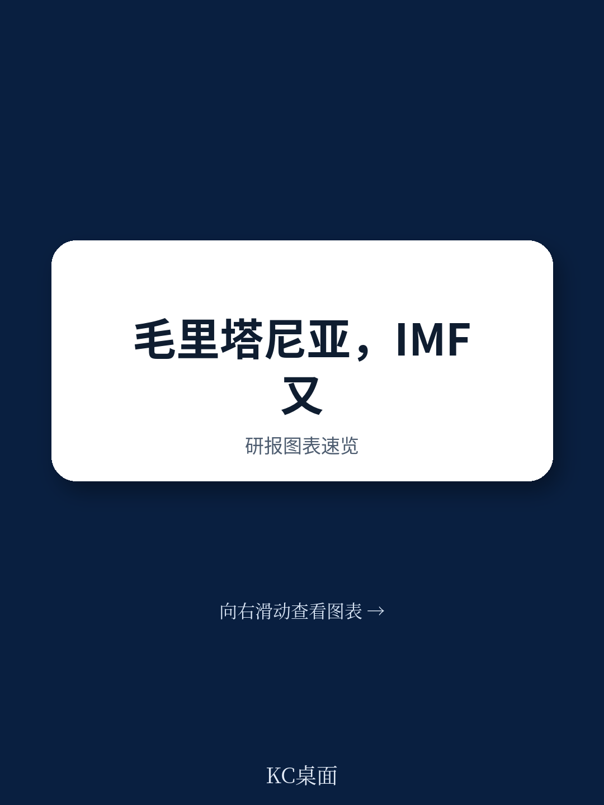
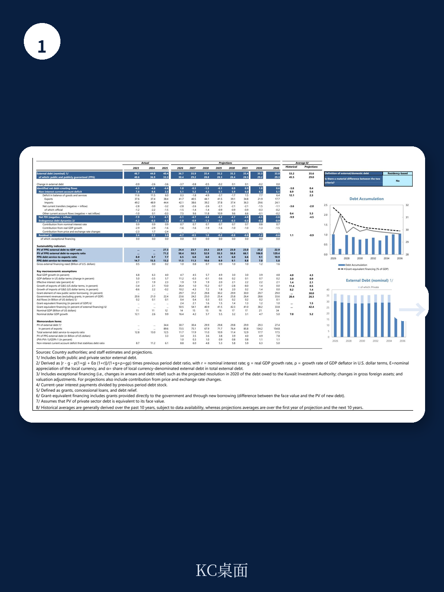
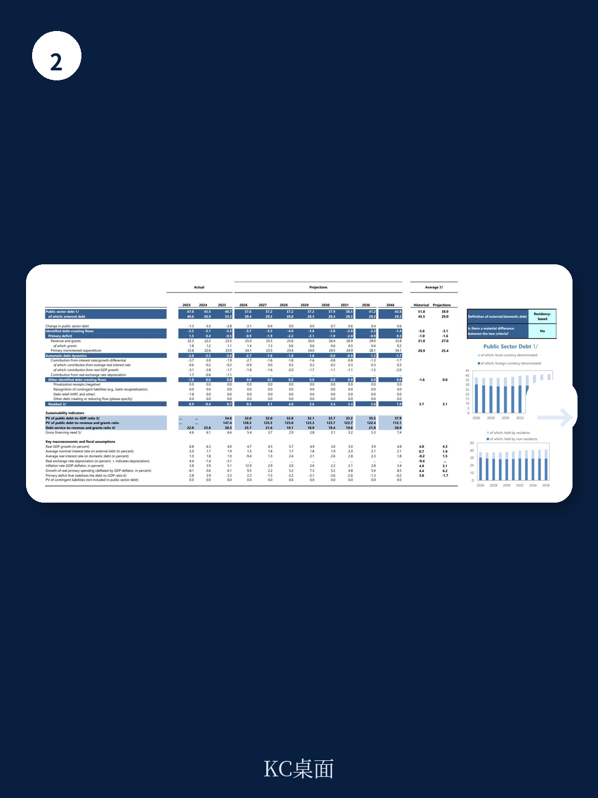

# 世界银行：毛里塔尼亚的韧性不是运气，是制度

当一个经济体在战争、边境封锁、大宗商品价格剧烈波动的夹击下，仍能保持宏观稳定、让公共债务从52%降至40%，外界往往将其归因于“资源禀赋”或“外部援助”。但世界银行与IMF联合发布的这份毛里塔尼亚最新融资安排评估报告揭示了一个更深刻的判断：这一轮韧性，核心驱动力是制度性改革，而非资源周期。

2026年6月，IMF执行董事会批准了毛里塔尼亚新一轮42个月的ECF/EFF安排，总额9580万美元。这并非简单的续贷。该机构同时完成了RSF的第五次也是最后一次审查，标志着该国在气候韧性领域的制度框架已初步成型。报告传递的核心信号是：一个长期依赖资源出口、被列为“脆弱国家”的西非经济体，正在通过财政规则法制化、社会登记系统数字化、国有企业监督透明化，构建一套能够抵御外部冲击的制度护城河。

对于关注新兴市场债务、资源型经济体转型、以及全球南方治理范式的读者而言，这份报告的真正价值不在于毛里塔尼亚本身，而在于它提供了一个“小国如何在大国博弈与气候冲击中守住底线”的可复制样本。

## 1. 这轮增长放缓揭示了一个结构性拐点：非资源部门正在接过接力棒

2025年毛里塔尼亚实际GDP增速从2024年的6.3%回落至4.0%。表面看是“减速”，但拆解数据后会发现，这恰恰是经济结构改善的证明。

放缓的直接原因在于采掘业收缩——2025年该部门预计下降0.6%，而2023年曾增长12.2%。大宗商品价格波动、GTA天然气项目相关进口下降，共同压低了资源板块的贡献。但非采掘业GDP仍保持了5.1%的增长，虽低于2024年的7.3%，却远高于疫情前水平。

真正值得关注的是：非资源部门的扩张正在逐步消化资源部门的波动性。2021年非采掘业占GDP比重尚不足70%，到2025年已接近80%。这意味着，即便铁矿石、黄金、天然气价格同时承压，经济增长的基础盘仍然稳固。世界银行报告将此归因于“持续的基础设施投资、农业现代化努力、以及服务业的扩张”——这些恰恰是过去四年制度性改革的结果，而非短期刺激。

> **KC评论：** 资源国的增长故事通常被简化为“大宗商品价格涨跌”。但毛里塔尼亚的数据表明，当非资源部门增速连续四年保持在5%左右，且与资源部门增速差持续收窄时，经济转型已进入自强化阶段。报告没有展开的是：这种结构变化的可持续性取决于私营部门投资是否真正接替了公共投资。完整报告中关于“非采掘业税收占GDP比重从11.7%升至14.7%”的细节，正是验证这一判断的关键指标。

## 2. 外部账户改善背后，是汇率弹性与外汇市场改革的真实回报

2025年毛里塔尼亚经常账户逆差从2024年的9.4%收窄至3.4%，剔除资本品进口后甚至转为1.8%的顺差。外部脆弱性显著下降。

传统分析会将其归因于LNG出口启动和黄金收入增加。但世界银行报告揭示了一个更深层的结构性变化：外汇市场改革正在改变外部失衡的调整机制。

2022-2026年期间，毛里塔尼亚央行推进了外汇市场的自由化改革，包括引入市场决定的汇率形成机制、扩大银行间外汇交易、减少央行直接干预。这些措施的直接结果是：当外部冲击发生时，汇率开始发挥“自动稳定器”作用，而非像过去那样要么死守固定汇率导致储备耗尽，要么突然贬值引发恐慌。

数据印证了这一点：2025年官方储备仍维持在21.6亿美元，相当于5.9个月的非采掘品进口覆盖，远高于IMF建议的3个月安全线。在战争导致石油进口账单上升、边境贸易走廊受阻的背景下，这一储备水平本身就证明了汇率弹性的价值。

> **KC评论：** 很多新兴市场国家在外汇改革上“知易行难”。毛里塔尼亚的经验表明，外汇市场自由化不是“放开汇率”那么简单，而是需要同步建立流动性管理工具、完善银行间市场基础设施、以及保留必要的干预空间。完整报告中有关于央行“货币政策框架现代化”的具体拆解，包括如何逐步引入利率走廊、如何管理过剩流动性——这些技术细节对理解“市场化改革如何真正落地”至关重要。

## 3. 财政规则从“承诺”到“法律”的跨越，才是债务可持续的真正保障

毛里塔尼亚公共债务占GDP比重从2021年的52.4%降至2025年的40.7%，外部公共债务占比从45.8%降至33.3%。这一降幅在非洲资源国中相当突出。

但真正让IMF与世界银行团队感到信服的，不是债务数字本身，而是2026年5月15日通过的《财政组织法》修正案。该修正案将“非采掘业基本收支平衡”作为法定财政规则写入法律，并配套了实施细则，明确了：定量目标定义、采掘收入界定标准、机构责任分工、以及触发条款、监控和纠正机制的具体规定。

这意味着，财政纪律从“政府表态”升级为“法律约束”。过去资源国常见的“价格好时扩张、价格差时崩溃”的财政周期，被制度性地切断。世界银行报告特别指出，这一规则将帮助经济“免受大宗商品价格波动影响”——这不是空洞的表述，而是基于过去四年实践经验的制度固化。

值得注意的是，2025年非采掘业基本赤字仅为GDP的3.0%，远低于2022年的7.7%。这表明财政整顿并非靠压缩资本支出实现——资本支出占比反而从2022年的11.5%升至2025年的10.2%（尽管略有波动）。真正改善的是支出效率和非资源收入动员。

## 4. 社会保护从“临时救济”到“制度响应”的跃迁，是治理能力的终极检验

报告中最具启示性的部分，或许是社会保护体系的演变。

战争导致燃料进口成本上升，毛里塔尼亚政府引入了自动燃油定价机制，但同时推出了“Tassanoud”定向补偿计划，通过Taazour机构向受能源价格冲击最严重的家庭发放现金转移。这一补偿机制并非临时起意，而是建立在已运行多年的“社会登记系统”之上——该系统覆盖了最贫困的40%人口。

更值得关注的是“Tekavoul”永久性社会安全网项目及其气候冲击响应子项目“Tekavoul Choc”。当战争导致物价上涨时，政府能够迅速通过“El Aoun”行动发放一次性紧急支持。世界银行报告评价称，这种“协调响应”已经证明了其有效性。

从治理角度看，社会登记系统的存在意味着：政府有能力识别最脆弱群体，并有渠道将资源精准送达。这看起来是技术问题，实质上是国家能力的体现。许多发展中国家在危机时无法有效分配救助资源，往往不是因为缺钱，而是因为缺乏“知道钱该给谁、怎么给”的制度基础设施。

## 5. 报告没有完全回答的关键问题：制度韧性能否跑赢外部冲击的升级速度

尽管毛里塔尼亚的改革轨迹令人印象深刻，但世界银行报告也坦承了若干尚未解决的结构性挑战。

首先是地缘政治风险。战争对毛里塔尼亚的影响不仅体现在能源价格上，还通过马里边境的贸易中断传导至通胀——2025年下半年通胀从2%回升至4.1%，部分原因正是边境通道受阻导致的供应瓶颈。这一问题没有简单的制度性解决方案。

其次是债务可持续性的“压力测试”尚未完成。当前债务下降很大程度上得益于资源收入（尤其是黄金和LNG）的增长。如果大宗商品价格出现系统性下滑，财政规则能否在不触发“逃逸条款”的情况下维持纪律，仍是一个未知数。

再次是国有企业的改革深度。世界银行报告设定了到2026年底对五大商业国企进行财务指标系统报告、到2027年底通过国有所有权战略等结构性基准。但这些措施能否真正改变国企的软预算约束，还需要时间验证。

最后是气候韧性的“制度化”程度。RSF安排已成功完成，但气候变化对毛里塔尼亚的影响是加速的。报告提到“频繁和严重的气候相关灾害创造了巨大的适应需求”，但并未给出具体的融资缺口估算。

这些未解问题，恰恰是判断毛里塔尼亚改革是否“可持续”的试金石。一个国家的制度韧性，最终取决于它能否在外部冲击升级时，不仅守住底线，还能继续推进改革。

---

毛里塔尼亚的故事，对许多正在经历“资源诅咒”与“治理困境”双重挑战的发展中经济体，提供了一个反直觉的启示：在外部环境极度不确定时，最可靠的投资不是押注大宗商品价格反弹，而是押注制度基础设施的完善。财政规则、社会登记系统、外汇市场自由化——这些看似枯燥的技术性改革，才是真正的“韧性资产”。

当然，这份报告也留下了足够的悬念：当战争持续、边境封锁加剧、气候变化加速时，这些制度能否经受住真正的压力测试？我们将在社群中持续追踪毛里塔尼亚的下一轮数据发布和改革进展，并与会员分享完整的报告原文、关键图表拆解，以及与其他资源型经济体的横向比较分析。每天，我们会通过AI agent与人工review相结合的方式，生成国际投行的中文摘要与KC评论，涵盖约10-40页的最新数据图表合集，既方便喂给AI模型，也方便人工快速把握全球市场动态。如果你对“小国治理转型”这一主题感兴趣，欢迎加入我们的讨论。

Personal reading notes and learning share only. Not investment advice.

