# The Case for Borrower-Based Macroprudential Measures in Spain

Nina Biljanovska, Laura Valderrama

SIP/2026/055

IMF Selected Issues Papers are prepared by IMF staff as background documentation for periodic consultations with member countries. It is based on the information available at the time it was completed on May 4, 2026. This paper is also published separately as IMF Country Report No 26/103.

# IMF Selected Issues Paper European Department

# The Case for Borrower-Based Macroprudential Measures in Spain\* Prepared by Nina Biljanovska and Laura Valderrama

Authorized for distribution by Romain Duval

June 2026

IMF Selected Issues Papers are prepared by IMF staff as background documentation for periodic consultations with member countries. It is based on the information available at the time it was completed on May 4, 2026. This paper is also published separately as IMF Country Report No 26/103.

ABSTRACT: House prices in Spain have risen rapidly since the pandemic, and the share of riskier mortgages at issuance has increased, suggesting a potential buildup of mortgage-related vulnerabilities. This paper provides analytical inputs to inform the potential design and calibration of borrower-based measures (BBMs), currently not activated in Spain. It first reviews international experience with BBMs, then uses Spanish loan-level data and scenario-based stress tests to assess alternative calibrations. The results suggest that loan-to-value caps would deliver the largest reduction in default risk and mortgage portfolio losses, with additional gains from income-based caps. BBMs would complement capital buffers by addressing risks at origination.

RECOMMENDED CITATION: Biljanovska, Nina and Laura Velderrama. "The Case for Borrower-Based Macroprudential Measures in Spain." IMF Selected Issues Paper (SIP/2026/055), European Department. Washington, DC: International Monetary Fund.

<table><tr><td>JEL Classification Numbers:</td><td>G21, G28, E58, E44</td></tr><tr><td>Keywords:</td><td>Mortgage lending, borrower-based measures, mortgage default risk, housing markets, Spain</td></tr><tr><td>Author&#x27;s E-Mail Address:</td><td>nbiljanovska@imf.org, LValderramaFerrando@imf.org</td></tr></table>

SELECTED ISSUES PAPERS

# The Case for Borrower-Based Macroprudential Measures in Spain

Spain

Prepared by Nina Biljanovska, Laura Valderrama $^{1}$

# THE CASE FOR BORROWER-BASED MACROPRUDENTIAL MEASURES IN SPAIN $^{1}$

House prices in Spain have grown rapidly since the COVID-19 pandemic, and while household leverage remains low by euro area standards, the share of risky mortgage loans at issuance has risen. Against this backdrop, this paper provides analytical inputs to inform the potential design and calibration of borrower-based measures (BBMs)—currently not activated as part of the Bank of Spain's toolkit—should such measures be considered. It combines a review of international experience with two complementary empirical analyses using Spanish data: a loan-level analysis assessing how lending standards at issuance affect the subsequent probability of mortgage default, and a scenario-based stress analysis quantifying how alternative BBM calibrations would affect bank mortgage portfolio losses under adverse macroeconomic conditions. Both approaches point in the same direction: a collateral-based measure, such as a loan-to-value (LTV) cap, would be associated with the largest reduction in default probabilities at origination and in portfolio losses under stress, with further gains if complemented by an income-based cap. The evidence also suggests that BBMs and existing capital-based measures—such as the ongoing phasing-in of the counter-cyclical buffer—could act as complementary instruments, addressing risk ex ante at origination and ex post through banks' loss-absorption capacity.

## A. Introduction

1. House prices in Spain have been rising over the past decade, with a sharp increase since the COVID-19 pandemic. After the major correction that followed the global financial crisis (GFC), the housing market stabilized and gradually recovered, but prices have accelerated markedly since 2020—including amid the unprecedented ECB monetary policy tightening episode (Figure 1). The post-pandemic rebound has been broad-based, with especially large price gains in large urban areas and touristic regions where supply is more rigid. While the current buoyancy does not pose immediate macro-financial risks, affordability pressures are mounting (2025 Spain Article IV Consultation), and financial vulnerabilities could build over time.

2. Notwithstanding subdued growth in household mortgage credit, the share of risky loans at issuance has been steadily increasing over the past few years. Households have continued to deleverage, extending a decade-long trend, and the stock of mortgage credit has only recently begun to rise modestly. Spain's overall household debt-to-income ratio is now well below the euro area average, reflecting healthy household balance sheets on the back of a strong labor market and prudent lending standards. Yet these aggregate indicators can mask shifts in the composition of new lending: the share of loans with loan-to-value ratios above 80 percent has risen steadily since 2023 (Figure 1), suggesting some deterioration in the risk profile of recent originations even as average leverage remained contained.

Figure 1. House Price Growth and New Mortgage Issuance  
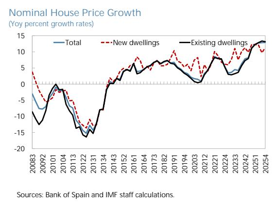

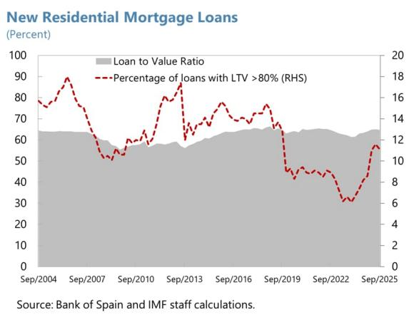

3. Despite relatively low household leverage, persistently strong house price growth and emerging signs of easing in lending standards raise the question of whether pre-emptive borrower-based measures (BBMs) are warranted, and if so, how they should be calibrated. Sustained increases in valuations may, over time, create pressure to ease bank lending standards or encourage riskier lending behavior, as historical evidence suggests (Martín and others, 2021; Duca and others, 2011; Justiniano and others, 2019). Over and above the role of micro-prudential supervision, one option to pre-empt such accumulation of vulnerabilities would be to introduce BBMs, an increasingly popular macro-prudential tool. Implementing such measures before they become strongly binding could also minimize their economic, social, and political costs, as they are unlikely to constrain credit materially and would face less public resistance if introduced early on. To date, BBMs have not been activated as part of the Bank of Spain's macroprudential toolkit, while they are in place in most other euro area countries.

4. This Selected Issues paper provides analytical inputs to inform the potential design and calibration of BBMs should such measures be considered. It draws on three complementary building blocks. First, it reviews international experience with BBMs—their objectives, benefits and costs, design features, and calibration practices across euro area peers. Second, it uses loan-level data to assess how loan-to-value (LTV), loan-to-income (LTI), and loan-service-to-income (LSTI) ratios at origination affect the probability of mortgage default in Spain, and how these effects interact with lenders' capitalization. Third, it employs a scenario-based stress analysis of the Spanish mortgage portfolio to quantify how alternative BBM calibrations could lower bank losses under an adverse macroeconomic scenario.

## B. Overview of BBMs and Complementary Macroprudential Measures

5. BBMs are regulatory limits on loan underwriting criteria. They are most often applied to residential real estate lending, directly constraining borrowers' capacity to borrow, containing the build-up of vulnerabilities, and thereby supporting the resilience of banks and the broader financial system (ECB 2025). BBMs that have been most widely used across countries, and which empirical evidence suggests have been the most effective at containing housing-related systemic risks, include:

\- LTV ratios, which cap the loan amount at a fixed share of the property's value at origination, requiring borrowers to fund the remainder through a downpayment. The borrower's equity then acts as a first-loss buffer in the event of a house price correction, lowering banks' loss given default.

\- LSTI or LTI ratios restrict borrowers' total debt service or debt stock relative to gross income. These lower the probability of default by strengthening households' ability to withstand interest rate or income shocks.

6. While not BBMs, loan maturity caps and amortization requirements are frequently applied alongside them to strengthen their effectiveness (Valderrama 2023). By limiting loan terms and ensuring steady debt repayment, they prevent circumvention of debt-service limits and promote faster equity build-up. More specifically:

\- Loan maturity limits cap the tenor of loans (e.g., 30 years for mortgages). They prevent risk build-up from excessively long loans, which lower initial payments but raise total debt and could also otherwise be used to circumvent LSTI limits (2025 France FSSA). Shorter maturities accelerate amortization and reduce default risk, all else equal.

\- Amortization requirements and interest-only restrictions impose a repayment structure. Regulators may limit interest-only mortgages or request that high-LTV loans amortize more quickly. Such measures set amortization schedules to reduce default risks.

<table><tr><td colspan="3">Table 1. Spain: Key Policies to Address Vulnerabilities in the Residential Real Estate Market</td></tr><tr><td></td><td>Policies to Contain Build-Up of Vulnerabilities</td><td>Policies to Strengthen Banks Resilience</td></tr><tr><td>Objective</td><td>Keep borrowing at sustainable levels</td><td>Build bank buffers to absorb losses</td></tr><tr><td>Tools</td><td>Borrower-based limits:- LTV, LSTI, LTIAmortization requirements:- Amortization rate, max loan maturity</td><td>Capital-based requirements:- Broad/sectoral CCyB or sectoral SyRB- Risk-weight measuresRegulatory provisions</td></tr><tr><td>Channel</td><td>Direct: Credit demandIndirect: House prices</td><td>Direct: Higher capital in good timesIndirect: Credit supply; house prices</td></tr><tr><td>Impact</td><td>Direct: Decrease the size/number of loansIndirect: Increase resilience of borrowers; save regulatory capital</td><td>Direct: Increase capital requirement in good timesIndirect: Decrease build-up of vulnerabilities (if pass-through effect); increase regulatory capital</td></tr><tr><td colspan="3">Sources: Valderrama (2023).</td></tr></table>

7. Another important complementarity to be considered is with prevailing capital-based measures. In Spain, two key measures are currently in place: the countercyclical capital buffer (CCyB), which has been set at 1 percent, effective October 2026, and the capital buffers for systemically important institutions (G-SII and O-SII), with rates ranging from 0.25 to 1.25 percent (2025 Bank of Spain). Other macroprudential tools in the capital-based toolkit—such as the Systemic Risk Buffer (SyRB) and the Sectoral CCyB—are part of the framework but not currently activated (2025 ESRB). By limiting leverage and ensuring debt serviceability at issuance, BBMs can strengthen households' balance sheets and improve banks' asset quality ex ante, complementing capital-based measures that act on the outstanding stock of exposures and improve resilience ex post.

## 8. Nearly all Euro-area

countries have adopted BBMs in some form over the last decade (Figure 2). As of 2025, 18 out of 21 banking union countries have at least one active measure (ECB 2025), and use of combined collateral-, income- and maturity-based limits has risen markedly (Table 2). This broad adoption reflects the growing consensus on the effectiveness of BBMs in safeguarding financial stability, even though less is known about their overall welfare effects. Evidence from both advanced and

Figure 2. Activation of BBMs in Euro Area Countries, 2015–25  
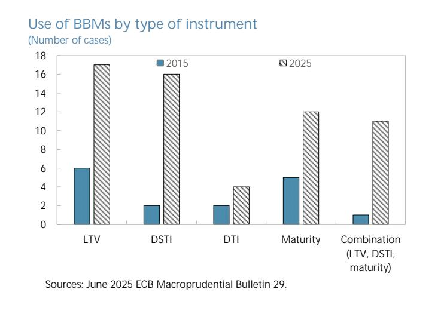

emerging economies shows that these tools have helped curb the build-up of risky mortgage lending by limiting high-LTV and high-LSTI loans, thereby strengthening household and bank resilience (e.g., Ahuja and Nabar, 2011; Kuttner and Shim, 2016; Valderrama, 2023). Recent monetary tightening episodes also suggest that countries with established borrower-based frameworks experience milder housing corrections and smaller increases in default rates (2024 IMF WEO).

9. BBMs are primarily designed for residential real estate lending, though some countries extend them to other types of credit. A few EU countries—including Romania and Slovakia—apply BBMs to consumer credit as well. Commercial real estate lending, by contrast, generally falls outside the borrower-based framework and is addressed through capital-based tools instead. The analysis in this paper focuses on BBMs for residential mortgage lending.

## C. Design and Calibration Considerations

10. Designing BBMs requires balancing their financial-stability benefits against potential costs in terms of reduced credit access for affected households and economic activity. Well-calibrated BBMs strengthen household and bank resilience by limiting excessive leverage and debt burdens, but if introduced too late or set too tightly, they can restrict credit unnecessarily and contribute to or amplify an economic downturn. Insofar as they are more binding for lower-income households, they may also entail unwanted distributive consequences in terms of access to home ownership. Effective design therefore hinges on when and how these tools are deployed, how tightly they are calibrated, what exemptions if any might be introduced, and how flexibly they adapt to evolving market conditions. The following principles—on timing, calibration, complementarity, flexibility, implementation, and coordination—capture key lessons from international experience on how to strike this balance.

11. First, timing matters: BBMs are most effective when introduced early in the financial cycle, before systemic risks accumulate. Deployed at this stage, BBMs act as a structural safeguard: imposing prudent lending standards ex ante while avoiding immediately binding constraints on credit. This logic is consistent with both theory (Bianchi, 2011) and empirical evidence (Valderrama, 2023; Biljanovska and others, 2023), which imply that preemptive activation is less distortionary and more effective than waiting until vulnerabilities are already entrenched. Introducing BBMs only after lending standards have already loosened can amplify procyclicality, as late tightening may trigger a correction in credit and housing markets.

12. Second, calibration should be data-driven and grounded in country-specific risk analysis. Common benchmarks have emerged, but with wide variation across countries. LTV limits across countries are typically set between 80 and 100 percent for first-time buyers purchasing a primary residence, and somewhat tighter for repeat buyers (70-90 percent). Income-based limits usually complement these collateral constraints, with LSTI caps ranging from 30 to 80 percent of the borrower's monthly income across countries.

13. While international benchmarks provide useful reference points, effective limits should be tailored to domestic factors. These factors include household indebtedness, income distribution, housing market dynamics, and typical underwriting standards, as well as how these may affect household and bank resilience in the future versus credit today. To this end, authorities should rely on granular, loan-level data to analyze the distributions of borrower leverage and debt-service burdens and identify thresholds where default risk rises sharply. Model-based stress testing and scenario analysis—such as those developed by Gornicka and Valderrama (2020) and applied recently to Austria and Switzerland, for example—can further help quantify how much alternative LTV or LSTI limits would strengthen households' capacity to service their debt and banks' ability to withstand potential losses under various stress scenarios.

14. Third, a multi-pronged approach can be more effective than relying on a single instrument. In particular, LTV and LSTI caps address different dimensions of risk—loss given default and likelihood of default, respectively—and are thereby mutually reinforcing. Complementary constraints, such as maturity caps or amortization requirements, can help prevent circumvention (e.g., stretching maturities to pass a LSTI test) and further reduce borrower vulnerabilities (ESRB, 2016).

Table 2. Spain: BBMs, Maturity Caps, and Capital-Based Measures across EU Banking Union Countries

<table><tr><td rowspan="2"></td><td colspan="2">LTV</td><td colspan="2">LTV exemption</td><td colspan="2">DSTI/LSTI</td><td colspan="2">DSTI/LSTI exemption</td><td colspan="2">DTI/LTI</td><td colspan="2">DTI/LTI exemption</td><td colspan="2">Maturity</td><td colspan="2">Maturity exemption</td><td>CCyB</td></tr><tr><td>FTB</td><td>SSB</td><td>FTB</td><td>SSB</td><td>FTB</td><td>SSB</td><td>FTB</td><td>SSB</td><td>FTB</td><td>SSB</td><td>FTB</td><td>SSB</td><td>FTB</td><td>SSB</td><td>FTB</td><td>SSB</td><td></td></tr><tr><td>Austria</td><td>90</td><td></td><td>20%</td><td></td><td>40</td><td></td><td>20%</td><td></td><td></td><td></td><td></td><td></td><td>35y</td><td></td><td>20%</td><td></td><td>0</td></tr><tr><td>Belgium</td><td>90</td><td></td><td>35%</td><td>20%</td><td>50</td><td></td><td>5%</td><td></td><td>9y</td><td></td><td>5%</td><td></td><td></td><td></td><td></td><td></td><td>1%</td></tr><tr><td>Bulgaria</td><td>85</td><td></td><td>5%</td><td></td><td>50</td><td></td><td>5%</td><td></td><td></td><td></td><td></td><td></td><td>30y</td><td></td><td>5%</td><td></td><td>2%</td></tr><tr><td>Cyprus</td><td>80</td><td></td><td></td><td></td><td>80</td><td></td><td></td><td></td><td></td><td></td><td></td><td></td><td></td><td></td><td></td><td></td><td>1% (1.5% from Jan 2026)</td></tr><tr><td>Germany</td><td></td><td></td><td></td><td></td><td></td><td></td><td></td><td></td><td></td><td></td><td></td><td></td><td></td><td></td><td></td><td></td><td>0.75%</td></tr><tr><td>Estonia</td><td>85</td><td></td><td>15%</td><td></td><td>50</td><td></td><td>15%</td><td>15%</td><td></td><td></td><td></td><td></td><td>30y</td><td></td><td>15%</td><td></td><td>1.5%</td></tr><tr><td>Spain</td><td></td><td></td><td></td><td></td><td></td><td></td><td></td><td></td><td></td><td></td><td></td><td></td><td></td><td></td><td></td><td></td><td>0.5% (1% from Oct. 2026)</td></tr><tr><td>Finland</td><td>95</td><td>90</td><td></td><td></td><td>60</td><td></td><td>15%</td><td></td><td></td><td></td><td></td><td></td><td>30y</td><td></td><td>10%</td><td></td><td>0%</td></tr><tr><td>France</td><td></td><td></td><td></td><td></td><td>35</td><td></td><td>20%</td><td></td><td></td><td></td><td></td><td></td><td>25y</td><td></td><td>20%</td><td></td><td>1%</td></tr><tr><td>Greece</td><td>90</td><td>80</td><td>10%</td><td></td><td>50</td><td>40</td><td>10%</td><td>20%</td><td></td><td></td><td></td><td></td><td></td><td></td><td></td><td></td><td>0.25%</td></tr><tr><td>Croatia</td><td>90</td><td></td><td>20%</td><td></td><td>45</td><td></td><td>20%</td><td></td><td></td><td></td><td></td><td></td><td>30y</td><td></td><td></td><td></td><td>1.5% (2% from Jan 2026)</td></tr><tr><td>Ireland</td><td>90</td><td></td><td>15%</td><td></td><td></td><td></td><td></td><td></td><td>4y</td><td>3.5y</td><td>15%</td><td></td><td></td><td></td><td></td><td></td><td>1.5%</td></tr><tr><td>Italy</td><td></td><td></td><td></td><td></td><td></td><td></td><td></td><td></td><td></td><td></td><td></td><td></td><td></td><td></td><td></td><td></td><td>0%</td></tr><tr><td>Lithuania</td><td>85</td><td>70</td><td></td><td></td><td>40</td><td></td><td>5%</td><td></td><td></td><td></td><td></td><td></td><td>30y</td><td></td><td></td><td></td><td>1%</td></tr><tr><td>Luxembourg</td><td>90</td><td></td><td>15%</td><td></td><td></td><td></td><td></td><td></td><td></td><td></td><td></td><td></td><td></td><td></td><td></td><td></td><td>0.50%</td></tr><tr><td>Latvia</td><td>90</td><td></td><td>10%</td><td></td><td>40</td><td></td><td>10%</td><td></td><td>6y</td><td></td><td>10%</td><td></td><td>30y</td><td></td><td>10%</td><td></td><td>1%</td></tr><tr><td>Malta</td><td>90</td><td>75</td><td>10%</td><td>20%</td><td>40</td><td></td><td></td><td></td><td></td><td></td><td></td><td></td><td>40y</td><td>25y</td><td></td><td></td><td>0%</td></tr><tr><td>Netherlands</td><td>100</td><td></td><td></td><td></td><td>30</td><td></td><td></td><td></td><td></td><td></td><td></td><td></td><td>30y</td><td></td><td></td><td></td><td>2%</td></tr><tr><td>Portugal</td><td>90</td><td></td><td>20%</td><td></td><td>50</td><td></td><td>10%</td><td>5%</td><td></td><td></td><td></td><td></td><td>40y</td><td></td><td></td><td></td><td>0% (1% in 2026)</td></tr><tr><td>Slovenia</td><td>80</td><td>70</td><td></td><td></td><td>50</td><td></td><td>3%</td><td></td><td></td><td></td><td></td><td></td><td></td><td></td><td>15%</td><td></td><td>1%</td></tr><tr><td>Slovakia</td><td>80</td><td></td><td>20%</td><td></td><td>60</td><td></td><td>5%</td><td></td><td>3-8y</td><td></td><td>5%</td><td></td><td>30y</td><td></td><td>10%</td><td></td><td>1.5%</td></tr></table>

Notes: Only housing loans are considered. Austria: loan-to-collateral (LTC) limits are considered instead of LTV. Belgium: LTV exemption rates refer to first-time buyers (FTB) and second and subsequent buyers (SSB). DSTI and DTI measures are computed as follows: 5% of DSTI>50% x LTV>90% and DTI>9 x LTV>90%. Bulgaria: the 5% exemption applies to all three limits (LTV, DSTI and maturity) simultaneously. Ireland: the LTV and loan-to-income (LTI) exemption rates refer to FTB/SSB and buy-to-let (BTL) loans. The LTV limit for BTL loans is 70%, with an exemption of up to 10%. Finland: the LTC limit is considered instead of LTV. Luxembourg: LTV for other residential real estate loans, including BTL loans, is 80%, with no exemption. Latvia: LTV limit for BTL loans is 70%. Malta: a distinction is made between category I and category II borrowers for the LTV exemption. An exemption rate of 10% applies to category I borrowers and a 20% exemption rate applies to category II borrowers. Portugal: for the DSTI exemption, 10% of loans can be granted to borrowers with a DSTI of up to 60%, while 5% of total loans can be granted to borrowers with a DSTI above 60%. Slovakia: for the LTV exemption, the LTV ratio may be up to 90% for up to 20% of new loans. Slovenia: up to 15% of consumer loans may have a maturity of up to 120 months if compliant with the DSTI cap.

## 15. Fourth, flexibility enhances implementation feasibility. Many countries have incorporated exemption quotas, so called speed limits, that allow a small share of new loans—typically 5-20 percent—to exceed caps (Table 2). This preserves banks' discretion to lend to creditworthy borrowers with atypical profiles, while keeping systemic risk contained. Others

differentiate by borrower type, offering somewhat looser terms for first-time home buyers or stricter rules for investor loans (ECB 2025). These design features have helped maintain political and social support for BBMs while ensuring they remain binding in aggregate.

16. Fifth, BBMs can also be tailored to the distribution of risks—across regions or borrower income—to target vulnerabilities more precisely. In countries where housing risks are concentrated in specific local markets, geographic differentiation has helped contain local imbalances without over-tightening credit elsewhere. For example:

\- Norway applied a stricter LTV limit and a lower speed limit in Oslo for mortgages secured by secondary dwellings from 2017 through end-2022. $^{2}$ Since January 2023, a uniform national LTV limit applies, with Oslo retaining a tighter speed limit (8 percent of new lending per quarter) than the rest of the country (10 percent).

\- New Zealand introduced tighter LTV limits and lower speed limits for Auckland investment properties in November 2015, and further tightened investor LTV restrictions nationwide in October 2016. $^{3}$ LTV restrictions have remained in force since (with adjustments and a temporary removal during COVID-19), and from July 2024 have been complemented by LTI restrictions.

\- Denmark introduced its Growth Area Guidelines for Copenhagen and Aarhus in 2016, with additional restrictions added in 2018 for borrowers with LTI above 4 and LTV above 60 percent. These borrowers face limits on the type of mortgage they can take—interest-only loans are permitted only with a 30-year fixed interest rate, and floating-rate loans must have their rate locked in for at least five years.

Other countries have differentiated BBMs across income groups, setting LSTIs in line with borrowers' repayment capacity:

\- Hungary differentiates LSTI limits by income level, with a higher cap applying above a monthly net income threshold (about EUR 2,000). Limits also vary by the loan's interest-rate fixation period, with longer fixation periods (which reduce borrowers' exposure to rate resets) qualifying for looser (i.e. higher) LSTI caps.

\- Slovenia introduced income-tiered LSTI caps in 2018, setting a 50 percent limit for borrowers earning up to twice the gross minimum wage and 67 percent for the portion of income above that threshold. Since July 2023, however, it has applied a uniform 50 percent LSTI cap irrespective of income.

Such targeted calibration differs from broad flexibility mechanisms like speed limits: rather than allowing discretionary exceptions by lenders within a national framework, it adjusts the framework itself to reflect heterogeneity in risk exposure across markets and borrower types.

17. Sixth, implementation should be gradual and well-communicated. Transparent communication that BBMs are permanent structural safeguards—not temporary interventions—helps anchor expectations and avoids procyclical dynamics. Countries such as Austria and Ireland introduced BBMs with transition periods or initially as supervisory guidance (soft limits) before moving to binding limits, giving banks time to adjust their lending practices and underwriting processes. In Portugal, on the other hand, the authorities have maintained the supervisory guidance initially introduced in 2018. Where BBMs are introduced as supervisory guidance, it is important to communicate clearly that the limits are intended as ceilings rather than targets, to avoid the perverse incentive for banks with currently conservative lending standards to loosen them up to the new regulatory threshold.

## D. Impact of Lending Standards on Mortgage Defaults in Spain

18. This section assesses how loan-level lending standards—LTV, LTI, and LSTI ratios—affect the probability of mortgage default in Spain. The analysis relies on loan-level data from the European DataWarehouse (EDW), a pan-European repository of securitized loans, restricted here to residential mortgages originated in Spain between 1999 and 2021. For each loan, the EDW reports the LTV at origination, together with a rich set of loan, borrower, and collateral characteristics, as well as performance indicators over the life of the loan. These loan-level records are then merged with two additional sources: bank-level capital ratios from Banco de España, matched to each mortgage through the identity of the originating lender; and province-level data for the 50 Spanish provinces (excluding Ceuta and Melilla), including GDP and real house prices (deflated by province-level CPI) from Sociedad de Tasación. One potential caveat is that the EDW only captures securitized loans rather than the universe of Spanish mortgage originations, which might entail a representativeness bias. However, Galán and Lamas (2025) show that securitized Spanish mortgages are broadly representative of the overall market along their key risk dimensions for the period they analyze, supporting the external validity of the results.

19. The empirical strategy follows a standard reduced-form linear probability model widely used in the loan-level mortgage default literature. $^{4}$ The baseline specification relates an indicator of default—equal to one if the borrower misses at least three consecutive monthly payments—to dummies for loans with risky lending standards at origination, a rich set of loan, borrower, and collateral controls, and high-dimensional fixed effects:

$$
D e f a u l t _ {i r b t} = \alpha + \beta^ {i} L S _ {i r b t} ^ {1} + \beta^ {2} L S _ {i r b t} ^ {j} + \beta^ {3} \big (L S _ {i r b t} ^ {1} \times L S _ {i r b t} ^ {j} \big) + \gamma X _ {i r b t} + \delta Y _ {i r b t} + \theta Z _ {i r b t} + \lambda_ {t b} + \mu_ {r t} + \epsilon_ {i t},
$$

where i, r, b, t index loans, provinces, banks, and origination quarters. $LS^{1}$ is a dummy that takes the value one for loans with LTV above 80 percent, while $LS^{j}$ is an income-based lending-standard

dummy (LTI>6 or LSTI>40 percent) used on its own or to form combinations with the collateral-based LTV dummy. $^{5}$ The controls include borrower characteristics (X: log income, job status, nationality, multiple loans), loan terms (Y: maturity, fixed versus variable rate, loan purpose, interest rate), and collateral features (Z: property type and recourse). Bank-by-origination-quarter fixed effects ( $\lambda_{tb}$ ) absorb time-varying lender heterogeneity—such as changes in screening technology or risk appetite—while province-by-origination-quarter fixed effects ( $\mu_{tr}$ ) absorb local macroeconomic and housing-market conditions at the time of origination. The model is estimated in three nested forms: (i) a single-measure specification entering each lending-standard dummy on its own; (ii) a joint specification entering LTV together with either LTI or LSTI; and (iii) a specification augmented with the interaction between the LTV dummy and the income-based (LTI or LSTI) dummy, which isolates the marginal risk of loans that simultaneously breach collateral- and income-based thresholds.

20. In a second step, the baseline model is augmented with an interaction between each lending-standard dummy and the originating bank's capital ratio at the time of issuance. This extension assesses whether lender capitalization affects the default risk associated with riskier loans, and sheds light on how borrower-based and capital-based tools interact at the point of origination—an important consideration to inform whether and how to balance the two sets of instruments in the policy mix.

Figure 3. Marginal Impact of High-Risk Loans at Issuance on the Default Probability  
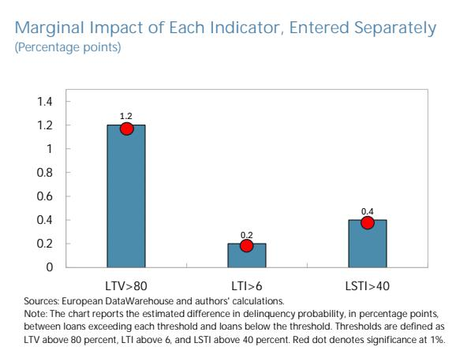  
Marginal Impact of Each indicator, Entered Jointly (Percentage points)

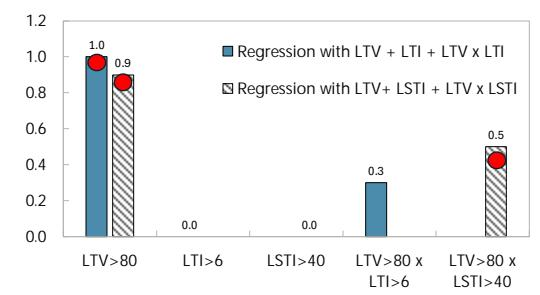  
Sources: European DataWarehouse and authors' calculations.
Note: The chart reports the estimated difference in delinquency probability, in percentage points, between loans exceeding each threshold and loans below the threshold. Thresholds are defined for LTV, LTI, and LSTI. Red dot denotes significance at 1%.

21. Loans originated with looser lending standards are significantly more likely to default, with a high-LTV ratio emerging as the dominant risk factor. In the single-measure specification, loans with LTV above 80 percent exhibit a default probability 1.2 percentage points higher than otherwise comparable loans, compared with a 0.2-0.4 percentage points higher default probability for loans with LTI above 6 or LSTI above 40 percent (Figure 3). When LTV enters jointly with either

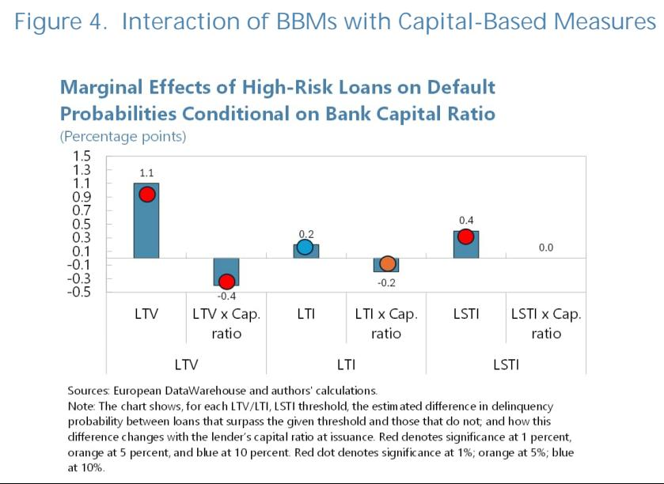

LTI or LSTI, the LTV effect remains essentially unchanged (about 1.2 percentage points and significant at the 1 percent level), while the LTI coefficient becomes statistically insignificant and the LSTI coefficient gets smaller, although it remains significant (results not shown). Once the LTV×LSTI interaction is included, the standalone LSTI coefficient loses its significance, while the interaction term with high LTV is positive, economically meaningful (about 0.5 percentage points), and statistically significant (Figure 3). These results point to an ordering of risk: collateral-based looseness is the primary driver of default, while income-based looseness matters mainly through its interaction with high-LTV lending. Finally, among income-based measures, LSTI appears to matter more than LTI.

22. Stronger lender capitalization partially mitigates—but does not eliminate—the default risk associated with high-risk mortgages. When the baseline specification is augmented with interactions between the lending-standard dummies and the originating bank's capital ratio (measured at the time of the loan issuance), high-LTV loans continue to be linked to a significantly higher default probability (about 1.1 percentage points), but the

Sources: European DataWarehouse and authors' calculations. Note: The chart shows, for each LTV/LTI, LSTI threshold, the estimated difference in delinquency probability between loans that surpass the given threshold and those that do not; and how this difference changes with the lender's capital ratio at issuance. Red denotes significance at 1 percent, orange at 5 percent, and blue at 10 percent. Red dot denotes significance at $1\%$ ; orange at $5\%$ ; blue at $10\%$ .

interaction term is negative and significant at the 1 percent level (around -0.4 percentage points), indicating that loans originated by better-capitalized lenders carry lower default risk, all else equal (Figure 4). A qualitatively similar, though weaker, attenuation effect is found for high-LTI loans, but not high-LSTI ones. These findings are consistent with a growing literature suggesting that better-capitalized banks screen and monitor borrowers more carefully—leading to lower default even for given financials—and have greater capacity to work out troubled loans, reducing realized defaults even within the high-risk segment. Two caveats are worth noting, however. First, the estimates capture the average relationship and therefore mask heterogeneity across banks. Therefore, for lenders with capital ratios below average, the mitigating effect of capital on default would be much smaller; hence riskier loan characteristics are less fully offset by capital buffers. Second, and more importantly, the attenuation effect is partial: even among well-capitalized lenders, high-LTV loans retain an economically and statistically significant default premium.

## E. Scenario-Based Calibration of Borrower-Based Measures in Spain

23. This section complements the analysis by developing a scenario-based framework to help inform the calibration of BBMs for Spain's residential mortgage market. The analysis uses confidential credit registry data on the issuance of mortgages by origination cohort (vintage) and risk bucket from the Central Risk Information Office of the Bank of Spain (CIRBE), covering Spain's €505.7 billion mortgage portfolio as of 2025Q2, representing 99.5 percent of outstanding mortgages. The resilience of this portfolio to an adverse macroeconomic scenario with versus without BBMs is assessed to evaluate the potential effectiveness of alternative tools, including LTV, DSTI, LSTI, LTI as well as a combination of them, in mitigating portfolio risk. The analysis employs a structural model of mortgage default, building on the framework developed by Górnicka and Valderrama (2020) and adapted to the characteristics of the Spanish mortgage and housing markets.

24. The portfolio is segmented into 660 loan vintage-risk buckets. There are 55 loan vintages (quarterly from 1990Q1 to 2025Q2, with pre-2012Q1 loans grouped together) crossed with 12 LTV categories. Each bucket is characterized by risk metrics (LTI and DSTI ratios), $^{6}$ the loans' repricing schedule (including six repricing buckets), and their average effective maturity. Borrower liquid financial assets—estimated at 1.15 percent of average property value based on the 2023 Household Finance and Consumption Survey (HFCS)—are incorporated into the default trigger to assess whether financially distressed borrowers can avoid default by drawing down savings. Macroeconomic variables for the baseline scenario (unemployment, household income, GDP) are drawn from the January 2026 WEO. Paths for the adverse scenario, defined as deviations from baseline, as well as baseline projections for house prices follow the 2025 EU-wide stress test assumptions.

25. The mortgage portfolio comprises a significant share of loans originated during the run-up to the GFC as well as the post-pandemic period since 2020. This distribution reflects Spain's housing market cycles, with the earlier cohort representing legacy exposures from the pre-crisis boom (20 percent of outstanding loans were originated between 2004-2008) and the more recent vintages capturing the acceleration in lending activity following COVID-19 (about half of outstanding loans were issued after 2020). Mortgages are predominantly issued at floating rates, though the share of fixed-rate loans has increased following the 2022 ECB monetary hiking cycle. $^{7}$

26. Borrower leverage and debt service burdens in new originations have risen in recent years (Figure 5). Although households have deleveraged on average since the pandemic—with the average LTI ratio for mortgage loans peaking at 4.9 in 2020Q2 and declining to 4.2 by 2025Q2—the fraction of high-risk new mortgages has risen. The share of loans with LTI ratios above 4 fell from 58.6 percent in 2021Q4 to 43.7 percent in 2024Q1 but has since increased to over 50 percent in 2025Q2. In 2025Q2—the latest available quarter for this paper, one-third of new issuances had a ratio above 5—high by international standards, where a common LTI cap is 4.5. Likewise, the DSTI of high-risk mortgages (those with an LTV ratio above 80 percent) rose from 32.2 to 34.7 percent between 2018 and 2025Q2, and average DSTI ratios across all mortgages also rose from 30 to 33 percent over the same period. LTV ratios had declined steadily over the previous decade up to 2023. The average LTV ratio fell from about 80 percent in 2012 to 64 percent in 2023, and the share of high-LTV originations (above 80 percent) declined from over 40 percent to just 9 percent. However, this trend has reversed during the past two years: By 2025Q2, the average LTV ratio had risen to 68 percent, and high-LTV originations had increased to 16 percent.

## Figure 5. Characteristics of Spanish Mortgage Portfolio by Vintage

Legacy exposures remain significant, with a material portion of outstanding loans that were originated during the 2005–06 housing boom.

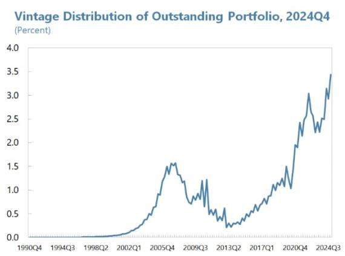  
Mortgages have historically been predominantly issued at floating rates, although the share of fixed-rate loans has increased following the 2022 ECB hiking cycle.

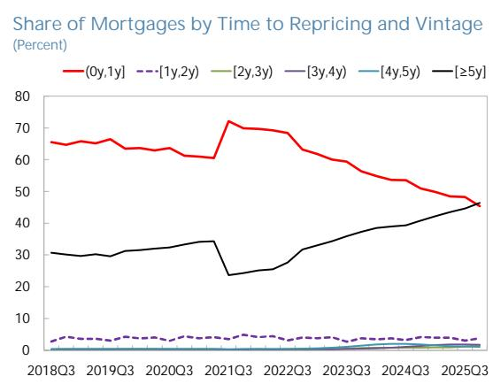  
High-risk lending has risen, with recent increases in both high-LTV...

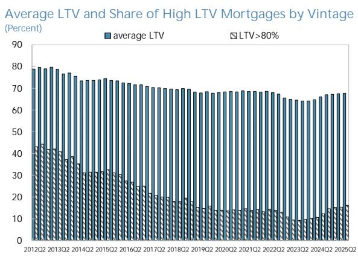  
...and high-LTI mortgage segments.

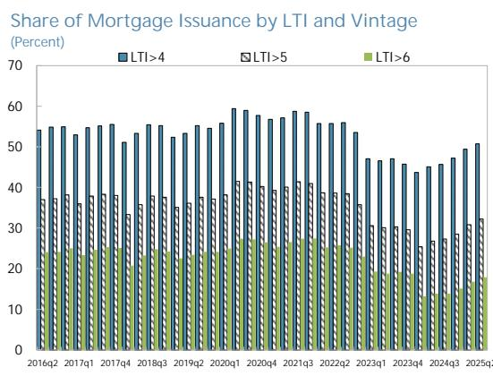

Figure 5. Characteristics of Spanish Mortgage Portfolio by Vintage (Concluded)

Borrowers' repayment capacity has weakened since 2018...

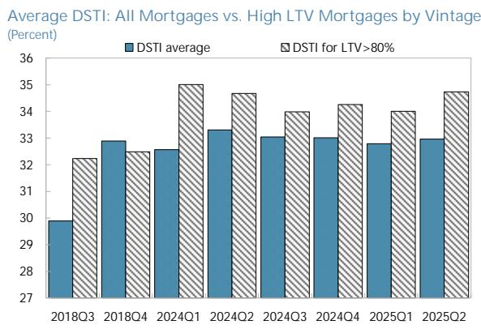  
Sources: Bank of Spain and IMF staff calculations.  
... and this deterioration is evident even among high-LTV borrowers.

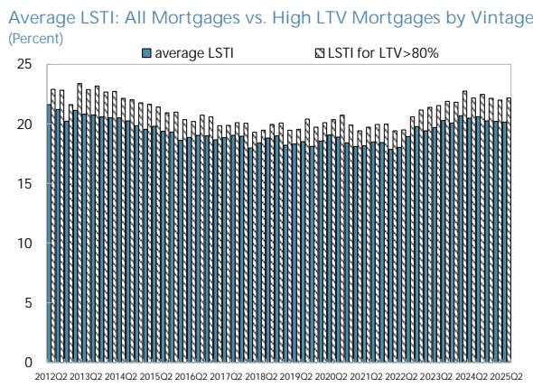

27. The deterioration in lending standards over the past two years may heighten financial stability risks. For a similar mortgage contract, recent vintages are more likely to exhibit pockets of vulnerability, as borrowers originating loans in recent years have repaid less principal and accumulated smaller housing equity buffers. As a result, they are more vulnerable to rising interest rates and declining house prices than earlier cohorts.

28. The model uses a "double trigger" approach to default in estimating a loss event. Mortgage default is assumed to occur when a borrower experiences both (i) financial distress, i.e. an inability to service a loan (a liquidity shock), and (ii) economic default, which happens when they hold negative home equity (i.e., the mortgage is "underwater," with the property value below the outstanding loan value). In this situation, the borrower is unable to meet mortgage payments and cannot sell the property to avoid foreclosure, triggering default. $^{8}$

29. Debt servicing costs and income shocks increase financial distress. Equation (1) determines the probability of financial distress—defined as an event in which borrowers in a given vintage-risk bucket are unable to service the loan on time due to liquidity constraints. Financial distress is modeled as a function of affordability risk (DSTI ratio and its change), labor market conditions (unemployment level and change), and demographic factors (D):

$$
\operatorname * {P r} \left(F D _ {i, t}\right) = \Phi \left(D S T I _ {i, t}\right) \cdot D _ {i} + \beta_ {1} \cdot \varDelta D S T I _ {i, t} ^ {\gamma} + \Phi \left(D S T I _ {i, t}\right) \cdot \left(\beta_ {2} \cdot U _ {t} + \beta_ {3} \cdot \varDelta U _ {t} ^ {\alpha}\right)\tag{1}
$$

where i, t identify the vintage-risk buckets, $\Phi(\cdot)$ is a non-linear function, sharply increasing in $DSTI_{i,t}$ ; $D_{i}, \alpha, \beta_{1}, \beta_{2}, \beta_{3}, \gamma$ are parameters set to match the probability of financial distress observed in the data. $U_{t}$ denotes the national-level unemployment rate. Mitigating actions—such as loan restructuring, borrowing from family members, or reductions in non-essential consumption—are implicitly captured in the calibration of the parameters of this financial distress equation.

30. If there is financial distress and the value of the collateral net of disposable costs is less than the value of the loan, the borrower is considered to default. Equation (2) defines the probability of economic default—which occurs when the house sale price net of transaction costs cannot cover the loans' net present value in a given vintage-risk bucket, which includes the outstanding balance plus prepayment penalties for fixed-rate mortgages:

$$
E D _ {i, t} = \left\{ \begin{array}{l l} 1 & i f \widetilde {P _ {\iota , t}} - C + F i n W e a l t h _ {\iota , t} <   \widetilde {N P V (L _ {\iota , t} , r _ {t} ^ {t y p e , M} , r _ {t} ^ {f} , T _ {t , s} | F D _ {\iota , t})} \\ 0 & O t h e r w i s e \end{array} \right.\tag{2}
$$

where $P_{i,t}$ is the market property value, C is the transaction cost of selling the property, assumed to be constant, $FinWealth_{i,t}$ is the liquid financial assets—estimated from the 2023 HFCS as 1.15 percent of average property value. $^{9}$ The net present value of the loan, NPV, consists of two elements: (i) the outstanding loan amount $L_{i,t}$ , and (ii) the penalty for early prepayment which is estimated as the discounted value of foregone interest payments $^{10}$ , which increase with the mortgage rate locked-in at the time of default $r_{t}^{type,M}$ (which depends on the type of mortgage and the resetting price schedule of the loan), and its remaining maturity ( $T_{t,s} - s$ ) for a loan issued at time s. $^{11}$ The average mortgage rate as of 2025Q2 $r_{t}^{f}$ is used to discount the amount of future interest payments. If the borrower can afford to service the loan, default will not occur even if there is negative home equity. If the borrower cannot service the loan but the house is worth more than the loan value, default is not assumed to occur either, as the borrower will refinance the loan posting additional collateral, or sell the house to repay the loan to avoid foreclosure.

31. The model is calibrated using historical crisis episodes and validated by its ability to replicate observed default rates in Spain. Parameters calibration follows Harrison and Mathew (2008), drawing on the Spanish 2013-14 real estate crisis to capture unemployment and interest rate sensitivities in the financial distress equation, the 1990s UK real estate crisis to estimate the

sensitivity of financial distress to the initial DSTI ratio, and the Spanish internal-rating based (IRB) banks' 2024Q4 reported default rates for demographic factors. $^{12}$ Calibrated on this basis, the model

successfully replicates Spanish IRB banks' reported default risk under both baseline conditions and the adverse environment observed during the 2014 real estate crisis (Figure 6).

32. Before conducting stress-test scenario analysis, risk characteristics for each vintage-risk bucket are updated from origination to point-in-time up to 2025Q2. For each bucket, the model calculates: (i) the outstanding loan amount after amortization; (ii) the current property value using the average cumulative house price growth in Spain; (iii) borrower income updated with cumulative wage growth proxied by the average household disposable income; and (iv) the current interest rate reflecting the bucket's repricing schedule and mortgage type

Figure 6. Model Validation  
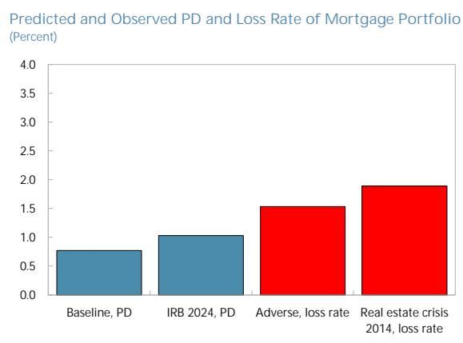  
Note: The average PD over the 3-year baseline scenario is compared against the PD reported by IRB Spanish banks in 2024Q4 (1-year ahead PD). The average loss rate over the 3-year adverse scenario is compared against the peak loss rate observed during the 2014 Spanish real estate crisis.

composition. $^{13}$ These inputs generate point-in-time LTV, LTI, and LSTI ratios for each bucket. The stress scenario is then applied to these point-in-time estimates, ensuring that the analysis reflects the portfolio's actual risk profile as of 2025Q2.

33. The model simulations assume a baseline and an adverse scenario. The baseline scenario follows the IMF's January 2026 WEO projections. To assess banking sector resilience to a house price correction, we construct a three-year adverse scenario (2027Q2-2030Q2) combining an inflationary shock $^{14}$ with a domestic recession, based on the 2025 EU-wide stress test exercise for Spain. Key assumptions include: house prices falling 17.2 percent cumulatively (with stochastic variation allowing fluctuations of $\pm$ 15 percent to capture idiosyncratic property-level risk); unemployment

rising 5.6 percentage points; mortgage rates widening by an average of 160 basis points (varying by mortgage type and repricing schedule); and household disposable income remaining broadly flat in nominal terms.

<table><tr><td colspan="3">Table 3. Spain: Stress Test Scenario (2028-2030): Key Macrofinancial Variables</td></tr><tr><td>Variable</td><td>Baseline</td><td>Adverse</td></tr><tr><td>Household disposable income</td><td>YoY growth = 12.9%</td><td>YoY growth = 0%</td></tr><tr><td>Real estate price</td><td>N [0, standard deviation = 15%]</td><td>N [-17.2%, standard deviation = 15%]</td></tr><tr><td>Unemployment</td><td>-0.1 ppts</td><td>5.6 ppts</td></tr><tr><td>Benchmark rate</td><td>0.19 ppts</td><td>1.62 ppts</td></tr><tr><td colspan="3">Note: The scenario produces annual projections of key macro-financial variables over a three-year horizon (2028–2030). The table reports cumulative shocks. During the two preceding years (2026–2027), the economy follows the WEO baseline projections as of January 2026. The adverse projections are based on the inflationary-recession scenario used in the EU-wide stress test exercise for Spain conducted in 2025, with deviations from baseline applied to the IMF WEO forecasts.</td></tr></table>

34. To calculate the probability of default (PD) and loss given default (LGD) under each scenario (baseline and adverse), we conduct Monte Carlo simulations over the 660 vintage-risk buckets (12 LTV categories crossed with 55 quarterly vintages). The simulation proceeds in three steps for each bucket:

\- First, we compute the probability of financial distress for each bucket using equation (1), which yields a value between 0 and 1, representing the share of borrowers in that bucket who are in financial distress under the scenario's macroeconomic conditions.

\- Second, conditional on financial distress, we simulate economic default outcomes for that bucket. All loan characteristics in equation (2)—outstanding loan amount, interest rate, remaining maturity, transaction costs, and liquid financial assets—are LTI-LTV bucket-level averages. To account for loan level heterogeneity, we draw N=10,000 house prices for each LTV-vintage bucket from a distribution centered on the scenario's house price path to capture property-level variation. For each draw, equation (2) produces a binary outcome: 1 if that house price results in economic default (sale proceeds cannot cover the loan), 0 otherwise.

\- Third, we calculate the bucket's PD using these $N$ binary outcomes:

$$
P D _ {i, t} = \frac {\sum_ {n = 1} ^ {N} E D _ {i , t}}{N} \times \operatorname * {P r} \bigl (F D _ {i, t} \bigr)\tag{3}
$$

where the numerator of the first term is an indicator function equal to 1 if equation (2) equals 1 and $\Pr(FD_{i,t})$ is the (scalar, continuous) probability of financial distress (from equation 1), $PD_{i,t}$ is then the bucket's probability of default. The bucket-specific LGD is computed as the average of LGDs

among defaulted loans shown in equation (4). To ensure stability of the simulation results, this process is repeated 1,000 times for each LTV-vintage bucket. $^{15}$

Figure 7. Stress Test Results

Annualized loss rates in the outstanding portfolio could rise from about 30 bps under the baseline to 150 bps in the adverse scenario...

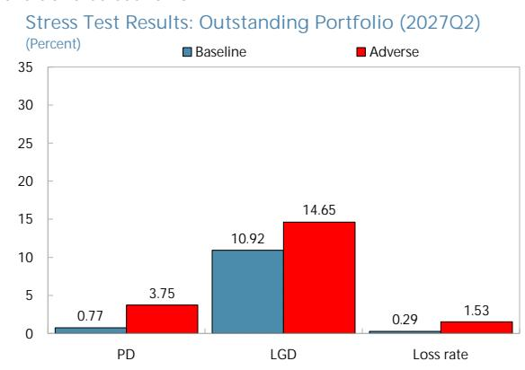  
....with the most recent vintages appearing particularly vulnerable—loss rates for these cohorts could surge to around 520 bps.

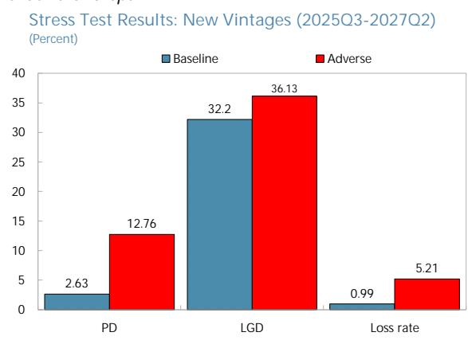  
Note: Credit risk projections are Point-in-Time. Therefore, they reflect cyclical conditions and affect bank capital through loan loss provisions.

35. Loss given default (LGD) is then calculated as the difference between the defaulting loan's net present value and the discounted recovery value from selling the repossessed property:

$$
L G D _ {i, t} = N P V \big (L _ {i, t}, r _ {t} ^ {t y p e, M}, r _ {t} ^ {f}, T _ {t, s} \big) - (1 - \delta) \times \frac {\widetilde {P _ {\iota , t + n}}}{\left(1 + r _ {t} ^ {f} + s p r e a d\right) ^ {n}}\tag{4}
$$

where the first term denotes the outstanding debt and the second term the recovery value; $\delta$ denotes the foreclosure discount at which the bank sells the property at time $t + n$ , where n is the average time needed to sell off the collateral (6.17 years in Spain, based on estimates from the Bank of Spain for 2022-2024 $^{16}$ ), and spread is the risk-adjusted spread used to discount the value of the risky asset. The portfolio-wide PD, LGD, and loss rates are calculated by aggregating bucket-specific results weighted by each bucket's outstanding share of the total portfolio in 2025Q2.

36. While Spanish banks appear broadly resilient to severe macroeconomic shocks, a pronounced real estate downturn could pose material risks to macrofinancial stability. Under the adverse scenario, annualized mortgage loss rates for the overall portfolio rise from 30 basis points in the baseline to 150 basis points, resulting in cumulative losses of roughly 4.6 percent of the total mortgage portfolio—about €23 billion over the three-year horizon (Figure 7).

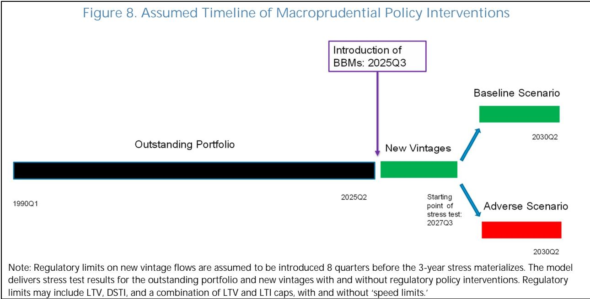

37. Losses are heavily concentrated in recent vintages, underscoring the importance of acting pre-emptively—before lending standards further loosen significantly—to mitigate risks to the mortgage portfolio. Mortgages originated during 2025Q3-2027Q2 would face loss rates of 520 basis points—nearly 3.5 times the portfolio average—as these borrowers have accumulated smaller equity buffers and remain highly exposed to rising interest rates and falling house prices. At the same time, under stress, banks' credit losses are primarily concentrated in non-collateralized retail and corporate loans rather than residential mortgages. As a result, the 1 percent countercyclical capital buffer (CCyB), scheduled for October 2026 and estimated at around EUR 16 billion, would mainly help absorb non-mortgage losses. Against this backdrop, the projected EUR 23 billion in gross mortgage losses (i.e. before netting out credit provisions) is significant—particularly if losses were to be unevenly distributed across banks. In such a scenario, affected banks would likely curtail lending, amplifying stress through negative feedback loops.

38. Introducing borrower-based measures—particularly collateral-based ones—targeting new loan originations could materially reduce these risks. The analysis shows that well-calibrated borrower-based measures could reduce portfolio losses under severe stress by up to 25 percent after two years of implementation—equivalent to roughly €6 billion (Figure 9). An LTV cap of 80 percent—either as a hard limit or combined with an LTI limit of 5 under a speed-limit framework $^{17}$ —is found to be most effective, while DSTI caps calibrated at standard ratios (30 or 40 percent) yield minimal benefits as system-wide average DSTI

Figure 9. Impact of BBM limits in the Adverse Scenario  
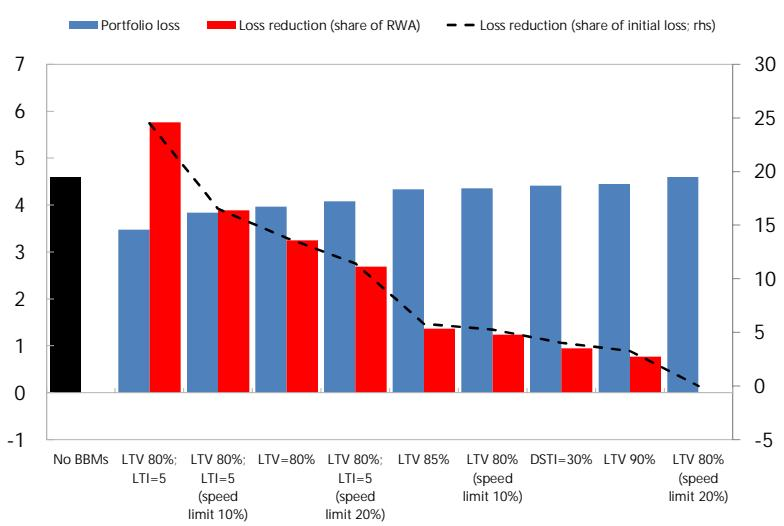  
Note: Regulatory limits on new vintage flows are introduced 8 quarters before the 3-year stress test horizon materializes. The model delivers stress test results for the outstanding portfolio with and without regulatory policy interventions. Regulatory limits include LTV (with and without speed limits), DSTI, and a combination of LTV and LTI caps (with and without speed limits).

ratios already fall well below tested thresholds. $^{18}$ Looser LTV thresholds also deliver substantially smaller gains: an 85 percent cap would reduce adverse-scenario losses by only about 6 percent relative to the no-BBM baseline, reflecting the fact that new mortgages originated with LTVs at or above 85 percent have averaged only around 7.7 percent of issuance over the past three years, and a 90 percent cap would be almost non-binding.

39. The estimated gain from BBMs should be interpreted as a lower bound. First, the benefits from collateral-based measures are based on LTV ratios rather than loan-to-price (LTP) ratios. Calibration using LTP ratios—which capture the actual purchase price rather than the appraised value—would likely yield larger resilience gains for a given level of the chosen ratio (e.g., 80 percent). Second, the CIRBE data used in this analysis cover only mortgages secured on households' main residences. Extending the analysis to second homes and buy-to-let mortgages, where risks are typically higher, could further strengthen the estimated benefits of borrower-based measures.

## F. Conclusion

40. The analyses in this paper provide data-driven inputs for the design and calibration of potential BBMs in Spain. Spain's mortgage market does not currently display acute imbalances, average household leverage remains low, and bank balance sheets are solid. At the same time, banks' mortgage portfolio displays a gradual accumulation of risk in recent vintages—rising high-LTV shares, higher LTI ratios, and smaller equity buffers among post-2020 borrowers—that would translate into material portfolio losses under a severe housing correction, particularly among the most recent cohorts.

41. If BBMs were to be introduced, the evidence supports anchoring the framework on a collateral-based cap (such as LTV or LTP), possibly complemented by an LSTI cap. The loan-level analysis identifies collateral-based looseness as the primary driver of mortgage default in Spain, while income-based looseness matters essentially through its interaction with high-LTV lending. The scenario-based analysis points in the same direction: an LTV cap of around 80 percent—whether as a hard limit or combined with an LTI limit under a speed-limit framework—is found to deliver the largest reduction in adverse-scenario losses, while a standalone LSTI cap calibrated at standard international thresholds would add little given that average LSTI ratios in Spain already fall well below those levels. From a calibration standpoint, this supports anchoring the BBM framework on a collateral-based cap, with a LSTI limit acting as a complement that targets the particularly risky segment of loans that are simultaneously highly leveraged and exhibit stretched debt-service burdens.

42. Three further considerations would shape implementation. First, BBMs and capital-based measures should be viewed as complements rather than alternatives: both impose economic costs, so the relevant question is how to balance these costs to achieve a given level of banking system resilience. The Spanish evidence that stronger lender capitalization only partially offsets the default risk embedded in high-LTV loans suggests that capital buffers alone cannot substitute for addressing risk at origination. Second, introducing BBMs pre-emptively—before they become binding—would minimize their economic and social cost, as they would not materially constrain current credit conditions while helping prevent a possible deterioration, and would likely face less public resistance compared to introducing them in more binding form after a further loosening in lending standards. Third, and importantly to ease the trade-off between strengthening banking system resilience and maintaining home ownership access inherent to BBMs, flexibility features such as speed limits and differentiation by borrower type could help mitigate distributive concerns, while a gradual, well-communicated implementation path would further ease the transition.

## References

Ahuja, A., and M. Nabar. 2011. "Safeguarding Banks and Containing Property Booms: Cross-Country Evidence on Macroprudential Policies and Lessons from Hong Kong SAR." IMF Working Paper 11/284. International Monetary Fund, Washington, DC.

Bank of Slovenia. 2019. "Macroprudential Measures for Housing Loans." Bank of Slovenia, Ljubljana. Bianchi, J. 2011. "Overborrowing and Systemic Externalities in the Business Cycle." American Economic Review 101 (7): 3400–3426.

Danish Financial Supervisory Authority (DFSA). 2016. "Growth Area Guidelines." DFSA, Copenhagen. Demyanyk, Y., and O. Van Hemert. 2011. "Understanding the Subprime Mortgage Crisis." Review of Financial Studies 24 (6): 1848–1880.

Duca, J., J. Muellbauer, and A. Murphy. 2011. "House Prices and Credit Constraints: Making Sense of the U.S. Experience." Economic Journal 121 (552): 533–551.

European Central Bank (ECB). 2025. "Macroprudential Measures Database and Overview of National Frameworks." ECB, Frankfurt am Main.

European Systemic Risk Board (ESRB). 2016. "Macroprudential Policy Beyond Banking: Protecting the Whole Financial System." ESRB, Frankfurt am Main.

Galán, J. E., and M. Lamas. 2025. "Beyond the LTV Ratio: Lending Standards, Regulatory Arbitrage, and Mortgage Default." Journal of Money, Credit and Banking 57: 107–150.

Górnicka, L., and L. Valderrama. 2020. "Mortgage Market Designs: Implications for House Price Dynamics and Financial Stability." IMF Working Paper 20/113. International Monetary Fund, Washington, DC.

Harrison, I., and C. Mathew. 2008. "A structural approach to the understanding and measurement of residential mortgage lending risk." Reserve Bank of New Zealand.

International Monetary Fund (IMF). 2024. World Economic Outlook. IMF, Washington, DC.

International Monetary Fund (IMF). 2025a. "France: Financial Sector Stability Assessment." IMF Country Report. International Monetary Fund, Washington, DC.

International Monetary Fund (IMF). 2025b. "Spain: 2025 Article IV Consultation—Staff Report." IMF Country Report. International Monetary Fund, Washington, DC.

Jiménez, G., S. Ongena, J.-L. Peydró, and J. Saurina. 2012. "Credit Supply and Monetary Policy: Identifying the Bank Balance-Sheet Channel with Loan Applications." American Economic Review 102 (5): 2301–2326.

Justiniano, A., G. Primiceri, and A. Tambalotti. 2019. "Credit Supply and the Housing Boom." Journal of Political Economy 127 (3): 1317–1350.

Kuttner, K. N., and I. Shim. 2016. "Can Non-Interest Rate Policies Stabilize Housing Markets? Evidence from a Panel of 57 Economies." Journal of Financial Stability 26: 31–44.

Magyar Nemzeti Bank (MNB). 2023. "Macroprudential Measures and Lending Limits in Hungary." MNB, Budapest.

Martín, P., E. Moral-Benito, and T. Schmitz. 2021. "The Financial Transmission of Housing Booms: Evidence from Spain." American Economic Review 111 (12): 3870–3904.

Norges Bank. 2022. "Regulation on Requirements for New Residential Mortgage Loans (Mortgage Regulation)." Norges Bank, Oslo.

Reserve Bank of New Zealand (RBNZ). 2016. "Loan-to-Value Ratio (LVR) Restrictions and Housing Market Developments." RBNZ, Wellington.

Valderrama, L. 2023. "Macroprudential Policy and Housing Market Vulnerabilities in Europe." IMF Working Paper 23/88. International Monetary Fund, Washington, DC.

Annex I. Full Regression Results for the Loan-Level Analysis

<table><tr><td colspan="8">Annex I. Table 1. Spain: Effects of High-Risk Loans on Mortgage Defaults</td></tr><tr><td></td><td>(1)</td><td>(2)</td><td>(3)</td><td>(4)</td><td>(5)</td><td>(6)</td><td>(7)</td></tr><tr><td>LTV&gt;80%</td><td>0.0117***(0.0019)</td><td></td><td></td><td>0.0116***(0.0019)</td><td>0.0115***(0.0020)</td><td>0.0100***(0.0016)</td><td>0.0093***(0.0017)</td></tr><tr><td>LTI&gt;6</td><td></td><td>0.0025***(0.0009)</td><td></td><td>0.0012(0.0008)</td><td></td><td>0.0000(0.0010)</td><td></td></tr><tr><td>LSTI&gt;40%</td><td></td><td></td><td>0.0037***(0.0010)</td><td></td><td>0.0026**(0.0010)</td><td></td><td>0.0003(0.0010)</td></tr><tr><td>LTV&gt;80% # LTI&gt;6</td><td></td><td></td><td></td><td></td><td></td><td>0.0030(0.0019)</td><td></td></tr><tr><td>LTV&gt;80% #LSTI&gt;40%</td><td></td><td></td><td></td><td></td><td></td><td></td><td>0.0054***(0.0020)</td></tr><tr><td>Observations</td><td>1015509</td><td>1030201</td><td>1012602</td><td>1015509</td><td>993698</td><td>1015509</td><td>993698</td></tr><tr><td>R-squared</td><td>0.0453</td><td>0.0448</td><td>0.0435</td><td>0.0454</td><td>0.0441</td><td>0.0454</td><td>0.0441</td></tr><tr><td>Time-Bank FE</td><td>Yes</td><td>Yes</td><td>Yes</td><td>Yes</td><td>Yes</td><td>Yes</td><td>Yes</td></tr><tr><td>Time-Province FE</td><td>Yes</td><td>Yes</td><td>Yes</td><td>Yes</td><td>Yes</td><td>Yes</td><td>Yes</td></tr></table>

Annex I. Table 2. Spain: Effects of High-Risk Loans on Mortgage Defaults Contingent on Lenders' Capital Ratio

<table><tr><td></td><td>(1)</td><td>(2)</td><td>(3)</td></tr><tr><td>LTV&gt;80%</td><td>0.0106***(0.0018)</td><td></td><td></td></tr><tr><td>LTI&gt;6</td><td></td><td>0.0023*(0.0013)</td><td></td></tr><tr><td>LSTI&gt;40%</td><td></td><td></td><td>0.0042***(0.0014)</td></tr><tr><td>LTV&gt;80% # RWA Capital Ratio</td><td>-0.0039***(0.0012)</td><td></td><td></td></tr><tr><td>LTI&gt;6 # RWA Capital Ratio</td><td></td><td>-0.0018**(0.0007)</td><td></td></tr><tr><td>LSTI&gt;40% # RWA Capital Ratio</td><td></td><td></td><td>0.0004(0.0011)</td></tr><tr><td>LTV&gt;80% # LTI&gt;6</td><td></td><td></td><td></td></tr><tr><td>LTV&gt;80% # LSTI&gt;40%</td><td></td><td></td><td></td></tr><tr><td>Observations</td><td>463933</td><td>470862</td><td>462178</td></tr><tr><td>R-squared</td><td>0.0451</td><td>0.0445</td><td>0.0433</td></tr><tr><td>Time-Bank FE</td><td>Yes</td><td>Yes</td><td>Yes</td></tr><tr><td>Time-Province FE</td><td>Yes</td><td>Yes</td><td>Yes</td></tr></table>

Notes: The dependent variable is mortgage delinquency. Lending standards are included as indicator variables equal to one when the loan exceeds the following thresholds: LTV > 80%, LTI > 6 and LSTI>40. The risk weighted assets (RWA) capital ratio is winsorized at the 1st and 99th percentiles and standardized. Regressions include bank-by-time and province-by-time fixed effects. Robust standard errors are reported in parentheses. \*\*\*, \*\*, \* denotes coefficients statistically different from 0 at 1%, 5% and 10% levels, respectively.

## Annex II. Scenario-Based Default Model Calibration

<table><tr><td>Parameter</td><td>Value</td></tr><tr><td>Calibrate sensitivity of FD to shifts in DSTI</td><td> $\beta_1 = 0.0016$   $\gamma = 2.5$ </td></tr><tr><td>Calibrate sensitivity of FD to initial DSTI by bucket</td><td> $\phi(DSTI) = \begin{cases} \left( \frac{DSTI - 15\%}{30\% - 15\%} \right) & 15\% < DSTI < 30\% \\ 1 & \text{otherwise} \end{cases}$ </td></tr><tr><td>Calibrate sensitivity of FD to unemployment</td><td> $\beta_2 = 0.06$   $\beta_3 = 0.727$   $\alpha = 1$ </td></tr><tr><td>Allocate financial distress to shocks during the Spanish real estate crisis 2013-14</td><td> $\xi_{FD,u} = \frac{\partial FD}{\partial u} = 17.6\%$   $\xi_{FD,i} = \frac{\partial FD}{\partial i} = 14.8\%$ </td></tr><tr><td>Estimate sensitivity to demographic factors</td><td> $D = 0.02$ </td></tr><tr><td>Estimate foreclosure transaction costs</td><td> $C = 3.65\%$ </td></tr><tr><td>Estimate liquid financial assets as a share of average residential real estate price</td><td> $1.15\% \cdot \tilde{P}$ </td></tr></table>

<table><tr><td>Parameter</td><td>Value</td></tr><tr><td>Foreclosure discount</td><td>27.26%</td></tr><tr><td>Time to sell collateral after foreclosure</td><td>6.17 year</td></tr><tr><td>Discount rate of real estate collateral</td><td>2.7%</td></tr><tr><td>Spread on discount rate on foreclosed collateral</td><td>1.0%</td></tr></table>

## Annex III. Macrofinancial Variables Path Assumptions

Annex III. Table 1 reports the time paths of the key macrofinancial variables used in the scenario-based analysis—unemployment, interest rates (weighted average of fixed/floating mortgages across all maturities whose counterparty is a household), income growth (year-on-year), and house prices (nominal year-on-year growth)—under both the baseline and the adverse scenario. The baseline paths are drawn from the January 2026 WEO (except the house price projections), while the house price projections and the adverse paths follow the European Banking Authority's (EBA) 2025 EU-wide stress test exercise. The shocks embedded in the 2025 EU-wide stress scenario are applied to the January 2026 WEO baseline forecasts to project the adverse paths in levels. These trajectories feed into the model simulations underlying the mortgage portfolio loss estimates—with and without BBMs—reported in Section E.

<table><tr><td colspan="7">Annex III. Table 1. Spain: Baseline and Adverse Scenario</td></tr><tr><td>Baseline</td><td>2025</td><td>2026</td><td>2027</td><td>2028</td><td>2029</td><td>2030</td></tr><tr><td>January 2026 WEO</td><td></td><td></td><td></td><td></td><td></td><td></td></tr><tr><td>Unemployment</td><td>10.8</td><td>10.7</td><td>10.7</td><td>10.7</td><td>10.7</td><td>10.7</td></tr><tr><td>Interest rates</td><td>2.6</td><td>2.5</td><td>2.5</td><td>2.5</td><td>2.5</td><td>2.5</td></tr><tr><td>Income growth</td><td>6.0</td><td>5.1</td><td>4.2</td><td>4.4</td><td>4.0</td><td>4.0</td></tr><tr><td>EBA 2025 stress test</td><td></td><td></td><td></td><td></td><td></td><td></td></tr><tr><td>House prices</td><td>8.5</td><td>7.6</td><td>6.7</td><td>4.9</td><td>4.9</td><td>4.9</td></tr><tr><td>Adverse</td><td></td><td></td><td></td><td></td><td></td><td></td></tr><tr><td>EBA 2025 stress test</td><td></td><td></td><td></td><td></td><td></td><td></td></tr><tr><td>Unemployment</td><td>10.8</td><td>10.7</td><td>10.7</td><td>14.0</td><td>17.2</td><td>16.4</td></tr><tr><td>Interest rates</td><td>2.6</td><td>2.5</td><td>2.5</td><td>5.1</td><td>4.5</td><td>4.1</td></tr><tr><td>Income growth</td><td>6.0</td><td>5.1</td><td>4.2</td><td>4.4</td><td>4.0</td><td>4.0</td></tr><tr><td>House prices</td><td>8.5</td><td>7.6</td><td>6.7</td><td>-4.3</td><td>-11.0</td><td>-5.6</td></tr></table>