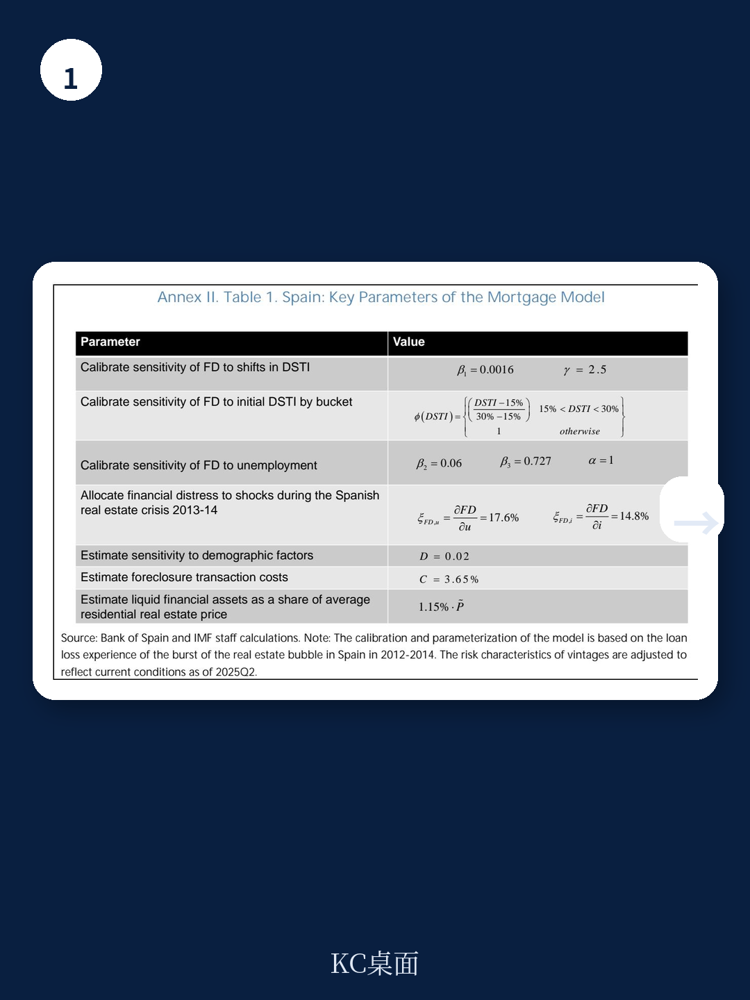
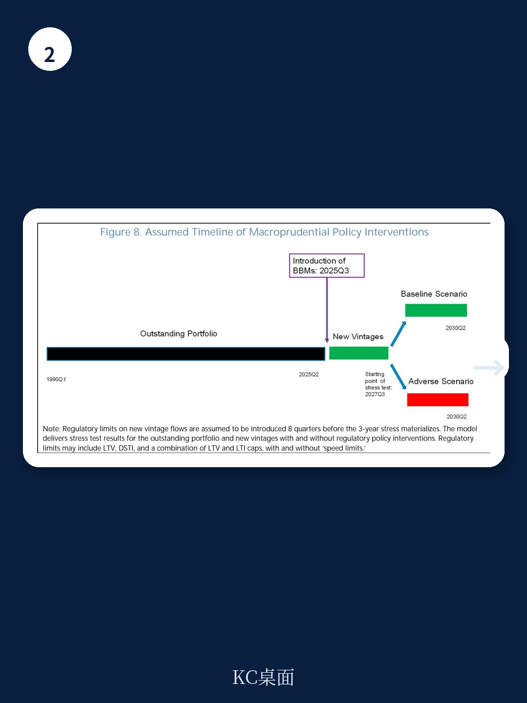

# IMF：西班牙需要的不只是资本缓冲，而是贷款发放时的“刹车”

当西班牙房价在疫情期间加速攀升、高风险房贷占比持续上升时，一个核心问题浮出水面：西班牙银行体系目前看似健康的资产负债表，是否足以抵御下一轮房地产下行周期？

国际货币基金组织（IMF）在2026年6月发布的一份Selected Issues Paper中给出了一个明确的判断：不够。这份题为《The Case for Borrower-Based Macroprudential Measures in Spain》的报告，通过贷款级数据和压力测试，论证了一个被西班牙央行至今未采纳的政策工具——借款人导向的宏观审慎措施（BBMs）——为何在当前时点变得必要。

这不是一份泛泛的风险警示。它直接指向一个关键的制度缺口：西班牙是欧元区银行业联盟中少数几个尚未激活任何BBM的国家之一。当18个欧元区国家已至少实施一项LTV或LSTI上限时，西班牙仍然完全依赖资本缓冲来吸收损失。IMF认为，这种“事后吸收”而非“事前预防”的框架，可能正在积累系统性脆弱性。

## 1. 房价上涨与贷款标准放松的组合，正在制造一个未被资本缓冲覆盖的风险敞口

西班牙的总体家庭杠杆率确实低于欧元区平均水平，这常常被引用来证明“西班牙没有房贷风险”。但IMF指出，这个总量指标掩盖了结构性问题：自2023年以来，新发放贷款中贷款价值比（LTV）超过80%的占比持续上升。换句话说，平均数据看似健康，但边际上的贷款质量正在恶化。

报告的核心逻辑链条是：持续强劲的房价上涨，加之地缘政治不确定性，可能在未来某个时点引发房价调整。而一旦房价下跌，那些高LTV贷款的借款人将面临负资产风险，违约概率将显著上升。问题是，西班牙现有的逆周期资本缓冲（CCyB，将于2026年10月生效至1%）和系统重要性机构附加资本，主要作用于“银行吸收损失”的环节，而非“防止高风险贷款被发放”的环节。

> **KC评论：** 这里的逻辑值得仔细拆解。资本缓冲好比给银行配了更厚的安全气囊，但BBM好比在源头防止驾驶员超速。IMF认为，西班牙目前只有安全气囊，没有限速器。对于关注西班牙银行股或持有西班牙房地产相关资产的投资者来说，这份报告提供了一个增量视角：监管框架的缺口，可能意味着银行在下一轮周期中的实际损失会高于市场预期。

## 2. 实证证据表明：LTV上限是降低违约概率最有效的单一工具，收入上限提供额外增益

IMF的实证分析分为两个层面。第一层是贷款级回归，考察发放时的贷款标准如何影响后续违约概率。结果非常清晰：LTV超过80%的贷款，其违约概率比低于该阈值的贷款高出约1.1个百分点——这在违约率通常只有2-4%的样本中，是一个巨大的增量。LTI（贷款收入比）超过6倍和LSTI（偿债收入比）超过40%的贷款，违约概率也显著更高，但效应规模小于LTV。

第二层是情景压力测试，基于EBA 2025年压力测试的宏观路径，模拟不同BBM校准方案下银行抵押贷款组合的损失。结果与贷款级分析高度一致：引入LTV上限（例如80%或90%）能够实现最大的违约风险和组合损失削减。如果再叠加收入上限（例如LSTI上限40%或LTI上限6倍），削减效果进一步增强。

> **KC评论：** 这里的关键洞察是“互补性”。LTV控制的是“贷款规模相对于抵押物价值”，主要降低损失幅度（即违约后银行亏多少）；LSTI控制的是“月供相对于借款人收入”，主要降低违约概率（即借款人会不会还不起）。两者结合，相当于同时控制了“如果出事，损失多大”和“会不会出事”。报告中的表4（正文未完全展开）展示了不同组合下的组合损失削减倍数，值得完整报告读者仔细研读。

## 3. 国际经验表明：早期部署比事后补救的成本低得多，但西班牙已接近“早期窗口”的末端

IMF报告回顾了欧元区国家的BBM实践经验，提炼出几个关键原则，其中第一条就是“timing matters”——部署时机至关重要。理论模型和跨国实证都表明，在金融周期早期、系统性风险尚未积累时引入BBM，其约束力较弱（因为大多数贷款本就不超标），社会和政治阻力较小，且能有效防止后续的贷款标准放松。反之，如果等到贷款标准已经明显恶化再引入，不仅约束力更强、可能引发信贷收缩，还会面临更大的政治反弹。

报告特别提到，西班牙目前的情况——房价上涨但尚未出现广泛泡沫、高风险贷款占比上升但总体杠杆率仍低——恰好处于一个“可以早期引入”的窗口期。但如果继续等待，这个窗口可能正在关闭。

> **KC评论：** 对政策制定者而言，这是一个经典的“预防vs.事后补救”权衡。对投资者而言，这意味着：如果西班牙央行在未来6-12个月内宣布引入BBM（特别是LTV上限），不应视为利空信号，而应解读为“监管层在主动管理风险”。反之，如果迟迟不行动，反而可能意味着风险正在积累，未来一旦房价调整，调整幅度可能更大。

## 4. 报告尚未完全回答的关键问题：BBM对首次购房者的分配效应如何量化？

IMF的报告在技术层面非常扎实，但它也坦诚地承认了一个尚未完全解决的问题：BBM的分配效应。LTV上限要求更高的首付比例，LSTI上限限制月供占收入的比例，这两者都可能对年轻、低收入、无家庭财富支持的首次购房者产生不成比例的约束。

报告在引言中提及了这一担忧，但并未给出量化的分配效应分析。它只是原则性地指出，可以通过设置豁免（例如对首次购房者、绿色贷款等）来缓解这一问题——正如欧元区许多国家所做的那样（见表2中各国的豁免比例）。但问题是，豁免比例多大才算适度？过高的豁免可能削弱BBM的有效性，过低的豁免则可能加剧住房可负担性危机。

这个问题的答案，直接关系到BBM校准的“政治可行性”。西班牙目前面临严重的住房可负担性压力（2025年西班牙第四条磋商已明确指出），如果引入BBM进一步收紧贷款条件，可能引发社会反弹。IMF报告提供了技术层面的最优校准方案，但政治层面的可行性评估，需要更深入的本土化分析。

## 5. 对投资者的观察框架：三个信号需要持续跟踪

基于这份报告的分析框架，我们可以提炼出三个对资产定价有直接意义的观察信号：

第一，西班牙央行是否开始公开讨论BBM。目前BBM尚未被纳入西班牙央行的宏观审慎工具箱。如果央行官员在公开讲话中开始提及“审视BBM的潜在必要性”，这将是政策转向的先兆信号。

第二，新发放贷款中高LTV贷款的占比是否继续上升。报告引用的数据截至2025年，如果2026年的数据显示该占比进一步攀升，意味着风险敞口仍在扩大，监管压力将随之增加。

第三，资本缓冲与BBM之间的政策组合如何演变。报告明确指出，BBM与资本缓冲是互补而非替代关系。但如果西班牙央行在引入BBM的同时下调CCyB，这可能意味着监管层认为“事前预防”足以替代部分“事后吸收”，对银行资本成本的预期将产生微妙影响。

> **KC评论：** 这份报告的真正价值，不在于它给出了“LTV上限80%”这样一个具体数字，而在于它提供了一个完整的分析框架：如何用贷款级数据识别边际风险，如何通过压力测试量化政策效果，以及如何在多种工具之间做出互补性选择。对于研究欧洲银行股或西班牙宏观经济的读者来说，掌握这个框架本身，比记住任何一个具体结论都更有长期价值。

---

上述分析只是这份IMF报告核心逻辑的提炼。完整的报告还包含了欧元区21国BBM校准的详细对比表（表2）、贷款级回归的完整结果（表3和表4）、以及压力测试的宏观路径假设（附件III）。这些图表和数据，对于深入理解西班牙房贷风险的结构性特征、以及不同校准方案的量化效果，是不可或缺的。

如果你希望获取这份IMF报告的完整中文解读与原始图表，包括欧元区各国BBM校准对比表、贷款级回归结果、以及压力测试参数设定，欢迎加入我们的社群。我们每天由AI agent结合人工review，生成国际投行与多边机构的中文摘要与KC评论，daily更新，约10-40页，也包含当天最新数据图表合集。既方便直接喂给AI分析，也方便人工快速把握全球市场动态。

Personal reading notes and learning share only. Not investment advice.

