# The Fiscal Policy of Autonomous Communities: Its Macroeconomic Effects and the Role of the National Fiscal Rule

Carlo Pizzinelli

SIP/2026/054

IMF Selected Issues Papers are prepared by IMF staff as background documentation for periodic consultations with member countries. It is based on the information available at the time it was completed on May 4, 2026. This paper is also published separately as IMF Country Report No 26/103.

2026
JUN

# IMF Selected Issues Paper European Department

# The Fiscal Policy of Autonomous Communities: Its Macroeconomic Effects and the Role of the National Fiscal Rule\* Prepared by Carlo Pizzinelli

Authorized for distribution by Romain Duval
June 2026

IMF Selected Issues Papers are prepared by IMF staff as background documentation for periodic consultations with member countries. It is based on the information available at the time it was completed on May 4, 2026. This paper is also published separately as IMF Country Report No 26/103.

ABSTRACT: The transposition of the EU economic governance framework to national legislation provides an opportunity to reform the subnational fiscal rule, especially with regard to its regional component. While compliance by autonomous communities has improved in the last decade, the current framework has not delivered on two key objectives of subnational fiscal rules for regional governments: avoiding procyclical public spending and ensuring debt sustainability. This paper makes the case for centering a revised fiscal rule on an expenditure growth target—consistent with the formulation of the EU framework—to ensure that spending by regional governments, particularly on health and education, remains mostly acyclical while also achieving debt-stabilizing regional fiscal policy.

RECOMMENDED CITATION: Pizzinelli, C. (2026) “The Fiscal Policy of Autonomous Communities: It’s Macroeconomic Effects and the Role of the National Fiscal Rule.” IMF Selected Issues Paper (SIP/2026/054). Washington, DC. International Monetary Fund.

JEL Classification Numbers:

E61, E62, E32, H70

Keywords:

Fiscal Rules, Federalism, Fiscal Policy, Cyclicality

Author's E-Mail Address:

cpizzinelli@imf.org

# The Fiscal Policy of Autonomous Communities: Its Macroeconomic Effects and the Role of the National Fiscal Rule

Spain

Prepared by Carlo Pizzinelli $^{1}$

# THE FISCAL POLICY OF AUTONOMOUS COMMUNITIES: ITS MACROECONOMIC EFFECTS AND THE ROLE OF THE NATIONAL FISCAL RULE $^{1}$

The transposition of the EU economic governance framework to national legislation provides an opportunity to reform the subnational fiscal rule, especially with regard to its regional component. While compliance by autonomous communities has improved in the last decade, the current framework has not delivered on two key objectives of subnational fiscal rules for regional governments: avoiding procyclical public spending and ensuring debt sustainability. This paper makes the case for centering a revised fiscal rule on an expenditure growth target—consistent with the formulation of the EU framework—to ensure that spending by regional governments, particularly on health and education, remains mostly acyclical while also achieving debt-stabilizing regional fiscal policy.

## A. Introduction

1. Autonomous communities are a crucial component of fiscal policy in Spain. In 2021 Spain ranked third among OECD and EU economies for the size of public spending carried out by regional governments as a share of GDP—approximately 18 percent—and fifth as regards regions' share of total public sector expenditure—approximately 27 percent (OECD, 2024). This large percentage is explained by the autonomous communities' responsibility for delivering several essential public services, including education, health, long-term care, and some other forms of social assistance.

2. Regional public spending is supported by an institutional framework aiming to balance risk-sharing, redistribution, autonomy, and fiscal responsibility. Under the “common regime”, applied to 15 communities, regional governments receive resources from a selection of taxes over which they have some ability to adjust rates, and have full autonomy over other taxes. Part of the revenues, together with additional transfers from the central government, are pooled into a set of funds that redistribute resources across regions to mitigate disparities in financing per capita. Meanwhile, the two communities under the “foral regime” (Navarra and País Vasco) pay a negotiated contribution to the general government’s budget but retain the entirety of their tax collections. Autonomous communities can also finance spending by issuing debt. While some communities issue bonds and receive loans from banks, several of them finance part or the entirety of their debt through central-government sponsored vehicles, collectively denominated Fondos de Financiación Autonómica. These were established in 2014, originally as emergency instruments, to ensure access to credit at contained interest rates for all communities in the wake of the Global Financial Crisis (GFC) and the subsequent euro area crisis. Finally, a subnational fiscal rule sets yearly targets for communities' deficits, primary spending growth, and debt levels to safeguard fiscal sustainability and align regional budgets to the government's overall fiscal strategy.

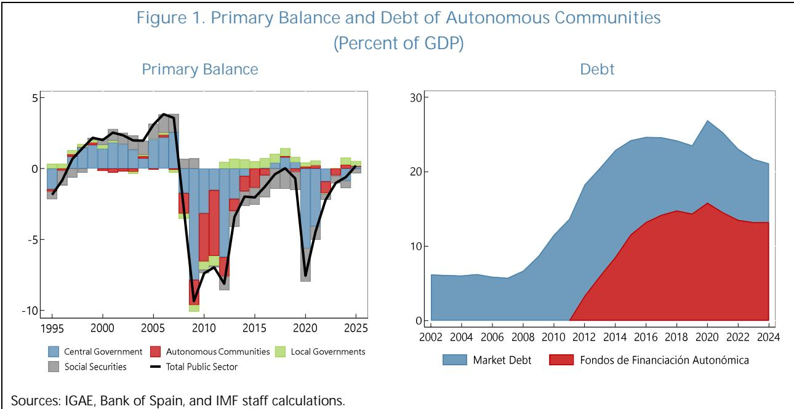

3. Autonomous communities have historically been large contributors to Spain's fiscal deficit and debt (Figure 1). Prior to the GFC, the consolidated regional government sector regularly achieved a close-to-balanced budget, and its total debt remained stable at around 5 percent of GDP. From 2008 to 2019, however, the primary (overall) balance of autonomous communities was mostly negative, with a peak deficit of 4.6 (5.1) percent of GDP in 2011. As a result, regional debt rose pronouncedly, edging close to 25 percent of GDP in 2016. Since then, the consolidated deficits have decreased in size, with several individual communities reaching surpluses. With the exception of 2020, the first year of the COVID-19 pandemic, regional debt has declined every year, but challenges remain. By end-2025, total debt—including that issued via the government-sponsored funds—remained above 20 percent of GDP. This level amounts to a fifth of Spain's total public sector debt and is significantly above the long-term debt anchor of 13 percent envisioned in Spanish law (Organic Law 2/2012). Moreover, given their purview of health and long-term care services, autonomous communities will bear a substantial share of the large aging-related fiscal pressures that Spain is projected to face over the coming decades.

4. Overhauling the subnational fiscal rule would be a crucial step to strengthen the medium-term orientation and credibility of fiscal policy in Spain. The subnational fiscal rule is underpinned by the Organic Law on Budget Stability and Financial Sustainability 2/2012 (LOEPSF, for its Spanish name). The multiplicity of fiscal targets under the current subnational rule, as set out under the LOEPSF, has historically led to inconsistencies in the fiscal position of different communities, and compliance with its targets has been partial. Moreover, while compliance has improved over the last decade, the framework has not delivered on two key goals of subnational fiscal rules: stabilizing debt and avoiding procyclical fiscal policy. Additionally, as noted by AIReF (2025), the methodology for setting yearly targets on spending growth is not aligned with that of

the new EU economic governance framework, which became operational in 2025, leading to potential conflicts in the fulfillment of both rules. The need to align the subnational framework to the EU one therefore provides an opportunity to revise the former in order to better align it with optimal principles of regional fiscal policy and better tailor it to the nature of spending conducted by autonomous communities in Spain.

5. This paper provides new insights in support of a revised fiscal rule for autonomous communities centered on expenditure growth limits. Given their primary focus on essential public services, the expenditures of autonomous communities should remain decoupled from business cycle fluctuations. Deficit-based rules, while in principle preserving debt sustainability, would lead to procyclical spending that could exacerbate recessions and hinder long-term growth through cuts to education and health, as was the case in the GFC. Moreover, due to their limited debt-carrying capacity, autonomous communities are not well placed to conduct active countercyclical fiscal policy, as large deficits may quickly result in high debt financing costs, and the central government can in principle step in and fulfill this macroeconomic stabilization role. A viable solution would therefore be a rule centered on expenditure growth that ensures debt sustainability for individual regions, either through region-specific spending growth limits or through a common one with tighter adjustment requirements for high-debt regions whose debt is above a certain threshold—such as the 13 percent of GDP limit envisioned in the current debt rule. To further reduce the risk of procyclical spending cuts, the central government should ensure that its transfers to autonomous communities do not fall during downturns. The rule should also entail a clear and applicable corrective arm in the event of non-compliance, enforced by the Ministry of Finance.

6. The paper makes the case for an expenditure target through both descriptive and econometric analysis. Section B discusses the basic principles of fiscal federalism and subnational fiscal rules, relating them to the Spanish context. It highlights the case of the GFC to stress the need to prevent procyclical spending and the importance of debt sustainability. Sections C and D apply econometric techniques to more formally assess the historical conduct of fiscal policy by autonomous communities over 2004–2024. The analysis finds that regional public spending was positively correlated with the business cycle—falling in downturns, particularly in the aftermath of the GFC—and that most regions failed to stabilize their debt dynamics over this period. Moreover, Spain’s strong procyclicality of spending on health and education—the communities’ main responsibilities—is at odds with the experience from peer euro area countries, where it is mostly acyclical, as warranted. Section E discusses Spain’s current subnational fiscal rule, set out by the LOEPSF, examining regions’ historical compliance and highlighting the inherent inconsistency between the yearly deficit and spending growth targets. Section F considers key issues in the design of an expenditure-based fiscal rule for Spain’s regions, drawing also from two recent proposals by AIReF (2025) and Martínez-López and others (2026).

7. The finances of autonomous communities have been the subject of significant analysis, particularly after the GFC and the euro area crisis. For instance, Fernández-Llera (2011) and Pérez and Prieto (2015) present early analysis of regional debt, while Canuto and Liu (2013) place the Spanish case in the comparative context of other countries in the wake of the GFC. More recently, Marín-González and Martínez-López (2024) provide an in-depth analysis of historical drivers of regional debt. Moreover, the yearly fiscal performance and budget execution of communities has been highly studied and tracked by academics and think tanks (e.g., see for instance de la Fuente, 2025). Several works point to the importance of examining regional finances in the broader context of national fiscal policy in Spain (Hernández de Cos and Pérez, 2013). Studies thus considered the limited coordination of fiscal effort (Lledó, 2015), spillovers from the fiscal stance of the central government (Molina-Parra and Martínez-López, 2018), the role of extraordinary liquidity funds that allow for soft budget constraints (Herrero-Alcalde and others, 2019; Calvo-López and Cadaval-Sampedro, 2022), and the spending responsibility of regions on essential services, which tend to be prioritized over debt reduction (Marín-González and Martínez-López, 2026).

8. Several studies have also examined the historical track record of compliance with the subnational fiscal rule and the implications for fiscal policy. Agrimón and Hernández de Cos (2012) examine an earlier version of the national fiscal rule, in place between 1992 and 1998, finding that it did not have significant effects on regional fiscal balances. Leal and López-Laborda (2015), Lago-Peñas and others (2016), and Delgado Téllez and others (2017) study econometrically the drivers of non-compliance with the objectives of the fiscal rule, finding that a variety of “hard” and “soft” factors matter. Among the former are the ambitiousness and volatility of the targets, exogenous growth shocks, and the persistence of non-compliance (i.e., a track record of low compliance decreases the likelihood of meeting current targets, all else equal). Among the latter are political-economy factors such as soft budget constraints, the degree of fiscal autonomy, and changes in the political affiliations of regional governments. Martínez-López (2020) points to the reduced efficacy particularly of the debt and spending rules of the LOEPSF, as well as the limited enforceability of the rule’s corrective mechanisms. More recently, however, Herrero-Alcalde and others (2022) find that, despite partial compliance, the expenditure rule has to some extent helped contain growth in current and primary expenditure.

## B. Principles of an Enhanced Subnational Rule in the Context of Spain's Spending Areas

9. Autonomous communities account for the majority of public sector expenditure in health and education in Spain (Figure 2, left panel). $^{2}$ The central administration, on the other hand, concentrates its spending on economic development, public administration, and defense and security. Finally, the social security administration and local governments (i.e., municipalities) have more specialized functions such as pensions and local security, respectively, and, in the case of the latter, represent a smaller share of total spending. This distribution of responsibilities is well aligned with theories of optimal federal spending (Oates 1972, 1999), whereby central authorities are best placed to address macroeconomic stabilization and deliver country-level public goods like national defense, while territorial governments should focus on the provision of services that may require

tailoring to the needs and preferences of their populations. Although spending in health and education is mostly comprised of wages and social transfers, autonomous communities also account for approximately half of all capital spending (amounting to 1.6 percent of GDP) concentrated under economic affairs and general public service programs (Figure 2, right panel). $^{3}$

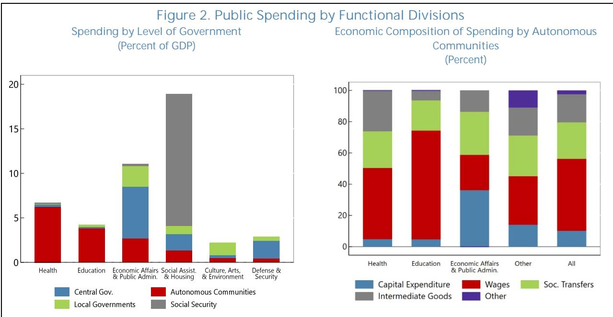  
Note: The left plot reports average spending as a share of GDP over 2022–2024. The right plot reports the average composition of spending by autonomous communities in different programs by its economic classification over 2022–2024.

10. Autonomous communities' spending should not fluctuate significantly over the business cycle. Health and education are crucial for fostering long-term economic growth but do not have strong macroeconomic stabilization functions, as they generally have lower short-run multipliers (Atolia and others, 2017) and are mostly determined by inelastic demand for essential services. Hence, they do not lend themselves well to countercyclical spending. At the same time, procyclical spending in these areas should also be avoided, as health and education services provision should not be diminished or discontinued due to macroeconomic circumstances, and evidence shows that cuts in health and education during downturns can lengthen the duration of the recession—a phenomenon called hysteresis—and inflict long-lasting scars on human capital and potential output (Jackson and others, 2021). These spending programs should therefore remain

acyclical, while still contributing to debt sustainability and fiscal consolidation efforts by following predictable multi-year trajectories and through spending efficiency reviews. $^{4}$

11. In turn, to maintain stable spending through the business cycle, autonomous communities require a combination of debt-issuance capacity and stability in revenue sources. Some access to debt markets, allows communities to maintain stable (acyclical) spending on essential services when revenues decline due to cyclical shocks. However, while autonomous communities can issue debt in the form of bonds and loans, their overall debt-carrying capacity is more limited than that of the national government. $^{5}$ Therefore, acyclical spending also requires that, during economic upswings, revenue surpluses be devoted to debt repayments rather than increased provision of services above initial plans. Moreover, the more stable revenues are, the less likely it is that communities need to issue debt to finance spending. In particular, transfers from the central

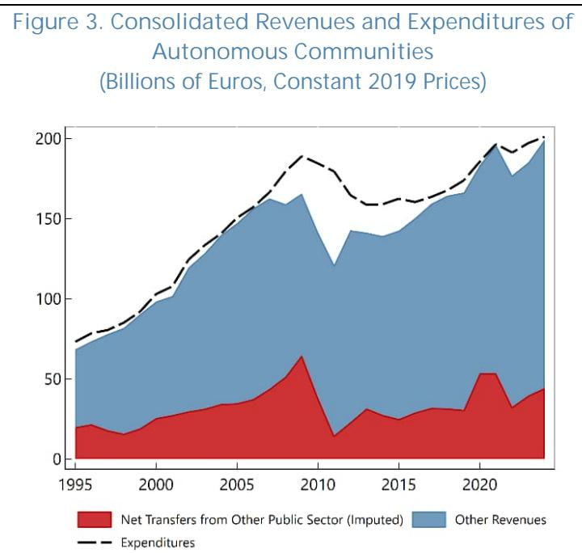  
Sources: IGAE, INE, and IMF staff calculations.
Note: Net transfers are computed as transfers (current and capital) from other public sector entities minus transfers to other public sector entities (current and capital) minus 50 percent of the central government's VAT revenues minus 58 percent of the central government's revenues of alcohol, tobacco, and hydrocarbons excise taxes, and minus 100 percent of the central government's revenues of electricity excise taxes.

government should remain stable and predictable, if not actively offsetting fluctuations in communities' own tax revenues, whose bases fluctuate with the business cycle.

12. The experience of the Global Financial Crisis (GFC) and euro area crisis in Spain illustrates how limited debt issuance capacity and unstable revenues can result in procyclical spending by regions. The consolidated revenues of autonomous communities began to slow down in 2007, driven primarily by lower tax revenues, while net transfers from the central government remained stable at first and eventually rose (Figure 3). Spending continued to rise over 2007–2009, outgrowing revenues and leading to an initial rise in debt as seen in Figure 1. In 2010 and 2011, transfers from the central government, partly linked to the system of reconciliation of past tax

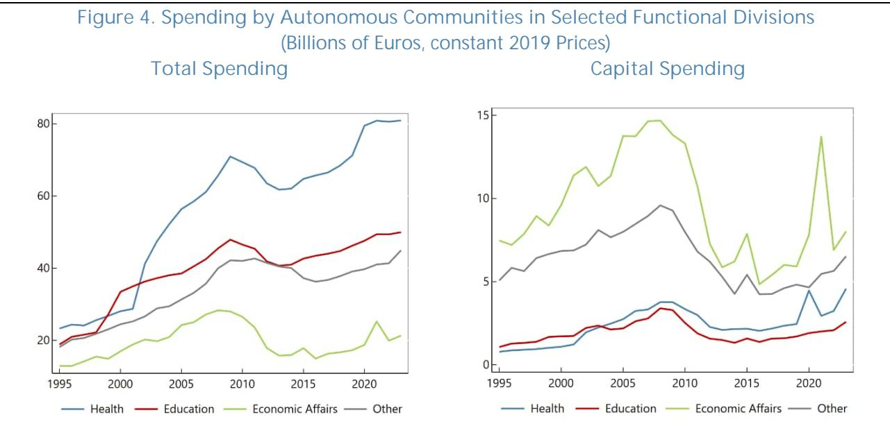  
Sources: IGAE, INE, and IMF staff calculations.

revenues (known as liquidaciones)—which had fallen due to the economic crisis, also contracted sharply and persistently. This led to a long-lasting slump in autonomous communities' revenues, which recovered their 2007 level in real terms only 10 years later. This slump was accommodated through both a steep rise in debt and eventually a durable reduction in spending. In 2008, and then more decisively in 2010, autonomous communities retrenched spending in all areas, including health and education (Figure 4, left panel). $^{6}$ The adjustment was mostly carried out via cuts to capital expenditure, which fell by more than 50 percent in real terms over 2009–2014 (Figure 4, right panel) and accounted for 54 percent (€16 billion) of the €30 billion contraction, in 2019 prices, in total spending by regional governments over the same period. The long-lasting reduction in spending was motivated by soaring debt servicing costs for most communities starting in 2009 until 2014, when the establishment of the Fondos de Financiación Autonómica reduced effective interest rates and allowed regions to regain fiscal space (Figure 5). In the following decade, despite the recovery in revenues and the lower borrowing costs, debt plateaued but did not decline to pre-GFC levels.

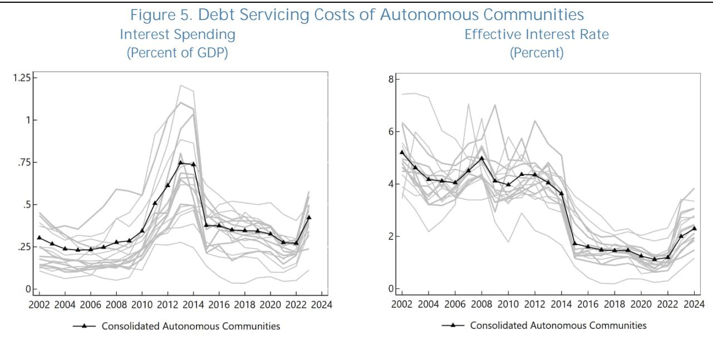  
Sources: IGAE, INE, and IMF staff calculations.
Note: The grey lines report the interest spending in percent of GDP (left plot) and the effective interest rate on debt (right plot) of individual autonomous communities. The black lines represent the respective variables for the consolidated regional government sector.

13. The next two sections discuss the historical conduct of fiscal policy by autonomous communities more comprehensively and more formally. Specifically, Section C examines the cyclicality of spending of regional governments, as a collective and as individual entities. Section D studies the responsiveness of regions' deficits to debt levels and the implications for debt stability.

## C. Cyclicality of Spending

14. Autonomous communities' spending has been strongly procyclical throughout the last three decades. Figure 6 plots the cyclical component of log real expenditure by level of government for different definitions of spending against the cyclical component of real GDP. $^{7}$ The three definitions considered are total spending, primary spending—which excludes interest costs—and public consumption—which excludes interest, investment, and transfers. In all cases, spending by autonomous communities appears more aligned with the business cycle (or its lag) and exhibits a larger amplitude of fluctuations than that of the central government. This procyclical behavior is similar in nature to spending by local governments, which, however, are significantly more constrained in accessing debt. Moreover, while the GFC boom-and-bust dynamics are most notable, the alignment with the business cycle is also visible in the upswing phase over 2013–2024, when the current fiscal rule was in place. The COVID-19 pandemic is the only exception to this pattern, as spending by autonomous communities rose markedly in response to the health emergency despite a sharp economic contraction. Primary expenditure appears to be the most procyclical definition of spending, as it excludes interest costs—which can be countercyclical (Figure 3)—but includes capital expenditure, which has historically borne a strong positive correlation with the cycle.

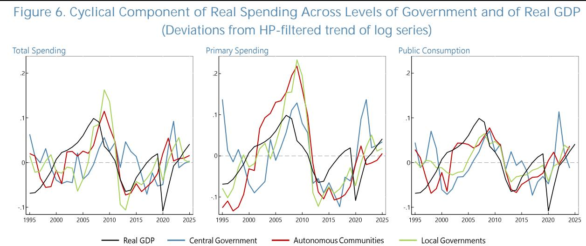  
Note: The plots report the cyclical component of each type of spending by level of government and of real GDP. Cyclical components are computed by extracting a trend using the Hodrick-Prescott filter with a smoothing weight of 100 from the natural log of spending deflated to constant 2019 prices.
Sources: IGAE, INE, and IMF staff calculations.

15. Econometric analysis confirms the procyclicality of autonomous communities' spending. The specifications presented in this section examine regional spending in Spain as a consolidated level of government, that of individual regional governments, and through the areas of spending for which they are mostly responsible. Following a long-standing literature (e.g., Ilzetzki and Vegh, 2008; Frankel and others, 2013), the overall responsiveness of fiscal policy to the business cycle is studied by focusing on spending, rather than the balance or revenues, because governments have greater discretionary ability to adjust at least some spending items throughout the year, as observed economic conditions evolve. This allows for more reliable analysis of the discretionary response of fiscal policy to business cycle fluctuations. Moreover, the study of public consumption, rather than total or primary spending, further focuses the analysis on areas of expenditure that are in policymakers' control by excluding automatic stabilizers such as unemployment benefits and interest payments, which are strongly countercyclical.

16. Following the approach of the literature on cyclical fiscal policy, the starting point for the analysis is a regression of cyclical spending on the output gap. The baseline specification is as follows:

$$
\text { Cycle } (\text { Log   Expenditure } _ {t}) = \alpha + \beta \text { Cycle } (\text { Log   GDP } _ {t}) + \gamma X _ {t} + \epsilon_ {t}\tag{1}
$$

where Expenditure and GDP are expressed in constant 2019 prices. For both series, the cyclical component is constructed by extracting the trend of the natural logarithm through a Hodrick-Prescott filter, using a smoothing weight of 100. The vector $X_{t}$ represents possible control variables to be added (e.g., a binary variable for specific historical period, or the series on liquidaciones of previous tax revenues).

17. The coefficient of interest is $\beta$ , which captures the general behavior of fiscal policy over the business cycle. A negative value would indicate countercyclical spending, which would likely reflect the use of fiscal policy predominantly for active macroeconomic stabilization. Meanwhile, a positive value would imply procyclical spending, which may be the result of different behaviors. First, it could reflect tight financing constraints, forcing the government to adjust expenditure in line with procyclical fluctuations in revenues, originating from a limited ability to issue debt. Alternatively, even when there is additional borrowing capacity, procyclicality could be suggestive of strict compliance with deficit-based fiscal rules, which would imply adjustments in spending in order to match fluctuations in revenues to achieve a given deficit target. $^{8}$ Whenever possible, instrumental variable methods are applied, as described below, to avoid two-way causality between the output gap and spending. In particular, higher (lower) spending could stimulate (tighten) the economy and thus lead to a higher (lower) output gap. $^{9}$ In this regard, the analysis of public consumption, which excludes automatic stabilizers like unemployment benefits, already partially reduces the risk of endogeneity.

18. The above specification is adapted to three different aspects of fiscal policy procyclicality. First, it is used to compare the cyclicality of each level of government in Spain: central, autonomous, local, and where the latter two are studied as consolidated sectors. Second, it is applied to the panel of the 17 individual autonomous communities. Third, it is used to compare the cyclicality of spending on health and education in Spain relative to peer EU advanced economies. The first two specifications use data by the Spanish Ministry of Finance's internal control body (IGAE) on the yearly fiscal accounts of each consolidated level of government and for individual autonomous communities over 2004–2024. Real GDP is produced by the national statistical institute (INE). The third specification uses data by Eurostat over 1995–2023 on real GDP and public spending in health and education following the functional classification of spending (COFOG).

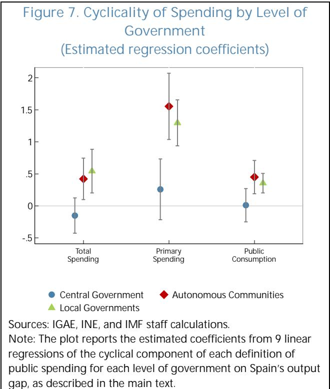

## 19. The analysis shows that the fiscal policy of the consolidated regional government

sector has historically been more procyclical than that of the central government. Figure 7 reports the coefficients of interest from specification (1) estimated individually for each consolidated level of government and definition of spending. The quantitative results confirm the visual results of Figure 6. The estimated elasticity coefficient for autonomous communities is in all cases positive, statistically different from zero, and larger than the coefficient for the central government. Regional government spending is in fact closer in behavior to that of municipalities. For total spending and public consumption, the estimated coefficient is close to 0.5, reflecting substantial procyclicality: a one percent increase in the output gap has historically been associated with a 0.5 percent

Sources: IGAE, INE, and IMF staff calculations.
Note: The plot reports the estimated coefficients from 9 linear regressions of the cyclical component of each definition of public spending for each level of government on Spain's output gap, as described in the main text.

increase in total spending and public consumption. Meanwhile, the coefficient for primary spending is about three times as large. This difference reflects the large fluctuations in capital spending, which is often the most discretionary in nature and, being related to long-term projects, may be more easily shifted across years. Meanwhile, the estimated coefficients for the central government are not statistically different from zero, thus suggesting acyclical fiscal policy overall (even though the coefficient for primary spending appears slightly more positive). Taken together, these results confirm the view that, despite having some ability to borrow to smooth consumption, and having increased their debt significantly over 2004-2024, autonomous communities have historically conducted fiscal policy more in line with that of local governments, which have almost no borrowing capacity, than that of the central government, which has significantly greater ability to issue debt.

20. A panel regression of spending for individual autonomous communities confirms this procyclicality. A panel regression with community-specific fixed effects is run for all three types of spending separately. Following the approach of Ilzetzki and Vegh (2008), the cyclical component of real GDP of each community is instrumented using two variables which plausibly affect local output but are unlikely to be contemporaneously associated with local public spending. Specifically, these are: (i) the average output gap of bordering autonomous communities, and (ii) the export-weighted output gap of Spain's trading partners. All autonomous communities are weighted equally in the regression. Table 1 reports the estimated regression coefficient for each of the three definitions of spending. In all cases, although the estimated values are lower than for the consolidated regional government sector, with values in the range of 0.3-0.4, the coefficient is positive and statistically

significant. Once again, primary spending shows somewhat higher procyclicality, although differences are more moderate than they are for the consolidated regional government sector.

<table><tr><td>VARIABLES</td><td>(1) Total Expenditure</td><td>(2) Primary Expenditure</td><td>(3) Public Consumption</td></tr><tr><td>Regional GDP - Detrended</td><td>0.366***(0.055)</td><td>0.437***(0.057)</td><td>0.349***(0.025)</td></tr><tr><td>Constant</td><td>0.003***(0.000)</td><td>0.003***(0.000)</td><td>0.003***(0.000)</td></tr><tr><td>Observations</td><td>340</td><td>340</td><td>340</td></tr><tr><td>Number of CAs&#x27;</td><td>17</td><td>17</td><td>17</td></tr><tr><td>IV 1: Neighbors&#x27; GDP</td><td>YES</td><td>YES</td><td>YES</td></tr><tr><td>IV 2: Trading Partners GDP</td><td>YES</td><td>YES</td><td>YES</td></tr><tr><td>First-Stage F-stat</td><td>264</td><td>264</td><td>264</td></tr><tr><td>P-val</td><td>0.00</td><td>0.00</td><td>0.00</td></tr><tr><td>R2 - Between</td><td>0.32</td><td>0.31</td><td>0.39</td></tr><tr><td>R2 - Within</td><td>0.03</td><td>0.04</td><td>0.07</td></tr><tr><td colspan="4">Robust standard errors in parentheses*** p&lt;0.01, ** p&lt;0.05, * p&lt;0.1</td></tr><tr><td colspan="4">Sources: Eurostat, IGAE, INE, and IMF staff calculations.</td></tr></table>

21. The panel regression results are robust to sensitivity analysis, presented in the Annex. First, Annex 1 Table 1 shows that the estimated coefficients do not vary substantially when (i) excluding Navarra and País Vasco, the two communities under the “foral regime” of financing (Columns 1, 5, 9), (ii) using one instrumental variable at a time (Columns 2–3, 6–7, 10–11), and (iii) controlling for liquidaciones of tax revenues from two years prior. $^{10}$ Second, given the large fluctuations related to the GFC seen in Figure 6, Annex 1. Table 2 examines whether the procyclicality of spending can be entirely ascribed to this episode or holds more broadly instead, by adding an interaction between the output gap and a dummy variable for the period 2009–2012. The results suggest that the GFC period—represented by the interacted coefficient—was characterized by very strong procyclicality (4 to 6 times the baseline value) but that the rest of the period of analysis is also marked by statistically significant procyclicality. Annex 1. Tables 3 and 4 examine alternative specifications. The former shows that a regression in first differences leads to smaller coefficients but that are still positive and statistically significant. The latter applies a System-GMM approach with Arellano-Bond instruments, as in Ilzetzki and Vegh (2008), to model potential

autocorrelation in the dependent variable. $^{[11]}$ Spending has strong persistence, as the estimated coefficient on the lagged value t-1 is around 0.7 for all three expenditure definitions. Nevertheless, while the coefficient on the output gap is about half as large as in the main specification, it remains statistically significant.

22. Spending on health and education has historically been more procyclical in Spain compared to peer European economies. The regression specification (1) is adapted to separately examine the business cycle behavior of spending on health and education for (i) Spain's general government, (ii) Spain's autonomous communities, (iii) Germany, France, and Italy, and (iv) all EU countries excluding Spain. Figure 8 plots the estimated coefficients for each sample. $^{12}$ For both health and education, the estimated coefficient for Spain's total general government spending and for spending by regions is above that obtained for other European countries. In fact, unlike in Spain, the procyclicality of spending

Figure 8. Cyclicality of Spending on Health and Education in Spain and the EU (Estimated regression coefficients)

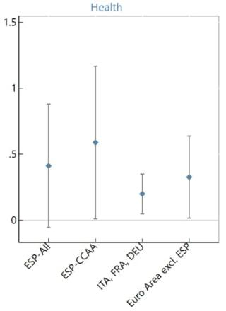

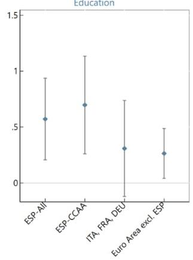

Sources: Eurostat, IGAE, INE, and IMF staff calculations.
Note: The plots report the estimated coefficients and 95 percent confidence intervals from linear regressions of the cyclical component of public spending on health and education on the output gap for (i) Spain, (ii) Spain's autonomous communities, (iii) Italy, France, and Germany, and (iv) the panel of Euro Area countries excluding Spain.

in these two areas is not the norm among these peer economies.

## D. Debt Stabilization

23. On average, since 2000, autonomous communities' fiscal policy has not been strongly responsive to debt levels. Figure 9 plots communities' debt-to-GDP ratios against their fiscal impulse—measured as the yearly change in the primary balance. $^{13}$ The impulse shows little association with debt levels. A positive relationship would suggest a stronger response of fiscal policy to debt levels, aimed at reducing debt when it is high. However, the plotted historical values throughout the full period display a flat relationship. Only the interval 2008-2014, which spans the

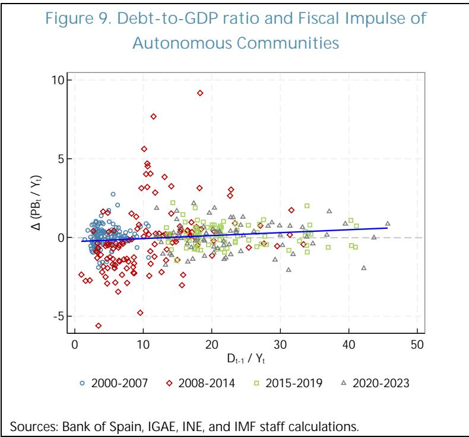

years from the pre-GFC cyclical peak to the establishment of the Fondos de Financiación, exhibits a positive association. The subsequent subperiods, however, show no relationship between the high debt levels in the wake of the GFC and a tightening of the fiscal stance. As a result, debt ratios remained generally high after 2010.

24. An econometric specification is applied to estimate the “fiscal reaction function” of autonomous communities. Following the seminal work of Bohn (1998), the fiscal reaction function quantitatively appraises the debt-stabilizing properties of fiscal policy. The relationship is estimated in three ways: (i) separately for individual communities, (ii) jointly for the panel of communities, and (iii) for a single time series of the consolidated regional government sector. For an individual community, the specification is as follows:

$$
\mathrm{PB} _ {\mathrm{t}} / \mathrm{GDP} _ {\mathrm{t}} = \alpha + \beta (\mathrm{D} _ {\mathrm{t-1}} / \mathrm{GDP} _ {\mathrm{t}}) + \gamma \text {Cycle} (\mathrm{LogGDP} _ {\mathrm{t}}) + \epsilon_ {\mathrm{t}}
$$

where the coefficient of interest is $\beta$ . Higher values of $\beta$ reflect a stronger reaction of the primary balance to the debt level and thus a larger weight put on debt stabilization in the conduct of fiscal policy. As discussed below, the estimated value of the coefficient also sheds light on whether the conduct of fiscal policy is consistent with stabilizing the debt ratio over the long term. The inclusion of the output gap on the right-hand side controls for the response of fiscal policy to the business cycle, which is a confounding factor.

25. Estimated coefficients confirm that, for most communities, fiscal policy has been little responsive to debt levels historically. Figure 10 reports the coefficients for individual communities, as well as for the consolidated regional government sector and the panel of regional governments. The small sample size for each region leads to large confidence intervals and mostly statistically insignificant coefficients at the 5 percent level. A few communities show coefficients larger or similar in size to that estimated by Bohn (1998) for the United States in the second half of the 20 $^{th}$ century (red line in Figure 10). However, in most cases, and for the panel of all regions, the coefficient is very close to 0. The value for the panel of communities is approximately 0.02, meaning that a 10-percentage point increase in debt is associated with a 0.2-percentage point improvement in the primary balance.

26. The estimated coefficients can also shed light on the stationarity of the debt ratio and its sensitivity to financing costs and growth shocks. Bohn (1998) shows that stationarity of the time series of debt requires that the condition $(1 + \bar{r} - \bar{g})(1 - \beta) < 1$ be met, where $\bar{r}$ is the average real sovereign interest rate and $\bar{g}$ is the average real growth rate. For an estimated value of $\beta$ , setting either $\bar{r}$ or $\bar{g}$ to historical values allows deriving the size of the growth decline or the worsening of financing costs, respectively, that would result in non-stationary debt dynamics.

27. Based on historical relationships, debt dynamics in several autonomous communities would become non-stationary in the event of higher interest rates. The left panel of Figure 11 shows the maximum interest rate which would ensure stationarity when setting average growth $\bar{g}$

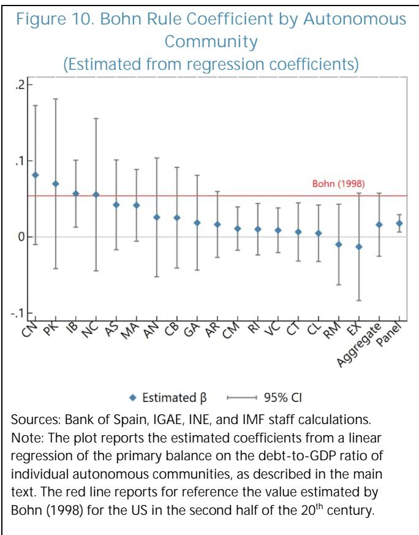

equal to 1.7 percent, in line with staff's medium-term projection for Spain. For most communities, real borrowing rates in line with those faced by Spain's central government prior to the pandemic would imply stationarity. However, the debt dynamics of 6 communities would become non-stationary with an increase in financing costs of 2 percentage points, which is close to the rates faced by most regions prior to the introduction of the Fondos de Financiación Autonómica. Meanwhile, the right panel of Figure 11 fixes the long-run real borrowing cost $\bar{r}$ to 1.2 and plots the minimum growth rate that ensures stationarity. $^{14}$ Once again, stationarity holds for most

communities with growth rates in line with the pre-COVID average. A reduction in growth of 2 percentage points would result in non-stationary debt dynamics for 6 regions. Compared to financing costs, however, it is unlikely that real growth could fall durably by this amount, entering negative territory.

Figure 11. Maximum Interest Rate and Minimum Growth Rate for Stationary Debt Dynamics (Percent)  
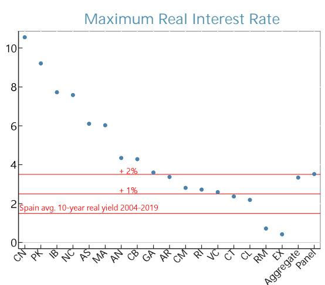  
Sources: Bank of Spain, IGAE, INE, and IMF staff calculations.

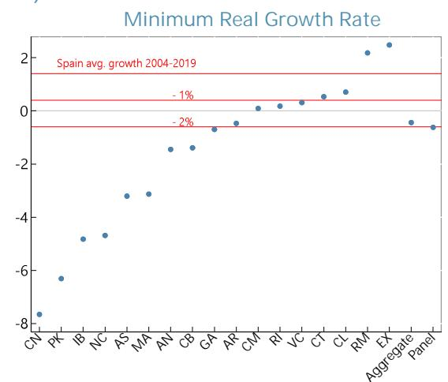  
Note: The left plot reports the maximum real interest rate at which debt dynamics for each community remain stationary based on the estimated regression coefficients from a linear regression of the primary balance on the debt-to-GDP ratio of individual autonomous communities, as described in the main text. Similarly, the right plot reports the minimum real GDP growth at which debt dynamics for each community remain stationary.

## E. Historical Compliance with the Subnational Fiscal Rule

28. Spain's subnational fiscal rule is currently defined by the LOEPSF (Organic Law 2/2012), but deficit-based subnational targets had already been in place in previous decades. Starting in 1992, regional governments agreed on yearly fiscal deficit targets with the central administration. Under the 2001 Budget Stability Law (Law 18/2001 and Organic Law 5/2001), starting in 2002 regions had to achieve either balanced budgets or a surplus. The 2006 Budget Stability Law (Organic Law 3/2006), which came into force in 2007, aimed at harmonizing the national framework with the European Union's Stability and Growth Pact; it set fiscal deficit limits in percent of regional GDP that could vary depending on the cyclical position and the implementation of productive investments. More developed corrective and coercive mechanisms were also introduced by the same law (Delgado Tellez and others, 2017).

29. Introduced in 2013, the LOEPSF articulates objectives based on three fiscal measures and differentiated by level of government. In particular, the LOEPSF envisions three types of limits:

\- Structural deficit. All administrations should achieve a structural balance, although adjustments are made based on cyclical considerations, emergencies, natural disasters, or growth-enhancing investments. In practice, a deficit limit is set by the Ministry of Finance for the consolidated general government and broken down into separate targets for the central, regional, and local governments, as well as for the social security administration. With the exception of 2013, all autonomous communities have always been subject to the same deficit target since the LOEPSF has been in place. $^{15}$

\- Spending growth. A spending growth limit, computed based on Spain's nominal medium-term potential growth rate, is set homogenously for the central, regional, and local governments. The Ministry of Finance is responsible for computing the reference rate.

\- Debt. A debt limit, compatible with the EU's Excessive Deficit Procedure target of 60 percent of GDP, is split into specific debt limits for each territorial level: 44 percent for the central government, 13 percent for the autonomous communities, and 3 percent for municipalities. When the debt-to-GDP ratio is above these limits, the respective entities must publish a multi-year debt reduction plan resulting in yearly debt targets, which must also be compatible with the deficit and spending growth targets.

30. Historical compliance with fiscal targets has been mixed. Recent analysis by AlReF (2025) on the fulfillment of fiscal targets finds that over 2013–2019 a substantial share of communities in each year did not comply with either the deficit or expenditure target, or both. At the consolidated regional sector level, there were years in which either the deficit target (2017, 2018) or the expenditure target (2013, 2014, 2016) were met, but the two were never met at the same time. The debt target, on the other hand, exhibited a higher compliance rate by individual communities (often above 80 percent), and for the regional sector as a whole it was collectively met each year except for 2015. However, simultaneous compliance with all three objectives was rare at the individual level and never occurred at the consolidated level.

31. Figure 12 visually corroborates this assessment. In the top left panel, the deficit rule had limited compliance in the version in force between 2008–2012, when it was the sole fiscal target for autonomous communities. In some years, no community reached the deficit limit. These years coincided with the GFC, when, as discussed above, the communities faced a significant contraction in revenues. Under the LOEPSF, compliance then progressively improved. The consolidated deficit fell below the limit in 2017 and 2018 and was not far from it in 2016 and 2019. The average distance from the target for non-compliant regions also decreased over time. Over the COVID-19 pandemic, when the fiscal rule was paused, indicative non-binding targets were set over 2021–2024. Communities achieved deficits gradually closer to the target as the post-pandemic recovery

progressed. Meanwhile, compliance with the expenditure limit (top right panel) was more irregular over 2013–2019. The time series of expenditure growth for the consolidated sector and for individual regions appears generally more volatile than the deficit. In 2024, when the expenditure rule was the only legally binding limit, a large majority of communities exceeded it, with an average growth rate about twice as high as the target. Compliance with the yearly debt target at the consolidated level and for individual regions improved starting in 2016 (bottom panel). However, over this period the debt-to-GDP ratio for most individual communities and for the consolidated regional sector remained substantially above the debt anchor of 13 percent under the LOEPSF (see Annex 1. Figure 2).

Sources: Ministry of Finance and IMF staff calculations.  
Figure 12. Fiscal Rule Targets and Outcomes of Autonomous Communities  
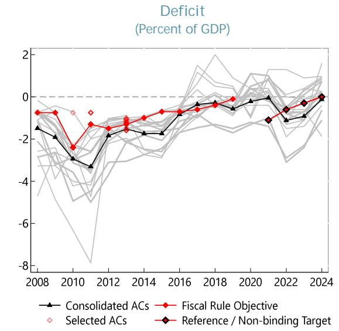

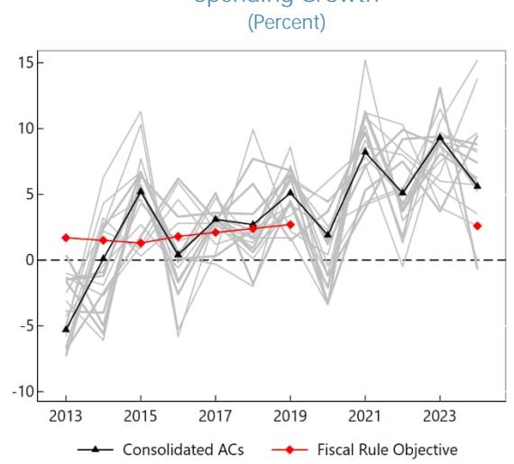  
Debt: Deviations from Individual Objectives

(Percent of GDP)  
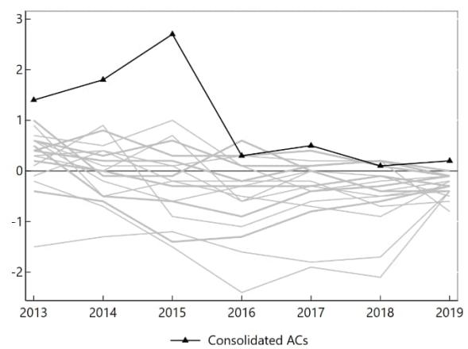  
Note: In the first two plots, red lines report the fiscal rule objectives for the consolidated sector of autonomous communities. In the first plot, red empty diamonds report the deficit targets for individual communities whenever these differ from those of the consolidated regional sector. Black-red diamonds report indicative or not legally binding targets (see main text for details). For the expenditure growth rule, the consolidated sector target always applies also to individual communities. For the debt rule, the third plot reports the deviation of individual communities' debt from their specific targets. A value above zero implies that debt was above the community-specific target or, in the case of the black line, the consolidated sector target.

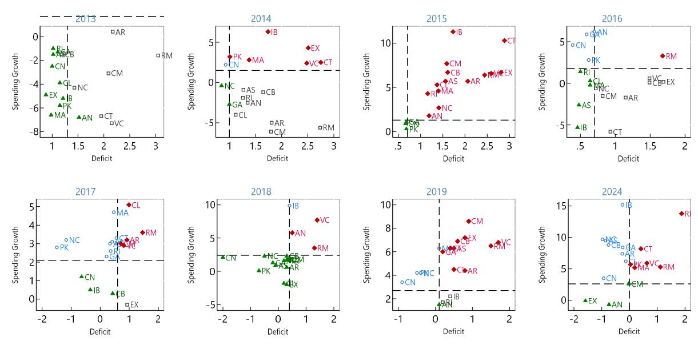  
- Only Deficit Target Met  
Figure 13. Deficit and Spending Growth Targets of Autonomous Communities by Year (Percent of GDP, Percent)  
Sources: Ministry of Finance and IMF staff calculations.  
Note: The deficit target is met to the left of the vertical dash line, while the expenditure growth target is met below the horizontal dash line. For 2024, the figure uses the non-binding deficit target.

32. Inconsistencies implied by the multiplicity of yearly targets partly underlie the low historical compliance. Depending on individual communities' own revenues and macroeconomic growth, a given deficit target may imply significantly different expenditure growth targets, and vice versa. Figure 13 shows this point graphically. In a given year, several regions fall into one of the plot quadrants in which only one target is met, while other communities with the same level of the complied-with target fulfill both. This is, for instance, clearly visible in 2016, when Extremadura, Cantabria, and Comunidad Valenciana fulfilled the expenditure limit with a growth rate close to 0 but had deficits around 1.5 percent of GDP, well above the 0.7 limit. Meanwhile, Castilla y León and Comunidad de Madrid had the same expenditure growth but also complied with the deficit rule. Finally, País Vasco, Andalucía, and Galicia had comparable deficits to the latter two but with expenditure growth substantially above the limit.

## F. Considerations for Reforming the National Fiscal Rule

33. Given the case for acyclical spending and autonomous communities' limited debt issuance capacity, a rule focused on spending growth would be preferable. A deficit rule could be overly procyclical, as was the case for the EU rule in the past (e.g., among many others, Arnold and others, 2022; and Constâncio, 2020). A spending rule, possibly based on a multi-year framework, would ensure stable and predictable spending on health, social care, and education, independent of surprises in the business cycle. This would apply to both downward and upward surprises. For example, if revenues were to underperform due to an unpredicted downturn, the expenditure rule, unlike the deficit rule, would prevent expenditure from falling in tandem.

34. Within the scope of an expenditure rule, multiple alternative frameworks are possible, each entailing important tradeoffs. Key choices relate to: (i) whether to set community-specific targets or a common target for all communities, (ii) the methodology to set the target(s), (iii) the time horizon of the target(s), and (iv) additional features such as stricter adjustments for high-debt communities and escape clauses. Choices regarding each of these elements of a fiscal rule should be grounded not just in economic principles but also in the broader context of the budget cycle, the political economy of fiscal policy, and technical feasibility. A brief discussion of each of these points is provided below:

\- Individual vs common targets. Establishing individual expenditure targets would take into account community-specific structural and conjunctural factors and, as a result, would in principle be more likely to achieve debt sustainability. For example, communities with higher projected revenue growth, higher initial levels of revenues relative to spending, or lower debt could be granted looser (i.e., higher) spending growth targets. Differentiation, however, poses several practical and political challenges. First, depending on the methodology, the data required to derive the target (such as potential growth, the output gap, or structural revenues) may be difficult to produce precisely and timely for individual communities. Second, individual targets derived from the criteria listed above would not necessarily be compatible with an aggregate target for the consolidated regional government or at the national level. In particular, compliance with the path of the EU rule may require some adjustment to the regional targets, or some other level of government—essentially the central government—to adjust its spending, to achieve the national target. Third, individual targets may run against political-economy constraints if they result in substantial differences across communities and are perceived as untransparent or unfair. A common target would be less attuned to each autonomous community's individual fiscal situation, but it would address or at least ease some of these challenges. It would not require community-specific macroeconomic data. Moreover, it could more easily be made ex-ante consistent with the EU fiscal rule target if set as part of a top-down exercise in which the aggregate target was broken down into objectives for each level of government. Finally, some differentiation across communities could still be achieved via additional features, such as stronger adjustments for those whose debt is above a certain threshold or escape clauses for large negative shocks.

\- Methodology for setting the target. The choice of methodology is dictated by data availability, political economy constraints, and transparency considerations, with an overarching trade-off between granularity and feasibility. Community-specific targets may require more parsimonious approaches due to the difficulty of measuring potential growth and projecting health and education costs based on demographic dynamics for individual regions. For instance, medium-term spending growth limits could be set by statistically estimating trend growth in revenues, which requires only historical fiscal data. While in principle transparent, such an approach may be difficult to implement politically, however, as communities may oppose a solely technical method that does not directly consider structural differences in demographic trends, costs of service delivery, or exposure to climate change, for example. Moreover, by extrapolating trends from past data, it would not incorporate the impact of planned revenue measures. Aggregate targets may instead apply more advanced methodologies if based on national-level data. For instance, a common target for all communities can be set based on the projected spending on health, long-term care, and education, and on estimates of the communities' ability to raise additional revenues through their tax toolkit.

\- Time horizon. Targets are generally set either year-on-year—as is the case with the current subnational fiscal rule—or over a multi-year horizon, entailing both cumulative objectives and yearly targets—as under the current EU fiscal rule. In principle, both approaches can be compatible with the multi-year framework of the EU rule. The former may provide more flexibility in case of changes in macroeconomic circumstances but may also result in more volatile spending paths if the target-setting methodology is very sensitive to cyclical factors. Longer horizons, on the other hand, provide stronger commitment to stable spending, protecting it from cuts during downturns and assigning revenue surprises to debt reductions during booms. Some flexibility, when justified by external shocks, may still be provided through escape clauses. Moreover, a longer time horizon before resetting objectives allows for better assessments of whether revenue surprises that may have taken place in previous years were temporary or structural in nature, informing whether and how the targets should be reset.

\- Additional features. Escape clauses provide flexibility to adjust targets, or lift them altogether, in the event of large exogenous shocks, such as natural disasters or deep recessions. Conversely, rules can also be made more stringent if required to preserve debt sustainability, for instance in case debt is above a chosen threshold. Escape clauses and debt limits are already embedded in both the LOEPSF and the EU fiscal rule.

35. Two recent proposals for reforming the regional fiscal framework by AIReF (2025) and Martínez-López and others (2026) are also centered on expenditure-based limits, but their differences are illustrative of the aforementioned trade-offs. AIReF (2025) outlines an approach whereby Spain's Medium-Term Fiscal Structural Plan (MTFSP) path under the EU rule would represent the starting point to ensure consistency between national and EU targets. Specifically, in a given year, Spain's target for primary spending growth net of revenue measures under the MTFSP would be translated into differentiated targets across levels of government. This step effectively also entails a policy decision over which areas of spending would carry out the efforts of fiscal adjustment. As such, multiple decision-making processes and methodologies could be employed to set the spending growth limits. The resulting net primary spending growth objective for the collective of autonomous communities would then be applied to each individual regional government, possibly with a stronger adjustment required for entities with high debt. Martínez-López and others (2026) propose an alternative that would involve computing community-specific expenditure limits based on an econometric approach. Specifically, for each community, they suggest estimating the trend of revenues based on a (Holt-Winters) filter for h years ahead. Starting from the community's current expenditure level at time $t$ , yearly growth rates until $t + h$ would be set such that by $t + h$ the community is in structural balance—that is, expenditures equal trend revenues. This method implies that communities for which trend revenues are currently higher than expenditure or where revenues are expected to rise faster will face looser expenditure growth limits. By contrast, communities where expenditures currently exceed trend revenues or where revenues are projected to grow slowly will face stricter expenditure growth limits.

36. Additional considerations are important for an expenditure-based fiscal rule to be successful for Spain's autonomous communities. First, given regions' limited debt-carrying capacity, acyclical spending requires revenues to also be acyclical to the extent possible. As some of the taxes assigned to the communities, like the VAT and the PIT, are strongly procyclical, it is essential that other components of their revenues remain at a minimum acyclical. This applies also to transfers from the central government which, if necessary, could also be explicitly countercyclical in case of shocks that disproportionately affect regional spending—as was the case, for instance, during the COVID-19 pandemic. Second, given the high degree of uncertainty related to demographic dynamics and aging-related pressures, it is important for the fiscal framework of autonomous communities to have the capacity to adjust over time to evolving spending needs. For example, should demographic aging slow down via higher migration inflows, it would be important to use methodologies that can reflect these developments into the revised spending and revenue projections without excessive lags.

37. An effective rule also requires a clear and enforceable set of preemptive, corrective, and coercive mechanisms to ensure compliance. Martínez-López (2020) notes how the LOEPSF is on paper one of the strictest subnational rules across the EU, according to metrics published by the European Commission. However, its potential strictness is not matched by a strong compliance track record, as discussed above. The author identifies multiple elements weakening its compliance incentives. For instance, several of the coercive measures to be taken by supervisory entities are specified as optional rather than mandatory. With regard to the spending growth rule, non-compliance does not preclude access to the borrowing instruments of the Fondos de Financiación that entail lower conditionality, while non-compliance of the deficit rule does. Moreover, the absence of correction for past deviations in the setting of yearly limits provides an indirect incentive for non-compliance, as future spending growth targets are computed based on the previous year's realized spending rather than the (lower) maximum allowed spending. Finally, due to their misaligned timing with respect to the regular budget cycle, the economic and financial plans (PEFs) that communities must present in case of non-compliance often lack the information necessary for the Ministry of Finance to decide on potential coercive actions (Martínez-López, 2020). Corrective and coercive mechanisms should therefore also be revisited to be made compatible with the reformed targets and their time frame, with an emphasis on graduality and political feasibility in their enactment so that the provisions that exist on paper can be strictly enforced in practice.

38. The design of the revised fiscal rule should go hand in hand with other reforms of the regional fiscal framework. For instance, multi-year targets under the revised rule could more easily be set if revenues were predictable over several years ahead. Meanwhile, the establishment of the

rule may help reduce the moral hazard risk from the proposed one-time debt absorption of regional debt by constraining regions' ability to use the entirety of the gained fiscal space for new spending. Additionally, in case the rule maintained a debt limit clause (such as the current threshold of 13 percent of GDP or a revised one), the exact way in which the debt reduction operation is carried out would determine whether high-debt autonomous communities would still have to implement strict adjustments in the first few years under the revised rule (e.g., if the amount of relief received were not large enough for some communities' total debt level to fall below the debt threshold of the revised rule). Finally, it will be important for the design of the rule to recognize and address the loss of central government fiscal space that would result from the proposed debt reduction and revision to the “common regime” framework. For instance, throughout the adjustment period of the MTFSP, different formulations of the rule would shift the shares of the envisioned aggregate consolidation that are borne by the central government and the autonomous communities.

39. An enhanced subnational fiscal rule should foster ownership and political commitment by both the regional and central governments. The effectiveness of a reformed rule will critically depend not only on its technical design but also on the acceptability of the process through which it is developed and enforced. Together with other aspects of the fiscal system of autonomous communities, the fiscal rule also reflects a societal choice regarding the degree of redistribution and risk-sharing across regions (e.g., in the choice between region-specific or common targets), as well as preferences on the prioritization of spending on services provided by different public entities. Dialogue among all stakeholders, in particular between the central and regional governments—who likely hold diverse positions on such issues—is essential to reach politically viable compromises. A predominantly top-down framework, even if economically well grounded, would risk limited buy-in from autonomous communities, ultimately undermining compliance and credibility. A collaborative approach would be especially important to ensure acceptability, and ultimately strong enforcement, in the case of a rule specifying differentiated targets across autonomous communities.

## References

Agrimón, I., & Hernández de Cos, P. (2012). "Fiscal rules and federalism as determinants of budget performance: An empirical investigation for the Spanish case." Public Finance Review, 40(1), 30–65.

Arnold, N., Balakrishnan, R., Barkbu, B., Davoodi, H., Lagerborg, A., Lam, W. R., Medas, P., Otten, J., Rabier, L., Roehler, C., Shahmoradi, A., Spector, M., Weber, S., & Zettelmeyer, J. (2022). "Reforming the EU fiscal framework: Strengthening the fiscal rules and institutions." International Monetary Fund Departmental Paper, No. 2022/14.

Arranz, J. M., & García Serrano, C. (2023). "Assistance benefits and unemployment outflows of the elderly unemployed: The impact of a law change." The Journal of the Economics of Ageing, 26, 100466.

Autoridad Independiente de Responsabilidad Fiscal. (2025). "Opinion on the reform of the national fiscal framework." AIReF Opinion, No. 4/25.

Bohn, H. (1998). "The behavior of U.S. public debt and deficits." The Quarterly Journal of Economics, 113(3), 949–963.

Calvo-López, S., & Cadaval-Sampedro, M. (2022). "The impact of soft budget constraint on the fiscal co-responsibility of the autonomous communities in Spain: The case of extraordinary liquidity funds (2012–2019)." Hacienda Pública Española / Review of Public Economics, 240(1), 151–190.

Canuto, O., & Liu, L. (Eds.). (2013). Until debt do us part: Subnational debt, insolvency, and markets. Washington, DC: World Bank.

Constâncio, V. (2020). "The return of fiscal policy and the euro area fiscal rule." Comparative Economic Studies, 62, 358–372.

de la Fuente, Á. (2025). "La evolución de la financiación de las comunidades autónomas de régimen común, 2002–2023." Estudios sobre la Economía Española, FEDEA (forthcoming).

Delgado-Téllez, M., Lledó, V. D., & Pérez, J. J. (2017). "On the determinants of fiscal non-compliance: An empirical analysis of Spain's regions." IMF Working Paper, No. 2017/5.

Fernández-Llera, R. (2011). "Descentralización, deuda pública y disciplina de mercado en España." Innovar, 21(39), 67–82.

Frankel, J. A., Végh, C. A., & Vuletin, G. (2013). "On graduation from fiscal procyclicality." Journal of Development Economics, 100(1), 32–47.

Herrero-Alcalde, A., Martín-Román, J., & Tránchez-Martín, J. M. (2019). "Condición financiera y fondos de liquidez en España: Un enfoque regional." Revista de Estudios Regionales, 115, 141–176.

Herrero-Alcalde, A., Martín-Román, J., Tránchez-Martín, J. M., & Moral-Arce, I. (2024). "Fiscal rules to the test: The impact of the Spanish expenditure rule." European Journal of Political Economy, 81, 102501.

Hodge, A., Ralyea, J., & Reynaud, J. (2020). "How to design subnational fiscal rules: A primer." IMF How To Notes, No. 2020/001.

Ilzetzki, E., & Végh, C. A. (2008). "Procyclical fiscal policy in developing countries: Truth or fiction?" NBER Working Paper, No. 14191.

Jackson, C. K., Wigger, C., & Xiong, H. (2021). "Do school spending cuts matter? Evidence from the Great Recession." American Economic Journal: Economic Policy, 13(2), 304–335.

Lago-Peñas, S., Fernández-Leiceaga, X., & Vaquero, A. (2016). “¿Por qué incumplen fiscalmente las comunidades autónomas?” Documento de Trabajo FUNCAS, No. 784/2016.

Leal, M. A., & López-Laborda, J. L. (2015). "Un estudio de los factores determinantes de las desviaciones presupuestarias de las comunidades autónomas en el periodo 2003–2012." Investigaciones Regionales, 31, 35–58.

Lledó, V. (2015). "Coordinating fiscal consolidation in Spain." IMF Country Report, No. 2015/233 (Selected Issues Paper).

Marín-González, C., & Martínez-López, D. (2024). "The public debt of the Spanish regions: Recent trends, fiscal effort and scenarios of future evolution." Estudios sobre la Economía Española, No. 2024/15, FEDEA.

Marín-González, C., & Martínez López, D. (2026). "Fiscal stabilization, debt sustainability, and public spending in subnational governments: The case of the Spanish regions." Regional & Federal Studies, 36(1), 85–119.

Martínez López, D. (2020). "La gobernanza fiscal de las comunidades autónomas: Una valoración crítica de su estado actual con perspectivas de reforma." Investigaciones Regionales – Journal of Regional Research, 47, 31–56.

Martínez-López, D., González-González, F., & Porrero-Ramírez, P. (2026). "Propuesta para adaptar el marco español a la nueva gobernanza de la Unión Europea." Estudios sobre la Economía Española, No. 2026/04, FEDEA.

Molina-Parra, A., & Martínez-López, D. (2018). "Do federal deficits motivate regional fiscal (im)balances? Evidence for the Spanish case." Journal of Regional Science, 58(1), 224–258.

Oates, W. E. (1972). Fiscal federalism. New York: Harcourt Brace Jovanovich.

Oates, W. E. (1999). "An essay on fiscal federalism." Journal of Economic Literature, 37(3), 1120–1149.

Organisation for Economic Co-operation and Development. (2024). Going granular with regional and municipal fiscal data: OECD and EU countries. Paris: OECD Regional Development Studies.

Pérez, J. J., & Prieto, R. (2015). "Risk factors and the maturity of subnational debt: An empirical investigation for the case of Spain." Public Finance Review, 43(6), 786–815.

Annex I. Additional Figures and Tables  
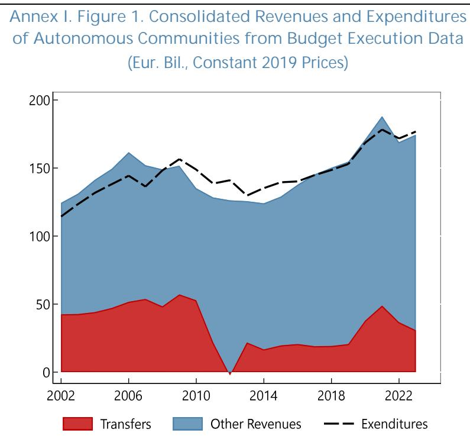  
Sources: Ministry of Finance and IMF staff calculations.
Note: Series from budget execution data published by the Ministry of Finance with cash-based accounting.

Annex I. Figure 2. Debt-to-GDP Ratios of Individual Autonomous Communities (Percent of GDP)  
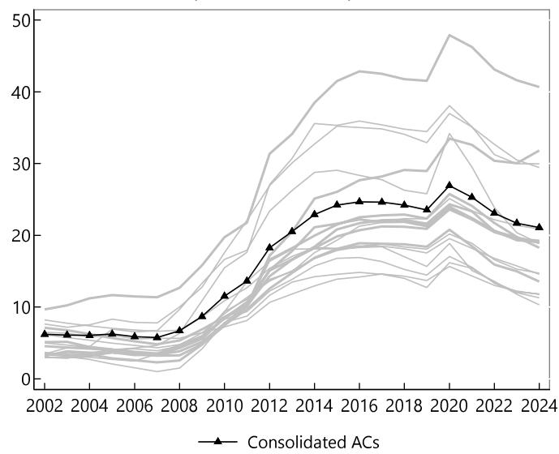  
Sources: Bank of Spain and IMF staff calculations.

Annex I. Table 1. Spain: Robustness Checks of Panel Regression of Expenditure on the Cyclical Component of Real GDP

<table><tr><td rowspan="2">VARIABLES</td><td colspan="4">Total Expenditure</td><td colspan="4">Primary Expenditure</td><td colspan="4">Public Consumption</td></tr><tr><td>(1)</td><td>(2)</td><td>(3)</td><td>(4)</td><td>(5)</td><td>(6)</td><td>(7)</td><td>(8)</td><td>(7)</td><td>(8)</td><td>(9)</td><td>(10)</td></tr><tr><td>Regional GDP - Detrended</td><td>0.362***(0.059)</td><td>0.395***(0.057)</td><td>0.087**(0.039)</td><td>0.345***(0.023)</td><td>0.434***(0.061)</td><td>0.470***(0.059)</td><td>0.108***(0.039)</td><td>0.439***(0.057)</td><td>0.348***(0.027)</td><td>0.372***(0.026)</td><td>0.124***(0.018)</td><td>0.345***(0.023)</td></tr><tr><td>Constant</td><td>0.004***(0.000)</td><td>0.003***(0.000)</td><td>-0.000***(0.000)</td><td>-0.001(0.004)</td><td>0.004***(0.000)</td><td>0.003***(0.000)</td><td>0.000(0.000)</td><td>0.002(0.004)</td><td>0.003***(0.000)</td><td>0.003***(0.000)</td><td>0.000***(0.000)</td><td>-0.001(0.004)</td></tr><tr><td>Liquidaciones</td><td></td><td></td><td></td><td>0.007(0.007)</td><td></td><td></td><td></td><td>0.002(0.008)</td><td></td><td></td><td></td><td>0.007(0.007)</td></tr><tr><td>Observations</td><td>300</td><td>340</td><td>357</td><td></td><td>300</td><td>340</td><td>357</td><td></td><td>300</td><td>340</td><td>357</td><td></td></tr><tr><td>Number of CAs $^{1}$ </td><td>15</td><td>17</td><td>17</td><td></td><td>15</td><td>17</td><td>17</td><td></td><td>15</td><td>17</td><td>17</td><td></td></tr><tr><td>IV 1: Neighbors&#x27; GDP</td><td>YES</td><td>YES</td><td>-</td><td>YES</td><td>YES</td><td>YES</td><td>-</td><td>YES</td><td>YES</td><td>YES</td><td>-</td><td>YES</td></tr><tr><td>IV 2: Trading Partners GDP</td><td>YES</td><td>-</td><td>YES</td><td>YES</td><td>YES</td><td>-</td><td>YES</td><td>YES</td><td>YES</td><td>-</td><td>YES</td><td>YES</td></tr><tr><td>Foral Communities</td><td>NO</td><td>YES</td><td>YES</td><td>YES</td><td>NO</td><td>YES</td><td>YES</td><td>YES</td><td>NO</td><td>YES</td><td>YES</td><td>YES</td></tr><tr><td>First-Stage F-stat</td><td>225.1</td><td>423.8</td><td>318.6</td><td>264</td><td>225.1</td><td>423.8</td><td>318.6</td><td>264</td><td>225.1</td><td>423.8</td><td>318.6</td><td>264</td></tr><tr><td>P-val</td><td>0.00</td><td>0.00</td><td>0</td><td>0.00</td><td>0.00</td><td>0.00</td><td>0</td><td>0.00</td><td>0.00</td><td>0.00</td><td>0</td><td>0.00</td></tr><tr><td>R Sq. - Between</td><td>0.247</td><td>0.322</td><td>0.0141</td><td>0.0497</td><td>0.239</td><td>0.310</td><td>0.0230</td><td>0.0461</td><td>0.329</td><td>0.390</td><td>0.0474</td><td>0.00240</td></tr><tr><td>R Sq. - Within</td><td>0.0250</td><td>0.0257</td><td>0.0241</td><td>0.0289</td><td>0.0319</td><td>0.0330</td><td>0.0298</td><td>0.0359</td><td>0.0657</td><td>0.0654</td><td>0.0590</td><td>0.0736</td></tr></table>

Robust standard errors in parentheses  
\*\*\* p<0.01, \*\* p<0.05, \* p<0.1

Sources: IGAE, INE, and IMF staff calculations.

<table><tr><td>VARIABLES</td><td>(1) Total Expenditure</td><td>(2) Primary Expenditure</td><td>(3) Public Consumption</td></tr><tr><td>Regional GDP</td><td>0.238***(0.049)</td><td>0.295***(0.052)</td><td>0.284***(0.024)</td></tr><tr><td>GFC * Regional GDP</td><td>2.694***(0.320)</td><td>2.984***(0.322)</td><td>1.413***(0.209)</td></tr><tr><td>Constant</td><td>0.004***(0.000)</td><td>0.004***(0.000)</td><td>0.003***(0.000)</td></tr><tr><td>Observations</td><td>340</td><td>340</td><td>340</td></tr><tr><td>Number of id</td><td>17</td><td>17</td><td>17</td></tr><tr><td>IV 1: Neighbors&#x27; GDP</td><td>YES</td><td>YES</td><td>YES</td></tr><tr><td>IV 2: Trading Partners GDP</td><td>YES</td><td>YES</td><td>YES</td></tr><tr><td>First-Stage F-stat</td><td>264</td><td>264</td><td>264</td></tr><tr><td>P-Val.</td><td>0.00</td><td>0.00</td><td>0.00</td></tr><tr><td>R Sq. - Between</td><td>0.109</td><td>0.110</td><td>0.0816</td></tr><tr><td>R Sq. - Within</td><td>0.158</td><td>0.175</td><td>0.133</td></tr><tr><td colspan="4">Robust standard errors in parentheses*** p&lt;0.01, ** p&lt;0.05, * p&lt;0.1</td></tr></table>

<table><tr><td>VARIABLES</td><td>(1) Total Expenditure</td><td>(2) Primary Expenditure</td><td>(3) Public Consumption</td></tr><tr><td>D% Regional GDP</td><td>0.152*</td><td>0.176*</td><td>0.151**</td></tr><tr><td></td><td>(0.091)</td><td>(0.099)</td><td>(0.062)</td></tr><tr><td>Constant</td><td>0.016***</td><td>0.015***</td><td>0.020***</td></tr><tr><td></td><td>(0.003)</td><td>(0.004)</td><td>(0.002)</td></tr><tr><td>Observations</td><td>340</td><td>340</td><td>340</td></tr><tr><td>Number of CAs&#x27;</td><td>17</td><td>17</td><td>17</td></tr><tr><td>IV 1: Neighbors&#x27; GDP</td><td>YES</td><td>YES</td><td>YES</td></tr><tr><td>IV 2: Trading Partners GDP</td><td>YES</td><td>YES</td><td>YES</td></tr><tr><td>First-Stage F-stat</td><td>169.9</td><td>169.9</td><td>169.9</td></tr><tr><td>R Sq.</td><td>0.009</td><td>0.011</td><td>0.024</td></tr><tr><td colspan="4">Robust standard errors in parentheses</td></tr><tr><td colspan="4">*** p&lt;0.01, ** p&lt;0.05, * p&lt;0.1</td></tr></table>

Sources: IGAE, INE, and IMF staff calculations.

Annex I. Table.4. Spain: System-GMM Specification with Arellano-Bond Instruments of Expenditure for the Panel Regression of Expenditure on the Cyclical Component of Real GDP

<table><tr><td>VARIABLES</td><td>(1) Total Expenditure</td><td>(2) Primary Expenditure</td><td>(3) Public Consumption</td></tr><tr><td>Regional GDP - Detrended</td><td>0.149***(0.047)</td><td>0.173***(0.050)</td><td>0.200***(0.025)</td></tr><tr><td>Total Expenditure t-1</td><td>0.701***(0.016)</td><td></td><td></td></tr><tr><td>Primary Expenditure t-1</td><td></td><td>0.681***(0.015)</td><td></td></tr><tr><td>Public Consumption t-1</td><td></td><td></td><td>0.756***(0.021)</td></tr><tr><td>Constant</td><td>0.004***(0.000)</td><td>0.004***(0.000)</td><td>0.004***(0.000)</td></tr><tr><td>Observations</td><td>340</td><td>340</td><td>340</td></tr><tr><td>Number of CAs&#x27;</td><td>17</td><td>17</td><td>17</td></tr><tr><td>P-val of AB Test for AR-1</td><td>0.00</td><td>0.00</td><td>0.00</td></tr><tr><td>P-val of AB Test for AR-2</td><td>0.14</td><td>0.33</td><td>0.27</td></tr><tr><td>P-val Hansen J test</td><td>0.09</td><td>0.09</td><td>0.13</td></tr><tr><td colspan="4">Robust standard errors in parentheses*** p&lt;0.01, ** p&lt;0.05, * p&lt;0.1</td></tr><tr><td colspan="4">System GMM specification with both fist-differences and level equation; moment conditions for the lag dependent variables include lags 2 to 10. Instruments for regional GDP growth include growth of neighboring regions and Spain&#x27;s trading partner growth.</td></tr></table>

Sources: IGAE, INE, and IMF staff calculations.