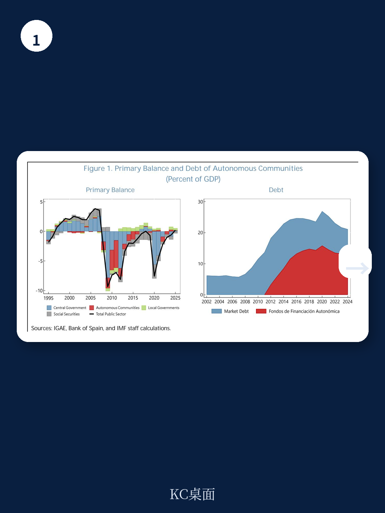
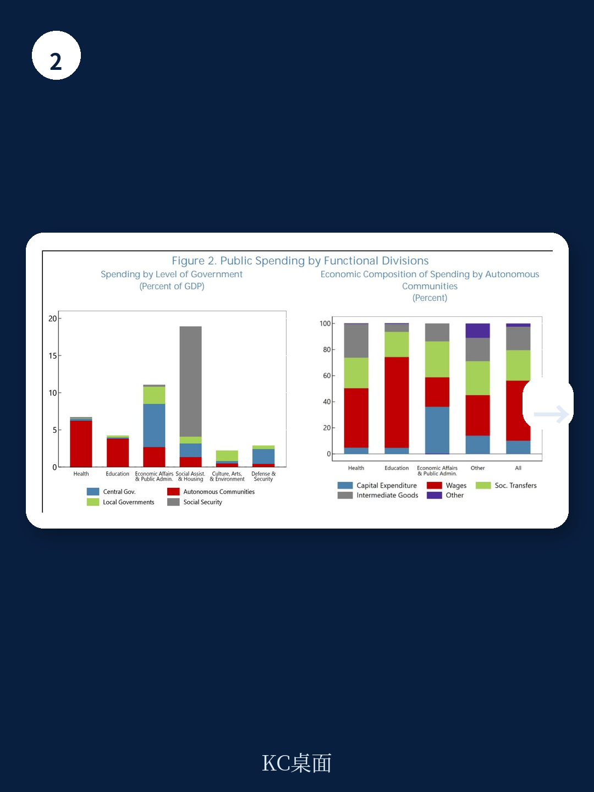

# IMF：西班牙地方财政的顺周期陷阱，需要一个支出增长锚

西班牙的自治区（Autonomous Communities）承担了全国超过四分之一的公共支出，尤其是在教育和医疗这两个与长期人力资本最相关的领域。然而，IMF最新一份Selected Issues Paper揭示了一个令人不安的事实：过去二十年，西班牙地方政府的公共支出不仅没有起到稳定经济的作用，反而在衰退期间大幅削减了教育和医疗开支——这在欧元区主要国家中几乎是独一无二的。

这份由IMF欧洲部经济学家Carlo Pizzinelli撰写的报告，核心判断清晰而锐利：西班牙现行的多重地方财政规则没有实现两个基本目标——避免顺周期支出和确保债务可持续性。而欧盟新经济治理框架的落地，恰好为改革提供了一个制度窗口。

报告建议，将地方财政规则的核心从复杂的赤字、债务、支出增速多重目标，简化为一个以支出增长为锚的单一规则。这不仅是技术调整，更是一次财政哲学的重塑。

---

## 1. 西班牙地方政府的顺周期支出，在欧元区是一个异类

报告通过2004至2024年的面板数据回归发现，西班牙自治区的总支出与地区GDP之间存在显著的正相关关系——这意味着经济好的时候多花钱，经济差的时候少花钱。更令人警惕的是，这种顺周期特征在2008年全球金融危机之后变得更加明显。

> **KC评论：** 顺周期支出本身并不罕见，罕见的是西班牙地方政府的支出顺周期主要集中在教育和医疗领域。报告对比了欧元区其他主要国家，发现这些国家的教育和医疗支出基本是逆周期或非周期的——经济下行时，中央政府会通过转移支付维持这些基本公共服务的稳定。而西班牙的自治区在危机中被迫削减了这些最不应该削减的开支。

这种做法的代价是长期的。报告引用文献指出，衰退期间削减教育和医疗支出会延长经济衰退的持续时间——经济学上称为“滞后效应”（hysteresis）——并对人力资本和潜在产出造成持久伤害。换句话说，今天的财政紧缩，可能在十年后变成更低的生产率和更慢的增长。

## 2. 现行规则的问题不在于目标太少，而在于目标太多且相互矛盾

西班牙2012年通过的《预算稳定与财政可持续性组织法》（LOEPSF）设定了多重地方财政目标：赤字率、支出增速和债务水平。理论上，这套规则试图同时约束多个维度；但实际上，它造成了两个根本性问题。

第一，多重目标之间存在内在不一致。报告详细分析了这一点：当一个地区面临收入下降时，赤字目标和支出增长目标会同时被触发，但两个目标对财政行为的指引方向往往是冲突的。这导致地方政府在实际操作中往往选择“选择性遵守”——哪个目标更容易达成就优先满足哪个，而真正重要的财政纪律反而被架空。

第二，规则没有有效解决“软预算约束”问题。2014年之后，西班牙中央政府设立了名为“自治区融资基金”的流动性支持工具，初衷是帮助地方在危机后获得低成本融资。但报告指出，这套机制在事实上削弱了市场对地方财政的纪律约束。地方政府知道，如果陷入财务困境，中央政府最终会出手相助——这种预期本身就鼓励了不负责任的财政行为。

> **KC评论：** 这不是西班牙独有的问题。全球范围内，地方政府的“软预算约束”是财政联邦制中最棘手的治理难题之一。IMF报告的独特贡献在于，它没有简单地把问题归咎于地方政府的道德风险，而是指出：现行规则的设计本身就为这种道德风险留下了空间。如果想彻底解决这个问题，需要从规则设计的底层逻辑入手——而这正是报告提出支出增长锚的出发点。

## 3. 支出增长锚为什么比赤字目标更适合西班牙

报告的核心政策建议是：将地方财政规则的重心转移到“支出增长上限”上。这个建议的逻辑链条非常清晰。

第一步，支出增长上限直接约束了地方政府最直接可控的变量——支出。相比之下，赤字目标受收入波动影响很大，而收入在很大程度上是地方政府无法控制的。当经济下行、税收减少时，为了满足赤字目标，地方政府只有两个选择：削减支出或增加借贷。但增加借贷又会触发债务目标，最终几乎必然导致支出削减——这正是2008年之后发生的事情。

第二步，支出增长上限天然具有反顺周期的特性。如果规则规定地方支出只能按一个固定的、与潜在增长率挂钩的速度增长，那么在经济繁荣时期，超出预期的税收收入就不能被立即花掉，而必须用于偿还债务或积累储备。反过来，在经济衰退时，地方政府不需要削减支出，因为规则允许支出按既定路径增长，即使当期收入下降。

第三步，报告特别强调，这个规则需要与中央政府的转移支付机制配合。如果中央政府在衰退期间削减对地方的转移支付，那么即使地方想维持支出稳定也做不到。因此，报告建议中央政府的转移支付也应该具有反顺周期的特征——在衰退时增加、在繁荣时减少。

## 4. 报告没有完全回答的两个关键问题

尽管IMF报告的分析框架非常扎实，但它也留下了两个需要进一步讨论的问题。

第一个问题是：如何确定地区差异化的支出增长上限？报告提出了两种选项——要么对所有地区设定统一的上限，但要求高债务地区承担更严格的调整义务；要么为每个地区设定个性化的上限。两种方案各有优缺点。统一上限简单透明，但可能导致低增长地区被迫过度压缩；个性化上限更精准，但容易陷入政治博弈和“讨价还价”的陷阱。报告对此没有给出明确的取舍建议，而是留给了政策制定者。

第二个问题是：规则的执行机制如何设计才能避免再次被架空？西班牙过去十年的事实表明，即使有了明确的规则，如果违规成本过低，规则仍然是纸老虎。报告提到了需要“清晰且可执行的纠正机制”，但没有具体展开什么样的机制才是有效的——是自动化的财政扣减，还是外部机构的强制介入？这恰恰是完整报告中最值得深入研读的部分。

> **KC评论：** 这两个问题恰恰是IMF完整报告中用大量图表和跨国比较来讨论的内容。比如，报告对比了欧元区其他国家的执行经验，分析了不同纠正机制的有效性。这些细节在摘要中无法完整呈现，但对于真正关心政策落地的读者来说，是必须啃下来的硬骨头。

## 5. 对中国地方财政改革的镜鉴意义

虽然这篇报告聚焦于西班牙，但它的分析框架对中国的地方财政改革同样具有参考价值。

中国的地方政府同样承担了大量的公共服务支出责任，尤其是教育和医疗。近年来，地方财政压力加大，部分地区的债务问题引起了广泛关注。西班牙的经验表明，仅仅设定多个相互独立的财政指标是不够的——这些指标之间可能存在内在矛盾，导致规则在执行中被选择性遵守。

更值得警惕的是，西班牙在2008年之后经历的顺周期支出削减，与中国部分地区目前面临的“减支压力”在逻辑上有相似之处。如果地方政府的支出规则只盯着赤字和债务，而不考虑支出本身的周期特征，那么在经济下行时，教育和医疗等基本公共服务很可能会成为最先被压缩的对象——而这对长期增长的伤害，可能需要十年甚至更长时间才能显现。

---

这份IMF报告的核心价值，不在于给出了一个完美的答案，而在于提出了一个更好的问题：地方财政规则的目标，到底是约束地方政府的“乱花钱”，还是确保地方政府在正确的时候花正确的钱？前者是控制导向的，后者是功能导向的。西班牙的教训表明，如果规则设计只盯着前者，最终可能连后者也做不到。

报告的完整版本包含了更多细节：不同地区的债务可持续性模拟、支出周期的跨国比较图表、以及现行规则与欧盟新框架的逐条对照分析。这些内容对于理解政策设计的深度和复杂度，是不可或缺的。

如果你想获取这份IMF报告的完整中文解读、原始图表数据，以及我们每日更新的全球投行研报摘要（由AI agent+人工review生成，约10-40页，涵盖高盛、摩根士丹利、摩根大通、瑞银等机构的最新观点），欢迎加入我们的社群。每天，我们会把最新鲜的market dynamics和关键图表推送到你手上——既方便喂给AI做进一步分析，也方便你快速把握全球资本市场的脉搏。

Personal reading notes and learning share only. Not investment advice.

