ASHLEY WOO, LAUREN COVELLI, SRIKANT KUMAR SAHOO, CATHERINE H. AUGUSTINE

# How Schools and After- School Programs Can Collaborate to Support Academic Alignment

Over recent decades, a heightened focus on standards-based accountability and the federal government's 21st Century Community Learning Centers (21st CCLC) initiative have highlighted the role that after-school programs (ASPs) play in supporting academic achievement (Granger, 2008; Simpson and Olkovsky, 2012). School systems' efforts to respond to pandemic learning losses have only intensified momentum toward leveraging ASPs as an avenue

## KEY FINDINGS

Just over half of surveyed principals with after-school programs (ASPs) agreed that their after-school programming was academically aligned to instruction provided during the school day.

When asked to describe efforts and strategies at their school or district to align school-day and after-school instruction, some principals said that their ASPs had a minimal focus on academics, while others said that their ASPs explicitly reinforced school-day learning through after-school activities.

■ Principals of secondary schools, urban schools, and high-poverty schools were more likely than their counterparts to report that their after-school programming aligned academically to school-day instruction.

■ Principals with school- or district-staff-provided ASPs more often reported that their ASPs academically aligned to school-day instruction than did principals with ASPs provided by an external partner.

■ Principals said that ASPs used tutoring, enrichment activities, and homework help sessions to deliver academic content, although the extent of academic alignment varied within and across these approaches.

Collaborative structures between schools and ASPs, such as shared resources, staff, and data, created conditions that facilitated academic alignment.

for improving academic outcomes (Arundel, 2022; Catolico, 2023; Covelli, Woo, and Augustine, 2026; Grant, 2023).

As schools seek opportunities to bolster student learning, fostering academic alignment between schools and their ASPs has emerged as a promising practice to extend students' learning opportunities. In this report, we define academic alignment as the degree to which after-school programming is coordinated with school-day instruction. We hypothesize that this alignment may manifest through coordination across learning goals, content, instructional strategies, or sequencing—although, in practice, schools may vary in their approaches to and definitions of academic alignment.

Despite a trend toward viewing after-school programming as a venue for academic improvement, studies on ASPs' impact on academic outcomes find mixed results. Some research shows that participation in structured ASPs is associated with small gains in reading and math (Lauer et al., 2006; Granger, 2008; Knopf et al., 2015; Shernoff, 2010; Yao et al., 2023). Other studies show weak or largely null average effects on academics (Zief, Lauver, and Maynard, 2006; Lester, Chow, and Melton, 2020).

Some strategies appear to work better than others. Research suggests that ASPs most effectively support academic achievement, particularly in math and literacy, when intentionally designed around academic goals rather than focused on general supervision, recreation, or homework completion without

## Abbreviations

21st CCLC 21st Century Community Learning Centers
AEP American Educator Panels
ASLP American School Leader Panel
ASP after-school program
CBO community-based organization
K-12 kindergarten through 12th grade
NGCS Next Generation Community Schools
NYC New York City
NYCPS New York City Public Schools
PD professional development
STEM science, technology, engineering, and math

structured support (Knopf et al., 2015; Lauer et al., 2006). Effective approaches include tutoring, targeted skill-building activities, and enrichment models that integrate academic content in engaging ways rather than replicating the school day (Knopf et al., 2015; Lauer et al., 2006; Nickow, Oreopoulos, and Quan, 2024). Student experience also matters: Programs that are engaging, appropriately challenging, and meaningful to students are more likely to lead to academic benefits (Shernoff, 2010). These findings point to the importance of intentional academic integration, in which ASP programming deliberately builds academic skills while leveraging the flexibility and engagement advantages of out-of-school-time settings (Beckett et al., 2009; Granger, 2008).

Yet, the research on academic alignment remains limited (Beckett et al., 2009). Most studies only indirectly address alignment, often pointing to the importance of partnerships, coherence, or intentional design without empirically examining how alignment is implemented or measured (Granger, 2008; Afterschool Alliance, 2014). One recent study, however, points to the potential promise of academic alignment: In this study, researchers found that tutoring aligned to core instruction had a greater positive impact on academic outcomes than non-aligned tutoring (Jackson and Shakeel, 2025), building on prior research demonstrating that strong instructional coherence can improve student achievement (Newmann et al., 2001). Anecdotal reports highlight practices likely to cultivate academic alignment, such as fostering communication between after-school staff and teachers, aligning instructional materials, and reinforcing school-day learning goals (Afterschool Alliance, 2011). Beyond this anecdotal data, we lack information about the extent to which schools are working toward academic alignment or the strategies and school structures that should be in place to better foster this alignment.

This report aims to fill these knowledge gaps by (1) providing national data about the state of academic alignment between school-day and after-school instruction, (2) illustrating at a national level how schools and ASPs put academic alignment into practice, and (3) identifying factors that enable or impede academic alignment. We anticipate that this report will be useful to school and district

leaders and ASP leaders seeking to leverage ASPs to strengthen academic learning, as well as community school leaders who often collaborate with community-based organizations (CBOs) to provide expanded learning opportunities to students.

## Purpose and Approach

During the 2023–2024 and 2024–2025 school years, RAND researchers evaluated the Next Generation Community Schools (NGCS) pilot program, an initiative to enhance academic instruction in 20 New York City (NYC) community schools (Covelli, Woo, and Augustine, 2026). One goal of this pilot program was to support academic alignment between school-day instruction and the after-school programming provided by partner CBOs. RAND's evaluation of this pilot highlighted promising strategies for enacting academic alignment, such as the use of a dedicated staff member responsible for liaising between the school and after-school setting. However, this study also exposed the challenges of putting such a broad concept into practice (Covelli, Woo, and Augustine, 2026).

In our study of the NGCS pilot, we surveyed NYC community school leaders about the extent to which their after-school programming aligned to school-day instruction. For this report, we administered the same survey item to a nationally representative sample of 1,038 kindergarten through 12th grade (K–12) public school principals, which allowed us to extend our prior work in NYC to a national scale.

In this report, we explore

1. the extent to which schools enact academic alignment

2. how principals' reports of academic alignment vary by school context and ASP type

3. how schools enact academic alignment in practice and the factors that support or hamper such alignment.

For the first two topics, we draw on data from closed-ended survey items. For the third topic, we draw on principals' open-ended responses (n = 753) about strategies or efforts at their school or district to align instruction between their school's after-school programming and school-day instruction. Impor-

tantly, we did not provide principals with a definition of academic alignment, which means that they could have interpreted the concept in different ways. For more information about our data and methods, see the “How This Analysis Was Conducted” section at the end of this report.

After presenting findings on whether and how schools enact academic alignment in practice, we provide recommendations on how education leaders can strengthen academic alignment in their contexts.

## Just over Half of Principals with ASPs Agreed That the Programming Aligned Academically to School-Day Instruction

We first asked principals whether after-school programming is available to students at their school and, if so, where it occurs (i.e., off-site or on-site) and who provides it (i.e., school or district staff or an external partner). Seventy-six percent of principals reported that some type of ASP is available to their students. $^{1}$ On-site, school- or district-staff-provided ASPs were most common: 94 percent of principals with ASPs reported the availability of on-site ASPs, and 71 percent reported the availability of school- or district-staff-provided ASPs. In contrast, only 19 percent reported off-site ASPs, and 56 percent reported external-partner-provided ASPs. Percentages sum to more than 100 because principals could report the availability of multiple ASPs.

Among principals with ASPs, about half (52 percent) either somewhat or strongly agreed that their after-school programming aligned to school-day academic instruction (Figure 1). Twenty percent were neutral, and 29 percent disagreed. Because only about three-fourths of principals reported the availability of after-school programming, our data suggest that fewer than half of schools nationally offer an ASP aligned academically to school-day instruction. More often, either schools do not provide an ASP or they provide after-school programming that does not align well to school-day instruction. In the sections that follow, we explore whether princi-

Percentage of Principals Agreeing or Disagreeing That Their After-School Programming Aligns to Academic Instruction Provided During the School Day

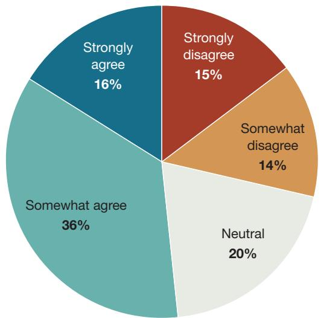  
NOTE: This figure shows principals' responses to the following survey item: "Please specify the extent to which you agree with the following statement: Our afterschool programming is aligned to the academic instruction we provide during the school day." Only principals who had previously indicated that after-school programming was available to students at their school received this survey item. $N = 786$ .

pals' reports of academic alignment vary by school characteristics.

## Principals of Secondary Schools, Urban Schools, and High-Poverty Schools Were More Likely to Report Academic Alignment

Principals' reports of academic alignment increased with grade level (Figure 2). Elementary principals were least likely to agree that their ASP academically aligned with instruction provided during the school day (46 percent), while high school principals were most likely to agree (67 percent). We hypothesize that elementary ASPs may be more likely to focus on play or child care than academics—a point that is further supported by our qualitative data, as we describe

later. In comparison, older students may be more likely to stay after school to seek targeted academic support.

Principals serving high-poverty schools and urban schools were also more likely than their counterparts to agree that their school's ASP is academically aligned to school-day instruction. $^{2}$ Although higher rates of academic alignment may be considered a desirable feature of after-school programming, these patterns may reflect that ASPs for more-vulnerable populations focus more on academics, while ASPs for more-advantaged students may focus more on enrichment. Prior evidence suggesting that students from historically marginalized backgrounds have less access to extracurricular activities, such as art, music, and athletics, supports this hypothesis (Meier, Hartmann, and Larson, 2018; Snellman, Silva, and Putnam, 2015).

## Principals Reporting the Availability of School- or District-Provided After-School Programming Were More Likely to Report Academic Alignment

To determine whether academic alignment was related to (1) where an ASP occurs or (2) who provides the ASP, we explored principals' reports of alignment by ASP type. Principals most often agreed that after-school programming aligned with school-day instruction when their school had an on-site ASP provided by school or district staff (59 percent), followed by an off-site ASP provided by school or district staff (52 percent) (Figure 3). Fewer principals reported academic alignment when external partners staffed the ASP, regardless of whether it was offered on-site (45 percent) or off-site (41 percent). This suggests that staffing ASPs with school or district staff is a stronger predictor of principals' perceptions of academic alignment than location, although academic alignment may be boosted slightly when the ASP occurs on-site.

As we will discuss later, this finding is supported by our qualitative data. Principals' reports suggest that school staff inherently bring knowledge and skills from the school day to the after-school setting that foster academic alignment; conversely, principals may experience more difficulty in influencing an ASP run by an external organization.

Percentage of Principals Agreeing That Their After-School Programming Aligns to Academic Instruction Provided During the School Day, by School Characteristics  
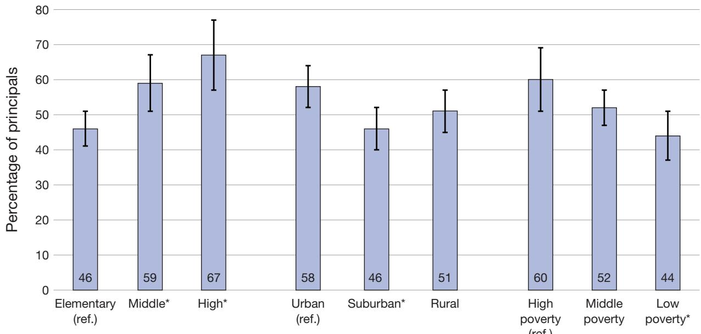  
NOTE: This figure shows principals' responses to the following survey item: "Please specify the extent to which you agree with the following statement: Our afterschool programming is aligned to the academic instruction we provide during the school day." Data displayed show a sum of principals who responded either "Somewhat agree" or "Strongly agree." Only principals who had previously indicated that after-school programming was available to students at their school received this survey item. This item is shown alongside school characteristics merged in from the National Center for Education Statistics Common Core of Data. Asterisks indicate that the subgroup is significantly different from the reference category ("ref.") at the level of $p < 0.05$ . Black bars represent 95-percent confidence intervals. $N = 786$ .

## Some Principals Said That Their ASPs Have a Minimal Focus on Academics, While Others Said That Their ASPs Explicitly Reinforce School-Day Learning Through After-School Activities

To gain a more concrete understanding of how schools are—or are not—enacting academic alignment in practice, we asked principals to describe strategies or efforts at their school or district to align instruction during the school day and in ASPs. Principals' open-ended responses ( $n = 753$ ) suggest that schools work toward academic alignment to varying degrees, with some principals reporting no efforts

and others reporting extensive efforts to explicitly use ASPs to reinforce school-day learning (Figure 4).

On one end of the spectrum, about one-fifth of principals reported that there were no efforts to align learning occurring during the school day and in ASPs. In most of these cases, principals said that their ASPs were not academic in nature. Notably, three-fourths of these principals were elementary principals, which could explain why, in their closed-ended responses, elementary principals were less likely to report the presence of academic alignment. These principals stated that the ASPs were designed for “child care,” “babysitting,” or play time. Or they said that ASPs included enrichment activities that were meant to be “taken for fun” or that principals perceived as non-academic in nature, such as athletics or art. Some principals (about 45 of them) also noted that their ASPs operate autonomously from their school, meaning that they had no influence over the content of the program. These principals—nearly all of whom indicated the availability of a CBO-run ASP

FIGURE 3

Percentage of Principals Agreeing or Disagreeing That Their After-School Programming Is Aligned to Academic Instruction Provided During the School Day, by Type of ASP Provided

FIGURE 4  
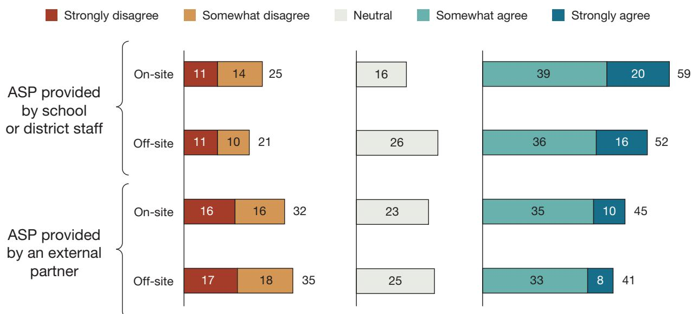  
Percentage of principals

NOTE: This figure shows principals' responses to the following survey item: "Please specify the extent to which you agree with the following statement: Our afterschool programming is aligned to the academic instruction we provide during the school day." Only principals who had previously indicated that after-school programming was available to students at their school received this survey item. This item is shown alongside principal responses to the following survey item: "During the 2025-2026 school year, which of the following after-school programming is available for students at your school? Select all that apply." $N = 786$ .

Illustrative Examples of Degrees of Academic Alignment Between Schools and Their ASPs

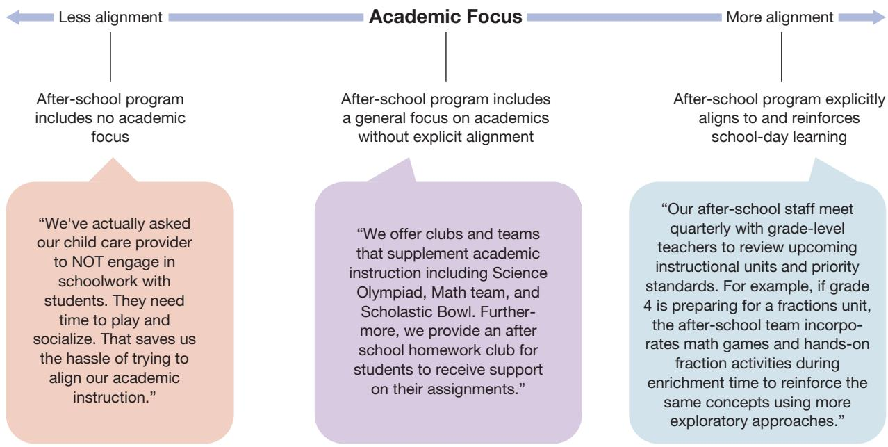

in their closed-ended survey response $^{3}$ —sometimes noted that the organizations running their ASPs had their own curricula and activities. A very small number of principals indicated that, even if the ASP were to integrate an academic focus into its programming, the level of academic rigor would not match that of the school day. Unsurprisingly, most of these principals also disagreed that their ASPs aligned academically to school-day instruction. Overall, principals’ responses indicate a few key barriers to academic alignment, including principals’ attitudes toward the role of ASPs in supporting academics and principals’ lack of influence over the content of after-school programming.

On the other end of the spectrum, other principals described explicit efforts to reinforce school-day learning through after-school opportunities. About one-fourth of responding principals described efforts to use after-school programming as an extension of the school day. These principals said that their ASPs offered students additional opportunities to preview, learn, and practice skills and concepts learned during the school day. A few principals also noted that after-school staff reinforced school-day learning by using the same instructional strategies (e.g., reading strategies, use of academic vocabulary, gradual release) to provide students with consistent approaches across both settings.

Additionally, about one-tenth of responding principals said that ASPs focused on filling in students' academic gaps. This included both recruiting struggling learners for ASP participation and using ASPs to address students' skill gaps, as identified during the school day. Alignment appeared to be strongest when schools and ASPs combined these strategies. For instance, one principal noted,

Teachers share weekly updates on current units, skill gaps, and upcoming assessments, allowing afterschool staff to design activities that provide targeted support in reading, math, and science. For example, when students are working on argumentative writing in English Language Arts, afterschool sessions include guided writing workshops and peer editing activities focused on the same writing standards.

Principals' responses also suggested a middle ground, in which ASPs incorporated a general focus on academic content but did not explicitly reinforce learning that occurred during the school day. As we discuss in further detail next, examples included homework help sessions, enrichment activities with an academic focus (e.g., math or reading clubs), and tutoring programs that provide academic supports.

## ASPs Deliver Academic Content Through Tutoring, Enrichment Activities, and Homework Help Sessions, Although the Extent of Alignment Varies Within and Across These Approaches

Principals' responses suggest that there are several vehicles through which ASPs can deliver academic content. The most common instructional approaches, which were each mentioned by about one-fifth of responding principals, were tutoring, enrichment activities (e.g., clubs, extracurriculars), and homework help sessions. Less commonly, principals also named the use of online programs (e.g., Lexia, i-Ready) or other forms of unspecified instruction (i.e., where principals' descriptions did not clearly refer to direct instruction, tutoring, or any other forms of intervention or remediation). As noted earlier, principals' reports suggest that ASPs vary in the degree to which they incorporate academics and explicitly align their programming to school-day learning. Accordingly, we observed variation in the extent to which principals described academic alignment both across different instructional approaches and within them (Figure 5).

Among those instructional approaches described by principals, tutoring may most readily foster academic alignment, in part because tutoring is inherently academic in nature. For instance, among principals who noted the availability of after-school tutoring, about 70 percent agreed in their closed-ended responses that their ASPs aligned academically to school-day instruction, compared with about half of principals who noted the presence of after-school homework help sessions or enrichment activities. Yet, we still observed variation in the degree of academic alignment described by principals who said that their ASPs provided tutoring. For instance, some principals noted that their ASPs provided tutoring focused on core academic content areas (e.g., reading, math) but did not reference specific efforts to align the tutoring to school-day instruction. Other principals described higher degrees of alignment. For instance, they noted that after-school tutoring provided targeted support to students needing additional interventions, based on data collected during the school day. Or they noted that tutoring focused on academic content, standards, and instructional materials addressed or used during the school day.

Illustrative Examples of How the Extent of Academic Alignment Varies Across and Within Instructional Approaches  
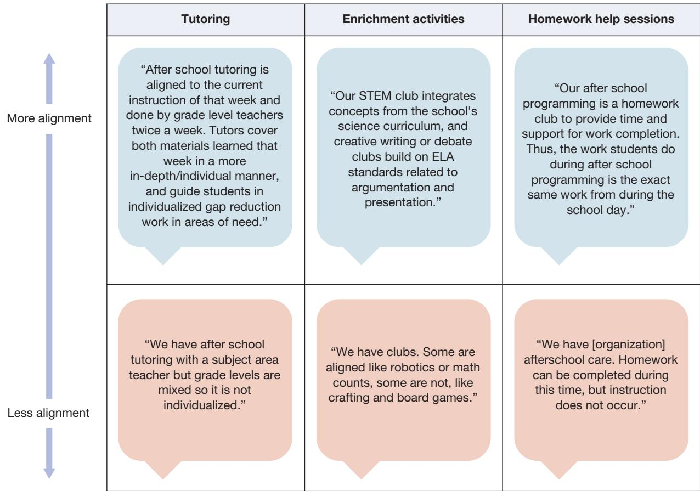  
NOTE: ELA = English language arts; STEM = science, technology, engineering, and math.

In contrast, principals' responses suggest that after-school enrichment can run the gamut from being not academically focused, to academically focused without explicit alignment, to explicitly aligned to school-day instruction. Among principals who reported the presence of after-school enrichment activities, about half said that the enrichment activities integrated academics in some way (e.g., reading clubs, STEM activities, coding, robotics). Very few principals noted specific alignment of enrichment activities to school-day learning. In these few cases, principals said that ASPs aligned enrichment activities to standards or the school curriculum or that the ASPs used enrichment activities to reinforce skills learned during the school day through a more hands-on approach (e.g., through games or real-world applications of academic skills). One principal illustrated how academic alignment varied across instructional approaches, noting that ASP tutoring—but not

ASP enrichment activities—aligned to school-day instruction:

The after school programming that is run by school staff is a musical, running clubs, soccer, and tutoring. The first three are not aligned to the academic instruction, but tutoring is heavily aligned.

Homework help sessions, cited by about one-fifth of responding principals, appeared to be a weak academic alignment strategy. Like tutoring, principals described homework help as inherently academic. However, principals generally described this after-school support as a space where students received homework assistance, rather than a support intentionally designed to reinforce and enhance school-day learning. A few principals perceived homework support as linked to school-day learning because students worked on academic content from the school day.

## Collaborative Structures Between Schools and ASPs Create Conditions That Facilitate Academic Alignment

Given this wide variation in academic alignment, we next explore factors that could help schools achieve stronger alignment. When asked about strategies that their school or district used to support academic alignment, principals often described the importance of collaborative structures, such as mechanisms to share resources, staff, and data (Figure 6).

FIGURE 6
Collaborative Structures Supporting Academic Alignment  
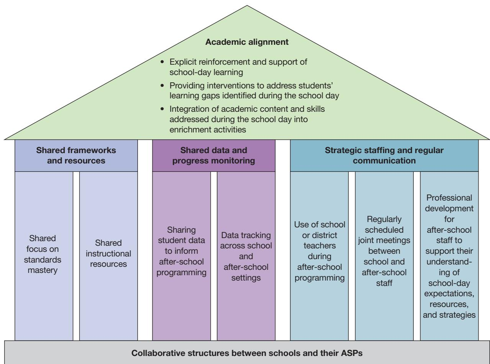

## Principals Said That Shared Learning Frameworks and Resources Bridge School-Day and After-School Instruction

Principals' open-ended responses suggest that shared frameworks and resources can help bridge learning between the school day and after school (Figure 7). About 50 principals explained that their ASPs aligned programming to state standards. Standards alignment took different forms in ASPs. Principals said that ASP instruction or tutoring targeted standards taught during the school day or, less commonly, that enrichment activities connected to academic standards. A few principals also noted alignment to other learning frameworks, such as “graduate profiles” that outline school or district priorities.

About 50 principals also said that their ASPs used the same instructional resources as those used during the school day, which allowed ASPs to extend school-day learning. One principal noted, “[ASP teachers] are following the same scope and sequence and standards and curriculum that is used during the school day.” Principals also said that students could use the same online programs in ASPs as they did during the school day, such as i-Ready or IXL. Even when schools and ASPs did not share instructional resources, a few principals said that their ASPs used materials that were aligned to or that supplemented their school's curriculum.

## Sharing Student Data with ASPs Facilitates Stronger Academic Alignment

Principals' responses also suggest that sharing data across school and ASP settings can support academic alignment (Figure 8). About 50 principals said that their schools shared data generated during the school day with ASPs to inform after-school programming. These data ranged from teachers' informal identification of students' skill deficits to data drawn from interim assessments (e.g., i-Ready, NWEA MAP), literacy screeners, and state standardized assessments. These data informed ASPs about which students to support (e.g., through intentional student groupings to support differentiation or invitations to attend the ASP), which skill gaps to target, and which instructional strategies and resources to use. A few principals also noted progress monitoring to track student growth, sometimes with the same assessment across settings.

FIGURE 7

Illustrative Examples of How Schools and ASPs Use Shared Frameworks and Resources to Support Academic Alignment

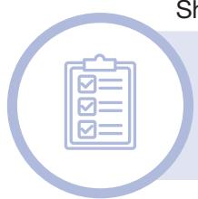

Shared focus on standards mastery

“Enrichment clubs, such as STEAM and Art, extend learning through hands-on, real-world applications that connect to science, literacy, and critical thinking standards.”

Shared instructional resources

"The students use the same digital remediation/intervention platform as during the school day to maintain alignment between instruction provided during the school day and after-school tutoring."

NOTE: STEAM = science, technology, engineering, art, and math.

Illustrative Examples of How Schools and ASPs Share Data to Support Academic Alignment

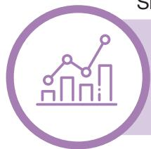

## Sharing student data to inform after-school programming

"A system is in place for teachers and after-school providers to easily share information about student performance and areas of need. . . . After an in-class assessment, the classroom teacher shares the results with the after-school provider. The after-school session can then be tailored to provide targeted support for students who are struggling with a specific concept, using methods discussed with the teacher."

Data tracking across settings

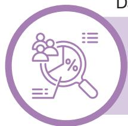

“Student progress is monitored using the same assessments as during the school day to ensure continuity and academic growth.”

## Strategic Staffing and Regular Communication Help Schools and ASPs Share Goals, Resources, and Strategies

Principals' responses suggest that strategically staffing ASPs is one avenue toward greater academic alignment (Figure 9). One common strategy, mentioned by about 100 principals, was to staff ASPs with teachers who already work in the school or district. Some of these principals said that these teachers were able to use their understanding of school-day instruction, including students' needs, concepts covered, and instructional resources used, to align ASP instruction. This helps explain why, in our closed-ended survey data, principals reporting the availability of an ASP provided by school or district staff more often agreed that their ASPs aligned to school-day instruction (see Figure 3).

Another strategy involved open channels of communication and collaboration between the school and ASP. About 100 principals described activities supporting collaboration at both the leadership level (e.g., between the principal and the ASP director) and the staff level (e.g., between teachers and ASP staff). Many of these principals noted regularly scheduled meetings between the school and ASP; these ranged from weekly check-ins or co-planning sessions with teachers and ASP staff to monthly, quarterly, or beginning-of-the-year meetings between school and ASP leadership to share priorities. Principals said that these meetings allowed school staff to set goals and expectations, share resources and strategies, and communicate about students' areas of need and progress. As one principal shared,

The instructional coaches/specialists in my building partner with the afterschool program coordinator to be sure they know who in the program needs specific academic support, then they provide resources so students can be supported in the same way they are in class.

A few principals also noted some technological mechanisms allowing for more-robust collaboration, such as online spreadsheets where teachers could enter student supports needed and learning management systems where teachers could share resources with ASP staff. This collaborative approach then allowed ASP staff to better tailor their programming to address students' specific areas of need and to target content and skills taught during the school day through pre-teaching, re-teaching, tutoring, or more hands-on approaches.

Less commonly, principals (about 15 of them) also named professional development (PD) as a way to bolster academic alignment. A few principals

Illustrative Examples of How Schools and ASPs Leverage Strategic Staffing and Regular Communication to Support Academic Alignment

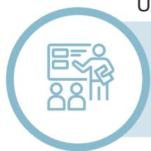

Use of school or district teachers during after-school programming

“Many of our after school employees also work at the school during the school day so they are able to plan activities that align with what students are doing during the school day.”

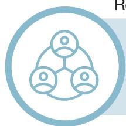

Regularly scheduled joint meetings between school and ASP staff

“Director and Principal meet monthly. We participate in shared goal setting. The after school director attends our staff meetings and their staff are invited to our PDs.”

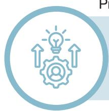

Professional development for ASP staff

"After school staff receive professional development on instruction and expectations."

noted that they may provide PD to ASP staff, ASP staff may be invited to school PD, or ASP directors may attend school or district meetings. Through this PD, schools strengthened ASP staff members' understanding of schools' curricula, instructional strategies, and expectations.

Importantly, staff collaboration appeared to underpin both the sharing of instructional resources and data described earlier. This suggests that school and ASP staff collaboration may be a foundational precondition for creating opportunities to bridge school-day and ASP learning.

## Summary and Recommendations

In this report, we used data from a nationally representative principal survey to examine academic alignment between ASPs and school-day instruction. Our data suggest that many schools are working

toward academic alignment to some extent, although fewer than half of all schools nationally offer academically aligned after-school programming. Alignment was more common in secondary schools, urban schools, and high-poverty schools. We may have observed these results because ASPs in these contexts might focus more on remediation than do ASPs in more-advantaged settings, which may instead place a greater emphasis on enrichment.

Principals' reports about how they approach alignment revealed a wide spectrum of experiences, from ASPs with no academic focus to those explicitly reinforcing school-day learning through shared curricula, data-driven targeting of skill gaps, and common instructional strategies. Collaborative structures that bridged school-day and ASP learning, such as shared resources, staff, and data, emerged as key facilitators of alignment. These structures allowed school and ASP staff to develop a common understanding of priority learning goals and coordinate the use of instructional resources, allowing for

# District leaders seeking to support academically aligned ASPs should clearly message that priority to principals.

a more seamless transition from school-day to after-school learning.

However, principals' responses also suggested some barriers to academic alignment. Challenges to collaboration can make it more difficult to support coordination across school and ASP settings. Leader mindsets can be another barrier. For instance, some principals expressed that academics are not or should not be a core element of after-school programming; in their contexts, after-school programming might be more focused on serving other purposes (e.g., child care, social skills, or enrichment activities, such as sports or arts). These leader mindsets appear to influence the extent to which school leaders said that ASPs can and should engage in academic alignment.

We offer the following recommendations to those ASP and school and district leaders seeking to support academic alignment in their contexts.

District leaders could create the conditions for academic alignment by communicating its importance and supporting the selection of ASP partners that are open to collaboration with schools. First, district leaders seeking to support academically aligned ASPs should clearly message that priority to principals. Our findings reveal that principals vary in how they view the role of ASPs in supporting academics. Some described their ASPs primarily as child care, play-based, or providing non-academic enrichment opportunities, which suggests that they may not yet see academic alignment as a goal worth pursuing. For these principals, increasing alignment may require shifting their mindsets about ASPs' potential to enhance school-day learning. District leaders could name this as an explicit goal and communicate to

school leaders the potential benefits of academic alignment.

Second, where schools are partnering with CBOs for after-school programming, district leaders should be intentional about selecting and supporting partnerships with after-school vendors that are open to collaboration and academic alignment. District leaders should consider CBOs' staffing models, willingness to engage in ongoing collaboration with school leadership and staff, pedagogical knowledge, and academic content knowledge.

For instance, where possible, district leaders should facilitate after-school partnerships with CBOs that are open to hiring school staff, including teachers, because school staff bring an inherent understanding of school-day instruction, student needs, and instructional resources that naturally facilitates alignment.

Funding, staffing, or scheduling constraints may limit this approach. Moreover, schools may intentionally choose to partner with CBOs to run their ASPs, given CBOs' potential specialized content expertise or access to resources (e.g., receipt of 21st CCLC funding). When external partners staff ASPs, establishing collaborative structures becomes even more essential, as we discuss next.

Schools and ASPs could develop intentional, systematic routines to enhance collaboration, such as channels to share information and scheduled joint meetings. Our data show that collaboration across school and ASP settings is foundational to academic alignment. Our data point to several actionable strategies to support collaboration. Whether ASPs chose to staff their programs with

# School and ASP staff should have routine, structured opportunities to co-plan, which can help ASP staff understand what teachers cover during the school day, which students need targeted support and in what areas, which instructional resources and strategies to use, and how students are progressing across both settings through shared data.

school staff or not, school and ASP staff should have routine, structured opportunities to co-plan, which can help ASP staff understand what teachers cover during the school day, which students need targeted support and in what areas, which instructional resources and strategies to use, and how students are progressing across both settings through shared data. These opportunities might arise through regularly scheduled joint meetings, PD sessions for ASP staff, and invitations for ASP leaders and staff to attend school or district PD sessions or meetings. To further formalize collaboration, schools and ASPs might consider designating staff to act as liaisons between both settings.

Our prior work suggests that community schools may be especially poised to improve academic alignment because of the funding they receive for external CBO partnerships, the presence of dedicated staff to collaborate with CBOs, and the autonomy they have over how to manage their relationship with an ASP (Covelli, Woo, and Augustine, 2026). Although our current findings show that less than half of principals nationwide reported offering academically aligned after-school programming, our prior NYC community school research found that roughly three-fourths of surveyed NYC community school principals reported academic alignment (Covelli, Woo, and Augustine, 2026). Even though this recommendation around promoting collaboration across ASP and school settings applies broadly to any schools seeking to work toward academic alignment with their ASPs, community schools have an opportunity to lead the field in improving alignment between school-day and ASP learning.

School and ASP leaders could seek opportunities to provide academically aligned enrichment activities. Schools and ASPs should weigh the trade-offs between driving more-explicit academic instruction and preserving time for enrichment that broadens students' learning experiences beyond traditional academics. This balance matters because disadvantaged students may disproportionately receive academic remediation during after-school hours at the expense of enrichment opportunities (Meier, Hartmann, and Larson, 2018; Snellman, Silva, and Putnam, 2015).

Our data suggest that it is possible for ASPs to retain a focus on enrichment and support academic learning. However, academically aligned enrichment opportunities require intentional planning and coordination between school and ASP staff to ensure that enrichment activities build on learning occurring during the school day. Principals described strategies such as mapping enrichment activities to academic standards or using hands-on or exploratory enrichment approaches to reinforce school-day learning (e.g., through games, project-based learning opportunities, or a focus on applying academic skills to real-world issues).

## Limitations

This research has several limitations. First, as with all survey research, our results are drawn from principals' self-reports. We did not define academic alignment for principals, in part because we wanted to understand principals' conceptualizations and strategies for academic alignment. Therefore, especially when interpreting principals' closed-ended responses about their perceptions of the degree of alignment between after-school programming and instruction provided during the school day, it is important to keep in mind that principals may not have had a consistent definition of academic alignment. Additionally, principals may have varying levels of awareness of the programming and activities offered by their ASPs. Especially for off-site ASPs, principals might be providing their best estimation of the extent of academic alignment.

In the open-ended question, we asked principals to provide examples of strategies or efforts at their school or district to align after-school programming and school-day instruction. Given the broad question, the fact that we did not ask principals to exhaustively list all alignment strategies and efforts, and our non-representative qualitative sample, the perspectives shared by our sample of principals might be more or less prevalent in the general population of principals than our data currently suggest.

## How This Analysis Was Conducted

This report draws on survey data collected from the 2025 American School Leader Panel (ASLP) Omnibus survey. The RAND American Educator Panels (AEP) team administered the ASLP Omnibus to a national sample of 1,038 K–12 public school principals. The AEP team sampled principals and weighted responses to be nationally representative of K–12 public school principals. The team created survey weights that account for (1) the individual- and school-level characteristics of each respondent, calibrated so that these characteristics closely match the characteristics of the national population of public school leaders based on the National Center for Education Statistics' National Teacher and Principal Survey; (2) the probability of selection into the survey sample using the full ASLP as a frame; and (3) the probability of a principal completing the survey. $^{4}$

We asked principals the following survey questions:

1. During the 2025–2026 school year, which of the following after-school programming is available for students at your school?

2. Please specify the extent to which you agree or disagree with the following statement: Our after-school programming is aligned to the academic instruction we provide during the school day.

3. Please describe examples of strategies or efforts at your school or district to align instruction between your school's after-school programming and academic instruction provided during the school day, including specific examples of what this alignment looks like.

The first question allowed principals to report on the availability of after-school programming offered to students at their school; response options included (1) on-site after-school programming provided by school or district staff, (2) on-site programming provided by an external partner organization, (3) off-site programming provided by school or district staff, or (4) off-site programming provided by an external partner. Principals could select all options that apply, or they could select that their school does not provide after-school programming.

Principals received the second and third questions only if they had previously indicated that after-school programming was available for students at their school. The third question asked principals to provide an open-ended response, and 753 principals did so.

For the closed-ended survey questions, we report sample-wide and subgroup-specific means and proportions of variables of interest. To examine where academic alignment was strong and where it could be improved, we examined principals' responses

across different school characteristics, such as grade level, locale, school poverty level, and the racial demographics of the student population. $^{5}$ When examining these comparisons, we used two-sided pairwise t-tests to determine statistical significance (p < 0.05). We did not make statistical adjustments for multiple comparisons because the intent of this report is to provide exploratory, descriptive information rather than to test specific hypotheses or causal relationships.

To analyze the open-ended question, one qualitative researcher first coded a set of responses and developed an inductive coding scheme. Then we uploaded principals' open-ended responses to an internal artificial-intelligence-powered research platform, Muse, that leverages large language models and advanced natural language processing to support qualitative research. This platform generated its own codebook, which we then used to refine our initial coding scheme. The final coding scheme included definitions for codes, as well as inclusion and exclusion criteria (as appropriate) to guide Muse's coding. $^{6}$ We then used Muse to apply codes across our qualitative dataset and reviewed coded excerpts (48 percent of total responses) to provide the platform with feedback to refine its code application. We downloaded the final coded excerpts and further refined the coding by manually recoding as needed. Our qualitative analysis aimed to identify broad patterns in the strategies and approaches that schools can take to support academic alignment. When we discuss the open-ended data, we include proportions or counts (e.g., “about 50 principals” or “one-third of responding principals”) to provide a sense of how frequently some themes arose in our analysis.

## Notes

$^{1}$ We asked about four types of ASPs: (1) on-site after-school programming provided by school or district staff (selected by 70 percent of principals reporting the availability of an ASP at their school), (2) on-site after-school programming provided by an external partner (48 percent), (3) off-site after-school programming provided by school or district staff (4 percent), and (4) off-site after-school programming provided by an external partner organization (17 percent). These ASP types are not mutually exclusive because principals could select all types available at their school. Sixty-eight percent of principals reported the availability of only one type of ASP, and the remaining 32 percent reported the availability of at least two types. One caveat is that principals reporting the availability of more than one type are not necessarily reporting that multiple different ASPs are available at their school. For instance, an on-site ASP may include both school or district staff members and external staff members. In this case, only one program may be available, but principals may have selected multiple types on the survey.

$^{2}$ To explore whether these differences were driven by relationships between school characteristics and ASP setting (i.e., on-site or off-site) or staffing (i.e., school or district staff or external partner), we checked for differences in ASP offerings by school characteristics, and we found no meaningful differences. In other words, schools across these subgroups were equally likely to offer the different types of ASPs that we asked about.

$^{3}$ Nearly 60 percent of our qualitative sample reported the presence of an ASP provided by an external partner.

$^{4}$ We recycled text regarding the administration of the ASLP Omnibus survey from Diliberti et al., 2024.

$^{5}$ To compare responses for principals in schools with different demographic profiles, we matched their responses to school-level data from the Common Core of Data.

$^{6}$ Codes included those related to staffing (e.g., the use of school-day teachers in ASPs, PD for ASP staff), ASP activities (e.g., tutoring, homework support, enrichment activities), forms of academic alignment (e.g., standards alignment, use of after-school programming to fill in students' academic gaps), use of shared data across settings, and challenges and limitations in promoting academic alignment.

## References

Afterschool Alliance, “Aligning Afterschool with the Regular School Day: The Perfect Complement,” MetLife Foundation Afterschool Alert, Issue Brief No. 50, July 2011. As of April 7, 2026:
https://afterschoolalliance.org/documents/issue\_briefs/issue\_schoolDay\_50.pdf

Afterschool Alliance, Taking a Deeper Dive into Afterschool: Positive Outcomes and Promising Practices, February 2014. As April 7, 2026:
https://eric.ed.gov/?id=ED557914

Arundel, Kara, “By the Numbers: The Post-COVID Growth of Tutoring,” K-12 Dive, November 8, 2022. As of May 8, 2026: https://www.k12dive.com/news/tutoring-k-12-schools-numbers/636014/

Beckett, Megan, Geoffrey Borman, Jeffrey Capizzano, Danette Parsley, Steven Ross, Allen Schirm, and Jessica Taylor, Structuring Out-of-School Time to Improve Academic Achievement: A Practice Guide, National Center for Education Evaluation and Regional Assistance, Institute of Education Sciences, U.S. Department of Education, NCEE 2009-012, July 2009. As of May 8, 2026: https://ies.ed.gov/ncee/wwc/Docs/PracticeGuide/ost\_pg\_072109.pdf

Catolico, Eleanore, “Can After-School Programs Help Children Recover from the Pandemic?” EdSurge, April 10, 2023. As of April 23, 2026: https://www.edsurge.com/news/2023-04-10-can-after-school-programs-help-children-recover-from-the-pandemic

Covelli, Lauren, Ashley Woo, and Catherine H. Augustine, Next Generation Community Schools in New York City: An Implementation Study of Academic Enhancements in Community Schools, RAND Corporation, RR-A4386-1, 2026. As of April 7, 2026:

Diliberti, Melissa Kay, Heather L. Schwartz, Sy Doan, Anna Shapiro, Lydia R. Rainey, and Robin J. Lake, Using Artificial Intelligence Tools in K–12 Classrooms, RAND Corporation, RR-A956-21, 2024. As of April 7, 2026: https://www.rand.org/pubs/research\_reports/RRA956-21.html

Granger, Robert C., “Afterschool Programs and Academics: Implications for Policy, Practice, and Research,” Child Policy Nexus, Vol. 22, No. 2, 2008.

Grant, Jodi, “School/OST Partnerships Help Kids Thrive, Thanks to Pandemic Funding,” The Wallace Foundation, June 15, 2023. As of April 23, 2026: https://wallacefoundation.org/resource/article/schoolost-partnerships-help-kids-thrive-thanks-pandemic-funding

Jackson, Cara, and Ayman Shakeel, Creating Coherence: Does Instructional Alignment Affect the Impact of Tutoring? Annenberg Institute at Brown University, EdWorkingPaper No. 25-1332, November 2025.

Knopf, John A., Robert A. Hahn, Krista K. Proia, Benedict I. Truman, Robert L. Johnson, Carles Muntaner, Jonathan E. Fielding, Camara Phyllis Jones, Mindy T. Fullilove, Pete C. Hunt, Shuli Qu, Sajal K. Chattopadhyay, Bobby Milstein, and the Community Preventive Services Task Force, “Out-of-School-Time Academic Programs to Improve School Achievement: A Community Guide Health Equity Systematic Review,” Journal of Public Health Management and Practice, Vol. 21, No. 6, November/December 2015.

Lauer, Patricia A., Motoko Akiba, Stephanie B. Wilkerson, Helen S. Apthorp, David Snow, and Mya L. Martin-Glenn, “Out-of-School-Time Programs: A Meta-Analysis of Effects for At-Risk Students,” Review of Educational Research, Vol. 76, No. 2, Summer 2006.

Lester, Ashlee M., Jason C. Chow, and Theresa N. Melton, "Quality Is Critical for Meaningful Synthesis of Afterschool Program Effects: A Systematic Review and Meta-Analysis," Journal of Youth and Adolescence, Vol. 49, 2020.

Meier, Ann, Benjamin Swartz Hartmann, and Ryan Larson, "A Quarter Century of Participation in School-Based Extracurricular Activities: Inequalities by Race, Class, Gender, and Age?" Journal of Youth and Adolescence, Vol. 47, No. 6, March 13, 2018.

Newmann, Fred M., BetsAnn Smith, Elaine Allensworth, and Anthony S. Bryk, “Instructional Program Coherence: What It Is and Why It Should Guide School Improvement Policy,” Educational Evaluation and Policy Analysis, Vol. 23, No. 4, Winter 2001.

Nickow, Andre, Philip Oreopoulos, and Vincent Quan, “The Promise of Tutoring for PreK–12 Learning: A Systematic Review and Meta-Analysis of the Experimental Evidence,” American Educational Research Journal, Vol. 61, No. 1, February 2024.

Shernoff, David J., “Engagement in After-School Programs as a Predictor of Social Competence and Academic Performance,” American Journal of Community Psychology, Vol. 45, 2010.

Simpson, Sarah, and Anna Olkovsky, “A Brief History of 21st Century Community Learning Centers,” Afterschool Alliance, webpage, June 25, 2012. As of April 23, 2026: https://www.afterschoolalliance.org/afterschoolSnack/A-Brief-History-of-21st-Century-Community-Learning-Centers\_06-25-2012.cfm

Snellman, Kaisa, Jennifer M. Silva, and Robert D. Putnam, "Inequity Outside the Classroom: Growing Class Differences in Participation in Extracurricular Activities," Voices in Urban Education, No. 40, 2015.

Yao, Jing, Jijun Yao, Peixuan Li, Yifan Xu, and Lai Wei, “Effects of After-School Programs on Student Cognitive and Non-Cognitive Abilities: A Meta-Analysis Based on 37 Experimental and Quasi-Experimental Studies,” Science Insights Education Frontiers, Vol. 17, No. 1, 2023.

Zief, Susan Goerlich, Sherri Lauver, and Rebecca A. Maynard, "Impacts of After-School Programs on Student Outcomes," Campbell Systematic Reviews, Vol. 2, No. 1, 2006.

## Acknowledgments

We are grateful to the principals who agreed to participate in the panels. We thank Vanessa Miller for serving as the survey manager and Daniel Wang for serving as the data manager for this survey, and we thank Tim Colvin for programming the survey. Thanks to Dorothy Seaman for producing the sampling and weighting for these analyses. We also greatly appreciate the administrative support provided by Tina Petrossian. We are grateful to our partners at the New York City Public Schools Office of Community Schools and the NYC Mayor's Office for Economic Opportunity for supporting this work on academic alignment. We thank Ben Master, Jennifer Leschitz, and Nikki Yamashiro for helpful feedback that greatly improved this report. We thank Nora Spiering for her editorial expertise and Monette Velasco for overseeing the publication process.

## About This Report

In this report, we provide national data about the state of academic alignment between school-day and after-school learning and illustrate at a national level how schools put academic alignment into practice.

We drew on a survey of principals from the American School Leader Panel (ASLP), a nationally representative sample of more than 8,000 principals across the United States. The ASLP is one of three survey panels that compose the American Educator Panels (AEP), which are nationally representative samples of teachers, school leaders, and district leaders across the country. The panels are a proud member of the American Association for Public Opinion Research's Transparency Initiative. If you are interested in using AEP data for your own surveys or analysis or in reading publications using AEP data, please email aep@rand.org or visit www.rand.org/aep.

## RAND Education, Employment, and Infrastructure

This work was conducted in the Education and Employment Program of RAND Education, Employment, and Infrastructure, a division of RAND that aims to improve educational opportunity, economic prosperity, and civic life for all. For more information, visit www.rand.org/eei or email EEI@rand.org.

## Funding

This research was sponsored by New York City's Mayor's Office for Economic Opportunity, in partnership with New York City Public Schools (NYCPS), the Fund for NYCPS, and Robin Hood.

The findings and recommendations we present are solely attributable to us and do not necessarily reflect the opinions of our funders or partners.

For more information on our partners, see the following:

\- New York City's Mayor's Office for Economic Opportunity: https://www.nyc.gov/site/opportunity/index.page

• New York City Public Schools: https://www.schools.nyc.gov/

• Fund for New York City Public Schools: https://www.fundfornycps.org/

• Robin Hood: https://robinhood.org/

RAND is a research organization that develops solutions to public policy challenges to help make communities throughout the world safer and more secure, healthier and more prosperous. RAND is nonprofit, nonpartisan, and committed to the public interest.

## Research Integrity

Our mission to help improve policy and decisionmaking through research and analysis is enabled through our core values of quality and objectivity and our unwavering commitment to the highest level of integrity and ethical behavior. To help ensure our research and analysis are rigorous, objective, and nonpartisan, we subject our research publications to a robust and exacting quality-assurance process; avoid both the appearance and reality of financial and other conflicts of interest through staff training, project screening, and a policy of mandatory disclosure; and pursue transparency in our research engagements through our commitment to the open publication of our research findings and recommendations, disclosure of the source of funding of published research, and policies to ensure intellectual independence. For more information, visit www.rand.org/about/research-integrity.

RAND's publications do not necessarily reflect the opinions of its research clients and sponsors. RAND® is a registered trademark.

For more information on this publication, visit www.rand.org/t/RRA4386-2.

© 2026 The Fund for Public Schools

## www.rand.org