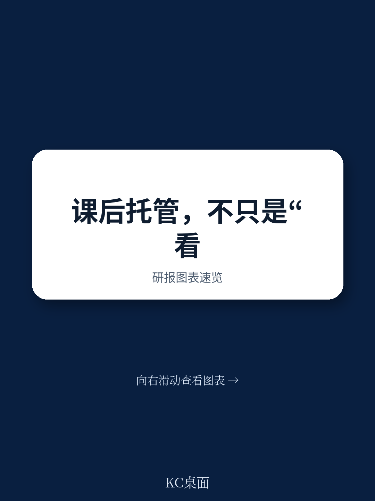
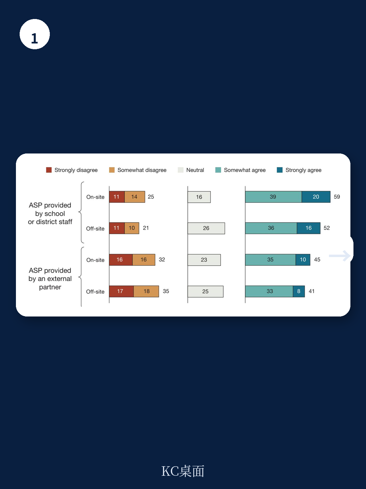
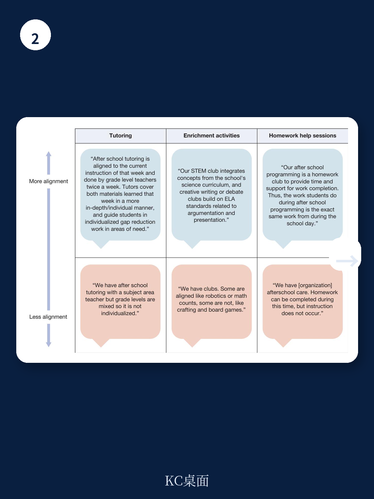

# 兰德公司：仅半数校长认为课后班与课堂衔接，结构性断层比想象中更深

当教育系统将课后项目视为弥补疫情学习损失的关键抓手时，一份来自兰德公司的全国性调查给出了一个耐人寻味的数据：在全国范围内，仅有约半数的公立学校校长认为，他们学校的课后项目在学术上与课堂内的教学是“对齐”的。更值得关注的是，这个比例背后隐藏着深刻的阶层、学段和治理结构差异。

这份基于对全美1038名K-12公立学校校长调查的报告，并非一份简单的“现状描述”。它揭示了美国公立教育体系中一个长期被忽视的结构性断层：课后项目究竟应该扮演“看护者”的角色，还是“教学延伸”的角色？不同学校、不同学生的答案截然不同，而这种差异本身，正在加剧教育公平的老问题。

> **KC评论：** 这份报告的核心洞察不在于“一半校长说没对齐”，而在于“谁在说对齐，谁在说没对齐”。当高贫困学校和城市学校的校长更倾向于认为课后班与课堂对齐时，这并非他们做得更好，而可能恰恰反映了课后项目的功能分化——弱势群体的孩子被投入更多“补课式”课后班，而优势群体的孩子则拥有更多“去学术化”的探索时间。这是教育公平的一个新维度。

## 1. 学术对齐的“及格线”之下，是功能定位的根本分歧

报告的核心发现是，在拥有课后项目的校长中，仅有52%同意或强烈同意其课后项目与学校日教学在学术上对齐。这意味着，如果再算上那24%根本未提供课后项目的学校，全美实际上只有不到四成的学校同时具备课后项目且校长认为其具备学术对齐性。

这一数据本身并不令人意外，但报告通过开放式问题的分析，揭示了“不及格”背后的深层原因。约五分之一的校长坦承，他们的学校根本没有任何对齐的努力。其中，绝大多数是小学的校长，他们明确表示，课后项目的定位就是“看护”、“玩耍”或提供“非学术性的”兴趣活动，如体育和艺术。

> **KC评论：** 这里的关键分歧在于“课后项目是什么”的底层假设。对于许多小学，尤其是资源相对充足的小学而言，课后是孩子全面发展、释放天性的时间，强行加入学术对齐反而可能违背教育规律。但对于那些将课后项目视为“补救工具”的高贫困学校而言，学术对齐是核心使命。两种定位没有绝对的对错，但它们在同一教育体系内并存，导致了资源分配和评价标准的混乱。

这引出了一个根本性的追问：当政策制定者呼吁“利用课后项目提升学业成绩”时，他们是否默认了所有课后项目都应该以学术为纲？这份报告的价值在于，它没有给出一个简单的答案，而是提供了理解这一复杂问题的框架。

## 2. 谁在推动对齐？高年级、高贫困、城市学校的“被迫选择”

报告进一步揭示了哪些学校更倾向于报告学术对齐。数据显示，高中校长（67%）比小学校长（46%）更可能认为课后项目与课堂对齐。同样，高贫困学校和城市学校的校长也显著高于其对应组别。

这一结果看似矛盾：通常被认为资源更紧张、挑战更大的高贫困和城市学校，反而在“对齐”上得分更高。但这恰恰印证了上述“功能分化”的假设。对于这些学校而言，课后项目往往不是锦上添花的“兴趣班”，而是雪中送炭的“补课班”。高中学生更可能主动寻求学术支持，而高贫困学校则更依赖课后时间弥补课堂内学习不足的问题。

**这种“对齐”是主动的战略选择，还是被动的生存策略？** 报告没有直接回答，但数据指向了后者。当一所学校的主要目标是让学生通过标准化考试时，课后项目自然会被工具化。反观那些富裕学区的学校，课后项目可能提供的是机器人编程、戏剧表演、马术等非学术活动，这些活动同样能提升学生竞争力，但在“学术对齐”的问卷上，它们得分很低。

这对教育决策者的启示是：单纯追求“学术对齐”的指标，可能会诱导学校将课后时间狭隘地用于应试准备，反而牺牲了学生全面发展的机会。一个真正有效的政策，应当区分不同情境，为不同类型的课后项目设定不同的评价标准。

## 3. 治理结构决定对齐质量：校内自办 vs. 外部合作

报告中最具操作性的发现，来自对课后项目提供方的分析。数据显示，由学校或学区员工运营的校内课后项目，其校长报告学术对齐的比例最高（59%）。相比之下，由外部合作伙伴（如社区组织CBO）运营的项目，即使在校内开展，对齐比例也大幅下降至45%。

这一差异在开放式回答中得到了充分印证。许多校长反映，外部机构运营的课后项目往往“自行其是”，使用自己的课程和活动，校长几乎没有影响力。甚至有校长直言，即使外部机构试图融入学术内容，其学术严谨度也无法与学校日相比。

**这揭示了一个核心矛盾：** 学校希望课后项目成为课堂的延伸，但外部合作伙伴往往有自己的组织使命和运营逻辑。CBO可能更关注青少年的社会情感发展、艺术熏陶或社区参与，而非严格的学术目标。当双方缺乏有效的沟通机制和共同的目标设定时，“对齐”就成了一句空话。

> **KC评论：** 这份报告对“社区学校”模式提出了一个尖锐的提醒。社区学校的核心特征之一就是引入CBO提供综合服务，但这份数据表明，如果缺乏强有力的协调机制和共同的教学语言，这种合作反而可能导致学术断层。报告提到的“专职联络员”是一个可能的解决方案，但需要额外的资源投入。对于正在或计划推广社区学校模式的中国城市而言，这个教训值得提前消化：合作不是简单的“引进来”，而是“融进去”。

## 4. 报告尚未完全回答的关键问题：对齐的“度”在哪里？

尽管报告提供了丰富的全国性数据，但它并未完全回答一个更本质的问题：学术对齐的“度”应该在哪里？换句话说，课后项目与课堂到底应该对齐到什么程度，才能既提升学业成绩，又不扼杀课后项目的独特价值？

报告引用的文献表明，过度强调学术对齐，可能使课后项目沦为“学校日的复制品”，从而丧失其吸引力和灵活性。而完全不关注学术，又可能浪费了课后这段宝贵的、低风险的学习时间。报告提到了“结构化支持”、“针对性技能培养”和“融入学术内容的拓展活动”等有效策略，但并未给出一个可量化的对齐标准。

**这是一个悬而未决的难题。** 对于一所高中而言，课后项目可能是直接针对SAT考试的刷题班，这显然是对齐的极致。但对于一所小学而言，课后项目可能是通过搭建乐高来学习物理原理，这算不算对齐？如果算，它的对齐度又如何测量？

这份报告为读者提供了一个观察框架：评价一个学校的课后项目，不应只看它是否“对齐”，更要看它“对什么齐”、“对多少齐”、“以什么方式对齐”。当“对齐”成为政策口号时，我们更需要警惕它可能带来的形式主义和资源错配。

## 5. 留给决策者的观察框架：从“是否对齐”到“如何协同”

基于报告的数据和洞察，我们可以提炼出一个更具操作性的观察框架，供教育管理者、学校校长和社区组织负责人参考：

第一，**明确课后项目的核心定位。** 学校需要先回答“我们的课后项目是为了什么？”是学术补救、兴趣拓展、社会情感学习，还是单纯的看护？定位不同，对齐的标准就不同。试图用一个标准衡量所有项目，只会导致数据失真和管理混乱。

第二，**建立沟通与数据共享机制。** 报告指出，“共享资源、员工和数据”是促进对齐的关键条件。学校与课后项目提供方之间，需要建立定期的、结构化的沟通，分享学生的学习进展、教学重点和困难。没有数据支撑的对齐，只能是盲人摸象。

第三，**投资于“边界角色”。** 报告在纽约市的案例研究中提到，“专职联络员”是促进对齐的有效策略。这个角色需要同时理解课堂和课后两个场景，能够将教学语言翻译成课后活动语言。这是一个被严重低估的岗位，但可能是打通“断层”的关键。

第四，**警惕“对齐”的负外部性。** 当政策过度奖励“对齐”时，学校可能会驱逐那些非学术但有价值的课后活动，如艺术、体育和自由游戏。决策者需要设计一套多元评价体系，让不同类型的课后项目都能找到自己的价值坐标。

这份兰德公司的报告，最终指向的是一个更宏大的命题：在一个强调标准化、问责制的教育体系中，如何为“非正式学习”保留空间？课后项目作为课堂与家庭之间的“第三空间”，其独特的价值恰恰在于它的“非正式性”和“灵活性”。如果我们用课堂的尺子去丈量它，我们可能正在扼杀它最宝贵的品质。

> **KC评论：** 报告的结论是克制的，但它留下的思考空间是巨大的。对于关注教育创新的读者，这份报告的价值不在于它提供的答案，而在于它提出的问题：我们是否正在用一种工业化的思维，去管理一个需要生态化思维的系统？课后项目的未来，或许不在于它与课堂“对齐”得有多好，而在于它与课堂“互补”得有多深。

**以上只是这份报告部分核心发现的解读。关于“不同课后项目类型（如辅导、拓展活动、作业帮助）在实现学术对齐上的具体差异”、“校长们提到的具体协作机制与障碍”，以及“报告对社区学校模式的详细建议”等更深层次的内容，由于篇幅所限无法一一展开。**

完整版研报解读包含了更详细的分类数据、原始图表以及我们基于报告的延伸分析。如果你希望获取完整报告解读、原始图表，并每日收到由AI agent与人工review精选的国际投行和智库研报中文摘要（每日更新，约10-40页，方便喂给AI或快速把握市场动态），欢迎加入我们的社群，与数百位产业决策者和投资者一同深度阅读。

Personal reading notes and learning share only. Not investment advice.

