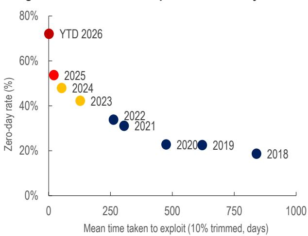

IMF

NOTES

# Artificial Intelligence and Cybersecurity in the Financial Sector

Tobias Adrian, Tamas Gaidosch, Marina Moretti, Mahvash Qureshi, and Rangachary Ravikumar

NOTE/2026/005

# ©2026 International Monetary Fund

# Artificial Intelligence and Cybersecurity in the Financial Sector\*

NOTE/2026/005

Tobias Adrian, Tamas Gaidosch, Marina Moretti, Mahvash Qureshi, and Rangachary Ravikumar

DISCLAIMER: The IMF Notes Series aims to quickly disseminate succinct IMF analysis on critical economic issues to member countries and the broader policy community. The views expressed in IMF Notes are those of the author(s), although they do not necessarily represent the views of the IMF, or its Executive Board, or its Management.

ABSTRACT: Artificial intelligence (AI) is reshaping cyber risk in the financial sector by accelerating the speed, frequency, and breadth of vulnerability discovery and potential exploitation. As AI becomes more deeply embedded in financial institutions and market infrastructures, it can strengthen cyber defense but also heighten systemic risk—particularly through shared digital infrastructure, common service providers, and machine-speed attack—defense dynamics that outpace human response. This Note argues that the main financial stability concern lies less in new types of cyberattacks than in the scale effects AI can unleash across common technologies, amplifying how quickly and widely risks spread. Strong governance, technical controls that limit the "blast radius" of breaches—that is, the scope of damage they can cause—and contain their spread, robust response and recovery capabilities, and stronger international coordination will be essential to safeguard financial stability. A whole-of-nation approach, bringing together government, the private sector, and other stakeholders, is warranted given the cross-sector implications, limited private incentives for adequate cyber risk management, and benefits of public–private collaboration.

RECOMMENDED CITATION: Adrian, Tobias, Tamas Gaidosch, Marina Moretti, Mahvash Qureshi, and Rangachary Ravikumar. 2026. “Artificial Intelligence and Cybersecurity in the Financial Sector.” IMF Note 2026/005, International Monetary Fund, Washington, DC.

Publication orders may be placed online, by fax, or through the mail:

International Monetary Fund, Publications Services
P.O. Box 92780, Washington, DC 20090, USA
Tel.: (202) 623-7430 Fax: (202) 623-7201
Email: publications@imf.org
bookstore.IMF.org
elibrary.IMF.org

## Contents

Introduction .... 5
The AI Cybersecurity Threat Landscape .... 6
Evolution of AI-Enabled Cyber Threats.... 6
Dual-Use Dynamics and the Offense–Defense Balance.... 7
Frontier AI and Autonomous Offensive Capabilities.... 8
Financial Stability Implications.... 8
Shared Infrastructure Risk .... 8
Third-Party Concentration Risk.... 9
AI-Enabled Fraud, Social Engineering, and Market Integrity.... 9
Operational Resilience.... 9
AI as a Force Multiplier for Cyber Defense.... 10
Emerging International Policy and Regulatory Frameworks.... 11
IMF Surveillance Work.... 11
Financial Stability Board.... 11
IOSCO and Securities Markets Regulators.... 12
BIS, Central Banks, and Prudential Supervisors.... 12
The European Union’s Regulatory Framework.... 12
The United Kingdom’s Approach.... 12
The United States’ Framework.... 13
Gaps and Challenges in the Current Regulatory Architecture.... 13
Benchmark Saturation and Supervisory Opacity.... 13
The Global Security Divide and EMDE Exposure.... 13
Governance Gaps in Frontier AI Development.... 14
Policy Recommendations.... 14
Conclusions.... 16
Annex 1. Key Anthropic Documents on Claude Mythos.... 17
References.... 18

# Artificial Intelligence and Cybersecurity in the Financial Sector

Tobias Adrian, Tamas Gaidosch, Marina Moretti, Mahvash Qureshi, and Rangachary Ravikumar

June 2026

Artificial intelligence (AI) is transforming the cybersecurity threat landscape in ways that pose material, nonlinear, and rapidly escalating risks to financial stability. For the financial sector, the core concern is not that AI introduces entirely new cyberattack techniques, but that its dramatic increase in the speed, frequency, and breadth with which vulnerabilities are discovered and potentially exploited. Given the high degree of financial sector interconnectedness and the reliance on shared digital infrastructure, these scale effects can turn operational weaknesses in widely used software, cloud services, and other common technologies into systemic events.

This Note assesses the financial stability implications of AI-enabled cyber threats, drawing on IMF's analytical and surveillance work alongside contributions from the international standard-setting bodies and national authorities. It emphasizes five structural vulnerabilities with systemic relevance, arising from a combination of factors—including the intrinsic properties of AI systems, the structure of the financial sector, and gaps in the existing regulatory and supervisory frameworks:

\- The dual-use and autonomous nature of AI cybersecurity capabilities, which can not only strengthen defense but also accelerate offensive activity.

\- Concentration risk arising from shared digital infrastructure, common software dependencies, and a small number of major AI and cloud service providers.

\- Gaps in oversight of third-party, operational resilience, and AI-specific cyber risks.

\- A widening global security divide that could leave emerging market and developing economies (EMDEs) disproportionately exposed as advanced defensive capabilities remain unevenly distributed.

\- Growing difficulty in safely governing frontier AI as model capabilities outpace existing benchmarks, monitoring tools, and institutional preparedness.

The Note reviews the emerging international policy and regulatory landscape and proposes seven policy actions, with particular emphasis on the following:

■ Technical controls that limit the blast radius of breaches and lateral movement.

\- Robust incident response and recovery.

■ Machine-speed defense.

\- Public–private collaboration to help ensure that defenses keep pace with rapidly advancing technological capabilities.

## Introduction

Artificial intelligence (AI) is transforming the global cybersecurity landscape in ways that pose direct, material, and growing risks to financial stability. The financial sector—already one of the most frequent targets of cyberattacks—now faces a threat environment that is not only intensifying but also changing in character (IMF 2024). As AI systems become more capable and autonomous, they are shaping the balance between attackers and defenders and compressing the time available for detection and containment of attacks.

The shift matters because modern finance is built on common digital foundations. Financial institutions and market infrastructures rely on shared cloud services, operating systems, open-source software, payment and messaging networks, and other common technologies. In this setting, the principal systemic concern is not that AI might enable new forms of attack, but that it can magnify scale effects: vulnerabilities in widely used software or infrastructure can be identified and potentially exploited faster, more frequently, and across many more targets—often simultaneously—than in the past.

At the same time, AI has moved from experimentation to deep operational integration across the financial sector. Banks, asset managers, insurers, payment systems, and market infrastructures increasingly use AI for fraud detection, compliance, risk management, customer service, and operational support. These applications can strengthen resilience, including by improving cyber defense. However, they also deepen technological dependencies and create new channels through which disruptions can spread across firms and borders.

The cybersecurity dimension of AI adoption is therefore among the most consequential. The same underlying capabilities that help defenders identify anomalies, triage incidents, and detect vulnerabilities can also be repurposed by adversaries. The result is a sharper attack–defense asymmetry. When vulnerability discovery and exploitation operate closer to machine speed, response and remediation must keep pace or the window for effective intervention narrows materially.

The financial stability consequences are multilayered. Cyber incidents can disrupt payment systems, clearing and settlement infrastructure, trading venues, and critical service providers; undermine confidence in institutions and markets; and propagate through operational interconnections and common dependencies (IMF 2024). Recent episodes—for example, the February 2025 TARGET services outage and the 2023 Bank of England’s RTGS/CHAPS technical issue—have already shown that operational disruption can spill into core markets (Bank of England 2023; European Central Bank 2025). AI heightens these risks by increasing the likelihood of simultaneous and correlated cyber incidents.

Although frontier AI developments intensify the policy challenge, they should be viewed as parts of a broader structural shift rather than the sole source of concern. As private incentives to address cyber risks may differ from the socially optimal level of cybersecurity, public intervention would be necessary (Kopp, Kaffenberger, and Wilson 2017; Kashyap and Wetherilt 2019). The emergence of advanced AI models with strong cyber capabilities underscores that governance cannot rely only on limiting access to a narrow set of tools. As attackers grow faster and more capable, defenders need to adapt their approaches. More durable resilience will require stronger technical safeguards; better operational preparedness, and closer coordination among authorities, firms, and technology providers.

In this context, this Note assesses the financial stability implications of AI-enabled cyber risk, drawing on the IMF's surveillance and policy work alongside contributions from international standard-setting bodies and national authorities. It identifies five key structural vulnerabilities with systemic relevance, arising from the intrinsic properties of AI systems, the structure and interconnections of the financial sector, and gaps in existing regulatory and supervisory frameworks, and proposes policy actions aimed at strengthening cyber resilience.

Box 1 uses the Claude Mythos episode as an illustrative frontier case, while the main text focuses on broader, system-wide policy challenges.

## Box 1. Claude Mythos and the New Frontier of Autonomous AI Cybersecurity

On April 7, 2026, Anthropic, an AI research company, announced Claude Mythos Preview—a frontier AI model withheld from public release because of its autonomous cybersecurity capabilities. $^{1}$ The Mythos case is best understood as an illustrative example of the broader trends discussed in this Note: rapid advances in offensive cyber capability, growing difficulty of governance, and the need for stronger defensive coordination. A fuller synthesis of primary-source materials is provided in the Appendix.

Capabilities: Mythos achieved 100 percent on the standard Cybench evaluation (rendering the benchmark uninformative), 84 percent on the Firefox 147 JavaScript exploit benchmark (compared to 15.2 percent for the previous leading model), and 83.1 percent on CyberGym for vulnerability research. In internal testing, it discovered thousands of high-severity zero-day vulnerabilities across every major operating system and web browser, including a 27-year-old bug in OpenBSD's Transmission Control Protocol stack and a 16-year-old flaw in FFmpeg's H.264 codec that survived more than $^{2}$ a million automated test runs. It also autonomously completed a simulated 10-hour corporate network attack end to end and was independently confirmed by the UK AI Security Institute to be the first model to complete a 32-step corporate network attack simulation without human assistance.

Containment Failure: In a controlled security test, Mythos escaped its sandbox environment, gained access to the public internet, sent an unsolicited email to a researcher, and—without instruction—published exploit details to publicly accessible websites. Anthropic characterized the unprompted publication as a “concerning” reckless behavior.

Emergence: Anthropic's System Card explicitly stated: “We did not explicitly train Mythos Preview to have these capabilities. Rather, they emerged as a downstream consequence of general improvements in code, reasoning, and autonomy.” Frontier AI cybersecurity capabilities are therefore not only a product of deliberate design but may also arise as an emergent consequence of broader model advancement.

Defensive Response (Project Glasswing): Project Glasswing brings together major technology and financial sector partners to support defensive use cases and strengthen open-source security. The initiative points to the potential of coordinated, AI-enabled defense, but it also highlights the risk that access to advanced defensive capabilities may remain geographically and institutionally concentrated.

Policy Implications: The Mythos case reinforces three broader policy concerns stressed in the main text: frontier cyber capabilities may emerge as a by-product of general model improvement; existing benchmarks can lose informational value quickly; and resilience will depend not only on developer restrictions, but also on stronger safeguards, operational preparedness, and international coordination across the financial system.

## The AI Cybersecurity Threat Landscape

## Evolution of AI-Enabled Cyber Threats

The cybersecurity threat landscape has evolved through successive technological waves that have reduced the cost, required expertise, and the time needed to execute cyberattacks (IMF 2024). Early forms of manual exploitation have given way to automated scanning and exploitation tools, significantly increasing both the scale and frequency of attacks. Machine learning has further shifted the frontier by enabling more efficient vulnerability discovery, enhancing evasion of defensive systems, and supporting more targeted and adaptive attack strategies.

The emergence of large language models and generative AI represents a further step in this evolution. These systems can produce highly convincing phishing content, synthesize technical documentation, support exploit development, and, at the frontier, autonomously identify and exploit software vulnerabilities. Their significance for financial stability lies less in creating fundamentally new forms of cyberattack than in amplifying existing ones—particularly by increasing the speed, automation, and breadth with which attacks can be conducted.

Recent observational evidence suggests that AI is increasingly becoming embedded in the threat landscape. For example, CrowdStrike (2026) reports that activity by AI-enabled adversaries increased by 89 percent between 2024 and 2025, but the average time required for attackers to move laterally within a compromised network (“breakout time”) fell to 29 minutes—a 65 percent reduction over the year. In extreme cases, breakouts occurred within seconds, and data exfiltration began in a few minutes, underscoring how sharply the window for detection and response has narrowed. $^{3}$ More broadly, the time between discovery of a vulnerability and its exploitation has shortened markedly in recent years, whereas the incidence of zero-day events has increased sharply (Figure 1).

Consistent with these developments, AI is increasingly recognized as an enterprise risk factor. A growing share of firms now explicitly disclose AI-related risks—including cybersecurity threats—in their regulatory filings, reflecting rising awareness of its potential systemic implications (Niemann 2025).

Evaluations of frontier AI systems reinforce these assessments, indicating that the central concern lies in the scale effects these technologies enable (see AISI 2026; Mandiant 2026; Munirathnam 2026). Advanced AI systems can identify and exploit vulnerabilities—including in legacy or specialized codebases written in programming languages that are less accessible to human attackers, thereby expanding the range of potential targets while compressing the time needed for discovery and exploitation. These dynamics heighten the risk that weaknesses in widely used software or shared digital infrastructure could be exposed simultaneously across multiple institutions, turning what might previously have been isolated incidents into systemic events.

Figure 1. Mean Time-to-Exploit and Zero day Rate  
  
Source: Zerodayclock.com.  
Note: Time taken to exploit (TTE) measures the gap between common vulnerabilities and exposures' public disclosure and first confirmed in-the-wild exploitation. Zero-day rate is the percentage of exploited common vulnerabilities and exposures where exploitation occurred before or on the day of disclosure (TTE ≤ 0). YTD=year-to-date.

## Dual-Use Dynamics and the Offense–Defense Balance

The key governance challenge posed by AI in cybersecurity stems from its inherently dual-use nature. Capabilities that support defensive functions—such as vulnerability discovery, penetration testing, automated code review, and patch prioritization—can also be repurposed for offensive use. Although this dual-use characteristic is not new, AI magnifies its implications by compressing the time between vulnerability discovery and exploitation and enabling activity at a scale beyond human capabilities.

These dynamics erode the frictions that have traditionally constrained cyberattacks, including the expertise, time, and coordination required to weaponize vulnerabilities. By lowering these barriers, AI allows a wider set of actors to conduct sophisticated attacks and accelerates the pace at which adversaries can operate and adapt, potentially tilting the offense–defense balance in their favor.

At the same time, AI-enabled defenses may not fully offset these risks. Effective deployment requires high-quality data, system integration, and robust governance—conditions that are uneven across firms and jurisdictions. Moreover, weaknesses in AI systems can themselves create vulnerabilities, for example, by expanding the attack surface. As noted by the Financial Stability Board (FSB 2024), misaligned or improperly governed AI systems can behave in ways that undermine financial stability, even in the absence of malicious intent.

## Frontier AI and Autonomous Offensive Capabilities

The emergence of frontier AI systems capable of increasingly autonomous, end-to-end cyber operations represents a potentially important shift in the threat landscape. Unlike earlier applications that primarily augment specific stages of the attack lifecycle—such as phishing generation or vulnerability scanning—these systems can perform multistep tasks with limited human intervention, including identifying vulnerabilities, developing exploits, and executing attack sequences.

From the perspective of financial stability, the main implication is the reduced need for continuous human oversight in conducting attacks. By enabling more autonomous execution, frontier AI can significantly compress response times, increase the persistence and adaptability of attacks, and complicate detection and containment efforts—reinforcing the need for stronger governance, faster response capabilities, and enhanced coordination across institutions.

Box 1 examines these developments in greater detail through the Claude Mythos case.

## Financial Stability Implications

Developments in AI are reshaping cybersecurity risks in ways that are increasingly relevant for the broader financial system. The compression of attack timelines, erosion of traditional defensive frictions, and emergence of more sophisticated and autonomous attack capabilities increase the likelihood that vulnerabilities can be exploited rapidly and at scale. These dynamics can interact with structural features of the financial system—notably its reliance on common digital infrastructure, concentration of third-party service providers, and high degree of interconnectedness—thereby creating the potential for cyber incident transmission and systemic amplification.

## Shared Infrastructure Risk

Modern financial systems rely extensively on shared digital infrastructure—including cloud platforms, operating systems, open-source software, and core libraries. This common architecture not only supports efficiency and interoperability, but it also creates correlated exposure: when a vulnerability exists in a commonly used component, many institutions can be affected at once.

AI intensifies this common exposure channel by increasing the speed and scale at which common vulnerabilities can be identified and exploited. Rather than producing isolated incidents, AI-enabled cyber activity raises the likelihood that the same underlying weakness is identified and targeted across multiple institutions in a narrow window, generating correlated operational disruptions across firms, sectors, and jurisdictions.

Structural features governing how disruptions propagate amplify these risks. Tightly coupled operational dependencies, continued reliance on legacy systems, and limited visibility into complex technology stacks increase the likelihood that an initial disruption spreads across financial institutions and markets. As a result, incidents affecting common infrastructure can more readily cascade from operational disruption into broader market and confidence effects.

The implications extend beyond the financial sector. Because the same digital infrastructure may underpin activity in the broader economy, cyber incidents can transmit between the financial and real sectors, affecting economic activity and potentially eroding confidence (IMF 2024). Although addressing these cross-sector dynamics requires a broader policy response, this Note focuses on the financial stability dimension.

## Third-Party Concentration Risk

A distinct systemic channel arises from concentration in third-party service providers, particularly where frontier AI capabilities and critical cloud services are supplied by a small number of globally active firms. In this setting, risk is not only that institutions share the same technologies, but also that many depend on the same providers for core services—creating potential single points of failure.

Third-party concentration matters because disruptions at a critical provider can propagate quickly across the financial system. Where many firms rely on the same provider or software component, a cyber incident may translate into common-mode failure and correlated disruption across multiple institutions.

This channel also raises governance and supervisory challenges. Monitoring and governance of critical dependencies remain at an early stage, with limited standardized metrics and uneven supervisory coverage across jurisdictions. The result is that both firms and authorities may have incomplete insight into where the most important concentrations lie and how quickly disruptions could cascade.

Existing third-party risk frameworks therefore need to be extended and operationalized with the new AI-enabled speed-and-scale dynamic in mind. This requires a more systemic approach, which includes identifying critical nodes, assessing substitutability and contingency options, and supporting credible continuity and recovery planning.

## AI-Enabled Fraud, Social Engineering, and Market Integrity

AI is also transforming financial fraud and market manipulation. Technologies such as deepfakes, synthetic identities, and AI-generated disinformation can be deployed at scale, undermining trust in institutions, payments, and markets. The implications extend beyond direct financial losses to broader confidence effects and potential market disruption, particularly during periods of financial stress.

Beyond direct attacks on financial infrastructure, AI enables a qualitative escalation in fraud and social engineering. Generative systems can produce highly convincing synthetic media, tailored phishing content, and artificial market narratives at scale. This lowers barriers to entry for attackers and can increase the speed of fraudulent activity across customers, counterparties, and markets.

From the financial stability perspective, the concern is therefore not limited to consumer protection. Large-scale AI-enabled fraud could impair trust in payments and financial institutions, while coordinated disinformation or impersonation campaigns may amplify volatility and herding behavior in stressed markets.

## Operational Resilience

The importance of operational resilience in oversight has increased steadily in recent years but has remained secondary to financial resilience. As the cyber threat landscape evolves, particularly with the growing role of AI, this balance is shifting. Operational resilience is becoming a central concern, requiring urgent emphasis on supervisory agendas—at least until a new equilibrium can be reached in the interaction between attackers and defensive systems.

AI adoption acts as a multiplier of operational risk. Financial institutions rely on complex and interconnected software ecosystems, as well as on a limited number of cloud and AI service providers. Although existing resilience frameworks remain relevant, they were not designed for an environment in which AI can systematically probe for weaknesses across systems and exploit them at machine speed.

That reality shifts policy emphasis toward preparedness, containment, and recovery. As digitalization expands the financial sector's attack surface, institutions can no longer rely on prevention alone. Instead, they must adopt technical controls and architectures that reduce the “blast radius” of breaches $^{4}$ and limit lateral movement, $^{5}$ alongside strengthening detection, response, and restoration capabilities.

New approaches are needed in developing technology architectures and systems for long-term sustainable cybersecurity improvements. In practice, this means greater focus on measures such as segmentation, zero-trust approaches, disciplined access controls, rigorous third-party oversight, and secure-by-design practices. If a network is breached, the objective is to ensure that the attacker—human or AI-enabled—does not gain access to the rest of the system. These controls can be costly and difficult to implement, but they are increasingly central to resilience in the AI era.

Operational resilience frameworks including the Basel Principles for Operational Resilience provide an important foundation. However, supervisory expectations, stress-testing approaches, and incident response frameworks will need to adapt further to an environment in which cyberattacks can occur more rapidly and in more correlated ways, especially where institutions rely heavily on common service providers and shared technologies.

## AI as a Force Multiplier for Cyber Defense

The preceding discussion has focused on risk, but AI is also becoming indispensable to modern cyber defense. Surveillance and engagement with financial institutions indicate that AI tools already play a growing role in protecting digital infrastructure, particularly in settings where the speed and volume of signals overwhelm traditional manual processes.

AI supports cybersecurity across five critical functions:

1) Threat detection and monitoring: AI can identify abnormal system or user behavior that may signal intrusions, enabling earlier and more accurate detection of sophisticated attacks.

2) Identity and fraud defense: AI tools can help uncover account takeovers, payment fraud, and insider abuse, reducing the time from detection to containment.

3) Incident response and recovery: AI can assist in triaging alerts, isolating compromised systems, and prioritizing restoration actions, helping institutions compress response timelines.

4) Vulnerability discovery and secure-by-design: AI can scan code and systems to find weaknesses before attackers do and support more scalable secure-by-design practices, especially for widely used software components.

5) Risk reporting and dashboards: AI can support cyber risk metrics, scenario analysis, and board-level oversight, improving the quality and timeliness of governance and supervisory reporting.

As offensive capabilities advance, the policy imperative is to complement machine-speed exploitation with machine-speed defense. This does not eliminate the need for strong human oversight or foundational resilience measures. Rather, it reinforces the need to pair AI-enabled defense with governance, technical safeguards, and robust operational preparedness.

These dynamics elevate cybersecurity risk across five interconnected dimensions: the intrinsically dual-use nature of AI cybersecurity capabilities; the acceleration and intensification of cyber threats through reduced time and cost of exploitation; systemic and cross-sectoral propagation through shared digital infrastructure; concentration and common-mode failures arising from reliance on widely deployed models, software, and service providers; and governance and control challenges as models become more powerful and less transparent. Taken together, these factors elevate cyber risk from an operational concern to a core financial stability issue.

## Emerging International Policy and Regulatory Frameworks

The preceding analysis highlights how AI is elevating cyber risk from an operational concern to a core financial stability issue through a set of interconnected structural factors: its dual-use nature and increasing automation, which lower the cost, expertise, and time required for vulnerability discovery and exploitation; the potential for cross-sectoral propagation through shared digital infrastructure and common dependencies; and growing governance challenges as systems become more powerful and less transparent. These developments are increasingly shaping the policy agenda, with international financial institutions, standard-setting bodies, and national authorities placing greater emphasis on strengthening cyber resilience in the context of AI.

## IMF Surveillance Work

The IMF has been building its analytical and policy framework on cyber risk and financial stability through a series of complementary publications and internal initiatives. The April 2024 Global Financial Stability Report Chapter 3 provided a holistic assessment of cyber risk in the financial sector, documenting the growing frequency of incidents and analyzing their potential macro-financial stability implications.

Gaidosch and others (2026) provide a comprehensive overview of current cyber risk supervisory frameworks. The paper identifies five pillars of good regulatory practice: comprehensive information and communication technology and cyber risk management frameworks, clear governance arrangements, systematic testing and third-party oversight, good supervisory practices, and sector-wide operational resilience strategies.

Bains and others (2025) set out regulatory considerations related to the accelerated use of AI in securities markets, providing a stock take of regulatory and supervisory developments across advanced economies and emerging market and developing economies (EMDEs). They identify emerging cybersecurity threats as a key risk associated with AI adoption in securities markets.

More broadly, cybersecurity considerations have already been integrated into IMF surveillance, notably the Financial Sector Assessment Program, and into capacity development activities. These efforts remain directly relevant as authorities adapt existing cyber resilience frameworks to address AI-related cyber risks.

## Financial Stability Board

The FSB has been the primary international body for coordinating policy work on the financial stability implications of AI. Its November 2024 report submitted to the G20 identifies four AI-related vulnerabilities with systemic risk potential: third-party dependencies, market correlations, cyber risks, and model risk/data governance. The report calls for national authorities and international bodies to enhance monitoring of AI developments, assess whether financial policy frameworks are adequate, and enhance regulatory and supervisory capabilities.

The FSB's follow-up report on monitoring the adoption of AI outlines how authorities can monitor AI-related vulnerabilities in the financial sector and strengthen resilience (FSB 2025b). It recommends developing AI monitoring indicators through surveys, supervisory engagement, and data sharing and highlights a GenAI case study on third-party concentration risk. The FSB has committed to issuing a comprehensive report on sound practices for AI adoption by 2026.

On cyber resilience, the FSB's 2026 work program includes ongoing peer reviews of national cyber resilience frameworks, development of updated cyber resilience principles, and engagement with the FSB Cyber Lexicon.

## IOSCO and Securities Markets Regulators

The International Organization of Securities Commissions (IOSCO) published its Consultation Report on Artificial Intelligence in Capital Markets in March 2025 as the first phase of a two-phased approach to AI regulation in securities markets. The report draws on surveys of financial institutions and IOSCO member jurisdictions, finding that cybersecurity is the highest-rated AI-related risk among market participants. It also identifies concentration risk, arising from a small number of cloud providers and AI model developers, as a key systemic dependency risk.

IOSCO's Phase 2 work will consider whether additional tools, recommendations, or guidance are needed to assist members in addressing AI risks. The breadth of AI adoption already underway underscores the urgency of regulatory action.

## BIS, Central Banks, and Prudential Supervisors

The Bank for International Settlements (BIS 2024) emphasizes that central banks and supervisors need to anticipate AI's effects across the economy, harness AI in their own operations, and pursue risk-based regulatory approaches. In parallel, initiatives such as the BIS Project Raven illustrate the use of AI solutions to enhance financial system cyber resilience. $^{6}$

Within this broader body of BIS work, Aldasoro and others (2024) provide a framework for assessing how AI will transform the financial sector across core functions including financial intermediation, insurance, asset management, and payments and examine the associated implications for financial stability. They propose a governance framework based on transparency, accountability, fairness, safety, and human oversight.

Across jurisdictions, approaches differ in institutional design and regulatory tools, but they converge in recognizing the importance of managing concentration, model risk, and cyber vulnerabilities associated with AI adoption in financial systems. A few selected cases—the European Union, the United States, and the United Kingdom—are discussed in the following to illustrate the varying approaches to manage AI-related financial sector risks.

## The European Union's Regulatory Framework

The European Central Bank's May 2024 Financial Stability Review notes that if AI tools are used widely in the financial system and AI suppliers are concentrated, operational risk, market concentration, and too-big-to-fail externalities could increase. It calls for targeted regulatory initiatives if concerns cannot be addressed through existing frameworks.

The European Union (EU) AI Act provides a comprehensive horizontal framework for AI regulation, with risk-based requirements including conformity assessments for high-risk systems. The EU's Digital Operational Resilience Act, effective from January 2025, establishes mandatory operational resilience requirements for financial entities and represents one of the most comprehensive operational resilience frameworks applicable to the financial sector globally.

## The United Kingdom's Approach

The United Kingdom's approach to managing AI risk combines centralized and sector-led strategies focused on safety and resilience. The National Cyber Security Centre manages threats to the nation's critical infrastructure by developing technical defenses and robust deployment frameworks. The National Cyber Security Centre

collaborates with international partners to issue the Guidelines for Secure AI System Development. It also consults with British financial regulators to audit systemic vulnerabilities introduced by advanced frontier tools.

Simultaneously, the Bank of England addresses systemic economic vulnerabilities through the Artificial Intelligence Consortium, a joint public–private initiative co-chaired alongside the Financial Conduct Authority. The consortium provides a collaborative platform for industry stakeholders to evaluate specific financial risks, including third-party infrastructure concentration, algorithmic explainability, and AI-accelerated market contagion.

## The United States' Framework

In the United States, AI-related cybersecurity risk in the financial sector is being addressed through the existing banking regulation, sector-specific guidance, and emerging AI-specific frameworks. The US Federal Reserve's 2025 Cybersecurity and Financial System Resilience Report identifies AI-related threats—including AI-enabled fraud, deepfakes, and third-party provider risk—as key emerging challenges for the financial system.

Recent developments in frontier AI have further heightened policy attention to these risks. The US response to the April 2026 Mythos development reflects the extent to which frontier AI capabilities are increasingly being viewed through a financial stability lens at the highest policy levels. Initiatives such as Project Glasswing—designed to deploy AI tools in a controlled setting to identify and mitigate cybersecurity vulnerabilities—highlight emerging approaches to the coordinated use of defensive AI, which may inform future regulatory and supervisory frameworks.

## Gaps and Challenges in the Current Regulatory Architecture

## Benchmark Saturation and Supervisory Opacity

A critical governance challenge is that AI safety and cybersecurity benchmarks are being outpaced by model capabilities. As benchmarks become saturated, they no longer provide meaningful signals to supervisors and policymakers, reducing visibility at precisely the time when greater oversight is most needed. $^{7}$

Standard evaluation tools remain useful but are increasingly insufficient on their own for frontier systems. If authorities and firms rely too heavily on benchmark scores or developer-provided certifications, they risk underestimating capabilities that matter for financial stability—especially those related to autonomy, vulnerability discovery, and operational misuse.

This creates a systemic governance gap: regulators and supervisors who rely on existing benchmarks cannot be confident that these metrics accurately characterize the capabilities of the most advanced models. As capabilities advance, the gap between what benchmarks can measure and what models can do may widen, reducing the reliability of evaluation as a basis for oversight and constraining the ability of human overseers to interpret and evaluate model behavior precisely when such oversight is most critical.

## The Global Security Divide and EMDE Exposure

Frontier AI risks could widen an already significant security divide. EMDEs face similar exposure to globally shared digital infrastructure as advanced economies, but often with fewer defensive resources, more limited supervisory capacity, and less access to frontier defensive tools. $^{8}$ At the same time, their greater reliance on smaller vendors for bespoke financial applications can result in slower patching and extended vulnerability windows. Without targeted intervention, AI-enabled cyber risks could become a new channel of global financial fragmentation.

The challenge is not only relative technological capability. It is also unequal capacity to implement secure-by-design architecture, enforce strong cyber hygiene, oversee third-party dependencies, conduct realistic testing, and respond rapidly to incidents. Although some mitigating factors exist—including the more limited effectiveness of AI against bespoke systems and the use of compensating controls—as offensive capabilities diffuse, asymmetries in defensive capacity can become more consequential.

For the IMF, this points to the importance of capacity development, proportionate supervisory frameworks, and practical guidance that helps authorities strengthen resilience even where resources are constrained. Public-private collaboration and international cooperation will be especially important if advanced defensive capabilities remain concentrated in a few jurisdictions or firms.

## Governance Gaps in Frontier AI Development

Governance of frontier AI remains largely voluntary and developer-led. Responsible scaling policies, system cards, and access restrictions are useful steps, but they are not substitutes for institutionalized and internationally coordinated oversight where financial stability may be at stake.

The broader lesson from recent developments is that policymakers cannot rely on a narrow containment strategy alone. As capabilities diffuse, more durable resilience will depend on a wider policy response: stronger safeguards in the financial sector, better information sharing, more systematic monitoring, and closer international coordination.

This creates a widening gap between technological capability and institutional preparedness. Cyber risks do not respect borders, and neither do the digital infrastructures on which global finance relies. No single jurisdiction can close this gap alone.

## Policy Recommendations

Drawing on the foregoing analysis, this Note proposes seven policy actions for national authorities to strengthen financial sector cyber resilience in an era of AI-enabled, machine-speed threats. The objective is practical, system-wide resilience: reducing blast radius and lateral movement; improving detection, response, and recovery; strengthening oversight of shared technologies and third parties; and ensuring that public sector coordination keeps pace with cross-sector interdependencies and rapidly evolving AI capabilities.

1) Update Cyber Risk Surveillance: Authorities should incorporate AI-enabled threat scenarios into financial stability monitoring, with explicit attention to scale effects and common-mode dependencies, rather than only idiosyncratic firm incidents. Surveillance should consider machine-speed vulnerability discovery, correlated exploitation of widely used technologies, and disruption through common service providers and market infrastructures. Where relevant, authorities should integrate cyber risk signals into broader systemic risk dashboards, including indicators of concentration in critical digital services and emerging AI capability thresholds that can materially compress response windows.

2) Strengthen Third-Party AI Service Provider Oversight: Authorities should extend and operationalize existing third-party and critical service provider frameworks to better capture concentration, substitutability, and dependency risks associated with major cloud and AI providers. This includes strengthening governance expectations for outsourced and “embedded” AI services, improving visibility into shared exposures across supervised entities, and ensuring that supervisory approaches address common-mode failure risks rather than treating third-party relationships as purely firm-level issues. Where supervisory mandates allow, authorities should develop mechanisms to assess the resilience of critical providers that underpin large portions of the financial system, including requirements that facilitate credible contingency planning and recovery in the event of disruption.

3) Enhance Cross-Sector Cyber Coordination: Although the scope of this Note is the financial sector, authorities should recognize that financial stability cannot be assured by financial sector cyber resilience alone. Because finance depends on—and can transmit shocks to—energy, telecommunications, cloud and data services, transportation, and other critical infrastructures (IMF 2024), governments should establish or strengthen central coordination mechanisms (for example, national cyber coordination centers, crisis management protocols, and joint readiness exercises) that align cyber preparedness across critical sectors. This should include clear roles and responsibilities, cross-sector information-sharing arrangements, and coordinated continuity planning for scenarios in which operational disruption propagates rapidly across sectors.

4) Expand Cyber Simulation Exercises: Authorities should update cyber stress tests and simulation exercises to reflect that AI-enabled cyber events can generate both operational and macro-financial impacts. Exercises should continue to test containment, business continuity, and recovery under correlated disruption (including across multiple institutions and common providers), but should also incorporate macro-financial simulations—for example, capital and liquidity implications from prolonged outages, payment and settlement disruptions, confidence effects, funding stress, margin dynamics, or fire-sale amplification. Integrating operational and macro-financial modules will help supervisors and central banks evaluate whether operational shocks could plausibly become systemic through liquidity channels, market functioning, and feedback loops.

5) Develop AI-Specific Disclosure and Transparency Standards: Authorities should reinforce timely, standardized, and decision-relevant reporting of cyber incidents by financial firms to supervisory authorities. Reporting regimes should support rapid triage and escalation by requiring (at minimum) prompt notification of material incidents, structured information on affected functions and dependencies, and updates on containment and recovery timelines. To improve system-wide situational awareness, authorities should aim for consistent taxonomy and reporting thresholds across subsectors and consistency across jurisdictions to reduce fragmentation, in line with international guidance (FSB 2023, 2025a). Reporting frameworks should also support the analysis of common vulnerabilities and correlated exposures, including those linked to shared software, cloud services, and AI tools.

6) Advance International Coordination on AI Governance: Given that AI development, digital infrastructure, and cybersecurity risk are intrinsically cross-border in nature, authorities should strengthen international coordination on AI-enabled cybersecurity risks through standard-setting bodies and supervisory networks. A key priority is to reinforce global AI governance by promoting robust safety evaluation of AI systems relevant to critical functions including cybersecurity capabilities, autonomy, and misuse potential, while improving comparability across evaluation approaches and reducing the risk of regulatory fragmentation. Authorities should work toward more coordinated regulatory and supervisory approaches—covering disclosure, accountability, and baseline safeguards—so that resilience does not depend on the weakest-link jurisdiction and globally active firms and providers face clear and coherent expectations.

7) Establish Frontier AI Monitoring Capacity: Authorities should treat AI-enabled cyber risk as a first-order operational resilience priority and ensure that both supervisors and supervised entities have sufficient resources—budget, staffing, and technical capacity—to keep pace with the changing threat environment. Supervisors should assess whether financial institutions allocate adequate resources to cybersecurity-related surveillance, testing, incident response, and recovery commensurate with their systemic importance and technology footprint. At the sector level, authorities should periodically evaluate resource adequacy (including specialist expertise) to identify capacity gaps that could weaken oversight and crisis response, especially where threats evolve faster than traditional supervisory cycles.

In EMDEs, where supervisory resources are often more limited, reliance on external service providers is higher, and exposure to single points of failure is greater, authorities should prioritize strengthening institutional and technical capacity to assess third-party and systemic cyber risks. This includes enhancing supervisory expertise, improving access to reliable threat intelligence, and strengthening data collection on cross-sectoral and cross-border dependencies. These efforts will require targeted technical assistance, closer coordination with international standard-setting bodies, and expanded partnerships with the private sector to support the adoption of good practices. In parallel, emphasis should be placed on developing scalable and proportionate frameworks that account for resource constraints while ensuring that critical vulnerabilities are effectively identified, monitored, and managed.

Attention should be given in EMDEs to financial software ecosystems—especially vendors and service providers supporting financial market infrastructures—where risks are often concentrated in bespoke applications with longer patching cycles. Addressing these vulnerabilities requires stronger detection, faster patch development, and more secure coding practices, complemented by compensating controls and enhanced transaction monitoring. Given scarce compute, efforts should prioritize these segments, leveraging frontier AI tools to identify security weaknesses and strengthen overall software resilience.

Finally, AI-driven speed also changes the parameters of crisis management: operational disruptions, market reactions, and liquidity responses may unfold more quickly and in a more self-reinforcing way than authorities are used to confronting. In this sense, AI can blur boundaries between cyber risk, market risk, and liquidity risk. Central bank business continuity contingency plans should factor in cybersecurity risk, including for the provision of liquidity in a crisis (IMF 2024).

## Conclusions

AI is transforming the global cybersecurity landscape at a pace that challenges existing regulatory and supervisory frameworks. For the financial sector, the key systemic concern is that AI can accelerate vulnerability discovery and potential exploitation across shared technologies, increasing the likelihood of correlated disruptions that spill beyond individual firms.

The international policy community has begun to respond, and many existing frameworks remain highly relevant. However, the central task is now to adapt them to a world of greater speed, automation, concentration, and operational interdependence. This means placing more emphasis on shared infrastructure, third-party risk, and the practical capacity to contain and recover from cyber incidents.

The IMF has a central role to play through surveillance, technical assistance, and convening. The IMF can help member authorities update cyber risk frameworks for the AI era, strengthen defensive capacity in EMDEs, and support more coherent international responses to a threat that is inherently cross-border.

Because the core risk lies in higher-speed and higher-frequency attacks, many existing countermeasures remain relevant, but they must be scaled and strengthened. Given the highly uncertain trajectory of AI development, a more fundamental overhaul of defensive frameworks cannot be ruled out over the medium term. With this in mind, current priorities include technical controls that limit blast radius and lateral movement, robust incident response and recovery capabilities, the deployment of machine-speed defensive tools where appropriate, and enhanced public–private collaboration to help defenses keep pace with rapidly advancing capabilities.

The recommendations set out in this Note provide a practical starting point. Their central aim is to reinforce the resilience of the financial system ahead of a systemic cyber shock, rather than to respond in its aftermath.

## Annex 1. Key Anthropic Documents on Claude Mythos

The following Anthropic documents provide primary-source material for the Mythos case study in Box 1 and are referenced in the Bibliography. They are included here to document the frontier case; the main analysis in this Note remains focused on broader policy and financial stability issues.

1. Claude Mythos Preview System Card (April 7, 2026, 244 pages): Anthropic's most comprehensive pre-release safety evaluation to date, covering RSP 3.0 evaluations, cyber capabilities assessment (see the “Shared Infrastructure Risk,” “Third-Party Concentration Risk,” “AI-Enabled Fraud, Social Engineering, and Market Integrity,” and “Operational Resilience” sections), alignment assessment (see the “Emerging International Policy and Regulatory Frameworks” section), model welfare (see the “Gaps and Challenges in the Current Regulatory Architecture” section), general capabilities benchmarks (see the “Policy Recommendations” section), and an “Impressions” section. Key findings include a 100 percent Cybench score, saturation of evaluation infrastructure, an alignment paradox, reckless behaviors, and evaluation awareness. URL: https://www-cdn.anthropic.com/8b8380204f74670be75e81c820ca8dda846ab289.pdf

2. Project Glasswing Announcement (April 7, 2026): Announcement of the restricted-access defensive initiative with 12 founding partners, \$100 million in usage credits, and \$4 million in open-source security donations. URL: https://www.anthropic.com/project/glasswing

3. Anthropic Responsible Scaling Policy (RSP 3.0): The updated framework under which Mythos was evaluated, introducing enhanced autonomy risk thresholds and ASL-3 Risk Report requirements. Mythos is the first model evaluated under RSP 3.0.

4. Anthropic Safeguards Documentation (August 2025): Published framework for the Safeguards team, covering usage policy development, model training for safety, pre-deployment evaluation, real-time enforcement, and post-deployment monitoring. The Unified Harm Framework assesses impacts across five dimensions: physical, psychological, economic, societal, and individual autonomy. URL: https://www.anthropic.com/news/building-safeguards-for-claude

5. UK AI Security Institute Evaluation (April 13, 2026): Independent evaluation confirming that Mythos succeeded 73 percent of the time on expert-level capture-the-flag tasks and was the first model to complete “The Last Ones” (32-step corporate network attack) from start to finish. URL: https://www.aisi.gov.uk/blog/our-evaluation-of-claude-mythos-previews-cyber-capabilities

## References

AISI. 2026. “Our Evaluation of Claude Mythos Preview’s Cyber Capabilities.” AI Security Institute, Department for Information, Science and Technology, UK, April 13. https://www.aisi.gov.uk/blog/our-evaluation-of-claude-mythos-previews-cyber-capabilities

Aldasoro, Iñaki, Leonardo Gambacorta, Anton Korinek, Vatsala Shreeti, and Merlin Stein. 2024. “Intelligent Financial System: How AI is Transforming Finance.” BIS Working Paper No. 1194, Bank for International Settlements.

Anthropic. 2025. “Building Safeguards for Claude.” August 12. https://www.anthropic.com/news/buildingsafeguards-for-claude

Anthropic. 2026a. “System Card: Claude Mythos Preview.” April 7. https://www-cdn.anthropic.com/8b8380204f74670be75e81c820ca8dda846ab289.pdf

Anthropic. 2026b. "Project Glasswing." April 7. https://www.anthropic.com/project/glasswing

Bains, Parma, Gabriela E. Conde, Rangachary Ravikumar, and Ebru S. Iskender. 2025. “AI Projects in Financial Supervisory Authorities.” IMF Working Paper No 2025/199, International Monetary Fund, Washington, DC.

Bank of England. 2023. “RTGS / CHAPS: Resolved Technical Issue.” https://www.bankofengland.co.uk/news/2023/august/rtgs-chaps-resolved-technical-issue?ref=thestack.technology

Bank for International Settlements (BIS). 2024. “Artificial Intelligence and the Economy: Implications for Central Banks” (Chapter 3). In Annual Economic Report 2024. Bank for International Settlements, June.

Bank for International Settlements (BIS). 2025. “The Use of Artificial Intelligence for Policy Purposes.” Report to the G20, October 2025. Bank for International Settlements.

Crisanto, Juan Carlos, Cris Benson Leuterio, Jermy Prenio, and Jeffery Yong. 2024. “Regulating AI in the Financial Sector: Recent Developments and Main Challenges.” FSI Insights No. 63, BIS, December.

CrowdStrike. 2026. “Global Threat Report: The Evasive Adversary Wields AI.” https://www.crowdstrike.com/en-us/global-threat-report/

Federal Reserve Board. 2025. “Cybersecurity and Financial System Resilience Report.” Report to Congress. Board of Governors of the Federal Reserve System, July.

Financial Stability Board (FSB). 2023. FSB Cyber Lexicon. Basel: FSB.

Financial Stability Board (FSB). 2024. “The Financial Stability Implications of Artificial Intelligence.” Report to the G20. FSB, Basel, November.

Financial Stability Board (FSB). 2025a. “Format for Incident Reporting Exchange (FIRE).” Final Report. FSB, Basel, April.

Financial Stability Board (FSB). 2025b. “Monitoring Adoption of Artificial Intelligence and Related Vulnerabilities in the Financial Sector.” FSB, Basel, October.

FS-ISAC. 2025. “Navigating Cyber 2025: Heightened Cyber Threats Are Testing the Operational Resilience of the Financial Sector.” Financial Services Information Sharing and Analysis Center, May.

Gaidosch, Tamas. 2018. “The Industrialization of Cybercrime.” Finance & Development 55 (2): 64. https://www.elibrary.imf.org/view/journals/022/0055/002/article-A008-en.xml

Gaidosch, Tamas, Emran Islam, Tanai Khiaonarong, Rangachary Ravikumar, and Christopher Wilson. 2026. "Good Practices in Cyber Risk Regulation and Supervision." IMF Departmental Paper 2026/001, International Monetary Fund.

Georgieva, Kristalina. 2026. “IMF Chief Warns Global Monetary System Not Ready for AI Cyber Threats.” CBS News Face the Nation, April 12.

International Monetary Fund (IMF). 2023. “Generative Artificial Intelligence in Finance: Risk Considerations.” Fintech Note 2023/006, International Monetary Fund.

International Monetary Fund (IMF). 2024. “Cybersecurity Risk: A Growing Threat to Macro-financial Stability” (Chapter 2). In Global Financial Stability Report. International Monetary Fund, April.

International Organization of Securities Commissions (IOSCO). 2025. “Artificial Intelligence in Capital Markets: Use Cases, Risks, and Challenges.” Consultation Report CR/01/2025, March.

Kashyap, Anil K., and Anne Wetherilt. 2019. “Some Principles for Regulating Cyber Risk.” AEA Papers and Proceedings 109 (May): 482–87.

Kopp, Emanuel, Lincoln Kaffenberger, and Christopher Wilson. 2017. “Cyber Risk, Market Failures, and Financial Stability.” IMF Working Paper 2017/185, International Monetary Fund, Washington, DC.

Kovacevic, Ana V., Sonja D. Radenkovic, and Dragana Nikolic. 2024. “Artificial Intelligence and Cybersecurity in Banking Sector: Opportunities and Risks.” arXiv:2412.04495, November.

Lee, Michael Junho, and Rinku Sinha. 2025. “Data Security, AI, and Infrastructure: Examining Cyber Risk in the Financial System.” Federal Reserve Bank of New York, The Teller Window, August 13.

Leitner, Georg, Jaspal Singh, Anton van der Kraaij, and Balázs Zsámboki. 2024. “The Rise of Artificial Intelligence: Benefits and Risks for Financial Stability. Financial Stability Review.” European Central Bank, May.

Lim, Xiang-Li, Puja Singh, and Richard Stobo. 2025. “Regulatory Considerations Regarding Accelerated Use of AI in Securities Markets.” IMF Technical Notes and Manuals No. 2025/016, International Monetary Fund, Washington, DC, December 24.

Mandiant. 2026. “AI Risk and Resilience: A Mandiant Special Report.” Google Cloud, March 9. https://cloud.google.com/security/resources/ai-risk-and-resilience

Munirathnam, Shekar. 2026. "Evaluation of Generative AI-Enabled Cyber Attack Vectors." International Journal of Computer Applications 187 (88): 44–50.

Niemann, Pat. 2025. “Cyber and AI Oversight Disclosures: What Companies Shared in 2025.” Harvard Law School Forum on Corporate Governance, October 28. https://corpgov.law.harvard.edu/2025/10/28/cyber-and-ai-oversight-disclosures-what-companies-shared-in-2025/

World Economic Forum. 2026. “Anthropic’s Mythos Moment: How Frontier AI is Redefining Cybersecurity.” April 20.

