IMF Country Report No. 26/160

HONDURAS

June 2026

FOURTH AND FIFTH REVIEWS UNDER THE EXTENDED FUND FACILITY AND THE EXTENDED CREDIT FACILITY ARRANGEMENTS, AND REQUESTS FOR A WAIVER OF NONOBSERVANCE OF PERFORMANCE CRITERION AND EXTENSION OF THE ARRANGEMENTS—PRESS RELEASE; STAFF REPORT; AND STATEMENT BY THE EXECUTIVE DIRECTOR FOR HONDURAS

In the context of the Fourth and Fifth Reviews Under the Extended Fund Facility and the Extended Credit Facility Arrangements, and Requests for a Waiver of Nonobservance of Performance Criterion and Extension of the Arrangements, the following documents have been released and are included in this package:

• A Press Release including a statement by the Chair of the Executive Board.

\- The Staff Report prepared by a staff team of the IMF for the Executive Board's consideration on June 29, 2026, following discussions that ended on May 11, 2026, with the officials of Honduras on economic developments and policies underpinning the IMF arrangements under the Extended Fund Facility and the Extended Credit Facility. Based on information available at the time of these discussions, the staff report was completed on June 12, 2026.

\- A Debt Sustainability Analysis prepared by the staffs of the IMF and the International Development Association.

• A Statement by the Executive Director for Honduras.

The IMF's transparency policy allows for the deletion of market-sensitive information and premature disclosure of the authorities' policy intentions in published staff reports and other documents.

Copies of this report are available to the public from

International Monetary Fund • Publication Services
PO Box 92780 • Washington, D.C. 20090
Telephone: (202) 623-7430 • Fax: (202) 623-7201
E-mail: publications@imf.org Web: http://www.imf.org

International Monetary Fund
Washington, D.C.

# IMF Executive Board Completes Fourth and Fifth Reviews Under the Extended Fund Facility and Extended Credit Facility Arrangements for Honduras

FOR IMMEDIATE RELEASE

\- The Executive Board of the International Monetary Fund (IMF) completed the Fourth and Fifth Reviews under the Extended Fund Facility (EFF) and Extended Credit Facility (ECF) arrangements for Honduras, enabling a disbursement of about US\$242 million (SDR 178.4 million).

\- The Honduran economy has remained resilient, and program performance for the fourth and fifth reviews has been favorable. With a healthy accumulation of international reserves alongside prudent fiscal policies, and an appropriate monetary and exchange rate policy mix, the economy is well placed to navigate the challenging external environment, while progress in structural reforms has strengthened in recent months.

\- The continuation of well-calibrated macroeconomic policies, anchored by a contained fiscal deficit, continued efforts to strengthen the monetary and exchange rate frameworks, and decisive progress on governance and energy sector reform will be essential to preserve macroeconomic stability and support inclusive growth.

Washington, DC – June 29, 2026: The Executive Board of the International Monetary Fund (IMF) today completed the fourth and fifth reviews under the Extended Fund Facility and Extended Credit Facility arrangements for Honduras. The completion of the reviews enables the authorities to draw about US\$242 million (SDR 178.4 million), bringing the total disbursements under the programs so far to about US\$725 million (SDR 535.3 million). $^{1}$ Honduras’ 36-month arrangements totaling about US\$847 million (SDR 624.5 million) were approved on September 21, 2023.

Program performance for the fourth and fifth reviews has been favorable. In completing the reviews, the Executive Board assessed quantitative performance targets for end-June 2025 and end-December 2025. While all quantitative performance targets for end-June 2025 had been met, the end-December 2025 performance criterion on the stock of domestic arrears at the public electricity utility ENEE was not met. The Board approved the authorities' request for a waiver of non-observance of the end-December 2025 performance criterion on the basis of corrective actions. 11 of 17 structural benchmarks due for these reviews were met or implemented with delay, with particularly strong progress made in recent months.

The Honduran economy has remained resilient, growing 3.8 percent in 2025, supported by record-high coffee prices and surging remittances. Economic growth is projected to slow to 3.3 percent in 2026 as higher global oil prices weigh on economic activity. Following a convergence of inflation to the 4 percent objective in 2025, headline inflation is projected to increase to 5.7 percent at end-2026, driven by higher energy prices. Fiscal performance

continues to be strong, with a fiscal deficit of 0.7 percent of GDP in 2025 outperforming the program target of a deficit of 1.5 percent of GDP, with a deficit of 1.0 percent of GDP targeted in 2026. International reserve coverage has strengthened considerably since 2024, and performance of the foreign exchange auction system has improved, supported by favorable foreign exchange inflows in the context of elevated remittance flows and high coffee prices, along with earlier monetary policy tightening and the resumption of exchange rate crawl.

At the conclusion of the Executive Board's discussion, Mr. Kenji Okamura, Deputy Managing Director and Acting Chair, made the following statement:

"The Honduran economy has been resilient, despite elevated external uncertainty. The continued implementation of prudent fiscal policies, an appropriate monetary and exchange policy mix, and the recent acceleration of structural reform implementation demonstrate the authorities' strong commitment to the Fund-supported program. The authorities are focused on strengthening macroeconomic stability and fostering inclusive, sustainable growth. Elevated and evolving external risks related to global energy prices and climate-related events call for continued policy agility, contingency planning and engagement with the Fund and development partners.

"The authorities remain committed to fiscal discipline, including through their efforts to prioritize current expenditures, mobilize revenue, and improve the targeting of energy subsidies. Efforts to reorganize and enhance the execution of social spending remain critical to protect vulnerable households and strengthen the social safety net. Further progress in enhancing fiscal governance and public financial management frameworks, including through the liquidation of existing trust funds, remains essential to underpin sound fiscal policies and maintain debt sustainability.

"In the context of external uncertainty, standing ready to adjust monetary and exchange rate policies as needed to contain broader inflationary pressures and safeguard external stability is important. The authorities' ongoing efforts to improve mechanisms to allocate foreign exchange will be supported by the continued implementation of appropriate and consistent monetary and exchange rate policies, alongside efforts to strengthen the institutional framework of the central bank. Strengthening financial sector supervision is also important.

"Reinvigorating reform momentum in the energy sector is critical to limit fiscal risks and support medium-term economic growth. Renewed efforts are needed to reduce electricity losses and address arrears to strengthen the state-owned electricity company's financial position. Further improvements to governance and operational efficiency are also essential to improve the sector's sustainability and support much-needed investment in the electricity sector.

"A steadfast commitment to strengthen governance and combat corruption will be essential to foster private investment and inclusive growth. The approval and implementation of key reforms to the AML/CFT framework remain vital in this regard. Furthermore, the implementation of the governance and anti-corruption agenda will be critical to improve investor confidence and support a favorable environment for job creation. Measures to enhance climate resilience are also important."

# HONDURAS

June 12, 2026

FOURTH AND FIFTH REVIEWS UNDER THE EXTENDED FUND FACILITY AND THE EXTENDED CREDIT FACILITY ARRANGEMENTS, AND REQUESTS FOR A WAIVER OF NONOBSERVANCE OF PERFORMANCE CRITERION AND EXTENSION OF THE ARRANGEMENTS

## EXECUTIVE SUMMARY

Context. Following elections in late 2025, the new government of President Asfura has affirmed its commitment to the Fund-supported program and decisively resumed reform momentum. Economic developments have remained largely favorable, supported by appropriate fiscal, monetary, and exchange rate policies alongside a supportive external environment in 2025 that fostered a marked improvement in foreign exchange market conditions and the accumulation of international reserves. A changed international environment, however, marked by the oil supply shock, alongside a possible strong El Niño event, poses new risks that require an agile policy response.

Program performance has been favorable for the Fourth and Fifth Reviews, with strong performance against quantitative targets but structural reform delays—partly due to the election and change in government—with stronger performance more recently. Except for the end-December 2025 electricity utility (ENEE) arrears Performance Criterion (PC), all PCs and most Indicative Targets (ITs) have been met. ITs were missed on electricity losses for each test date, along with the end-March 2026 ENEE arrears and social spending. End-December 2025 ITs on tax revenues and current primary spending were also marginally missed. 11 of the 17 Structural Benchmarks (SBs) scheduled through end-April 2026 were met or implemented with delay, seven of which since February 2026. Of the remaining SBs, one is proposed to be dropped, one was partially implemented with delay, and four are proposed to be reset for completion for the sixth and final reviews. A prior action for these reviews—the amendment of regulations to ensure that a new health trust fund to address urgent medical needs is ringfenced, temporary, and subject to rigorous safeguards—has been met.

Policy discussions centered on the importance of maintaining a prudent and agile policy mix in the context of heightened external risks, advancing policies to resume reform progress in the energy sector and to upgrade the AML/CFT framework ahead of

FATF's evaluation starting later this year, placing safeguards on the new health trust fund, and the implementation of delayed SBs. The authorities concurred on the need to reprioritize expenditures to maintain the program's fiscal target while creating space for priority expenditures, including in response to the oil price shock, while improving subsidy targeting. They are prepared to adjust monetary and exchange rate policies as needed to contain possible second-round inflationary pressures and maintain external stability and expressed a commitment to improving access to foreign exchange, including through a transition back to an interbank market, while improving the medium-term frameworks for monetary and exchange rate policies. The authorities also affirmed program commitments to improve the efficiency and financial health of ENEE and concurred on the importance of upgrading the AML/CFT framework.

Staff supports the completion of the Fourth and Fifth Reviews and the authorities' requests for a waiver of non-observance of the end-December 2025 ENEE arrears performance criterion and extension of the arrangements. Favorable program performance, corrective actions taken, and the authorities' demonstrated commitment, including a completed prior action, offer assurances of their ability to achieve program objectives. The authorities request a short extension of the arrangements to complete the sixth and final reviews. A total of SDR 178.42 million would be available upon completion of the combined reviews (SDR 118.94 million under the EFF arrangement and SDR 59.48 million under the ECF arrangement).

Discussions were held in Tegucigalpa on April 27-May 11, 2026. The team comprised Emilio Fernandez-Corugedo (head), Bunyada Laoprapassorn, William Lindquist (all WHD), Pedro Juarros (FAD), Jorge León (SPR), Fabiano Rodrigues Bastos (Resident Representative) and Kevin Gutierrez (Resident Representative Office). Felipe Palmeira (FAD), Joaquin Gadea and Karla Vasquez (both LEG) virtually participated in some discussions. Ms. Mendez Bertolo (Executive Director) and Mr. Monterroso (Senior Advisor to Executive Director, OEDCE) also joined the meetings. The mission met with President Asfura and senior economic officials, including Minister of Finance Emilio Hernández Hércules and Central Bank of Honduras President Roberto Lagos, in addition to representatives of Congress, the private sector, and other stakeholders. Giselle Ballon de Rivero and Millena Machado Damasio (WHD) provided administrative support, and Joe Ue (WHD) analytical support.

## CONTENTS

CONTEXT 5

RECENT ECONOMIC DEVELOPMENTS \_\_\_\_ 5

MACROECONOMIC OUTLOOK AND RISKS 9

PROGRAM PERFORMANCE \_\_\_\_ 12

POLICY DISCUSSIONS 13

A. Fiscal Policies 13

B. Monetary, Exchange Rate, and Financial Sector Policies 17

C. Energy Sector Policies 20

D. Other Structural Policies 22

PROGRAM MODALITIES 22

STAFF APPRAISAL 24

## BOXES

1. Possible Impact of El Niño Events on Honduras \_\_\_\_ 12

2. Supporting the Health Emergency Response While Managing Fiscal Risks \_\_\_\_ 16

## FIGURES

1. Real Sector Developments 27

2. External Sector Developments 28  
3. Fiscal Developments 29  
4. Monetary and Financial Sector Developments 30

## TABLES

1. Selected Economic Indicators, 2023-2031 \_\_\_\_ 31
2. Statement of Operations of the Central Government, 2023-2031 (millions of Lempiras) \_\_\_\_ 32
3. Statement of Operations of the Central Government, 2023-2031 (percent of GDP) \_\_\_\_ 33
4. Statement of Operations of the Nonfinancial Public Sector, 2023-2031 (millions of Lempiras) 34
5. Statement of Operations of the Nonfinancial Public Sector, 2023-2031 (percent of GDP) \_\_\_\_ 35
6. Summary Accounts of the Financial System, 2023-2031 \_\_\_\_ 36
7. Balance of Payments, 2023-2031 (millions of U.S. dollars) \_\_\_\_ 37
8. Balance of Payments, 2023-2031 (percent of GDP) \_\_\_\_ 38
9. External Financing Needs and Sources, 2026-2031 \_\_\_\_ 39
10. External Financing Gap, 2023-2026 \_\_\_\_ 40
11. External Vulnerability Indicators, 2023-2031 \_\_\_\_ 40
12. Decomposition of Public Debt and Debt Service by Creditor, 2025-2027 \_\_\_\_ 41
13. Medium-Term Macroeconomic Framework, 2023-2031 \_\_\_\_ 42
14. Structure and Performance of the Banking Sector, 2018-2026 \_\_\_\_ 43
15. Schedule of Reviews, Disbursements, and Purchases \_\_\_\_ 44
16. Indicators of Fund Credit, 2026-2035 \_\_\_\_ 44

## ANNEXES

I. Risk Assessment Matrix \_\_\_\_ 45
II. External Sector Assessment \_\_\_\_ 49
III. Equilibrium REER and Exchange Rate Policy \_\_\_\_ 53
IV. Recent Developments in the Foreign Exchange Auction \_\_\_\_ 54
V. Summary of Poverty Reduction and Growth Strategy \_\_\_\_ 56
VI. Trust Funds: Recent Developments and Performance \_\_\_\_ 58

## APPENDIX

I. Letter of Intent 61
Attachment I. Memorandum of Economic and Financial Policies 65
Attachment II. Technical Memorandum of Understanding 91

Sources: Central Bank of Honduras; and IMF staff calculations.

## CONTEXT

1. The government of President Nasry Asfura took office in January 2026. Asfura won a narrow plurality in the November 30, 2025 elections, after a protracted vote-counting process decided in late December. While staff-level agreement on policies to complete the Fourth Reviews was reached in September 2025, the extended post-election process and change in government made infeasible the completion of the reviews.

2. The new authorities have strongly affirmed their commitment to continuing the Fund-supported program, which remains a key policy anchor, especially in the context of a changed external environment and heightened external risks. Implementation of the structural agenda slipped during the electoral period and change in government, with stronger performance more recently. At the same time, the supportive external environment of 2025 has changed, marked by the global oil supply shock and the risk of a strong El Niño event. In this context, the new authorities recognize the value of the Fund-support policy framework to anchor their policy response, including their reform agenda.

## RECENT ECONOMIC DEVELOPMENTS

3. Supported by favorable external conditions, the economy remained resilient in 2025. Real GDP grew by 3.8 percent, driven by remittance-supported consumption, a smaller real exports' contraction amid record-high coffee prices, and buildup of inventories, although fixed investment stagnated, given electoral and trade policy-related uncertainties. On the supply side, services remained the main driver of growth in 2025, with some recovery in the agricultural and manufacturing sectors. Monthly economic activity indicators suggest broadly stable growth in early 2026.

4. Inflation had remained within the Central Bank of Honduras (BCH)'s tolerance range (4±1 percent) prior to the conflict in the Middle East. $^{1}$ Headline inflation ended 2025 just under 5.0 percent and had declined to 3.5 percent in February, driven by lower core and food inflation and favorable base

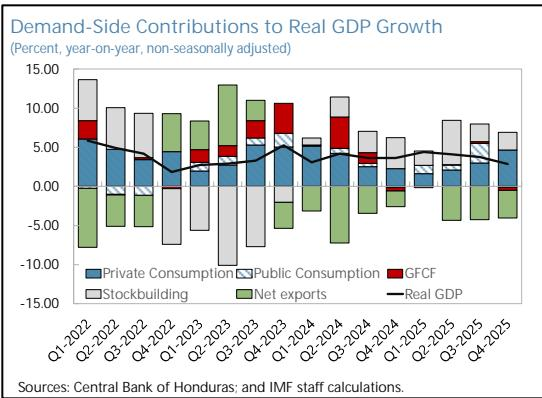

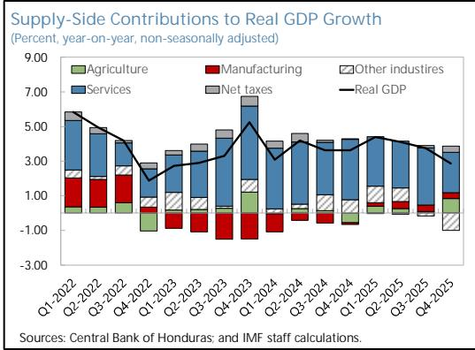

...as higher global oil prices passed through quickly to domestic fuels prices.

effects (Text Figure 1). $^{2}$ The passthrough of higher global oil prices has since exerted upward pressure on headline inflation, which increased to 5.6 percent in April, with the contribution of transport fuels increasing by 1.6 percentage points in April.

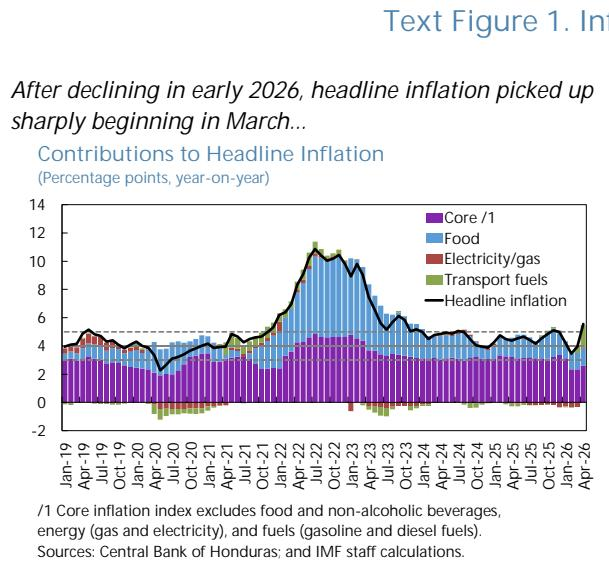  
Sources: Central Bank of Honduras; and IMF staff calculations.

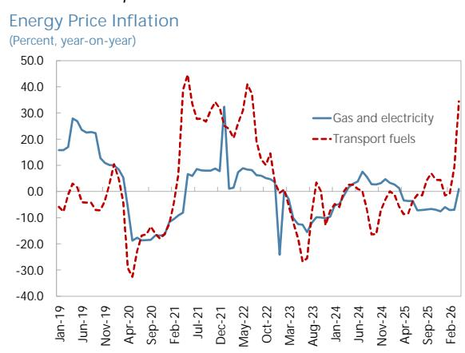

5. The fiscal balance outperformed in 2025 as capital spending slowed. The non-financial public sector (NFPS) deficit declined from 1.0 percent of GDP in 2024 to 0.7 in 2025 (versus 1.5 programmed), meeting the end-December 2025 QPC, driven by a slowdown in capital spending and lower-than-projected interest payments. Fiscal performance in 2026Q1 has remained strong, with an NFPS registering a surplus, meeting the end-March 2026 IT. The IT on priority social spending was met in end-December 2025 (the third consecutive time, increasing about 0.2 p.p. versus 2024), $^{3}$ though end-March 2026 IT was missed amid administrative reorganization at the Ministry of Social Development (SEDESOL)

Text Table 1. NFPS Fiscal Execution (Percent of GDP, through December)

<table><tr><td></td><td>2024</td><td>Budget 2025</td><td>SR Third Rev. 2025</td><td>2025</td></tr><tr><td>Income and Grants</td><td>29.3</td><td>28.4</td><td>29.0</td><td>29.0</td></tr><tr><td>Current income</td><td>28.7</td><td>27.7</td><td>28.7</td><td>28.1</td></tr><tr><td>Tax revenue</td><td>18.3</td><td>17.8</td><td>18.0</td><td>17.7</td></tr><tr><td>Non-tax revenue</td><td>1.9</td><td>1.0</td><td>1.7</td><td>1.6</td></tr><tr><td>Contributions for pensions and social security</td><td>3.1</td><td>3.3</td><td>3.1</td><td>3.3</td></tr><tr><td>Sales of goods and services</td><td>4.0</td><td>4.0</td><td>3.8</td><td>3.8</td></tr><tr><td>Other current income</td><td>1.5</td><td>1.7</td><td>2.1</td><td>1.7</td></tr><tr><td>Capital income</td><td>0.3</td><td>0.3</td><td>0.6</td><td>0.6</td></tr><tr><td>Grants</td><td>0.3</td><td>0.3</td><td>0.3</td><td>0.3</td></tr><tr><td>Expenses</td><td>30.3</td><td>29.8</td><td>30.5</td><td>29.6</td></tr><tr><td>Current expenses</td><td>25.9</td><td>26.0</td><td>26.0</td><td>25.4</td></tr><tr><td>Wages and salaries</td><td>10.9</td><td>10.2</td><td>11.0</td><td>10.8</td></tr><tr><td>Purchases of goods and services</td><td>8.4</td><td>9.0</td><td>8.0</td><td>8.0</td></tr><tr><td>Interest paid</td><td>2.6</td><td>2.4</td><td>3.0</td><td>2.6</td></tr><tr><td>Other current expenses</td><td>4.0</td><td>4.5</td><td>4.0</td><td>4.1</td></tr><tr><td>Capital expenses</td><td>4.4</td><td>3.8</td><td>4.5</td><td>4.2</td></tr><tr><td>Fixed investment</td><td>3.9</td><td>3.3</td><td>4.1</td><td>3.7</td></tr><tr><td>Other capital expenditure</td><td>0.5</td><td>0.5</td><td>0.5</td><td>0.5</td></tr><tr><td>Overall Balance</td><td>-1.0</td><td>-1.5</td><td>-1.5</td><td>-0.7</td></tr><tr><td colspan="5">Source: Ministry of Finance; and IMF staff estimates and calculations.</td></tr></table>

aimed at improving coordination and delivery across programs, reduction of external funding for Red Solidaria, and reverification of beneficiary eligibility. Tax revenues declined as a share of GDP due to lower indirect taxes in 2025, $^{4}$ marginally missing the end-December 2025 IT floor, but have since recovered and overperformed the end-March 2026 IT. On the expenditure side, after marginally missing the end-December 2025 IT current primary spending ceiling—reflecting slightly higher-than-projected other current transfers—current expenditure moderated in 2026Q1, meeting the end-March 2026 IT, as wage and salary spending was restrained.

6. The current account surplus of 2.4 percent of GDP in 2025 was bolstered by booming remittances and more favorable terms of trade. The external position in 2025 is assessed to be broadly in line with the level implied by fundamentals and desirable policies (Annex II). Goods export values increased 10 percent in 2025, driven primarily by higher coffee export volumes amid record-high prices, while imports benefited from lower energy demand and lower oil prices. Remittances grew 25 percent in 2025 and have grown by about 14

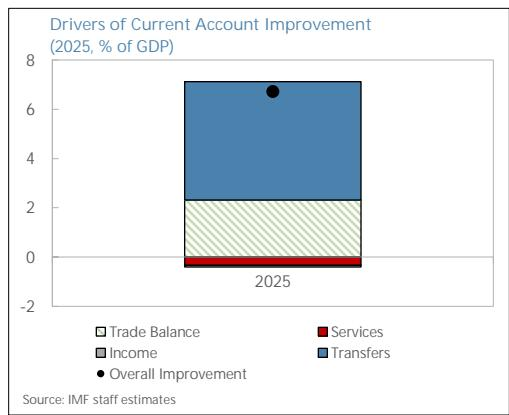

percent year-to-date through April. After declining 5 percent in 2025, the value of energy imports increased 7 percent year-to-date through March.

7. Reserve coverage and FX market dynamics strengthened further (Text Figure 2). Net international reserves (NIR) increased by more than \$2 billion in 2025 to \$10.2 billion $^{5}$ (covering more than 6 months of imports, almost 130 percent of ARA metric) and increased further by about \$1.3 billion through end-May, meeting the end-December 2025 QPC and end-March 2026 IT by a wide margin. $^{6}$ FX demand in the BCH auction has converged since July 2025 with supply, with auction coverage routinely meeting 100 percent of demand (Annex IV).

Text Figure 2. International Reserves and Foreign Exchange Market Developments

Reserves have accumulated organically in 2025 and early 2026, in the absence of significant external disbursements.

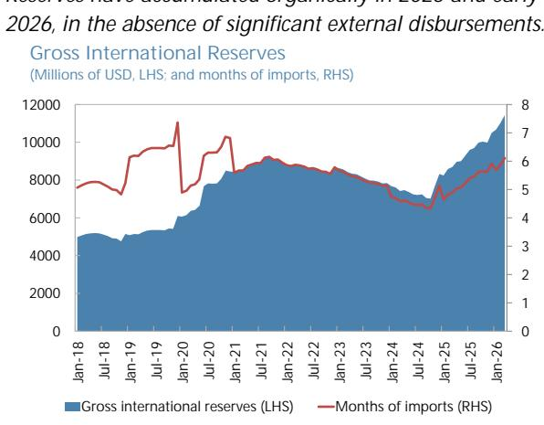  
Remittances surged in H1 2025 and remained dynamic throughout 2025 and into 2026Q1.  
FX supply in the BCH auction has fully met demand since July 2025.

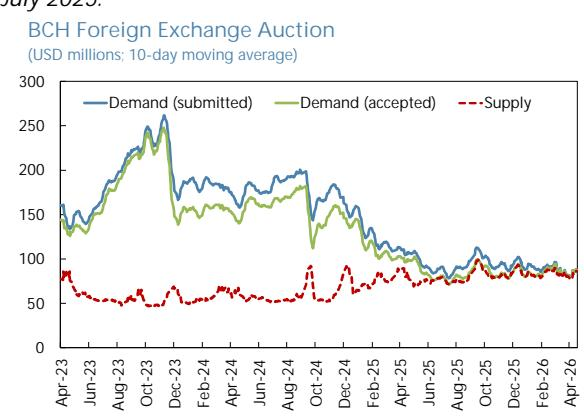  
Reserve accumulation dynamics in 2025 and early 2026 are a stark contrast to recent years.

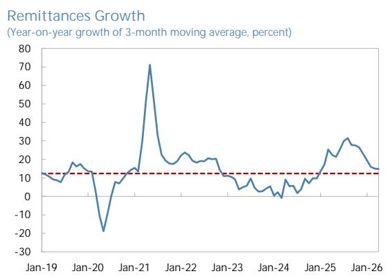  
Cumulative Change in BCH Net International Reserves (Millions of USD, through end-December)

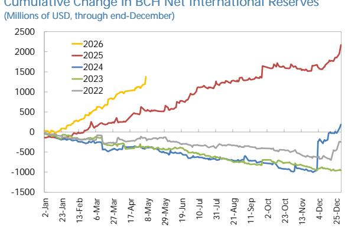  
Sources: Central Bank of Honduras; and IMF staff calculations.

8. Credit growth moderated in 2025 but is showing signs of potential recovery. Private sector credit growth fell below 7 percent (year-on-year) in December 2025, reflecting weaker demand (election-related uncertainty, strong remittances) and past tightening of monetary conditions, though 2026Q1 data suggests a slight pickup in corporate credit. Banking sector liquidity has normalized, supported by measures $^{7}$ taken in late 2024/early 2025. Lending and deposit rates have declined, as banks have eased efforts to capture new resources through high deposit rates. (Text Figure 3).

## Text Figure 3. Interest Rates and Banking Sector Indicators

Banking sector liquidity improved in 2025 and remains high in early 2026...

Highly Liquid Assets in Banking Sector in Local Currency 1/ (Percent of deposits in local currency)

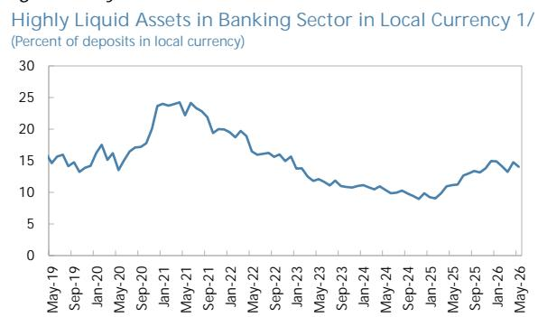  
1/ Includes excess reserves and investments in local currency, voluntary investments, cash, deposits in domestic and international financial institutions; BCH Bills from 3-12 months; BCH deposits; and receivables on cash flows.  
...while the interbank rate has converged with the policy interest rate.

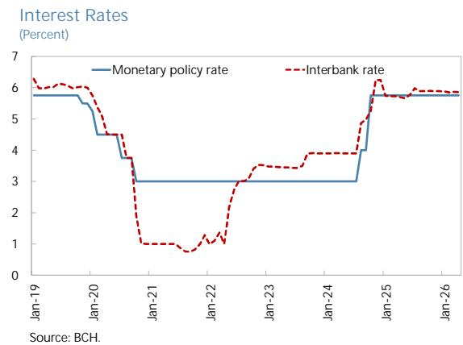  
Lending and deposit rates eased in 2025 and early 2026 as liquidity conditions normalized.

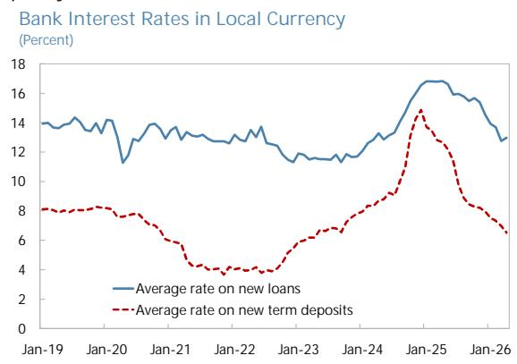  
Credit growth declined in 2025 but shows signs of potential recovery in early-2026.  
Growth of Credit to the Private Sector in Local Currency (Percent, year-on-year)

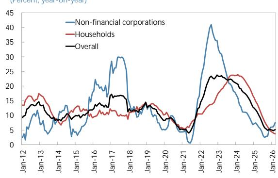  
Sources: Central Bank of Honduras; and IMF staff calculations.

## MACROECONOMIC OUTLOOK AND RISKS

9. Macroeconomic projections incorporate the impact from the war in the Middle East and the continued resilience of remittances (Text Table 2). The baseline conservatively assumes that remittances will remain broadly stable at around 30 percent of GDP in 2026 before declining under 26 percent of GDP over the medium term. A higher oil price path $^{8}$ is assumed for 2026, averaging around US88 per barrel, compared to the April 2026 WEO reference scenario of around US82 per barrel, before declining to about US77 per barrel in 2027, close to the April WEO reference scenario of US76. $^{9}$ Nevertheless, uncertainty about external factors remains exceptionally high (¶10).

Text Table 2. Medium-Term Economic Projections (Percent of GDP, unless otherwise indicated)

<table><tr><td rowspan="2"></td><td>Actual</td><td>Third Review</td><td>Act.</td><td>Third Review</td><td>Proj.</td><td>Third Review</td><td colspan="5">Projections</td></tr><tr><td>2024</td><td>2025</td><td>2025</td><td>2026</td><td>2026</td><td>2027</td><td>2027</td><td>2028</td><td>2029</td><td>2030</td><td>2031</td></tr><tr><td colspan="12">Real</td></tr><tr><td>GDP growth, percent</td><td>3.6</td><td>3.5</td><td>3.8</td><td>3.2</td><td>3.3</td><td>3.4</td><td>3.7</td><td>3.8</td><td>3.8</td><td>3.8</td><td>3.8</td></tr><tr><td>Inflation (period average, percent)</td><td>4.6</td><td>4.6</td><td>4.6</td><td>4.0</td><td>5.2</td><td>3.9</td><td>4.9</td><td>4.2</td><td>4.0</td><td>4.0</td><td>4.0</td></tr><tr><td>Inflation (end of period, percent)</td><td>3.9</td><td>4.8</td><td>5.0</td><td>3.9</td><td>5.7</td><td>4.0</td><td>4.3</td><td>4.0</td><td>4.0</td><td>4.0</td><td>4.0</td></tr><tr><td colspan="12">Fiscal</td></tr><tr><td>Primary balance</td><td>0.2</td><td>0.0</td><td>0.2</td><td>0.1</td><td>0.2</td><td>0.2</td><td>0.2</td><td>0.2</td><td>0.2</td><td>0.3</td><td>0.3</td></tr><tr><td>Overall balance</td><td>-1.0</td><td>-1.5</td><td>-0.7</td><td>-1.0</td><td>-1.0</td><td>-1.0</td><td>-1.0</td><td>-1.0</td><td>-1.0</td><td>-1.0</td><td>-1.0</td></tr><tr><td>Public capital investment</td><td>3.9</td><td>4.0</td><td>3.7</td><td>4.0</td><td>3.7</td><td>4.0</td><td>4.1</td><td>4.1</td><td>4.0</td><td>4.0</td><td>4.0</td></tr><tr><td>Gross debt 1/</td><td>47.6</td><td>47.6</td><td>45.4</td><td>47.1</td><td>48.1</td><td>46.3</td><td>44.5</td><td>43.1</td><td>41.9</td><td>40.7</td><td>39.7</td></tr><tr><td colspan="12">Balance of payments</td></tr><tr><td>Current account balance</td><td>-4.4</td><td>-4.7</td><td>2.4</td><td>-4.1</td><td>-2.7</td><td>-4.0</td><td>-3.2</td><td>-3.9</td><td>-3.8</td><td>-3.9</td><td>-3.9</td></tr><tr><td>Remittances</td><td>25.7</td><td>26.4</td><td>30.1</td><td>25.0</td><td>30.3</td><td>24.3</td><td>29.1</td><td>28.0</td><td>27.1</td><td>26.1</td><td>25.6</td></tr><tr><td>Gross international reserves (percent of ARA) 2/</td><td>106</td><td>119</td><td>129</td><td>125</td><td>137</td><td>119</td><td>135</td><td>133</td><td>130</td><td>127</td><td>124</td></tr></table>

Sources: Central Bank of Honduras, Ministry of Finance, and IMF staff estimates and projections.  
1/ Debt projections use the definition from the DSA.  
2/ NIR (BCH) corresponds to reserves assets minus obligations with the IMF.

\- GDP growth is projected below potential at 3.3 percent in 2026 as higher oil prices weigh on economic activity (Text Table 3), dampening private consumption and investment. The continued high level of remittances, more resilient than anticipated at the time of the Third Reviews, provides cushion against the oil price shock. Growth is projected to recover to 3.7 percent in 2027 as oil prices moderate before converging to 3.8 percent over the medium term.

\- Due to the oil price shock, headline inflation is expected to reach 5.7 percent at end-2026, exceeding the BCH's tolerance range (4±1 percent), before returning to 4 percent by the end of 2028.

\- A trade balance deterioration stemming from weaker terms of trade (lower coffee but higher oil prices) is projected to return the current account in 2026 to a deficit of 2.7 percent of GDP, despite more resilient remittances. Over the medium term, given persistent structural issues and bottlenecks, the current account deficit is projected to increase to 3.9 percent of GDP, largely driven by an expected moderation of remittances to pre-2025 levels as a share of GDP. Gross international reserves are projected to peak at slightly below 140 percent of the ARA metric in 2026, while remaining at adequate levels above 120 percent of the ARA metric over the medium term.

<table><tr><td rowspan="2"></td><td colspan="5">2026</td></tr><tr><td>2025 October WEO</td><td>Revision from positive developments</td><td>Counterfactual (No oil shock)</td><td>Impact from oil price shock</td><td>Current baseline</td></tr><tr><td>Growth (percent)</td><td>3.5</td><td>0.5</td><td>4.0</td><td>-0.7</td><td>3.3</td></tr><tr><td>Inflation, end of period (percent)</td><td>4.0</td><td>-0.3</td><td>3.7</td><td>+2.0</td><td>5.7</td></tr><tr><td>Inflation, period average (percent)</td><td>4.2</td><td>-0.6</td><td>3.6</td><td>+1.6</td><td>5.2</td></tr><tr><td>Current account (% of GDP)</td><td>-2.5</td><td>+1.9</td><td>-0.6</td><td>-2.1</td><td>-2.7</td></tr><tr><td>Net reserves accumulation (billions of US$)</td><td>+1.4</td><td>+1.1</td><td>2.5</td><td>-1.2</td><td>1.3</td></tr></table>

Source: IMF staff calculations.

## 10. Downside risks remain significant, driven primarily by the exceptionally uncertain external environment (RAM, Annex I).

\- External risks are tilted to the downside, stemming from a possible extension or escalation of the Middle East war, disorderly AI corrections, shifts to global trade policies with associated supply-chain disruptions, fiscal vulnerabilities and higher interest rates, and lower remittances and key export prices. Upside risks include an early resolution to the conflict and reversal of energy price increases and increased foreign investment in the context of the authorities' reform program. Honduras remains vulnerable to natural disasters, with significant near-term risks from severe weather conditions—particularly from a strong El Niño event alongside possible fertilizer shortages (Box 1)—which could negatively disrupt agricultural production and energy supply, impacting Honduras' growth, inflation dynamics, and external and fiscal balances.

\- Domestically, while the authorities have decisively taken actions to address reform delays, limited implementation capacity and the policy response to near-term shocks may divert attention from the medium-term reform agenda. Broad political support for the Fund program and a desire to maintain strong market access help to mitigate these risks.

\- Contingency planning and agile policy adjustment remain essential. Under an illustrative sensitivity analysis, calibrated in line with the 2026 April WEO severe scenario alongside weaker remittances, GDP growth in Honduras relative to the baseline could be lower while inflation could be higher, and the current account could deteriorate. Weaker GDP growth would also lower fiscal revenues and widen the fiscal deficit. Should downside risks materialize, policies should prioritize the provision of targeted support to vulnerable groups, while safeguarding fiscal sustainability (via reallocation of non-essential current expenditures and strengthened spending efficiency). Monetary and exchange rate policies should remain data dependent and adjust as needed as shock absorbers, including through an accelerated rate of crawl and higher monetary policy rate to support external stability. Over the medium term, advancing reforms to strengthen the business climate, labor market, governance, and productivity remains critical. In this scenario, program parameters remain robust, as higher external financing needs could be absorbed through lower reserve accumulation.

## Box 1. Possible Impact of El Niño Events on Honduras

El Niño episodes tend to be accompanied by drought and high temperatures in Honduras. The 2023-24 episode led to intense drought conditions, with 15 percent lower rainfall over January-May 2024 compared to the same period in 2023, also intensifying plant diseases in key agricultural exports. Economic losses caused by droughts have averaged about 0.5 percentage points of GDP per event in Honduras, higher than in regional peers. $^{1}$ With a possibly strong El Niño event set to unfold, the Honduran economy could be negatively impacted through several key channels:

\- Agricultural output: Drought conditions lower agricultural output, including for key commodity exports such as coffee, bananas, and palm oil, losses that could be exacerbated by a possible global fertilizer shortage.

\- Increase in fuel imports and electricity generation costs: Lower rainfall and heat waves tend to lower hydroelectric electricity generation, forcing generators to import fuels (bunker and diesel) to meet increased electricity demand due to heatwaves. This method of generation tends to be more expensive, especially at a time of high global fuel prices, potentially increasing financing pressures on state-owned energy company ENEE that would necessitate either higher electricity prices or larger fiscal transfers to ENEE.

\- External sector impact: The combination of these factors—lower agricultural output and exports and larger fuels imports—could further expand the current account deficit (and reduce net foreign exchange inflows) beyond the effect of higher global oil prices.

$^{1}$ See “Annex I. Economic Impact of Droughts on Honduras’ Economy” in the Staff Report for the First and Second Reviews Under the EFF and ECF Arrangements, December 2024.

## PROGRAM PERFORMANCE

11. Program performance has been favorable for the Fourth and Fifth Reviews, with strong performance against quantitative targets but structural reform delays—partly due to the elections and change in government. The new authorities have demonstrated a strong commitment to the program, making decisive progress in advancing structural reforms while maintaining prudent policies.

\- Quantitative targets (Table AI.1). 13 of 14 quantitative performance criteria (QPCs) were met at the June and December 2025 test dates, while continuous PCs were also met. External buffers strengthened significantly in 2025 and early 2026 (¶7), with international reserves QPCs met by wide margins, and there have been no new flows of monetary financing to the financial public sector. Fiscal discipline continued with all QPCs and most ITs met with the social spending IT met in June, September, and December 2025, but missed in March 2026 (¶5). The end-December 2025 QPC and end-March 2026 IT on electricity utility (ENEE) arrears were missed and ITs on energy losses have also been missed (¶25-26). The authorities are requesting a waiver on the missed QPC on ENEE arrears on the basis of correction actions, including through the implementation of a comprehensive financing plan for ENEE that includes debt issuance and the payment of subsidies to ENEE with the purpose of reducing arrears levels alongside renewed efforts to reduce energy losses.

\- Structural benchmarks (Table AI.2). Based on the schedule set at the Third Reviews (end-June 2025 to end-April 2026), 11 of 17 SBs were met or implemented with delay. $^{10, 11}$ Of the remaining six SBs, one is proposed to be dropped (closure of complex audits trust funds (TFs), ¶15), and one had been partially implemented with delay (ENEE audits for 2021-24), with the proposal of hiring an auditor to advance the publication of the 2024 (and 2025) ENEE audits as a new SB (¶27). Four SBs are proposed to be reset to provide space for completion for the sixth and final reviews (¶15, 27, 29).

## POLICY DISCUSSIONS

## A. Fiscal Policies

12. The authorities target an NFPS deficit of 1 percent of GDP in 2026, consistent with program targets, based on conservative revenue projections, realistic capital spending, and strict current expenditure ceilings, while accommodating the oil price shock (Text Table 4). As of end-March, fiscal prudence was maintained, with the NFPS recording a surplus of about 0.9 percent of GDP, as execution was partly conditioned by the absence of an approved budget, and tax revenues increased by 0.3 p.p. of GDP versus 2025Q1. For 2026, revenues are projected to decline by 0.4 p.p. of GDP versus 2025, driven by lower capital revenues as BCH utilities were retained to enhance its capital position (MEFP ¶30), while tax revenues/GDP remain broadly stable supported by resilient

Text Table 4. Statement of Operations of the Non-Financial Public Sector (Percent of GDP)

<table><tr><td></td><td>Actual</td><td>Authorities</td><td>SR Third Review</td><td>Proj.</td></tr><tr><td></td><td>2025</td><td>2026</td><td>2026</td><td>2026</td></tr><tr><td>Revenue</td><td>29.0</td><td>28.8</td><td>29.0</td><td>28.7</td></tr><tr><td>Taxes</td><td>17.8</td><td>17.7</td><td>18.0</td><td>17.7</td></tr><tr><td>Social contributions</td><td>3.3</td><td>3.4</td><td>3.0</td><td>3.2</td></tr><tr><td>Grants</td><td>0.3</td><td>0.4</td><td>0.3</td><td>0.3</td></tr><tr><td>Other revenue</td><td>7.7</td><td>7.4</td><td>7.6</td><td>7.4</td></tr><tr><td>Expenditures</td><td>29.7</td><td>29.8</td><td>30.0</td><td>29.7</td></tr><tr><td>Current Expenditures</td><td>26.0</td><td>26.2</td><td>26.0</td><td>26.1</td></tr><tr><td>Compensation of employees</td><td>10.9</td><td>10.7</td><td>11.0</td><td>10.7</td></tr><tr><td>Purchases of goods/services</td><td>8.0</td><td>8.4</td><td>7.9</td><td>8.4</td></tr><tr><td>Interest</td><td>2.6</td><td>2.8</td><td>2.7</td><td>2.7</td></tr><tr><td>Social benefits</td><td>3.7</td><td>3.7</td><td>3.7</td><td>3.8</td></tr><tr><td>Other expense</td><td>0.9</td><td>0.6</td><td>0.8</td><td>0.5</td></tr><tr><td>Net acquis. of nonfin. assets</td><td>3.7</td><td>3.6</td><td>4.0</td><td>3.7</td></tr><tr><td>Overall balance</td><td>-0.7</td><td>-1.0</td><td>-1.0</td><td>-1.0</td></tr></table>

Source: Ministry of Finance; and IMF staff projections.

remittances, despite higher oil prices that may weigh on economic activity in H2. Total and current expenditure/GDP are projected to remain broadly unchanged. The wage bill is expected to decline (0.2 p.p.), reflecting streamlined government functions, alongside a reallocation toward education and health wages. Higher energy purchases given higher oil prices will raise goods and services spending (+0.4 p.p.). Social benefits (transfers to the private sector) are projected to increase by 0.1 p.p. of GDP with some reallocation toward energy subsidies to mitigate fuel price increases. $^{12}$ The temporary partial fuel subsidy is set to expire on August 2, when the authorities will reassess the policy, considering external developments and available fiscal space. Capital expenditure is projected to decline slightly by 0.1 p.p. as institutional constraints weigh on execution in the administration's first year.

13. The authorities are strengthening the targeting and execution of social spending, while advancing reforms to improve efficiency and protect the vulnerable. To mitigate the oil price shock, policy efforts have focused on phasing out broad-based electricity subsidies and improving targeting toward households in extreme poverty, thereby generating fiscal savings while preserving support for the most vulnerable (MEFP ¶25). Nevertheless, social spending execution remains constrained by capacity challenges (¶5) which the government is seeking to address. Progress under the program has supported these efforts, with key structural benchmarks implemented, including the completion of the census of urban households in extreme poverty and its integration into SIRBHO (end-July 2025 SB, implemented with delay), the approval of the emergency social assistance manual (met end-December 2025 SB), and the implementation of the Single Social Sector Information System (SUISS) (end-June 2025 SB, implemented with delay). These reforms are expected to enhance targeting, reduce leakages, and improve the effectiveness and transparency of social policy (MEFP ¶24). Disbursements of Bono Tecnologico, Bono Ganadero, and Bono Cafetalero, among others, are expected to support execution of priority social spending by June (MEFP ¶14).

14. The authorities are advancing tax policy and administration reforms to strengthen revenue mobilization while improving compliance and the business climate. Efforts focus on enhancing risk-based controls, expanding digital services, and strengthening audit capacity, including progress on electronic invoicing with IDB support (MEFP ¶21). Targeted legislative reforms—aligned with Fund advice—are being pursued to reduce compliance gaps, including eliminating selected tax expenditures, strengthening VAT collection on digital services provided by nonresidents, and aligning income tax provisions with international accounting standards. Moreover, oversight of tax exemptions is being reinforced, supported by a dedicated verification unit, while ongoing customs modernization and work on a new customs law are expected to further strengthen enforcement and facilitate trade.

15. Efforts are ongoing to advance public financial management (PFM) and public investment management reforms to strengthen budget execution and cash management.

\- Eliminating trust funds. Most TFs have been closed and resources incorporated into the Treasury Single Account (TSA). The authorities have taken steps $^{13}$ to close the “less complex” TFs (end-September 2025 SB, not met) and expect to complete the process by end-July 2026 (proposed reset SB). One of the 14 TFs in the “more complex” category has been closed (end-December 2025 SB, not met), but the remaining TFs have taken longer to resolve due to the need to carefully ensure that the closure process does not inadvertently legitimize past unlawful conduct, implying completion beyond the program timeline (MEFP ¶18). Nevertheless, the macro-critical objective of this SB has been achieved with none of the remaining TFs operational, and with most associated assets and liabilities quantified and transferred to central government accounts (Annex VI). Given the quantification of the outstanding macro risks emanating from such trust funds and mindful of the need to allow the related legal and criminal processes to take their course, staff proposes to drop this SB, given that its elimination does not impact program objectives and the SB is no longer macro-critical following the actions undertaken by the authorities during the program. The authorities remain committed to TF closure and to not create new ones under the program, except for the fund needed to address the health emergency (¶16).

\- Public expenditure control. The authorities submitted a new public procurement law to Congress to enhance transparency and strengthen the public contracting process, completing the end-June 2025 SB (implemented with delay) in February 2026, and are working with Congress to secure approval (MEFP ¶17). Amendments to the Organic Budget Law were approved in May 2026, and the Ministry of Finance (SEFIN) published in June 2026 the associated regulations for effective implementation to strengthen the TSA framework (end-December 2025 SB, implemented with delay). The authorities are applying the budget execution programming manual and have requested additional Fund support to extend its implementation beyond the five pilot entities covered in the “Report on the Application of the Manual and Budget Execution” (end-August 2025 SB, met). The climate budget tagging reform (end-April 2026 SB, implemented with delay) was implemented in May 2026. These efforts will further strengthen expenditure control, cash management, and the prioritization of spending (MEFP ¶15).

16. Staff has worked closely with the authorities to ensure that the emergency health regime and temporary health TF is time-bound and subject to strict fiscal discipline, governance and transparency safeguards (Box 1, MEFP ¶23). The authorities have amended the implementing regulations to establish binding budgetary limits, a prohibition on borrowing and assuming contingent liabilities, a clearly defined operational perimeter, and mandatory reporting and audit requirements (prior action, met). The health TF will be reflected in the budget and be subject to regular internal and external audits, with its operations monitored through consolidated fiscal reports and reconciled with Treasury Single Account flows, to ensure consistency with government cash management practices. Recognizing its temporary nature, the authorities have

committed to implementing a credible and time-bound exit strategy to integrate the TF functions into ordinary budget execution, alongside efforts to strengthen institutional capacity in the health sector.

<table><tr><td>Box 2. Supporting the Health Emergency Response While Managing Fiscal Risks</td></tr><tr><td>To address acute medicine shortages, surgical backlogs, and the visible deterioration of health service delivery, the new government declared a health emergency shortly after taking office. Decree No. 5-2026, approved by the Congress in February 2026, established an emergency regime which, among other measures, created a health trust fund (HTF).</td></tr><tr><td>Fund staff worked closely with the authorities to strengthen the legal framework governing the HTF to establish safeguards to mitigate fiscal, governance, and transparency risks. TFs in Honduras have historically executed a significant share of public spending outside the budgetary framework, contributing to fragmentation of public finances and giving rise to significant fiscal, governance, and transparency risks. Their closure and reintegration into the budget process have therefore been a key objective under the current Fund-supported program, including the prior elimination of a health trust fund. Against this backdrop, given the need to ensure continuity of critical health service delivery within the existing budgetary operational constraints and limited institutional capacity, President Asfura requested Fund support for this specific and exceptional case. In response, LEG and FAD have worked with the Ministries of Health and Finance to strengthen the implementing regulations governing the emergency regime and the HTF, with a focus on embedding safeguards that preserve fiscal discipline, budget unity, transparency and accountability.</td></tr><tr><td>This approach provides flexibility for the health response while mitigating risks and maintaining consistency with the program’s medium-term objective of phasing out TFs and strengthening PFM practices, notwithstanding this temporary and tightly circumscribed exception. The time-bound nature of the HTF is explicitly established in law, with any extension requiring Congressional approval, and the authorities are committed to strengthening state capacity so that the Ministry of Health can absorb its functions over time. Key safeguards now incorporated into the regulation include: (i) a binding hard cap on budgetary transfers to the HTF calibrated to operational needs and financing envelope set out in the Emergency Operating Plan; (ii) an explicit prohibition on the HTF issuing, incurring, assuming, any form of debt, guarantees or other type of contingent liabilities; (iii) a clear and exhaustive definition of eligible activities and exclusion of ineligible spending categories; (iv) safeguards to ensure compliance with the special emergency procurement regime to all HTF financed operations; and (v) mandatory reporting to the Ministry of Finance and Court of Accounts, in addition to publication through the government’s transparency portal.</td></tr></table>

17. Honduras' risk of external debt distress is low, and the risk of overall public debt distress is moderate (DSA Annex). Public debt declined to 45.4 percent of GDP at end-2025, 2.2 p.p. lower than end-2024, reflecting sustained fiscal discipline. Domestic financing conditions strengthened in early 2026, reflecting improved market confidence, while external financing strategies are being reoriented. In 2026Q1, SEFIN issued domestic bonds equivalent to about 0.9 percent of GDP—versus 0.2 percent in 2025Q1—and at slightly lower rates than in late 2025. Furthermore, EMBI spreads have declined significantly in recent months, falling below 200 basis points and converging toward levels observed in peers with similar credit ratings. Building on these gains, the authorities are advancing debt management reforms—deepening the domestic market, improving investor relations, strengthening public sector coordination, and reducing floating debt— supported by IMF and World Bank technical assistance. Furthermore, engagement with multilateral partners is being reoriented toward concessional, high-impact operations, strengthening financing resilience and supporting upcoming debt management operations (MEFP ¶20).

## B. Monetary, Exchange Rate, and Financial Sector Policies

18. Monetary and exchange rate policies remain aligned with program objectives to maintain low inflation and safeguard international reserves. The BCH continues to implement the crawling band regime. $^{14}$ The Lempira depreciated 3.9 percent against the U.S. dollar (USD) in 2025 and has cumulatively depreciated about 7 percent through April 2026 since 2024Q3. Consequently, the real effective exchange rate (REER) has adjusted, with a depreciation of about 4 percent through end-2025—in line with program policies—and an additional depreciation of almost 2 p.p. in the first three months of 2026 (Text Figure 4). As a result, the estimated REER overvaluation has been significantly reduced (Annex III). While the exchange rate has strengthened past the center of the band since July 2025 (Text Figure 4 and Annex IV) the BCH continues to adjust the “base price” to ensure that the band continues to crawl. $^{15}$ Following its data-driven approach, the BCH has held the monetary policy rate (TPM)—consistent with the crawling band regime—at 5.75 percent since October 2024.

19. The authorities have strengthened the FX allocation mechanism further. The BCH published an update to regulations for the FX auction (met end-September 2025 SB), increasing the threshold for FX bids not requiring documentation from USD 10,000 to USD 50,000, simplifying documentation and monitoring requirements, and clarifying operational aspects of the auction to reduce the operational cost of participation and increase transparency. The BCH issued an update in February 2026 to increase the threshold for documentation-free FX purchases from USD 50,000 to USD 100,000, further simplify documentation requirements, and increase supply in the auction, $^{16}$ and further eased the documentation requirement threshold to USD 125,000 in May.

Real Effective Exchange Rate
(Index: December 2011=100)

...and while the exchange rate has moved to the stronger end of the band, the band continues to crawl.

Text Figure 4. Exchange Rate Developments  
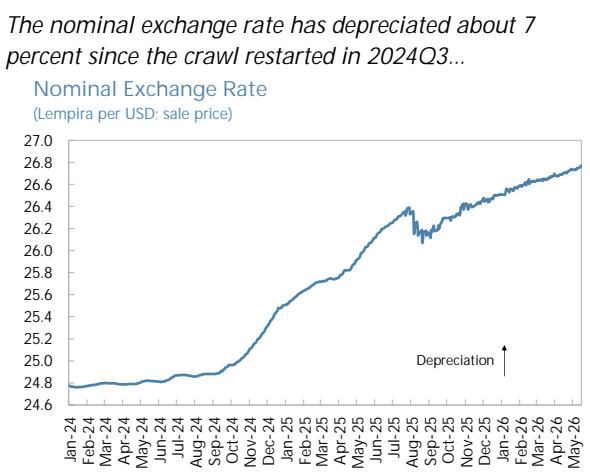

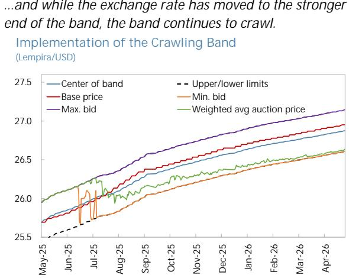  
Driven by nominal exchange rate depreciation since resumption of the crawl and a weaker USD ...

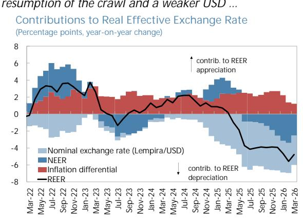  
...the real effective exchange rate has adjusted in 2025 and early 2026.

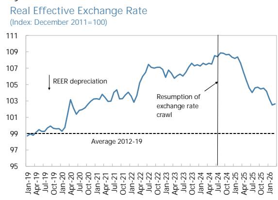  
Sources: Haver, Central Bank of Honduras; and IMF staff calculations.

20. The BCH will continue to follow a data-driven monetary and exchange rate policy approach, adjusting policies as necessary to contain inflationary pressures and maintain external stability. The expected path of the exchange rate will remain determined by macroeconomic fundamentals, including inflation differential with trading partners and movements in the nominal effective exchange rate, and the BCH remains prepared to adjust the rate of crawl as needed to maintain external stability and support reserve accumulation objectives (QPC). While the BCH considers the current level of the TPM to be broadly appropriate, it recognizes that the outlook for global oil prices represents an upside risk to inflation and is prepared to take action to contain second-round effects should they arise. The BCH will also monitor the evolution of international interest rates and continues to view as important the maintenance of a positive real policy interest rate and differential with respect to international rates to support the crawling band exchange rate regime (Text Figure 5).

## Text Figure 5. Monetary Policy Developments

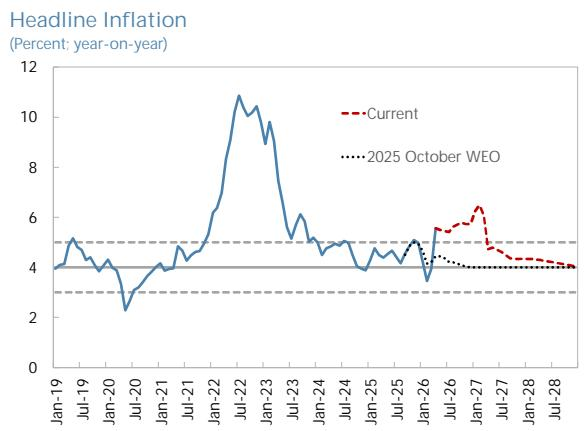

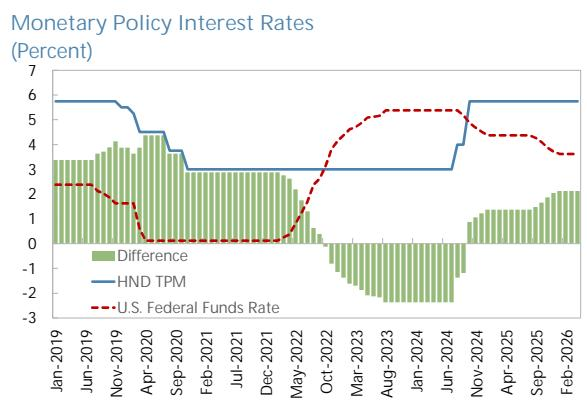  
Sources: Central Bank of Honduras; Haver; and IMF staff calculations and projections.

21. Looking forward, the new BCH leadership intends to move carefully to strengthen the monetary and exchange rate policy regime, moving towards inflation targeting, greater exchange rate flexibility, and a return to the interbank market for foreign exchange. The BCH will gradually create the conditions for a transition back to an interbank market mechanism to allocate FX, allowing for price discovery based on supply and demand. The BCH will also begin preparations for an eventual transition to an inflation targeting monetary policy regime, which will require a transition to a more flexible exchange rate regime. In this context, strengthening of the BCH's monetary policy and institutional framework, including through advancing reforms to the BCH Law, will be a critical building block. IMF technical assistance can support these efforts.

22. The authorities continue to strengthen financial sector supervision and regulation and remain vigilant to banking sector risks. Banks remain well capitalized, with capital levels of 14.2 percent at 2026Q1, exceeding the requirement of 10 percent, and NPLs at 2026Q1 remain low at about 2.6 percent of total assets. The National Commission for Banks and Insurance (CNBS) is updating its stress tests, which demonstrate that banks are resilient to shocks, to incorporate the effects of the recent increase in oil prices. The CNBS finalized the implementation of the 2.5 percent capital conservation buffer in 2025 and continues to prepare regulations for the eventual implementation of the net stable funding ratio and IFRS-9 accounting standards. The authorities are also preparing to present to the National Congress a new Law on Securities Markets in addition to a new Law on Insurance and Reinsurance. The new CNBS leadership is also undertaking a review of its strategic priorities.

23. Work continues to address safeguards assessment recommendations. The working group of BCH and Fund staff are resuming discussions to agree on recommendations for drafting amendments to the BCH Law with a view to strengthen governance and autonomy and meet

commitments to institutional strengthening. Relatedly, the authorities have also initiated a process to strengthen the BCH's capital position to ensure its operational transparency (MEFP ¶30). Notwithstanding this progress, priority recommendations from the 2024 safeguards assessment remain outstanding, including the development of a medium-term strategy to unwind the BCH's non-core operations. The authorities have reiterated their commitment to implementing these recommendations (MEFP ¶43). Staff will continue to provide support.

## C. Energy Sector Policies

24. The authorities are advancing a more market-oriented vision for the energy sector to address long-standing structural weaknesses, reduce fiscal costs, and support competitiveness and growth. Their strategy centers on the transformation and operational strengthening of ENEE, a stronger role for the regulator (CREE), and a tariff framework that reflects supply costs while protecting vulnerable households. This reform vision is reflected in a draft decree reforming the country's Electricity System Law which has been socialized and discussed with stakeholders and submitted to Congress. The authorities view the program's energy-sector objectives and structural benchmarks as aligned with this agenda. (MEFP ¶26).

25. Weaker performance against energy-related quantitative targets requires corrective action. While arrears targets were met in June and September 2025, the QPC and IT on ENEE arrears were missed at end-December 2025 and end-March 2026 respectively, reflecting challenges in the execution of financing plans during the election and post-election period, the liquidity impact of the bill-payment period extension from 15 to 28 days implemented in October 2025, $^{17}$ and higher oil prices. The authorities have requested a waiver for the nonobservance of the end-December 2025 QPC on ENEE arrears and to set the end-June 2026 QPC to reflect an ambitious but realistic path on the basis of their corrective plan in 2026, which envisages timely payments of ENEE subsidies from SEFIN and domestic debt issuance calibrated to market absorption, the broader public-sector financing strategy, and central bank open market operations. The plan includes subsidy payments of

$^{17}$ The extension of the bill-payment period also appears to have weakened payment compliance, as longer payment windows may have contributed to debt accumulation by customers, weighing on ENEE's liquidity position.  
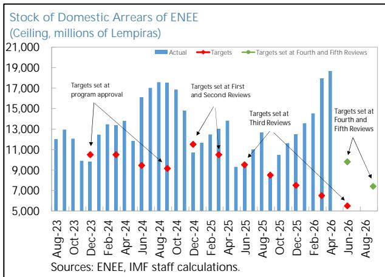

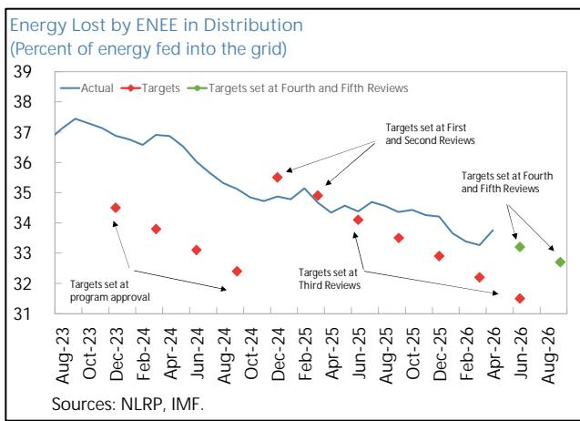

L1.0 billion (around 0.1 percent of GDP) by end-June $^{18}$ , L1.0 billion between July–September, alongside ENEE domestic issuances of L7.5 billion between May–June $^{19}$ and L5.8 billion in July–September, with a view to reducing arrears to L9.8 billion (around 1 percent of GDP) by end-June 2026 (QPC) and L7.4 billion by end-September 2026 (proposed IT), restoring momentum on arrears reduction (MEFP ¶27 and ¶28).

26. Electricity losses remain a central driver of ENEE's financial difficulties, with all ITs missed since June 2025. The authorities are implementing measures to reduce losses, including the integration of ENEE's distribution-related functions. $^{20}$ Staff proposes recalibrating the loss-reduction path realistically while maintaining ambition, accounting for seasonal factors including higher electricity demand associated with $El\ Niño$ event and the time needed for operational reforms to produce results. The proposed reset ITs imply losses of 33.2 percent by end-June 2026 and 32.7 percent by end-September 2026, aligned with a 1.5 percentage points reduction over 12 months starting in May 2026 and a medium-term plan to reduce losses by about 11 percentage points over four years. Staff welcomes the authorities' commitment to cost-reflective tariffs, including the 10.49 percent tariff adjustment for the second quarter of 2026, the expiration of a generalized 4.11 percent subsidy and progress on the technical tariff, while emphasizing the need to continue reducing generalized subsidies and improving targeting. $^{21}$ (MEFP ¶28)

27. Structural reforms in the energy sector have decisively resumed. The authorities implemented in April 2026 the merger of ENEE's three distribution-related units (end-November 2025 SB, implemented with delay), $^{22}$ which should strengthen accountability, coordination, planning, information systems, internal controls, billing, collection, and financial oversight. They have made progress toward IFRS implementation (end-June 2025 SB, not met) by launching the tender process and expect the firm to be hired by end-July 2026 (proposed reset SB) and work completed by October 2026. An audit firm was hired in April 2026 to prepare ENEE's 2024 and 2025 audited financial statements, expected to be concluded by end-October 2026 (proposed new SB), building on the publication of the 2021–2023 audits in October 2025 (end-September 2025 SB, not met but partially implemented with delay). Finally, with World Bank support, the authorities are advancing the technical note needed to support tariff adjustments (end-November 2025 SB, not met) and expect to finalize by end-September 2026 (proposed reset SB). (MEFP ¶29)

## D. Other Structural Policies

28. The authorities are advancing reforms to foster a more market-oriented environment and build investor confidence. A key milestone was to rejoin in March 2026 the International Centre for Settlement of Investment Disputes (ICSID), signaling a firm commitment to international arbitration and legal certainty for investors. The authorities have elevated domestic and foreign investment promotion through the Presidency and the public-private investment promotion agency and are digitalizing and simplifying investment and export documentation to reduce administrative bottlenecks and improve trade logistics. (MEFP ¶39)

29. The authorities have demonstrated strong commitment to advancing the AML/CFT framework. The Congress submission of the beneficial ownership and related AML/CFT legislation amendments was completed in February 2026 (end-July 2025 SB, implemented with delay). The authorities have remained engaged with Congress to support timely approval by end-June 2026. The operationalization of the beneficial ownership registry SB was missed at end-December 2025, as a result of aforementioned legislative delays, but the authorities have been working in parallel on the operational steps needed for implementation (MEFP ¶40), and the SB is proposed to be reset to end-October 2026.

30. The authorities are advancing a governance and anti-corruption agenda aimed at moving towards a more preventive, coordinated, and verifiable integrity framework. The new administration published in June 2026 a transparency and anti-corruption strategy in line with the objectives of the Fund-supported program (end-June 2025 SB, implemented with delay). The strategy covers public procurement and open contracting, beneficial ownership transparency, specialized investigative and judicial capacity, whistleblower protection, asset recovery, and stronger citizen oversight (MEFP ¶41).

## PROGRAM MODALITIES

31. The authorities request a short extension of the program to allow time to complete the final reviews. With the current arrangements set to expire on September 20, 2026, the requested extension of both the EFF and ECF arrangements to December 31, 2026 will provide sufficient time to complete the sixth reviews.

32. The attached Letter of Intent (LOI) and Memorandum of Economic and Financial Policies (MEFP) describe the authorities' implementation progress and set out policy commitments for the remainder of the program. Program performance will continue to be monitored through semi-annual reviews based on QPCs and ITs (Table AI.1) and SBs (Table AI.3). QPCs for end-June 2026 are proposed, with some proposed modifications to the end-June 2026 ITs. End-September 2026 ITs are proposed to facilitate monitoring the final months of the program.

Adjustors are proposed—detailed the Technical Memorandum of Understanding—for relevant QPCs/ITs to reflect the risk of target deviations if higher oil prices than in the baseline materialize, while preserving the underlying policy anchor. $^{23,24}$ Four outstanding SBs are proposed to be reset, reflecting realistic completion timelines for the sixth and final reviews. The publication of ENEE's 2024 and 2025 audited financial statements is proposed as a new SB (¶27). The end-December 2025 SB on closure of “complex” trust funds is proposed to be dropped, considering complete compliance audits on these trust funds are expected to extend beyond the duration of the program and the assessment that the macro-critical objective of the SB has been materially achieved (¶15).

33. Financing under the program, in the form of budget support, remains adequate to address actual, prospective, and protracted balance of payments needs. Fund financing underpins the authorities' reform efforts and the accumulation of FX reserve buffers, which remains essential amid an uncertain external environment (¶10). While the external position strengthened in 2025, there remains a BOP need in 2026, as reflected in the external financing gap (Tables 9 and 10). The scale of the BOP improvement and reserve build-up in 2025 was largely driven by temporary factors and is expected to fade in the near term (due to higher oil prices) and over the medium term as positive coffee/remittance shocks subside. Honduras faces heightened risks amid high levels of uncertainty that call for the maintenance of ample reserve buffers (around 125 percent of the ARA metric). Without Fund financing and its catalytic role, there is an elevated risk of reserves declining below the level considered adequate in the current environment.

34. Financing assurances. The program is fully financed, with firm commitments from multilaterals (including the IDB, World Bank, and CABEI) for the remainder of the program, which is also expected to support access to international capital markets. IMF financing is projected to fill 18 percent of the external financing gap over 2023-26 (unchanged from program approval).

35. Honduras' capacity to repay remains adequate. Existing and prospective Fund credit outstanding is expected to peak at 274 percent of quota in 2026 before declining to under 13 percent by 2035. Annual repayments to the Fund are projected to stay under 1 percent of exports and not exceed 1.2 percent of gross reserves. Large and recently strengthened external buffers support Honduras' capacity to repay, despite the significant susceptibility to external shocks.

36. Risks to the program. Program implementation challenges remain significant, largely due to identified risks to the baseline (¶10). Measures to mitigate these risks include: (i) proposed

modifications to SB implementation timelines to reflect delays due to the change of government; (ii) extreme parsimony in adding new SB commitments at this late stage in the program; and (iii) proposed adjustors to key QPCs and ITs to reflect the risks posed by external shocks.

37. Jurisdictional issues. Honduras maintains two exchange restrictions on the availability of FX for payments and transfers for current transactions subject to Fund jurisdiction. $^{25}$ The authorities are committed to gradually phase out these measures, including through their stated medium-term goal of returning to the interbank market as the primary mechanism for FX allocation, and as BOP stability is further strengthened, supported by implementation of the policies under the Fund-supported program, and external risks moderate. The authorities request Board approval for the second restriction, which arises from BCH measures to allocate FX, on the basis that it is maintained for BOP reasons, temporary, and non-discriminatory. No additional exchange restrictions or intensification of existing ones have been implemented (continuous PC). Impermissible spreads under the Fund's Multiple Currency Practices (MCP) policy have not been observed. $^{26}$

38. Poverty Reduction and Growth Strategy (PRGS). The prior government completed, discussed with stakeholders, and published a national PRGS (Annex V). Staff assesses that the document fulfills the PRGS requirement, and an assessment letter from the World Bank has been provided. The key pillars under the current EFF-ECF programs, which aim to strengthen economic resilience and address structural bottlenecks to boost inclusive growth, including by opening fiscal spending for investment and social spending needs, while safeguarding macroeconomic stability, are expected to contribute to the implementation of the PRGS.

## STAFF APPRAISAL

39. Supported by program policies, the Honduran economy has been resilient, despite elevated external uncertainty. Strong macroeconomic performance has been underpinned by prudent fiscal policies and an appropriate monetary and exchange rate policy mix, alongside robust remittances. These factors, together with decisive policy actions, have helped strengthen external buffers and balance supply and demand in the FX auction. Economic activity has remained resilient, and while inflation has largely remained with the BCH's tolerance range, it exceeded it in April due to the external energy price shock. Public and external debt are assessed to be sustainable. The external position in 2025 is assessed to be broadly in line with the level implied by fundamentals and desirable policies (Annex II).

40. Elevated and evolving external risks warrant continued policy agility and steadfast program implementation. The recent increase in international oil prices has worsened the terms of trade and contributed to higher inflation, underscoring the economy's exposure to external shocks. The possible emergence of a strong El Niño phenomenon poses additional risks to growth and inflation, including through its impact on agriculture and energy supply. In this context, the authorities have appropriately continued to build buffers, including through international reserve accumulation. Going forward, policies should remain nimble but decisive to safeguard macroeconomic stability and ensure continued progress toward program objectives.

41. Sustained fiscal discipline, complemented by continued structural reform efforts, will be critical to create space for priority spending. The authorities' commitment to maintaining a prudent fiscal stance, alongside current expenditure prioritization and ongoing efforts to target energy subsidies, is appropriate. At the same time, efforts to reorganize and improve the execution of social spending remain important to protect vulnerable households and enhance the efficiency of public expenditure. Further improvements to fiscal governance and budget transparency remain essential, including liquidating existing trust funds and ensuring appropriate safeguards to ensure that the health trust fund remains exceptional, subject to safeguards, and temporary.

42. The authorities' commitment to a data-driven monetary and exchange rate policy framework is appropriate. The BCH will remain vigilant and ready to adjust policies as needed to contain broader inflationary pressures and safeguard external stability, particularly considering external upside risks to inflation. The exchange rate should remain guided by macroeconomic fundamentals to preserve external balance and buffers. Ongoing efforts to improve the functioning of the foreign exchange market are welcome. The successful implementation of the authorities' intentions to carefully transition back towards an interbank market to allocate FX will require the continued implementation of appropriate and consistent monetary and exchange rate policies alongside further efforts to institutionally strengthen the BCH.

43. Reinvigorating reform momentum in the energy sector remains critical to support macroeconomic stability and medium-term growth. Redoubled efforts to reduce electricity losses, address arrears, and improve the financial position of ENEE are essential to limit fiscal risks. Further strengthening governance and operational efficiency—including through enhanced transparency, improved accounting practices, and targeting of electricity subsidies—will be important to ensure the sector's sustainability and support needed investments in transmission and generation capacity.

44. Continued efforts to strengthen governance, combat corruption, and improve the business environment are essential to support private investment and long-term growth. The approval and implementation of key reforms, including those related to beneficial ownership and the AML/CFT framework ahead of the upcoming FATF evaluation, will be important to reduce

vulnerabilities and strengthen institutional credibility. Effective implementation of the governance and anti-corruption agenda will further help improve investor confidence and support more inclusive growth.

45. Staff supports the authorities' request for Board approval for the retention of the exchange restriction arising from measures implemented by the BCH limiting the allocation of FX at the auction since its reintroduction. While the conditions of the auction and availability of foreign exchange have greatly improved, the balance of payments remains subject to significant downside risks, including from higher oil prices. The exchange restriction is maintained for balance of payments reasons, is temporary, and is non-discriminatory.

46. Given favorable program performance and the authorities' demonstrated commitment to prudent policies and reforms, bolstered by a completed prior action, which offer assurances of their ability to achieve program objectives, staff supports the completion of the Fourth and Fifth Reviews under the EFF and ECF arrangements and the authorities' requests for extension of the program and for a waiver of non-observance of the end-December 2025 performance criterion on ENEE arrears. Staff supports the request for the waiver of non-observance based on corrective actions taken by the authorities and the strength of forward-looking policy commitments. The Letter of Intent (Appendix I) and Memorandum of Economic and Financial Policies (Attachment I) demonstrate strong program ownership and provide an appropriate framework to achieve program objectives.

Figure 1. Honduras: Real Sector Developments

Output rebounded quickly to pre-pandemic levels in 2021 but remains below the prior trend.

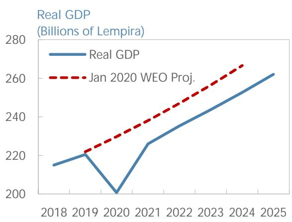  
Consumption, smaller contractions in real exports, and some inventory build-up supported growth in 2025.

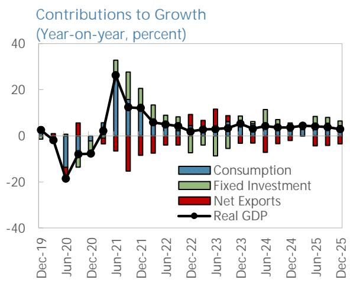  
Services, especially the banking sector, continue to be the main driver of growth.

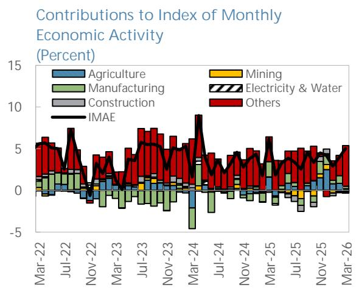  
Headline inflation had remained within the tolerance range $4 \pm 1$ percent prior to the oil price shock.

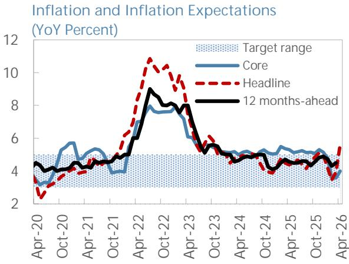  
Labor force participation picked up in 2025, and aggregate unemployment rate further declined...

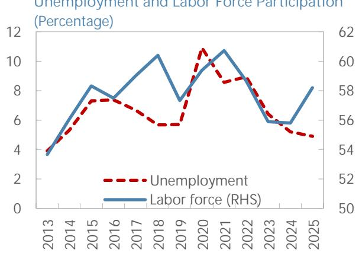  
...although the gap between male and female unemployment rates widened.

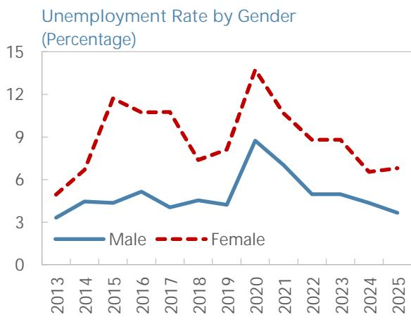  
Sources: BCH; Haver Analytics; IMF World Economic outlook; INE survey; and IMF staff estimates.

Figure 2. Honduras: External Sector Developments  
The current account moved to a surplus in 2025...  
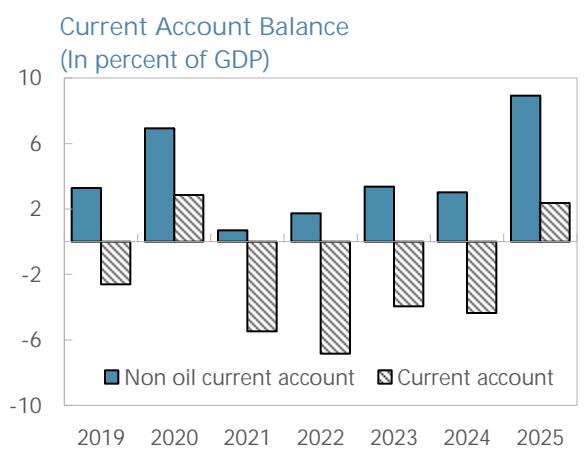  
...supported by remittances and record-high coffee prices.

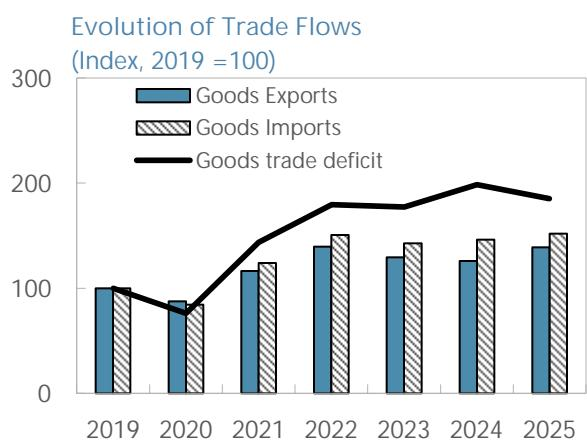  
The terms of trade improved significantly in 2025 prior to the oil price shock.

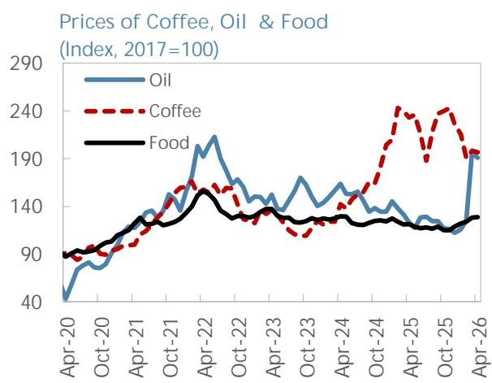  
Continued exchange rate crawl has contributed to a depreciation of the real effective exchange rate.  
Remittances surged in 2025...

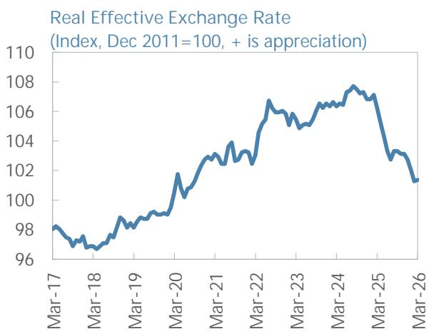

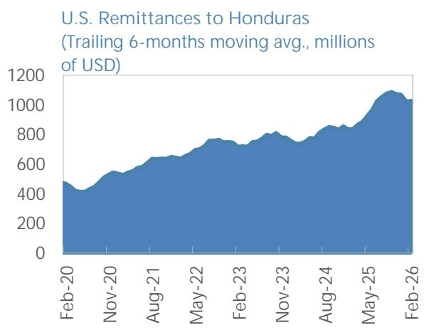  
..... contributing to a strengthening of reserve buffers.

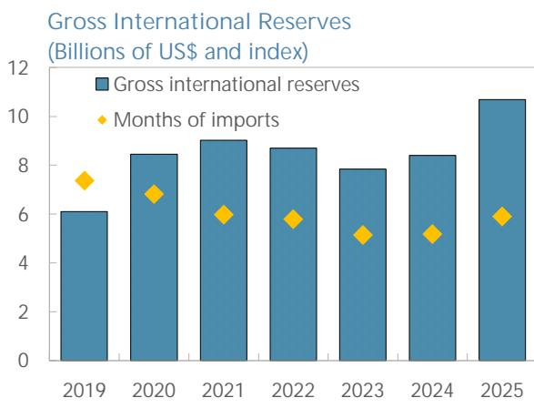  
Sources: BCH; Haver Analytics; IMF World Economic Outlook; INE survey; and IMF staff estimates.

Figure 3. Honduras: Fiscal Developments  
Fiscal discipline has been maintained after the pandemic...  
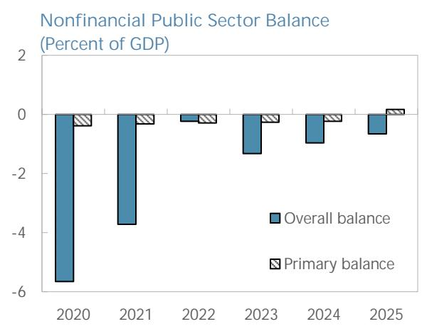  
...with the central government deficit contained in 2025.

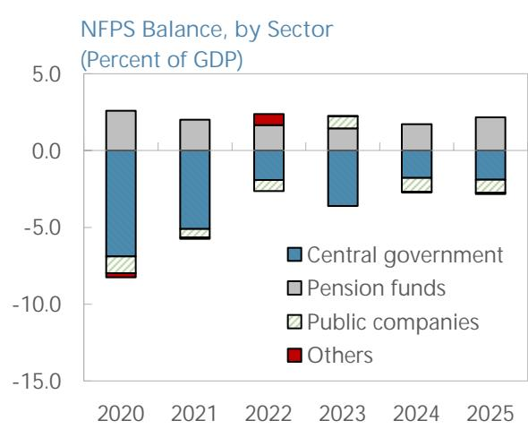  
The primary balance outperformed in 2025 as capital expenditure slowed...

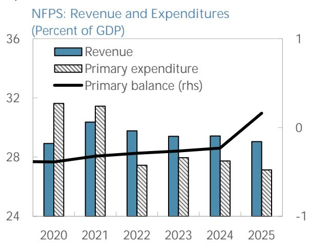  
...while tax revenues slightly decreased as a percent of GDP.

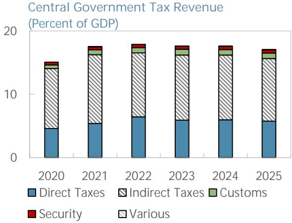  
Compressed bond spreads supported external issuance in 2024 and reopening the sustainable Eurobond in 2025.

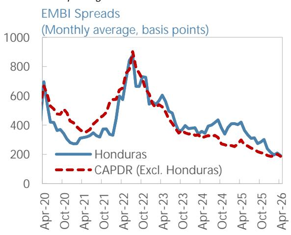  
Sources: Ministry of Finance; Bloomberg; and IMF staff estimates.  
Public debt has declined since the recovery from the pandemic.

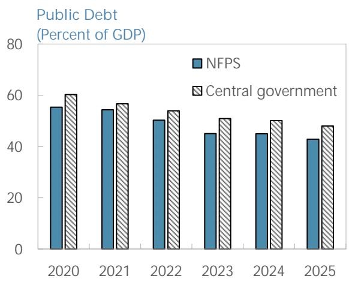

Figure 4. Honduras: Monetary and Financial Sector Developments

The policy rate increases of 2024 transmitted to interbank rates.

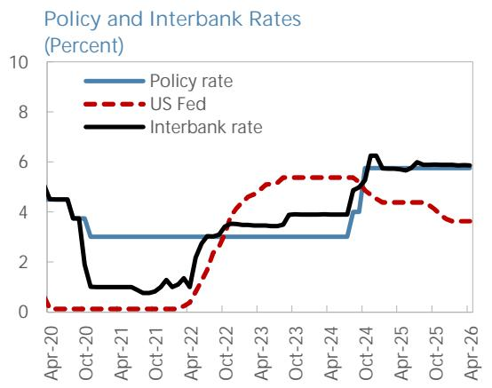  
While policy rate in Honduras is high relative to the region, recent pickup in inflation has lowered the real rate.  
The central bank increased open market operations in 2025 to sterilize the increase in international reserves.

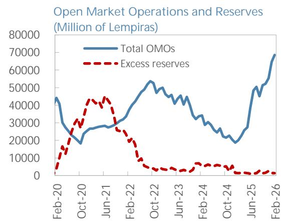  
Domestic currency lending interest rates increased following the tightening in monetary conditions.

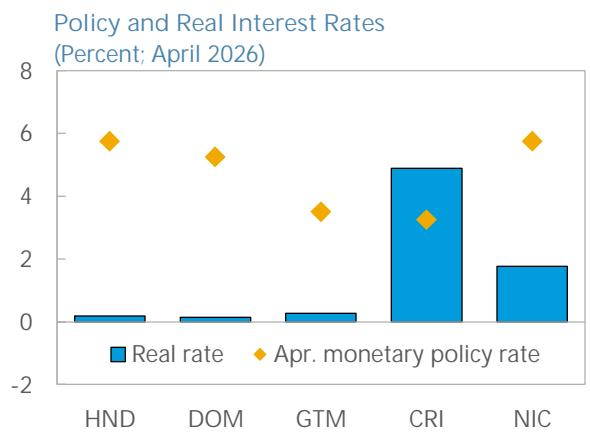

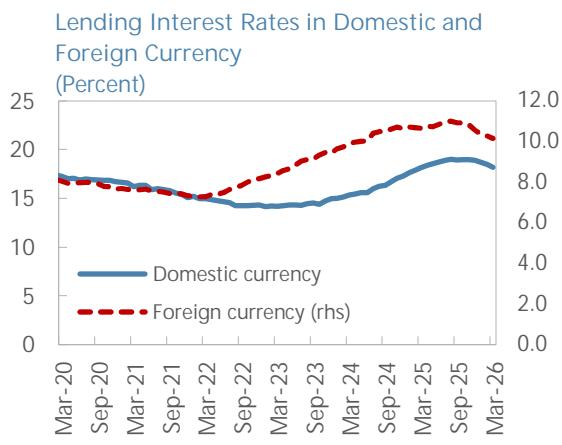  
Credit growth shows signs of a potential recovery in early-2026 after declining in 2025...

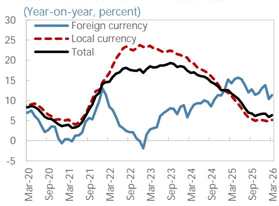  
...driven by the pickup in credit to firms.

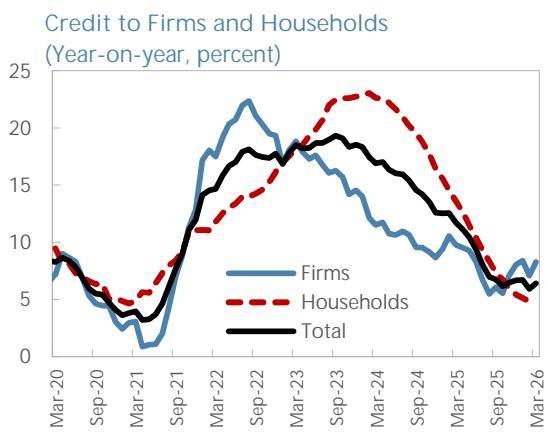  
Sources: Central Bank of Honduras; Haver Analytics; IMF WEO; and IMF staff estimates.

<table><tr><td colspan="13">Table 1. Honduras: Selected Economic Indicators, 2023-2031</td></tr><tr><td colspan="13">I. Social Indicators</td></tr><tr><td>Population (million, 2025, estimated)</td><td>11.0</td><td></td><td></td><td></td><td></td><td colspan="6">Life expectancy at birth in years (2024)</td><td>73</td></tr><tr><td>Per capita income in U.S. dollars (2025, estimated)</td><td>3,600</td><td></td><td></td><td></td><td></td><td colspan="6">Adult literacy (percent of ages 15 and above, 2024)</td><td>88</td></tr><tr><td>Rank in UNDP Development Index (2023)</td><td>139</td><td></td><td></td><td></td><td></td><td colspan="6">Percent of pop. under poverty (2023, $4.20 a Day (2021 PPP))</td><td>23.5</td></tr><tr><td>Unemployment rate (2025)</td><td>4.9</td><td></td><td></td><td></td><td></td><td colspan="6">Gini index (2024)</td><td>45.7</td></tr><tr><td>Net FDI (as percent of GDP, 2025)</td><td>2.0</td><td></td><td></td><td></td><td></td><td colspan="6">Oil imports (2025)</td><td>U.S. $2.6 billion</td></tr><tr><td colspan="13">II. Economic Indicators</td></tr><tr><td rowspan="2"></td><td colspan="2">Actual</td><td>Third Review</td><td>Act.</td><td>Third Review</td><td>Proj.</td><td>Third Review</td><td colspan="5">Proj.</td></tr><tr><td>2023</td><td>2024</td><td>2025</td><td>2025</td><td>2026</td><td>2026</td><td>2027</td><td>2027</td><td>2028</td><td>2029</td><td>2030</td><td>2031</td></tr><tr><td colspan="13">National Income and Prices(Annual percentage changes unless otherwise indicated)</td></tr><tr><td>Real GDP</td><td>3.6</td><td>3.6</td><td>3.5</td><td>3.8</td><td>3.2</td><td>3.3</td><td>3.4</td><td>3.7</td><td>3.8</td><td>3.8</td><td>3.8</td><td>3.8</td></tr><tr><td>Domestic demand</td><td>0.9</td><td>6.5</td><td>4.7</td><td>5.7</td><td>3.5</td><td>3.9</td><td>3.3</td><td>3.7</td><td>3.7</td><td>3.7</td><td>3.6</td><td>3.6</td></tr><tr><td>Consumption</td><td>5.2</td><td>3.9</td><td>4.4</td><td>4.0</td><td>3.3</td><td>3.1</td><td>3.5</td><td>3.7</td><td>3.6</td><td>3.4</td><td>3.3</td><td>3.3</td></tr><tr><td>Investment</td><td>11.2</td><td>5.5</td><td>6.0</td><td>-0.1</td><td>3.9</td><td>8.0</td><td>2.2</td><td>3.9</td><td>4.6</td><td>5.1</td><td>4.8</td><td>5.1</td></tr><tr><td>Exports</td><td>-7.0</td><td>-4.7</td><td>6.7</td><td>-0.4</td><td>7.3</td><td>-0.2</td><td>5.9</td><td>3.8</td><td>4.5</td><td>4.2</td><td>4.2</td><td>4.0</td></tr><tr><td>Imports</td><td>-8.6</td><td>2.7</td><td>8.0</td><td>4.7</td><td>6.4</td><td>2.2</td><td>4.9</td><td>3.8</td><td>4.0</td><td>3.8</td><td>3.6</td><td>3.6</td></tr><tr><td>Net exports (percentage contribution to real GDP)</td><td>2.5</td><td>-3.9</td><td>-2.1</td><td>-3.1</td><td>-1.0</td><td>-1.5</td><td>-0.6</td><td>-0.8</td><td>-0.7</td><td>-0.7</td><td>-0.6</td><td>-0.6</td></tr><tr><td>Output gap (percentage of potential GDP)</td><td>0.6</td><td>0.4</td><td>0.0</td><td>0.2</td><td>0.0</td><td>-0.1</td><td>0.0</td><td>-0.1</td><td>0.0</td><td>0.0</td><td>0.0</td><td>0.0</td></tr><tr><td>Inflation (eop)</td><td>5.2</td><td>3.9</td><td>4.8</td><td>5.0</td><td>3.9</td><td>5.7</td><td>4.0</td><td>4.3</td><td>4.0</td><td>4.0</td><td>4.0</td><td>4.0</td></tr><tr><td>Inflation (average)</td><td>6.7</td><td>4.6</td><td>4.6</td><td>4.6</td><td>4.0</td><td>5.2</td><td>3.9</td><td>4.9</td><td>4.2</td><td>4.0</td><td>4.0</td><td>4.0</td></tr><tr><td>GDP deflator</td><td>6.0</td><td>4.7</td><td>7.2</td><td>8.0</td><td>3.8</td><td>2.0</td><td>4.1</td><td>5.3</td><td>4.3</td><td>4.0</td><td>4.0</td><td>4.0</td></tr><tr><td colspan="13">Saving and Investment(Percentage of GDP unless otherwise indicated)</td></tr><tr><td>Saving - Investment Balance</td><td>-4.0</td><td>-4.4</td><td>-3.7</td><td>2.4</td><td>-4.1</td><td>-2.7</td><td>-4.0</td><td>-3.2</td><td>-3.9</td><td>-3.8</td><td>-3.9</td><td>-3.9</td></tr><tr><td>Gross domestic investment</td><td>22.2</td><td>23.2</td><td>23.0</td><td>24.2</td><td>23.0</td><td>24.6</td><td>22.6</td><td>24.9</td><td>24.7</td><td>24.6</td><td>24.4</td><td>24.2</td></tr><tr><td>Private sector</td><td>18.3</td><td>19.5</td><td>19.2</td><td>20.7</td><td>19.2</td><td>21.1</td><td>18.8</td><td>21.1</td><td>20.9</td><td>20.8</td><td>20.6</td><td>20.4</td></tr><tr><td>Public sector</td><td>3.9</td><td>3.7</td><td>3.8</td><td>3.5</td><td>3.8</td><td>3.4</td><td>3.8</td><td>3.8</td><td>3.9</td><td>3.8</td><td>3.8</td><td>3.8</td></tr><tr><td>Gross national savings</td><td>18.2</td><td>18.8</td><td>19.2</td><td>26.5</td><td>18.9</td><td>21.9</td><td>18.6</td><td>21.7</td><td>20.8</td><td>20.8</td><td>20.5</td><td>20.4</td></tr><tr><td>Private sector</td><td>16.6</td><td>17.3</td><td>13.8</td><td>25.0</td><td>12.6</td><td>20.6</td><td>12.3</td><td>19.8</td><td>18.7</td><td>18.6</td><td>18.3</td><td>18.2</td></tr><tr><td>Public sector</td><td>1.6</td><td>1.5</td><td>5.5</td><td>1.5</td><td>6.3</td><td>1.3</td><td>6.3</td><td>1.9</td><td>2.1</td><td>2.1</td><td>2.2</td><td>2.2</td></tr><tr><td colspan="13">Nonfinancial public sector</td></tr><tr><td>Tax revenues</td><td>18.3</td><td>18.3</td><td>18.0</td><td>17.8</td><td>18.0</td><td>17.7</td><td>18.1</td><td>17.9</td><td>18.0</td><td>18.1</td><td>18.2</td><td>18.2</td></tr><tr><td>Public investment</td><td>4.2</td><td>3.9</td><td>4.1</td><td>3.7</td><td>4.0</td><td>3.7</td><td>4.0</td><td>4.1</td><td>4.1</td><td>4.0</td><td>4.0</td><td>4.0</td></tr><tr><td>Primary balance</td><td>0.2</td><td>0.2</td><td>0.0</td><td>0.2</td><td>0.1</td><td>0.2</td><td>0.2</td><td>0.2</td><td>0.2</td><td>0.2</td><td>0.3</td><td>0.3</td></tr><tr><td>Overall balance</td><td>-1.3</td><td>-1.0</td><td>-1.5</td><td>-0.7</td><td>-1.0</td><td>-1.0</td><td>-1.0</td><td>-1.0</td><td>-1.0</td><td>-1.0</td><td>-1.0</td><td>-1.0</td></tr><tr><td>Gross debt</td><td>47.0</td><td>47.6</td><td>47.6</td><td>45.4</td><td>47.1</td><td>48.1</td><td>46.3</td><td>44.5</td><td>43.1</td><td>41.9</td><td>40.7</td><td>39.7</td></tr><tr><td colspan="13">Balance of Payments</td></tr><tr><td>Current account balance</td><td>-4.0</td><td>-4.4</td><td>-3.7</td><td>2.4</td><td>-4.1</td><td>-2.7</td><td>-4.0</td><td>-3.2</td><td>-3.9</td><td>-3.8</td><td>-3.9</td><td>-3.9</td></tr><tr><td>Trade balance</td><td>-17.3</td><td>-18.1</td><td>-16.5</td><td>-15.7</td><td>-16.2</td><td>-20.8</td><td>-15.3</td><td>-20.3</td><td>-19.9</td><td>-18.9</td><td>-18.1</td><td>-17.6</td></tr><tr><td>Worker&#x27;s remittances</td><td>25.9</td><td>25.7</td><td>25.2</td><td>30.1</td><td>25.0</td><td>30.3</td><td>24.3</td><td>29.1</td><td>28.0</td><td>27.1</td><td>26.1</td><td>25.6</td></tr><tr><td>Net FDI</td><td>2.5</td><td>1.7</td><td>1.9</td><td>2.0</td><td>2.2</td><td>2.1</td><td>2.5</td><td>2.1</td><td>2.2</td><td>2.2</td><td>2.3</td><td>2.2</td></tr><tr><td>Net International Reserves (billions of US$)1/</td><td>7.6</td><td>8.1</td><td>8.4</td><td>10.2</td><td>9.6</td><td>11.5</td><td>9.5</td><td>11.8</td><td>12.4</td><td>12.9</td><td>13.3</td><td>13.8</td></tr><tr><td>Gross International Reserves (billions of US$)</td><td>7.8</td><td>8.4</td><td>8.8</td><td>10.7</td><td>10.1</td><td>12.3</td><td>10.1</td><td>12.6</td><td>13.1</td><td>13.7</td><td>14.1</td><td>14.5</td></tr><tr><td>GIR (in months of imports)2/</td><td>5.1</td><td>5.2</td><td>5.5</td><td>5.9</td><td>6.0</td><td>6.4</td><td>5.8</td><td>6.2</td><td>6.2</td><td>6.2</td><td>6.1</td><td>5.9</td></tr><tr><td>GIR (in percent of ARA)</td><td>107</td><td>106</td><td>119</td><td>129</td><td>125</td><td>137</td><td>119</td><td>135</td><td>133</td><td>130</td><td>127</td><td>124</td></tr><tr><td>Terms of Trade (annual percent change)</td><td>3.4</td><td>-0.7</td><td>7.9</td><td>13.0</td><td>0.1</td><td>-5.1</td><td>-1.4</td><td>3.5</td><td>0.2</td><td>0.2</td><td>0.2</td><td>0.2</td></tr><tr><td>Real effective exchange rate (eop, depreciation -)</td><td>1.3</td><td>1.2</td><td>...</td><td>...</td><td>...</td><td>...</td><td>...</td><td>...</td><td>...</td><td>...</td><td>...</td><td>...</td></tr><tr><td colspan="13">Money and Credit</td></tr><tr><td>Base money (percentage change)</td><td>-1.4</td><td>9.0</td><td>11.5</td><td>21.5</td><td>7.2</td><td>8.8</td><td>7.6</td><td>7.9</td><td>7.3</td><td>7.1</td><td>7.1</td><td>7.1</td></tr><tr><td>Private sector credit (percentage change)</td><td>18.7</td><td>12.5</td><td>10.5</td><td>6.2</td><td>8.2</td><td>9.6</td><td>8.1</td><td>8.9</td><td>8.7</td><td>8.7</td><td>8.7</td><td>8.7</td></tr><tr><td>Private sector credit (percent of GDP)</td><td>74.0</td><td>76.7</td><td>76.1</td><td>72.7</td><td>76.9</td><td>75.6</td><td>77.3</td><td>75.4</td><td>75.7</td><td>76.2</td><td>76.7</td><td>77.2</td></tr></table>

2/ Reflects Fund purchases by the central bank to finance the budget

1/ As recommended by the GFSM-2014, since 2019 debt service commissions are reported as goods and services (previously included in the interest bill).

Table 2. Honduras: Statement of Operations of the Central Government, 2023-2031 (In millions of Lempiras)

<table><tr><td rowspan="2"></td><td colspan="2">Actual</td><td>Third Review</td><td>Act.</td><td>Third Review</td><td>Proj.</td><td>Third Review</td><td colspan="5">Proj.</td></tr><tr><td>2023</td><td>2024</td><td>2025</td><td>2025</td><td>2026</td><td>2026</td><td>2027</td><td>2027</td><td>2028</td><td>2029</td><td>2030</td><td>2031</td></tr><tr><td>Revenue</td><td>165,043</td><td>179,922</td><td>196,541</td><td>193,970</td><td>211,097</td><td>204,250</td><td>227,551</td><td>226,775</td><td>247,513</td><td>268,167</td><td>290,154</td><td>313,091</td></tr><tr><td>Taxes</td><td>148,864</td><td>161,263</td><td>177,052</td><td>175,169</td><td>190,202</td><td>185,299</td><td>205,663</td><td>204,781</td><td>224,085</td><td>242,600</td><td>262,106</td><td>282,974</td></tr><tr><td>Taxes on income</td><td>48,802</td><td>53,679</td><td>60,333</td><td>58,025</td><td>65,719</td><td>61,726</td><td>70,143</td><td>70,107</td><td>76,936</td><td>82,636</td><td>89,355</td><td>96,621</td></tr><tr><td>Taxes on property</td><td>910</td><td>911</td><td>1,080</td><td>948</td><td>1,169</td><td>964</td><td>1,268</td><td>1,064</td><td>1,139</td><td>1,216</td><td>1,283</td><td>1,449</td></tr><tr><td>Taxes on goods and services</td><td>87,292</td><td>93,896</td><td>101,585</td><td>101,807</td><td>108,371</td><td>108,180</td><td>118,288</td><td>118,326</td><td>128,875</td><td>139,563</td><td>150,756</td><td>162,711</td></tr><tr><td>Taxes on foreign trade</td><td>7,490</td><td>8,002</td><td>8,666</td><td>8,916</td><td>9,172</td><td>8,663</td><td>9,753</td><td>8,987</td><td>10,114</td><td>11,530</td><td>12,447</td><td>13,271</td></tr><tr><td>Other taxes</td><td>4,369</td><td>4,774</td><td>5,388</td><td>5,473</td><td>5,771</td><td>5,766</td><td>6,212</td><td>6,297</td><td>7,021</td><td>7,656</td><td>8,264</td><td>8,921</td></tr><tr><td>Social contributions</td><td>0</td><td>0</td><td>0</td><td>0</td><td>0</td><td>0</td><td>0</td><td>0</td><td>0</td><td>0</td><td>0</td><td>0</td></tr><tr><td>Grants</td><td>3,136</td><td>2,559</td><td>3,151</td><td>2,806</td><td>3,396</td><td>3,574</td><td>2,584</td><td>3,902</td><td>3,969</td><td>4,422</td><td>5,073</td><td>5,476</td></tr><tr><td>Other revenue</td><td>13,043</td><td>16,100</td><td>16,337</td><td>15,995</td><td>17,499</td><td>15,377</td><td>19,305</td><td>18,092</td><td>19,459</td><td>21,145</td><td>22,975</td><td>24,641</td></tr><tr><td>Expenditure</td><td>195,469</td><td>196,320</td><td>224,650</td><td>213,548</td><td>239,472</td><td>227,292</td><td>255,236</td><td>248,329</td><td>269,054</td><td>291,082</td><td>314,962</td><td>338,976</td></tr><tr><td>Expense</td><td>175,617</td><td>177,430</td><td>189,412</td><td>192,715</td><td>201,915</td><td>202,718</td><td>214,814</td><td>217,123</td><td>233,275</td><td>248,090</td><td>268,552</td><td>289,656</td></tr><tr><td>Compensation of employees</td><td>68,619</td><td>76,738</td><td>85,179</td><td>86,925</td><td>91,237</td><td>90,673</td><td>98,197</td><td>98,147</td><td>104,977</td><td>111,943</td><td>120,845</td><td>130,455</td></tr><tr><td>Purchases of goods and services 1/</td><td>24,806</td><td>27,908</td><td>33,185</td><td>32,320</td><td>34,452</td><td>30,971</td><td>37,080</td><td>37,485</td><td>41,351</td><td>44,501</td><td>48,338</td><td>52,182</td></tr><tr><td>Interest</td><td>25,999</td><td>25,801</td><td>27,369</td><td>26,812</td><td>31,230</td><td>30,256</td><td>32,348</td><td>30,531</td><td>31,793</td><td>33,212</td><td>35,830</td><td>37,600</td></tr><tr><td>Domestic</td><td>17,679</td><td>17,433</td><td>20,711</td><td>16,961</td><td>21,404</td><td>19,658</td><td>22,926</td><td>21,251</td><td>21,167</td><td>21,936</td><td>22,496</td><td>23,071</td></tr><tr><td>Foreign</td><td>8,321</td><td>8,369</td><td>6,658</td><td>9,852</td><td>9,826</td><td>10,598</td><td>9,422</td><td>9,280</td><td>10,626</td><td>11,276</td><td>13,334</td><td>14,529</td></tr><tr><td>Subsidies</td><td>8,308</td><td>7,280</td><td>4,676</td><td>4,951</td><td>4,861</td><td>6,395</td><td>5,052</td><td>6,709</td><td>6,991</td><td>7,270</td><td>7,561</td><td>7,863</td></tr><tr><td>Grants</td><td>20,336</td><td>22,402</td><td>21,391</td><td>21,289</td><td>21,818</td><td>18,978</td><td>22,305</td><td>19,541</td><td>21,796</td><td>23,667</td><td>24,057</td><td>27,258</td></tr><tr><td>Current</td><td>12,667</td><td>12,831</td><td>14,243</td><td>11,845</td><td>15,256</td><td>12,480</td><td>16,420</td><td>13,628</td><td>14,754</td><td>15,928</td><td>17,194</td><td>18,561</td></tr><tr><td>Capital</td><td>7,669</td><td>9,571</td><td>7,148</td><td>9,444</td><td>6,562</td><td>6,497</td><td>5,886</td><td>5,912</td><td>7,041</td><td>7,739</td><td>6,863</td><td>8,697</td></tr><tr><td>Social benefits</td><td>9,042</td><td>9,298</td><td>11,742</td><td>12,409</td><td>12,031</td><td>13,645</td><td>12,948</td><td>13,480</td><td>14,466</td><td>14,649</td><td>16,859</td><td>18,038</td></tr><tr><td>Other expense</td><td>18,506</td><td>8,004</td><td>5,869</td><td>8,009</td><td>6,286</td><td>11,800</td><td>6,884</td><td>11,229</td><td>11,901</td><td>12,847</td><td>15,063</td><td>16,260</td></tr><tr><td>Current</td><td>1,767</td><td>2,068</td><td>2,295</td><td>2,771</td><td>2,459</td><td>2,920</td><td>2,646</td><td>3,188</td><td>3,452</td><td>3,726</td><td>4,022</td><td>4,342</td></tr><tr><td>Capital</td><td>16,739</td><td>5,936</td><td>3,574</td><td>5,238</td><td>3,828</td><td>8,880</td><td>4,238</td><td>8,041</td><td>8,449</td><td>9,121</td><td>11,040</td><td>11,918</td></tr><tr><td>Net acquisition of nonfinancial assets</td><td>19,852</td><td>18,890</td><td>35,238</td><td>20,832</td><td>37,558</td><td>24,573</td><td>40,423</td><td>31,206</td><td>35,779</td><td>42,992</td><td>46,410</td><td>49,320</td></tr><tr><td>Gross Operating Balance</td><td>-10,574</td><td>2,492</td><td>7,129</td><td>1,255</td><td>9,183</td><td>1,532</td><td>12,738</td><td>9,652</td><td>14,239</td><td>20,077</td><td>21,602</td><td>23,435</td></tr><tr><td>Net lending (+)/borrowing (-)</td><td>-30,426</td><td>-16,398</td><td>-28,109</td><td>-19,578</td><td>-28,375</td><td>-23,042</td><td>-27,685</td><td>-21,554</td><td>-21,541</td><td>-22,914</td><td>-24,809</td><td>-25,885</td></tr><tr><td>Net financial transactions</td><td>-30,426</td><td>-16,398</td><td>-28,109</td><td>-19,578</td><td>-28,375</td><td>-23,042</td><td>-27,685</td><td>-21,554</td><td>-21,541</td><td>-22,914</td><td>-24,809</td><td>-25,885</td></tr><tr><td>Cash acquisition of financial assets</td><td>-23,297</td><td>-1,853</td><td>-546</td><td>1,827</td><td>29,419</td><td>19,408</td><td>-38,169</td><td>-19,408</td><td>0</td><td>0</td><td>0</td><td>0</td></tr><tr><td>Foreign</td><td>0</td><td>0</td><td>0</td><td>0</td><td>0</td><td>19,408</td><td>0</td><td>-19,408</td><td>0</td><td>0</td><td>0</td><td>0</td></tr><tr><td>Currency and deposits</td><td>0</td><td>0</td><td>0</td><td>0</td><td>0</td><td>19,408</td><td>0</td><td>-19,408</td><td>0</td><td>0</td><td>0</td><td>0</td></tr><tr><td>Loans</td><td>0</td><td>0</td><td>0</td><td>0</td><td>0</td><td>0</td><td>0</td><td>0</td><td>0</td><td>0</td><td>0</td><td>0</td></tr><tr><td>Other accounts receivable</td><td>0</td><td>0</td><td>0</td><td>0</td><td>0</td><td>0</td><td>0</td><td>0</td><td>0</td><td>0</td><td>0</td><td>0</td></tr><tr><td>Domestic</td><td>-23,297</td><td>-1,853</td><td>-546</td><td>1,827</td><td>29,419</td><td>0</td><td>-38,169</td><td>0</td><td>0</td><td>0</td><td>0</td><td>0</td></tr><tr><td>Currency and deposits</td><td>-22,720</td><td>-3,367</td><td>-546</td><td>-187</td><td>29,419</td><td>0</td><td>-38,169</td><td>0</td><td>0</td><td>0</td><td>0</td><td>0</td></tr><tr><td>Debt securities</td><td>0</td><td>0</td><td>0</td><td>0</td><td>0</td><td>0</td><td>0</td><td>0</td><td>0</td><td>0</td><td>0</td><td>0</td></tr><tr><td>Loans</td><td>-577</td><td>1,515</td><td>0</td><td>2,014</td><td>0</td><td>0</td><td>0</td><td>0</td><td>0</td><td>0</td><td>0</td><td>0</td></tr><tr><td>Other accounts receivable</td><td>0</td><td>0</td><td>0</td><td>0</td><td>0</td><td>0</td><td>0</td><td>0</td><td>0</td><td>0</td><td>0</td><td>0</td></tr><tr><td>Net incurrence of liabilities</td><td>7,129</td><td>14,546</td><td>27,563</td><td>21,404</td><td>57,794</td><td>42,449</td><td>-10,484</td><td>2,146</td><td>21,541</td><td>22,914</td><td>24,809</td><td>25,885</td></tr><tr><td>Foreign</td><td>-6,717</td><td>23,262</td><td>14,176</td><td>4,508</td><td>33,332</td><td>21,295</td><td>-2,650</td><td>-12,317</td><td>5,804</td><td>7,879</td><td>8,726</td><td>3,402</td></tr><tr><td>Loans</td><td>-5,485</td><td>24,774</td><td>14,359</td><td>-821</td><td>33,515</td><td>21,295</td><td>-2,467</td><td>-12,317</td><td>5,804</td><td>7,879</td><td>8,726</td><td>3,402</td></tr><tr><td>Disbursement</td><td>4,935</td><td>31,928</td><td>32,227</td><td>11,185</td><td>45,337</td><td>29,627</td><td>29,260</td><td>16,233</td><td>14,761</td><td>15,658</td><td>33,534</td><td>9,781</td></tr><tr><td>Amortizations</td><td>-10,420</td><td>-7,154</td><td>-17,868</td><td>-12,006</td><td>-11,822</td><td>-8,332</td><td>-31,727</td><td>-28,550</td><td>-8,957</td><td>-7,779</td><td>-24,808</td><td>-6,379</td></tr><tr><td>Other external</td><td>-1,232</td><td>-1,513</td><td>-183</td><td>5,329</td><td>-183</td><td>0</td><td>-183</td><td>0</td><td>0</td><td>0</td><td>0</td><td>0</td></tr><tr><td>Domestic</td><td>13,846</td><td>-8,716</td><td>13,386</td><td>16,896</td><td>24,462</td><td>21,154</td><td>-7,834</td><td>14,464</td><td>15,736</td><td>15,036</td><td>16,082</td><td>22,483</td></tr><tr><td>Loans</td><td>-1,707</td><td>8,081</td><td>14,601</td><td>16,032</td><td>25,575</td><td>22,267</td><td>-6,820</td><td>15,478</td><td>16,657</td><td>15,870</td><td>16,832</td><td>23,152</td></tr><tr><td>o/w IMF disbursements 2/</td><td>1,448</td><td>-680</td><td>3,328</td><td>124</td><td>4,596</td><td>7,996</td><td>-1,198</td><td>-1,215</td><td>-1,220</td><td>-1,814</td><td>-3,028</td><td>-4,247</td></tr><tr><td>Other domestic</td><td>15,553</td><td>-16,797</td><td>-1,215</td><td>864</td><td>-1,112</td><td>-1,112</td><td>-1,014</td><td>-1,014</td><td>-921</td><td>-834</td><td>-749</td><td>-669</td></tr><tr><td>Memorandum items:</td><td></td><td></td><td></td><td></td><td></td><td></td><td></td><td></td><td></td><td></td><td></td><td></td></tr><tr><td>Net lending minus interest payments</td><td>-4,427</td><td>9,403</td><td>-740</td><td>7,235</td><td>2,855</td><td>7,214</td><td>4,663</td><td>8,977</td><td>10,252</td><td>10,298</td><td>11,021</td><td>11,715</td></tr><tr><td>Nominal GDP (in billions of Lempiras)</td><td>845</td><td>917</td><td>1,021</td><td>1,028</td><td>1,094</td><td>1,083</td><td>1,177</td><td>1,182</td><td>1,280</td><td>1,382</td><td>1,492</td><td>1,611</td></tr></table>

Sources: Honduran authorities, IMF staff estimates and projections.

2/ Reflects Fund purchases by the central bank to finance the budget

1/ As recommended by the GFSM-2014, since 2019 debt service commissions are reported as goods and services (previously included in the interest bill).

Table 3. Honduras: Statement of Operations of the Central Government, 2023-2031 (In percent of GDP)

<table><tr><td rowspan="2"></td><td colspan="2">Actual</td><td>Third Review</td><td>Act.</td><td>Third Review</td><td>Proj.</td><td>Third Review</td><td colspan="5">Proj.</td></tr><tr><td>2023</td><td>2024</td><td>2025</td><td>2025</td><td>2026</td><td>2026</td><td>2027</td><td>2027</td><td>2028</td><td>2029</td><td>2030</td><td>2031</td></tr><tr><td>Revenue</td><td>19.5</td><td>19.6</td><td>19.2</td><td>18.9</td><td>19.3</td><td>18.9</td><td>19.3</td><td>19.2</td><td>19.3</td><td>19.4</td><td>19.5</td><td>19.5</td></tr><tr><td>Taxes</td><td>17.6</td><td>17.6</td><td>17.3</td><td>17.0</td><td>17.4</td><td>17.1</td><td>17.5</td><td>17.3</td><td>17.5</td><td>17.6</td><td>17.6</td><td>17.6</td></tr><tr><td>Taxes on income</td><td>5.8</td><td>5.9</td><td>5.9</td><td>5.6</td><td>6.0</td><td>5.7</td><td>6.0</td><td>5.9</td><td>6.0</td><td>6.0</td><td>6.0</td><td>6.0</td></tr><tr><td>Taxes on property</td><td>0.1</td><td>0.1</td><td>0.1</td><td>0.1</td><td>0.1</td><td>0.1</td><td>0.1</td><td>0.1</td><td>0.1</td><td>0.1</td><td>0.1</td><td>0.1</td></tr><tr><td>Taxes on goods and services</td><td>10.3</td><td>10.2</td><td>9.9</td><td>9.9</td><td>9.9</td><td>10.0</td><td>10.0</td><td>10.0</td><td>10.1</td><td>10.1</td><td>10.1</td><td>10.1</td></tr><tr><td>Taxes on foreign trade</td><td>0.9</td><td>0.9</td><td>0.8</td><td>0.9</td><td>0.8</td><td>0.8</td><td>0.8</td><td>0.8</td><td>0.8</td><td>0.8</td><td>0.8</td><td>0.8</td></tr><tr><td>Other taxes</td><td>0.5</td><td>0.5</td><td>0.5</td><td>0.5</td><td>0.5</td><td>0.5</td><td>0.5</td><td>0.5</td><td>0.5</td><td>0.6</td><td>0.6</td><td>0.6</td></tr><tr><td>Grants</td><td>0.4</td><td>0.3</td><td>0.3</td><td>0.3</td><td>0.3</td><td>0.3</td><td>0.2</td><td>0.3</td><td>0.3</td><td>0.3</td><td>0.3</td><td>0.3</td></tr><tr><td>Other revenue</td><td>1.5</td><td>1.8</td><td>1.6</td><td>1.6</td><td>1.6</td><td>1.4</td><td>1.6</td><td>1.5</td><td>1.5</td><td>1.5</td><td>1.5</td><td>1.5</td></tr><tr><td>Expenditure</td><td>23.1</td><td>21.4</td><td>22.0</td><td>20.8</td><td>21.9</td><td>21.0</td><td>21.7</td><td>21.0</td><td>21.0</td><td>21.1</td><td>21.1</td><td>21.0</td></tr><tr><td>Expense</td><td>20.8</td><td>19.3</td><td>18.6</td><td>18.8</td><td>18.5</td><td>18.7</td><td>18.2</td><td>18.4</td><td>18.2</td><td>18.0</td><td>18.0</td><td>18.0</td></tr><tr><td>Compensation of employees</td><td>8.1</td><td>8.4</td><td>8.3</td><td>8.5</td><td>8.3</td><td>8.4</td><td>8.3</td><td>8.3</td><td>8.2</td><td>8.1</td><td>8.1</td><td>8.1</td></tr><tr><td>Purchases of goods and services 1/</td><td>2.9</td><td>3.0</td><td>3.3</td><td>3.1</td><td>3.2</td><td>2.9</td><td>3.2</td><td>3.2</td><td>3.2</td><td>3.2</td><td>3.2</td><td>3.2</td></tr><tr><td>Interest</td><td>3.1</td><td>2.8</td><td>2.7</td><td>2.6</td><td>2.9</td><td>2.8</td><td>2.7</td><td>2.6</td><td>2.5</td><td>2.4</td><td>2.4</td><td>2.3</td></tr><tr><td>Domestic</td><td>2.1</td><td>1.9</td><td>2.0</td><td>1.7</td><td>2.0</td><td>1.8</td><td>1.9</td><td>1.8</td><td>1.7</td><td>1.6</td><td>1.5</td><td>1.4</td></tr><tr><td>Foreign</td><td>1.0</td><td>0.9</td><td>0.7</td><td>1.0</td><td>0.9</td><td>1.0</td><td>0.8</td><td>0.8</td><td>0.8</td><td>0.8</td><td>0.9</td><td>0.9</td></tr><tr><td>Subsidies</td><td>1.0</td><td>0.8</td><td>0.5</td><td>0.5</td><td>0.4</td><td>0.6</td><td>0.4</td><td>0.6</td><td>0.5</td><td>0.5</td><td>0.5</td><td>0.5</td></tr><tr><td>Grants</td><td>2.4</td><td>2.4</td><td>2.1</td><td>2.1</td><td>2.0</td><td>1.8</td><td>1.9</td><td>1.7</td><td>1.7</td><td>1.7</td><td>1.6</td><td>1.7</td></tr><tr><td>Current</td><td>1.5</td><td>1.4</td><td>1.4</td><td>1.2</td><td>1.4</td><td>1.2</td><td>1.4</td><td>1.2</td><td>1.2</td><td>1.2</td><td>1.2</td><td>1.2</td></tr><tr><td>Capital</td><td>0.9</td><td>1.0</td><td>0.7</td><td>0.9</td><td>0.6</td><td>0.6</td><td>0.5</td><td>0.5</td><td>0.6</td><td>0.6</td><td>0.5</td><td>0.5</td></tr><tr><td>Social benefits</td><td>1.1</td><td>1.0</td><td>1.2</td><td>1.2</td><td>1.1</td><td>1.3</td><td>1.1</td><td>1.1</td><td>1.1</td><td>1.1</td><td>1.1</td><td>1.1</td></tr><tr><td>Other expense</td><td>2.2</td><td>0.9</td><td>0.6</td><td>0.8</td><td>0.6</td><td>1.1</td><td>0.6</td><td>0.9</td><td>0.9</td><td>0.9</td><td>1.0</td><td>1.0</td></tr><tr><td>Current</td><td>0.2</td><td>0.2</td><td>0.2</td><td>0.3</td><td>0.2</td><td>0.3</td><td>0.2</td><td>0.3</td><td>0.3</td><td>0.3</td><td>0.3</td><td>0.3</td></tr><tr><td>Capital</td><td>2.0</td><td>0.6</td><td>0.4</td><td>0.5</td><td>0.4</td><td>0.8</td><td>0.4</td><td>0.7</td><td>0.7</td><td>0.7</td><td>0.7</td><td>0.7</td></tr><tr><td>Net acquisition of nonfinancial assets</td><td>2.3</td><td>2.1</td><td>3.5</td><td>2.0</td><td>3.4</td><td>2.3</td><td>3.4</td><td>2.6</td><td>2.8</td><td>3.1</td><td>3.1</td><td>3.1</td></tr><tr><td>Gross Operating Balance</td><td>-1.3</td><td>0.3</td><td>0.7</td><td>0.1</td><td>0.8</td><td>0.1</td><td>1.1</td><td>0.8</td><td>1.1</td><td>1.5</td><td>1.4</td><td>1.5</td></tr><tr><td>Net lending (+)/borrowing (-)</td><td>-3.6</td><td>-1.8</td><td>-2.8</td><td>-1.9</td><td>-2.6</td><td>-2.1</td><td>-2.4</td><td>-1.8</td><td>-1.7</td><td>-1.7</td><td>-1.7</td><td>-1.6</td></tr><tr><td>Net financial transactions</td><td>-3.6</td><td>-1.8</td><td>-2.8</td><td>-1.9</td><td>-2.6</td><td>-2.1</td><td>-2.4</td><td>-1.8</td><td>-1.7</td><td>-1.7</td><td>-1.7</td><td>-1.6</td></tr><tr><td>Net acquisition of financial assets</td><td>-2.8</td><td>-0.2</td><td>-0.1</td><td>0.2</td><td>2.7</td><td>1.8</td><td>-3.2</td><td>-1.6</td><td>0.0</td><td>0.0</td><td>0.0</td><td>0.0</td></tr><tr><td>Foreign</td><td>0.0</td><td>0.0</td><td>0.0</td><td>0.0</td><td>0.0</td><td>1.8</td><td>0.0</td><td>-1.6</td><td>0.0</td><td>0.0</td><td>0.0</td><td>0.0</td></tr><tr><td>Currency and deposits</td><td>0.0</td><td>0.0</td><td>0.0</td><td>0.0</td><td>0.0</td><td>1.8</td><td>0.0</td><td>-1.6</td><td>0.0</td><td>0.0</td><td>0.0</td><td>0.0</td></tr><tr><td>Loans</td><td>0.0</td><td>0.0</td><td>0.0</td><td>0.0</td><td>0.0</td><td>0.0</td><td>0.0</td><td>0.0</td><td>0.0</td><td>0.0</td><td>0.0</td><td>0.0</td></tr><tr><td>Other accounts receivable</td><td>0.0</td><td>0.0</td><td>0.0</td><td>0.0</td><td>0.0</td><td>0.0</td><td>0.0</td><td>0.0</td><td>0.0</td><td>0.0</td><td>0.0</td><td>0.0</td></tr><tr><td>Domestic</td><td>-2.8</td><td>-0.2</td><td>-0.1</td><td>0.2</td><td>2.7</td><td>0.0</td><td>-3.2</td><td>0.0</td><td>0.0</td><td>0.0</td><td>0.0</td><td>0.0</td></tr><tr><td>Currency and deposits</td><td>-2.7</td><td>-0.4</td><td>-0.1</td><td>0.0</td><td>2.7</td><td>0.0</td><td>-3.2</td><td>0.0</td><td>0.0</td><td>0.0</td><td>0.0</td><td>0.0</td></tr><tr><td>Loans</td><td>-0.1</td><td>0.2</td><td>0.0</td><td>0.2</td><td>0.0</td><td>0.0</td><td>0.0</td><td>0.0</td><td>0.0</td><td>0.0</td><td>0.0</td><td>0.0</td></tr><tr><td>Net incurrence of liabilities</td><td>0.8</td><td>1.6</td><td>2.7</td><td>2.1</td><td>5.3</td><td>3.9</td><td>-0.9</td><td>0.2</td><td>1.7</td><td>1.7</td><td>1.7</td><td>1.6</td></tr><tr><td>Foreign</td><td>-0.8</td><td>2.5</td><td>1.4</td><td>0.4</td><td>3.0</td><td>2.0</td><td>-0.2</td><td>-1.0</td><td>0.5</td><td>0.6</td><td>0.6</td><td>0.2</td></tr><tr><td>Loans</td><td>-0.6</td><td>2.7</td><td>1.4</td><td>-0.1</td><td>3.1</td><td>2.0</td><td>-0.2</td><td>-1.0</td><td>0.5</td><td>0.6</td><td>0.6</td><td>0.2</td></tr><tr><td>Disbursement</td><td>0.6</td><td>3.5</td><td>3.2</td><td>1.1</td><td>4.1</td><td>2.7</td><td>2.5</td><td>1.4</td><td>1.2</td><td>1.1</td><td>2.2</td><td>0.6</td></tr><tr><td>Amortizations</td><td>-1.2</td><td>-0.8</td><td>-1.7</td><td>-1.2</td><td>-1.1</td><td>-0.8</td><td>-2.7</td><td>-2.4</td><td>-0.7</td><td>-0.6</td><td>-1.7</td><td>-0.4</td></tr><tr><td>Other external</td><td>-0.1</td><td>-0.2</td><td>0.0</td><td>0.5</td><td>0.0</td><td>0.0</td><td>0.0</td><td>0.0</td><td>0.0</td><td>0.0</td><td>0.0</td><td>0.0</td></tr><tr><td>Domestic</td><td>1.6</td><td>-1.0</td><td>1.3</td><td>1.6</td><td>2.2</td><td>2.0</td><td>-0.7</td><td>1.2</td><td>1.2</td><td>1.1</td><td>1.1</td><td>1.4</td></tr><tr><td>Loans</td><td>-0.2</td><td>0.9</td><td>1.4</td><td>1.6</td><td>2.3</td><td>2.1</td><td>-0.6</td><td>1.3</td><td>1.3</td><td>1.1</td><td>1.1</td><td>1.4</td></tr><tr><td>o/w IMF disbursements 2/</td><td>0.2</td><td>-0.1</td><td>0.3</td><td>0.0</td><td>0.4</td><td>0.7</td><td>-0.1</td><td>-0.1</td><td>-0.1</td><td>-0.1</td><td>-0.2</td><td>-0.3</td></tr><tr><td>Other domestic</td><td>1.8</td><td>-1.8</td><td>-0.1</td><td>0.1</td><td>-0.1</td><td>-0.1</td><td>-0.1</td><td>-0.1</td><td>-0.1</td><td>-0.1</td><td>-0.1</td><td>0.0</td></tr><tr><td>Memorandum items:</td><td></td><td></td><td></td><td></td><td></td><td></td><td></td><td></td><td></td><td></td><td></td><td></td></tr><tr><td>Net lending minus interest payments</td><td>-0.5</td><td>1.0</td><td>-0.1</td><td>0.7</td><td>0.3</td><td>0.7</td><td>0.4</td><td>0.8</td><td>0.8</td><td>0.7</td><td>0.7</td><td>0.7</td></tr><tr><td>Nominal GDP (in billions of Lempiras)</td><td>845</td><td>917</td><td>1,021</td><td>1,028</td><td>1,094</td><td>1,083</td><td>1,177</td><td>1,182</td><td>1,280</td><td>1,382</td><td>1,492</td><td>1,611</td></tr></table>

Sources: Honduran authorities, IMF staff estimates and projections.

Table 4. Honduras: Statement of Operations of the Nonfinancial Public Sector, 2023-2031 (In millions of Lempiras)

<table><tr><td rowspan="2"></td><td colspan="2">Actual</td><td>Third Review</td><td>Act.</td><td>Third Review</td><td>Proj.</td><td>Third Review</td><td colspan="5">Proj.</td></tr><tr><td>2023</td><td>2024</td><td>2025</td><td>2025</td><td>2026</td><td>2026</td><td>2027</td><td>2027</td><td>2028</td><td>2029</td><td>2030</td><td>2031</td></tr><tr><td>Revenue</td><td>248,444</td><td>269,830</td><td>296,300</td><td>298,436</td><td>317,042</td><td>310,473</td><td>341,379</td><td>341,348</td><td>370,795</td><td>401,845</td><td>434,611</td><td>469,042</td></tr><tr><td>Taxes</td><td>154,633</td><td>167,919</td><td>184,174</td><td>182,547</td><td>196,865</td><td>192,094</td><td>212,738</td><td>211,507</td><td>230,992</td><td>250,787</td><td>270,945</td><td>292,522</td></tr><tr><td>Taxes on income</td><td>58,062</td><td>53,679</td><td>60,244</td><td>58,025</td><td>65,622</td><td>61,726</td><td>70,039</td><td>69,413</td><td>76,557</td><td>83,059</td><td>89,813</td><td>97,116</td></tr><tr><td>Taxes on property</td><td>910</td><td>911</td><td>991</td><td>948</td><td>1,073</td><td>964</td><td>1,163</td><td>1,064</td><td>1,139</td><td>1,216</td><td>1,283</td><td>1,449</td></tr><tr><td>Taxes on goods and services</td><td>87,292</td><td>93,896</td><td>101,496</td><td>101,807</td><td>108,276</td><td>108,180</td><td>118,184</td><td>118,326</td><td>128,875</td><td>139,563</td><td>150,756</td><td>162,711</td></tr><tr><td>Taxes on foreign trade</td><td>7,490</td><td>8,002</td><td>8,577</td><td>8,916</td><td>9,078</td><td>8,663</td><td>9,652</td><td>8,987</td><td>10,114</td><td>11,194</td><td>12,084</td><td>12,884</td></tr><tr><td>Other taxes</td><td>10,139</td><td>11,430</td><td>12,866</td><td>12,850</td><td>12,817</td><td>12,562</td><td>13,699</td><td>13,717</td><td>14,307</td><td>15,755</td><td>17,008</td><td>18,360</td></tr><tr><td>Social contributions</td><td>25,249</td><td>28,673</td><td>31,654</td><td>33,962</td><td>33,248</td><td>34,653</td><td>35,196</td><td>37,367</td><td>40,455</td><td>43,810</td><td>47,741</td><td>51,215</td></tr><tr><td>Grants</td><td>3,151</td><td>2,584</td><td>3,267</td><td>2,806</td><td>3,719</td><td>3,574</td><td>4,120</td><td>3,902</td><td>3,969</td><td>4,422</td><td>5,073</td><td>5,476</td></tr><tr><td>Other revenue</td><td>65,411</td><td>70,654</td><td>77,206</td><td>79,122</td><td>83,210</td><td>80,152</td><td>89,325</td><td>88,572</td><td>95,379</td><td>102,826</td><td>110,853</td><td>119,829</td></tr><tr><td>Sales of goods and services</td><td>37,139</td><td>36,388</td><td>38,640</td><td>39,086</td><td>47,029</td><td>46,024</td><td>51,794</td><td>51,912</td><td>55,817</td><td>60,809</td><td>65,197</td><td>70,542</td></tr><tr><td>Interest earnings</td><td>10,614</td><td>13,968</td><td>15,520</td><td>17,965</td><td>16,405</td><td>16,244</td><td>16,480</td><td>17,501</td><td>18,691</td><td>20,177</td><td>21,782</td><td>23,514</td></tr><tr><td>Capital revenue</td><td>114</td><td>3,069</td><td>6,122</td><td>5,779</td><td>251</td><td>341</td><td>239</td><td>240</td><td>259</td><td>280</td><td>302</td><td>326</td></tr><tr><td>Nontax revenue</td><td>17,543</td><td>17,229</td><td>16,923</td><td>16,292</td><td>19,524</td><td>17,543</td><td>20,813</td><td>18,920</td><td>20,611</td><td>21,559</td><td>23,572</td><td>25,447</td></tr><tr><td>Expenditure</td><td>259,668</td><td>278,648</td><td>311,907</td><td>305,179</td><td>328,270</td><td>321,733</td><td>352,823</td><td>353,449</td><td>383,680</td><td>415,848</td><td>448,917</td><td>484,614</td></tr><tr><td>Expense</td><td>223,811</td><td>242,676</td><td>270,451</td><td>267,058</td><td>284,085</td><td>282,099</td><td>305,267</td><td>305,439</td><td>331,063</td><td>360,015</td><td>388,643</td><td>419,548</td></tr><tr><td>Compensation of employees</td><td>92,025</td><td>100,010</td><td>112,626</td><td>111,585</td><td>120,307</td><td>115,438</td><td>128,778</td><td>126,764</td><td>137,111</td><td>148,290</td><td>159,784</td><td>172,329</td></tr><tr><td>Purchases of goods and services</td><td>71,455</td><td>77,139</td><td>81,993</td><td>82,236</td><td>85,965</td><td>90,640</td><td>93,347</td><td>93,654</td><td>101,521</td><td>109,456</td><td>118,458</td><td>127,717</td></tr><tr><td>Interest</td><td>23,367</td><td>24,196</td><td>30,765</td><td>26,376</td><td>29,092</td><td>29,455</td><td>30,841</td><td>32,164</td><td>33,798</td><td>37,314</td><td>39,983</td><td>43,485</td></tr><tr><td>Domestic</td><td>14,666</td><td>15,358</td><td>17,563</td><td>16,169</td><td>15,749</td><td>17,760</td><td>16,244</td><td>17,501</td><td>18,819</td><td>20,177</td><td>22,080</td><td>23,514</td></tr><tr><td>Foreign</td><td>8,702</td><td>8,839</td><td>13,202</td><td>10,207</td><td>13,343</td><td>11,695</td><td>14,596</td><td>14,663</td><td>14,978</td><td>17,137</td><td>17,903</td><td>19,971</td></tr><tr><td>Social benefits</td><td>30,754</td><td>34,417</td><td>38,315</td><td>37,892</td><td>40,029</td><td>40,718</td><td>43,554</td><td>44,107</td><td>47,880</td><td>51,549</td><td>55,798</td><td>60,235</td></tr><tr><td>Other expense</td><td>6,210</td><td>6,913</td><td>6,739</td><td>8,969</td><td>8,670</td><td>5,848</td><td>8,724</td><td>8,750</td><td>10,754</td><td>13,406</td><td>14,621</td><td>15,783</td></tr><tr><td>Current</td><td>2,125</td><td>2,496</td><td>2,042</td><td>3,993</td><td>3,168</td><td>1,949</td><td>3,309</td><td>3,311</td><td>4,097</td><td>4,561</td><td>5,073</td><td>5,476</td></tr><tr><td>Capital</td><td>4,085</td><td>4,417</td><td>4,697</td><td>4,977</td><td>5,501</td><td>3,898</td><td>5,415</td><td>5,439</td><td>6,657</td><td>8,845</td><td>9,548</td><td>10,308</td></tr><tr><td>Net acquisition of nonfinancial assets</td><td>35,856</td><td>35,971</td><td>41,456</td><td>38,121</td><td>44,185</td><td>39,635</td><td>47,556</td><td>48,009</td><td>52,617</td><td>55,833</td><td>60,273</td><td>65,066</td></tr><tr><td>Gross Operating Balance</td><td>24,633</td><td>27,154</td><td>25,849</td><td>31,378</td><td>32,957</td><td>28,374</td><td>36,113</td><td>35,909</td><td>39,732</td><td>41,830</td><td>45,968</td><td>49,494</td></tr><tr><td>Net lending (+)/borrowing (-)</td><td>-11,223</td><td>-8,818</td><td>-15,607</td><td>-6,743</td><td>-11,228</td><td>-11,260</td><td>-11,444</td><td>-12,100</td><td>-12,885</td><td>-14,003</td><td>-14,305</td><td>-15,572</td></tr><tr><td>Net financial transactions</td><td>-11,223</td><td>-8,818</td><td>-15,607</td><td>-6,743</td><td>-11,228</td><td>-11,260</td><td>-11,444</td><td>-12,100</td><td>-12,885</td><td>-14,003</td><td>-14,305</td><td>-15,572</td></tr><tr><td>Net acquisition of financial assets</td><td>21,998</td><td>-1,332</td><td>30,640</td><td>5,502</td><td>21,513</td><td>19,408</td><td>32,984</td><td>-19,408</td><td>0</td><td>0</td><td>0</td><td>0</td></tr><tr><td>Currency and deposits</td><td>18,284</td><td>-7,216</td><td>30,640</td><td>-1,858</td><td>21,513</td><td>0</td><td>32,984</td><td>0</td><td>0</td><td>0</td><td>0</td><td>0</td></tr><tr><td>Debt securities</td><td>0</td><td>0</td><td>0</td><td>0</td><td>0</td><td>0</td><td>0</td><td>0</td><td>0</td><td>0</td><td>0</td><td>0</td></tr><tr><td>Loans</td><td>3,714</td><td>5,884</td><td>0</td><td>7,360</td><td>0</td><td>0</td><td>0</td><td>0</td><td>0</td><td>0</td><td>0</td><td>0</td></tr><tr><td>Other accounts receivable</td><td>0</td><td>0</td><td>0</td><td>0</td><td>0</td><td>0</td><td>0</td><td>0</td><td>0</td><td>0</td><td>0</td><td>0</td></tr><tr><td>Net incurrence of liabilities</td><td>33,221</td><td>7,485</td><td>46,247</td><td>12,245</td><td>32,741</td><td>30,668</td><td>44,428</td><td>-7,307</td><td>12,885</td><td>14,003</td><td>14,305</td><td>15,572</td></tr><tr><td>Foreign</td><td>-6,086</td><td>18,534</td><td>14,359</td><td>3,238</td><td>33,515</td><td>28,425</td><td>-2,467</td><td>-14,289</td><td>3,813</td><td>6,083</td><td>5,728</td><td>-803</td></tr><tr><td>Loans</td><td>-4,839</td><td>20,074</td><td>14,359</td><td>-1,910</td><td>33,515</td><td>28,425</td><td>-2,467</td><td>-14,289</td><td>3,813</td><td>6,083</td><td>5,728</td><td>-803</td></tr><tr><td>Disbursement</td><td>7,863</td><td>36,866</td><td>32,227</td><td>15,305</td><td>45,337</td><td>39,484</td><td>29,260</td><td>16,233</td><td>14,761</td><td>15,658</td><td>33,534</td><td>9,781</td></tr><tr><td>Amortizations</td><td>-12,591</td><td>-13,450</td><td>-17,868</td><td>-16,730</td><td>-11,822</td><td>-11,059</td><td>-31,727</td><td>-30,522</td><td>-10,949</td><td>-9,575</td><td>-27,806</td><td>-10,584</td></tr><tr><td>Other external</td><td>-1,246.4</td><td>-1,539.6</td><td>0.0</td><td>5,148.1</td><td>0.0</td><td>0.0</td><td>0.0</td><td>0.0</td><td>0.0</td><td>0.0</td><td>0.0</td><td>0.0</td></tr><tr><td>Domestic</td><td>39,307</td><td>-11,049</td><td>33,907</td><td>9,007</td><td>1,145</td><td>2,243</td><td>48,717</td><td>6,982</td><td>9,072</td><td>7,921</td><td>8,577</td><td>16,375</td></tr><tr><td>Loans</td><td>-3,031</td><td>6,863</td><td>33,103</td><td>12,852</td><td>338</td><td>3,355</td><td>47,908</td><td>7,996</td><td>9,993</td><td>8,755</td><td>9,326</td><td>17,044</td></tr><tr><td>o/w IMF disbursements 1/</td><td>1,448</td><td>-680</td><td>3,328</td><td>124</td><td>4,596</td><td>7,996</td><td>-1,198</td><td>-1,215</td><td>-1,220</td><td>-1,814</td><td>-3,028</td><td>-4,247</td></tr><tr><td>Other domestic</td><td>44,576</td><td>-15,786</td><td>-1,215</td><td>-3,845</td><td>-1,112</td><td>-1,112</td><td>-1,014</td><td>-1,014</td><td>-921</td><td>-834</td><td>-749</td><td>-669</td></tr><tr><td>Memorandum items:</td><td></td><td></td><td></td><td></td><td></td><td></td><td></td><td></td><td></td><td></td><td></td><td></td></tr><tr><td>Net lending minus net interest payments</td><td>1,530</td><td>1,410</td><td>-362</td><td>1,668</td><td>1,459</td><td>1,951</td><td>2,917</td><td>2,563</td><td>2,222</td><td>3,134</td><td>3,896</td><td>4,399</td></tr><tr><td>Gross NFPS debt</td><td>398,508</td><td>436,867</td><td>485,719</td><td>466,780</td><td>514,716</td><td>521,040</td><td>545,035</td><td>526,069</td><td>552,377</td><td>579,621</td><td>607,843</td><td>640,003</td></tr><tr><td>Nominal GDP (in billions of Lempiras)</td><td>845</td><td>917</td><td>1,021</td><td>1,028</td><td>1,094</td><td>1,083</td><td>1,177</td><td>1,182</td><td>1,280</td><td>1,382</td><td>1,492</td><td>1,611</td></tr></table>

1/ Reflects Fund purchases by the central bank to finance the budget.  
Sources: Honduran authorities, IMF staff estimates and projections.

Table 5. Honduras: Statement of Operations of the Nonfinancial Public Sector, 2023-2031 (In percent of GDP)

<table><tr><td rowspan="2"></td><td colspan="2">Actual</td><td>Third Review</td><td>Act.</td><td>Third Review</td><td>Proj.</td><td>Third Review</td><td colspan="5">Proj.</td></tr><tr><td>2023</td><td>2024</td><td>2025</td><td>2025</td><td>2026</td><td>2026</td><td>2027</td><td>2027</td><td>2028</td><td>2029</td><td>2030</td><td>2031</td></tr><tr><td>Revenue</td><td>29.4</td><td>29.4</td><td>29.0</td><td>29.0</td><td>29.0</td><td>28.7</td><td>29.0</td><td>28.9</td><td>29.0</td><td>29.1</td><td>29.1</td><td>29.1</td></tr><tr><td>Taxes</td><td>18.3</td><td>18.3</td><td>18.0</td><td>17.8</td><td>18.0</td><td>17.7</td><td>18.1</td><td>17.9</td><td>18.0</td><td>18.1</td><td>18.2</td><td>18.2</td></tr><tr><td>Taxes on income</td><td>6.9</td><td>5.9</td><td>5.9</td><td>5.6</td><td>6.0</td><td>5.7</td><td>6.0</td><td>5.9</td><td>6.0</td><td>6.0</td><td>6.0</td><td>6.0</td></tr><tr><td>Taxes on property</td><td>0.1</td><td>0.1</td><td>0.1</td><td>0.1</td><td>0.1</td><td>0.1</td><td>0.1</td><td>0.1</td><td>0.1</td><td>0.1</td><td>0.1</td><td>0.1</td></tr><tr><td>Taxes on goods and services</td><td>10.3</td><td>10.2</td><td>9.9</td><td>9.9</td><td>9.9</td><td>10.0</td><td>10.0</td><td>10.0</td><td>10.1</td><td>10.1</td><td>10.1</td><td>10.1</td></tr><tr><td>Taxes on foreign trade</td><td>0.9</td><td>0.9</td><td>0.8</td><td>0.9</td><td>0.8</td><td>0.8</td><td>0.8</td><td>0.8</td><td>0.8</td><td>0.8</td><td>0.8</td><td>0.8</td></tr><tr><td>Other taxes</td><td>1.2</td><td>1.2</td><td>1.3</td><td>1.3</td><td>1.2</td><td>1.2</td><td>1.2</td><td>1.2</td><td>1.1</td><td>1.1</td><td>1.1</td><td>1.1</td></tr><tr><td>Social contributions</td><td>3.0</td><td>3.1</td><td>3.1</td><td>3.3</td><td>3.0</td><td>3.2</td><td>3.0</td><td>3.2</td><td>3.2</td><td>3.2</td><td>3.2</td><td>3.2</td></tr><tr><td>Grants</td><td>0.4</td><td>0.3</td><td>0.3</td><td>0.3</td><td>0.3</td><td>0.3</td><td>0.4</td><td>0.3</td><td>0.3</td><td>0.3</td><td>0.3</td><td>0.3</td></tr><tr><td>Other revenue</td><td>7.7</td><td>7.7</td><td>7.6</td><td>7.7</td><td>7.6</td><td>7.4</td><td>7.6</td><td>7.5</td><td>7.5</td><td>7.4</td><td>7.4</td><td>7.4</td></tr><tr><td>Expenditure</td><td>30.7</td><td>30.4</td><td>30.5</td><td>29.7</td><td>30.0</td><td>29.7</td><td>30.0</td><td>29.9</td><td>30.0</td><td>30.1</td><td>30.1</td><td>30.1</td></tr><tr><td>Expense</td><td>26.5</td><td>26.5</td><td>26.5</td><td>26.0</td><td>26.0</td><td>26.1</td><td>25.9</td><td>25.8</td><td>25.9</td><td>26.1</td><td>26.1</td><td>26.1</td></tr><tr><td>Compensation of employees</td><td>10.9</td><td>10.9</td><td>11.0</td><td>10.9</td><td>11.0</td><td>10.7</td><td>10.9</td><td>10.7</td><td>10.7</td><td>10.7</td><td>10.7</td><td>10.7</td></tr><tr><td>Purchases of goods and services</td><td>8.5</td><td>8.4</td><td>8.0</td><td>8.0</td><td>7.9</td><td>8.4</td><td>7.9</td><td>7.9</td><td>7.9</td><td>7.9</td><td>7.9</td><td>7.9</td></tr><tr><td>Interest</td><td>2.8</td><td>2.6</td><td>3.0</td><td>2.6</td><td>2.7</td><td>2.7</td><td>2.6</td><td>2.7</td><td>2.6</td><td>2.7</td><td>2.7</td><td>2.7</td></tr><tr><td>Domestic</td><td>1.7</td><td>1.7</td><td>1.7</td><td>1.6</td><td>1.4</td><td>1.6</td><td>1.4</td><td>1.5</td><td>1.5</td><td>1.5</td><td>1.5</td><td>1.5</td></tr><tr><td>Foreign</td><td>1.0</td><td>1.0</td><td>1.3</td><td>1.0</td><td>1.2</td><td>1.1</td><td>1.2</td><td>1.2</td><td>1.2</td><td>1.2</td><td>1.2</td><td>1.2</td></tr><tr><td>Social benefits</td><td>3.6</td><td>3.8</td><td>3.8</td><td>3.7</td><td>3.7</td><td>3.8</td><td>3.7</td><td>3.7</td><td>3.7</td><td>3.7</td><td>3.7</td><td>3.7</td></tr><tr><td>Other expense</td><td>0.7</td><td>0.8</td><td>0.7</td><td>0.9</td><td>0.8</td><td>0.5</td><td>0.7</td><td>0.7</td><td>0.8</td><td>1.0</td><td>1.0</td><td>1.0</td></tr><tr><td>Current</td><td>0.3</td><td>0.3</td><td>0.2</td><td>0.4</td><td>0.3</td><td>0.2</td><td>0.3</td><td>0.3</td><td>0.3</td><td>0.3</td><td>0.3</td><td>0.3</td></tr><tr><td>Capital</td><td>0.5</td><td>0.5</td><td>0.5</td><td>0.5</td><td>0.5</td><td>0.4</td><td>0.5</td><td>0.5</td><td>0.5</td><td>0.6</td><td>0.6</td><td>0.6</td></tr><tr><td>Net acquisition of nonfinancial assets</td><td>4.2</td><td>3.9</td><td>4.1</td><td>3.7</td><td>4.0</td><td>3.7</td><td>4.0</td><td>4.1</td><td>4.1</td><td>4.0</td><td>4.0</td><td>4.0</td></tr><tr><td>Gross Operating Balance</td><td>2.9</td><td>3.0</td><td>2.5</td><td>3.1</td><td>3.0</td><td>2.6</td><td>3.1</td><td>3.0</td><td>3.1</td><td>3.0</td><td>3.1</td><td>3.1</td></tr><tr><td>Net lending (+)/borrowing (-)</td><td>-1.3</td><td>-1.0</td><td>-1.5</td><td>-0.7</td><td>-1.0</td><td>-1.0</td><td>-1.0</td><td>-1.0</td><td>-1.0</td><td>-1.0</td><td>-1.0</td><td>-1.0</td></tr><tr><td>Net financial transactions</td><td>-1.3</td><td>-1.0</td><td>-1.5</td><td>-0.7</td><td>-1.0</td><td>-1.0</td><td>-1.0</td><td>-1.0</td><td>-1.0</td><td>-1.0</td><td>-1.0</td><td>-1.0</td></tr><tr><td>Net acquisition of financial assets</td><td>2.6</td><td>-0.1</td><td>3.0</td><td>0.5</td><td>2.0</td><td>1.8</td><td>2.8</td><td>-1.6</td><td>0.0</td><td>0.0</td><td>0.0</td><td>0.0</td></tr><tr><td>Foreign</td><td>0.0</td><td>0.0</td><td>0.0</td><td>0.0</td><td>0.0</td><td>1.8</td><td>0.0</td><td>-1.6</td><td>0.0</td><td>0.0</td><td>0.0</td><td>0.0</td></tr><tr><td>Currency and deposits</td><td>0.0</td><td>0.0</td><td>0.0</td><td>0.0</td><td>0.0</td><td>1.8</td><td>0.0</td><td>-1.6</td><td>0.0</td><td>0.0</td><td>0.0</td><td>0.0</td></tr><tr><td>Loans</td><td>0.0</td><td>0.0</td><td>0.0</td><td>0.0</td><td>0.0</td><td>0.0</td><td>0.0</td><td>0.0</td><td>0.0</td><td>0.0</td><td>0.0</td><td>0.0</td></tr><tr><td>Other accounts receivable</td><td>0.0</td><td>0.0</td><td>0.0</td><td>0.0</td><td>0.0</td><td>0.0</td><td>0.0</td><td>0.0</td><td>0.0</td><td>0.0</td><td>0.0</td><td>0.0</td></tr><tr><td>Domestic</td><td>2.6</td><td>-0.1</td><td>3.0</td><td>0.5</td><td>2.0</td><td>0.0</td><td>2.8</td><td>0.0</td><td>0.0</td><td>0.0</td><td>0.0</td><td>0.0</td></tr><tr><td>Currency and deposits</td><td>2.2</td><td>-0.8</td><td>3.0</td><td>-0.2</td><td>2.0</td><td>0.0</td><td>2.8</td><td>0.0</td><td>0.0</td><td>0.0</td><td>0.0</td><td>0.0</td></tr><tr><td>Debt securities</td><td>0.0</td><td>0.0</td><td>0.0</td><td>0.0</td><td>0.0</td><td>0.0</td><td>0.0</td><td>0.0</td><td>0.0</td><td>0.0</td><td>0.0</td><td>0.0</td></tr><tr><td>Loans</td><td>0.4</td><td>0.6</td><td>0.0</td><td>0.7</td><td>0.0</td><td>0.0</td><td>0.0</td><td>0.0</td><td>0.0</td><td>0.0</td><td>0.0</td><td>0.0</td></tr><tr><td>Net incurrence of liabilities</td><td>3.9</td><td>0.8</td><td>4.5</td><td>1.2</td><td>3.0</td><td>2.8</td><td>3.8</td><td>-0.6</td><td>1.0</td><td>1.0</td><td>1.0</td><td>1.0</td></tr><tr><td>Foreign</td><td>-0.7</td><td>2.0</td><td>1.4</td><td>0.3</td><td>3.1</td><td>2.6</td><td>-0.2</td><td>-1.2</td><td>0.3</td><td>0.4</td><td>0.4</td><td>0.0</td></tr><tr><td>Loans</td><td>-0.6</td><td>2.2</td><td>1.4</td><td>-0.2</td><td>3.1</td><td>2.6</td><td>-0.2</td><td>-1.2</td><td>0.3</td><td>0.4</td><td>0.4</td><td>0.0</td></tr><tr><td>Disbursement</td><td>0.9</td><td>4.0</td><td>3.2</td><td>1.5</td><td>4.1</td><td>3.6</td><td>2.5</td><td>1.4</td><td>1.2</td><td>1.1</td><td>2.2</td><td>0.6</td></tr><tr><td>Amortizations</td><td>-1.5</td><td>-1.5</td><td>-1.7</td><td>-1.6</td><td>-1.1</td><td>-1.0</td><td>-2.7</td><td>-2.6</td><td>-0.9</td><td>-0.7</td><td>-1.9</td><td>-0.7</td></tr><tr><td>Other external</td><td>-0.1</td><td>-0.2</td><td>0.0</td><td>0.5</td><td>0.0</td><td>0.0</td><td>0.0</td><td>0.0</td><td>0.0</td><td>0.0</td><td>0.0</td><td>0.0</td></tr><tr><td>Domestic</td><td>4.7</td><td>-1.2</td><td>3.3</td><td>0.9</td><td>0.1</td><td>0.2</td><td>4.1</td><td>0.6</td><td>0.7</td><td>0.6</td><td>0.6</td><td>1.0</td></tr><tr><td>Currency and deposits</td><td>0.0</td><td>0.0</td><td>0.0</td><td>0.0</td><td>0.0</td><td>0.0</td><td>0.0</td><td>0.0</td><td>0.0</td><td>0.0</td><td>0.0</td><td>0.0</td></tr><tr><td>Loans</td><td>-0.4</td><td>0.7</td><td>3.2</td><td>1.3</td><td>0.0</td><td>0.3</td><td>4.1</td><td>0.7</td><td>0.8</td><td>0.6</td><td>0.6</td><td>1.1</td></tr><tr><td>o/w IMF disbursements 1/</td><td>0.2</td><td>-0.1</td><td>0.3</td><td>0.0</td><td>0.4</td><td>0.7</td><td>-0.1</td><td>-0.1</td><td>-0.1</td><td>-0.1</td><td>-0.2</td><td>-0.3</td></tr><tr><td>Other domestic</td><td>5.3</td><td>-1.7</td><td>-0.1</td><td>-0.4</td><td>-0.1</td><td>-0.1</td><td>-0.1</td><td>-0.1</td><td>-0.1</td><td>-0.1</td><td>-0.1</td><td>0.0</td></tr><tr><td>Memorandum items:</td><td></td><td></td><td></td><td></td><td></td><td></td><td></td><td></td><td></td><td></td><td></td><td></td></tr><tr><td>Net lending minus net interest payments</td><td>0.2</td><td>0.2</td><td>0.0</td><td>0.2</td><td>0.1</td><td>0.2</td><td>0.2</td><td>0.2</td><td>0.2</td><td>0.2</td><td>0.3</td><td>0.3</td></tr><tr><td>Gross NFPS debt</td><td>47.0</td><td>47.6</td><td>47.6</td><td>45.4</td><td>47.1</td><td>48.1</td><td>46.3</td><td>44.5</td><td>43.1</td><td>41.9</td><td>40.7</td><td>39.7</td></tr><tr><td>Nominal GDP (in billions of Lempiras)</td><td>845</td><td>917</td><td>1,021</td><td>1,028</td><td>1,094</td><td>1,083</td><td>1,177</td><td>1,182</td><td>1,280</td><td>1,382</td><td>1,492</td><td>1,611</td></tr></table>

Sources: Honduran authorities, IMF staff estimates and projections.  
1/ Reflects Fund purchases by the central bank to finance the budget.

Table 6. Honduras: Summary Accounts of the Financial System, 2023-2031 $^{1/2}$ /(In millions of Lempiras; end-December)

<table><tr><td rowspan="2"></td><td colspan="2">Actual</td><td>Third Review</td><td>Actual</td><td>Third Review</td><td>Proj.</td><td>Third Review</td><td colspan="5">Proj.</td></tr><tr><td>2023</td><td>2024</td><td>2025</td><td>2025</td><td>2026</td><td>2026</td><td>2027</td><td>2027</td><td>2028</td><td>2029</td><td>2030</td><td>2031</td></tr><tr><td colspan="13">I. Central Bank</td></tr><tr><td rowspan="2">Net International Reserves 3/ (In millions of US$)</td><td>186,262</td><td>204,289</td><td>227,500</td><td>269,516</td><td>263,765</td><td>312,915</td><td>268,128</td><td>327,696</td><td>350,031</td><td>371,719</td><td>390,945</td><td>413,760</td></tr><tr><td>7,557</td><td>8,077</td><td>8,414</td><td>10,231</td><td>9,564</td><td>11,519</td><td>9,532</td><td>11,827</td><td>12,385</td><td>12,895</td><td>13,296</td><td>13,796</td></tr><tr><td>Net Domestic Assets</td><td>-115,528</td><td>-128,850</td><td>-142,707</td><td>-181,637</td><td>-173,477</td><td>-214,843</td><td>-170,953</td><td>-220,604</td><td>-234,090</td><td>-246,558</td><td>-255,832</td><td>-267,903</td></tr><tr><td>Credit to the public sector (net)</td><td>37,417</td><td>33,101</td><td>36,259</td><td>43,999</td><td>36,259</td><td>43,999</td><td>36,411</td><td>44,159</td><td>44,323</td><td>44,489</td><td>44,659</td><td>44,833</td></tr><tr><td>Other depository institutions (net)</td><td>-124,227</td><td>-130,342</td><td>-143,459</td><td>-192,727</td><td>-169,720</td><td>-226,035</td><td>-162,221</td><td>-226,590</td><td>-234,899</td><td>-241,943</td><td>-245,354</td><td>-251,089</td></tr><tr><td>Other financial institutions</td><td>17,467</td><td>19,372</td><td>17,509</td><td>24,291</td><td>16,218</td><td>23,686</td><td>14,733</td><td>22,594</td><td>21,522</td><td>20,406</td><td>19,201</td><td>17,899</td></tr><tr><td>Nonfinancial private sector</td><td>-3,526</td><td>-3,938</td><td>-4,265</td><td>-4,835</td><td>-4,691</td><td>-5,318</td><td>-5,161</td><td>-5,850</td><td>-6,435</td><td>-7,079</td><td>-7,786</td><td>-8,565</td></tr><tr><td>Medium and long-term net foreign assets</td><td>-11,735</td><td>-15,036</td><td>-13,225</td><td>-16,496</td><td>-13,490</td><td>-13,380</td><td>-13,759</td><td>-13,648</td><td>-13,921</td><td>-14,199</td><td>-14,483</td><td>-14,773</td></tr><tr><td>Other items net</td><td>-30,924</td><td>-32,006</td><td>-35,527</td><td>-35,869</td><td>-38,053</td><td>-37,794</td><td>-40,956</td><td>-41,269</td><td>-44,680</td><td>-48,233</td><td>-52,068</td><td>-56,209</td></tr><tr><td>Currency issued</td><td>70,733</td><td>75,439</td><td>84,794</td><td>87,879</td><td>90,288</td><td>98,073</td><td>97,175</td><td>107,091</td><td>115,941</td><td>125,160</td><td>135,113</td><td>145,857</td></tr><tr><td colspan="13">II. Other Depository Institutions</td></tr><tr><td rowspan="2">Net Foreign Assets(In millions of US$)</td><td>-36,890</td><td>-50,313</td><td>-55,274</td><td>-49,972</td><td>-58,811</td><td>-52,385</td><td>-62,849</td><td>-56,721</td><td>-60,939</td><td>-65,300</td><td>-69,974</td><td>-74,982</td></tr><tr><td>-1,497</td><td>-1,989</td><td>-2,044</td><td>-1,897</td><td>-2,133</td><td>-1,928</td><td>-2,234</td><td>-2,047</td><td>-2,156</td><td>-2,265</td><td>-2,380</td><td>-2,500</td></tr><tr><td>Foreign assets (in million of US$)</td><td>803</td><td>991</td><td>1,019</td><td>1,108</td><td>1,063</td><td>1,126</td><td>1,114</td><td>1,195</td><td>1,259</td><td>1,323</td><td>1,390</td><td>1,460</td></tr><tr><td>Net Domestic Assets</td><td>601,326</td><td>667,006</td><td>746,968</td><td>735,971</td><td>806,612</td><td>803,554</td><td>871,646</td><td>875,495</td><td>947,372</td><td>1,023,108</td><td>1,103,947</td><td>1,191,176</td></tr><tr><td>Credit to the monetary authority (net)</td><td>139,760</td><td>147,143</td><td>162,524</td><td>192,220</td><td>174,470</td><td>206,137</td><td>187,325</td><td>220,509</td><td>235,013</td><td>250,300</td><td>266,564</td><td>284,037</td></tr><tr><td>Credit to other financial institutions (net)</td><td>-43,241</td><td>-47,087</td><td>-46,668</td><td>-57,452</td><td>-46,383</td><td>-57,265</td><td>-46,047</td><td>-56,877</td><td>-56,498</td><td>-56,101</td><td>-55,666</td><td>-55,193</td></tr><tr><td>Credit to the nonfinancial public sector (net)</td><td>-2,154</td><td>-148</td><td>-1,122</td><td>-5,269</td><td>-4,083</td><td>-9,681</td><td>-3,514</td><td>-7,538</td><td>-9,260</td><td>-10,566</td><td>-12,508</td><td>-14,618</td></tr><tr><td>Central government</td><td>-26,195</td><td>-27,491</td><td>-29,646</td><td>-33,059</td><td>-33,871</td><td>-38,616</td><td>-34,656</td><td>-37,699</td><td>-40,732</td><td>-42,239</td><td>-45,598</td><td>-49,223</td></tr><tr><td>Other nonfinancial public sector</td><td>13,826</td><td>16,880</td><td>18,062</td><td>16,362</td><td>19,326</td><td>17,507</td><td>20,679</td><td>18,732</td><td>20,044</td><td>20,244</td><td>21,661</td><td>23,178</td></tr><tr><td>Local governments</td><td>10,215</td><td>10,462</td><td>10,462</td><td>11,428</td><td>10,462</td><td>11,428</td><td>10,462</td><td>11,428</td><td>11,428</td><td>11,428</td><td>11,428</td><td>11,428</td></tr><tr><td>Credit to the private sector</td><td>625,370</td><td>703,534</td><td>777,442</td><td>747,016</td><td>841,289</td><td>818,729</td><td>909,794</td><td>891,684</td><td>969,154</td><td>1,053,277</td><td>1,144,693</td><td>1,243,910</td></tr><tr><td>Local currency</td><td>503,271</td><td>567,271</td><td>624,663</td><td>592,743</td><td>673,620</td><td>648,100</td><td>728,240</td><td>705,079</td><td>767,701</td><td>836,067</td><td>909,832</td><td>990,414</td></tr><tr><td>Foreign currency</td><td>122,099</td><td>136,263</td><td>152,780</td><td>154,272</td><td>167,669</td><td>170,629</td><td>181,554</td><td>186,605</td><td>201,453</td><td>217,209</td><td>234,861</td><td>253,495</td></tr><tr><td>Other items net</td><td>-118,364</td><td>-136,392</td><td>-145,207</td><td>-140,544</td><td>-158,682</td><td>-154,367</td><td>-175,912</td><td>-172,283</td><td>-191,038</td><td>-213,801</td><td>-239,137</td><td>-266,961</td></tr><tr><td>Liabilities</td><td>564,436</td><td>616,693</td><td>691,694</td><td>685,999</td><td>747,800</td><td>751,169</td><td>808,796</td><td>818,774</td><td>886,433</td><td>957,808</td><td>1,033,973</td><td>1,116,195</td></tr><tr><td>Of which: Deposits in domestic currency</td><td>452,179</td><td>492,075</td><td>553,145</td><td>545,635</td><td>598,012</td><td>596,646</td><td>646,790</td><td>650,344</td><td>704,085</td><td>760,777</td><td>821,274</td><td>886,582</td></tr><tr><td>Of which: Deposits in foreign currency</td><td>108,610</td><td>120,354</td><td>133,992</td><td>136,320</td><td>144,860</td><td>150,095</td><td>156,676</td><td>163,603</td><td>177,123</td><td>191,385</td><td>206,603</td><td>223,033</td></tr><tr><td colspan="13">III. Financial System</td></tr><tr><td rowspan="2">Net Foreign Assets(In millions of US$)</td><td>125,639</td><td>126,963</td><td>140,336</td><td>190,010</td><td>167,862</td><td>224,015</td><td>168,639</td><td>234,905</td><td>253,477</td><td>271,836</td><td>288,607</td><td>305,767</td></tr><tr><td>5,098</td><td>5,020</td><td>5,190</td><td>7,213</td><td>6,087</td><td>8,246</td><td>5,995</td><td>8,478</td><td>8,969</td><td>9,430</td><td>9,815</td><td>10,195</td></tr><tr><td>Net Domestic Assets</td><td>496,667</td><td>557,712</td><td>606,207</td><td>585,126</td><td>650,014</td><td>656,042</td><td>685,285</td><td>705,622</td><td>762,813</td><td>822,092</td><td>886,449</td><td>955,985</td></tr><tr><td>Credit to the nonfinancial public sector</td><td>35,264</td><td>32,952</td><td>37,381</td><td>38,730</td><td>40,342</td><td>53,680</td><td>39,926</td><td>51,697</td><td>53,583</td><td>55,056</td><td>57,168</td><td>59,451</td></tr><tr><td>Credit to the private sector</td><td>625,370</td><td>703,534</td><td>777,442</td><td>747,016</td><td>841,289</td><td>818,729</td><td>909,794</td><td>891,684</td><td>969,154</td><td>1,053,277</td><td>1,144,695</td><td>1,243,910</td></tr><tr><td>Local currency</td><td>503,271</td><td>567,271</td><td>624,663</td><td>592,743</td><td>673,620</td><td>648,100</td><td>728,240</td><td>705,079</td><td>767,701</td><td>836,067</td><td>909.832</td><td>990.414</td></tr><tr><td>Foreign currency</td><td>122,099</td><td>136,263</td><td>152,780</td><td>154,272</td><td>167,669</td><td>170,629</td><td>181,554</td><td>186,605</td><td>201,453</td><td>217,209</td><td>234,861</td><td>254,495</td></tr><tr><td>Other items net 4/</td><td>-170,573</td><td>-192,605</td><td>-208,617</td><td>-200,619</td><td>-231,618</td><td>-216,367</td><td>-264,435</td><td>-237,759</td><td>-259,924</td><td>-286,241</td><td>-315,412</td><td>-347,376</td></tr><tr><td>Broad Money (M4)</td><td>622,306</td><td>684,675</td><td>746,543</td><td>775,137</td><td>817,875</td><td>880,057</td><td>853,923</td><td>940,528</td><td>1,016,290</td><td>1,093,927</td><td>1,175,057</td><td>1,261,752</td></tr><tr><td colspan="13">(Rate of growth 12 months)</td></tr><tr><td>Currency issued</td><td>5.4</td><td>6.7</td><td>12.4</td><td>16.5</td><td>6.5</td><td>11.6</td><td>7.6</td><td>9.2</td><td>8.3</td><td>8.0</td><td>8.0</td><td>8.0</td></tr><tr><td>Currency in circulation</td><td>2.5</td><td>6.2</td><td>14.2</td><td>16.6</td><td>6.6</td><td>12.9</td><td>8.1</td><td>9.8</td><td>8.6</td><td>8.2</td><td>8.2</td><td>8.2</td></tr><tr><td>Base money</td><td>-1.4</td><td>9.0</td><td>11.5</td><td>21.5</td><td>7.2</td><td>8.8</td><td>7.6</td><td>7.9</td><td>7.3</td><td>7.1</td><td>7.1</td><td>7.1</td></tr><tr><td>Credit to the private sector</td><td>18.7</td><td>12.5</td><td>10.5</td><td>6.2</td><td>8.2</td><td>9.6</td><td>8.1</td><td>8.9</td><td>8.7</td><td>8.7</td><td>8.7</td><td>8.7</td></tr><tr><td>o/w foreign currency</td><td>8.1</td><td>11.6</td><td>12.1</td><td>13.2</td><td>9.7</td><td>10.6</td><td>8.3</td><td>9.4</td><td>8.0</td><td>7.8</td><td>8.1</td><td>7.9</td></tr><tr><td>M1</td><td>10.7</td><td>-3.5</td><td>25.1</td><td>-5.3</td><td>2.3</td><td>34.8</td><td>8.1</td><td>9.3</td><td>8.4</td><td>8.1</td><td>8.1</td><td>8.1</td></tr></table>

Sources: Central Bank of Honduras and IMF staff estimates and projections.  
1/ The financial system consists of the Central Bank of Honduras, other depository institutions (including commercial banks, development banks, savings and loans, financial societies, and cooperatives), and other financial institutions (including insurance companies, and Banhprovi).  
2/ The central government in the monetary accounts is defined as the budgetary central government plus any NPIs under its control, in particular, pension funds while the central government in Table 2 mainly comprises the budgetary central government (Administración central in the authorities' sectorization).  
3/ NIR (BCH) corresponds to reserves assets minus obligations with the IMF. Includes allocation of SDR 104.8 million in August, 2009.  
4/ Includes the revaluation account reflecting changes in the value of assets due to exchange rate fluctuations.

Table 7. Honduras: Balance of Payments, 2023-2031 (In millions of U.S. dollars)

<table><tr><td rowspan="2"></td><td colspan="2">Actual</td><td>Third Review</td><td>Act.</td><td>Third Review</td><td>Proj.</td><td>Third Review</td><td colspan="5">Proj.</td></tr><tr><td>2023</td><td>2024</td><td>2025</td><td>2025</td><td>2026</td><td>2026</td><td>2027</td><td>2027</td><td>2028</td><td>2029</td><td>2030</td><td>2031</td></tr><tr><td colspan="13">(In millions of U.S. dollars: unless otherwise indicated)</td></tr><tr><td>Current account</td><td>-1,368</td><td>-1,615</td><td>-1,455</td><td>934</td><td>-1,636</td><td>-1,104</td><td>-1,675</td><td>-1,395</td><td>-1,787</td><td>-1,846</td><td>-1,985</td><td>-2,114</td></tr><tr><td>Trade Account</td><td>-5,968</td><td>-6,682</td><td>-6,398</td><td>-6,236</td><td>-6,501</td><td>-8,398</td><td>-6,486</td><td>-8,751</td><td>-9,108</td><td>-9,162</td><td>-9,282</td><td>-9,549</td></tr><tr><td>Exports f.o.b.</td><td>8,382</td><td>7,915</td><td>8,632</td><td>9,146</td><td>8,928</td><td>9,015</td><td>9,521</td><td>9,602</td><td>10,211</td><td>10,902</td><td>11,590</td><td>12,294</td></tr><tr><td>Maquila (net)</td><td>2,397</td><td>2,242</td><td>2,393</td><td>2,266</td><td>2,511</td><td>2,287</td><td>2,696</td><td>2,425</td><td>2,615</td><td>2,812</td><td>3,004</td><td>3,179</td></tr><tr><td>Coffee</td><td>1,393</td><td>1,218</td><td>1,574</td><td>2,329</td><td>1,560</td><td>1,970</td><td>1,588</td><td>2,114</td><td>2,171</td><td>2,301</td><td>2,435</td><td>2,578</td></tr><tr><td>Other</td><td>4,593</td><td>4,456</td><td>4,665</td><td>4,551</td><td>4,858</td><td>4,757</td><td>5,237</td><td>5,063</td><td>5,425</td><td>5,789</td><td>6,151</td><td>6,537</td></tr><tr><td>Imports f.o.b.</td><td>-14,351</td><td>-14,597</td><td>-15,030</td><td>-15,383</td><td>-15,429</td><td>-17,413</td><td>-16,008</td><td>-18,354</td><td>-19,319</td><td>-20,064</td><td>-20,872</td><td>-21,843</td></tr><tr><td>Petroleum products</td><td>-2,523</td><td>-2,729</td><td>-2,434</td><td>-2,596</td><td>-2,458</td><td>-4,254</td><td>-2,586</td><td>-3,991</td><td>-4,055</td><td>-4,231</td><td>-4,416</td><td>-4,601</td></tr><tr><td>Other</td><td>-11,827</td><td>-11,868</td><td>-12,595</td><td>-12,787</td><td>-12,972</td><td>-13,159</td><td>-13,422</td><td>-14,363</td><td>-15,264</td><td>-15,833</td><td>-16,456</td><td>-17,242</td></tr><tr><td>Services (net)</td><td>-2,153</td><td>-2,172</td><td>-2,336</td><td>-2,461</td><td>-2,457</td><td>-2,701</td><td>-2,587</td><td>-2,858</td><td>-3,077</td><td>-3,219</td><td>-3,424</td><td>-3,658</td></tr><tr><td>Of which: tourism receipts</td><td>611</td><td>789</td><td>733</td><td>882</td><td>740</td><td>901</td><td>781</td><td>979</td><td>1,060</td><td>1,156</td><td>1,236</td><td>1,321</td></tr><tr><td>Income (net)</td><td>-2,584</td><td>-2,800</td><td>-2,983</td><td>-3,022</td><td>-3,135</td><td>-2,930</td><td>-3,268</td><td>-3,033</td><td>-3,171</td><td>-3,347</td><td>-3,483</td><td>-3,626</td></tr><tr><td>Of which: public sector interest payments</td><td>-354</td><td>-555</td><td>-472</td><td>-421</td><td>-555</td><td>-405</td><td>-561</td><td>-377</td><td>-339</td><td>-323</td><td>-290</td><td>-256</td></tr><tr><td>Transfers (net)</td><td>9,337</td><td>10,040</td><td>10,262</td><td>12,654</td><td>10,457</td><td>12,925</td><td>10,666</td><td>13,248</td><td>13,568</td><td>13,882</td><td>14,203</td><td>14,719</td></tr><tr><td>Of which: Remittances</td><td>8,946</td><td>9,498</td><td>9,805</td><td>11,904</td><td>10,031</td><td>12,273</td><td>10,261</td><td>12,547</td><td>12,823</td><td>13,105</td><td>13,394</td><td>13,875</td></tr><tr><td>Capital and Financial account</td><td>624</td><td>2,251</td><td>1,697</td><td>1,120</td><td>2,620</td><td>2,109</td><td>1,728</td><td>1,789</td><td>2,430</td><td>2,479</td><td>2,588</td><td>2,756</td></tr><tr><td>Capital account</td><td>313</td><td>320</td><td>336</td><td>427</td><td>347</td><td>480</td><td>366</td><td>563</td><td>657</td><td>765</td><td>891</td><td>1,037</td></tr><tr><td>Financial account</td><td>311</td><td>1,931</td><td>1,360</td><td>693</td><td>2,273</td><td>1,629</td><td>1,362</td><td>1,226</td><td>1,773</td><td>1,714</td><td>1,698</td><td>1,719</td></tr><tr><td>Direct investment (net)</td><td>857</td><td>620</td><td>738</td><td>810</td><td>878</td><td>832</td><td>1,063</td><td>918</td><td>1,013</td><td>1,083</td><td>1,159</td><td>1,213</td></tr><tr><td>Other capital flows (net)</td><td>-382</td><td>339</td><td>47</td><td>-90</td><td>140</td><td>-292</td><td>359</td><td>801</td><td>596</td><td>418</td><td>342</td><td>533</td></tr><tr><td>General government (net)</td><td>-164</td><td>972</td><td>575</td><td>-27</td><td>1,255</td><td>1,090</td><td>-61</td><td>-493</td><td>164</td><td>213</td><td>197</td><td>-27</td></tr><tr><td>Disbursements</td><td>320</td><td>1,487</td><td>1,227</td><td>590</td><td>1,660</td><td>1,475</td><td>1,050</td><td>592</td><td>527</td><td>549</td><td>1,152</td><td>329</td></tr><tr><td>Amortization</td><td>-484</td><td>-514</td><td>-652</td><td>-617</td><td>-405</td><td>-385</td><td>-1,111</td><td>-1,084</td><td>-363</td><td>-335</td><td>-955</td><td>-356</td></tr><tr><td>Errors and omissions</td><td>-362</td><td>-87</td><td>0</td><td>11</td><td>0</td><td>0</td><td>0</td><td>0</td><td>0</td><td>0</td><td>0</td><td>0</td></tr><tr><td>Overall balance</td><td>-1,106</td><td>550</td><td>242</td><td>2,064</td><td>983</td><td>1,006</td><td>53</td><td>394</td><td>643</td><td>633</td><td>603</td><td>642</td></tr><tr><td>Financing</td><td>1,106</td><td>-473</td><td>-242</td><td>-2,064</td><td>-983</td><td>-1,006</td><td>-53</td><td>-394</td><td>-643</td><td>-633</td><td>-603</td><td>-642</td></tr><tr><td>Change in central bank reserves (- increase)</td><td>949</td><td>-447</td><td>-365</td><td>-2,069</td><td>-1,150</td><td>-1,300</td><td>-10</td><td>-350</td><td>-600</td><td>-570</td><td>-500</td><td>-500</td></tr><tr><td>Use of Fund credit (net)</td><td>118</td><td>-27</td><td>123</td><td>5</td><td>167</td><td>294</td><td>-43</td><td>-44</td><td>-43</td><td>-63</td><td>-103</td><td>-142</td></tr><tr><td>Purchases</td><td>119</td><td>199</td><td>275</td><td>159</td><td>238</td><td>368</td><td>0</td><td>0</td><td>0</td><td>0</td><td>0</td><td>0</td></tr><tr><td>Repurchases</td><td>60</td><td>226</td><td>152</td><td>154</td><td>72</td><td>74</td><td>43</td><td>44</td><td>43</td><td>63</td><td>103</td><td>142</td></tr><tr><td>Exceptional financing</td><td>40</td><td>0</td><td>0</td><td>0</td><td>0</td><td>0</td><td>0</td><td>0</td><td>0</td><td>0</td><td>0</td><td>0</td></tr><tr><td>Residual financing</td><td>0</td><td>76</td><td>0</td><td>0</td><td>0</td><td>0</td><td>0</td><td>0</td><td>0</td><td>0</td><td>0</td><td>0</td></tr><tr><td colspan="13">Memorandum items:</td></tr><tr><td>Terms of trade (percent change)</td><td>3.4</td><td>-0.7</td><td>7.9</td><td>13.0</td><td>0.1</td><td>-5.1</td><td>-1.4</td><td>3.5</td><td>0.2</td><td>0.2</td><td>0.2</td><td>0.2</td></tr><tr><td>Exports of goods (percent change)</td><td>-7.3</td><td>-2.6</td><td>5.9</td><td>10.3</td><td>3.6</td><td>-1.1</td><td>6.6</td><td>6.3</td><td>6.6</td><td>6.8</td><td>6.2</td><td>6.0</td></tr><tr><td>Goods exports volume (percent change)</td><td>-3.1</td><td>0.4</td><td>3.4</td><td>3.4</td><td>3.6</td><td>3.6</td><td>4.1</td><td>4.1</td><td>3.9</td><td>3.8</td><td>4.7</td><td>4.7</td></tr><tr><td>Change in importer demand (percent change)</td><td>-0.6</td><td>3.8</td><td></td><td>4.5</td><td></td><td>2.5</td><td></td><td>3.2</td><td>2.5</td><td>2.8</td><td>3.0</td><td>2.9</td></tr><tr><td>Imports of goods (percent change)</td><td>-5.3</td><td>2.4</td><td>2.1</td><td>3.9</td><td>2.9</td><td>11.0</td><td>4.2</td><td>5.4</td><td>5.6</td><td>4.3</td><td>4.3</td><td>4.8</td></tr><tr><td>Goods imports volume (percent change)</td><td>1.6</td><td>2.9</td><td>3.6</td><td>3.6</td><td>3.4</td><td>3.4</td><td>3.6</td><td>3.6</td><td>3.8</td><td>3.5</td><td>3.7</td><td>3.7</td></tr><tr><td>Remittances (percent change)</td><td>5.7</td><td>6.2</td><td>3.1</td><td>25.3</td><td>2.3</td><td>3.1</td><td>2.4</td><td>2.2</td><td>2.2</td><td>2.2</td><td>2.2</td><td>3.6</td></tr><tr><td>Gross reserves (end of period, millions of U.S. dollars)</td><td>7,841</td><td>8,401</td><td>8,820</td><td>10,690</td><td>10,135</td><td>12,279</td><td>10,103</td><td>12,587</td><td>13,145</td><td>13,655</td><td>14,056</td><td>14,500</td></tr><tr><td>In months of next year imports (excluding maquila)</td><td>5.1</td><td>5.2</td><td>5.5</td><td>5.9</td><td>6.0</td><td>6.4</td><td>5.8</td><td>6.2</td><td>6.2</td><td>6.2</td><td>6.1</td><td>5.9</td></tr><tr><td>In percent of ARA</td><td>107</td><td>106</td><td>119</td><td>129</td><td>125</td><td>137</td><td>119</td><td>135</td><td>133</td><td>130</td><td>127</td><td>124</td></tr><tr><td>Total external debt (percent of GDP)</td><td>58.2</td><td>58.7</td><td>35.1</td><td>56.0</td><td>36.8</td><td>58.9</td><td>37.1</td><td>55.8</td><td>54.6</td><td>53.6</td><td>52.5</td><td>51.1</td></tr><tr><td>Nominal GDP (millions of U.S. dollars)</td><td>34,480</td><td>36,987</td><td>38,866</td><td>39,598</td><td>40,051</td><td>40,454</td><td>42,261</td><td>43,099</td><td>45,746</td><td>48,415</td><td>51,240</td><td>54,231</td></tr></table>

Sources: Central Bank of Honduras; and IMF staff estimates and projections.

<table><tr><td rowspan="2"></td><td colspan="2">Actual</td><td>Third Review</td><td>Act.</td><td>Third Review</td><td>Proj.</td><td>Third Review</td><td colspan="5">Proj.</td></tr><tr><td>2023</td><td>2024</td><td>2025</td><td>2025</td><td>2026</td><td>2026</td><td>2027</td><td>2027</td><td>2028</td><td>2029</td><td>2030</td><td>2031</td></tr><tr><td colspan="13">(In percent of GDP; unless otherwise indicated)</td></tr><tr><td>Current account</td><td>-4.0</td><td>-4.4</td><td>-3.7</td><td>2.4</td><td>-4.1</td><td>-2.7</td><td>-4.0</td><td>-3.2</td><td>-3.9</td><td>-3.8</td><td>-3.9</td><td>-3.9</td></tr><tr><td>Trade Account</td><td>-17.3</td><td>-18.1</td><td>-16.5</td><td>-15.7</td><td>-16.2</td><td>-20.8</td><td>-15.3</td><td>-20.3</td><td>-19.9</td><td>-18.9</td><td>-18.1</td><td>-17.6</td></tr><tr><td>Exports f.o.b.</td><td>24.3</td><td>21.4</td><td>22.2</td><td>23.1</td><td>22.3</td><td>22.3</td><td>22.5</td><td>22.3</td><td>22.3</td><td>22.5</td><td>22.6</td><td>22.7</td></tr><tr><td>Maquila net (exports-imports)</td><td>7.0</td><td>6.1</td><td>6.2</td><td>5.7</td><td>6.3</td><td>5.7</td><td>6.4</td><td>5.6</td><td>5.7</td><td>5.8</td><td>5.9</td><td>5.9</td></tr><tr><td>Coffee</td><td>4.0</td><td>3.3</td><td>4.0</td><td>5.9</td><td>3.9</td><td>4.9</td><td>3.8</td><td>4.9</td><td>4.7</td><td>4.8</td><td>4.8</td><td>4.8</td></tr><tr><td>Others</td><td>13.3</td><td>12.0</td><td>12.0</td><td>11.5</td><td>12.1</td><td>11.8</td><td>12.4</td><td>11.7</td><td>11.9</td><td>12.0</td><td>12.0</td><td>12.1</td></tr><tr><td>Imports f.o.b.</td><td>-41.6</td><td>-39.5</td><td>-38.7</td><td>-38.8</td><td>-38.5</td><td>-43.0</td><td>-37.9</td><td>-42.6</td><td>-42.2</td><td>-41.4</td><td>-40.7</td><td>-40.3</td></tr><tr><td>Petroleum products</td><td>-7.3</td><td>-7.4</td><td>-6.3</td><td>-6.6</td><td>-6.1</td><td>-10.5</td><td>-6.1</td><td>-9.3</td><td>-8.9</td><td>-8.7</td><td>-8.6</td><td>-8.5</td></tr><tr><td>Other</td><td>-34.3</td><td>-32.1</td><td>-32.4</td><td>-32.3</td><td>-32.4</td><td>-32.5</td><td>-31.8</td><td>-33.3</td><td>-33.4</td><td>-32.7</td><td>-32.1</td><td>-31.8</td></tr><tr><td>Services (net)</td><td>-6.2</td><td>-5.9</td><td>-6.0</td><td>-6.2</td><td>-6.1</td><td>-6.7</td><td>-6.1</td><td>-6.6</td><td>-6.7</td><td>-6.6</td><td>-6.7</td><td>-6.7</td></tr><tr><td>Of which: tourism receipts</td><td>1.8</td><td>2.1</td><td>1.9</td><td>2.2</td><td>1.8</td><td>2.2</td><td>1.8</td><td>2.3</td><td>2.3</td><td>2.4</td><td>2.4</td><td>2.4</td></tr><tr><td>Income (net)</td><td>-7.5</td><td>-7.6</td><td>-7.7</td><td>-7.6</td><td>-7.8</td><td>-7.2</td><td>-7.7</td><td>-7.0</td><td>-6.9</td><td>-6.9</td><td>-6.8</td><td>-6.7</td></tr><tr><td>Of which: public sector interest payments</td><td>-1.0</td><td>-1.5</td><td>-1.2</td><td>-1.1</td><td>-1.4</td><td>-1.0</td><td>-1.3</td><td>-0.9</td><td>-0.7</td><td>-0.7</td><td>-0.6</td><td>-0.5</td></tr><tr><td>Transfers (net)</td><td>27.1</td><td>27.1</td><td>26.4</td><td>32.0</td><td>26.1</td><td>32.0</td><td>25.2</td><td>30.7</td><td>29.7</td><td>28.7</td><td>27.7</td><td>27.1</td></tr><tr><td>Of which: Remittances</td><td>25.9</td><td>25.7</td><td>25.2</td><td>30.1</td><td>25.0</td><td>30.3</td><td>24.3</td><td>29.1</td><td>28.0</td><td>27.1</td><td>26.1</td><td>25.6</td></tr><tr><td>Capital and Financial account</td><td>1.8</td><td>6.1</td><td>4.4</td><td>2.8</td><td>6.5</td><td>5.2</td><td>4.1</td><td>4.1</td><td>5.3</td><td>5.1</td><td>5.1</td><td>5.1</td></tr><tr><td>Capital account</td><td>0.9</td><td>0.9</td><td>0.9</td><td>1.1</td><td>0.9</td><td>1.2</td><td>0.9</td><td>1.3</td><td>1.4</td><td>1.6</td><td>1.7</td><td>1.9</td></tr><tr><td>Financial account</td><td>0.9</td><td>5.2</td><td>3.5</td><td>1.7</td><td>5.7</td><td>4.0</td><td>3.2</td><td>2.8</td><td>3.9</td><td>3.5</td><td>3.3</td><td>3.2</td></tr><tr><td>Direct investment (net)</td><td>2.5</td><td>1.7</td><td>1.9</td><td>2.0</td><td>2.2</td><td>2.1</td><td>2.5</td><td>2.1</td><td>2.2</td><td>2.2</td><td>2.3</td><td>2.2</td></tr><tr><td>Other capital flows (net)</td><td>-1.1</td><td>0.9</td><td>0.1</td><td>-0.2</td><td>0.3</td><td>-0.7</td><td>0.9</td><td>1.9</td><td>1.3</td><td>0.9</td><td>0.7</td><td>1.0</td></tr><tr><td>General government (net)</td><td>-0.5</td><td>2.6</td><td>1.5</td><td>-0.1</td><td>3.1</td><td>2.7</td><td>-0.1</td><td>-1.1</td><td>0.4</td><td>0.4</td><td>0.4</td><td>0.0</td></tr><tr><td>Disbursements</td><td>0.9</td><td>4.0</td><td>3.2</td><td>1.5</td><td>4.1</td><td>3.6</td><td>2.5</td><td>1.4</td><td>1.2</td><td>1.1</td><td>2.2</td><td>0.6</td></tr><tr><td>Amortization</td><td>-1.4</td><td>-1.4</td><td>-1.7</td><td>-1.6</td><td>-1.0</td><td>-1.0</td><td>-2.6</td><td>-2.5</td><td>-0.8</td><td>-0.7</td><td>-1.9</td><td>-0.7</td></tr><tr><td>Errors and omissions</td><td>-1.0</td><td>-0.2</td><td>0.0</td><td>0.0</td><td>0.0</td><td>0.0</td><td>0.0</td><td>0.0</td><td>0.0</td><td>0.0</td><td>0.0</td><td>0.0</td></tr><tr><td>Overall balance</td><td>-3.2</td><td>1.5</td><td>0.6</td><td>5.2</td><td>2.5</td><td>2.5</td><td>0.1</td><td>0.9</td><td>1.4</td><td>1.3</td><td>1.2</td><td>1.2</td></tr><tr><td>Financing</td><td>3.2</td><td>-1.3</td><td>-0.6</td><td>-5.2</td><td>-2.5</td><td>-2.5</td><td>-0.1</td><td>-0.9</td><td>-1.4</td><td>-1.3</td><td>-1.2</td><td>-1.2</td></tr><tr><td>Change in central bank reserves (- increase)</td><td>2.8</td><td>-1.2</td><td>-0.9</td><td>-5.2</td><td>-2.9</td><td>-3.2</td><td>0.0</td><td>-0.8</td><td>-1.3</td><td>-1.2</td><td>-1.0</td><td>-0.9</td></tr><tr><td>Use of Fund credit (net)</td><td>0.3</td><td>-0.1</td><td>0.3</td><td>0.0</td><td>0.4</td><td>0.7</td><td>-0.1</td><td>-0.1</td><td>-0.1</td><td>-0.1</td><td>-0.2</td><td>-0.3</td></tr><tr><td>Purchases</td><td>0.3</td><td>0.5</td><td>0.7</td><td>0.4</td><td>0.6</td><td>0.9</td><td>0.0</td><td>0.0</td><td>0.0</td><td>0.0</td><td>0.0</td><td>0.0</td></tr><tr><td>Repurchases</td><td>0.2</td><td>0.6</td><td>0.4</td><td>0.4</td><td>0.2</td><td>0.2</td><td>0.1</td><td>0.1</td><td>0.1</td><td>0.1</td><td>0.2</td><td>0.3</td></tr><tr><td>Exceptional financing</td><td>0.1</td><td>0.0</td><td>0.0</td><td>0.0</td><td>0.0</td><td>0.0</td><td>0.0</td><td>0.0</td><td>0.0</td><td>0.0</td><td>0.0</td><td>0.0</td></tr><tr><td>Residual financing</td><td>0.0</td><td>0.2</td><td>0.0</td><td>0.0</td><td>0.0</td><td>0.0</td><td>0.0</td><td>0.0</td><td>0.0</td><td>0.0</td><td>0.0</td><td>0.0</td></tr><tr><td colspan="13">Memorandum items:</td></tr><tr><td>Terms of trade (percent change)</td><td>3.4</td><td>-0.7</td><td>7.9</td><td>13.0</td><td>0.1</td><td>-5.1</td><td>-1.4</td><td>3.5</td><td>0.2</td><td>0.2</td><td>0.2</td><td>0.2</td></tr><tr><td>Exports of goods (percent change)</td><td>-7.3</td><td>-2.6</td><td>5.9</td><td>10.3</td><td>3.6</td><td>-1.1</td><td>6.6</td><td>6.3</td><td>6.6</td><td>6.8</td><td>6.2</td><td>6.0</td></tr><tr><td>Goods exports volume (percent change)</td><td>-3.1</td><td>0.4</td><td>3.4</td><td>3.4</td><td>3.6</td><td>3.6</td><td>4.1</td><td>4.1</td><td>3.9</td><td>3.8</td><td>4.7</td><td>4.7</td></tr><tr><td>Change in trading partner demand (percent)</td><td>-0.6</td><td>3.8</td><td></td><td>4.5</td><td></td><td>2.5</td><td></td><td>3.2</td><td>2.5</td><td>2.8</td><td>3.0</td><td>2.9</td></tr><tr><td>Imports of goods (percent change)</td><td>-5.3</td><td>2.4</td><td>2.1</td><td>3.9</td><td>2.9</td><td>11.0</td><td>4.2</td><td>5.4</td><td>5.6</td><td>4.3</td><td>4.3</td><td>4.8</td></tr><tr><td>Goods imports volume (percent change)</td><td>1.6</td><td>2.9</td><td>3.6</td><td>3.6</td><td>3.4</td><td>3.4</td><td>3.6</td><td>3.6</td><td>3.8</td><td>3.5</td><td>3.7</td><td>3.7</td></tr><tr><td>Gross reserves (end of period, millions of U.S.</td><td>7,841</td><td>8,401</td><td>8,819.8</td><td>10,690</td><td>10,135.3</td><td>12,279</td><td>10,102.8</td><td>12,587</td><td>13,145</td><td>13,655</td><td>14,056</td><td>14,500</td></tr><tr><td>In months of next year imports (excluding ARA)</td><td>5.1</td><td>5.2</td><td>5.5</td><td>5.9</td><td>6.0</td><td>6.4</td><td>5.8</td><td>6.2</td><td>6.2</td><td>6.2</td><td>6.1</td><td>5.9</td></tr><tr><td>In percent of ARA</td><td>107</td><td>106</td><td>118.7</td><td>129</td><td>125.2</td><td>137</td><td>119.5</td><td>135</td><td>133</td><td>130</td><td>127</td><td>124</td></tr><tr><td>Total external debt (percent of GDP)</td><td>58.2</td><td>58.7</td><td>35.1</td><td>56.0</td><td>36.8</td><td>58.9</td><td>37.1</td><td>55.8</td><td>54.6</td><td>53.6</td><td>52.5</td><td>51.1</td></tr><tr><td>Nominal GDP (millions of U.S. dollars)</td><td>34,480</td><td>36,987</td><td>38,865.8</td><td>39,598</td><td>40,051.0</td><td>40,454</td><td>42,261.0</td><td>43,099</td><td>45,746</td><td>48,415</td><td>51,240</td><td>54,231</td></tr></table>

Table 9. Honduras: External Financing Needs and Sources, 2025-2031 (In millions of U.S. dollars)

<table><tr><td rowspan="2"></td><td>Act.</td><td colspan="6">Projections</td></tr><tr><td>2025</td><td>2026</td><td>2027</td><td>2028</td><td>2029</td><td>2030</td><td>2031</td></tr><tr><td>Gross external financing requirement (a)</td><td>2,828</td><td>4,316</td><td>5,322</td><td>5,013</td><td>5,089</td><td>5,885</td><td>5,424</td></tr><tr><td>Current account deficit</td><td>-934</td><td>1,104</td><td>1,395</td><td>1,787</td><td>1,846</td><td>1,985</td><td>2,114</td></tr><tr><td>Debt amortizations (public and private)</td><td>3,762</td><td>3,212</td><td>3,927</td><td>3,226</td><td>3,243</td><td>3,900</td><td>3,310</td></tr><tr><td>Public debt amortization</td><td>771</td><td>459</td><td>1,128</td><td>406</td><td>398</td><td>1,058</td><td>498</td></tr><tr><td>Private debt amortization</td><td>2,991</td><td>2,753</td><td>2,799</td><td>2,820</td><td>2,845</td><td>2,842</td><td>2,812</td></tr><tr><td>External financing sources (b)</td><td>2,080</td><td>2,473</td><td>4,730</td><td>4,485</td><td>4,541</td><td>4,733</td><td>5,094</td></tr><tr><td>Capital account flows (net)</td><td>427</td><td>480</td><td>563</td><td>657</td><td>765</td><td>891</td><td>1,037</td></tr><tr><td>Foreign direct investment (net)</td><td>810</td><td>832</td><td>918</td><td>1,013</td><td>1,083</td><td>1,159</td><td>1,213</td></tr><tr><td>Other capital flows</td><td>2,912</td><td>2,461</td><td>3,599</td><td>3,416</td><td>3,262</td><td>3,184</td><td>3,344</td></tr><tr><td>Change in reserves (+ decrease)</td><td>-2,069</td><td>-1,300</td><td>-350</td><td>-600</td><td>-570</td><td>-500</td><td>-500</td></tr><tr><td>Financing gap (c) = (a) -(b)</td><td>748</td><td>1,843</td><td>592</td><td>527</td><td>549</td><td>1,152</td><td>329</td></tr><tr><td>Official financing 1/</td><td>390</td><td>775</td><td>592</td><td>527</td><td>549</td><td>552</td><td>329</td></tr><tr><td>o/w World Bank</td><td>118</td><td>486</td><td>94</td><td>64</td><td>63</td><td>80</td><td>25</td></tr><tr><td>o/w CABI</td><td>110</td><td>110</td><td>175</td><td>175</td><td>170</td><td>170</td><td>170</td></tr><tr><td>o/w IADB</td><td>37</td><td>80</td><td>209</td><td>226</td><td>234</td><td>210</td><td>75</td></tr><tr><td>o/w Other official</td><td>125</td><td>99</td><td>113</td><td>63</td><td>82</td><td>92</td><td>59</td></tr><tr><td>o/w CAF</td><td>47</td><td>46</td><td>60</td><td>0</td><td>0</td><td>0</td><td>3</td></tr><tr><td>o/w Others</td><td>78</td><td>53</td><td>53</td><td>63</td><td>82</td><td>92</td><td>56</td></tr><tr><td>Eurobonds</td><td>200</td><td>700</td><td>0</td><td>0</td><td>0</td><td>600</td><td>0</td></tr><tr><td>IMF financing</td><td>159</td><td>368</td><td>0</td><td>0</td><td>0</td><td>0</td><td>0</td></tr><tr><td>ECF</td><td>53</td><td>123</td><td>0</td><td>0</td><td>0</td><td>0</td><td>0</td></tr><tr><td>EFF</td><td>106</td><td>245</td><td>0</td><td>0</td><td>0</td><td>0</td><td>0</td></tr><tr><td>Residual Gap</td><td>0</td><td>0</td><td>0</td><td>0</td><td>0</td><td>0</td><td>0</td></tr></table>

Table 10. Honduras: External Financing Gap, 2023-2026 $^{1/}$ (In millions of U.S. dollars)

<table><tr><td rowspan="2"></td><td rowspan="2">2023</td><td rowspan="2">2024</td><td rowspan="2">2025</td><td rowspan="2">2026</td><td colspan="4">Total</td></tr><tr><td>USD Million</td><td>SDR Million</td><td>Percent of Quota</td><td>Percent of Gap</td></tr><tr><td>Financing gap</td><td>439</td><td>1,686</td><td>748</td><td>1,843</td><td>4,716</td><td>3,482</td><td>1,394</td><td>100</td></tr><tr><td>Official financing</td><td>320</td><td>787</td><td>390</td><td>775</td><td>2,271</td><td>1,677</td><td>671</td><td>48</td></tr><tr><td>o/w World Bank</td><td>126</td><td>232</td><td>118</td><td>486</td><td>961</td><td>710</td><td>284</td><td>20</td></tr><tr><td>o/w CABEI</td><td>157</td><td>258</td><td>110</td><td>110</td><td>636</td><td>469</td><td>188</td><td>13</td></tr><tr><td>o/w IADB</td><td>156</td><td>196</td><td>37</td><td>80</td><td>470</td><td>347</td><td>139</td><td>10</td></tr><tr><td>o/w Other official</td><td>41</td><td>101</td><td>125</td><td>99</td><td>365</td><td>269</td><td>108</td><td>8</td></tr><tr><td>Eurobonds</td><td>0</td><td>700</td><td>200</td><td>700</td><td>1,600</td><td>1,181</td><td>473</td><td>34</td></tr><tr><td>IMF Financing</td><td>119</td><td>199</td><td>159</td><td>368</td><td>845</td><td>624</td><td>250</td><td>18</td></tr><tr><td>ECF</td><td>40</td><td>66</td><td>53</td><td>123</td><td>282</td><td>208</td><td>83</td><td>6</td></tr><tr><td>EFF</td><td>79</td><td>133</td><td>106</td><td>245</td><td>563</td><td>416</td><td>167</td><td>12</td></tr><tr><td>Residual Gap</td><td>0</td><td>0</td><td>0</td><td>0</td><td>0</td><td>0</td><td>0</td><td>0</td></tr></table>

Sources: Central Bank of Honduras and IMF staff estimates and projections.  
1/ Honduras' quota is SDR 249.8 million.

Table 11. Honduras: External Vulnerability Indicators, 2023-2031

<table><tr><td rowspan="2"></td><td colspan="3">Actual</td><td colspan="6">Projections</td></tr><tr><td>2023</td><td>2024</td><td>2025</td><td>2026</td><td>2027</td><td>2028</td><td>2029</td><td>2030</td><td>2031</td></tr><tr><td>Exports of goods and services, percent change</td><td>-4.4</td><td>-2.3</td><td>9.9</td><td>-0.7</td><td>6.4</td><td>6.7</td><td>6.7</td><td>6.2</td><td>6.0</td></tr><tr><td>Imports of goods and services, percent change</td><td>-4.6</td><td>1.9</td><td>5.1</td><td>10.2</td><td>5.6</td><td>5.9</td><td>4.5</td><td>4.6</td><td>5.1</td></tr><tr><td>Terms of trade (deterioration -)</td><td>3.4</td><td>-0.7</td><td>13.0</td><td>-5.1</td><td>3.5</td><td>0.2</td><td>0.2</td><td>0.2</td><td>0.2</td></tr><tr><td>Real effective exchange rate (eop, depreciation -)</td><td>1.3</td><td>1.2</td><td>-4.2</td><td>...</td><td>...</td><td>...</td><td>...</td><td>...</td><td>...</td></tr><tr><td>Current account balance (percent of GDP)</td><td>-4.0</td><td>-4.4</td><td>2.4</td><td>-2.7</td><td>-3.2</td><td>-3.9</td><td>-3.8</td><td>-3.9</td><td>-3.9</td></tr><tr><td>Capital and financial account (percent of GDP)</td><td>1.8</td><td>6.1</td><td>2.8</td><td>5.2</td><td>4.1</td><td>5.3</td><td>5.1</td><td>5.1</td><td>5.1</td></tr><tr><td>External public debt (percent of GDP)</td><td>27.0</td><td>27.8</td><td>25.8</td><td>28.7</td><td>25.6</td><td>24.4</td><td>23.4</td><td>22.3</td><td>20.9</td></tr><tr><td>Gross official reservesin millions of U.S. dollars</td><td>7,841</td><td>8,401</td><td>10,690</td><td>12,279</td><td>12,587</td><td>13,145</td><td>13,655</td><td>14,056</td><td>14,500</td></tr><tr><td>in percent of short-term external debt</td><td>223</td><td>198</td><td>266</td><td>300</td><td>288</td><td>284</td><td>278</td><td>271</td><td>264</td></tr><tr><td>Net international reserves 1/in millions of U.S. dollars</td><td>7,557</td><td>8,077</td><td>10,231</td><td>11,519</td><td>11,827</td><td>12,385</td><td>12,895</td><td>13,296</td><td>13,796</td></tr><tr><td>in percent of short-term external debt</td><td>215</td><td>191</td><td>255</td><td>281</td><td>271</td><td>267</td><td>263</td><td>256</td><td>251</td></tr></table>

Table 12. Honduras: Decomposition of Public Debt and Debt Service by Creditor, 2025-2028

<table><tr><td rowspan="3"></td><td colspan="3">Debt Stock (end of period)</td><td colspan="6">Debt Service</td></tr><tr><td colspan="3">2025</td><td>2026</td><td>2027</td><td>2028</td><td>2026</td><td>2027</td><td>2028</td></tr><tr><td>(In US$ million)</td><td>(Percent total debt)</td><td>(Percent GDP)</td><td colspan="3">(In US$ million)</td><td colspan="3">(Percent GDP)</td></tr><tr><td> $Total^1$ </td><td>17673.7</td><td>100.0</td><td>45.4</td><td>2632.9</td><td>2495.1</td><td>3004.8</td><td>6.5</td><td>5.8</td><td>6.6</td></tr><tr><td>External</td><td>10041.6</td><td>56.8</td><td>25.8</td><td>950.1</td><td>880.4</td><td>1477.8</td><td>2.3</td><td>2.0</td><td>3.2</td></tr><tr><td> $Multilateral creditors^2$ </td><td>6720.2</td><td>38.0</td><td>17.2</td><td>703.6</td><td>625.5</td><td>550.1</td><td>1.7</td><td>1.5</td><td>1.2</td></tr><tr><td>IMF</td><td>634.5</td><td>3.6</td><td>1.6</td><td>178.3</td><td>95.8</td><td>65.2</td><td>0.4</td><td>0.2</td><td>0.1</td></tr><tr><td>World Bank</td><td>1146.0</td><td>6.5</td><td>2.9</td><td>93.5</td><td>95.9</td><td>91.4</td><td>0.2</td><td>0.2</td><td>0.2</td></tr><tr><td>IDB</td><td>3255.1</td><td>18.4</td><td>8.4</td><td>190.9</td><td>190.7</td><td>191.2</td><td>0.5</td><td>0.4</td><td>0.4</td></tr><tr><td>Other Multilaterals</td><td>1684.5</td><td>9.5</td><td>4.3</td><td>240.8</td><td>243.2</td><td>202.4</td><td>0.6</td><td>0.6</td><td>0.4</td></tr><tr><td>Bilateral Creditors</td><td>1062.7</td><td>6.0</td><td>2.7</td><td>74.5</td><td>73.3</td><td>70.1</td><td>0.2</td><td>0.2</td><td>0.2</td></tr><tr><td>Paris Club</td><td>359.4</td><td>2.0</td><td>0.9</td><td>16.9</td><td>16.8</td><td>16.4</td><td>0.0</td><td>0.0</td><td>0.0</td></tr><tr><td>Non-Paris Club</td><td>703.2</td><td>4.0</td><td>1.8</td><td>57.7</td><td>56.5</td><td>53.7</td><td>0.1</td><td>0.1</td><td>0.1</td></tr><tr><td>Bonds</td><td>2000.0</td><td>11.3</td><td>5.1</td><td>147.1</td><td>155.1</td><td>833.3</td><td>0.4</td><td>0.4</td><td>1.8</td></tr><tr><td>Commercial creditors</td><td>258.8</td><td>1.5</td><td>0.7</td><td>24.9</td><td>26.4</td><td>24.3</td><td>0.1</td><td>0.1</td><td>0.1</td></tr><tr><td>Domestic</td><td>7632.1</td><td>43.2</td><td>19.6</td><td>1682.8</td><td>1614.7</td><td>1527.0</td><td>4.2</td><td>3.7</td><td>3.3</td></tr><tr><td>Held by residents, total</td><td>7632.1</td><td>43.2</td><td>19.6</td><td>1682.8</td><td>1599.6</td><td>1514.1</td><td>4.2</td><td>3.7</td><td>3.3</td></tr><tr><td>Held by non-residents, total</td><td>0.0</td><td>0.0</td><td>0.0</td><td>0.0</td><td>0.0</td><td>0.0</td><td>0.0</td><td>0.0</td><td>0.0</td></tr><tr><td>T-Bills</td><td>0.0</td><td>0.0</td><td>0.0</td><td>0.0</td><td>0.0</td><td>0.0</td><td>0.0</td><td>0.0</td><td>0.0</td></tr><tr><td>Bonds</td><td>5896.2</td><td>33.4</td><td>15.1</td><td>1417.0</td><td>1355.2</td><td>1257.2</td><td>3.5</td><td>3.1</td><td>2.7</td></tr><tr><td>Loans</td><td>1735.9</td><td>9.8</td><td>4.5</td><td>265.7</td><td>244.4</td><td>257.0</td><td>0.7</td><td>0.6</td><td>0.6</td></tr><tr><td colspan="10">Memo items:</td></tr><tr><td> $Collateralized debt^3$ </td><td>n/a</td><td>n/a</td><td>n/a</td><td></td><td></td><td></td><td></td><td></td><td></td></tr><tr><td>o/w: Related</td><td>n/a</td><td>n/a</td><td>n/a</td><td></td><td></td><td></td><td></td><td></td><td></td></tr><tr><td>o/w: Unrelated</td><td>n/a</td><td>n/a</td><td>n/a</td><td></td><td></td><td></td><td></td><td></td><td></td></tr><tr><td>Contingent liabilities</td><td>n/a</td><td>n/a</td><td>n/a</td><td></td><td></td><td></td><td></td><td></td><td></td></tr><tr><td>o/w: Public guarantees</td><td>n/a</td><td>n/a</td><td>n/a</td><td></td><td></td><td></td><td></td><td></td><td></td></tr><tr><td>o/w: Other explicit contingent  $liabilities^4$ </td><td>n/a</td><td>n/a</td><td>n/a</td><td></td><td></td><td></td><td></td><td></td><td></td></tr></table>

1/As reported by Country authorities according to their classification of creditors, including by official and commercial. Debt coverage is the same as the DSA.

2/Multilateral creditors" are simply institutions with more than one official shareholder and may not necessarily align with creditor classification under other IMF policies (e.g. Lending Into Arrears)

3/Debt is collateralized when the creditor has rights over an asset or revenue stream that would allow it, if the borrower defaults on its payment obligations, to rely on the asset or revenue stream to secure repayment of the debt. Collateralization entails a borrower granting liens over specific existing assets or future receivables to a lender as security against repayment of the loan. Collateral is “unrelated” when it has no relationship to a project financed by the loan. An example would be borrowing to finance the budget deficit, collateralized by oil revenue receipts. See the joint IMF-World Bank note for the G20 “Collateralized Transactions: Key Considerations for Public Lenders and Borrowers” for a discussion of issues raised by collateral.

4/Includes other-one off guarantees not included in publicly guaranteed debt (e.g. credit lines) and other explicit contingent liabilities not elsewhere classified (e.g. potential legal claims, payments resulting from PPP arrangements).

Table 13. Honduras: Medium-Term Macroeconomic Framework, 2023-2031 (In percent of GDP, unless otherwise specified)

<table><tr><td rowspan="2"></td><td colspan="3">Actual</td><td colspan="6">Projections</td></tr><tr><td>2023</td><td>2024</td><td>2025</td><td>2026</td><td>2027</td><td>2028</td><td>2029</td><td>2030</td><td>2031</td></tr><tr><td colspan="10">Growth and prices (in percent)</td></tr><tr><td>Real GDP growth</td><td>3.6</td><td>3.6</td><td>3.8</td><td>3.3</td><td>3.7</td><td>3.8</td><td>3.8</td><td>3.8</td><td>3.8</td></tr><tr><td>GDP deflator</td><td>6.0</td><td>4.7</td><td>8.0</td><td>2.0</td><td>5.3</td><td>4.3</td><td>4.0</td><td>4.0</td><td>4.0</td></tr><tr><td>CPI inflation (eop)</td><td>5.2</td><td>3.9</td><td>5.0</td><td>5.7</td><td>4.3</td><td>4.0</td><td>4.0</td><td>4.0</td><td>4.0</td></tr><tr><td colspan="10">Investment and saving</td></tr><tr><td>Gross domestic investment</td><td>22.2</td><td>23.2</td><td>24.2</td><td>24.6</td><td>24.9</td><td>24.7</td><td>24.6</td><td>24.4</td><td>24.2</td></tr><tr><td>Private sector</td><td>18.3</td><td>19.5</td><td>20.7</td><td>21.1</td><td>21.1</td><td>20.9</td><td>20.8</td><td>20.6</td><td>20.4</td></tr><tr><td>Public sector</td><td>3.9</td><td>3.7</td><td>3.5</td><td>3.4</td><td>3.8</td><td>3.9</td><td>3.8</td><td>3.8</td><td>3.8</td></tr><tr><td>Gross national savings</td><td>18.2</td><td>18.8</td><td>26.5</td><td>21.9</td><td>21.7</td><td>20.8</td><td>20.8</td><td>20.5</td><td>20.4</td></tr><tr><td>Private sector</td><td>16.6</td><td>17.3</td><td>25.0</td><td>20.6</td><td>19.8</td><td>18.7</td><td>18.6</td><td>18.3</td><td>18.2</td></tr><tr><td>Public sector</td><td>1.6</td><td>1.5</td><td>1.5</td><td>1.3</td><td>1.9</td><td>2.1</td><td>2.1</td><td>2.2</td><td>2.2</td></tr><tr><td colspan="10">Balance of payments</td></tr><tr><td>External current account</td><td>-4.0</td><td>-4.4</td><td>2.4</td><td>-2.7</td><td>-3.2</td><td>-3.9</td><td>-3.8</td><td>-3.9</td><td>-3.9</td></tr><tr><td>Non oil current account</td><td>3.4</td><td>3.0</td><td>8.9</td><td>7.8</td><td>6.0</td><td>5.0</td><td>4.9</td><td>4.7</td><td>4.6</td></tr><tr><td>Exports goods and services, (percentage change)</td><td>-4.4</td><td>-2.3</td><td>9.9</td><td>-0.7</td><td>6.4</td><td>6.7</td><td>6.7</td><td>6.2</td><td>6.0</td></tr><tr><td>Imports goods and services, (percentage change)</td><td>-4.6</td><td>1.9</td><td>5.1</td><td>10.2</td><td>5.6</td><td>5.9</td><td>4.5</td><td>4.6</td><td>5.1</td></tr><tr><td>Gross international reserves (millions of dollars)</td><td>7,841</td><td>8,401</td><td>10,690</td><td>12,279</td><td>12,587</td><td>13,145</td><td>13,655</td><td>14,056</td><td>14,500</td></tr><tr><td>Real effective rate (eop, depreciation -)</td><td>1.3</td><td>1.2</td><td>-4.2</td><td>...</td><td>...</td><td>...</td><td>...</td><td>...</td><td>...</td></tr><tr><td>Terms of Trade (percent change)</td><td>3.4</td><td>-0.7</td><td>13.0</td><td>-5.1</td><td>3.5</td><td>0.2</td><td>0.2</td><td>0.2</td><td>0.2</td></tr><tr><td>External debt</td><td>58.2</td><td>58.7</td><td>56.0</td><td>58.9</td><td>55.8</td><td>54.6</td><td>53.6</td><td>52.5</td><td>51.1</td></tr><tr><td colspan="10">Nonfinancial public sector</td></tr><tr><td>Revenue</td><td>29.4</td><td>29.4</td><td>29.0</td><td>28.7</td><td>28.9</td><td>29.0</td><td>29.1</td><td>29.1</td><td>29.1</td></tr><tr><td>Interest revenue</td><td>1.3</td><td>1.5</td><td>1.7</td><td>1.5</td><td>1.5</td><td>1.5</td><td>1.5</td><td>1.5</td><td>1.5</td></tr><tr><td>Of which: Non-interest expenditure</td><td>28.1</td><td>27.9</td><td>27.3</td><td>27.2</td><td>27.4</td><td>27.5</td><td>27.6</td><td>27.7</td><td>27.7</td></tr><tr><td>Expenditure</td><td>30.7</td><td>30.4</td><td>29.7</td><td>29.7</td><td>29.9</td><td>30.0</td><td>30.1</td><td>30.1</td><td>30.1</td></tr><tr><td>Interest expenditure</td><td>2.8</td><td>2.6</td><td>2.6</td><td>2.7</td><td>2.7</td><td>2.6</td><td>2.7</td><td>2.7</td><td>2.7</td></tr><tr><td>Of which: Non-interest expenditure</td><td>28.0</td><td>27.7</td><td>27.1</td><td>27.0</td><td>27.2</td><td>27.3</td><td>27.4</td><td>27.4</td><td>27.4</td></tr><tr><td>Capital expenditure</td><td>6.7</td><td>5.8</td><td>6.0</td><td>5.8</td><td>5.7</td><td>5.7</td><td>5.3</td><td>4.9</td><td>4.5</td></tr><tr><td>Net interest payments</td><td>1.2</td><td>0.8</td><td>0.4</td><td>0.8</td><td>0.6</td><td>0.6</td><td>0.5</td><td>0.5</td><td>0.5</td></tr><tr><td>Primary balance</td><td>0.2</td><td>0.2</td><td>0.2</td><td>0.2</td><td>0.2</td><td>0.2</td><td>0.2</td><td>0.3</td><td>0.3</td></tr><tr><td>Overall balance</td><td>-1.3</td><td>-1.0</td><td>-0.7</td><td>-1.0</td><td>-1.0</td><td>-1.0</td><td>-1.0</td><td>-1.0</td><td>-1.0</td></tr><tr><td colspan="10">Central government</td></tr><tr><td>Revenue</td><td>19.5</td><td>19.6</td><td>18.9</td><td>18.9</td><td>19.2</td><td>19.3</td><td>19.4</td><td>19.5</td><td>19.5</td></tr><tr><td>Interest revenue</td><td>0.0</td><td>0.0</td><td>0.0</td><td>0.0</td><td>0.0</td><td>0.0</td><td>0.0</td><td>0.0</td><td>1.0</td></tr><tr><td>Of which: Noninterest revenue and grants</td><td>19.5</td><td>19.6</td><td>18.9</td><td>18.9</td><td>19.2</td><td>19.3</td><td>19.4</td><td>19.5</td><td>18.5</td></tr><tr><td>Expenditure</td><td>23.1</td><td>21.4</td><td>20.8</td><td>21.0</td><td>21.0</td><td>21.0</td><td>21.1</td><td>21.1</td><td>21.0</td></tr><tr><td>Interest payment</td><td>3.1</td><td>2.8</td><td>2.6</td><td>2.8</td><td>2.6</td><td>2.5</td><td>2.4</td><td>2.4</td><td>2.3</td></tr><tr><td>Of which: Non-interest expenditure</td><td>20.1</td><td>18.6</td><td>18.2</td><td>18.2</td><td>18.4</td><td>18.5</td><td>18.7</td><td>18.7</td><td>18.7</td></tr><tr><td>Primary balance</td><td>-0.5</td><td>1.0</td><td>0.7</td><td>0.7</td><td>0.8</td><td>0.8</td><td>0.7</td><td>0.7</td><td>-0.3</td></tr><tr><td>Overall balance</td><td>-3.6</td><td>-1.8</td><td>-1.9</td><td>-2.1</td><td>-1.8</td><td>-1.7</td><td>-1.7</td><td>-1.7</td><td>-1.6</td></tr><tr><td colspan="10">Nonfinancial public sector debt 1/</td></tr><tr><td>Total</td><td>47.0</td><td>47.6</td><td>45.4</td><td>48.1</td><td>44.5</td><td>43.1</td><td>41.9</td><td>40.7</td><td>39.7</td></tr><tr><td>Of which: Domestic debt</td><td>20.0</td><td>19.9</td><td>19.6</td><td>19.4</td><td>18.9</td><td>18.7</td><td>18.5</td><td>18.4</td><td>18.8</td></tr><tr><td>Of which: External debt</td><td>27.0</td><td>27.8</td><td>25.8</td><td>28.7</td><td>25.6</td><td>24.4</td><td>23.4</td><td>22.3</td><td>20.9</td></tr><tr><td colspan="10">Monetary and financial</td></tr><tr><td>Broad money (percentage change)</td><td>10.8</td><td>10.0</td><td>13.2</td><td>13.5</td><td>6.9</td><td>8.1</td><td>7.6</td><td>7.4</td><td>7.4</td></tr><tr><td>Private sector credit (percentage change)</td><td>18.7</td><td>12.5</td><td>6.2</td><td>9.6</td><td>8.9</td><td>8.7</td><td>8.7</td><td>8.7</td><td>8.7</td></tr><tr><td>Bank assets</td><td>133.5</td><td>138.4</td><td>131.1</td><td>136.4</td><td>136.1</td><td>136.6</td><td>137.5</td><td>138.4</td><td>0.0</td></tr><tr><td>Private credit</td><td>74.0</td><td>76.7</td><td>72.7</td><td>75.6</td><td>75.4</td><td>75.7</td><td>76.2</td><td>76.7</td><td>77.2</td></tr><tr><td>Non-performing loans to total loans (percent)</td><td>2.0</td><td>2.2</td><td>...</td><td>...</td><td>...</td><td>...</td><td>...</td><td>...</td><td>...</td></tr><tr><td>Capital adequacy (percent)</td><td>13.4</td><td>13.5</td><td>...</td><td>...</td><td>...</td><td>...</td><td>...</td><td>...</td><td>...</td></tr><tr><td>Lending rate (eop, in percent)</td><td>11.7</td><td>16.5</td><td>...</td><td>...</td><td>...</td><td>...</td><td>...</td><td>...</td><td>...</td></tr><tr><td>Deposit rate (eop, in percent)</td><td>7.8</td><td>14.9</td><td>...</td><td>...</td><td>...</td><td>...</td><td>...</td><td>...</td><td>...</td></tr><tr><td colspan="10">Memorandum items:</td></tr><tr><td>Nominal GDP (in billions of lempiras)</td><td>845</td><td>917</td><td>1,028</td><td>1,083</td><td>1,182</td><td>1,280</td><td>1,382</td><td>1,492</td><td>1,611</td></tr></table>

Table 14. Honduras: Structure and Performance of the Banking Sector, 2018-2026 $^{1/}$ (In percent, unless otherwise specified)

<table><tr><td></td><td>2018</td><td>2019</td><td>2020</td><td>2021</td><td>2022</td><td>2023</td><td>2024</td><td>2025</td><td>2026 Mar.</td></tr><tr><td>Total assets (in millions of Lempiras) 2/</td><td>579,373</td><td>632,607</td><td>715,567</td><td>802,598</td><td>871,520</td><td>1,002,341</td><td>1,126,952</td><td>1,227,487</td><td>1,271,805</td></tr><tr><td>(In percent of GDP)</td><td>101</td><td>104</td><td>125</td><td>119</td><td>113</td><td>119</td><td>123</td><td>119</td><td>117</td></tr><tr><td>Number of banks</td><td>15.0</td><td>15.0</td><td>15.0</td><td>15.0</td><td>15.0</td><td>15.0</td><td>15.0</td><td>15.0</td><td>15.0</td></tr><tr><td>Domestic</td><td>6.0</td><td>6.0</td><td>6.0</td><td>6.0</td><td>6.0</td><td>6.0</td><td>6.0</td><td>6.0</td><td>6.0</td></tr><tr><td>Foreign</td><td>9.0</td><td>9.0</td><td>9.0</td><td>9.0</td><td>9.0</td><td>9.0</td><td>9.0</td><td>9.0</td><td>9.0</td></tr><tr><td>Bank concentration</td><td></td><td></td><td></td><td></td><td></td><td></td><td></td><td></td><td></td></tr><tr><td>Number of banks accounting for at least 25 percent of total assets</td><td>2.0</td><td>2.0</td><td>2.0</td><td>2.0</td><td>2.0</td><td>2.0</td><td>2.0</td><td>2.0</td><td>2.0</td></tr><tr><td>Capital adequacy</td><td></td><td></td><td></td><td></td><td></td><td></td><td></td><td></td><td></td></tr><tr><td>Regulatory capital to risk weighted assets (RWA)</td><td>13.4</td><td>13.7</td><td>14.2</td><td>14.1</td><td>13.5</td><td>13.4</td><td>13.5</td><td>14.2</td><td>14.2</td></tr><tr><td>Capital (net worth) to assets</td><td>8.7</td><td>8.9</td><td>8.4</td><td>8.3</td><td>8.5</td><td>8.1</td><td>7.9</td><td>8.0</td><td>8.0</td></tr><tr><td>Asset quality and composition</td><td></td><td></td><td></td><td></td><td></td><td></td><td></td><td></td><td></td></tr><tr><td>Nonperforming loans( NPLs) to total loans</td><td>2.1</td><td>2.2</td><td>3.0</td><td>2.7</td><td>2.3</td><td>2.0</td><td>2.2</td><td>2.6</td><td>2.6</td></tr><tr><td>NPLs net of provisions to capital</td><td>-5.8</td><td>-5.3</td><td>-5.0</td><td>-5.9</td><td>-6.7</td><td>-6.8</td><td>-6.0</td><td>-4.4</td><td>-4.0</td></tr><tr><td>Restructured loans to regulatory capital</td><td>25.0</td><td>26.2</td><td>48.1</td><td>50.3</td><td>44.0</td><td>37.3</td><td>42.4</td><td>42.5</td><td>42.8</td></tr><tr><td>Non earning assets net of provisions to regulatory capital</td><td>42.4</td><td>40.1</td><td>42.6</td><td>36.5</td><td>35.2</td><td>35.9</td><td>38.1</td><td>38.4</td><td>38.9</td></tr><tr><td>Provisions to total loans</td><td>3.0</td><td>3.0</td><td>3.8</td><td>3.6</td><td>3.3</td><td>2.9</td><td>3.0</td><td>3.2</td><td>3.1</td></tr><tr><td>Provisions to NPLs 2/</td><td>140.2</td><td>135.2</td><td>125.7</td><td>133.7</td><td>143.8</td><td>146.9</td><td>136.5</td><td>124.2</td><td>121.7</td></tr><tr><td>Sectoral distribution of loans to total loans:</td><td></td><td></td><td></td><td></td><td></td><td></td><td></td><td></td><td></td></tr><tr><td>Commerce</td><td>15.2</td><td>14.4</td><td>14.4</td><td>14.1</td><td>15.0</td><td>14.7</td><td>14.5</td><td>13.8</td><td>13.5</td></tr><tr><td>Construction and real estate</td><td>23.0</td><td>22.8</td><td>23.1</td><td>22.6</td><td>23.3</td><td>24.6</td><td>25.3</td><td>26.2</td><td>25.9</td></tr><tr><td>Agriculture and related sectors</td><td>7.5</td><td>7.3</td><td>6.9</td><td>6.3</td><td>5.7</td><td>5.0</td><td>4.9</td><td>4.6</td><td>5.2</td></tr><tr><td>Industry</td><td>10.8</td><td>10.1</td><td>11.0</td><td>11.3</td><td>11.5</td><td>11.5</td><td>9.7</td><td>9.5</td><td>9.5</td></tr><tr><td>Consumption</td><td>21.1</td><td>21.5</td><td>21.2</td><td>20.8</td><td>21.7</td><td>23.3</td><td>23.9</td><td>24.1</td><td>22.9</td></tr><tr><td>Other</td><td>21.9</td><td>23.1</td><td>22.7</td><td>24.4</td><td>22.3</td><td>20.6</td><td>17.4</td><td>17.7</td><td>19.2</td></tr><tr><td>Profitability</td><td></td><td></td><td></td><td></td><td></td><td></td><td></td><td></td><td></td></tr><tr><td>Return on assets (ROA)</td><td>1.2</td><td>1.3</td><td>1.2</td><td>1.2</td><td>1.2</td><td>1.2</td><td>1.2</td><td>1.2</td><td>1.2</td></tr><tr><td>Return on equity (ROE)</td><td>12.0</td><td>12.8</td><td>7.6</td><td>11.1</td><td>14.7</td><td>13.7</td><td>13.3</td><td>14.1</td><td>15.8</td></tr><tr><td>Interest margin to total income</td><td>49.6</td><td>46.7</td><td>40.8</td><td>40.2</td><td>50.8</td><td>51.3</td><td>46.2</td><td>40.8</td><td>46.3</td></tr><tr><td>Personnel expenses to administrative expenses</td><td>45.1</td><td>44.2</td><td>42.3</td><td>40.7</td><td>40.7</td><td>40.6</td><td>40.9</td><td>40.0</td><td>40.3</td></tr><tr><td>Liquidity</td><td></td><td></td><td></td><td></td><td></td><td></td><td></td><td></td><td></td></tr><tr><td>Liquid assets to total assets</td><td>22.2</td><td>22.9</td><td>29.6</td><td>28.8</td><td>24.8</td><td>21.0</td><td>20.3</td><td>23.4</td><td>24.5</td></tr><tr><td>Liquid assets to total short-term liabilities</td><td>61.7</td><td>62.8</td><td>71.8</td><td>66.2</td><td>55.6</td><td>49.5</td><td>53.7</td><td>59.9</td><td>60.4</td></tr><tr><td>Dollarization</td><td></td><td></td><td></td><td></td><td></td><td></td><td></td><td></td><td></td></tr><tr><td>Deposits in foreign currency in percent of total</td><td>28.9</td><td>26.7</td><td>25.1</td><td>23.7</td><td>23.0</td><td>20.9</td><td>21.4</td><td>21.7</td><td>22.0</td></tr><tr><td>Credit in foreign currency in percent of total</td><td>31.8</td><td>31.1</td><td>30.4</td><td>29.5</td><td>25.4</td><td>23.1</td><td>23.1</td><td>25.1</td><td>25.6</td></tr></table>

Table 15. Honduras: Schedule of Reviews, Disbursements, and Purchases $^{1/}$

<table><tr><td rowspan="2">Date of Availability</td><td rowspan="2">Conditions</td><td colspan="3">Amount (millions of SDRs)</td><td colspan="3">Percent of quota2/</td></tr><tr><td>Total</td><td>ECF</td><td>EFF</td><td>Total</td><td>ECF</td><td>EFF</td></tr><tr><td>Sep. 21, 2023</td><td>Approval of the arrangement</td><td>89.21</td><td>29.74</td><td>59.47</td><td>35.71</td><td>11.91</td><td>23.81</td></tr><tr><td>Sep. 1, 2024</td><td>Observance of end-December 2023 and end-June 2024 and continuous performance criteria and completion of first and second reviews 3/</td><td>150.00</td><td>50.01</td><td>99.99</td><td>60.05</td><td>20.02</td><td>40.03</td></tr><tr><td>Mar. 1, 2025</td><td>Observance of end-December 2024 and continuous performance criteria and completion of the third review</td><td>117.63</td><td>39.21</td><td>78.42</td><td>47.09</td><td>15.70</td><td>31.39</td></tr><tr><td>Sep. 1, 2025</td><td>Observance of end-June 2025 and continuous performance criteria and completion of the fourth review</td><td>89.21</td><td>29.74</td><td>59.47</td><td>35.71</td><td>11.91</td><td>23.81</td></tr><tr><td>Mar. 1, 2026</td><td>Observance of end-December 2025 and continuous performance criteria and completion of the fifth review</td><td>89.21</td><td>29.74</td><td>59.47</td><td>35.71</td><td>11.91</td><td>23.81</td></tr><tr><td>Aug. 31, 2026</td><td>Observance of end-June 2026 and continuous performance criteria and completion of the sixth review</td><td>89.24</td><td>29.76</td><td>59.48</td><td>35.72</td><td>11.91</td><td>23.81</td></tr><tr><td></td><td>Total Disbursements</td><td>624.50</td><td>208.20</td><td>416.30</td><td>250.00</td><td>83.35</td><td>166.65</td></tr><tr><td colspan="8">1/ Honduras&#x27; quota is SDR 249.8 million.</td></tr><tr><td colspan="8">2/ Percentages may not add up due to rounding</td></tr><tr><td colspan="8">3/ First and second reviews were combined. The amounts associated with the first review became available for purchase on March 1, 2024. The amounts associated with each review were SDR 25 million and 25.01 million for the first and second reviews, respectively, under the ECF (for a total of SDR 50.01 million) and SDR 49.99 million and SDR 50 million for the first and second reviews, respectively, under the EFF (for a total of SDR 99.99 million).</td></tr></table>

Table 16. Honduras: Indicators of Fund Credit, 2026-2035 (As of May 28, 2026; in units indicated)

<table><tr><td></td><td>2026</td><td>2027</td><td>2028</td><td>2029</td><td>2030</td><td>2031</td><td>2032</td><td>2033</td><td>2034</td><td>2035</td></tr><tr><td colspan="11">Existing Fund credit</td></tr><tr><td>Stock, in millions of SDRs 1/</td><td>416.5</td><td>384.7</td><td>353.4</td><td>307.9</td><td>248.4</td><td>184.9</td><td>121.5</td><td>58.0</td><td>10.5</td><td>0.0</td></tr><tr><td>Obligations, in millions of SDRs</td><td>70.0</td><td>47.9</td><td>47.2</td><td>61.0</td><td>73.9</td><td>76.5</td><td>75.2</td><td>73.8</td><td>56.8</td><td>18.8</td></tr><tr><td colspan="11">ECF</td></tr><tr><td>Stock, in millions of SDRs 1/</td><td>208.2</td><td>208.2</td><td>208.2</td><td>202.3</td><td>182.4</td><td>152.6</td><td>111.0</td><td>69.4</td><td>33.7</td><td>11.9</td></tr><tr><td>Disbursements, in millions of SDRs</td><td>89.2</td><td>0.0</td><td>0.0</td><td>0.0</td><td>0.0</td><td>0.0</td><td>0.0</td><td>0.0</td><td>0.0</td><td>0.0</td></tr><tr><td>Obligations, in millions of SDRs 2/</td><td>0.0</td><td>0.0</td><td>0.0</td><td>5.9</td><td>19.9</td><td>29.7</td><td>41.6</td><td>41.6</td><td>35.7</td><td>21.8</td></tr><tr><td>Principal, in millions of SDRs</td><td>0.0</td><td>0.0</td><td>0.0</td><td>5.9</td><td>19.9</td><td>29.7</td><td>41.6</td><td>41.6</td><td>35.7</td><td>21.8</td></tr><tr><td>Interest and charges, in millions of SDRs</td><td>0.0</td><td>0.0</td><td>0.0</td><td>0.0</td><td>0.0</td><td>0.0</td><td>0.0</td><td>0.0</td><td>0.0</td><td>0.0</td></tr><tr><td colspan="11">EFF</td></tr><tr><td>Stock, in millions of SDRs 1/</td><td>416.3</td><td>416.3</td><td>406.4</td><td>373.3</td><td>323.7</td><td>254.3</td><td>185.0</td><td>115.6</td><td>56.1</td><td>19.8</td></tr><tr><td>Disbursements, in millions of SDRs</td><td>178.4</td><td>0.0</td><td>0.0</td><td>0.0</td><td>0.0</td><td>0.0</td><td>0.0</td><td>0.0</td><td>0.0</td><td>0.0</td></tr><tr><td>Obligations, in millions of SDRs 3/ 4/</td><td>10.7</td><td>13.6</td><td>23.7</td><td>46.5</td><td>61.8</td><td>79.8</td><td>77.5</td><td>75.2</td><td>63.1</td><td>38.0</td></tr><tr><td>Principal, in millions of SDRs</td><td>0.0</td><td>0.0</td><td>9.9</td><td>33.1</td><td>49.6</td><td>69.4</td><td>69.4</td><td>69.4</td><td>59.5</td><td>36.3</td></tr><tr><td>Interest and charges, in millions of SDRs 4/</td><td>10.7</td><td>13.6</td><td>13.8</td><td>13.3</td><td>12.2</td><td>10.4</td><td>8.2</td><td>5.8</td><td>3.6</td><td>1.7</td></tr><tr><td colspan="11">Stock of existingand prospective Fund credit 1/</td></tr><tr><td>In millions of SDRs</td><td>684.2</td><td>652.3</td><td>621.1</td><td>575.5</td><td>506.1</td><td>407.0</td><td>296.0</td><td>184.9</td><td>89.8</td><td>31.7</td></tr><tr><td>In percent of quota</td><td>273.9</td><td>261.1</td><td>248.6</td><td>230.4</td><td>202.6</td><td>162.9</td><td>118.5</td><td>74.0</td><td>35.9</td><td>12.7</td></tr><tr><td>In percent of exports of goods and services</td><td>6.8</td><td>6.1</td><td>5.5</td><td>4.8</td><td>4.0</td><td>3.0</td><td>2.1</td><td>1.2</td><td>0.6</td><td>0.2</td></tr><tr><td>In percent of external debt</td><td>3.8</td><td>3.6</td><td>3.3</td><td>2.9</td><td>2.5</td><td>2.0</td><td>1.4</td><td>0.8</td><td>0.4</td><td>0.1</td></tr><tr><td>In percent of gross reserves</td><td>7.7</td><td>7.1</td><td>6.5</td><td>5.8</td><td>5.0</td><td>3.9</td><td>2.8</td><td>1.7</td><td>0.8</td><td>0.3</td></tr><tr><td>In percent of GDP</td><td>2.3</td><td>2.1</td><td>1.9</td><td>1.6</td><td>1.4</td><td>1.0</td><td>0.7</td><td>0.4</td><td>0.2</td><td>0.1</td></tr><tr><td colspan="11">Obligations to the Fund from existing arrangementsand prospective Fund arrangements 5/</td></tr><tr><td>In millions of SDRs</td><td>72.3</td><td>53.6</td><td>53.2</td><td>67.0</td><td>89.8</td><td>117.7</td><td>127.3</td><td>125.0</td><td>106.9</td><td>67.9</td></tr><tr><td>In percent of quota</td><td>28.9</td><td>21.4</td><td>21.3</td><td>26.8</td><td>35.9</td><td>47.1</td><td>51.0</td><td>50.0</td><td>42.8</td><td>27.2</td></tr><tr><td>In percent of exports of goods and services</td><td>0.7</td><td>0.5</td><td>0.5</td><td>0.6</td><td>0.7</td><td>0.9</td><td>0.9</td><td>0.8</td><td>0.7</td><td>0.4</td></tr><tr><td>In percent of external debt</td><td>0.4</td><td>0.3</td><td>0.3</td><td>0.3</td><td>0.4</td><td>0.6</td><td>0.6</td><td>0.6</td><td>0.5</td><td>0.3</td></tr><tr><td>In percent of gross reserves</td><td>0.8</td><td>0.6</td><td>0.6</td><td>0.7</td><td>0.9</td><td>1.1</td><td>1.2</td><td>1.1</td><td>0.9</td><td>0.6</td></tr><tr><td>In percent of GDP</td><td>0.2</td><td>0.2</td><td>0.2</td><td>0.2</td><td>0.2</td><td>0.3</td><td>0.3</td><td>0.3</td><td>0.2</td><td>0.1</td></tr><tr><td>Net use of Fund credit (SDR million)</td><td>214.0</td><td>-31.8</td><td>-31.3</td><td>-45.5</td><td>-69.4</td><td>-99.1</td><td>-111.0</td><td>-111.0</td><td>-95.2</td><td>-58.0</td></tr><tr><td>Disbursements and purchases</td><td>267.7</td><td>0.0</td><td>0.0</td><td>0.0</td><td>0.0</td><td>0.0</td><td>0.0</td><td>0.0</td><td>0.0</td><td>0.0</td></tr><tr><td>Repayments and repurchases</td><td>53.7</td><td>31.8</td><td>31.3</td><td>45.5</td><td>69.4</td><td>99.1</td><td>111.0</td><td>111.0</td><td>95.2</td><td>58.0</td></tr></table>

Annex I. Risk Assessment Matrix $^{1}$

<table><tr><td>Sources</td><td>Likelihood</td><td>Impact</td><td>Policy</td></tr><tr><td colspan="4">Global Risks: Conjunctural</td></tr><tr><td>Geopolitical Tensions and Intensification of Conflicts. Rising geopolitical tensions, and a weakening of multilateralism, raise the risk of an escalation in military conflicts, accompanied by damage to key physical and financial infrastructure, disruptions in major transit routes and supply chains, higher migration pressures, additional financial frictions and market volatility.</td><td>High</td><td>High. Trade disruption, elevated commodity prices due to lower supply, lower remittances due to higher barriers to migration and return migration, widening current account deficit and weighing on growth.</td><td>Allow real exchange rate to move in line with fundamentals by implementing the crawling band formula for the nominal exchange rate. Diversify supply chains, create, or increase buffers for short-term unavailability of key commodities. Accelerate structural reforms to improve the business environment, labor market, and governance, and continue to invest in physical infrastructure and human capital to raise productivity and increase competitiveness and value added in exports.</td></tr><tr><td>Trade-related RisksProtectionism and Trade Disruptions. Tariff and nontariff measures disrupt global supply chains, weighing on activity while increasing inflation. Trade diversion triggers broader protectionism.</td><td>High</td><td>High. While trade disruptions may lead to temporary benefits through trade diversion, heightened uncertainty and the associated lower external demand and investment can reduce exports and economic growth.</td><td>Allow real exchange rate to move in line with fundamentals by implementing the crawling band formula for the nominal exchange rate. Raise policy interest rates if needed to provide support for Lempira assets. Strengthen business environment to attract investment to diversify exports and increase value added of exports.</td></tr><tr><td>New Trade Agreements. Tangible progress in trade talks reduces uncertainty and trade barriers. Wider cooperation on services, FDI, and taxation boosts investment and bolsters public finances.</td><td>Low</td><td>Medium. Reduction in external uncertainty and stronger medium-term growth boost prospects for new foreign and domestic investments and support demand for exports.</td><td>Allow real exchange rate to move in line with fundamentals by implementing the crawling band formula for the nominal exchange rate. Maintain competitive business environment to attract investment to diversify exports and increase value added of exports. Continue to build fiscal and external buffers.</td></tr><tr><td>Commodity Price Volatility. Supply and demand imbalances—triggered by geopolitical tensions, coordinated production decisions, shifts in investor preferences, or structural changes in demand—fuel commodity price swings, amplifying external and fiscal pressures, social unrest, and macro instability.</td><td>High</td><td>High. Higher commodity prices would lead to a larger import bill and current account deficit, leading to lower FX reserve accumulation; higher domestic inflation due to large share of commodity prices in CPI basket.</td><td>Provide temporary and targeted fiscal support to mitigate risks of food insecurity. Monetary policy to remain proactive to forestall second-round effects. In the long term, expand productive capacity, diversify trade, and increase value added content of exports.</td></tr><tr><td>Disorderly AI Correction. An abrupt revision in expectations of strong AI-led productivity gains causes a sharp market correction, investment decline, and wealth loss, which suppress demand and tighten financial conditions globally.</td><td>High</td><td>High. Global financial conditions tighten, and emerging market bond yields increase amid outflows from emerging markets. External demand falters, with spillovers to exports, dampening growth.</td><td>Allow real exchange rate to cushion a portion of the external shock while adjusting policy interest rates to support external stability. Allow domestic interest rates to adjust to reduce capital outflows. Remain committed to fiscal adjustment program to bolster market access and safeguard debt sustainability. Continue executing key infrastructure spending. Support domestic market development and labor markets.</td></tr><tr><td>Fiscal Vulnerabilities and Higher Interest Rates. Higher public debt and deficit levels put further upward pressure on long-term interest rates, sharply tightening global financial conditions, amplifying currency volatility, and reducing consumption and investment that exacerbate adverse debt dynamics. Disruptions are amplified by increased role of price-sensitive investors and leveraged NBFIs in sovereign debt markets, limited market absorption capacity when NBFIs offload debt securities, higher roll-over needs on shorter sovereign debt maturities, and strong sovereign-financial nexus. Concurrently, capital outflows from emerging and developing economies elicit a sharp increase in short-term rates.</td><td>High</td><td>High. Capital outflows and pressure on exchange rate prompt higher domestic interest rates, raising financing cost. External market access may be jeopardized.</td><td>Remain committed to fiscal adjustment program and public financial management advances to safeguard debt sustainability; allow real exchange rate to cushion a portion of external shock.</td></tr><tr><td>Policy Uncertainty. Elevated and wide-ranging policy uncertainty weighs on sentiment and holds back consumption and investment. Political interference in independent economic institutions erodes public confidence and trust and raises the risk of policy mistakes.</td><td>High</td><td>High. Heightened external uncertainty and lower external demand and investment weigh on exports, FDI, and economic growth.</td><td>Allow real exchange rate to move in line with fundamentals by implementing the crawling band formula for the nominal exchange rate. Preserve central bank credibility and stand ready to adjust policy interest rates if needed to provide support for Lempira assets. Remain committed to fiscal adjustment and safeguard debt sustainability while ensuring targeted social protection to the most vulnerable. Accelerate growth-enhancing structural reforms, particularly to improve governance and business environment, to attract investment and improve export competitiveness.</td></tr><tr><td>Social Discontent. Persistently high living costs, youth unemployment and inequality, amid an erosion in governance standards and pressures from geoeconomic realignments, trigger social unrest, political repression and instability, affecting countries' capacity to pursue economic reforms.</td><td>Medium</td><td>Medium. Disruptions to economic activity, political polarization, and instability undermine confidence, raise, and slow reform implementation.</td><td>Strengthen governance and accountability to attract investment and support growth. Foster diversification and job creation. Strengthen well-targeted social safety net.</td></tr><tr><td colspan="4">Global Risks: Structural</td></tr><tr><td>Labor Shortages and Remittances. Tighter immigration policies exacerbate labor shortages in aging destination economies, reducing potential output, fueling inflation, and straining fiscal balances through lower revenues. Origin countries see depressed remittances and incomes, and worsening external balances, though a larger labor force could partly offset the remittance decline over the medium term.</td><td>High</td><td>High. Migration restrictions abroad increase the return of migrants and reduce possibility of emigration, risking strains in domestic labor markets and social pressures.</td><td>Strengthen programs of social support for returning migrants and programs to promote their integration into labor markets. Strengthen governance to attract investment and support growth. Foster diversification and job creation. Strengthen social safety net.</td></tr><tr><td>Climate change. Extreme climate events and rising temperatures could cause loss of life, damage to infrastructure, food insecurity, supply disruptions, and heighten economic and financial instability.</td><td>Medium</td><td>High. Disruptions in economic activity; lower GDP growth; damage to properties and infrastructure, resulting in lower growth potential.</td><td>Prioritize expenditure to support affected households. Guard against second-round effects of inflation. Accelerate reconstruction and building of climate-resilient infrastructure. Design and implement an adaptation plan.</td></tr><tr><td colspan="4">Domestic Risks</td></tr><tr><td>Implementation risks to reform agenda. Low implementation capacity,competing policy priorities across fiscal, social, and institutional fronts, and short-term coordination challenges may divert attention from reform agenda, risking implementation slippages.</td><td>High</td><td>High. Needed reforms stall.</td><td>Retain strong commitment to build institutional capacity to promote continuityin policy implementation. Build political coalition in support of needed reforms.</td></tr><tr><td>Inconsistent macroeconomic policies. Inconsistency may hamper the response in the event of global shocks, with knock-on effects on domestic and external stability.</td><td>Medium</td><td>High. Inconsistent policies can undermine external and internal stability.</td><td>Monetary policy needs to support the exchange rate crawling band, with the center of the crawling band adjusting in line with fundamentals, including the projected inflation differential. Fiscal policy needs to stabilize aggregate demand, maintaining prudent and counter-cyclical stance and safeguarding debt-sustainability.</td></tr></table>

# Annex II. External Sector Assessment

<table><tr><td colspan="4">Overall Assessment: The external position of Honduras in 2025 was broadly in line with the level implied by fundamentals and desirable policies. External conditions improved markedly: the current account recorded a surplus of 2.4 percent of GDP in 2025, supported by strong coffee exports and remittances, and reserve coverage strengthened, with GIR increasing about US$2 billion to reach US$10.7 billion (about 6 months of imports and 129 percent of the ARA metric). The real effective exchange rate (REER) depreciated and estimated overvaluation was significantly reduced. FX auction conditions have also normalized, with the BCH auction meeting 100 percent of demand routinely since July 2025.Potential Policy Responses: To preserve external stability gains and maintain adequate buffers amid elevated external uncertainty, policy priorities include: (i) continuing prudent fiscal and debt management; (ii) maintaining the BCH&#x27;s data-driven monetary policy approach, including preserving a positive real interest rate and supportive interest rate differential; (iii) continuing implementation of the crawling band regime so that the nominal exchange rate moves with fundamentals and helps safeguard competitiveness; and (iv) sustaining reform momentum—including reforms to improve the business environment—to support confidence, external financing, and resilience. Continued efforts to strengthen the FX allocation mechanism—including the updated FX auction regulations—should help sustain balanced supply and demand and support the gradual normalization of remaining FX restrictions.</td></tr><tr><td colspan="4">Foreign Assets and Liabilities: Position and Trajectory</td></tr><tr><td colspan="4">Background. The net international investment position (NIIP) notably improved from -39.5 percent of GDP in 2024 to -31.1 percent of GDP in 2025 as FDI increased to 23.2 percent of GDP, portfolio investment decreased by -4.1 percent of GDP, reserve assets increased 3.2 percent of GDP and other net investment increased from -32.7 percent of GDP in 2024 to -29.5 percent of GDP in 2025. The improvement is driven by terms of trade gains and a surge in remittances. Gross assets stood at 53.5 percent of GDP, with reserves accounting for the largest share (30.6 percent of gross assets). At 84.6 percent of GDP in 2025, gross liabilities were primarily composed of FDI liabilities (39.6 percent of GDP and 46.8 percent of gross liabilities). External debt was estimated at US$22.7 billion at end-2025 (57.3 percent of GDP) and public external debt was 47.3 percent of the total stock. Public external debt was mainly US$-denominated and primarily consisted of loan liabilities to multilateral creditors (69.9 percent of total public external debt as of December 2025), with 9.3 percent to bilateral creditorsAssessment. Honduras&#x27; negative NIIP does not present an elevated risk to external sustainability. The composition of gross liabilities, tilted towards FDI, limits vulnerabilities. This, together with the ES model result (see below) that implies an external position broadly in line with the level implied by fundamentals and desirable policies, implies the REER that is broadly consistent with the level needed to stabilize Honduras&#x27; NIIP at its 2025 level in the medium term along with the need for the nominal exchange rate to continue crawling in line with fundamentals.</td></tr><tr><td>2025 (% GDP)</td><td>NIIP: -31.1%</td><td>Gross Assets: 53.5%</td><td>Gross Liab.: 84.6%</td></tr></table>

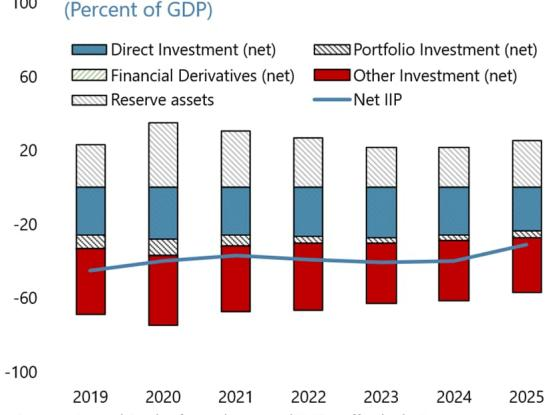

## Current Account

Background. The external balance improved sharply in 2025: the current account recorded a surplus of 2.4 percent of GDP, supported by a positive term of trade shock, and historically strong remittances growth (25.3 percent, representing an increase of 4.4 percentage points of GDP). Export values increased nearly 10.3 percent, supported by record-high coffee prices and improved volumes, but weakness in banana, palm oil and the maquila sector continued. The maquila sector exports fell 0.3 percent of GDP with respect to 2024. On the other hand, imports benefited from lower energy demand and lower oil prices. In the baseline projections, the current account is projected to return in 2026 to a deficit of 2.7 percent of GDP, as the positive shocks fade and higher oil prices increase the value of imports. The REER depreciated by 4.1 percent in 2025 (December over December), a trend that is expected to

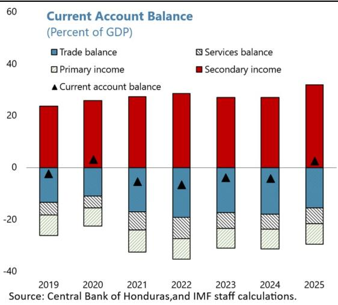  
Source: Central Bank of Honduras, and IMF staff calculations.

moderate as the exchange rate crawls in line with Honduras' fundamentals.

Assessment. The CA approach finds that the cyclically adjusted CA was 2.3 percent of GDP after accounting for the model's cyclical contributions and natural disasters, 0.4 and -0.3 percent of GDP respectively. A temporary adjustment totaling 5.5 percent of GDP was incorporated to account for two exceptional and temporary factors: unusually high coffee prices and a substantial increase in remittances. The adjustment for coffee prices was calculated by substituting a price of 270 cents per pound, a more typical level, versus the observed 383.1 cents per pound. This adjustment corresponds to 1.8 percent of GDP. For remittances, the adjustment was based on a growth rate of 7.1 percent, the historical average after excluding outlier years, versus the exception 25.2 percent growth recorded in 2025. This difference equates to 4.3 percent of GDP. Given the inherent uncertainty in these estimates, the final adjustments were rounded to 1.5 percent and 4.0 percent of GDP for coffee prices and remittances, respectively. With this adjustor, the adjusted CA balance was -3.2 percent of GDP. The cyclically adjusted CA norm, which reflects the CA level that is in line with fundamentals and desirable policy levels, stood at -3.9 percent of GDP. This yields a positive CA gap of 0.7 percent of GDP consistent with a REER undervaluation of 2.6 percent (assuming the cross-country CA elasticity of -0.35 with respect to REER). The contribution of policy gaps is estimated at 2.6 percent of GDP, primarily driven by the fiscal spending gap. In contrast, the REER index model finds a CA gap of -3.3 percent of GDP, suggesting a REER overvaluation of around 13.1 percent. The ES model suggests a CA gap of -0.4 percent of GDP, suggesting a REER overvaluation of around 1.5 percent. The result of the REER model, however, owes heavily to the temporary surge in remittances in 2025; had remittances remained at their 2024 level, the estimated REER overvaluation would decline to around 7 percent.

Additional Temporary Adjustor

<table><tr><td colspan="3">in percent of GDP</td><td colspan="2">2025</td></tr><tr><td></td><td>Observed</td><td>Structural</td><td>Difference</td><td>Adjustor</td></tr><tr><td>Current account</td><td>2.4</td><td>-4.3</td><td>6.7</td><td>5.5</td></tr><tr><td>Trade balance</td><td>-15.7</td><td>-17.5</td><td>1.8</td><td>1.5</td></tr><tr><td>Exports fob (net of maquila import)</td><td>23.1</td><td>21.3</td><td>1.8</td><td>1.5</td></tr><tr><td>Maquila (net)</td><td>5.7</td><td>5.7</td><td>0.0</td><td></td></tr><tr><td>Coffee</td><td>5.9</td><td>4.1</td><td>1.8</td><td>1.5</td></tr><tr><td>Other</td><td>11.5</td><td>11.5</td><td>0.0</td><td></td></tr><tr><td>Imports fob (excl. maquila)</td><td>-38.8</td><td>-39.3</td><td>0.5</td><td></td></tr><tr><td>Petroleum products</td><td>-6.6</td><td>-7.1</td><td>0.5</td><td></td></tr><tr><td>Other</td><td>-32.3</td><td>-32.3</td><td>0.0</td><td></td></tr><tr><td>Services (net)</td><td>-6.2</td><td>-6.2</td><td>0.0</td><td></td></tr><tr><td>Income (net)</td><td>-7.6</td><td>-7.6</td><td>0.0</td><td></td></tr><tr><td>Current transfers (net)</td><td>32.0</td><td>27.6</td><td>4.4</td><td></td></tr><tr><td>Of which: remittances</td><td>30.1</td><td>25.7</td><td>4.4</td><td>4.0</td></tr></table>

Source: Central Bank of Honduras, and IMF staff calculations.

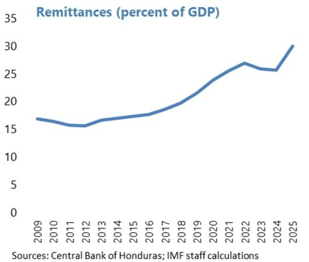  
Sources: Central Bank of Honduras; IMF staff calculations

Overall, the CA model (with adjustors) suggests REER undervaluation of about 2.6 percent, while the ES model suggests overvaluation of 1.5 percent, and the REER model suggests overvaluation of 13 percent (7 percent using a more medium-term level of remittances). Also taking into account additional approaches (Annex III) and FX market conditions in 2025, in which the exchange rate moved to the stronger half of the band, the external position is assessed to be in line with the level implied by fundamentals and desirable policies.

<table><tr><td colspan="4">EBA-Lite Model Results, 2025 (Percent of GDP)</td></tr><tr><td rowspan="2"></td><td rowspan="2">CA model 1/</td><td>REER model 1/</td><td rowspan="2">ES model</td></tr><tr><td>(in percent of GDP)</td></tr><tr><td>CA-Actual</td><td>2.4</td><td></td><td></td></tr><tr><td>Cyclical contributions (from model) (-)</td><td>0.4</td><td></td><td></td></tr><tr><td>Additional temporary/statistical factors (-) 2/</td><td>5.5</td><td></td><td></td></tr><tr><td>Natural disasters and conflicts (-)</td><td>-0.3</td><td></td><td></td></tr><tr><td>Adjusted CA</td><td>-3.2</td><td></td><td></td></tr><tr><td>CA Norm (from model) 3/</td><td>-3.9</td><td></td><td></td></tr><tr><td>Adjustments to the norm (+)</td><td>0.0</td><td></td><td></td></tr><tr><td>Adjusted CA Norm</td><td>-3.9</td><td></td><td></td></tr><tr><td>CA Gap</td><td>0.7</td><td>-3.3</td><td>-0.4</td></tr><tr><td>o/w Relative policy gap</td><td>2.6</td><td></td><td></td></tr><tr><td>Elasticity</td><td>-0.3</td><td></td><td></td></tr><tr><td>REER Gap (in percent)</td><td>-2.6</td><td>13.1</td><td>1.5</td></tr><tr><td colspan="4">1/ Based on the EBA-lite 3.0 methodology</td></tr><tr><td colspan="4">2/ Additional adjustment to account for the temporary impact of extraordinary remittances growth and coffee prices increase, both of them temporary.</td></tr><tr><td colspan="4">3/ Cyclically adjusted, including multilateral consistency adjustments.</td></tr><tr><td colspan="4">Real Exchange Rate</td></tr><tr><td colspan="4">Background. Since September 2024, the REER has adjusted materially. Honduras&#x27; REER depreciated by about 4.1 percentage points in 2025 (December over December), reflecting the exchange rate crawl and broad-based USD depreciation in 2025. The nominal exchange rate depreciated by 3.9 percent against the USD in 2025 (more than 6.5 percent cumulatively since the crawl restarted in 2024) and 0.7 percent in the first quarter of 2026, and the exchange rate has begun to fluctuate within the band in the exchange rate auction as FX market conditions normalized (Annex IV).</td></tr><tr><td colspan="4">Assessment. The CA model suggests REER undervaluation of 4.1 percent, with estimated overvaluation of 13.0 and 1.5 percent respectively for the REER model and ES models. Overall, these estimates suggest that the REER was close to equilibrium level at end-2025. Nevertheless, due to the inflation differential of Honduras with its trading partners and a term of trade shock due to oil prices, the nominal exchange rate should continue to crawl in line with Honduras fundamentals.</td></tr></table>

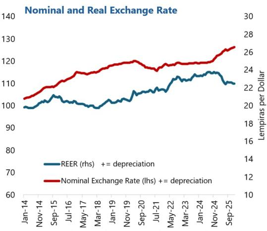

## Capital and Financial Accounts: Flows and Policy Measures

<table><tr><td colspan="2">Current Account Financing
(Percent of GDP)
Capital account FDI
Public sector borrowing
Reserves accumulation
Other capital flows
Current account deficit</td></tr><tr><td>2019</td><td>2020</td></tr><tr><td>2021</td><td>2022</td></tr><tr><td>2023</td><td>2024</td></tr><tr><td>2025</td><td>2025</td></tr></table>

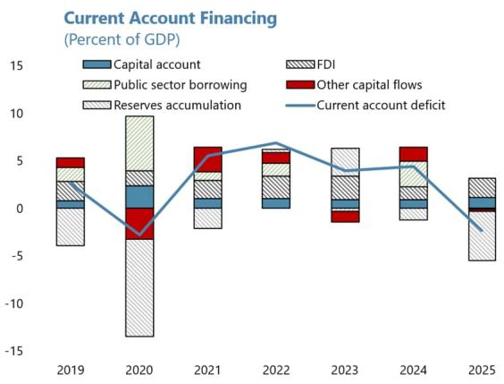

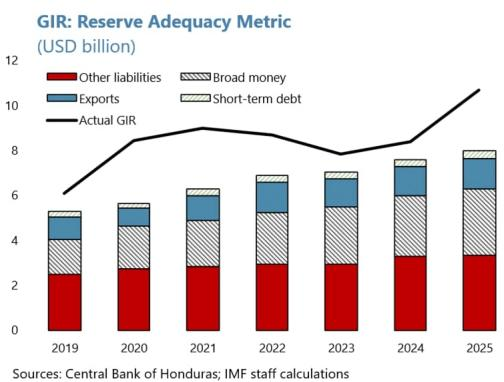

Sources: Central Bank of Honduras; and IMF staff calculations.

# Annex III. Equilibrium REER and Exchange Rate Policy Implementation

1. Exchange rate crawl implemented since late 2024 has supported the depreciation of the real effective exchange rate (REER) towards estimated equilibrium levels. In the Third Reviews, the REER was assessed to be 5-10 percent overvalued in 2024. Further to the discussion in the External Sector Assessment (Annex II), additional approaches to estimating the equilibrium REER suggest that the REER overvaluation has been significantly reduced:

\- Behavioral equilibrium exchange rate (BEER): The BEER is estimated using a vector error correction model relating the equilibrium exchange rate to interest rate differentials, relative

GDP growth, the terms of trade, the NIIP, and remittances, with the main drivers of the BEER being interest rate differentials and remittances. This approach suggests that the BEER is currently experiencing a trend appreciation, driven in part by the recent positive shock to remittances. As of 2025Q4, the REER was about 6 percent weaker than the estimated BEER, or about 4 percent weaker than the BEER estimated without the remittance shock, suggesting that the REER is currently slightly undervalued.

\- Counterfactual nominal exchange rate: As an additional approach, a counterfactual nominal exchange rate can be estimated, taking advantage of the BCH's formula for the rate of crawl based on purchasing power parity, meant to avoid sustained one-way trends in the REER and thus persistent over/under-valuation. A counterfactual exchange rate is constructed based solely on nominal effective exchange rate (NEER) movements and the inflation differential since 2012. While the counterfactual exchange rate

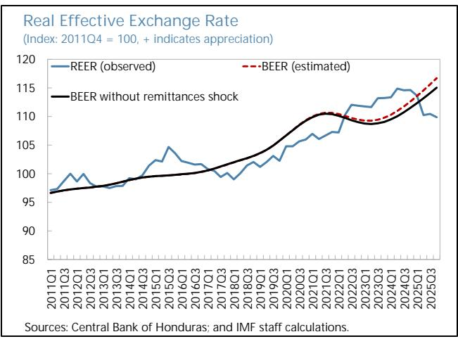  
Nominal Exchange Rate: Counterfactual and Observed (Lempira per USD, LHS; Percentage points, RHS)

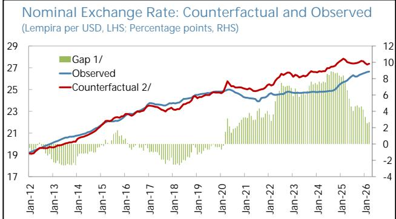  
1/ Percentage difference between observed and counterfactual.
2/ Monthly changes determined solely by NEER movements and inflation differential with trading partners.
Sources: Haver; and IMF staff calculations.

tracked the observed exchange rate well for nearly a decade, it diverged beginning in 2020, reaching a peak divergence in 2024 of about 9 percent. Since exchange rate crawl restarted in late 2024, the divergence has largely closed, reaching about 2 percent in March 2026.

## Annex IV. Recent Developments in the Foreign Exchange Auction

1. The rates of allocation of foreign exchange (FX) in the Central Bank of Honduras (BCH) auction have improved markedly since late 2024. After the BCH suspended the interbank FX market and reintroduced the auction mechanism in April 2023, the FX auction was characterized by excess demand, with rates of allocation in the auction typically between 30 and 50 percent of accepted demand. Beginning in late 2024, demand began to decline, while supply began to increase. By July 2025, supply and demand had converged, with the BCH routinely meeting 100 percent of accepted demand in daily auctions (Annex IV. Figure 1).

## Annex IV. Figure 1. Allocation in the BCH Foreign Exchange Auction

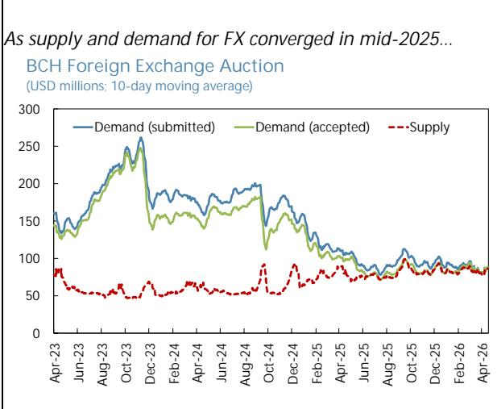

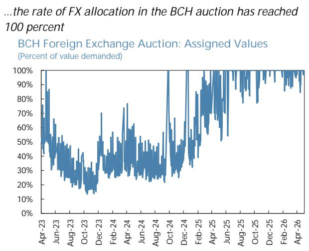  
Sources: Central Bank of Honduras; and IMF staff calculations.

2. Several factors have contributed to the convergence of supply and demand in the auction. First, policy adjustments implemented in late 2024—including the resumption of exchange rate crawl and a 275 bps increase in the policy interest rate—helped to reduce FX demand by lowering incentives to invest in external assets and moderating demand for imported goods. Second, positive shocks to coffee export prices and remittances increased the supply of FX surrendered to the BCH, which can be offered in the auction. Third, the convergence of supply and demand appears to have been self-reinforcing, with easing perceptions of scarcity fostering a reduction of excess demand. The market has continued to perform since the onset of the war in the Middle East, with demand remaining broadly stable, and supply consistently fully meeting demand.

3. As supply and demand have converged, price discovery has begun in the FX auction. Under the crawling band exchange rate regime, the BCH sets the "base price" on a weekly basis, which determines the rate of crawl. However, the exchange rate is allowed to fluctuate within a $\pm1$ percent range around the center of the band, which is determined by the weighted average of the last seven days of the "base price" (80 percent) and the last seven days of the weighted average exchange rate of the BCH auction results (20 percent). While bids in the auction are allowed at any price within the $\pm1$ percent band, in practice, since the return of the auction in 2023, bids were only placed at the top of the band, as the auction functioned more as an FX rationing system. $^{1}$ Bidders appeared to believe that their orders would only be (partially) filled if they bid at the maximum price. However, as supply and demand have converged, beginning in July 2025 bids have been made within the full range of the band (Annex IV. Figure 2). $^{2}$ As a result, the weighted average auction price has moved away from the top of the band. Thus, the official exchange rate (known as the “reference exchange rate”) has begun to fluctuate within the band, driven by price discovery.

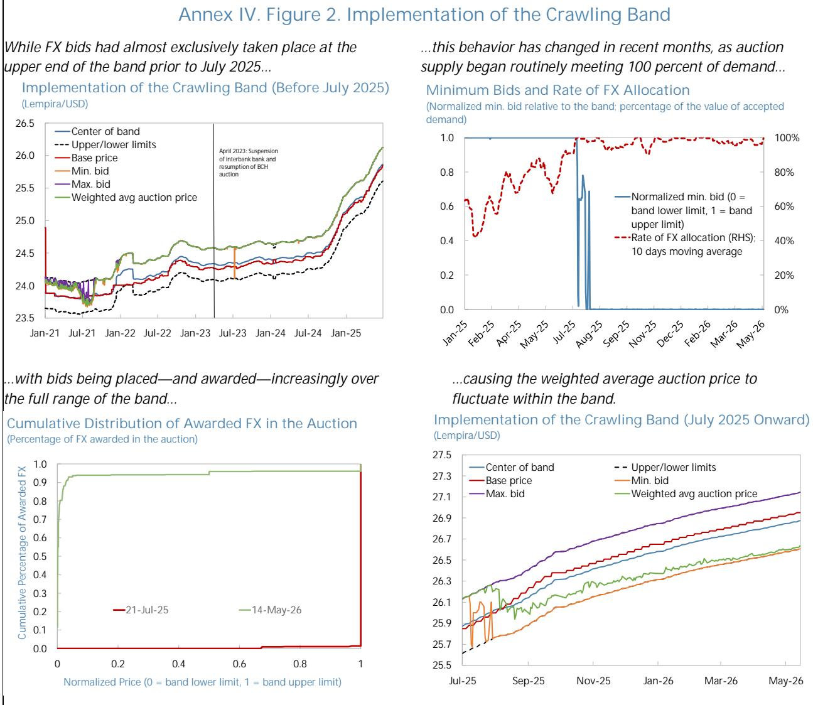

## Annex IV. Figure 2. Implementation of the Crawling Band

Sources: Central Bank of Honduras; and IMF staff calculations.

## Annex V. Summary of Poverty Reduction and Growth Strategy

1. The new administration continues to view poverty reduction as a central pillar of its national agenda. Honduras is undertaking a major effort to reform its development model (centered on high quality investment and private sector job generation) and address ongoing structural challenges.

2. The Poverty Reduction and Growth Strategy (PRGS) 2022-2046 was prepared and published by the previous government. It offers a comprehensive reference framework to tackle poverty, inequality, and institutional weaknesses, envisaging the enhancement of the quality of life for vulnerable populations through inclusivity and resilience. The PRGS is aligned with the previous government's Strategic Plan (2022-2026), the 2030 Sustainable Development Goals, and commitments under the HIPC Initiative.

3. The PRGS envisages a course toward inclusive and equitable economic growth, with an emphasis on increasing investments in social spending and productive sectors. A minimum expenditure threshold to strengthen programs designed to improve the living conditions of the most vulnerable groups is an important element of the strategy. The current administration continues to support efficient social programs while seeking to promote further targeting and efficiency for the most vulnerable groups.

4. The specific objectives of the PRGS include reducing the gaps between populations living in extreme and relative poverty. To achieve this, the expansion of the coverage of social protection and welfare systems, as well as updating pension amounts, are proposed as instruments. The strategy also aims to foster economic growth and stability while supporting financial inclusion to reduce extreme poverty through the development of productive, viable, and sustainable ecosystems that can generate family income and enhance the overall quality of life.

5. The PRGS incorporates two fundamental cross-cutting axes: gender and climate change. The PRGS, structured around three pillars (see box below), integrates these approaches in a comprehensive manner, strengthening the implementation of inclusive, equitable, and resilient public policies, and contributing to the enhancement of equal opportunities and environmental sustainability across all dimensions of national development. The primary goal of the gender axis is to protect and promote the human rights of women and girls, ensure gender equality at all levels of decision-making, include women and girls in digital transformation, support women entrepreneurs, and reduce the burden of unpaid domestic and caregiving work. Regarding climate, the PRGS aims to enhance resilience to extreme events and the impacts of natural disasters. The climate axis is operationalized across the PRGS's pillars through a combination of strategic integration, institutional coordination, and targeted investments and upgrades to hydroelectric plants and transmission systems, and promotion of irrigation projects. In alignment with the National Climate Change Strategy (ENCC), Honduras is committed to implementing a comprehensive program to address natural disasters, focusing on mitigation, adaptation, and the sustainable management of natural resources.

6. The PRGS is fully aligned with the key objectives of the IMF-supported ECF/EFF program. Under Pillar 1 (Stability and Inclusive Growth), the PRGS's macroeconomic anchor is reinforced by the program's emphasis on fiscal sustainability as well as the consistency of exchange rate and monetary policies to keep inflation contained, safeguard reserves, and strengthen external competitiveness. Under Pillar 2 (Public Services and Programs to Reduce Inequalities), the alignment is reflected in explicit social spending targets, together with structural reforms—such as stronger budget execution, better public financial management and procurement, and rollout of integrated social registries—that raise the efficiency and equity of service delivery. Under Pillar 3 (Programs for the Population in Poverty), the PRGS's targeted interventions are supported by the Fund program's floors on priority social outlays and benchmarks that improve the execution and monitoring of social programs. Additional reforms under the program—in the energy sector, transparency and AML/CFT, and the business environment—directly bolster the PRGS's goals of inclusive, resilient, and sustainable growth.

<table><tr><td colspan="2">Annex V. Table 1. Honduras: Pillars of the Honduras PRGS 2022-2046</td></tr><tr><td>Pillar</td><td>Description</td></tr><tr><td>Pillar 1: Stability and Inclusive Growth</td><td>Focus on macroeconomic policies promoting stability, growth, and opportunities for low-income populations.</td></tr><tr><td>Pillar 2: Public Services and Programs to Reduce Inequalities</td><td>Universal accessibility of goods and services, particularly in education, health, employment, housing, productive activities in the countryside; sports and recreation; and the culture and heritage of the peoples; and social infrastructure for lower-income populations.</td></tr><tr><td>Pillar 3: Programs for the Population in Poverty</td><td>Targeted programs and services for those in poverty, focusing on critical geographical areas requiring priority attention.</td></tr><tr><td colspan="2">Sources: Honduran authorities and IMF Staff.</td></tr></table>

# Annex VI. Trust Funds: Recent Developments and Performance under the Program

1. Since its inception in 2023, the current Fund-supported program has backed efforts to liquidate trust funds. This focus predates the current arrangement: in 2019, the IMF Executive Board encouraged improved transparency and governance, including for trust funds, and the 2021 Fiscal Transparency Evaluation flagged gaps from not recording in fiscal reports the execution of funds managed by trusts. Around 70 percent of all trust funds have been legally closed under the program, with only a subset (25 of 82) remaining. The new authorities have also expressed support for continuing the closure of the remaining trust funds in this group. The latest available data demonstrate that the macro-critical objective set at the program's inception has been materially achieved (Annex VI. Tables 1 and 2).

2. Financial statements as of April 2026(Annex VI. Table 1) confirm that balance-sheet integration has advanced decisively. Trust-fund cash balances have been largely centralized into the Single Treasury Account (TSA), including for trust funds not yet legally closed, thereby interrupting operations across all 82 trust funds. Moreover, assets substantially exceed liabilities for both closed and not-yet-closed funds, yielding a strong net position to cover any validated residual claims as legal processes take their course.

Annex VI. Table 1. Honduras: Main Statistics on Trust Funds (Millions of Lempiras; and percent of 2025 GDP in parentheses)

<table><tr><td>Description</td><td>Number of trust funds</td><td>Assets</td><td>Liabilities</td><td>Cash balance incorporated into the Single Treasury Account</td><td>Cash balance remaining</td><td>Debt</td></tr><tr><td>Liquidated trust funds</td><td>57</td><td>L1,466.5(0.14%)</td><td>L77.1(0.01%)</td><td>L4,652.5(0.45%)</td><td>L321.0(0.03%)</td><td>L0.0(0.00%)</td></tr><tr><td>Trust funds not liquidated (BANHPROVI)</td><td>12</td><td>L343.0(0.03%)</td><td>L1.2(0.0001%)</td><td>L993.1(0.10%)</td><td>L17.9(0.002%)</td><td>L0.0(0.00%)</td></tr><tr><td>Complex trust funds (not liquidated)</td><td>13</td><td>L1,463.3(0.14%)</td><td>L613.7(0.06%)</td><td>L5,528.4(0.54%)</td><td>L203.4(0.02%)</td><td>L8,459.9(0.82%)</td></tr><tr><td>TOTAL</td><td>82</td><td>L3,272.8(0.32%)</td><td>L692.0(0.07%)</td><td>L11,174.0(1.09%)</td><td>L542.3(0.05%)</td><td>L8,459.9(0.82%)*</td></tr></table>

3. Debt obligations of all legally closed funds have been recognized within the government's accounts. For the 12 Banhprovi-related funds (not yet legally closed), debt stemming from loans has also been brought onto the government's balance sheet. The 2026 budget approved by Congress included a provision granting an amnesty for accumulated fines and surcharges, removing a key legal obstacle to the liquidation of these funds. The authorities are now proceeding with the remaining administrative steps, including instructing Banhprovi to initiate the liquidation

process, completing the required closing reports and liquidation agreements, processing the approved SAR amnesty for fines and surcharges, and issuing the final discharge once the reports are accepted. Closure of these funds constitute a structural benchmark under the program.

4. The debt obligations of the 13 “more complex” trust funds have been incorporated into staff’s debt sustainability analysis (DSA), and their magnitude is manageable (Annex VI. Table 2). Four complex funds, with nested cases, account for the entire debt shown in Annex VI. Table 1. Debt from loans represents roughly 0.2 percent of GDP and has been incorporated into the government’s balance sheet and the DSA. Debt from supplier payables represents 0.2 percent of GDP, and it has also been added to the debt stock in the DSA, although the government treats it as a contingent liability. In addition, there are judicial claims reported to the Public Prosecutor’s Office under criminal investigation which correspond to 0.5 percent of GDP; these are treated as contingent liabilities by the Ministry of Finance and are used to inform the calibration of the DSA’s contingent liability shock. In sum, the debts and contingent liabilities of the most complex funds have been quantified and recorded; their scale remains manageable relative to GDP, and they are well covered by available cash and the positive net asset position, which could be used to settle validated liabilities at liquidation.

Annex VI. Table 2. Honduras: Debt Breakdown for Four Major Complex Trust Funds (Millions of Lempiras; and percent of 2025 GDP in parentheses)

<table><tr><td>N.</td><td>Trust Fund</td><td>Debt (loans)1/</td><td>Debt (supplier payables)2/</td><td>Judicial claims reported to the Public Prosecutors&#x27; office</td><td>Total</td></tr><tr><td>1</td><td>Security fee</td><td>L1,392.1(0.14%)</td><td>L240.0(0.02%)</td><td>L5,000.0(0.49%)</td><td>L6,632.1(0.65%)</td></tr><tr><td>2</td><td>INVEST-H</td><td>L0.0(0.00%)</td><td>L941.0(0.09%)</td><td>L0.0(0.00%)</td><td>L941.0(0.09%)</td></tr><tr><td>3</td><td>SITEC-IP</td><td>L0.0(0.00%)</td><td>L858.7(0.08%)</td><td>L0.0(0.00%)</td><td>L858.7(0.08%)</td></tr><tr><td>4</td><td>Contrato de Fideicomisos (PPP)</td><td>L0.0(0.00%)</td><td>L28.1(0.003%)</td><td>L0.00(0.00%)</td><td>L28.1(0.003%)</td></tr><tr><td colspan="2">Total</td><td>L1,504.3(0.15%)</td><td>L2,067.8(0.20%)</td><td>L5,000.0(0.49%)</td><td>L8,459.9(0.82%)</td></tr></table>

Sources: Ministry of Finance; and IMF staff calculations, based on April 2026 financial statements.

5. Legal accountability concerns in the more complex cases have prevented their premature legal liquidation, even after transferring cash to the TSA to prevent further operations. Four leading complex funds (Annex VI. Table 2) have been referred to the Superior Court of Accounts (SCA) for further audit. The SCA has dedicated resources and is actively pursuing the audits; however, capacity constraints mean these reviews will extend beyond the program's

horizon, implying that some funds are unlikely to reach legal closure during the program period. Notwithstanding this, the Ministry of Finance will continue the necessary evidence to advance closures, where feasible. One fund in the more-complex cohort has been closed after Ministry auditors verified the documentation and established sufficient legal comfort to proceed.

6. Based on this evidence, staff assesses that the macro-critical objective of the SB on trust-fund closures has been materially achieved. With all trust funds under the program drained of cash and inoperable, and with most associated debt recognized in the government accounts and incorporated into staff's debt estimates and projections, staff proposes dropping the SB that requires legal closure of the 13 remaining most complex funds, without prejudice to the underlying reform objectives, since it is not macro-critical, while considering the delay and need to allow any the legal and criminal process to take its course.

# Appendix I. Letter of Intent

June 11, 2026

Ms. Kristalina Georgieva
Managing Director
International Monetary Fund
Washington, DC 20431

Dear Ms. Georgieva:

In the attached update to the Memorandums of Economic and Financial Policies (MEFP) from September 1, 2023, November 20, 2024, and May 22, 2025, we confirm our commitment to the policies and objectives of the economic program supported by the IMF arrangements under the Extended Fund Facility (EFF) and the Extended Credit Facility (ECF) arrangements. We describe progress and further policy steps toward meeting these objectives as well as our government's policy agenda.

Since the inauguration of President Nasry Asfura on January 27, 2026, our government has launched a renewed vision for Honduras centered on inclusive economic growth and job creation, an improved environment for business and investment—demonstrated by our decision to quickly rejoin the International Centre for Settlement of Investment Disputes (ICSID)—and a more efficient state. Our administration values policy continuity and pragmatism and considers that the broad objectives of the Fund-supported program are aligned with our own priorities and provide a central pillar for safeguarding macroeconomic and fiscal stability. For this reason we received an IMF staff visit in February to become familiar with and take full ownership of the program. This close engagement has allowed us to work constructively with Fund staff to preserve the role of the program as a macroeconomic and fiscal anchor while adapting implementation strategies where needed, considering urgent social needs, and our determination to deliver credible reforms.

Our fiscal, monetary and exchange rate policies will remain prudent and focused on preserving macroeconomic and fiscal stability. We are managing the inflationary and fiscal pressures emanating from the global oil price shock judiciously, through targeted support to the most vulnerable, while maintaining a non-financial public sector deficit target of 1 percent of GDP this year. Conditions in the foreign exchange auction have improved markedly, achieving balance between supply and demand, and generating certainty regarding access to foreign exchange. We are committed to continuing to implement measures to facilitate access to foreign exchange and move toward reestablishing an interbank foreign exchange market. Additionally, we are advancing a medium-term agenda for the institutional strengthening of the Central Bank of Honduras.

Regarding the structural reform agenda, we recognize that the energy sector is a key challenge, for both the fiscal sustainability and competitiveness of our country. Implementing a new vision for the sector amid long-standing challenges has proven complex, but we are fully committed to making steady progress and are working expeditiously to reduce electricity losses and arrears to generators. Demonstrating this commitment, we have completed the merger of ENEE's distribution-related units, a critical structural measure to strengthen operational coordination, accountability, and loss-reduction efforts under the Fund-supported program and are working to advance other benchmarks. Furthermore, we have also submitted to Congress a draft decree reforming the country's Electricity System Law that translates our reform vision into a concrete legislative proposal and seeks to modernize the sector's institutional, regulatory, and operational framework, strengthen governance and transparency, and lay the foundations for more efficient, financially sustainable, and reliable electricity service.

We have also moved swiftly on governance and institutional reforms that are important both for the country and central for the program. Within weeks of taking office, we submitted to our National Congress a new public procurement law, legal amendments to strengthen the AML/CFT framework, and a new beneficial ownership law, and published in June the National Transparency and Anti-Corruption Strategy (ENTAH).

More broadly, we are also committed to reducing fiscal and governance risks generated by the systemic use of trust funds as a substitute for regular budgetary and public financial management processes. We have approved enabling legislation that will allow us to complete the closure of 12 pending trust funds under the program. At the same time, we appreciate the Fund's constructive engagement and understanding of the urgent needs arising from the shortage of medicines and surgical backlogs. In this context, we reiterate our commitment to ensuring that the new health trust fund created is a strictly temporary exception, tightly ring-fenced, and subject to robust safeguards, reporting, transparency, and audit requirements.

We are advancing reforms to help the state function more effectively as a facilitator of job creation, investment, and broader opportunities for the Honduran people. A key element is improving the quality, targeting, and impact of social policies. In this regard, our administration is strengthening beneficiary identification, streamlining programs, and better aligning social support with household needs. The Fund-supported program has contributed important tools, including the development of the Honduran Beneficiary Information Registration System (SIRBHO), the operationalization of the Single Social Sector Information System (SUISS). These reforms will help improve the effectiveness of social spending, and reduce leakages and duplication. The approval and implementation of the Manual for Programming for Budget execution across five pilot Ministries, together with the reform of the Organic Budget Law (approved by Congress and implemented) will strengthen public financial management and the Treasury Single Account and enhance spending efficiency.

Based on policy actions already taken and the strength of the policies set forth in the attached MEFP, we request completion of the Fourth and Fifth reviews of the arrangements under the Extended Fund Facility (EFF) and the Extended Credit Facility (ECF) arrangements and the associated disbursements of SDR 118.94 million under the EFF arrangement and SDR 59.48 million under the ECF arrangement. Following the Third Reviews approved in June 2025, 17 structural benchmarks remained pending, reflecting accumulated delays and missed benchmarks under the program. Since the beginning of our government, we have implemented seven structural benchmarks, bringing

total implementation to 11. For the remaining structural benchmarks not yet implemented, we have proposed revised timeframes and, where appropriate, modifications to enable their completion in the context of the sixth and final reviews. We also request Executive Board approval of a waiver of nonobservance for the end-December 2025 performance criterion on the stock of domestic arrears of ENEE on the basis of corrective actions taken. To allow sufficient time to complete the sixth reviews and finalize the remaining reform commitments, we request a short extension of the program to December 31, 2026.

We also request the IMF Executive Board's approval to retain the exchange restriction arising from the measures previously implemented by the BCH for the allocation of foreign exchange for the making of payments and transfers on current international transactions on the grounds that the measures are maintained for balance of payments purposes, temporary, and non-discriminatory. We are committed to gradually phasing out these measures, building on the considerable progress already achieved in strengthening the BCH's foreign exchange auction, as balance of payments stability is further consolidated and external risks subside, supported by implementation of the policies under our program.

The program will continue to be monitored through semi-annual reviews, prior actions, quantitative performance criteria, indicative targets, and structural benchmarks as described in the attached MEFP and Technical Memorandum of Understanding (TMU).

We are mindful that risks to the outlook remain significant. The current external environment has the potential to be profoundly destabilizing for a small open economy such as Honduras. While we believe that Honduras is in a strong position to navigate the recent oil price increase, and that our policies are well suited to achieve the objectives of our program, we stand ready to take any additional measures that may be appropriate. In accordance with the Fund's policies on consultations, we will engage with the Fund on the adoption of these measures, and in advance of any revisions to the policies contained in this memorandum. In keeping with our commitment to transparency with the public and the international community, we will share all information necessary to monitor our program performance and we authorize the IMF to publish this Letter of Intent, the MEFP and its annexes, the TMU, and the Staff Report.

Sincerely,

/s/

Nasry Juan Asfura Zablah

President of the Republic of Honduras

/s/

/s/

Roberto Lagos

Emilio Hernández Hércules

President, Central Bank of Honduras

Secretary of Finance

Attachments (2)

Memorandum of Economic and Financial Policies

Technical Memorandum of Understanding

## Attachment I. Memorandum of Economic and Financial Policies

## I. Context

1. Following the inauguration of President Nasry Asfura on January 27, 2026, we launched a renewed vision for Honduras centered on private-investment-led growth, job creation, and better public services, all anchored on macroeconomic and fiscal stability. This vision is embedded in the government's 2026–30 plan, Juntos Vamos a Estar Bien, which is structured around 11 policy priorities emphasizing political certainty, legal security, citizen security, efficient energy generation, infrastructure, and stronger social services. Under this vision, the state must act as an effective facilitator to foster entrepreneurship and investment so that they can become stronger engines of opportunity and inclusion while preserving macroeconomic stability. An early implementation of this agenda was our decision to return Honduras to the International Centre for Settlement of Investment Disputes (ICSID/CIADI), reinforcing our commitment to international arbitration and to a more predictable environment for investment.

2. We have responded promptly and decisively to urgent social and economic pressures in the context of a demanding political transition. As we finalized the 2026 budget, we had to promptly address unexpected payments ordered by the Judiciary related to court rulings against the state, which imposed fiscal costs of about $\frac{1}{2}$ percent of GDP, while confronting the effects of the oil-price shock stemming from the conflict in the Middle East and uncertainty associated with global tariff and migration policies. A severe shortage of medicines and the surgical backlog have also required rapid and decisive actions, including the declaration of a health emergency and presidential leadership to accelerate measures needed to save lives and restore essential services.

3. In providing a central anchor for macroeconomic stability, policy credibility, and investor confidence, the Fund-supported program is fully aligned with the government's economic strategy. Honduras faces important longstanding structural challenges. Successive Fund-supported programs this century alone have sought to help overcome these challenges by bolstering macroeconomic stability, creating fiscal space to support social and infrastructure spending, enhancing institutions and macroeconomic frameworks, advancing structural reforms to improve the business environment and governance, and seeking to put the financial situation of the public electricity company (ENEE) on a sustainable path. The current Fund-supported program seeks to address many of these challenges. We are committed to the program's objectives and have moved decisively to resume progress under our administration's vision. Our early policy actions, within weeks of assuming office, included meeting two key structural benchmarks of the Fund-supported program, undertaking further improvements to the Central Bank of Honduras (BCH)'s foreign exchange auction, addressing challenges in ENEE, and continuing work with Congress to approve and implement a 2026 budget aligned with the government's vision and the program's targets, as well as key reforms to strengthen governance and support investment.

## II. Recent Developments and Program Performance

4. Macroeconomic conditions entering 2026 reflected resilience, although the effects of the recent oil-price shock are now beginning to be felt. Supported by favorable external conditions, real GDP grew by 3.8 percent in 2025, with high-frequency indicators pointing to broadly stable growth at the beginning of 2026. Growth was driven by private consumption supported by record-high remittance income and a smaller contraction in real exports favored by record-high coffee prices, while the contribution of private fixed investment stagnated in the context of electoral and global uncertainty from tariff policies, as well as delays in key energy-sector decisions. Headline inflation at end-2025 stood at 4.98 percent, within the BCH tolerance range of 4±1 percent and inflation expectations remained well anchored throughout. However, core inflation stood at 5.43 percent at end-2025. Helped by lower food and core inflation and favorable base effects, inflation fell to about 3.5 percent in February 2026—the lowest since 2020. Since then, the impact of higher international oil prices has begun to be felt, particularly through fuel and transport costs, putting renewed upward pressure on headline inflation, although inflation expectations have so far remained broadly anchored. The current account recorded a surplus of around 2.4 percent of GDP in 2025, supported by buoyant remittances and improved terms of trade. As a result, net international reserves increased by more than US\$2 billion in 2025 and further rose by around US\$1.4 billion through end-April 2026, reaching US\$11.596 billion.

5. Fiscal policy remained prudent amid weaker capital spending. The non-financial public sector (NFPS) deficit declined from 1.0 percent of GDP in 2024 to 0.7 percent of GDP in 2025, well below the programmed 1.5 percent, as slower capital spending and lower-than-expected interest costs more than offset slightly weaker tax performance and somewhat higher other current transfers. Furthermore, budget execution continued prudently during Q1 2026, with a NFPS surplus of 0.9 percent of GDP. The 2026 government targets a NFPS deficit of 1 percent of GDP in line with program targets, relying on conservative revenues and tight current spending to absorb the oil price shock with broadly stable taxes and expenditures as a share of GDP, modestly reducing the wage bill and capital spending as a share of GDP, and reallocating spending toward energy needs and subsidies. On the financing side, the 2026 budget remains prudent and aligned with program targets.

6. Program performance for the fourth and fifth reviews has been favorable, reflecting our decisive actions to address delays in structural reforms and our commitment to overcome remaining implementation challenges. Most quantitative performance and indicative targets were met, most by ample margins, but implementation of structural benchmarks was hampered by the election period and by earlier delays, especially in the energy sector, where ENEE arrears rose markedly.

\- Quantitative targets: End-June and end-December 2025 quantitative performance criteria (QPCs) and all continuous performance criteria were met, with the exception being the QPC for ENEE arrears. The adjustments in monetary and exchange rate policies, along with supportive external conditions in 2025, strengthened external buffers and allowed international reserve targets to be met by a wide margin. Fiscal discipline has been preserved, with all QPCs and

indicative targets (ITs) for the NFPS balance met, and end-December 2025 ITs for tax revenues and primary spending missed only marginally. However, the end-March 2026 IT on social spending was missed due to delays related to administrative processes and reorganization following the change of government. Progress on the energy sector has stalled, with the end-December 2025 QPC and end-March 2026 IT for ENEE arrears and ITs for electricity losses missed by wide margins. This reflects deterioration in the energy pillar prior to and shortly after the elections. The implementation of a new vision requires an integral assessment of both governance and the performance of the institutions that make up the sector, amid challenges associated with the rise in oil prices and a possible severe impact from El Niño. We understand the importance and urgency of addressing these developments and are implementing corrective measures to restore progress on the energy pillar as further outlined in Section C of this memorandum. There have been no new flows of monetary financing to the financial public sector.

\- Structural benchmarks: Four out of seventeen structural benchmarks (SBs) due for these reviews had been implemented prior to our government taking office: (i) the updated regulations for the FX auction; (ii) the census of urban households in extreme poverty; (iii) the publication of a manual for implementation of social assistance payments in emergencies; and (iv) the adaptation of operational processes related to budget execution. Demonstrating a pragmatic approach and clear commitment to the program, we have moved quickly to address the important delays in the implementation of structural benchmarks after taking office at end-January and have implemented seven additional SBs. We advanced, within weeks of assuming office, two key structural benchmarks related to submitting to Congress important legislation related to the Public Procurement Law, AML/CFT, and beneficial ownership. We also established the Single Social Sector Information System (SUISS), which will help to improve the targeting of social spending, and we are taking the necessary actions to liquidate the 12 Banhprovi-related trust funds that remained pending under the program by securing congressional approval in April of a key enabling measure to pardon fines and surcharges while advancing the administrative final steps. We also published in June regulations for effective implementation of the Amendments to the Organic Budget Law to strengthen the Treasury Single Account framework. We have redoubled our efforts to advance structural reforms in the energy sector. To that effect, we have integrated into a single unit the operational process of ENEE's three distribution units in April, a key achievement. We have also launched the tender process to hire specialists to undertake the IFRS-related work, have hired an audit firm to complete the financial audits for the years 2024-25, and are gathering the technical inputs needed for pending tariff-setting measures. We have implemented a new transparency and anti-corruption strategy aligned with our government's vision and are working on the registry of beneficiary ownership. We are committed to moving these reforms forward and request to reset four of the remaining structural benchmarks to future dates to allow for additional implementation time. We also implemented in June an updated regulation for the health trust fund to cap budgetary transfers, prohibit incurring or assuming debt, define eligible spending categories clearly, and subject the trust fund to regular reporting.

## III. Policy Framework and Economic Program

7. The baseline macroeconomic framework for 2026-27 has been updated to reflect recent domestic and global developments, including uncertainty and the adverse effects of higher oil prices, the lagged effect of global tariff and migration policies, and the priorities of our administration.

\- GDP growth: Real GDP growth in 2026 and 2027 is projected to be in the range of 3.0 to 4.0 percent, supported by resilient domestic demand on the back of remittance-supported private consumption and an expected post-election recovery in private investment amid a more challenging external environment, including the heightened geopolitical tensions in the Middle East. The balance of risks to growth is tilted to the downside, given the shifts in trade and migration policies and the effect of the conflict in the Middle East.

\- Inflation: Inflation in 2026 and 2027 is projected to be within the BCH's tolerance range of $4 \pm 1$ percent. However, given the rise in energy prices following the conflict in the Middle East, the balance of risks to inflation is tilted to the upside, and the future inflation trajectory depends largely on the duration and severity of the energy price shock.

\- External position: The current account is projected to return to a deficit in the range of 1 to 2 percent of GDP in 2026 and 2027, driven by less favorable terms of trade from elevated fuel prices and lower coffee prices, weaker maquila sector exports, and moderation in remittance growth. Notwithstanding these challenging external developments, international reserve coverage is projected to remain above five months of imports in both 2026 and 2027.

8. Contingency planning remains essential, given high global uncertainty, and we are prepared to make timely adjustments to our monetary program and policies if risks materialize to maintain macroeconomic stability while advancing structural reforms within our economic program. Honduras is highly exposed to external conditions, including fluctuations in commodity prices as well as external trade and immigration policy changes, which could negatively impact trade and remittances and thus the balance of payments and the country's production capacity. A disorderly market adjustment associated with AI investment and widening fiscal deficits and public debt globally, together with recent geopolitical conflicts, could also lead to tightening of global financial conditions, weighing on Honduras' outlook. Domestically, there are risks stemming from Honduras' long-standing vulnerability to natural disasters. Maintaining governability in Congress to advance important and much needed reforms will also be critical. In this context, we stand ready to adapt our policies and instruments as needed in a timely manner to ensure macroeconomic stability while supporting vulnerable groups, and we believe that the buffers that have been accumulated over the program should allow us to navigate and mitigate the impact of these risks should they materialize. Our strategy remains centered on preserving macroeconomic stability, rebuilding confidence for private investment, and advancing reforms that strengthen governance, productivity, and the business climate. Together, these policies will create the conditions to boost growth and provide space to protect the most vulnerable.

## A. Fiscal Policies

9. Our fiscal strategy is firmly anchored in ensuring fiscal sustainability and budget discipline, clearly demonstrated by our 2026 fiscal plans that target a NFPS deficit of 1 percent of GDP and is aligned with program targets. We view this anchor as a central pillar of macroeconomic stability and credibility, and we are working firmly to preserve it, despite important pressures since taking office and we stand ready to take any necessary measures to ensure its strict observance. These include the need to respond quickly to exceptional liquidity pressures and to reformulate the 2026 budget in line with the priorities and policy vision of the new administration, in the context of a significant increase in oil prices.

10. Exceptional court-ordered claims and embargoes on the Treasury Single Account created important liquidity pressures during the first month of government. These liabilities and embargoes averaged about 0.4 percent of GDP per year between 2022-2025. Nevertheless, similar embargoes had unexpectedly reached that amount within a month of taking office. We moved quickly to contain this situation by identifying procedural shortcomings in the granting and execution of some of these orders and taking the necessary steps, in accordance with the rule of law and through engagement with the Judiciary and the Office of the Attorney General, to restore orderly treasury management. This episode underscores the importance of further strengthening the budgeting process and protecting the Treasury Single Account, verification, monitoring of all legal claims, coordination, and disclosure of fiscal risks associated with legal claims against the state, which we are working to address (¶13 and 16).

11. We reformulated the draft 2026 budget as a priority action of the new administration, despite having no transition process and facing important pressures stemming from the increase in fuel prices. The September draft of the 2026 budget was not passed by Congress amid legislative paralysis last year in the context of the Presidential and local elections. The reformulated draft 2026 budget was approved by Congress in April and is aligned with the new government's vision of a more efficient state, capable of delivering results while preserving fiscal discipline. The reformulated draft budget, which targets an overall NFPS fiscal deficit of 1 percent of GDP, is executable and realistic and reduced projected spending by 24.9 billion lempiras relative to the draft 2026 budget, partly explained by the elimination of the capital expenditure adjustor linked to external program and project disbursements without an explicit financing source. This reflects a deliberate effort to improve government efficiency, reducing the footprint of government agencies while realistically accounting for financing resources and execution constraints. To mitigate the fuel-price shock, we are carefully balancing support to the vulnerable population with a firm commitment to fiscal responsibility by targeting electricity subsidies to households in extreme poverty, adjusting electricity tariffs in line with generation costs and, in part, temporarily supporting consumers by absorbing 50 percent of the increase in the prices of regular gasoline and diesel. Despite headwinds stemming from higher fuel prices, on the revenue side, we project tax revenues to remain broadly stable as a share of GDP as we strengthen tax administration (¶21). To reduce the impact of macroeconomic risks, our government remains firmly committed to budgetary discipline to achieve an NFPS deficit of no more than 1 percent of GDP, and we stand ready to implement all necessary measures through decrees, including Decrees No. 62-2026 and No. 68-2026 on current spending, to prioritize infrastructure and social spending, including health and education.

12. During the first quarter of 2026, fiscal execution was partly conditioned by the absence of an approved budget, with the administration operating under a prorogated 2025 budget that targeted an NFPS overall deficit of 1.5 percent of GDP. Despite these constraints, fiscal performance has remained strong, with the NFPS recording a surplus of about 0.9 percent of GDP and allowing the overall NFPS balance IT for end-March 2026 to be met. Tax revenues grew by 13.6 percent (y/y) through March, equivalent to +0.3 p.p. of GDP relative to Q1-2025, driven by the strong performance of indirect taxes, resulting in an overperformance of the central administration tax revenue IT for end-March 2026 by about 3.2 percent. Current expenditure was broadly similar as a share of GDP relative to 2025, meeting the end-March 2026 IT, as wage and salary spending was flat as a share of GDP, partly offset by accelerated energy purchases by ENEE that increased purchase of goods and services by about 0.1 percent of GDP in response to the energy shock. However, the end-March 2026 IT on priority social spending was not met, reflecting administrative reorganization and optimization at SEDESOL, the reduction of external funds, and the reverification of beneficiary eligibility under the Red Solidaria program in 2,007 prioritized villages. Capital spending was about the same as a share of GDP relative to Q1-2025.

13. Domestic financing conditions strengthened markedly in early 2026, reflecting improved market confidence, and we remain actively engaged in mobilizing international financial support. During the first quarter of the year, SEFIN issued domestic government bonds equivalent to about 0.9 percent of GDP (around L10 billion), a substantial increase from about 0.2 percent of GDP in Q1-2025, and at slightly lower interest rates than in Q4-2025. In addition, treasury bills amounting to about 0.3 percent of GDP were issued to address temporary financing needs related to the court case embargoes. Public debt stood at about 45.4 percent of GDP at end-2025, around 2.2 percentage points lower than in 2024, reflecting sustained fiscal discipline and prudent debt management. On external financing, we are undertaking a reorientation and redesigning of our engagement strategy with multilateral institutions, aimed at canceling available of non-executed programs and projects in our portfolio and refocusing new operations in line with policy priorities. Our strategy seeks to prioritize high-impact projects that support fiscal sustainability and climate resilience.

14. By end-June 2026, we aim to further improve government administrative efficiency, fully implement the new targeted electricity subsidy framework, and scale up priority social spending focused on vulnerable small farmers and infrastructure investment. By end-May, electricity subsidies will be limited to about one-third of households, alongside the implementation of a 10 percent tariff increase, reducing leakages and easing pressures on limited fiscal space. Following the reorganization of SEDESOL and beneficiary reverification, we will disburse the Bono Tecnológico, Bono Ganadero, and Bono Cafetalero—amounting to about L1.5 billion—along with part of the Red Solidaria transfers to poor rural households in the 2,007 prioritized villages, supporting favorable prospects for meeting the June IT on priority social spending. Efforts to eliminate duplication across institutions and rationalize the wage bill are also ongoing.

15. Budget credibility, effective cash management, and orderly execution are also immediate priorities under the new administration. We are strengthening commitment controls, cash and liquidity forecasting, and Treasury Single Account (TSA) operations to reduce end-year payment pressures, improve the sequencing of expenditure and make the budget process a more effective instrument for planning and execution. Our efforts are bearing fruit, and by end-March 2026 we had reduced unpaid bills to government suppliers by approximately L4 billion. Building on IMF technical assistance on both budget execution and consolidation, we are using the manual for the programing of budget execution and have requested additional IMF technical assistance to implement it beyond the five pilot entities that were part of the “Report on the Application of the Manual and Budget Execution” (met end-August 2025 structural benchmark). We will continue to advance public financial management reforms and have worked diligently with the National Congress to secure approval in May 2026 of the amendments to the Organic Budget Law needed for its full implementation. We have published the corresponding regulations, norms, and operational definitions in June 2026 (end-December 2025 structural benchmark, implemented with delay). We delivered in May, with IMF and IDB technical assistance, a more robust climate-budget-tagging methodology to improve the identification of climate-related expenditures and support better strategic investment planning, implementing with delay the end-April 2026 structural benchmark (implemented with delay). More broadly, our objective is to ensure that budget execution is realistic, well prioritized, and fully consistent with the fiscal targets, while improving the quality and composition of spending over time.

16. Further reforms to improve public investment management and other spending are advancing gradually.

\- Incorporation of road maintenance spending into the budget: While the Ministry of Infrastructure and Transport already allocates resources for road maintenance, we are working to make coverage more comprehensive, in line with a key recommendation of the PIMA. To this end, technical assistance was formally requested from the IADB in June 2025 to identify flood prone road segments and associated maintenance costs using the Blue Spots methodology, with a view to strengthening budget planning and climate resilience.

\- Development of a digital platform to monitor contingent liabilities related to natural disasters and legal claims. With IADB support, we will launch the Sistema Integral de Riesgos Fiscales (SIRF) in June 2026—a digital platform to manage contingent liabilities related to natural disasters and legal claims—to strengthen fiscal contingency management. The platform will standardize data on disaster-related damages and legal claims, enhancing long-term fiscal planning.

17. Shortly after taking office, we submitted to Congress the new public procurement law to enhance transparency and strengthen the public contracting process. This step allowed us to complete in February 2026 the end-June 2025 structural benchmark (implemented with delay), underscoring the new government's commitment to a pragmatic reform agenda focused on Honduras' long-term interests. The law benefited from the support of relevant stakeholders, including the IDB and civil society (ASJ, CNA, among others), and seeks to enhance transparency, streamline procedures, strengthen procurement and contracting processes, and include powers to detect fraud. We will work with Congress to advance its approval and proceed with the timely

issuance of implementing regulations.

18. We remain committed to the program's objective of closing legacy trust funds and have advanced decisively in this area. We expect to complete by end-July 2026 (reset) the end-September 2025 structural benchmark (not met) related to the closure of the non-complex funds. In April 2026, Congress approved key enabling legislation to pardon accumulated fines and surcharges, removing a critical obstacle to the liquidation of the 12 Banhprovi-related trust funds. The process is now pending final administrative steps, including the preparation and review of the required accountability/closing reports, the execution of the liquidation agreements, and the issuance of the final discharge once the reports are accepted. The remaining trust funds requiring complex audits (December 2025 structural benchmark, not met) have taken longer to resolve because of the need to carefully address alleged corruption allegations and ensure that the closure process does not inadvertently legitimize past unlawful conduct. At the same time, the macro-critical purpose of this structural benchmark has already been achieved, as resources have been drained from these funds, they are no longer operating, and most associated assets and liabilities have been quantified and transferred to central government accounts. While we remain committed to the closure of these trust funds, given that completing the remaining audit and legal steps would extend beyond the program horizon, we are requesting that this benchmark be dropped. We are committed to not creating new trust funds under this program except for the one created in the framework of the health emergency (¶23).

19. Scaling up efficient public investment is a critical priority for our government. We are working to increase the share of resources allocated to high-quality investment while strengthening the systems and institutional arrangements needed to ensure timely, efficient, and transparent implementation. This is essential for supporting growth and delivering tangible benefits to the population. An early action is the Special Road Emergency Law (Decree No. 8-2026), enacted in February 2026, which authorizes the immediate execution of preventive maintenance of the road network, flood control drainage works, and bridge construction and expansion across the primary and secondary network—prioritizing high-traffic corridors, tourist routes, productive regions, and logistics connectors. The Law, set to be in place for a year, also provides all municipal governments with a defined set of basic machinery to maintain urban, rural, and productive roads. To ensure accountability, the Law mandates preventive and concurrent controls, ex-post audit by the Superior Court of Accounts (Tribunal Superior de Cuentas, TSC), mandatory publication of all procurement processes on transparency portals, and quarterly reporting by the Ministry of Infrastructure and Transport (SIT) to the National Congress.

20. We will continue strengthening debt management, working to develop the domestic debt market while catalyzing well-targeted international financial support. Building on recent joint IMF-World Bank technical assistance on local currency bond market development, we are working to deepen domestic debt markets, enhancing investor relations, and improving debt-management coordination across the public sector, including with ENEE, while continuing to catalyze concessional external financing. We will also continue to communicate our issuance plans clearly to market participants, welcome market signals in the issuance process, and assess

opportunely the scope for tapping markets on favorable terms. These efforts will support financing resilience, improve debt management, and contribute to the gradual development of domestic capital markets. By end-2026, leveraging improved market confidence—as reflected in the compression of sovereign spreads driven by our fiscal discipline and probusiness policies—we plan to undertake a timely liability management operation. In parallel, discussions are underway with international multilateral institutions on the provision of concessional guaranteed loans to further support the financing of priority infrastructure projects. Considering these developments and plans as well as the strength of our economic program, we will not obtain monetary financing from the BCH (continuous performance criterion).

21. Tax and custom administration measures will focus on compliance and efficiency while ensuring that they are conducive towards supporting a better business environment. We are advancing efforts to strengthen risk-based controls, improve taxpayer services, and expand electronic systems that facilitate compliance while protecting the medium-term revenue base. SAR's digital services, risk-based audit capacity, electronic invoicing agenda, and the reliability of its integrated systems continue to be priorities to support revenue mobilization, combat the tax compliance gap, and reduce compliance costs.

\- Without creating new taxes, we are proposing targeted reforms to the tax legislation, in line with IMF's recommendations, including the repeal of Article 3 of Decree 113 of 2011 referring to the Law on Efficiency in Public Revenue and Expenditure to eliminate the refund of 8 percent of VAT payments made by individuals using debit and credit cards (with potential revenue gains of 0.1 percent of GDP). In addition, a draft law is being prepared to strengthen VAT compliance for digital services provided by non-residents, establishing clear collection mechanisms to ensure neutrality across taxpayers. Reforms to the income tax law are also under consideration to harmonize it with financial reporting under international financial reporting standards (IFRS) and the tax base, so that transparency is strengthened, compliance gaps are reduced, and tax audit effectiveness is reinforced. The Ministry of Finance has also strengthened oversight of tax and customs exemptions through a new Verification and Control Unit, and it is working on quantitative criteria to determine eligibility for tax exemptions. We are also advancing toward the ratification of the Convention on Mutual Administrative Assistance in Tax Matters (MAAC), recognizing its importance for combating tax evasion through enhanced international cooperation.

Legislative and administrative reforms will strengthen the institutional framework for tax administration and enforcement. Proposed amendments to the Tax Code aim to streamline procedures, enable ex-officio taxpayer registration, modernize collection mechanisms, and establish a more proportional sanctions regime, among others. Administratively, the SAR is enhancing its sources of third-party information through inter-institutional agreements, promoting new transfer pricing regulations, and strengthening enforcement through specialized units and expanded ex-officio determinations, and will promote a new taxpayer classification. Preparations for the rollout of electronic invoicing are also progressing, with IADB support, including regulatory reforms and IT investments, with a centralized model selected to support compliance and transparency over the medium term, targeting implementation from H2 2027 starting with large taxpayers, and will complement the tax reimbursement system.

\- On customs, a comprehensive four-year modernization program (2023–27) financed with internal resources and IADB support is approximately one-fifth complete, covering regulatory reform, institutional capacity, and cargo traceability systems; a new draft customs law has been finalized and is under review and socialization with stakeholders ahead of submission to the National Congress.

## B. Social Safety Net

22. We are committed to addressing the important social needs of the Honduran population. In line with program requirements, the Poverty Reduction Strategy was published in 2025. President Asfura is fully committed to the objectives of poverty reduction outlined in the strategy and is complementing the framework with its own vision, placing greater emphasis on improved targeting of social spending, strengthened implementation capacity, and private investment-led growth. The clearest expression of this commitment has been our decision, working together with Congress, to approve the law declaring a health emergency to address medicine shortages and the surgical backlog. Acting decisively, this government is protecting lives and responding to a matter of basic human dignity.

23. A key component of this health emergency response has been the temporary creation of the Health Emergency Trust Fund. We recognize the potential tension that arises with the program's objective to close trust funds and we are firmly committed not to rely on them given that they have often been misused and have weakened transparency, sound budget management, and the TSA in the past. However, we believe that the closure of one specific health-sector trust fund—without corresponding improvement in state capacity—contributed to the precarious situation facing the sector and the new temporary health trust fund is therefore intended solely as an exceptional response to an acute emergency. For these reasons, we have worked closely with Fund staff to reinforce the safeguards around this mechanism through the necessary regulation and laws to ensure that it remains strictly exceptional, temporary, time-bound, and tightly controlled (prior action, met). The health trust fund has been appropriated in the budget and will be reflected in fiscal reports and in the Consolidated Concurrent Control Report as part of accountability for the results of the trust fund. The trust fund will be ring-fenced through clear budget limits, prohibited from borrowing, and covered by regular internal and external audits. It will be accompanied by the publication and implementation of a trust-fund closure strategy accompanied by institutional strengthening of the Ministry of Health.

24. Protecting the poor and preserving effective social spending are central elements of our economic program. To ensure effective, well-targeted social spending that is capable of producing tangible results, we are undertaking an institutional reorganization in the social sector which will build on progress made under the Fund-supported program to strengthen social information systems, such as the completion in September 2025 with delay (end-July 2025 structural benchmark, implemented with delay) of the census of urban households in extreme poverty populated in the Honduran Beneficiary Information and Registration System (SIRBHO), the approval of the manual for the implementation of temporary social assistance payments in an emergency (end-December 2025 structural benchmark, met) and the creation of the Single Social Sector Information System (SUISS) (end-June 2025 structural benchmark, implemented with delay) which was implemented by this government in May 2026. Our efforts seek to improve coordination across institutions so that social policy can generate better results in a more transparent and efficient manner.

25. We strengthened targeting of the electricity subsidy, replacing the generalized free-electricity scheme up to 150 kWh with a scheme directed exclusively to households in extreme poverty. This measure reduces the number of beneficiaries from about 950,000 to 324,638 and generates estimated fiscal savings for SEFIN of L1,091.3 million (0.1 percent of GDP) during the remaining nine months of 2026. The targeting of the energy subsidy relies on a sequential technical process combining geospatial segmentation, validation of commercial records, and field verification to identify households in extreme poverty. In the first stage, customers located in geo-referenced middle- and high-income zones (ZIMA) are excluded; in the second stage, the remaining records are cleaned based on administrative and commercial criteria, including existence of the dwelling, absence of fraud, uniqueness of the beneficiary, payment behavior, and consistency and stability of low electricity consumption. Finally, eligibility is validated through field verification of objective housing conditions, such as size, materials, floor type, and enclosure, within a multivariable approach aligned with the applicable legal framework. These actions will help concentrate public support in the poorest and most vulnerable areas, reduce inclusion errors toward higher-income beneficiaries, and improve the efficiency of scarce public resources while preserving the impact of priority social spending.

## C. Energy Sector

26. We are working to address the energy sector's structural weaknesses and find a durable solution. This is key to strengthening economic competitiveness and development, and reducing the sector's sizeable fiscal cost. Our administration brings a market-oriented vision for the sector based on a comprehensive reform agenda. Through the transformation and operational strengthening of ENEE and its planned subsidiaries, stronger regulation through CREE, and tariffs that reflect real costs, we are creating a more transparent and efficient framework to attract private investment and improve services for users. This vision has generated renewed momentum among key actors with deep sector expertise, including multilateral partners and private sector actors, who are re-engaging in strategic discussions to transform the sector. As a critical step toward implementing this reform agenda, and following a process of socialization and discussions with relevant stakeholders, we submitted in June to the National Congress a draft decree reforming the country's Electricity System Law that gives legal expression to our vision for the sector. The draft law seeks to address the sector's structural weaknesses by modernizing its institutional, regulatory, and operational framework; strengthening governance, transparency, and accountability; promoting clearer and more stable rules to support investment; and laying the foundations for a more efficient, financially sustainable, and reliable electricity service for the Honduran people. We view the program's targets and structural benchmarks under the Fund-supported program as fully aligned with this vision and we remain committed to the program's objectives.

27. Quantitative performance under the energy-sector targets has weakened materially, and we are undertaking corrective measures to reverse this deterioration in the context of adverse exogenous shocks. While quantitative performance and indicative targets on arrears were met in June and September 2025, the indicative target on electricity losses was missed. Regrettably, the end-December 2025 QPC on ENEE arrears and the indicative targets on ENEE arrears and electricity losses for March 2026 were also missed, with particular concern arising from the sharp accumulation of arrears at the end of 2025, which reached approximately L12.5 billion in December, compared with the program target of L7.5 billion. Without financing plans being implemented during the election and transition periods, the increase in arrears continued during the first months of 2026, with arrears missing the end-March 2026 indicative target and reaching about L18.7 billion by end-April. We have also inherited a deterioration in cash-flow deficits, averaging about 0.1 percent of GDP, which fuels arrears accumulation and ultimately reflects insufficient progress in reducing electricity losses. ENEE's cash-flow position has also been affected by regulatory and operational factors, including the extension of the electricity bill-payment period from 15 to 28 days. In addition, as part of the operational restructuring required to implement the merger of ENEE's distribution-related units, we have carried out severance payments associated with the rationalization of staffing levels, in line with applicable labor obligations, which has added near-term pressure on ENEE's cash position. While structural constraints are at the root of the problem and several conjunctural factors are playing a role, we view the strong deterioration in program metrics as unacceptable and are working to address it amid significant adverse factors affecting the financial and operational outlook, including from the increase in oil prices, which directly affects ENEE given that nearly half of electricity generation is thermal, as well as the expected effects of the El Niño phenomenon on Honduras.

28. Against this backdrop, and considering the corrective actions outlined below, we request: (i) a waiver for the nonobservance of the end-December 2025 QPC on ENEE arrears; and (ii) a resetting of the path for ENEE-related quantitative conditionality.

a) Arrears: To firmly address the arrears' overhang, we are advancing a comprehensive corrective-action and financing plan for ENEE, involving the entire economic cabinet. The plan aims to reduce arrears through two main channels: (i) the timely payment by SEFIN of all subsidies due to ENEE; and (ii) the issuance of ENEE debt in the domestic market, in amounts and timing consistent with orderly market absorption, broader public-sector financing strategy and Central Bank open market operations. The plan envisages subsidy payment of L1 billion by end-June (of which L700 million were already paid in May) and another L1 billion between July and September, in addition to domestic issuances for a total amount of L7.5 billion between May and June $^{1}$ and for a total amount of L5.8 billion between July and September, with a view to bringing ENEE arrears down to L9.8 billion by end-June 2026 and L7.4 billion by end-September 2026 (QPC and IT, respectively). Given the magnitude of the inherited arrears stock, the adverse external shock from oil prices, the seasonal pressures associated with El Niño, the short-term liquidity impact of the extended bill-payment period, and the near-term costs of ENEE's restructuring process, we believe the proposed adjustment effort is both sizeable and credible.

b) Electricity losses: We are undertaking, and will continue implementing, measures to reduce electricity losses which are at the core of ENEE's financial challenges. These measures include the operational integration of ENEE's distribution-related functions, including distribution, the National Program for Loss Reduction, and the technical unit responsible for distribution-network control and financial flows, under a unified operating model aimed at improving coordination, planning, information systems, internal controls, billing and collection, and accountability (29). ENEE's loss-reduction strategy is focusing on high-impact operational and commercial measures, including smart-metering in high-loss areas, tighter monitoring of medium and large consumers, normalization of illegal and irregular connections, stronger billing and collection controls, and expanded field-execution capacity. Our medium-term plan aims to reduce electricity losses by about 11 percentage points over the next four years, supported by these operational and commercial measures. We envisage and are making progress towards a planned reduction of about 1.5 percentage points in the next 12 months from May 2026, although the immediate coming months will be particularly challenging given higher than usual seasonal demand due to El Niño event, and external price shocks. In this context, we expect a modest near-term reduction in losses, with losses reaching 33.2 percent by end-June 2026 and 32.7 percent by end-September 2026 (proposed reset ITs).

c) Electricity tariffs: We believe that tariffs must reflect the real costs of supply. President Asfura's government is fostering a more transparent and technically grounded role for the regulator, including in tariff setting, so that pricing decisions better reflect production and investment costs, thereby minimizing the financial implications for ENEE while supporting its long-term sustainability. This effort is reflected in the 10.49 percent tariff adjustment for the second quarter of 2026, which, together with the expiration of a generalized subsidy of 4.11 percent, implies an effective increase of about 15 percent. Going forward, we are committed to ensuring that energy costs are appropriately reflected in the quarterly tariff-setting process while calibrating any support measures carefully against their fiscal cost and communicating transparently to the population the associated trade-offs. In addition, promoting the implementation of other tariff measures that remained pending can support the expansion of renewable energy supply and incentivize adjustments in consumption patterns throughout the day. We remain committed to gradually reducing generalized subsidies and moving toward better-targeted support and, since May 1, have begun implementing a deeper focalization of the free-electricity subsidy for households consuming between 1 and 150 kWh. We have also identified the vulnerable households that should receive the full subsidy. This process reduced the number of households from about 950,000 to around 325,000 eligible beneficiaries.

29. We have delivered substantial progress on the structural benchmarks related to ENEE under the program, underscoring the government's commitment to deep structural reform in the energy sector. A major step in this regard was the merger of ENEE's three distribution-related units, implemented in April 2026. The reform strengthens accountability, efficiency, and

coordination by formalizing a unified operating model for the distribution component, integrating the functions, processes, systems, planning, control mechanisms, and related activities currently associated with ENEE Distribution, the National Program for Loss Reduction, and the technical unit responsible for distribution-network control and financial flows. This reform had been a missed 2025 structural benchmark under the program (end-November 2025 structural benchmark, implemented with delay) and its rapid implementation demonstrates our commitment to address the sector's underlying weaknesses. We have also made concrete progress toward IFRS implementation by launching the tender process, with the work expected to identify gaps between ENEE's current accounting policies and international standards and define a roadmap for closing them. The firm responsible for supporting this work will be hired in July, with completion of its work expected by end-October 2026 (end-June 2025 structural benchmark, not met; proposed to be reset). In addition, we hired an audit firm in April 2026 that will prepare ENEE's 2024 and 2025 audited financial statements, expected by end-October 2026 (proposed end-October 2026 new structural benchmark); this work will build on the publication of the 2021–2023 audits in October 2025 (end-September 2025 structural benchmark, not met but partially implemented with delay). We have also mapped the key bottlenecks affecting the preparation of the technical note needed to support tariff adjustments and World Bank consultants are working with us to produce the required technical inputs, which will be provided to CREE to support the elaboration of the technical note (end-November 2025 structural benchmark, not met; proposed to be reset for end-September 2026).

## D. Monetary and Exchange Rate Policies

30. We are committed to the implementation of consistent monetary and exchange rate policies aimed at maintaining low and stable inflation, preserving external stability, safeguarding international reserves, and strengthening the capital position of the monetary authority. We will fulfill the BCH's mandate to preserve the internal and external value of the Lempira while prioritizing the maintenance of a robust level of international reserves. To achieve these objectives, we will adjust monetary and exchange rate policies as necessary, supported by coordinated and coherent economic policies, including the maintenance of fiscal discipline, the deepening of domestic debt markets, and the strengthening of ENEE's financial position. We have also initiated a process to strengthen the BCH's capital position to ensure its operational transparency, increasing the coverage of reserves to liabilities from 6.7 to 9. In addition, we are implementing a short- and medium-term plan to improve access to foreign exchange and minimize the rigidity of the current auction scheme, making it the basis for returning to the interbank foreign exchange market (MID). Finally, to bolster the effectiveness of these policies, we will continue to strengthen our communications framework.

31. Adjustments to monetary and exchange rate policies implemented during the Fund-supported program have fostered the rebalancing of the economy. Following increases in 2024, we have maintained the monetary policy rate (TPM) at 5.75 percent. The crawling band exchange rate arrangement has continued to serve as the nominal anchor, with the Lempira crawling in line with economic fundamentals, supporting external stability, while improving the competitiveness of the real effective exchange rate. Supported by these policies, inflation declined to 3.9 percent in March 2026, within the ±1 percent tolerance range around the 4 percent objective. Supported by appropriate policies and in the context of high export prices and

exceptional remittance inflows, net international reserves increased by approximately US\$1.4 billion in the first four months of 2026, bringing their level to US\$11.596 billion, representing coverage of more than 6 months of imports.

32. Through the implementation of monetary policy instruments, we have intensified liquidity management to reduce the pace of monetary issuance. As of April 2026, the growth rate of monetary issuance stood at 7.3 percent, below the 16.5 percent recorded at end-2025, reflecting the prudent and timely management of the monetary authority, consistent with keeping inflation within the target range and preserving the value of our currency. In this way, the aim is to balance money supply with real demand, avoiding excessive injections that put pressure on inflation.

33. Our commitment to further improving access to foreign exchange will be reflected in a new plan to improve allocation. Supported by monetary and exchange rate policy adjustments, remittance flows, and coffee prices, supply and demand for foreign exchange have equilibrated, and since mid-2025, supply in the BCH auction has routinely met 100 percent of demand, accompanied by price discovery in line with differentiated bids. We have taken concrete steps to improve access to foreign exchange, including an update to auction regulations simplifying documentation and monitoring requirements in September 2025 (met end-September 2025 structural benchmark). As part of the plan to improve allocation in the foreign exchange auction and reduce restrictions, the first phase of measures was implemented at end-February 2026: (a) allowing bids without documentation up to US\$100,000; (b) eliminating the obligation to submit details of clients' demand bids through foreign exchange agents; (c) foreign exchange agents are not required to publish transactions below US\$10,000; and (d) improving the formula for calculating the amount offered in the auction, consisting of 90 percent of the median inflows of the five business days prior to the auction event. A second phase of measures to continue reducing access restrictions was implemented in May 2026: (a) expanding bids without supporting documentation up to US\$125,000; (b) reviewing the foreign exchange holding limits of foreign exchange agents and expanding them where appropriate; (c) eliminating the request for a supplier note when invoices are more than 6 months old; and (d) eliminating the rejection reason when the amount allocated partially in the auction is less than US\$10,000. In addition, an important step has been achieved as part of the government's administrative simplification process, by making available a modern system to support the export sector's logistics management. The implementation of the first set of measures under the plan has had plausible positive results. Since the measures were introduced in February 2026, the following effects have been recorded: (a) demand for foreign exchange in the auction has declined; and (b) the daily average amount of rejected bids has fallen significantly, from US\$7.9 million to US\$1.7 million. Despite easier access to foreign exchange, a slower pace of currency depreciation has been observed.

34. As detailed in the recently published monetary program, we will continue to implement a data-driven approach to monetary and exchange rate policies, adjusting policies as needed to contain inflationary pressures and maintain external stability. While inflation expectations remain within the tolerance range of the BCH, the recent increases in global oil prices present an upside risk to inflation, with the future path of inflation depending in large part on the duration and intensity of this external supply shock. While we consider the current monetary policy stance as adequate to contain inflationary pressures, should the current energy

price-driven increase in headline inflation lead to broader pressures in core inflation, the BCH is prepared to take action to contain such pressures. We will also continue to monitor the evolution of international interest rates and consider that a positive real monetary policy rate and positive differential with respect to international rates remain appropriate to support demand for Lempira assets and to underpin our crawling band exchange rate regime.

35. Looking forward, we will strengthen our monetary and exchange rate policy framework, carefully moving towards an inflation targeting monetary policy framework, greater exchange rate flexibility, and more efficient allocation of foreign exchange for the private sector. Supported by IMF technical assistance, the BCH will gradually create the conditions for a transition to the MID that fosters price discovery and reflects supply and demand for foreign exchange. We will also seek to strengthen the BCH's monetary policy and institutional framework in preparation for an eventual transition to an inflation targeting monetary policy regime, which we recognize would require a similar transition to a more flexible exchange rate framework. We will advance gradually in this direction, carefully assessing the requirements and necessary institutional conditions to support a successful transition.

## E. Financial Sector

36. The National Banking and Insurance Commission (CNBS) continues to closely monitor the health of our financial sector. Banks are well capitalized, liquid, and highly profitable, and non-performing loans remain low (around 2.5 percent in March 2026). The latest stress tests conducted by the CNBS show that the banking system is resilient to significant shocks. Nevertheless, we are constantly monitoring for potential systemic risks and are prepared to address them as needed to safeguard the health of our financial system. We have also instructed banks to undertake additional stress tests in response to the recent increase in oil prices and if need be to take appropriate measures to navigate the materialization of downside risks.

37. Our agenda to strengthen the regulatory and bank supervisory framework continues. The CNBS finalized in 2025 the gradual phase-in of the 2.5 percent capital conservation buffer, a process that began in 2018. For 2026-2027, we also expect to elaborate regulations related to the gradual adoption of the net stable funding ratio requirement. We continued the adoption of IFRS-9 accounting standards, supported by IMF technical assistance, specifically related to closing information gaps and strengthening the estimation of unexpected losses, which we expect to conclude during 2026. We also plan to prepare the regulatory framework for consolidated and cross-border supervision in 2026.

38. New leadership has been appointed at the CNBS, and it is undertaking a structured and systemic assessment of the sector's supervisory and regulatory needs. Building on the progress already achieved, the CNBS intends to continue strengthening supervision and the broader regulatory agenda to preserve financial stability and further enhance the resilience of the financial system. Priorities include continuing to strengthen risk-based supervision, implementing the broader prudential agenda, strengthening AML/CFT-related oversight, and continuing work to modernize the legal framework for financial markets and address financial risks from climate change. We have also prepared and will soon submit to our National Congress a new Securities

Market Law in addition to a new Law on Insurance and Reinsurance. In these efforts, the CNBS will work closely with the IMF and other international partners, as needed.

## F. Governance, Rule of Law, and Business Climate

39. We are firmly committed to restoring investor confidence and to positioning the country as a competitive destination for attracting foreign direct investment and reinvestment through the implementation of structural and administrative reforms. A fundamental pillar of this strategy has been Honduras' formal reintegration into the International Centre for Settlement of Investment Disputes (ICSID), signed in March 2026. This step provides a robust legal framework for international arbitration and greater protection of foreign assets, reaffirming the legal certainty that Honduras offers investors. From the Presidency, the minister for investment promotion leads the formulation and execution of public investment policy, supported by the public-private investment promotion agency of Honduras, the National Investment Council (CNI), which serves as the main point of entry, facilitation, and accompaniment for national and international investors. In parallel, the country has advanced in digitalizing and simplifying investment and export documentation, reducing bureaucratic bottlenecks that previously hindered cross-border trade and improving logistics and administrative efficiency. Finally, the Temporary Import Regime (RIT) has been extended through 2030, ensuring tax and customs exemptions for export-oriented industries while introducing more agile and modern customs processes to facilitate trade and strengthen the competitiveness of the productive sector.

40. It is important to underscore our firm commitment to prioritizing the reforms needed to ensure a successful FATF evaluation. In this regard, within weeks of taking office, this administration submitted to Congress the full set of legislation related to the FAFT evaluation, thereby completing a critical overdue step (end-July 2025 structural benchmark, implemented with delay). Since then, we have remained fully focused on advancing these reforms through the National Congress, with continuous engagement aimed at securing timely approval with a view to also ensure that the beneficial ownership registry can be made fully operational by end-October 2026 (proposed resetting of the end-December 2025 structural benchmark, not met) after the related legislation is approved by end-June. We have continued to incorporate IMF technical assistance throughout this process, including during congressional discussions, where detailed Fund comments have helped inform possible final refinements to the legislation.

41. In line with our commitment to strengthen governance and transparency, we are advancing a systemic anti-corruption agenda that moves beyond a reactive approach toward a preventive, coordinated, and verifiable integrity framework. This agenda will strengthen public procurement and open contracting, enhance beneficial ownership transparency, support specialized investigative and judicial capacity, improve whistleblower protection and asset recovery, and promote stronger citizen oversight, with the aim of reducing corruption risks, improving the quality of public spending, and reinforcing legal certainty. We published in the Official Gazette in June 2026 the Anti-Corruption Strategy in line with the Fund-supported program (end-June 2025 structural benchmark, implemented with delay).

## G. Statistics

42. Our workstreams to improve price and economic activity statistics are progressing well. Updated statistics in this area are essential for assessing the monetary stance and forecasting inflation, as well as supporting adequate decision-making, more specifically in strategic and priority areas. The National Household Income and Expenditure Survey (ENIGH) was published in late 2025, with the underlying information incorporated into the new re-based Consumer Price Index (CPI), which was published in early 2026. The National Accounts Base Year Change (CAB2024) project continues to advance, supported by IMF technical assistance. Finally, we expect completion of updates for both the national accounts (based on the 2025 SNA manual) and the external sector statistics (based on BPM 7) in 2029, in line with previous expectations. SEFIN is advancing in the implementation and harmonization of public finance statistics under international standards. Significant progress has been made in adopting the 2014 Government Finance Statistics Manual (GFSM 2014) with IMF support. In 2025, SEFIN published Non-Financial Public Sector Government Finance Statistics aligned with the GFSM 2014 on its institutional website. Fiscal statistics covering 2025-2027 are expected to be published in parallel under this manual and, from 2028, this standard is expected to be adopted exclusively. In addition, we will continue strengthening the coverage, timeliness, consistency, and quality of macroeconomic and fiscal statistics.

## H. Safeguards Assessment and Program Monitoring

43. Work to address recommendations of the updated safeguards assessment is progressing. We have been implementing the following measures:

i. To strengthen further our internal audit function, we are reviewing the internal audit statutes with an aim of updating them in line with international standards and are planning to engage with the Fund on the technical analysis by the BCH's organization and planning area regarding the redistribution or reassignment of activities of our internal audit unit that are not related to auditing, within the framework of the audit law.

ii. We are designing a training plan that includes certifications from the Institute of Internal Auditors, with which we have held initial discussions to begin the training process.

iii. We have completed an internal audit of monetary aggregates as of end-2025, and this will continue to be carried out on a semiannual basis.

iv. To strengthen our risk management, we are undertaking a comprehensive update of our integrated risk management system based on ISO 31000. This complex project is on track to be completed in the last quarter of this year and will include, inter alia, an update to the risk committee's statutes and its quarterly risk reports. We have also worked to strengthen our cybersecurity through an action plan developed last year, which is being implemented.

v. To complete the adoption of international accounting standards (IFRS), we are working on finalizing the tender process for the consultancy for the implementation of IAS 19 on

benefits to employees. We expect to present in 2027 financial statements on this basis with figures for end-2026.

vi. We have established a technical team, and we will prepare a timeline to review international best practices with a view to propose and draft amendments to update, modernize, and strengthen the BCH law, in coordination with the Fund. This constitutes a further demonstration of the current administration's commitment to institutional strengthening and to reinforcing the legal, governance, and operational foundations of the BCH. We see this effort as important both in the context of the safeguards assessment and part of a broader medium-term strategy to strengthen policy credibility, support sound monetary management, and mitigate quasi-fiscal risks.

Finally, we reiterate our commitment not to use the BCH to provide domestic or external financing to our development banks. The BCH has continued to produce audited financial statements of its Investment Fund and Guarantee Fund and will start discussions with SEFIN how to transfer the former to the State in 2029. The BCH has not provided, through these funds or otherwise, and will not provide any new financing to the financial public sector, including Banhprovi and BANADESA (continuous performance criterion), in accordance with the provisions of its Organic Law, to limit risks to inflation and the BCH's balance sheet stemming from quasi-fiscal operations.

44. Program monitoring. The program remains subject to semi-annual reviews and will be monitored through quantitative performance criteria, indicative targets, and structural benchmarks, as set out in Tables AI.1 and AI.3. To facilitate monitoring, we commit to providing detailed information as specified in the Technical Memorandum of Understanding (TMU). The relevant definitions and reporting procedures are further specified in the attached TMU.

<table><tr><td rowspan="3"></td><td colspan="10">2025</td><td colspan="7">2026</td><td></td></tr><tr><td colspan="4">End-June</td><td colspan="4">End-September</td><td colspan="2">End-Dec.</td><td colspan="4">End-March</td><td colspan="2">End-June</td><td>End-Sept.</td><td></td></tr><tr><td>QPC</td><td>Adj. QPC</td><td>Actual</td><td>Status</td><td>IT</td><td>Adj. IT</td><td>Actual</td><td>Status</td><td>QPC</td><td>Actual</td><td>Status</td><td>IT</td><td>Adj. IT</td><td>Actual</td><td>Status</td><td>IT</td><td>Proposed QPC</td><td>Proposed IT</td></tr><tr><td colspan="18">QUANTITATIVE PERFORMANCE  $CRITERIA^{1/}$ </td><td></td></tr><tr><td colspan="18">Fiscal and public debt targets</td><td></td></tr><tr><td>Net lending/borrowing of the nonfinancial public sector (= borrowing, floor) $^{2/}$ </td><td>-4,786</td><td></td><td>3,967</td><td>Met</td><td>-7,919</td><td></td><td>5,338</td><td>Met</td><td>-15,607</td><td>-6,743</td><td>Met</td><td>-1,674</td><td></td><td>10,093</td><td>Met</td><td>-3,650</td><td>-3,551</td><td>-5,656</td></tr><tr><td>Stock of domestic arrears of ENEE (ceiling)</td><td>9,500</td><td></td><td>9,420</td><td>Met</td><td>8,500</td><td></td><td>8,419</td><td>Met</td><td>7,500</td><td>12,500</td><td>Not Met</td><td>6,500</td><td></td><td>17,921</td><td>Not Met</td><td>5,500</td><td>9,800</td><td>7,400</td></tr><tr><td>Accumulation of new external arrears (ceiling, in million US$) $^{3/}$ </td><td>0</td><td></td><td>0</td><td>Met</td><td>0</td><td></td><td>0</td><td>Met</td><td>0</td><td>0</td><td>Met</td><td>0</td><td></td><td>0</td><td>Met</td><td>0</td><td>0</td><td>0</td></tr><tr><td colspan="18">Monetary targets</td><td></td></tr><tr><td>Stock of non-borrowed net international reserves of the Central Bank (floor, in million US$)</td><td>5,850</td><td>5,417</td><td>6,289</td><td>Met</td><td>5,855</td><td>5,359</td><td>7,036</td><td>Met</td><td>5,879</td><td>7,613</td><td>Met</td><td>5,949</td><td>5,994</td><td>8,511</td><td>Met</td><td>6,019</td><td>8,400</td><td>8,150</td></tr><tr><td>Stock of net domestic assets of the central bank (ceiling)</td><td>-69,264</td><td>-58,628</td><td>-81,992</td><td>Met</td><td>-70,754</td><td>-58,569</td><td>-98,576</td><td>Met</td><td>-59,605</td><td>-99,106</td><td>Met</td><td>-62,219</td><td>-63,317</td><td>-121,202</td><td>Met</td><td>-65,789</td><td>-126,589</td><td>-119,648</td></tr><tr><td>Monetary financing (ceiling) $^{3/}$ </td><td>0</td><td></td><td>0</td><td>Met</td><td>0</td><td></td><td>0</td><td>Met</td><td>0</td><td>0</td><td>Met</td><td>0</td><td></td><td>0</td><td>Met</td><td>0</td><td>0</td><td>0</td></tr><tr><td>Central bank transfers to financial public sector (ceiling) $^{3/}$ </td><td>0</td><td></td><td>0</td><td>Met</td><td>0</td><td></td><td>0</td><td>Met</td><td>0</td><td>0</td><td>Met</td><td>0</td><td></td><td>0</td><td>Met</td><td>0</td><td>0</td><td>0</td></tr><tr><td colspan="18">INDICATIVE  $TARGETS^{1/}$ </td><td></td></tr><tr><td>Tax revenue of the central government (floor) $^{2/}$ </td><td>73,151</td><td></td><td>84,695</td><td>Met</td><td>127,393</td><td></td><td>130,086</td><td>Met</td><td>177,052</td><td>175,169</td><td>Not Met</td><td>36,137</td><td></td><td>37,292</td><td>Met</td><td>78,161</td><td>90,720</td><td>136,393</td></tr><tr><td>Current primary spending of the NFPS excluding priority social spending (ceiling) $^{2/}$ </td><td>109,335</td><td></td><td>108,074</td><td>Met</td><td>166,455</td><td></td><td>165,497</td><td>Met</td><td>227,489</td><td>227,623</td><td>Not Met</td><td>51,198</td><td></td><td>50,976</td><td>Met</td><td>107,588</td><td>110,870</td><td>177,547</td></tr><tr><td>Priority social spending (floor) $^{2/}$ </td><td>2,600</td><td></td><td>3,294</td><td>Met</td><td>5,550</td><td></td><td>5,620</td><td>Met</td><td>7,500</td><td>8,082</td><td>Met</td><td>1,400</td><td></td><td>261</td><td>Not Met</td><td>2,700</td><td>2,700</td><td>6,000</td></tr><tr><td>Percentage of energy lost by ENEE in energy distribution (ceiling)</td><td>34.1</td><td></td><td>34.4</td><td>Not Met</td><td>33.5</td><td></td><td>34.4</td><td>Not Met</td><td>32.9</td><td>34.2</td><td>Not Met</td><td>32.2</td><td></td><td>33.3</td><td>Not Met</td><td>31.5</td><td>33.2</td><td>32.7</td></tr></table>

<table><tr><td></td><td>Measure</td><td>Test Date</td><td>Objective</td><td>MEFP ¶</td><td>Comments</td></tr><tr><td>Prior Action</td><td>The authorities will amend the Regulations Implementing the Law on Exceptional Measures for the Priority Provision of Health Care to the Population (Acuerdo No. 996-A-2026 of March 3, 2026) to strengthen the legal framework governing the health trust fund by requiring that: i) budgetary transfers to the trust fund (TF) are subject to a binding hard cap calibrated to the operational needs and financing envelope set out in the Emergency Operating Plan (POE); (ii) the TF is explicitly prohibited from issuing, incurring, or assuming any form of debt, guarantees, or contingent liabilities; (iii) the operational perimeter of the TF is clearly and exhaustively defined including specifying ineligible spending categories; and (iv) TF-financed operations, including those executed through fiduciary arrangements, are fully subject to the requirements and procedures of the special emergency procurement regime—without exceptions—as well as to mandatory reporting, disclosure, and internal and external audit requirements.</td><td>Prior Action</td><td>Improve transparency and governance, and reduce corruption vulnerabilities</td><td>¶23</td><td>Met on June 10, 2026. Prior action proposed to mitigate fiscal and governance risks arising from the new Health Trust Fund</td></tr><tr><td>1.</td><td>ENEE to hire a consulting firm to help implement international accounting standards (IFRS) to facilitate establishment within ENEE of separate business divisions for generation, transmission and distribution</td><td>End-June 2025</td><td>Improve transparency, accountability, and governance of SOEs</td><td>¶29</td><td>Not met. Tender process launched in April 2026. Request to reset to end-July 2026.</td></tr><tr><td colspan="6">Table AI.2. Honduras: Prior Actions and Existing Structural Benchmarks Due under the Fourth and Fifth Reviews (continued)</td></tr><tr><td>2.</td><td>Create the Single Social Sector Information System (SUISS) and populate it with the data (according to ¶18 of the September 2023 MEFP).</td><td>End-June 2025</td><td>Combat poverty and inequality</td><td>¶24</td><td>Not met. Implemented with delay in May 2026.</td></tr><tr><td>3.</td><td>Submit to National Congress a Public Procurement Law strengthening contracting processes, competitive bidding, powers for detection of irregular practices, and speed up procurement while ensuring appropriate safeguards</td><td>End-June 2025</td><td>Improve efficiency, governance and transparency in public spending</td><td>¶17</td><td>Not met. Implemented with delay in February 2026.</td></tr><tr><td>4.</td><td>Approve as a PCM decree in the Council of Ministers and publish in the Official Gazette the National Transparency and Anti-Corruption Strategy (ENTAH).</td><td>End-June 2025</td><td>Improve governance and transparency and fight corruption</td><td>¶41</td><td>Not met. Implemented with delay in June 2026.</td></tr><tr><td>5.</td><td>Complete the census of urban households in extreme poverty and register the resulting data in the Honduran Beneficiary Information and Registration System (SIRBHO).</td><td>End-July 2025</td><td>Combat poverty and inequality</td><td>¶24</td><td>Not met. Implemented with delay in September 2025.</td></tr><tr><td>6.</td><td>Submit to National Congress, as separate pieces of legislation, the Law on Transparency and The Registry of Beneficial Ownership and amendments to (i) the AML law, (ii) the CFT law, and (iii) the Law on Designated Non-Financial Activities and Professions (DNFBP) that would align Honduran legislation with updated FATF standards</td><td>End-July 2025</td><td>Strengthen the AML/CFT framework</td><td>¶40</td><td>Not met. Implemented with delay in February 2026.</td></tr><tr><td>7.</td><td>Adapt the operational processes in line with the “Manual for the programming of budget execution” in at least 5 pilot entities, including SEFIN, and produce a “Report on the Application of the Manual and Budget Execution” for the first half of 2025 in these entities based on the methodology of this manual</td><td>End-August 2025</td><td>Improve efficiency, governance and transparency in public spending</td><td>¶15</td><td>Met.</td></tr><tr><td>8.</td><td>Conclude the closing of all trust funds, except for the 14 trust funds of structural benchmark #14 of this Table AI.2, by their complete integration into the budget processes and the central government balance sheet and share the associated audit documents with IMF staff. Quantify and report their debts (including accounts payable) as part of the public debt stock.</td><td>End-September 2025</td><td>Improve governance and transparency in public spending</td><td>¶18</td><td>Not met. Propose to reset to end-July 2026. In April, congressional approval was obtained for a key enabling measure to pardon fines and surcharges; final administrative steps are ongoing.</td></tr><tr><td>9.</td><td>Conclude external financial audits of ENEE for the years 2021-24 and publish them on ENEE's website.</td><td>End-September 2025</td><td>Improve transparency and governance of SOEs</td><td>¶29</td><td>Not met. The 2021-23 audits were published in October 2025. The 2024 audit (and the 2025 audit) is expected to be completed by end-October 2026 (proposed new SB).</td></tr><tr><td>10.</td><td>Undertake a review of current documentation requirements for the FX auction with a view towards simplification of documentation requirements and monitoring system and, in consultation with IMF staff, publish an update to the relevant regulations</td><td>End-September 2025</td><td>Improve efficiency of foreign exchange allocation</td><td>¶33</td><td>Met.</td></tr><tr><td>11.</td><td>Integrate into a single unit the operational processes of ENEE's three distribution units (UTCD, PNRP, ENEE Distribución)</td><td>End-November 2025</td><td>Improve governance and profitability of SOEs, including to facilitate further reductions in electricity losses</td><td>¶29</td><td>Not met. Implemented with delay in April 2026.</td></tr><tr><td>12.</td><td>In preparation for the design of a tariff structure in accordance with the tariff regulations according to resolution CREE-148 of June 24, 2019, publish a Preliminary Technical Note with the Calculation of the Maximum Price (P0), Factor X, and Tariff Structure and carry out a public hearing thereon.</td><td>End-November 2025</td><td>Update the tariff structure of the electricity sector and improve the financial situation of state-owned companies</td><td>¶29</td><td>Not met. Timeline has been extensively discussed with CREE and ENEE who is working closely with the World Bank.Propose to reset to end-September 2026.</td></tr><tr><td>13.</td><td>Approve as a PCM decree in the Council of Ministers and publish in the Official Gazette a manual for the implementation of temporary social assistance payments in an emergency, specifying methodologies for identifying affected and beneficiary households and for implementation of these transfers</td><td>End-December 2025</td><td>Strengthen social assistance systems to better combat poverty and inequality, by incorporating climate risks</td><td>¶24</td><td>Met.</td></tr><tr><td>14.</td><td>Complete closure by integration into the central government's budgetary processes and balance sheet of 14 trust funds that require complex audits (INVEST-H, Tasa de Seguridad, Instituto de la Propiedad (IP-SITEC), 2 SENPRENDE trust funds), are in the recovery process of their loan portfolios (8 BANHPROVI trust funds) or whose closure has been delayed by legal claims (Fideicomiso Beca Internacional). Share audit documents with IMF staff. Quantify and report their debts (including accounts payable) as part of the public debt stock.</td><td>End-December 2025</td><td>Improve governance and transparency in public spending</td><td>¶18</td><td>Not met. Request to be dropped.Elimination does not impact program objectives as evidenced by the quantification of macro risks. While one of the 14 trust funds was legally closed, closure of the rest is not feasible under this program,given high complexity and limited capacity.</td></tr><tr><td colspan="6">Table AI.2. Honduras: Prior Actions and Existing Structural Benchmarks Due under the Fourth and Fifth Reviews (concluded)</td></tr><tr><td>15.</td><td>Effective implementation of the Amendments to the Organic Budget Law to Strengthen the Single Treasury Account (TSA), including by establishing regulations, norms and operational definitions to (i) ensure the efficient functioning of the TSA, (ii) to facilitate recovery of outstanding bank balances to reintegrate into the TSA, (iii) to define operational details for payment via revolving funds (including type of eligible expenditures, maximum amounts), and (iv) procedures for public sector institutions to submit their cash flow projections to the Treasury.</td><td>End-December 2025</td><td>Improve governance and transparency in public spending</td><td>¶15</td><td>Not met. Implemented with delay in June 2026.</td></tr><tr><td>16.</td><td>To implement the Law on Beneficial Ownership, make operational a comprehensive beneficial ownership registry.</td><td>End-December 2025</td><td>Improve transparency and governance, and reduce corruption vulnerabilities</td><td>¶40</td><td>Not met. Propose to reset to end-October 2026, given delay in submitting and approving the Law on Transparency and the Registry of Beneficial Ownership to the National Congress.</td></tr><tr><td>17.</td><td>Establish, with IMF support, a more robust climate budget tagging methodology by adopting as a PCM decree in the Council of Ministers and publishing in the Official Gazette a revised manual.Measure</td><td>End-April 2026Test Date</td><td>Improve the identification of climate-related expenditures in the budgetObjective</td><td>¶15MEFP ¶</td><td>Not met. Implemented with delay in May 2026.Comments</td></tr><tr><td>1.</td><td>ENEE to hire a consulting firm to help implement international accounting standards (IFRS) to facilitate establishment within ENEE of separate business divisions for generation, transmission and distribution</td><td>End-July 2026</td><td>Improve transparency, accountability, and governance of SOEs</td><td>¶29</td><td>Reset version of SB #1 of Table AI.2</td></tr><tr><td>2.</td><td>Conclude the closing of all trust funds, except for the 14 trust funds of structural benchmark #14 of this Table AI.2, by their complete integration into the budget processes and the central government balance sheet and share the associated audit documents with IMF staff. Quantify and report their debts (including accounts payable) as part of the public debt stock.</td><td>End-July 2026</td><td>Improve governance and transparency in public spending</td><td>¶18</td><td>Reset version of SB #8 of Table AI.2</td></tr><tr><td>3.</td><td>In preparation for the design of a tariff structure in accordance with the tariff regulations according to resolution CREE-148 of June 24, 2019, publish a Preliminary Technical Note with the Calculation of the Maximum Price (P0), Factor X, and Tariff Structure and carry out a public hearing thereon.</td><td>End-September 2026</td><td>Update the tariff structure of the electricity sector and improve the financial situation of state-owned companies</td><td>¶29</td><td>Reset version of SB #12 of Table AI.2</td></tr><tr><td>4.</td><td>Conclude the external financial audit of ENEE for the years 2024 and 2025 and publish it on ENEE's website.</td><td>End-October 2026</td><td>Improve transparency and governance of SOEs</td><td>¶29</td><td>Newly proposed SB (consisting of uncompleted part of SB #9 in Table AI.2 and 2025 audit)</td></tr><tr><td>5.</td><td>To implement the Law on Beneficial Ownership, make operational a comprehensive beneficial ownership registry.</td><td>End-October 2026</td><td>Improve transparency and governance, and reduce corruption vulnerabilities</td><td>¶40</td><td>Reset version of SB #16 of Table a18a</td></tr></table>

## Attachment II. Technical Memorandum of Understanding

1. This memorandum sets out technical understandings between the Honduran authorities and the Fund staff for monitoring of the economic program agreed for the period September 2023-December 2026. It defines the concepts used to assess observance of quantitative performance criteria, structural benchmarks, and indicative targets specified in Table AI.1 of the Memorandum of Economic and Financial Policies (MEFP). It also specifies the frequency of the data to be provided to the Fund to monitor the developments under the program.

2. For program monitoring purposes, all foreign currency-related assets, liabilities, and flows will be evaluated at "program exchange rates" as defined below, except for items related to fiscal operations which will be measured at current exchange rates. The program rates are those that prevailed on May 25, 2023. Accordingly, the exchange rates for the purposes of the program are shown in Table All.1. If any needed exchange rates are not listed in this table, the exchange rate for May 25, 2023 from the IMF website will be used (https://www.imf.org/external/np/fin/data/param\_rms\_mth.aspx).

<table><tr><td colspan="2">Table AII.1. Honduras: Program Exchange Rates</td></tr><tr><td>Lempira to the U.S dollar</td><td>24.56</td></tr><tr><td>SDR to the U.S dollar</td><td>0.75</td></tr><tr><td>Yen to the U.S dollar</td><td>139</td></tr><tr><td>Euro to the U.S dollar</td><td>0.93</td></tr><tr><td>Canadian dollar to the U.S dollar</td><td>1.36</td></tr><tr><td>British Pound to the U.S dollar</td><td>0.81</td></tr><tr><td>Renminbi to the U.S dollar</td><td>7.07</td></tr></table>

3. Standard performance criteria. In addition to the performance criteria listed in Tables AI.1, the arrangements will include the performance criteria standard to all Fund arrangements, namely:

i. no imposition or intensification of restrictions on the making of payments and transfers for current international transactions;

ii. no introduction or modification of multiple currency practices;

iii. no conclusion of bilateral payments agreements that are inconsistent with Article VIII of the IMF Articles of Agreement;

iv. no imposition or intensification of import restrictions for balance of payments reasons.

These four performance criteria will be monitored continuously.

4. Any variable that is mentioned herein for the purposes of monitoring a PC or IT and that is not explicitly defined, is defined in accordance with the Fund's latest statistical manuals.

## A. Quantitative Performance Criteria: Definition of Variables

## 5. Definitions:

a. The central government for the purposes of the program consists of the budgetary central government (Administración Central) and decentralized agencies (instituciones desconcentradas). The trust funds have been considered part of the central government since 2022.

b. The nonfinancial public sector (NFPS) for the purposes of the program consists of the central government as defined above, the social security institute (IHSS), all state-owned public pension funds, local governments, other decentralized agencies, and nonfinancial public enterprises.

c. The public financial sector of Honduras includes the National Bank for Agricultural Development (Banco Nacional de Desarrollo Agrícola; Banadesa), the Honduran Bank for Production and Housing (Banco Hondureño para la Producción y la Vivienda; Banhprovi), and any other financial institutions either (i) controlled by the central government or other NFPS entities or (ii) that have a majority participation in their own capital by the central government or other NFPS entities.

## Cumulative Floor of NFPS' Net Lending/Borrowing

6. Definitions: Net lending of the NFPS calculated from above-the-line and is defined as the difference between revenue and expenditure of the NFPS.

7. NFPS' revenues are recorded on a modified cash basis: taxes, grants and other revenues are recorded on a cash basis; and the income of non-financial public companies and social contributions will be recorded on an accrual basis. Payments from private users of public-private partnerships (PPPs) facilities will be considered public revenue.

8. NFPS' expenditure is recorded on an accrual basis and includes expenses and the net acquisition of nonfinancial assets. Private investments for PPPs are treated as expenses and measured as part of NFPS net lending as they occur.

9. NFPS' net lending will be measured at each test date as the cumulative value starting from the beginning of each calendar year.

10. Monitoring. All fiscal data referred to above and needed for program monitoring purposes will be provided to the Fund with a lag of no more than 45 calendar days after the end of each month.

## Adjustors

11. Adjustor for the impact of the oil price shock. To help accommodate high and unexpected oil price volatility, an oil-price adjustor will apply to selected quarterly quantitative performance criteria (QPCs) and indicative targets (ITs). In particular, for every 10 percent increase in quarterly average APSP crude oil prices as calculated by the IMF Research Department $^{1}$ in Q2 and Q3 of 2026 relative to the program baseline reported in Table AII.2, the cumulative floor on the NFPS overall fiscal balance will be adjusted downward by L 352 million for the end-June 2026 QPC (subject to a maximum downward adjustment of L 1,056 million) and by L 549 million for the end-September 2026 IT (subject to a maximum downward adjustment of L 1,647 million), on a cumulative basis across test dates. Similarly, the floor on the central administration tax revenue for the end-June 2026 will be adjusted downward by L 752 million (subject to a maximum downward adjustment of L 2,256 million) and by L 1,134 million for the end-September 2026 IT (subject to a maximum downward adjustment of L 3,402 million), on a cumulative basis across test dates, while the ceiling on NFPS current primary spending (excluding priority social spending) will be adjusted upward by L 206 million for the end-June 2026 IT (subject to a maximum upward adjustment of L 618 million) and by L 333 million for the end-September 2026 IT (subject to a maximum upward adjustment of L 999 million), on a cumulative basis across test dates.

<table><tr><td colspan="3">Table AII.2. Honduras: Oil Price Adjustors for Fiscal Targets</td></tr><tr><td></td><td>2026Q2</td><td>2026Q3</td></tr><tr><td>Baseline average APSP Crude Oil (U.S. dollars per barrel)</td><td>102.0</td><td>91.1</td></tr><tr><td>Threshold price to trigger 10 percent adjustor</td><td>112.2</td><td>100.2</td></tr><tr><td>Threshold price to trigger 20 percent adjustor</td><td>122.4</td><td>109.3</td></tr><tr><td>Threshold price to trigger 30 percent adjustor</td><td>132.6</td><td>118.4</td></tr><tr><td colspan="3">QUANTITATIVE PERFORMANCE CRITERIA (Lempira millions) $^{1/}$ </td></tr><tr><td>Net lending/borrowing of the nonfinancial public sector (-- borrowing, floor)</td><td>-352</td><td>-549</td></tr><tr><td colspan="3">INDICATIVE TARGETS (Lempira millions) $^{1/}$ </td></tr><tr><td>Tax revenue of the central government (floor)</td><td>-752</td><td>-1,134</td></tr><tr><td>Current primary spending of the SNPF excluding priority social spending (ceiling)</td><td>206</td><td>333</td></tr><tr><td colspan="3"> $^{1/}$ The amount by which the respective QPC or IT will be adjusted for each 10 percent increase in oil prices relative to The baseline oil price.</td></tr></table>

Ceiling on ENEE's Stock of Domestic Arrears

12. Definition: ENEE's domestic arrears are defined as overdue payments of ENEE to all entities that are not part of the Honduran public sector. Technical delays stemming from the payment process will not be considered arrears. Technical delays are defined as unpaid claims still under the maximum period allowed for payment stated in the law on state contracts (Decree 74-2001). This decree states a deadline up to 45 days starting from the submission of appropriate documents for payment. This definition does not preclude payment before the deadline if it is agreed by both parties.

13. Monitoring. The data on ENEE's stock of domestic arrears will be provided to the Fund with a lag of no more than 45 calendar days after the end of each month.

Ceiling on the Non-Accumulation of External Debt Payment Arrears

14. Definition of debt: External debt is determined according to the residency criterion. The term “debt” $^{2}$ will be understood to mean a current, i.e., not contingent, liability, created under a contractual arrangement through the provision of value in the form of financial and nonfinancial assets (including currency) or services, and which requires the obligor to make one or more payments in the form of assets (including currency) or services, at some future point(s) in time; these payments will discharge the principal and/or interest liabilities incurred under the contract. Debts can take several forms; the primary ones being defined as follows:

a. Loans, i.e., advances of money to the obligor by the lender made on the basis of an undertaking that the obligor will repay the funds in the future (including deposits, bonds, debentures, commercial loans and buyers' credits) and temporary exchanges of assets that are equivalent to fully collateralized loans under which the obligor is required to repay the funds, and usually pay interest, by repurchasing the collateral from the buyer in the future (such as repurchase agreements and official swap arrangements);

b. Suppliers' credits, i.e., contracts where the supplier allows the obligor to defer payments until sometime after the date on which the goods are delivered or services are provided, and

c. Leases, i.e., arrangements under which the lessee has the right to use the provided property for one or more specified period(s) of time that are usually shorter than the total expected service life of the property, while the lessor retains the title to the property. For the program, the debt is the present value (at the inception of the lease) of all lease payments expected to be made during the period of the agreement excluding those payments that cover the operation, repair, or maintenance of the property.

15. Definition of external arrears: External debt payments arrears for program monitoring purposes are defined as external debt obligations (principal and interest) falling due after June 30, 2023, that have not been paid, considering the grace periods specified in contractual agreements. Under the definition of debt set out above, arrears, penalties, and judicially awarded damages arising from the failure to make payment under a contractual obligation that constitutes debt are debt. Failure to make payment on an obligation that is not considered debt under this definition (e.g., payment on delivery) will not give rise to debt.

16. Coverage: This performance criterion covers the NFPS. This performance criterion does not cover (i) arrears on trade credits, (ii) arrears on debt subject to renegotiation and restructuring and (iii) arrears resulting from the nonpayment of commercial claims that are the subject of litigation initiated prior to November 30, 2022. For the purposes of this performance criterion, nonpayment of external debt service to Venezuela will not give rise to arrears when the government cannot pay or settle based on the contractual terms solely due to factors outside the debtor's control such as the existence of sanctions on Venezuela, as long as the debt service payments have been paid in full into an escrow account held at the Central Bank of Honduras by the contractual due date, taking into account any contractual grace period. Funds in such escrow accounts will be used only to satisfy the related external debt obligations, and their use or withdrawal for other purposes would constitute a breach of the PC.

17. Monitoring: This performance criterion will be monitored on a continuous basis.

Floor on the Stock of Non-Borrowed Net International Reserves

18. Definitions: Non-Borrowed Net International Reserves (NIR) of the BCH are equal to the balance of payments concept of NIR defined as the U.S. dollar value of gross international reserves of the BCH minus gross official liabilities as defined below. Non-U.S. dollar denominated foreign assets and liabilities will be converted into U.S. dollar at the program exchange rates.

19. Gross official reserves are defined consistently with the Sixth Edition of the Balance of Payments and International Investment Position Manual (BPM6) as readily available claims on nonresidents denominated in foreign convertible currencies. They include the (i) monetary claims, (ii) free gold, (iii) holdings of SDRs, (iv) the reserve position in the IMF, and (v) holdings of fixed income instruments. Excluded from reserve assets are any assets that are pledged, collateralized or otherwise encumbered, claims on residents, claims in foreign exchange arising from derivatives in foreign currency vis-à-vis domestic currency (such as futures, forwards, swaps and options), precious metals other than gold, assets in nonconvertible currencies and illiquid assets.

20. Gross official liabilities in foreign currencies include (i) all borrowed reserves, including foreign currency swaps, loans, and repo operations with all counterparties (domestic and foreign), regardless of maturity, (ii) other foreign currency liabilities including deposits of financial institutions, (ii) all liabilities outstanding to the IMF, (iii) any deliverable forward foreign exchange (FX) liabilities on a net basis—defined as the long position minus the short position payable in foreign currencies. The stock of non-borrowed net international reserves will be measured as each test date. SDR allocations are not netted out from gross international reserves for the calculation of net international reserves.

21. Monitoring: Foreign exchange asset and liability data will be provided to the Fund at a daily frequency, with a lag of no more than 3 business days.

## Adjustors

22. The NIR target will be adjusted upward (downward) by the surplus (shortfall) in disbursements (loans and grants) for programs and projects from official multilateral and bilateral institutions, relative to the baseline projection reported in Table AII.3. In case Honduras participates in a new SDR allocation, the floor on NIR will be adjusted upward by the amount of the additional SDR allocation up to the test date. The NIR target will also be adjusted upward by the full amount of any excess in external borrowing by the Honduran nonfinancial public sector from private creditors in foreign currency relative to the baseline projections in the balance of payments. The baseline projections in the balance of payments include zero external borrowing by the Honduran nonfinancial public sector from private creditors through end-September 2026.

<table><tr><td colspan="3">Table AII.3. Honduras: External Program and Project Disbursements</td></tr><tr><td colspan="3">Cumulative flows per year (Millions of US$)</td></tr><tr><td></td><td>End-June 2026</td><td>End-September 2026</td></tr><tr><td>Loans</td><td>307.1</td><td>361.1</td></tr><tr><td>Grants</td><td>22.8</td><td>31.0</td></tr></table>

23. The NIR target floor will be adjusted for deviations of international oil prices from the program baseline. This adjustor will apply to the end-June 2026 quantitative performance criterion (QPC) and the end-September 2026 indicative target (IT). Specifically, for each 10 percent increase in the quarterly average APSP crude oil price (U.S. dollars per barrel), as calculated by IMF Research Department $^{3}$ above the baseline projection specified in this TMU (Table All.4), the floor on net international reserve accumulation will be adjusted downward by US35 million per quarter, on a cumulative basis, subject to a maximum downward adjustment of US105 million per quarter.

<table><tr><td colspan="3">Table AII.4. Honduras: Oil Price Adjustors for NIR and NDA Targets</td></tr><tr><td></td><td>2026Q2</td><td>2026Q3</td></tr><tr><td>Baseline average APSP Crude Oil (U.S. dollars per barrel)</td><td>102.0</td><td>91.1</td></tr><tr><td>Threshold price to trigger 10 percent adjustor</td><td>112.2</td><td>100.2</td></tr><tr><td>Threshold price to trigger 20 percent adjustor</td><td>122.4</td><td>109.3</td></tr><tr><td>Threshold price to trigger 30 percent adjustor</td><td>132.6</td><td>118.4</td></tr><tr><td>QUANTITATIVE PERFORMANCE CRITERIA (USD million) $^{1/}$ Stock of non-borrowed net international reserves of the BCH (floor)</td><td>-35</td><td>-35</td></tr><tr><td>QUANTITATIVE PERFORMANCE CRITERIA (Lempira million) $^{1/}$ Stock of NDA of the BCH (ceiling)</td><td>859.7</td><td>859.7</td></tr><tr><td colspan="3"> $^{1/}$ The amount by which the respective QPC or IT will be adjusted for each 10 percent increase in oil prices relative to The baseline oil price.</td></tr></table>

Ceiling on the Stock of the BCH's Net Domestic Assets

24. Definitions. Net Domestic Assets (NDA) of the BCH are defined as the difference between currency issued and non-borrowed NIR measured at program exchange rates.

25. The ceiling applies to the stock of NDA measured at each test date.

26. Monitoring: Data will be provided to the Fund monthly with a lag of no more than 2 weeks after the end of each month.

27. Adjustor for multilateral loans and private external borrowing. Consistent with the NIR adjustor, the NDA target will be adjusted downward (upward) by the surplus (shortfall) in disbursements (loans and grants) for programs and projects from official multilateral and bilateral institutions, relative to the baseline projection reported in Table AII.2. In case Honduras participates in a new SDR allocation, the ceiling on NDA will be adjusted downward by the amount of the additional SDR allocation up to the test date. The NDA target will also be adjusted upward by the full amount of any excess in external borrowing by the Honduran nonfinancial public sector from private creditors in foreign currency relative to the baseline projections in the balance of payments. The baseline projections in the balance of payments include zero external borrowing by the Honduran nonfinancial public sector from private creditors in through end-September 2026.

28. Consistent with the NIR adjustor, the NDA target will be adjusted for deviations of international oil prices from the program baseline. This adjustor will apply to the end-June 2026 quantitative performance criterion (QPC) and the end-September 2026 indicative target (IT). The NDA target will be adjusted by the Lempira-equivalent (using the program exchange rate) of the difference between the unadjusted and adjusted NIR targets (Table AII.4).

Ceiling on Monetary Financing of the Central Bank to the Non-Financial Public Sector (NFPS) and the Public Financial Sector (PFS)

29. Definition: Monetary financing is defined as any disbursement from the BCH to the NFPS after January 1, 2023 or to the public financial sector (PFS), as defined in ¶5c, after November 15, 2024, under any loan between these entities, whether the loan is repayable or not or interest-bearing or not. The only exception is the on-lending loan between BCH and SEFIN under which the BCH will on-lend IMF disbursements received as part of this program to SEFIN.

30. Measurement and monitoring: In accordance with the Organic Law of the Central Bank of Honduras, this program establishes a ceiling of zero on net monetary financing in accordance with Attachment I (Memorandum of Economic and Financial Policies), section E, paragraph 23; this PC will be monitored on a continuous basis. For the purposes described above, the BCH balance sheet, with detail on the net credit balance to the NFPS and the PFS, will be provided to the Fund on a daily basis with a lag of no more than one business day.

## B. Quantitative Indicative Targets: Definition of Variables

Floor on the Central Government's Tax Revenues

31. Definition: Tax revenue will be measured on a cash basis at the level of the central government. All compulsory and unrequited receivables by the government will be considered taxes as stated in the Governance Finance Statistics Manual (GFSM) 2014.

32. For compliance with this indicative target the central government will be considered equivalent to the budgetary central government (Administración Central).

33. The central government's tax revenues will be measured at each test date as the cumulative value starting from the beginning of each calendar year.

34. Monitoring. Monthly data will be provided to the Fund no more than 2 weeks after the end of the month.

Ceiling on current primary spending of the NFPS excluding priority social spending

35. Primary current spending excluding priority social spending is defined as total current spending minus interest spending minus priority social spending, as defined below.

36. Current expenditure is defined as the total expenditures of the SNPF minus the capital expenditures (i.e., the net acquisition of non-financial assets) of the SNPF. As defined above, all expenditures are recorded on an accrual basis.

37. Primary current spending of the NPFS excluding priority social spending will be measured at each test date as the cumulative value starting from the beginning of each calendar year.

98 INTERNATIONAL MONETARY FUND

38. Monitoring. Monthly data will be provided to the Fund within 45 days of the end of each month.

Floor on Priority Social Spending

39. Priority social spending is defined for program purposes as the interventions by the central government with high impact on poverty reduction and long-term influence on beneficiaries that are listed in Table AII.5. Relative to the Third Reviews, starting in May, the targeted electricity subsidies for consumption below 150 kWh (Subsidio de Energía 60/40) were added and refocused to about 324,638 beneficiaries.

40. Priority social spending will be measured at each test date as the cumulative value starting from the beginning of each calendar year.

41. Monitoring. Monthly data will be provided to the Fund within 45 days of the end of each month.

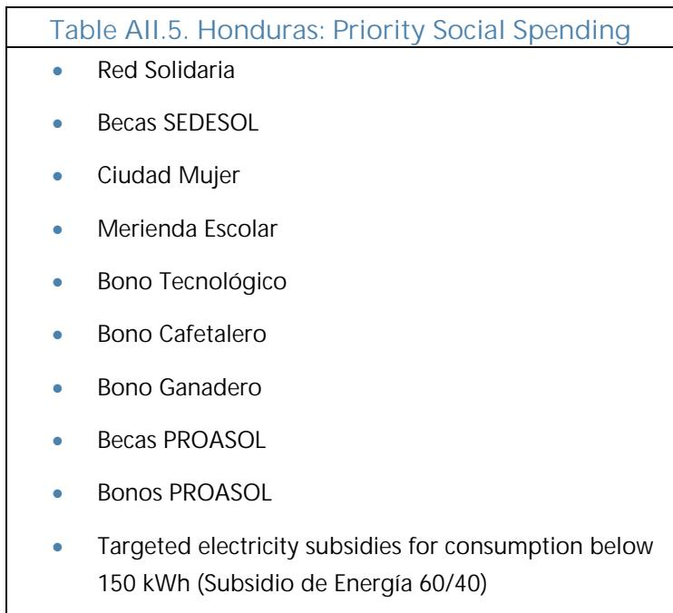

Ceiling on Percentage of Energy Lost by ENEE in Energy Distribution

42. Definition: The percentage of energy lost by ENEE in energy distribution is defined as the energy injected into the distribution network minus the sales invoices issued to its customers (both in GWh) during the 12 months prior to the test date, divided by the energy injected into the distribution network during the same period.

43. Monitoring. Monthly data will be provided to the Fund within 45 days of the end of each month.

# HONDURAS

June 12, 2026

# FOURTH AND FIFTH REVIEWS UNDER THE EXTENDED FUND FACILITY AND THE EXTENDED CREDIT FACILITY ARRANGEMENTS, AND REQUESTS FOR A WAIVER OF NONOBSERVANCE OF PERFORMANCE CRITERION AND EXTENSION OF THE ARRANGEMENTS—DEBT SUSTAINABILITY ANALYSIS

Approved By
Dora Iakova and Anna
Ivanova (IMF) and Shireen
Mahdi and Manuela
Francisco (IDA)

Prepared by staff of the International Monetary Fund and the International Development Association.

Prudent fiscal management in 2025, coupled with sizeable net debt repayments, has improved Honduras' debt dynamics relative to the November 2024 full DSA. The end-2025 public debt stock stood at 45.4 percent of GDP. Risk ratings remain unchanged, with Honduras' risk of external debt distress assessed low, while the risk of overall public debt distress is moderate. $^{1}$ Honduras maintains a strong debt-carrying capacity. $^{2}$ Going forward, the new authorities are committed to prudent macroeconomic policies, maintaining an appropriate balance between social and investment priorities and the preservation of fiscal and debt sustainability. Continued efforts to deepen the domestic debt market, further strengthen the monetary and foreign exchange policy frameworks, and enhance the financial viability of the energy sector will be key safeguards for debt sustainability. The debt sustainability outlook remains vulnerable to external shocks, including a weaker global outlook amid heightened uncertainty and natural disasters.

<table><tr><td colspan="2">Honduras: Joint Bank-Fund Debt Sustainability Analysis</td></tr><tr><td>Risk of external debt distress</td><td>Low</td></tr><tr><td>Overall risk of debt distress</td><td>Moderate</td></tr><tr><td>Granularity in the risk rating</td><td>Tool not applicable</td></tr><tr><td>Application of judgment</td><td>No</td></tr></table>

## PUBLIC DEBT COVERAGE

1. The debt coverage of the public sector is comprehensive (Text Table 2). The debt sustainability analysis (DSA) covers the non-financial public sector (NFPS), which includes the general government and non-financial state-owned enterprises (SOEs). Debt from extrabudgetary

trust funds is also included, with the authorities having abolished through legislation all trust funds in 2022. $^{3}$ Debt from decentralized agencies such as public universities, public pension funds, and central bank borrowing on behalf of the government is also covered. In addition, the baseline 2025 debt stock incorporates, for DSA purposes, 2.6 percent of GDP in domestic obligations (floating debt) originating in previous years and not captured in official debt

<table><tr><td colspan="3">Text Table 1. Honduras: Domestic Debt Regularization as of end-20251/</td></tr><tr><td></td><td>Lempiras (million)</td><td>% GDP</td></tr><tr><td>Domestic Debt</td><td>26,688</td><td>2.6</td></tr><tr><td>Central Government</td><td>10,642</td><td>1.0</td></tr><tr><td>Trust Funds</td><td>3,459</td><td>0.3</td></tr><tr><td>ENEE</td><td>12,587</td><td>1.2</td></tr><tr><td colspan="3">1/ Preliminary data.Source: Country authorities; and IMF staff calculations.</td></tr></table>

statistics (Text Table 1), $^{4}$ of which (i) 1.0 percent of GDP relates to central government arrears to domestic suppliers, $^{5}$ (ii) 0.3 percent of GDP consists of trust funds' debt liabilities, $^{6}$ and (iii) 1.2 percent of GDP pertains to arrears accumulated by the state electricity utility Empresa Nacional de

Energía Eléctrica (ENEE), mainly to private electricity generators. External debt is defined on a currency basis. $^{7}$

2. The contingent liability tailored stress test is calibrated to account for risks stemming from contingent liabilities (Text Table 2). First, the contingent liabilities shock was increased from 0 to 1 to account for potential fiscal risks arising from trust funds-related exposures. Second, the default shock of 2 percent of GDP for SoE debt and government-guaranteed private debt is maintained to reflect risks from potential lawsuits linked to a highway concession project (0.4 percent of GDP) and the electricity utility (1.5 percent of GDP) and to capture the publicly-guaranteed external debt of a financial SoE (0.1 percent of GDP). $^{8}$ Third, the default shock to account for risks stemming from public private partnerships (PPPs) is set at 4.1 percent of GDP to reflect potential liabilities from PPP projects. $^{9}$ Fourth, the default minimum value of 5 percent of GDP for the financial market shock is kept unchanged since Honduras' financial sector does not exhibit significant vulnerabilities warranting an upward adjustment.

Text Table 2. Honduras: Public Debt Coverage and Calibration of Contingent Liability Stress Test

<table><tr><td></td><td>Subsectors of the public sector</td><td>Sub-sectors covered</td></tr><tr><td>1</td><td>Central government</td><td>X</td></tr><tr><td>2</td><td>State and local government</td><td>X</td></tr><tr><td>3</td><td>Other elements in the general government</td><td>X</td></tr><tr><td>4</td><td>o/w: Social security fund</td><td>X</td></tr><tr><td>5</td><td>o/w: Extra budgetary funds (EBFs)</td><td>X</td></tr><tr><td>6</td><td>Guarantees (to other entities in the public and private sector, including to SOEs)</td><td>X</td></tr><tr><td>7</td><td>Central bank (borrowed on behalf of the government)</td><td>X</td></tr><tr><td>8</td><td>Non-guaranteed SOE debt</td><td>X</td></tr></table>

<table><tr><td>1</td><td>The country&#x27;s coverage of public debt</td><td colspan="3">The entire public sector, including SOEs</td></tr><tr><td></td><td></td><td>Default</td><td>Used for the analysis</td><td>Reasons for deviations from the default settings</td></tr><tr><td>2</td><td>Other elements of the general government not captured in 1.</td><td>0 percent of GDP</td><td>0.0</td><td></td></tr><tr><td>3</td><td>SoE&#x27;s debt (guaranteed and not guaranteed by the government) 1/</td><td>2 percent of GDP</td><td>2.0</td><td></td></tr><tr><td>4</td><td>PPP</td><td>35 percent of PPP stock</td><td>4.1</td><td></td></tr><tr><td>5</td><td>Financial market (the default value of 5 percent of GDP is the minimum value)</td><td>5 percent of GDP</td><td>5.0</td><td></td></tr><tr><td></td><td>Total (2+3+4+5) (in percent of GDP)</td><td></td><td>11.1</td><td></td></tr></table>

1/ The default shock of 2% of GDP will be triggered for countries whose government-guaranteed debt is not fully captured under the country's public debt definition (1.). If it is already included in the government debt (1.) and risks associated with SoE's debt not guaranteed by the government is assessed to be negligible, a country team may reduce this to 0%.

## RECENT ECONOMIC AND DEBT DEVELOPMENTS

3. The economy continued to show resilience. The economy grew 3.8 percent in 2025, buoyed by remittances and improved export performance. Inflation ended 2025 at just under 5.0 percent and had declined to 3.5 percent in February 2026, prior to the onset of the conflict in the Middle East. The passthrough of higher global oil prices has since then exerted renewed upward pressure on headline inflation, which increased to 5.6 percent in April. The current account moved into a surplus of 2.4 percent of GDP in 2025, bolstered by remittances growth of 25 percent and favorable terms of trade, both of which had remained buoyant in early 2026.

4. The fiscal balance outperformed in 2025. The non-financial public sector (NFPS) posted a deficit of 0.7 percent of GDP in 2025 (versus 1.5 percent of GDP programmed). Public investment spending underperformed, reflecting execution bottlenecks and delays in external financing, but priority social spending increased by 0.2 p.p. versus 2024. While tax revenues increased by 8.7 percent in nominal terms, they declined by about 0.6 p.p. of GDP, as nominal GDP grew by 12 percent, reflecting in part low tax buoyancy due to high coffee export prices. While current expenditures were contained overall, expenditures marginally exceeded the end-year program target, reflecting higher-than-projected current transfers.

5. The financial sector remains stable. The capital adequacy ratio of 14.2 percent in 2025 well exceeded the 10 percent minimum requirement, while liquidity conditions normalized, supported by measures taken by the authorities in late 2024 and early 2025. Non-performing loans (NPLs) were low at 2.6 percent of total loans with ample provisioning. Credit growth to the private sector decelerated in 2025 to 6.2 percent, reflecting weaker demand (including election-related uncertainty and strong remittances) and the less accommodative monetary policy stance. Recent stress tests conducted by the banking commission indicate that the financial system remains robust and

resilient, even under severe stress scenarios combining an economic slowdown, weaker credit growth, higher commodity prices, and lower remittance inflows.

6. Public and publicly guaranteed (PPG) debt fell to 45.4 percent of GDP at end-2025, with external debt accounting for 25.8 percent of GDP (Table 2). After the COVID-related increase in gross public debt in 2020, debt levels have remained on a downward trend on the back of prudent fiscal policies. At end-December 2025, the stock of public external debt stood at US\$9,880.9 million, an increase of US\$39.2 million compared to end-2024. The increase reflected gross disbursements of US\$589.7 million—partially offset by principal repayments of US\$372.1

Text Figure 1. Honduras: Public and Publicly Guaranteed Debt 1/ (Percent of GDP)

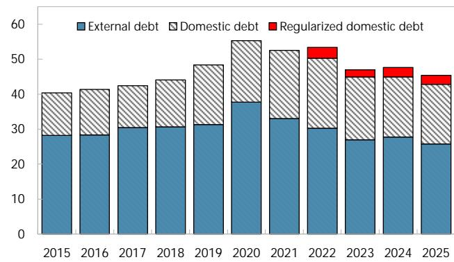  
Sources: Country authorities; and IMF staff calculations.
1/ Preliminary data

million—yielding net external financing of US\$195.8 million. Disbursements in 2025 were supported by a reopening of the sustainable Eurobond originally issued in November 2024, tapping an additional US\$200 million in 2025 (0.5 percent of GDP) $^{10}$ , consistent with a strategy to diversify funding sources, extend maturities, and align external borrowing with environmental and social development objectives.

7. The NIIP series was revised by the BCH to incorporate improved coverage. The NIIP series was revised to incorporate methodological and coverage improvements in foreign direct investment liabilities and private nonfinancial external debt, led by the Central Bank of Honduras with IMF technical assistance. The update draws on expanded use of administrative tax records. The revision reflects the use of expanded administrative tax records data sources and BPM6-consistent valuation methods, resulting in a revised historical NIIP series that more accurately reflects Honduras' external position.

8. Total external debt decreased from 58.7 percent of GDP in 2024 to 56.0 percent of GDP in 2025 (Table 1). The public and publicly guaranteed (PPG) external debt-to-GDP ratio fell to 25.8 percent in 2025, from 27.8 percent in 2024. Multilateral creditors account for the largest share of PPG external debt (70 percent), followed by commercial banks (21 percent), and official bilateral creditors (9 percent) (Text Figure 3). By creditor type, the increase in external debt was driven mainly by a US\$189.4 million rise (9.2 percent y/y) in obligations to commercial creditors, compensated by a US\$120.5 million decrease (-1.6 percent y/y) in debt owed to multilateral creditors.

8. Honduras has faced a significant debt service burden from both external and domestic debt. In 2025, external debt service totaled US\$1,191.4 million (Text Figure 2), with multilateral

creditors accounting for the largest share (US\$962.9 million), followed by commercial (US\$162.8 million) and bilateral (US\$65.7 million) creditors. Going forward, central government external debt service obligations remain substantial, amounting to approximately US\$919.8 million in 2026 and US\$1,522.4 million in 2027. Total domestic debt service in 2025 amounted to US\$1,430.8 million with principal payments of US\$898.5 million and interest and fees payments for US\$532.3 million. Projected total domestic debt service stands at US\$1,449.0 million for 2026 and US\$1,451.1 million in 2027, largely reflecting repayments to pension funds and

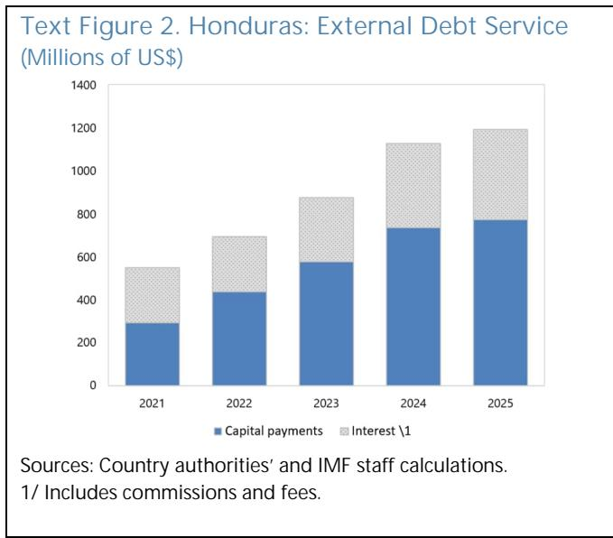

the public financial sector. These obligations are expected to be met through a combination of rollover operations and regular market issuance, in line with the authorities' debt management strategy to smooth the redemption profile and mitigate refinancing risks.

9. Public debt is mostly held by foreign creditors (Text Figure 3). The main creditors to Honduras are international bondholders and official multilateral creditors, such as the Inter-American Development Bank (IDB), the Central American Bank for Economic Integration (CABEI), and the World Bank. The multilateral institutions provide lending at relatively long maturities and largely concessional terms. Public domestic debt, which is mainly held by domestic commercial banks, has a shorter—though rising—maturity (over 4 years) and carries a higher real interest rate. Domestic issuances were replaced by borrowing from the Central Bank in 2022, temporarily negatively impacting domestic debt market development and reducing investment opportunities, including for pension funds. However, since late 2023 regular domestic debt issuances have resumed and more than 3 percent of GDP in government bonds has been placed. These domestic bond issuances have primarily been acquired by financial institutions, with interest rates ranging from 8-9 percent for the shortest terms and between 9-11 percent for the longest terms.

Text Figure 3. Honduras: PPG Debt Stock Composition (Percent, 2025) $^{1/}$  
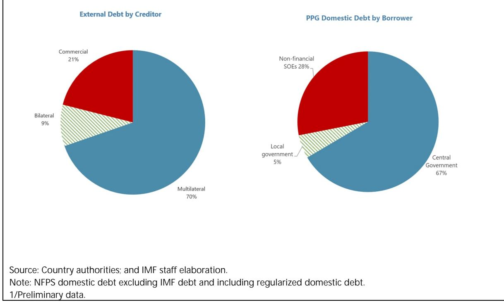

## MACROECONOMIC AND POLICY ASSUMPTIONS

10. The main macroeconomic assumptions are based on staff projections and EFF/ECF program targets. Text Table 3 summarizes baseline macroeconomic projections compared to the last published DSA, from December 2024, with the revised baseline reflecting the general resilience of the economy, despite a projected slowdown in growth in 2026 due to much higher oil prices. $^{11}$

Real sector. GDP growth is projected at 3.3 percent in 2026 supported by continued remittance-bolstered consumption and high coffee prices, offset by higher oil prices and weaker global growth (weaker net exports). Economic growth is projected to accelerate to 3.7 percent in 2027 as the current oil price increase is projected to ease, and consumption remains strong, before converging to 3.8-3.9 percent over the medium term. The medium-term projections assume that Honduran economy benefits from the program's structural reform agenda and investment in critical infrastructure, in particular for climate adaptation that will have benefits on growth and poverty.

Inflation. Reflecting higher global oil prices, inflation is projected to reach 5.7 percent by end-2026 (5.2 percent on average)—above the BCH's tolerance band (4±1 percent)—before declining to 4.3 percent by in late 2027, due to base effects and a projected moderation in global oil prices. Thereafter, inflation is expected around 4 percent.

Fiscal sector. The non-financial public sector (NFPS) deficit is projected to close 2026 at around 1 percent of GDP in line with the authorities' target. The 2026 budget aims for stable overall spending, a modest decline in revenues driven by lower capital receipts, a slight compression of the wage bill and capital spending, but higher goods and services outlays due to energy costs, and a reallocation within social spending toward energy subsidies. The fiscal path assumes the NFPS deficit will remain at 1 percent of GDP over the medium term, supported primarily by expenditure adjustments to pre-pandemic levels, including the reprioritization of current spending toward infrastructure and social spending. Fiscal consolidation efforts are expected to be reinforced by continued strengthening of tax administration to boost revenues. The baseline also assumes a gradual reduction in ENEE's stock of domestic arrears and lower accumulation of central government floating debt. The primary balance is projected to remain positive over the medium term.

\- External sector. The current account reached a surplus of 2.4 percent of GDP in 2025 (from a deficit of 4.4 percent of GDP in 2024), driven by large positive terms-of-trade and remittances shocks. The current account is projected to return to a deficit of 2.7 percent in 2026, reflecting in part higher oil import prices and lower coffee prices, before converging to 3.9 percent over the medium term, reflecting the expected temporary nature of the terms-of-trade and remittances shocks and unchanged structural issues and bottlenecks. Gross

international reserves are projected to peak at 137 percent of the ARA metric in 2026, remaining around 125 percent of the metric in the medium term.

• Financing assumptions. The DSA assumes that financing needs would be covered by external sources and by domestic borrowing.

External. The baseline assumes net positive financing from international financial institutions (IFIs) over the medium term, with budget and project support both provided by official multilateral sources. The baseline also assumes that Honduras would tap international capital markets—as implementation of the ECF/EFF program would further underpin confidence—with Eurobond placements of USD 700 million in $2026^{12}$ and USD 600 million in 2030 to meet external bond redemptions coming due. Additionally, projected Eurobond placements of USD 900 million in 2034 and USD 600 million in 2040 are intended to cover bond redemptions scheduled for those years. The grant element of new external public sector borrowing is projected to average 12.3 percent over 2026-30. In the long term, the baseline incorporates the government's debt strategy by assuming a gradual shift toward a balanced mix of concessional, semi-concessional, and commercial financing, consistent with the authorities' objective of lengthening maturities, lowering borrowing costs, and reducing exposure to global financial volatility.

Domestic. For 2026, the DSA assumes a continued normalization of regular Treasury bond issuance at market rates. Amortizations are expected to be rolled over as they mature. The baseline further assumes that the authorities will continue to deepen the domestic debt market to diversify financing sources, consistent with their debt management strategy. This includes issuing domestic debt instruments with longer maturities and predominantly at fixed interest rates. Over the period 2026–2046, it is assumed that 90 percent of domestic debt issuances will be in the form of 7-year government bonds, with the remaining 10 percent issued as 9-year bonds, reflecting a strategic preference for medium-term instruments to balance refinancing risks and investor demand. Additionally, to reinforce the commitment to macroeconomic and financial stability and ensure coordination between monetary, credit, and exchange rate policies with fiscal and debt policies, the Ministry of Finance must obtain authorization from the central bank for its debt issuance operations, while the Public Credit Commission of which both institutions are part, meets on quarterly basis to coordinate debt issuance policies.

<table><tr><td></td><td>2024</td><td>2025</td><td>2026</td><td>2027</td><td>2028</td><td>2029</td><td>2034</td><td>2044</td></tr><tr><td colspan="9">Real GDP growth (percent)</td></tr><tr><td>Current DSA</td><td>3.6</td><td>3.8</td><td>3.3</td><td>3.7</td><td>3.8</td><td>3.8</td><td>3.9</td><td>3.9</td></tr><tr><td>December 2024 DSA</td><td>3.8</td><td>3.6</td><td>3.6</td><td>3.8</td><td>3.8</td><td>3.8</td><td>3.9</td><td>...</td></tr><tr><td colspan="9">Inflation, Period Average (percent)</td></tr><tr><td>Current DSA</td><td>4.6</td><td>4.6</td><td>5.2</td><td>4.9</td><td>4.2</td><td>4.0</td><td>4.0</td><td>4.0</td></tr><tr><td>December 2024 DSA</td><td>4.8</td><td>5.1</td><td>4.5</td><td>4.0</td><td>4.0</td><td>4.0</td><td>4.0</td><td>...</td></tr><tr><td colspan="9">GDP deflator growth (percent)</td></tr><tr><td>Current DSA</td><td>4.7</td><td>8.0</td><td>2.0</td><td>5.3</td><td>4.3</td><td>4.0</td><td>4.0</td><td>4.0</td></tr><tr><td>December 2024 DSA</td><td>4.8</td><td>5.1</td><td>4.5</td><td>4.0</td><td>4.0</td><td>4.0</td><td>4.0</td><td>...</td></tr><tr><td colspan="9">Primary balance (percent of GDP)</td></tr><tr><td>Current DSA</td><td>0.2</td><td>0.2</td><td>0.2</td><td>0.2</td><td>0.2</td><td>0.2</td><td>0.3</td><td>0.3</td></tr><tr><td>December 2024 DSA</td><td>0.0</td><td>0.0</td><td>0.5</td><td>0.5</td><td>0.5</td><td>0.5</td><td>0.5</td><td>...</td></tr><tr><td colspan="9">Overall balance (percent of GDP)</td></tr><tr><td>Current DSA</td><td>-1.0</td><td>-0.7</td><td>-1.0</td><td>-1.0</td><td>-1.0</td><td>-1.0</td><td>-0.5</td><td>-0.5</td></tr><tr><td>December 2024 DSA</td><td>-1.5</td><td>-1.5</td><td>-1.0</td><td>-1.0</td><td>-1.0</td><td>-1.0</td><td>-0.5</td><td>...</td></tr><tr><td colspan="9">Current account balance (percent of GDP)</td></tr><tr><td>Current DSA</td><td>-4.4</td><td>2.4</td><td>-2.7</td><td>-3.2</td><td>-3.9</td><td>-3.8</td><td>-3.7</td><td>-3.6</td></tr><tr><td>December 2024 DSA</td><td>-5.3</td><td>-4.7</td><td>-4.5</td><td>-4.3</td><td>-4.0</td><td>-3.8</td><td>-3.4</td><td>...</td></tr><tr><td colspan="9">Net FDI (percent of GDP)</td></tr><tr><td>Current DSA</td><td>1.7</td><td>2.0</td><td>2.1</td><td>2.1</td><td>2.2</td><td>2.2</td><td>2.2</td><td>2.2</td></tr><tr><td>December 2024 DSA</td><td>2.6</td><td>2.7</td><td>2.7</td><td>2.7</td><td>2.7</td><td>2.7</td><td>2.7</td><td>...</td></tr><tr><td colspan="9">Source: Country authorities and staff elaboration.</td></tr></table>

11. Tools for assessing the realism of the baseline scenario do not flag significant and systematic deviations from historical experience (Figures 3 and 4).

\- Drivers of debt dynamics. The contributions of past and projected debt-creating flows for PPG external debt remain broadly unchanged, although the current account and FDI are expected to negatively contribute to PPG external debt accumulation relative to historical experience. For total public debt, gradual fiscal adjustment under the EFF/ECF program should curb the contribution of the primary deficit to public debt accumulation more than in the past.

Realism of planned fiscal adjustment. The projected three-year fiscal adjustment in the primary balance stands at 0.2 percentage points of GDP between 2026 and 2028 and falls comfortably below the top quartile of the distribution of past adjustments of the primary fiscal deficit derived from the sample of LICs, hence alleviating concerns of credibility of baseline assumptions.

Consistency between fiscal adjustment and growth. The projected growth path for 2026 and 2027 is broadly in line with the multiplier-based projections. The realism of the expected adjustment is predicated on the authorities' commitment to fiscal consolidation, supported by revenue and spending measures, as well as efforts to strengthen the financial position of ENEE.

• Consistency between public investment and growth. The contribution of public investment to real GDP growth remains marginal across the previous and current DSA. Public investment is expected to remain at around 4 percent of GDP in the medium term.

## COUNTRY CLASSIFICATION AND STRESS TESTS

12. Honduras' debt-carrying capacity is classified as strong (Text Table 4). Debt-carrying capacity is determined by a composite indicator (CI) that combines the World Bank's Country Policy and Institutional Assessment (CPIA) score, external conditions captured by world economic growth, and country-specific factors. Based on the April 2026 WEO vintage and the 2024 CPIA, the CI score for Honduras stands at 3.24, which is above the threshold of 3.05 applicable for a "strong" rating. The CI score reflects positive contributions from the CPIA (40 percent), international reserves (65 percent), world economic growth (15 percent), remittances (10 percent), and Honduras' real growth rate (4 percent). The debt burden thresholds implied by the strong debt-carrying capacity are summarized in Text Table 5.

<table><tr><td colspan="5">Text Table 4. Honduras: CI Score Summary Table</td></tr><tr><td>Components</td><td>Coefficients (A)</td><td>10-year average values(B)</td><td>CI Score components(A*B) = (C)</td><td>Contribution of components</td></tr><tr><td>CPIA</td><td>0.385</td><td>3.325</td><td>1.28</td><td>40%</td></tr><tr><td>Real growth rate (in percent)</td><td>2.719</td><td>4.594</td><td>0.12</td><td>4%</td></tr><tr><td>Import coverage of reserves (in percent)</td><td>4.052</td><td>52.189</td><td>2.11</td><td>65%</td></tr><tr><td>Import coverage of reserves^2 (in percent)</td><td>-3.990</td><td>27.237</td><td>-1.09</td><td>-34%</td></tr><tr><td>Remittances (in percent)</td><td>2.022</td><td>15.494</td><td>0.31</td><td>10%</td></tr><tr><td>World economic growth (in percent)</td><td>13.520</td><td>3.637</td><td>0.49</td><td>15%</td></tr><tr><td>CI Score</td><td></td><td></td><td>3.24</td><td>100%</td></tr><tr><td></td><td></td><td></td><td></td><td></td></tr><tr><td>CI rating</td><td></td><td></td><td>Strong</td><td></td></tr><tr><td></td><td></td><td></td><td></td><td></td></tr><tr><td>Final</td><td>Classification based on current vintage</td><td>Classification based on the previous vintage</td><td>Classification based on the two previous vintage</td><td></td></tr><tr><td>Strong</td><td>Strong</td><td>Strong</td><td>Strong</td><td></td></tr><tr><td></td><td>3.24</td><td>3.13</td><td>3.12</td><td></td></tr></table>

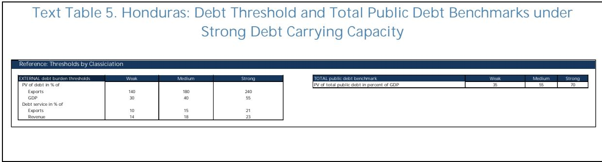

13. The DSA relies on standardized, tailored, and contingent liability stress tests. While all six standardized stress tests apply to Honduras, only the natural disaster and market financing tailored stress tests are triggered. Honduras qualifies for a natural disaster tailored shock due to its exposure to frequent natural disasters such as hurricanes and droughts that have been exacerbated by climate change. $^{13}$ Honduras also qualifies for the market financing shock due to its outstanding Eurobonds. $^{14}$ However, the country does not qualify for a commodity price shock, which requires commodities to constitute at least 50 percent of total goods and services exports over the previous three-year period. While the default settings for the standardized shocks are considered appropriate for Honduras, the natural disaster test has been tailored to Honduras' characteristics, and the contingent liabilities test is customized as described in paragraph 2.

## EXTERNAL DSA

14. None of the PPG external debt burden indicators breach their respective thresholds under the baseline or the most extreme stress test (Figure 1, Tables 1 and 3).

• Under the baseline scenario, all the PPG external debt burden indicators are projected to remain comfortably below their prescribed thresholds throughout the DSA horizon. The PV of PPG external debt ratios to GDP and exports are expected to decline gradually from 2026, averaging 18.2 and 52.9 percent over the projection horizon (2026-36), respectively. The two peaks observed in 2027 and 2030 on debt service indicators are linked to the repayments of Eurobonds issued in 2017 and 2020.

Under the stress test scenarios, none of the PPG external debt burden indicators breach their thresholds. Under the most extreme shock in the standardized stress test – a scenario that combines shocks to growth, the primary balance, exports, other balance of payments flows, and the exchange rate – the PV of PPG external debt-to-GDP ratio is projected to sharply increase to 44.8 percent of GDP in 2028 before gradually receding over the projection horizon. Similarly, the PV of PPG external debt-to-exports peaks at 143 percent in

2028 under the shock to exports scenario before declining gradually. Both the PV of PPG external debt-to-GDP ratio and debt service-to-revenue ratios appear most sensitive to the stress test scenario that combines various shocks, while the PV of debt-to-exports and debt service-to-exports ratios are most adversely impacted by a shock to exports.

## PUBLIC DSA

15. The PV of public debt-to-GDP ratio remains below its benchmark under the baseline but breaches it under the alternative and most extreme standardized stress test (Figure 2, Tables 2 and 4).

Under the baseline scenario, the public debt-to-GDP ratio is projected to gradually decline from 45.4 percent of GDP in 2025 to 39.9 percent of GDP in 2031 and thereafter, reaching 31.7 percent of GDP by 2046. This path is expected to be supported by reforms underpinning the ECF/EFF program which would open fiscal space for investment, while ensuring a fiscal deficit of 1 percent by 2026. All public debt indicators, including the PV of debt-to-revenue and the debt service-to-revenue ratios remain below their thresholds' levels under the historical scenario.

• Under the alternative scenario $^{15}$ (Table 4), among the standardized shocks, the growth shock exerts the greatest pressure on the debt trajectory; with the public-debt-to-GDP ratio above the benchmark from 2032 onwards.

16. Market-financing risk indicators suggest low liquidity risks (Figure 5). The maximum gross financing needs over a 3-year period under the baseline projection horizon are expected to be around 7 percent of GDP, well below the benchmark value of 14 percent. EMBI spreads stood at 186 basis points as of May 15, 2026, below the benchmark level of 570 basis points. $^{16}$ The tailored market financing stress test does not point to significant additional risks beyond those already captured in the baseline. In particular, the analysis does not indicate material vulnerabilities associated with the assumed Eurobond issuance path.

## 17. Domestic debt is in line with the median level across LICs (Figure 6). The domestic

public debt-to-GDP ratio is projected to be at around 20 percent of GDP until 2031, slightly above the average of 17.1 percent observed among LIC-DSF countries. This trend reflects the authorities' borrowing strategy that continues to prioritize concessional terms, active debt management, and an updated medium-term debt strategy that rebalances the debt portfolio towards more domestic debt to reduce the currency risk of debt distress (Text Figure 4) $^{17}$ . The domestic-debt-service to revenue ratio was 14.1 percent in

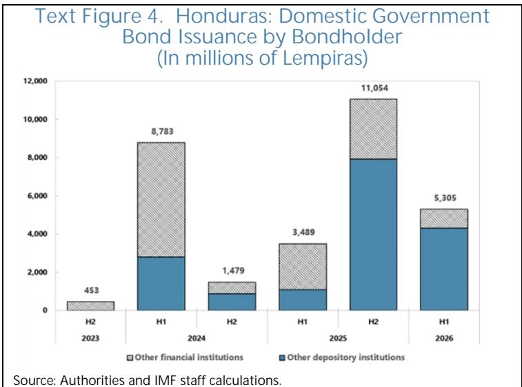  
Source: Authorities and IMF staff calculations.

2025 and will remain well below the average countries using the LIC-DSA until 2035.

## RISK RATING AND VULNERABILITIES

18. Honduras' risk of external debt distress remains low, while the risk of overall public debt distress is moderate. All PPG external debt burden indicators remain below their prescribed thresholds under the baseline and stress scenarios, thereby signaling a low risk of external debt distress. However, the overall risk of public debt distress is assessed as moderate as the PV of debt to GDP ratio breaches its benchmark under the most extreme stress test scenario. $^{18}$

Notwithstanding, debt-to-GDP ratios are expected to decline in the projection period as the overall fiscal balance adjusts back to 1 percent of GDP by 2026 in the baseline scenario. Nonetheless, with significant downside risks to the outlook, largely driven by a challenging global environment and the ever-present risk of extreme weather events, it would be important to consistently adhere to the reform agenda of the ECF/EFF program and continue to strike a balance between urgent investment and social spending needs and safeguarding debt sustainability. Furthermore, prudent debt management remains essential to mitigate debt rollover risk for large amortizations, including for the 2027 Eurobond repayment, as the authorities implement their strategy to diversify their financing mix towards a balance of concessional, semi-concessional, and commercial financing.

## Climate Change Risks

19. The most recent Country Climate and Development Report (CCDR) underscores Honduras's high vulnerability to natural disasters. The 2025 Climate Risk Index (CRI), covering

1993–2022, ranked Honduras as the third most affected country by unusually extreme weather

events, behind only Dominica and China. This ranking highlights the country's high vulnerability to climate-related hazards and the significant socioeconomic impacts these events have imposed over the past three decades. Such exposure poses a threat to macroeconomic stability, with losses from floods, tropical cyclones, and earthquakes projected to reduce GDP by approximately 5.4 percent cumulatively by 2050, compared with a scenario without these natural hazards. $^{19}$

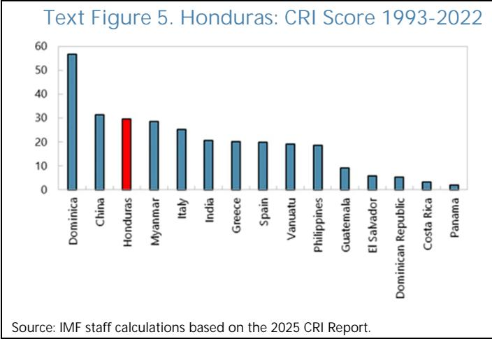

20. Natural disasters can have substantial adverse effects on Honduras's macroeconomic performance. Floods, tropical storms, cyclones, and droughts $^{20}$ represent the most significant natural hazards for Honduras, with potentially substantial economic and fiscal impacts. Between 1960 and 2022, annual losses from floods and storms averaged 6.3 percent of GDP, with extreme events causing particularly severe damage. For example, storms Eta and Iota in November 2020 resulted in estimated losses of 7.5 percent of GDP, while Tropical Storm Sara in 2024—whose reconstruction costs were estimated at 0.1 percent of GDP that year—caused widespread flooding and agricultural losses, further straining public finances and increasing short-term financing needs. Such shocks can destroy crops, damage public infrastructure, and reduce both public and private capital, leading to lower growth and revenue collection. Over time, these impacts can weaken fiscal and external positions, heighten financing pressures, and increase debt sustainability risks.

21. Given Honduras's high vulnerability to natural disasters and climate change—particularly flooding—a customized natural disaster shock has also been applied. The stress test is tailored to Honduras exposure to climate shocks and is calibrated to the average flood and storm damages between 1960-2022, assuming a 4 percent one-off shock to external PPG debt-to-GDP ratio in the second year of the projection period, a 6.3 percent reduction of GDP growth, and a 4.5 percent reduction of export growth. $^{21}$ The stress test result reflects a deterioration in Honduras indicators for external debt accompanied by a substantial increase in financing needs, highlighting the importance of continued reforms for climate adaptation.

22. Resilient infrastructure will be essential for reducing the socioeconomic costs of climate vulnerability. Resilient, low-carbon public investment is critical for building adaptive capacity and supporting the transition to a diversified green economy. Higher public spending on adaptation strengthens the resilience of public capital, helping to mitigate the impact of severe natural disasters on GDP. This reduces reconstruction costs and contributes to stronger fiscal and external positions.

## Authorities' Views

23. The authorities broadly agreed with the assumptions and results of the DSA. They highlighted downside risks, including climate shocks—particularly a more intense El Niño in 2026–27—and their potential impact on agricultural production, economic activity, and exports, as well as slower growth due to weaker external demand and commodity shocks, including higher oil and fertilizer prices. They also noted that market financing risks have eased, as reflected in the recent decline in EMBI spreads for Honduras and the stronger domestic bond issuance in the first half of 2026 following the new administration taking office, while underscoring the continued importance of concessional financing from multilateral institutions. Finally, they reaffirmed their commitment to transparency by expanding debt coverage to previously unaccounted-for domestic debt, and to maintaining debt sustainability through prudent fiscal policies.

<table><tr><td rowspan="2"></td><td colspan="3">Actual</td><td colspan="12">Projections</td><td colspan="2">Average 8/</td></tr><tr><td>2023</td><td>2024</td><td>2025</td><td>2026</td><td>2027</td><td>2028</td><td>2029</td><td>2030</td><td>2031</td><td>2032</td><td>2033</td><td>2034</td><td>2035</td><td>2036</td><td>2046</td><td>Historical</td><td>Projections</td></tr><tr><td>External debt (nominal) 1/</td><td>58.2</td><td>58.7</td><td>56.0</td><td>58.9</td><td>55.8</td><td>54.6</td><td>53.6</td><td>52.5</td><td>51.1</td><td>49.6</td><td>47.9</td><td>46.4</td><td>45.0</td><td>43.6</td><td>36.2</td><td>65.4</td><td>50.8</td></tr><tr><td>of which: public and publicly guaranteed (PPG)</td><td>27.0</td><td>27.8</td><td>25.8</td><td>28.7</td><td>25.6</td><td>24.4</td><td>23.4</td><td>22.3</td><td>20.9</td><td>19.4</td><td>17.6</td><td>16.2</td><td>14.8</td><td>13.4</td><td>5.9</td><td>30.2</td><td>20.6</td></tr><tr><td>Change in external debt</td><td>-6.4</td><td>0.5</td><td>-2.7</td><td>3.0</td><td>-3.1</td><td>-1.2</td><td>-1.0</td><td>-1.1</td><td>-1.4</td><td>-1.5</td><td>-1.7</td><td>-1.4</td><td>-1.4</td><td>-1.4</td><td>-0.6</td><td></td><td></td></tr><tr><td>Identified net debt-creating flows</td><td>-4.3</td><td>-1.3</td><td>-8.3</td><td>-1.1</td><td>-0.9</td><td>-0.3</td><td>-0.4</td><td>-0.3</td><td>-0.2</td><td>-0.3</td><td>-0.3</td><td>-0.3</td><td>-0.4</td><td>-0.3</td><td>-0.1</td><td>-3.7</td><td>-0.4</td></tr><tr><td>Non-interest current account deficit</td><td>2.5</td><td>2.9</td><td>-3.8</td><td>1.3</td><td>1.8</td><td>2.6</td><td>2.5</td><td>2.7</td><td>2.7</td><td>2.7</td><td>2.7</td><td>2.8</td><td>2.7</td><td>2.7</td><td>3.1</td><td>1.3</td><td>2.5</td></tr><tr><td>Deficit in balance of goods and services</td><td>23.7</td><td>23.9</td><td>22.0</td><td>27.4</td><td>26.9</td><td>26.6</td><td>25.6</td><td>24.8</td><td>24.4</td><td>24.0</td><td>23.7</td><td>23.5</td><td>23.2</td><td>22.9</td><td>20.3</td><td>20.5</td><td>24.8</td></tr><tr><td>Exports</td><td>37.4</td><td>34.1</td><td>35.0</td><td>34.0</td><td>34.0</td><td>34.1</td><td>34.4</td><td>34.5</td><td>34.6</td><td>34.6</td><td>34.7</td><td>34.8</td><td>34.9</td><td>34.9</td><td>35.7</td><td></td><td></td></tr><tr><td>Imports</td><td>61.1</td><td>58.0</td><td>57.0</td><td>61.4</td><td>60.9</td><td>60.8</td><td>60.0</td><td>59.3</td><td>58.9</td><td>58.7</td><td>58.5</td><td>58.2</td><td>58.0</td><td>57.8</td><td>56.0</td><td></td><td></td></tr><tr><td>Net current transfers (negative = inflow)</td><td>-27.1</td><td>-27.1</td><td>-32.0</td><td>-32.0</td><td>-30.7</td><td>-29.7</td><td>-28.7</td><td>-27.7</td><td>-27.1</td><td>-26.8</td><td>-26.5</td><td>-26.2</td><td>-25.9</td><td>-25.6</td><td>-22.8</td><td>-25.1</td><td>-27.9</td></tr><tr><td>of which: official</td><td>0.0</td><td>-0.1</td><td>-0.1</td><td>-0.1</td><td>-0.1</td><td>-0.1</td><td>-0.1</td><td>-0.1</td><td>-0.1</td><td>-0.1</td><td>-0.1</td><td>-0.1</td><td>-0.1</td><td>-0.1</td><td>0.0</td><td></td><td></td></tr><tr><td>Other current account flows (negative = net inflow)</td><td>5.9</td><td>6.1</td><td>6.2</td><td>5.8</td><td>5.6</td><td>5.6</td><td>5.6</td><td>5.6</td><td>5.5</td><td>5.5</td><td>5.5</td><td>5.5</td><td>5.4</td><td>5.5</td><td>5.6</td><td>5.9</td><td>5.6</td></tr><tr><td>Net FDI (negative = inflow)</td><td>-2.5</td><td>-1.7</td><td>-2.0</td><td>-2.1</td><td>-2.1</td><td>-2.2</td><td>-2.2</td><td>-2.3</td><td>-2.2</td><td>-2.2</td><td>-2.2</td><td>-2.2</td><td>-2.2</td><td>-2.2</td><td>-2.2</td><td>-2.6</td><td>-2.2</td></tr><tr><td>Endogenous debt dynamics 2/</td><td>-4.2</td><td>-2.5</td><td>-2.4</td><td>-0.4</td><td>-0.6</td><td>-0.7</td><td>-0.7</td><td>-0.7</td><td>-0.7</td><td>-0.8</td><td>-0.8</td><td>-0.8</td><td>-0.8</td><td>-0.8</td><td>-1.0</td><td></td><td></td></tr><tr><td>Contribution from nominal interest rate</td><td>1.5</td><td>1.5</td><td>1.5</td><td>1.4</td><td>1.4</td><td>1.3</td><td>1.3</td><td>1.2</td><td>1.2</td><td>1.1</td><td>1.1</td><td>1.0</td><td>0.9</td><td>0.9</td><td>0.4</td><td></td><td></td></tr><tr><td>Contribution from real GDP growth</td><td>-2.1</td><td>-2.0</td><td>-2.1</td><td>-1.8</td><td>-2.0</td><td>-2.0</td><td>-2.0</td><td>-1.9</td><td>-1.9</td><td>-1.9</td><td>-1.8</td><td>-1.8</td><td>-1.7</td><td>-1.7</td><td>-1.4</td><td></td><td></td></tr><tr><td>Contribution from price and exchange rate changes</td><td>-3.7</td><td>-2.0</td><td>-1.8</td><td>...</td><td>...</td><td>...</td><td>...</td><td>...</td><td>...</td><td>...</td><td>...</td><td>...</td><td>...</td><td>...</td><td>...</td><td></td><td></td></tr><tr><td>Residual 3/</td><td>-2.1</td><td>1.8</td><td>5.5</td><td>4.1</td><td>-2.2</td><td>-0.9</td><td>-0.6</td><td>-0.8</td><td>-1.2</td><td>-1.2</td><td>-1.4</td><td>-1.2</td><td>-1.1</td><td>-1.0</td><td>-0.5</td><td>5.7</td><td>-0.7</td></tr><tr><td>of which: exceptional financing</td><td>-0.1</td><td>0.0</td><td>0.0</td><td>0.0</td><td>0.0</td><td>0.0</td><td>0.0</td><td>0.0</td><td>0.0</td><td>0.0</td><td>0.0</td><td>0.0</td><td>0.0</td><td>0.0</td><td>0.0</td><td></td><td></td></tr><tr><td colspan="18">Sustainability indicators</td></tr><tr><td>PV of PPG external debt-to-GDP ratio</td><td>...</td><td>...</td><td>22.7</td><td>24.9</td><td>22.1</td><td>21.1</td><td>20.3</td><td>19.4</td><td>18.2</td><td>16.8</td><td>15.3</td><td>14.1</td><td>12.8</td><td>11.6</td><td>5.3</td><td></td><td></td></tr><tr><td>PV of PPG external debt-to-exports ratio</td><td>...</td><td>...</td><td>65.0</td><td>73.1</td><td>65.0</td><td>61.8</td><td>58.9</td><td>56.1</td><td>52.5</td><td>48.6</td><td>44.1</td><td>40.4</td><td>36.7</td><td>33.3</td><td>14.8</td><td></td><td></td></tr><tr><td>PPG debt service-to-exports ratio</td><td>7.0</td><td>8.8</td><td>8.5</td><td>6.1</td><td>10.8</td><td>5.5</td><td>5.3</td><td>8.6</td><td>5.2</td><td>5.8</td><td>5.8</td><td>9.4</td><td>5.0</td><td>5.1</td><td>2.2</td><td></td><td></td></tr><tr><td>PPG debt service-to-revenue ratio</td><td>9.5</td><td>10.9</td><td>11.0</td><td>7.8</td><td>13.6</td><td>6.9</td><td>6.7</td><td>10.9</td><td>6.6</td><td>7.3</td><td>7.3</td><td>12.0</td><td>6.3</td><td>6.5</td><td>2.8</td><td></td><td></td></tr><tr><td>Gross external financing need (Billion of U.S. dollars)</td><td>7.1</td><td>8.1</td><td>6.3</td><td>7.5</td><td>8.5</td><td>8.4</td><td>8.7</td><td>9.7</td><td>9.4</td><td>9.9</td><td>10.3</td><td>11.6</td><td>11.0</td><td>11.6</td><td>17.5</td><td></td><td></td></tr><tr><td colspan="18">Key macroeconomic assumptions</td></tr><tr><td>Real GDP growth (in percent)</td><td>3.6</td><td>3.6</td><td>3.8</td><td>3.3</td><td>3.7</td><td>3.8</td><td>3.8</td><td>3.8</td><td>3.8</td><td>3.9</td><td>3.9</td><td>3.9</td><td>3.9</td><td>3.9</td><td>3.9</td><td>3.4</td><td>3.8</td></tr><tr><td>GDP deflator in US dollar terms (change in percent)</td><td>6.0</td><td>3.5</td><td>3.2</td><td>-1.1</td><td>2.7</td><td>2.3</td><td>2.0</td><td>2.0</td><td>2.0</td><td>2.0</td><td>2.0</td><td>2.0</td><td>2.0</td><td>2.0</td><td>2.0</td><td>3.2</td><td>1.8</td></tr><tr><td>Effective interest rate (percent) 4/</td><td>2.6</td><td>2.7</td><td>2.7</td><td>2.6</td><td>2.6</td><td>2.5</td><td>2.5</td><td>2.4</td><td>2.4</td><td>2.4</td><td>2.3</td><td>2.2</td><td>2.1</td><td>2.0</td><td>1.1</td><td>2.7</td><td>2.4</td></tr><tr><td>Growth of exports of G&amp;S (US dollar terms, in percent)</td><td>-4.4</td><td>-2.3</td><td>9.9</td><td>-0.7</td><td>6.4</td><td>6.7</td><td>6.7</td><td>6.2</td><td>6.0</td><td>6.2</td><td>6.2</td><td>6.2</td><td>6.2</td><td>6.2</td><td>6.2</td><td>4.7</td><td>5.7</td></tr><tr><td>Growth of imports of G&amp;S (US dollar terms, in percent)</td><td>-4.6</td><td>1.9</td><td>5.1</td><td>10.2</td><td>5.6</td><td>5.9</td><td>4.5</td><td>4.6</td><td>5.1</td><td>5.6</td><td>5.6</td><td>5.6</td><td>5.6</td><td>5.6</td><td>5.7</td><td>7.1</td><td>5.8</td></tr><tr><td>Grant element of new public sector borrowing (in percent)</td><td>...</td><td>...</td><td>...</td><td>21.5</td><td>13.9</td><td>10.1</td><td>9.7</td><td>5.9</td><td>7.6</td><td>4.8</td><td>3.5</td><td>1.2</td><td>3.5</td><td>3.6</td><td>3.9</td><td>...</td><td>7.7</td></tr><tr><td>Government revenues (excluding grants, in percent of GDP)</td><td>27.7</td><td>27.6</td><td>27.0</td><td>26.8</td><td>27.1</td><td>27.2</td><td>27.3</td><td>27.3</td><td>27.3</td><td>27.5</td><td>27.4</td><td>27.4</td><td>27.4</td><td>27.3</td><td>27.3</td><td>28.4</td><td>27.3</td></tr><tr><td>Aid flows (in Billion of US dollars) 5/</td><td>0.2</td><td>0.2</td><td>0.1</td><td>0.6</td><td>0.2</td><td>0.2</td><td>0.2</td><td>0.3</td><td>0.2</td><td>0.2</td><td>0.2</td><td>0.2</td><td>0.2</td><td>0.2</td><td>0.4</td><td></td><td></td></tr><tr><td>Grant-equivalent financing (in percent of GDP) 6/</td><td>...</td><td>...</td><td>...</td><td>1.3</td><td>0.5</td><td>0.4</td><td>0.4</td><td>0.5</td><td>0.4</td><td>0.4</td><td>0.4</td><td>0.4</td><td>0.4</td><td>0.4</td><td>0.4</td><td>...</td><td>0.5</td></tr><tr><td>Grant-equivalent financing (in percent of external financing) 6/</td><td>...</td><td>...</td><td>...</td><td>26.8</td><td>30.5</td><td>28.3</td><td>27.7</td><td>18.0</td><td>37.8</td><td>32.7</td><td>38.3</td><td>14.9</td><td>40.9</td><td>36.8</td><td>55.8</td><td>...</td><td>30.2</td></tr><tr><td>Nominal GDP (Billion of US dollars)</td><td>34</td><td>37</td><td>40</td><td>...</td><td>...</td><td>...</td><td>...</td><td>...</td><td>...</td><td>...</td><td>...</td><td>...</td><td>...</td><td>...</td><td>...</td><td></td><td></td></tr><tr><td>Nominal dollar GDP growth</td><td>9.8</td><td>7.3</td><td>7.1</td><td>2.2</td><td>6.5</td><td>6.1</td><td>5.8</td><td>5.8</td><td>5.8</td><td>6.0</td><td>6.0</td><td>6.0</td><td>6.0</td><td>6.0</td><td>6.0</td><td>6.8</td><td>5.7</td></tr><tr><td colspan="18">Memorandum items:</td></tr><tr><td>PV of external debt 7/</td><td>...</td><td>...</td><td>53.0</td><td>55.1</td><td>52.3</td><td>51.3</td><td>50.5</td><td>49.6</td><td>48.4</td><td>47.1</td><td>45.5</td><td>44.3</td><td>43.0</td><td>41.8</td><td>35.5</td><td></td><td></td></tr><tr><td>In percent of exports</td><td>...</td><td>...</td><td>151.4</td><td>162.0</td><td>154.0</td><td>150.3</td><td>146.7</td><td>143.6</td><td>139.9</td><td>135.8</td><td>131.2</td><td>127.3</td><td>123.4</td><td>119.8</td><td>99.5</td><td></td><td></td></tr><tr><td>Total external debt service-to-exports ratio</td><td>55.1</td><td>60.7</td><td>61.9</td><td>56.5</td><td>59.1</td><td>52.6</td><td>51.2</td><td>53.4</td><td>48.8</td><td>48.4</td><td>47.5</td><td>50.3</td><td>45.0</td><td>44.3</td><td>35.5</td><td></td><td></td></tr><tr><td>PV of PPG external debt (in billion of US dollars)</td><td></td><td></td><td>9.0</td><td>10.1</td><td>9.5</td><td>9.7</td><td>9.8</td><td>9.9</td><td>9.8</td><td>9.7</td><td>9.3</td><td>9.1</td><td>8.8</td><td>8.4</td><td>6.8</td><td></td><td></td></tr><tr><td>(PVt-Pvt-1)/GDPT-1 (in percent)</td><td></td><td></td><td></td><td>2.7</td><td>-1.3</td><td>0.3</td><td>0.4</td><td>0.2</td><td>-0.2</td><td>-0.3</td><td>-0.6</td><td>-0.4</td><td>-0.5</td><td>-0.5</td><td>-0.2</td><td></td><td></td></tr><tr><td>Non-interest current account deficit that stabilizes debt ratio</td><td>8.8</td><td>2.4</td><td>-1.1</td><td>-1.6</td><td>4.9</td><td>3.8</td><td>3.5</td><td>3.8</td><td>4.1</td><td>4.2</td><td>4.4</td><td>4.2</td><td>4.1</td><td>4.1</td><td>3.7</td><td></td><td></td></tr></table>

8/ Historical averages are generally derived over the past 10 years, subject to data availability, whereas projections averages are over the first year of projection and the next 10 years.  
Table 1. Honduras: External Debt Sustainability Framework, Baseline Scenario, 2023-46 (In percent of GDP, unless otherwise indicated)  
Sources: Country authorities; and staff estimates and projections.  
1/ Includes both public and private sector external debt.  
2/ Derived as $[r - g - p(1 + g)]/(1 + g - p + gp)$ times previous period debt ratio, with r = nominal interest rate; g = real GDP growth rate, and p = growth rate of GDP deflator in U.S. dollar terms.  
5/ Defined as grants, concessional loans, and debt relief.  
4/ Current-year interest payments divided by previous period debt stock.  
3/ Includes exceptional financing (i.e., changes in arrears and debt relief); changes in gross foreign assets; and valuation adjustments. For projections also includes contribution from price and exchange rate changes.  
6/ Grant-equivalent financing includes grants provided directly to the government and through new borrowing (difference between the face value and the PV of new debt).  
7/ Assumes that PV of private sector debt is equivalent to its face value.

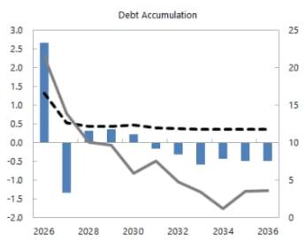

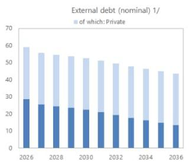

Table 2. Honduras: Public Debt Sustainability Framework, Baseline Scenario, 2023-46 (In percent of GDP, unless otherwise indicated)

<table><tr><td rowspan="2"></td><td colspan="3">Actual</td><td colspan="8">Projections</td><td colspan="2">Average 6/</td></tr><tr><td>2023</td><td>2024</td><td>2025</td><td>2026</td><td>2027</td><td>2028</td><td>2029</td><td>2030</td><td>2031</td><td>2036</td><td>2046</td><td>Historical</td><td>Projections</td></tr><tr><td rowspan="2">Public sector debt 1/of which: external debt</td><td>47.0</td><td>47.6</td><td>45.4</td><td>48.1</td><td>44.5</td><td>43.1</td><td>41.9</td><td>40.7</td><td>39.7</td><td>35.2</td><td>31.5</td><td>47.4</td><td>40.2</td></tr><tr><td>27.0</td><td>27.8</td><td>25.8</td><td>28.7</td><td>25.6</td><td>24.4</td><td>23.4</td><td>22.3</td><td>20.9</td><td>13.4</td><td>5.9</td><td>30.2</td><td>20.6</td></tr><tr><td>Change in public sector debt</td><td>-6.4</td><td>0.7</td><td>-2.2</td><td>2.7</td><td>-3.6</td><td>-1.3</td><td>-1.2</td><td>-1.2</td><td>-1.0</td><td>-0.6</td><td>-0.3</td><td></td><td></td></tr><tr><td>Identified debt-creating flows</td><td>-7.5</td><td>1.6</td><td>-1.5</td><td>-0.6</td><td>-1.4</td><td>-1.1</td><td>-0.9</td><td>-0.9</td><td>-0.7</td><td>-0.5</td><td>-0.3</td><td>0.9</td><td>-0.8</td></tr><tr><td>Primary deficit</td><td>-0.2</td><td>-0.2</td><td>-0.2</td><td>-0.2</td><td>-0.2</td><td>-0.2</td><td>-0.2</td><td>-0.3</td><td>-0.3</td><td>-0.3</td><td>-0.3</td><td>0.4</td><td>-0.2</td></tr><tr><td>Revenue and grants</td><td>28.0</td><td>27.9</td><td>27.3</td><td>27.2</td><td>27.4</td><td>27.5</td><td>27.6</td><td>27.7</td><td>27.7</td><td>27.7</td><td>27.7</td><td>28.9</td><td>27.6</td></tr><tr><td>of which: grants</td><td>0.4</td><td>0.3</td><td>0.3</td><td>0.3</td><td>0.3</td><td>0.3</td><td>0.3</td><td>0.3</td><td>0.3</td><td>0.3</td><td>0.3</td><td></td><td></td></tr><tr><td>Primary (noninterest) expenditure</td><td>27.9</td><td>27.7</td><td>27.1</td><td>27.0</td><td>27.2</td><td>27.3</td><td>27.4</td><td>27.4</td><td>27.4</td><td>27.4</td><td>27.4</td><td>29.3</td><td>27.4</td></tr><tr><td>Automatic debt dynamics</td><td>-2.1</td><td>-0.1</td><td>-1.6</td><td>-0.6</td><td>-1.4</td><td>-1.0</td><td>-0.8</td><td>-0.8</td><td>-0.5</td><td>-0.2</td><td>0.0</td><td></td><td></td></tr><tr><td>Contribution from interest rate/growth differential</td><td>-1.5</td><td>-0.3</td><td>-1.0</td><td>-0.6</td><td>-1.4</td><td>-1.0</td><td>-0.8</td><td>-0.8</td><td>-0.5</td><td>-0.2</td><td>0.0</td><td></td><td></td></tr><tr><td>of which: contribution from average real interest rate</td><td>0.4</td><td>1.3</td><td>0.7</td><td>0.8</td><td>0.4</td><td>0.6</td><td>0.7</td><td>0.8</td><td>0.9</td><td>1.1</td><td>1.2</td><td></td><td></td></tr><tr><td>of which: contribution from real GDP growth</td><td>-1.8</td><td>-1.6</td><td>-1.7</td><td>-1.5</td><td>-1.7</td><td>-1.6</td><td>-1.6</td><td>-1.5</td><td>-1.5</td><td>-1.4</td><td>-1.2</td><td></td><td></td></tr><tr><td>Contribution from real exchange rate depreciation</td><td>-0.7</td><td>0.2</td><td>-0.5</td><td>-</td><td>-</td><td>-</td><td>-</td><td>-</td><td>-</td><td>-</td><td>-</td><td></td><td></td></tr><tr><td>Other identified debt-creating flows</td><td>-5.2</td><td>1.8</td><td>0.2</td><td>0.2</td><td>0.2</td><td>0.1</td><td>0.1</td><td>0.1</td><td>0.1</td><td>0.0</td><td>0.0</td><td>1.1</td><td>0.1</td></tr><tr><td>Privatization receipts (negative)</td><td>0.0</td><td>0.0</td><td>0.0</td><td>0.0</td><td>0.0</td><td>0.0</td><td>0.0</td><td>0.0</td><td>0.0</td><td>0.0</td><td>0.0</td><td></td><td></td></tr><tr><td>Recognition of contingent liabilities (e.g., bank recapitalization)</td><td>0.0</td><td>0.0</td><td>0.0</td><td>0.0</td><td>0.0</td><td>0.0</td><td>0.0</td><td>0.0</td><td>0.0</td><td>0.0</td><td>0.0</td><td></td><td></td></tr><tr><td>Debt relief (HIPC and other)</td><td>-5.2</td><td>1.8</td><td>0.2</td><td>0.2</td><td>0.2</td><td>0.1</td><td>0.1</td><td>0.1</td><td>0.1</td><td>0.0</td><td>0.0</td><td></td><td></td></tr><tr><td>Other debt creating or reducing flow (please specify)</td><td>0.0</td><td>0.0</td><td>0.0</td><td>0.0</td><td>0.0</td><td>0.0</td><td>0.0</td><td>0.0</td><td>0.0</td><td>0.0</td><td>0.0</td><td></td><td></td></tr><tr><td>Residual</td><td>1.1</td><td>-0.9</td><td>-0.7</td><td>3.3</td><td>-2.2</td><td>-0.3</td><td>-0.3</td><td>-0.3</td><td>-0.3</td><td>-0.1</td><td>0.0</td><td>-0.4</td><td>-0.1</td></tr><tr><td>Sustainability indicators</td><td></td><td></td><td></td><td></td><td></td><td></td><td></td><td></td><td></td><td></td><td></td><td></td><td></td></tr><tr><td>PV of public debt-to-GDP ratio 2/</td><td>...</td><td>...</td><td>42.8</td><td>44.6</td><td>41.2</td><td>40.1</td><td>39.0</td><td>37.9</td><td>37.1</td><td>33.5</td><td>30.8</td><td></td><td></td></tr><tr><td>PV of public debt-to-revenue and grants ratio</td><td>...</td><td>...</td><td>156.7</td><td>164.2</td><td>150.5</td><td>145.6</td><td>141.1</td><td>137.1</td><td>134.3</td><td>121.1</td><td>111.3</td><td></td><td></td></tr><tr><td>Debt service-to-revenue and grants ratio 3/</td><td>20.2</td><td>23.6</td><td>24.9</td><td>17.4</td><td>24.6</td><td>18.7</td><td>19.6</td><td>27.0</td><td>20.3</td><td>27.3</td><td>29.0</td><td></td><td></td></tr><tr><td>Gross financing need 4/</td><td>0.3</td><td>8.2</td><td>6.8</td><td>4.7</td><td>6.7</td><td>5.1</td><td>5.3</td><td>7.3</td><td>5.4</td><td>7.3</td><td>7.8</td><td></td><td></td></tr><tr><td>Key macroeconomic and fiscal assumptions</td><td></td><td></td><td></td><td></td><td></td><td></td><td></td><td></td><td></td><td></td><td></td><td></td><td></td></tr><tr><td>Real GDP growth (in percent)</td><td>3.6</td><td>3.6</td><td>3.8</td><td>3.3</td><td>3.7</td><td>3.8</td><td>3.8</td><td>3.8</td><td>3.8</td><td>3.9</td><td>3.9</td><td>3.4</td><td>3.8</td></tr><tr><td>Average nominal interest rate on external debt (in percent)</td><td>3.8</td><td>4.0</td><td>4.0</td><td>4.0</td><td>4.0</td><td>4.0</td><td>4.0</td><td>3.9</td><td>4.2</td><td>4.4</td><td>4.1</td><td>3.7</td><td>4.2</td></tr><tr><td>Average real interest rate on domestic debt (in percent)</td><td>1.7</td><td>4.5</td><td>0.8</td><td>1.7</td><td>-1.2</td><td>0.4</td><td>1.5</td><td>2.0</td><td>2.7</td><td>3.8</td><td>4.2</td><td>5.6</td><td>2.2</td></tr><tr><td>Real exchange rate depreciation (in percent, + indicates depreciation)</td><td>-2.3</td><td>0.9</td><td>-2.0</td><td>...</td><td>...</td><td>...</td><td>...</td><td>...</td><td>...</td><td>...</td><td>...</td><td>-0.4</td><td>...</td></tr><tr><td>Inflation rate (GDP deflator, in percent)</td><td>6.5</td><td>4.3</td><td>8.0</td><td>2.0</td><td>5.3</td><td>4.3</td><td>4.0</td><td>4.0</td><td>4.0</td><td>4.0</td><td>4.0</td><td>5.0</td><td>4.0</td></tr><tr><td>Growth of real primary spending (deflated by GDP deflator, in percent)</td><td>5.0</td><td>3.2</td><td>1.4</td><td>2.8</td><td>4.4</td><td>4.4</td><td>4.0</td><td>3.9</td><td>3.7</td><td>3.6</td><td>3.9</td><td>2.5</td><td>3.9</td></tr><tr><td>Primary deficit that stabilizes the debt-to-GDP ratio 5/</td><td>6.2</td><td>-0.8</td><td>2.1</td><td>-2.9</td><td>3.4</td><td>1.2</td><td>1.0</td><td>0.9</td><td>0.7</td><td>0.4</td><td>0.1</td><td>2.5</td><td>0.7</td></tr><tr><td>PV of contingent liabilities (not included in public sector debt)</td><td>0.0</td><td>0.0</td><td>0.0</td><td>0.0</td><td>0.0</td><td>0.0</td><td>0.0</td><td>0.0</td><td>0.0</td><td>0.0</td><td>0.0</td><td></td><td></td></tr></table>

Sources: Country authorities; and staff estimates and projections.  
1/ Coverage of debt: The entire public sector, including SOEs. Definition of external debt is Currency-based.  
2/ The underlying PV of external debt-to-GDP ratio under the public DSA differs from the external DSA with the size of differences depending on exchange rates projections.  
3/ Debt service is defined as the sum of interest and amortization of medium and long-term, and short-term debt.  
4/ Gross financing need is defined as the primary deficit plus debt service plus the stock of short-term debt at the end of the last period and other debt creating/reducing flows.  
5/ Defined as a primary deficit minus a change in the public debt-to-GDP ratio ((-): a primary surplus), which would stabilize the debt ratio only in the year in question.  
6/ Historical averages are generally derived over the past 10 years, subject to data availability, whereas projections averages are over the first year of projection and the next 10 years.

Table 3. Honduras: Sensitivity Analysis for Key Indicators of Public and Publicly Guaranteed External Debt, 2026-2036 (In percent)

<table><tr><td rowspan="2"></td><td colspan="11">Projections 1/</td></tr><tr><td>2026</td><td>2027</td><td>2028</td><td>2029</td><td>2030</td><td>2031</td><td>2032</td><td>2033</td><td>2034</td><td>2035</td><td>2036</td></tr><tr><td colspan="12">PV of debt-to GDP ratio</td></tr><tr><td>Baseline</td><td>25</td><td>22</td><td>21</td><td>20</td><td>19</td><td>18</td><td>17</td><td>15</td><td>14</td><td>13</td><td>12</td></tr><tr><td colspan="12">A. Alternative Scenarios</td></tr><tr><td>A1. Key variables at their historical averages in 2026-2036 2/</td><td>25</td><td>21</td><td>18</td><td>16</td><td>13</td><td>10</td><td>7</td><td>4</td><td>1</td><td>0</td><td>0</td></tr><tr><td colspan="12">B. Bound Tests</td></tr><tr><td>B1. Real GDP growth</td><td>25</td><td>24</td><td>25</td><td>24</td><td>23</td><td>22</td><td>20</td><td>18</td><td>17</td><td>15</td><td>14</td></tr><tr><td>B2. Primary balance</td><td>25</td><td>23</td><td>23</td><td>22</td><td>21</td><td>20</td><td>19</td><td>17</td><td>16</td><td>15</td><td>14</td></tr><tr><td>B3. Exports</td><td>25</td><td>28</td><td>37</td><td>36</td><td>35</td><td>33</td><td>32</td><td>30</td><td>28</td><td>25</td><td>23</td></tr><tr><td>B4. Other flows 3/</td><td>25</td><td>33</td><td>41</td><td>40</td><td>39</td><td>38</td><td>36</td><td>34</td><td>32</td><td>29</td><td>27</td></tr><tr><td>B5. Depreciation</td><td>25</td><td>28</td><td>17</td><td>17</td><td>15</td><td>14</td><td>12</td><td>11</td><td>10</td><td>9</td><td>8</td></tr><tr><td>B6. Combination of B1-B5</td><td>25</td><td>38</td><td>45.0</td><td>44</td><td>43</td><td>41</td><td>39</td><td>37</td><td>34</td><td>31</td><td>29</td></tr><tr><td colspan="12">C. Tailored Tests</td></tr><tr><td>C1. Combined contingent liabilities</td><td>25</td><td>25</td><td>24</td><td>23</td><td>23</td><td>22</td><td>21</td><td>20</td><td>19</td><td>17</td><td>16</td></tr><tr><td>C2. Natural disaster</td><td>25</td><td>25</td><td>24</td><td>24</td><td>24</td><td>23</td><td>23</td><td>22</td><td>21</td><td>21</td><td>20</td></tr><tr><td>C3. Commodity price</td><td>n.a.</td><td>n.a.</td><td>n.a.</td><td>n.a.</td><td>n.a.</td><td>n.a.</td><td>n.a.</td><td>n.a.</td><td>n.a.</td><td>n.a.</td><td>n.a.</td></tr><tr><td>C4. Market Financing</td><td>25</td><td>25</td><td>24</td><td>23</td><td>22</td><td>20</td><td>19</td><td>17</td><td>16</td><td>14</td><td>13</td></tr><tr><td>Threshold</td><td>55</td><td>55</td><td>55</td><td>55</td><td>55</td><td>55</td><td>55</td><td>55</td><td>55</td><td>55</td><td>55</td></tr><tr><td colspan="12">PV of debt-to-exports ratio</td></tr><tr><td>Baseline</td><td>73</td><td>65</td><td>62</td><td>59</td><td>56</td><td>53</td><td>49</td><td>44</td><td>40</td><td>37</td><td>33</td></tr><tr><td colspan="12">A. Alternative Scenarios</td></tr><tr><td>A1. Key variables at their historical averages in 2026-2036 2/</td><td>73</td><td>62</td><td>54</td><td>46</td><td>38</td><td>30</td><td>21</td><td>12</td><td>4</td><td>0</td><td>0</td></tr><tr><td colspan="12">B. Bound Tests</td></tr><tr><td>B1. Real GDP growth</td><td>73</td><td>65</td><td>62</td><td>59</td><td>56</td><td>53</td><td>49</td><td>44</td><td>40</td><td>37</td><td>33</td></tr><tr><td>B2. Primary balance</td><td>73</td><td>67</td><td>66</td><td>64</td><td>61</td><td>58</td><td>54</td><td>50</td><td>46</td><td>43</td><td>39</td></tr><tr><td>B3. Exports</td><td>73</td><td>93</td><td>142</td><td>137</td><td>133</td><td>127</td><td>121</td><td>113</td><td>105</td><td>96</td><td>88</td></tr><tr><td>B4. Other flows 3/</td><td>73</td><td>96</td><td>121</td><td>117</td><td>114</td><td>109</td><td>105</td><td>98</td><td>91</td><td>84</td><td>77</td></tr><tr><td>B5. Depreciation</td><td>73</td><td>65</td><td>41</td><td>38</td><td>36</td><td>32</td><td>29</td><td>24</td><td>22</td><td>19</td><td>17</td></tr><tr><td>B6. Combination of B1-B5</td><td>73</td><td>112</td><td>116</td><td>133</td><td>129</td><td>124</td><td>119</td><td>110</td><td>102</td><td>94</td><td>86</td></tr><tr><td colspan="12">C. Tailored Tests</td></tr><tr><td>C1. Combined contingent liabilities</td><td>73</td><td>72</td><td>70</td><td>68</td><td>66</td><td>63</td><td>60</td><td>56</td><td>53</td><td>50</td><td>46</td></tr><tr><td>C2. Natural disaster</td><td>73</td><td>72</td><td>70</td><td>69</td><td>67</td><td>66</td><td>64</td><td>61</td><td>59</td><td>58</td><td>56</td></tr><tr><td>C3. Commodity price</td><td>n.a.</td><td>n.a.</td><td>n.a.</td><td>n.a.</td><td>n.a.</td><td>n.a.</td><td>n.a.</td><td>n.a.</td><td>n.a.</td><td>n.a.</td><td>n.a.</td></tr><tr><td>C4. Market Financing</td><td>73</td><td>65</td><td>62</td><td>59</td><td>56</td><td>53</td><td>49</td><td>44</td><td>40</td><td>37</td><td>33</td></tr><tr><td>Threshold</td><td>240</td><td>240</td><td>240</td><td>240</td><td>240</td><td>240</td><td>240</td><td>240</td><td>240</td><td>240</td><td>240</td></tr><tr><td colspan="12">Debt service-to-exports ratio</td></tr><tr><td>Baseline</td><td>6</td><td>11</td><td>6</td><td>5</td><td>9</td><td>5</td><td>6</td><td>6</td><td>9</td><td>5</td><td>5</td></tr><tr><td colspan="12">A. Alternative Scenarios</td></tr><tr><td>A1. Key variables at their historical averages in 2026-2036 2/</td><td>6</td><td>11</td><td>5</td><td>5</td><td>8</td><td>4</td><td>5</td><td>4</td><td>7</td><td>3</td><td>2</td></tr><tr><td colspan="12">B. Bound Tests</td></tr><tr><td>B1. Real GDP growth</td><td>6</td><td>11</td><td>6</td><td>5</td><td>9</td><td>5</td><td>6</td><td>6</td><td>9</td><td>5</td><td>5</td></tr><tr><td>B2. Primary balance</td><td>6</td><td>11</td><td>6</td><td>6</td><td>9</td><td>5</td><td>6</td><td>6</td><td>10</td><td>5</td><td>6</td></tr><tr><td>B3. Exports</td><td>6</td><td>13</td><td>9</td><td>10</td><td>14</td><td>10</td><td>11</td><td>11</td><td>18</td><td>12</td><td>12</td></tr><tr><td>B4. Other flows 3/</td><td>6</td><td>11</td><td>7</td><td>8</td><td>11</td><td>8</td><td>8</td><td>10</td><td>15</td><td>10</td><td>10</td></tr><tr><td>B5. Depreciation</td><td>6</td><td>11</td><td>6</td><td>4</td><td>8</td><td>4</td><td>5</td><td>5</td><td>7</td><td>3</td><td>3</td></tr><tr><td>B6. Combination of B1-B5</td><td>6</td><td>12</td><td>9</td><td>9</td><td>13</td><td>9</td><td>10</td><td>12</td><td>17</td><td>12</td><td>12</td></tr><tr><td colspan="12">C. Tailored Tests</td></tr><tr><td>C1. Combined contingent liabilities</td><td>6</td><td>11</td><td>6</td><td>6</td><td>9</td><td>6</td><td>6</td><td>7</td><td>10</td><td>6</td><td>6</td></tr><tr><td>C2. Natural disaster</td><td>6</td><td>11</td><td>6</td><td>6</td><td>9</td><td>6</td><td>7</td><td>7</td><td>11</td><td>6</td><td>7</td></tr><tr><td>C3. Commodity price</td><td>n.a.</td><td>n.a.</td><td>n.a.</td><td>n.a.</td><td>n.a.</td><td>n.a.</td><td>n.a.</td><td>n.a.</td><td>n.a.</td><td>n.a.</td><td>n.a.</td></tr><tr><td>C4. Market Financing</td><td>6</td><td>11</td><td>6</td><td>5</td><td>9</td><td>5</td><td>6</td><td>6</td><td>9</td><td>5</td><td>5</td></tr><tr><td>Threshold</td><td>21</td><td>21</td><td>21</td><td>21</td><td>21</td><td>21</td><td>21</td><td>21</td><td>21</td><td>21</td><td>21</td></tr><tr><td colspan="12">Debt service-to-revenue ratio</td></tr><tr><td>Baseline</td><td>8</td><td>14</td><td>7</td><td>7</td><td>11</td><td>7</td><td>7</td><td>7</td><td>12</td><td>6</td><td>7</td></tr><tr><td colspan="12">A. Alternative Scenarios</td></tr><tr><td>A1. Key variables at their historical averages in 2026-2036 2/</td><td>8</td><td>14</td><td>7</td><td>6</td><td>10</td><td>5</td><td>6</td><td>5</td><td>9</td><td>3</td><td>3</td></tr><tr><td colspan="12">B. Bound Tests</td></tr><tr><td>B1. Real GDP growth</td><td>8</td><td>15</td><td>8</td><td>8</td><td>13</td><td>8</td><td>9</td><td>9</td><td>14</td><td>8</td><td>8</td></tr><tr><td>B2. Primary balance</td><td>8</td><td>14</td><td>7</td><td>7</td><td>11</td><td>7</td><td>8</td><td>8</td><td>13</td><td>7</td><td>7</td></tr><tr><td>B3. Exports</td><td>8</td><td>14</td><td>8</td><td>10</td><td>14</td><td>9</td><td>10</td><td>11</td><td>18</td><td>12</td><td>12</td></tr><tr><td>B4. Other flows 3/</td><td>8</td><td>14</td><td>9</td><td>10</td><td>14</td><td>10</td><td>11</td><td>13</td><td>19</td><td>13</td><td>13</td></tr><tr><td>B5. Depreciation</td><td>8</td><td>17</td><td>9</td><td>7</td><td>12</td><td>7</td><td>8</td><td>8</td><td>12</td><td>5</td><td>5</td></tr><tr><td>B6. Combination of B1-B5</td><td>8</td><td>15</td><td>10</td><td>11</td><td>16</td><td>11</td><td>12</td><td>14</td><td>21</td><td>14</td><td>14</td></tr><tr><td colspan="12">C. Tailored Tests</td></tr><tr><td>C1. Combined contingent liabilities</td><td>8</td><td>14</td><td>7</td><td>7</td><td>11</td><td>7</td><td>8</td><td>8</td><td>13</td><td>8</td><td>8</td></tr><tr><td>C2. Natural disaster</td><td>8</td><td>14</td><td>8</td><td>7</td><td>12</td><td>8</td><td>8</td><td>9</td><td>14</td><td>8</td><td>9</td></tr><tr><td>C3. Commodity price</td><td>n.a.</td><td>n.a.</td><td>n.a.</td><td>n.a.</td><td>n.a.</td><td>n.a.</td><td>n.a.</td><td>n.a.</td><td>n.a.</td><td>n.a.</td><td>n.a.</td></tr><tr><td>C4. Market Financing</td><td>8</td><td>14</td><td>7</td><td>7</td><td>11</td><td>7</td><td>7</td><td>7</td><td>12</td><td>6</td><td>7</td></tr><tr><td>Threshold</td><td>23</td><td>23</td><td>23</td><td>23</td><td>23</td><td>23</td><td>23</td><td>23</td><td>23</td><td>23</td><td>23</td></tr></table>

3/ Includes official and private transfers and FDI.

<table><tr><td rowspan="2"></td><td colspan="11">Projections 1/</td></tr><tr><td>2026</td><td>2027</td><td>2028</td><td>2029</td><td>2030</td><td>2031</td><td>2032</td><td>2033</td><td>2034</td><td>2035</td><td>2036</td></tr><tr><td colspan="12">PV of Debt-to-GDP Ratio</td></tr><tr><td>Baseline</td><td>45</td><td>41</td><td>40</td><td>39</td><td>38</td><td>37</td><td>36</td><td>35</td><td>35</td><td>34</td><td>34</td></tr><tr><td colspan="12">A. Alternative Scenarios</td></tr><tr><td>A1. Key variables at their historical averages in 2026-2036 2/</td><td>45</td><td>42</td><td>41</td><td>41</td><td>40</td><td>40</td><td>40</td><td>39</td><td>39</td><td>39</td><td>39</td></tr><tr><td>A2. Alternative Scenario :[Customize, enter title]</td><td>45</td><td>50</td><td>50</td><td>51</td><td>51</td><td>52</td><td>53</td><td>54</td><td>55</td><td>56</td><td>57</td></tr><tr><td colspan="12">B. Bound Tests</td></tr><tr><td>B1. Real GDP growth</td><td>45</td><td>47</td><td>55</td><td>59</td><td>63</td><td>68</td><td>71</td><td>76</td><td>80</td><td>84</td><td>89</td></tr><tr><td>B2. Primary balance</td><td>45</td><td>43</td><td>45</td><td>44</td><td>43</td><td>42</td><td>41</td><td>40</td><td>39</td><td>39</td><td>38</td></tr><tr><td>B3. Exports</td><td>45</td><td>46</td><td>54</td><td>53</td><td>52</td><td>51</td><td>50</td><td>49</td><td>47</td><td>46</td><td>44</td></tr><tr><td>B4. Other flows 3/</td><td>45</td><td>52</td><td>60</td><td>59</td><td>58</td><td>57</td><td>56</td><td>54</td><td>52</td><td>51</td><td>49</td></tr><tr><td>B5. Depreciation</td><td>45</td><td>45</td><td>42</td><td>39</td><td>35</td><td>33</td><td>30</td><td>27</td><td>24</td><td>21</td><td>18</td></tr><tr><td>B6. Combination of B1-B5</td><td>45</td><td>42</td><td>44</td><td>44</td><td>44</td><td>44</td><td>44</td><td>44</td><td>45</td><td>45</td><td>45</td></tr><tr><td colspan="12">C. Tailored Tests</td></tr><tr><td>C1. Combined contingent liabilities</td><td>45</td><td>52</td><td>51</td><td>50</td><td>49</td><td>48</td><td>47</td><td>46</td><td>45</td><td>45</td><td>44</td></tr><tr><td>C2. Natural disaster</td><td>45</td><td>50</td><td>50</td><td>51</td><td>51</td><td>52</td><td>53</td><td>54</td><td>55</td><td>56</td><td>57</td></tr><tr><td>C3. Commodity price</td><td>n.a.</td><td>n.a.</td><td>n.a.</td><td>n.a.</td><td>n.a.</td><td>n.a.</td><td>n.a.</td><td>n.a.</td><td>n.a.</td><td>n.a.</td><td>n.a.</td></tr><tr><td>C4. Market Financing</td><td>45</td><td>41</td><td>40</td><td>39</td><td>38</td><td>37</td><td>36</td><td>35</td><td>35</td><td>34</td><td>34</td></tr><tr><td>TOTAL public debt benchmark</td><td>70</td><td>70</td><td>70</td><td>70</td><td>70</td><td>70</td><td>70</td><td>70</td><td>70</td><td>70</td><td>70</td></tr><tr><td colspan="12">PV of Debt-to-Revenue Ratio</td></tr><tr><td>Baseline</td><td>164</td><td>150</td><td>146</td><td>141</td><td>137</td><td>134</td><td>130</td><td>127</td><td>125</td><td>123</td><td>121</td></tr><tr><td colspan="12">A. Alternative Scenarios</td></tr><tr><td>A1. Key variables at their historical averages in 2026-2036 2/</td><td>164</td><td>154</td><td>151</td><td>148</td><td>146</td><td>145</td><td>142</td><td>141</td><td>141</td><td>141</td><td>141</td></tr><tr><td>A2. Alternative Scenario :[Customize, enter title]</td><td>164</td><td>150</td><td>146</td><td>141</td><td>137</td><td>134</td><td>130</td><td>127</td><td>125</td><td>123</td><td>121</td></tr><tr><td colspan="12">B. Bound Tests</td></tr><tr><td>B1. Real GDP growth</td><td>164</td><td>173</td><td>201</td><td>215</td><td>228</td><td>243</td><td>256</td><td>271</td><td>286</td><td>302</td><td>319</td></tr><tr><td>B2. Primary balance</td><td>164</td><td>159</td><td>164</td><td>159</td><td>155</td><td>152</td><td>148</td><td>145</td><td>142</td><td>140</td><td>139</td></tr><tr><td>B3. Exports</td><td>164</td><td>169</td><td>198</td><td>192</td><td>188</td><td>185</td><td>180</td><td>175</td><td>170</td><td>165</td><td>161</td></tr><tr><td>B4. Other flows 3/</td><td>164</td><td>190</td><td>220</td><td>214</td><td>210</td><td>206</td><td>201</td><td>195</td><td>188</td><td>182</td><td>177</td></tr><tr><td>B5. Depreciation</td><td>164</td><td>165</td><td>152</td><td>140</td><td>128</td><td>118</td><td>106</td><td>96</td><td>85</td><td>76</td><td>67</td></tr><tr><td>B6. Combination of B1-B5</td><td>164</td><td>154</td><td>160</td><td>160</td><td>160</td><td>160</td><td>159</td><td>160</td><td>161</td><td>161</td><td>163</td></tr><tr><td colspan="12">C. Tailored Tests</td></tr><tr><td>C1. Combined contingent liabilities</td><td>164</td><td>191</td><td>186</td><td>181</td><td>177</td><td>174</td><td>169</td><td>166</td><td>163</td><td>161</td><td>160</td></tr><tr><td>C2. Natural disaster</td><td>164</td><td>181</td><td>182</td><td>184</td><td>186</td><td>189</td><td>190</td><td>193</td><td>197</td><td>201</td><td>206</td></tr><tr><td>C3. Commodity price</td><td>n.a.</td><td>n.a.</td><td>n.a.</td><td>n.a.</td><td>n.a.</td><td>n.a.</td><td>n.a.</td><td>n.a.</td><td>n.a.</td><td>n.a.</td><td>n.a.</td></tr><tr><td>C4. Market Financing</td><td>164</td><td>150</td><td>146</td><td>141</td><td>137</td><td>134</td><td>130</td><td>127</td><td>125</td><td>123</td><td>121</td></tr><tr><td colspan="12">Debt Service-to-Revenue Ratio</td></tr><tr><td>Baseline</td><td>17</td><td>25</td><td>19</td><td>20</td><td>27</td><td>20</td><td>24</td><td>24</td><td>30</td><td>27</td><td>27</td></tr><tr><td colspan="12">A. Alternative Scenarios</td></tr><tr><td>A1. Key variables at their historical averages in 2026-2036 2/</td><td>17</td><td>25</td><td>19</td><td>20</td><td>28</td><td>22</td><td>26</td><td>26</td><td>33</td><td>30</td><td>31</td></tr><tr><td>A2. Alternative Scenario :[Customize, enter title]</td><td>17</td><td>25</td><td>19</td><td>20</td><td>27</td><td>20</td><td>24</td><td>24</td><td>30</td><td>27</td><td>27</td></tr><tr><td colspan="12">B. Bound Tests</td></tr><tr><td>B1. Real GDP growth</td><td>17</td><td>27</td><td>24</td><td>28</td><td>40</td><td>36</td><td>44</td><td>48</td><td>60</td><td>60</td><td>64</td></tr><tr><td>B2. Primary balance</td><td>17</td><td>25</td><td>20</td><td>23</td><td>30</td><td>24</td><td>27</td><td>28</td><td>34</td><td>31</td><td>31</td></tr><tr><td>B3. Exports</td><td>17</td><td>25</td><td>20</td><td>22</td><td>29</td><td>23</td><td>26</td><td>27</td><td>35</td><td>32</td><td>32</td></tr><tr><td>B4. Other flows 3/</td><td>17</td><td>25</td><td>21</td><td>23</td><td>30</td><td>24</td><td>27</td><td>29</td><td>37</td><td>34</td><td>34</td></tr><tr><td>B5. Depreciation</td><td>17</td><td>25</td><td>19</td><td>19</td><td>27</td><td>19</td><td>23</td><td>22</td><td>29</td><td>23</td><td>23</td></tr><tr><td>B6. Combination of B1-B5</td><td>17</td><td>24</td><td>21</td><td>23</td><td>31</td><td>24</td><td>28</td><td>29</td><td>36</td><td>34</td><td>35</td></tr><tr><td colspan="12">C. Tailored Tests</td></tr><tr><td>C1. Combined contingent liabilities</td><td>17</td><td>25</td><td>26</td><td>27</td><td>35</td><td>28</td><td>32</td><td>33</td><td>40</td><td>35</td><td>35</td></tr><tr><td>C2. Natural disaster</td><td>17</td><td>26</td><td>23</td><td>26</td><td>35</td><td>29</td><td>34</td><td>36</td><td>45</td><td>42</td><td>43</td></tr><tr><td>C3. Commodity price</td><td>n.a.</td><td>n.a.</td><td>n.a.</td><td>n.a.</td><td>n.a.</td><td>n.a.</td><td>n.a.</td><td>n.a.</td><td>n.a.</td><td>n.a.</td><td>n.a.</td></tr><tr><td>C4. Market Financing</td><td>17</td><td>25</td><td>19</td><td>20</td><td>27</td><td>20</td><td>24</td><td>24</td><td>30</td><td>27</td><td>27</td></tr></table>

Figure 1. Honduras: Indicators of Public and Publicly Guaranteed External Debt Under Alternative Scenarios, 2026-36  
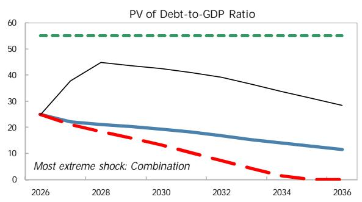

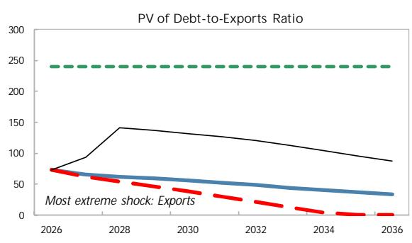

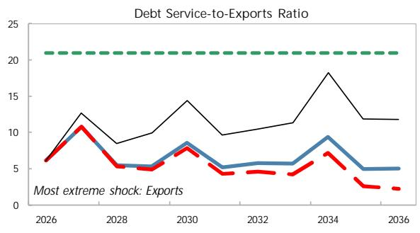  
Baseline - Historical scenario

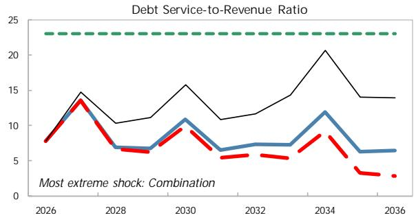

<table><tr><td>Most extreme shock 1/</td><td>Threshold</td></tr></table>

<table><tr><td colspan="3">Customization of Default Settings</td></tr><tr><td>Tailored Stress</td><td>Size</td><td>Interactions</td></tr><tr><td>Combined CL</td><td>No</td><td></td></tr><tr><td>Natural disaster</td><td>Yes</td><td>Yes</td></tr><tr><td>Commodity price</td><td>n.a.</td><td>n.a.</td></tr><tr><td>Market financing</td><td>No</td><td>No</td></tr></table>

Note: "Yes" indicates any change to the size or interactions of the default settings for the stress tests. "n.a." indicates that the stress test does not apply.  
Borrowing assumptions on additional financing needs resulting from the stress tests\*

<table><tr><td></td><td>Default</td><td>User defined</td></tr><tr><td>Shares of marginal debt</td><td></td><td></td></tr><tr><td>External PPG MLT debt</td><td>100%</td><td></td></tr><tr><td>Terms of marginal debt</td><td></td><td></td></tr><tr><td>Avg. nominal interest rate on new borrowing in USD</td><td>4.7%</td><td>4.7%</td></tr><tr><td>USD Discount rate</td><td>5.0%</td><td>5.0%</td></tr><tr><td>Avg. maturity (incl. grace period)</td><td>19</td><td>19</td></tr><tr><td>Avg. grace period</td><td>5</td><td>5</td></tr></table>

\* Note: All the additional financing needs generated by the shocks under the stress tests are assumed to be covered by PPG external MLT debt in the external DSA. Default terms of marginal debt are based on baseline 10-year projections.

1/ The most extreme stress test is the test that yields the highest ratio in or before 2036. The stress test with a one-off breach is also presented (if any), while the one-off breach is deemed away for mechanical signals. When a stress test with a one-off breach happens to be the most exterme shock even after disregarding the one-off breach, only that stress test (with a one-off breach) would be presented.

Figure 2. Honduras: Indicators of Public Debt Under Alternative Scenarios, 2026-36  
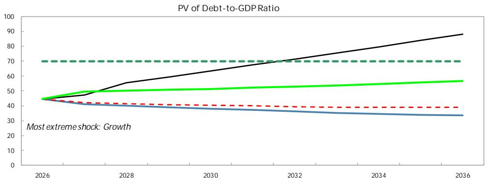

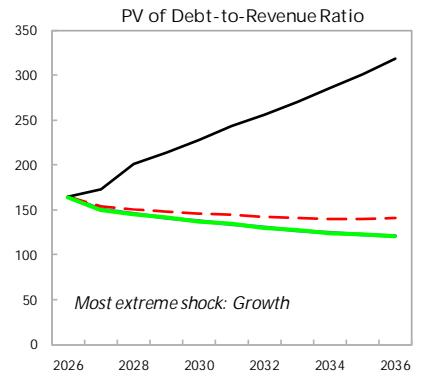  
TOTAL public debt benchmark

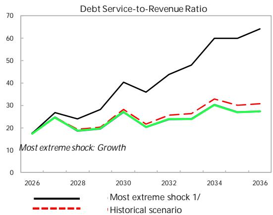

<table><tr><td>Borrowing assumptions on additional financing needs resulting from the stress tests*</td><td>Default</td><td>User defined</td></tr><tr><td>Shares of marginal debt</td><td></td><td></td></tr><tr><td>External PPG medium and long-term</td><td>23%</td><td>23%</td></tr><tr><td>Domestic medium and long-term</td><td>77%</td><td>77%</td></tr><tr><td>Domestic short-term</td><td>0%</td><td>0%</td></tr><tr><td>Terms of marginal debt</td><td></td><td></td></tr><tr><td>External MLT debt</td><td></td><td></td></tr><tr><td>Avg. nominal interest rate on new borrowing in USD</td><td>4.7%</td><td>4.7%</td></tr><tr><td>Avg. maturity (incl. grace period)</td><td>19</td><td>19</td></tr><tr><td>Avg. grace period</td><td>5</td><td>5</td></tr><tr><td>Domestic MLT debt</td><td></td><td></td></tr><tr><td>Avg. real interest rate on new borrowing</td><td>4.0%</td><td>4.0%</td></tr><tr><td>Avg. maturity (incl. grace period)</td><td>7</td><td>7</td></tr><tr><td>Avg. grace period</td><td>0</td><td>0</td></tr><tr><td>Domestic short-term debt</td><td></td><td></td></tr><tr><td>Avg. real interest rate</td><td>3.4%</td><td>3.4%</td></tr></table>

\* Note: The public DSA allows for domestic financing to cover the additional financing needs generated by the shocks under the stress tests in the public DSA. Default terms of marginal debt are based on baseline 10-year projections.  
Sources: Country authorities; and staff estimates and projections.

1/ The most extreme stress test is the test that yields the highest ratio in or before 2036. The stress test with a one-off breach is also presented (if any), while the one-off breach is deemed away for mechanical signals. When a stress test with a one-off breach happens to be the most exterme shock even after disregarding the one-off breach, only that stress test (with a one-off breach) would be presented.

## Figure 3. Honduras: Drivers of Debt Dynamics—Baseline Scenario

Gross Nominal PPG External Debt (In percent of GDP; DSA vintages)

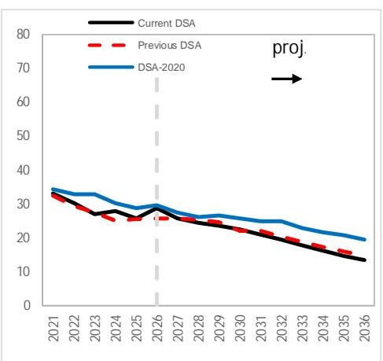  
Debt-Creating Flows (Percent of GDP)

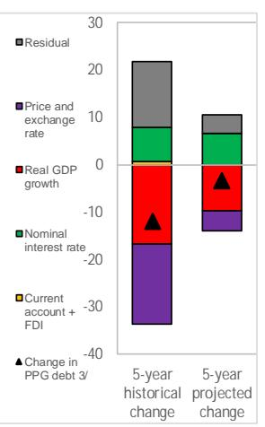  
Unexpected Changes in Debt 1/ (Past 5 years, percent of GDP)

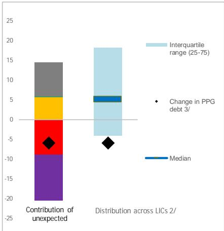

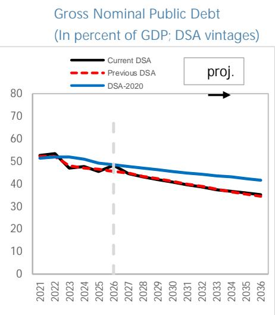  
1/ Difference between anticipated and actual contributions on debt ratios.

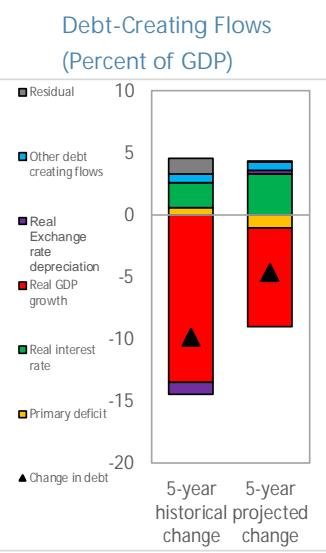

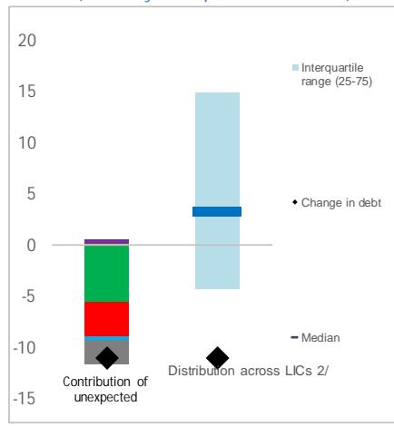  
2/ Distribution across LICs for which LIC DSAs were produced.  
3/ Given the relatively low private external debt for average low-income countries, a ppt change in PPG external debt should be largely explained by the drivers of the external debt dynamics equation.

## Figure 4. Honduras: Realism Tools

3-Year Adjustment in Primary Balance (Percentage points of GDP)  
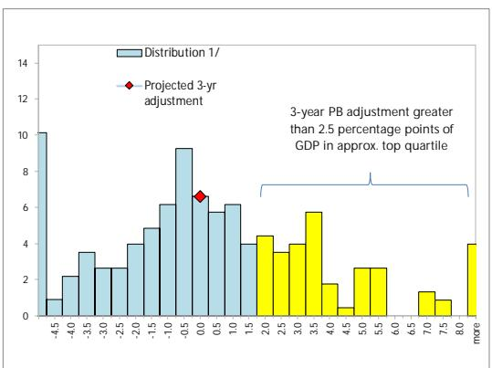  
1/ Data cover Fund-supported programs for LICs (excluding emergency financing) approved since 1990. The size of 3-year adjustment from program inception is found on the horizontal axis; the percent of sample is found on the vertical axis.

Fiscal Adjustment and Possible Growth Paths 1/  
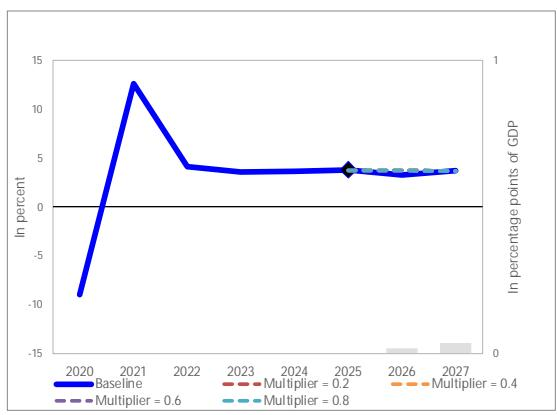  
1/ Bars refer to annual projected fiscal adjustment (right-hand side scale) and lines show possible real GDP growth paths under different fiscal multipliers (left-hand side scale).  
Public and Private Investment Rates (Percent of GDP)

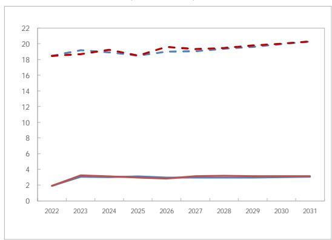

<table><tr><td></td><td>Gov. Invest. - Prev. DSA</td><td>Gov. Invest. - Curr. DSA</td></tr><tr><td></td><td>Priv. Invest. - Prev. DSA</td><td>Priv. Invest. - Curr. DSA</td></tr></table>

Contribution to Real GDP Growth (Percent, 5-year average)

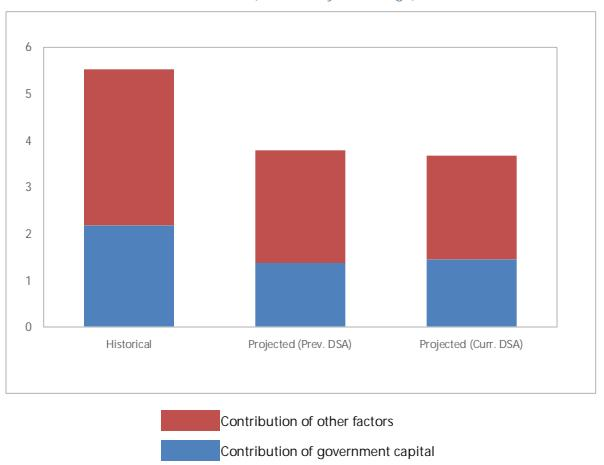

Figure 5. Honduras: Market Financing Risk Indicators  
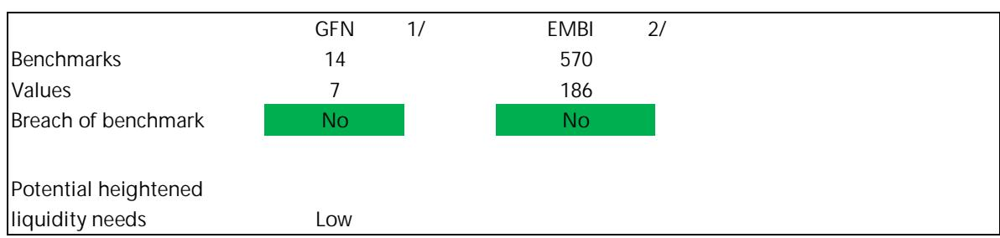  
1/ Maximum gross financing needs (GFN) over 3-year baseline projection horizon.  
2/ EMBI spreads correspond to the latest available data.

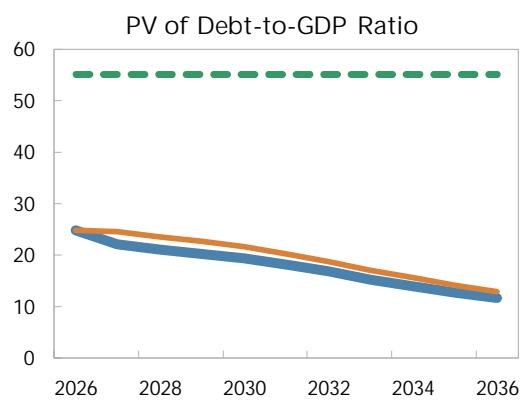

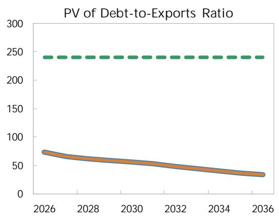

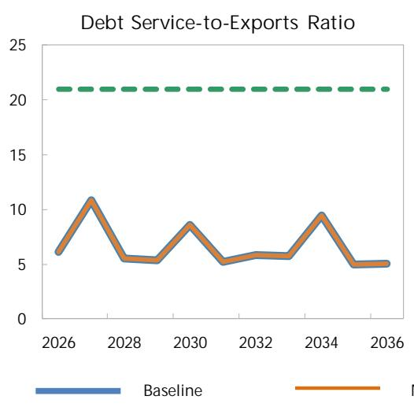  
Sources: Country authorities; and staff estimates and projections.

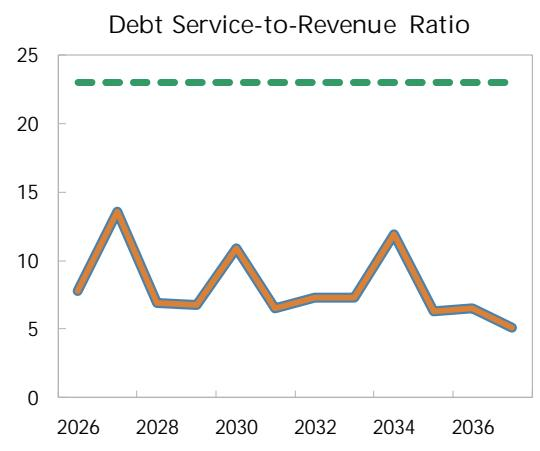

Figure 6. Honduras: Indicators of Domestic Public Debt, 2021-2036  
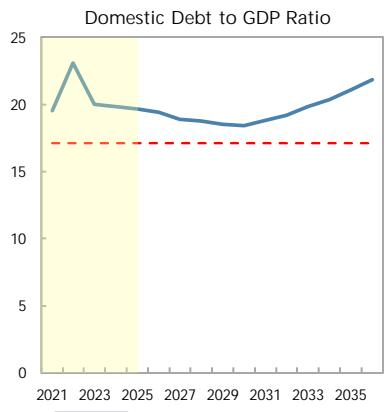  
Historical realizations

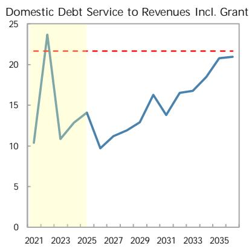

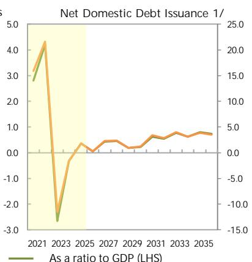  
Median of average projected values over the first five years of the forecast period across countries using the LIC DSF with non-zero domestic debt, end-2023 As a ratio to domestic debt stock in prev. year (RHS)

<table><tr><td>Borrowing Assumptions (average over 10-year projection)</td><td>Value</td></tr><tr><td>Shares in new domestic debt issuance</td><td></td></tr><tr><td>Medium and long-term</td><td>100%</td></tr><tr><td>Short-term</td><td>0%</td></tr><tr><td>Borrowing terms</td><td></td></tr><tr><td>Domestic MLT debt</td><td></td></tr><tr><td>Avg. real interest rate on new borrowing</td><td>4.0%</td></tr><tr><td>Avg. maturity (incl. grace period)</td><td>7</td></tr><tr><td>Avg. grace period</td><td>0</td></tr><tr><td>Domestic short-term debt</td><td></td></tr><tr><td>Avg. real interest rate</td><td>3.4%</td></tr></table>

Sources: Country authorities; and staff estimates and projections.  
1/ Net domestic debt issuance is an estimate based on the calculated public gross financing need net of gross external financing, drawdown of assets, other adjustments and domestic debt amortization. It excludes short-term debt that was issued and matured within the calendar year.

# Statement by Ms. Mendez Bertolo, Executive Director for Honduras, Mr. Monterroso, Senior Advisor to Executive Director, and Ms. Rivera Molina, Advisor to Executive Director June 29, 2026

On behalf of the Honduran authorities, we thank Mr. Fernandez Corugedo and his team for the constructive and helpful discussions held in the context of the Fourth and Fifth reviews under the Extended Fund Facility (EFF) and Extended Credit Facility (ECF) Arrangements.

Program performance has been favorable for the Fourth and Fifth Reviews, with strong performance against quantitative targets but structural reform delays—partly due to the elections and change in government. The new authorities have demonstrated a strong commitment to the program, making decisive progress in advancing structural reforms while maintaining prudent policies.

The new authorities are confident that the continued and decisive implementation of policies in the Memorandum of Economic and Financial Policies (MEFP) will allow Honduras to continue delivering on the program's objectives. They recognize the country's exposure to shocks, such as the current oil supply shock, or a possible strong El Niño event, and the more challenging external environment, and stand ready to take the needed measures to achieve program objectives. They also value technical assistance from the Fund and other official creditors, which is helping enhance their technical capacity and ability to implement their ambitious reform program.

## Recent Developments, Outlook, and Risks

Following the inauguration of the new government on January 27, 2026, the authorities launched a renewed vision for Honduras centered on private-investment-led growth, job creation, and improved public service delivery, underpinned by macroeconomic and fiscal stability. This vision is articulated in the government's 2026–30 plan, Juntos Vamos a Estar Bien, which is structured around 11 policy priorities, including political certainty, legal security, citizen security, efficient energy generation, infrastructure development, and stronger social services. Under this framework, the state is expected to play an enabling role by fostering entrepreneurship and investment as key drivers of opportunity, inclusion, and sustainable growth, while safeguarding macroeconomic stability.

The Honduran economy has remained resilient. Real GDP grew by 3.8 percent in 2025, supported by remittance-driven consumption, record-high coffee prices, and inventory buildup, with monthly indicators suggesting broadly stable growth into early 2026. Inflation declined to 3.5 percent in February 2026, within the Banco Central de Honduras (BCH)'s tolerance band, before the conflict in the Middle East pushed global oil prices higher, lifting headline inflation to 6.1 percent in May. The fiscal balance outperformed targets, the external position strengthened markedly, and international reserves rose well above the ARA metric.

Looking ahead, growth is projected at 3.3 percent in 2026, below potential, as higher oil prices weigh on consumption and investment, before recovering to 3.7 percent in 2027 and converging to 3.8 percent over the medium term. Inflation is expected to peak at 5.7 percent by end-2026 before returning to 4 percent (within the tolerance band) by end-2028. The current account is projected to move to a deficit of 2.7 percent of GDP in 2026, reflecting weaker terms of trade, even as remittances remain more resilient than previously assumed.

The authorities concur with staff that downside risks are significant and external in nature, such as an escalation of the Middle East war, a possible strong El Niño event with related agricultural and energy-sector impacts, and broader global trade and financial volatility. They view the program's framework, including the proposed adjustors for oil-price shocks, as providing appropriate flexibility while preserving the underlying policy anchors. The authorities remain committed to agile and decisive policy responses should these risks materialize, prioritizing targeted support to vulnerable households while safeguarding fiscal and external sustainability.

## Fiscal Policy

The authorities' fiscal strategy remains firmly anchored in safeguarding fiscal sustainability and maintaining budget discipline. This commitment is reflected in the 2026 fiscal framework, which targets a non-financial public sector NFPS deficit of 1 percent of GDP, in line with program objectives.

Fiscal performance has been strong, with the NFPS deficit declining to 0.7 percent of GDP in 2025 against a programmed 1.5 percent and a surplus of 0.9 percent of GDP recorded in the first quarter of 2026. For 2026, the authorities remain committed to the 1 percent of GDP deficit target, accommodating the oil price shock through reprioritization—including a temporary partial fuel subsidy through August 2026—while improving the targeting of energy subsidies to protect the most vulnerable.

The authorities are advancing tax policy and administration reforms, including electronic invoicing, strengthened audit capacity, and modernization of customs, to support revenue mobilization while improving the business climate. On public financial management, most trust funds have been closed and their resources incorporated into the Treasury Single Account, with amendments to the Organic Budget Law approved and associated regulations published to strengthen cash and debt management. The authorities appreciate staff's support in designing robust safeguards for the temporary health trust fund established to address urgent medical needs and reaffirm their commitment to a time-bound exit strategy, to fiscal discipline and to high governance and transparency standards. The inclusion of these safeguards in implementing regulations of the temporary health TF has been met as prior action.

Public debt declined to 45.4 percent of GDP at end-2025, and the DSA confirms a low risk of external debt distress, moderate overall public debt distress, and a strong debt-carrying capacity. The authorities welcome the improvement in EMBI spreads, which have fallen below 200 basis points, and the strengthening of domestic financing conditions. They remain committed to deepening the domestic debt market, diversifying their financing mix toward concessional and semi-concessional sources, and managing rollover risks associated with upcoming Eurobond redemptions, including the 2027 maturity.

## Monetary and Exchange Rate Policy

The authorities remain committed to implementing a consistent monetary and exchange rate policy framework aimed at maintaining low and stable inflation, preserving external stability, safeguarding international reserves, and strengthening the central bank's capital position. BCH

has maintained a data-driven approach under the crawling band regime, holding the monetary policy rate at 5.75 percent since October 2024 while allowing the exchange rate to depreciate cumulatively by about 7 percent since the crawl resumed in 2024 Q3. The new authorities of the Central Bank agree with staff that the current policy rate remains broadly appropriate, while standing ready to act decisively should second-round effects from higher oil prices emerge.

The authorities have continued to strengthen the FX allocation mechanism, progressively easing documentation thresholds for FX purchases to improve market functioning and transparency. Looking ahead, BCH intends to move carefully toward a transition back to an interbank FX market and, over time, toward an inflation-targeting framework supported by greater exchange rate flexibility. The authorities value the continued Fund technical assistance in this transition and the support to strengthen BCH's governance.

## Financial Sector

The National Banking and Insurance Commission (CNBS) continues to closely monitor financial sector conditions, with a view to safeguarding financial stability and ensuring the soundness and resilience of the banking system.

The financial system remains sound, with capital adequacy at 14.2 percent, well above the 10 percent regulatory minimum—and nonperforming loans remain low at 2.6 percent at 2026

Q1. The CNBS is updating its stress testing framework to incorporate the impact of higher oil prices, and continues to strengthen prudential regulation, including finalization of the capital conservation buffer and preparations for the net stable funding ratio and IFRS-9 implementation. The authorities are also preparing new legislation on securities markets and on insurance and reinsurance, reflecting their commitment to a deeper and more resilient financial sector.

## Structural Reforms

The authorities are working to address the energy sector's structural weaknesses and find a durable solution. In this regard, the authorities recognize that addressing ENEE's financial difficulties remains central to the program's success and to broader fiscal sustainability. While the end-December 2025 QPC on ENEE arrears was missed, reflecting election-related execution challenges, the extension of the bill-payment period, and higher oil prices, the authorities have adopted a comprehensive corrective financing plan combining timely subsidy payments from the Ministry of Finance (SEFIN) with calibrated ENEE debt issuance, supporting the request for a waiver of nonobservance on the basis of corrective actions already underway.

On electricity losses, the authorities are implementing the merger of ENEE's distribution-related units, expanding smart metering, and strengthening billing and collection, alongside continued progress toward cost-reflective tariffs, including the 10.49 percent tariff adjustment for 2026Q2 and the phasing out of generalized subsidies. The submission to Congress of the draft decree reforming the Electricity System Law reflects the authorities' broader vision for a more market-oriented energy sector, with a strengthened role for the regulator and improved targeting of subsidies to protect vulnerable households.

On governance, the beneficial ownership law has been approved by the Congress, and AML/CFT legislative amendments have been submitted to Congress to secure timely approval ahead of the upcoming FATF evaluation. Honduras' rejoining of ICSID in March 2026 and efforts to digitalize investment and trade documentation underscore the authorities' commitment to strengthening the investment climate and rule of law.

Statistical capacity is strengthening, with key advances in price indicators, national accounts, and fiscal statistics—supported by recent updates to the CPI, ongoing rebasing efforts, and steady progress toward alignment with international standards (SNA 2025, BPM7, and GFSM 2014), alongside continued improvements in data quality and coverage.

## Conclusion

The Honduran authorities remain firmly committed to the objectives of the EFF/ECF-supported program amid a more challenging external environment. Favorable program performance to date, reflected in strong compliance with quantitative targets and renewed momentum on structural reforms, together with the corrective actions taken on ENEE arrears and the safeguards established for the health trust fund, demonstrate the authorities' resolve and ownership of the program. We thank directors for their continued engagement and support and request the Executive Board's approval of the proposed decisions, including completion of the Fourth and Fifth Reviews, the requested waiver, the extension of the arrangements until December 31, 2026, to allow for the proper completion of the sixth and final reviews, and approval of the exchange restriction. Finally, we thank the Fund for its continued support under the EFF/ECF arrangements, and for the valuable technical assistance and capacity development.