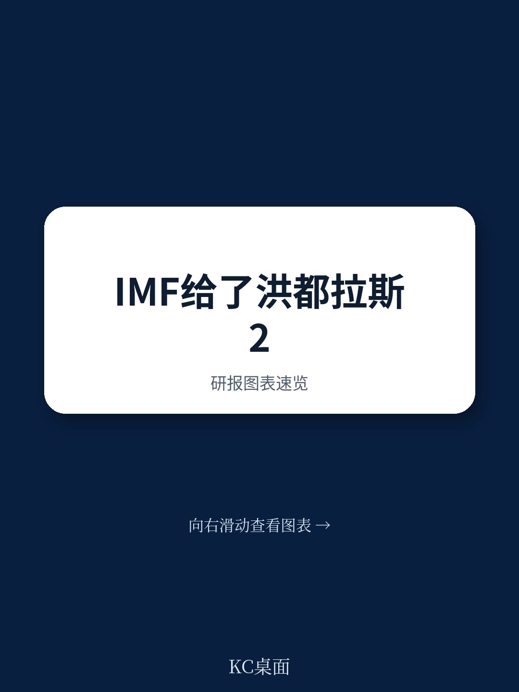
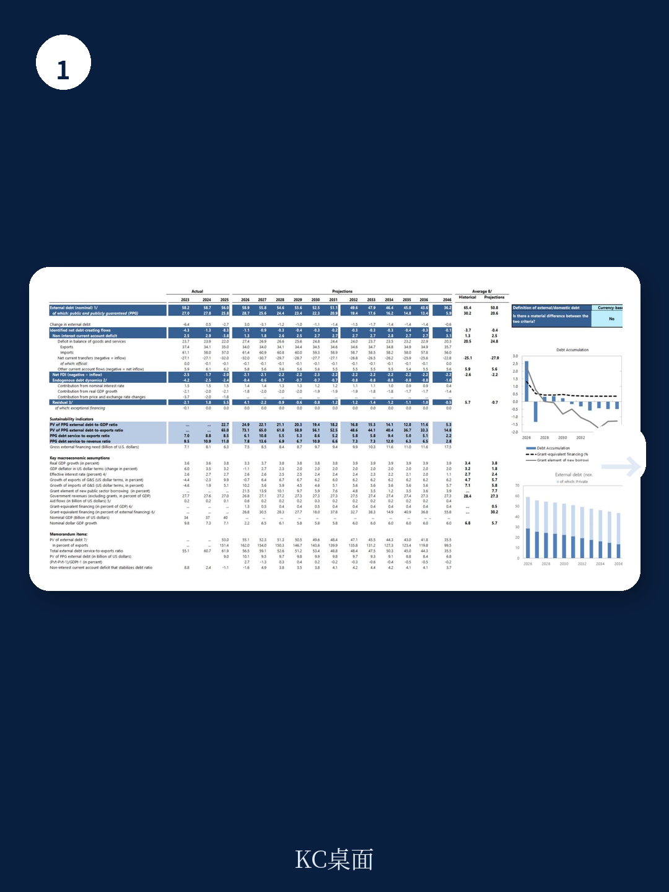
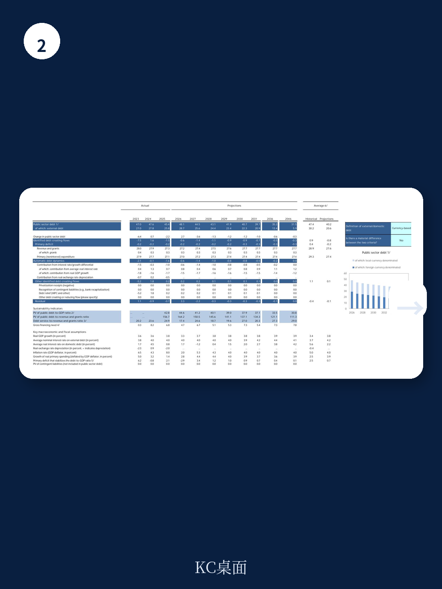

# IMF：洪都拉斯通过了压力测试，但能源补贴仍是最大隐患

一份来自国际货币基金组织（IMF）的国别报告，通常不会成为全球财经读者的焦点。但当这份报告的主角是一个正在经历“油电双重冲击”的中美洲经济体，且其改革进程恰好处于新旧政府交接的关键窗口期时，报告中的判断就具备了超越单一国家的参考价值。

2026年6月发布的IMF洪都拉斯第四、五次审议报告，核心结论是：**该国经济在2025年表现出超预期的韧性，但2026年的外部环境已发生根本性转变，真正的考验刚刚开始。**

报告传递了一个清晰但微妙的信号：洪都拉斯在过去一年交出了不错的成绩单——GDP增长3.8%，通胀回落至目标区间，财政赤字远低于预期，国际储备显著增厚。然而，这些成绩大多建立在2025年相对有利的外部条件之上：创纪录的咖啡价格、强劲的侨汇流入、以及尚未恶化的全球油价。

进入2026年，剧本已经重写。全球石油供给冲击推高了国内能源价格，而潜在的强厄尔尼诺现象则为农业和基础设施带来了新的气候风险。IMF的这份报告，本质上是一份“压力情景下的政策路线图”——它肯定了新政府延续改革的政治意愿，但也毫不避讳地指出了最脆弱的环节：国有电力公司ENEE的财务黑洞，以及能源补贴体系的扭曲。

对于关注新兴市场债务、大宗商品传导机制以及国际援助有效性的读者而言，这份报告的价值不在于洪都拉斯本身，而在于它提供了一个**小国如何在“外部冲击叠加内部结构性问题”时进行政策权衡**的典型案例。

> **KC评论：** 很多人觉得IMF国别报告太细、太技术，但如果你把洪都拉斯看作一个“压力测试样本”，就能读出更多东西。当全球油价上涨、侨汇可能回落、气候风险上升时，一个财政空间有限、电力系统亏损、且正在进行政治交接的国家，其政策选择几乎是所有新兴市场的缩影。完整报告里对“石油冲击传导机制”和“厄尔尼诺影响”的两张图，值得仔细拆解。

## 1. 2025年的超预期表现，很大程度上是“外部红利”而非“内生改善”

报告显示，洪都拉斯2025年的经济表现确实亮眼，但需要仔细拆解驱动因素。

GDP增长3.8%，主要动力来自侨汇支撑的消费、创纪录咖啡价格带来的出口收入，以及库存回补。但固定投资是停滞的——选举不确定性和贸易政策风险压制了资本开支。换句话说，增长的质量并不均衡，消费驱动型增长在外部条件逆转时可能最先承压。

财政方面，2025年非金融公共部门（NFPS）赤字仅为GDP的0.7%，远低于1.5%的程序目标。但这背后的主要原因是资本支出放缓，而非收入端的结构性改善。税收收入和经常性支出在2025年12月甚至小幅未达标。这暗示了一个关键问题：**财政纪律的维持，部分是通过“少花钱”实现的，而不是通过“多收钱”或“花得更有效率”。**

国际储备积累是2025年最显著的亮点。得益于侨汇高企、咖啡价格飙升以及汇率爬行制度的恢复，外汇市场条件显著改善，储备覆盖率大幅提升。这使得洪都拉斯在面对2026年的外部冲击时，拥有了一定的缓冲垫。

但报告也明确指出，2026年经济增长预计将放缓至3.3%，通胀将从2025年底的接近5%反弹至5.7%，主要推手就是能源价格。

> **KC评论：** 2025年的成绩单里有不少“运气成分”。咖啡价格和侨汇是洪都拉斯无法控制的外部变量。真正值得关注的是，当这些“顺风”变成“逆风”时，国内的政策工具箱里还有什么。完整报告的“外部脆弱性指标表”和“石油冲击情景分析”是判断这个缓冲垫够不够厚的关键。

## 2. 能源部门是最大的财政风险，也是改革最迟滞的领域

如果只能从这份报告中提取一个核心风险点，那就是**国有电力公司ENEE的财务困境**。

报告显示，洪都拉斯在2025年12月末的ENEE国内欠款存量绩效标准未达标，这是唯一一个未达标的量化绩效指标。尽管当局已采取纠正措施并获得了豁免，但问题并未解决。

更深层的问题在于：电力损失率（包括技术和非技术损失）在所有测试日期均未达标。这意味着ENEE的运营效率改善进展缓慢，电力被偷、被漏、被拖欠的情况依然严重。

IMF的立场非常明确：**能源部门改革是限制财政风险和支持中期增长的关键。** 具体措施包括：减少电力损失、解决欠款、推动成本反映型电价、逐步取消普遍性补贴并转向精准补贴。

这里有一个典型的政策两难。提高电价有助于改善ENEE的财务状况，但会推高通胀，并给低收入家庭带来直接冲击。而维持低电价则意味着财政补贴持续扩大，挤压其他优先支出空间。报告提到，当局已批准2026年二季度10.49%的电价调整，并正在推进《电力系统法》改革草案，但执行效果仍需观察。

> **KC评论：** 能源补贴是很多新兴市场的“政治雷区”。洪都拉斯的案例说明了一个通用困境：当全球油价上涨时，补贴的财政成本会急剧上升，但取消补贴的政治成本同样高昂。IMF建议的“精准补贴”在技术上可行，但在执行层面需要强大的行政能力和数据基础。完整报告里关于“能源补贴目标定位”的技术附件，是理解这一难题深度的最佳入口。

## 3. 新政府的“改革窗口”与“时间赛跑”

2026年1月上任的阿苏夫拉政府，面对的是一个比前任更复杂的外部环境。但报告也指出，新政府展现了对基金组织支持项目的坚定承诺，并在近期加快了结构性改革步伐。

一个关键信号是：**17个结构基准中，有7个是在2026年2月之后才完成或延迟实施的。** 这说明选举和政府更替确实造成了改革迟滞，但新政府正在“补课”。

改革议程集中在四个方向：
- **财政纪律**：优先化经常性支出、动员收入、改善能源补贴瞄准。同时，新的医疗信托基金被要求设立严格保障措施，防止成为新的财政风险点。
- **货币与汇率政策**：维持爬行区间制度，但准备好在必要时调整利率以应对石油冲击带来的第二轮通胀效应。更重要的是，当局计划逐步回归银行间外汇市场，并最终转向通胀目标制框架。
- **能源部门**：如前所述，这是最紧迫也最困难的部分。
- **治理与反腐**：已通过受益所有权法，并向国会提交了反洗钱/反恐融资立法修正案，以迎接FATF评估。

时间并不宽裕。项目已被延长至2026年12月31日，以完成第六次也是最后一次审议。这意味着新政府需要在不到一年的时间内，证明其改革承诺能够转化为可验证的成果。

## 4. 报告尚未完全回答的关键问题：侨汇的韧性还能持续多久？

洪都拉斯经济的核心外部支柱之一是侨汇。2025年，侨汇流入支撑了消费和国际储备。但报告对侨汇的长期可持续性着墨不多。

问题是：如果美国经济放缓，或者移民政策收紧，侨汇流入是否会显著下降？报告的风险评估矩阵提到了“发达经济体增长放缓”这一风险，但没有专门针对侨汇进行压力测试。

另一个未被充分展开的变量是：**厄尔尼诺现象对农业和基础设施的潜在冲击。** 报告在文本中提到了这一风险，并有一个专门的文本框进行讨论，但并未将其纳入基线预测。如果强厄尔尼诺事件发生，洪都拉斯的咖啡产量、水电供应和基础设施都将承压，这可能会同时冲击经济增长、通胀和财政。

> **KC评论：** 报告给出了“韧性”的判断，但这个判断的成立条件之一是外部环境不再恶化。侨汇和咖啡价格的双重顺风一旦转向，洪都拉斯的政策空间将迅速收窄。完整报告中的“风险评估矩阵”和“外部部门评估”提供了更详细的情景分析，是判断这个“韧性”有多可靠的必要补充。

***

这份IMF报告读到最后，你会发现一个有趣的张力：**技术层面的判断是“审慎乐观”的，但字里行间透出的紧迫感是真实的。** 洪都拉斯正在用一场“压力测试”来检验其改革框架的有效性。如果它能成功穿越这一轮石油和气候冲击，将为其他面临类似挑战的小型开放经济体提供一个有价值的参考模板。如果失败，那么能源补贴的窟窿和外部冲击的叠加，可能会让过去两年积累的成果迅速流失。

这正是IMF国别报告的魅力所在——它从不只关于一个国家。

---

如果你希望更深入地理解这份报告中的关键图表、数据假设和未解问题，欢迎加入我们的社群。每天，我们的AI agent和人工编辑会从当天发布的国际投行研报和权威机构报告中，筛选出最具洞察力的内容，整理成约10-40页的中文摘要与解读合集，包含原始图表和数据链接。既方便你快速把握市场动态，也适合作为AI分析工具的输入素材。在这里，我们持续追踪全球资本流动、政策变化和资产定价的底层逻辑。

Personal reading notes and learning share only. Not investment advice.

