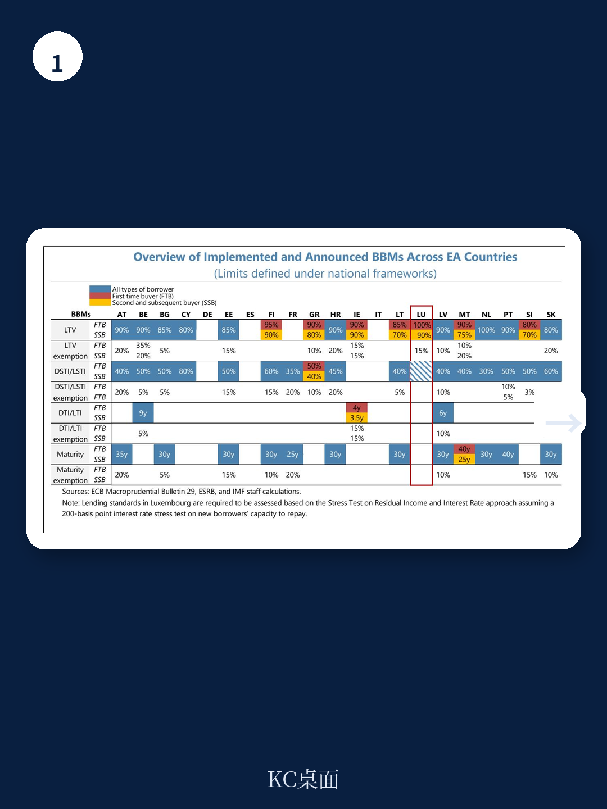
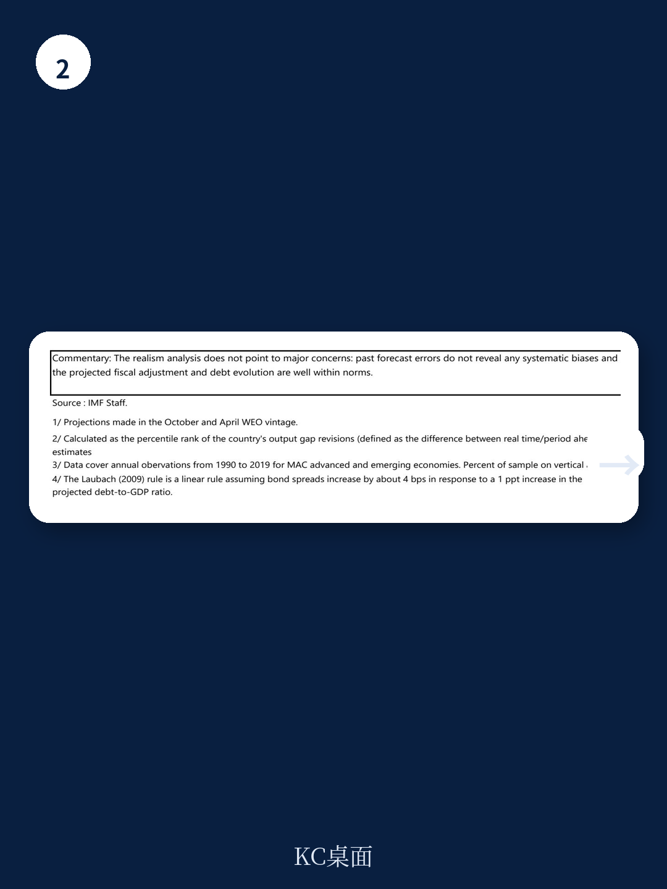

# IMF：卢森堡的“低债务幻觉”正在被赤字吞噬

当一个国家长期以“低公共债务”作为信用名片时，市场往往容易忽视其财政结构的真实变化。IMF在2026年6月发布的卢森堡第四条磋商报告中给出了一个值得警惕的判断：卢森堡的财政缓冲正在被结构性支出扩张和收入放缓双重挤压，而市场尚未对此充分定价。

这份报告的核心信号不是“卢森堡要出事”，而是“低债务经济体同样面临财政纪律松散的陷阱”。对于关注欧洲资产配置、跨境金融监管趋势以及小型开放经济体韧性的读者来说，这不仅仅是一份国别报告，更是一份关于“财政幻觉如何形成并可能被打破”的案例研究。

卢森堡的GDP在2025年仅增长0.6%，而同期政府支出增速达到3.7%，公共消费占GDP比重持续上升。更关键的是，IMF预计2028年政府赤字将扩大至GDP的3.0%，而公共债务将从2024年的26.3%攀升至32.0%。在一片“低债务”的赞美声中，斜率的变化往往比绝对值更重要。

> **KC评论：** 市场习惯用“卢森堡债务率不到30%”来安慰自己，但IMF的预测显示，如果现行政策不变，五年内卢森堡的债务率将上升近6个百分点。对于一个经济体量小、外部冲击传导快的国家，这个速度并不慢。完整报告中的债务可持续性分析（Annex IV）给出了更细致的压力测试情景，值得关注。

## 1. 这轮增长放缓的真正原因不是周期，而是公共部门对私人部门的挤出

IMF报告反复使用一个关键词：“public sector playing a dominant role”。这不是一句客气的描述，而是对增长质量的根本性质疑。

数据显示，2024年卢森堡国内总需求增长2.5%，其中私人消费贡献3.2%，但公共消费贡献高达4.9%。更值得关注的是，同期固定资产投资下降2.0%，而公共消费仍在扩张。这意味着政府正在成为经济增长的主要引擎，而私人投资持续萎缩。

报告明确指出，许多疫情期间的临时措施已经固化，公共部门的扩张正在挤占私人投资和就业，削弱资源向更高生产率部门重新配置的动力。对于依赖金融服务出口的卢森堡而言，公共部门过度扩张可能损害其长期竞争力。

> **KC评论：** 这不是卢森堡独有的问题。许多小型开放经济体在经历连续外部冲击后，都倾向于用财政手段平滑周期，但往往忽略了“临时措施永久化”的代价。IMF在完整报告中用图表展示了卢森堡公共消费占GDP比重的长期上升趋势，以及同期私人投资的下滑——这两条曲线的交叉点，可能就是增长模式转换的关键信号。

## 2. 财政赤字的结构性恶化比想象中更棘手，能源补贴只是表象

IMF对卢森堡财政状况的评估并非基于短期波动，而是基于结构性失衡。2025年一般政府赤字从2024年的盈余0.9%骤降至-2.0%，但更关键的是结构性赤字从0.0%扩大至-2.5%。

这意味着即使经济周期恢复正常，卢森堡的财政依然处于赤字状态。IMF预计2028年结构性赤字将进一步扩大至-3.4%。推动这一趋势的核心因素包括：人口老龄化带来的养老金支出压力、自动工资指数化机制推高的公共部门薪酬成本，以及能源补贴的持续化。

报告特别指出，当前的能源支持措施应“更精准地针对弱势群体”，暗示现行广泛补贴的效率有待提升。同时，IMF欢迎养老金改革，但也强调需要“抵消性措施”来控制财政成本。

> **KC评论：** 对于关注欧洲财政纪律的读者来说，卢森堡案例提供了一个有趣的观察窗口：一个长期被视为“财政模范”的国家，是如何在不知不觉中滑向结构性赤字的。完整报告中的Table 3（General Government Operations）给出了2020-2031年的完整财政路径，包括收入、支出、利息支出的逐项拆解，这些细节往往比总量数字更能揭示问题本质。

## 3. 金融体系韧性背后，有三个尚未完全定价的风险点

IMF对卢森堡金融体系的评价是“具有韧性”，但这份韧性建立在“持续密切监控”的基础上。报告明确指出，在金融周期进入早期扩张阶段时，需要“逐步收紧宏观审慎政策”。

三个风险点值得关注：

第一，卢森堡的金融体系高度外向且相互关联，这意味着外部冲击的传导速度可能快于预期。IMF建议对银行、投资基金和保险公司的流动性、杠杆、融资和集中度风险进行“持续密切监控”。

第二，尽管企业部门资产质量逐步改善，但房地产领域仍存在“脆弱性口袋”。卢森堡当局对此有不同的看法，认为IMF对“脆弱抵押贷款”的评估标准不适合卢森堡背景。这种分歧本身就是一个值得关注的信号。

第三，2024年FSAP建议的实施进展良好，但保险部门的压力测试仍在开发中。这意味着监管框架的完善尚未完成，而市场环境的变化可能领先于监管调整。

> **KC评论：** 卢森堡当局与IMF在房地产风险评估上的分歧，是这份报告中最值得深挖的细节之一。当局认为历史经验表明房地产下行并未显著冲击银行业，但IMF认为当前的风险特征可能不同。完整报告中的Annex VIII（FSAP建议实施情况）列出了具体的监管改进时间表，以及尚未完成的项目清单——这些信息对于评估金融体系韧性至关重要。

## 4. 人工智能被寄予厚望，但“生产率悖论”可能再次出现

卢森堡政府将人工智能视为提升生产率的核心抓手，并推出了包括AI Factory、Fit4AI补贴（1万至20万欧元）以及面向中小企业的AI支持包在内的一系列举措。IMF在报告中专门附上了一份关于AI与劳动力市场的分析（Annex VI）。

然而，报告也隐含了一个关键问题：AI技术的采用能否真正转化为全要素生产率的提升？卢森堡面临的结构性约束——技能错配、劳动力市场灵活性不足、住房成本高企——并非单纯的技术投入所能解决。

IMF建议当局通过“教育、再培训和技能提升政策”来解决技能错配问题，同时强调需要“增加劳动力市场灵活性”和“减少企业的行政与监管负担”。这些结构性改革建议表明，AI只是解决方案的一部分，而非全部。

> **KC评论：** 卢森堡的AI战略值得关注，但需要警惕“技术投入幻觉”。完整报告中的Annex VI详细分析了AI对卢森堡劳动力市场的潜在影响，包括不同行业的暴露程度、替代效应与互补效应的权衡，以及政策应对的优先序——这些分析对于评估AI投资的实际回报率至关重要。

## 5. 报告尚未完全回答的关键问题：外部冲击的传导机制如何变化？

尽管IMF的基准预测相对温和——2026年GDP增长1.2%，2027年回升至1.7%——但报告也列出了显著的下行风险：中东冲突持续、能源价格高企、欧盟增长放缓、金融市场压力，以及国内建筑业和劳动力市场的挑战。

然而，报告没有完全回答的一个问题是：在卢森堡金融体系高度互联、公共部门主导增长的新格局下，外部冲击的传导机制是否发生了变化？传统的“低债务=高韧性”框架是否仍然适用？

此外，卢森堡当局与IMF在房地产风险评估上的分歧，以及当局对宏观审慎政策收紧节奏的不同看法，都意味着政策路径仍存在不确定性。这些未解问题，恰恰是持续跟踪这份报告后续讨论的价值所在。

---

这份IMF报告揭示了一个微妙但重要的趋势：即使是财政纪律最好的经济体，也可能在连续冲击和结构性压力下逐渐丧失缓冲。对于关注欧洲资产配置、跨境金融监管以及小型开放经济体韧性的读者来说，卢森堡的案例提供了一个难得的观察窗口——当“低债务”不再是一个静态标签，而是一个动态变化的指标时，市场可能需要重新定价这些国家的风险溢价。

我们每天会由AI agent加上人工review，生成国际投行与多边机构的中文摘要与KC评论，daily更新，约10-40页，也包含当天最新数据图表合集。既方便喂给AI，也方便人工快速把握market dynamics。如果你对卢森堡的完整债务可持续性分析、FSAP建议实施时间表，或者AI与劳动力市场的详细情景分析感兴趣，欢迎加入社群，领取完整研报解读与原始图表。

Personal reading notes and learning share only. Not investment advice.

