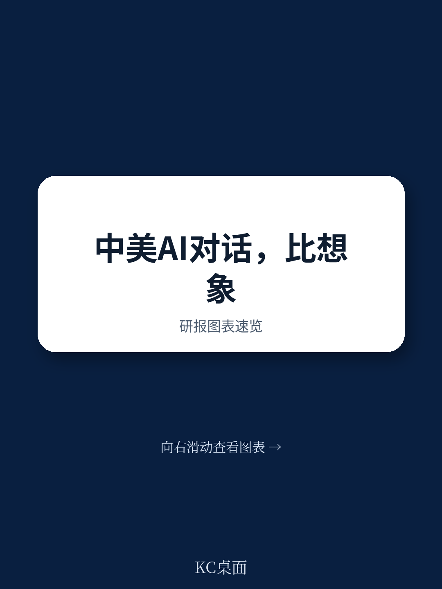

# 布鲁金斯学会：中美AI对话的真正价值，不在信任而在恐惧

中美之间的AI竞赛，常被描述为一场“新冷战”的技术军备竞赛。但一份来自布鲁金斯学会的最新播客对话，却揭示了一个更微妙的现实：在华盛顿和北京之间，AI议题正在成为少数能够超越地缘政治紧张、促使双方坐下来谈的“共同焦虑”领域。这份由该机构约翰·桑顿中国中心与MIT技术、经济与国家安全项目联合发布的讨论，核心判断是：**驱动中美AI对话的，不是信任，而是对失控的共同恐惧**。这种基于“相互脆弱性”的对话机制，虽然注定曲折，却可能成为两国在竞争时代管理冲突风险的关键安全阀。

报告指出，尽管特朗普政府与拜登政府在诸多对华政策上存在分歧，但在AI对话的必要性上，两届政府保持了罕见的连续性。这本身就是一种重要的结构性信号。对于关注中美科技竞争、地缘风险与全球治理的产业决策者与投资者而言，理解这种“恐惧驱动的对话”如何运作、其边界在哪里，远比追踪单次会晤的新闻头条更有价值。

## 1. 七年“二轨”对话揭示的核心经验：成果不来自信任，而来自共同焦虑

布鲁金斯学会与清华大学已进行了长达七年的“二轨”对话。所谓“二轨”，是指由前政府官员和学者组成的非官方交流渠道。这份播客对话的核心经验是：这类对话之所以能持续，恰恰是因为双方都不抱幻想。双方在桌面上并不信任对方，但都承认一个事实——AI技术的演进速度已经超过了任何单一政府的管理能力。

> **KC评论：** 这不是一次“友好交流”的总结，而是一份关于如何在对抗性关系中管理风险的实操手册。完整报告详细拆解了这七年对话中，哪些议题曾经“毫无进展”，哪些议题又突然“跃升式突破”。对于希望理解中美科技脱钩真实边界的读者，这些细节比任何宏观声明都更重要。

这份对话的一个重要发现是，双方在“非国家行为体利用AI作恶”这一点上，存在高度共识。无论是AI增强的网络攻击，还是AI与生物技术结合可能带来的生物恐怖主义风险，中美都将其视为共同的、迫在眉睫的威胁。这种“共同脆弱性”构成了对话最坚实的基础。

## 2. 政府间对话重启：拜登的教训与特朗普的延续

对话中，双方直接复盘了拜登政府时期一次失败的AI政府间对话。那次会谈被形容为“一团糟”，关键原因在于双方带着完全不同的议程和预期走进会议室。拜登政府在外交上准备不足，导致会谈从一开始就错位。

这个教训对当前特朗普政府重启的AI对话至关重要。两位前政府官员在对话中明确指出：特朗普总统与习近平主席在会晤中宣布重启AI官方对话，意味着双方已经设定了“在下次会晤前必须看到进展”的期待。但进展的方向必须事先校准。

> **KC评论：** 这里有两个关键信息值得注意。第一，对话重启本身并非偶然，而是两届政府的“非党派连续性”选择。第二，拜登政府失败的案例被如此直白地讨论，说明当前对话的设计者正在刻意避免重蹈覆辙。报告没有展开的是，这种“校准”具体如何操作，以及哪些议题（如AI与网络攻击、AI与关键基础设施）已经被确认为优先讨论的“低垂果实”。加入社群可以获取更详细的议题清单与谈判策略分析。

## 3. 全球治理的“机构焦虑”：IAEA模式还是CERN模式？

当对话视角从双边扩展到多边时，一个核心矛盾浮现：全球AI治理应该采用哪种模式？对话中提到了两种主流类比。其一是“IAEA模式”，即建立一个类似国际原子能机构的、具有权威性的政府间组织，来监督AI的安全风险。这个想法在联合国日内瓦会议上获得了大量呼声，尤其是在资源有限、感觉自己“被动接受规则”的发展中国家群体中。

但对话者提出了一个根本性质疑：AI与核武器不同。核技术是国家的产物，而AI是由私营部门主导发明的。不存在国家对AI的垄断。因此，任何试图套用IAEA模式的治理框架，都可能面临“速度不匹配”和“合法性缺失”的双重困境。

另一种模式是“CERN模式”，即大型国际科研合作。但CERN的运作节奏同样无法跟上AI的迭代速度。对话者暗示，最现实的路径可能不是寻找一个“唯一”的全球治理机构，而是让现有的国际组织（如ITU、联合国裁军机构）各自找到自己可以发挥独特作用的“利基”领域，同时保留双边对话作为最灵活的治理工具。

## 4. 尚未完全回答的关键问题：私营部门在安全治理中的角色

这份对话虽然深刻，但留下了一个关键的未解问题：私营部门，尤其是那些掌握最先进AI模型的公司，应该在全球安全治理中扮演什么角色？对话提到，AI是“私营部门的发明”，但安全治理通常是政府间的游戏。在“多利益相关方”模式（公司、公民社会参与）与“政府间”模式（仅限国家）之间，存在巨大的张力。

> **KC评论：** 报告没有给出答案，但提出了一个尖锐的追问：当OpenAI或Google DeepMind的模型能力可能直接影响国家安全时，政府间对话能否绕过这些公司？反过来，如果公司被纳入对话，又如何避免商业利益与国家安全利益的冲突？这是当前全球AI治理中最模糊、也最可能被低估的风险点。完整报告对“多利益相关方”模式的历史（如互联网治理）进行了回顾，并以此为镜，讨论了AI治理可能面临的独特挑战。

## 5. 一个值得持续追踪的观察框架：从“线性进步”到“锯齿状跃升”

对于希望持续跟踪这一议题的读者，这份对话提供了一个宝贵的观察框架：不要期待AI安全对话会呈现线性进步。对话参与者用“锯齿状跃升”来形容这一过程——可能连续几轮会谈毫无进展，然后突然在某一个点上取得突破。这种突破往往不是源于一方说服了另一方，而是源于双方同时识别出一个“新的共同脆弱点”。

因此，评估中美AI对话是否“有效”，不应只看公报措辞，而应关注：双方是否在每次会议后，对彼此的技术能力和安全红线有了更清晰的认知？是否建立了某种“危机沟通”的备用渠道？这些“软成果”往往比签署一份空洞的联合声明更有价值。

---

这份布鲁金斯学会的播客对话，为我们提供了一个难得的、来自长期一线实践者的视角。它没有给出简单的乐观或悲观结论，而是展示了一个复杂、曲折但仍在运作的对话机制。正如对话者所言：“我们坐在一起，不是因为信任，而是因为利益。” 在这个意义上，AI或许正在成为中美关系中一个意想不到的“稳定器”——不是因为双方变得友好，而是因为双方都害怕技术失控的后果。

如果你希望深入理解这七年对话的具体成果清单、拜登政府那次失败会谈的完整复盘，以及全球AI治理不同模式的详细对比，欢迎加入我们的社群。我们每日由AI agent与人工审校，产出国际投行与顶级智库的中文摘要与深度评论，每日更新约10-40页，包含当天最新数据图表合集，既方便喂给AI模型，也方便你快速把握全球市场与地缘政治的动态脉搏。

Personal reading notes and learning share only. Not investment advice.

