ISRAEL

July 2026

# 2026 ARTICLE IV CONSULTATION—PRESS RELEASE; STAFF REPORT; AND STATEMENT BY THE ALTERNATE EXECUTIVE DIRECTOR FOR ISRAEL

Under Article IV of the IMF's Articles of Agreement, the IMF holds bilateral discussions with members, usually every year. In the context of the 2026 Article IV consultation with Israel, the following documents have been released and are included in this package:

\- A Press Release summarizing the views of the Executive Board as expressed during its June 24, 2026 consideration of the staff report that concluded the Article IV consultation with Israel.

\- The Staff Report prepared by a staff team of the IMF for the Executive Board's consideration on June 24, 2026, following discussions that ended on February 5, 2026, with the officials of Israel economic developments and policies. Based on information available at the time of these discussions, the staff report was completed on June 10, 2026.

• An Informational Annex prepared by the IMF staff.

• A Statement by the Alternate Executive Director for Israel.

The documents listed below have been or will be separately released.

Selected Issues

The IMF's transparency policy allows for the deletion of market-sensitive information and premature disclosure of the authorities' policy intentions in published staff reports and other documents.

Copies of this report are available to the public from

International Monetary Fund • Publication Services
PO Box 92780 • Washington, D.C. 20090
Telephone: (202) 623-7430 • Fax: (202) 623-7201
E-mail: publications@imf.org Web: http://www.imf.org

International Monetary Fund
Washington, D.C.

# IMF Executive Board Concludes 2026 Article IV Consultation with Israel

FOR IMMEDIATE RELEASE

\- The elevated regional tensions are casting a shadow on Israel's economy. Growth forecasts for 2026 have been revised down to 3.5 percent from 4.8 percent before the war in the Middle East, while inflation is expected to rise temporarily due to higher energy prices and supply constraints despite shekel appreciation.

\- The conflicts' economic repercussions and longstanding labor market challenges weigh on the medium-term outlook.

\- With medium-term growth challenges looming, key priorities include rebuilding fiscal buffers, raising labor supply and productivity, and ensuring price and financial stability

Washington, DC – July 1, 2026: The Executive Board of the International Monetary Fund (IMF) completed the Article IV Consultation for Israel on June 24, 2026. $^{1}$

The elevated regional tensions are casting a shadow on Israel's economy. Growth forecasts for 2026 have been revised down to 3.5 percent from 4.8 percent before the war in the Middle East, reflecting a sharp contraction in the first quarter followed by a modest rebound over the remainder of the year. Inflation is expected to rise temporarily in the near term, due to higher energy prices and supply constraints despite shekel appreciation. Risks to the growth outlook are tilted to the downside and the inflation outlook to the upside, with deeper and more prolonged regional conflicts remaining the key concern.

Amid ongoing hostilities in the Middle East, defense expenditure is expected to remain high, and labor supply constrained by military mobilization and reduced availability of non-Israeli workers. These pressures would compound longstanding structural challenges—such as persistently low labor-market participation among certain groups—and weigh on Israel’s medium-term economic outlook.

## Executive Board Assessment $^{2}$

The Executive Directors welcomed that the economy has shown resilience, despite repeated shocks. Directors, however, noted that elevated regional geopolitical uncertainty and long-standing structural impediments are expected to weigh on the outlook. Furthermore, renewed intensification of regional tensions remains a key downside risk. Accordingly, Directors emphasized the need to implement prudent policies to safeguard macroeconomic stability and advance structural reforms to boost growth potential.

Directors welcomed the authorities' commitment to fiscal discipline and emphasized that gradual, credible fiscal consolidation is important to rebuild buffers and stabilize public debt. Noting the elevated defense spending and already low levels of civil spending, Directors considered that fiscal adjustment should rely primarily on revenue measures and efforts to enhance spending efficiency. They highlighted that a comprehensive review of the tax system, including tax expenditures, would help improve its simplicity, efficiency, and equity.

Directors welcomed the authorities' efforts to bring inflation back to the target range. They agreed that a moderately tight, data-dependent monetary policy stance remains appropriate to safeguard price stability, given inflationary pressures arising from higher energy prices and supply shocks. Directors highlighted that financial sector systemic risks appear contained and that banks remain well-capitalized, liquid, and profitable. Nonetheless, they emphasized the need for continued vigilance, particularly with respect to banks' real estate exposures. Directors recommended continued strengthening of stress testing frameworks, extending borrower-based measures to nonbank financial institutions, and careful implementation of Basel III requirements. While welcoming recent reforms to strengthen the BOI's resolution powers, they advised further progress on enhancing the crisis management framework. Directors also encouraged continued efforts to strengthen the AML/CFT framework.

Directors stressed that advancing structural reforms is critical to boost potential growth and support fiscal sustainability. While welcoming recent progress, they underscored the need to address persistent gaps in labor force participation and skills, particularly among fast-growing population groups. Directors welcomed progress in trade reforms and called for further efforts to improve product markets and infrastructure. They emphasized the importance of ensuring an adequate and sufficiently skilled labor supply to maintain the competitive edge in high-tech, including AI. Strengthening active labor market policies to facilitate reskilling and labor mobility is also important.

<table><tr><td rowspan="2"></td><td rowspan="2">2024</td><td rowspan="2">2025</td><td>2026</td><td>2027</td></tr><tr><td colspan="2">Proj.</td></tr><tr><td colspan="5">Output</td></tr><tr><td>Real GDP growth (percent change)</td><td>1.0</td><td>2.9</td><td>3.5</td><td>4.4</td></tr><tr><td colspan="5">Employment</td></tr><tr><td>Unemployment (percent)</td><td>3.0</td><td>3.0</td><td>3.0</td><td>3.1</td></tr><tr><td colspan="5">Prices</td></tr><tr><td>Inflation (period average, percent change)</td><td>3.1</td><td>3.0</td><td>2.3</td><td>2.1</td></tr><tr><td colspan="5">General government finances</td></tr><tr><td>Revenue (percent of GDP)</td><td>35.6</td><td>38.3</td><td>38.0</td><td>37.2</td></tr><tr><td>Expenditure (percent of GDP)</td><td>43.7</td><td>43.5</td><td>44.2</td><td>42.4</td></tr><tr><td>Fiscal balance (percent of GDP)</td><td>-8.1</td><td>-5.2</td><td>-6.2</td><td>-5.1</td></tr><tr><td>Public debt (percent of GDP)</td><td>67.7</td><td>68.4</td><td>70.1</td><td>70.7</td></tr><tr><td colspan="5">Central government finances</td></tr><tr><td>Revenue (percent of GDP)</td><td>24.2</td><td>26.1</td><td>25.8</td><td>25.2</td></tr><tr><td>Expenditure (percent of GDP)</td><td>31.0</td><td>30.8</td><td>31.1</td><td>29.6</td></tr><tr><td>Fiscal balance (percent of GDP)</td><td>-6.8</td><td>-4.7</td><td>-5.3</td><td>-4.4</td></tr><tr><td colspan="5">Monetary and credit</td></tr><tr><td>Broad money (percent change)</td><td>8.1</td><td>6.5</td><td>...</td><td>...</td></tr><tr><td>Credit to the private sector (percent change)</td><td>9.0</td><td>12.8</td><td>...</td><td>...</td></tr><tr><td>3-month Treasury bill interest rate (percent)</td><td>4.3</td><td>4.3</td><td>...</td><td>...</td></tr><tr><td colspan="5">Balance of payments</td></tr><tr><td>Current account (percent of GDP)</td><td>2.9</td><td>1.5</td><td>1.3</td><td>1.8</td></tr><tr><td>External debt (percent of GDP)</td><td>27.2</td><td>27.0</td><td>...</td><td>...</td></tr><tr><td>Foreign reserves (end-of-period, billions of US$)</td><td>214.6</td><td>229.5</td><td>...</td><td>...</td></tr><tr><td colspan="5">Exchange rates</td></tr><tr><td>NIS per U.S. dollar (period average)</td><td>3.7</td><td>3.5</td><td>...</td><td>...</td></tr><tr><td>REER (percent change)</td><td>0.3</td><td>6.7</td><td>...</td><td>...</td></tr></table>

# ISRAEL

# STAFF REPORT FOR THE 2026 ARTICLE IV CONSULTATION

June 10, 2026

## KEY ISSUES

Context. Elevated regional tensions have tested Israel's economic resilience. Amid ongoing hostilities in the Middle East, defense expenditure is expected to remain high, and labor supply constrained by military mobilization and reduced availability of non-Israeli workers. These pressures would compound longstanding structural challenges—such as persistently low labor-market participation among certain groups—and weigh on Israel's medium-term economic outlook.

Outlook and risks. The baseline assumes that the ceasefire in the Middle East largely holds, while geopolitical tensions remain elevated. Staff project output growth at 3.5 percent in 2026, down from 4.8 percent before the Middle East war, reflecting a sharp contraction in the first quarter followed by a modest rebound over the remainder of the year. The medium-term outlook is weaker, with potential growth forecast at around 3.5 percent, about 0.5 percentage point below its pre-2023 average. Downside risks mainly stem from deeper and more prolonged regional conflicts; upside risks include lasting regional geopolitical stability that improves regional security and expands participation in the Abraham Accords. Inflation is expected to stay slightly above 2 percent in 2026, reflecting higher global energy prices and tighter supply constraints despite shekel appreciation, with risks tilted to the upside. Public debt is projected to steadily rise, with higher defense spending pressures reducing fiscal space.

Policy recommendations. Key priorities include rebuilding fiscal buffers, raising labor supply and productivity, and ensuring price and financial stability.

\- Fiscal policy. Given elevated deficits and rising debt, a gradual and credible consolidation is needed to stabilize debt and rebuild fiscal buffers. With defense spending elevated, essential civil spending—especially infrastructure—risks being crowded out. Fiscal adjustment should focus on growth-friendly revenue measures, while strengthening spending efficiency remains important.

\- Structural. Raising labor supply and productivity is now more urgent to overcome post-conflict challenges and lift medium-term growth. Priorities include increasing labor force participation across the population, improving infrastructure, advancing product market reforms, and maintaining a competitive edge in high tech.

\- Monetary policy. A moderately tight monetary policy stance should be maintained under the baseline, where inflation is expected to rise temporarily due to higher energy prices and supply constraints. The BOI should continue to closely monitor war-related effects on labor supply, the pass-through of higher energy prices and exchange rate movements, and the impact of the latest rate cut on financial conditions and domestic demand, and stand ready to adjust course if incoming data or the heightened risk environment indicate meaningful deviations from the baseline.

\- Financial sector policy. The financial system remains resilient, with banks well capitalized, liquid, and profitable. However, banks' sizable exposure to real estate poses risk, especially as the ongoing housing-market adjustment is marked by weakening prices and transactions. Financial supervisors should continue to closely monitor risks and ensure that banks rigorously assess real estate exposures and update provisions.

Discussions were held in Jerusalem and Tel Aviv from January 25–February 5, 2026, and follow-up virtual meetings were held on May 7, 2026. The team comprised Kotaro Ishi (head), Pablo Druck, Ozge Emeksiz, Yinqiu Lu, Vahram Stepanyan (all EUR), and Vincent Tang (FAD). Carlos Acosta (LEG) participated in financial integrity-related discussions virtually. Martin Andres Caruso Bloeck and Seng Guan Toh (both EUR), Alexandra Solovyeva (FAD), and Jaunius Kamelavičius and Thomas Piontek (both MCM) contributed to some analyses. Rogelio Celaya (EUR) provided research assistance, and Marizielle Evio and Caitlin Aingé (EUR) provided administrative assistance. Nadav Steinberg (Senior Advisor to Executive Director) participated in the discussions, while Marnix van Rij (Alternate Executive Director) participated in several meetings, including the concluding meeting.

## CONTENTS

CONTEXT—CHALLENGES 5

RECENT ECONOMIC DEVELOPMENTS 5

OUTLOOK AND RISKS 9

POLICY DISCUSSIONS 13

A. Restoring Fiscal Buffers Amid Persistently Higher Defense Spending \_\_\_\_ 13

B. Advancing the Longstanding Structural Reform Agenda \_\_\_\_ 17

C. Ensuring Price Stability 20

D. Safeguarding Financial Stability 21

E. Strengthening Financial Integrity 23

AUTHORITIES' VIEWS 23

STAFF APPRAISAL 25

## BOX

1. Israel: Energy Shocks 12

## FIGURES

1. Recent Macroeconomic Developments 27

2. Labor Market Developments 28

3. Inflation and Monetary Developments 29

4. Selected Financial Indicators 30

5. Performance of the Banking System 31  
6. External Sector Developments 32  
7. Fiscal Developments 33

## TABLES

1. Selected Economic Indicators, 2022–31 \_\_\_\_ 34
2. Summary of Central Government Operations, 2022–31 \_\_\_\_ 35
3. General Government Operations, 2022–31 \_\_\_\_ 36
4. Depository Corporations Survey, 2019–26 \_\_\_\_ 37
5. Financial Soundness Indicators, Banks, 2018–2025Q3 \_\_\_\_ 38
6. Balance of Payments, 2022–31 \_\_\_\_ 39
7. International Investment Position, 2018–25 \_\_\_\_ 40

## ANNEXES

I. Authorities' Responses to Past Article IV Recommendations 41  
II. Macroeconomic Developments From October 2023 to February 2026 42  
III. External Sector Assessment 45  
IV. Risk Assessment Matrix 48  
V. Data Issues 50  
VI. Sovereign Risk and Debt Sustainability Assessment 52  
VII. Macroprudential and Financial Policy Measures 59  
VIII. Risks from Housing Finance in Israel 61  
IX. Authorities' Responses to Past FSAP Recommendations 66

## CONTEXT—CHALLENGES

1. Elevated regional tensions over the past three years have tested the economy's resilience. These reflect a succession of geopolitical shocks, including the 2023-25 Gaza conflict, the June 2025 escalation with Iran, and the war in the Middle East that began on February 28, 2026. Economic activity rebounded after each shock, but repeated disruptions have hindered a durable recovery, leaving output about 9 percent below its pre-October 2023 trend. The latest conflict risks prolonging these losses, amid elevated defense spending, higher

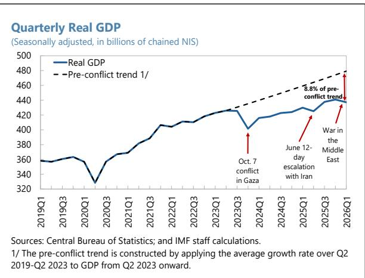  
Sources: Central Bureau of Statistics; and IMF staff calculations.
1/ The pre-conflict trend is constructed by applying the average growth rate over Q2 2019-Q2 2023 to GDP from Q2 2023 onward.

debt and interest costs, and persistent labor supply constraints from military mobilization and reduced availability of Palestinian workers.

2. These pressures compound longstanding structural challenges. Labor force participation and skill levels remain low for some groups, particularly Haredi men and Arab-Israelis, weighing on potential growth. In addition, the dual structure of the economy, with world-class high-tech sectors alongside lower productivity in other industries, exposes Israel to sectoral shocks. As a small, open economy, Israel remains particularly exposed to global trade tensions and growth prospects.

3. General elections are due by late October 2026. The political landscape is fragmented, and early elections are possible if the Knesset (the Israeli parliament) fails to pass key legislations. During recent conflicts, the government has maintained prudent macroeconomic and financial sector policies broadly in line with the past staff recommendations, while progress in structural reform has been mixed (Annex I).

## RECENT ECONOMIC DEVELOPMENTS

## 4. The economy gradually recovered from earlier conflicts through 2024-25.

\- Output fell sharply in late 2023, followed by a recovery in 2023-25. Following the October 2023 Gaza conflict, output contracted sharply (-21 percent, annualized quarter-over-quarter, q/q), driven by a collapse in tourism, a drop in construction due to the loss of Palestinian workers, and weakened private consumption (Annex II). Activity began to recover in early 2024 and

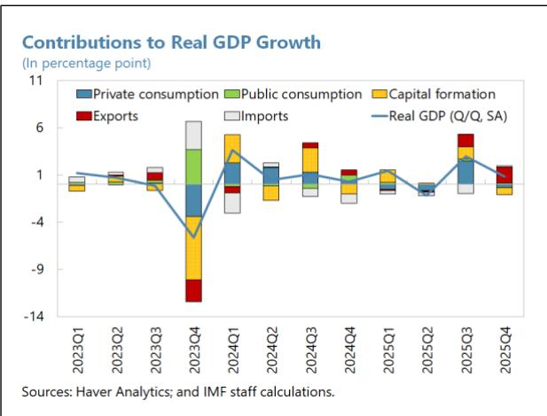

strengthened into 2025 as the conflict ebbed, supported by private demand and easing supply constraints, with a brief interruption from the June 2025 Iran escalation and a strong rebound in H2 2025. GDP growth rose from 1 percent in 2024 to 2.9 percent in 2025 (Figure 1).

Labor markets tightened (Figure 2). Military mobilization, displacement, and the loss of Palestinian workers reduced labor supply significantly in Q4 2023, tightening labor markets. Labor supply subsequently gradually recovered through 2024-25 as reservists returned and foreign workers replaced Palestinians. Nonetheless, employment, unemployment, and vacancy indicators pointed to continued tightness into early 2026. Compensation of non-public sector employees increased by 6.8 percent year on year (y/y) in 2025, up from 2.3 percent in 2024.

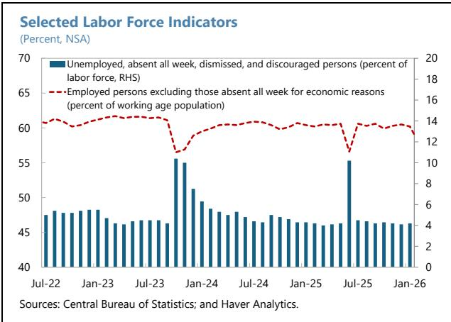

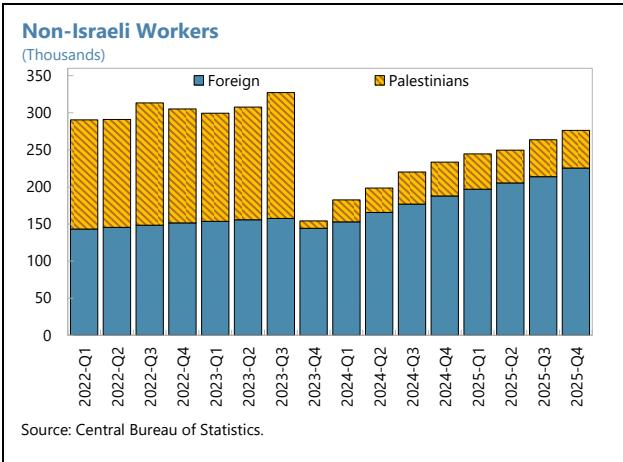

\- Inflation rose in 2024 before returning to the target range in 2025 (Figure 3). Inflation accelerated through 2024, reflecting supply constraints, elevated shipping costs, and initial shekel depreciation. Headline and core inflation (CPI excluding energy and food) peaked at 3.8 percent y/y and 3.6 percent y/y, respectively, in January 2025. Subsequently, a stronger shekel, easing supply constraints, and tight monetary policy helped bring inflation back within the 1-3 percent target range by fall 2025. Headline and core inflation were 2 percent y/y and 2.2 percent y/y, respectively, in February 2026.

\- Financial markets were initially volatile but strengthened through 2024-25 (Figure 4). Following the October 7, 2023 shock, the shekel depreciated to NIS 4.1 per US\$ (its weakest since 2009), 5-year CDS spread widened above 140 basis points (the widest since 2013), and equity prices fell sharply. Financial markets improved through 2024-25, supported by capital inflows; by mid-February 2026, the shekel had strengthened to around NIS 3.1 per US\$, and equity prices had more than doubled, and the CDS spread had narrowed to about 70 basis points by late-February, though still above pre-October 7 levels.

\- The banking system remained resilient (Figure 5). The government introduced conflict-related support measures, while the Bank of Israel introduced temporary loan deferral programs in October 2023 (which ended in March 2025). These measures helped mitigate shocks to bank balance sheets. Banks maintained strong asset quality (non-performing loans below 1 percent of total loans, Q3 2025), profitability (return on equity around 16 percent), capitalization (leverage ratio 7 percent), and liquidity (liquidity coverage ratio 130 percent).

5. The external position in 2025 was broadly in line with the level implied by medium-term fundamentals and desirable policies (Figure 6, and Annex III). The current account surplus narrowed from 2.8 percent of GDP in 2024 to 1.5 percent in 2025. A narrowing goods deficit is offset by a smaller services surplus, while the income balance weakened, partly reflecting higher undistributed profits of foreign companies. The net international investment position is estimated at 43 percent of GDP (at end-2025), and gross reserves are at 37.5 percent of GDP, comfortably above adequacy metrics.

## 6. Fiscal buffers weakened after the 2023 conflict, but consolidation measures in the 2025 budget helped limit the deterioration (Figure 7).

\- The central government (CG) balance shifted from a surplus of 0.6 percent of GDP in 2022 to deficits of 4.1 percent in 2023 and 6.8 percent in 2024, driven by higher defense spending, increased transfers, and weaker revenues. Financing remained smooth, supported by deep domestic markets and strong home bias among institutional investors. The 2025 budget included about 1.2 percent of GDP in consolidation measures, mostly on the revenue side. $^{1}$ The CG deficit narrowed to 4.7 percent of GDP in 2025, below the 5.2 percent of GDP budgeted, driven by stronger-than-expected revenues.

\- Similarly, the general government (GG) balance deteriorated from a surplus of 0.3 percent of GDP in 2022 to deficits of 5.4 percent in 2023 and 8.1 percent in 2024. With the improved CG outturn, the GG deficit declined to 5.2 percent of GDP in 2025.

• Public debt rose from 60 percent of GDP at end-2022 to 68 percent of GDP at end-2025.

## 7. The war in the Middle East stalled the recovery by disrupting mobility and labor supply, though there are signs of normalization more recently.

\- The government declared a state of emergency, including bans on public gathering, closure of schools and childcare facilities, and restrictions on on-site business activity on February 28. Large-scale mobilization of reservists (reportedly, about 100,000, 2.2 percent of the labor force, in early March) further constrained labor supply. To mitigate shocks to banking system stability, a temporary loan payment deferral program was reintroduced in early March. Mobility restrictions were subsequently eased as security improved and were largely lifted nationwide on April 18, except in northern border areas.

\- Real GDP contracted by 3.3 percent (q/q, annualized) in Q1 2026, reflecting declines in private consumption and public consumption (amid delays in approving the 2026 budget), partially offset by stronger investment. More recent high-frequency indicators (e.g., payment card

transactions) suggest a pick-up in consumption in April-May. Employment recovered, but only partially, and labor market remained tight in April.

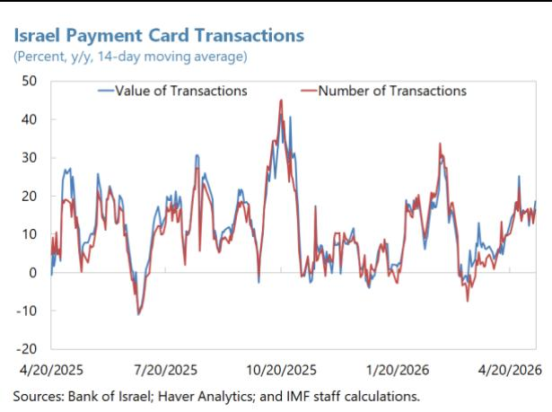

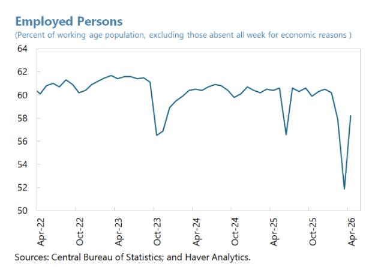

\- Headline inflation accelerated by 0.6 percent month over month (m/m, seasonally adjusted) in April while base-year effects contained annual inflation at 1.9 percent. Core inflation was broadly flat (0.2 percent m/m and 1.4 percent y/y), while market-based inflation expectations remained slightly below 2 percent. These developments reflect offsetting factors, including limited pass-through from higher global energy prices—given Israel’s energy supply mix (Box 1)—and the appreciation of the shekel, which helped contain inflation pressures.

\- Financial markets initially reacted negatively but have since strengthened through mid-May. The shekel strengthened to around NIS 2.9 per US\$ (its strongest levels since the middle of the 1990s), equity prices reached new highs, and 5-year CDS spread declined to pre-war levels, whereas 10-year government bond yields hovered around 4 percent (around 20 basis points above pre-war levels).

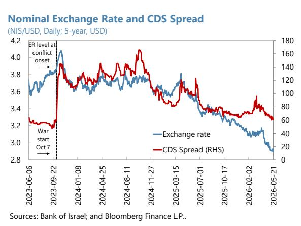

## OUTLOOK AND RISKS

8. Economic activity is expected to recover in the near term, though heightened geopolitical tensions and higher energy prices will weigh on the pace of recovery. The war in the Middle East has led to a large supply side shock and increased defense spending, resulting in weaker growth, higher inflation, and wider fiscal deficits and debt. Staff's baseline assumes that the ceasefires since mid-April largely hold, with no sustained escalation or material progress toward regional peace agreements involving Israel, while geopolitical uncertainty remains elevated.

\- Key baseline assumptions. Domestically, reservists are expected to gradually return, but mobilization will remain above pre-October 2023 levels, and together with reduced foreign workers, will continue to constrain labor supply. Elevated uncertainty is expected to weigh on consumption and investment. Externally, the drag from slower growth in trading partners is expected to be modest, in part reflecting resilient high-tech exports and their strong linkages with the U.S. economy. $^{2}$ The baseline incorporates global oil price futures as of May 12 and assumes limited headwinds from tighter global financial conditions, in line with recent favorable financial market developments. $^{3}$

\- Growth outlook. Output is expected to rebound from Q2 as labor supply improves and mobility restrictions ease, with real GDP growth of 3.5 percent in 2026. Growth will rise to 4.4 percent in 2027, supported by further demobilization, a gradual recovery in foreign workers, and lower inflation. Nonetheless, the recovery is expected to remain modest, reflecting persistent geopolitical uncertainty and only partial normalization of labor supply.

\- Inflation outlook. Inflation is expected to rise temporarily, driven by higher global energy prices (mainly affecting transport, Box 1) and supply constraints, partly offset by the strong currency. $^{4}$ Headline inflation is projected to increase from 1.9 percent in Q1 2026 to 2.5 percent in Q4 2026, before easing to around 2 percent by Q4 2027 partly reflecting lower energy prices. As energy price shock is assumed to be temporary, second-round effects on core inflation and inflation expectations would be modest. Shekel appreciation has helped contain inflation pressures; less favorable exchange rate dynamics could contribute to higher inflation.

9. The medium-term outlook reflects the lingering effects of the conflicts and demographic headwind. Staff project potential growth at around 3½ percent, down from an average of 4 percent in 2013-22 (excluding 2020-21, the pandemic years), mainly due to slower employment growth. This reflects elevated military mobilization, reduced availability of non-Israeli workers, and population aging. The GG deficit is projected to remain at around 5 percent of GDP over the medium term, above the 2.2 percent average in 2013-22 (excluding 2020-21), primarily owing to elevated defense and interest expenditure. The GG debt is set to increase, reaching 74 percent of GDP by 2031. The current account surplus is expected to be around $2^{1/4}$ percent of GDP, supported by high-tech exports.

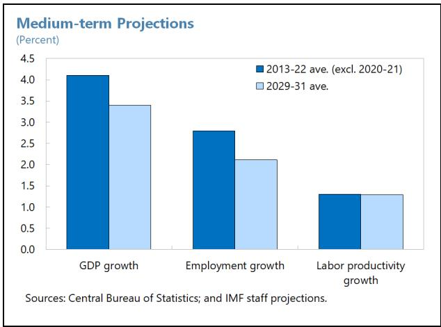

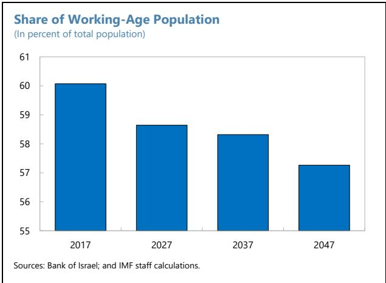

10. Downside risks predominate, though some upside potential remains. Depending on the duration and intensity of the war in the Middle East, broader regional geopolitical and global economic uncertainties pose significant risks to the Israeli economy. Staff's illustrative scenarios are as follows.

• Downside scenario. It assumes: (i) intensified hostilities directly involving Israel; and (ii) a severe

global recession triggered by a deeper and more prolonged disruptions in commodity markets, as the April 2026 World Economic Outlook illustrates (Box 1). Under this severe scenario, growth would decelerate to $2^{3/4}$ percent in 2026 and to $1^{1/2}$ percent in 2027, before recovering in 2028. Persistent high global energy prices would keep inflation elevated. Defense spending would rise to 9 percent of GDP; absent policy adjustment, the GG deficit would widen to $7^{1/2}$ percent of GDP in 2027 before declining thereafter. Public debt could rise by over 4 percentage

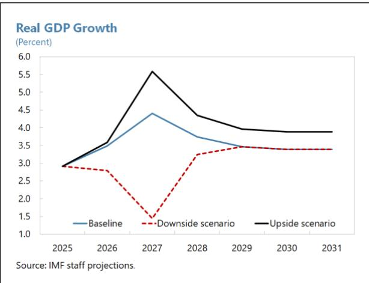

points of GDP, further eroding already diminished fiscal buffers.

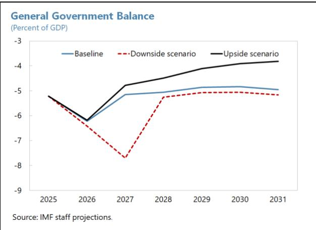

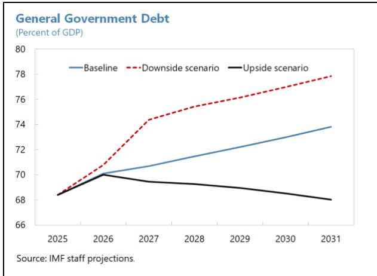

Contingent policy advice. Fiscal support should be strictly targeted to ensure that conflict-related relief outlays remain temporary. Non-defense spending should be reprioritized, new revenue measures introduced, and monetary policy tightened. Foreign exchange (FX) market functioning should be safeguarded through prudent reserve use, and financial sector risks should be closely monitored.

\- Upside scenario. Progress beyond the ceasefire toward a durable peace improves regional security and expands participation in the Abraham Accords, fostering new trade and investment links. Large-scale demobilization eases labor constraints, and stronger sentiment spurs investments and growth.

Contingent policy advice. Peace dividends should be reallocated toward growth-enhancing reforms, including higher infrastructure and education spending, alongside some fiscal consolidation. New revenue measures will still be needed to create fiscal space (see fiscal policy discussion below).

## Box 1. Energy Shocks

mitigate global energy shocks. The energy supply mix comprises natural gas (about 45 percent), petroleum (37 percent), and other sources (18 percent), including renewables (7 percent). Natural gas consumption is fully domestically supplied, with prices set under long-term pricing arrangements, while over 90 percent of petroleum and refined products are imported and priced at global rates.

## This energy mix implies that global energy price shocks primarily affect transport. Electricity

generation relies primarily on natural gas (about 70 percent), followed by renewables (16 percent) and

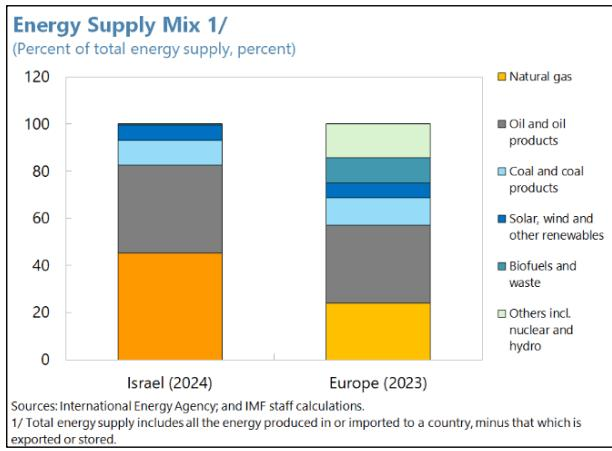

coal (14 percent); petroleum has largely been phased out. About 70 percent of petroleum consumption is used in transport. Due to global price shocks, gasoline prices increased by 12.5 percent in April month over month. $^{1}$

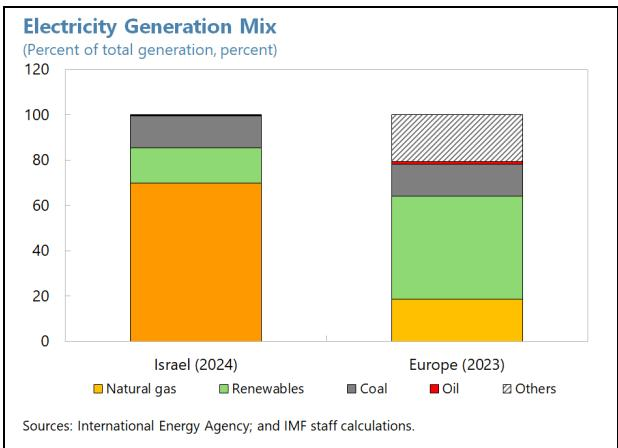

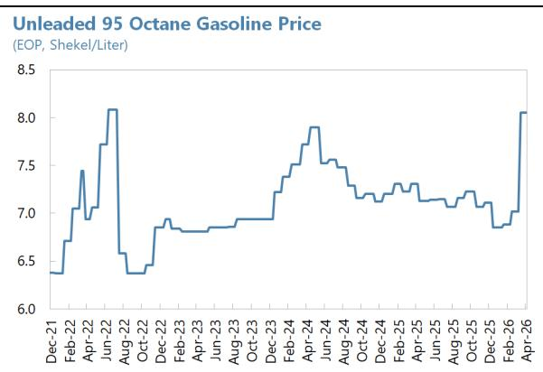  
Sources: Israeli Ministry of Energy; and Haver Analytics.

Deeper, more prolonged disruptions in energy markets could further weaken the outlook. In a severe scenario based on the April 2026 WEO, where energy supply dislocations extend into 2027, inflation expectations become markedly less anchored, and financial conditions tighten sharply, the growth rate in 2027 will be 0.8 percentage points lower than the baseline projection and inflation 2.0 percentage points higher, following an already weaker outlook in 2026.

<table><tr><td colspan="5">Box 1. Table 1. Projection Scenarios(In percent)</td></tr><tr><td rowspan="2"></td><td colspan="2">GDP growth rate</td><td colspan="2">Inflation (PA)</td></tr><tr><td>2026</td><td>2027</td><td>2026</td><td>2027</td></tr><tr><td>Baseline</td><td>3.5</td><td>4.4</td><td>2.3</td><td>2.1</td></tr><tr><td>Adverse scenario</td><td>3.2</td><td>4.3</td><td>2.8</td><td>1.7</td></tr><tr><td>Severe scenario</td><td>2.8</td><td>3.6</td><td>3.9</td><td>4.1</td></tr><tr><td>Memorandum item:Pre-war projections</td><td>4.8</td><td>3.8</td><td>1.8</td><td>2.0</td></tr><tr><td colspan="5">Source: IMF staff estimates and projections.Note: Please see April 2026 WEO for details on the assumptions for adverse and severe scenarios. These estimates isolate global energy shocks and are not directly comparable to the illustrative scenarios in the main text.</td></tr></table>

$^{1}$ The price of unleaded 95-octane gasoline is regulated, with a monthly price ceiling based on the average gasoline price in the Mediterranean/European market (measured over the five trading days prior to the last two working days of the month) and the exchange rate.

11. In addition, trade disruptions, and disorderly AI correction pose additional risks (Annex IV). Protectionism and trade tensions, including possible new tariffs on previously exempt sectors (e.g., semiconductors), and further trade diversion could weigh on growth and investment, and amplify inflation. As Israel is well-integrated into the AI supply chain, a disorderly AI correction could cause a decline in its exports and foreign direct investment, and lead to job and wealth losses via institutional investors' exposure to global equity markets. Domestically, political tensions could rise, raising uncertainty and risk premia, and weakening consumption and investment.

## POLICY DISCUSSIONS

The priority is to rebuild fiscal buffers by pursuing fiscal consolidation through growth-friendly revenue measures, while stepping up structural reforms to help potential growth regain momentum and support the fiscal adjustment. In the near term, a policy mix of gradual fiscal tightening and a moderately tight monetary policy stance remains appropriate under the baseline, where capacity constraints persist and inflation rises temporarily. Financial supervisors should remain vigilant in monitoring real estate risks. $^{4}$

## A. Restoring Fiscal Buffers Amid Persistently Higher Defense Spending

## 12. Fiscal deficits are set to widen again.

\- Pre-war budget. The draft 2026 Budget envisaged a CG deficit of 3.9 percent of GDP in 2026, down from 4.7 percent in 2025, mainly reflecting lower defense spending. Revenues were expected to decline (as a share of GDP) as one-off tax receipts from a major acquisition in the

high-tech industry (i.e., Google's acquisition of Wiz) and higher property and bank taxes were more than offset by middle-class income tax cuts and lower yields from some revenue measures introduced in the 2025 budget.

<table><tr><td colspan="9">Israel: Central Government Draft 2026 Budget(Percent of GDP)</td></tr><tr><td rowspan="3"></td><td colspan="2">2025</td><td colspan="6">2026</td></tr><tr><td rowspan="2" colspan="2">NIS bill. % GDP</td><td colspan="2">Draft Budget(pre-Middle East War)</td><td colspan="2">Budget</td><td colspan="2">Staff</td></tr><tr><td colspan="2">NIS bill. % GDP</td><td colspan="2">NIS bill. % GDP</td><td colspan="2">NIS bill. % GDP</td></tr><tr><td>Revenue and grants</td><td>551.9</td><td>26.1</td><td>571.5</td><td>25.4</td><td>587.0</td><td>26.1</td><td>580.2</td><td>25.8</td></tr><tr><td>Expenditure</td><td>650.5</td><td>30.8</td><td>659.3</td><td>29.3</td><td>698.2</td><td>31.1</td><td>698.2</td><td>31.1</td></tr><tr><td>Of which: Defense</td><td>165.5</td><td>7.8</td><td>138.5</td><td>6.1</td><td>169.9</td><td>7.6</td><td>169.9</td><td>7.6</td></tr><tr><td>Balance</td><td>-98.6</td><td>-4.7</td><td>-87.8</td><td>-3.9</td><td>-111.2</td><td>-4.9</td><td>-118.0</td><td>-5.3</td></tr><tr><td colspan="9">Memorandum items:Selected discretionary revenue measures</td></tr><tr><td>Wiz</td><td>...</td><td>...</td><td>10.0</td><td>0.4</td><td>10.0</td><td>0.4</td><td>10.0</td><td>0.4</td></tr><tr><td>General government net lending</td><td>-110.0</td><td>-5.2</td><td>...</td><td>...</td><td>...</td><td>...</td><td>-142.6</td><td>-6.3</td></tr><tr><td>Nominal GDP (authorities)</td><td>2,111</td><td></td><td>2,253</td><td></td><td>2,247</td><td></td><td>2,246</td><td></td></tr><tr><td>Nominal GDP (percentage change)</td><td></td><td></td><td>6.7</td><td></td><td>6.4</td><td></td><td>6.4</td><td></td></tr><tr><td colspan="9">Sources: Ministry of Finance and IMF staff calculations.</td></tr></table>

• Approved budget. The Knesset approved the budget on March 30,

setting the deficit at 4.9 percent of GDP, over 1 percentage point above the pre-war draft. Revenue projections were revised up on stronger-than-expected tax collection in Q1. However, expenditure increased more, driven by higher defense spending (about $1 \frac{1}{2}$ percentage points of GDP).

\- Staff baseline. Staff project a CG deficit of 5.3 percent of GDP as revenue overperformance in Q1 is unlikely to persist. Defense spending may exceed allocations, but could be accommodated within the overall envelope through contingency reserves. The authorities should aim to contain the deficit within the 4.9 percent of GDP ceiling by enforcing strict spending controls, reprioritizing non-priority spending, and introducing new revenue measures if needed. If downside risks to growth materialize, automatic stabilizers should operate to cushion the impact on the economy. In the event of heightened energy price pressures, fiscal support should remain temporary and targeted to vulnerable households, avoiding broad-based measures that are fiscally costly and weaken price signals.

## 13. Public debt remains high and is

projected to rise further. Prior to the October 2023 conflict, the authorities reduced public debt from over 70 percent of GDP in the late 2000s to 60 percent in 2022, creating space to respond forcefully to economic shocks without unduly undermining credibility. Heightened geopolitical tensions imply persistently elevated defense spending, while civil spending could come under increasing pressure. $^{5}$ Under the staff's baseline, the fiscal deficit narrows only modestly to around 4 percent in 2029 as defense spending remains elevated. Absent further adjustment, the public

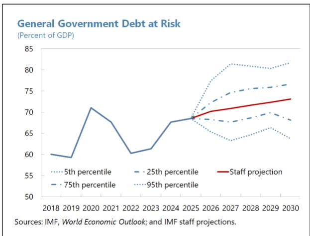

debt would continue to rise to 74 percent of GDP by 2031, with risks tilted upward. $^{6}$ The debt sustainability analysis indicates a moderate risk of sovereign stress (Annex VI).

14. Given elevated deficits and rising debt, a gradual and credible consolidation is needed to stabilize debt and rebuild buffers.
Staff recommend reducing the CG deficit to about 2.5 percent over the next three years. This will place debt on a firm downward trajectory over the medium term, to 65 percent by the mid-2030s and to 60 percent by 2040.
Adjustment should prioritize revenue measures, given already low social and infrastructure spending relative to OECD peers.

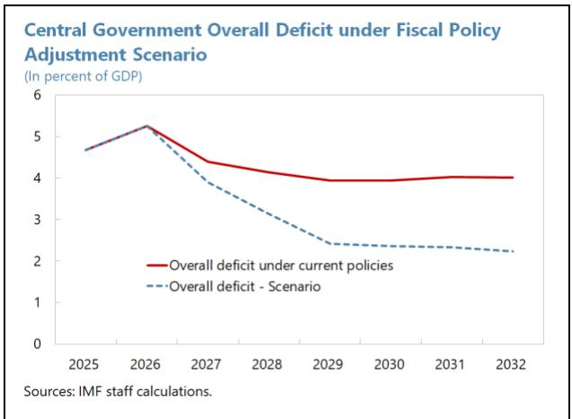

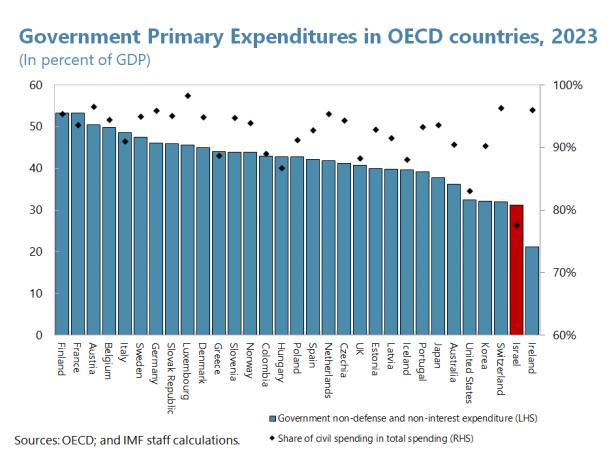

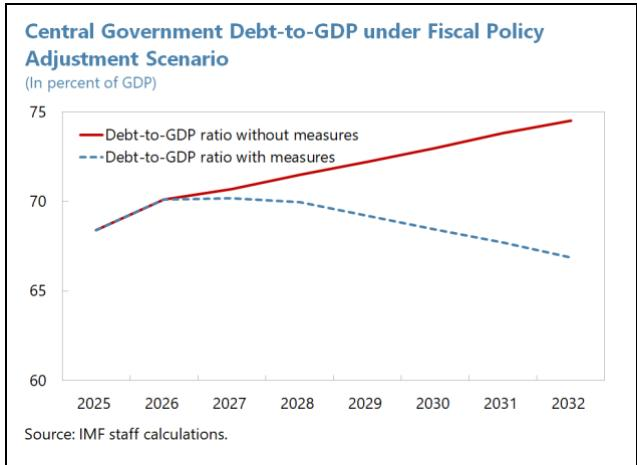

\- Revenue measures. Efficient options with limited growth impact include: (i) abolishing the lower income tax bracket (tax rate, 10 percent) and merging it with the second lowest tax bracket (tax rate, 14 percent); $^{7}$ (ii) rationalizing tax exemptions—for example, VAT exemptions on fruits, vegetables, and tourism services, preferential treatment of the advanced study fund (Keren Hishtalmut), and corporate income tax exemptions under the Encouragement of Capital Investments Law (ECIL); $^{8}$ (iii) expanding taxes on negative externalities—for example, taxes on single-use plastics, and sugar sweetened beverages; and (iv) increase VAT rates, which remain relatively low compared to other OECD countries.

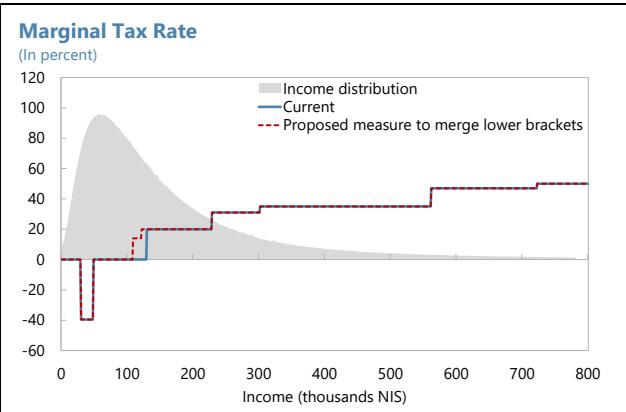  
Sources: World Inequality Database; IBFD; IMF staff calculations.

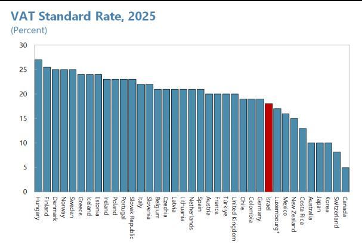  
Sources: OECD; and country authorities.

<table><tr><td colspan="2">Israel: Potential Revenue Measures (Percent of GDP)</td></tr><tr><td></td><td>Revenue yields</td></tr><tr><td>Align the lowest two personal income tax brackets at 14 percent</td><td>0.3</td></tr><tr><td>Close VAT exemption on tourism services</td><td>0.1</td></tr><tr><td>Close VAT exemption on fruits and vegetables</td><td>0.2</td></tr><tr><td>Rationalize preferential tax treatment of advanced study fund</td><td>0.3</td></tr><tr><td>Rationalize tax incentives in ECIL</td><td>0.3</td></tr><tr><td>Expand taxes on negative externalities</td><td>0.1</td></tr><tr><td>Increase VAT rates by 2 percentage points</td><td>0.8</td></tr><tr><td colspan="2">Source: IMF staff estimates.</td></tr></table>

\- Tax system reviews. The tax system is complex, with numerous incentives and differential sector- or region-specific treatments. A comprehensive review of the tax system, including tax expenditures, is needed to enhance simplicity, efficiency, and equity.

\- Expenditure measures. The authorities should consider: (i) launching a spending review to identify scope to rationalize current spending, including administrative expenditures and social benefit programs, and to reprioritize resources toward growth enhancing programs—such as education, active labor market policies, and policies to support integration of Haredi and Arab-Israeli populations in the labor market; and (ii) improving the efficiency of public investment, through strengthening the planning, allocation, and execution, possibly by leveraging the IMF Public Investment Management Assessment framework.

15. To support fiscal consolidation and effective policy implementation, a comprehensive review of fiscal institutions and practices could be warranted. Budget presentation can be improved by including the analyses of long-term fiscal sustainability and forecast reconciliations. Israel could also benefit from undertaking the IMF Fiscal Transparency Evaluation. Taking stock of

past experiences, the authorities are encouraged to review the effectiveness of the fiscal rules and explore options for independent fiscal oversight.

## B. Advancing the Longstanding Structural Reform Agenda

16. Accelerating structural reforms is urgent to boost labor supply and productivity, restore pre-conflict growth potential, and support fiscal consolidation. Elevated defense expenditures, higher public debt, and reduced labor supply weigh on medium-term growth prospects. These pressures compound structural weaknesses—notably low participation and skill gaps among Haredi and Arab-Israeli populations. Persistently higher defense spending risks crowding out growth-enhancing investment in human and physical capital, widening Israel’s GDP per capita gap with other advanced economies. Reform priorities include: (i) expanding labor supply and addressing skill mismatches; (ii) strengthening productivity through product market reforms and infrastructure investment; and (iii) preserving Israel’s competitive edges in high-tech and AI.

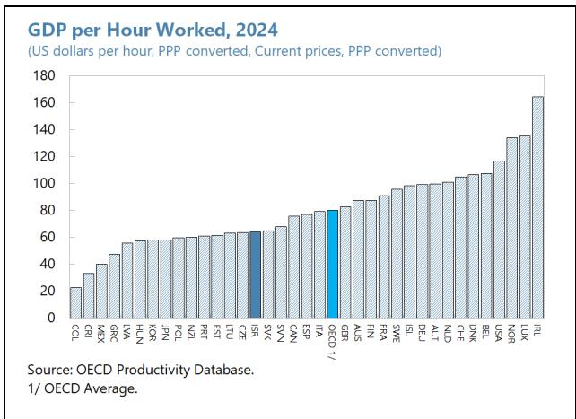

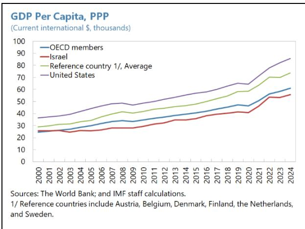

## Boosting Labor Supply and Addressing Skills Mismatches Among Particular Groups

17. Substantial gaps in labor participation and skills persist among Haredi and Arab-Israeli groups. Employment rates for Haredi men (around 55 percent) and Arab-Israeli women (45 percent) remain well below those of other groups and the government's 2030 targets (65 and 53 percent, respectively). $^{9}$ Education outcomes are weaker, reflecting curriculum gaps in Haredi schools and resource constraints and language barriers in Arab-Israeli communities. Generous fiscal support for Haredi men enrolled in yeshiva weakens incentives to enter the labor market. Moreover, perceptions of an unequal tax burden—where non-Haredi populations bear most taxes while Haredi groups benefit disproportionately from transfers—risk social tensions. The government's 2022-26 Economic Plan for Reducing Gaps in Arab Society ( $Taqadum$ ) has supported improvements, including higher female employment, better education outcomes, and improved infrastructure and local government capacity. For Haredi men, however, progress remains limited despite multiple initiatives.

## 18. Efforts to increase participation and close skill gaps should be intensified. For

Arab-Israelis, building on recent progress, a successor program should enhance proficiency in Hebrew and English, education, childcare, and infrastructure. For Haredi men, policies should focus on enforcing core curriculum (mathematics, science, and English), expanding vocational and technological training, and phasing out negative work incentives (e.g., generous subsidies for full-time yeshiva students).

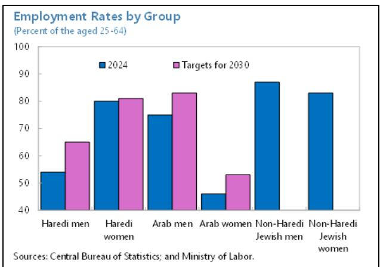

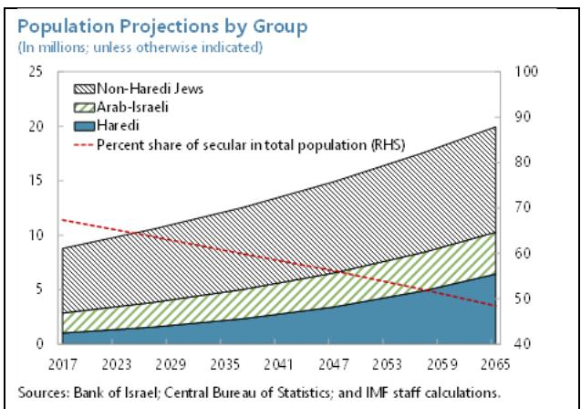

## Enhancing Productivity

## 19. Product market reforms should be deepened to strengthen competition and business

dynamism. Israel underperforms on several OECD product market indicators, suggesting scope to improve efficiency. The authorities have taken steps to enhance competition and facilitate trade, including aligning import procedures with EU standards. $^{10}$ Discussions with U.S. counterparts are underway to expand this approach to products manufactured in or for the United States. There is scope to further streamline regulatory requirements (e.g., company registration) and lower entry barriers to professional services (while maintaining quality).

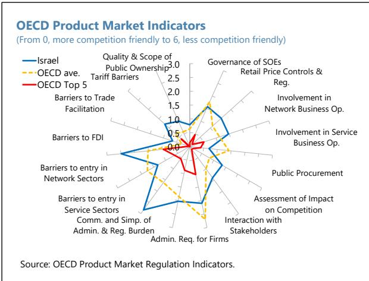

20. Infrastructure investment should be scaled up. The World Bank's Logistics Performance Index indicates that Israel's trade and transport infrastructure lags behind many advanced economies. Although infrastructure spending has increased in recent years,

infrastructure—particularly public transport—has not kept pace with population growth, posing risks to productivity. In June 2023, the government enacted the National Infrastructure Promotion Law to accelerate the planning, approval, and execution of large-scale national infrastructure projects. Further efforts are needed, including increasing fiscal resources, given Israel's relatively low level of government investment compared to other advanced economies. Moreover, given reliance on public-private partnerships, contingent liabilities require careful monitoring and management.

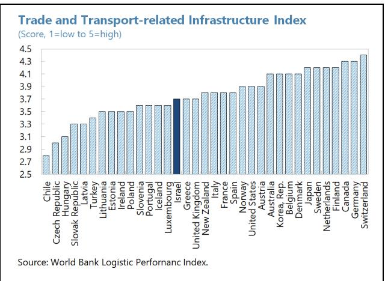

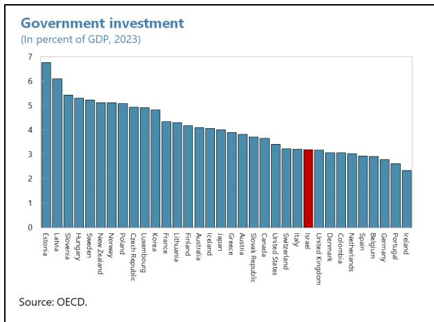  
Maintain a Competitive Edge in High-Tech and Enhance AI Adoption

21. Israel's high-tech sector remains a key strength and is well-positioned to expand AI development activities. Broader AI diffusion would offer significant productivity gains across traditional industries and the public sector. The IMF's AI Preparedness Index places Israel among well-positioned economies to harness these gains. However, rapid technological change could outpace the supply of skilled workers and data infrastructure, while gaps in the policy framework could undermine its ability to sustain global leadership. $^{11}$

22. Preserving Israel's competitive edge in high tech and AI will require continued investment in human capital and institutional capacity. $^{12}$ The establishment of a National AI Directorate within the Prime Minister's office in October 2025 has strengthened policy coordination, and the launch of a national AI supercomputer in January 2026 supports research and innovation. Further efforts are needed to expand STEM education, upgrade mathematics and science curricula, and introduce AI education at early stages of education. It is also important to narrow gaps in access to AI-related skills and opportunities among Haredi and Arab-Israeli groups, in line with the 2022 Perlmutter Committee's recommendations. At the same time, as AI adoption may lead to job displacement, a comprehensive lifelong learning strategy—encompassing reskilling, upskilling, and mid-career training—should support workers adapt and enhance labor mobility.

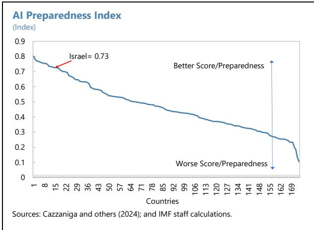

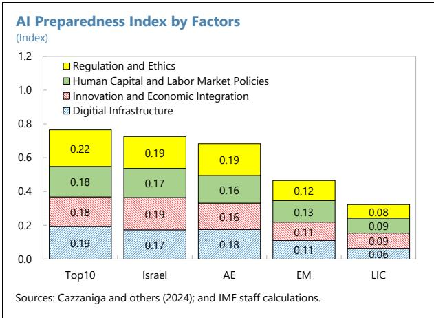

## C. Ensuring Price Stability

23. The monetary policy stance remains appropriate for maintaining price stability. Before the war, the BOI cut its policy rate by a cumulative 50 basis points in November 2025 and January 2026 to 4 percent, amid easing inflation pressures and reduced risk premia. Following the onset of the Middle East war, it signaled a pause in the easing cycle. On May 25, the BOI resumed easing, lowering the policy rate by 25 basis points to 3.75 percent, amid contained inflation expectations and shekel appreciation. Staff assess that the current stance remains moderately tight and supports price stability. $^{13}$

24. Staff recommend that the BOI maintain a moderately tight monetary policy. Under the baseline, inflation is expected to rise temporarily due to higher energy prices and supply constraints. Given substantial uncertainty, however, the BOI should remain attentive to evolving risks and continue to closely monitor war-related effects on labor supply, the pass-through of higher energy prices and exchange rate movements, and the impact of the latest rate cut on financial conditions and domestic demand. It should stand ready to adjust course if incoming data or the heightened risk environment indicate meaningful deviations from the baseline. Further rate cuts toward the neutral rate would be appropriate if inflation pressures moderate or disinflationary forces—such as oil price stabilization or sustained exchange rate appreciation—become more pronounced.

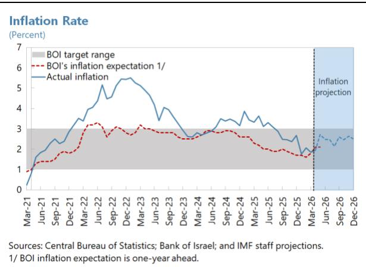

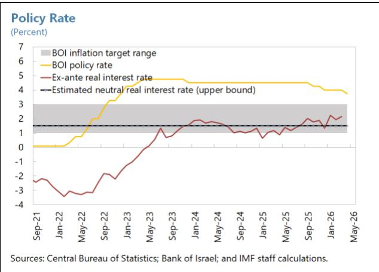

25. Market forces should continue to determine the FX rate, barring abrupt market disruptions. The BOI implemented its foreign exchange stabilization program in October 2023—involving up to US\$30 billion in FX sales and US\$15 billion in liquidity via swaps—aimed at ensuring market functioning. It was deployed during the initial stress period but has since remained largely unused—the last, small FX sales occurred in June 2025 during the Iran escalation.

## D. Safeguarding Financial Stability

26. Financial stability has been supported by prudent and proactive supervision and timely policy measures. Conservative supervisory guidance—particularly on dividend retention and loan-loss provisioning—has helped banks strengthen resilience, while tightly parametrized borrower-based measures contained excessive mortgage credit growth (Annex VII). Banks remain well-capitalized, liquid, and profitable.

27. The real estate sector presents a pocket of vulnerability. At the onset of the 2023 conflict, developers boosted demand through property presales with extended delivery periods and low upfront payments, while deferring the balance until delivery via bank-provided balloon loans (Annex VIII). House prices and transactions rebounded strongly after the dip in late 2023, peaking in late 2024-early 2025 (Annex VIII), while bank lending to real estate expanded, with exposures exceeding half of total credit by early 2025. To mitigate risks, the BOI introduced prudential measures in April 2025, capping contractor-subsidized balloon loans at 10 percent of housing loan issuance and imposing higher capital requirements on exposures to developers heavily engaged in risky presales. Since then, the housing market has begun to cool, marked by decelerating price growth and transactions, while new unit inventories for sale have increased.

## 28. The authorities should remain vigilant in monitoring risks in the financial sector, especially those emanating from real estate and the impact of the war.

\- Bank supervision. Supervisors should (i) ensure that lenders rigorously assess real estate sector exposures and update provisions accordingly; (ii) maintain robust prudential requirements, adjusting them (e.g., exposure limits for real estate) as risks evolve; and (iii) macroprudential

measures introduced in April 2025 should remain in place through end-2026 and may be extended if warranted.

\- Stress testing. The BOI is encouraged to develop liquidity stress testing frameworks. Separately, the bank-insurance stress tests, recently conducted jointly by the BOI and the Capital Market and Insurance Authority, are welcome. The authorities should regularly conduct such system-wide stress tests and broaden their scope to include liquidity risks.

\- Nonbank financial institutions (NBFIs). Close monitoring should continue as nonbank mortgage lending—though still small—continues to grow. The authorities should consider extending the borrower-based measures to NBFIs. Supervisors should also continue to closely monitor the NBFIs' growing exposure to foreign-currency derivatives and ensure that they maintain sufficient liquidity buffers.

\- Proposed mortgage subsidies. Staff caution against the government's proposal to subsidize existing mortgages as delinquencies remain low, and subsidies would weaken monetary transmission, entail fiscal costs, be regressive, and raise moral hazard concerns.

29. Work is underway to implement the Basel III capital structure. Staff call for careful calibration of capital buffers to (i) ensure that all material risks are adequately captured; (ii) maintain an appropriate balance between simplicity and risk sensitivity; and (iii) preserve the overall level of capital requirements. The authorities should also consider setting the neutral counter-cyclical capital buffer at a positive level, as it strengthens resilience in normal times and improves the usability of buffers in downturns.

30. The authorities should continue to progress in addressing outstanding 2012 FSAP recommendations (Annex IX). They have implemented numerous recommendations, especially in bank and insurance supervision, securities markets oversight and development. The recent legal amendments strengthening the BOI's resolution powers also address part of the recommendations and should proceed expeditiously. However, several recommendations regarding crisis management remain unaddressed, including the need for a clear escalation of powers, distinct legal triggers for enforcement, and early intervention tools.

31. The authorities' plan to introduce a tiered bank licensing framework based on proportionality could improve contestability. The planned framework—the legislation was approved by the Knesset in April 2026—aims to facilitate new entries by creating a three-tiered regime and by allowing a combination of banking and other financial services under a single holding company. However, risks may arise, especially from entrants with limited risk management capacity, potential regulatory arbitrage, or broader competition-stability trade-offs. Hence, efforts to enhance bank competition through new entries should proceed cautiously, with due regard to financial stability. In any event, robust regulatory and supervisory standards must be maintained, and all deposit-taking institutions should remain under BOI supervision.

## E. Strengthening Financial Integrity

32. Further strengthening of the Anti-Money Laundering/Countering the Financing of Terrorism (AML/CFT) framework is important. The authorities are making progress in several reforms, including legislative changes for the real estate sector and measures to strengthen the beneficial ownership regime for legal persons. These reforms are now before the Knesset. The update of the National Risk Assessment should be finalized by the end of the year. The authorities should further enhance the risk-based approach, apply dissuasive sanctions for non-compliance with AML/CFT preventive measures, complete the legislative reform regarding confiscation, and ensure that beneficial ownership information in relevant registries is adequate, accurate, and up to date.

## AUTHORITIES' VIEWS

33. The authorities emphasized that, despite the significant shocks from the war in the Middle East, Israel's economy has remained resilient and adaptable. They noted intensified geopolitical uncertainty, weighing on the economy through labor shortages, supply chain disruptions, and higher energy prices. Growth forecasts have been revised down from around 5.2 percent (pre-war) to 3.3-3.8 percent in 2026, depending on the duration of the conflict, followed by a rebound to 5.3-6.1 percent in 2027. Risks are broadly balanced. Geopolitical developments remain the key source of uncertainty; renewed hostilities pose downside risks, while diplomatic progress, including expansion of the Abraham Accords, could provide upside. In its latest projections, the BOI expects inflation to rise slightly above 2 percent by Q1 2027, while noting elevated uncertainty, and a shekel appreciation, if sustained, would be a factor exerting a downward pressure on inflation in 2026.

34. The authorities recognize significant medium-term economic challenges. The conflicts have generated a sizable real-economy shock, leaving output below its pre-conflict trend. Persistently low and uneven labor force participation and skill gaps—especially among Haredi men and Arab-Israelis—weigh on potential growth and productivity. Demographic trends imply these pressures will intensify absent reforms to close skill gaps and better align participation incentives. While the high-tech sector remains at the global frontier, economy-wide labor productivity lags OECD peers, particularly in non-tradable services. Infrastructure gaps further constrain medium-term growth prospects.

35. The authorities are committed to structural reforms. Past initiatives in Arab-Israeli communities have yielded tangible gains, including higher female participation, improved educational outcomes, and better infrastructure. By contrast, progress in integrating Haredi men into the workforce remains limited, reflecting, inter alia, the absence of broad political consensus. The government continues to pursue product-market reforms to strengthen competition and facilitate trade, while recognizing the need for further regulatory streamlining and infrastructure investment. The authorities remain confident in preserving Israel's high-tech leadership, including in AI, while acknowledging risks of labor displacement and gaps in active labor market policies amid fiscal constraints.

36. The Ministry of Finance (MOF) reaffirmed its commitment to fiscal discipline. Due to elevated defense spending and conflict-driven fiscal pressures, public debt is set to rise, though it remains below the OECD average. Fiscal deficits will stay high, primarily due to defense spending. The authorities aim to restrain the deficit to no more than 4.9 percent of GDP in 2026, with some medium-term improvement contingent on moderating defense spending. They agreed on the need to reduce the debt ratio to rebuild fiscal space but recognized the challenge of balancing fiscal sustainability with higher defense needs and implications for the tax burden. In this context, the authorities agreed that revenue measures provide greater scope for consolidation, supported by a comprehensive review of the tax system. They also see merit in reviewing discretionary expenditure and in safeguarding fiscal institutions (e.g., fiscal rules), while noting challenges in a fragmented political environment.

37. The Bank of Israel stressed that the moderately tight stance has supported the return of inflation to the target range and helped maintain price stability. The latest decision in May 2026—to cut the policy rate to 3.75 percent—reflects that inflation remains around 2 percent, alongside a significant appreciation of the shekel. However, geopolitical uncertainty remains elevated, with an increase in the global inflation environment driven by rising energy prices. The domestic labor market was significantly affected by the military operation, and labor supply constraints remains substantial. The interest rate path will be determined in accordance with the development of inflation, economic activity, geopolitical uncertainty, and fiscal developments.

38. The authorities assess the financial system as sound. Banks remain profitable and well capitalized, with non-performing loans at historical lows; however, the MOF raised concerns about insufficient competition within the banking sector. Risks are concentrated in real estate, including an increased share of higher risk mortgages. The authorities noted that macroprudential measures introduced in April 2025 remain in place through end-2026 and may be extended if warranted. They also see the merit of developing a bank liquidity stress testing framework and regularizing joint stress tests for banks and insurance companies, with a view to broadening it to include liquidity risks. The transition to Basel III will proceed with maintaining current capital requirements. Close monitoring of nonbank mortgage lending continues and should be enhanced as this sector grows; however, the MOF viewed extending borrower-based measures to NBFIs as premature because the non-banking private credit market is not yet sufficiently developed. The authorities noted that the ongoing legal reform to strengthen the BOI's resolution power addresses part of the IMF's 2012 FSAP recommendations.

39. The authorities are committed to promoting banking competition without compromising financial stability or supervisory integrity. The planned tiered bank licensing framework will be guided by the proportionality principle. The MOF noted that excess-profit taxes on banks in the 2026 budget are intended to bolster state revenues while addressing distributional concerns, by targeting windfall profits driven by external macroeconomic conditions rather than operational efficiency. However, the BOI cautions that such measures may be counterproductive to competition objectives.

40. The authorities reiterated their commitment to strengthening the AML/CFT framework. Several key legislative proposals are before the Knesset, and the national risk assessment update is expected to be finalized by end-2026.

## STAFF APPRAISAL

41. Israel's economy has demonstrated resilience, but the elevated regional tensions are casting a shadow on the outlook. Under staff's baseline, which assumes the sustained ceasefire in the Middle East, growth is projected at 3.5 percent in 2026, down from the 4.8 percent pre-war projection, and to rise to 4.4 percent in 2027, as the direct impact of the war fades. Headline inflation is expected to rise temporarily due to higher energy prices in the near term, while core inflation and inflation expectations remain around the midpoint of the target band. A possible resumption of regional conflicts remains the key downside risk to the growth outlook and upside risks to inflation. The external sector position in 2025 is assessed to be broadly in line with the level implied by fundamentals and desirable policies.

42. The legacy of successive conflicts is substantial, with output significantly below its pre-conflict trend. Persistent regional geopolitical uncertainty is expected to keep defense spending elevated and continue to constrain labor supply due to increased military mobilization and reduced availability of non-Israeli workers. These pressures interact with longstanding structural impediments, including uneven labor participation and skills across population groups, and less favorable demographic trends, implying that growth is likely to remain below pre-conflict levels over the medium term.

43. Fiscal consolidation should steadily continue to rebuild buffers. Fiscal deficits are expected to widen again in 2026 due to heightened geopolitical tensions, and public debt will continue to rise. Accordingly, beyond 2027, additional measures will be required to reduce the central government deficit to around 2.5 percent of GDP over the next three years. This would place public debt on a firm downward trajectory. Fiscal adjustment should prioritize revenue measures, given already-low level of civil spending relative to OECD peers. A comprehensive review of the tax system, including tax expenditures, is needed to enhance simplicity, efficiency, and equity. Efforts to rationalize recurrent spending and improve the efficiency of public investment remain important.

44. Structural reforms should be intensified to lift medium-term potential growth and support fiscal consolidation. Despite recent progress, substantial gaps in labor force participation and skills, especially among Haredi and Arab-Israeli groups, remain. As these populations are growing faster than the other groups, such disparities are likely to increasingly weigh on productivity, underscoring the need for decisive action. Recent reforms in aligning import procedures with EU standards are welcome, and further advancing product market reforms and keeping infrastructure investment in line with population growth are crucial to enhancing productivity. Israel's high-tech sector, including AI, is among the global leaders, and it is well-positioned to benefit from AI adoption. Maintaining this competitive edge requires continued efforts to ensure a sufficient labor supply with the right skills amid evolving industry needs. At the same time, in anticipation of adjustment costs associated with technological change, the authorities are encouraged to strengthen active labor market policies, including a lifelong learning strategy, that facilitate reskilling and labor mobility.

45. A moderately tight monetary policy stance has appropriately helped maintain price stability. With inflation expected to rise due to higher energy prices and supply shocks, the BOI should maintain a moderately tight monetary policy stance under the baseline and stand ready to adjust course if incoming data or the heightened risk environment indicate meaningful deviations from the baseline.

46. Systemic risks in the financial sector are contained; however, the authorities should remain vigilant. Banks are well-capitalized, liquid, and profitable, with low nonperforming loan ratios. However, banks' sizable exposure to real estate poses risk, especially as the ongoing housing market adjustment could be amplified by renewed regional conflict. The authorities should continue prudent and proactive supervision and close monitoring of financial sector risks, especially banks' real estate exposures. They should regularly conduct system-wide stress tests, broaden their scope to include liquidity risks, and consider extending borrower-based measures to nonbank financial institutions. Ongoing work to implement Basel III is welcome, but overall capital requirements should be preserved. The legal reform strengthening the BOI's resolution powers is important and should proceed expeditiously, although additional steps are needed to strengthen the crisis management framework. Efforts to enhance bank competition through new entries should proceed cautiously, with due regard to financial stability.

47. Strengthening of the AML/CFT framework should continue. The update of the National Risk Assessment should be finalized by year-end. The authorities should further enhance the risk-based approach, apply dissuasive sanctions for non-compliance with AML/CFT preventive measures, complete the legislative reform regarding confiscation, and ensure that beneficial ownership information in relevant registries is adequate, accurate, and up to date.

48. It is recommended that the next Article IV consultation with Israel be held in the standard 12-month cycle.

Sources: Central Bureau of Statistics; and IMF staff calculations.

## Figure 1. Israel: Recent Economic Developments

Output growth in Israel picked up in 2025.

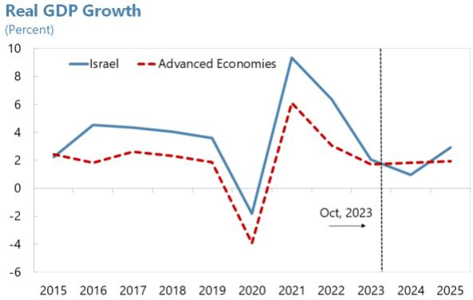  
Sources: Central Bureau of Statistics; IMF, World Economic Outlook; and IMF staff calculations.  
Credit card indicators suggest a contraction in consumption in March, followed by a more recent rebound.

However, output contracted in Q1 2026 due to the war in the Middle East.

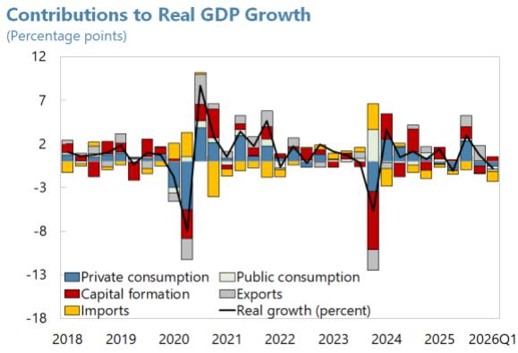  
Sources: Central Bureau of Statistics; and IMF staff calculations.  
Credit Card Purchases by Private Consumers (2002=100, seasonally adjusted)

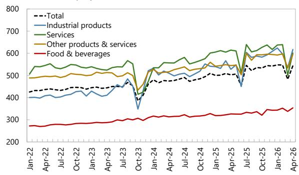  
Sources: Central Bureau of Statistics; and IMF staff calculations.  
Consumer confidence weakened following the war in the Middle East...  
Consumer Confidence Indicator
(Percent, balance)

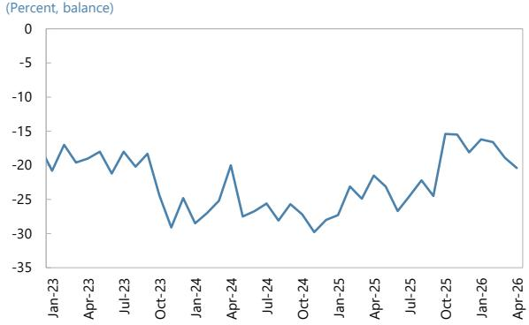  
Sources: Central Bureau of Statistics; and IMF staff calculations.  
..and so did business confidence.

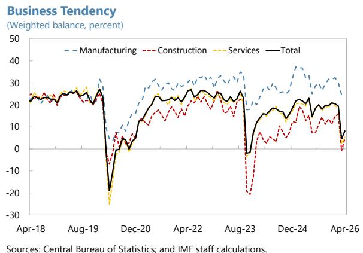  
Investment in buildings and construction remains below pre-conflict levels.

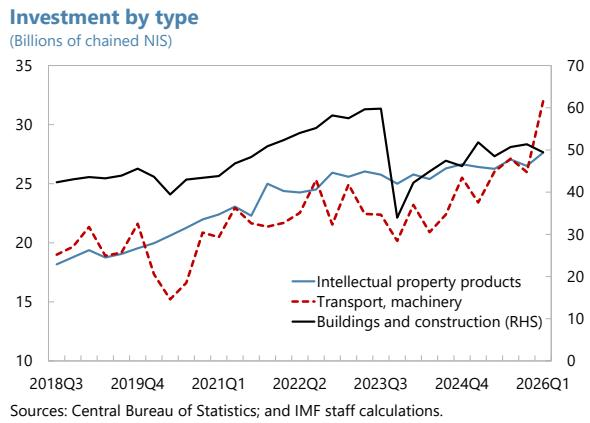

Unemployment (Percent)

## Figure 2. Israel: Labor Market Developments

Unemployment fell to historically low levels due to a conflict-related labor shortage.  
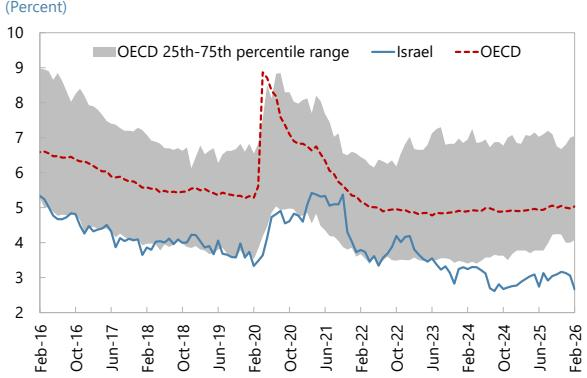  
Sources: OECD; and IMF staff calculations.  
...while labor force participation remains below pre-pandemic levels.  
Employment rates have decreased in part reflecting increased mobilization of reservists....

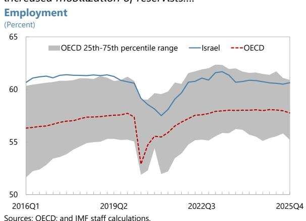  
Sources: OECD; and IMF staff calculations.  
Employment growth has been uneven across sectors.

Labor Force Participation  
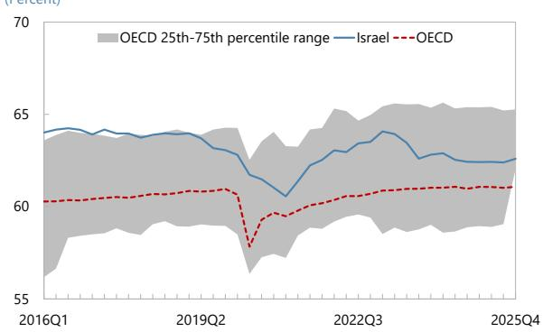  
Sources: OECD; and IMF staff calculations.  
Israeli Employment by Industries
(Seasonally adjusted, yoy growth, percent)

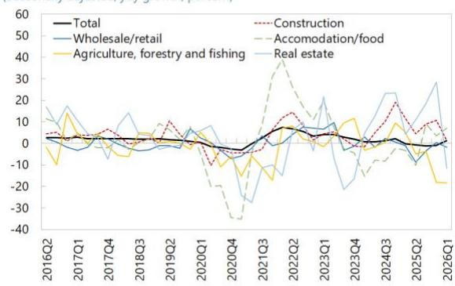  
Sources: Haver Analytics; and IMF staff calculations.  
Wage and unemployment-vacancy indicators point to a tight labor market...  
Wages and Labor Market (In percent, unless otherwise stated)

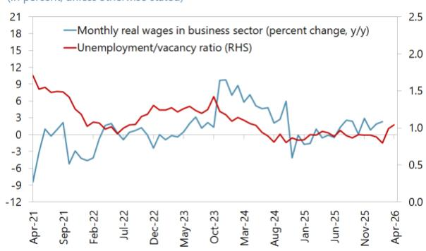  
Sources: Bank of Israel; Haver Analytics; and IMF staff calculations.  
...with job vacancies uneven across sectors.  
Job Vacancies by Industry (Index, 2019=100)

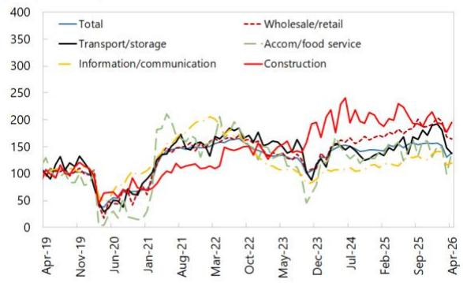  
Sources: Haver Analytics; and IMF staff calculations.

Imported Goods Prices

## Figure 3. Israel: Monetary Developments

Inflation breached the target upper band in 2024 but has come within the target range since August 2025...

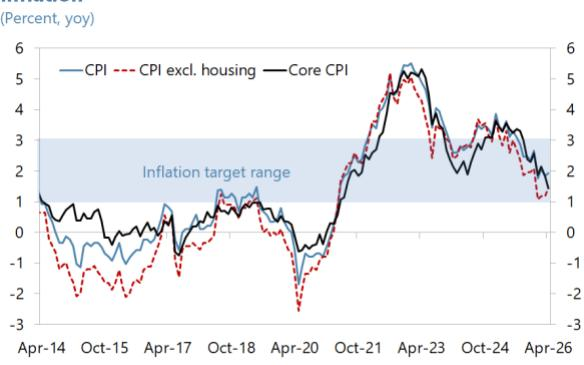  
Sources: Bank of Israel; Haver Analytics; and IMF staff calculations.  
...owing to a strong shekel.

...with prices of tradable moderating more rapidly...

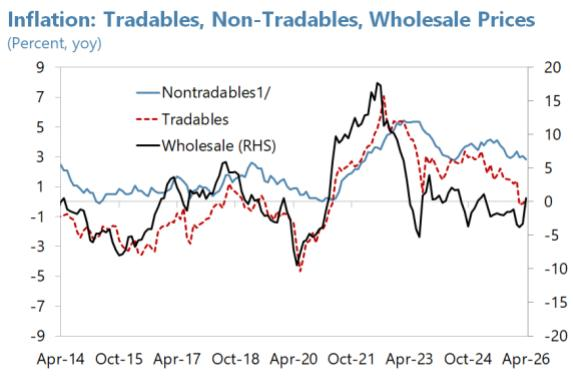  
Sources: Bank of Israel; Haver Analytics; and IMF staff calculations. 1/ Excluding fruit and vegetables, and estimated impact of government measures.

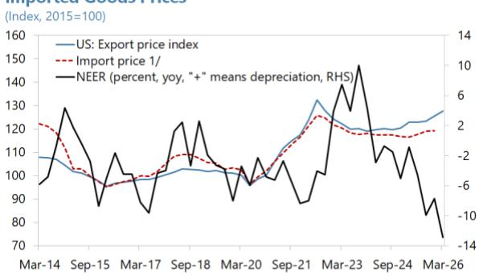  
Inflation expectations remain at around 2 percent.  
Sources: Bank of Israel; Bureau of Labor Statistics; Haver Analytics; and IMF staff calculations.  
1/ Excluding ships, aircrafts, and diamonds.  
Inflation Expectations

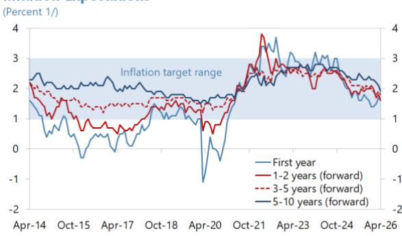  
Sources: Bank of Israel; Haver Analytics; and IMF staff calculations. 1/ Inflation expectations from capital markets.  
Financial conditions eased through 2025 and into Q1 2026.

The BOI cut the policy rate in May 2026 after cutting it in November 2025 and January 2026.

Policy Interest Rate (Percent 1/)

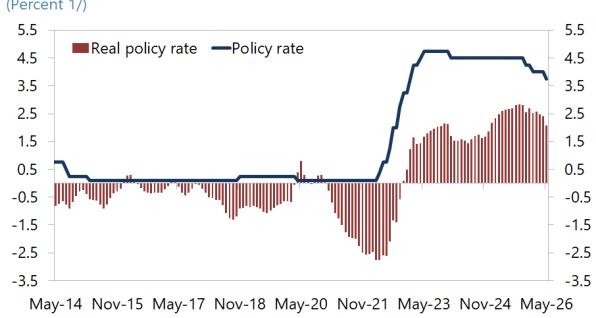  
Sources: Haver Analytics; Bank of Israel; IMF Staff calculations.
1/ Real policy rate is calculated as the difference b/w the nominal policy rate and the 3-month moving avg. of 1-year ahead inflation expectations from markets.  
Israel: FCI level
(Contribution to unscaled FCI)

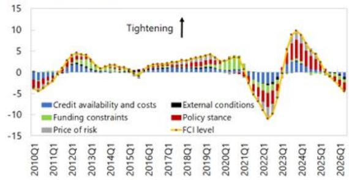  
Source: Borraccia et al., 2023, IMF Working Paper 23/209.
Note: For implementing Partial Least Square, we divide the sample into distinct time periods, each with its regression. The indices are then chained together. It's essential to note that the absolute FCI levels may not be entirely comparable to the early 2000s, given variations in available financial indicators. The final index chain covers most of the 2015-2025 period. 2026Q1 and 2026Q2 are forecasts.

Stock prices have recently outperformed the global equity market.

The shekel appreciated after the October 2023 depreciation.

## Figure 4. Israel: Selected Financial Indicators

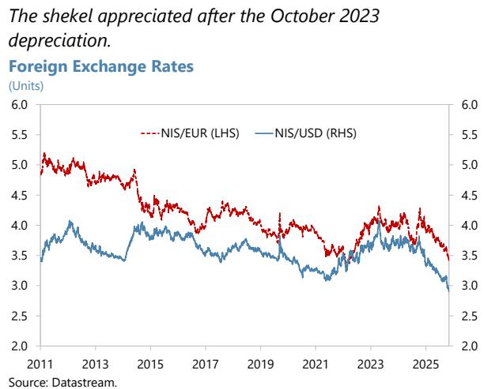  
Bond yields remain stable.

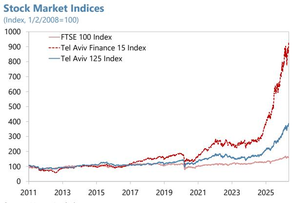  
Source: Haver Analytics.  
10-Year Government Bond Yields  
Sovereign 5-year CDS spread has recovered close to pre-2023 conflict levels after the de-escalation.

Bank's One-Year Expected Default Frequency (Percent)  
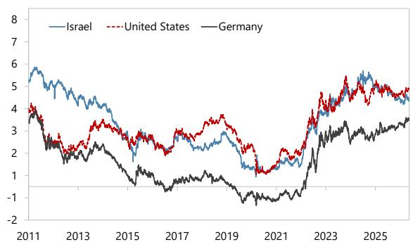  
Source: Haver Analytics.

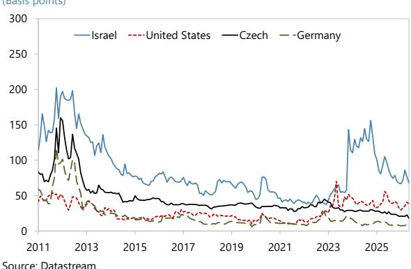  
Source: Datastream.  
The yield curve has shifted down since the October 2023 conflict, and remains relatively steep. Israel Government Bond Yield Curve (Percent)

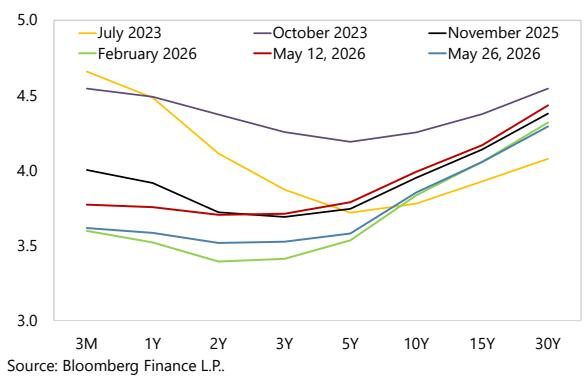  
Banks' expected default frequencies remain low.

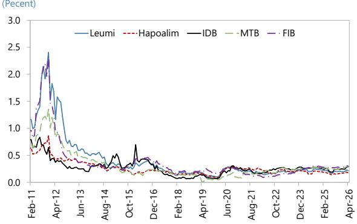  
Source: Moody's Analytics, CreditEdge.

...with NPLs falling to their lowest levels in a decade...

Profitability

## Figure 5. Israel: Performance of the Banking System

Capital and leverage ratios remain stable at around 11 percent and 7 percent, respectively...
Capital and Leverage Ratios
(In percent)

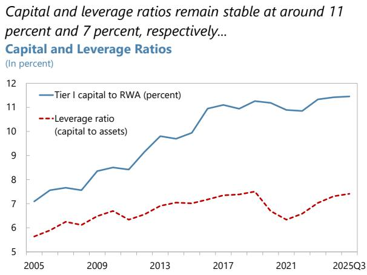  
Sources: Haver Analytics; IMF, Financial Soundness Indicator Database; and IMF staff calculations.  
...supporting bank profitability.  
Non-performing loans (End-period, in percent)

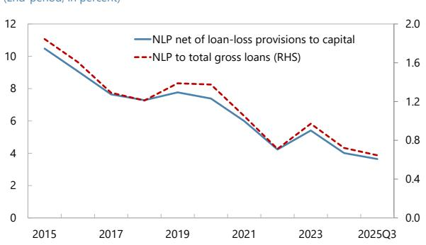  
Sources: Haver Analytics; IMF, Financial Soundness Indicator Database; and IMF staff calculations.  
Tier 1 capital to total assets ratio is around the peer-group median.

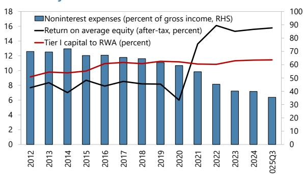  
Sources: Haver Analytics; IMF, Financial Soundness Indicator Database; and IMF staff calculations.  
Tier 1 Capital to Total Assets Ratio (In percent, 2024Q4 or the latest)

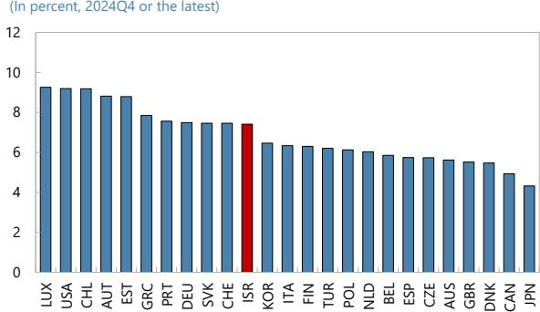  
Sources: Haver Analytics; IMF, Financial Soundness Indicator Database; and IMF staff calculations.  
Bank lending to the private sector has recovered.

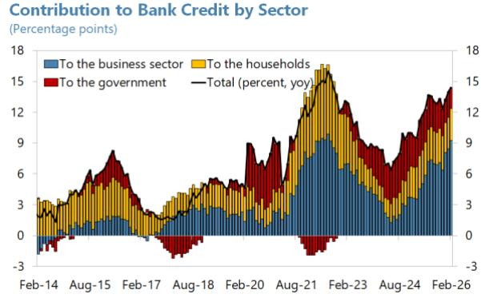  
Sources: Haver Analytics; IMF, Financial Soundness Indicator Database; and IMF staff calculations.  
Banks' non-interbank loans are fully covered by customer deposits.  
Customer Deposits to Non-Interbank Loans (Percent)

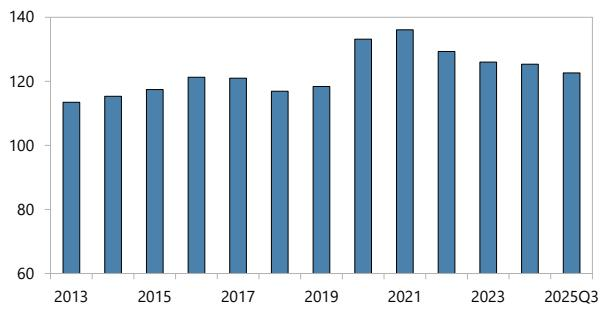  
Sources: Haver Analytics; IMF, Financial Soundness Indicator Database; and IMF staff calculations.

The real effective exchange rate has steadily appreciated since mid-2024.

## Figure 6. Israel: External Sector Developments

Real Effective Exchange Rate (Index, 2010=100)

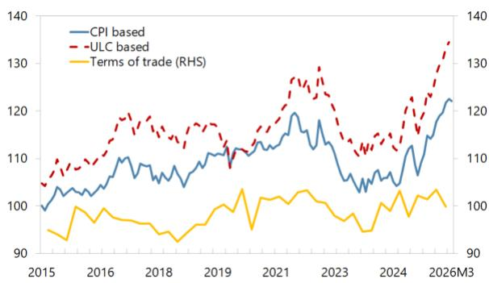  
Sources: Haver Analytics; and IMF staff calculations.  
The share of services exports in world exports increased in 2025, while that of good exports continued to decline.  
The current account surplus narrowed in 2025.  
Current Account Components
(4-quarter rolling sum, balance as percent of GDP)

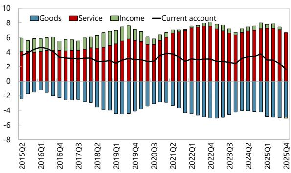  
Sources: Haver Analytics; and IMF staff calculations.  
Israel's Share of World Exports (In percent)  
High-tech industries remain the main driver of service exports, while tourism has yet to recover.

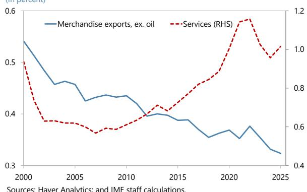  
Sources: Haver Analytics; and IMF staff calculations.  
Export of Services (In percent of GDP)

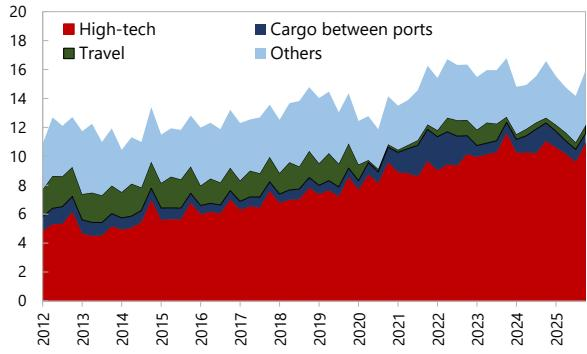  
Sources: Haver Analytics; and IMF staff calculations.  
Resident portfolio investment accounts for a large share of foreign accounts.  
Financial Account Components (Billions US\$; 4-quarter rolling sum)

  
Sources: Haver Analytics; and IMF staff calculations.  
The net international investment position remains positive at around 40 percent of GDP.  
Financial Account Components (Billions US\$; 4-quarter rolling sum)

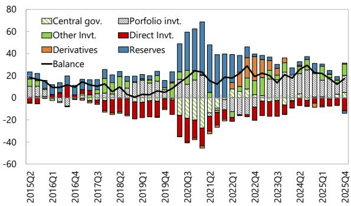  
Sources: Haver Analytics; and IMF staff calculations.

Budgetary Central Government Taxes

Sources: Ministry of Finance; and IMF staff estimates.

## Figure 7. Israel: Fiscal Developments

Government revenues have rebounded following the decline at the onset of the conflict in October 2023...
Budgetary Central Government Revenues  
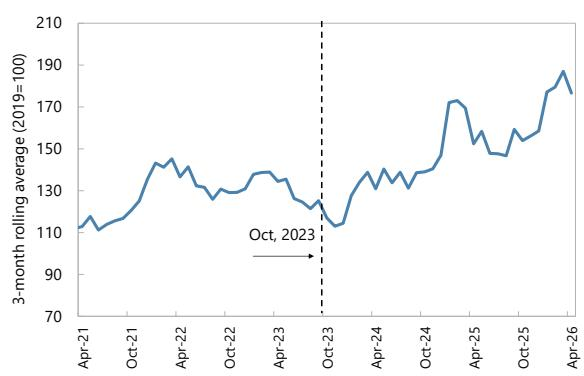  
Sources: Ministry of Finance; and IMF staff calculations.  
Government expenditure has remained elevated...  
...with increases in both direct and indirect taxes.

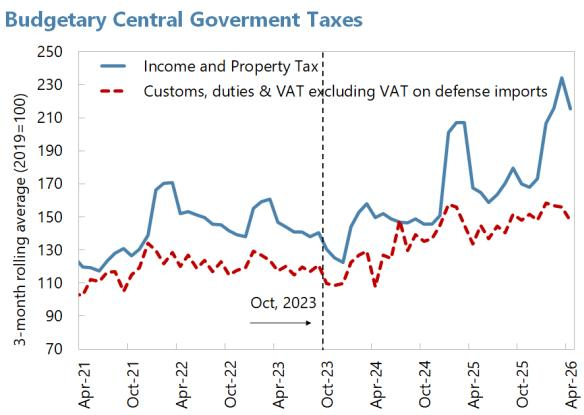  
Sources: Ministry of Finance; and IMF staff calculations.  
Budgetary Central Government Expenditures

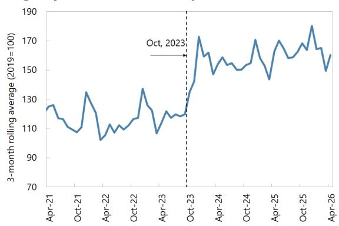  
...reflecting a sharp increase in defense spending.  
Sources: Ministry of Finance; and IMF staff calculations.  
Central Government Defense Spending (In percent of GDP)

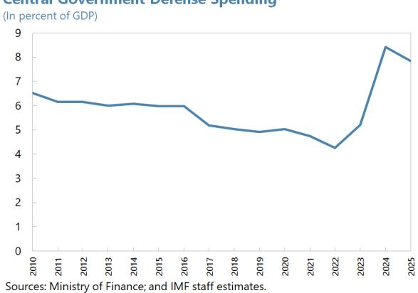  
Public debt has risen...

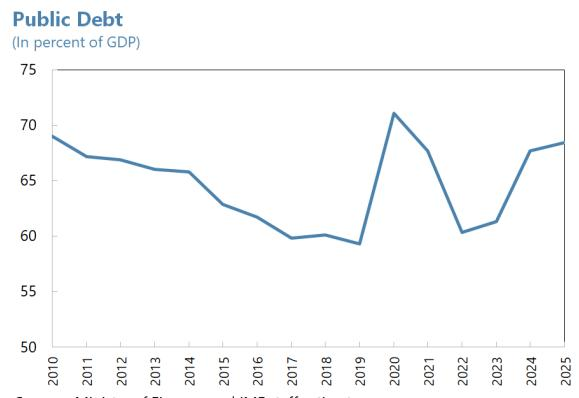  
Sources: Ministry of Finance; and IMF staff estimates.  
...alongside higher interest expense.

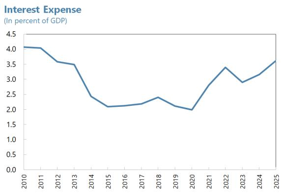  
Sources: Ministry of Finance; and IMF staff estimates.

Table 1. Israel: Selected Economic Indicators, 2022–31

<table><tr><td rowspan="2"></td><td rowspan="2">2022</td><td rowspan="2">2023</td><td rowspan="2">2024</td><td rowspan="2">2025</td><td>2026</td><td>2027</td><td>2028</td><td>2029</td><td>2030</td><td>2031</td></tr><tr><td colspan="6">Projections</td></tr><tr><td colspan="11">Real Economy (percent change)</td></tr><tr><td>Real GDP</td><td>6.4</td><td>2.1</td><td>1.0</td><td>2.9</td><td>3.5</td><td>4.4</td><td>3.7</td><td>3.5</td><td>3.4</td><td>3.4</td></tr><tr><td>Domestic demand</td><td>6.9</td><td>0.3</td><td>2.3</td><td>3.5</td><td>4.1</td><td>4.2</td><td>3.8</td><td>3.5</td><td>3.4</td><td>3.4</td></tr><tr><td>Private consumption</td><td>7.3</td><td>-0.6</td><td>3.9</td><td>2.7</td><td>2.7</td><td>4.7</td><td>4.1</td><td>3.7</td><td>3.7</td><td>3.6</td></tr><tr><td>Public consumption</td><td>0.3</td><td>8.1</td><td>11.8</td><td>1.7</td><td>4.5</td><td>-0.3</td><td>3.0</td><td>3.0</td><td>3.0</td><td>3.0</td></tr><tr><td>Gross capital formation</td><td>11.8</td><td>-4.2</td><td>-8.9</td><td>7.4</td><td>6.5</td><td>7.5</td><td>4.1</td><td>3.6</td><td>3.4</td><td>3.4</td></tr><tr><td>Gross fixed investment</td><td>11.1</td><td>-2.1</td><td>-5.5</td><td>8.3</td><td>7.8</td><td>7.5</td><td>3.8</td><td>3.3</td><td>3.3</td><td>3.3</td></tr><tr><td>Foreign demand (contribution to growth)</td><td>-0.4</td><td>1.7</td><td>-1.2</td><td>-0.5</td><td>-0.5</td><td>0.3</td><td>0.0</td><td>0.0</td><td>0.0</td><td>0.0</td></tr><tr><td>Potential GDP</td><td>3.9</td><td>3.3</td><td>2.3</td><td>3.1</td><td>3.1</td><td>4.4</td><td>3.8</td><td>3.6</td><td>3.5</td><td>3.4</td></tr><tr><td>Output gap (percent of potential)</td><td>2.5</td><td>1.3</td><td>0.0</td><td>-0.2</td><td>0.2</td><td>0.2</td><td>0.1</td><td>0.0</td><td>-0.1</td><td>0.0</td></tr><tr><td>Unemployment rate (percent)</td><td>3.8</td><td>3.4</td><td>3.0</td><td>3.0</td><td>3.0</td><td>3.1</td><td>3.3</td><td>3.5</td><td>3.6</td><td>3.6</td></tr><tr><td>Overall CPI (percent change, average)</td><td>4.4</td><td>4.2</td><td>3.1</td><td>3.0</td><td>2.3</td><td>2.1</td><td>2.0</td><td>2.0</td><td>2.0</td><td>2.0</td></tr><tr><td>Overall CPI (percent change, end of period)</td><td>5.3</td><td>3.0</td><td>3.2</td><td>2.6</td><td>2.5</td><td>1.9</td><td>2.0</td><td>2.0</td><td>2.0</td><td>2.0</td></tr><tr><td>Core CPI (percent change, average)</td><td>3.9</td><td>4.1</td><td>2.5</td><td>3.1</td><td>2.1</td><td>2.0</td><td>1.9</td><td>1.9</td><td>1.9</td><td>1.9</td></tr><tr><td colspan="11">Saving and investment balance</td></tr><tr><td>Gross national saving (percent of GDP)</td><td>30.4</td><td>29.5</td><td>26.7</td><td>25.8</td><td>26.2</td><td>27.4</td><td>27.6</td><td>27.7</td><td>27.9</td><td>28.0</td></tr><tr><td>Foreign saving (percent of GDP)</td><td>-2.7</td><td>-3.1</td><td>-2.9</td><td>-1.5</td><td>-1.3</td><td>-1.8</td><td>-1.9</td><td>-2.1</td><td>-2.3</td><td>-2.3</td></tr><tr><td>Gross capital formation (percent of GDP)</td><td>27.6</td><td>26.4</td><td>23.8</td><td>24.3</td><td>24.8</td><td>25.5</td><td>25.7</td><td>25.7</td><td>25.7</td><td>25.7</td></tr><tr><td colspan="11">Public Finance (percent of GDP)</td></tr><tr><td colspan="11">Central government</td></tr><tr><td>Revenues and grants</td><td>26.6</td><td>23.3</td><td>24.2</td><td>26.1</td><td>25.8</td><td>25.2</td><td>24.6</td><td>24.5</td><td>24.5</td><td>24.4</td></tr><tr><td>Total expenditure</td><td>26.0</td><td>27.4</td><td>31.0</td><td>30.8</td><td>31.1</td><td>29.6</td><td>28.7</td><td>28.5</td><td>28.4</td><td>28.4</td></tr><tr><td>Overall balance</td><td>0.6</td><td>-4.1</td><td>-6.8</td><td>-4.7</td><td>-5.3</td><td>-4.4</td><td>-4.1</td><td>-3.9</td><td>-3.9</td><td>-4.0</td></tr><tr><td>Structural balance 1/</td><td>-0.1</td><td>-4.5</td><td>-6.8</td><td>-4.6</td><td>-5.3</td><td>-4.5</td><td>-4.2</td><td>-3.9</td><td>-3.9</td><td>-4.0</td></tr><tr><td>Interest payments</td><td>1.9</td><td>1.9</td><td>2.1</td><td>2.3</td><td>2.4</td><td>2.4</td><td>2.5</td><td>2.5</td><td>2.6</td><td>2.6</td></tr><tr><td colspan="11">General Government</td></tr><tr><td>Overall balance</td><td>0.3</td><td>-5.4</td><td>-8.1</td><td>-5.2</td><td>-6.2</td><td>-5.1</td><td>-5.1</td><td>-4.9</td><td>-4.8</td><td>-4.9</td></tr><tr><td>Cyclically adjusted primary balance 1/</td><td>2.7</td><td>-3.3</td><td>-5.3</td><td>-2.0</td><td>-3.5</td><td>-2.6</td><td>-2.4</td><td>-2.1</td><td>-2.0</td><td>-2.1</td></tr><tr><td>Structural balance 1/</td><td>-0.6</td><td>-5.9</td><td>-8.1</td><td>-5.1</td><td>-6.3</td><td>-5.2</td><td>-5.1</td><td>-4.9</td><td>-4.8</td><td>-4.9</td></tr><tr><td>Public Debt</td><td>60.3</td><td>61.3</td><td>67.7</td><td>68.4</td><td>70.1</td><td>70.7</td><td>71.5</td><td>72.2</td><td>73.0</td><td>73.8</td></tr><tr><td colspan="11">Balance of Payments (percent of GDP)</td></tr><tr><td>Current account balance</td><td>2.7</td><td>3.1</td><td>2.9</td><td>1.5</td><td>1.3</td><td>1.8</td><td>1.9</td><td>2.1</td><td>2.3</td><td>2.3</td></tr><tr><td>Goods and services balance</td><td>2.1</td><td>2.6</td><td>2.4</td><td>2.2</td><td>1.2</td><td>1.8</td><td>1.8</td><td>2.0</td><td>2.1</td><td>2.2</td></tr><tr><td>Exports of goods and services 2/</td><td>31.4</td><td>30.3</td><td>28.4</td><td>27.5</td><td>27.8</td><td>27.8</td><td>27.6</td><td>27.3</td><td>27.1</td><td>27.0</td></tr><tr><td>Real growth rate (percent)</td><td>9.4</td><td>-1.1</td><td>-4.7</td><td>5.5</td><td>5.3</td><td>5.4</td><td>3.6</td><td>3.3</td><td>3.3</td><td>3.3</td></tr><tr><td>Export prices growth (percent)</td><td>6.5</td><td>-4.9</td><td>4.3</td><td>4.0</td><td>12.6</td><td>0.3</td><td>0.5</td><td>0.5</td><td>0.6</td><td>0.6</td></tr><tr><td>Imports of goods and services 2/</td><td>29.3</td><td>27.6</td><td>26.0</td><td>25.4</td><td>26.6</td><td>26.0</td><td>25.7</td><td>25.4</td><td>25.1</td><td>24.8</td></tr><tr><td>o/w Oil imports (billions of U.S. dollars)</td><td>14.5</td><td>10.8</td><td>9.3</td><td>7.9</td><td>11.1</td><td>9.5</td><td>9.7</td><td>10.0</td><td>10.3</td><td>10.6</td></tr><tr><td>Real growth rate (percent)</td><td>11.7</td><td>-7.4</td><td>-0.7</td><td>8.2</td><td>7.8</td><td>4.5</td><td>3.9</td><td>3.6</td><td>3.5</td><td>3.5</td></tr><tr><td>Import prices growth (percent, U.S. dollars)</td><td>7.9</td><td>-0.6</td><td>0.4</td><td>2.1</td><td>14.1</td><td>-0.9</td><td>-0.2</td><td>-0.3</td><td>0.0</td><td>0.0</td></tr><tr><td>Foreign reserves (eop, US$ billions)</td><td>194.2</td><td>204.7</td><td>214.6</td><td>229.5</td><td>...</td><td>...</td><td>...</td><td>...</td><td>...</td><td>...</td></tr><tr><td colspan="11">Exchange Rate</td></tr><tr><td>NIS per U.S. dollar (period average)</td><td>3.36</td><td>3.67</td><td>3.70</td><td>3.45</td><td>...</td><td>...</td><td>...</td><td>...</td><td>...</td><td>...</td></tr><tr><td>Nominal effective exchange rate (2010=100)</td><td>140.1</td><td>130.7</td><td>132.1</td><td>140.9</td><td>...</td><td>...</td><td>...</td><td>...</td><td>...</td><td>...</td></tr><tr><td>Real effective exchange rate (2010=100)</td><td>114.9</td><td>106.0</td><td>106.4</td><td>113.5</td><td>...</td><td>...</td><td>...</td><td>...</td><td>...</td><td>...</td></tr><tr><td>Terms of trade (2010 = 100)</td><td>88.5</td><td>90.5</td><td>91.4</td><td>90.7</td><td>...</td><td>...</td><td>...</td><td>...</td><td>...</td><td>...</td></tr></table>

2/ The National Insurance Institute (NII) operates as a lender to the central government. Its annual cash surpluses are transferred to the government as an internal loan (i.e., revenue), and the government's repayment of principal and interest on previous NII loans is recorded on the expenditure.

<table><tr><td rowspan="2"></td><td rowspan="2">2022</td><td rowspan="2">2023</td><td rowspan="2">2024</td><td rowspan="2">2025</td><td>2026</td><td>2027</td><td>2028</td><td>2029</td><td>2030</td><td>2031</td></tr><tr><td colspan="6">Projections</td></tr><tr><td>Revenue and grants</td><td>26.6</td><td>23.3</td><td>24.2</td><td>26.1</td><td>25.8</td><td>25.2</td><td>24.6</td><td>24.5</td><td>24.5</td><td>24.4</td></tr><tr><td>On income and profits</td><td>14.4</td><td>12.6</td><td>12.7</td><td>14.3</td><td>14.5</td><td>13.8</td><td>13.3</td><td>13.3</td><td>13.3</td><td>13.3</td></tr><tr><td>VAT and customs</td><td>9.9</td><td>8.9</td><td>9.5</td><td>9.8</td><td>9.8</td><td>9.8</td><td>9.8</td><td>9.8</td><td>9.8</td><td>9.8</td></tr><tr><td>Fees</td><td>0.4</td><td>0.4</td><td>0.4</td><td>0.5</td><td>0.5</td><td>0.5</td><td>0.5</td><td>0.5</td><td>0.5</td><td>0.5</td></tr><tr><td>VAT on defense imports</td><td>0.1</td><td>0.0</td><td>0.2</td><td>0.1</td><td>0.1</td><td>0.1</td><td>0.1</td><td>0.1</td><td>0.1</td><td>0.1</td></tr><tr><td>Interest</td><td>0.0</td><td>0.0</td><td>0.0</td><td>0.0</td><td>0.0</td><td>0.0</td><td>0.0</td><td>0.0</td><td>0.0</td><td>0.0</td></tr><tr><td>Loans from NII 2/</td><td>1.3</td><td>0.8</td><td>0.8</td><td>0.6</td><td>0.5</td><td>0.4</td><td>0.4</td><td>0.3</td><td>0.2</td><td>0.2</td></tr><tr><td>Grants</td><td>0.0</td><td>0.0</td><td>0.0</td><td>0.0</td><td>0.0</td><td>0.0</td><td>0.0</td><td>0.0</td><td>0.0</td><td>0.0</td></tr><tr><td>Other</td><td>0.5</td><td>0.5</td><td>0.5</td><td>0.7</td><td>0.5</td><td>0.5</td><td>0.5</td><td>0.5</td><td>0.5</td><td>0.5</td></tr><tr><td>Expenditure</td><td>26.0</td><td>27.4</td><td>31.0</td><td>30.8</td><td>31.1</td><td>29.6</td><td>28.7</td><td>28.5</td><td>28.4</td><td>28.4</td></tr><tr><td>Administrative departments</td><td>3.7</td><td>3.8</td><td>3.8</td><td>3.9</td><td>4.1</td><td>4.0</td><td>4.0</td><td>4.0</td><td>4.0</td><td>4.0</td></tr><tr><td>Social departments</td><td>12.0</td><td>12.5</td><td>12.6</td><td>12.6</td><td>12.1</td><td>12.2</td><td>12.2</td><td>12.2</td><td>12.2</td><td>12.2</td></tr><tr><td>Economic departments</td><td>2.5</td><td>2.5</td><td>2.6</td><td>2.5</td><td>2.7</td><td>2.7</td><td>2.7</td><td>2.7</td><td>2.7</td><td>2.7</td></tr><tr><td>Defense expenditure</td><td>4.3</td><td>5.2</td><td>8.4</td><td>7.8</td><td>7.6</td><td>6.3</td><td>5.5</td><td>5.2</td><td>5.2</td><td>5.2</td></tr><tr><td>Other expenditures</td><td>0.3</td><td>0.2</td><td>0.2</td><td>0.3</td><td>0.5</td><td>0.6</td><td>0.6</td><td>0.6</td><td>0.6</td><td>0.6</td></tr><tr><td>Reserve</td><td>0.0</td><td>0.0</td><td>0.0</td><td>0.0</td><td>0.6</td><td>0.0</td><td>0.0</td><td>0.0</td><td>0.0</td><td>0.0</td></tr><tr><td>Interest</td><td>1.9</td><td>1.9</td><td>2.1</td><td>2.3</td><td>2.4</td><td>2.4</td><td>2.5</td><td>2.5</td><td>2.6</td><td>2.6</td></tr><tr><td>Repayment of principal to NII 2/</td><td>1.3</td><td>1.4</td><td>1.3</td><td>1.3</td><td>1.3</td><td>1.3</td><td>1.3</td><td>1.2</td><td>1.2</td><td>1.2</td></tr><tr><td>Budget deficit</td><td>0.6</td><td>-4.1</td><td>-6.8</td><td>-4.7</td><td>-5.3</td><td>-4.4</td><td>-4.1</td><td>-3.9</td><td>-3.9</td><td>-4.0</td></tr><tr><td colspan="11">Memorandum items:</td></tr><tr><td>Structural balance (percent of potential GDP)</td><td>-0.1</td><td>-4.5</td><td>-6.8</td><td>-4.6</td><td>-5.3</td><td>-4.5</td><td>-4.2</td><td>-3.9</td><td>-3.9</td><td>-4.0</td></tr><tr><td>Primary balance (PB)</td><td>2.5</td><td>-2.2</td><td>-4.7</td><td>-2.4</td><td>-2.9</td><td>-2.0</td><td>-1.7</td><td>-1.4</td><td>-1.4</td><td>-1.5</td></tr><tr><td>Cyclically adjusted PB (percent of potential GDP)</td><td>1.9</td><td>-2.5</td><td>-4.7</td><td>-2.3</td><td>-3.0</td><td>-2.0</td><td>-1.7</td><td>-1.4</td><td>-1.4</td><td>-1.4</td></tr><tr><td>Real expenditure growth (in percent)</td><td>-8.8</td><td>8.0</td><td>16.8</td><td>1.6</td><td>4.9</td><td>-0.6</td><td>1.2</td><td>2.8</td><td>3.3</td><td>3.6</td></tr><tr><td>Public debt to GDP</td><td>60.3</td><td>61.3</td><td>67.7</td><td>68.4</td><td>70.1</td><td>70.7</td><td>71.5</td><td>72.2</td><td>73.0</td><td>73.8</td></tr><tr><td>Nominal GDP (in billions of NIS)</td><td>1,764</td><td>1,883</td><td>2,006</td><td>2,111</td><td>2,246</td><td>2,398</td><td>2,545</td><td>2,692</td><td>2,845</td><td>3,007</td></tr></table>

Sources: Ministry of Finance; and IMF staff estimates and projections.  
1/ Data as per the MoF definition, on a cash basis.

Table 3. Israel: General Government Operations, 2022–31
(Billions of shekel, percent of GDP)

<table><tr><td rowspan="2"></td><td rowspan="2">2022</td><td rowspan="2">2023</td><td rowspan="2">2024</td><td rowspan="2">2025</td><td>2026</td><td>2027</td><td>2028</td><td>2029</td><td>2030</td><td>2031</td></tr><tr><td colspan="6">Projections</td></tr><tr><td>Revenue</td><td>657.0</td><td>644.7</td><td>715.2</td><td>809.1</td><td>853.4</td><td>892.8</td><td>932.3</td><td>982.9</td><td>1,041.3</td><td>1,101.9</td></tr><tr><td>Taxes</td><td>488.1</td><td>460.3</td><td>512.8</td><td>584.6</td><td>620.4</td><td>649.5</td><td>680.0</td><td>719.5</td><td>761.7</td><td>806.3</td></tr><tr><td>Taxes on income, profits, and capital gains</td><td>225.9</td><td>212.0</td><td>233.0</td><td>281.0</td><td>297.3</td><td>304.6</td><td>314.1</td><td>332.3</td><td>352.5</td><td>373.9</td></tr><tr><td>Taxes on goods and services</td><td>210.1</td><td>195.6</td><td>223.8</td><td>243.4</td><td>258.9</td><td>276.5</td><td>293.4</td><td>310.4</td><td>328.0</td><td>346.6</td></tr><tr><td>Taxes on international trade and transactions</td><td>3.0</td><td>1.7</td><td>1.8</td><td>1.5</td><td>1.6</td><td>1.8</td><td>1.9</td><td>2.0</td><td>2.1</td><td>2.2</td></tr><tr><td>Taxes n.e.c.</td><td>49.2</td><td>51.0</td><td>54.3</td><td>58.7</td><td>62.4</td><td>66.7</td><td>70.7</td><td>74.8</td><td>79.1</td><td>83.6</td></tr><tr><td>Social contributions</td><td>97.3</td><td>102.2</td><td>107.6</td><td>119.7</td><td>128.6</td><td>131.7</td><td>140.2</td><td>144.8</td><td>154.3</td><td>163.0</td></tr><tr><td>Grants</td><td>14.8</td><td>17.0</td><td>23.8</td><td>24.5</td><td>26.0</td><td>27.8</td><td>23.2</td><td>24.6</td><td>26.0</td><td>27.5</td></tr><tr><td>Other revenue</td><td>56.8</td><td>65.3</td><td>71.0</td><td>80.3</td><td>78.5</td><td>83.8</td><td>88.9</td><td>94.1</td><td>99.4</td><td>105.0</td></tr><tr><td>Of which: Interest income</td><td>3.2</td><td>7.1</td><td>7.6</td><td>10.0</td><td>10.6</td><td>11.3</td><td>12.0</td><td>12.7</td><td>13.4</td><td>14.2</td></tr><tr><td>Expenditure</td><td>651.7</td><td>746.0</td><td>877.1</td><td>919.2</td><td>993.2</td><td>1016.2</td><td>1061.0</td><td>1113.6</td><td>1179.0</td><td>1250.7</td></tr><tr><td>Expense</td><td>658.4</td><td>740.0</td><td>855.0</td><td>894.9</td><td>973.0</td><td>994.7</td><td>1042.1</td><td>1093.7</td><td>1158.0</td><td>1228.4</td></tr><tr><td>Compensation of employees</td><td>160.0</td><td>186.9</td><td>223.0</td><td>227.8</td><td>259.9</td><td>256.2</td><td>269.9</td><td>273.4</td><td>283.7</td><td>299.8</td></tr><tr><td>Purchases/use of goods and services</td><td>106.5</td><td>123.1</td><td>155.3</td><td>164.6</td><td>186.5</td><td>183.0</td><td>180.4</td><td>193.3</td><td>204.3</td><td>216.0</td></tr><tr><td>Interest expense</td><td>59.9</td><td>54.6</td><td>63.4</td><td>76.3</td><td>72.8</td><td>74.7</td><td>81.5</td><td>87.4</td><td>93.6</td><td>99.9</td></tr><tr><td>Social benefits</td><td>209.1</td><td>234.6</td><td>260.4</td><td>274.7</td><td>290.0</td><td>306.6</td><td>325.3</td><td>344.2</td><td>369.1</td><td>392.1</td></tr><tr><td>Expense n.e.c.</td><td>122.7</td><td>140.8</td><td>152.9</td><td>151.5</td><td>163.7</td><td>174.2</td><td>185.0</td><td>195.4</td><td>207.2</td><td>220.7</td></tr><tr><td>Net acquisition of nonfinancial assets</td><td>-6.7</td><td>6.0</td><td>22.1</td><td>24.2</td><td>20.3</td><td>21.5</td><td>18.8</td><td>19.9</td><td>21.0</td><td>22.2</td></tr><tr><td>Net lending/borrowing</td><td>5.2</td><td>-101.3</td><td>-162.0</td><td>-110.0</td><td>-139.8</td><td>-123.4</td><td>-128.6</td><td>-130.6</td><td>-137.6</td><td>-148.8</td></tr><tr><td>Revenue</td><td>37.2</td><td>34.2</td><td>35.6</td><td>38.3</td><td>38.0</td><td>37.2</td><td>36.6</td><td>36.5</td><td>36.6</td><td>36.6</td></tr><tr><td>Taxes</td><td>27.7</td><td>24.4</td><td>25.6</td><td>27.7</td><td>27.6</td><td>27.1</td><td>26.7</td><td>26.7</td><td>26.8</td><td>26.8</td></tr><tr><td>Taxes on income, profits, and capital gains</td><td>12.8</td><td>11.3</td><td>11.6</td><td>13.3</td><td>13.2</td><td>12.7</td><td>12.3</td><td>12.3</td><td>12.4</td><td>12.4</td></tr><tr><td>Taxes on goods and services</td><td>11.9</td><td>10.4</td><td>11.2</td><td>11.5</td><td>11.5</td><td>11.5</td><td>11.5</td><td>11.5</td><td>11.5</td><td>11.5</td></tr><tr><td>Taxes on international trade and transactions</td><td>0.2</td><td>0.1</td><td>0.1</td><td>0.1</td><td>0.1</td><td>0.1</td><td>0.1</td><td>0.1</td><td>0.1</td><td>0.1</td></tr><tr><td>Taxes n.e.c.</td><td>2.8</td><td>2.7</td><td>2.7</td><td>2.8</td><td>2.8</td><td>2.8</td><td>2.8</td><td>2.8</td><td>2.8</td><td>2.8</td></tr><tr><td>Social contributions</td><td>5.5</td><td>5.4</td><td>5.4</td><td>5.7</td><td>5.7</td><td>5.5</td><td>5.5</td><td>5.4</td><td>5.4</td><td>5.4</td></tr><tr><td>Grants</td><td>0.8</td><td>0.9</td><td>1.2</td><td>1.2</td><td>1.2</td><td>1.2</td><td>0.9</td><td>0.9</td><td>0.9</td><td>0.9</td></tr><tr><td>Other revenue</td><td>3.2</td><td>3.5</td><td>3.5</td><td>3.8</td><td>3.5</td><td>3.5</td><td>3.5</td><td>3.5</td><td>3.5</td><td>3.5</td></tr><tr><td>Of which: Interest income</td><td>0.2</td><td>0.4</td><td>0.4</td><td>0.5</td><td>0.5</td><td>0.5</td><td>0.5</td><td>0.5</td><td>0.5</td><td>0.5</td></tr><tr><td>Expenditure</td><td>36.9</td><td>39.6</td><td>43.7</td><td>43.5</td><td>44.2</td><td>42.4</td><td>41.7</td><td>41.4</td><td>41.4</td><td>41.6</td></tr><tr><td>Expense</td><td>37.3</td><td>39.3</td><td>42.6</td><td>42.4</td><td>43.3</td><td>41.5</td><td>41.0</td><td>40.6</td><td>40.7</td><td>40.9</td></tr><tr><td>Compensation of employees</td><td>9.1</td><td>9.9</td><td>11.1</td><td>10.8</td><td>11.6</td><td>10.7</td><td>10.6</td><td>10.2</td><td>10.0</td><td>10.0</td></tr><tr><td>Purchases/use of goods and services</td><td>6.0</td><td>6.5</td><td>7.7</td><td>7.8</td><td>8.3</td><td>7.6</td><td>7.1</td><td>7.2</td><td>7.2</td><td>7.2</td></tr><tr><td>Interest expense</td><td>3.4</td><td>2.9</td><td>3.2</td><td>3.6</td><td>3.2</td><td>3.1</td><td>3.2</td><td>3.2</td><td>3.3</td><td>3.3</td></tr><tr><td>Social benefits</td><td>11.9</td><td>12.5</td><td>13.0</td><td>13.0</td><td>12.9</td><td>12.8</td><td>12.8</td><td>12.8</td><td>13.0</td><td>13.0</td></tr><tr><td>Expense n.e.c.</td><td>7.0</td><td>7.5</td><td>7.6</td><td>7.2</td><td>7.3</td><td>7.3</td><td>7.3</td><td>7.3</td><td>7.3</td><td>7.3</td></tr><tr><td>Net acquisition of nonfinancial assets</td><td>-0.4</td><td>0.3</td><td>1.1</td><td>1.1</td><td>0.9</td><td>0.9</td><td>0.7</td><td>0.7</td><td>0.7</td><td>0.7</td></tr><tr><td>Net lending/borrowing</td><td>0.3</td><td>-5.4</td><td>-8.1</td><td>-5.2</td><td>-6.2</td><td>-5.1</td><td>-5.1</td><td>-4.9</td><td>-4.8</td><td>-4.9</td></tr><tr><td>Memorandum items: Structural balance in percent of potential GDP</td><td>-0.6</td><td>-5.9</td><td>-8.1</td><td>-5.1</td><td>-6.3</td><td>-5.2</td><td>-5.1</td><td>-4.9</td><td>-4.8</td><td>-4.9</td></tr></table>

Table 4. Israel: Depository Corporations Survey, 2019–26

<table><tr><td></td><td>2019</td><td>2020</td><td>2021</td><td>2022</td><td>2023</td><td>2024</td><td>2025</td><td>Mar. 2026</td></tr><tr><td colspan="9">(In Billions of NIS, end of period)</td></tr><tr><td>Net foreign assets</td><td>504.7</td><td>609.9</td><td>691.1</td><td>718.4</td><td>850.4</td><td>922.7</td><td>895.5</td><td>884.4</td></tr><tr><td>Claims on nonresidents</td><td>697.8</td><td>855.0</td><td>1001.5</td><td>1022.1</td><td>1066.5</td><td>1099.1</td><td>1059.6</td><td>1033.2</td></tr><tr><td>Central bank</td><td>560.1</td><td>724.6</td><td>844.2</td><td>832.9</td><td>837.9</td><td>861.9</td><td>791.9</td><td>751.7</td></tr><tr><td>Other depository corporations</td><td>137.7</td><td>130.4</td><td>157.3</td><td>189.2</td><td>228.5</td><td>237.2</td><td>267.7</td><td>281.4</td></tr><tr><td>Liabilities to nonresidents</td><td>-193.2</td><td>-245.1</td><td>-310.4</td><td>-303.7</td><td>-216.1</td><td>-176.4</td><td>-164.1</td><td>-148.7</td></tr><tr><td>Central bank</td><td>-141.4</td><td>-187.3</td><td>-243.5</td><td>-232.2</td><td>-126.3</td><td>-83.1</td><td>-67.8</td><td>-44.1</td></tr><tr><td>Other depository corporations</td><td>-51.7</td><td>-57.8</td><td>-66.9</td><td>-71.6</td><td>-89.8</td><td>-93.4</td><td>-96.3</td><td>-104.7</td></tr><tr><td>Net domestic assets</td><td>1007.5</td><td>1134.5</td><td>1308.3</td><td>1506.3</td><td>1574.5</td><td>1697.4</td><td>2009.3</td><td>2061.3</td></tr><tr><td>Net claims on central government</td><td>55.7</td><td>120.5</td><td>130.3</td><td>152.3</td><td>197.6</td><td>233.1</td><td>277.9</td><td>250.9</td></tr><tr><td>Claims on state and local government</td><td>26.3</td><td>28.4</td><td>29.7</td><td>31.7</td><td>31.7</td><td>32.8</td><td>35.6</td><td>36.7</td></tr><tr><td>Claims on public nonfinancial corporations</td><td>0.0</td><td>0.0</td><td>0.0</td><td>0.0</td><td>0.0</td><td>0.0</td><td>0.0</td><td>0.0</td></tr><tr><td>Claims on NBFIs</td><td>118.9</td><td>138.9</td><td>153.3</td><td>196.4</td><td>231.6</td><td>271.9</td><td>376.7</td><td>393.5</td></tr><tr><td>Claims on private sector</td><td>920.4</td><td>961.0</td><td>1094.7</td><td>1237.6</td><td>1306.5</td><td>1394.6</td><td>1528.0</td><td>1573.6</td></tr><tr><td>Corporates</td><td>408.1</td><td>425.9</td><td>489.3</td><td>562.6</td><td>607.9</td><td>647.4</td><td>727.5</td><td>763.5</td></tr><tr><td>Households</td><td>512.3</td><td>535.1</td><td>605.4</td><td>675.0</td><td>698.6</td><td>747.2</td><td>800.5</td><td>810.1</td></tr><tr><td>Capital and Reserves (-)</td><td>71.0</td><td>76.9</td><td>70.2</td><td>95.4</td><td>168.5</td><td>208.4</td><td>187.1</td><td>176.5</td></tr><tr><td>Other items, net (-, including discrepancy)</td><td>42.7</td><td>37.4</td><td>29.5</td><td>16.3</td><td>24.4</td><td>26.7</td><td>21.9</td><td>17.0</td></tr><tr><td>Broad Money</td><td>1211.2</td><td>1469.2</td><td>1710.6</td><td>1813.3</td><td>1894.7</td><td>2030.9</td><td>2175.2</td><td>2144.2</td></tr><tr><td>Currency in circulation</td><td>78.9</td><td>97.1</td><td>104.6</td><td>110.4</td><td>119.6</td><td>121.4</td><td>124.5</td><td>127.9</td></tr><tr><td>Transferable deposits</td><td>620.8</td><td>799.2</td><td>957.9</td><td>869.2</td><td>829.1</td><td>851.4</td><td>854.0</td><td>832.1</td></tr><tr><td>Other deposits</td><td>511.5</td><td>573.0</td><td>648.0</td><td>833.8</td><td>946.0</td><td>1058.1</td><td>1196.7</td><td>1184.2</td></tr><tr><td>Other Liabilities</td><td>301.0</td><td>275.2</td><td>288.9</td><td>411.3</td><td>530.2</td><td>589.1</td><td>729.6</td><td>801.5</td></tr><tr><td colspan="9">(Annual percentage change)</td></tr><tr><td>Net foreign assets</td><td>1.4</td><td>20.9</td><td>13.3</td><td>3.9</td><td>18.4</td><td>8.5</td><td>-2.9</td><td>-7.6</td></tr><tr><td>Net domestic assets</td><td>7.4</td><td>12.6</td><td>15.3</td><td>15.1</td><td>4.5</td><td>6.1</td><td>15.5</td><td>20.3</td></tr><tr><td>Claims on private sector</td><td>4.0</td><td>4.4</td><td>13.9</td><td>13.1</td><td>5.6</td><td>6.7</td><td>9.6</td><td>10.1</td></tr><tr><td>Corporates</td><td>0.1</td><td>4.4</td><td>14.9</td><td>15.0</td><td>8.1</td><td>6.5</td><td>12.4</td><td>13.6</td></tr><tr><td>Households</td><td>7.4</td><td>4.5</td><td>13.1</td><td>11.5</td><td>3.5</td><td>7.0</td><td>7.1</td><td>7.0</td></tr><tr><td>Broad Money</td><td>7.2</td><td>21.3</td><td>16.4</td><td>6.0</td><td>4.5</td><td>7.2</td><td>7.1</td><td>7.0</td></tr><tr><td colspan="9">(In millions of U.S. dollars, end of period)</td></tr><tr><td>Net foreign assets</td><td>145.2</td><td>187.8</td><td>220.7</td><td>208.1</td><td>231.6</td><td>255.0</td><td>280.7</td><td>279.4</td></tr><tr><td>Net domestic assets</td><td>289.9</td><td>349.3</td><td>417.7</td><td>436.4</td><td>428.9</td><td>469.2</td><td>629.9</td><td>651.3</td></tr><tr><td>Claims on private sector</td><td>264.8</td><td>295.9</td><td>349.5</td><td>358.6</td><td>355.9</td><td>385.5</td><td>479.0</td><td>497.2</td></tr><tr><td>Corporates</td><td>117.4</td><td>131.1</td><td>156.2</td><td>163.0</td><td>165.6</td><td>179.0</td><td>228.1</td><td>241.2</td></tr><tr><td>Households</td><td>147.4</td><td>164.8</td><td>193.3</td><td>195.6</td><td>190.3</td><td>206.5</td><td>250.9</td><td>256.0</td></tr><tr><td colspan="9">Memorandum items:</td></tr><tr><td>Velocity (GDP/Broad Money)</td><td>1.2</td><td>1.0</td><td>0.9</td><td>1.0</td><td>1.0</td><td>1.0</td><td>1.0</td><td>1.0</td></tr><tr><td>NIS per U.S. dollar (end of period)</td><td>3.5</td><td>3.2</td><td>3.1</td><td>3.5</td><td>3.7</td><td>3.6</td><td>3.2</td><td>3.2</td></tr></table>

<table><tr><td colspan="11">Table 5. Israel: Financial Soundness Indicators, Banks, 2018–2025Q3(End-period, in percentage points)</td></tr><tr><td></td><td>2018</td><td>2019</td><td>2020</td><td>2021</td><td>2022</td><td>2023</td><td>2024</td><td colspan="3">2025Q3</td></tr><tr><td colspan="11">Capital Adequacy</td></tr><tr><td>Regulatory capital to risk-weighted assets 1/</td><td>14.2</td><td>14.6</td><td>14.4</td><td>14.0</td><td>13.9</td><td>14.3</td><td>14.2</td><td colspan="3">14.3</td></tr><tr><td>Regulatory Tier I capital to risk-weighted assets 1/</td><td>10.9</td><td>11.3</td><td>11.2</td><td>10.9</td><td>10.8</td><td>11.3</td><td>11.4</td><td colspan="3">11.5</td></tr><tr><td>Capital as percent of assets (leverage ratio)</td><td>7.4</td><td>7.5</td><td>6.7</td><td>6.3</td><td>6.6</td><td>7.0</td><td>7.3</td><td colspan="3">7.4</td></tr><tr><td colspan="11">Asset Quality and Exposure</td></tr><tr><td>Nonperforming loans to total gross loans</td><td>1.2</td><td>1.4</td><td>1.4</td><td>1.1</td><td>0.7</td><td>1.0</td><td>0.7</td><td colspan="3">0.6</td></tr><tr><td>Nonperforming loans net of loan-loss provisions to capital</td><td>7.3</td><td>7.8</td><td>7.4</td><td>6.0</td><td>4.2</td><td>5.4</td><td>4.0</td><td colspan="3">3.6</td></tr><tr><td>Percent of housing loans in grace period</td><td>3.0</td><td>3.4</td><td>12.2</td><td>6.0</td><td>5.7</td><td>12.8</td><td>4.5</td><td colspan="3">3.6</td></tr><tr><td>Specific provisions to nonperforming loans ratio</td><td>13.5</td><td>17.8</td><td>22.4</td><td>21.9</td><td>18.5</td><td>21.1</td><td>20.0</td><td colspan="3">18.2</td></tr><tr><td>Liquidity coverage ratio</td><td>128.0</td><td>125.3</td><td>135.7</td><td>124.9</td><td>131.5</td><td>134.1</td><td>134.2</td><td colspan="3">130.7</td></tr><tr><td colspan="11">Earnings and Profitability</td></tr><tr><td>Return on average assets (before tax)</td><td>1.0</td><td>1.0</td><td>0.7</td><td>1.4</td><td>1.6</td><td>1.6</td><td>1.8</td><td colspan="3">1.9</td></tr><tr><td>Return on average equity (before tax)</td><td>8.2</td><td>8.2</td><td>6.0</td><td>13.6</td><td>16.1</td><td>15.3</td><td>15.6</td><td colspan="3">15.8</td></tr><tr><td>Interest margins to gross income</td><td>64.4</td><td>66.2</td><td>66.6</td><td>66.8</td><td>72.1</td><td>76.0</td><td>74.3</td><td colspan="3">75.0</td></tr><tr><td>Trading and fee income to gross income</td><td>1.3</td><td>1.9</td><td>3.1</td><td>1.9</td><td>2.3</td><td>2.1</td><td>2.2</td><td colspan="3">2.1</td></tr><tr><td>Noninterest expenses to gross income</td><td>64.5</td><td>61.6</td><td>59.3</td><td>54.7</td><td>45.4</td><td>40.2</td><td>39.9</td><td colspan="3">35.5</td></tr><tr><td>Personnel expenses to noninterest expenses</td><td>52.5</td><td>53.4</td><td>53.2</td><td>56.5</td><td>56.7</td><td>54.1</td><td>53.3</td><td colspan="3">56.5</td></tr><tr><td colspan="11">Liquidity</td></tr><tr><td>Liquid assets as percent of total assets</td><td>22.2</td><td>23.2</td><td>28.8</td><td>29.4</td><td>25.0</td><td>24.6</td><td>23.9</td><td colspan="3">22.9</td></tr><tr><td>Liquid assets as percent of short-term liabilities</td><td>32.4</td><td>33.6</td><td>39.3</td><td>39.5</td><td>35.8</td><td>35.7</td><td>34.9</td><td colspan="3">34.3</td></tr><tr><td>Customer deposits as a percent of total (non-interbank) loans</td><td>116.9</td><td>118.4</td><td>133.2</td><td>136.1</td><td>129.3</td><td>126.0</td><td>125.3</td><td colspan="3">122.6</td></tr><tr><td colspan="11">Foreign Exchange Risk</td></tr><tr><td>Net foreign exchange open position to capital</td><td>-0.8</td><td>0.2</td><td>0.0</td><td>-0.5</td><td>-3.8</td><td>-2.1</td><td>-1.9</td><td colspan="3">-1.5</td></tr><tr><td>Foreign currency-denominated loans as percent of total loans</td><td>11.9</td><td>10.7</td><td>10.7</td><td>10.1</td><td>9.1</td><td>10.2</td><td>11.5</td><td colspan="3">11.8</td></tr><tr><td>Foreign currency-denominated liabilities as percent of total liabilities</td><td>25.2</td><td>23.6</td><td>22.8</td><td>23.8</td><td>24.7</td><td>25.4</td><td>25.2</td><td colspan="3">23.4</td></tr><tr><td colspan="11">Sources: Bank of Israel; and IMF, Financial Soundness Indicators Database.1/ The calculation of capital base follows rules under Basel II.</td></tr><tr><td colspan="11">Table 6. Israel: Balance of Payments, 2022-31(Billions of U.S. dollars, unless otherwise indicated)</td></tr><tr><td rowspan="2"></td><td rowspan="2">2022</td><td rowspan="2">2023</td><td rowspan="2">2024</td><td rowspan="2">2025</td><td>2026</td><td>2027</td><td>2028</td><td>2029</td><td>2030</td><td>2031</td></tr><tr><td colspan="6">Projections</td></tr><tr><td>Current account balance</td><td>14.4</td><td>16.1</td><td>15.8</td><td>8.9</td><td>9.5</td><td>14.1</td><td>15.5</td><td>17.2</td><td>19.8</td><td>20.8</td></tr><tr><td>Merchandise</td><td>-26.5</td><td>-20.6</td><td>-26.3</td><td>-26.1</td><td>-33.5</td><td>-33.7</td><td>-36.3</td><td>-39.5</td><td>-43.3</td><td>-47.4</td></tr><tr><td>Exports, f.o.b.</td><td>79.6</td><td>73.0</td><td>70.0</td><td>76.2</td><td>89.6</td><td>93.1</td><td>95.6</td><td>97.8</td><td>100.3</td><td>102.6</td></tr><tr><td>Imports, f.o.b.</td><td>106.2</td><td>93.6</td><td>96.3</td><td>102.3</td><td>123.1</td><td>126.7</td><td>131.9</td><td>137.3</td><td>143.6</td><td>150.0</td></tr><tr><td>Services</td><td>37.6</td><td>34.1</td><td>39.4</td><td>39.3</td><td>42.3</td><td>47.0</td><td>51.0</td><td>55.9</td><td>61.4</td><td>67.3</td></tr><tr><td>Exports</td><td>85.0</td><td>81.9</td><td>84.0</td><td>92.7</td><td>110.8</td><td>118.7</td><td>124.9</td><td>131.1</td><td>137.8</td><td>144.9</td></tr><tr><td>Imports</td><td>47.5</td><td>47.8</td><td>44.6</td><td>53.4</td><td>68.4</td><td>71.7</td><td>73.9</td><td>75.3</td><td>76.4</td><td>77.6</td></tr><tr><td>Primary income</td><td>-0.7</td><td>-2.4</td><td>-3.0</td><td>-8.4</td><td>-5.0</td><td>-5.3</td><td>-5.6</td><td>-5.9</td><td>-5.3</td><td>-6.4</td></tr><tr><td>Receipts</td><td>19.6</td><td>18.6</td><td>18.9</td><td>25.6</td><td>28.1</td><td>29.7</td><td>31.2</td><td>32.7</td><td>35.1</td><td>36.7</td></tr><tr><td>Payments</td><td>20.3</td><td>21.0</td><td>21.9</td><td>33.9</td><td>33.2</td><td>35.1</td><td>36.8</td><td>38.6</td><td>40.3</td><td>43.1</td></tr><tr><td>Secondary income</td><td>4.1</td><td>4.9</td><td>5.8</td><td>4.0</td><td>5.7</td><td>6.1</td><td>6.4</td><td>6.7</td><td>7.0</td><td>7.3</td></tr><tr><td>Receipts</td><td>11.9</td><td>12.8</td><td>14.1</td><td>13.9</td><td>17.3</td><td>18.3</td><td>19.2</td><td>20.1</td><td>21.0</td><td>22.0</td></tr><tr><td>Payments</td><td>7.8</td><td>7.9</td><td>8.3</td><td>9.8</td><td>11.6</td><td>12.2</td><td>12.8</td><td>13.4</td><td>14.1</td><td>14.7</td></tr><tr><td>Capital account</td><td>5.5</td><td>5.2</td><td>5.0</td><td>6.6</td><td>6.6</td><td>6.6</td><td>6.6</td><td>6.6</td><td>6.6</td><td>6.6</td></tr><tr><td>Financial account 1/</td><td>16.9</td><td>21.2</td><td>14.4</td><td>19.7</td><td>15.0</td><td>15.0</td><td>14.3</td><td>16.4</td><td>19.2</td><td>20.0</td></tr><tr><td>Direct investment, net</td><td>-11.9</td><td>-8.5</td><td>-4.9</td><td>-11.8</td><td>-15.7</td><td>-16.9</td><td>-17.9</td><td>-18.9</td><td>-19.8</td><td>-20.9</td></tr><tr><td>Foreign direct investment abroad</td><td>11.0</td><td>7.7</td><td>9.9</td><td>14.5</td><td>15.2</td><td>15.8</td><td>16.4</td><td>17.1</td><td>17.8</td><td>18.5</td></tr><tr><td>Foreign direct investment in Israel</td><td>22.9</td><td>16.2</td><td>14.8</td><td>26.2</td><td>30.9</td><td>32.7</td><td>34.3</td><td>35.9</td><td>37.6</td><td>39.3</td></tr><tr><td>Portfolio investment, net</td><td>-6.2</td><td>20.2</td><td>17.8</td><td>12.5</td><td>16.0</td><td>17.1</td><td>18.5</td><td>20.0</td><td>20.1</td><td>20.2</td></tr><tr><td>Financial derivatives, net</td><td>21.7</td><td>4.4</td><td>-3.7</td><td>0.9</td><td>0.4</td><td>0.2</td><td>0.1</td><td>0.1</td><td>0.0</td><td>0.0</td></tr><tr><td>Other investment, net</td><td>13.3</td><td>5.0</td><td>5.1</td><td>18.1</td><td>14.3</td><td>14.6</td><td>13.6</td><td>15.2</td><td>18.8</td><td>20.6</td></tr><tr><td>Change in reserves</td><td>2.3</td><td>-0.2</td><td>8.2</td><td>-2.3</td><td>...</td><td>...</td><td>...</td><td>...</td><td>...</td><td>...</td></tr><tr><td>Errors and omissions</td><td>-0.6</td><td>-0.2</td><td>1.7</td><td>1.9</td><td>...</td><td>...</td><td>...</td><td>...</td><td>...</td><td>...</td></tr><tr><td>Memorandum items:</td><td></td><td></td><td></td><td></td><td></td><td></td><td></td><td></td><td></td><td></td></tr><tr><td>Current account balance (percent of GDP)</td><td>2.7</td><td>3.1</td><td>2.9</td><td>1.5</td><td>1.3</td><td>1.8</td><td>1.9</td><td>2.1</td><td>2.3</td><td>2.3</td></tr><tr><td>Terms of trade (percent change)</td><td>-6.0</td><td>2.2</td><td>1.0</td><td>-0.8</td><td>-2.0</td><td>1.1</td><td>0.6</td><td>0.5</td><td>0.3</td><td>0.2</td></tr><tr><td>Gross external debt (percent of GDP)</td><td>29.5</td><td>28.3</td><td>27.2</td><td>27.0</td><td>...</td><td>...</td><td>...</td><td>...</td><td>...</td><td>...</td></tr><tr><td>Foreign reserves (US$ billion)</td><td>194.2</td><td>204.7</td><td>214.6</td><td>229.5</td><td>...</td><td>...</td><td>...</td><td>...</td><td>...</td><td>...</td></tr><tr><td>GDP (billions of U.S. dollars)</td><td>525.2</td><td>510.7</td><td>542.3</td><td>611.7</td><td>720.7</td><td>762.2</td><td>800.3</td><td>838.3</td><td>877.1</td><td>917.6</td></tr></table>

<table><tr><td colspan="9">Table 7. Israel: International Investment Position, 2018–25(Percent of GDP)</td></tr><tr><td></td><td>2018</td><td>2019</td><td>2020</td><td>2021</td><td>2022</td><td>2023</td><td>2024</td><td>2025</td></tr><tr><td>Net Investment</td><td>36.3</td><td>39.5</td><td>45.0</td><td>31.5</td><td>32.6</td><td>43.1</td><td>42.5</td><td>43.0</td></tr><tr><td>Direct investment</td><td>-10.4</td><td>-14.1</td><td>-20.0</td><td>-24.9</td><td>-24.3</td><td>-27.0</td><td>-28.0</td><td>-28.2</td></tr><tr><td>Portfolio investment</td><td>8.7</td><td>13.3</td><td>10.9</td><td>-0.1</td><td>4.0</td><td>10.7</td><td>12.2</td><td>12.5</td></tr><tr><td>Financial derivatives</td><td>-0.4</td><td>0.0</td><td>0.3</td><td>0.3</td><td>-0.6</td><td>0.6</td><td>-0.4</td><td>0.3</td></tr><tr><td>Reserve assets</td><td>30.7</td><td>31.6</td><td>42.2</td><td>43.5</td><td>37.0</td><td>40.1</td><td>39.6</td><td>37.5</td></tr><tr><td>Other investment</td><td>7.6</td><td>8.7</td><td>11.5</td><td>12.7</td><td>16.5</td><td>18.7</td><td>19.1</td><td>20.9</td></tr><tr><td>Total Assets</td><td>116.9</td><td>122.9</td><td>144.8</td><td>141.8</td><td>122.3</td><td>138.8</td><td>144.8</td><td>149.6</td></tr><tr><td>Direct investment</td><td>28.0</td><td>26.3</td><td>24.5</td><td>20.3</td><td>19.4</td><td>20.8</td><td>21.0</td><td>20.7</td></tr><tr><td>Portfolio investment</td><td>37.8</td><td>42.9</td><td>53.0</td><td>51.9</td><td>38.6</td><td>46.4</td><td>52.6</td><td>57.8</td></tr><tr><td>Reserve assets</td><td>30.7</td><td>31.6</td><td>42.2</td><td>43.5</td><td>37.0</td><td>40.1</td><td>39.6</td><td>37.5</td></tr><tr><td>Other assets</td><td>20.8</td><td>22.1</td><td>24.8</td><td>25.8</td><td>27.9</td><td>30.9</td><td>32.0</td><td>33.4</td></tr><tr><td>Total Liabilities</td><td>80.6</td><td>83.5</td><td>99.8</td><td>110.3</td><td>89.7</td><td>95.7</td><td>102.3</td><td>106.5</td></tr><tr><td>Direct investment</td><td>38.4</td><td>40.4</td><td>44.4</td><td>45.2</td><td>43.7</td><td>47.7</td><td>48.9</td><td>48.8</td></tr><tr><td>Equity and Reinvested Earnings</td><td>36.0</td><td>37.8</td><td>42.1</td><td>42.9</td><td>41.4</td><td>45.5</td><td>46.9</td><td>47.1</td></tr><tr><td>Other capital</td><td>2.4</td><td>2.6</td><td>2.4</td><td>2.3</td><td>2.4</td><td>2.3</td><td>2.1</td><td>1.7</td></tr><tr><td>Portfolio investment</td><td>29.1</td><td>29.6</td><td>42.1</td><td>52.0</td><td>34.5</td><td>35.7</td><td>40.4</td><td>45.3</td></tr><tr><td>Equity securities</td><td>19.5</td><td>19.8</td><td>26.2</td><td>34.6</td><td>18.7</td><td>21.9</td><td>28.2</td><td>32.4</td></tr><tr><td>Bonds and Notes</td><td>9.5</td><td>9.8</td><td>15.9</td><td>17.4</td><td>15.8</td><td>13.8</td><td>12.2</td><td>12.8</td></tr><tr><td>Other liabilities</td><td>13.2</td><td>13.4</td><td>13.3</td><td>13.1</td><td>11.4</td><td>12.3</td><td>12.9</td><td>12.5</td></tr></table>

## Annex I. Authorities' Responses to Past Article IV Recommendations

<table><tr><td></td><td>Key Recommendations(2023 Article IV)</td><td>Actions</td></tr><tr><td>Monetary</td><td>The monetary policy stance should remain tight until there are clearer signs that aggregate demand is cooling. Market forces should be allowed to continue to set the price of the shekel.</td><td>The BOI has maintained a moderately tight monetary policy stance. The BOI&#x27;s FX stabilization program was launched in October 2023 and deployed during the initial stress period but has since remained largely unused.</td></tr><tr><td>Macroprudential and Financial System</td><td>Further calibration of macroprudential tools should be based on sector-specific developments. Measures to boost housing supply should be supported by complementary infrastructure investment and the reduction of fiscal disincentives to residential construction at the local authority level. Credit bureau information should be used to strengthen the measurement of risk at the individual exposure level.</td><td>Housing construction was disrupted by the onset of the 2023 conflict but rebounded strongly on developer-offered financing incentives. New macroprudential measures implemented in April 2025 aim to curb risky housing finance developments. Some progress on fiscal disincentives on housing supply at the local authority level. The credit bureau began offering a digital reporting service.</td></tr><tr><td>Fiscal</td><td>Fiscal buffers should be protected while raising growth-enhancing spending, for which the authorities should proactively strengthen revenue measures. To reinforce the conduct of fiscal policy, additional measures should be considered, including the possibility of establishing an independent fiscal council, a review of the fiscal framework to assess whether fiscal rules are binding, flexible, and transparent and a mechanism to ringfence allowances for infrastructure and education projects.</td><td>The fiscal deficit remains high. The debt ratio, which had decreased to about 60 percent of GDP in 2022, increased to 68 percent of GDP in 2025. No consensus was made towards an independent fiscal council or other structural changes to the fiscal framework.</td></tr><tr><td>Structural</td><td>Education reform should aim to expand the provision of cognitive and market-relevant skills. Active labor market policies, like the expansion of vocational training, can complement efforts in improving the job prospects of Israeli workers. Increasing infrastructure spending is crucial to promote labor reallocation and foster productivity. Reducing barriers to product market competition is key to address rising cost of living concerns.</td><td>Reforms were partly interrupted by the conflict. The government has increased education funding and protected infrastructure spending, with new light rail or extensions ongoing in major cities. Remaining tariffs on U.S. goods (mainly food and agriculture) have been largely removed, and many EU and U.S. food and product standards have been recognized, but non-tariff barriers remain.</td></tr></table>

# Annex II. Macroeconomic Developments—From October 2023 to February 2026

## 1. The outbreak of conflict in October 2023 led to a 21 percent contraction in quarterly

annualized GDP in Q4, driven by the loss of over 100,000 Palestinian workers, extensive Israeli reservist mobilization, and a month-long school closure. Construction, agriculture, and tourism were especially hard hit, with populations in conflict zones (about 2.5 percent of the total along the northern and southern borders) most severely affected and displaced. Government and BOI assistance (Table II.1), however, helped mitigate these effects, and support was also extended to other impacted groups in the broader economy.

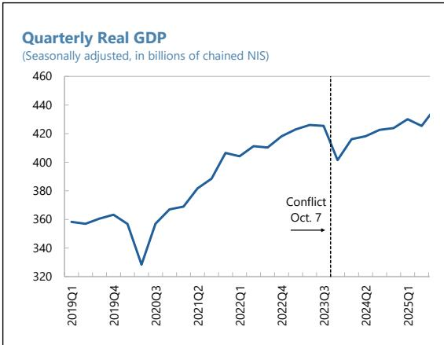

2. A partial recovery took hold in 2024 amid persistent supply constraints. GDP grew by 1 percent, driven by higher government spending, while business sector GDP contracted and per capita GDP declined. Central regions, critical for output and the high-tech sector, saw little physical damage, supporting continued activity. Private consumption has largely rebounded but fixed investment, particularly for structures, remains subdued, constrained by ongoing supply disruptions and slow replacement of Palestinian workers, which formed a third of the construction industry's pre-conflict workforce. Investments in the high-tech sector continued strongly. Inflation exceeded the 3 percent target from August 2024, reflecting supply-side pressures and labor shortages. Housing, food, and tobacco were the main contributors, alongside volatile airfares. Exports have remained resilient relative to imports, sustaining the current account surplus despite strong declines in tourism, exports to Palestinian territories, and the Turkey trade embargo, as well as possible foreign sentiment affecting the terms of trade.

3. Economic activities strengthened further in 2025, and supply constraints eased. The output surpassed its pre-conflict level in Q1 2025, supported by private and public consumptions as the conflict ebbed. The recovery was interrupted in Q2 by the Iran escalation, but the output surged past the pre-conflict level again in Q3 2025. Headline Inflation has decelerated to 2.6 percent in December 2025, helped by a stronger shekel and eased supply constraints.

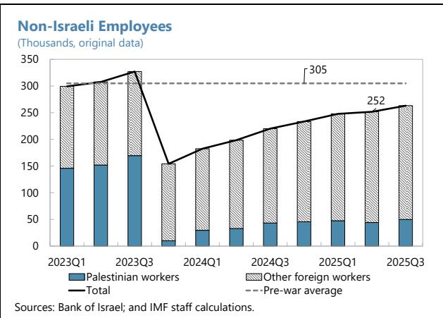

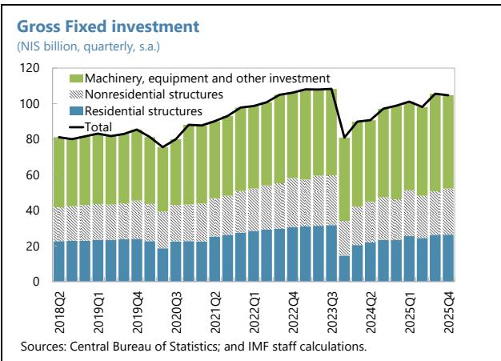

4. Risk premia, already relatively high due to public sentiment driven by judicial reforms, surged and financial conditions tightened sharply at conflict onset, but have largely reverted to pre-conflict levels after the October 2025 ceasefire. Sovereign spreads and CDS spreads widened in 2024 during heightened escalations with Iran, but narrowed ahead of the northern and southern ceasefires, alongside shekel appreciation. Moody's and S&P downgraded Israel's credit ratings in 2024, but have recently upgraded the outlook to "stable". Spreads widened again following renewed hostilities in Gaza from March, but fell to near pre-October 7 levels after the ceasefire. Overall, financial conditions have normalized relative to the initial tightening, supported by BOI interventions at the conflict's onset, with the financial sector remaining resilient and credit continuing to flow.

Weighted Average Sovereign Spreads (Basis Points)

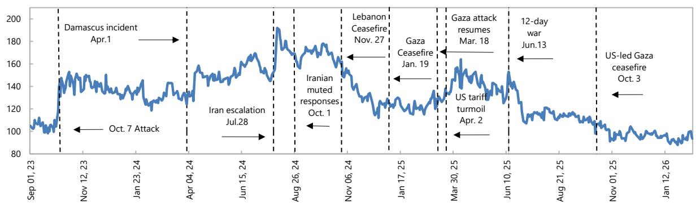  
Sources: Bloomberg L.P.; and IMF staff calculations.

## Annex II. Table 1. Israel: Selected Relief and Support Measures for the October 2023 Conflict-affected Groups

Housing and Welfare support (including part salary compensation and living allowances) for evacuees (ongoing, albeit reduced)
At the peak around end 2023 (about three months after the conflict began), over 110,000 evacuees were in government funded short-term housing programs—about 45 percent of them were northern residents and about 55 percent were southern residents. Residents could subsequently return to evacuated areas depending on the security situation and, in some cases, also upon the rehabilitation of infrastructure.

Grants and Compensation Fund (estimated claims below from Oct. 2023 to end 2024; ongoing, extended to June 2025)
Businesses initially provided grants due to losses (several months, since discontinued). Compensation to individuals and businesses for damages caused by war or terrorism based on claims. Other restoration benefits have continued, including for damaged residences. Direct damage (physical damage to property, equipment or infrastructure): est. NIS3.5 billion
Indirect damage (losses due to disruption of business operations or direct damage): est. NIS24 billion

## Unemployment benefits relaxations

Reliefs in unemployment benefits to those put on unpaid leave from October 7 to end-2023. The period of unpaid leave qualifying for unemployment benefits was shortened to at least 14 days (and not 30 days as formerly required).

## Bank of Israel supported financial relief measures:

Loan repayment deferral program (launched Oct. 2023, extended every 3-months, ended March 2025)

Enables most-affected customers to defer payments on loans and mortgages, exempt from most fees and from interest on negative balances up to predefined amounts in current account, for a period of 3 months.

Other customers are given the option to defer loan and mortgage repayments for three months, with no fees, with the deferred payments bearing interest that is not to exceed the interest rate in the loan contract.

Loan sizes: Mortgages to an unlimited amount; consumer credit – cumulative up to NIS 100,000; business credit up to NIS 2 million.

Most deferred payments have ended as customers have returned to making repayments (BOI estimates; Nov. 2024: 1 percent of total bank credit vs. Dec. 2023 6.9 percent)

## Low-interest BOI loans to banks conditional on providing SME credit

Banking system relief plans for bank customers (NIS 3 billion, ongoing from Q2 2025 - Q1 2027)
These include among others, paying interest or benefits in the area of positive current account balances, higher rates on short-term deposits, reducing rates on overdraft balances, fee exemptions or discounts to specific population groups, partial or full exemption for a defined period from monthly repayment or reducing the interest rate charged on existing credit.

## Annex III. External Sector Assessment

1. Overall assessment. The external position in 2025 is assessed as broadly in line with the level implied by medium-term fundamentals and desirable policies. The current account (CA) surplus declined from 2.9 percent of GDP in 2024 to 1.5 percent of GDP in 2025, largely reflecting the drop in income balance. Israel's strong net international investment position and sizable international reserves help mitigate external vulnerabilities.

2. Potential policy responses. Sustained fiscal consolidation over the medium term would help maintain the external position in line with medium-term fundamentals by raising public savings. To offset the resulting increase in CA surpluses, structural reforms, particularly product market reforms that enhance business dynamism, should boost private investment.

## A. Foreign Asset and Liability Position

3. Background. The net international investment position (NIIP) is positive, and has been

around or above 40 percent of GDP over 2023–2025, representing an increase of about 10 percentage points of GDP compared to 2022, in line with persistent CA surpluses and favorable valuation of foreign assets of Israel's large institutional funds sector (comprising pension and provident funds, insurance, and mutual funds).

4. Assessment. The NIIP is expected to improve further in the medium term, supported by CA surpluses; however, the value of the foreign asset holding is subject to adverse valuation changes. On the asset side, one-quarter of assets are reserves, with half of non-reserve holdings in equities and bonds, while on the liability side, close to half are stable direct investments. The positive position

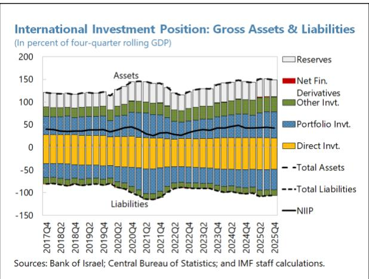

<table><tr><td colspan="5">Foreign Assets and Liabilities, 2025(Percent of GDP)</td></tr><tr><td>NIIP</td><td>Gross Assets</td><td>Reserve Assets</td><td>Gross Liabilities</td><td>Debt Liabilities</td></tr><tr><td>43.0</td><td>149.6</td><td>37.5</td><td>106.5</td><td>27.0</td></tr><tr><td colspan="5">Sources: Central Bureau of Statistics; and IMF staff estimates.</td></tr></table>

and composition of the NIIP indicate that Israel's external position is sustainable.

## B. Current Account

5. Background. The CA surplus was 1.5 percent of GDP in 2025, lower than the 2.9 percent of GDP achieved in 2024. A narrowing goods deficit was offset by a smaller services surplus, while the income balance weakened, partly reflecting higher undistributed profits of foreign companies. This decline in CA surplus corresponded to the increase in investment, particularly from the private sector, and a drop in domestic savings. In the medium term, the CA surplus is projected to increase to 2¼ percent of GDP, as the balance of goods and services gradually improves.

6. Assessment. The external position in 2025 was broadly in line with the level implied by

medium-term fundamentals and desirable policies. The CA gap, estimated based on the External Balance Assessment (EBA) model, estimates a cyclically adjusted CA of 1.4 percent and a CA norm of 1.7 percent of GDP in 2025. Staff estimate a CA gap of -0.3 percent of GDP for 2025, of which -0.3 percentage point of GDP is attributed to policy gaps, mainly domestic fiscal policy gap (-0.6 ppt)

<table><tr><td colspan="4">Israel: Model Estimates for 2025(Percent of GDP)</td></tr><tr><td></td><td>CA model</td><td>REER level</td><td>REER index</td></tr><tr><td>CA-Actual</td><td>1.5</td><td></td><td></td></tr><tr><td>Cyclical contributions 1/</td><td>0.1</td><td></td><td></td></tr><tr><td>Adjusted CA</td><td>1.4</td><td></td><td></td></tr><tr><td>CA Norm (from model)</td><td>1.7</td><td></td><td></td></tr><tr><td>EBA CA Gap</td><td>-0.3</td><td></td><td></td></tr><tr><td>o/w Policy gap</td><td>-0.3</td><td></td><td></td></tr><tr><td>REER Gap (percent) 2/</td><td>1.5</td><td>26.6</td><td>10.0</td></tr><tr><td colspan="4">Source: IMF staff estimates.1/ Cyclically adjusted, including multilateral consistency adjustments.2/ Semi-elasticity of CA/GDP to REER assumption is -0.22.</td></tr></table>

and health expenditure (0.3 ppt). Other country-specific factors not reflected in the CA norm may contribute to Israel's high saving rate, including significant levels of transfers and grant inflows (including from US military aid), as well as mandatory pension contributions. $^{1}$

## C. Real Exchange Rate

7. Background. The real effective exchange rate (REER) appreciated by about 7 percent in 2025, after remaining broadly stable during 2024. The appreciation largely reflects the nominal effective exchange rate (NEER) appreciation in 2025.

8. Assessment. The CA gap estimate of -0.3 percent of GDP implies a REER gap of about 1.5 percent (applying an estimated elasticity of -0.22). The REER level and REER index models point to a REER gap of about 26.6 percent and 10.0 percent, respectively. In the context of currency appreciation and a still-positive current account, alongside continued capital inflows, the current account approach appears to better explain recent developments in the real exchange rate.

## D. Capital and Financial Accounts

9. Background. Israel recorded a net financial account outflows of 2.9 percent of GDP in 2025, compared to around 4.2 percent of GDP in 2024. Net FDI inflows strengthened to 1.9 percent of GDP—broadly in line with their 2021–23 average—from 0.9 percent of GDP in 2024. These inflows were more than offset by net outflows in portfolio and other investment, at about 2.0 and 3.0 percent of GDP, respectively, largely reflecting residents' accumulation of foreign assets. Consequently, Israel's net foreign holdings have increased, as evidenced by the growth in the NIIP.

10. Assessment. Foreign financial inflows are mainly in stable FDI, and portfolio inflows are small relative to domestic institutional investors' investment abroad. No new capital flow management (CFM) measures have been introduced over the past two years.

## E. FX Interventions and Reserve Level

11. Background. The BOI implemented its foreign exchange stabilization program in October 2023—involving up to US\$30 billion in FX sales and US\$15 billion via swaps—aimed at ensuring market functionalities. It intervened in the FX market at the outset of the conflict (US\$8.2 billion in FX sales and US\$0.4 billion in swaps in October 2023, and US\$0.3 billion in FX sales in November 2023) and in June 2025 (US\$0.3 billion in FX sales) during the Iran escalation. The international reserves reached US\$229.5 billion at end-2025, about 37.5 percent of GDP. The de jure exchange rate regime is classified as free floating, and the de facto exchange rate arrangement is classified as floating.

12. Assessment. Reserves are adequate. Reserves as of end-2025 were about 14 months of prospective imports of goods and services or about 220 percent of the IMF's reserve adequacy metric.

Annex IV. Risk Assessment Matrix $^{1}$

<table><tr><td>Risks</td><td>Likelihood</td><td>Expected Impact</td><td>Policy Recommendation</td></tr><tr><td colspan="4">Global Risks</td></tr><tr><td>Geopolitical tensions and intensification of conflicts. A further worsening of geopolitical tensions and a weakening of multilateralism raise the risk of an escalation in military conflicts, accompanied by additional damage to key physical and financial infrastructure, further disruptions in major transit routes and supply chains, higher migration pressures, additional financial frictions, and market volatility.</td><td>High.</td><td>High. A high-cost conflict with significant disruption to GDP and resurging public debt, with the potential destruction of infrastructure, higher defense spending, higher demand for reservists, resurging country risk premium, and lower investment.</td><td>Targeted fiscal support measures, prioritization exercise for nondefense spending, and sustained revenue measures. Make conflict-related spending temporary. Stand ready to raise interest rates and counter disruptions to FX markets if needed. After conflict abates, fiscal buffers should be rebuilt.</td></tr><tr><td>Protectionism and further trade disruptions. Tariff and nontariff measures disrupt global supply chains, weighing on activity while increasing inflation. Trade diversion triggers broader protectionism.</td><td>High.</td><td>High. Decline in exports, FDI and related employment, together with tighter financial conditions. Regarding the current U.S. tariff, mitigating factors include relatively low effective tariff (after exemptions) and less-substitutable export product mix (high tech and value-added segments, and defense).</td><td>Keep monitoring trade, investment and financial conditions, and actively secure favorable trade agreements to limit uncertainty and mitigate impact. Further reduce tariff and non-tariff barriers, and increase export diversification.</td></tr><tr><td>Disorderly AI correction. An abrupt revision in expectations of strong AI-led productivity gains causes a sharp market correction, investment decline, and wealth loss, which suppress demand and tighten financial conditions globally.</td><td>High.</td><td>High. Being an economy well-integrated into the high tech and AI supply chain, Israel is exposure to disorderly AI correction that could cause a decline in exports, FDI, and employment. The exposure of institutional investors to global equity markets will lead to wealth loss.</td><td>Intensify the assessment of the impact of AI corrections on economic activity and financial markets. Should negative output gaps emerge and deflationary risks arise, monetary policy should be eased, and fiscal automatic stabilizers should be allowed to operate.</td></tr><tr><td>Fiscal vulnerabilities and higher interest rates. Higher public debt and deficit levels put further upward pressure on long-term</td><td>High.</td><td>Medium. Being a small open economy linked to major advanced economies, Israel is exposed to changes in policies</td><td>Market forces should be allowed to continue to set the price of the shekel, with interventions limited to</td></tr></table>

$^{1}$ The Risk Assessment Matrix (RAM) shows events that could materially alter the baseline path. The relative likelihood is the staff’s subjective assessment of the risks surrounding the baseline (“low is meant to indicate a probability below 10 percent, “medium” a probability between 10 and 30 percent, and “high” a probability between 30 and 50 percent).

<table><tr><td>Risks</td><td>Likelihood</td><td>Expected Impact</td><td>Policy Recommendation</td></tr><tr><td colspan="4">Global Risks</td></tr><tr><td>interest rates, sharply tightening global financial conditions, amplifying currency volatility, and reducing consumption and investment that exacerbate adverse debt dynamics. Disruptions are amplified by increased role of price-sensitive investors and leveraged NBFIs in sovereign debt markets, limited market absorption capacity when NBFIs offload debt securities, higher roll-over needs on shorter sovereign debt maturities, and strong sovereign-financial nexus.</td><td></td><td>of other countries and global market stress.</td><td>addressing disorderly market conditions. Should negative output gaps emerge and deflationary risks arise, monetary policy should be eased, and fiscal automatic stabilizers should be allowed to operate.</td></tr><tr><td>Cyberthreats. Cyberattacks on physical or digital infrastructure, technical failures, or misuse of AI technologies could trigger financial and economic instability.</td><td>High.</td><td>Medium. Israel&#x27;s high digitalization could expose potentially relevant fault lines.</td><td>Invest in cybersecurity, guided by up-to-date risk assessments.</td></tr><tr><td colspan="4">Domestic Risks</td></tr><tr><td>Housing finance amplifies financial stability risks. Housing price boom fueled by credit, driven by developer&#x27;s incentivized presales and generous financing schemes, raise financial stability risks that upon materialization of a bust deepens an economic downturn.</td><td>Medium.</td><td>Medium. Adverse shocks may lead to home purchase contract rescissions, pressuring house prices down, with a market wide decline leading to defaults among homebuyers and construction companies, and bank losses.</td><td>Continue prudent and proactive supervision and close monitoring of financial sector risks, especially banks&#x27; real estate exposures. Consider extending borrower-based measures to nonbank financial institutions.</td></tr><tr><td>Progress beyond the ceasefire. Improved regional security with the expansion of the Abraham Accords participation could lead to new trade and investment links.</td><td>Medium.</td><td>Medium/High. A much wider economic cooperation could boost growth, exports, and investment, while large scale demobilization of reservists would ease labor supply shortages.</td><td>Peace dividends should be reallocated to growth-enhancing reforms, including infrastructure and education spending, alongside some fiscal consolidation. New revenue measures will still be needed to create fiscal space (see fiscal policy discussion below).</td></tr></table>

Annex V. Data Issues

<table><tr><td colspan="8">Data Adequacy Assessment Rating 1/</td></tr><tr><td colspan="8">A</td></tr><tr><td colspan="8">Questionnaire Results 2/</td></tr><tr><td rowspan="2">Assessment</td><td>National Accounts</td><td>Prices</td><td>Government Finance Statistics</td><td>External Sector Statistics</td><td>Monetary and Financial Statistics</td><td>Inter-sectoral Consistency</td><td>Median Rating</td></tr><tr><td>A</td><td>A</td><td>A</td><td>A</td><td>A</td><td>A</td><td>A</td></tr><tr><td colspan="8">Detailed Questionnaire Results</td></tr><tr><td colspan="8">Data Quality Characteristics</td></tr><tr><td>Coverage</td><td>A</td><td>A</td><td>A</td><td>A</td><td>A</td><td></td><td></td></tr><tr><td rowspan="2">Granularity 3/</td><td>B</td><td></td><td>A</td><td>A</td><td>A</td><td></td><td></td></tr><tr><td></td><td></td><td>A</td><td></td><td>A</td><td></td><td></td></tr><tr><td>Consistency</td><td></td><td></td><td>A</td><td>A</td><td></td><td>A</td><td></td></tr><tr><td>Frequency and Timeliness</td><td>A</td><td>A</td><td>A</td><td>A</td><td>A</td><td></td><td></td></tr><tr><td colspan="8">Note: When the questionnaire does not include a question on a specific dimension of data quality for a sector, the corresponding cell is blank.1/ The overall data adequacy assessment is based on staff&#x27;s assessment of the adequacy of the country&#x27;s data for conducting analysis and formulating policy advice, and takes into consideration country-specific characteristics.2/ The overall questionnaire assessment and the assessments for individual sectors reported in the heatmap are based on a standardized questionnaire and scoring system (see IMF Review of the Framework for Data Adequacy Assessment for Surveillance, January 2024, Appendix I).3/ The top cell for &quot;Granularity&quot; of Government Finance Statistics shows staff&#x27;s assessment of the granularity of the reported government operations data, while the bottom cell shows that of public debt statistics. The top cell for &quot;Granularity&quot; of Monetary and Financial Statistics shows staff&#x27;s assessment of the granularity of the reported Monetary and Financial Statistics data, while the bottom cell shows that of the Financial Soundness indicators.</td></tr><tr><td>A</td><td colspan="7">The data provided to the Fund are adequate for surveillance.</td></tr><tr><td>B</td><td colspan="7">The data provided to the Fund have some shortcomings but are broadly adequate for surveillance.</td></tr><tr><td>C</td><td colspan="7">The data provided to the Fund have some shortcomings that somewhat hamper surveillance.</td></tr><tr><td>D</td><td colspan="7">The data provided to the Fund have serious shortcomings that significantly hamper surveillance.</td></tr><tr><td colspan="8">Rationale for staff assessment. Staff assess the overall data quality as broadly adequate for the Fund&#x27;s surveillance. Israel&#x27;s economic and financial statistics are comprehensive, generally of high quality, and are provided to the Fund in a comprehensive manner. The authorities regularly publish a full range of economic and financial data, as well as a calendar of dates for the main statistical releases. There are some shortcomings in the real sector statistics, as the classification of activities on the production side is relatively limited (i.e., 16 versus over 40 in many European countries).</td></tr><tr><td colspan="8">Changes since the last Article IV consultation. More comprehensive data for general government have been received by the team from the statistics agency, improving coverage beyond previously limited central government data and breakdowns available. With regard to the financial balance sheet (stocks of financial assets and liabilities) project, the sectoral balance sheet, debt securities, and other financial corporations survey have been reported on a regular basis under the SDDS plus framework.</td></tr><tr><td colspan="8">Corrective actions and capacity development priorities. The authorities plan to transmit the more detailed classification of activities on the production side for reference year 2025 in due course.</td></tr><tr><td colspan="8">Use of data and/or estimates in Article IV consultations in lieu of official statistics available to staff. Staff do not use data and/or estimates different from official statistics.</td></tr><tr><td colspan="8">Other data gaps. Monthly FX intervention data is published, which is adequate for surveillance. Labor market related data in various forms are also available and adequate.</td></tr></table>

## Annex V. Table 2. Israel: Data Standards Initiatives

Israel adheres to the Special Data Dissemination Standard (SDDS) Plus since December 2020 and publishes the data on its National Summary Data Page. The latest SDDS Plus Annual Observance Report is available on the Dissemination Standards Bulletin Board (https://dsbb.imf.org/).

Annex V. Table 3. Israel: Summary of Data Quality Factsheets $^{1/2}$ /

<table><tr><td rowspan="3"></td><td colspan="8">(As of May 11, 2026)</td></tr><tr><td colspan="4">Data Provision to the Fund</td><td colspan="4">Publication under the Data Standards Initiatives through the National Summary Data Page</td></tr><tr><td>Date of Latest Observation</td><td>Date Received</td><td>Frequency of  $Data^6$ </td><td>Frequency of  $Reporting^6$ </td><td> $Expected Frequency^{6,7}$ </td><td> $Israel^8$ </td><td> $Expected Timeliness^{6,7}$ </td><td> $Israel^8$ </td></tr><tr><td>Exchange Rates</td><td>Same day</td><td>Same day</td><td>D and M</td><td>D and M</td><td>D</td><td>...</td><td>...</td><td>...</td></tr><tr><td>International Reserve Assets and Reserve Liabilities of the Monetary  $Authorities^1$ </td><td>Apr-26</td><td>May-26</td><td>M</td><td>M</td><td>M</td><td>M</td><td>1W</td><td>15D</td></tr><tr><td>Reserve/Base Money</td><td>Mar-26</td><td>Apr-26</td><td>M</td><td>M</td><td>M</td><td>M</td><td>2W</td><td>2W</td></tr><tr><td>Broad Money</td><td>Dec-25</td><td>Mar-26</td><td>M</td><td>M</td><td>M</td><td>M</td><td>1M</td><td>2W</td></tr><tr><td>Central Bank Balance Sheet</td><td>Dec-25</td><td>Mar-26</td><td>M</td><td>M</td><td>M</td><td>M</td><td>2W</td><td>2W</td></tr><tr><td>Consolidated Balance Sheet of the Banking System</td><td>Dec-25</td><td>Mar-26</td><td>M</td><td>M</td><td>M</td><td>M</td><td>1M</td><td>2W</td></tr><tr><td> $Interest Rates^2$ </td><td>Same day</td><td>Same day</td><td>D</td><td>D</td><td>D</td><td>...</td><td>...</td><td>...</td></tr><tr><td>Consumer Price Index</td><td>Mar-26</td><td>Apr-26</td><td>M</td><td>M</td><td>M</td><td>M</td><td>1M</td><td>15D</td></tr><tr><td>Revenue, Expenditure, Balance and Composition of Financing $^3$ -General Government $^4$ </td><td>2024</td><td>Nov-25</td><td>A</td><td>A</td><td>A/Q</td><td>...</td><td>2Q/12M</td><td>...</td></tr><tr><td>Revenue, Expenditure, Balance and Composition of Financing $^3$ -Central Government</td><td>Apr-26</td><td>May-26</td><td>M</td><td>M</td><td>M</td><td>Q</td><td>1M</td><td>3M</td></tr><tr><td>Stocks of Central Government and Central Government-Guaranteed  $Debt^5$ </td><td>Q3-2025</td><td>Dec-25</td><td>Q</td><td>Q</td><td>Q</td><td>Q</td><td>1Q</td><td>3M</td></tr><tr><td>External Current Account Balance</td><td>Q4-2025</td><td>Mar-26</td><td>Q</td><td>Q</td><td>Q</td><td>Q</td><td>1Q</td><td>10W</td></tr><tr><td>Exports and Imports of Goods and Services</td><td>Q4-2025</td><td>Mar-26</td><td>Q</td><td>Q</td><td>M</td><td>M</td><td>8W</td><td>2W</td></tr><tr><td>GDP/GNP</td><td>Q4-2025</td><td>Apr-26</td><td>Q</td><td>Q</td><td>Q</td><td>Q</td><td>1Q</td><td>47D</td></tr><tr><td>Gross External Debt</td><td>Q4-2025</td><td>Mar-26</td><td>Q</td><td>Q</td><td>Q</td><td>Q</td><td>1Q</td><td>12W</td></tr><tr><td>International Investment Position</td><td>Q4-2025</td><td>Mar-26</td><td>Q</td><td>Q</td><td>Q</td><td>Q</td><td>1Q</td><td>12W</td></tr></table>

## Annex VI. Sovereign Risk and Debt Sustainability Assessment

<table><tr><td>Horizon</td><td>Mechanical signal</td><td>Final assessment</td><td>Comments</td></tr><tr><td>Overall</td><td>...</td><td>Moderate</td><td>The overall risk of sovereign distress is moderate, reflecting a low level of vulnerability in the near-term and moderate vulnerability in the medium and long term.</td></tr><tr><td colspan="4">Near term 1/</td></tr><tr><td>Medium term</td><td>Moderate</td><td>Moderate</td><td rowspan="4">Medium-term risks are assessed as moderate, consistent with mechanical signal. The medium-term risk assessment suggests a relatively high probability of non-stabilization of the debt under the stress scenario and large uncertainty around the central projection.</td></tr><tr><td>Fanchart</td><td>Moderate</td><td>...</td></tr><tr><td>GFN</td><td>Moderate</td><td>...</td></tr><tr><td>Stress test</td><td></td><td>...</td></tr><tr><td>Long term</td><td>...</td><td>Moderate</td><td>Longer-term risks are assessed as moderate. Without policy adjustments, debt is projected to steadily rise over the longer term. However, several factors not fully captured by model-based assessments help mitigate the risk, including strong institutional quality, a large savings surplus, and high international reserves.</td></tr><tr><td>Sustainability assessment 2/</td><td>Not required for surveillance countries</td><td>Not required for surveillance countries</td><td></td></tr><tr><td colspan="3">Debt stabilization in the baseline</td><td>No</td></tr><tr><td colspan="4">DSA Summary Assessment</td></tr><tr><td colspan="4">Israel is at a medium overall risk of sovereign stress. Several factors not fully captured by model-based assessments help mitigate the risk, including strong institutional quality, a large savings surplus, reflected in stable asset holdings of institutional investors, and high international reserves. However, public debt is projected to rise gradually without fiscal adjustment. Fiscal consolidation is therefore essential to put debt on a sustainable downward path and reduce the risk of sovereign stress</td></tr><tr><td colspan="4">Source: Fund staff.Note: The risk of sovereign stress is a broader concept than debt sustainability. Unsustainable debt can only be resolved through exceptional measures (such as debt restructuring). In contrast, a sovereign can face stress without its debt necessarily being unsustainable, and there can be various measures—that do not involve a debt restructuring—to remedy such a situation, such as fiscal adjustment and new financing.1/ The near-term assessment is not applicable in cases where there is a disbursing IMF arrangement. In surveillance-only cases or in cases with precautionary IMF arrangements, the near-term assessment is performed but not published.2/ A debt sustainability assessment is optional for surveillance-only cases and mandatory in cases where there is a Fund arrangement. The mechanical signal of the debt sustainability assessment is deleted before publication. In surveillance-only cases or cases with IMF arrangements with normal access, the qualifier indicating probability of sustainable debt (&quot;with high probability&quot; or &quot;but not with high probability&quot;) is deleted before publication.</td></tr></table>

<table><tr><td rowspan="2" colspan="12"></td><td>Comments</td></tr><tr><td rowspan="2">n.a.</td></tr><tr><td rowspan="5" colspan="12">1. Debt coverage in the DSA: 1/</td></tr><tr><td>CG</td></tr><tr><td>GG</td></tr><tr><td>NFPS</td></tr><tr><td rowspan="2">Other</td></tr><tr><td colspan="12">2. Subsectors included in the chosen coverage in (1) above:</td></tr><tr><td colspan="12">Subsectors captured in the baseline</td><td>Inclusion</td></tr><tr><td rowspan="8">CPS</td><td rowspan="8">NFPS</td><td rowspan="8">GG: expected</td><td rowspan="8">CG</td><td>1</td><td colspan="7">Budgetary central government</td><td>Yes</td></tr><tr><td>2</td><td colspan="7">Extra budgetary funds (EBFs)</td><td>Yes</td></tr><tr><td>3</td><td colspan="7">Social security funds (SSFs)</td><td>Yes</td></tr><tr><td>4</td><td colspan="7">State governments</td><td>No</td></tr><tr><td>5</td><td colspan="7">Local governments</td><td>Yes</td></tr><tr><td>6</td><td colspan="7">Public nonfinancial corporations</td><td>No</td></tr><tr><td>7</td><td colspan="7">Central bank</td><td>No</td></tr><tr><td>8</td><td colspan="7">Other public financial corporations</td><td rowspan="6">No</td></tr><tr><td colspan="7">3. Instrument coverage:</td><td>Currency &amp; deposits</td><td>Loans</td><td>Debt securities</td><td>Oth acct. payable 2/</td><td>IPSGSs 3/</td></tr><tr><td rowspan="2" colspan="7">4. Accounting principles:</td><td colspan="2">Basis of recording</td><td colspan="3">Valuation of debt stock</td></tr><tr><td>Non-cash basis 4/</td><td>Cash basis</td><td>Nominal value 5/</td><td>Face value 6/</td><td>Market value 7/</td></tr><tr><td colspan="7">5. Debt consolidation across sectors:</td><td colspan="3">Consolidated</td><td colspan="2">Non-consolidated</td></tr><tr><td colspan="12">Color code: chosen coverage Missing from recommended coverage Not applicable</td></tr><tr><td colspan="13">Reporting on Intra-Government Debt Holdings</td></tr><tr><td colspan="5">Issuer</td><td>Holder</td><td>Budget. central govt</td><td>Extra-budget. funds (ERFs)</td><td>Social security funds (SSEs)</td><td>State govt. Local govt.</td><td>Nonfin. pub. corp.</td><td>Central bank</td><td>Oth. pub. fin corp</td></tr><tr><td rowspan="8">CPS</td><td rowspan="8">NFPS</td><td rowspan="8">GG: expected</td><td rowspan="8">CG</td><td>1</td><td>Budget. central govt</td><td></td><td></td><td></td><td></td><td></td><td></td><td>...</td></tr><tr><td>2</td><td>Extra-budget. funds</td><td></td><td></td><td></td><td></td><td></td><td></td><td>...</td></tr><tr><td>3</td><td>Social security funds</td><td></td><td></td><td></td><td></td><td></td><td></td><td>...</td></tr><tr><td>4</td><td>State govt.</td><td></td><td></td><td></td><td></td><td></td><td></td><td>...</td></tr><tr><td>5</td><td>Local govt.</td><td></td><td></td><td></td><td></td><td></td><td></td><td>...</td></tr><tr><td>6</td><td>Nonfin pub. corp.</td><td></td><td></td><td></td><td></td><td></td><td></td><td>...</td></tr><tr><td>7</td><td>Central bank</td><td></td><td></td><td></td><td></td><td></td><td></td><td>...</td></tr><tr><td>8</td><td>Oth. pub. fin. corp</td><td></td><td></td><td></td><td></td><td></td><td></td><td>...</td></tr><tr><td colspan="12">Total ... ... ... ... ... ... ... ... ...</td><td>...</td></tr></table>

Annex VI. Figure 2. Israel: Public Debt Structure Indicators  
Debt by Currency (Percent of GDP)  
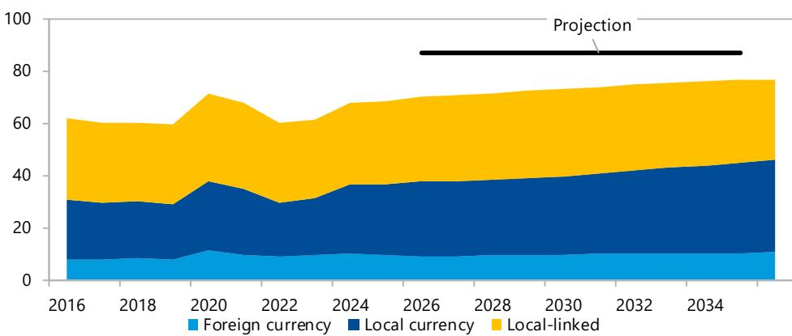  
Note: The perimeter shown is consolidated public sector.

Public Debt by Holder (Percent of GDP)  
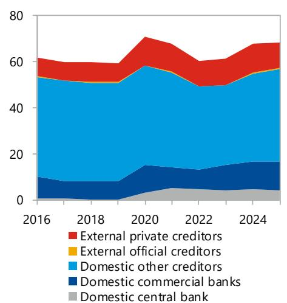  
Note: The perimeter shown is general government.

Public Debt by Governing Law, 2025 (percent)  
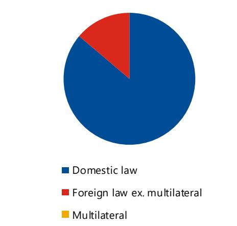  
Note: The perimeter shown is general government.

Debt by Instruments (Percent of GDP)  
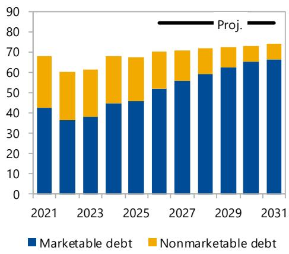  
Note: The perimeter shown is general government.

Public Debt by Maturity (Percent of GDP)  
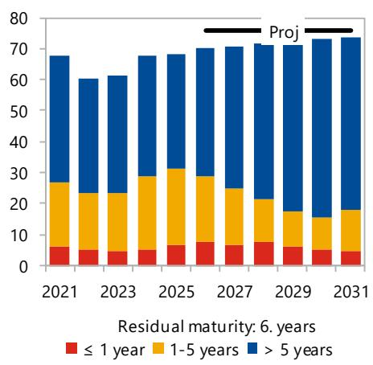  
Note: The perimeter shown is general government.  
Debt is mostly held by domestic creditors, with maturity projected to increase over time.

Annex VI. Figure 3. Israel: Baseline Scenario (Percent of GDP unless indicated otherwise)

<table><tr><td rowspan="2"></td><td>Actual</td><td colspan="6">Medium-term projection</td><td colspan="4">Extended projection</td></tr><tr><td>2025</td><td>2026</td><td>2027</td><td>2028</td><td>2029</td><td>2030</td><td>2031</td><td>2032</td><td>2033</td><td>2034</td><td>2035</td></tr><tr><td>Public debt</td><td>68.4</td><td>70.1</td><td>70.7</td><td>71.5</td><td>72.2</td><td>73.0</td><td>73.8</td><td>74.5</td><td>75.1</td><td>75.7</td><td>76.3</td></tr><tr><td>Change in public debt</td><td>0.7</td><td>1.7</td><td>0.6</td><td>0.8</td><td>0.7</td><td>0.8</td><td>0.8</td><td>0.7</td><td>0.6</td><td>0.6</td><td>0.5</td></tr><tr><td>Contribution of identified flows</td><td>-0.1</td><td>1.2</td><td>-0.1</td><td>0.1</td><td>0.0</td><td>0.1</td><td>0.1</td><td>0.0</td><td>0.0</td><td>0.0</td><td>0.0</td></tr><tr><td>Primary deficit</td><td>2.1</td><td>3.5</td><td>2.5</td><td>2.3</td><td>2.1</td><td>2.0</td><td>2.1</td><td>1.9</td><td>1.9</td><td>1.9</td><td>1.9</td></tr><tr><td>Noninterest revenues</td><td>37.9</td><td>37.5</td><td>36.8</td><td>36.2</td><td>36.0</td><td>36.1</td><td>36.2</td><td>36.2</td><td>36.2</td><td>36.2</td><td>36.2</td></tr><tr><td>Noninterest expenditures</td><td>39.9</td><td>41.0</td><td>39.3</td><td>38.5</td><td>38.1</td><td>38.1</td><td>38.3</td><td>38.2</td><td>38.1</td><td>38.1</td><td>38.1</td></tr><tr><td>Automatic debt dynamics</td><td>-1.7</td><td>-1.7</td><td>-2.0</td><td>-1.5</td><td>-1.4</td><td>-1.3</td><td>-1.3</td><td>-1.4</td><td>-1.4</td><td>-1.5</td><td>-1.5</td></tr><tr><td>Real interest rate and relative inflat</td><td>0.9</td><td>0.6</td><td>1.0</td><td>1.0</td><td>1.0</td><td>1.1</td><td>1.1</td><td>1.0</td><td>1.0</td><td>1.0</td><td>1.0</td></tr><tr><td>Real interest rate</td><td>0.9</td><td>0.6</td><td>1.0</td><td>1.0</td><td>1.0</td><td>1.0</td><td>1.0</td><td>0.9</td><td>1.0</td><td>1.0</td><td>0.9</td></tr><tr><td>Relative inflation</td><td>0.0</td><td>0.1</td><td>0.0</td><td>0.0</td><td>0.0</td><td>0.0</td><td>0.0</td><td>0.0</td><td>0.0</td><td>0.0</td><td>0.0</td></tr><tr><td>Real growth rate</td><td>-1.9</td><td>-2.3</td><td>-3.0</td><td>-2.5</td><td>-2.4</td><td>-2.4</td><td>-2.4</td><td>-2.4</td><td>-2.4</td><td>-2.5</td><td>-2.5</td></tr><tr><td>Real exchange rate</td><td>-0.6</td><td>...</td><td>...</td><td>...</td><td>...</td><td>...</td><td>...</td><td>...</td><td>...</td><td>...</td><td>...</td></tr><tr><td>Other identified flows</td><td>-0.5</td><td>-0.6</td><td>-0.6</td><td>-0.7</td><td>-0.7</td><td>-0.7</td><td>-0.6</td><td>-0.5</td><td>-0.5</td><td>-0.5</td><td>-0.5</td></tr><tr><td>Contingent liabilities</td><td>0.0</td><td>0.0</td><td>0.0</td><td>0.0</td><td>0.0</td><td>0.0</td><td>0.0</td><td>0.0</td><td>0.0</td><td>0.0</td><td>0.0</td></tr><tr><td>(minus) Interest Revenues</td><td>-0.5</td><td>-0.5</td><td>-0.5</td><td>-0.5</td><td>-0.5</td><td>-0.5</td><td>-0.5</td><td>-0.5</td><td>-0.5</td><td>-0.5</td><td>-0.5</td></tr><tr><td>Other transactions</td><td>0.0</td><td>-0.1</td><td>-0.1</td><td>-0.2</td><td>-0.2</td><td>-0.2</td><td>-0.2</td><td>0.0</td><td>0.0</td><td>0.0</td><td>0.0</td></tr><tr><td>Contribution of residual</td><td>0.8</td><td>0.5</td><td>0.6</td><td>0.7</td><td>0.7</td><td>0.7</td><td>0.7</td><td>0.7</td><td>0.6</td><td>0.6</td><td>0.6</td></tr><tr><td>Gross financing needs</td><td>9.9</td><td>10.6</td><td>11.7</td><td>11.6</td><td>13.0</td><td>12.9</td><td>12.6</td><td>13.0</td><td>13.4</td><td>14.2</td><td>15.4</td></tr><tr><td>of which: debt service</td><td>8.3</td><td>7.7</td><td>9.6</td><td>9.8</td><td>11.4</td><td>11.3</td><td>10.9</td><td>11.6</td><td>11.9</td><td>12.7</td><td>13.9</td></tr><tr><td>Local currency</td><td>7.5</td><td>6.3</td><td>8.3</td><td>8.7</td><td>10.1</td><td>9.8</td><td>9.8</td><td>10.2</td><td>10.5</td><td>11.1</td><td>12.2</td></tr><tr><td>Foreign currency</td><td>0.9</td><td>1.3</td><td>1.4</td><td>1.1</td><td>1.3</td><td>1.5</td><td>1.1</td><td>1.3</td><td>1.5</td><td>1.6</td><td>1.7</td></tr><tr><td>Memo:</td><td></td><td></td><td></td><td></td><td></td><td></td><td></td><td></td><td></td><td></td><td></td></tr><tr><td>Real GDP growth (percent)</td><td>2.9</td><td>3.5</td><td>4.4</td><td>3.7</td><td>3.5</td><td>3.4</td><td>3.4</td><td>3.4</td><td>3.4</td><td>3.4</td><td>3.4</td></tr><tr><td>Inflation (GDP deflator; percent)</td><td>2.3</td><td>2.8</td><td>2.3</td><td>2.3</td><td>2.3</td><td>2.2</td><td>2.2</td><td>2.4</td><td>2.3</td><td>2.3</td><td>2.3</td></tr><tr><td>Nominal GDP growth (percent)</td><td>5.2</td><td>6.4</td><td>6.8</td><td>6.1</td><td>5.8</td><td>5.7</td><td>5.7</td><td>5.7</td><td>5.7</td><td>5.7</td><td>5.7</td></tr><tr><td>Effective interest rate (percent)</td><td>3.7</td><td>3.7</td><td>3.7</td><td>3.7</td><td>3.7</td><td>3.7</td><td>3.7</td><td>3.7</td><td>3.6</td><td>3.6</td><td>3.6</td></tr></table>

Contribution to Change in Public Debt  
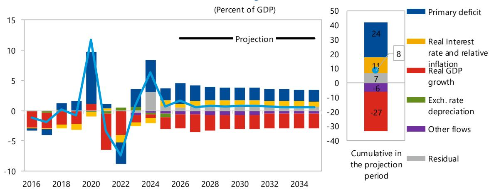  
Debt ratios are expected to increase gradually, with the primary deficit projected to be around 1.9 percent of GDP and gross financing needs estimated at about 14 percent of GDP mostly after 2030.

3-Year Adjustment in Cyclically-Adjusted Primary Balance (Percent of GDP)  
Annex VI. Figure 4. Israel: Realism of Baseline Assumptions  
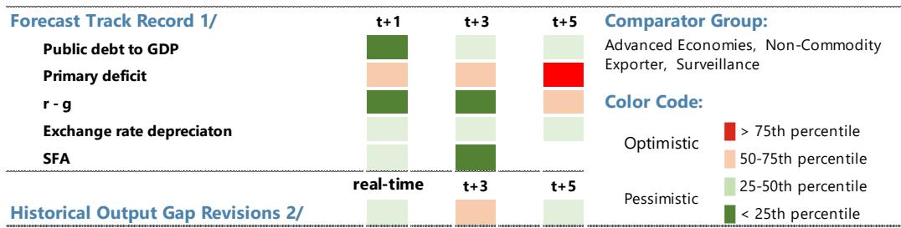  
Historical Output Gap Revisions 2/  
Public Debt Creating Flows  
Bond Issuances (Bars, debt issuances (RHS,

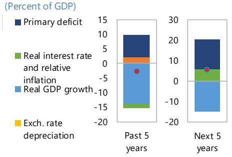  
3-Year Debt Reduction  
%GDP); lines, avg marginal interest rates (LHS, percent))

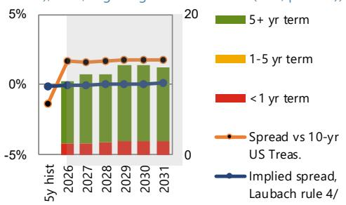

(Percent of GDP)  
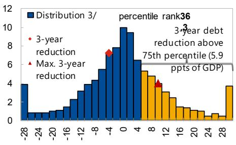

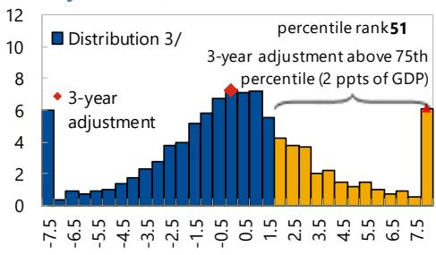  
Fiscal Adjustment and Possible Growth Paths  
(Lines, real growth using multiplier (LHS); bars, fiscal adj. (RH): (In percent)  
Real GDP Growth

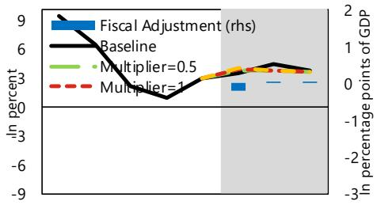  
2021 2022 2023 2024 2025 2026 2027 2028

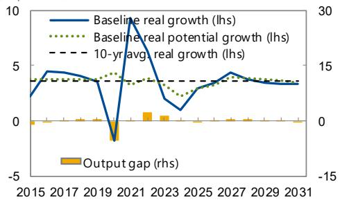

The realism analysis points to some pessimism from the staff regarding certain drivers of debt, particularly the r-g relationship and optimism in fiscal deficit. Over the last five years, debt ratios increased rapidly as a result of the conflict, but they are expected to increase slowly as growth and the primary balance improve. Projected growth is broadly in line with potential. Overall, the realism analysis does not indicate an optimistic bias.

Source : IMF Staff.

1/ Projections made in the October and April WEO vintage.

2/ Calculated as the percentile rank of the country's output gap revisions (defined as the difference between real time/period ahead estimates

3/ Data cover annual observations from 1990 to 2019 for MAC advanced and emerging economies. Percent of sample on vertical axis.

4/ The Laubach (2009) rule is a linear rule assuming bond spreads increase by about 4 bps in response to a 1 ppt increase in the projected debt-to-GDP ratio.

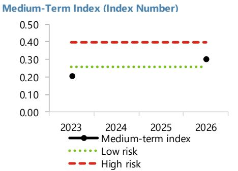

<table><tr><td colspan="2"></td><td>Value</td><td>Contrib 1/</td><td>Percentile in peer group 2/</td></tr><tr><td colspan="5">Final Fanchart (Percent of GDP)</td></tr><tr><td colspan="5">Debt fanchart module</td></tr><tr><td colspan="2">Fchart width (percent of GDP)</td><td>58.5</td><td>0.8</td><td></td></tr><tr><td colspan="2">Probability of debt non-stabilizaiton (percent)</td><td>61.6</td><td>0.5</td><td></td></tr><tr><td colspan="2">Terminal debt-to-GDP x institutions index</td><td>21.8</td><td>0.5</td><td></td></tr><tr><td colspan="2">Debt fanchart index (DFI)</td><td>1.8</td><td></td><td></td></tr><tr><td colspan="2">Risk signal: 3/</td><td>Moderate</td><td></td><td></td></tr><tr><td colspan="5">Gross Financing Needs (GFN) module</td></tr><tr><td colspan="2">Average baseline GFN (percent of GDP)</td><td>12.1</td><td>4.1</td><td></td></tr><tr><td colspan="2">Initial Banks&#x27; claims on th gen. govt (pct bank assets)</td><td>10.3</td><td>3.3</td><td></td></tr><tr><td colspan="2">Chg. In banks&#x27; claims in stress (pct banks&#x27; assets)</td><td>8.0</td><td>2.7</td><td></td></tr><tr><td colspan="2">GFN financeability index (GFI)</td><td>10.2</td><td></td><td></td></tr><tr><td colspan="2">Risk signal: 4/</td><td>Moderate</td><td></td><td></td></tr><tr><td colspan="5">Triggered stress tests (stress tests not activated in gray)</td></tr><tr><td colspan="5">Medium-Term Index (Index Number)</td></tr><tr><td colspan="2">Exchange rate</td><td>Contingent liab.</td><td colspan="2">Natural disaster</td></tr><tr><td colspan="5">Medium-term risk analysis</td></tr><tr><td colspan="2"></td><td>Value</td><td>Value (normalized ed)</td><td>Weight Contribution</td></tr><tr><td colspan="2">Debt fanchart index</td><td>1.8</td><td>0.4</td><td>0.5</td></tr><tr><td colspan="2">GFN financeability index</td><td>10.2</td><td>0.2</td><td>0.5</td></tr><tr><td colspan="2">Medium-term index</td><td>0.3</td><td></td><td></td></tr><tr><td colspan="2">Risk signal: 5/</td><td>Moderate</td><td></td><td></td></tr><tr><td colspan="2">Final assessment:</td><td>Moderate</td><td></td><td></td></tr><tr><td colspan="5">Prob. of missed crisis, 2026-2031, if stress not predicted: 18.2 pct.</td></tr><tr><td colspan="5">Prob. of false alarms, 2026-2031, if stress predicted: 27.3 pct.</td></tr><tr><td colspan="5">Mechanical signals, including the Fanchart and the GFN tool, indicate a moderate risk.</td></tr><tr><td colspan="5">Source: IMF staff estimates and projections.</td></tr><tr><td colspan="5">1/ See Annex IV of IMF, 2022, Staff Guidance Note on the Sovereign Risk and Debt Sustainability Framework for details on index calculation.</td></tr><tr><td colspan="5">2/ The comparison group is advanced economies, non-commodity exporter, surveillance.</td></tr><tr><td colspan="5">3/ The signal is low risk if the DFI is below 1.13; high risk if the DFI is above 2.08; and otherwise, it is moderate risk.</td></tr><tr><td colspan="5">4/ The signal is low risk if the GFI is below 7.6; high risk if the DFI is above 17.9; and otherwise, it is moderate risk.</td></tr><tr><td colspan="5">5/ The signal is low risk if the GFI is below 0.26; high risk if the DFI is above 0.40; and otherwise, it is moderate risk.</td></tr></table>

<table><tr><td>Projection</td><td>Variable</td><td>Risk Indication</td></tr><tr><td rowspan="3">Medium-term extrapolation</td><td>GFN-to-GDP ratio</td><td></td></tr><tr><td>Amortization-to-GDP ratio</td><td></td></tr><tr><td>Amortization</td><td></td></tr><tr><td rowspan="3">Medium-term extrapolation with debt stabilizing primary balance</td><td>GFN-to-GDP ratio</td><td></td></tr><tr><td>Amortization-to-GDP ratio</td><td></td></tr><tr><td>Amortization</td><td></td></tr><tr><td rowspan="3">Historical average assumptions</td><td>GFN-to-GDP ratio</td><td></td></tr><tr><td>Amortization-to-GDP ratio</td><td></td></tr><tr><td>Amortization</td><td></td></tr><tr><td>Overall Risk Indication</td><td></td><td></td></tr></table>

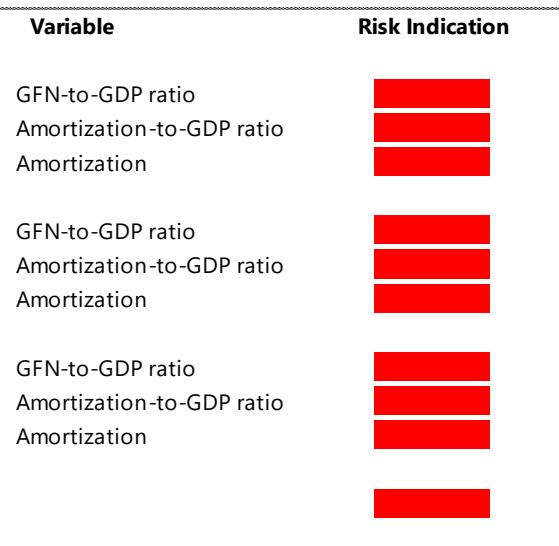

GFN-to-GDP Ratio  
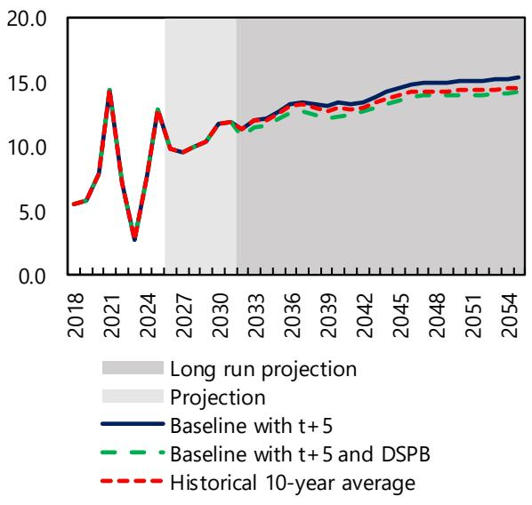

Total Public Debt-to-GDP Ratio  
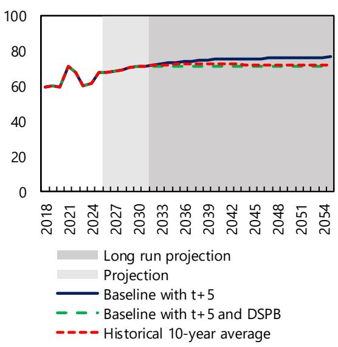  
Historically, the GFN was approximately 9 percent of GDP, and it is expected to rise to 12 percent of GDP in the next five years, reaching 15 percent of GDP in the long term. Despite the amortization risks highlighted in the module, all scenarios indicate manageable amortization and stable debt ratios.

## Annex VII. Macroprudential and Financial Policy Measures Since the Last Article IV

<table><tr><td></td><td>Policy Action</td><td>Status</td></tr><tr><td colspan="3">COVID-related, some extended by the Conflict</td></tr><tr><td>Capital requirement</td><td>Commercial banks' capital requirements were reduced during the COVID shock period, with a transitional arrangement thereafter, according to which the minimum bank capital ratios should not be lower than either: (1) the capital ratios recorded on end-2021, or (2) the compelling minimum capital ratios that the bank was required to meet prior the relief was announced.</td><td>The transitional arrangement ended on December 31, 2023.</td></tr><tr><td>Leverage ratio</td><td>As part of COVID aftermath measures, the minimum leverage ratio for banks was reduced by 0.5 percentage points (from 6 to 5.5 for large banks, and from 5 to 4.5 for small banks).</td><td>As announced on December 20, 2023, the relief period has been extended until June 30, 2026. Any banking corporation that has not utilized the relief by December 31, 2025, will not be permitted to reduce its leverage ratio below the "regular" minimum ratio after this date.</td></tr><tr><td>Other sectoral limits on exposures</td><td>Announced January 2021 as part of COVID relief, and effective up to end 2025, the limitation on exposure to the construction and real estate industry was increased by 2 percentage points (from 24 percent to 26 percent of the total credit portfolio when national infrastructure is included; from 20 to 22 excluding infrastructure).</td><td>Following the conflict, effective on October 29, 2024, the previously mentioned reliefs for the construction and real estate industry have been extended until December 31, 2027, with an additional two-year period to revert to the original limits. Additionally, a new relief has been established, setting the total exposure to the "Financial and Insurance" industry at 25 percent (instead of 20 percent) until December 31, 2027, with an additional two-year period to return to the original limit.</td></tr><tr><td colspan="3">Conflict-related</td></tr><tr><td>Loan deferral framework</td><td>After the conflict's onset, a framework was introduced to enable customers to defer loan repayments free of interest and fees, particularly in the conflict-affected areas.</td><td>Temporary relief expired. Bank-level deferrals remain possible under new bank voluntary support framework.</td></tr><tr><td>Restrictions on bank's dividend distributions</td><td>After the onset of the conflict in 2023, Supervisor of Banks issued guidance to banks to adopt a conservative policy regarding dividend distributions and credit loss allowances.</td><td>Following sustained high profits in 2024, banks in general had scope and were allowed to increase dividend payout ratios.</td></tr><tr><td colspan="3">Housing related</td></tr><tr><td>Housing finance restrictions</td><td>After a period of resurging house prices and buoyant mortgage credit driven by promotional financing schemes of Israeli developers, BOI announced regulations to cap the use of such schemes and increase capital charges for bank lending to developers that heavily use these schemes.</td><td>Implemented effective April 6, 2025.</td></tr><tr><td colspan="3">Other Structural Measures</td></tr><tr><td>Credit bureau developments</td><td>In May 2023, the BOI launched a digital reporting service. The new service enables customers to view the state of their credit liabilities as updated in the credit register, and to obtain insights and explanations regarding the data.</td><td>During the conflict emergency period, the supervisor of credit data sharing issued temporary orders with the aim of mitigating the negative credit implications of the war on customers.</td></tr></table>

## Annex VIII. Risks from Housing Finance in Israel $^{1}$

Housing finance is important for financial stability in Israel, as bank credit is concentrated in mortgages and the real estate industry. Despite the conflict and high interest rates, the housing market remained buoyant until recently, supported by widespread presales and developer-provided financing schemes. While the market has begun to cool in 2025, the continued extensive use of these practices has created a pocket of vulnerability. This has prompted the Bank of Israel (BOI) to tighten prudential policies. Nevertheless, continued vigilance and close monitoring are warranted, including the still limited but growing role of nonbank financial institutions (NBFIs).

## A. Recent Housing Market Developments

1. The housing market in Israel has experienced substantial ups and downs since the pandemic. Following a period of monetary tightening beginning in 2022, the housing market experienced some correction, with house prices declining and transactions falling. The outbreak of conflict in late 2023 initially weakened activity, but the downturn proved short-lived. By 2024, transactions and mortgage issuance had surpassed pre-conflict levels, and house prices rose by nearly 8 percent despite elevated uncertainty (Figure VIII.1). Demand was supported by developers' presale offers with low deposits and financing incentives, as well as by shifts in buyer preferences triggered by security concerns and population displacements. Renewed interest from investors and foreign buyers added further pressure.

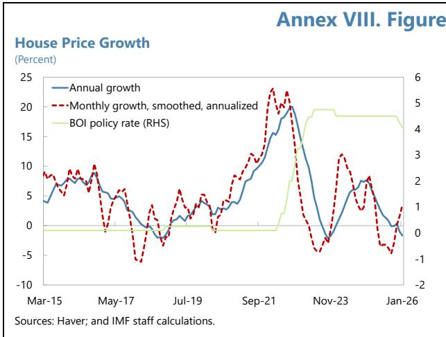

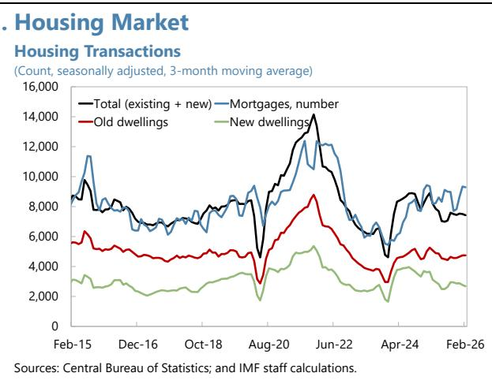

2. Structural supply constraints—longstanding in Israel—intensified due to labor shortages and temporary construction site closures. Replacement of Palestinian workers with Israeli and foreign labor proceeded slowly, creating substantial project backlogs and delaying completions (Figure VIII.2). Developers also faced rising costs stemming from higher interest expenses, increased wages, and compensation payments for delayed deliveries. While presale-based funding provided short-term liquidity, it further entrenched reliance on riskier financing structures. By early 2025, construction activity had partially recovered, but supply bottlenecks persisted.

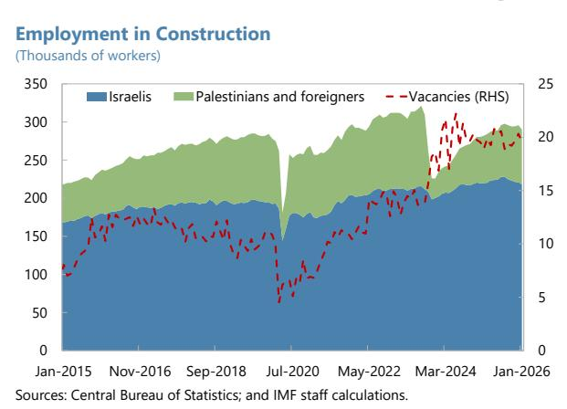

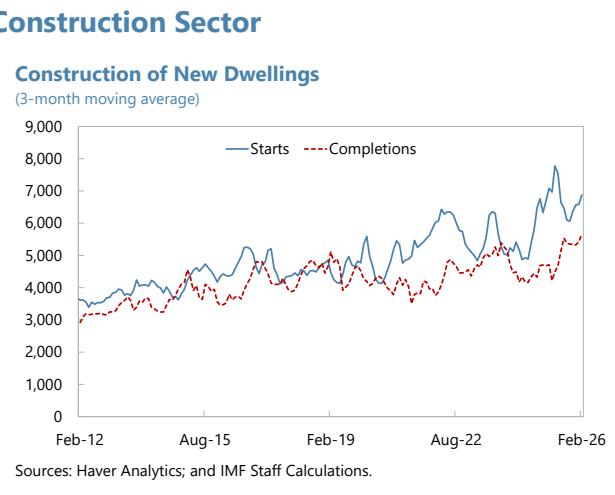

## B. Banking Sector Exposures

3. Housing finance plays an important role in Israel's financial system, with bank credit heavily concentrated in mortgages and real estate-related lending. Bank credit to real estate has been expanding, with exposures at more than half of total credit as of October 2025. Some pressures emerged in the housing and construction sectors during the conflict. Delinquencies, mainly among construction firms, picked up with higher provisioning, but overall nonperforming loans have remained below 1 percent (Figure VIII.3). Several factors have preserved the soundness of the banking system: (i) resilience of economic activity; (ii) government support during the conflict; and (iii) Israel's long-standing macroprudential borrower-based measures (BBMs), including limits on loan-to-value (LTV), payment-to-income (PTI), and mortgage maturities. Temporary payment-deferral programs also supported mortgage performance, with most borrowers returning to regular payment schedules by early 2025.

## Annex VIII. Figure 3. Bank Exposure to Real Estate and Asset Quality

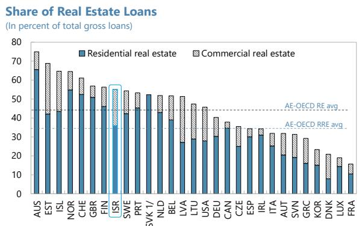  
Sources: Haver Analytics; and IMF staff calculations. 1/ No data on commercial real estate loans.

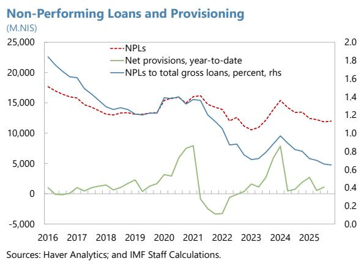

## C. Presales, Balloon Loans, and Risk Transmission Channels

4. The growing reliance on developer incentives and balloon loan financing has heightened vulnerabilities related to housing finance. Despite high interest rates following the October 2023 conflict, the housing market rebounded strongly in 2024, supported by promotional presale schemes and developer-provided financing incentives. While house prices do not appear significantly overvalued, the rapid expansion of long-maturity presales, combined with balloon loans increased financial risks. These structures generate upfront liquidity for developers but shift interest and refinancing risks to households, potentially amplifying market overheating, speculative activity, and sensitivity to adverse shocks.

## 5. Presales have long played an important role in Israel's primary housing market,

years. By 2025, units with delivery beyond two years accounted for the majority of new home sales. Developers increasingly offered contracts with minimal upfront deposits—often 10 to 20 percent of the purchase price—bundled with bank-provided balloon (or bullet) loans covering an additional 30-40 percent. While balloon loans are formally extended to households, their proceeds are transferred directly to developers to finance construction, with interest payments covered by developers until delivery. Upon

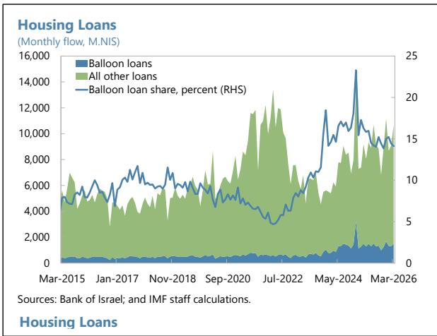

completion—typically two to four years later—the balloon loan is expected to be repaid or converted into a standard mortgage. The share of balloon loans in new mortgage origination rose from about 5 percent in early 2022 to over 20 percent by late 2024, but has since dropped to about 15 percent.

## Presales can, in principle, enhance market efficiency; however, the current structure may amplify vulnerabilities through several channels:

\- Market overheating and expectations. Front-loaded demand and the perception of time-limited “special deals” can fuel expectations of future price increases, contributing to a self-reinforcing price cycle. Fear of missing out can further accelerate presale uptake, pushing up prices in the primary market and transmitting pressures to the secondary market.

\- Speculative activity. Low upfront costs relative to expected capital gains create incentives for speculative purchases and flipping of presale contracts. Investors can resell contracts before completion with limited capital at risk, increasing market liquidity but also amplifying price volatility. International evidence shows links between presales, speculative demand, and house price booms (Li et al., 2022; Fu et al., 2016).

\- Project mismanagement and liquidity risks. Developers facing financial strain may underprice risks or misallocate presale proceeds, especially amid construction delays, cost overruns, or an increase in unsold inventories. This could lead to project suspensions or incompletions, as observed in past housing cycles in other countries (Chen et al., 2024).

\- Buyer funding shortfalls and contract rescissions. Buyers may face difficulty securing mortgages at delivery when initial deposits fall well below the LTV-implied downpayment requirements (25–50 percent, depending on purchaser type). Adverse shocks—such as job loss or interest-rate increases—could trigger widespread contract resales or rescissions, leaving developers with large unsold inventories and exerting downward pressure on prices.

\- Systemic risks. Given banks' substantial exposure to mortgages and construction lending, a wave of developer distress could weaken capital buffers, prompt credit tightening, and propagate shocks to the broader economy.

## D. Policy Response and Priorities

6. The BOI has taken important steps to mitigate emerging risks. The measures taken in 2024 included: (i) enhanced data and information requirements from banks; (ii) supervisory reviews of underwriting procedures and prevailing practices; (iii) a requirement for banks to establish dedicated risk frameworks with clear limits and underwriting criteria; (iv) mandatory analyses of the impact of market developments on banks' portfolios, accompanied by board-level discussions; (v) adjustments to credit loss provisions to ensure adequate recognition of elevated risks in the construction and real estate sectors; and (vi) enhanced disclosure requirements. In April 2025, the BOI introduced a cap of 10 percent on balloon loans as a share of new quarterly mortgage origination and a 150 percent risk weight on exposures to construction projects where more than 25 percent of units are presold with reduced deposits during the construction period. These measures complemented existing macroprudential

measures, including the one-percent capital surcharge on housing loans and the 22-percent cap on exposures to construction and real estate businesses. These actions appear to have slowed down the issuance of balloon loans.

## 7. However, some leakages may arise, as current regulations apply primarily to banks; continued coordinated inter-agency action will therefore be essential. Nonbank lenders—including non-bank credit institutions and institutional

investors—have expanded their lending to construction and real estate, even though their direct mortgage lending remains limited (less than 2 percent of total mortgages). Their involvement in financing incentivized presale schemes could shift risks outside the banking regulatory perimeter and increase procyclicality. Broader application of BBMs across lenders—including nonbanks—would help limit regulatory arbitrage. Given the systemic importance of housing and the rising role of nonbanks, continued information sharing and coordinated oversight—including through the Financial Stability Committee—will be essential to prevent a disorderly market correction and to preempt broader financial system risks.

## Annex IX. Authorities' Responses to Past FSAP Recommendations $^{1}$

<table><tr><td>Recommendation</td><td>Authority</td><td>Priority</td><td>Para.</td><td>Time- frame</td><td>Status</td></tr><tr><td colspan="5">Overall Financial Sector Oversight</td><td></td></tr><tr><td>Strengthen the institutional framework for macroprudential oversight and policy setting by more formally establishing a Financial Stability Committee (FSC) and initiating its operations</td><td>All</td><td>High</td><td>46</td><td>Near-term</td><td>Implemented</td></tr><tr><td>Further improve stress testing techniques, including the capacity to analyze systemic risks, credit risk, and liquidity risk</td><td>BOI, CMISA</td><td>High</td><td>20, 23, 24, 47</td><td>Near-term</td><td>Implemented</td></tr><tr><td>Eliminate gaps and overlaps in supervisory responsibilities, ensuring that like activities are subject to equally stringent regulation and supervisions</td><td>BOI, ISA CMISA</td><td>High</td><td>28-30</td><td>Near-term</td><td>Partially implemented</td></tr><tr><td>Undertake more systematically cost-benefit analysis of regulatory changes, and streamline regulations where possible</td><td>BOI, ISA CMISA</td><td>Medium</td><td>25</td><td>Near-term</td><td>Implemented</td></tr><tr><td>Strengthen the AML/CFT legal and regulatory framework, in particular with regard to the designated non-financial businesses and professions, and the transparency of beneficial ownership.</td><td>Government</td><td>High</td><td>43</td><td>Near-term</td><td>Implemented</td></tr><tr><td colspan="5">Banking Oversight</td><td></td></tr><tr><td>Further strengthen regulation and supervision of interest rate risk and market risk</td><td>BOI</td><td>High</td><td>33</td><td>Immediate</td><td>Implemented</td></tr><tr><td>Develop regulation of liquidity risk as international practice in this area evolves, and intensify monitoring</td><td>BOI</td><td>High</td><td>32</td><td>Near-term</td><td>Implemented</td></tr><tr><td>Introduce greater flexibility in personnel management and budgets to attract and retain financial sector experts with the required skill mix</td><td>BOI</td><td>Medium</td><td>27</td><td>Near-term</td><td>Implemented</td></tr><tr><td colspan="5">Insurance Sector Oversight</td><td></td></tr><tr><td>Intensify cross-border supervisory coordination and information-sharing</td><td>CMISA</td><td>High</td><td>35</td><td>Immediate</td><td>Implemented</td></tr><tr><td>Widen powers to supervise groups connected to insurance companies, and in particular related holding companies</td><td>CMISA</td><td>High</td><td>36</td><td>Near-term</td><td>Implemented</td></tr><tr><td colspan="5">Securities Markets Oversight and Securities Markets Development</td><td></td></tr><tr><td>Enforce uniformly high standards of due diligence in the underwriting of securities issues</td><td>ISA</td><td>High</td><td>38</td><td>Immediate</td><td>Implemented</td></tr><tr><td>Establish an appropriate licensing and supervisory framework for currently unregulated broker-dealers</td><td>ISA</td><td>Medium</td><td>37</td><td>Near-term</td><td>Implemented</td></tr><tr><td>Ensure consistency of relevant supervisory practice by TASE, the ISA, and the BOI</td><td>TASE, ISA, BOI</td><td>Medium</td><td>39</td><td>Near-term</td><td>Implemented</td></tr><tr><td>Remove impediments (including tax treatment) to repo market development</td><td>MOF</td><td>Medium</td><td>48</td><td>Near-term</td><td>Partially implemented</td></tr><tr><td colspan="6">1/ Please refer toIsrael Financial System Stability Assessment 2012for the full set of FSAP recommendations. The status in this table was based on input from the Israeli authorities. Near term refers to 1-3 years.</td></tr><tr><td>Recommendation</td><td>Authority</td><td>Priority</td><td>Para.</td><td>Time-  $frame^{1}$ </td><td>Status</td></tr><tr><td colspan="5">Payments and Securities Systems Oversight</td><td></td></tr><tr><td>Develop and test more comprehensive business continuity plans</td><td>BOI</td><td>High</td><td>41</td><td>Immediate</td><td>Implemented</td></tr><tr><td>Protect finality of settlements in payments systems linked to Zahav</td><td>BOI</td><td>Medium</td><td>39</td><td>Immediate</td><td>Partially implemented</td></tr><tr><td>Complete development of payment system oversight</td><td>BOI</td><td>Medium</td><td>40</td><td>Near-term</td><td>Partially implemented</td></tr><tr><td colspan="6">Crisis Management</td></tr><tr><td>Establish a policy framework for ELA</td><td>BOI</td><td>High</td><td>50</td><td>Immediate</td><td>Implemented</td></tr><tr><td>Establish by law and make operationala full set of early intervention tools; anda special framework for going-and-gone concern resolution</td><td>BOI, MOF</td><td>High</td><td>50-54</td><td>Near-term</td><td>Partially implemented</td></tr><tr><td>Establish mechanism for providing solvency support and for funding bank resolution, protecting the BOI from quasi-fiscal activities</td><td>BOI, MOF</td><td>High</td><td>55-57</td><td>Near-term</td><td>Not Implemented</td></tr><tr><td>Agree on a protocol for the coordination of, and assignment of responsibilities for system-wide crisis management</td><td>All</td><td>High</td><td>59-60</td><td>Immediate</td><td>Implemented</td></tr></table>

## ISRAEL

June 10, 2026

STAFF REPORT FOR THE 2026 ARTICLE IV CONSULTATION—INFORMATIONAL ANNEX

Prepared By

European Department

## CONTENTS

FUND RELATIONS \_\_\_\_ 2

## FUND RELATIONS

## (As of May 31, 2026)

Membership Status: Israel became a member of the Fund on July 12, 1954. $^{1}$

General Resources Account:

<table><tr><td></td><td>SDR Million</td><td>Percent Quota</td></tr><tr><td>Quota</td><td>1,920.90</td><td>100.00</td></tr><tr><td>Fund Holdings of Currency (Holdings Rate)</td><td>1,435.74</td><td>74.74</td></tr><tr><td>Reserve Tranche Position</td><td>485.17</td><td>25.26</td></tr><tr><td>Lending to the Fund</td><td></td><td>...</td></tr></table>

SDR Department:

<table><tr><td></td><td>SDR Million</td><td>Percent Allocation</td></tr><tr><td>Net cumulative allocations</td><td>2,724.48</td><td>100.00</td></tr><tr><td>Holdings</td><td>2,863.46</td><td>105.10</td></tr></table>

Outstanding Purchases and Loans: None

Latest Financial Arrangements:

<table><tr><td>Type</td><td>Date of Arrangement</td><td>Expiration Date</td><td>Amount Approved (SDR Million)</td><td>Amount Drawn (SDR Million)</td></tr><tr><td>Stand-By</td><td>Oct 20, 1976</td><td>Oct 19, 1977</td><td>29.25</td><td>12.00</td></tr><tr><td>Stand-By</td><td>Feb 14, 1975</td><td>Feb 13, 1976</td><td>32.50</td><td>32.50</td></tr><tr><td>Stand-By</td><td>Nov 08, 1974</td><td>Feb 14, 1975</td><td>32.50</td><td>32.50</td></tr></table>

Overdue Obligations and Projected Payments to Fund $^{2}$

(SDR Million; based on existing use of resources and present holdings of SDRs):

<table><tr><td rowspan="2"></td><td colspan="5">Forthcoming</td></tr><tr><td>2026</td><td>2027</td><td>2028</td><td>2029</td><td>2030</td></tr><tr><td>Principal</td><td></td><td></td><td></td><td></td><td></td></tr><tr><td>Charges/Interest</td><td>0.01</td><td>0.01</td><td>0.01</td><td>0.01</td><td>0.01</td></tr><tr><td>Total</td><td>0.01</td><td>0.01</td><td>0.01</td><td>0.01</td><td>0.01</td></tr></table>

Exchange Rate Arrangement:

The de jure exchange rate arrangement is classified as "free floating" and the de facto exchange rate arrangement is classified as "floating".

Israel accepted the obligations of Article VIII, Sections 2, 3, and 4 of the IMF's Articles of Agreement on September 21, 1993. Israel maintains an exchange system free of multiple currency practices and restrictions on the making of payments and transfers for current international transactions, with the exception of measures introduced for security reasons which have been notified to the Fund pursuant to Executive Board Decision No. 144-(52/51).

## Article IV Consultation:

The last Article IV consultation was concluded on June 15, 2023. Israel is on the standard 12-month consultation cycle.

## ROSCs:

• Financial System Stability Assessment was conducted in 2000 issued in August 2001.

• Fiscal Transparency ROSC was conducted in 2003, issued in April 2004.

\- Monetary and Financial Policy Transparency was conducted in 2003, issued as IMF Country Report No. 03/76 in March 2003.

\- AML/CFT ROSC was conducted in 2003, issued in June 2005.

\- Data Module ROSC was conducted in 2005, and issued as IMF Country Report No. 06/125 in March 2006.

• Financial System Stability Assessment Update was conducted in 2011, issued in April 2012.

## Technical Assistance:

Conforming the commitments under the Oslo Accords, the Fund has been providing policy advice and technical assistance (TA) to the Palestinian Authority (PA) since 1994, and presently has a resident representative based in Jerusalem. Staff missions to the West Bank and Gaza (WBG) have been assisting the PA in designing and implementing its macroeconomic and fiscal framework, and reforms aimed to strengthen economic institutions. The most recent progress report was presented at the Ad-Hoc Liaison Committee (AHLC) meeting of donors held in New York on September 20, 2023. The Fund has also provided TA for capacity development, particularly in the areas of banking supervision and regulation, public financial management, revenue mobilization, and macroeconomic statistics.

Recent technical assistance to Israel covered issues on income tax reform, macroeconomic forecasting, systemic risk assessment and stress testing, fiscal regime for mining, a medium-term budget framework, strengthening banking supervision processes and tools, and the implementation of International Financial Reporting Standards (IFRS).

## Resident Representative:

The office of the IMF Resident Representative for the WBG was established in July 1995.

# Statement by Marnix van Rij, Alternate Executive Director for Israel, and Nadav Steinberg, Senior Advisor to Executive Director June 24, 2026

On behalf of the Israeli authorities, we extend our gratitude to Mr. Ishi and his team for their intensive and constructive engagement, and for the useful set of reports. This consultation takes place in a particularly complex context. Geopolitical developments, including in the Middle East, remain a source of uncertainty for the Israeli economy. The staff report provides an important opportunity for a clear, fact-based assessment of macroeconomic developments and policies.

The authorities will carefully consider the policy recommendations and would like to offer the following observations:

## Recent economic developments and macroeconomic outlook

Israel's economy has demonstrated resilience in the face of successive shocks. The war that ensued Hamas terror attack on October 7, 2023, has taken not only a significant human toll, but has also affected the economy. Elevated regional tensions over the past three years have led to growth below its pre-war trend. However, Israel's economy has continued to demonstrate notable resilience, supported by strong fundamentals, credible policy frameworks, and a dynamic and innovative private sector. The outlook reflects this resilience, as the Bank of Israel (BOI) and the Ministry of Finance project growth of 3.8 percent and 4 percent, respectively, in 2026 followed by an even stronger rebound of 5.5 percent and 4.8 percent in 2027, as labor supply constraints ease and confidence improves. Indeed, current data shows that government tax revenues are above their medium-term trend, credit card expenditures are on the rise, and the shekel appreciated against major currencies. At the same time, a beneficial energy production mix and prudent monetary policy have helped maintain inflation and inflation expectations around 2 percent, while systemic risks in the financial sector are contained. Renewed hostilities pose downside risk to growth and upside risk to inflation, while an expansion of regional peace accords could support trade, investment, and broader economic integration.

## Fiscal policy

Today's fiscal reality reflects the need to respond decisively to heightened security demands and support affected households and firms. Prudent fiscal policy since the mid-1980s allowed Israel to reduce its public debt below 60 percent pre-COVID. In 2020, debt surged due to the pandemic's impact on growth and temporary support measures, but strong growth and prudent policy in 2021-2022 reduced debt back to 60 percent in 2022. Following October 2023, the deficit widened and public debt increased. Financing conditions have remained favorable, supported by deep domestic capital markets and significant consolidation measures introduced in the 2025 budget. Given significant defense spending and low civil expenditures, we concur with staff that strong measures will be needed to stabilize the debt level and replenish fiscal buffers.

The authorities reaffirm their commitment to fiscal discipline and to stabilizing the debt trajectory over the medium term. The authorities aim to contain the deficit at around 4.9 percent of GDP in 2026 and to pursue a gradual consolidation thereafter. Revenue-based measures offer scope for adjustment while preserving growth-enhancing expenditures, including those in infrastructure, education, and labor market integration. To this end, the authorities will carefully consider staff's suggested revenue measures to increase revenues while limiting the impact on growth. The authorities are open to discussing a comprehensive review of the tax system to enhance simplicity, efficiency, and equity, as well as to identify scope to rationalize current spending, prioritize resources toward growth-enhancing programs, and improve the efficiency of public investment.

## Monetary policy

Headline inflation, core inflation, and inflation expectations are around the midpoint of the BOI's 1-3 percent target range. After rising above the target range during 2024, inflation returned to within the range during 2025, reflecting a combination of appropriate monetary policy, easing supply constraints, and exchange rate appreciation. Throughout this period, and against a challenging global and regional environment, inflation expectations remained well anchored, underscoring the credibility of the monetary policy framework. Even as the war in the Middle East pressured global energy markets, Israel's large domestic energy production and the use of long-term gas supply contracts limited pass-through to local prices. Alongside the shekel appreciation, a mildly tight monetary stance helped contain inflation and core inflation around the midpoint of the BOI's target range. On June 15, the May inflation figure came in at 1.9 percent y/y, while inflation expectations for the next 12 months from financial markets declined to 1.5 percent, reflecting the shekel appreciation, lower risk premia, and somewhat lower energy prices.

We welcome staff's assessment that the monetary policy stance remains appropriate for maintaining price stability. As inflation pressures eased and risk premia declined at the end of 2025, the BOI cut its policy rate by a cumulative 50 basis points. Given heightened uncertainty at the onset of the war in the Middle East, the BOI paused, but, noting the shekel appreciation and the contained inflation level and inflation expectations, it cut the interest rate by 25 basis points on May 25. The BOI shares staff's assessment that the current interest rate level of 3.75 percent reflects a moderately tight stance and supports price stability. Going forward, the interest rate path will be determined in accordance with developments in inflation, economic activity, geopolitical uncertainty, and fiscal developments. A further decline in inflation expectations towards the lower end of the target range may require a more neutral policy stance.

The BOI concurs that market forces should continue to determine the FX rate, barring abrupt market disruptions. They welcome staff's assessment that the external position in 2025 was broadly in line with the level implied by medium-term fundamentals and desirable policies. Israel maintains a positive, though narrowing, current account surplus, driven by strong high-tech services exports. The international investment position and gross reserves are at high levels, providing adequate buffers against global and regional shocks.

## Financial sector

The financial system remains resilient. Banks are well capitalized, liquid, and profitable, with non-performing loans at historical lows. The authorities recognize that banks' sizeable exposure to real estate poses risks. To mitigate these risks, the BOI introduced several macroprudential measures, including limits on mortgage loan-to-value ratios, payment-to-income ratios, and the adjustable-rate share of mortgage composition. In April 2025, the BOI capped contractor-subsidized balloon loans and imposed higher capital requirements on exposure to developers heavily engaged in presales, resulting in reduced subsidized presales. The Tel Aviv Stock Exchange transitioned to a Monday–Friday trading schedule at the beginning of 2026, facilitating foreign-investors' participation and supporting increased trading volumes.

Financial stability has been supported by prudent and proactive supervision and timely policy measures. The establishment of the Financial Stability Committee in 2019 enhanced cooperation between financial regulators. In accordance with staff's advice, the BOI is working to develop a bank liquidity stress testing framework and, together with the Capital Market and Insurance Authority, it is working to regularize joint stress tests for banks and insurance companies. Recently adopted amendments to the Banking Order strengthen bank resolution capacity by enhancing the BOI's powers and flexibility in application of resolution tools. The BOI is working to implement the Basel III capital structure, while maintaining current capital requirements. Finally, the authorities are taking measures to strengthen banking competition while safeguarding financial stability. Two new digital banks have been established in recent years, while new legislation approved by the Knesset in April will facilitate new entry by creating a three-tiered regime based on proportionality without compromising financial stability or supervisory integrity.

## Structural policies

Better integration of all population groups in the labor market and closing of infrastructure gaps are key for sustainable growth. Persistently low participation and limited labor-relevant skills among the fast-growing population of Haredi men, as well as low participation of Arab women, weigh on potential growth. The authorities note the contribution of past initiatives to enhance Arab-Israelis' educational and workforce outcomes and recognize the need to improve incentives for Haredi men to enter the labor force. To enhance broad-based productivity, the government is investing heavily in physical infrastructure as well as AI-related infrastructure. To improve productivity and reduce the high cost of living, the government has pursued product-market reforms to strengthen competition and facilitate trade, including aligning import procedures with EU standards and removing remaining tariffs on U.S. goods.

The Israeli high-tech sector is at the global frontier, and Israel is well-positioned to reap the fruits of the AI revolution. The IMF's AI Preparedness Index ranks Israel $18^{\text{th}}$ globally, while the Stanford AI index places Israel at the top in AI-related private investment and newly funded AI companies. Recent CBS data point to a further increase in AI adoption among Israeli firms, with the share of firms reporting AI use rising to 39 percent in 2026, very high by international standards. Finally, recent survey by the BOI and Israel Democracy Institute shows that the share of employees using AI for work purposes in Israel is higher than in any European country included in the Eurostat survey. Staff's analysis suggests that the Israeli labor force enjoys higher AI complementarity than that of other European countries. At the same time, skill shortages, sectoral disparities, and skill gaps among Arab-Israeli and Haredi populations could constrain economy-wide AI diffusion. The authorities are committed to maintaining Israel's leadership in innovation and advanced technologies, including artificial intelligence, through continued investment in human capital, digital infrastructure, and research and development.