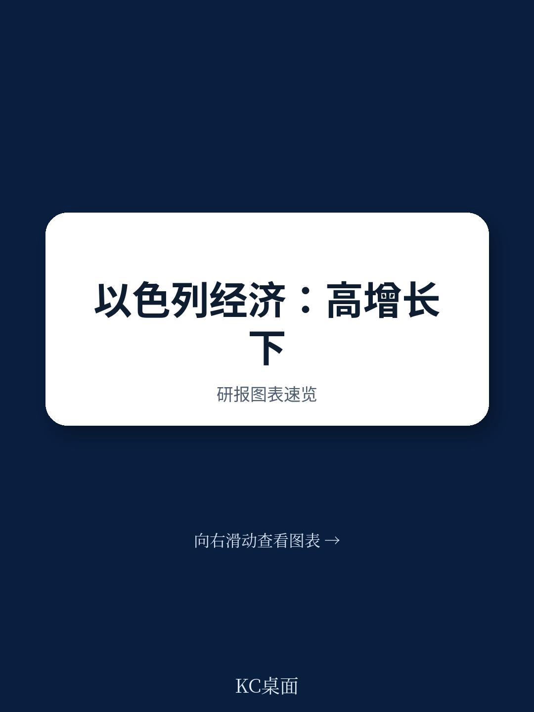
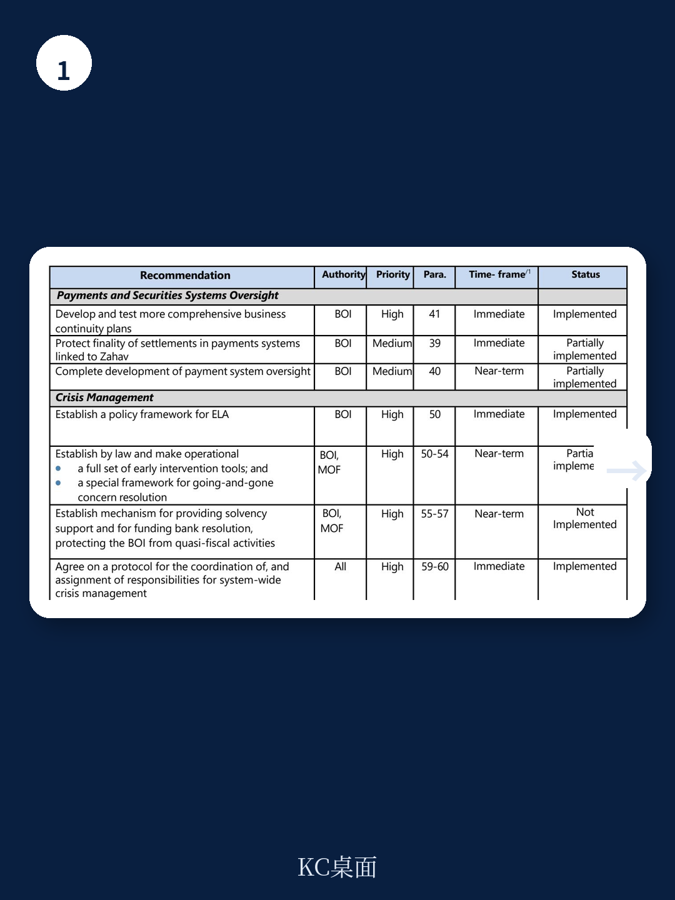
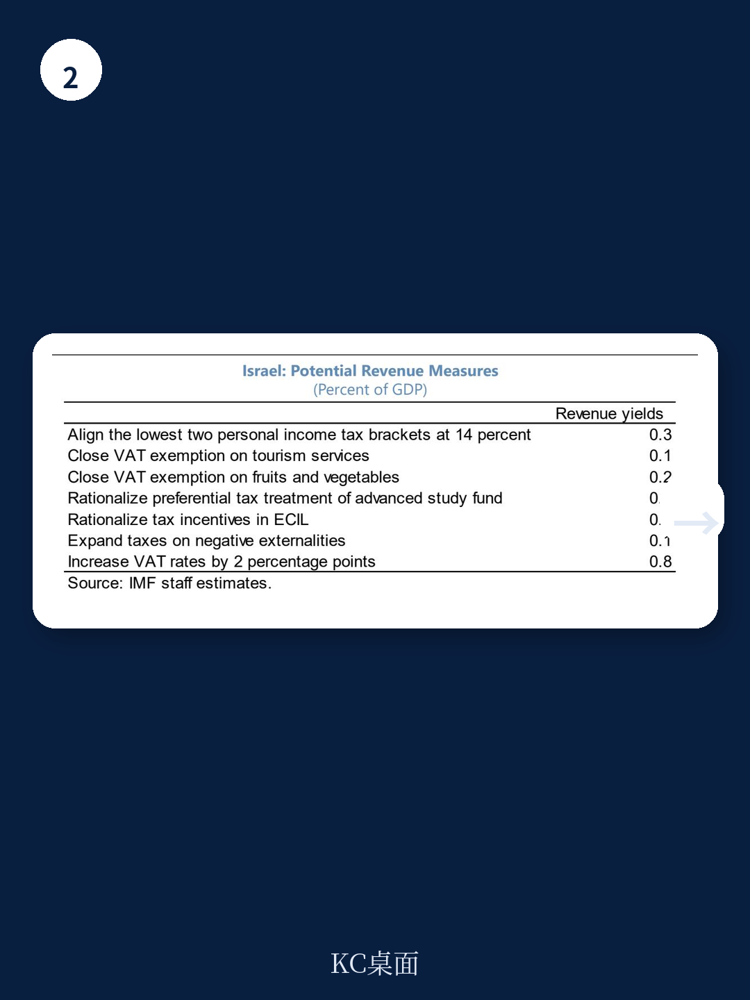

# IMF：以色列经济亮起的不是红灯，是结构性黄灯

2026年7月1日，IMF完成了对以色列的第四条款磋商。这份报告传递的核心信号并不复杂：以色列经济在连续地缘冲击中展现了韧性，但真正的挑战不是战争本身，而是战争结束后仍然存在的结构性短板。

经济增长预测从战前的4.8%下调至3.5%，公共债务占GDP比重预计在2027年达到70.7%，财政赤字在2026年仍将维持在6.2%的高位。这些数字本身并不算危机——但它们指向一个更根本的问题：以色列能否在持续的高国防支出压力下，同时完成财政整固、劳动力市场改革和生产率提升？

这不是一个短期问题。IMF的基线假设是停火大体维持，但地缘紧张局势仍将高企。这意味着，以色列需要在一个“半战争状态”的常态下，解决那些在和平时期都难以推进的结构性改革。

> **KC评论：** 这份报告的价值不在于它预测了3.5%还是4.4%的GDP增速，而在于它揭示了以色列经济的一个深层矛盾——世界级的高科技部门与低参与率的劳动力市场并存，而战争正在把这个矛盾从“可以容忍”推向“必须解决”。

## 1. 经济增长的“9%缺口”揭示了比战争更持久的伤害

报告中最值得关注的数据不是增长率本身，而是那个“9%”的缺口。IMF明确指出，截至2026年初，以色列的实际产出仍比2023年10月之前的趋势线低约9%。

这个数字意味着什么？它不是一次性的产出损失，而是增长路径的永久性下移。每一次地缘冲击后经济确实在反弹，但反弹从未让产出回到原来的趋势线上。反复的中断正在累积成结构性的增长损失。

更深层的问题是，这种损失并非均匀分布。高科技出口部门凭借全球竞争力和相对独立于本地劳动力市场的特性，恢复较快；而建筑、旅游、低端服务业则承受了不成比例的冲击。这种“双轨复苏”正在加剧以色列经济内部的生产率分化。

报告给出的潜在增长率预测约为3.5%，比2023年前的平均水平低约0.5个百分点。这个数字看起来不大，但复利效应下，十年后意味着GDP永久性减少约5%。

## 2. 财政空间正在被国防支出“挤出”而非“填满”

国防支出高企不是新闻。但IMF的担忧在于，这种高支出正在以一种特定的方式挤压财政空间——它挤出的不是消费，而是基础设施和人力资本投资。

报告显示，以色列一般政府支出占GDP比重在2026年预计达到44.2%，而财政收入仅为38.0%。6.2%的赤字率在战时并非不可接受，但问题在于支出结构：国防支出居高不下，而民用支出——尤其是基础设施投资——已经处于低位。这意味着财政整固不能简单地靠“削减支出”来实现，因为可削减的民用支出空间本就有限。

IMF的建议是：收入端改革和支出效率提升并举。具体而言，需要对税收体系进行全面审查，包括税收支出（tax expenditures），以提高税制的简洁性、效率和公平性。这实质上是建议以色列考虑增税。

> **KC评论：** 这是一个经典的“三难选择”：国防支出不能降，基础设施需要投，财政赤字必须控。IMF的答案是“增税+提效”，但这在选举年（2026年10月前必须举行大选）的政治可行性有多高？报告没有展开讨论，但这恰恰是投资者需要自己判断的关键变量。

## 3. 劳动力市场的“双缺口”正在成为增长的天花板

以色列劳动力市场的核心问题不是失业率（3.0%），而是参与率——尤其是特定群体的参与率。

报告明确指出了两个群体：Haredi男性（极端正统派犹太人）和阿拉伯裔以色列人。这两个群体的人口增速远高于全国平均水平，但劳动参与率和技能水平持续偏低。这意味着，如果他们的劳动参与率不提升，以色列的整体潜在增长率将持续被拉低。

战争加剧了这个问题。军事动员减少了可用劳动力，而巴勒斯坦工人的缺失则直接冲击了建筑等劳动密集型行业。尽管外国工人部分填补了缺口，但补偿金上涨了6.8%（2025年，同比），这表明劳动力市场已经处于紧张状态。

更值得关注的是，高科技部门虽然在全球领先，但其对整体就业的贡献有限。报告提到，以色列在AI领域的私人投资和初创企业数量全球领先，但AI的扩散受限于技能短缺和部门间差距。如果Haredi和阿拉伯裔群体无法融入高技能劳动力市场，以色列的“高科技孤岛”现象将更加突出。

## 4. 房地产风险：银行的“软肋”比想象中更值得警惕

IMF对金融体系的总体评估是正面的：银行资本充足、流动性充裕、盈利能力强。但报告反复强调了一个风险点——银行对房地产的敞口。

这不是一个新问题。以色列的住房市场正在经历调整，价格和交易量都在走弱。在战争和利率上升的双重压力下，房地产市场的下行风险可能通过银行贷款质量恶化传导至金融体系。

以色列央行已经采取了一系列宏观审慎措施：限制贷款价值比（LTV）、还款收入比（PTI），以及浮动利率贷款占比。2025年4月，央行还对开发商补贴的气球贷（balloon loans）设置了上限，并对预售占比高的开发商提高了资本要求。

但IMF认为这还不够。报告建议继续加强压力测试框架，将借款人层面的措施扩展到非银行金融机构，并审慎实施巴塞尔III要求。这说明，监管层对房地产风险的警惕并未因当前银行体系的稳健而放松。

> **KC评论：** 银行现在的报表很漂亮，但压力测试看的不是现在，而是“如果房价再跌10%会怎样”。这份报告没有给出具体的压力测试结果，但反复提及“需要继续加强”——这本身就是一种信号：风险并未消除，只是尚未暴露。

## 5. 报告没有完全回答的关键问题：AI红利能否惠及整体经济？

这是整份报告中最引人深思的一个判断：以色列在AI领域的全球领先地位是毋庸置疑的，但这份领先是否能转化为整体经济的生产率提升，仍然是一个开放问题。

报告提供了两个引人注目的数据：2026年，39%的以色列企业报告使用AI，这一比例在国际上非常高；以色列员工在工作中使用AI的比例高于所有参与Eurostat调查的欧洲国家。IMF自己的分析也显示，以色列劳动力的“AI互补性”高于其他欧洲国家。

但问题在于，AI的扩散高度依赖技能基础。如果Haredi和阿拉伯裔群体无法参与这场技术革命，AI可能进一步拉大以色列内部的生产率差距，而不是缩小它。报告承认了这一点：“技能短缺、部门差距以及阿拉伯裔和Haredi人群的技能缺口可能制约AI在经济层面的扩散。”

这意味着，AI红利能否兑现，取决于教育、培训和劳动力市场改革的成效。而这些改革，恰恰是以色列多年来进展最慢的领域。

## 6. 一个值得持续追踪的观察框架

对于关注以色列经济和资产的读者，这份报告提供了一个清晰的观察框架，可以归结为三个维度：

第一，财政整固的路径选择。2026年大选后的新政府是否愿意推进税收改革？国防支出能否在中期内有所回落？这决定了以色列的债务轨迹和主权信用风险溢价。

第二，劳动力市场的结构性变化。Haredi男性的劳动参与率是否出现拐点？外国工人能否稳定替代巴勒斯坦工人？这决定了以色列的潜在增长率。

第三，AI红利的分配机制。高科技部门的增长能否通过产业链或就业渠道传导至更广泛的经济部门？这决定了以色列能否打破“双轨经济”的结构性困境。

这三个维度相互关联，但各自独立。任何一个维度的突破都可能改变以色列的中期增长叙事。

---

这份报告还有大量值得细读的内容——包括外部部门评估、风险矩阵、住房金融风险的具体拆解，以及IMF与以色列当局在政策立场上的微妙分歧。这些细节无法在一篇文章中全部展开，但它们对于理解以色列经济的真实状态至关重要。

我们的AI agent每天会从IMF、世界银行、各主要央行和投行发布的官方报告中，自动抓取并生成中文摘要与KC评论，同时附上原始图表和数据。这些内容既适合快速把握市场动态，也方便直接用于投研分析或喂给AI模型进行二次加工。

如果你希望获取这份IMF以色列报告的完整解读版本（含原始图表、风险矩阵和压力测试细节），或者希望每天收到类似的高质量研报解读，欢迎加入我们的社群。

Personal reading notes and learning share only. Not investment advice.

