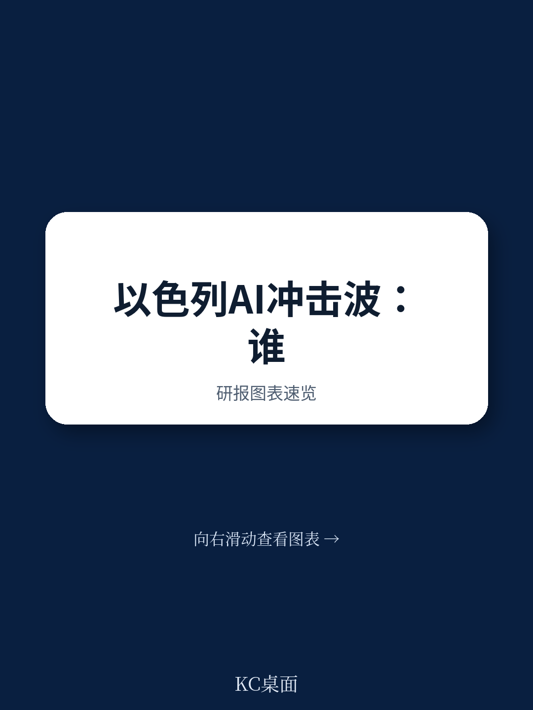
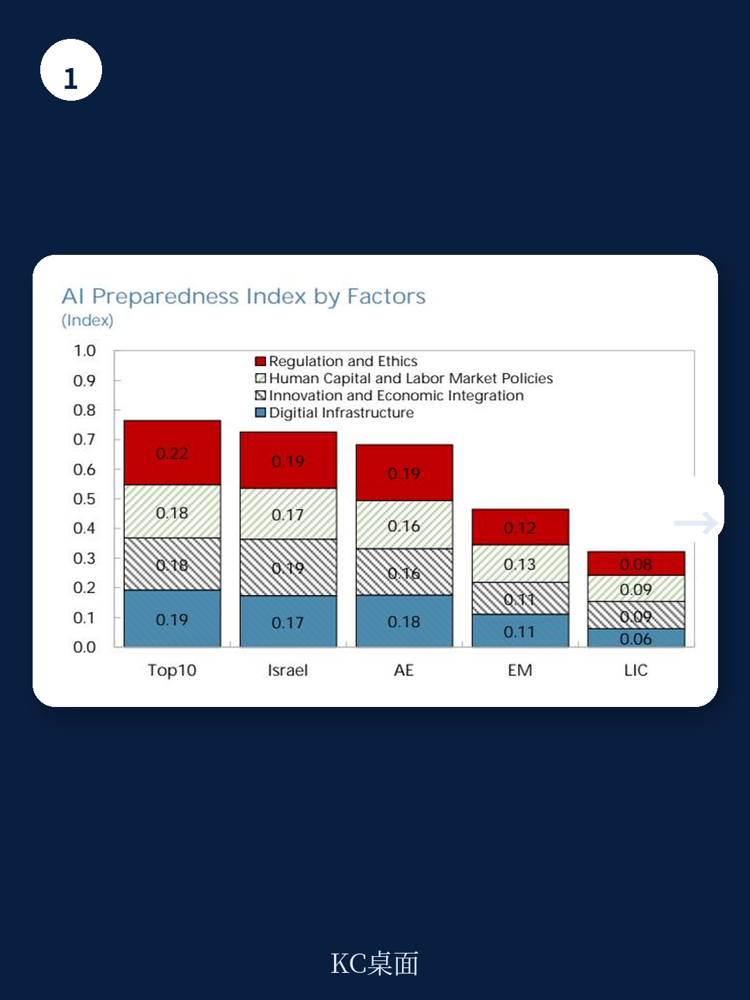
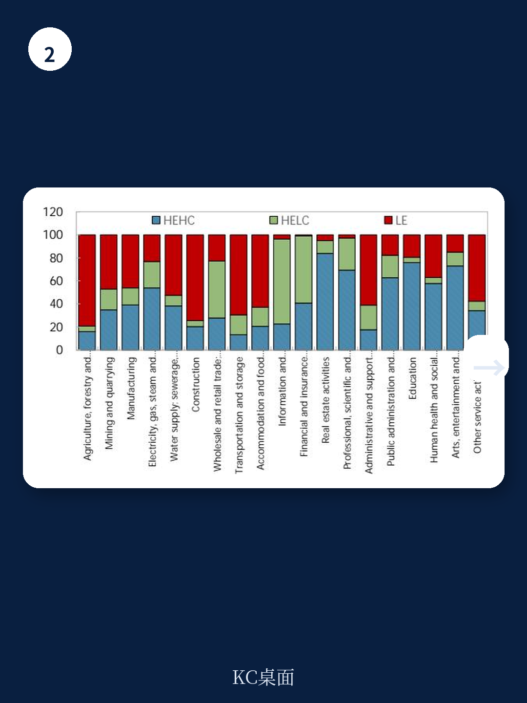

# IMF报告揭示：以色列AI冲击下，五分之一的岗位面临真正风险

全球对人工智能的讨论，常常陷入两种极端：要么是无所不能的生产力救星，要么是消灭工作的终结者。但IMF最新发布的以色列国别报告，提供了一个更精细、也更有政策参考价值的分析框架。

这份报告的核心判断是：以色列劳动力市场对AI的“暴露度”很高，约三分之二的岗位将受到显著影响，但其中大多数岗位与AI是互补关系，这意味着这些从业者更可能因为AI而提效，而非被替代。然而，报告同时发出警示：大约五分之一的以色列工人，约占总就业的20%，处于“高暴露、低互补”的脆弱区间，他们面临的，是真实的岗位替代风险。

这个结论之所以重要，不仅仅因为它量化了风险，更在于它揭示了以色列经济一个深层的结构性矛盾：全球领先的AI创新生态，与一个高度分化的“二元劳动力市场”并存。当AI的冲击波从高科技创新中心向外扩散时，最先承压的，可能不是那些技能最弱的群体，反而是高附加值行业中那些看似“体面”的专业岗位。

## 1. 以色列的AI悖论：全球领先的创新能力，并未转化为普惠的劳动力准备

IMF的AI准备度指数将以色列排在全球第18位，斯坦福AI指数也将其列在AI私人投资和新创公司数量的前列。以色列约28%的企业报告使用了AI，这个比例在OECD国家中处于领先。看起来，以色列在拥抱AI方面，已经抢跑了。

但这份报告同时揭示了一个令人不安的缺口：技能供应远远跟不上需求。IMF构建的“技能准备度与失衡指数”显示，以色列在AI相关领域的毕业生数量，与市场预期的新增技能需求之间存在巨大鸿沟，这个缺口比许多发达经济体都要大。

> **KC评论：** 这揭示了一个核心矛盾。以色列的AI产业很强大，但它的教育体系，特别是高等教育中STEM领域的产出，并没有跟上产业扩张的速度。这就像一条高速公路，跑车（AI企业）很多，但能开快车的司机（AI人才）不够。对于投资者而言，这意味着以色列AI公司的“人才成本”和“人才争夺战”将在很长时期内是核心议题。

更根本的问题在于以色列经济的“二元结构”。高科技创新部门的生产率和技能水平极高，但其他传统行业、服务业和公共部门的数字化和AI应用水平则明显滞后。这种结构性割裂意味着，AI带来的生产力提升，很可能首先并主要集中在一小部分高精尖企业，而经济整体的普惠性增长，则受制于更广泛的技能瓶颈。

## 2. 三分之二岗位“暴露”，但风险分布极不均匀：公共部门受益，私营部门承压

报告将岗位分为三类：高暴露-高互补（HEHC）、高暴露-低互补（HELC）和低暴露（LE）。这个分类是理解AI冲击的关键。

- **高暴露-高互补（HEHC）**：约占总就业的44%。这类岗位高度暴露于AI，但AI主要作为辅助工具，提升工作效率。典型代表是教育、医疗、商业和行政助理专业人员、科学与工程专家。这些岗位的从业者需要拥抱AI，否则可能被掌握AI的同行淘汰。
- **高暴露-低互补（HELC）**：约占总就业的22%。这是风险最高的群体。AI更可能直接替代他们的核心任务。典型代表是信息通信技术（ICT）专家、销售人员和商业与行政专业人员。报告特别指出，ICT、金融和保险这三个行业将成为重灾区，它们合计约占以色列总就业的12%。
- **低暴露（LE）**：约占总就业的34%。这些岗位涉及大量体力劳动、个人护理和服务，AI暂时难以替代。

这个分布揭示了一个反直觉的结论：**风险最高的不是低技能劳动者，而是高技能、高薪的白领专业人士。** 那些在ICT和金融行业工作的程序员、分析师、交易员，恰恰是AI替代风险最集中的群体。

> **KC评论：** 这颠覆了“AI先替代蓝领”的传统认知。对于以色列这样一个以高科技创新立国的经济体，报告给出的信号是：你的核心资产——高技能人才——正面临结构性挑战。对于投资者而言，这意味着需要重新评估那些依赖大量白领专业人员的公司（如金融科技、软件服务、专业咨询）的长期人力成本和竞争优势。那些能够率先利用AI提升内部效率，而非简单裁员的公司，可能更有韧性。

而公共部门则呈现出完全不同的图景。公共服务业占以色列总就业的三分之一，其中超过一半的岗位（如教师、医生）属于高暴露-高互补类别。这意味着，如果政府能有效推动AI在教育和医疗领域的应用，公共服务的效率和质量有望大幅提升。

## 3. 性别与代际的“AI红利”与“AI陷阱”：女性受益，年轻人承压

报告在性别和年龄维度上的分析，提供了更细致的洞察。

**女性是AI的潜在赢家。** 近四分之三的女性工人高度暴露于AI，但其中大部分集中在教育、医疗、法律和社会服务等互补性高的岗位。报告认为，以色列女性从AI中获益的可能性，甚至高于欧洲同行。这主要是因为以色列女性在教育和医疗这两个公共部门就业的比例更高。

**年轻人则面临一个“AI陷阱”。** 报告数据显示，年轻工人（15-34岁）的AI暴露度最高，但他们的高暴露并未被同样高的互补性所抵消。这意味着，年轻一代虽然更早接触AI工具，但他们的工作内容可能更容易被AI替代。对于刚进入职场的大学毕业生，尤其是在商业、行政和销售领域的，他们与AI之间的竞争关系可能比想象中更激烈。

**不同族群之间的风险差异，则映射了以色列社会更深层的分化。** 犹太裔（非哈瑞迪）工人面临最高的替代风险（约25%的岗位为HELC），因为他们大量集中在高暴露的科技和商业岗位。相比之下，阿拉伯裔以色列人由于更多集中在低技能、低暴露的体力劳动岗位，反而暴露度较低。哈瑞迪（极端正统派）男性由于世俗教育参与度低，也处于低暴露区，但这并非好事，它意味着他们被排除在AI带来的生产力提升之外。

## 4. 报告尚未完全回答的关键问题：AI的“再分配效应”会如何重塑社会契约？

IMF报告的结论是明确的：政策需要聚焦于“终身学习”、“技能重塑”和“针对特定群体的定向支持”。但这份报告也留下了一些悬而未决的关键问题，这些恰恰是投资者和决策者最需要深入思考的。

**第一，AI的“赢家”和“输家”之间的鸿沟如何弥合？** 报告指出，高技能、高收入的科技和金融从业者面临替代风险，而低技能、低收入的体力劳动者则相对安全。但如果AI真的替代了大量高薪白领，这些人的再就业方向是什么？他们是否会向下挤压中低技能岗位，导致更广泛的薪资停滞？社会是否会因此出现一个“AI中产阶级塌陷”？

**第二，教育体系的改革能否跑赢技术迭代的速度？** 报告呼吁扩大STEM招生、更新数学和科学课程。但现实是，一个大学本科需要四年，而AI的能力每隔几个月就会跃升。当学生毕业时，他们所学的内容可能已经过时。报告没有深入探讨，在AI时代，传统的“先学习、后工作”的线性教育模式是否已经失效，以及如何构建一个真正“终身”且“即时”的技能更新体系。

**第三，以色列的“二元经济”能否被AI打破？** 报告指出，高科技创新部门的AI应用远快于其他行业。如果AI的生产力红利只集中在少数头部企业，而传统行业和公共部门因为技能和基础设施瓶颈而落后，那么以色列的经济不平等可能会进一步加剧。AI究竟是缩小还是放大了以色列的“二元结构”，报告没有给出答案。

## 5. 一个观察框架：如何评估一家以色列公司在AI时代的“韧性”？

基于这份报告的分析，我们可以提炼出一个评估框架，用于观察以色列企业（乃至全球类似经济体）在AI冲击下的表现。

- **第一，审视公司的“岗位组合”。** 它有多少比例的员工处于“高暴露-高互补”的岗位？又有多少处于“高暴露-低互补”的岗位？一个健康的公司，应该努力将后者向前者转化，例如通过培训让程序员从写代码转向AI系统架构设计。
- **第二，评估公司的“AI采纳策略”。** 它是在用AI“替代”人（裁员降本），还是在用AI“增强”人（提升每个员工的产出）？前者的短期财务指标可能更好看，但后者的长期组织能力和员工忠诚度可能更强。
- **第三，关注公司的“人才供应链”。** 它是否与教育机构合作，定制化培养人才？它是否有内部持续学习的机制，帮助现有员工跟上AI的迭代？在技能短缺的环境下，能够自我造血人才的公司，将拥有核心竞争优势。
- **第四，观察公司的“外部性”。** 它的AI应用，是加剧了社会不平等，还是提供了普惠化的服务？例如，一个AI教育公司如果能有效服务阿拉伯裔或哈瑞迪群体，它不仅是一个商业机会，也契合了政策方向，可能获得更多支持。

IMF这份关于以色列的报告，其价值远超国别分析。它提供了一个可复制的分析框架，帮助我们在AI浪潮中，分辨哪些是真正的机遇，哪些是必须正视的结构性风险。它告诉我们，未来的赢家，不是那些最懂AI技术的公司，而是那些最懂得如何让AI与“人”协同进化的经济体。

但这份报告也留下了最核心的追问：当五分之一的工人面临被替代的风险，当高技能白领不再是安全的避风港，我们的社会契约、教育体系和福利制度，是否做好了准备？这些问题的答案，无法从一份研报中直接读出，它们需要更深入的讨论和更系统的思考。

---

如果你想深入理解这份报告中的核心图表，包括“AI暴露度与互补性”的行业分布、不同族群和性别的风险对比，以及IMF提出的具体政策建议，欢迎加入我们的社群。每天，我们的AI agent会结合人工审核，为你精选并解读10-40页的国际投行与IMF最新报告摘要，附带原始数据图表，既方便你直接喂给AI模型进行二次分析，也方便你快速把握全球市场动态。在这里，我们不仅分享信息，更共同构建一个在AI时代进行理性决策的认知框架。

Personal reading notes and learning share only. Not investment advice.

