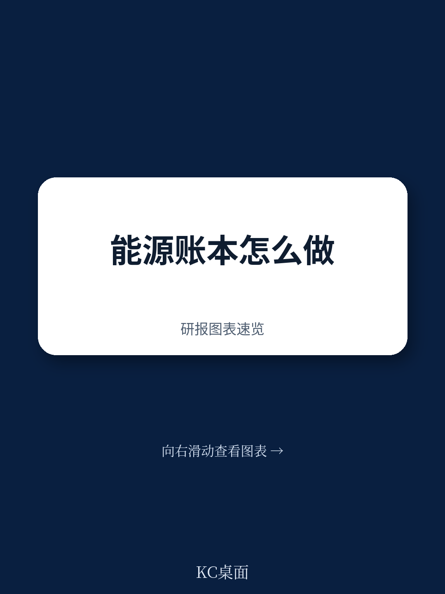
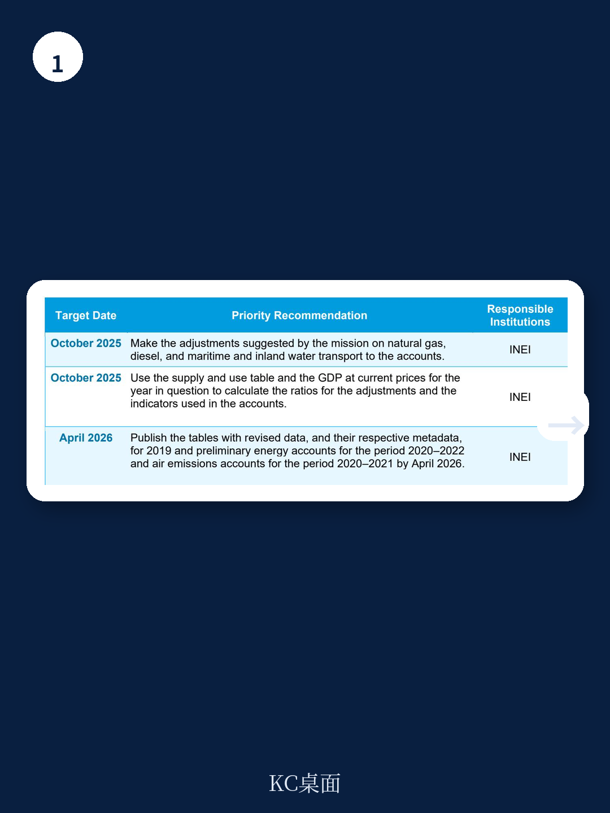
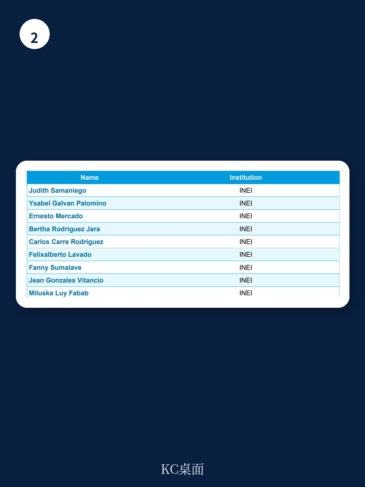

# 世界银行：秘鲁能源与排放账户的“实验性”突破，才是全球碳核算的真正起点

一份由国际货币基金组织（IMF）统计部门主导、瑞士联邦经济事务秘书处资助的技术援助报告，在2025年10月完成了一次看似不起眼的“复查与验证”。它针对的是秘鲁国家统计局（INEI）编制的2019年实物能源流量账户（PEFA）与空气排放账户（AEA）修订版，以及2020-2022年的初步账户。但这份报告的价值，远不止于帮助一个南美国家完善统计体系。

它揭示了一个被市场严重低估的趋势：全球碳核算正在从“自愿披露”和“学术估算”阶段，不可逆转地滑向“官方统计”与“国民账户对齐”阶段。当能源消耗与空气排放数据被强制纳入与GDP、投入产出表完全一致的核算框架时，碳税、碳边境调节机制（CBAM）以及企业碳足迹的定价基础，将不再是模型推演，而是官方统计。这对所有依赖“碳信用”或“碳定价”逻辑的资产，意味着一次根本性的重估。

## 1. 秘鲁账户的“实验性”标签，恰恰是它最重要的信号

这份报告的核心成就，是秘鲁在2025年7月11日发布了名为“实物能源流量与空气排放实验账户——方法与结果”的官方文件。请注意“实验性”这个定语。在统计术语中，“实验性”意味着数据尚未达到常规国民账户的精确度，但已经具备了官方统计的骨架和纪律。

报告明确写道，这些账户“与《2012年环境经济核算体系——中心框架》（SEEA-CF）的核算结构和原则保持一致，因此，与国民账户体系（SNA）的货币数据完全一致。” 这句话是整份报告最具冲击力的判断。它意味着，秘鲁的能源消耗和碳排放数据，现在可以直接与GDP、行业增加值、投入产出表进行无缝对接。这不是企业ESG报告里的估算，而是与一国宏观经济统计同源的官方数据。

> **KC评论：** 秘鲁的“实验账户”之所以重要，不是因为数据完美，而是因为数据框架对。它证明了，即使是一个发展中国家，在IMF和瑞士政府的技术支持下，也能在两年内建立起与国民账户体系完全对齐的能源与排放账户。这为其他新兴市场国家提供了可复制的模板。完整报告的第3-7段详细描述了从诊断、培训到数据验证的完整路径，值得所有关注碳核算基础设施的投资者细读。

## 2. 天然气与柴油的“错配”，暴露了碳数据最隐蔽的失真来源

报告在技术评估部分，揭示了一个非常具体但影响深远的问题：在秘鲁的能源平衡表中，天然气和柴油在采矿业和制造业之间的分配存在“不连贯性”（incoherence）。具体而言，采矿业和制造业的“自用能源消耗”数据，不仅包含了天然气，还混入了石油衍生品。这导致两个行业的能源消耗和相应排放被同时扭曲。

这听起来像一个琐碎的统计问题。但它意味着，任何基于现有能源平衡表计算的行业碳排放强度，都可能存在系统性偏差。如果采矿业的排放被高估，而制造业的排放被低估，那么针对这两个行业设计的碳税或减排政策，就会产生错误的激励。报告建议秘鲁国家统计局与能源矿产部（MINEM）协作，获取更详细的分类数据来修正这一偏差。

这个案例说明，碳核算的精确性，最终取决于最底层的能源分类和分配规则。没有这种“颗粒度”的修正，全球碳市场的基础数据就是沙上建塔。

## 3. “居民原则”调整：一个被全球碳核算忽视的会计陷阱

报告反复强调的一个技术要点是“居民原则”（residence principle）调整。通俗地说，就是一国账户只应记录本国居民单位的能源消耗和排放。但现实远比这复杂。例如，国际海运和内陆水运中，外国船只在秘鲁水域消耗的燃料，不应计入秘鲁的排放账户；而秘鲁船只在公海或外国水域消耗的燃料，则应计入。

这份报告指出，秘鲁的账户在“海运和内陆水运”的居民原则调整上需要改进。IMF专家建议秘鲁联系经济合作与发展组织（OECD）获取更详细的实验性导航运输数据库，并向秘鲁中央储备银行（BCRP）索取详细的国际收支数据（例如，向非居民销售的燃料和居民在国外的燃料购买）。

> **KC评论：** “居民原则”调整是连接能源账户与国民账户的“最后一公里”。没有这个调整，能源与排放数据就无法与GDP、国际收支等宏观经济指标对齐。报告第21段明确指出了这个调整对于“使能源和排放数据与国民账户数据保持一致”的必要性。这是完整报告中技术含量最高、也最容易被非专业人士跳过的部分，但它恰恰决定了碳账户的宏观经济可信度。

## 4. 报告尚未完全回答的关键问题：从“实验性”到“常规化”的成本与时间

尽管秘鲁的进展令人鼓舞，但报告也坦承了尚未解决的挑战。最核心的问题是：如何从“项目驱动”的临时性编制，过渡到“机制驱动”的常规化生产？报告设定的目标是，到2026年4月，秘鲁将发布修订后的2019年数据、2020-2022年的初步PEFA以及2020-2021年的初步AEA，并建立起常规编制机制。

但实现这一目标的前提是：“需要将额外的人力资源配置到PEFA和AEA的编制工作中。” 这句话背后是一个现实问题：环境经济核算需要高度专业的统计人才，而这类人才在发展中国家本就稀缺。当IMF的技术援助项目结束后，秘鲁国家统计局是否有足够的预算和意愿维持这套账户的年度更新？如果答案是否定的，那么“实验性账户”就可能永远停留在“实验”阶段。

这引出了一个更广泛的担忧：全球碳核算的标准化，是否会因为各国统计能力的差异而陷入“两层皮”的困境？发达国家可以快速推进，而发展中国家则可能长期停留在“实验账户”水平。如果碳边境调节机制（CBAM）最终以这些官方账户为计算基础，那么统计能力薄弱的国家，其出口行业将面临不成比例的合规风险。

## 5. 对投资者的观察框架：从“看数据”转向“看统计制度”

这份世界银行（IMF）的技术报告，为产业决策者和高净值读者提供了一个全新的分析维度：评估一国碳政策风险，不应只看其排放总量或减排目标，而应看其环境经济统计制度的成熟度。

一个拥有完善PEFA和AEA账户的国家，其碳税、碳市场和CBAM的落地将更加精确和可预期。相反，一个账户仍停留在“实验性”阶段的国家，其碳政策可能充满统计噪声，导致企业面临不可预测的合规成本调整。秘鲁的案例表明，从“没有账户”到“实验账户”大约需要两年，但从“实验账户”到“常规账户”可能需要更长时间，且高度依赖政治意愿和财政资源。

因此，对于在秘鲁或类似新兴市场有业务布局的企业，一个务实的行动是：关注该国国家统计局（INEI）和能源矿产部（MINEM）在数据共享和人力资源配置上的实际投入。报告明确建议秘鲁“从2026年起建立账户的常规编制和发布机制”，并“从2026年3月起开始向联合国和OECD提交AEA和PEFA问卷的年度报告”。这些时间节点，就是企业评估当地碳合规风险演变的关键路标。

---

这份报告揭示了一个清晰的趋势：全球碳核算正在从“自愿的、基于模型的”估算，转向“强制的、基于国民账户的”官方统计。秘鲁的“实验账户”是这个趋势中的一个具体注脚，但它所暴露的技术问题——能源分配错配、居民原则调整、人力与制度可持续性——是所有国家在推进碳核算时都会遇到的共性问题。

完整报告包含了更多关于数据交叉验证、与OECD和BCRP的数据协调细节，以及如何利用供应使用表计算经济-环境指标的具体方法。这些技术细节，对于理解碳账户的可信度和局限性至关重要。

如果你希望获得这份IMF技术报告的完整中文摘要、原始图表以及每日由AI Agent与人工审核生成的其他国际投行研报解读（约10-40页），欢迎加入我们的社群。社群每日更新，既方便您喂给AI模型进行二次分析，也方便您快速把握全球市场动态与政策走向。在这里，我们持续追踪从“实验账户”到“常规账户”的每一步。

Personal reading notes and learning share only. Not investment advice.

