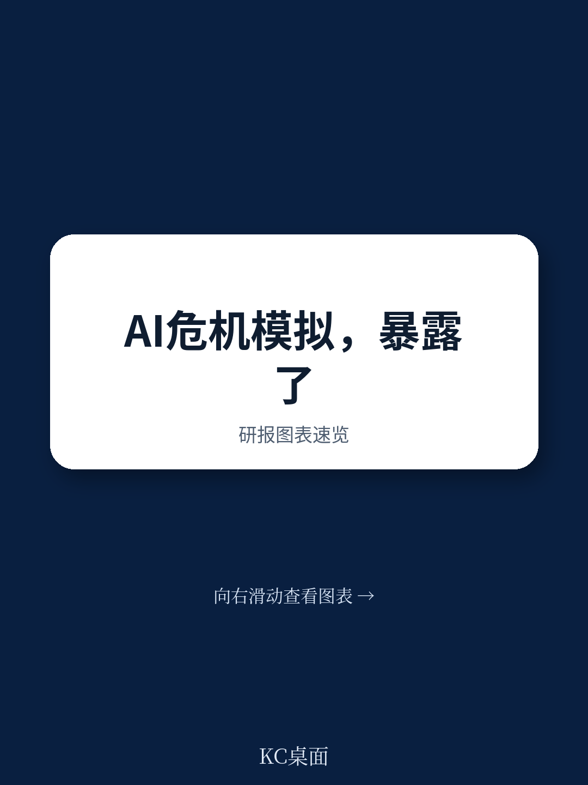

# 兰德公司：欧洲AI危机推演揭示的最大盲区不是技术，而是政府根本接不住

当一场由AI驱动的网络攻击在数小时内从区域性金融欺诈升级为国家基础设施威胁时，欧洲三国的高级政策官员发现，他们最缺乏的不是技术方案，而是一套能回答“现在该做什么”的决策框架。

这是兰德公司联合英国AI安全研究院与魁北克AI研究所在柏林、海牙和巴黎进行的三场桌面推演的核心发现。推演基于2026年国际AI安全报告的科学评估，将政策制定者直接投入一个模拟的AI危机现场——一个受到政府资助的国内AI公司“FlowGPT”的模型能力被犯罪网络系统性利用，导致大规模网络攻击。

结果令人警醒。在长达两小时的危机模拟中，参与者反复陷入几个结构性困境：没有预先定义的危机阈值，他们花了大量时间争论“这到底是不是国家危机”；没有独立的评估能力，他们只能依赖模型开发者的自我报告；没有建立好的跨机构协调机制，他们发现信息流动的速度远赶不上攻击扩散的速度。

这份报告的价值不在于它揭示了AI本身的风险——这一点国际安全报告已经说得很清楚——而在于它暴露了政府在“接到球之后”的体系性准备不足。当技术风险从实验室走向现实，政策制定者需要的不只是更多的科学证据，而是一套能将证据转化为行动的制度基础设施。

## 1. 最大的治理盲区：政府无法独立评估它所资助的AI模型有多危险

推演中最具张力的一幕，是参与者面对一个“国家冠军企业”的模型可能已被滥用于网络攻击，但政府自己没有任何技术能力去验证这一判断。他们只能依赖FlowGPT公司内部的安全测试报告——而这家公司恰恰是政府自己投入巨资扶持的战略资产。

这构成了一个经典的“证据困境”：在没有独立评估能力的情况下，任何针对该模型的限制措施都面临巨大的政治和经济成本。限制一个你刚刚公开扶持过的企业，等于承认你的产业政策存在治理漏洞；而不采取行动，则可能让关键基础设施暴露在持续的攻击之下。

兰德报告明确指出，参与者普遍认为“独立的政府技术评估能力”是危机应对中最紧迫的缺失。这不是一个技术问题，而是一个权力结构问题。当政府将AI能力的评估完全外包给市场，它在面对危机时就失去了最基础的政策工具。

> **KC评论：** 这份报告揭示了一个常被忽视的悖论：政府越积极扶持本国AI产业，它在面对该产业带来的安全风险时就越被动。不是因为企业不配合，而是因为政府失去了“不知道”的权利——如果你已经公开背书了这家公司，任何质疑都变成了对自己产业政策的质疑。完整报告中对“评估缺口”的详细讨论，以及参与者在不同国家语境下的应对差异，值得仔细阅读。

## 2. 危机阈值缺失：当“日常事件”突然变成“国家危机”，决策者还在争论定义

推演中一个反复出现的主题是：参与者无法就“什么时候该拉响警报”达成共识。当网络攻击的频率和规模逐渐升级，从区域性银行欺诈到针对公共部门的系统性数据窃取，参与者发现他们缺少一套明确的指标来判断“这是否已经构成了国家危机”。

兰德报告将这一问题归结为“危机阈值”的缺失。在缺乏预先约定的升级标准的情况下，决策者的自然倾向是等待更多信息。但AI驱动的攻击恰恰具有指数级扩散的特征——等待意味着被动，而被动意味着损失不可控。

参与者在推演中提出的建议是：政府需要预先定义AI事件的升级阈值，明确什么样的规模、速度、影响范围构成了国家危机，并配套相应的授权机制。这不是一个学术问题。没有阈值，就没有自动化的响应流程；没有授权机制，就没有人敢在信息不足时做出果断决策。

> **KC评论：** 这本质上是一个“事前决策”的问题。兰德报告的核心洞察是：在AI危机中，你无法在事件发生时做出高质量的决策，因为你没有时间。所有重要的决策——什么是危机、谁有权启动响应、信息如何流动——都必须事先完成。报告中对“预先约定的升级阈值”的具体设计思路，以及参与者在不同国家体制下的差异化应对，是理解这一问题的关键。

## 3. 开放权重模型的治理困境：一旦模型参数流出，所有安全措施都失效

推演的第二阶段引入了“PieAI”——一个可能通过权重窃取或模型蒸馏从FlowGPT克隆而来的开放权重模型。这一设计的意图是测试参与者对开放权重生态的治理能力。

结果并不意外。当参与者发现PieAI的权重可以公开下载、直接修改、无法追溯时，他们意识到之前针对FlowGPT的所有治理工具——许可协议、安全护栏、使用监控——全都失效了。开放权重模型可以被任何人用于任何目的，包括复制和增强攻击能力。

兰德报告指出，参与者普遍认为当前的国际治理框架无法有效应对开放权重模型的扩散风险。虽然推演中讨论了一些可能的对策——包括对基础模型训练数据的跨境追溯、对关键计算资源的国际监控——但参与者承认，这些措施在政治和技术上都面临巨大障碍。

> **KC评论：** 开放权重模型的风险不在于它本身更不安全，而在于它彻底改变了安全治理的逻辑。对于封闭模型，你可以通过控制访问来管理风险；对于开放权重模型，你只能通过控制能力来管理风险——而后者需要完全不同的治理工具。报告中对“阶段性开放”和“分层访问”框架的讨论，以及这些框架在实际压力测试下的表现，是当前政策讨论中非常前沿的议题。

## 4. 危机中的“好消息”：推演也发现了几个可能有效的应对方向

兰德报告不是一份纯粹的悲观报告。在三场推演中，参与者也在危机中识别出了一些值得投入的应对方向。

首先是“利用现有的事故响应协议”。参与者发现，虽然AI驱动的攻击在规模和技术上与传统网络攻击不同，但许多基础性的响应框架——包括关键基础设施的隔离、信息共享机制、跨部门协调流程——仍然适用。问题不在于需要一套全新的体系，而在于现有体系需要针对AI的加速能力进行升级。

其次是“以AI对抗AI”。推演中，参与者讨论了部署防御性AI系统来加速威胁识别和响应速度的可能性。这一思路的核心是：既然攻击者正在利用AI自动化攻击流程，防御者也需要利用AI自动化防御流程。

第三是“将危机转化为制度变革的催化剂”。参与者在推演中发现，危机本身创造了平时无法获得的政治意愿和资源。关键问题不是“是否应该利用危机推动改革”，而是“如何在危机结束前锁定这些改革成果”。

## 5. 报告尚未完全回答的关键问题：谁来为“证据缺口”买单？

兰德报告坦诚地承认了其研究的局限性。推演只有55名参与者，全部来自欧洲政府，样本量有限且地域集中。更重要的是，报告提出了一个它自己无法完全回答的问题：当政府缺乏独立评估AI风险的能力时，谁来承担“等待更多证据”的成本？

在推演中，参与者面对的核心张力是：行动太早可能损害产业竞争力，行动太晚可能造成不可逆的安全损失。兰德报告识别了这一张力，但没有给出解决方案。这是因为，在当前的制度框架下，这可能不是一个有解的问题——至少不是一个能在单个国家层面解决的问题。

报告建议的下一步方向包括：在亚洲进行类似推演以检验不同治理文化下的发现；设计更直接涉及技术主权和地缘政治定位的场景；测试阶段性发布框架在现实压力下的表现。这些方向都指向同一个核心问题：AI治理需要从“科学评估”转向“制度设计”，从“知道风险是什么”转向“知道风险来了该做什么”。

---

兰德公司的这份报告提供了一个罕见的视角：它不只是在谈论AI的风险，而是在测试政府面对这些风险时的真实反应。结果清楚地表明，最大的缺口不是技术能力，而是制度准备。

推演中暴露的六个优先能力——危机升级阈值、系统性的网络防御评估、独立的政府技术评估能力、精准的危机沟通策略、能快速激活的多边治理框架、开发者与政府之间的结构化信息流动——每一项都需要在危机发生前完成建设。而每一项的建设，都需要政策制定者、技术专家和产业界之间远比现在更紧密的协作。

这些问题，以及推演中参与者提出的具体政策选项和各国之间的差异化策略，在完整报告中都有更详细的讨论。如果你希望深入了解这些议题，包括兰德公司使用的“事后方法论”如何设计危机场景、参与者提出的具体政策建议、以及当前国际AI治理框架中的具体漏洞，欢迎加入我们的社群，获取完整研报解读与原始图表。我们每天由AI agent结合人工review生成国际投行的中文摘要与KC评论，包含当天最新的数据图表合集，方便你快速把握全球AI治理与产业动态。

Personal reading notes and learning share only. Not investment advice.

