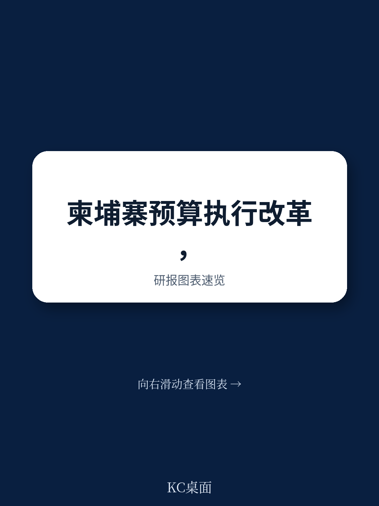

# IMF报告：柬埔寨预算执行改革走到了哪一步，又卡在了哪里

一份来自国际货币基金组织（IMF）技术援助团队的报告，在2025年10月对柬埔寨预算执行体系进行了为期两周的全面战略评估。结论是：柬埔寨在过去二十年取得了显著进展，但真正决定改革成败的，不是顶层设计，而是FMIS系统的最后一公里、现金垫款的灰色地带，以及国库单一账户的实质性落地。

这份报告的价值不在于它告诉外界柬埔寨做得有多好，而在于它精准地指出了“从好到卓越”之间的结构性障碍。对于关注新兴市场财政改革、数字化转型或主权信用风险的读者来说，这是一份难得的“手术刀式”诊断。

## 1. 法律框架和数字化已经走在前列，但执行层存在系统性的“断点”

IMF报告首先肯定了柬埔寨公共财政管理改革计划的成果。自2004年以来，柬埔寨政府持续推进改革，2023年通过的《公共财政体系法》及配套子法令，为预算执行提供了相对完善的法律基础。财政管理信息系统（FMIS）也已在大多数预算单位推广使用。

但真正的挑战不在法律文本，而在执行链条的末梢。报告明确指出，尽管FMIS成为核心数字化工具，但仍有部分预算单位尚未被授权为“完全授权预算实体”。这意味着它们无法直接访问FMIS，也无法使用电子资金转账（EFT）完成支付。这种“授权不完整”的状态，直接导致预算执行效率参差不齐，部分单位仍依赖纸质流程，增加了时间成本和人为干预空间。

> **KC评论：** 这其实是很多发展中国家数字化转型的典型困境——中央系统建好了，但基层单位要么没有权限，要么没有能力用。IMF建议在2027年前将所有未授权实体转化为完全授权实体，这个时间表本身就是一个关键观察点。完整报告里有详细的阶段性目标分解，值得细看。

## 2. FMIS的“最后一公里”才是真正的瓶颈，而非技术本身

报告对FMIS的改进建议，揭示了问题的核心：系统功能已经覆盖了大多数环节，但“连接”和“自动化”远远不够。具体来说，有三个关键缺口：

第一，FMIS与银行系统、收入系统的对接仍不完善。这导致政府对非国库单一账户（TSA）的账户余额——例如现金垫款账户和项目账户——缺乏实时可见性。没有完整的余额视图，自动对账和承诺记录就无法真正实现。

第二，电子采购和电子发票模块尚未最终完成并投入使用。这意味着从采购申请到支付确认的链条中，仍存在人工断点。

第三，FMIS尚未充分利用其记录多年承诺的功能。报告建议，在预算年度的前一年就开始记录经常性承诺，从而让采购流程提前启动，使支出在全年各季度之间更加均衡，避免年底突击花钱。

这三点合在一起，揭示了一个深层问题：FMIS的瓶颈不是技术架构，而是业务流程的数字化覆盖率和对齐度。系统再先进，如果采购、发票、支付、对账四个环节不能在一个闭环内自动流转，效率提升就会遇到天花板。

## 3. 现金垫款和公共欠款是财政纪律的“暗流”，比表面数字更危险

报告用了相当篇幅讨论现金垫款和公共欠款问题，这可能是全篇最能引发投资者关注的部分。现金垫款是指预算单位在没有正式拨款的情况下先行支付，之后再申请核销。这种做法如果缺乏严格管控，很容易演变为隐性赤字和公共欠款的积累。

IMF的建议非常具体：第一，制定并采纳必要的法律框架，进一步将支出欠款的定义与国际实践对齐；第二，允许在财政年度开始前进行承诺请求的内部准备和审批，以缩短执行周期；第三，引入分级的承诺控制审批门槛。

> **KC评论：** 这听起来像是技术细节，但它的含义对主权信用评估很重要。如果一个国家的现金垫款规模持续增长且透明度不足，它可能意味着财政纪律存在系统性漏洞。报告里有一张关于欠款管理路线图的执行时间表，对于判断柬埔寨未来财政风险走势非常关键。

## 4. 国库单一账户（TSA）的“半完成状态”制约了现金管理的主动性

TSA是现代化国库管理的核心工具，其原理是将所有政府现金余额集中在一个账户中，实现统一管理和最优配置。柬埔寨在收入归集方面已经做得不错，但问题在于支出账户——大量非TSA账户仍然存在，且缺乏有效的监督和对账。

报告建议：加强法律框架，明确监控规则、报告义务和违规问责；分阶段扩大TSA覆盖范围；提高现金预测质量和治理水平。同时，将FMIS与债务系统连接、强化现金管理委员会职能，可以实现更积极的现金管理，包括对闲置资金进行安全短期投资。

这实际上是在说：柬埔寨的国库现金管理还处于“被动”阶段——钱进来了、出去了，但中间没有主动优化。如果TSA全面落地，不仅可以降低融资成本，还能提高财政资金的使用效率。

## 5. 报告没有完全回答的一个关键问题：改革的政治经济学阻力来自哪里？

IMF报告在技术层面提供了清晰的路径图，但它没有（也不可能）深入讨论一个问题：这些改革建议在执行层面会遭遇哪些政治经济学阻力？

例如，将未授权实体转化为完全授权实体，意味着部分部委和地方政府将失去对预算执行的“控制权”，这可能触及既得利益。同样，严格管控现金垫款，可能会影响一些部门在紧急情况下的灵活性。TSA的全面推广，也需要协调各层级政府之间的利益。

这些都不是技术问题，而是制度变迁中的权力再分配问题。报告提出了“强政治承诺”作为成功的前提，但并未分析如何维持这种承诺，尤其是在改革进入深水区之后。

> **KC评论：** 技术援助报告通常只回答“应该做什么”，不回答“谁可能反对”。但对于真正想理解柬埔寨改革前景的读者来说，后者往往更重要。完整报告里有一份2026-2028年优先行动计划和可衡量的绩效指标，如果你能结合这些指标去追踪后续的执行进度，会比只看结论更有洞察。

## 6. 对读者而言，这份报告提供了一个“可追踪的观察框架”

对于关注新兴市场主权风险、基础设施投资或发展援助效果的读者，这份报告的价值不在于一次性阅读，而在于它提供了持续跟踪柬埔寨财政改革的坐标轴：

第一，FMIS的授权实体覆盖率。如果2027年前所有实体完成转化，说明改革执行力较强。

第二，现金垫款和欠款的规模变化。如果欠款定义与国际对齐且规模下降，说明财政纪律在改善。

第三，TSA的账户覆盖率和现金预测准确性。这是衡量国库管理成熟度的核心指标。

第四，电子采购和电子发票模块的上线时间。这直接影响采购效率和透明度。

这四个维度，构成了一个比GDP增长率或财政赤字率更精细的“先行指标”组合。它们的变化，往往比宏观数据更早地反映出财政改革的真实进展。

---

这份IMF技术援助报告全文约40页，包含详细的行动路线图、绩效指标和案例分析。我们已将报告的中文摘要、关键图表以及KC评论整理为完整版解读，供社群成员参考。

如果你希望：
- 获取这份报告的完整中文摘要和原始图表
- 每日接收由AI agent+人工review生成的国际投行与多边机构研究报告摘要（约10-40页）
- 在社群中与其他读者一起讨论新兴市场财政改革的跟踪框架

欢迎加入我们的知识星球。每天更新，既方便喂给AI做进一步分析，也适合人工快速把握全球市场动态。

Personal reading notes and learning share only. Not investment advice.

