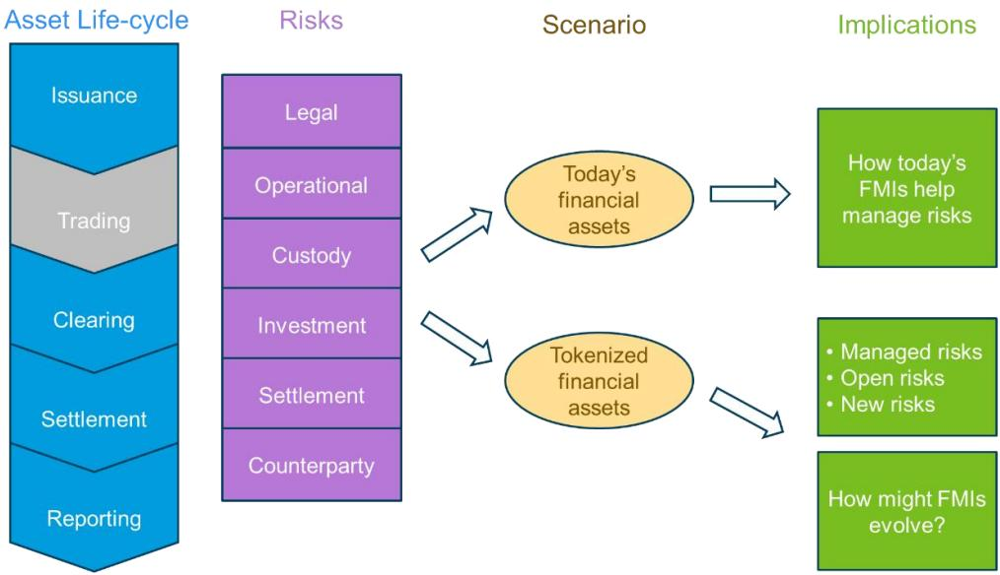
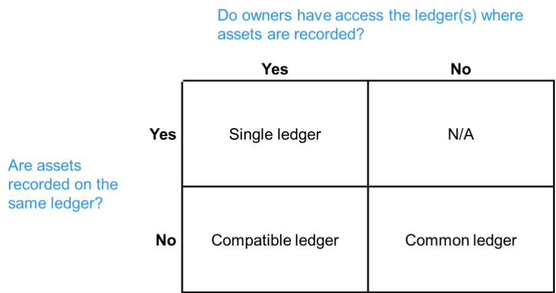
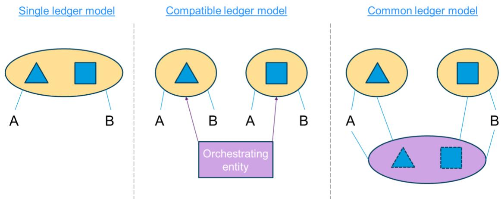

# The Evolution of Financial Market Infrastructures in a Tokenized Economy

# Exploring blockchain implementation options for issuance, central clearing, settlement, and reporting

Prepared by Yaiza Cabedo, Tommaso Mancini-Griffoli, Fabian Schär, Nicolas Zhang

WP/26/136

IMF Working Papers describe research in progress by the author(s) and are published to elicit comments and to encourage debate. The views expressed in IMF Working Papers are those of the author(s) and do not necessarily represent the views of the IMF, its Executive Board, or IMF management.

2026
JUL

IMF Working Paper
Monetary and Capital Markets Department

The Evolution of Financial Market Infrastructures in a Tokenized Economy Prepared by Yaiza Cabedo, Tommaso Mancini-Griffoli, Fabian Schär, and Nicolas Zhang\*

Authorized for distribution by Marcello Miccoli
July 2026

IMF Working Papers describe research in progress by the author(s) and are published to elicit comments and to encourage debate. The views expressed in IMF Working Papers are those of the author(s) and do not necessarily represent the views of the IMF, its Executive Board, or IMF management.

ABSTRACT: This paper examines how tokenization and distributed ledger technology may transform Financial Market Infrastructures (FMIs) by enabling smart contracts to perform a growing share of functions traditionally undertaken by central securities depositories, central counterparties, and trade repositories. It argues that while record-keeping, settlement, collateral management, and reporting can increasingly be executed on-chain, key functions requiring legal certainty, governance, accountability, and discretion remain institutional in nature. The analysis assesses which activities across issuance, clearing, settlement, and reporting can migrate to code, where limitations persist, and how risks evolve in tokenized environments. It finds that tokenization is more likely to reconfigure than eliminate FMIs, creating new efficiencies while introducing novel operational and governance risks. The most plausible outcome is a hybrid FMI model in which technology and institutions jointly provide the trust, resilience, and oversight required for financial stability.

RECOMMENDED CITATION: Cabedo, Yaiza, Tommaso Mancini-Griffoli, Fabian Schär, and Nicolas Zhang. 2026. "The Evolution of Financial Market Infrastructures in a Tokenized Economy". International Monetary Fund, Washington, DC. No. WP/26/136.

<table><tr><td>JEL Classification Numbers:</td><td>E58, G15, O33, O38</td></tr><tr><td>Keywords:</td><td>Tokenization; central counterparty; securities settlement system; central securities depository; trade repository; blockchain; smart contracts</td></tr><tr><td>Authors&#x27; email addresses:</td><td>YCabedo@imf.org, TMancini-Griffoli@bis.org, $^{1}$  F.Schaer@unibas.ch, $^{2}$  NZhang@imf.org</td></tr></table>

# The Evolution of Financial Market Infrastructures in a Tokenized Economy

# Exploring blockchain implementation options for issuance, central clearing, settlement, and reporting

Prepared by Yaiza Cabedo, Tommaso Mancini-Griffoli, $^{3}$ Fabian Schär, $^{4}$ Nicolas Zhang

## Contents

Introduction .... 3
I. Transaction Lifecycle, Risks, and the Role of Financial Market Infrastructures .... 5
The lifecycle of a transaction: issuance, trading, and post-trading .... 5
Risks associated with the lifecycle of a transaction.... 6
An overview of FMIs and how they mitigate risks .... 7
FMIs' ecosystem and governance.... 11
II. Features of Tokenized Financial Assets .... 13
Tokenization of financial assets.... 13
Blockchain governance .... 15
III. FMI Functions in a Tokenized World.... 20
Tokenized asset lifecycle.... 20
Risks and risk mitigation.... 24
Conclusion.... 32
Glossary.... 33
Annex 1. FMIs' value propositions and functions .... 38
Annex 2. Issuance, safekeeping of assets and settlement functions across platform models .... 40
Annex 3. Novation, multilateral netting and margin call functions across platform models.... 41
Annex 4. Derivatives data centralization functions across platform models.... 43
References.... 45
BOXES
1. FMIs relevant to this paper.... 8
FIGURES (as needed)
1. This paper's approach.... 4
2. The three possible relationships between ledgers, assets, and owners.... 17
3. Three architecture models exist.... 18

## Introduction

How should financial market infrastructures (FMIs) prepare for a world in which assets are tokenized? This paper argues that smart contracts and distributed ledgers can perform a substantial share of the functions now carried out by central securities depositories (CSDs), securities settlement systems (SSSs), central counterparties (CCPs), and trade repositories (TRs), especially where processes are deterministic, rules-based, and data-driven. $^{5}$ Record-keeping, settlement, collateral transfers and reporting can move on-chain. Yet code cannot by itself provide legal certainty, bear accountability, or exercise discretion under stress.

Tokenization does not imply disintermediation, but institutional redesign. The most plausible outcome is a hybrid FMI model, in which smart contracts perform a greater share of operational and transactional functions, while legal entities remain responsible for governance, compliance, risk management, and interventions to preserve business continuity. $^{6}$ This is particularly true where functions depend on off-chain inputs, cross-ledger coordination, supervisory access, or judgment in the calibration of margins, or the management of defaults.

This paper examines the shifts across issuance, clearing, settlement, and reporting. It asks which CSD, CCP and TR functions can migrate on-chain, where the main limitations remain, and where hybrid arrangements are likely to emerge. The objective is not to predict a single end-state, but to clarify the trade-offs and identify how responsibilities may be redistributed between technology and institutions in a tokenized financial system.

This analysis is intended for policymakers, supervisors and market participants alike. It aims to support a more systematic assessment of how existing infrastructures could adapt, how trust and accountability are reallocated between institutions and technology, and how efficiency gains can be realized without undermining financial stability.

Figure 1. This paper's approach  

## Source: Authors' elaboration.

Note: This paper focuses primarily on FMIs and their functions, issuance, clearing, settlement, and reporting for securities and derivatives. The paper analyzes how these functions may evolve in a tokenized environment through the asset lifecycle dimension. In this Figure, “Trading” appears in a different color, to indicate that the emphasis is on the other lifecycle stages that more directly relate to FMIs.

The paper is built around the lifecycle of securities and derivatives transactions, following the logic illustrated in Figure 1. Section 1 presents the lifecycle of a transaction in today's financial markets, the risks that parties to a transaction face, and how FMIs help mitigate them. Section 2 examines the features of tokenized financial assets, governance in blockchain ecosystems, and three possible architectures that arise from the relationships between ledgers, assets, and owners—the single, compatible, and common models. Section 3 explores how the lifecycle of a transaction may evolve in a tokenized environment, which risks would persist, and how these could be mitigated. Lastly, the paper offers conclusions and four annexes with tables that summarize the value propositions of FMIs today and how the functions of CSDs, SSSs, CCPs, and TRs could be delivered on blockchain across the three different architecture models.

# I. Transaction Lifecycle, Risks, and the Role of Financial Market Infrastructures

This section examines how financial transactions are structured today and the role that FMIs play in mitigating the risks that market participants face when transacting securities and derivatives. It first outlines the lifecycle of a transaction—from issuance to post-trade processes including clearing, settlement, and reporting—and identifies the key risks that arise at each stage. It then explains how FMIs are designed to mitigate these risks through a combination of operational, legal, and financial safeguards. Finally, it provides an overview of the FMI ecosystem and its governance arrangements. This framework serves as a benchmark for assessing how these functions, and the risks FMIs address, may evolve in a tokenized environment.

## The lifecycle of a transaction: issuance, trading, and post-trading

Issuance is the basis of securities markets, it is the creation of the security and its placement in the primary market. Initially, securities were issued as physical certificates, but this has evolved into dematerialized processes, where securities are transferred electronically via book-entry accounts. The process begins with opening an issuance account to record the number of assets created.

The accuracy of issuance records is essential for market confidence. Market participants depend on the integrity of issuance systems, responsible for maintaining accurate records to prevent the creation of unauthorized securities, thereby ensuring transparency and credibility in the issuance process. $^{7}$

Trading involves agreement on the terms to exchange assets. These include price, coupons, and settlement dates, as well as the verification of transaction details and written confirmations between parties. Trading occurs through matching platforms that bring together buyers and sellers. $^{8}$ All following stages of the asset lifecycle are known as post-trading.

Clearing is the process of determining the obligations of participants. Clearing through a central counterparty (CCP) involves novating the initial counterparties' contract, and the CCP becomes the buyer and the seller of the transaction. Clearing is calculating net positions and ensuring funds or securities are available to meet these commitments. CCPs use multilateral netting to consolidate obligations into a single position per participant, reducing risk.

Settlement occurs after the trade has been executed, it completes the transfer of ownership updating ownership records electronically at a CSD through book-entry accounts. During the time between trade and settlement (T and T+x), counterparties face risks such as asset destruction, failure to receive the asset, parties reneging on the trade, or the possibility of delivering an asset without receiving anything in return. To mitigate these risks, counterparties can either fully pre-fund the assets to be delivered from the moment the trade is entered or use risk management techniques, such as providing collateral.

The final step in the transaction lifecycle is reporting. Reporting involves providing data on executed transactions to enhance transparency and ensure access for authorities. The accuracy, completeness, and timeliness of the information reported are of the essence, as errors or delays can undermine transparency and hinder effective oversight.

Market participants rely on accurate records and coordinated processes. Settlement processes depend on the accuracy of ownership records at the CSD and the coordination between intermediaries such as custodians and registrars to maintain the integrity of securities ownership. Clear operational boundaries and robust reconciliation processes are essential, particularly in jurisdictions where registrars, rather than CSDs, oversee initial issuance.

The lifecycle of a transaction relies on coordination across systems and participants. Parties need to coordinate and reconcile across different IT systems, ledgers, and platforms operated in isolation by FMIs, participants, and intermediaries. Reliable relationships and regular data reconciliations between these entities are essential to maintaining operational integrity, reducing risks, and ensuring the smooth functioning of financial markets.

## Risks associated with the lifecycle of a transaction

Transactions in financial markets are exposed to a range of risks that arise at different stages of their lifecycle, from execution to clearing, settlement, and asset custody. These risks affect counterparties directly, shaping their ability to complete transactions as intended and to preserve the value of exchanged assets.

Legal risk can arise at any stage of the transaction lifecycle and refers to the possibility that the unexpected application of laws or regulations results in a loss. This includes situations where due to legal uncertainty, contracts underpinning a transaction are rendered illegal or unenforceable by courts. These risks are particularly acute in cross-border settings.

Operational risk stems from deficiencies in information technology systems, human errors, management failures, or system disruptions that may delay, alter, or prevent the execution and completion of transactions. Cyber risk constitutes a key subset of operational risk. $^{9}$

Custody risk arises where assets are held on behalf of counterparties and reflects the possibility of loss due to a custodian's or sub-custodian's insolvency, negligence, fraud, poor administration, or inadequate recordkeeping.

As transactions move toward completion, settlement risk becomes a central concern. Settlement risk refers to the possibility that settlement will not occur as expected, such that one counterparty delivers a financial asset but does not receive the corresponding payment. Delivery versus Payment (DvP) is a core mechanism designed to mitigate settlement risk by ensuring the simultaneous exchange of securities and cash. By linking the transfer of the asset to the transfer of funds, DvP significantly reduces the risk that one

counterparty performs while the other fails to do so. Settlement risk is closely linked to credit, liquidity, legal and operational risks and is particularly relevant in securities transactions.

In practice, DvP relies on coordinated processes and standardized messaging between the relevant systems and agents involved in transferring securities and cash, ensuring that both legs of the transaction are executed together. The effectiveness of DvP depends on the reliable synchronization of these processes so that neither leg is completed in isolation. The cash leg is typically settled either in central bank money or in commercial bank money, with central bank money generally considered safer due to the absence of credit risk. The importance of DvP was reinforced following the 1987 equity market crisis, after which the G-30 recommended its implementation in settlement systems, with the G-10 subsequently developing its framework (CPSS 1992). This requirement is now embedded in the CPMI-IOSCO Principles for Financial Market Infrastructures (PFMIs), where it constitutes a key safeguard for ensuring the safe and efficient completion of transactions.

Credit risk arises from the possibility that a counterparty is unable to meet its financial obligations—when due or at any point in the future – while liquidity risk arises when a counterparty fails to meet its obligations on time, even if it remains solvent and may be able to perform later. These risks can also be referred to as counterparty risks, and are relevant to clearing and settlement phases, when financial obligations crystallize and must be discharged.

## An overview of FMIs and how they mitigate risks

FMIs are central to the stability, efficiency, and resilience of financial markets. By providing multilateral arrangements for clearing, settlement, and the recording of financial transactions, FMIs reduce counterparty, settlement, and operational risks, limit contagion, and enhance transparency. Centralization of these functions enables netting efficiencies, risk mutualization, and coordinated risk management across participants, thereby supporting orderly market functioning and financial stability.

These objectives are achieved through a diverse set of infrastructures, each specialized in performing distinct functions along the transaction life-cycle. FMIs therefore encompass a range of systems that differ in scope, design, and risk-management responsibilities.

This paper focuses primarily on CSDs, CCPs, SSSs, and TRs, the FMIs primarily involved in transactions of securities and derivatives. At the same time, payment systems are also linked to the other FMIs, as they are involved in securities and derivatives' transactions, for the cash leg or payment. The main types of FMIs are outlined in Box 1 below.

## Box 1. FMIs relevant to this paper $^{10}$

Central Securities Depositories (CSDs) are responsible for the safekeeping, maintenance, and transfer of securities. In addition, many CSDs act as securities registrars and provide ancillary services, such as corporate action processing or securities' lending. International CSDs further support cross-border financial transactions by accommodating a range of globally traded instruments.

The issuance process differs across jurisdictions. In many countries, issuance occurs at a Central Securities Depository (CSD), while in other jurisdictions, official registrar services handle the process and ensure the accurate recording and safekeeping of securities in the initial issuance.

Securities Settlement Systems (SSSs) facilitate the transfer and settlement of securities by book entry, following a set of predetermined multilateral rules. When securities transactions involve a payment, SSSs ensure delivery versus payment (DvP), a mechanism that guarantees the transfer of securities only occurs if the corresponding payment is made, reducing settlement risk. In many jurisdictions, a CSD operates an SSS. For instance, in the European Union an SSS must be operated by a CSD.

Central Counterparties (CCPs) interpose themselves between counterparties to financial transactions, assuming the counterparty risk of both sides of the trade and ensuring the fulfillment of contractual obligations. In addition, CCPs significantly reduce risks to participants through the multilateral netting of trades, and by imposing risk controls on all participants. For example, CCPs require collateral from participants to cover exposures and have mechanisms to mutualize losses in case of a participant's default. As a result, CCPs reduce systemic risk.

Trade Repositories (TRs) provide centralized electronic repositories for transaction data and promote transparency in financial markets. TRs are especially relevant in over-the-counter (OTC) derivatives markets, where the availability of accurate and timely transaction data is vital for risk monitoring. By aggregating and sharing information with regulators and market participants, TRs play a key role in reducing systemic risks and supporting operational efficiency.

FMIs create value by managing the risks that arise throughout the lifecycle of financial transactions and by providing authorities with access to trading and ownership data. As a result, well-managed FMIs are essential to financial stability. In this section we outline the main risk categories and the ways in which FMIs mitigate them, providing a foundation for assessing how these functions may evolve in a tokenized environment. $^{11}$ Annex 1 outlines the FMIs' value propositions and functions.

## Legal risk

FMIs operate under a clear and enforceable legal framework supported by a comprehensive rulebook that defines their rules and procedures. This framework ensures the validity and enforceability of transactions, reducing uncertainties related to contract execution, asset recovery, and potential disputes. In cross-border transactions, FMIs mitigate risks from conflicting legal regimes by adhering to harmonized

international principles (PFMIs $^{12}$ ), establishing mechanisms to resolve jurisdictional conflicts, and ensuring that FMI rules are enforceable in all relevant jurisdictions $^{13}$ .

## Operational risk including cyber risk

FMIs implement stringent operational risk management to ensure secure, reliable, and resilient systems. They identify, monitor, and respond to threats, including cyber risks and external disruptions, with plans in place to enable timely recovery and service continuation during major disruptions. By imposing centralized strict prudential requirements through robust controls and risk management, FMIs foster trust across the whole network of participants, service providers, and interconnected infrastructures.

## Custody risk

FMIs mitigate custody risk by ensuring the safekeeping of assets through robust custody arrangements. They establish clear segregation of participant assets, maintain comprehensive record-keeping, and conduct due diligence on registrars and custodians to minimize the risk of loss or mismanagement due to insolvency, negligence, fraud, or poor administration.

In addition, CSDs safeguard the integrity of securities in custody by preventing unauthorized creation, destruction, or alteration of securities records. They achieve this through maintaining accurate securities accounts, end-to-end auditing, and rigorous reconciliation processes. By verifying initial issuances and reconciling records with issuers, registrars, and agents, CSDs ensure that recorded securities match the volume issued, protecting investors.

## Settlement risk

SSSs, and the CSDs that operate them, mitigate settlement risk through delivery-versus-payment (DvP), ensuring securities are transferred only if payment occurs. If settlement does not go as agreed and transfers fail, it can lead to replacement costs or full principal loss. In addition, under clear legal basis, FMIs also provide settlement finality, making transactions irrevocable and unconditional at a legally defined point, enhancing market stability and confidence.

When settlement is not instantaneous, and it is delayed (from T to T+x), it requires counterparty and liquidity risk management measures. When settlement is not instantaneous, parties must mitigate counterparty default risk and the risk of delivering without receiving an asset in return as per the agreed terms. Solutions range from full pre-funding, which eliminates risk but ties up liquidity, to the absence of risk mitigation, which maximizes exposure. Collateralization of trades, providing partial guarantees, allows managing risk while preserving liquidity.

FMIs mitigate settlement risk by preferring central bank money which is free from credit and liquidity risks. Settlement risk can arise from credit and liquidity risk, or the inability of one of the parties to comply with a financial obligation in due time. Unlike commercial bank money, which carries counterparty risk, central bank money increases stability, reducing settlement failures and enhancing systemic resilience, especially in times of stress.

## Counterparty risks: credit and liquidity risk

CCPs today are integral to risk mitigation and market stability. CCPs employ risk management measures, such as collateral requirements and loss mutualization through default funds, to address participant exposures up to the maturity of the contract. They also conduct daily stress tests to ensure the resilience of their financial and operational frameworks. $^{14}$

FMIs mitigate credit risk through robust risk management frameworks. They require participants to maintain adequate financial resources, collateral, and risk controls while monitoring exposures to settlement banks, custodians, and linked FMIs to prevent systemic disruptions. FMIs' risk management frameworks are designed to avoid moral hazard. $^{15}$

CCPs absorb the credit risk of both sides of the trade and guarantee the transaction even in the event of a default. They manage risk through margining systems, through initial and variation margin requirements, as well as default funds designed to cover extreme but plausible market shocks. $^{16}$

CCPs manage defaults through a structured loss waterfall to contain risk and maintain stability. If the margin of a defaulting participant is insufficient, the CCP first uses that participant's default fund contributions. The CCP then covers part of the remaining shortfall with its own capital, known as skin in the game, before drawing on the contributions of non-defaulting members. Members may be required to replenish these funds. Some CCPs also provide a second layer of skin in the game by injecting additional capital before calling on members. By mutualizing losses, these mechanisms prevent contagion and strengthen financial stability.

FMIs manage liquidity risk through liquidity buffers, risk controls, and stress testing. FMIs maintain liquid resources such as central bank deposits, committed credit lines, and highly marketable collateral to withstand stress scenarios. Real-time monitoring, exposure limits, and the diversification of funding sources reduce vulnerabilities. Given their heightened liquidity needs, CCPs require additional prefunded resources.

CCPs mitigate systemic risk and contagion through multilateral netting, consolidating multiple bilateral obligations into a single net position per participant. $^{17}$ This reduces risk exposure, limits liquidity pressures, and minimizes the number and value of obligations. $^{18}$ A legally robust netting framework ensures the enforceability of netted obligations, preventing challenges in insolvency scenarios that could expose participants to gross settlement amounts. $^{19}$

## Centralize data for regulatory access

TRs centralize derivatives transaction data, providing authorities with timely access to monitor systemic risk. By aggregating, validating, and maintaining trade records, TRs enhance data accuracy, reduce discrepancies, and improve systemic risk assessment.

While FMIs reduce risks along the transaction lifecycle, they may also give rise to investment risk. Investment risk refers to potential losses arising from the investment of an FMI's own resources or those of its participants, such as posted collateral. To contain these risks, FMIs operate under conservative and transparent investment policies designed to preserve liquidity and ensure the continuous fulfillment of their obligations. Investments are typically restricted to highly liquid, low-risk instruments that can be readily converted into cash, such as overnight reverse repurchase agreements backed by government securities. These investment policies are subject to regulatory requirements, embedded in the FMI's risk-management framework, and disclosed to participants.

## FMIs' ecosystem and governance

FMIs do not function in isolation, but rather as part of a vast ecosystem of entities operating under different systems, operators, and rules. This subsection situates FMIs within that broader network and examines how their relationships with participants, clients, and other relevant agents are governed.

## FMIs' ecosystem

FMIs are connected to different agents, entities, and service providers that play an important role in the lifecycle of a transaction. Today, the FMI operator ensures robust system functioning and regulatory compliance through a legally accountable entity. The operator is responsible for managing operations, setting participation rules (the FMI rulebook), and defining risk management protocols to uphold oversight standards.

FMI participants operate under clearly defined access criteria in FMIs' rulebooks. They engage through models such as direct membership, indirect (through an FMI member), or agent frameworks, following established rulebooks that ensure orderly market conduct and effective risk mitigation.

Access to FMIs is usually tiered. Participants access the FMI through different models, under access criteria defined in FMIs' rulebooks. In the case of securities, most issuers may not have access to the CSD, and issue through a bank that has a pre-established contractual relationship with the CSD and acts as the issuer's agent. In the case of CCPs, there are direct clearing members who are participants to the CCP, and indirect members which access the CCP through a direct member.

CSDs have different models to record ownership of securities, known as direct and indirect holdings. In an indirect holding model, the CSD records only the custodian as the securities' owner, while the custodian maintains records of the beneficial owner's holdings. This structure relies on the custodian's accuracy and integrity in maintaining ownership records. In contrast, a direct holding model requires the CSD to register the beneficial owner directly, providing greater transparency and reducing reliance on intermediaries' systems.

Custodians are credit institutions or investment firms that hold the account of the beneficial owner of securities. Custodians have a pre-established relationship with the CSD, and they offer access to their clients. Custodians need to comply with segregation requirements to ensure their client's assets are distinguished from their own in case of insolvency, and they also provide different levels of segregation among clients' assets, with omnibus and segregated accounts.

Clearing members have direct access to CCPs and can extend this access to clients, or indirect members. Clearing members maintain a pre-established relationship with the CCP and contribute prefunded resources to the default fund. Due to the significant financial, operational, and compliance requirements, such as meeting strict risk criteria, undergoing a lengthy onboarding process, and investing in IT infrastructure,

becoming a clearing member is not feasible for all market participants. Instead, clearing members facilitate client transactions within the risk limits set by the CCP for each participant.

Other relevant entities involved include settlement agents, which facilitate the settlement of the money leg in a DvP for securities. Settlement agents help with the seamless transfer of funds and provide essential intraday liquidity. The settlement agent can be a central or a commercial bank, and records in its books the FMIs' credits and debits. When the settlement agent is the Central Bank, transactions are settled with central bank money and are considered risk-free. This requires that the FMI is connected to the central bank payment system rails $^{20}$ . Settlement agents can also be commercial banks, which settle the FMIs' transactions with commercial bank money. Settlement agents also facilitate the FMI's intraday credit operations to their participants, ensuring that liquidity is available and repaid within the same day.

Critical service providers support operational efficiency and technological innovation. Entities like SWIFT and other outsourced service providers deliver key post-trade and optimization functions that enhance the performance of FMIs.

## Governance

Effective relationships between matching platforms, FMIs and counterparties are key to transacting. Participants rely on the functionality and governance of trading platforms to execute orders efficiently and maintain orderly markets. They also depend on the legitimacy of counterparties and the accuracy of ownership records maintained by FMIs.

As illustrated, today securities and derivative markets require a complex interlinkage of different participants. These relations are documented through standardized contracts between the parties, trading venues and FMIs. And in bilateral OTC markets, transactions are documented through bilateral agreements between the parties and the FMIs. Different market associations have developed standardized documentation that is widely used in the market for case specific transactions (e.g., ISDA contracts for OTC derivatives, GMSLA for securities lending, or GMRA for repurchase agreements $^{21}$ ).

FMIs have a rulebook that presents all the rules governing the relationship between market participants and the FMI. The rulebook describes all the relevant aspects and processes in the functioning of the FMI, such as the different types of accounts available for clients, the settlement and clearing services offered, the internal and external instructions needed to undertake transactions, rules on FMI investments, rules on collateral management, margin calls, mutualization losses, and any other services the FMI may provide such as financing services.

## II. Features of Tokenized Financial Assets

This section offers an overview of the scenario envisioned in this paper in which financial assets are mostly tokenized. The section first specifies what tokenization entails, then reviews governance arrangements of blockchains and possible architectures. Governance covers the rules applicable to the asset life-cycle and to transacting parties. And architectures describe the interplay between blockchains, assets, and asset owners. Both governance and architectures determine the efficiency and type of transactions that can take place.

## Tokenization of financial assets

Tokenization refers to the creation of assets, or representations of assets, on a blockchain (Schär 2021; Aldasoro and others, 2023; Mancini-Griffoli and others, 2024; Agur and others, 2025). $^{22}$ The benefits of tokenization therefore build on the broader advantages of blockchain technologies.

A blockchain relies on a shared ledger and standardized rules for transaction execution. Participants may operate so-called nodes, which process transactions according to a deterministic set of execution rules. This reflects a technological design choice. To ensure that all participants maintain a common view of the current state of the ledger (including but not limited to asset ownership), the inclusion and ordering of transactions are governed by a consensus protocol. In this sense, a blockchain can be understood as comprising two coordination mechanisms: one related to the standardization of execution rules and another concerning the standardization of consensus protocols.

Consensus protocols exhibit significant variation across blockchain systems, reflecting different approaches to achieving agreement on transaction validity and ordering. The most common variants rely on computational resources or economic stake as proxies for voting rights (proof-of-work and proof-of-stake). Permissioned models, where certain entities are granted special privileges, often employ explicit voting rights assigned to designated participants. The choice of consensus protocol is a critical determinant of both the openness of the system and its associated risk profile.

A permissioned blockchain operated by a single node effectively resembles a traditional centralized database. While it may still employ a similar execution engine, including the use of smart contracts and token representations, it introduces a single point of failure and forfeits the key benefits typically associated with a shared ledger that are discussed in this section.

A smart contract is a set of code-based instructions and variables deployed and stored on the blockchain. These instructions define deterministic rules that are executed as part of a transaction when the transaction explicitly calls one of the contract's functions. In this sense, transactions serve as the trigger for execution, with the outcome being fully determined by the contract's code, the input parameters, and the current state of the blockchain, ensuring that identical conditions always produce identical results across all nodes.

Composability refers to the ability of smart contracts to interact with, and call functions of, other smart contracts. As a result, a single transaction may initiate a sequence of contract executions, where one contract triggers another, creating a chain of operations. This property allows smart contracts to be reused and

combined into larger, modular systems, often referred to as protocols. A useful analogy for composability is that of Lego bricks, where individual components can be assembled to form complex structures.

Sequences of smart contract calls initiated by the same transaction are executed as an indivisible unit. In this context, indivisibility—or atomicity—means that either all sub-steps are successfully executed, or none are executed at all. For example, if a smart contract simultaneously transfers a security token from Alice to Bob and a stablecoin from Bob to Alice, atomicity ensures that these transfers cannot occur in isolation: both operations are completed together, or the entire transaction is reverted.

Tokens represent assets on a blockchain and are typically implemented through smart contracts. A token contract maintains a record of ownership and account balances, while providing a defined set of functions that modify these values according to predetermined rules. Core functionalities, such as transferring tokens between accounts, are standard across virtually all token contracts. When such a function is invoked, the token contract automatically verifies that the sender's balance is sufficient and then updates the balances of both the sender and the receiver accordingly.

Token contracts are highly adaptable and can be tailored to include asset-specific regulatory requirements or governance features. Beyond the basic functionality common to all token contracts, issuers can add customized functions such as blacklisting certain addresses, implementing automated interest payments, or enabling token-based voting mechanisms. For instance, limiting trading of certain risky financial instruments to sophisticated parties. This flexibility enables tokenization to replicate or enhance traditional asset features while embedding them directly into the token contract code.

Token security, however, cannot be guaranteed by the blockchain protocol alone; it also depends on the design and implementation of the underlying smart contract. While the blockchain ensures deterministic execution and may support safe-keeping and data integrity, the behavior of the token is fully defined by the contract's logic. This flexibility can introduce significant risks if the contract is poorly designed or maliciously coded, potentially allowing unauthorized freezes, arbitrary balance adjustments, or other deviations from expected asset properties. $^{23}$ For this reason, thorough review and auditing of the token's smart contract code is essential, both to assess its security and to evaluate the soundness of its functional design (see Schuler and others, 2024). $^{24}$

Improved data readability and encryption techniques could enable novel approaches to regulatory supervision. In traditional financial IT systems, auditors and supervisors rely on data extracted and prepared by the legal entity operating the ledger, creating dependencies and potential risks of incomplete or altered information. Blockchain's shared ledger structure could allow supervisors and auditors to verify data directly on-chain, improving consistency, and reducing opportunities for fraud.

At the same time, greater transparency raises concerns about privacy, requiring encryption and privacy-preserving technologies to ensure that sensitive information is protected. Recent research explores such solutions, including ZkLedgers (Narula and others, 2018), privacy pools (Buterin and others, 2023) or homomorphic encryption for tokens (Zama, Sunscreen).

## Blockchain governance

Blockchain governance can be understood through four key dimensions: (1) bookkeeping or consensus, (2) transaction validation, (3) access, and (4) the upgrade policy. Bookkeeping refers to the process of confirming new transactions and updating the ledger's state. Validation concerns the ability to verify that transactions have been executed correctly and in accordance with the platform's rules. Access defines who can initiate transactions or, more broadly, interact with the platform. The upgrade policy addresses how changes to consensus mechanisms and execution rules are decided and implemented.

The bookkeeping or consensus part has been discussed in the section on blockchain features. In essence, the consensus rules determine the conditions under which new transactions may be added to the blockchain and specify whether this authority is assigned to specific participants or allocated according to resources such as computational power or economic stake.

Open validation and broad data access are fundamental to preserving the trustless and distributed nature of the blockchain, as they allow any participant to independently verify the correctness of transactions. If the ability to validate that transactions follow the ledger's rules is restricted, the entity controlling access may prevent or limit independent verification, effectively centralizing oversight. Such restrictions may introduce single points of failure and increase trust assumptions, thereby undermining the system's overall integrity and resilience.

Access restrictions can be enforced at the ledger or smart contract level. A blockchain can be restricted to a group of permissioned participants or be permissionless and application-agnostic. $^{25}$ Similarly, both in permissionless and permissioned blockchains, access controls can be implemented at the smart contract level, such as whitelisting in a token or infrastructure contract.

The blockchain's upgrade policy is arguably the most critical aspect of governance, as it has the potential to alter all other rules of the system. Development of governance and network upgrades warrant careful scrutiny, since changes introduced through this process may affect the consensus protocol, the execution rules, and, by extension, the security and economic incentives of the network.

There is a clear hierarchy between smart contract-level and blockchain-level governance. Smart contract-level governance applies only to specific applications and assets, while blockchain-level governance establishes rules for the entire platform, serving as a binding baseline for all applications and assets. Smart contracts can introduce stricter rules. It is not possible to make the rules more permissive than what is defined on the ledger level.

The broader the distribution of a ledger, the larger the universe of assets and infrastructure that can be utilized in a composable and atomic manner. The more widely adopted and interoperable a ledger is across market participants, the more assets and financial infrastructure can interact seamlessly. An example of this is enlarged asset pools to optimize netting.

Permissionless blockchains may allow for such broad participation and an application-agnostic base layer. Stricter rules can be enforced through layer 2s as defined in the glossary, which can be specifically designed to accommodate the regulatory and operational requirements of a particular FMI.

At the same time, the more widely shared a ledger is, the more complex rule-setting and governance become. Broader participation increases the diversity of stakeholders, making consensus on governance frameworks and protocol upgrades more challenging.

Dominant applications and assets deployed on a blockchain may confer significant governance power and implicit veto rights. These so-called reverse dependencies (European Commission and Schär, 2024) can arise, for example, when the issuer of a dominant stablecoin leverages its market position to influence a blockchain's governance process, particularly with respect to the upgrade policy.

Scaling without compromising other core properties of the blockchain remains a significant challenge. Increasing transaction throughput places a heavier burden on network nodes and risks excluding participants with lower-end hardware. This dynamic may lead to more centralized networks, where only operators with highly specialized, institutional-grade hardware can participate. Potential approaches to address these concerns include succinct proof-based verification.

Succinct validity proofs enable transaction validity to be proven without requiring all participants to re-execute all the underlying computations. The approach relies on a small set of participants with access to high-end hardware to assemble blocks and generate a succinct proof. This proof attests that the resulting state changes are derived from the underlying transactions and adhere to the blockchain protocol's rules. The proof is far cheaper to verify than the transactions are to re-execute. Hence, other participants, even those with limited computational resources, can efficiently verify the claim and confirm the validity of all state changes without processing each transaction individually. These systems are commonly, but somewhat imprecisely referred to as zero-knowledge verification. While potential privacy gains are possible, the main property being exploited here is succinctness, not zero-knowledge. A proof system can be succinct without concealing any information.

Layer 2s are hierarchical scaling mechanisms in which batches of transactions are ultimately confirmed on the base blockchain in aggregated form. The key objective is to reduce the computational and storage burden on the base layer by avoiding the need to validate each transaction individually. Variants of Layer 2s include linked state channels, optimistic rollups, and zero-knowledge rollups. Although their technical designs and underlying assumptions differ, they share a common principle: aggregate state changes are periodically recorded on the base blockchain, either through cryptographic proofs or via unproven state changes that can be contested during a dispute window. In this framework, the base blockchain serves as the ultimate settlement and dispute resolution layer. For an overview, see (European Commission and Schär 2024).

## Possible architectures

The prior two sections discussed properties of blockchains in the abstract. In reality, the relationship between chains, assets, and owners – the architecture of the tokenized financial system – matters. Architecture encompasses the number of chains used to tokenize assets, the compatibility between chains, and the access that asset owners (or their intermediaries) have to the underlying chains (namely their ability to hold assets and pass instructions to any given chain). Architecture matters for the efficiency and risks of transactions. We introduce below the possible architectures, then section III will discuss the different risks relevant to FMIs involved in each architecture.

As in Mancini-Griffoli and others (2024), three architectures are possible and hold generally for assets whether or not they are tokenized. These architectures simply follow from the possible relationships between ledgers, assets, and owners, as illustrated in a matrix (Figure 2). The rows represent whether the assets being transacted (such as money and bonds) are recorded on the same ledger. The columns represent whether the owners aiming to engage in a transaction have access to all the ledger(s) where the assets are recorded. The architecture models stem from the possible combinations captured by the matrix (the case of assets being on the same ledger but owners not having access to that ledger does not make sense, thus leaving only three options).

Figure 2. The three possible relationships between ledgers, assets, and owners  
  
Source: authors' elaboration.

The first model, called the single ledger model, entails all owners having access to the same ledger on which the assets being transacted are recorded (Figure 3). Two parties might exchange a bond for money on the same ledger, for instance. The simplicity of the transaction is attractive. But in practice, examples of single ledgers covering a large set of assets do not yet exist. A CSD may be the closest example but these usually only record and transact a subset of bonds.

Second is the compatible ledger model, relevant to assets being recorded on separate ledgers, but owners having access to both. For instance, money may be on one ledger and bonds on another. An orchestrating entity can then pass on transfer instructions to both ledgers concurrently so the bond is received at approximately the same time as the payment is made. One example is the ECB's T2S platform which orchestrates payments in central bank money on the ECB's RTGS ledger with transfers of securities on CSD ledgers across the European Union.

Third is the common ledger model, used when each owner can only access the ledger on which the asset he or she wants to sell is recorded. The most evident example is a cross-border transaction in which a domestic and a foreign bank wish to exchange currencies ultimately recorded in each of their country's RTGS. Or a simpler example is the client of one domestic bank wanting to pay a client of another bank. In this case, assets are first moved to the ownership and ledger of an intermediary common to both transacting parties, and the intermediary issues its own liabilities for settlement. In the simple case above, that intermediary is the central bank able to settle in central bank reserves on an RTGS ledger accessible to both banks. In the cross-border case the intermediary is a correspondent bank.

Figure 3. Three architecture models exist $^{26}$  
  
Source: authors' elaboration, expanded from Figures presented in Mancini-Griffoli and others, 2024

Note: ellipses represent ledgers on which the assets (triangles and squares, representing, say, money and bonds) are recorded and can be transacted. Owners of assets are noted as A and B. The blue lines connecting them to a ledger mean that they have access to that ledger. The orchestrating entity in the compatible ledger model passes instructions (arrows) to be executed on the ledgers. In the last case, the purple (common) ledger operator can receive the triangle and square assets, hold them in escrow, and issue its own liabilities for settlement represented in dotted geometric figures.

Trust assumptions vary based on the chosen platform model. Generally, users must trust all involved ledgers, token contracts, and potential orchestrators. In a single-ledger model, users must trust the single ledger and the token contracts deployed on it. In a common-ledger model, users must trust the native asset ledgers, the common ledger itself, and the asset contracts deployed on all ledgers. In a compatible-ledger model, users must trust the assets' native ledgers (including any associated token contracts), as well as the orchestrating entities.

In both the single-ledger and the common-ledger model, blockchain can provide a shared source of truth. By contrast, conventional IT systems today largely rely on interoperable but separate ledgers, with very few exceptions. A blockchain enables the synchronization of multiple ledger copies across participating nodes, ensuring that each reflects a consistent record of past and current transactions. The extent to which this record is immutable, however, depends on the underlying consensus mechanism. In fully centralized arrangements, where control over the blockchain rests with a single entity, immutability is ultimately based on trust in that entity rather than being technologically guaranteed. In more decentralized settings, by contrast, immutability depends on the security and settlement finality provided by the protocol itself. Depending on the implementation, blockchain-based interoperable ledgers may also offer stronger security properties than conventional ledger systems.

When different ledgers register records of ownership, it is important to establish which ledger serves as the authoritative record of ownership of tokenized securities. It is key to establish which ledger has hierarchical primacy as the source of truth. Depending on the platform model, there could be different ledgers registering records of ownership and that requires that one prevails. In a single ledger model this is not an issue, but in the common model, the native asset ledgers are prevalent to the common ledger. In the

compatible model, as assets are issued on several ledgers, establishing such authority is harder, and sometimes the orchestrator coordinating these different ledgers is granted such authority.

## Strict atomicity can only be guaranteed on a ledger with a single, unified state and execution

environment. When transactions involve multiple ledgers, true atomicity cannot be achieved directly. Instead, attempts to link these transactions rely on intermediaries, coordinating mechanisms between the ledgers, and are subject to additional assumptions, such as all involved ledgers being live and immutable.

When multiple ledgers are involved, a process of reconciliation remains necessary to ensure consistency across systems. This is true for both the common and compatible ledger models. However, the transparency of blockchain and increasing standardization efforts may facilitate reconciliation processes, reducing the potential for errors and enhancing auditability.

## III. FMI Functions in a Tokenized World

This section assumes a world where assets are predominantly tokenized. The asset life-cycle nonetheless persists, and with it the risks identified earlier. The section begins by presenting some common considerations to all architectures, and moves on to explaining how each stage of the asset life-cycle would be executed under tokenization, which in many cases depends on the governance and architecture arrangements in place. Annex 2-4 summarize how the different functions – issuance and settlement (Annex 2), netting, margin calls and loss mutualization (Annex 3), and centralized data repositories (Annex 4) – can be performed across the three architecture models. The section then examines the risks and mitigation options at each stage, asking whether tokenization leaves those risks broadly unchanged, reduces them, or introduces new ones relative to today's largely non-tokenized world.

## Tokenized asset lifecycle

In a tokenized transaction, the lifecycle broadly mirrors that of traditional markets. For securities and derivatives, it typically includes issuance, trading, clearing, settlement, and reporting.

## Issuance $^{27}$

Issuance is the function of creating a tokenized representation of an asset and making it available on a blockchain. Its implementation differs across platform models. In a single-ledger configuration, assets are issued natively as tokens on one blockchain, typically via token smart contracts that govern the token's creation and transfers, with issuance and record-keeping unified in a single environment. In the common-ledger model, assets remain on separate native ledgers but are mirrored on or re-issued through a common ledger, requiring strong technical and legal enforceability to ensure assets' integrity. In the compatible-ledger model, issuance takes place independently on distinct asset ledgers, with additional arrangements needed to coordinate and track cross-ledger asset flows.

Blockchain and tokenization can ensure the safekeeping and integrity of records once assets have been issued, though implementation and guarantees differ across architectures. In a single-ledger configuration, distributed consensus confirms all transactions and thereby enforces the tokens' rules, which may prevent double spending and unauthorized asset creation. In the common-ledger model, consensus within each ledger is supplemented by additional token representations through a separate token contract, deployed on the common ledger under its own consensus mechanism. In the compatible-ledger model, consensus is established independently on each ledger.

Asset issuance may occur either through standardized token smart contracts or through a platform's native issuance mechanisms. The design of the token shapes how issuance is carried out in practice. Standardized smart contract interfaces, such as ERC-20, specify standardized methods and events that provide log data in a consistent structure. A token smart contract can additionally be designed to require the inclusion of further information, ensuring that the issuance records on the blockchain match the granularity of current regulatory requirements.

## Trading

Trading can take place on-chain or off-chain, with the choice influenced by the platform model. On a single ledger, trading can be performed natively on-chain, for example through automated market makers (AMMs), so that subsequent functions such as clearing can be executed atomically as part of the same execution. In the common-ledger model, on-chain trading remains feasible where assets are mirrored on the common ledger, which similarly preserves atomicity for downstream steps. In the compatible-ledger model, assets are traded across separate asset ledgers, so atomicity guarantees weaken. Off-chain trading remains feasible in all platform models and continues to resemble current arrangements, but it forgoes strict atomicity guarantees with the steps that follow.

## Clearing $^{28}$

Most clearing functions can be automated on-chain, though some will require off-chain and more discretionary processes. As a rule of thumb, the more deterministic the execution of a function, the easier it is to automate it fully on-chain. For example, novating contracts is deterministic, as the operations involved are always applied the same way, while margin models can benefit from some degree of discretionary adjustment, especially during periods of market stress. Based on this, blockchain could benefit collateral management functions, the management of default funds and margins execution, but introduce challenges in managing risk models.

Smart contracts can be designed to serve as counterparties to a trade, analogous to how a CCP functions. In single and common ledger platform models, novation can be executed atomically when trading also occurs on-chain. In the case of compatible ledgers, only weak atomicity can be achieved since assets are traded across different ledgers. When trading occurs off-chain, novation may still be automated, similar to current systems, without any strict atomicity guarantees, and this limitation applies across all platform models. Automated novation would likely require privacy-enhancing technologies that preserve on-chain composability while preventing the disclosure of sensitive information.

Risk model data and margin computations would likely be processed off-chain, with only the resulting margin requirements recorded on the blockchain. Given the importance of preserving the privacy of counterparties' exposures, the frequency of updates and the potential for manual adjustments mentioned earlier, such computations are generally more practical to conduct off-chain. While the underlying risk model data should remain off-chain, margin calculations themselves may be performed either off-chain or on-chain. On-chain computation can be implemented through smart contracts deployed on the base layer or on layer 2 solutions. The choice between off-chain computation, on-chain computation on the base layer, or on-chain computation on a layer 2 involves trade-offs in distributed validation, composability, speed, scalability and privacy protection. A key important aspect of clearing and margin calculations from a supervisory perspective is accountability and understanding who is responsible for the risk model.

The market price data required by risk models would need to be sourced from off-chain providers in all platform models, creating dependencies on so-called oracles. Even if trading occurs on the same blockchain — for example through AMMs on a single ledger platform — such data would typically not be suitable as a reference price. An alternative approach would be to conduct all risk model computations off-chain and record only the resulting outputs on the blockchain. Given the frequency of potential manual

adjustments according to market conditions, such computations would in any case be more practical to implement off-chain.

Depending on the platform model, the calculation of risk exposures and the issuance of margin calls could be implemented atomically. Based on off-chain computations, smart contracts can be invoked to verify margin requirements and to require transfers from participants' accounts, if insufficient. Keeping the risk model off-chain mitigates privacy concerns over individual exposures and protects the CCP's proprietary specifications, which, if implemented on-chain, would be encoded in smart contracts and potentially inferred by competitors. However, keeping the model off-chain also limits automation and requires an external trigger.

On a single ledger platform, margin transfers can be executed more efficiently and with fewer steps. Where participants agree to refund or earmark collateral, smart contracts (margin requirement smart contracts) can atomically pull the necessary funds, including collateral sourced from different participants. A single atomic process can extend from contract novation through to the margin requirement calculation and the pull and transfer from participants' funds. The procedure should nevertheless allow for multiple withdrawal attempts within an agreed timeframe before declaring a participant in default, to allow for a time window to fund these margin requests. If collateral cannot be pulled at the outset, the resulting delay would compromise atomicity. Also, smart contracts rely on external triggers, and therefore can only retry, if the respective function is called by a transaction.

On a common ledger platform, atomicity is achievable only to the extent that the funds being pulled are recorded on the ledger on which the clearing and margining protocol operates. As a prerequisite for executing margin calls, the collateral, comprising tokenized assets or tokenized money, must first be transferred to this ledger. Only after these transfers are completed can the funds be automatically called or pulled and counted toward margin.

On a compatible ledger platform, strict atomicity is not possible. Weaker forms of atomicity, which require the synchronicity and immutability of all involved asset ledgers, can be achieved only if the clearing and margining protocol is implemented and actively operates on each relevant asset ledger. This ensures that margin-related transfers and updates may occur consistently across all ledgers, although without the guarantees of strict atomicity, because strict atomicity depends on all ledgers being operational.

Smart contracts can perform multilateral netting in all platform models. The netting algorithm must define the assets and the correlations among them that are eligible for netting. If the resulting netting positions can be settled without risk, the exposures of all parties involved can be reduced.

The implementation of loss mutualization would differ depending on the platform model and the location of prefunded default contributions. On a single ledger platform, default fund contributions are prefunded directly on-chain in collateral accounts, allowing interactions between default funds, potential CCP equity, capital and credit lines to be automated and executed atomically. On a common ledger platform, the process would be broadly similar, but with added complexity whenever transfers are required between the common ledger and other ledgers. On compatible ledger platforms, the orchestration of loss mutualization would occur primarily off-chain and would resemble existing arrangements.

## Settlement $^{29}$

Blockchain and tokenization can support the settlement function by enabling the secure and transparent transfer of assets or payments. Settlement processes differ across platform models. In a single-ledger configuration, settlement can occur atomically through smart contracts, ensuring strict atomicity and composability across multiple assets and blockchain-based applications. In a common-ledger model, atomic settlement is achievable only within the common ledger, while cross-ledger transactions rely on bridges or messaging systems and provide weaker atomicity guarantees. The compatible-ledger model requires a trusted third party and typically requires prefunding of DvP, DvD and PvP transactions to mitigate counterparty risk. The compatible model lacks composability and strict atomicity but remains effective for linking independent systems where a single or common ledger is not feasible or desirable.

Atomicity between netting and the settlement of the resulting obligations would reduce exposures and lower the level of prefunding required. This is, however, only possible for single and common ledgers. In the case of compatible ledgers, where strict atomicity is not achievable, DvP cannot be assured without prefunding and would depend on the synchronicity and immutability of all involved ledgers.

At the maturity of derivatives contracts, net positions can be settled either on-chain or off-chain, depending on the platform model and implementation choices. $^{30}$ As with margin calculations, the final net position can be computed on-chain only if the positions themselves are recorded on-chain, which is not possible for compatible ledger platforms but may be feasible for single and common ledger platforms. External price data are also required for this calculation, as in the case of risk model smart contracts. The net transfer of funds would occur on a unified single or common ledger, or on separate asset ledgers in the case of the compatible model.

Strict atomicity does not extend to cases where trading and settlement are separated into two distinct transactions. But as on traditional infrastructure, settlement can be delayed when market participants choose to do so, for instance in T+1. Depending on their needs, they have two options: pre-funding through smart contract asset locks, which guarantees settlement at the cost of locked-up capital, or trading uncollateralized, which preserves capital efficiency but introduces counterparty risk.

## Reporting $^{31}$

Blockchains can serve as a centralized repository of transactions, providing trusted information and direct access for authorities. Data integrity benefits from the immutability and enhanced verification mechanisms that blockchain technology can offer. Recording all transaction data directly on-chain can reduce additional reporting obligations, while the use of blockchain as a single source of truth lowers the need for dispute resolution arising from discrepancies in counterparties' transaction reports.

Depending on the consensus protocol and execution environment, blockchains can ensure the integrity of recorded transactions. By relying on distributed consensus mechanisms and robust verification processes, blockchains promote confidence in the accuracy and reliability of the information stored. This combination of transparency and security makes blockchain particularly suitable for applications that require high standards of compliance, regulatory oversight and automated validation.

Data can be made available in a standardized format and in near real time. Token contract standards, such as ERC-20, specify not only standardized methods but also standardized events, which provide log data in a consistent structure. A token smart contract could also be designed to require the inclusion of additional information, ensuring that the details recorded on the blockchain match the granularity of current regulatory requirements. In a regulated context, this would enable supervisors to trace the lifecycle events of a specific token or market and identify the participants involved, thereby facilitating access to the information needed to assess risks and ensure compliance.

Blockchain data is inherently well-suited to automated parsing and processing. This is because addresses follow a standardized structure, most smart contract activity is recorded in a consistent format, and, in the case of public permissionless blockchains, the underlying data is openly accessible. These properties also enable visibility over the public mempool, $^{32}$ where pending transactions await inclusion in a block, offering a potentially valuable resource for monitoring and supervisory purposes. However, the supervisory value of mempool visibility is limited by the fact that some order flow may be routed privately and therefore not appear in the public mempool. It would then only become publicly observable, after execution.

The distribution of information across ledgers depends on the platform model. In the compatible ledger model, data must be collected from all relevant asset ledgers as well as from off-chain sources managed by orchestrating entities. In the single ledger model, one ledger can serve as the primary data source. In the common ledger model, the common ledger records all transactions, but native asset ledgers still contain important ownership information. Even in a single ledger model, supplementary layer 2 data may be needed for full coverage. For example, in a rollup system, only aggregated results along with proofs of their correct computation are stored on the layer 1 blockchain, while the detailed transaction data remain on layer 2.

## Risks and risk mitigation

Risks remain along the asset life-cycle and new risks emerge that are specific to tokenization. They can be grouped by the stage at which they arise – issuance, trading, clearing, settlement and reporting – and most can be mitigated through some combination of architectural choices, privacy-enhancing technologies, legislation, regulation and the involvement of accountable legal entities. The discussion below first identifies the residual and new risks at each stage and then how they can be addressed.

## Issuance Risks

One of the risks concerns the governance of issuance, who is authorized to mint assets and under what safeguards. Weak controls over minting permissions could allow unauthorized or excessive issuance, diluting asset value, and undermining confidence.

The backing of tokenized assets introduces custody risks that extend beyond the token itself. If a token represents an off-chain asset not natively issued on the blockchain, or a promise of delivery upon token redemption, the enforceability of the claim depends on a clear and binding legal link between the token and the underlying asset; without such legal certainty, the on-chain record has limited value. Operational integrity also depends on how these off-chain assets are managed, with arrangements needed to prevent unauthorized creation and to ensure accurate representation. While custodians today manage immobilized or dematerialized securities, tokenized markets may require new operational models, particularly for non-financial instruments such as tokenized real estate, where specialized custody and verification roles could be needed.

The design of the token contract itself can become a risk and a potential attack vector. $^{33}$ Custom functions embedded in a token smart contract can deviate from conventional issuance rules by introducing special permissions or alternative mechanisms through which token allocations are affected. While such features increase flexibility and may facilitate regulatory compliance, they also create the potential for abuse, enabling a malicious token issuer to manipulate balances or alter token allocations.

Forks of the underlying blockchain can create legal uncertainty by producing competing versions of the ledger. Blockchains operate under an agreed set of rules, and in most cases the version following those rules is easily identified, but minor variations in client implementation can trigger an unintentional fork through differing interpretations. For off-chain backed assets, a canonical chain must be designated for redemption, as only tokens on that chain can be exchanged for the off-chain collateral. A scenario in which asset A follows chain X and asset B follows chain Y would create significant market disruption, and courts could invalidate transactions on one chain and require reversals, undermining contractual certainty and exposing parties to claims that their property rights have been undermined.

Dominant assets or protocols may capture the governance of the underlying base layer, thereby affecting FMI functions relying on it. These so-called reverse dependencies appear when a large number of protocols rely on the same stablecoin or use a dominant oracle as their data provider, effectively granting that asset or protocol a veto right over the development governance of the blockchain (see European Commission and Schär 2024). The resulting concentration of power can undermine decentralization and market integrity.

## Mitigation options

Minting functions on token contracts should be governed by strict controls. Effective technological safeguards that could complement and reinforce institutional solutions range from simple multisig schemes (such as 2-of-3 or 4-of-7) $^{34}$ to more sophisticated arrangements involving timelocks $^{35}$ and tiered approval requirements that scale with issuance amount and frequency.

Custody arrangements for off-chain backed assets may require dedicated entities. New market roles may be needed to safeguard, audit and verify the existence and condition of off-chain assets, ensuring alignment between the blockchain token and the off-chain assets backing it. The enforceability of token-to-asset claims depends on a clear and binding legal link between the token and the underlying asset, and this link should be set out in regulation or in platform rulebooks rather than left to private contractual arrangements alone.

Smart contracts supporting issuance and the safekeeping of securities should be audited to ensure reliability and safeguard financial stability. Audits should confirm compliance with market regulations, identify security vulnerabilities, optimize efficiency, and verify that contracts operate as intended. Particular attention should be given to governance arrangements, including the execution requirements of restricted functions and mechanisms for smart contract upgradability. Such audits strengthen risk management and enhance trust in smart-contract-based market infrastructures.

Effective governance mechanisms and legal frameworks are key to managing fork risks and preserving settlement finality. Asset issuers and financial protocols should coordinate the choice of canonical chain to avoid the disruption of competing canonical references for different assets, and platform rulebooks should set out clearly how forks are handled.

## Trading and clearing risks

Combining several functions on the same platform creates concentration and contagion risks. When a platform combines activities such as issuance, order matching, ownership recording, transaction data management and DvP, safeguards are required to ensure that operational risks in one function do not compromise the others. These risks are not entirely new: well-designed systems like the EU's TARGET, which integrates real-time gross settlement (TARGET2) and securities settlement (TARGET2-Securities), demonstrate the benefits of efficiency and broad market access within a cohesive framework, but the TARGET incidents of 2020 and 2025 illustrate how disruptions in one service can affect both payments and securities settlement. $^{36}$

Tokenization can contribute towards liquidity fragmentation. Liquidity may be divided if tokenized assets are traded on closed-loop platforms that lack interoperability, limiting asset mobility across blockchains. During a transitional phase where assets trade on both traditional exchanges and blockchain-based platforms, several risks could arise. Liquidity for the same asset class could be split and this fragmentation could impact financial stability. In addition, regulation must establish clear rules on transaction precedence in the event of discrepancies between different ledgers and between on-chain and off-chain trading.

Atomicity for clearing operations is not always achievable, which limits the risk-reducing potential of tokenization. Multilateral netting, loss mutualization and margin transfers all involve multiple legs that introduce risk in the absence of atomicity. The compatible-ledger model derives minimal benefit from atomicity and offers only limited improvements over conventional IT systems for these clearing functions, while bridges from a common ledger to native asset ledgers remain a source of operational vulnerability. All three platform models also depend on reliable and secure smart contracts to perform their functions.

Automatic enforcement of margin calls $^{37}$ or default declarations may be operationally undesirable. If a margin call is not met in time due to operational hurdles, automatic enforcement is technically feasible (through external triggers) but may be inappropriate, particularly during periods of market stress, since it implies automatically declaring a default and activating the mechanisms for loss absorption and mutualization. Manual flexibility is therefore necessary to address exceptional market situations, and potentially a resilience feature, although introducing such flexibility undermines composability and atomicity.

Privacy is a critical concern in tokenized trading and post-trading systems, as there are inherent trade-offs between verifiability and the protection of sensitive information. Wider accessibility of token and transaction data increases privacy risks, particularly in single-ledger configurations where all participants can view the same records. While transparency facilitates broad validation and strengthens trust, it can also reveal transaction details and individual holdings. Visibility of the public mempool, while useful for supervision, may

likewise introduce additional privacy risks and create opportunities for rent extraction through transaction reordering by validators (Auer and others, 2022). Privacy challenges also differ across platform models: in common and compatible ledger models, which often rely on permissioned blockchains, privacy protection can follow traditional IT approaches in which designated entities perform specialized roles (see IMF 2024 CBDC Handbook); single-ledger platforms built on permissionless blockchains face a significantly greater technical challenge but typically do not require a trusted third party.

Oracle dependence creates a further channel of risk. On-chain price sources typically face a trade-off between timeliness and manipulation resistance. AMMs are typically not suitable as reference prices due to their susceptibility to manipulation (Mackinga others, 2022). Conducting risk model computations off-chain and recording only the outputs on the blockchain helps mitigate this risk, but introduces a dependence on the trustworthiness of off-chain data providers. Given the frequency of potential manual adjustments according to market conditions, such computations would in any case be more practical to implement off-chain.

Unclear or conflicting laws add a further layer of risk for clearing operations. Market participants may be subject to different and sometimes conflicting laws and regulations in their respective jurisdictions regarding the qualification of tokenized assets, and this may impact the enforceability of collateral.

Scalability constraints are most pronounced in single-ledger models. Such platforms will likely require either a Layer 2-based scaling solution or succinct validity-proof-based block validation to achieve sufficient performance, and Layer 2 solutions can themselves reduce composability and strict atomicity by aggregating transactions before confirming them on the base blockchain.

Cross-ledger reconciliations and bridges may require a legal entity, depending on the platform design. Smart contracts can only access the data recorded on the ledger where they are deployed, so when multiple ledgers are involved cryptographic proofs of transactions on ledger A must be transmitted to ledger B, and these proofs often cannot ensure transaction confirmation or immutability. Bridges and multi-ledger platforms supporting clearing operations may therefore require a legal entity to ensure accountability, oversee operations and address failures.

New cyber and market manipulation risks specific to blockchain must also be addressed. Greater reliance on automation and software-defined execution conditions increases the importance of independent audits, systematic testing, and resilient failsafe mechanisms. $^{38}$ These requirements apply not only to common and compatible ledger architectures, where bridges and inter-ledger coordination introduce additional operational dependencies, but also to composable smart contract environments within a single ledger. Moreover, transaction reordering by validators can create opportunities for rent extraction across all three platform models. Common and compatible ledger models may also be exposed to an additional risk: a ledger operator could arbitrarily reverse individual transaction legs, leaving multi-step processes only partially executed.

## Mitigation options

Platforms should be designed to isolate operationally different functions to mitigate concentration risk. The ideal setup maximizes participant and asset inclusion within platforms while ensuring that failures in one function do not cascade into others, preserving overall system resilience and stability. The design should in particular prevent the creation of systemic risks and limit the potential for shock propagation.

Clear regulation is needed where liquidity is fragmented across venues. For example, a tokenization law could give precedence to transactions on a blockchain-based platform over those on traditional exchanges and ledgers, providing legal certainty in the event of discrepancies.

## Atomic execution of smart contracts on a single ledger can greatly reduce counterparty and

operational risks. Smart contracts can automate netting calculations, margin posting, excess margin releases and the management of default fund contributions, lowering the risk of counterparty default and minimizing the risk of disputes through guaranteed execution. The single-ledger model allows for full atomicity and the common-ledger model also supports atomic execution within the shared ledger, providing similar efficiency and security; in a compatible-ledger model, settlement across bridges to native asset ledgers remains non-atomic and therefore more exposed to risk.

predefined conditions, replacing segregated collateral accounts with programmable asset pools. Collateral can be dynamically composed or allocated without redemption, improving efficiency and flexibility in collateral management and enabling new forms of liquidity optimization. Technological guarantees apply fully only in the single-ledger model; in common-ledger models, legal arrangements are required to secure bridges with native asset ledgers, while in compatible-ledger models, higher operational risks may render collateral composability and rehypothecation impractical.

Privacy-enhancing technologies can mitigate the trade-off between transparency and confidentiality. Zero-knowledge proofs and confidential transactions are often required to balance the need for verifiability with the safeguarding of sensitive data. Privacy solutions can themselves entail trade-offs with atomicity, since reliance on trusted third parties or differing prefunding requirements may weaken atomicity guarantees, even in models that already lack strict atomicity.

Oracles can be structured as single regulated entities or as decentralized networks. A single regulated oracle can provide price data and is legally responsible for ensuring compliance and reliability. Alternatively, a decentralized oracle network involves multiple participants contributing price data, with stringent mechanisms to maintain accuracy and trust: participants would need to post collateral and face penalties if they provide inaccurate or misleading information, incentivizing accountability and reducing the risk of manipulation. Fully endogenous alternatives, such as Time-Weighted Average Price (TWAP), exist but are vulnerable to manipulation and not widely used, and an entirely decentralized system where anyone can submit prices could be susceptible to sybil attacks.

Conflicts of law can be addressed through carefully designed platform rulebooks. Rulebooks should account for and mitigate potential conflicts between participants' jurisdictions and assign clear responsibility for off-chain inputs such as oracle data, including the potential requirement for a regulated entity to perform that role.

Scalability can be improved through technology and without sacrificing trust. Layer 2 solutions can significantly increase throughput by aggregating transactions before confirmation on the base blockchain, while succinct validity-proof-based block validation delegates block and proof creation to specialized nodes with high-end hardware, allowing participants with consumer-grade devices to verify that all transactions have been executed correctly and in accordance with the platform's rules. This approach preserves security and verifiability while easing the computational burden on individual validators.

Some CCP functions will continue to require a legal entity across platform models. Multilateral netting relies on a central counterparty to hold all positions, ensuring that risk is centrally managed; while smart

contracts can execute the netting algorithm, an accountable entity remains essential for managing CCP compliance, regulatory requirements and the risk management framework. CCP loss mutualization, though automatable, also benefits from discretion, as granting a grace period for delayed margin payments before triggering a default waterfall can help maintain market stability. The risk model and margin calculations should likewise be managed by a responsible entity to ensure robustness and regulatory compliance.

Ensuring business continuity in crisis situations may require intervention by an operator or another centralized entity. Such a role should not necessarily fall to validators or other consensus-relevant actors, since intervention at this level could compromise the platform's decentralized properties. It is more likely to be assigned to token issuers or operators of smart contract-based infrastructure. More generally, efficient blockchain-based market infrastructures are likely to require new roles with clearly delineated responsibilities, including token issuance, smart contract development and auditing, platform operation, and recovery plans. $^{39}$

## Settlement risks

Settlement of tokenized securities depends critically on the atomicity guarantees of the chosen architecture. In a single-ledger model, strict atomicity and composability are achievable, though settlement still relies on the proper functioning of the token smart contracts. In a common-ledger model, atomicity is preserved within the common ledger, but cross-ledger transactions rely on bridges or messaging systems and provide weaker atomicity guarantees, while native asset ledgers achieve only weak atomicity. In a compatible-ledger model, weaker atomicity, the lack of composability and cross-ledger synchronization issues create settlement challenges and heighten the need for prefunding of DvP, DvD and PvP transactions.

Settlement finality is determined by the governance framework and consensus rules of the underlying blockchain. In systems without an upper bound on consensus-relevant resources, such as proof of work, ledger settlement is probabilistic; where the set of consensus-relevant resources is fixed for any given block height, thresholds and checkpoints can provide stronger finality guarantees (Schuler others, 2024). Depending on the application, weaker forms of finality such as probabilistic finality may suffice, and strict finality is generally subject to significant trust assumptions and should be assessed within a broader governance framework (European Commission and Schär, 2024).

Finality should not be misunderstood as the absolute inability to reverse the effects of a transaction. Smart-contract-level interventions exist where individuals with privileged access can modify state through restricted functions. Finality guarantees that the original transaction is permanently and immutably recorded on the ledger but does not inherently prevent the reversal of its effects, a possibility that also exists in traditional systems.

The lack of legal recognition of blockchain settlement in most jurisdictions, adds a further layer of risk. Most jurisdictions today require that securities settle within an authorized SSS, typically operated by a CSD, creating a mismatch between regulatory requirements and the decentralized operation of blockchain, where settlement functions may be performed by the collective of many validators rather than a single legally recognized entity. Without legal recognition of blockchain settlement, transactions must be accurately mirrored in CSD ownership records, requiring integration between blockchain platforms and existing market infrastructure with the operational dependencies that this entails.

## Mitigation options

In compatible ledger models, Hashed timelock contracts (HTLCs) and bridges can support cross-ledger settlement, with or without a legal entity depending on the design. HTLCs can support some operations without a distinct legal entity, but they cannot fully eliminate the risk that one or more legs of a transaction are executed improperly or altered by an individual ledger operator. Bridges supporting DvP or PvP across ledgers may therefore require a legal entity to ensure accountability and oversee operations.

Blockchain technology can offer greater robustness against the alteration or deletion of settled transactions than existing securities settlement systems. In conventional IT databases, the system operator holds administrator rights that permit unilateral modifications to records, and logs of such changes may be absent or controlled exclusively by the operator. By contrast, a blockchain's consensus protocol enforces stronger immutability of the transaction history, as reversing a transaction requires coordinated agreement among a significant share of validators. $^{40}$ The blockchain itself functions as a complete and immutable record of all changes, enhancing transparency and traceability.

Designating an authoritative ledger provides legal certainty for ownership and settlement records. In models with more than one ledger recording ownership, it is essential to establish which ledger holds primacy as the definitive source of truth: in a single-ledger model this issue does not arise; in a common-ledger model, native asset ledgers generally take precedence over the common ledger; in a compatible-ledger model, designating an authoritative record may require formally assigning this role to the orchestrator responsible for coordinating the ledgers.

Where blockchain settlement is not legally recognized, integration with existing market infrastructure remains necessary. Until regulation evolves, blockchain platforms must accurately mirror transactions in CSD ownership records, requiring robust integration arrangements between the two systems. Some CSD functions may not require a legal entity in a tokenized market: in single and common ledger models, securities safekeeping and settlement can be executed through smart contracts and distributed consensus, reducing or even eliminating the need for an intermediary. Nevertheless, where securities are issued off-chain and subsequently tokenized, a responsible entity remains necessary to guarantee the offering and ensure the integrity of the issuance process as a pre-requisite to settlement; in compatible ledger models, an orchestrator is required to coordinate transactions across multiple ledgers, typically involving a legal entity with visibility into all relevant asset ledgers.

## Reporting risks

Reconciliation risks arise where information is fragmented across ledgers. On a single or common platform, the risk of fragmented reporting is reduced, as the shared ledger captures and records all executed operations. The advantage is more limited in the common-ledger model, where some movements still occur on native asset ledgers outside the shared ledger's scope, and does not apply to the compatible-ledger model, where reconciliations between ledgers and reliance on the integrity of multiple independent ledger operators can introduce additional risks. Layer 2 solutions raise similar concerns: different data can reside in different layer 2s, and some entity must be responsible for accessing, collecting and aggregating data from each.

Misreporting is mitigated by an immutable audit trail but cannot be eliminated. The safeguard is strongest in a single-ledger platform where all operations are recorded on the same ledger, especially with a large and diverse validator set. In a common-ledger platform, the shared blockchain may also provide an

immutable record for operations within its scope, but native asset ledger transactions still depend on accurate reporting by each native ledger operator. In compatible-ledger platforms, even more operators must be trusted, increasing the potential risk.

Centralized validation creates a new vector for abuse. When a blockchain relies on a centralized and trust-based consensus protocol with a single or small group of validators, operators may be able to unilaterally alter transaction records, creating operational, settlement and misreporting risks. While the risk of ledger manipulation is not new, the assumption that all blockchains are inherently immutable can create a false sense of security, a risk that becomes more pronounced when multiple small-scale and highly centralized blockchains are involved.

## Mitigation options

A robust consensus mechanism is the primary safeguard in single-ledger models. Where consensus is sufficiently robust to prevent unilateral modification of historical records, the underlying records can be considered reliable, even where smart contracts contain custom functions. Decentralized governance further limits the capacity of any one party to change records.

Regulated entities are required to perform reconciliation and audits in common and compatible ledger models. Reliance on multiple distinct consensus mechanisms increases the complexity of ensuring data integrity and consistency across ledgers, creating risks – inconsistent records, delayed updates, potential manipulation – that are unlikely to be fully mitigated through technology alone. Regulated legal entities are therefore required to perform reconciliation, conduct independent audits and enforce compliance with reporting requirements, functioning in a manner similar to today's trade repositories.

Privacy-enhancing cryptography expands the reporting envelope. Advanced techniques—including homomorphic encryption and zero-knowledge proofs such as zk-SNARKs—can support a balanced approach that safeguards data security while enabling regulatory compliance. By allowing computations and verifications to be performed without revealing unnecessary or sensitive information, these technologies can expand the potential scope and functionality of trade repositories and other on-chain functions.

## Conclusion

Tokenization has the potential to reshape Financial Market Infrastructures more profoundly than any technological shift since securities dematerialization. At the same time, the lifecycle of a financial transaction—issuance, clearing, settlement, custody, and reporting—remains relevant in a tokenized environment, as do many of the risks FMIs were designed to manage. Therefore, tokenization is more likely to reconfigure FMIs than to make them disappear. What changes is not the need for these functions, but the way in which they are delivered. Smart contracts and distributed ledgers can perform a substantial share of FMI functions, particularly where processes are deterministic, rules-based, and data-driven.

From a technological perspective, blockchain-based systems can replicate many FMI functions directly in code, including record-keeping, reconciliations, delivery-versus-payment, and collateral movements. These functions can be embedded in smart contracts, reducing operational frictions and, under some architectures, mitigating counterparty and settlement risk. Where assets, cash, and collateral exist in a shared programmable environment, lifecycle steps can be compressed and more tightly coordinated, opening scope for more efficient collateral use, lower reconciliation needs, and greater composability across financial functions.

But not all FMI functions can be reduced to code. Some remain inherently institutional because they depend on legal certainty, accountable governance, supervisory access, and discretion under stress. This is especially true for risk model governance, margin calibration, default management, loss mutualization, business continuity, and the handling of off-chain dependencies such as oracle inputs and legal claims on real-world assets. Even where smart contracts can perform a function in technical terms, legal entities remain necessary where responsibility must be assigned, judgments must be exercised, or intervention may be required.

The most plausible outcome is therefore the emergence of hybrid FMIs. In such arrangements, smart contracts perform a greater share of operational and transactional functions, while legal entities remain responsible for governance, compliance, accountability, and intervention in a market event. This hybrid model is also likely to persist where blockchain settlement lacks legal recognition, where ownership claims depend on off-chain enforceability, or where transactions span multiple ledgers and require coordination beyond what code alone can securely provide.

Tokenization also reshapes the risk landscape. Smart contract vulnerabilities, governance concentration, oracle dependence, privacy trade-offs, and cross-platform fragmentation introduce new risks even as some existing frictions are reduced. The policy challenge is therefore not whether FMIs will remain relevant, but how they will evolve. The key boundary is between what can be reliably executed in code and what must remain anchored in accountable institutions. The future of FMIs is thus not one of full disintermediation, but of institutional redesign.

## Glossary

Atomicity: The property of a transaction whereby either all of its sub-steps are executed successfully, or none are—there is no partial outcome. Atomicity is only strictly achievable on a single ledger. Cross-ledger transactions can achieve only weak atomicity, which depends on additional assumptions such as all involved ledgers being simultaneously live and immutable.

Automated Market Maker: A protocol that enables on-chain trading of assets without a traditional order book, executing swaps against a pooled set of assets (a liquidity pool) whose price is set algorithmically by a formula over the pool's reserves (e.g. the constant-product rule $x \cdot y = k$ ), such that each trade moves the price. Liquidity providers deposit and withdraw assets from the pool, usually in exchange for a share of trading fees.

Base Layer / Layer 1 (L1): The foundational blockchain on which all transactions are ultimately settled and validated. It establishes the consensus rules and execution environment for the network. Layer 2 solutions are built on top of it and periodically anchor their state to it (see Layer 2).

Blockchain: A distributed digital ledger in which records (transactions) are grouped into sequentially ordered blocks and secured through cryptographic links. All participating nodes maintain a copy of the ledger, and new entries require agreement through a consensus protocol. Key properties include transparency of the transaction history, resistance to retroactive alteration (immutability), and programmability through smart contracts. The degree to which these properties hold in practice depends heavily on the specific design and governance of the blockchain.

Block: A block is a batch of validated transactions appended to the blockchain.

Bridge: A technical mechanism for transferring assets or data between two separate blockchains. Bridges typically lock an asset on the source chain and issue a corresponding representation on the destination chain. They are a major source of operational and cyber risk in multi-ledger architectures, as they introduce dependencies, trust assumptions, and potential attack vectors outside the scope of either individual blockchain's security model.

Composability: The ability of smart contracts to call functions in other smart contracts within the same transaction, enabling the construction of complex, multi-step financial operations from modular components. Often described using the analogy of Lego bricks. Composability is only achievable within a single, unified execution environment; cross-ledger transactions cannot be composed in the same atomic manner. An example of this is a smart contract-based lending protocol, connecting to a smart contract-based exchange to swap assets, needed in the process of a liquidation.

Consensus Mechanism / Consensus Protocol: The set of rules by which distributed participants in a blockchain network reach agreement on which transactions are valid and in what order they are added to the ledger. Common variants include Proof-of-Work (PoW), in which participants (miners) compete to solve computationally expensive puzzles; the winner proposes the next block, Proof-of-Stake (PoS), in which validators are selected in proportion to the amount of cryptocurrency they have staked as collateral, and variations of Permissioned / designated validators schemes, in which a pre-approved set of entities holds block-proposal rights, resembling a traditional consortium arrangement. The choice of consensus mechanism is a primary determinant of the blockchain's openness, energy use, transaction throughput, and finality guarantees.

Cryptographic Key / Private Key: A private key is a secret piece of data (a long number) that mathematically authorizes the owner to sign and execute transactions on a blockchain. Possession of the private key is equivalent to ownership of the associated assets. Loss or theft of a private key results in permanent, irreversible loss of access to the assets. Institutional custody of private keys is therefore a critical operational risk in tokenized systems.

Decentralized Finance (DeFi): Financial services — lending, trading, derivatives, asset management — delivered through smart contracts on public blockchains without traditional intermediaries. DeFi protocols are composable and permissionless, but they carry significant smart contract, governance, oracle, and liquidity risks.

ERC-20: A widely adopted technical standard for fungible tokens on the Ethereum Virtual Machine. It defines a common set of functions (e.g., transfer, approve, allowance) and event logs that token contracts must implement, enabling interoperability across wallets, exchanges, and protocols. Many tokenized securities use ERC-20 or similar standards as their base interface and layer on regulatory and transfer-control extensions to make the token fit for purpose.

Fungible Token: A token in which each unit is identical and interchangeable with any other unit of the same token (e.g., one unit of a tokenized euro is worth exactly the same as any other). Contrasts with non-fungible tokens (NFTs), in which each token has unique attributes.

Gas / Transaction Fees: On many public blockchains, users must pay a fee (often called "gas" on Ethereum) to protect the network from denial-of-service attacks and internalize costs for the computational resources consumed by processing their transactions. Fee levels fluctuate with network congestion and can become material for high-frequency or high-volume financial operations.

Hash / Cryptographic Hash: A fixed-length fingerprint produced by running data through a mathematical function. Any change to the input data — even a single character — produces a completely different hash. Blockchains use hashes to link blocks together (each block contains the hash of the preceding block), making historical records tamper-evident.

Hashed Timelock Contract (HTLC): A type of smart contract used to facilitate cross-ledger asset exchanges without a trusted intermediary. An HTLC locks an asset and releases it only if the recipient can provide the cryptographic preimage of a hash within a specified time window; otherwise the asset is returned to the sender. HTLCs enable atomic swaps between separate blockchains but cannot fully eliminate the risk that one ledger operator alters or reverses its leg of the transaction.

Homomorphic Encryption: An advanced cryptographic technique that allows computations to be performed on encrypted data without first decrypting it, so the results remain confidential. In the context of tokenized assets, it could allow regulators to verify aggregate positions or compliance metrics without accessing individual transaction details.

Layer 2 (L2): A scaling solution built on top of a base blockchain (Layer 1) that processes transactions off the main chain and periodically submits aggregated results to it. The main purpose is to increase transaction throughput and reduce fees without modifying the base layer. How much security an L2 actually inherits from Layer 1 depends on the implementation and the associated trust assumptions. Common variants include:

\- Optimistic rollups: Assume transactions are valid by default; anyone can challenge them during a dispute window.

\- Zero-knowledge rollups (ZK-rollups): Use succinct cryptographic proofs to attest validity before submission to Layer 1. Layer 2 solutions can reduce composability and strict atomicity, since transactions are aggregated before being confirmed on the base chain. Detailed transaction data may reside only on Layer 2, requiring dedicated entities to collect and aggregate it for reporting purposes. However within a Layer 2 composability with strict atomicity remains.

Ledger architecture models (single, common, compatible). Three possible relationships between platforms, the assets recorded on them, and the parties transacting in those assets. In the "single-ledger" model, all assets being transacted are recorded on the same ledger, to which all owners have access. This allows strict atomicity and full composability but presupposes a ledger broad enough to host all relevant assets. In the "common-ledger" model, assets remain on separate native ledgers but are mirrored on, or re-issued through, a shared ledger that all owners can access. Atomicity holds within the common ledger but is weaker for cross-ledger movements. In the "compatible-ledger" model, assets remain on distinct ledgers and owners typically have access only to their own; transactions across ledgers must be coordinated by an orchestrating entity and cannot be executed atomically in a strict sense.

Mempool (Memory Pool): The queue of pending transactions that have been broadcast to the blockchain network but not yet included in a block. Validators select transactions from the mempool (typically prioritizing those offering higher fees). Visibility of the mempool is valuable for supervisory monitoring but also creates risks of front-running and other forms of rent extraction through transaction reordering (see MEV), and private order flows outside of mempools exist.

MEV (Maximal Extractable Value) / Transaction Reordering: The ability of validators (or miners) to extract profit by reordering, inserting, or censoring transactions within a block they produce (see Auer and others, 2022). In financial markets, this is analogous to front-running: a validator seeing a large pending trade can insert their own trade ahead of it to profit from the anticipated price impact. MEV is an inherent feature of public blockchains and constitutes a new category of market integrity risk.

Multisig: Multisig, short for multisignature, is a digital security mechanism that requires two or more private keys to collectively authorize a transaction. Unlike a standard digital wallet controlled by a single key, a multisig setup functions like a joint bank account or a safe deposit box with multiple locks requiring several preapproved parties to cryptographically sign the transaction with their respective private keys for it to be authorized.

Node: A computer that participates in the blockchain network by maintaining a copy of the ledger and, depending on its role, validating and/or proposing new transactions. A "full node" independently verifies all transactions against the protocol rules. The distribution and diversity of nodes is a key determinant of decentralization and resilience.

Oracle: A service that delivers off-chain data (e.g., market prices, interest rates, exchange rates) to smart contracts on a blockchain. Because blockchains cannot natively access external information, smart contracts depend on oracles for inputs to risk model computations, margin calls, and derivatives settlement. Oracle reliability is a critical vulnerability: if an oracle provides incorrect or manipulated data, the smart contract will execute incorrectly. Options range from a single regulated entity (accountable but a single point of failure) to decentralized oracle networks with staked participants and penalty mechanisms.

Permissioned vs. Permissionless Blockchain: Permissionless: Any entity can participate as a node, submit transactions, or validate blocks without prior authorization. Examples: Ethereum, Bitcoin. This provides the highest degree of openness and censorship resistance but faces greater governance complexity and privacy challenges. Permissioned: Participation requires prior approval from a governing authority. There it is easier to anchor and to control privacy, but introduces centralization and trust in the admitting authority. Access can also be restricted at the smart contract level (e.g., whitelisting) on either type of blockchain.

Privacy Pool: A cryptographic protocol enabling users to prove that their funds did not originate from sanctioned addresses without revealing the full transaction history of those funds. Proposed as a way to balance AML/CFT compliance with on-chain privacy.

Reverse Dependencies: A governance risk in which a dominant asset or protocol on a blockchain acquires effective veto power over the platform's upgrade policy. For example, if many financial protocols depend on a single stablecoin issuer, that issuer can influence which protocol upgrades are accepted on the underlying blockchain. This concentration of power can undermine decentralization and market integrity.

Smart Contract: A set of instructions and conditions written in code and deployed on a blockchain, which execute automatically and deterministically when triggered by a transaction. Smart contracts enforce predefined rules without requiring human intervention or a trusted intermediary. Their behavior is entirely defined by their code—including any bugs or malicious functions—making rigorous auditing essential. Key financial applications include token issuance, DvP settlement, margin calls, novation, and netting.

Validity proof (succinct proof): A cryptographic proof that a computation (or a batch of state transitions) was performed correctly, and that is less expensive to verify than to re-run the computation. Succinctness, not privacy, is the property that enables scalable verification. A succinct validity proof may also be zero-knowledge revealing nothing beyond correctness, but this is optional. "ZK-rollups" rely on succinctness, and the zero-knowledge property is frequently absent.

Sybil Attack: An attack on a decentralized network in which a malicious actor creates a large number of fake identities (nodes) to gain disproportionate influence over the network — for example, to manipulate an oracle's price feed or to dominate a consensus vote. Sybil resistance mechanisms (e.g., requiring staked collateral or proof of identity) are used to mitigate this risk.

Token: A digital representation of an asset (or a right to an asset) on a blockchain, implemented through a smart contract that records ownership and enforces transfer rules. Tokens may represent financial securities (equity, bonds, derivatives), currencies (stablecoins, CBDC), commodities, or real-world assets such as real estate.

Token Contract: The specific smart contract that implements a token's logic — maintaining ownership records, enforcing transfer conditions, and providing any customized functions (e.g., blacklisting, automated interest payments, voting rights). The security and reliability of a token depends critically on the design and auditability of its token contract.

Tokenization: The process of creating a digital token on a blockchain that represents an asset — either natively (the asset exists only on-chain) or as a representation of an off-chain asset. Tokenization can streamline settlement, enable programmable asset management, and facilitate atomic cross-asset transactions, but also introduces new legal risks including those related to the legal link between the token and its underlying asset.

TWAP (Time-Weighted Average Price): A price calculated as the average of an asset's price over a specified time window, weighted by time. On-chain TWAPs are sometimes proposed as manipulation-resistant price

oracles, but they remain vulnerable to sustained manipulation attacks and are not widely used for margin computations in regulated contexts.

Validator/Stakers: A network participant responsible for verifying transactions and in some consensus mechanism proposing and attesting to new blocks. Validators typically stake cryptocurrency as collateral that can be "slashed" (partially destroyed) if they behave dishonestly. The distribution, diversity, and independence of validators is central to the decentralization and security of a blockchain.

Whitelist / Blacklist: Access control lists at the smart contract level. A whitelist specifies the only addresses permitted to interact with a contract (e.g., licensed financial institutions). A blacklist specifies addresses that are prohibited (e.g., sanctioned entities). These controls can be used to enforce regulatory compliance at the application layer without restricting the underlying blockchain itself.

Zero-Knowledge Proof (ZK Proof): A cryptographic technique that allows one party to prove to another that a statement is true (e.g., "my balance is sufficient to cover this trade") without revealing any information beyond the truth of that statement. ZK proofs enable privacy-preserving compliance checks, confidential transaction validation, and are often mentioned in the context of succinct and scalable block verification (ZK-rollups). They are computationally demanding but increasingly practical with dedicated hardware.

ZK-Rollup: See Layer 2. A Layer 2 scaling solution in which batches of transactions are executed off-chain, and a succinct validity proof attesting to the correctness of the resulting state transition is submitted to and verified by the base blockchain. These systems are conventionally called “zero-knowledge” rollups, but the property that enables scaling is primarily proof succinctness, not zero knowledge. In many implementations, transaction data are not concealed.

## Annex 1. FMIs' value propositions and functions

<table><tr><td>Value Proposition</td><td>Functions</td><td>CCP</td><td>CSD/SSS</td><td>TR</td></tr><tr><td>Liquidity saving</td><td> $Multilateral netting^{41\ 42}$ </td><td>X</td><td></td><td></td></tr><tr><td>Lower counterparty and credit risk</td><td>Interposing between partiesRequiring marginMutualizing lossesNetwork incentives for adequate risk behaviorHigh entry cost is a deterrent for less solid entities</td><td>X</td><td>X (SSSs)</td><td></td></tr><tr><td>Lower custody risk</td><td>Centralizing records of securitiesActing as a trusted register of ownership</td><td></td><td>X</td><td></td></tr><tr><td>Lower settlement risk</td><td>Ensuring finality (irrevocability)Reducing settlement cycles</td><td>X</td><td>X</td><td></td></tr><tr><td>Ensure integrity of securities</td><td>Reconciling initial issuance with secondary market records</td><td></td><td>X</td><td></td></tr><tr><td>Centralize transaction records in one imperfect ledger</td><td>Acting as the register of transactions</td><td></td><td>X</td><td>X</td></tr><tr><td>Facilitate monitoring systemic risk building in the market</td><td>Doing accuracy checks on data reportedProviding access to authorities</td><td></td><td></td><td>X</td></tr><tr><td>Lower operational risks</td><td>Creating a hub-network, where all counterparties trust the system used by the FMIContinuity plansCyber resilience</td><td>X</td><td>X</td><td>X</td></tr></table>

$^{41}$ A CCP often bilaterally nets its obligations vis-a-vis its participants, which achieves multilateral netting of each participants' obligations vis-a-vis all of the other participants. This can reduce substantially the potential losses in the event of the default of a participant, both on trades that have not reached settlement (replacement cost exposures) and on trades in the process of settlement (principal exposures).

$^{42}$ Netting requires strong legal basis. Netting must be enforceable against the participants in bankruptcy. Without such legal underpinnings, net obligations may be challenged in judicial or administrative insolvency proceedings.

<table><tr><td>Value Proposition</td><td>Functions</td><td>CCP</td><td>CSD/SSS</td><td>TR</td></tr><tr><td>Highly regulated and supervised environment</td><td>Onboarding processes with strict risk requirementsMultiple controls on the risk model applied by FMIs, especially CCPs.</td><td>X</td><td>X</td><td>X</td></tr><tr><td>Prevents moral hazard</td><td>Risk takers and their peers bear the consequences of irresponsible behavior (no public money bail-out) $^{43}$ </td><td>X</td><td>X</td><td></td></tr><tr><td>Lower liquidity risk</td><td>Through collateralization of transactions and DvP mechanisms</td><td>X</td><td>X</td><td></td></tr><tr><td>Lower money settlement risk</td><td>FMIs preferably settle in central bank money, risk-free</td><td>X</td><td>X</td><td></td></tr><tr><td>Lower investment and general business risks</td><td>FMIs are strictly regulated and monitored in their activityinvestments are limited to highly liquid assets</td><td>X</td><td>X</td><td>X</td></tr><tr><td>Minimize legal risk</td><td>FMIs are recognized by the laws of the jurisdiction they operate inThe rulebook determines the rules and procedures an FMI followsFMIs need to address any potential conflict of laws impacting their operations</td><td>X</td><td>X</td><td>X</td></tr></table>

## Annex 2. Issuance, safekeeping of assets and settlement functions across platform models

<table><tr><td>Function</td><td>Single Ledger</td><td>Common Ledger</td><td>Compatible Ledger</td></tr><tr><td>Issuance</td><td>Assets are issued natively on the ledger through token smart contracts. Issuance and record-keeping are unified in a single environment.</td><td>Assets are issued on separate native ledgers and mirrored on, or re-issued through, the common ledger via smart contracts. Assets may alternatively be issued directly on the common ledger.</td><td>Assets are issued independently on separate native ledgers. Cross-ledger links provide coordination, but issuance and record-keeping remain on each respective native ledger.</td></tr><tr><td>Safekeeping and integrity of securities records</td><td>Distributed consensus and deterministic smart contract execution providesafekeeping guarantees for natively issued assets.Integrity of records depends on the correct design of token smart contracts, including any restricted functions.</td><td>Record-keeping is ensured by the consensus mechanism of each native ledger. Smart contract dependencies on the common ledger require trust in the technical and legal reconciliation between native and common ledgers.</td><td>Record integrity depends on the consensus mechanism of each individual ledger. Smart contract dependencies span all involved ledgers, requiring trust in reconciliation across all ledgers and in the orchestrator.Availability of all ledgers is required for any given transaction.</td></tr><tr><td>Settlement</td><td>Settlement relies on verified application contracts.Strict atomicity and composability are achievable, enabling atomic DvP, DvD, and PvP without prefunding.</td><td>Settlement relies on verified application contracts across all ledgers and on bridge or message-passing infrastructure.Strict atomicity and composability are achievable within the common ledger. Only weak atomicity applies to cross-ledger operations.</td><td>Settlement relies on verified application contracts across all ledgers and on bridge or message-passing infrastructure.Only weak atomicity is achievable; composability is not possible.DvP requires prefunding to mitigate counterparty risk.</td></tr></table>

Annex 3. Novation, multilateral netting and margin call functions across platform models

<table><tr><td>Function</td><td>Single Ledger</td><td>Common Ledger</td><td>Compatible Ledger</td></tr><tr><td>Novation (interposing between parties)</td><td>Novation can be executed atomically on-chain. Participant accounts and CCP portfolio positions are recorded on the same ledger, enabling atomic interposition.</td><td>Novation is achievable atomically within the common ledger. Where assets reside on native ledgers, coordination between ledgers is required and only weak atomicity applies.</td><td>Novation relies on off-chain orchestration. Strict atomicity is not achievable; only weak atomicity may be possible, subject to the simultaneous availability and immutability of all involved ledgers.</td></tr><tr><td>Multilateral netting</td><td>Netting is executed by smart contracts on the ledger. Atomic settlement of resulting net obligations is achievable, reducing exposures without requiring full prefunding.</td><td>Netting is achievable within the common ledger. Settlement of net obligations is atomic within the common ledger scope but requires coordination with native asset ledgers for cross-ledger positions.</td><td>Smart contracts on each ledger perform netting within their respective scope. Strict atomicity across ledgers is not achievable. Settlement of net positions is contingent on all ledgers being simultaneously available. DvP is not assured without prefunding.</td></tr><tr><td>Margin requirements</td><td>Margin computations are performed off-chain using external price data (oracles) and recorded on-chain. Smart contracts can atomically pull collateral from participant accounts, with scope for a time window before declaring a default.</td><td>Margin calls require coordination between the common ledger and native asset ledgers. Collateral held on native ledgers must first be transferred to the common ledger before it can be applied to margin obligations.</td><td>Margin operations require off-chain orchestration across multiple ledgers. Cross-ledger margin calls cannot be executed with strict atomicity; synchronization risks across ledgers may delay or impede enforcement.</td></tr><tr><td>Loss mutualization (default waterfall)</td><td>Default fund contributions are prefunded on-chain. Loss mutualization can be largely automated through smart contracts, though some degree of manual intervention may benecessary in exceptional market conditions.</td><td>Automation is achievable within the common ledger scope. Additional coordination with native asset ledgers introduces complexity and may require manual processes for cross-ledger components.</td><td>Loss mutualization is orchestrated primarily off-chain and closely resembles existing non-tokenized arrangements. Higher operational complexity may limit the scope for automation.</td></tr></table>

Annex 4. Derivatives data centralization functions across platform models

<table><tr><td>TR Function</td><td>Single Ledger</td><td>Common Ledger</td><td>Compatible Ledger</td></tr><tr><td>Centralized repository of transaction data</td><td>The ledger provides a transparent, near-real-time record of all settled transactions.Standard event logs enable transaction data to be parsed and mapped to legal entity identifiers.Pre-settlement trade terms are not recorded; the ledger captures only settled transactions.Failure or cancelled trades leave no record, which may limit surveillance of attempted market manipulation.</td><td>The common ledger captures all operations within its scope in a consolidated record.Transactions on native asset ledgers must be separately accessed and aggregated.Trade terms must be reported to the TR separately, as the common ledger reflects only settled transactions.</td><td>Transaction data are distributed across multiple asset ledgers; the TR must access all ledgers to compile a complete record.Trade terms must be separately reported, as ledgers record only settled transactions.Where ledger data are encrypted, decryption requires explicit authorization or a privacy scheme that supports regulatory access.</td></tr><tr><td>Access for authorities to trade data</td><td>Transaction data are directly accessible on-chain.Mapping of blockchain addresses to legal entity identifiers is required.Regulatory access can be built into the smart contract framework or enabled at the platform governance level.</td><td>Regulatory access requires aggregation of data from the common ledger and all native asset ledgers.A coordinating entity is needed to compile and provide a comprehensive view.</td><td>Comprehensive regulatory access requires integration of data from all asset ledgers and off-chain sources managed by the orchestrator.A TR or equivalent regulated entity is needed to collect, reconcile, and provide access to information.</td></tr><tr><td>Ensuring accuracy of transaction data</td><td>Immutable transaction records, enforced by the consensus mechanism, provide a primary safeguard against manipulation.A large and diverse validator set strengthens this guarantee.Token contract standards can enforce standardizedand auditable reporting fields.</td><td>The common ledger provides an immutable record within its scope.Accuracy on native asset ledgers depends on their respective consensus mechanisms and governance frameworks.Reconciliation between common and native ledgers requires a regulated entity.</td><td>Accuracy depends on the consensus mechanism of each individual ledger and on reconciliation across all ledgers.The risk of inconsistent or manipulated records is higher given the involvement of multiple independent operators.Regulated entities are required to perform reconciliation, conduct independent audits, and enforce compliance with reporting standards.</td></tr></table>

## References

Agur, Itai, Germán Villegas-Bauer, Tommaso Mancini-Griffoli, Maria Soledad Martinez Peria, and Brandon Tan. 2025. “Tokenization and Financial Market Inefficiencies.” IMF Fintech Note No. 25/001. International Monetary Fund, Washington, DC. Tokenization and Financial Market Inefficiencies.

Aldasoro, Iñaki, Sebastian Doerr, Leonardo Gambacorta, Rodney Garratt, and Priscilla Koo Wilkens. 2023. "The Tokenisation Continuum." BIS Bulletin No. 72. Bank for International Settlements, Basel, April. The tokenisation continuum.

Auer, Raphael, Jon Frost and Jose Maria Vidal Pastor. 2022. “Miners as intermediaries: extractable value and market manipulation in crypto and DeFi.” BIS Bulletin No. 58. Bank for International Settlements, Basel, June. Miners as intermediaries: extractable value and market manipulation in crypto and DeFi.

Bank for International Settlements (BIS) and BIS Committee on Payments and Market Infrastructures (CPMI). 2024. “Tokenisation in the Context of Money and Other Assets: Concepts and Implications for Central Banks.” Report to the G20, October. Bank for International Settlements, Basel. Tokenisation in the context of money and other assets: concepts and implications for central banks.

Bank for International Settlements and BIS Committee on Payment and Settlement Systems of the central banks of the Group of Ten countries. 1992. Delivery versus payment in securities settlement systems. Delivery versus payment in securities settlement systems - Oct 1992.

Buterin, Vitalik, Jacob Illum, Matthias Nadler, Fabian Schär, and Ameen Soleimani. 2023. “Blockchain Privacy and Regulatory Compliance: Towards a Practical Equilibrium.” Blockchain: Research and Applications, Vol. 4, No. 4. https://doi.org/10.1016/j.bcra.2023.100109.

Committee on Payments and Market Infrastructures and International Organization of Securities Commissions (CPMI-IOSCO). 2012. “Principles for Financial Market Infrastructures.” Bank for International Settlements, Basel, and International Organization of Securities Commissions. Principles for Financial Market Infrastructures.

European Commission: Directorate-General for Financial Stability, Financial Services and Capital Markets Union and Fabian Schär. 2024. “Enhancing financial services with permissionless blockchains.” Publications Office of the European Union. https://data.europa.eu/doi/10.2874/8306042.

Financial Stability Board (FSB). 2024. “The Financial Stability Implications of Tokenisation.” FSB Report, October. https://www.fsb.org/2024/10/the-financial-stability-implications-of-tokenisation/.

Gaidosch, Tamas, Emran Islam, Tanai Khiaonarong, Rangachary Ravikumar, and Christopher Wilson. 2026. "Good Practices in Cyber Risk Regulation and Supervision." IMF Departmental Papers No. 26/001. International Monetary Fund, Washington, DC.

Mackinga, Torgin, Tejaswi Nadahalli, and Roger Wattenhofer. 2022. "TWAP Oracle Attacks: Easier Done than Said?" Paper presented at the IEEE International Conference on Blockchain and Cryptocurrency (ICBC 2022). Cryptology ePrint Archive, Paper 2022/445. https://eprint.iacr.org/2022/445.

Mancini-Griffoli, Tommaso, Cabedo, Yaiza, Gross, Marco, Qiu, Yinan, Reshidi, Edona, Reslow, André Zhang, Nicolas, Bechara, Marianne, Bolzani, Juliana, Garrido, Jose, Markevych, Maksym, Agur, Itai, Martinez Peria, Sole, Reuter, Marco, Cerutti, Eugenio and Melih Firat. 2024. “Financial Platforms: What Are They and What Are Their Macro-Financial Implications?” G-20 Note. International Monetary Fund, Washington,

DC, October. g20-report-2024-financial-platforms-macrofinancial-implications-imf-oct2024-final-board-publish.pdf

Narula, Neha, Willy Vasquez, and Madars Virza. 2018. “zkLedger: Privacy-Preserving Auditing for Distributed Ledgers.” In Proceedings of the 15th USENIX Symposium on Networked Systems Design and Implementation (NSDI '18), pp. 65–80. USENIX Association. nsdi18-narula.pdf

Schär, Fabian. 2021. “Decentralized Finance: On Blockchain- and Smart Contract-Based Financial Markets.” Federal Reserve Bank of St. Louis Review, Vol. 103, No. 2, pp. 153–174. https://doi.org/10.20955/r.103.153-74.

Schuler, Katrin, Ann Sofie Cloots, and Fabian Schär. 2024. “On DeFi and On-Chain CeFi: How (Not) to Regulate Decentralized Finance.” Journal of Financial Regulation, Vol. 10, No. 2, pp. 213–242. Oxford University Press. https://doi.org/10.1093/jfr/fjad014.

